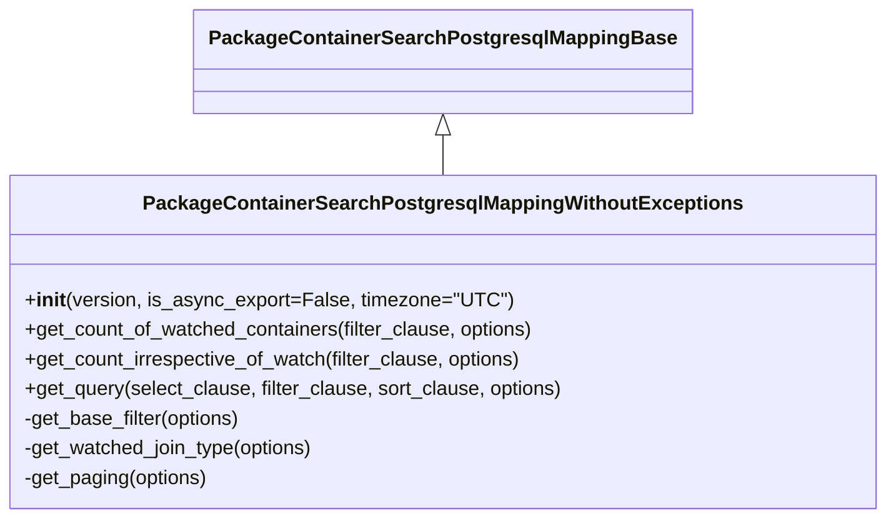

# Diagram: partview_core/partview_service/partview_service/persistence_adapter/postgresql/package_container/PackageContainerSearchPostgresqlMappingWithoutExceptions.py


> Auto-generated by Obscura crawlers

## Diagram 1



### SVG

<svg id="container" width="706.9921875" xmlns="http://www.w3.org/2000/svg" class="classDiagram" height="420" viewBox="0 0 706.9921875 420" role="graphics-document document" aria-roledescription="class"><style>#container{font-family:"trebuchet ms",verdana,arial,sans-serif;font-size:16px;fill:#333;}@keyframes edge-animation-frame{from{stroke-dashoffset:0;}}@keyframes dash{to{stroke-dashoffset:0;}}#container .edge-animation-slow{stroke-dasharray:9,5!important;stroke-dashoffset:900;animation:dash 50s linear infinite;stroke-linecap:round;}#container .edge-animation-fast{stroke-dasharray:9,5!important;stroke-dashoffset:900;animation:dash 20s linear infinite;stroke-linecap:round;}#container .error-icon{fill:#552222;}#container .error-text{fill:#552222;stroke:#552222;}#container .edge-thickness-normal{stroke-width:1px;}#container .edge-thickness-thick{stroke-width:3.5px;}#container .edge-pattern-solid{stroke-dasharray:0;}#container .edge-thickness-invisible{stroke-width:0;fill:none;}#container .edge-pattern-dashed{stroke-dasharray:3;}#container .edge-pattern-dotted{stroke-dasharray:2;}#container .marker{fill:#333333;stroke:#333333;}#container .marker.cross{stroke:#333333;}#container svg{font-family:"trebuchet ms",verdana,arial,sans-serif;font-size:16px;}#container p{margin:0;}#container g.classGroup text{fill:#9370DB;stroke:none;font-family:"trebuchet ms",verdana,arial,sans-serif;font-size:10px;}#container g.classGroup text .title{font-weight:bolder;}#container .nodeLabel,#container .edgeLabel{color:#131300;}#container .edgeLabel .label rect{fill:#ECECFF;}#container .label text{fill:#131300;}#container .labelBkg{background:#ECECFF;}#container .edgeLabel .label span{background:#ECECFF;}#container .classTitle{font-weight:bolder;}#container .node rect,#container .node circle,#container .node ellipse,#container .node polygon,#container .node path{fill:#ECECFF;stroke:#9370DB;stroke-width:1px;}#container .divider{stroke:#9370DB;stroke-width:1;}#container g.clickable{cursor:pointer;}#container g.classGroup rect{fill:#ECECFF;stroke:#9370DB;}#container g.classGroup line{stroke:#9370DB;stroke-width:1;}#container .classLabel .box{stroke:none;stroke-width:0;fill:#ECECFF;opacity:0.5;}#container .classLabel .label{fill:#9370DB;font-size:10px;}#container .relation{stroke:#333333;stroke-width:1;fill:none;}#container .dashed-line{stroke-dasharray:3;}#container .dotted-line{stroke-dasharray:1 2;}#container #compositionStart,#container .composition{fill:#333333!important;stroke:#333333!important;stroke-width:1;}#container #compositionEnd,#container .composition{fill:#333333!important;stroke:#333333!important;stroke-width:1;}#container #dependencyStart,#container .dependency{fill:#333333!important;stroke:#333333!important;stroke-width:1;}#container #dependencyStart,#container .dependency{fill:#333333!important;stroke:#333333!important;stroke-width:1;}#container #extensionStart,#container .extension{fill:transparent!important;stroke:#333333!important;stroke-width:1;}#container #extensionEnd,#container .extension{fill:transparent!important;stroke:#333333!important;stroke-width:1;}#container #aggregationStart,#container .aggregation{fill:transparent!important;stroke:#333333!important;stroke-width:1;}#container #aggregationEnd,#container .aggregation{fill:transparent!important;stroke:#333333!important;stroke-width:1;}#container #lollipopStart,#container .lollipop{fill:#ECECFF!important;stroke:#333333!important;stroke-width:1;}#container #lollipopEnd,#container .lollipop{fill:#ECECFF!important;stroke:#333333!important;stroke-width:1;}#container .edgeTerminals{font-size:11px;line-height:initial;}#container .classTitleText{text-anchor:middle;font-size:18px;fill:#333;}#container .label-icon{display:inline-block;height:1em;overflow:visible;vertical-align:-0.125em;}#container .node .label-icon path{fill:currentColor;stroke:revert;stroke-width:revert;}#container :root{--mermaid-font-family:"trebuchet ms",verdana,arial,sans-serif;}</style><g><defs><marker id="container_class-aggregationStart" class="marker aggregation class" refX="18" refY="7" markerWidth="190" markerHeight="240" orient="auto"><path d="M 18,7 L9,13 L1,7 L9,1 Z"></path></marker></defs><defs><marker id="container_class-aggregationEnd" class="marker aggregation class" refX="1" refY="7" markerWidth="20" markerHeight="28" orient="auto"><path d="M 18,7 L9,13 L1,7 L9,1 Z"></path></marker></defs><defs><marker id="container_class-extensionStart" class="marker extension class" refX="18" refY="7" markerWidth="190" markerHeight="240" orient="auto"><path d="M 1,7 L18,13 V 1 Z"></path></marker></defs><defs><marker id="container_class-extensionEnd" class="marker extension class" refX="1" refY="7" markerWidth="20" markerHeight="28" orient="auto"><path d="M 1,1 V 13 L18,7 Z"></path></marker></defs><defs><marker id="container_class-compositionStart" class="marker composition class" refX="18" refY="7" markerWidth="190" markerHeight="240" orient="auto"><path d="M 18,7 L9,13 L1,7 L9,1 Z"></path></marker></defs><defs><marker id="container_class-compositionEnd" class="marker composition class" refX="1" refY="7" markerWidth="20" markerHeight="28" orient="auto"><path d="M 18,7 L9,13 L1,7 L9,1 Z"></path></marker></defs><defs><marker id="container_class-dependencyStart" class="marker dependency class" refX="6" refY="7" markerWidth="190" markerHeight="240" orient="auto"><path d="M 5,7 L9,13 L1,7 L9,1 Z"></path></marker></defs><defs><marker id="container_class-dependencyEnd" class="marker dependency class" refX="13" refY="7" markerWidth="20" markerHeight="28" orient="auto"><path d="M 18,7 L9,13 L14,7 L9,1 Z"></path></marker></defs><defs><marker id="container_class-lollipopStart" class="marker lollipop class" refX="13" refY="7" markerWidth="190" markerHeight="240" orient="auto"><circle stroke="black" fill="transparent" cx="7" cy="7" r="6"></circle></marker></defs><defs><marker id="container_class-lollipopEnd" class="marker lollipop class" refX="1" refY="7" markerWidth="190" markerHeight="240" orient="auto"><circle stroke="black" fill="transparent" cx="7" cy="7" r="6"></circle></marker></defs><g class="root"><g class="clusters"></g><g class="edgePaths"><path d="M353.496,109.25L353.496,110.542C353.496,111.833,353.496,114.417,353.496,119.875C353.496,125.333,353.496,133.667,353.496,137.833L353.496,142" id="id_PackageContainerSearchPostgresqlMappingBase_PackageContainerSearchPostgresqlMappingWithoutExceptions_1" class="edge-thickness-normal edge-pattern-solid relation" style=";;;" data-edge="true" data-et="edge" data-id="id_PackageContainerSearchPostgresqlMappingBase_PackageContainerSearchPostgresqlMappingWithoutExceptions_1" data-points="W3sieCI6MzUzLjQ5NjA5Mzc1LCJ5Ijo5Mn0seyJ4IjozNTMuNDk2MDkzNzUsInkiOjExN30seyJ4IjozNTMuNDk2MDkzNzUsInkiOjE0Mn1d" marker-start="url(#container_class-extensionStart)"></path></g><g class="edgeLabels"><g class="edgeLabel"><g class="label" data-id="id_PackageContainerSearchPostgresqlMappingBase_PackageContainerSearchPostgresqlMappingWithoutExceptions_1" transform="translate(0, 0)"><foreignObject width="0" height="0"><div xmlns="http://www.w3.org/1999/xhtml" class="labelBkg" style="display: table-cell; white-space: nowrap; line-height: 1.5; max-width: 200px; text-align: center;"><span class="edgeLabel"></span></div></foreignObject></g></g></g><g class="nodes"><g class="node default" id="classId-PackageContainerSearchPostgresqlMappingBase-0" transform="translate(353.49609375, 50)"><g class="basic label-container"><path d="M-190.0859375 -42 L190.0859375 -42 L190.0859375 42 L-190.0859375 42" stroke="none" stroke-width="0" fill="#ECECFF" style=""></path><path d="M-190.0859375 -42 C-108.78705720616183 -42, -27.488176912323667 -42, 190.0859375 -42 M-190.0859375 -42 C-87.17137521029309 -42, 15.743187079413815 -42, 190.0859375 -42 M190.0859375 -42 C190.0859375 -23.331937430582446, 190.0859375 -4.663874861164892, 190.0859375 42 M190.0859375 -42 C190.0859375 -15.32640935903931, 190.0859375 11.34718128192138, 190.0859375 42 M190.0859375 42 C66.46625674816167 42, -57.15342400367666 42, -190.0859375 42 M190.0859375 42 C85.8834840882565 42, -18.31896932348701 42, -190.0859375 42 M-190.0859375 42 C-190.0859375 23.41816381070743, -190.0859375 4.83632762141486, -190.0859375 -42 M-190.0859375 42 C-190.0859375 10.051592661492116, -190.0859375 -21.89681467701577, -190.0859375 -42" stroke="#9370DB" stroke-width="1.3" fill="none" stroke-dasharray="0 0" style=""></path></g><g class="annotation-group text" transform="translate(0, -18)"></g><g class="label-group text" transform="translate(-178.0859375, -18)"><g class="label" style="font-weight: bolder" transform="translate(0,-12)"><foreignObject width="356.171875" height="24"><div xmlns="http://www.w3.org/1999/xhtml" style="display: table-cell; white-space: nowrap; line-height: 1.5; max-width: 400px; text-align: center;"><span class="nodeLabel markdown-node-label" style=""><p>PackageContainerSearchPostgresqlMappingBase</p></span></div></foreignObject></g></g><g class="members-group text" transform="translate(-178.0859375, 30)"></g><g class="methods-group text" transform="translate(-178.0859375, 60)"></g><g class="divider" style=""><path d="M-190.0859375 6 C-109.96432069951159 6, -29.842703899023178 6, 190.0859375 6 M-190.0859375 6 C-76.25873870495857 6, 37.56846009008285 6, 190.0859375 6" stroke="#9370DB" stroke-width="1.3" fill="none" stroke-dasharray="0 0" style=""></path></g><g class="divider" style=""><path d="M-190.0859375 24 C-50.7363505025111 24, 88.6132364949778 24, 190.0859375 24 M-190.0859375 24 C-108.49170333439996 24, -26.897469168799915 24, 190.0859375 24" stroke="#9370DB" stroke-width="1.3" fill="none" stroke-dasharray="0 0" style=""></path></g></g><g class="node default" id="classId-PackageContainerSearchPostgresqlMappingWithoutExceptions-1" transform="translate(353.49609375, 277)"><g class="basic label-container"><path d="M-345.49609375 -135 L345.49609375 -135 L345.49609375 135 L-345.49609375 135" stroke="none" stroke-width="0" fill="#ECECFF" style=""></path><path d="M-345.49609375 -135 C-151.71750452928626 -135, 42.06108469142748 -135, 345.49609375 -135 M-345.49609375 -135 C-145.74553677529332 -135, 54.005020199413366 -135, 345.49609375 -135 M345.49609375 -135 C345.49609375 -52.11162699905192, 345.49609375 30.776746001896157, 345.49609375 135 M345.49609375 -135 C345.49609375 -51.368372153952365, 345.49609375 32.26325569209527, 345.49609375 135 M345.49609375 135 C184.59677705660755 135, 23.6974603632151 135, -345.49609375 135 M345.49609375 135 C188.57615664353025 135, 31.656219537060508 135, -345.49609375 135 M-345.49609375 135 C-345.49609375 47.65973273948468, -345.49609375 -39.68053452103064, -345.49609375 -135 M-345.49609375 135 C-345.49609375 75.74752151032897, -345.49609375 16.495043020657945, -345.49609375 -135" stroke="#9370DB" stroke-width="1.3" fill="none" stroke-dasharray="0 0" style=""></path></g><g class="annotation-group text" transform="translate(0, -111)"></g><g class="label-group text" transform="translate(-229.1953125, -111)"><g class="label" style="font-weight: bolder" transform="translate(0,-12)"><foreignObject width="458.390625" height="24"><div xmlns="http://www.w3.org/1999/xhtml" style="display: table-cell; white-space: nowrap; line-height: 1.5; max-width: 501px; text-align: center;"><span class="nodeLabel markdown-node-label" style=""><p>PackageContainerSearchPostgresqlMappingWithoutExceptions</p></span></div></foreignObject></g></g><g class="members-group text" transform="translate(-333.49609375, -63)"></g><g class="methods-group text" transform="translate(-333.49609375, -33)"><g class="label" style="" transform="translate(0,-12)"><foreignObject width="386.6875" height="24"><div xmlns="http://www.w3.org/1999/xhtml" style="display: table-cell; white-space: nowrap; line-height: 1.5; max-width: 475px; text-align: center;"><span class="nodeLabel markdown-node-label" style=""><p>+<strong>init</strong>(version, is_async_export=False, timezone="UTC")</p></span></div></foreignObject></g><g class="label" style="" transform="translate(0,12)"><foreignObject width="416.296875" height="24"><div xmlns="http://www.w3.org/1999/xhtml" style="display: table-cell; white-space: nowrap; line-height: 1.5; max-width: 474px; text-align: center;"><span class="nodeLabel markdown-node-label" style=""><p>+get_count_of_watched_containers(filter_clause, options)</p></span></div></foreignObject></g><g class="label" style="" transform="translate(0,36)"><foreignObject width="406.84375" height="24"><div xmlns="http://www.w3.org/1999/xhtml" style="display: table-cell; white-space: nowrap; line-height: 1.5; max-width: 464px; text-align: center;"><span class="nodeLabel markdown-node-label" style=""><p>+get_count_irrespective_of_watch(filter_clause, options)</p></span></div></foreignObject></g><g class="label" style="" transform="translate(0,60)"><foreignObject width="437.796875" height="24"><div xmlns="http://www.w3.org/1999/xhtml" style="display: table-cell; white-space: nowrap; line-height: 1.5; max-width: 495px; text-align: center;"><span class="nodeLabel markdown-node-label" style=""><p>+get_query(select_clause, filter_clause, sort_clause, options)</p></span></div></foreignObject></g><g class="label" style="" transform="translate(0,84)"><foreignObject width="179.109375" height="24"><div xmlns="http://www.w3.org/1999/xhtml" style="display: table-cell; white-space: nowrap; line-height: 1.5; max-width: 236px; text-align: center;"><span class="nodeLabel markdown-node-label" style=""><p>-get_base_filter(options)</p></span></div></foreignObject></g><g class="label" style="" transform="translate(0,108)"><foreignObject width="239.9375" height="24"><div xmlns="http://www.w3.org/1999/xhtml" style="display: table-cell; white-space: nowrap; line-height: 1.5; max-width: 297px; text-align: center;"><span class="nodeLabel markdown-node-label" style=""><p>-get_watched_join_type(options)</p></span></div></foreignObject></g><g class="label" style="" transform="translate(0,132)"><foreignObject width="151.453125" height="24"><div xmlns="http://www.w3.org/1999/xhtml" style="display: table-cell; white-space: nowrap; line-height: 1.5; max-width: 209px; text-align: center;"><span class="nodeLabel markdown-node-label" style=""><p>-get_paging(options)</p></span></div></foreignObject></g></g><g class="divider" style=""><path d="M-345.49609375 -87 C-72.41159709554194 -87, 200.67289955891613 -87, 345.49609375 -87 M-345.49609375 -87 C-194.7180884752697 -87, -43.94008320053939 -87, 345.49609375 -87" stroke="#9370DB" stroke-width="1.3" fill="none" stroke-dasharray="0 0" style=""></path></g><g class="divider" style=""><path d="M-345.49609375 -63 C-102.99781833149422 -63, 139.50045708701157 -63, 345.49609375 -63 M-345.49609375 -63 C-174.71435724672213 -63, -3.932620743444261 -63, 345.49609375 -63" stroke="#9370DB" stroke-width="1.3" fill="none" stroke-dasharray="0 0" style=""></path></g></g></g></g></g></svg>

## Diagram 2

```mermaid
flowchart LR
    A[__init__(version, is_async_export, timezone)] --> B[get_base_filter(options)]
    B --> C[get_watched_join_type(options)]
    C --> D[get_paging(options)]
    subgraph CountWatched["get_count_of_watched_containers"]
        CW1["build base_filter"] --> CW2["construct SELECT COUNT(*) FROM package_container"]
        CW2 --> CW3["INNER JOIN package_container_user_watch ON container_id and user_id"]
        CW3 --> CW4["append base_filter and filter_clause"]
    end
    subgraph CountIrrespective["get_count_irrespective_of_watch"]
        CI1["build base_filter"] --> CI2["construct SELECT COUNT(*) FROM package_container"]
        CI2 --> CI3["append base_filter and filter_clause"]
    end
    subgraph Query["get_query"]
        Q1["determine watch_join_type"] --> Q2["build CTE BLAH selecting package_container.id"]
        Q2 --> Q3["apply base_filter and filter_clause and sort_clause and paging"]
        Q3 --> Q4["select from package_container JOIN BLAH"]
        Q4 --> Q5["apply watch_join_type JOIN package_container_user_watch"]
        Q5 --> Q6["LEFT JOIN origin_trip_leg, destination_trip_leg"]
        Q6 --> Q7["LEFT JOIN last_milestone, last_event, package_container_type"]
        Q7 --> Q8["append sort_clause"]
    end
    A --> CountWatched
    A --> CountIrrespective
    A --> Query
```

> SVG rendering failed for this diagram.
