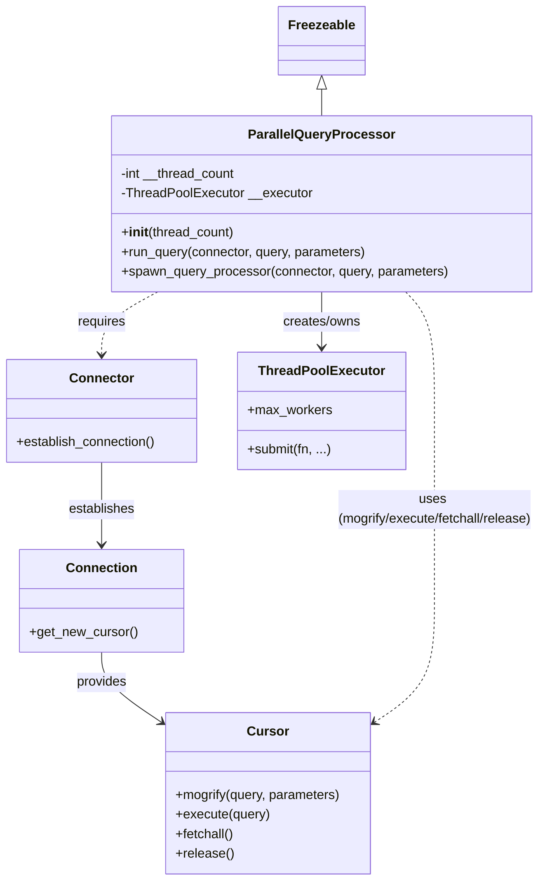

# Diagram: partview_core/partview_service/partview_service/persistence_adapter/postgresql/utility/ParallelQueryProcessor.py

> Auto-generated by Obscura crawlers

## Mermaid

### SVG

<svg id="container" width="662.2890625" xmlns="http://www.w3.org/2000/svg" class="classDiagram" height="1080" viewBox="0 0 662.2890625 1080" role="graphics-document document" aria-roledescription="class"><g><defs><marker id="container_class-aggregationStart" class="marker aggregation class" refX="18" refY="7" markerWidth="190" markerHeight="240" orient="auto"><path d="M 18,7 L9,13 L1,7 L9,1 Z"></path></marker></defs><defs><marker id="container_class-aggregationEnd" class="marker aggregation class" refX="1" refY="7" markerWidth="20" markerHeight="28" orient="auto"><path d="M 18,7 L9,13 L1,7 L9,1 Z"></path></marker></defs><defs><marker id="container_class-extensionStart" class="marker extension class" refX="18" refY="7" markerWidth="190" markerHeight="240" orient="auto"><path d="M 1,7 L18,13 V 1 Z"></path></marker></defs><defs><marker id="container_class-extensionEnd" class="marker extension class" refX="1" refY="7" markerWidth="20" markerHeight="28" orient="auto"><path d="M 1,1 V 13 L18,7 Z"></path></marker></defs><defs><marker id="container_class-compositionStart" class="marker composition class" refX="18" refY="7" markerWidth="190" markerHeight="240" orient="auto"><path d="M 18,7 L9,13 L1,7 L9,1 Z"></path></marker></defs><defs><marker id="container_class-compositionEnd" class="marker composition class" refX="1" refY="7" markerWidth="20" markerHeight="28" orient="auto"><path d="M 18,7 L9,13 L1,7 L9,1 Z"></path></marker></defs><defs><marker id="container_class-dependencyStart" class="marker dependency class" refX="6" refY="7" markerWidth="190" markerHeight="240" orient="auto"><path d="M 5,7 L9,13 L1,7 L9,1 Z"></path></marker></defs><defs><marker id="container_class-dependencyEnd" class="marker dependency class" refX="13" refY="7" markerWidth="20" markerHeight="28" orient="auto"><path d="M 18,7 L9,13 L14,7 L9,1 Z"></path></marker></defs><defs><marker id="container_class-lollipopStart" class="marker lollipop class" refX="13" refY="7" markerWidth="190" markerHeight="240" orient="auto"><circle stroke="black" fill="transparent" cx="7" cy="7" r="6"></circle></marker></defs><defs><marker id="container_class-lollipopEnd" class="marker lollipop class" refX="1" refY="7" markerWidth="190" markerHeight="240" orient="auto"><circle stroke="black" fill="transparent" cx="7" cy="7" r="6"></circle></marker></defs><g class="root"><g class="clusters"></g><g class="edgePaths"><path d="M393.098,109.25L393.098,110.542C393.098,111.833,393.098,114.417,393.098,119.875C393.098,125.333,393.098,133.667,393.098,137.833L393.098,142" id="id_Freezeable_ParallelQueryProcessor_1" class="edge-thickness-normal edge-pattern-solid relation" style=";;;" data-edge="true" data-et="edge" data-id="id_Freezeable_ParallelQueryProcessor_1" data-points="W3sieCI6MzkzLjA5NzY1NjI1LCJ5Ijo5Mn0seyJ4IjozOTMuMDk3NjU2MjUsInkiOjExN30seyJ4IjozOTMuMDk3NjU2MjUsInkiOjE0Mn1d" marker-start="url(#container_class-extensionStart)"></path><path d="M393.098,358L393.098,364.167C393.098,370.333,393.098,382.667,393.098,394C393.098,405.333,393.098,415.667,393.098,420.833L393.098,426" id="id_ParallelQueryProcessor_ThreadPoolExecutor_2" class="edge-thickness-normal edge-pattern-solid relation" style=";;;" data-edge="true" data-et="edge" data-id="id_ParallelQueryProcessor_ThreadPoolExecutor_2" data-points="W3sieCI6MzkzLjA5NzY1NjI1LCJ5IjozNTh9LHsieCI6MzkzLjA5NzY1NjI1LCJ5IjozOTV9LHsieCI6MzkzLjA5NzY1NjI1LCJ5Ijo0MzJ9XQ==" marker-end="url(#container_class-dependencyEnd)"></path><path d="M193.667,358L182.28,364.167C170.893,370.333,148.118,382.667,136.731,395.5C125.344,408.333,125.344,421.667,125.344,428.333L125.344,435" id="id_ParallelQueryProcessor_Connector_3" class="edge-thickness-normal edge-pattern-dashed relation" style=";;;" data-edge="true" data-et="edge" data-id="id_ParallelQueryProcessor_Connector_3" data-points="W3sieCI6MTkzLjY2NzE2MDU2MDM0NDgzLCJ5IjozNTh9LHsieCI6MTI1LjM0Mzc1LCJ5IjozOTV9LHsieCI6MTI1LjM0Mzc1LCJ5Ijo0NDF9XQ==" marker-end="url(#container_class-dependencyEnd)"></path><path d="M125.344,567L125.344,576.667C125.344,586.333,125.344,605.667,125.344,622.5C125.344,639.333,125.344,653.667,125.344,660.833L125.344,668" id="id_Connector_Connection_4" class="edge-thickness-normal edge-pattern-solid relation" style=";;;" data-edge="true" data-et="edge" data-id="id_Connector_Connection_4" data-points="W3sieCI6MTI1LjM0Mzc1LCJ5Ijo1Njd9LHsieCI6MTI1LjM0Mzc1LCJ5Ijo2MjV9LHsieCI6MTI1LjM0Mzc1LCJ5Ijo2NzR9XQ==" marker-end="url(#container_class-dependencyEnd)"></path><path d="M125.344,800L125.344,806.167C125.344,812.333,125.344,824.667,137.019,838.71C148.695,852.754,172.046,868.508,183.722,876.385L195.397,884.263" id="id_Connection_Cursor_5" class="edge-thickness-normal edge-pattern-solid relation" style=";;;" data-edge="true" data-et="edge" data-id="id_Connection_Cursor_5" data-points="W3sieCI6MTI1LjM0Mzc1LCJ5Ijo4MDB9LHsieCI6MTI1LjM0Mzc1LCJ5Ijo4Mzd9LHsieCI6MjAwLjM3MTA5Mzc1LCJ5Ijo4ODcuNjE4MTk1OTExMjQ4OX1d" marker-end="url(#container_class-dependencyEnd)"></path><path d="M493.955,358L499.714,364.167C505.473,370.333,516.99,382.667,522.749,407C528.508,431.333,528.508,467.667,528.508,506C528.508,544.333,528.508,584.667,528.508,623.5C528.508,662.333,528.508,699.667,528.508,735C528.508,770.333,528.508,803.667,516.832,828.21C505.157,852.754,481.805,868.508,470.13,876.385L458.454,884.263" id="id_ParallelQueryProcessor_Cursor_6" class="edge-thickness-normal edge-pattern-dashed relation" style=";;;" data-edge="true" data-et="edge" data-id="id_ParallelQueryProcessor_Cursor_6" data-points="W3sieCI6NDkzLjk1NDg3NjA3NzU4NjIsInkiOjM1OH0seyJ4Ijo1MjguNTA3ODEyNSwieSI6Mzk1fSx7IngiOjUyOC41MDc4MTI1LCJ5Ijo1MDR9LHsieCI6NTI4LjUwNzgxMjUsInkiOjYyNX0seyJ4Ijo1MjguNTA3ODEyNSwieSI6NzM3fSx7IngiOjUyOC41MDc4MTI1LCJ5Ijo4Mzd9LHsieCI6NDUzLjQ4MDQ2ODc1LCJ5Ijo4ODcuNjE4MTk1OTExMjQ4OX1d" marker-end="url(#container_class-dependencyEnd)"></path></g><g class="edgeLabels"><g class="edgeLabel"><g class="label" data-id="id_Freezeable_ParallelQueryProcessor_1" transform="translate(0, 0)"><foreignObject width="0" height="0">

</foreignObject></g></g><g class="edgeLabel" transform="translate(393.09765625, 395)"><g class="label" data-id="id_ParallelQueryProcessor_ThreadPoolExecutor_2" transform="translate(-48.765625, -12)"><foreignObject width="97.53125" height="24">

creates/owns

</foreignObject></g></g><g class="edgeLabel" transform="translate(125.34375, 395)"><g class="label" data-id="id_ParallelQueryProcessor_Connector_3" transform="translate(-29.8515625, -12)"><foreignObject width="59.703125" height="24">

requires

</foreignObject></g></g><g class="edgeLabel" transform="translate(125.34375, 625)"><g class="label" data-id="id_Connector_Connection_4" transform="translate(-41.15625, -12)"><foreignObject width="82.3125" height="24">

establishes

</foreignObject></g></g><g class="edgeLabel" transform="translate(125.34375, 837)"><g class="label" data-id="id_Connection_Cursor_5" transform="translate(-31.3125, -12)"><foreignObject width="62.625" height="24">

provides

</foreignObject></g></g><g class="edgeLabel" transform="translate(528.5078125, 625)"><g class="label" data-id="id_ParallelQueryProcessor_Cursor_6" transform="translate(-125.78125, -24)"><foreignObject width="251.5625" height="48">

uses (mogrify/execute/fetchall/release)

</foreignObject></g></g></g><g class="nodes"><g class="node default" id="classId-ParallelQueryProcessor-0" transform="translate(393.09765625, 250)"><g class="basic label-container"><path d="M-256.76171875 -108 L256.76171875 -108 L256.76171875 108 L-256.76171875 108" stroke="none" stroke-width="0" fill="#ECECFF" style=""></path><path d="M-256.76171875 -108 C-147.60898749972347 -108, -38.45625624944691 -108, 256.76171875 -108 M-256.76171875 -108 C-95.29238925739955 -108, 66.1769402352009 -108, 256.76171875 -108 M256.76171875 -108 C256.76171875 -35.43730873376626, 256.76171875 37.12538253246748, 256.76171875 108 M256.76171875 -108 C256.76171875 -60.80115065339684, 256.76171875 -13.602301306793677, 256.76171875 108 M256.76171875 108 C107.00997420452188 108, -42.741770340956236 108, -256.76171875 108 M256.76171875 108 C58.50525255241786 108, -139.75121364516428 108, -256.76171875 108 M-256.76171875 108 C-256.76171875 21.66891477372097, -256.76171875 -64.66217045255806, -256.76171875 -108 M-256.76171875 108 C-256.76171875 48.64703589756421, -256.76171875 -10.705928204871583, -256.76171875 -108" stroke="#9370DB" stroke-width="1.3" fill="none" stroke-dasharray="0 0" style=""></path></g><g class="annotation-group text" transform="translate(0, -84)"></g><g class="label-group text" transform="translate(-85.2890625, -84)"><g class="label" style="font-weight: bolder" transform="translate(0,-12)"><foreignObject width="170.578125" height="24">

ParallelQueryProcessor

</foreignObject></g></g><g class="members-group text" transform="translate(-244.76171875, -36)"><g class="label" style="" transform="translate(0,-12)"><foreignObject width="143.34375" height="24">

-int __thread_count

</foreignObject></g><g class="label" style="" transform="translate(0,12)"><foreignObject width="233.9375" height="24">

-ThreadPoolExecutor __executor

</foreignObject></g></g><g class="methods-group text" transform="translate(-244.76171875, 36)"><g class="label" style="" transform="translate(0,-12)"><foreignObject width="139.609375" height="24">

+<strong>init</strong>(thread_count)

</foreignObject></g><g class="label" style="" transform="translate(0,12)"><foreignObject width="304.078125" height="24">

+run_query(connector, query, parameters)

</foreignObject></g><g class="label" style="" transform="translate(0,36)"><foreignObject width="404.234375" height="24">

+spawn_query_processor(connector, query, parameters)

</foreignObject></g></g><g class="divider" style=""><path d="M-256.76171875 -60 C-112.57397300584609 -60, 31.61377273830783 -60, 256.76171875 -60 M-256.76171875 -60 C-83.83897208232136 -60, 89.08377458535728 -60, 256.76171875 -60" stroke="#9370DB" stroke-width="1.3" fill="none" stroke-dasharray="0 0" style=""></path></g><g class="divider" style=""><path d="M-256.76171875 12 C-137.59753320795414 12, -18.433347665908258 12, 256.76171875 12 M-256.76171875 12 C-52.142516276094824 12, 152.47668619781035 12, 256.76171875 12" stroke="#9370DB" stroke-width="1.3" fill="none" stroke-dasharray="0 0" style=""></path></g></g><g class="node default" id="classId-Freezeable-1" transform="translate(393.09765625, 50)"><g class="basic label-container"><path d="M-51.1953125 -42 L51.1953125 -42 L51.1953125 42 L-51.1953125 42" stroke="none" stroke-width="0" fill="#ECECFF" style=""></path><path d="M-51.1953125 -42 C-27.800401445869664 -42, -4.4054903917393275 -42, 51.1953125 -42 M-51.1953125 -42 C-17.97620620749047 -42, 15.242900085019059 -42, 51.1953125 -42 M51.1953125 -42 C51.1953125 -9.173159579345509, 51.1953125 23.653680841308983, 51.1953125 42 M51.1953125 -42 C51.1953125 -9.385881919943799, 51.1953125 23.228236160112402, 51.1953125 42 M51.1953125 42 C14.545635153879743 42, -22.104042192240513 42, -51.1953125 42 M51.1953125 42 C19.630818127256468 42, -11.933676245487064 42, -51.1953125 42 M-51.1953125 42 C-51.1953125 12.394347354722342, -51.1953125 -17.211305290555316, -51.1953125 -42 M-51.1953125 42 C-51.1953125 15.221599788886493, -51.1953125 -11.556800422227013, -51.1953125 -42" stroke="#9370DB" stroke-width="1.3" fill="none" stroke-dasharray="0 0" style=""></path></g><g class="annotation-group text" transform="translate(0, -18)"></g><g class="label-group text" transform="translate(-39.1953125, -18)"><g class="label" style="font-weight: bolder" transform="translate(0,-12)"><foreignObject width="78.390625" height="24">

Freezeable

</foreignObject></g></g><g class="members-group text" transform="translate(-39.1953125, 30)"></g><g class="methods-group text" transform="translate(-39.1953125, 60)"></g><g class="divider" style=""><path d="M-51.1953125 6 C-28.940171447386827 6, -6.685030394773655 6, 51.1953125 6 M-51.1953125 6 C-20.2496483775168 6, 10.696015744966402 6, 51.1953125 6" stroke="#9370DB" stroke-width="1.3" fill="none" stroke-dasharray="0 0" style=""></path></g><g class="divider" style=""><path d="M-51.1953125 24 C-17.709774268236785 24, 15.77576396352643 24, 51.1953125 24 M-51.1953125 24 C-28.68722771663368 24, -6.179142933267357 24, 51.1953125 24" stroke="#9370DB" stroke-width="1.3" fill="none" stroke-dasharray="0 0" style=""></path></g></g><g class="node default" id="classId-Connector-2" transform="translate(125.34375, 504)"><g class="basic label-container"><path d="M-117.34375 -63 L117.34375 -63 L117.34375 63 L-117.34375 63" stroke="none" stroke-width="0" fill="#ECECFF" style=""></path><path d="M-117.34375 -63 C-33.17741256540218 -63, 50.98892486919564 -63, 117.34375 -63 M-117.34375 -63 C-34.76465532163864 -63, 47.814439356722716 -63, 117.34375 -63 M117.34375 -63 C117.34375 -28.119442239684908, 117.34375 6.7611155206301845, 117.34375 63 M117.34375 -63 C117.34375 -12.883483786802735, 117.34375 37.23303242639453, 117.34375 63 M117.34375 63 C35.945940977892334 63, -45.45186804421533 63, -117.34375 63 M117.34375 63 C64.90927583397209 63, 12.474801667944178 63, -117.34375 63 M-117.34375 63 C-117.34375 17.777244861863238, -117.34375 -27.445510276273524, -117.34375 -63 M-117.34375 63 C-117.34375 24.470312811543096, -117.34375 -14.059374376913809, -117.34375 -63" stroke="#9370DB" stroke-width="1.3" fill="none" stroke-dasharray="0 0" style=""></path></g><g class="annotation-group text" transform="translate(0, -39)"></g><g class="label-group text" transform="translate(-37.421875, -39)"><g class="label" style="font-weight: bolder" transform="translate(0,-12)"><foreignObject width="74.84375" height="24">

Connector

</foreignObject></g></g><g class="members-group text" transform="translate(-105.34375, 9)"></g><g class="methods-group text" transform="translate(-105.34375, 39)"><g class="label" style="" transform="translate(0,-12)"><foreignObject width="173.265625" height="24">

+establish_connection()

</foreignObject></g></g><g class="divider" style=""><path d="M-117.34375 -15 C-65.13255331974467 -15, -12.921356639489346 -15, 117.34375 -15 M-117.34375 -15 C-44.98040951909141 -15, 27.38293096181718 -15, 117.34375 -15" stroke="#9370DB" stroke-width="1.3" fill="none" stroke-dasharray="0 0" style=""></path></g><g class="divider" style=""><path d="M-117.34375 9 C-39.02701982997546 9, 39.28971034004908 9, 117.34375 9 M-117.34375 9 C-55.15443043573909 9, 7.034889128521826 9, 117.34375 9" stroke="#9370DB" stroke-width="1.3" fill="none" stroke-dasharray="0 0" style=""></path></g></g><g class="node default" id="classId-Connection-3" transform="translate(125.34375, 737)"><g class="basic label-container"><path d="M-98.72265625 -63 L98.72265625 -63 L98.72265625 63 L-98.72265625 63" stroke="none" stroke-width="0" fill="#ECECFF" style=""></path><path d="M-98.72265625 -63 C-52.56175050463041 -63, -6.400844759260821 -63, 98.72265625 -63 M-98.72265625 -63 C-23.254130451832438 -63, 52.214395346335124 -63, 98.72265625 -63 M98.72265625 -63 C98.72265625 -31.939073460534033, 98.72265625 -0.8781469210680655, 98.72265625 63 M98.72265625 -63 C98.72265625 -34.38458360408265, 98.72265625 -5.769167208165307, 98.72265625 63 M98.72265625 63 C30.479007637138466 63, -37.76464097572307 63, -98.72265625 63 M98.72265625 63 C26.21233576942997 63, -46.29798471114006 63, -98.72265625 63 M-98.72265625 63 C-98.72265625 31.990543565322845, -98.72265625 0.9810871306456903, -98.72265625 -63 M-98.72265625 63 C-98.72265625 32.26566173928782, -98.72265625 1.5313234785756435, -98.72265625 -63" stroke="#9370DB" stroke-width="1.3" fill="none" stroke-dasharray="0 0" style=""></path></g><g class="annotation-group text" transform="translate(0, -39)"></g><g class="label-group text" transform="translate(-41.2265625, -39)"><g class="label" style="font-weight: bolder" transform="translate(0,-12)"><foreignObject width="82.453125" height="24">

Connection

</foreignObject></g></g><g class="members-group text" transform="translate(-86.72265625, 9)"></g><g class="methods-group text" transform="translate(-86.72265625, 39)"><g class="label" style="" transform="translate(0,-12)"><foreignObject width="132.21875" height="24">

+get_new_cursor()

</foreignObject></g></g><g class="divider" style=""><path d="M-98.72265625 -15 C-47.08819371412454 -15, 4.546268821750914 -15, 98.72265625 -15 M-98.72265625 -15 C-29.15268516897973 -15, 40.41728591204054 -15, 98.72265625 -15" stroke="#9370DB" stroke-width="1.3" fill="none" stroke-dasharray="0 0" style=""></path></g><g class="divider" style=""><path d="M-98.72265625 9 C-53.615576625241694 9, -8.508497000483388 9, 98.72265625 9 M-98.72265625 9 C-27.165325363717315 9, 44.39200552256537 9, 98.72265625 9" stroke="#9370DB" stroke-width="1.3" fill="none" stroke-dasharray="0 0" style=""></path></g></g><g class="node default" id="classId-Cursor-4" transform="translate(326.92578125, 973)"><g class="basic label-container"><path d="M-126.5546875 -99 L126.5546875 -99 L126.5546875 99 L-126.5546875 99" stroke="none" stroke-width="0" fill="#ECECFF" style=""></path><path d="M-126.5546875 -99 C-75.01615394697038 -99, -23.477620393940768 -99, 126.5546875 -99 M-126.5546875 -99 C-50.2078334084928 -99, 26.139020683014394 -99, 126.5546875 -99 M126.5546875 -99 C126.5546875 -50.63357333966381, 126.5546875 -2.267146679327624, 126.5546875 99 M126.5546875 -99 C126.5546875 -25.122154283946145, 126.5546875 48.75569143210771, 126.5546875 99 M126.5546875 99 C34.31737794358894 99, -57.919931612822126 99, -126.5546875 99 M126.5546875 99 C73.08660561047736 99, 19.618523720954713 99, -126.5546875 99 M-126.5546875 99 C-126.5546875 44.29830732555555, -126.5546875 -10.403385348888904, -126.5546875 -99 M-126.5546875 99 C-126.5546875 22.762113340056743, -126.5546875 -53.475773319886514, -126.5546875 -99" stroke="#9370DB" stroke-width="1.3" fill="none" stroke-dasharray="0 0" style=""></path></g><g class="annotation-group text" transform="translate(0, -75)"></g><g class="label-group text" transform="translate(-23.90625, -75)"><g class="label" style="font-weight: bolder" transform="translate(0,-12)"><foreignObject width="47.8125" height="24">

Cursor

</foreignObject></g></g><g class="members-group text" transform="translate(-114.5546875, -27)"></g><g class="methods-group text" transform="translate(-114.5546875, 3)"><g class="label" style="" transform="translate(0,-12)"><foreignObject width="205.203125" height="24">

+mogrify(query, parameters)

</foreignObject></g><g class="label" style="" transform="translate(0,12)"><foreignObject width="115.96875" height="24">

+execute(query)

</foreignObject></g><g class="label" style="" transform="translate(0,36)"><foreignObject width="72.515625" height="24">

+fetchall()

</foreignObject></g><g class="label" style="" transform="translate(0,60)"><foreignObject width="70.6875" height="24">

+release()

</foreignObject></g></g><g class="divider" style=""><path d="M-126.5546875 -51 C-68.19878012244087 -51, -9.842872744881745 -51, 126.5546875 -51 M-126.5546875 -51 C-41.681582185062084 -51, 43.19152312987583 -51, 126.5546875 -51" stroke="#9370DB" stroke-width="1.3" fill="none" stroke-dasharray="0 0" style=""></path></g><g class="divider" style=""><path d="M-126.5546875 -27 C-31.322680570733127 -27, 63.90932635853375 -27, 126.5546875 -27 M-126.5546875 -27 C-57.6044250080423 -27, 11.345837483915403 -27, 126.5546875 -27" stroke="#9370DB" stroke-width="1.3" fill="none" stroke-dasharray="0 0" style=""></path></g></g><g class="node default" id="classId-ThreadPoolExecutor-5" transform="translate(393.09765625, 504)"><g class="basic label-container"><path d="M-100.41015625 -72 L100.41015625 -72 L100.41015625 72 L-100.41015625 72" stroke="none" stroke-width="0" fill="#ECECFF" style=""></path><path d="M-100.41015625 -72 C-32.115935259631996 -72, 36.17828573073601 -72, 100.41015625 -72 M-100.41015625 -72 C-30.62898715788033 -72, 39.15218193423934 -72, 100.41015625 -72 M100.41015625 -72 C100.41015625 -35.041151266114326, 100.41015625 1.9176974677713474, 100.41015625 72 M100.41015625 -72 C100.41015625 -14.540303748021742, 100.41015625 42.919392503956516, 100.41015625 72 M100.41015625 72 C29.47798609213318 72, -41.45418406573364 72, -100.41015625 72 M100.41015625 72 C29.189723614618813 72, -42.03070902076237 72, -100.41015625 72 M-100.41015625 72 C-100.41015625 24.57109820242772, -100.41015625 -22.85780359514456, -100.41015625 -72 M-100.41015625 72 C-100.41015625 17.4371567840386, -100.41015625 -37.1256864319228, -100.41015625 -72" stroke="#9370DB" stroke-width="1.3" fill="none" stroke-dasharray="0 0" style=""></path></g><g class="annotation-group text" transform="translate(0, -48)"></g><g class="label-group text" transform="translate(-73.4765625, -48)"><g class="label" style="font-weight: bolder" transform="translate(0,-12)"><foreignObject width="146.953125" height="24">

ThreadPoolExecutor

</foreignObject></g></g><g class="members-group text" transform="translate(-88.41015625, 0)"><g class="label" style="" transform="translate(0,-12)"><foreignObject width="103.34375" height="24">

+max_workers

</foreignObject></g></g><g class="methods-group text" transform="translate(-88.41015625, 48)"><g class="label" style="" transform="translate(0,-12)"><foreignObject width="102.984375" height="24">

+submit(fn, ...)

</foreignObject></g></g><g class="divider" style=""><path d="M-100.41015625 -24 C-38.734687395146885 -24, 22.94078145970623 -24, 100.41015625 -24 M-100.41015625 -24 C-29.44922323352712 -24, 41.51170978294576 -24, 100.41015625 -24" stroke="#9370DB" stroke-width="1.3" fill="none" stroke-dasharray="0 0" style=""></path></g><g class="divider" style=""><path d="M-100.41015625 24 C-26.908528059688877 24, 46.59310013062225 24, 100.41015625 24 M-100.41015625 24 C-37.360234112862855 24, 25.68968802427429 24, 100.41015625 24" stroke="#9370DB" stroke-width="1.3" fill="none" stroke-dasharray="0 0" style=""></path></g></g></g></g></g></svg>
