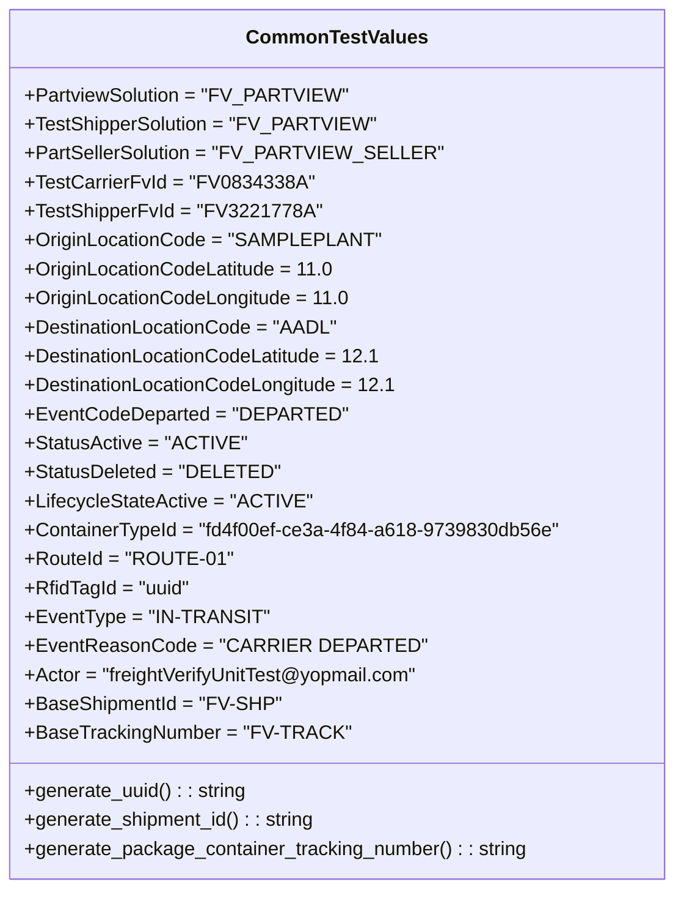

# Diagram: partview_core/partview_service/partview_service/tests/common/CommonTestValues.py

> Auto-generated by Obscura crawlers

## Mermaid

### SVG

<svg id="container" width="548.6484375" xmlns="http://www.w3.org/2000/svg" class="classDiagram" height="736" viewBox="0 0 548.6484375 736" role="graphics-document document" aria-roledescription="class"><g><defs><marker id="container_class-aggregationStart" class="marker aggregation class" refX="18" refY="7" markerWidth="190" markerHeight="240" orient="auto"><path d="M 18,7 L9,13 L1,7 L9,1 Z"></path></marker></defs><defs><marker id="container_class-aggregationEnd" class="marker aggregation class" refX="1" refY="7" markerWidth="20" markerHeight="28" orient="auto"><path d="M 18,7 L9,13 L1,7 L9,1 Z"></path></marker></defs><defs><marker id="container_class-extensionStart" class="marker extension class" refX="18" refY="7" markerWidth="190" markerHeight="240" orient="auto"><path d="M 1,7 L18,13 V 1 Z"></path></marker></defs><defs><marker id="container_class-extensionEnd" class="marker extension class" refX="1" refY="7" markerWidth="20" markerHeight="28" orient="auto"><path d="M 1,1 V 13 L18,7 Z"></path></marker></defs><defs><marker id="container_class-compositionStart" class="marker composition class" refX="18" refY="7" markerWidth="190" markerHeight="240" orient="auto"><path d="M 18,7 L9,13 L1,7 L9,1 Z"></path></marker></defs><defs><marker id="container_class-compositionEnd" class="marker composition class" refX="1" refY="7" markerWidth="20" markerHeight="28" orient="auto"><path d="M 18,7 L9,13 L1,7 L9,1 Z"></path></marker></defs><defs><marker id="container_class-dependencyStart" class="marker dependency class" refX="6" refY="7" markerWidth="190" markerHeight="240" orient="auto"><path d="M 5,7 L9,13 L1,7 L9,1 Z"></path></marker></defs><defs><marker id="container_class-dependencyEnd" class="marker dependency class" refX="13" refY="7" markerWidth="20" markerHeight="28" orient="auto"><path d="M 18,7 L9,13 L14,7 L9,1 Z"></path></marker></defs><defs><marker id="container_class-lollipopStart" class="marker lollipop class" refX="13" refY="7" markerWidth="190" markerHeight="240" orient="auto"><circle stroke="black" fill="transparent" cx="7" cy="7" r="6"></circle></marker></defs><defs><marker id="container_class-lollipopEnd" class="marker lollipop class" refX="1" refY="7" markerWidth="190" markerHeight="240" orient="auto"><circle stroke="black" fill="transparent" cx="7" cy="7" r="6"></circle></marker></defs><g class="root"><g class="clusters"></g><g class="edgePaths"></g><g class="edgeLabels"></g><g class="nodes"><g class="node default" id="classId-CommonTestValues-0" transform="translate(274.32421875, 368)"><g class="basic label-container"><path d="M-266.32421875 -360 L266.32421875 -360 L266.32421875 360 L-266.32421875 360" stroke="none" stroke-width="0" fill="#ECECFF" style=""></path><path d="M-266.32421875 -360 C-78.73861032135659 -360, 108.84699810728682 -360, 266.32421875 -360 M-266.32421875 -360 C-123.77103059371862 -360, 18.78215756256276 -360, 266.32421875 -360 M266.32421875 -360 C266.32421875 -119.15588252809894, 266.32421875 121.68823494380212, 266.32421875 360 M266.32421875 -360 C266.32421875 -181.88966720523518, 266.32421875 -3.779334410470369, 266.32421875 360 M266.32421875 360 C139.52375683720211 360, 12.723294924404229 360, -266.32421875 360 M266.32421875 360 C86.05293278760729 360, -94.21835317478542 360, -266.32421875 360 M-266.32421875 360 C-266.32421875 211.79568863731257, -266.32421875 63.59137727462513, -266.32421875 -360 M-266.32421875 360 C-266.32421875 74.99707949387897, -266.32421875 -210.00584101224206, -266.32421875 -360" stroke="#9370DB" stroke-width="1.3" fill="none" stroke-dasharray="0 0" style=""></path></g><g class="annotation-group text" transform="translate(0, -336)"></g><g class="label-group text" transform="translate(-70.9453125, -336)"><g class="label" style="font-weight: bolder" transform="translate(0,-12)"><foreignObject width="141.890625" height="24">

CommonTestValues

</foreignObject></g></g><g class="members-group text" transform="translate(-254.32421875, -288)"><g class="label" style="" transform="translate(0,-12)"><foreignObject width="254.6875" height="24">

+PartviewSolution = "FV_PARTVIEW"

</foreignObject></g><g class="label" style="" transform="translate(0,12)"><foreignObject width="278.1875" height="24">

+TestShipperSolution = "FV_PARTVIEW"

</foreignObject></g><g class="label" style="" transform="translate(0,36)"><foreignObject width="322.3125" height="24">

+PartSellerSolution = "FV_PARTVIEW_SELLER"

</foreignObject></g><g class="label" style="" transform="translate(0,60)"><foreignObject width="228.625" height="24">

+TestCarrierFvId = "FV0834338A"

</foreignObject></g><g class="label" style="" transform="translate(0,84)"><foreignObject width="230.109375" height="24">

+TestShipperFvId = "FV3221778A"

</foreignObject></g><g class="label" style="" transform="translate(0,108)"><foreignObject width="281.46875" height="24">

+OriginLocationCode = "SAMPLEPLANT"

</foreignObject></g><g class="label" style="" transform="translate(0,132)"><foreignObject width="253.203125" height="24">

+OriginLocationCodeLatitude = 11.0

</foreignObject></g><g class="label" style="" transform="translate(0,156)"><foreignObject width="265.53125" height="24">

+OriginLocationCodeLongitude = 11.0

</foreignObject></g><g class="label" style="" transform="translate(0,180)"><foreignObject width="254.03125" height="24">

+DestinationLocationCode = "AADL"

</foreignObject></g><g class="label" style="" transform="translate(0,204)"><foreignObject width="290.921875" height="24">

+DestinationLocationCodeLatitude = 12.1

</foreignObject></g><g class="label" style="" transform="translate(0,228)"><foreignObject width="303.234375" height="24">

+DestinationLocationCodeLongitude = 12.1

</foreignObject></g><g class="label" style="" transform="translate(0,252)"><foreignObject width="253.375" height="24">

+EventCodeDeparted = "DEPARTED"

</foreignObject></g><g class="label" style="" transform="translate(0,276)"><foreignObject width="173.65625" height="24">

+StatusActive = "ACTIVE"

</foreignObject></g><g class="label" style="" transform="translate(0,300)"><foreignObject width="200.953125" height="24">

+StatusDeleted = "DELETED"

</foreignObject></g><g class="label" style="" transform="translate(0,324)"><foreignObject width="228.828125" height="24">

+LifecycleStateActive = "ACTIVE"

</foreignObject></g><g class="label" style="" transform="translate(0,348)"><foreignObject width="437.703125" height="24">

+ContainerTypeId = "fd4f00ef-ce3a-4f84-a618-9739830db56e"

</foreignObject></g><g class="label" style="" transform="translate(0,372)"><foreignObject width="163.5" height="24">

+RouteId = "ROUTE-01"

</foreignObject></g><g class="label" style="" transform="translate(0,396)"><foreignObject width="137.015625" height="24">

+RfidTagId = "uuid"

</foreignObject></g><g class="label" style="" transform="translate(0,420)"><foreignObject width="192.109375" height="24">

+EventType = "IN-TRANSIT"

</foreignObject></g><g class="label" style="" transform="translate(0,444)"><foreignObject width="303.71875" height="24">

+EventReasonCode = "CARRIER DEPARTED"

</foreignObject></g><g class="label" style="" transform="translate(0,468)"><foreignObject width="331.859375" height="24">

+Actor = "freightVerifyUnitTest@yopmail.com"

</foreignObject></g><g class="label" style="" transform="translate(0,492)"><foreignObject width="206.75" height="24">

+BaseShipmentId = "FV-SHP"

</foreignObject></g><g class="label" style="" transform="translate(0,516)"><foreignObject width="257.5625" height="24">

+BaseTrackingNumber = "FV-TRACK"

</foreignObject></g></g><g class="methods-group text" transform="translate(-254.32421875, 288)"><g class="label" style="" transform="translate(0,-12)"><foreignObject width="184.234375" height="24">

+generate_uuid() : : string

</foreignObject></g><g class="label" style="" transform="translate(0,12)"><foreignObject width="242.703125" height="24">

+generate_shipment_id() : : string

</foreignObject></g><g class="label" style="" transform="translate(0,36)"><foreignObject width="417.75" height="24">

+generate_package_container_tracking_number() : : string

</foreignObject></g></g><g class="divider" style=""><path d="M-266.32421875 -312 C-89.28870154263566 -312, 87.74681566472867 -312, 266.32421875 -312 M-266.32421875 -312 C-80.03131664891282 -312, 106.26158545217436 -312, 266.32421875 -312" stroke="#9370DB" stroke-width="1.3" fill="none" stroke-dasharray="0 0" style=""></path></g><g class="divider" style=""><path d="M-266.32421875 264 C-86.96233338327238 264, 92.39955198345524 264, 266.32421875 264 M-266.32421875 264 C-110.44447812825777 264, 45.43526249348446 264, 266.32421875 264" stroke="#9370DB" stroke-width="1.3" fill="none" stroke-dasharray="0 0" style=""></path></g></g></g></g></g></svg>
