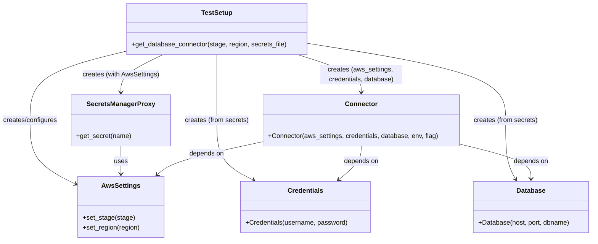
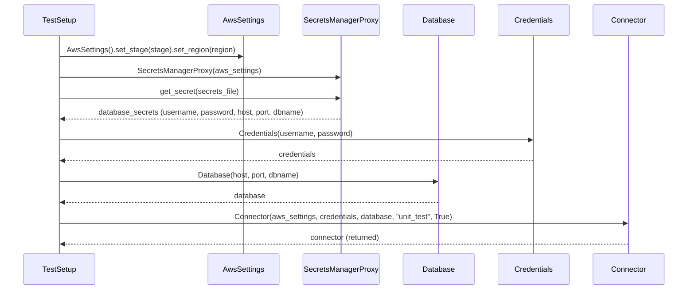

# Diagram: partview_core/partview_service/partview_service/tests/common/TestSetup.py

> Auto-generated by Obscura crawlers

## Diagram 1

### SVG

<svg id="container" width="1444.5703125" xmlns="http://www.w3.org/2000/svg" class="classDiagram" height="590" viewBox="0 0 1444.5703125 590" role="graphics-document document" aria-roledescription="class"><g><defs><marker id="container_class-aggregationStart" class="marker aggregation class" refX="18" refY="7" markerWidth="190" markerHeight="240" orient="auto"><path d="M 18,7 L9,13 L1,7 L9,1 Z"></path></marker></defs><defs><marker id="container_class-aggregationEnd" class="marker aggregation class" refX="1" refY="7" markerWidth="20" markerHeight="28" orient="auto"><path d="M 18,7 L9,13 L1,7 L9,1 Z"></path></marker></defs><defs><marker id="container_class-extensionStart" class="marker extension class" refX="18" refY="7" markerWidth="190" markerHeight="240" orient="auto"><path d="M 1,7 L18,13 V 1 Z"></path></marker></defs><defs><marker id="container_class-extensionEnd" class="marker extension class" refX="1" refY="7" markerWidth="20" markerHeight="28" orient="auto"><path d="M 1,1 V 13 L18,7 Z"></path></marker></defs><defs><marker id="container_class-compositionStart" class="marker composition class" refX="18" refY="7" markerWidth="190" markerHeight="240" orient="auto"><path d="M 18,7 L9,13 L1,7 L9,1 Z"></path></marker></defs><defs><marker id="container_class-compositionEnd" class="marker composition class" refX="1" refY="7" markerWidth="20" markerHeight="28" orient="auto"><path d="M 18,7 L9,13 L1,7 L9,1 Z"></path></marker></defs><defs><marker id="container_class-dependencyStart" class="marker dependency class" refX="6" refY="7" markerWidth="190" markerHeight="240" orient="auto"><path d="M 5,7 L9,13 L1,7 L9,1 Z"></path></marker></defs><defs><marker id="container_class-dependencyEnd" class="marker dependency class" refX="13" refY="7" markerWidth="20" markerHeight="28" orient="auto"><path d="M 18,7 L9,13 L14,7 L9,1 Z"></path></marker></defs><defs><marker id="container_class-lollipopStart" class="marker lollipop class" refX="13" refY="7" markerWidth="190" markerHeight="240" orient="auto"><circle stroke="black" fill="transparent" cx="7" cy="7" r="6"></circle></marker></defs><defs><marker id="container_class-lollipopEnd" class="marker lollipop class" refX="1" refY="7" markerWidth="190" markerHeight="240" orient="auto"><circle stroke="black" fill="transparent" cx="7" cy="7" r="6"></circle></marker></defs><g class="root"><g class="clusters"></g><g class="edgePaths"><path d="M308.188,125.335L269.362,134.946C230.536,144.557,152.885,163.778,114.06,192.056C75.234,220.333,75.234,257.667,75.234,293C75.234,328.333,75.234,361.667,93.666,387.69C112.098,413.713,148.962,432.425,167.394,441.781L185.826,451.138" id="id_TestSetup_AwsSettings_1" class="edge-thickness-normal edge-pattern-solid relation" style=";;;" data-edge="true" data-et="edge" data-id="id_TestSetup_AwsSettings_1" data-points="W3sieCI6MzA4LjE4NzUsInkiOjEyNS4zMzQ5MTAzODQzNjMwMX0seyJ4Ijo3NS4yMzQzNzUsInkiOjE4M30seyJ4Ijo3NS4yMzQzNzUsInkiOjI5NX0seyJ4Ijo3NS4yMzQzNzUsInkiOjM5NX0seyJ4IjoxOTEuMTc1NzgxMjUsInkiOjQ1My44NTMzMzg5OTg2NTQ0Nn1d" marker-end="url(#container_class-dependencyEnd)"></path><path d="M397.293,134L380.39,142.167C363.487,150.333,329.681,166.667,312.778,182C295.875,197.333,295.875,211.667,295.875,218.833L295.875,226" id="id_TestSetup_SecretsManagerProxy_2" class="edge-thickness-normal edge-pattern-solid relation" style=";;;" data-edge="true" data-et="edge" data-id="id_TestSetup_SecretsManagerProxy_2" data-points="W3sieCI6Mzk3LjI5Mjk2ODc1LCJ5IjoxMzR9LHsieCI6Mjk1Ljg3NSwieSI6MTgzfSx7IngiOjI5NS44NzUsInkiOjIzMn1d" marker-end="url(#container_class-dependencyEnd)"></path><path d="M527.688,134L527.688,142.167C527.688,150.333,527.688,166.667,527.688,193.5C527.688,220.333,527.688,257.667,527.688,293C527.688,328.333,527.688,361.667,542.568,386.04C557.448,410.414,587.208,425.827,602.088,433.534L616.968,441.241" id="id_TestSetup_Credentials_3" class="edge-thickness-normal edge-pattern-solid relation" style=";;;" data-edge="true" data-et="edge" data-id="id_TestSetup_Credentials_3" data-points="W3sieCI6NTI3LjY4NzUsInkiOjEzNH0seyJ4Ijo1MjcuNjg3NSwieSI6MTgzfSx7IngiOjUyNy42ODc1LCJ5IjoyOTV9LHsieCI6NTI3LjY4NzUsInkiOjM5NX0seyJ4Ijo2MjIuMjk2MDIwNTA3ODEyNSwieSI6NDQ0fV0=" marker-end="url(#container_class-dependencyEnd)"></path><path d="M747.188,105.886L828.055,118.738C908.922,131.59,1070.656,157.295,1151.523,188.814C1232.391,220.333,1232.391,257.667,1232.391,293C1232.391,328.333,1232.391,361.667,1236.49,385.628C1240.59,409.59,1248.79,424.18,1252.89,431.475L1256.99,438.769" id="id_TestSetup_Database_4" class="edge-thickness-normal edge-pattern-solid relation" style=";;;" data-edge="true" data-et="edge" data-id="id_TestSetup_Database_4" data-points="W3sieCI6NzQ3LjE4NzUsInkiOjEwNS44ODU2MTIyOTI0MTAzN30seyJ4IjoxMjMyLjM5MDYyNSwieSI6MTgzfSx7IngiOjEyMzIuMzkwNjI1LCJ5IjoyOTV9LHsieCI6MTIzMi4zOTA2MjUsInkiOjM5NX0seyJ4IjoxMjU5LjkyOTE5OTIxODc1LCJ5Ijo0NDR9XQ==" marker-end="url(#container_class-dependencyEnd)"></path><path d="M725.885,134L751.578,142.167C777.27,150.333,828.654,166.667,854.347,182C880.039,197.333,880.039,211.667,880.039,218.833L880.039,226" id="id_TestSetup_Connector_5" class="edge-thickness-normal edge-pattern-solid relation" style=";;;" data-edge="true" data-et="edge" data-id="id_TestSetup_Connector_5" data-points="W3sieCI6NzI1Ljg4NTI1MzkwNjI1LCJ5IjoxMzR9LHsieCI6ODgwLjAzOTA2MjUsInkiOjE4M30seyJ4Ijo4ODAuMDM5MDYyNSwieSI6MjMyfV0=" marker-end="url(#container_class-dependencyEnd)"></path><path d="M295.875,358L295.875,364.167C295.875,370.333,295.875,382.667,295.875,394C295.875,405.333,295.875,415.667,295.875,420.833L295.875,426" id="id_SecretsManagerProxy_AwsSettings_6" class="edge-thickness-normal edge-pattern-solid relation" style=";;;" data-edge="true" data-et="edge" data-id="id_SecretsManagerProxy_AwsSettings_6" data-points="W3sieCI6Mjk1Ljg3NSwieSI6MzU4fSx7IngiOjI5NS44NzUsInkiOjM5NX0seyJ4IjoyOTUuODc1LCJ5Ijo0MzJ9XQ==" marker-end="url(#container_class-dependencyEnd)"></path><path d="M641.094,346.943L604.249,354.953C567.405,362.962,493.716,378.981,450.778,392.487C407.841,405.994,395.654,416.987,389.561,422.484L383.468,427.981" id="id_Connector_AwsSettings_7" class="edge-thickness-normal edge-pattern-solid relation" style=";;;" data-edge="true" data-et="edge" data-id="id_Connector_AwsSettings_7" data-points="W3sieCI6NjQxLjA5Mzc1LCJ5IjozNDYuOTQzMzA5ODY4MTI0OTd9LHsieCI6NDIwLjAyNzM0Mzc1LCJ5IjozOTV9LHsieCI6Mzc5LjAxMjczMDE4OTczMjEsInkiOjQzMn1d" marker-end="url(#container_class-dependencyEnd)"></path><path d="M880.039,358L880.039,364.167C880.039,370.333,880.039,382.667,870.887,396.365C861.735,410.062,843.431,425.125,834.279,432.656L825.127,440.187" id="id_Connector_Credentials_8" class="edge-thickness-normal edge-pattern-solid relation" style=";;;" data-edge="true" data-et="edge" data-id="id_Connector_Credentials_8" data-points="W3sieCI6ODgwLjAzOTA2MjUsInkiOjM1OH0seyJ4Ijo4ODAuMDM5MDYyNSwieSI6Mzk1fSx7IngiOjgyMC40OTM3NzQ0MTQwNjI1LCJ5Ijo0NDR9XQ==" marker-end="url(#container_class-dependencyEnd)"></path><path d="M1118.984,352.536L1148.376,359.613C1177.768,366.691,1236.552,380.845,1265.944,395.089C1295.336,409.333,1295.336,423.667,1295.336,430.833L1295.336,438" id="id_Connector_Database_9" class="edge-thickness-normal edge-pattern-solid relation" style=";;;" data-edge="true" data-et="edge" data-id="id_Connector_Database_9" data-points="W3sieCI6MTExOC45ODQzNzUsInkiOjM1Mi41MzYwMjQ2ODExMzkyfSx7IngiOjEyOTUuMzM1OTM3NSwieSI6Mzk1fSx7IngiOjEyOTUuMzM1OTM3NSwieSI6NDQ0fV0=" marker-end="url(#container_class-dependencyEnd)"></path></g><g class="edgeLabels"><g class="edgeLabel" transform="translate(75.234375, 295)"><g class="label" data-id="id_TestSetup_AwsSettings_1" transform="translate(-67.234375, -12)"><foreignObject width="134.46875" height="24">

creates/configures

</foreignObject></g></g><g class="edgeLabel" transform="translate(295.875, 183)"><g class="label" data-id="id_TestSetup_SecretsManagerProxy_2" transform="translate(-94.5, -12)"><foreignObject width="189" height="24">

creates (with AwsSettings)

</foreignObject></g></g><g class="edgeLabel" transform="translate(527.6875, 295)"><g class="label" data-id="id_TestSetup_Credentials_3" transform="translate(-78.40625, -12)"><foreignObject width="156.8125" height="24">

creates (from secrets)

</foreignObject></g></g><g class="edgeLabel" transform="translate(1232.390625, 295)"><g class="label" data-id="id_TestSetup_Database_4" transform="translate(-78.40625, -12)"><foreignObject width="156.8125" height="24">

creates (from secrets)

</foreignObject></g></g><g class="edgeLabel" transform="translate(880.0390625, 183)"><g class="label" data-id="id_TestSetup_Connector_5" transform="translate(-100, -24)"><foreignObject width="200" height="48">

creates (aws_settings, credentials, database)

</foreignObject></g></g><g class="edgeLabel" transform="translate(295.875, 395)"><g class="label" data-id="id_SecretsManagerProxy_AwsSettings_6" transform="translate(-16.4921875, -12)"><foreignObject width="32.984375" height="24">

uses

</foreignObject></g></g><g class="edgeLabel" transform="translate(503.57205, 376.83857)"><g class="label" data-id="id_Connector_AwsSettings_7" transform="translate(-42.9453125, -12)"><foreignObject width="85.890625" height="24">

depends on

</foreignObject></g></g><g class="edgeLabel" transform="translate(880.0390625, 395)"><g class="label" data-id="id_Connector_Credentials_8" transform="translate(-42.9453125, -12)"><foreignObject width="85.890625" height="24">

depends on

</foreignObject></g></g><g class="edgeLabel" transform="translate(1295.3359375, 395)"><g class="label" data-id="id_Connector_Database_9" transform="translate(-42.9453125, -12)"><foreignObject width="85.890625" height="24">

depends on

</foreignObject></g></g></g><g class="nodes"><g class="node default" id="classId-TestSetup-0" transform="translate(527.6875, 71)"><g class="basic label-container"><path d="M-219.5 -63 L219.5 -63 L219.5 63 L-219.5 63" stroke="none" stroke-width="0" fill="#ECECFF" style=""></path><path d="M-219.5 -63 C-54.15633445786324 -63, 111.18733108427352 -63, 219.5 -63 M-219.5 -63 C-85.56019966805812 -63, 48.379600663883764 -63, 219.5 -63 M219.5 -63 C219.5 -21.22910269758382, 219.5 20.54179460483236, 219.5 63 M219.5 -63 C219.5 -16.99252583372865, 219.5 29.0149483325427, 219.5 63 M219.5 63 C54.807051605484446 63, -109.88589678903111 63, -219.5 63 M219.5 63 C54.33886560712733 63, -110.82226878574534 63, -219.5 63 M-219.5 63 C-219.5 31.148779635493877, -219.5 -0.7024407290122454, -219.5 -63 M-219.5 63 C-219.5 29.176972336681942, -219.5 -4.646055326636116, -219.5 -63" stroke="#9370DB" stroke-width="1.3" fill="none" stroke-dasharray="0 0" style=""></path></g><g class="annotation-group text" transform="translate(0, -39)"></g><g class="label-group text" transform="translate(-36.6875, -39)"><g class="label" style="font-weight: bolder" transform="translate(0,-12)"><foreignObject width="73.375" height="24">

TestSetup

</foreignObject></g></g><g class="members-group text" transform="translate(-207.5, 9)"></g><g class="methods-group text" transform="translate(-207.5, 39)"><g class="label" style="" transform="translate(0,-12)"><foreignObject width="378.3125" height="24">

+get_database_connector(stage, region, secrets_file)

</foreignObject></g></g><g class="divider" style=""><path d="M-219.5 -15 C-68.7582159017766 -15, 81.98356819644681 -15, 219.5 -15 M-219.5 -15 C-57.522277868775745 -15, 104.45544426244851 -15, 219.5 -15" stroke="#9370DB" stroke-width="1.3" fill="none" stroke-dasharray="0 0" style=""></path></g><g class="divider" style=""><path d="M-219.5 9 C-50.27780838080736 9, 118.94438323838529 9, 219.5 9 M-219.5 9 C-47.641779079567584 9, 124.21644184086483 9, 219.5 9" stroke="#9370DB" stroke-width="1.3" fill="none" stroke-dasharray="0 0" style=""></path></g></g><g class="node default" id="classId-AwsSettings-1" transform="translate(295.875, 507)"><g class="basic label-container"><path d="M-104.69921875 -75 L104.69921875 -75 L104.69921875 75 L-104.69921875 75" stroke="none" stroke-width="0" fill="#ECECFF" style=""></path><path d="M-104.69921875 -75 C-34.73396651516353 -75, 35.23128571967294 -75, 104.69921875 -75 M-104.69921875 -75 C-21.75836571413774 -75, 61.18248732172452 -75, 104.69921875 -75 M104.69921875 -75 C104.69921875 -22.59211783949941, 104.69921875 29.815764321001183, 104.69921875 75 M104.69921875 -75 C104.69921875 -27.085494609038562, 104.69921875 20.829010781922875, 104.69921875 75 M104.69921875 75 C45.783727466742725 75, -13.13176381651455 75, -104.69921875 75 M104.69921875 75 C23.796140992531463 75, -57.106936764937075 75, -104.69921875 75 M-104.69921875 75 C-104.69921875 42.29448469725857, -104.69921875 9.588969394517136, -104.69921875 -75 M-104.69921875 75 C-104.69921875 42.07530665644791, -104.69921875 9.150613312895814, -104.69921875 -75" stroke="#9370DB" stroke-width="1.3" fill="none" stroke-dasharray="0 0" style=""></path></g><g class="annotation-group text" transform="translate(0, -51)"></g><g class="label-group text" transform="translate(-44.8203125, -51)"><g class="label" style="font-weight: bolder" transform="translate(0,-12)"><foreignObject width="89.640625" height="24">

AwsSettings

</foreignObject></g></g><g class="members-group text" transform="translate(-92.69921875, -3)"></g><g class="methods-group text" transform="translate(-92.69921875, 27)"><g class="label" style="" transform="translate(0,-12)"><foreignObject width="125.578125" height="24">

+set_stage(stage)

</foreignObject></g><g class="label" style="" transform="translate(0,12)"><foreignObject width="140.578125" height="24">

+set_region(region)

</foreignObject></g></g><g class="divider" style=""><path d="M-104.69921875 -27 C-33.99177544755726 -27, 36.71566785488548 -27, 104.69921875 -27 M-104.69921875 -27 C-43.627873057355444 -27, 17.443472635289112 -27, 104.69921875 -27" stroke="#9370DB" stroke-width="1.3" fill="none" stroke-dasharray="0 0" style=""></path></g><g class="divider" style=""><path d="M-104.69921875 -3 C-32.295665342648064 -3, 40.10788806470387 -3, 104.69921875 -3 M-104.69921875 -3 C-23.66100058338401 -3, 57.37721758323198 -3, 104.69921875 -3" stroke="#9370DB" stroke-width="1.3" fill="none" stroke-dasharray="0 0" style=""></path></g></g><g class="node default" id="classId-SecretsManagerProxy-2" transform="translate(295.875, 295)"><g class="basic label-container"><path d="M-118.40625 -63 L118.40625 -63 L118.40625 63 L-118.40625 63" stroke="none" stroke-width="0" fill="#ECECFF" style=""></path><path d="M-118.40625 -63 C-68.23548398086231 -63, -18.06471796172461 -63, 118.40625 -63 M-118.40625 -63 C-60.596871387734794 -63, -2.7874927754695875 -63, 118.40625 -63 M118.40625 -63 C118.40625 -15.602769297369953, 118.40625 31.794461405260094, 118.40625 63 M118.40625 -63 C118.40625 -35.93675943091228, 118.40625 -8.873518861824564, 118.40625 63 M118.40625 63 C50.56323396249219 63, -17.279782075015618 63, -118.40625 63 M118.40625 63 C68.31578747274031 63, 18.225324945480608 63, -118.40625 63 M-118.40625 63 C-118.40625 25.223494714497498, -118.40625 -12.553010571005004, -118.40625 -63 M-118.40625 63 C-118.40625 23.929732112922636, -118.40625 -15.140535774154728, -118.40625 -63" stroke="#9370DB" stroke-width="1.3" fill="none" stroke-dasharray="0 0" style=""></path></g><g class="annotation-group text" transform="translate(0, -39)"></g><g class="label-group text" transform="translate(-79.03125, -39)"><g class="label" style="font-weight: bolder" transform="translate(0,-12)"><foreignObject width="158.0625" height="24">

SecretsManagerProxy

</foreignObject></g></g><g class="members-group text" transform="translate(-106.40625, 9)"></g><g class="methods-group text" transform="translate(-106.40625, 39)"><g class="label" style="" transform="translate(0,-12)"><foreignObject width="133.78125" height="24">

+get_secret(name)

</foreignObject></g></g><g class="divider" style=""><path d="M-118.40625 -15 C-70.06998508367477 -15, -21.73372016734953 -15, 118.40625 -15 M-118.40625 -15 C-29.55250048035633 -15, 59.30124903928734 -15, 118.40625 -15" stroke="#9370DB" stroke-width="1.3" fill="none" stroke-dasharray="0 0" style=""></path></g><g class="divider" style=""><path d="M-118.40625 9 C-51.37224443750837 9, 15.661761124983258 9, 118.40625 9 M-118.40625 9 C-62.956151427640854 9, -7.506052855281709 9, 118.40625 9" stroke="#9370DB" stroke-width="1.3" fill="none" stroke-dasharray="0 0" style=""></path></g></g><g class="node default" id="classId-Credentials-3" transform="translate(743.935546875, 507)"><g class="basic label-container"><path d="M-157.2578125 -63 L157.2578125 -63 L157.2578125 63 L-157.2578125 63" stroke="none" stroke-width="0" fill="#ECECFF" style=""></path><path d="M-157.2578125 -63 C-39.24049083933764 -63, 78.77683082132472 -63, 157.2578125 -63 M-157.2578125 -63 C-84.9466909585701 -63, -12.635569417140204 -63, 157.2578125 -63 M157.2578125 -63 C157.2578125 -15.29059423749348, 157.2578125 32.41881152501304, 157.2578125 63 M157.2578125 -63 C157.2578125 -32.9581253265855, 157.2578125 -2.916250653171012, 157.2578125 63 M157.2578125 63 C43.31497546497425 63, -70.6278615700515 63, -157.2578125 63 M157.2578125 63 C89.27181317727312 63, 21.285813854546234 63, -157.2578125 63 M-157.2578125 63 C-157.2578125 24.364187778062295, -157.2578125 -14.27162444387541, -157.2578125 -63 M-157.2578125 63 C-157.2578125 33.89498284264303, -157.2578125 4.789965685286056, -157.2578125 -63" stroke="#9370DB" stroke-width="1.3" fill="none" stroke-dasharray="0 0" style=""></path></g><g class="annotation-group text" transform="translate(0, -39)"></g><g class="label-group text" transform="translate(-41.609375, -39)"><g class="label" style="font-weight: bolder" transform="translate(0,-12)"><foreignObject width="83.21875" height="24">

Credentials

</foreignObject></g></g><g class="members-group text" transform="translate(-145.2578125, 9)"></g><g class="methods-group text" transform="translate(-145.2578125, 39)"><g class="label" style="" transform="translate(0,-12)"><foreignObject width="248.90625" height="24">

+Credentials(username, password)

</foreignObject></g></g><g class="divider" style=""><path d="M-157.2578125 -15 C-91.35536679771494 -15, -25.452921095429872 -15, 157.2578125 -15 M-157.2578125 -15 C-72.33869744609176 -15, 12.580417607816486 -15, 157.2578125 -15" stroke="#9370DB" stroke-width="1.3" fill="none" stroke-dasharray="0 0" style=""></path></g><g class="divider" style=""><path d="M-157.2578125 9 C-92.33245178483423 9, -27.407091069668468 9, 157.2578125 9 M-157.2578125 9 C-73.94956100719678 9, 9.358690485606445 9, 157.2578125 9" stroke="#9370DB" stroke-width="1.3" fill="none" stroke-dasharray="0 0" style=""></path></g></g><g class="node default" id="classId-Database-4" transform="translate(1295.3359375, 507)"><g class="basic label-container"><path d="M-141.234375 -63 L141.234375 -63 L141.234375 63 L-141.234375 63" stroke="none" stroke-width="0" fill="#ECECFF" style=""></path><path d="M-141.234375 -63 C-51.801290878339586 -63, 37.63179324332083 -63, 141.234375 -63 M-141.234375 -63 C-56.63034252142303 -63, 27.973689957153937 -63, 141.234375 -63 M141.234375 -63 C141.234375 -20.280584664476493, 141.234375 22.438830671047015, 141.234375 63 M141.234375 -63 C141.234375 -23.63763971020783, 141.234375 15.724720579584343, 141.234375 63 M141.234375 63 C84.46158645019227 63, 27.68879790038453 63, -141.234375 63 M141.234375 63 C77.86178621859258 63, 14.489197437185169 63, -141.234375 63 M-141.234375 63 C-141.234375 28.09596412046973, -141.234375 -6.808071759060539, -141.234375 -63 M-141.234375 63 C-141.234375 36.51139361020216, -141.234375 10.022787220404318, -141.234375 -63" stroke="#9370DB" stroke-width="1.3" fill="none" stroke-dasharray="0 0" style=""></path></g><g class="annotation-group text" transform="translate(0, -39)"></g><g class="label-group text" transform="translate(-34.171875, -39)"><g class="label" style="font-weight: bolder" transform="translate(0,-12)"><foreignObject width="68.34375" height="24">

Database

</foreignObject></g></g><g class="members-group text" transform="translate(-129.234375, 9)"></g><g class="methods-group text" transform="translate(-129.234375, 39)"><g class="label" style="" transform="translate(0,-12)"><foreignObject width="224.296875" height="24">

+Database(host, port, dbname)

</foreignObject></g></g><g class="divider" style=""><path d="M-141.234375 -15 C-41.942485073969635 -15, 57.34940485206073 -15, 141.234375 -15 M-141.234375 -15 C-82.48487688566632 -15, -23.73537877133265 -15, 141.234375 -15" stroke="#9370DB" stroke-width="1.3" fill="none" stroke-dasharray="0 0" style=""></path></g><g class="divider" style=""><path d="M-141.234375 9 C-47.83530279027934 9, 45.563769419441314 9, 141.234375 9 M-141.234375 9 C-54.78184371374357 9, 31.67068757251286 9, 141.234375 9" stroke="#9370DB" stroke-width="1.3" fill="none" stroke-dasharray="0 0" style=""></path></g></g><g class="node default" id="classId-Connector-5" transform="translate(880.0390625, 295)"><g class="basic label-container"><path d="M-238.9453125 -63 L238.9453125 -63 L238.9453125 63 L-238.9453125 63" stroke="none" stroke-width="0" fill="#ECECFF" style=""></path><path d="M-238.9453125 -63 C-50.84943884907989 -63, 137.24643480184022 -63, 238.9453125 -63 M-238.9453125 -63 C-96.1399511623033 -63, 46.66541017539339 -63, 238.9453125 -63 M238.9453125 -63 C238.9453125 -15.56781896470622, 238.9453125 31.86436207058756, 238.9453125 63 M238.9453125 -63 C238.9453125 -26.796944318075028, 238.9453125 9.406111363849945, 238.9453125 63 M238.9453125 63 C48.21373465693421 63, -142.51784318613159 63, -238.9453125 63 M238.9453125 63 C107.86123555055181 63, -23.222841398896378 63, -238.9453125 63 M-238.9453125 63 C-238.9453125 35.365920310054435, -238.9453125 7.731840620108876, -238.9453125 -63 M-238.9453125 63 C-238.9453125 36.67215975831785, -238.9453125 10.344319516635693, -238.9453125 -63" stroke="#9370DB" stroke-width="1.3" fill="none" stroke-dasharray="0 0" style=""></path></g><g class="annotation-group text" transform="translate(0, -39)"></g><g class="label-group text" transform="translate(-37.421875, -39)"><g class="label" style="font-weight: bolder" transform="translate(0,-12)"><foreignObject width="74.84375" height="24">

Connector

</foreignObject></g></g><g class="members-group text" transform="translate(-226.9453125, 9)"></g><g class="methods-group text" transform="translate(-226.9453125, 39)"><g class="label" style="" transform="translate(0,-12)"><foreignObject width="416.46875" height="24">

+Connector(aws_settings, credentials, database, env, flag)

</foreignObject></g></g><g class="divider" style=""><path d="M-238.9453125 -15 C-130.47796166988599 -15, -22.010610839771942 -15, 238.9453125 -15 M-238.9453125 -15 C-104.92450545283009 -15, 29.09630159433982 -15, 238.9453125 -15" stroke="#9370DB" stroke-width="1.3" fill="none" stroke-dasharray="0 0" style=""></path></g><g class="divider" style=""><path d="M-238.9453125 9 C-137.68691576686012 9, -36.42851903372025 9, 238.9453125 9 M-238.9453125 9 C-57.75609457803412 9, 123.43312334393175 9, 238.9453125 9" stroke="#9370DB" stroke-width="1.3" fill="none" stroke-dasharray="0 0" style=""></path></g></g></g></g></g></svg>

## Diagram 2

### SVG

<svg id="container" width="1499" xmlns="http://www.w3.org/2000/svg" height="651" viewBox="-50 -10 1499 651" role="graphics-document document" aria-roledescription="sequence"><g><rect x="1249" y="565" fill="#eaeaea" stroke="#666" width="150" height="65" name="CN" rx="3" ry="3" class="actor actor-bottom"></rect><text x="1324" y="597.5" dominant-baseline="central" alignment-baseline="central" class="actor actor-box" style="text-anchor: middle; font-size: 16px; font-weight: 400;"><tspan x="1324" dy="0">Connector</tspan></text></g><g><rect x="1049" y="565" fill="#eaeaea" stroke="#666" width="150" height="65" name="CR" rx="3" ry="3" class="actor actor-bottom"></rect><text x="1124" y="597.5" dominant-baseline="central" alignment-baseline="central" class="actor actor-box" style="text-anchor: middle; font-size: 16px; font-weight: 400;"><tspan x="1124" dy="0">Credentials</tspan></text></g><g><rect x="849" y="565" fill="#eaeaea" stroke="#666" width="150" height="65" name="DB" rx="3" ry="3" class="actor actor-bottom"></rect><text x="924" y="597.5" dominant-baseline="central" alignment-baseline="central" class="actor actor-box" style="text-anchor: middle; font-size: 16px; font-weight: 400;"><tspan x="924" dy="0">Database</tspan></text></g><g><rect x="625" y="565" fill="#eaeaea" stroke="#666" width="174" height="65" name="SM" rx="3" ry="3" class="actor actor-bottom"></rect><text x="712" y="597.5" dominant-baseline="central" alignment-baseline="central" class="actor actor-box" style="text-anchor: middle; font-size: 16px; font-weight: 400;"><tspan x="712" dy="0">SecretsManagerProxy</tspan></text></g><g><rect x="425" y="565" fill="#eaeaea" stroke="#666" width="150" height="65" name="AS" rx="3" ry="3" class="actor actor-bottom"></rect><text x="500" y="597.5" dominant-baseline="central" alignment-baseline="central" class="actor actor-box" style="text-anchor: middle; font-size: 16px; font-weight: 400;"><tspan x="500" dy="0">AwsSettings</tspan></text></g><g><rect x="0" y="565" fill="#eaeaea" stroke="#666" width="150" height="65" name="TS" rx="3" ry="3" class="actor actor-bottom"></rect><text x="75" y="597.5" dominant-baseline="central" alignment-baseline="central" class="actor actor-box" style="text-anchor: middle; font-size: 16px; font-weight: 400;"><tspan x="75" dy="0">TestSetup</tspan></text></g><g><line id="actor5" x1="1324" y1="65" x2="1324" y2="565" class="actor-line 200" stroke-width="0.5px" stroke="#999" name="CN"></line><g id="root-5"><rect x="1249" y="0" fill="#eaeaea" stroke="#666" width="150" height="65" name="CN" rx="3" ry="3" class="actor actor-top"></rect><text x="1324" y="32.5" dominant-baseline="central" alignment-baseline="central" class="actor actor-box" style="text-anchor: middle; font-size: 16px; font-weight: 400;"><tspan x="1324" dy="0">Connector</tspan></text></g></g><g><line id="actor4" x1="1124" y1="65" x2="1124" y2="565" class="actor-line 200" stroke-width="0.5px" stroke="#999" name="CR"></line><g id="root-4"><rect x="1049" y="0" fill="#eaeaea" stroke="#666" width="150" height="65" name="CR" rx="3" ry="3" class="actor actor-top"></rect><text x="1124" y="32.5" dominant-baseline="central" alignment-baseline="central" class="actor actor-box" style="text-anchor: middle; font-size: 16px; font-weight: 400;"><tspan x="1124" dy="0">Credentials</tspan></text></g></g><g><line id="actor3" x1="924" y1="65" x2="924" y2="565" class="actor-line 200" stroke-width="0.5px" stroke="#999" name="DB"></line><g id="root-3"><rect x="849" y="0" fill="#eaeaea" stroke="#666" width="150" height="65" name="DB" rx="3" ry="3" class="actor actor-top"></rect><text x="924" y="32.5" dominant-baseline="central" alignment-baseline="central" class="actor actor-box" style="text-anchor: middle; font-size: 16px; font-weight: 400;"><tspan x="924" dy="0">Database</tspan></text></g></g><g><line id="actor2" x1="712" y1="65" x2="712" y2="565" class="actor-line 200" stroke-width="0.5px" stroke="#999" name="SM"></line><g id="root-2"><rect x="625" y="0" fill="#eaeaea" stroke="#666" width="174" height="65" name="SM" rx="3" ry="3" class="actor actor-top"></rect><text x="712" y="32.5" dominant-baseline="central" alignment-baseline="central" class="actor actor-box" style="text-anchor: middle; font-size: 16px; font-weight: 400;"><tspan x="712" dy="0">SecretsManagerProxy</tspan></text></g></g><g><line id="actor1" x1="500" y1="65" x2="500" y2="565" class="actor-line 200" stroke-width="0.5px" stroke="#999" name="AS"></line><g id="root-1"><rect x="425" y="0" fill="#eaeaea" stroke="#666" width="150" height="65" name="AS" rx="3" ry="3" class="actor actor-top"></rect><text x="500" y="32.5" dominant-baseline="central" alignment-baseline="central" class="actor actor-box" style="text-anchor: middle; font-size: 16px; font-weight: 400;"><tspan x="500" dy="0">AwsSettings</tspan></text></g></g><g><line id="actor0" x1="75" y1="65" x2="75" y2="565" class="actor-line 200" stroke-width="0.5px" stroke="#999" name="TS"></line><g id="root-0"><rect x="0" y="0" fill="#eaeaea" stroke="#666" width="150" height="65" name="TS" rx="3" ry="3" class="actor actor-top"></rect><text x="75" y="32.5" dominant-baseline="central" alignment-baseline="central" class="actor actor-box" style="text-anchor: middle; font-size: 16px; font-weight: 400;"><tspan x="75" dy="0">TestSetup</tspan></text></g></g><g></g><defs><symbol id="computer" width="24" height="24"><path transform="scale(.5)" d="M2 2v13h20v-13h-20zm18 11h-16v-9h16v9zm-10.228 6l.466-1h3.524l.467 1h-4.457zm14.228 3h-24l2-6h2.104l-1.33 4h18.45l-1.297-4h2.073l2 6zm-5-10h-14v-7h14v7z"></path></symbol></defs><defs><symbol id="database" fill-rule="evenodd" clip-rule="evenodd"><path transform="scale(.5)" d="M12.258.001l.256.004.255.005.253.008.251.01.249.012.247.015.246.016.242.019.241.02.239.023.236.024.233.027.231.028.229.031.225.032.223.034.22.036.217.038.214.04.211.041.208.043.205.045.201.046.198.048.194.05.191.051.187.053.183.054.18.056.175.057.172.059.168.06.163.061.16.063.155.064.15.066.074.033.073.033.071.034.07.034.069.035.068.035.067.035.066.035.064.036.064.036.062.036.06.036.06.037.058.037.058.037.055.038.055.038.053.038.052.038.051.039.05.039.048.039.047.039.045.04.044.04.043.04.041.04.04.041.039.041.037.041.036.041.034.041.033.042.032.042.03.042.029.042.027.042.026.043.024.043.023.043.021.043.02.043.018.044.017.043.015.044.013.044.012.044.011.045.009.044.007.045.006.045.004.045.002.045.001.045v17l-.001.045-.002.045-.004.045-.006.045-.007.045-.009.044-.011.045-.012.044-.013.044-.015.044-.017.043-.018.044-.02.043-.021.043-.023.043-.024.043-.026.043-.027.042-.029.042-.03.042-.032.042-.033.042-.034.041-.036.041-.037.041-.039.041-.04.041-.041.04-.043.04-.044.04-.045.04-.047.039-.048.039-.05.039-.051.039-.052.038-.053.038-.055.038-.055.038-.058.037-.058.037-.06.037-.06.036-.062.036-.064.036-.064.036-.066.035-.067.035-.068.035-.069.035-.07.034-.071.034-.073.033-.074.033-.15.066-.155.064-.16.063-.163.061-.168.06-.172.059-.175.057-.18.056-.183.054-.187.053-.191.051-.194.05-.198.048-.201.046-.205.045-.208.043-.211.041-.214.04-.217.038-.22.036-.223.034-.225.032-.229.031-.231.028-.233.027-.236.024-.239.023-.241.02-.242.019-.246.016-.247.015-.249.012-.251.01-.253.008-.255.005-.256.004-.258.001-.258-.001-.256-.004-.255-.005-.253-.008-.251-.01-.249-.012-.247-.015-.245-.016-.243-.019-.241-.02-.238-.023-.236-.024-.234-.027-.231-.028-.228-.031-.226-.032-.223-.034-.22-.036-.217-.038-.214-.04-.211-.041-.208-.043-.204-.045-.201-.046-.198-.048-.195-.05-.19-.051-.187-.053-.184-.054-.179-.056-.176-.057-.172-.059-.167-.06-.164-.061-.159-.063-.155-.064-.151-.066-.074-.033-.072-.033-.072-.034-.07-.034-.069-.035-.068-.035-.067-.035-.066-.035-.064-.036-.063-.036-.062-.036-.061-.036-.06-.037-.058-.037-.057-.037-.056-.038-.055-.038-.053-.038-.052-.038-.051-.039-.049-.039-.049-.039-.046-.039-.046-.04-.044-.04-.043-.04-.041-.04-.04-.041-.039-.041-.037-.041-.036-.041-.034-.041-.033-.042-.032-.042-.03-.042-.029-.042-.027-.042-.026-.043-.024-.043-.023-.043-.021-.043-.02-.043-.018-.044-.017-.043-.015-.044-.013-.044-.012-.044-.011-.045-.009-.044-.007-.045-.006-.045-.004-.045-.002-.045-.001-.045v-17l.001-.045.002-.045.004-.045.006-.045.007-.045.009-.044.011-.045.012-.044.013-.044.015-.044.017-.043.018-.044.02-.043.021-.043.023-.043.024-.043.026-.043.027-.042.029-.042.03-.042.032-.042.033-.042.034-.041.036-.041.037-.041.039-.041.04-.041.041-.04.043-.04.044-.04.046-.04.046-.039.049-.039.049-.039.051-.039.052-.038.053-.038.055-.038.056-.038.057-.037.058-.037.06-.037.061-.036.062-.036.063-.036.064-.036.066-.035.067-.035.068-.035.069-.035.07-.034.072-.034.072-.033.074-.033.151-.066.155-.064.159-.063.164-.061.167-.06.172-.059.176-.057.179-.056.184-.054.187-.053.19-.051.195-.05.198-.048.201-.046.204-.045.208-.043.211-.041.214-.04.217-.038.22-.036.223-.034.226-.032.228-.031.231-.028.234-.027.236-.024.238-.023.241-.02.243-.019.245-.016.247-.015.249-.012.251-.01.253-.008.255-.005.256-.004.258-.001.258.001zm-9.258 20.499v.01l.001.021.003.021.004.022.005.021.006.022.007.022.009.023.01.022.011.023.012.023.013.023.015.023.016.024.017.023.018.024.019.024.021.024.022.025.023.024.024.025.052.049.056.05.061.051.066.051.07.051.075.051.079.052.084.052.088.052.092.052.097.052.102.051.105.052.11.052.114.051.119.051.123.051.127.05.131.05.135.05.139.048.144.049.147.047.152.047.155.047.16.045.163.045.167.043.171.043.176.041.178.041.183.039.187.039.19.037.194.035.197.035.202.033.204.031.209.03.212.029.216.027.219.025.222.024.226.021.23.02.233.018.236.016.24.015.243.012.246.01.249.008.253.005.256.004.259.001.26-.001.257-.004.254-.005.25-.008.247-.011.244-.012.241-.014.237-.016.233-.018.231-.021.226-.021.224-.024.22-.026.216-.027.212-.028.21-.031.205-.031.202-.034.198-.034.194-.036.191-.037.187-.039.183-.04.179-.04.175-.042.172-.043.168-.044.163-.045.16-.046.155-.046.152-.047.148-.048.143-.049.139-.049.136-.05.131-.05.126-.05.123-.051.118-.052.114-.051.11-.052.106-.052.101-.052.096-.052.092-.052.088-.053.083-.051.079-.052.074-.052.07-.051.065-.051.06-.051.056-.05.051-.05.023-.024.023-.025.021-.024.02-.024.019-.024.018-.024.017-.024.015-.023.014-.024.013-.023.012-.023.01-.023.01-.022.008-.022.006-.022.006-.022.004-.022.004-.021.001-.021.001-.021v-4.127l-.077.055-.08.053-.083.054-.085.053-.087.052-.09.052-.093.051-.095.05-.097.05-.1.049-.102.049-.105.048-.106.047-.109.047-.111.046-.114.045-.115.045-.118.044-.12.043-.122.042-.124.042-.126.041-.128.04-.13.04-.132.038-.134.038-.135.037-.138.037-.139.035-.142.035-.143.034-.144.033-.147.032-.148.031-.15.03-.151.03-.153.029-.154.027-.156.027-.158.026-.159.025-.161.024-.162.023-.163.022-.165.021-.166.02-.167.019-.169.018-.169.017-.171.016-.173.015-.173.014-.175.013-.175.012-.177.011-.178.01-.179.008-.179.008-.181.006-.182.005-.182.004-.184.003-.184.002h-.37l-.184-.002-.184-.003-.182-.004-.182-.005-.181-.006-.179-.008-.179-.008-.178-.01-.176-.011-.176-.012-.175-.013-.173-.014-.172-.015-.171-.016-.17-.017-.169-.018-.167-.019-.166-.02-.165-.021-.163-.022-.162-.023-.161-.024-.159-.025-.157-.026-.156-.027-.155-.027-.153-.029-.151-.03-.15-.03-.148-.031-.146-.032-.145-.033-.143-.034-.141-.035-.14-.035-.137-.037-.136-.037-.134-.038-.132-.038-.13-.04-.128-.04-.126-.041-.124-.042-.122-.042-.12-.044-.117-.043-.116-.045-.113-.045-.112-.046-.109-.047-.106-.047-.105-.048-.102-.049-.1-.049-.097-.05-.095-.05-.093-.052-.09-.051-.087-.052-.085-.053-.083-.054-.08-.054-.077-.054v4.127zm0-5.654v.011l.001.021.003.021.004.021.005.022.006.022.007.022.009.022.01.022.011.023.012.023.013.023.015.024.016.023.017.024.018.024.019.024.021.024.022.024.023.025.024.024.052.05.056.05.061.05.066.051.07.051.075.052.079.051.084.052.088.052.092.052.097.052.102.052.105.052.11.051.114.051.119.052.123.05.127.051.131.05.135.049.139.049.144.048.147.048.152.047.155.046.16.045.163.045.167.044.171.042.176.042.178.04.183.04.187.038.19.037.194.036.197.034.202.033.204.032.209.03.212.028.216.027.219.025.222.024.226.022.23.02.233.018.236.016.24.014.243.012.246.01.249.008.253.006.256.003.259.001.26-.001.257-.003.254-.006.25-.008.247-.01.244-.012.241-.015.237-.016.233-.018.231-.02.226-.022.224-.024.22-.025.216-.027.212-.029.21-.03.205-.032.202-.033.198-.035.194-.036.191-.037.187-.039.183-.039.179-.041.175-.042.172-.043.168-.044.163-.045.16-.045.155-.047.152-.047.148-.048.143-.048.139-.05.136-.049.131-.05.126-.051.123-.051.118-.051.114-.052.11-.052.106-.052.101-.052.096-.052.092-.052.088-.052.083-.052.079-.052.074-.051.07-.052.065-.051.06-.05.056-.051.051-.049.023-.025.023-.024.021-.025.02-.024.019-.024.018-.024.017-.024.015-.023.014-.023.013-.024.012-.022.01-.023.01-.023.008-.022.006-.022.006-.022.004-.021.004-.022.001-.021.001-.021v-4.139l-.077.054-.08.054-.083.054-.085.052-.087.053-.09.051-.093.051-.095.051-.097.05-.1.049-.102.049-.105.048-.106.047-.109.047-.111.046-.114.045-.115.044-.118.044-.12.044-.122.042-.124.042-.126.041-.128.04-.13.039-.132.039-.134.038-.135.037-.138.036-.139.036-.142.035-.143.033-.144.033-.147.033-.148.031-.15.03-.151.03-.153.028-.154.028-.156.027-.158.026-.159.025-.161.024-.162.023-.163.022-.165.021-.166.02-.167.019-.169.018-.169.017-.171.016-.173.015-.173.014-.175.013-.175.012-.177.011-.178.009-.179.009-.179.007-.181.007-.182.005-.182.004-.184.003-.184.002h-.37l-.184-.002-.184-.003-.182-.004-.182-.005-.181-.007-.179-.007-.179-.009-.178-.009-.176-.011-.176-.012-.175-.013-.173-.014-.172-.015-.171-.016-.17-.017-.169-.018-.167-.019-.166-.02-.165-.021-.163-.022-.162-.023-.161-.024-.159-.025-.157-.026-.156-.027-.155-.028-.153-.028-.151-.03-.15-.03-.148-.031-.146-.033-.145-.033-.143-.033-.141-.035-.14-.036-.137-.036-.136-.037-.134-.038-.132-.039-.13-.039-.128-.04-.126-.041-.124-.042-.122-.043-.12-.043-.117-.044-.116-.044-.113-.046-.112-.046-.109-.046-.106-.047-.105-.048-.102-.049-.1-.049-.097-.05-.095-.051-.093-.051-.09-.051-.087-.053-.085-.052-.083-.054-.08-.054-.077-.054v4.139zm0-5.666v.011l.001.02.003.022.004.021.005.022.006.021.007.022.009.023.01.022.011.023.012.023.013.023.015.023.016.024.017.024.018.023.019.024.021.025.022.024.023.024.024.025.052.05.056.05.061.05.066.051.07.051.075.052.079.051.084.052.088.052.092.052.097.052.102.052.105.051.11.052.114.051.119.051.123.051.127.05.131.05.135.05.139.049.144.048.147.048.152.047.155.046.16.045.163.045.167.043.171.043.176.042.178.04.183.04.187.038.19.037.194.036.197.034.202.033.204.032.209.03.212.028.216.027.219.025.222.024.226.021.23.02.233.018.236.017.24.014.243.012.246.01.249.008.253.006.256.003.259.001.26-.001.257-.003.254-.006.25-.008.247-.01.244-.013.241-.014.237-.016.233-.018.231-.02.226-.022.224-.024.22-.025.216-.027.212-.029.21-.03.205-.032.202-.033.198-.035.194-.036.191-.037.187-.039.183-.039.179-.041.175-.042.172-.043.168-.044.163-.045.16-.045.155-.047.152-.047.148-.048.143-.049.139-.049.136-.049.131-.051.126-.05.123-.051.118-.052.114-.051.11-.052.106-.052.101-.052.096-.052.092-.052.088-.052.083-.052.079-.052.074-.052.07-.051.065-.051.06-.051.056-.05.051-.049.023-.025.023-.025.021-.024.02-.024.019-.024.018-.024.017-.024.015-.023.014-.024.013-.023.012-.023.01-.022.01-.023.008-.022.006-.022.006-.022.004-.022.004-.021.001-.021.001-.021v-4.153l-.077.054-.08.054-.083.053-.085.053-.087.053-.09.051-.093.051-.095.051-.097.05-.1.049-.102.048-.105.048-.106.048-.109.046-.111.046-.114.046-.115.044-.118.044-.12.043-.122.043-.124.042-.126.041-.128.04-.13.039-.132.039-.134.038-.135.037-.138.036-.139.036-.142.034-.143.034-.144.033-.147.032-.148.032-.15.03-.151.03-.153.028-.154.028-.156.027-.158.026-.159.024-.161.024-.162.023-.163.023-.165.021-.166.02-.167.019-.169.018-.169.017-.171.016-.173.015-.173.014-.175.013-.175.012-.177.01-.178.01-.179.009-.179.007-.181.006-.182.006-.182.004-.184.003-.184.001-.185.001-.185-.001-.184-.001-.184-.003-.182-.004-.182-.006-.181-.006-.179-.007-.179-.009-.178-.01-.176-.01-.176-.012-.175-.013-.173-.014-.172-.015-.171-.016-.17-.017-.169-.018-.167-.019-.166-.02-.165-.021-.163-.023-.162-.023-.161-.024-.159-.024-.157-.026-.156-.027-.155-.028-.153-.028-.151-.03-.15-.03-.148-.032-.146-.032-.145-.033-.143-.034-.141-.034-.14-.036-.137-.036-.136-.037-.134-.038-.132-.039-.13-.039-.128-.041-.126-.041-.124-.041-.122-.043-.12-.043-.117-.044-.116-.044-.113-.046-.112-.046-.109-.046-.106-.048-.105-.048-.102-.048-.1-.05-.097-.049-.095-.051-.093-.051-.09-.052-.087-.052-.085-.053-.083-.053-.08-.054-.077-.054v4.153zm8.74-8.179l-.257.004-.254.005-.25.008-.247.011-.244.012-.241.014-.237.016-.233.018-.231.021-.226.022-.224.023-.22.026-.216.027-.212.028-.21.031-.205.032-.202.033-.198.034-.194.036-.191.038-.187.038-.183.04-.179.041-.175.042-.172.043-.168.043-.163.045-.16.046-.155.046-.152.048-.148.048-.143.048-.139.049-.136.05-.131.05-.126.051-.123.051-.118.051-.114.052-.11.052-.106.052-.101.052-.096.052-.092.052-.088.052-.083.052-.079.052-.074.051-.07.052-.065.051-.06.05-.056.05-.051.05-.023.025-.023.024-.021.024-.02.025-.019.024-.018.024-.017.023-.015.024-.014.023-.013.023-.012.023-.01.023-.01.022-.008.022-.006.023-.006.021-.004.022-.004.021-.001.021-.001.021.001.021.001.021.004.021.004.022.006.021.006.023.008.022.01.022.01.023.012.023.013.023.014.023.015.024.017.023.018.024.019.024.02.025.021.024.023.024.023.025.051.05.056.05.06.05.065.051.07.052.074.051.079.052.083.052.088.052.092.052.096.052.101.052.106.052.11.052.114.052.118.051.123.051.126.051.131.05.136.05.139.049.143.048.148.048.152.048.155.046.16.046.163.045.168.043.172.043.175.042.179.041.183.04.187.038.191.038.194.036.198.034.202.033.205.032.21.031.212.028.216.027.22.026.224.023.226.022.231.021.233.018.237.016.241.014.244.012.247.011.25.008.254.005.257.004.26.001.26-.001.257-.004.254-.005.25-.008.247-.011.244-.012.241-.014.237-.016.233-.018.231-.021.226-.022.224-.023.22-.026.216-.027.212-.028.21-.031.205-.032.202-.033.198-.034.194-.036.191-.038.187-.038.183-.04.179-.041.175-.042.172-.043.168-.043.163-.045.16-.046.155-.046.152-.048.148-.048.143-.048.139-.049.136-.05.131-.05.126-.051.123-.051.118-.051.114-.052.11-.052.106-.052.101-.052.096-.052.092-.052.088-.052.083-.052.079-.052.074-.051.07-.052.065-.051.06-.05.056-.05.051-.05.023-.025.023-.024.021-.024.02-.025.019-.024.018-.024.017-.023.015-.024.014-.023.013-.023.012-.023.01-.023.01-.022.008-.022.006-.023.006-.021.004-.022.004-.021.001-.021.001-.021-.001-.021-.001-.021-.004-.021-.004-.022-.006-.021-.006-.023-.008-.022-.01-.022-.01-.023-.012-.023-.013-.023-.014-.023-.015-.024-.017-.023-.018-.024-.019-.024-.02-.025-.021-.024-.023-.024-.023-.025-.051-.05-.056-.05-.06-.05-.065-.051-.07-.052-.074-.051-.079-.052-.083-.052-.088-.052-.092-.052-.096-.052-.101-.052-.106-.052-.11-.052-.114-.052-.118-.051-.123-.051-.126-.051-.131-.05-.136-.05-.139-.049-.143-.048-.148-.048-.152-.048-.155-.046-.16-.046-.163-.045-.168-.043-.172-.043-.175-.042-.179-.041-.183-.04-.187-.038-.191-.038-.194-.036-.198-.034-.202-.033-.205-.032-.21-.031-.212-.028-.216-.027-.22-.026-.224-.023-.226-.022-.231-.021-.233-.018-.237-.016-.241-.014-.244-.012-.247-.011-.25-.008-.254-.005-.257-.004-.26-.001-.26.001z"></path></symbol></defs><defs><symbol id="clock" width="24" height="24"><path transform="scale(.5)" d="M12 2c5.514 0 10 4.486 10 10s-4.486 10-10 10-10-4.486-10-10 4.486-10 10-10zm0-2c-6.627 0-12 5.373-12 12s5.373 12 12 12 12-5.373 12-12-5.373-12-12-12zm5.848 12.459c.202.038.202.333.001.372-1.907.361-6.045 1.111-6.547 1.111-.719 0-1.301-.582-1.301-1.301 0-.512.77-5.447 1.125-7.445.034-.192.312-.181.343.014l.985 6.238 5.394 1.011z"></path></symbol></defs><defs><marker id="arrowhead" refX="7.9" refY="5" markerUnits="userSpaceOnUse" markerWidth="12" markerHeight="12" orient="auto-start-reverse"><path d="M -1 0 L 10 5 L 0 10 z"></path></marker></defs><defs><marker id="crosshead" markerWidth="15" markerHeight="8" orient="auto" refX="4" refY="4.5"><path fill="none" stroke="#000000" stroke-width="1pt" d="M 1,2 L 6,7 M 6,2 L 1,7" style="stroke-dasharray: 0, 0;"></path></marker></defs><defs><marker id="filled-head" refX="15.5" refY="7" markerWidth="20" markerHeight="28" orient="auto"><path d="M 18,7 L9,13 L14,7 L9,1 Z"></path></marker></defs><defs><marker id="sequencenumber" refX="15" refY="15" markerWidth="60" markerHeight="40" orient="auto"><circle cx="15" cy="15" r="6"></circle></marker></defs><text x="286" y="80" text-anchor="middle" dominant-baseline="middle" alignment-baseline="middle" class="messageText" dy="1em" style="font-size: 16px; font-weight: 400;">AwsSettings().set_stage(stage).set_region(region)</text><line x1="76" y1="113" x2="496" y2="113" class="messageLine0" stroke-width="2" stroke="none" marker-end="url(#arrowhead)" style="fill: none;"></line><text x="392" y="128" text-anchor="middle" dominant-baseline="middle" alignment-baseline="middle" class="messageText" dy="1em" style="font-size: 16px; font-weight: 400;">SecretsManagerProxy(aws_settings)</text><line x1="76" y1="161" x2="708" y2="161" class="messageLine0" stroke-width="2" stroke="none" marker-end="url(#arrowhead)" style="fill: none;"></line><text x="392" y="176" text-anchor="middle" dominant-baseline="middle" alignment-baseline="middle" class="messageText" dy="1em" style="font-size: 16px; font-weight: 400;">get_secret(secrets_file)</text><line x1="76" y1="209" x2="708" y2="209" class="messageLine0" stroke-width="2" stroke="none" marker-end="url(#arrowhead)" style="fill: none;"></line><text x="395" y="224" text-anchor="middle" dominant-baseline="middle" alignment-baseline="middle" class="messageText" dy="1em" style="font-size: 16px; font-weight: 400;">database_secrets (username, password, host, port, dbname)</text><line x1="711" y1="257" x2="79" y2="257" class="messageLine1" stroke-width="2" stroke="none" marker-end="url(#arrowhead)" style="stroke-dasharray: 3, 3; fill: none;"></line><text x="598" y="272" text-anchor="middle" dominant-baseline="middle" alignment-baseline="middle" class="messageText" dy="1em" style="font-size: 16px; font-weight: 400;">Credentials(username, password)</text><line x1="76" y1="305" x2="1120" y2="305" class="messageLine0" stroke-width="2" stroke="none" marker-end="url(#arrowhead)" style="fill: none;"></line><text x="601" y="320" text-anchor="middle" dominant-baseline="middle" alignment-baseline="middle" class="messageText" dy="1em" style="font-size: 16px; font-weight: 400;">credentials</text><line x1="1123" y1="353" x2="79" y2="353" class="messageLine1" stroke-width="2" stroke="none" marker-end="url(#arrowhead)" style="stroke-dasharray: 3, 3; fill: none;"></line><text x="498" y="368" text-anchor="middle" dominant-baseline="middle" alignment-baseline="middle" class="messageText" dy="1em" style="font-size: 16px; font-weight: 400;">Database(host, port, dbname)</text><line x1="76" y1="401" x2="920" y2="401" class="messageLine0" stroke-width="2" stroke="none" marker-end="url(#arrowhead)" style="fill: none;"></line><text x="501" y="416" text-anchor="middle" dominant-baseline="middle" alignment-baseline="middle" class="messageText" dy="1em" style="font-size: 16px; font-weight: 400;">database</text><line x1="923" y1="449" x2="79" y2="449" class="messageLine1" stroke-width="2" stroke="none" marker-end="url(#arrowhead)" style="stroke-dasharray: 3, 3; fill: none;"></line><text x="698" y="464" text-anchor="middle" dominant-baseline="middle" alignment-baseline="middle" class="messageText" dy="1em" style="font-size: 16px; font-weight: 400;">Connector(aws_settings, credentials, database, "unit_test", True)</text><line x1="76" y1="497" x2="1320" y2="497" class="messageLine0" stroke-width="2" stroke="none" marker-end="url(#arrowhead)" style="fill: none;"></line><text x="701" y="512" text-anchor="middle" dominant-baseline="middle" alignment-baseline="middle" class="messageText" dy="1em" style="font-size: 16px; font-weight: 400;">connector (returned)</text><line x1="1323" y1="545" x2="79" y2="545" class="messageLine1" stroke-width="2" stroke="none" marker-end="url(#arrowhead)" style="stroke-dasharray: 3, 3; fill: none;"></line></svg>
