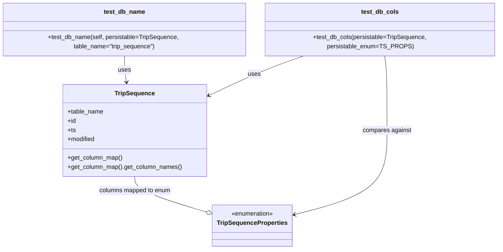

# Diagram: partview_core/partview_service/partview_service/tests/common/test_general.py

> Auto-generated by Obscura crawlers

## Mermaid

```mermaid
classDiagram
    class TripSequence {
        +table_name
        +get_column_map()
        +get_column_map().get_column_names()
        +id
        +ts
        +modified
    }
    class TripSequenceProperties <<enumeration>> {
        <<enum members unknown>>
    }
    class test_db_name {
        +test_db_name(self, persistable=TripSequence, table_name="trip_sequence")
    }
    class test_db_cols {
        +test_db_cols(persistable=TripSequence, persistable_enum=TS_PROPS)
    }

    test_db_name --> TripSequence : uses
    test_db_cols --> TripSequence : uses
    test_db_cols --> TripSequenceProperties : compares against
    TripSequence --o TripSequenceProperties : columns mapped to enum
```

> SVG rendering failed for this diagram.
