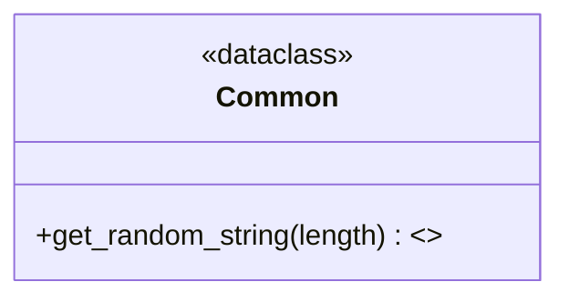

# Diagram: partview_core/partview_service/partview_service/tests/common/utility/common.py

> Auto-generated by Obscura crawlers

## Mermaid

### SVG

<svg id="container" width="313.1015625" xmlns="http://www.w3.org/2000/svg" class="classDiagram" height="166" viewBox="0 0 313.1015625 166" role="graphics-document document" aria-roledescription="class"><g><defs><marker id="container_class-aggregationStart" class="marker aggregation class" refX="18" refY="7" markerWidth="190" markerHeight="240" orient="auto"><path d="M 18,7 L9,13 L1,7 L9,1 Z"></path></marker></defs><defs><marker id="container_class-aggregationEnd" class="marker aggregation class" refX="1" refY="7" markerWidth="20" markerHeight="28" orient="auto"><path d="M 18,7 L9,13 L1,7 L9,1 Z"></path></marker></defs><defs><marker id="container_class-extensionStart" class="marker extension class" refX="18" refY="7" markerWidth="190" markerHeight="240" orient="auto"><path d="M 1,7 L18,13 V 1 Z"></path></marker></defs><defs><marker id="container_class-extensionEnd" class="marker extension class" refX="1" refY="7" markerWidth="20" markerHeight="28" orient="auto"><path d="M 1,1 V 13 L18,7 Z"></path></marker></defs><defs><marker id="container_class-compositionStart" class="marker composition class" refX="18" refY="7" markerWidth="190" markerHeight="240" orient="auto"><path d="M 18,7 L9,13 L1,7 L9,1 Z"></path></marker></defs><defs><marker id="container_class-compositionEnd" class="marker composition class" refX="1" refY="7" markerWidth="20" markerHeight="28" orient="auto"><path d="M 18,7 L9,13 L1,7 L9,1 Z"></path></marker></defs><defs><marker id="container_class-dependencyStart" class="marker dependency class" refX="6" refY="7" markerWidth="190" markerHeight="240" orient="auto"><path d="M 5,7 L9,13 L1,7 L9,1 Z"></path></marker></defs><defs><marker id="container_class-dependencyEnd" class="marker dependency class" refX="13" refY="7" markerWidth="20" markerHeight="28" orient="auto"><path d="M 18,7 L9,13 L14,7 L9,1 Z"></path></marker></defs><defs><marker id="container_class-lollipopStart" class="marker lollipop class" refX="13" refY="7" markerWidth="190" markerHeight="240" orient="auto"><circle stroke="black" fill="transparent" cx="7" cy="7" r="6"></circle></marker></defs><defs><marker id="container_class-lollipopEnd" class="marker lollipop class" refX="1" refY="7" markerWidth="190" markerHeight="240" orient="auto"><circle stroke="black" fill="transparent" cx="7" cy="7" r="6"></circle></marker></defs><g class="root"><g class="clusters"></g><g class="edgePaths"></g><g class="edgeLabels"></g><g class="nodes"><g class="node default" id="classId-Common-0" transform="translate(156.55078125, 83)"><g class="basic label-container"><path d="M-148.55078125 -75 L148.55078125 -75 L148.55078125 75 L-148.55078125 75" stroke="none" stroke-width="0" fill="#ECECFF" style=""></path><path d="M-148.55078125 -75 C-63.91763743492733 -75, 20.715506380145342 -75, 148.55078125 -75 M-148.55078125 -75 C-75.07323946097057 -75, -1.5956976719411387 -75, 148.55078125 -75 M148.55078125 -75 C148.55078125 -34.41893835682746, 148.55078125 6.1621232863450786, 148.55078125 75 M148.55078125 -75 C148.55078125 -30.781517227404855, 148.55078125 13.43696554519029, 148.55078125 75 M148.55078125 75 C40.80661259478619 75, -66.93755606042762 75, -148.55078125 75 M148.55078125 75 C60.255517614911895 75, -28.03974602017621 75, -148.55078125 75 M-148.55078125 75 C-148.55078125 36.72803028858544, -148.55078125 -1.5439394228291263, -148.55078125 -75 M-148.55078125 75 C-148.55078125 20.468179991919882, -148.55078125 -34.063640016160235, -148.55078125 -75" stroke="#9370DB" stroke-width="1.3" fill="none" stroke-dasharray="0 0" style=""></path></g><g class="annotation-group text" transform="translate(-43.0859375, -51)"><g class="label" style="" transform="translate(0,-12)"><foreignObject width="86.171875" height="24">

«dataclass»

</foreignObject></g></g><g class="label-group text" transform="translate(-31.921875, -27)"><g class="label" style="font-weight: bolder" transform="translate(0,-12)"><foreignObject width="63.84375" height="24">

Common

</foreignObject></g></g><g class="members-group text" transform="translate(-136.55078125, 21)"></g><g class="methods-group text" transform="translate(-136.55078125, 51)"><g class="label" style="" transform="translate(0,-12)"><foreignObject width="230.015625" height="24">

+get_random_string(length) : &lt;&gt;

</foreignObject></g></g><g class="divider" style=""><path d="M-148.55078125 -3 C-53.48702985195264 -3, 41.57672154609472 -3, 148.55078125 -3 M-148.55078125 -3 C-59.975596473676674 -3, 28.59958830264665 -3, 148.55078125 -3" stroke="#9370DB" stroke-width="1.3" fill="none" stroke-dasharray="0 0" style=""></path></g><g class="divider" style=""><path d="M-148.55078125 21 C-62.23709847932369 21, 24.076584291352617 21, 148.55078125 21 M-148.55078125 21 C-85.87312908242006 21, -23.195476914840143 21, 148.55078125 21" stroke="#9370DB" stroke-width="1.3" fill="none" stroke-dasharray="0 0" style=""></path></g></g></g></g></g></svg>
