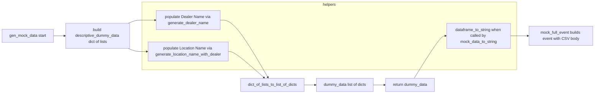
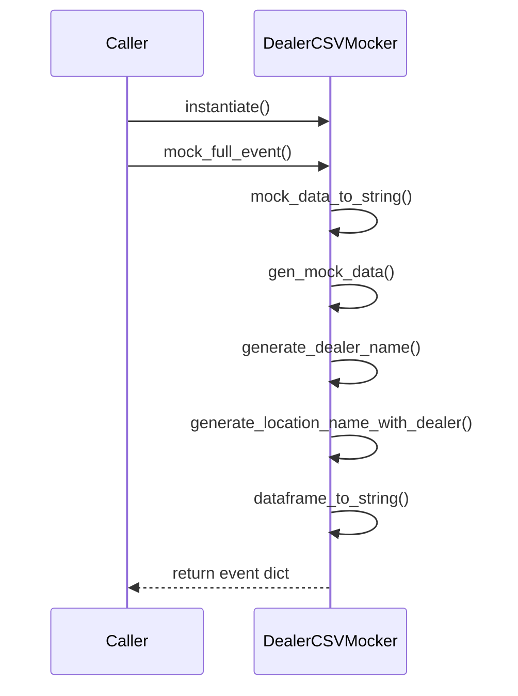
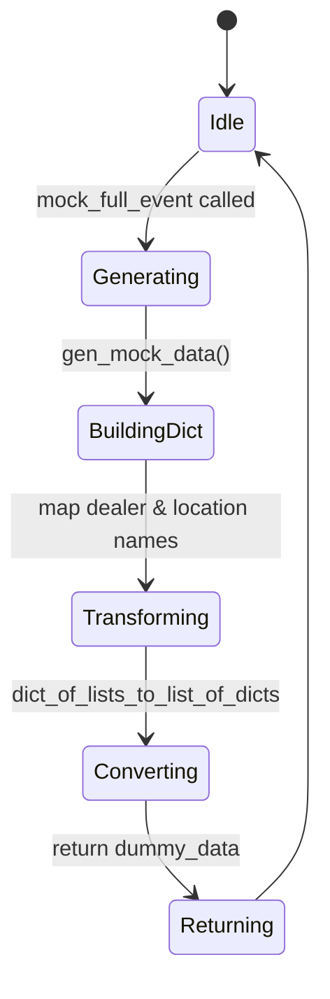

# Diagram: partview_core/partview_service/partview_service/tests/common/utility/mock_dealer_csv.py


> Auto-generated by Obscura crawlers

## Diagram 1

```mermaid
classDiagram
    class ContextMock {
        -aws_request_id: str
        -invoked_function_arn: str
        -log_group_name: str
        -log_stream_name: str
        -function_name: str
        -function_version: str
        -memory_limit_in_mb: str
        +__init__()
    }
    class DealerCSVMocker {
        -number_of_dealers: int = 5
        +random_zip(): str
        +generate_dealer_name(city, street): str
        +generate_location_name_with_dealer(dealer_name, city): str
        +gen_mock_data(): list
        +dataframe_to_string(df): str
        +mock_data_to_string(): str
        +mock_full_event(): dict
    }
    ContextMock <-- DealerCSVMocker : uses
    DealerCSVMocker o-- "descriptive_dummy_data" : contains
    DealerCSVMocker --> random : calls
```

> SVG rendering failed for this diagram.

## Diagram 2



### SVG

<svg id="container" width="2448.796875" xmlns="http://www.w3.org/2000/svg" class="flowchart" height="381" viewBox="0 0 2448.796875 381" role="graphics-document document" aria-roledescription="flowchart-v2"><style>#container{font-family:"trebuchet ms",verdana,arial,sans-serif;font-size:16px;fill:#333;}@keyframes edge-animation-frame{from{stroke-dashoffset:0;}}@keyframes dash{to{stroke-dashoffset:0;}}#container .edge-animation-slow{stroke-dasharray:9,5!important;stroke-dashoffset:900;animation:dash 50s linear infinite;stroke-linecap:round;}#container .edge-animation-fast{stroke-dasharray:9,5!important;stroke-dashoffset:900;animation:dash 20s linear infinite;stroke-linecap:round;}#container .error-icon{fill:#552222;}#container .error-text{fill:#552222;stroke:#552222;}#container .edge-thickness-normal{stroke-width:1px;}#container .edge-thickness-thick{stroke-width:3.5px;}#container .edge-pattern-solid{stroke-dasharray:0;}#container .edge-thickness-invisible{stroke-width:0;fill:none;}#container .edge-pattern-dashed{stroke-dasharray:3;}#container .edge-pattern-dotted{stroke-dasharray:2;}#container .marker{fill:#333333;stroke:#333333;}#container .marker.cross{stroke:#333333;}#container svg{font-family:"trebuchet ms",verdana,arial,sans-serif;font-size:16px;}#container p{margin:0;}#container .label{font-family:"trebuchet ms",verdana,arial,sans-serif;color:#333;}#container .cluster-label text{fill:#333;}#container .cluster-label span{color:#333;}#container .cluster-label span p{background-color:transparent;}#container .label text,#container span{fill:#333;color:#333;}#container .node rect,#container .node circle,#container .node ellipse,#container .node polygon,#container .node path{fill:#ECECFF;stroke:#9370DB;stroke-width:1px;}#container .rough-node .label text,#container .node .label text,#container .image-shape .label,#container .icon-shape .label{text-anchor:middle;}#container .node .katex path{fill:#000;stroke:#000;stroke-width:1px;}#container .rough-node .label,#container .node .label,#container .image-shape .label,#container .icon-shape .label{text-align:center;}#container .node.clickable{cursor:pointer;}#container .root .anchor path{fill:#333333!important;stroke-width:0;stroke:#333333;}#container .arrowheadPath{fill:#333333;}#container .edgePath .path{stroke:#333333;stroke-width:2.0px;}#container .flowchart-link{stroke:#333333;fill:none;}#container .edgeLabel{background-color:rgba(232,232,232, 0.8);text-align:center;}#container .edgeLabel p{background-color:rgba(232,232,232, 0.8);}#container .edgeLabel rect{opacity:0.5;background-color:rgba(232,232,232, 0.8);fill:rgba(232,232,232, 0.8);}#container .labelBkg{background-color:rgba(232, 232, 232, 0.5);}#container .cluster rect{fill:#ffffde;stroke:#aaaa33;stroke-width:1px;}#container .cluster text{fill:#333;}#container .cluster span{color:#333;}#container div.mermaidTooltip{position:absolute;text-align:center;max-width:200px;padding:2px;font-family:"trebuchet ms",verdana,arial,sans-serif;font-size:12px;background:hsl(80, 100%, 96.2745098039%);border:1px solid #aaaa33;border-radius:2px;pointer-events:none;z-index:100;}#container .flowchartTitleText{text-anchor:middle;font-size:18px;fill:#333;}#container rect.text{fill:none;stroke-width:0;}#container .icon-shape,#container .image-shape{background-color:rgba(232,232,232, 0.8);text-align:center;}#container .icon-shape p,#container .image-shape p{background-color:rgba(232,232,232, 0.8);padding:2px;}#container .icon-shape rect,#container .image-shape rect{opacity:0.5;background-color:rgba(232,232,232, 0.8);fill:rgba(232,232,232, 0.8);}#container .label-icon{display:inline-block;height:1em;overflow:visible;vertical-align:-0.125em;}#container .node .label-icon path{fill:currentColor;stroke:revert;stroke-width:revert;}#container :root{--mermaid-font-family:"trebuchet ms",verdana,arial,sans-serif;}</style><g><marker id="container_flowchart-v2-pointEnd" class="marker flowchart-v2" viewBox="0 0 10 10" refX="5" refY="5" markerUnits="userSpaceOnUse" markerWidth="8" markerHeight="8" orient="auto"><path d="M 0 0 L 10 5 L 0 10 z" class="arrowMarkerPath" style="stroke-width: 1; stroke-dasharray: 1, 0;"></path></marker><marker id="container_flowchart-v2-pointStart" class="marker flowchart-v2" viewBox="0 0 10 10" refX="4.5" refY="5" markerUnits="userSpaceOnUse" markerWidth="8" markerHeight="8" orient="auto"><path d="M 0 5 L 10 10 L 10 0 z" class="arrowMarkerPath" style="stroke-width: 1; stroke-dasharray: 1, 0;"></path></marker><marker id="container_flowchart-v2-circleEnd" class="marker flowchart-v2" viewBox="0 0 10 10" refX="11" refY="5" markerUnits="userSpaceOnUse" markerWidth="11" markerHeight="11" orient="auto"><circle cx="5" cy="5" r="5" class="arrowMarkerPath" style="stroke-width: 1; stroke-dasharray: 1, 0;"></circle></marker><marker id="container_flowchart-v2-circleStart" class="marker flowchart-v2" viewBox="0 0 10 10" refX="-1" refY="5" markerUnits="userSpaceOnUse" markerWidth="11" markerHeight="11" orient="auto"><circle cx="5" cy="5" r="5" class="arrowMarkerPath" style="stroke-width: 1; stroke-dasharray: 1, 0;"></circle></marker><marker id="container_flowchart-v2-crossEnd" class="marker cross flowchart-v2" viewBox="0 0 11 11" refX="12" refY="5.2" markerUnits="userSpaceOnUse" markerWidth="11" markerHeight="11" orient="auto"><path d="M 1,1 l 9,9 M 10,1 l -9,9" class="arrowMarkerPath" style="stroke-width: 2; stroke-dasharray: 1, 0;"></path></marker><marker id="container_flowchart-v2-crossStart" class="marker cross flowchart-v2" viewBox="0 0 11 11" refX="-1" refY="5.2" markerUnits="userSpaceOnUse" markerWidth="11" markerHeight="11" orient="auto"><path d="M 1,1 l 9,9 M 10,1 l -9,9" class="arrowMarkerPath" style="stroke-width: 2; stroke-dasharray: 1, 0;"></path></marker><g class="root"><g class="clusters"><g class="cluster" id="helpers" data-look="classic"><rect style="" x="580.0625" y="8" width="1550.734375" height="276"></rect><g class="cluster-label" transform="translate(1328.21875, 8)"><foreignObject width="54.421875" height="24"><div xmlns="http://www.w3.org/1999/xhtml" style="display: table-cell; white-space: nowrap; line-height: 1.5; max-width: 200px; text-align: center;"><span class="nodeLabel"><p>helpers</p></span></div></foreignObject></g></g></g><g class="edgePaths"><path d="M220.063,146L224.229,146C228.396,146,236.729,146,244.396,146C252.063,146,259.063,146,262.563,146L266.063,146" id="L_A_B_0" class="edge-thickness-normal edge-pattern-solid edge-thickness-normal edge-pattern-solid flowchart-link" style=";" data-edge="true" data-et="edge" data-id="L_A_B_0" data-points="W3sieCI6MjIwLjA2MjUsInkiOjE0Nn0seyJ4IjoyNDUuMDYyNSwieSI6MTQ2fSx7IngiOjI3MC4wNjI1LCJ5IjoxNDZ9XQ==" marker-end="url(#container_flowchart-v2-pointEnd)"></path><path d="M523.578,95L528.826,92.833C534.073,90.667,544.568,86.333,553.982,84.167C563.396,82,571.729,82,585.418,82C599.107,82,618.151,82,627.673,82L637.195,82" id="L_B_C_0" class="edge-thickness-normal edge-pattern-solid edge-thickness-normal edge-pattern-solid flowchart-link" style=";" data-edge="true" data-et="edge" data-id="L_B_C_0" data-points="W3sieCI6NTIzLjU3ODEyNSwieSI6OTV9LHsieCI6NTU1LjA2MjUsInkiOjgyfSx7IngiOjU4MC4wNjI1LCJ5Ijo4Mn0seyJ4Ijo2NDEuMTk1MzEyNSwieSI6ODJ9XQ==" marker-end="url(#container_flowchart-v2-pointEnd)"></path><path d="M523.578,197L528.826,199.167C534.073,201.333,544.568,205.667,553.982,207.833C563.396,210,571.729,210,579.396,210C587.063,210,594.063,210,597.563,210L601.063,210" id="L_B_D_0" class="edge-thickness-normal edge-pattern-solid edge-thickness-normal edge-pattern-solid flowchart-link" style=";" data-edge="true" data-et="edge" data-id="L_B_D_0" data-points="W3sieCI6NTIzLjU3ODEyNSwieSI6MTk3fSx7IngiOjU1NS4wNjI1LCJ5IjoyMTB9LHsieCI6NTgwLjA2MjUsInkiOjIxMH0seyJ4Ijo2MDUuMDYyNSwieSI6MjEwfV0=" marker-end="url(#container_flowchart-v2-pointEnd)"></path><path d="M901.195,82L911.384,82C921.573,82,941.951,82,975.427,120.928C1008.903,159.856,1055.478,237.712,1078.765,276.639L1102.052,315.567" id="L_C_E_0" class="edge-thickness-normal edge-pattern-solid edge-thickness-normal edge-pattern-solid flowchart-link" style=";" data-edge="true" data-et="edge" data-id="L_C_E_0" data-points="W3sieCI6OTAxLjE5NTMxMjUsInkiOjgyfSx7IngiOjk2Mi4zMjgxMjUsInkiOjgyfSx7IngiOjExMDQuMTA1OTEyNjQyMDQ1NSwieSI6MzE5fV0=" marker-end="url(#container_flowchart-v2-pointEnd)"></path><path d="M937.328,210L941.495,210C945.661,210,953.995,210,978.752,227.732C1003.51,245.463,1044.691,280.927,1065.282,298.658L1085.873,316.39" id="L_D_E_0" class="edge-thickness-normal edge-pattern-solid edge-thickness-normal edge-pattern-solid flowchart-link" style=";" data-edge="true" data-et="edge" data-id="L_D_E_0" data-points="W3sieCI6OTM3LjMyODEyNSwieSI6MjEwfSx7IngiOjk2Mi4zMjgxMjUsInkiOjIxMH0seyJ4IjoxMDg4LjkwNDEyNDU0MDQ0MTIsInkiOjMxOX1d" marker-end="url(#container_flowchart-v2-pointEnd)"></path><path d="M1253.188,346L1257.354,346C1261.521,346,1269.854,346,1277.521,346C1285.188,346,1292.188,346,1295.688,346L1299.188,346" id="L_E_F_0" class="edge-thickness-normal edge-pattern-solid edge-thickness-normal edge-pattern-solid flowchart-link" style=";" data-edge="true" data-et="edge" data-id="L_E_F_0" data-points="W3sieCI6MTI1My4xODc1LCJ5IjozNDZ9LHsieCI6MTI3OC4xODc1LCJ5IjozNDZ9LHsieCI6MTMwMy4xODc1LCJ5IjozNDZ9XQ==" marker-end="url(#container_flowchart-v2-pointEnd)"></path><path d="M1542.266,346L1546.432,346C1550.599,346,1558.932,346,1566.599,346C1574.266,346,1581.266,346,1584.766,346L1588.266,346" id="L_F_G_0" class="edge-thickness-normal edge-pattern-solid edge-thickness-normal edge-pattern-solid flowchart-link" style=";" data-edge="true" data-et="edge" data-id="L_F_G_0" data-points="W3sieCI6MTU0Mi4yNjU2MjUsInkiOjM0Nn0seyJ4IjoxNTY3LjI2NTYyNSwieSI6MzQ2fSx7IngiOjE1OTIuMjY1NjI1LCJ5IjozNDZ9XQ==" marker-end="url(#container_flowchart-v2-pointEnd)"></path><path d="M1711.145,319L1729.42,290.167C1747.695,261.333,1784.246,203.667,1806.021,174.833C1827.797,146,1834.797,146,1838.297,146L1841.797,146" id="L_G_H_0" class="edge-thickness-normal edge-pattern-solid edge-thickness-normal edge-pattern-solid flowchart-link" style=";" data-edge="true" data-et="edge" data-id="L_G_H_0" data-points="W3sieCI6MTcxMS4xNDQ2MDkzNzUsInkiOjMxOX0seyJ4IjoxODIwLjc5Njg3NSwieSI6MTQ2fSx7IngiOjE4NDUuNzk2ODc1LCJ5IjoxNDZ9XQ==" marker-end="url(#container_flowchart-v2-pointEnd)"></path><path d="M2105.797,146L2109.964,146C2114.13,146,2122.464,146,2130.797,146C2139.13,146,2147.464,146,2155.13,146C2162.797,146,2169.797,146,2173.297,146L2176.797,146" id="L_H_I_0" class="edge-thickness-normal edge-pattern-solid edge-thickness-normal edge-pattern-solid flowchart-link" style=";" data-edge="true" data-et="edge" data-id="L_H_I_0" data-points="W3sieCI6MjEwNS43OTY4NzUsInkiOjE0Nn0seyJ4IjoyMTMwLjc5Njg3NSwieSI6MTQ2fSx7IngiOjIxNTUuNzk2ODc1LCJ5IjoxNDZ9LHsieCI6MjE4MC43OTY4NzUsInkiOjE0Nn1d" marker-end="url(#container_flowchart-v2-pointEnd)"></path></g><g class="edgeLabels"><g class="edgeLabel"><g class="label" data-id="L_A_B_0" transform="translate(0, 0)"><foreignObject width="0" height="0"><div xmlns="http://www.w3.org/1999/xhtml" class="labelBkg" style="display: table-cell; white-space: nowrap; line-height: 1.5; max-width: 200px; text-align: center;"><span class="edgeLabel"></span></div></foreignObject></g></g><g class="edgeLabel"><g class="label" data-id="L_B_C_0" transform="translate(0, 0)"><foreignObject width="0" height="0"><div xmlns="http://www.w3.org/1999/xhtml" class="labelBkg" style="display: table-cell; white-space: nowrap; line-height: 1.5; max-width: 200px; text-align: center;"><span class="edgeLabel"></span></div></foreignObject></g></g><g class="edgeLabel"><g class="label" data-id="L_B_D_0" transform="translate(0, 0)"><foreignObject width="0" height="0"><div xmlns="http://www.w3.org/1999/xhtml" class="labelBkg" style="display: table-cell; white-space: nowrap; line-height: 1.5; max-width: 200px; text-align: center;"><span class="edgeLabel"></span></div></foreignObject></g></g><g class="edgeLabel"><g class="label" data-id="L_C_E_0" transform="translate(0, 0)"><foreignObject width="0" height="0"><div xmlns="http://www.w3.org/1999/xhtml" class="labelBkg" style="display: table-cell; white-space: nowrap; line-height: 1.5; max-width: 200px; text-align: center;"><span class="edgeLabel"></span></div></foreignObject></g></g><g class="edgeLabel"><g class="label" data-id="L_D_E_0" transform="translate(0, 0)"><foreignObject width="0" height="0"><div xmlns="http://www.w3.org/1999/xhtml" class="labelBkg" style="display: table-cell; white-space: nowrap; line-height: 1.5; max-width: 200px; text-align: center;"><span class="edgeLabel"></span></div></foreignObject></g></g><g class="edgeLabel"><g class="label" data-id="L_E_F_0" transform="translate(0, 0)"><foreignObject width="0" height="0"><div xmlns="http://www.w3.org/1999/xhtml" class="labelBkg" style="display: table-cell; white-space: nowrap; line-height: 1.5; max-width: 200px; text-align: center;"><span class="edgeLabel"></span></div></foreignObject></g></g><g class="edgeLabel"><g class="label" data-id="L_F_G_0" transform="translate(0, 0)"><foreignObject width="0" height="0"><div xmlns="http://www.w3.org/1999/xhtml" class="labelBkg" style="display: table-cell; white-space: nowrap; line-height: 1.5; max-width: 200px; text-align: center;"><span class="edgeLabel"></span></div></foreignObject></g></g><g class="edgeLabel"><g class="label" data-id="L_G_H_0" transform="translate(0, 0)"><foreignObject width="0" height="0"><div xmlns="http://www.w3.org/1999/xhtml" class="labelBkg" style="display: table-cell; white-space: nowrap; line-height: 1.5; max-width: 200px; text-align: center;"><span class="edgeLabel"></span></div></foreignObject></g></g><g class="edgeLabel"><g class="label" data-id="L_H_I_0" transform="translate(0, 0)"><foreignObject width="0" height="0"><div xmlns="http://www.w3.org/1999/xhtml" class="labelBkg" style="display: table-cell; white-space: nowrap; line-height: 1.5; max-width: 200px; text-align: center;"><span class="edgeLabel"></span></div></foreignObject></g></g></g><g class="nodes"><g class="node default" id="flowchart-A-0" transform="translate(114.03125, 146)"><rect class="basic label-container" style="" x="-106.03125" y="-27" width="212.0625" height="54"></rect><g class="label" style="" transform="translate(-76.03125, -12)"><rect></rect><foreignObject width="152.0625" height="24"><div xmlns="http://www.w3.org/1999/xhtml" style="display: table-cell; white-space: nowrap; line-height: 1.5; max-width: 200px; text-align: center;"><span class="nodeLabel"><p>gen_mock_data start</p></span></div></foreignObject></g></g><g class="node default" id="flowchart-B-1" transform="translate(400.0625, 146)"><rect class="basic label-container" style="" x="-130" y="-51" width="260" height="102"></rect><g class="label" style="" transform="translate(-100, -36)"><rect></rect><foreignObject width="200" height="72"><div xmlns="http://www.w3.org/1999/xhtml" style="display: table; white-space: break-spaces; line-height: 1.5; max-width: 200px; text-align: center; width: 200px;"><span class="nodeLabel"><p>build descriptive_dummy_data dict of lists</p></span></div></foreignObject></g></g><g class="node default" id="flowchart-C-3" transform="translate(771.1953125, 82)"><rect class="basic label-container" style="" x="-130" y="-39" width="260" height="78"></rect><g class="label" style="" transform="translate(-100, -24)"><rect></rect><foreignObject width="200" height="48"><div xmlns="http://www.w3.org/1999/xhtml" style="display: table; white-space: break-spaces; line-height: 1.5; max-width: 200px; text-align: center; width: 200px;"><span class="nodeLabel"><p>populate Dealer Name via generate_dealer_name</p></span></div></foreignObject></g></g><g class="node default" id="flowchart-D-5" transform="translate(771.1953125, 210)"><rect class="basic label-container" style="" x="-166.1328125" y="-39" width="332.265625" height="78"></rect><g class="label" style="" transform="translate(-136.1328125, -24)"><rect></rect><foreignObject width="272.265625" height="48"><div xmlns="http://www.w3.org/1999/xhtml" style="display: table; white-space: break-spaces; line-height: 1.5; max-width: 200px; text-align: center; width: 200px;"><span class="nodeLabel"><p>populate Location Name via generate_location_name_with_dealer</p></span></div></foreignObject></g></g><g class="node default" id="flowchart-E-7" transform="translate(1120.2578125, 346)"><rect class="basic label-container" style="" x="-132.9296875" y="-27" width="265.859375" height="54"></rect><g class="label" style="" transform="translate(-102.9296875, -12)"><rect></rect><foreignObject width="205.859375" height="24"><div xmlns="http://www.w3.org/1999/xhtml" style="display: table; white-space: break-spaces; line-height: 1.5; max-width: 200px; text-align: center; width: 200px;"><span class="nodeLabel"><p>dict_of_lists_to_list_of_dicts</p></span></div></foreignObject></g></g><g class="node default" id="flowchart-F-11" transform="translate(1422.7265625, 346)"><rect class="basic label-container" style="" x="-119.5390625" y="-27" width="239.078125" height="54"></rect><g class="label" style="" transform="translate(-89.5390625, -12)"><rect></rect><foreignObject width="179.078125" height="24"><div xmlns="http://www.w3.org/1999/xhtml" style="display: table-cell; white-space: nowrap; line-height: 1.5; max-width: 200px; text-align: center;"><span class="nodeLabel"><p>dummy_data list of dicts</p></span></div></foreignObject></g></g><g class="node default" id="flowchart-G-13" transform="translate(1694.03125, 346)"><rect class="basic label-container" style="" x="-101.765625" y="-27" width="203.53125" height="54"></rect><g class="label" style="" transform="translate(-71.765625, -12)"><rect></rect><foreignObject width="143.53125" height="24"><div xmlns="http://www.w3.org/1999/xhtml" style="display: table-cell; white-space: nowrap; line-height: 1.5; max-width: 200px; text-align: center;"><span class="nodeLabel"><p>return dummy_data</p></span></div></foreignObject></g></g><g class="node default" id="flowchart-H-15" transform="translate(1975.796875, 146)"><rect class="basic label-container" style="" x="-130" y="-51" width="260" height="102"></rect><g class="label" style="" transform="translate(-100, -36)"><rect></rect><foreignObject width="200" height="72"><div xmlns="http://www.w3.org/1999/xhtml" style="display: table; white-space: break-spaces; line-height: 1.5; max-width: 200px; text-align: center; width: 200px;"><span class="nodeLabel"><p>dataframe_to_string when called by mock_data_to_string</p></span></div></foreignObject></g></g><g class="node default" id="flowchart-I-17" transform="translate(2310.796875, 146)"><rect class="basic label-container" style="" x="-130" y="-39" width="260" height="78"></rect><g class="label" style="" transform="translate(-100, -24)"><rect></rect><foreignObject width="200" height="48"><div xmlns="http://www.w3.org/1999/xhtml" style="display: table; white-space: break-spaces; line-height: 1.5; max-width: 200px; text-align: center; width: 200px;"><span class="nodeLabel"><p>mock_full_event builds event with CSV body</p></span></div></foreignObject></g></g></g></g></g></svg>

## Diagram 3



### SVG

<svg id="container" width="517.5" xmlns="http://www.w3.org/2000/svg" height="705" viewBox="-50 -10 517.5 705" role="graphics-document document" aria-roledescription="sequence"><g><rect x="200" y="619" fill="#eaeaea" stroke="#666" width="150" height="65" name="DealerCSVMocker" rx="3" ry="3" class="actor actor-bottom"></rect><text x="275" y="651.5" dominant-baseline="central" alignment-baseline="central" class="actor actor-box" style="text-anchor: middle; font-size: 16px; font-weight: 400;"><tspan x="275" dy="0">DealerCSVMocker</tspan></text></g><g><rect x="0" y="619" fill="#eaeaea" stroke="#666" width="150" height="65" name="Caller" rx="3" ry="3" class="actor actor-bottom"></rect><text x="75" y="651.5" dominant-baseline="central" alignment-baseline="central" class="actor actor-box" style="text-anchor: middle; font-size: 16px; font-weight: 400;"><tspan x="75" dy="0">Caller</tspan></text></g><g><line id="actor1" x1="275" y1="65" x2="275" y2="619" class="actor-line 200" stroke-width="0.5px" stroke="#999" name="DealerCSVMocker"></line><g id="root-1"><rect x="200" y="0" fill="#eaeaea" stroke="#666" width="150" height="65" name="DealerCSVMocker" rx="3" ry="3" class="actor actor-top"></rect><text x="275" y="32.5" dominant-baseline="central" alignment-baseline="central" class="actor actor-box" style="text-anchor: middle; font-size: 16px; font-weight: 400;"><tspan x="275" dy="0">DealerCSVMocker</tspan></text></g></g><g><line id="actor0" x1="75" y1="65" x2="75" y2="619" class="actor-line 200" stroke-width="0.5px" stroke="#999" name="Caller"></line><g id="root-0"><rect x="0" y="0" fill="#eaeaea" stroke="#666" width="150" height="65" name="Caller" rx="3" ry="3" class="actor actor-top"></rect><text x="75" y="32.5" dominant-baseline="central" alignment-baseline="central" class="actor actor-box" style="text-anchor: middle; font-size: 16px; font-weight: 400;"><tspan x="75" dy="0">Caller</tspan></text></g></g><style>#container{font-family:"trebuchet ms",verdana,arial,sans-serif;font-size:16px;fill:#333;}@keyframes edge-animation-frame{from{stroke-dashoffset:0;}}@keyframes dash{to{stroke-dashoffset:0;}}#container .edge-animation-slow{stroke-dasharray:9,5!important;stroke-dashoffset:900;animation:dash 50s linear infinite;stroke-linecap:round;}#container .edge-animation-fast{stroke-dasharray:9,5!important;stroke-dashoffset:900;animation:dash 20s linear infinite;stroke-linecap:round;}#container .error-icon{fill:#552222;}#container .error-text{fill:#552222;stroke:#552222;}#container .edge-thickness-normal{stroke-width:1px;}#container .edge-thickness-thick{stroke-width:3.5px;}#container .edge-pattern-solid{stroke-dasharray:0;}#container .edge-thickness-invisible{stroke-width:0;fill:none;}#container .edge-pattern-dashed{stroke-dasharray:3;}#container .edge-pattern-dotted{stroke-dasharray:2;}#container .marker{fill:#333333;stroke:#333333;}#container .marker.cross{stroke:#333333;}#container svg{font-family:"trebuchet ms",verdana,arial,sans-serif;font-size:16px;}#container p{margin:0;}#container .actor{stroke:hsl(259.6261682243, 59.7765363128%, 87.9019607843%);fill:#ECECFF;}#container text.actor&gt;tspan{fill:black;stroke:none;}#container .actor-line{stroke:hsl(259.6261682243, 59.7765363128%, 87.9019607843%);}#container .innerArc{stroke-width:1.5;stroke-dasharray:none;}#container .messageLine0{stroke-width:1.5;stroke-dasharray:none;stroke:#333;}#container .messageLine1{stroke-width:1.5;stroke-dasharray:2,2;stroke:#333;}#container #arrowhead path{fill:#333;stroke:#333;}#container .sequenceNumber{fill:white;}#container #sequencenumber{fill:#333;}#container #crosshead path{fill:#333;stroke:#333;}#container .messageText{fill:#333;stroke:none;}#container .labelBox{stroke:hsl(259.6261682243, 59.7765363128%, 87.9019607843%);fill:#ECECFF;}#container .labelText,#container .labelText&gt;tspan{fill:black;stroke:none;}#container .loopText,#container .loopText&gt;tspan{fill:black;stroke:none;}#container .loopLine{stroke-width:2px;stroke-dasharray:2,2;stroke:hsl(259.6261682243, 59.7765363128%, 87.9019607843%);fill:hsl(259.6261682243, 59.7765363128%, 87.9019607843%);}#container .note{stroke:#aaaa33;fill:#fff5ad;}#container .noteText,#container .noteText&gt;tspan{fill:black;stroke:none;}#container .activation0{fill:#f4f4f4;stroke:#666;}#container .activation1{fill:#f4f4f4;stroke:#666;}#container .activation2{fill:#f4f4f4;stroke:#666;}#container .actorPopupMenu{position:absolute;}#container .actorPopupMenuPanel{position:absolute;fill:#ECECFF;box-shadow:0px 8px 16px 0px rgba(0,0,0,0.2);filter:drop-shadow(3px 5px 2px rgb(0 0 0 / 0.4));}#container .actor-man line{stroke:hsl(259.6261682243, 59.7765363128%, 87.9019607843%);fill:#ECECFF;}#container .actor-man circle,#container line{stroke:hsl(259.6261682243, 59.7765363128%, 87.9019607843%);fill:#ECECFF;stroke-width:2px;}#container :root{--mermaid-font-family:"trebuchet ms",verdana,arial,sans-serif;}</style><g></g><defs><symbol id="computer" width="24" height="24"><path transform="scale(.5)" d="M2 2v13h20v-13h-20zm18 11h-16v-9h16v9zm-10.228 6l.466-1h3.524l.467 1h-4.457zm14.228 3h-24l2-6h2.104l-1.33 4h18.45l-1.297-4h2.073l2 6zm-5-10h-14v-7h14v7z"></path></symbol></defs><defs><symbol id="database" fill-rule="evenodd" clip-rule="evenodd"><path transform="scale(.5)" d="M12.258.001l.256.004.255.005.253.008.251.01.249.012.247.015.246.016.242.019.241.02.239.023.236.024.233.027.231.028.229.031.225.032.223.034.22.036.217.038.214.04.211.041.208.043.205.045.201.046.198.048.194.05.191.051.187.053.183.054.18.056.175.057.172.059.168.06.163.061.16.063.155.064.15.066.074.033.073.033.071.034.07.034.069.035.068.035.067.035.066.035.064.036.064.036.062.036.06.036.06.037.058.037.058.037.055.038.055.038.053.038.052.038.051.039.05.039.048.039.047.039.045.04.044.04.043.04.041.04.04.041.039.041.037.041.036.041.034.041.033.042.032.042.03.042.029.042.027.042.026.043.024.043.023.043.021.043.02.043.018.044.017.043.015.044.013.044.012.044.011.045.009.044.007.045.006.045.004.045.002.045.001.045v17l-.001.045-.002.045-.004.045-.006.045-.007.045-.009.044-.011.045-.012.044-.013.044-.015.044-.017.043-.018.044-.02.043-.021.043-.023.043-.024.043-.026.043-.027.042-.029.042-.03.042-.032.042-.033.042-.034.041-.036.041-.037.041-.039.041-.04.041-.041.04-.043.04-.044.04-.045.04-.047.039-.048.039-.05.039-.051.039-.052.038-.053.038-.055.038-.055.038-.058.037-.058.037-.06.037-.06.036-.062.036-.064.036-.064.036-.066.035-.067.035-.068.035-.069.035-.07.034-.071.034-.073.033-.074.033-.15.066-.155.064-.16.063-.163.061-.168.06-.172.059-.175.057-.18.056-.183.054-.187.053-.191.051-.194.05-.198.048-.201.046-.205.045-.208.043-.211.041-.214.04-.217.038-.22.036-.223.034-.225.032-.229.031-.231.028-.233.027-.236.024-.239.023-.241.02-.242.019-.246.016-.247.015-.249.012-.251.01-.253.008-.255.005-.256.004-.258.001-.258-.001-.256-.004-.255-.005-.253-.008-.251-.01-.249-.012-.247-.015-.245-.016-.243-.019-.241-.02-.238-.023-.236-.024-.234-.027-.231-.028-.228-.031-.226-.032-.223-.034-.22-.036-.217-.038-.214-.04-.211-.041-.208-.043-.204-.045-.201-.046-.198-.048-.195-.05-.19-.051-.187-.053-.184-.054-.179-.056-.176-.057-.172-.059-.167-.06-.164-.061-.159-.063-.155-.064-.151-.066-.074-.033-.072-.033-.072-.034-.07-.034-.069-.035-.068-.035-.067-.035-.066-.035-.064-.036-.063-.036-.062-.036-.061-.036-.06-.037-.058-.037-.057-.037-.056-.038-.055-.038-.053-.038-.052-.038-.051-.039-.049-.039-.049-.039-.046-.039-.046-.04-.044-.04-.043-.04-.041-.04-.04-.041-.039-.041-.037-.041-.036-.041-.034-.041-.033-.042-.032-.042-.03-.042-.029-.042-.027-.042-.026-.043-.024-.043-.023-.043-.021-.043-.02-.043-.018-.044-.017-.043-.015-.044-.013-.044-.012-.044-.011-.045-.009-.044-.007-.045-.006-.045-.004-.045-.002-.045-.001-.045v-17l.001-.045.002-.045.004-.045.006-.045.007-.045.009-.044.011-.045.012-.044.013-.044.015-.044.017-.043.018-.044.02-.043.021-.043.023-.043.024-.043.026-.043.027-.042.029-.042.03-.042.032-.042.033-.042.034-.041.036-.041.037-.041.039-.041.04-.041.041-.04.043-.04.044-.04.046-.04.046-.039.049-.039.049-.039.051-.039.052-.038.053-.038.055-.038.056-.038.057-.037.058-.037.06-.037.061-.036.062-.036.063-.036.064-.036.066-.035.067-.035.068-.035.069-.035.07-.034.072-.034.072-.033.074-.033.151-.066.155-.064.159-.063.164-.061.167-.06.172-.059.176-.057.179-.056.184-.054.187-.053.19-.051.195-.05.198-.048.201-.046.204-.045.208-.043.211-.041.214-.04.217-.038.22-.036.223-.034.226-.032.228-.031.231-.028.234-.027.236-.024.238-.023.241-.02.243-.019.245-.016.247-.015.249-.012.251-.01.253-.008.255-.005.256-.004.258-.001.258.001zm-9.258 20.499v.01l.001.021.003.021.004.022.005.021.006.022.007.022.009.023.01.022.011.023.012.023.013.023.015.023.016.024.017.023.018.024.019.024.021.024.022.025.023.024.024.025.052.049.056.05.061.051.066.051.07.051.075.051.079.052.084.052.088.052.092.052.097.052.102.051.105.052.11.052.114.051.119.051.123.051.127.05.131.05.135.05.139.048.144.049.147.047.152.047.155.047.16.045.163.045.167.043.171.043.176.041.178.041.183.039.187.039.19.037.194.035.197.035.202.033.204.031.209.03.212.029.216.027.219.025.222.024.226.021.23.02.233.018.236.016.24.015.243.012.246.01.249.008.253.005.256.004.259.001.26-.001.257-.004.254-.005.25-.008.247-.011.244-.012.241-.014.237-.016.233-.018.231-.021.226-.021.224-.024.22-.026.216-.027.212-.028.21-.031.205-.031.202-.034.198-.034.194-.036.191-.037.187-.039.183-.04.179-.04.175-.042.172-.043.168-.044.163-.045.16-.046.155-.046.152-.047.148-.048.143-.049.139-.049.136-.05.131-.05.126-.05.123-.051.118-.052.114-.051.11-.052.106-.052.101-.052.096-.052.092-.052.088-.053.083-.051.079-.052.074-.052.07-.051.065-.051.06-.051.056-.05.051-.05.023-.024.023-.025.021-.024.02-.024.019-.024.018-.024.017-.024.015-.023.014-.024.013-.023.012-.023.01-.023.01-.022.008-.022.006-.022.006-.022.004-.022.004-.021.001-.021.001-.021v-4.127l-.077.055-.08.053-.083.054-.085.053-.087.052-.09.052-.093.051-.095.05-.097.05-.1.049-.102.049-.105.048-.106.047-.109.047-.111.046-.114.045-.115.045-.118.044-.12.043-.122.042-.124.042-.126.041-.128.04-.13.04-.132.038-.134.038-.135.037-.138.037-.139.035-.142.035-.143.034-.144.033-.147.032-.148.031-.15.03-.151.03-.153.029-.154.027-.156.027-.158.026-.159.025-.161.024-.162.023-.163.022-.165.021-.166.02-.167.019-.169.018-.169.017-.171.016-.173.015-.173.014-.175.013-.175.012-.177.011-.178.01-.179.008-.179.008-.181.006-.182.005-.182.004-.184.003-.184.002h-.37l-.184-.002-.184-.003-.182-.004-.182-.005-.181-.006-.179-.008-.179-.008-.178-.01-.176-.011-.176-.012-.175-.013-.173-.014-.172-.015-.171-.016-.17-.017-.169-.018-.167-.019-.166-.02-.165-.021-.163-.022-.162-.023-.161-.024-.159-.025-.157-.026-.156-.027-.155-.027-.153-.029-.151-.03-.15-.03-.148-.031-.146-.032-.145-.033-.143-.034-.141-.035-.14-.035-.137-.037-.136-.037-.134-.038-.132-.038-.13-.04-.128-.04-.126-.041-.124-.042-.122-.042-.12-.044-.117-.043-.116-.045-.113-.045-.112-.046-.109-.047-.106-.047-.105-.048-.102-.049-.1-.049-.097-.05-.095-.05-.093-.052-.09-.051-.087-.052-.085-.053-.083-.054-.08-.054-.077-.054v4.127zm0-5.654v.011l.001.021.003.021.004.021.005.022.006.022.007.022.009.022.01.022.011.023.012.023.013.023.015.024.016.023.017.024.018.024.019.024.021.024.022.024.023.025.024.024.052.05.056.05.061.05.066.051.07.051.075.052.079.051.084.052.088.052.092.052.097.052.102.052.105.052.11.051.114.051.119.052.123.05.127.051.131.05.135.049.139.049.144.048.147.048.152.047.155.046.16.045.163.045.167.044.171.042.176.042.178.04.183.04.187.038.19.037.194.036.197.034.202.033.204.032.209.03.212.028.216.027.219.025.222.024.226.022.23.02.233.018.236.016.24.014.243.012.246.01.249.008.253.006.256.003.259.001.26-.001.257-.003.254-.006.25-.008.247-.01.244-.012.241-.015.237-.016.233-.018.231-.02.226-.022.224-.024.22-.025.216-.027.212-.029.21-.03.205-.032.202-.033.198-.035.194-.036.191-.037.187-.039.183-.039.179-.041.175-.042.172-.043.168-.044.163-.045.16-.045.155-.047.152-.047.148-.048.143-.048.139-.05.136-.049.131-.05.126-.051.123-.051.118-.051.114-.052.11-.052.106-.052.101-.052.096-.052.092-.052.088-.052.083-.052.079-.052.074-.051.07-.052.065-.051.06-.05.056-.051.051-.049.023-.025.023-.024.021-.025.02-.024.019-.024.018-.024.017-.024.015-.023.014-.023.013-.024.012-.022.01-.023.01-.023.008-.022.006-.022.006-.022.004-.021.004-.022.001-.021.001-.021v-4.139l-.077.054-.08.054-.083.054-.085.052-.087.053-.09.051-.093.051-.095.051-.097.05-.1.049-.102.049-.105.048-.106.047-.109.047-.111.046-.114.045-.115.044-.118.044-.12.044-.122.042-.124.042-.126.041-.128.04-.13.039-.132.039-.134.038-.135.037-.138.036-.139.036-.142.035-.143.033-.144.033-.147.033-.148.031-.15.03-.151.03-.153.028-.154.028-.156.027-.158.026-.159.025-.161.024-.162.023-.163.022-.165.021-.166.02-.167.019-.169.018-.169.017-.171.016-.173.015-.173.014-.175.013-.175.012-.177.011-.178.009-.179.009-.179.007-.181.007-.182.005-.182.004-.184.003-.184.002h-.37l-.184-.002-.184-.003-.182-.004-.182-.005-.181-.007-.179-.007-.179-.009-.178-.009-.176-.011-.176-.012-.175-.013-.173-.014-.172-.015-.171-.016-.17-.017-.169-.018-.167-.019-.166-.02-.165-.021-.163-.022-.162-.023-.161-.024-.159-.025-.157-.026-.156-.027-.155-.028-.153-.028-.151-.03-.15-.03-.148-.031-.146-.033-.145-.033-.143-.033-.141-.035-.14-.036-.137-.036-.136-.037-.134-.038-.132-.039-.13-.039-.128-.04-.126-.041-.124-.042-.122-.043-.12-.043-.117-.044-.116-.044-.113-.046-.112-.046-.109-.046-.106-.047-.105-.048-.102-.049-.1-.049-.097-.05-.095-.051-.093-.051-.09-.051-.087-.053-.085-.052-.083-.054-.08-.054-.077-.054v4.139zm0-5.666v.011l.001.02.003.022.004.021.005.022.006.021.007.022.009.023.01.022.011.023.012.023.013.023.015.023.016.024.017.024.018.023.019.024.021.025.022.024.023.024.024.025.052.05.056.05.061.05.066.051.07.051.075.052.079.051.084.052.088.052.092.052.097.052.102.052.105.051.11.052.114.051.119.051.123.051.127.05.131.05.135.05.139.049.144.048.147.048.152.047.155.046.16.045.163.045.167.043.171.043.176.042.178.04.183.04.187.038.19.037.194.036.197.034.202.033.204.032.209.03.212.028.216.027.219.025.222.024.226.021.23.02.233.018.236.017.24.014.243.012.246.01.249.008.253.006.256.003.259.001.26-.001.257-.003.254-.006.25-.008.247-.01.244-.013.241-.014.237-.016.233-.018.231-.02.226-.022.224-.024.22-.025.216-.027.212-.029.21-.03.205-.032.202-.033.198-.035.194-.036.191-.037.187-.039.183-.039.179-.041.175-.042.172-.043.168-.044.163-.045.16-.045.155-.047.152-.047.148-.048.143-.049.139-.049.136-.049.131-.051.126-.05.123-.051.118-.052.114-.051.11-.052.106-.052.101-.052.096-.052.092-.052.088-.052.083-.052.079-.052.074-.052.07-.051.065-.051.06-.051.056-.05.051-.049.023-.025.023-.025.021-.024.02-.024.019-.024.018-.024.017-.024.015-.023.014-.024.013-.023.012-.023.01-.022.01-.023.008-.022.006-.022.006-.022.004-.022.004-.021.001-.021.001-.021v-4.153l-.077.054-.08.054-.083.053-.085.053-.087.053-.09.051-.093.051-.095.051-.097.05-.1.049-.102.048-.105.048-.106.048-.109.046-.111.046-.114.046-.115.044-.118.044-.12.043-.122.043-.124.042-.126.041-.128.04-.13.039-.132.039-.134.038-.135.037-.138.036-.139.036-.142.034-.143.034-.144.033-.147.032-.148.032-.15.03-.151.03-.153.028-.154.028-.156.027-.158.026-.159.024-.161.024-.162.023-.163.023-.165.021-.166.02-.167.019-.169.018-.169.017-.171.016-.173.015-.173.014-.175.013-.175.012-.177.01-.178.01-.179.009-.179.007-.181.006-.182.006-.182.004-.184.003-.184.001-.185.001-.185-.001-.184-.001-.184-.003-.182-.004-.182-.006-.181-.006-.179-.007-.179-.009-.178-.01-.176-.01-.176-.012-.175-.013-.173-.014-.172-.015-.171-.016-.17-.017-.169-.018-.167-.019-.166-.02-.165-.021-.163-.023-.162-.023-.161-.024-.159-.024-.157-.026-.156-.027-.155-.028-.153-.028-.151-.03-.15-.03-.148-.032-.146-.032-.145-.033-.143-.034-.141-.034-.14-.036-.137-.036-.136-.037-.134-.038-.132-.039-.13-.039-.128-.041-.126-.041-.124-.041-.122-.043-.12-.043-.117-.044-.116-.044-.113-.046-.112-.046-.109-.046-.106-.048-.105-.048-.102-.048-.1-.05-.097-.049-.095-.051-.093-.051-.09-.052-.087-.052-.085-.053-.083-.053-.08-.054-.077-.054v4.153zm8.74-8.179l-.257.004-.254.005-.25.008-.247.011-.244.012-.241.014-.237.016-.233.018-.231.021-.226.022-.224.023-.22.026-.216.027-.212.028-.21.031-.205.032-.202.033-.198.034-.194.036-.191.038-.187.038-.183.04-.179.041-.175.042-.172.043-.168.043-.163.045-.16.046-.155.046-.152.048-.148.048-.143.048-.139.049-.136.05-.131.05-.126.051-.123.051-.118.051-.114.052-.11.052-.106.052-.101.052-.096.052-.092.052-.088.052-.083.052-.079.052-.074.051-.07.052-.065.051-.06.05-.056.05-.051.05-.023.025-.023.024-.021.024-.02.025-.019.024-.018.024-.017.023-.015.024-.014.023-.013.023-.012.023-.01.023-.01.022-.008.022-.006.023-.006.021-.004.022-.004.021-.001.021-.001.021.001.021.001.021.004.021.004.022.006.021.006.023.008.022.01.022.01.023.012.023.013.023.014.023.015.024.017.023.018.024.019.024.02.025.021.024.023.024.023.025.051.05.056.05.06.05.065.051.07.052.074.051.079.052.083.052.088.052.092.052.096.052.101.052.106.052.11.052.114.052.118.051.123.051.126.051.131.05.136.05.139.049.143.048.148.048.152.048.155.046.16.046.163.045.168.043.172.043.175.042.179.041.183.04.187.038.191.038.194.036.198.034.202.033.205.032.21.031.212.028.216.027.22.026.224.023.226.022.231.021.233.018.237.016.241.014.244.012.247.011.25.008.254.005.257.004.26.001.26-.001.257-.004.254-.005.25-.008.247-.011.244-.012.241-.014.237-.016.233-.018.231-.021.226-.022.224-.023.22-.026.216-.027.212-.028.21-.031.205-.032.202-.033.198-.034.194-.036.191-.038.187-.038.183-.04.179-.041.175-.042.172-.043.168-.043.163-.045.16-.046.155-.046.152-.048.148-.048.143-.048.139-.049.136-.05.131-.05.126-.051.123-.051.118-.051.114-.052.11-.052.106-.052.101-.052.096-.052.092-.052.088-.052.083-.052.079-.052.074-.051.07-.052.065-.051.06-.05.056-.05.051-.05.023-.025.023-.024.021-.024.02-.025.019-.024.018-.024.017-.023.015-.024.014-.023.013-.023.012-.023.01-.023.01-.022.008-.022.006-.023.006-.021.004-.022.004-.021.001-.021.001-.021-.001-.021-.001-.021-.004-.021-.004-.022-.006-.021-.006-.023-.008-.022-.01-.022-.01-.023-.012-.023-.013-.023-.014-.023-.015-.024-.017-.023-.018-.024-.019-.024-.02-.025-.021-.024-.023-.024-.023-.025-.051-.05-.056-.05-.06-.05-.065-.051-.07-.052-.074-.051-.079-.052-.083-.052-.088-.052-.092-.052-.096-.052-.101-.052-.106-.052-.11-.052-.114-.052-.118-.051-.123-.051-.126-.051-.131-.05-.136-.05-.139-.049-.143-.048-.148-.048-.152-.048-.155-.046-.16-.046-.163-.045-.168-.043-.172-.043-.175-.042-.179-.041-.183-.04-.187-.038-.191-.038-.194-.036-.198-.034-.202-.033-.205-.032-.21-.031-.212-.028-.216-.027-.22-.026-.224-.023-.226-.022-.231-.021-.233-.018-.237-.016-.241-.014-.244-.012-.247-.011-.25-.008-.254-.005-.257-.004-.26-.001-.26.001z"></path></symbol></defs><defs><symbol id="clock" width="24" height="24"><path transform="scale(.5)" d="M12 2c5.514 0 10 4.486 10 10s-4.486 10-10 10-10-4.486-10-10 4.486-10 10-10zm0-2c-6.627 0-12 5.373-12 12s5.373 12 12 12 12-5.373 12-12-5.373-12-12-12zm5.848 12.459c.202.038.202.333.001.372-1.907.361-6.045 1.111-6.547 1.111-.719 0-1.301-.582-1.301-1.301 0-.512.77-5.447 1.125-7.445.034-.192.312-.181.343.014l.985 6.238 5.394 1.011z"></path></symbol></defs><defs><marker id="arrowhead" refX="7.9" refY="5" markerUnits="userSpaceOnUse" markerWidth="12" markerHeight="12" orient="auto-start-reverse"><path d="M -1 0 L 10 5 L 0 10 z"></path></marker></defs><defs><marker id="crosshead" markerWidth="15" markerHeight="8" orient="auto" refX="4" refY="4.5"><path fill="none" stroke="#000000" stroke-width="1pt" d="M 1,2 L 6,7 M 6,2 L 1,7" style="stroke-dasharray: 0, 0;"></path></marker></defs><defs><marker id="filled-head" refX="15.5" refY="7" markerWidth="20" markerHeight="28" orient="auto"><path d="M 18,7 L9,13 L14,7 L9,1 Z"></path></marker></defs><defs><marker id="sequencenumber" refX="15" refY="15" markerWidth="60" markerHeight="40" orient="auto"><circle cx="15" cy="15" r="6"></circle></marker></defs><text x="174" y="80" text-anchor="middle" dominant-baseline="middle" alignment-baseline="middle" class="messageText" dy="1em" style="font-size: 16px; font-weight: 400;">instantiate()</text><line x1="76" y1="113" x2="271" y2="113" class="messageLine0" stroke-width="2" stroke="none" marker-end="url(#arrowhead)" style="fill: none;"></line><text x="174" y="128" text-anchor="middle" dominant-baseline="middle" alignment-baseline="middle" class="messageText" dy="1em" style="font-size: 16px; font-weight: 400;">mock_full_event()</text><line x1="76" y1="161" x2="271" y2="161" class="messageLine0" stroke-width="2" stroke="none" marker-end="url(#arrowhead)" style="fill: none;"></line><text x="276" y="176" text-anchor="middle" dominant-baseline="middle" alignment-baseline="middle" class="messageText" dy="1em" style="font-size: 16px; font-weight: 400;">mock_data_to_string()</text><path d="M 276,209 C 336,199 336,239 276,229" class="messageLine0" stroke-width="2" stroke="none" marker-end="url(#arrowhead)" style="fill: none;"></path><text x="276" y="254" text-anchor="middle" dominant-baseline="middle" alignment-baseline="middle" class="messageText" dy="1em" style="font-size: 16px; font-weight: 400;">gen_mock_data()</text><path d="M 276,287 C 336,277 336,317 276,307" class="messageLine0" stroke-width="2" stroke="none" marker-end="url(#arrowhead)" style="fill: none;"></path><text x="276" y="332" text-anchor="middle" dominant-baseline="middle" alignment-baseline="middle" class="messageText" dy="1em" style="font-size: 16px; font-weight: 400;">generate_dealer_name()</text><path d="M 276,365 C 336,355 336,395 276,385" class="messageLine0" stroke-width="2" stroke="none" marker-end="url(#arrowhead)" style="fill: none;"></path><text x="276" y="410" text-anchor="middle" dominant-baseline="middle" alignment-baseline="middle" class="messageText" dy="1em" style="font-size: 16px; font-weight: 400;">generate_location_name_with_dealer()</text><path d="M 276,443 C 336,433 336,473 276,463" class="messageLine0" stroke-width="2" stroke="none" marker-end="url(#arrowhead)" style="fill: none;"></path><text x="276" y="488" text-anchor="middle" dominant-baseline="middle" alignment-baseline="middle" class="messageText" dy="1em" style="font-size: 16px; font-weight: 400;">dataframe_to_string()</text><path d="M 276,521 C 336,511 336,551 276,541" class="messageLine0" stroke-width="2" stroke="none" marker-end="url(#arrowhead)" style="fill: none;"></path><text x="177" y="566" text-anchor="middle" dominant-baseline="middle" alignment-baseline="middle" class="messageText" dy="1em" style="font-size: 16px; font-weight: 400;">return event dict</text><line x1="274" y1="599" x2="79" y2="599" class="messageLine1" stroke-width="2" stroke="none" marker-end="url(#arrowhead)" style="stroke-dasharray: 3, 3; fill: none;"></line></svg>

## Diagram 4



### SVG

<svg id="container" width="241.85899353027344" xmlns="http://www.w3.org/2000/svg" class="statediagram" height="714" viewBox="0 0 241.85899353027344 714" role="graphics-document document" aria-roledescription="stateDiagram"><style>#container{font-family:"trebuchet ms",verdana,arial,sans-serif;font-size:16px;fill:#333;}@keyframes edge-animation-frame{from{stroke-dashoffset:0;}}@keyframes dash{to{stroke-dashoffset:0;}}#container .edge-animation-slow{stroke-dasharray:9,5!important;stroke-dashoffset:900;animation:dash 50s linear infinite;stroke-linecap:round;}#container .edge-animation-fast{stroke-dasharray:9,5!important;stroke-dashoffset:900;animation:dash 20s linear infinite;stroke-linecap:round;}#container .error-icon{fill:#552222;}#container .error-text{fill:#552222;stroke:#552222;}#container .edge-thickness-normal{stroke-width:1px;}#container .edge-thickness-thick{stroke-width:3.5px;}#container .edge-pattern-solid{stroke-dasharray:0;}#container .edge-thickness-invisible{stroke-width:0;fill:none;}#container .edge-pattern-dashed{stroke-dasharray:3;}#container .edge-pattern-dotted{stroke-dasharray:2;}#container .marker{fill:#333333;stroke:#333333;}#container .marker.cross{stroke:#333333;}#container svg{font-family:"trebuchet ms",verdana,arial,sans-serif;font-size:16px;}#container p{margin:0;}#container defs #statediagram-barbEnd{fill:#333333;stroke:#333333;}#container g.stateGroup text{fill:#9370DB;stroke:none;font-size:10px;}#container g.stateGroup text{fill:#333;stroke:none;font-size:10px;}#container g.stateGroup .state-title{font-weight:bolder;fill:#131300;}#container g.stateGroup rect{fill:#ECECFF;stroke:#9370DB;}#container g.stateGroup line{stroke:#333333;stroke-width:1;}#container .transition{stroke:#333333;stroke-width:1;fill:none;}#container .stateGroup .composit{fill:white;border-bottom:1px;}#container .stateGroup .alt-composit{fill:#e0e0e0;border-bottom:1px;}#container .state-note{stroke:#aaaa33;fill:#fff5ad;}#container .state-note text{fill:black;stroke:none;font-size:10px;}#container .stateLabel .box{stroke:none;stroke-width:0;fill:#ECECFF;opacity:0.5;}#container .edgeLabel .label rect{fill:#ECECFF;opacity:0.5;}#container .edgeLabel{background-color:rgba(232,232,232, 0.8);text-align:center;}#container .edgeLabel p{background-color:rgba(232,232,232, 0.8);}#container .edgeLabel rect{opacity:0.5;background-color:rgba(232,232,232, 0.8);fill:rgba(232,232,232, 0.8);}#container .edgeLabel .label text{fill:#333;}#container .label div .edgeLabel{color:#333;}#container .stateLabel text{fill:#131300;font-size:10px;font-weight:bold;}#container .node circle.state-start{fill:#333333;stroke:#333333;}#container .node .fork-join{fill:#333333;stroke:#333333;}#container .node circle.state-end{fill:#9370DB;stroke:white;stroke-width:1.5;}#container .end-state-inner{fill:white;stroke-width:1.5;}#container .node rect{fill:#ECECFF;stroke:#9370DB;stroke-width:1px;}#container .node polygon{fill:#ECECFF;stroke:#9370DB;stroke-width:1px;}#container #statediagram-barbEnd{fill:#333333;}#container .statediagram-cluster rect{fill:#ECECFF;stroke:#9370DB;stroke-width:1px;}#container .cluster-label,#container .nodeLabel{color:#131300;}#container .statediagram-cluster rect.outer{rx:5px;ry:5px;}#container .statediagram-state .divider{stroke:#9370DB;}#container .statediagram-state .title-state{rx:5px;ry:5px;}#container .statediagram-cluster.statediagram-cluster .inner{fill:white;}#container .statediagram-cluster.statediagram-cluster-alt .inner{fill:#f0f0f0;}#container .statediagram-cluster .inner{rx:0;ry:0;}#container .statediagram-state rect.basic{rx:5px;ry:5px;}#container .statediagram-state rect.divider{stroke-dasharray:10,10;fill:#f0f0f0;}#container .note-edge{stroke-dasharray:5;}#container .statediagram-note rect{fill:#fff5ad;stroke:#aaaa33;stroke-width:1px;rx:0;ry:0;}#container .statediagram-note rect{fill:#fff5ad;stroke:#aaaa33;stroke-width:1px;rx:0;ry:0;}#container .statediagram-note text{fill:black;}#container .statediagram-note .nodeLabel{color:black;}#container .statediagram .edgeLabel{color:red;}#container #dependencyStart,#container #dependencyEnd{fill:#333333;stroke:#333333;stroke-width:1;}#container .statediagramTitleText{text-anchor:middle;font-size:18px;fill:#333;}#container :root{--mermaid-font-family:"trebuchet ms",verdana,arial,sans-serif;}</style><g><defs><marker id="container_stateDiagram-barbEnd" refX="19" refY="7" markerWidth="20" markerHeight="14" markerUnits="userSpaceOnUse" orient="auto"><path d="M 19,7 L9,13 L14,7 L9,1 Z"></path></marker></defs><g class="root"><g class="clusters"></g><g class="edgePaths"><path d="M172.395,22L172.395,26.167C172.395,30.333,172.395,38.667,172.478,47.083C172.561,55.5,172.728,64,172.811,68.25L172.895,72.5" id="edge0" class="edge-thickness-normal edge-pattern-solid transition" style="fill:none;;;fill:none" data-edge="true" data-et="edge" data-id="edge0" data-points="W3sieCI6MTcyLjM5NDUzMTI1LCJ5IjoyMn0seyJ4IjoxNzIuMzk0NTMxMjUsInkiOjQ3fSx7IngiOjE3Mi44OTQ1MzEyNSwieSI6NzIuNX1d" marker-end="url(#container_stateDiagram-barbEnd)"></path><path d="M152.726,111.204L145.76,117.503C138.794,123.803,124.862,136.401,117.979,148.951C111.096,161.5,111.263,174,111.346,180.25L111.43,186.5" id="edge1" class="edge-thickness-normal edge-pattern-solid transition" style="fill:none;;;fill:none" data-edge="true" data-et="edge" data-id="edge1" data-points="W3sieCI6MTUyLjcyNTUwOTQ0ODc2NDY4LCJ5IjoxMTEuMjAzOTMxNzUyMzc1MzV9LHsieCI6MTEwLjkyOTY4NzUsInkiOjE0OX0seyJ4IjoxMTEuNDI5Njg3NSwieSI6MTg2LjV9XQ==" marker-end="url(#container_stateDiagram-barbEnd)"></path><path d="M111.43,226.5L111.346,232.583C111.263,238.667,111.096,250.833,111.096,263.167C111.096,275.5,111.263,288,111.346,294.25L111.43,300.5" id="edge2" class="edge-thickness-normal edge-pattern-solid transition" style="fill:none;;;fill:none" data-edge="true" data-et="edge" data-id="edge2" data-points="W3sieCI6MTExLjQyOTY4NzUsInkiOjIyNi41fSx7IngiOjExMC45Mjk2ODc1LCJ5IjoyNjN9LHsieCI6MTExLjQyOTY4NzUsInkiOjMwMC41fV0=" marker-end="url(#container_stateDiagram-barbEnd)"></path><path d="M111.43,340.5L111.346,348.583C111.263,356.667,111.096,372.833,111.096,389.167C111.096,405.5,111.263,422,111.346,430.25L111.43,438.5" id="edge3" class="edge-thickness-normal edge-pattern-solid transition" style="fill:none;;;fill:none" data-edge="true" data-et="edge" data-id="edge3" data-points="W3sieCI6MTExLjQyOTY4NzUsInkiOjM0MC41fSx7IngiOjExMC45Mjk2ODc1LCJ5IjozODl9LHsieCI6MTExLjQyOTY4NzUsInkiOjQzOC41fV0=" marker-end="url(#container_stateDiagram-barbEnd)"></path><path d="M111.43,478.5L111.346,484.583C111.263,490.667,111.096,502.833,111.096,515.167C111.096,527.5,111.263,540,111.346,546.25L111.43,552.5" id="edge4" class="edge-thickness-normal edge-pattern-solid transition" style="fill:none;;;fill:none" data-edge="true" data-et="edge" data-id="edge4" data-points="W3sieCI6MTExLjQyOTY4NzUsInkiOjQ3OC41fSx7IngiOjExMC45Mjk2ODc1LCJ5Ijo1MTV9LHsieCI6MTExLjQyOTY4NzUsInkiOjU1Mi41fV0=" marker-end="url(#container_stateDiagram-barbEnd)"></path><path d="M111.43,592.5L111.346,598.583C111.263,604.667,111.096,616.833,117.746,629.167C124.396,641.5,137.862,654,144.595,660.25L151.328,666.5" id="edge5" class="edge-thickness-normal edge-pattern-solid transition" style="fill:none;;;fill:none" data-edge="true" data-et="edge" data-id="edge5" data-points="W3sieCI6MTExLjQyOTY4NzUsInkiOjU5Mi41fSx7IngiOjExMC45Mjk2ODc1LCJ5Ijo2Mjl9LHsieCI6MTUxLjMyNzkxOTQwNzg5NDc0LCJ5Ijo2NjYuNX1d" marker-end="url(#container_stateDiagram-barbEnd)"></path><path d="M194.461,666.5L201.028,660.25C207.594,654,220.727,641.5,227.293,625.75C233.859,610,233.859,591,233.859,572C233.859,553,233.859,534,233.859,515C233.859,496,233.859,477,233.859,456C233.859,435,233.859,412,233.859,389C233.859,366,233.859,343,233.859,322C233.859,301,233.859,282,233.859,263C233.859,244,233.859,225,233.859,206C233.859,187,233.859,168,227.06,152.201C220.261,136.401,206.662,123.803,199.863,117.503L193.064,111.204" id="edge6" class="edge-thickness-normal edge-pattern-solid transition" style="fill:none;;;fill:none" data-edge="true" data-et="edge" data-id="edge6" data-points="W3sieCI6MTk0LjQ2MTE0MzA5MjEwNTI2LCJ5Ijo2NjYuNX0seyJ4IjoyMzMuODU5Mzc1LCJ5Ijo2Mjl9LHsieCI6MjMzLjg1OTM3NSwieSI6NTcyfSx7IngiOjIzMy44NTkzNzUsInkiOjUxNX0seyJ4IjoyMzMuODU5Mzc1LCJ5Ijo0NTh9LHsieCI6MjMzLjg1OTM3NSwieSI6Mzg5fSx7IngiOjIzMy44NTkzNzUsInkiOjMyMH0seyJ4IjoyMzMuODU5Mzc1LCJ5IjoyNjN9LHsieCI6MjMzLjg1OTM3NSwieSI6MjA2fSx7IngiOjIzMy44NTkzNzUsInkiOjE0OX0seyJ4IjoxOTMuMDYzNTUzMDUxMjM0NjMsInkiOjExMS4yMDM5MzE3NTIzNzQ3M31d" marker-end="url(#container_stateDiagram-barbEnd)"></path></g><g class="edgeLabels"><g class="edgeLabel"><g class="label" data-id="edge0" transform="translate(0, 0)"><foreignObject width="0" height="0"><div xmlns="http://www.w3.org/1999/xhtml" class="labelBkg" style="display: table-cell; white-space: nowrap; line-height: 1.5; max-width: 200px; text-align: center;"><span class="edgeLabel"></span></div></foreignObject></g></g><g class="edgeLabel" transform="translate(110.9296875, 149)"><g class="label" data-id="edge1" transform="translate(-83.5703125, -12)"><foreignObject width="167.140625" height="24"><div xmlns="http://www.w3.org/1999/xhtml" class="labelBkg" style="display: table-cell; white-space: nowrap; line-height: 1.5; max-width: 200px; text-align: center;"><span class="edgeLabel"><p>mock_full_event called</p></span></div></foreignObject></g></g><g class="edgeLabel" transform="translate(110.9296875, 263)"><g class="label" data-id="edge2" transform="translate(-62.1953125, -12)"><foreignObject width="124.390625" height="24"><div xmlns="http://www.w3.org/1999/xhtml" class="labelBkg" style="display: table-cell; white-space: nowrap; line-height: 1.5; max-width: 200px; text-align: center;"><span class="edgeLabel"><p>gen_mock_data()</p></span></div></foreignObject></g></g><g class="edgeLabel" transform="translate(110.9296875, 389)"><g class="label" data-id="edge3" transform="translate(-100, -24)"><foreignObject width="200" height="48"><div xmlns="http://www.w3.org/1999/xhtml" class="labelBkg" style="display: table; white-space: break-spaces; line-height: 1.5; max-width: 200px; text-align: center; width: 200px;"><span class="edgeLabel"><p>map dealer &amp; location names</p></span></div></foreignObject></g></g><g class="edgeLabel" transform="translate(110.9296875, 515)"><g class="label" data-id="edge4" transform="translate(-102.9296875, -12)"><foreignObject width="205.859375" height="24"><div xmlns="http://www.w3.org/1999/xhtml" class="labelBkg" style="display: table; white-space: break-spaces; line-height: 1.5; max-width: 200px; text-align: center; width: 200px;"><span class="edgeLabel"><p>dict_of_lists_to_list_of_dicts</p></span></div></foreignObject></g></g><g class="edgeLabel" transform="translate(110.9296875, 629)"><g class="label" data-id="edge5" transform="translate(-71.765625, -12)"><foreignObject width="143.53125" height="24"><div xmlns="http://www.w3.org/1999/xhtml" class="labelBkg" style="display: table-cell; white-space: nowrap; line-height: 1.5; max-width: 200px; text-align: center;"><span class="edgeLabel"><p>return dummy_data</p></span></div></foreignObject></g></g><g class="edgeLabel"><g class="label" data-id="edge6" transform="translate(0, 0)"><foreignObject width="0" height="0"><div xmlns="http://www.w3.org/1999/xhtml" class="labelBkg" style="display: table-cell; white-space: nowrap; line-height: 1.5; max-width: 200px; text-align: center;"><span class="edgeLabel"></span></div></foreignObject></g></g></g><g class="nodes"><g class="node default" id="state-root_start-0" transform="translate(172.39453125, 15)"><circle class="state-start" r="7" width="14" height="14"></circle></g><g class="node  statediagram-state" id="state-Idle-6" transform="translate(172.39453125, 92)"><g class="basic label-container outer-path"><path d="M-16.8125 -20 C-5.851586464118544 -20, 5.1093270717629125 -20, 16.8125 -20 C16.8125 -20, 16.8125 -20, 16.8125 -20 C16.92839493308405 -19.995206550110368, 17.044289866168103 -19.99041310022074, 17.225396727361662 -19.982922465033347 C17.386218544035902 -19.96287604649064, 17.54704036071014 -19.94282962794793, 17.63547295140367 -19.931806517013612 C17.76681182630485 -19.904267650910395, 17.898150701206024 -19.876728784807174, 18.039927435703998 -19.847001329696653 C18.180160802353246 -19.80525204758007, 18.32039416900249 -19.763502765463485, 18.435997346023417 -19.729086208503173 C18.569923856333347 -19.676827922016884, 18.703850366643277 -19.62456963553059, 18.820977123264846 -19.578866633275286 C18.919924652777503 -19.53049413364788, 19.01887218229016 -19.482121634020476, 19.19223696518537 -19.397368756032446 C19.302617568785397 -19.331596192615535, 19.41299817238543 -19.265823629198625, 19.547240790612136 -19.185832391312644 C19.629842290077416 -19.126856054263538, 19.712443789542693 -19.067879717214435, 19.88356356344834 -18.94570254698197 C19.950871438260194 -18.888695684952253, 20.018179313072046 -18.831688822922537, 20.198907858128706 -18.678619553365657 C20.26131361010831 -18.616213801386053, 20.32371936208791 -18.553808049406452, 20.491119553365657 -18.386407858128706 C20.587739394664972 -18.2723290270728, 20.684359235964283 -18.158250196016894, 20.75820254698197 -18.07106356344834 C20.83068153979685 -17.969550417909012, 20.90316053261173 -17.868037272369687, 20.998332391312644 -17.734740790612136 C21.0485307706884 -17.650497040218568, 21.09872915006416 -17.566253289825, 21.209868756032446 -17.37973696518537 C21.276388323713388 -17.243669014656092, 21.342907891394326 -17.10760106412682, 21.391366633275286 -17.008477123264846 C21.449827385386435 -16.858655055861355, 21.508288137497583 -16.70883298845786, 21.541586208503173 -16.623497346023417 C21.572788314820126 -16.51869131838549, 21.603990421137084 -16.41388529074756, 21.659501329696653 -16.227427435703994 C21.677168821997256 -16.14316730123117, 21.69483631429786 -16.058907166758345, 21.744306517013612 -15.82297295140367 C21.760711152002802 -15.691367238631644, 21.777115786991995 -15.559761525859617, 21.795422465033347 -15.412896727361662 C21.7991734756453 -15.32220565227392, 21.802924486257254 -15.231514577186179, 21.8125 -15 C21.8125 -15, 21.8125 -15, 21.8125 -15 C21.8125 -4.496164308229529, 21.8125 6.007671383540941, 21.8125 15 C21.8125 15, 21.8125 15, 21.8125 15 C21.80735548985708 15.124382787447809, 21.802210979714165 15.248765574895618, 21.795422465033347 15.412896727361662 C21.784741285211595 15.498586185530899, 21.774060105389843 15.584275643700135, 21.744306517013612 15.822972951403669 C21.713173770637074 15.971451827271409, 21.68204102426054 16.119930703139147, 21.659501329696653 16.227427435703994 C21.626924128536903 16.336852325499326, 21.594346927377156 16.446277215294653, 21.541586208503173 16.623497346023417 C21.5000992792214 16.7298192336276, 21.458612349939628 16.836141121231787, 21.391366633275286 17.008477123264846 C21.33025001303518 17.1334931681561, 21.269133392795073 17.258509213047354, 21.209868756032446 17.379736965185366 C21.146104643235702 17.4867469537411, 21.082340530438962 17.59375694229683, 20.998332391312644 17.734740790612133 C20.945228043825367 17.809118056988005, 20.89212369633809 17.883495323363874, 20.75820254698197 18.07106356344834 C20.688400672328758 18.153478481118114, 20.618598797675542 18.235893398787887, 20.491119553365657 18.386407858128706 C20.405003090596516 18.472524320897847, 20.318886627827375 18.558640783666988, 20.198907858128706 18.678619553365657 C20.09861866276531 18.763560168993973, 19.998329467401916 18.848500784622285, 19.88356356344834 18.94570254698197 C19.81306570625028 18.996037049554772, 19.74256784905222 19.046371552127574, 19.547240790612136 19.185832391312644 C19.43994526632652 19.249766646473976, 19.33264974204091 19.313700901635308, 19.19223696518537 19.397368756032446 C19.099239799888657 19.442832299850277, 19.006242634591946 19.48829584366811, 18.820977123264846 19.578866633275286 C18.736661642988288 19.611766635771616, 18.65234616271173 19.644666638267946, 18.435997346023417 19.729086208503173 C18.313320855160512 19.76560858223266, 18.190644364297608 19.802130955962145, 18.039927435703998 19.847001329696653 C17.925749542300974 19.870941916371688, 17.81157164889795 19.894882503046727, 17.63547295140367 19.931806517013612 C17.50101276308092 19.94856696200914, 17.366552574758163 19.96532740700467, 17.225396727361662 19.982922465033347 C17.083696980470027 19.988783209916868, 16.941997233578395 19.99464395480039, 16.8125 20 C16.8125 20, 16.8125 20, 16.8125 20 C4.017368184928696 20, -8.777763630142609 20, -16.8125 20 C-16.8125 20, -16.8125 20, -16.8125 20 C-16.97494157660311 19.99328136669379, -17.137383153206223 19.986562733387576, -17.225396727361662 19.982922465033347 C-17.34233933040042 19.968345584766304, -17.45928193343918 19.95376870449926, -17.63547295140367 19.931806517013612 C-17.75649835873706 19.906430157652004, -17.877523766070446 19.881053798290395, -18.039927435703994 19.847001329696653 C-18.158866786493437 19.81159155077227, -18.277806137282884 19.776181771847885, -18.435997346023417 19.729086208503173 C-18.58831035529096 19.669653487860543, -18.74062336455851 19.610220767217914, -18.820977123264846 19.578866633275286 C-18.92941927395015 19.52585249619217, -19.03786142463545 19.472838359109055, -19.19223696518537 19.397368756032446 C-19.334152877599614 19.312805227253808, -19.47606879001386 19.228241698475166, -19.547240790612133 19.185832391312644 C-19.6683369942129 19.099371363787014, -19.789433197813665 19.012910336261385, -19.88356356344834 18.94570254698197 C-20.006812139001347 18.841316328258692, -20.13006071455435 18.736930109535415, -20.198907858128706 18.67861955336566 C-20.301250966927608 18.57627644456676, -20.40359407572651 18.473933335767857, -20.491119553365657 18.386407858128706 C-20.57710938459048 18.284879856251393, -20.6630992158153 18.183351854374077, -20.758202546981966 18.07106356344834 C-20.813570390741745 17.993516073292945, -20.86893823450152 17.915968583137545, -20.998332391312644 17.734740790612133 C-21.055185674169863 17.639328671144558, -21.112038957027078 17.543916551676983, -21.209868756032446 17.37973696518537 C-21.250408504369997 17.29681158452563, -21.29094825270755 17.21388620386589, -21.391366633275286 17.00847712326485 C-21.43038144121792 16.908490739678776, -21.469396249160557 16.8085043560927, -21.541586208503173 16.623497346023417 C-21.567489680014308 16.536489118965385, -21.593393151525447 16.449480891907353, -21.659501329696653 16.227427435703994 C-21.67979807995206 16.130627795054167, -21.700094830207465 16.03382815440434, -21.744306517013612 15.82297295140367 C-21.75585093506762 15.73035818932349, -21.767395353121632 15.637743427243308, -21.795422465033347 15.412896727361664 C-21.79977804959348 15.307588401883852, -21.80413363415362 15.202280076406039, -21.8125 15 C-21.8125 15, -21.8125 15, -21.8125 15 C-21.8125 3.134285807834935, -21.8125 -8.73142838433013, -21.8125 -15 C-21.8125 -15, -21.8125 -15, -21.8125 -15 C-21.806970487362882 -15.133691289535019, -21.801440974725764 -15.267382579070038, -21.795422465033347 -15.41289672736166 C-21.781225955793516 -15.526787814765525, -21.767029446553686 -15.64067890216939, -21.744306517013612 -15.822972951403669 C-21.71110587218769 -15.981314087203748, -21.677905227361773 -16.139655223003828, -21.659501329696653 -16.227427435703994 C-21.629735046431904 -16.327410618724823, -21.59996876316716 -16.42739380174565, -21.541586208503173 -16.623497346023417 C-21.49812123342825 -16.734888530539575, -21.454656258353328 -16.846279715055733, -21.39136663327529 -17.008477123264846 C-21.352277584410125 -17.088435050723614, -21.313188535544963 -17.168392978182386, -21.209868756032446 -17.379736965185366 C-21.135449528351458 -17.50462854374232, -21.06103030067047 -17.629520122299276, -20.998332391312644 -17.734740790612133 C-20.937027207773898 -17.820604042530917, -20.875722024235152 -17.906467294449705, -20.75820254698197 -18.07106356344834 C-20.669530449350734 -18.175758511287366, -20.580858351719503 -18.280453459126388, -20.49111955336566 -18.386407858128706 C-20.3806443103492 -18.496883101145162, -20.27016906733274 -18.60735834416162, -20.198907858128706 -18.678619553365657 C-20.114826786514325 -18.749832588426266, -20.030745714899943 -18.821045623486878, -19.88356356344834 -18.945702546981966 C-19.773451342093672 -19.024321161920895, -19.663339120739 -19.102939776859824, -19.547240790612136 -19.185832391312644 C-19.438249705238977 -19.25077698158287, -19.329258619865815 -19.315721571853093, -19.192236965185366 -19.397368756032446 C-19.084638052249463 -19.44997065929912, -18.977039139313558 -19.502572562565796, -18.82097712326485 -19.578866633275286 C-18.724538348880333 -19.616497159811892, -18.628099574495813 -19.6541276863485, -18.43599734602342 -19.729086208503173 C-18.31424152312009 -19.76533448750543, -18.19248570021676 -19.80158276650769, -18.039927435703994 -19.847001329696653 C-17.939435451934003 -19.86807228288984, -17.838943468164015 -19.88914323608303, -17.635472951403674 -19.931806517013612 C-17.521690219539273 -19.945989519749535, -17.407907487674873 -19.960172522485454, -17.225396727361662 -19.982922465033347 C-17.1145211336987 -19.98750831350889, -17.003645540035745 -19.99209416198443, -16.8125 -20 C-16.8125 -20, -16.8125 -20, -16.8125 -20" stroke="none" stroke-width="0" fill="#ECECFF" style=""></path><path d="M-16.8125 -20 C-3.9724898462791227 -20, 8.867520307441755 -20, 16.8125 -20 M-16.8125 -20 C-6.821290998194673 -20, 3.169918003610654 -20, 16.8125 -20 M16.8125 -20 C16.8125 -20, 16.8125 -20, 16.8125 -20 M16.8125 -20 C16.8125 -20, 16.8125 -20, 16.8125 -20 M16.8125 -20 C16.96010853778573 -19.993894865717344, 17.107717075571454 -19.987789731434688, 17.225396727361662 -19.982922465033347 M16.8125 -20 C16.965548810181737 -19.99366985438663, 17.11859762036347 -19.98733970877326, 17.225396727361662 -19.982922465033347 M17.225396727361662 -19.982922465033347 C17.359813822446412 -19.966167391604333, 17.494230917531166 -19.949412318175323, 17.63547295140367 -19.931806517013612 M17.225396727361662 -19.982922465033347 C17.336323899151285 -19.969095407489544, 17.447251070940904 -19.95526834994574, 17.63547295140367 -19.931806517013612 M17.63547295140367 -19.931806517013612 C17.724798512312297 -19.913076916479813, 17.814124073220924 -19.894347315946014, 18.039927435703998 -19.847001329696653 M17.63547295140367 -19.931806517013612 C17.75636884189066 -19.906457314478907, 17.877264732377643 -19.881108111944197, 18.039927435703998 -19.847001329696653 M18.039927435703998 -19.847001329696653 C18.16908771110593 -19.808548649675796, 18.298247986507864 -19.77009596965494, 18.435997346023417 -19.729086208503173 M18.039927435703998 -19.847001329696653 C18.128540957339222 -19.820619941283248, 18.21715447897445 -19.794238552869846, 18.435997346023417 -19.729086208503173 M18.435997346023417 -19.729086208503173 C18.525568941638195 -19.694135263437563, 18.615140537252973 -19.659184318371953, 18.820977123264846 -19.578866633275286 M18.435997346023417 -19.729086208503173 C18.580385036891588 -19.672745956696257, 18.72477272775976 -19.616405704889342, 18.820977123264846 -19.578866633275286 M18.820977123264846 -19.578866633275286 C18.90633639942339 -19.537137025931763, 18.99169567558194 -19.49540741858824, 19.19223696518537 -19.397368756032446 M18.820977123264846 -19.578866633275286 C18.914888254557873 -19.53295627870802, 19.008799385850903 -19.487045924140755, 19.19223696518537 -19.397368756032446 M19.19223696518537 -19.397368756032446 C19.333519953609024 -19.31318236809152, 19.474802942032678 -19.2289959801506, 19.547240790612136 -19.185832391312644 M19.19223696518537 -19.397368756032446 C19.328011922923174 -19.316464441986497, 19.463786880660983 -19.23556012794055, 19.547240790612136 -19.185832391312644 M19.547240790612136 -19.185832391312644 C19.635232127986058 -19.123007783963388, 19.723223465359982 -19.06018317661413, 19.88356356344834 -18.94570254698197 M19.547240790612136 -19.185832391312644 C19.63916898954732 -19.120196918835568, 19.7310971884825 -19.05456144635849, 19.88356356344834 -18.94570254698197 M19.88356356344834 -18.94570254698197 C19.94809955142141 -18.89104335334948, 20.012635539394484 -18.836384159716996, 20.198907858128706 -18.678619553365657 M19.88356356344834 -18.94570254698197 C19.983590903215426 -18.86098371173065, 20.083618242982514 -18.77626487647933, 20.198907858128706 -18.678619553365657 M20.198907858128706 -18.678619553365657 C20.283158246188783 -18.59436916530558, 20.367408634248864 -18.5101187772455, 20.491119553365657 -18.386407858128706 M20.198907858128706 -18.678619553365657 C20.275188411742956 -18.602338999751407, 20.351468965357206 -18.526058446137156, 20.491119553365657 -18.386407858128706 M20.491119553365657 -18.386407858128706 C20.570551294079635 -18.29262297908595, 20.64998303479361 -18.198838100043197, 20.75820254698197 -18.07106356344834 M20.491119553365657 -18.386407858128706 C20.594069308986334 -18.264855311356087, 20.69701906460701 -18.143302764583467, 20.75820254698197 -18.07106356344834 M20.75820254698197 -18.07106356344834 C20.841594102489157 -17.95426642289517, 20.92498565799634 -17.837469282341996, 20.998332391312644 -17.734740790612136 M20.75820254698197 -18.07106356344834 C20.813929855673774 -17.993012611330464, 20.86965716436558 -17.914961659212583, 20.998332391312644 -17.734740790612136 M20.998332391312644 -17.734740790612136 C21.041119141719136 -17.662935358520098, 21.083905892125625 -17.59112992642806, 21.209868756032446 -17.37973696518537 M20.998332391312644 -17.734740790612136 C21.079436681156366 -17.598630230183527, 21.16054097100009 -17.46251966975492, 21.209868756032446 -17.37973696518537 M21.209868756032446 -17.37973696518537 C21.26841969162197 -17.259969112131195, 21.32697062721149 -17.14020125907702, 21.391366633275286 -17.008477123264846 M21.209868756032446 -17.37973696518537 C21.280522940946835 -17.235211519924963, 21.351177125861227 -17.090686074664557, 21.391366633275286 -17.008477123264846 M21.391366633275286 -17.008477123264846 C21.431127142987293 -16.90657966982901, 21.4708876526993 -16.804682216393175, 21.541586208503173 -16.623497346023417 M21.391366633275286 -17.008477123264846 C21.439701624397014 -16.88460515726587, 21.48803661551874 -16.760733191266898, 21.541586208503173 -16.623497346023417 M21.541586208503173 -16.623497346023417 C21.57313160556438 -16.517538225101834, 21.604677002625586 -16.41157910418025, 21.659501329696653 -16.227427435703994 M21.541586208503173 -16.623497346023417 C21.568996916741657 -16.531426400041905, 21.59640762498014 -16.439355454060397, 21.659501329696653 -16.227427435703994 M21.659501329696653 -16.227427435703994 C21.681524497723565 -16.122394131152795, 21.703547665750474 -16.017360826601593, 21.744306517013612 -15.82297295140367 M21.659501329696653 -16.227427435703994 C21.678079506737443 -16.138824046548216, 21.696657683778234 -16.050220657392437, 21.744306517013612 -15.82297295140367 M21.744306517013612 -15.82297295140367 C21.762037876011014 -15.680723633402545, 21.77976923500842 -15.538474315401421, 21.795422465033347 -15.412896727361662 M21.744306517013612 -15.82297295140367 C21.757555769812633 -15.716681201574383, 21.770805022611654 -15.610389451745094, 21.795422465033347 -15.412896727361662 M21.795422465033347 -15.412896727361662 C21.79973318914033 -15.308673027641092, 21.804043913247313 -15.204449327920523, 21.8125 -15 M21.795422465033347 -15.412896727361662 C21.799957236440836 -15.303256063346568, 21.80449200784832 -15.193615399331472, 21.8125 -15 M21.8125 -15 C21.8125 -15, 21.8125 -15, 21.8125 -15 M21.8125 -15 C21.8125 -15, 21.8125 -15, 21.8125 -15 M21.8125 -15 C21.8125 -5.440289270765483, 21.8125 4.119421458469034, 21.8125 15 M21.8125 -15 C21.8125 -7.971303332521435, 21.8125 -0.9426066650428702, 21.8125 15 M21.8125 15 C21.8125 15, 21.8125 15, 21.8125 15 M21.8125 15 C21.8125 15, 21.8125 15, 21.8125 15 M21.8125 15 C21.808020719702405 15.108299012675099, 21.803541439404807 15.2165980253502, 21.795422465033347 15.412896727361662 M21.8125 15 C21.80780487210336 15.113517726466526, 21.803109744206722 15.22703545293305, 21.795422465033347 15.412896727361662 M21.795422465033347 15.412896727361662 C21.78432482639642 15.501927214407617, 21.7732271877595 15.59095770145357, 21.744306517013612 15.822972951403669 M21.795422465033347 15.412896727361662 C21.783731438435677 15.506687652270196, 21.772040411838006 15.60047857717873, 21.744306517013612 15.822972951403669 M21.744306517013612 15.822972951403669 C21.714215150631375 15.966485258339938, 21.68412378424914 16.10999756527621, 21.659501329696653 16.227427435703994 M21.744306517013612 15.822972951403669 C21.718252828755748 15.947228688367867, 21.692199140497884 16.071484425332066, 21.659501329696653 16.227427435703994 M21.659501329696653 16.227427435703994 C21.625535944244398 16.341515154343288, 21.59157055879214 16.455602872982578, 21.541586208503173 16.623497346023417 M21.659501329696653 16.227427435703994 C21.630785369445174 16.323882645913013, 21.602069409193696 16.420337856122032, 21.541586208503173 16.623497346023417 M21.541586208503173 16.623497346023417 C21.498004199779047 16.735188462077332, 21.454422191054924 16.846879578131244, 21.391366633275286 17.008477123264846 M21.541586208503173 16.623497346023417 C21.49923559923465 16.732032655735885, 21.45688498996613 16.840567965448354, 21.391366633275286 17.008477123264846 M21.391366633275286 17.008477123264846 C21.324304190187732 17.1456555431875, 21.25724174710018 17.282833963110154, 21.209868756032446 17.379736965185366 M21.391366633275286 17.008477123264846 C21.345224092573382 17.102863198887533, 21.299081551871478 17.19724927451022, 21.209868756032446 17.379736965185366 M21.209868756032446 17.379736965185366 C21.166226750649038 17.45297770032293, 21.122584745265627 17.52621843546049, 20.998332391312644 17.734740790612133 M21.209868756032446 17.379736965185366 C21.148740763409528 17.482322973272154, 21.08761277078661 17.584908981358943, 20.998332391312644 17.734740790612133 M20.998332391312644 17.734740790612133 C20.94460733377444 17.80998741550542, 20.890882276236233 17.885234040398707, 20.75820254698197 18.07106356344834 M20.998332391312644 17.734740790612133 C20.948709953329903 17.804241339299725, 20.899087515347166 17.873741887987315, 20.75820254698197 18.07106356344834 M20.75820254698197 18.07106356344834 C20.696579989682274 18.143821179367492, 20.634957432382578 18.216578795286644, 20.491119553365657 18.386407858128706 M20.75820254698197 18.07106356344834 C20.701803663279815 18.137653599605287, 20.64540477957766 18.204243635762232, 20.491119553365657 18.386407858128706 M20.491119553365657 18.386407858128706 C20.41890284807494 18.458624563419423, 20.346686142784222 18.53084126871014, 20.198907858128706 18.678619553365657 M20.491119553365657 18.386407858128706 C20.407236772168872 18.47029063932549, 20.32335399097209 18.55417342052227, 20.198907858128706 18.678619553365657 M20.198907858128706 18.678619553365657 C20.07590358797231 18.782798855972857, 19.952899317815916 18.886978158580057, 19.88356356344834 18.94570254698197 M20.198907858128706 18.678619553365657 C20.076711402080583 18.782114672323548, 19.954514946032457 18.885609791281443, 19.88356356344834 18.94570254698197 M19.88356356344834 18.94570254698197 C19.77748436171938 19.021441641254672, 19.67140515999042 19.09718073552737, 19.547240790612136 19.185832391312644 M19.88356356344834 18.94570254698197 C19.765280390088673 19.030155109519647, 19.64699721672901 19.114607672057325, 19.547240790612136 19.185832391312644 M19.547240790612136 19.185832391312644 C19.455491852219087 19.240502892035376, 19.363742913826037 19.29517339275811, 19.19223696518537 19.397368756032446 M19.547240790612136 19.185832391312644 C19.454607126354365 19.2410300742227, 19.361973462096593 19.29622775713276, 19.19223696518537 19.397368756032446 M19.19223696518537 19.397368756032446 C19.078210703178122 19.453112798795576, 18.96418444117088 19.508856841558707, 18.820977123264846 19.578866633275286 M19.19223696518537 19.397368756032446 C19.098537770760537 19.443175500978246, 19.0048385763357 19.488982245924046, 18.820977123264846 19.578866633275286 M18.820977123264846 19.578866633275286 C18.676015088412786 19.635430994800153, 18.531053053560722 19.69199535632502, 18.435997346023417 19.729086208503173 M18.820977123264846 19.578866633275286 C18.724167194757634 19.616641984599976, 18.62735726625042 19.654417335924663, 18.435997346023417 19.729086208503173 M18.435997346023417 19.729086208503173 C18.31836596130134 19.764106589057896, 18.20073457657926 19.799126969612615, 18.039927435703998 19.847001329696653 M18.435997346023417 19.729086208503173 C18.326996959073345 19.761537029690242, 18.217996572123273 19.79398785087731, 18.039927435703998 19.847001329696653 M18.039927435703998 19.847001329696653 C17.947925319051492 19.866292144953082, 17.855923202398987 19.885582960209515, 17.63547295140367 19.931806517013612 M18.039927435703998 19.847001329696653 C17.908311589061928 19.874598270666834, 17.77669574241986 19.902195211637014, 17.63547295140367 19.931806517013612 M17.63547295140367 19.931806517013612 C17.496544634999097 19.949123913593713, 17.35761631859452 19.966441310173813, 17.225396727361662 19.982922465033347 M17.63547295140367 19.931806517013612 C17.537432244474417 19.944027278387722, 17.439391537545166 19.956248039761835, 17.225396727361662 19.982922465033347 M17.225396727361662 19.982922465033347 C17.065100577973027 19.98955236281359, 16.90480442858439 19.99618226059383, 16.8125 20 M17.225396727361662 19.982922465033347 C17.083588304753036 19.98878770477777, 16.94177988214441 19.994652944522198, 16.8125 20 M16.8125 20 C16.8125 20, 16.8125 20, 16.8125 20 M16.8125 20 C16.8125 20, 16.8125 20, 16.8125 20 M16.8125 20 C9.86675731755183 20, 2.921014635103658 20, -16.8125 20 M16.8125 20 C3.8472187877630937 20, -9.118062424473813 20, -16.8125 20 M-16.8125 20 C-16.8125 20, -16.8125 20, -16.8125 20 M-16.8125 20 C-16.8125 20, -16.8125 20, -16.8125 20 M-16.8125 20 C-16.943654127713128 19.994575425152064, -17.07480825542626 19.989150850304124, -17.225396727361662 19.982922465033347 M-16.8125 20 C-16.96825610689962 19.9935578797661, -17.124012213799237 19.987115759532198, -17.225396727361662 19.982922465033347 M-17.225396727361662 19.982922465033347 C-17.315071688488242 19.97174449278605, -17.404746649614818 19.96056652053875, -17.63547295140367 19.931806517013612 M-17.225396727361662 19.982922465033347 C-17.345482285483296 19.967953815823787, -17.46556784360493 19.952985166614223, -17.63547295140367 19.931806517013612 M-17.63547295140367 19.931806517013612 C-17.770946192763592 19.90340076542493, -17.906419434123517 19.874995013836244, -18.039927435703994 19.847001329696653 M-17.63547295140367 19.931806517013612 C-17.720182160523052 19.914044863661523, -17.804891369642434 19.89628321030943, -18.039927435703994 19.847001329696653 M-18.039927435703994 19.847001329696653 C-18.12670842388357 19.82116551013078, -18.213489412063144 19.795329690564905, -18.435997346023417 19.729086208503173 M-18.039927435703994 19.847001329696653 C-18.17905316900514 19.80558180431512, -18.318178902306283 19.76416227893359, -18.435997346023417 19.729086208503173 M-18.435997346023417 19.729086208503173 C-18.584675578507753 19.67107178216248, -18.733353810992085 19.613057355821784, -18.820977123264846 19.578866633275286 M-18.435997346023417 19.729086208503173 C-18.533331494800397 19.691106305794474, -18.630665643577377 19.653126403085775, -18.820977123264846 19.578866633275286 M-18.820977123264846 19.578866633275286 C-18.945626129677095 19.517929447213845, -19.070275136089343 19.456992261152404, -19.19223696518537 19.397368756032446 M-18.820977123264846 19.578866633275286 C-18.948050162533 19.51674440976019, -19.07512320180115 19.454622186245093, -19.19223696518537 19.397368756032446 M-19.19223696518537 19.397368756032446 C-19.30832200123288 19.3281970886727, -19.42440703728039 19.259025421312952, -19.547240790612133 19.185832391312644 M-19.19223696518537 19.397368756032446 C-19.333916650121747 19.31294598827759, -19.47559633505813 19.22852322052274, -19.547240790612133 19.185832391312644 M-19.547240790612133 19.185832391312644 C-19.639419542186197 19.12001802768983, -19.731598293760257 19.054203664067014, -19.88356356344834 18.94570254698197 M-19.547240790612133 19.185832391312644 C-19.623697663941982 19.131243232999395, -19.700154537271832 19.076654074686147, -19.88356356344834 18.94570254698197 M-19.88356356344834 18.94570254698197 C-19.954249340659587 18.885834747557183, -20.024935117870832 18.825966948132397, -20.198907858128706 18.67861955336566 M-19.88356356344834 18.94570254698197 C-19.990878952294228 18.854811049030154, -20.09819434114011 18.763919551078338, -20.198907858128706 18.67861955336566 M-20.198907858128706 18.67861955336566 C-20.31138959456476 18.566137816929608, -20.423871331000807 18.453656080493555, -20.491119553365657 18.386407858128706 M-20.198907858128706 18.67861955336566 C-20.264211668766595 18.613315742727767, -20.32951547940449 18.548011932089878, -20.491119553365657 18.386407858128706 M-20.491119553365657 18.386407858128706 C-20.577404593932236 18.28453130324021, -20.66368963449882 18.18265474835172, -20.758202546981966 18.07106356344834 M-20.491119553365657 18.386407858128706 C-20.596527717780035 18.261952673578257, -20.701935882194416 18.13749748902781, -20.758202546981966 18.07106356344834 M-20.758202546981966 18.07106356344834 C-20.836669815165124 17.961163316414076, -20.915137083348277 17.851263069379808, -20.998332391312644 17.734740790612133 M-20.758202546981966 18.07106356344834 C-20.821433606664705 17.982502954161532, -20.884664666347447 17.893942344874727, -20.998332391312644 17.734740790612133 M-20.998332391312644 17.734740790612133 C-21.06071188555759 17.63005449180731, -21.12309137980254 17.525368193002485, -21.209868756032446 17.37973696518537 M-20.998332391312644 17.734740790612133 C-21.051891028385015 17.64485780018389, -21.105449665457385 17.55497480975565, -21.209868756032446 17.37973696518537 M-21.209868756032446 17.37973696518537 C-21.256740154289318 17.283859987604206, -21.303611552546194 17.187983010023043, -21.391366633275286 17.00847712326485 M-21.209868756032446 17.37973696518537 C-21.26075751207313 17.275642350911077, -21.311646268113815 17.171547736636786, -21.391366633275286 17.00847712326485 M-21.391366633275286 17.00847712326485 C-21.426587780508868 16.918213058840475, -21.46180892774245 16.8279489944161, -21.541586208503173 16.623497346023417 M-21.391366633275286 17.00847712326485 C-21.438918390199625 16.886612414485057, -21.486470147123963 16.764747705705265, -21.541586208503173 16.623497346023417 M-21.541586208503173 16.623497346023417 C-21.574405288357312 16.513260000015297, -21.607224368211455 16.403022654007174, -21.659501329696653 16.227427435703994 M-21.541586208503173 16.623497346023417 C-21.587134347168462 16.470503845157847, -21.632682485833755 16.317510344292277, -21.659501329696653 16.227427435703994 M-21.659501329696653 16.227427435703994 C-21.68482500621174 16.106653284386855, -21.71014868272682 15.985879133069718, -21.744306517013612 15.82297295140367 M-21.659501329696653 16.227427435703994 C-21.679916448328456 16.13006327038124, -21.70033156696026 16.032699105058487, -21.744306517013612 15.82297295140367 M-21.744306517013612 15.82297295140367 C-21.762829983638603 15.674368972723444, -21.781353450263595 15.52576499404322, -21.795422465033347 15.412896727361664 M-21.744306517013612 15.82297295140367 C-21.762730675927845 15.675165665979149, -21.781154834842077 15.527358380554627, -21.795422465033347 15.412896727361664 M-21.795422465033347 15.412896727361664 C-21.799918982078996 15.304180968541683, -21.804415499124644 15.195465209721704, -21.8125 15 M-21.795422465033347 15.412896727361664 C-21.79969486454874 15.309599630835033, -21.803967264064134 15.206302534308403, -21.8125 15 M-21.8125 15 C-21.8125 15, -21.8125 15, -21.8125 15 M-21.8125 15 C-21.8125 15, -21.8125 15, -21.8125 15 M-21.8125 15 C-21.8125 8.267280622121802, -21.8125 1.534561244243605, -21.8125 -15 M-21.8125 15 C-21.8125 8.939876295780286, -21.8125 2.879752591560571, -21.8125 -15 M-21.8125 -15 C-21.8125 -15, -21.8125 -15, -21.8125 -15 M-21.8125 -15 C-21.8125 -15, -21.8125 -15, -21.8125 -15 M-21.8125 -15 C-21.805829594766895 -15.161275529302268, -21.799159189533793 -15.322551058604537, -21.795422465033347 -15.41289672736166 M-21.8125 -15 C-21.805833823036014 -15.161173299180344, -21.79916764607203 -15.322346598360687, -21.795422465033347 -15.41289672736166 M-21.795422465033347 -15.41289672736166 C-21.779990667315438 -15.53669788108177, -21.76455886959753 -15.660499034801878, -21.744306517013612 -15.822972951403669 M-21.795422465033347 -15.41289672736166 C-21.7815869720359 -15.523891572335717, -21.767751479038456 -15.634886417309776, -21.744306517013612 -15.822972951403669 M-21.744306517013612 -15.822972951403669 C-21.726209828801725 -15.909280015037966, -21.708113140589834 -15.995587078672264, -21.659501329696653 -16.227427435703994 M-21.744306517013612 -15.822972951403669 C-21.71223609444055 -15.975923810112374, -21.68016567186749 -16.12887466882108, -21.659501329696653 -16.227427435703994 M-21.659501329696653 -16.227427435703994 C-21.624055016184684 -16.346489504009913, -21.58860870267272 -16.46555157231583, -21.541586208503173 -16.623497346023417 M-21.659501329696653 -16.227427435703994 C-21.62784009687502 -16.333775642086202, -21.596178864053385 -16.440123848468406, -21.541586208503173 -16.623497346023417 M-21.541586208503173 -16.623497346023417 C-21.49526218262959 -16.742215649777663, -21.44893815675601 -16.86093395353191, -21.39136663327529 -17.008477123264846 M-21.541586208503173 -16.623497346023417 C-21.48309013427484 -16.773409936255142, -21.42459406004651 -16.923322526486867, -21.39136663327529 -17.008477123264846 M-21.39136663327529 -17.008477123264846 C-21.330560102850075 -17.132858869301444, -21.269753572424857 -17.257240615338038, -21.209868756032446 -17.379736965185366 M-21.39136663327529 -17.008477123264846 C-21.350132884090108 -17.092822105348567, -21.308899134904927 -17.177167087432288, -21.209868756032446 -17.379736965185366 M-21.209868756032446 -17.379736965185366 C-21.13873640783674 -17.499112448235355, -21.06760405964103 -17.618487931285344, -20.998332391312644 -17.734740790612133 M-21.209868756032446 -17.379736965185366 C-21.138695583217572 -17.499180960786354, -21.067522410402695 -17.61862495638734, -20.998332391312644 -17.734740790612133 M-20.998332391312644 -17.734740790612133 C-20.919827806973842 -17.844693302174257, -20.841323222635044 -17.95464581373638, -20.75820254698197 -18.07106356344834 M-20.998332391312644 -17.734740790612133 C-20.934062887263977 -17.82475583172751, -20.869793383215313 -17.91477087284289, -20.75820254698197 -18.07106356344834 M-20.75820254698197 -18.07106356344834 C-20.661411533796397 -18.185344496768458, -20.564620520610823 -18.29962543008857, -20.49111955336566 -18.386407858128706 M-20.75820254698197 -18.07106356344834 C-20.66217014354665 -18.18444880792885, -20.566137740111333 -18.297834052409353, -20.49111955336566 -18.386407858128706 M-20.49111955336566 -18.386407858128706 C-20.425257121680943 -18.452270289813423, -20.359394689996222 -18.51813272149814, -20.198907858128706 -18.678619553365657 M-20.49111955336566 -18.386407858128706 C-20.426376477841874 -18.45115093365249, -20.36163340231809 -18.515894009176275, -20.198907858128706 -18.678619553365657 M-20.198907858128706 -18.678619553365657 C-20.077086354099443 -18.781797104162813, -19.955264850070176 -18.884974654959972, -19.88356356344834 -18.945702546981966 M-20.198907858128706 -18.678619553365657 C-20.103218046103073 -18.759664690016354, -20.00752823407744 -18.84070982666705, -19.88356356344834 -18.945702546981966 M-19.88356356344834 -18.945702546981966 C-19.803311753517697 -19.00300123794895, -19.723059943587053 -19.06029992891593, -19.547240790612136 -19.185832391312644 M-19.88356356344834 -18.945702546981966 C-19.803743886877825 -19.002692700660134, -19.723924210307313 -19.059682854338302, -19.547240790612136 -19.185832391312644 M-19.547240790612136 -19.185832391312644 C-19.441800213098183 -19.248661338111866, -19.33635963558423 -19.311490284911084, -19.192236965185366 -19.397368756032446 M-19.547240790612136 -19.185832391312644 C-19.456621354850444 -19.2398298545539, -19.366001919088756 -19.29382731779516, -19.192236965185366 -19.397368756032446 M-19.192236965185366 -19.397368756032446 C-19.09330891232107 -19.44573173410666, -18.994380859456776 -19.494094712180868, -18.82097712326485 -19.578866633275286 M-19.192236965185366 -19.397368756032446 C-19.09669882767146 -19.444074505474156, -19.00116069015756 -19.490780254915865, -18.82097712326485 -19.578866633275286 M-18.82097712326485 -19.578866633275286 C-18.682266612937983 -19.632991642360835, -18.54355610261112 -19.687116651446384, -18.43599734602342 -19.729086208503173 M-18.82097712326485 -19.578866633275286 C-18.668677745148848 -19.638294035026078, -18.516378367032846 -19.69772143677687, -18.43599734602342 -19.729086208503173 M-18.43599734602342 -19.729086208503173 C-18.342145986105994 -19.75702696893587, -18.248294626188567 -19.784967729368574, -18.039927435703994 -19.847001329696653 M-18.43599734602342 -19.729086208503173 C-18.294346649393976 -19.77125744803695, -18.15269595276453 -19.813428687570724, -18.039927435703994 -19.847001329696653 M-18.039927435703994 -19.847001329696653 C-17.9564936656058 -19.86449555160886, -17.873059895507605 -19.88198977352107, -17.635472951403674 -19.931806517013612 M-18.039927435703994 -19.847001329696653 C-17.923162881995935 -19.87148428200295, -17.806398328287877 -19.89596723430925, -17.635472951403674 -19.931806517013612 M-17.635472951403674 -19.931806517013612 C-17.510327863786042 -19.947405835917145, -17.385182776168406 -19.963005154820678, -17.225396727361662 -19.982922465033347 M-17.635472951403674 -19.931806517013612 C-17.48407366078828 -19.95067841890795, -17.33267437017288 -19.969550320802288, -17.225396727361662 -19.982922465033347 M-17.225396727361662 -19.982922465033347 C-17.12105381950786 -19.98723811962519, -17.01671091165406 -19.991553774217035, -16.8125 -20 M-17.225396727361662 -19.982922465033347 C-17.068808190027482 -19.989399014844697, -16.912219652693306 -19.99587556465605, -16.8125 -20 M-16.8125 -20 C-16.8125 -20, -16.8125 -20, -16.8125 -20 M-16.8125 -20 C-16.8125 -20, -16.8125 -20, -16.8125 -20" stroke="#9370DB" stroke-width="1.3" fill="none" stroke-dasharray="0 0" style=""></path></g><g class="label" style="" transform="translate(-13.8125, -12)"><rect></rect><foreignObject width="27.625" height="24"><div xmlns="http://www.w3.org/1999/xhtml" style="display: table-cell; white-space: nowrap; line-height: 1.5; max-width: 200px; text-align: center;"><span class="nodeLabel"><p>Idle</p></span></div></foreignObject></g></g><g class="node  statediagram-state" id="state-Generating-2" transform="translate(110.9296875, 206)"><g class="basic label-container outer-path"><path d="M-42.609375 -20 C-18.0251075921417 -20, 6.559159815716598 -20, 42.609375 -20 C42.609375 -20, 42.609375 -20, 42.609375 -20 C42.71584944858673 -19.995596184231314, 42.82232389717346 -19.991192368462624, 43.02227172736166 -19.982922465033347 C43.12695174977698 -19.969874113846963, 43.231631772192294 -19.956825762660582, 43.43234795140367 -19.931806517013612 C43.543196517550804 -19.908564016853955, 43.65404508369794 -19.885321516694297, 43.836802435703994 -19.847001329696653 C43.9194834086267 -19.8223861375587, 44.002164381549406 -19.79777094542074, 44.23287234602342 -19.729086208503173 C44.36532922571642 -19.67740137366309, 44.49778610540943 -19.62571653882301, 44.617852123264846 -19.578866633275286 C44.71726267807088 -19.530267774375027, 44.816673232876916 -19.481668915474764, 44.989111965185366 -19.397368756032446 C45.09071339381926 -19.336827445420614, 45.19231482245314 -19.276286134808778, 45.344115790612136 -19.185832391312644 C45.44672865515965 -19.112568214217745, 45.54934151970717 -19.039304037122843, 45.68043856344834 -18.94570254698197 C45.79513369550271 -18.848560725363313, 45.90982882755709 -18.751418903744657, 45.995782858128706 -18.678619553365657 C46.07915270068302 -18.59524971081135, 46.16252254323732 -18.511879868257036, 46.28799455336566 -18.386407858128706 C46.34355063205557 -18.320812919969356, 46.39910671074548 -18.255217981810006, 46.55507754698197 -18.07106356344834 C46.60795812026439 -17.996999712346927, 46.66083869354682 -17.92293586124551, 46.795207391312644 -17.734740790612136 C46.861901908644 -17.622812948706635, 46.92859642597536 -17.51088510680113, 47.00674375603245 -17.37973696518537 C47.07276067937058 -17.244697190093113, 47.138777602708714 -17.109657415000857, 47.18824163327529 -17.008477123264846 C47.22633385788666 -16.910855118121585, 47.26442608249803 -16.813233112978324, 47.338461208503176 -16.623497346023417 C47.379484141335965 -16.485703743611193, 47.42050707416876 -16.34791014119897, 47.45637632969665 -16.227427435703994 C47.48773173344728 -16.07788665812642, 47.519087137197914 -15.928345880548845, 47.54118151701361 -15.82297295140367 C47.554506313337164 -15.716075155819782, 47.567831109660716 -15.609177360235893, 47.59229746503335 -15.412896727361662 C47.596261282534726 -15.317060456062963, 47.6002251000361 -15.221224184764266, 47.609375 -15 C47.609375 -15, 47.609375 -15, 47.609375 -15 C47.609375 -4.244646214055297, 47.609375 6.510707571889405, 47.609375 15 C47.609375 15, 47.609375 15, 47.609375 15 C47.60334606320159 15.145766252471155, 47.597317126403176 15.291532504942309, 47.59229746503335 15.412896727361662 C47.57633967653795 15.540917626978523, 47.56038188804254 15.668938526595385, 47.54118151701361 15.822972951403669 C47.523260407466914 15.908442641986504, 47.505339297920216 15.993912332569339, 47.45637632969665 16.227427435703994 C47.4239349318783 16.336396170116515, 47.39149353405995 16.44536490452904, 47.338461208503176 16.623497346023417 C47.297221222638235 16.729186371888648, 47.255981236773295 16.834875397753876, 47.18824163327529 17.008477123264846 C47.13070377255053 17.126172698560957, 47.073165911825775 17.243868273857064, 47.00674375603245 17.379736965185366 C46.93331977352558 17.50295830683285, 46.859895791018715 17.626179648480335, 46.795207391312644 17.734740790612133 C46.74705079241157 17.80218830392692, 46.69889419351049 17.869635817241708, 46.55507754698197 18.07106356344834 C46.4974163554904 18.13914400359595, 46.439755163998825 18.207224443743556, 46.28799455336566 18.386407858128706 C46.21863604376925 18.455766367725108, 46.14927753417285 18.52512487732151, 45.995782858128706 18.678619553365657 C45.89466580820776 18.764261326038, 45.79354875828681 18.849903098710346, 45.68043856344834 18.94570254698197 C45.57586044998767 19.020369884831066, 45.471282336527004 19.095037222680162, 45.344115790612136 19.185832391312644 C45.21507611187794 19.26272335019521, 45.08603643314375 19.33961430907777, 44.989111965185366 19.397368756032446 C44.85762050312621 19.461651014829513, 44.72612904106707 19.52593327362658, 44.617852123264846 19.578866633275286 C44.52061909833917 19.616807077334762, 44.423386073413496 19.65474752139424, 44.23287234602342 19.729086208503173 C44.07834187380728 19.775091923364865, 43.92381140159115 19.821097638226554, 43.836802435703994 19.847001329696653 C43.74477172095075 19.86629814134423, 43.65274100619751 19.885594952991813, 43.43234795140367 19.931806517013612 C43.30291932979794 19.947939777871934, 43.173490708192205 19.964073038730252, 43.02227172736166 19.982922465033347 C42.896976568924366 19.988104711119526, 42.77168141048707 19.9932869572057, 42.609375 20 C42.609375 20, 42.609375 20, 42.609375 20 C11.313158559943538 20, -19.983057880112923 20, -42.609375 20 C-42.609375 20, -42.609375 20, -42.609375 20 C-42.70862847971768 19.995894845712943, -42.80788195943537 19.991789691425886, -43.02227172736166 19.982922465033347 C-43.11566614788863 19.971280862655295, -43.209060568415595 19.959639260277246, -43.43234795140367 19.931806517013612 C-43.5334810537345 19.910601135394597, -43.634614156065325 19.889395753775577, -43.836802435703994 19.847001329696653 C-43.9691788335858 19.80759116852889, -44.1015552314676 19.768181007361132, -44.23287234602342 19.729086208503173 C-44.32531283430365 19.693015818045737, -44.41775332258388 19.6569454275883, -44.617852123264846 19.578866633275286 C-44.731833298981435 19.52314463185658, -44.845814474698024 19.467422630437873, -44.989111965185366 19.397368756032446 C-45.09684762378822 19.333172237743817, -45.204583282391084 19.26897571945519, -45.344115790612136 19.185832391312644 C-45.46763158302792 19.097643810577953, -45.5911473754437 19.00945522984326, -45.68043856344834 18.94570254698197 C-45.757552488031045 18.88039038445204, -45.83466641261374 18.81507822192211, -45.995782858128706 18.67861955336566 C-46.0572294316601 18.61717297983427, -46.11867600519149 18.555726406302878, -46.28799455336566 18.386407858128706 C-46.35960061102615 18.3018627456075, -46.431206668686656 18.217317633086296, -46.55507754698197 18.07106356344834 C-46.63672862186681 17.95670411767903, -46.718379696751654 17.84234467190972, -46.795207391312644 17.734740790612133 C-46.85174710625545 17.63985490600396, -46.90828682119825 17.54496902139579, -47.00674375603244 17.37973696518537 C-47.06104975246054 17.268652273972947, -47.11535574888863 17.157567582760525, -47.18824163327528 17.00847712326485 C-47.22920076107766 16.90350787492662, -47.27015988888002 16.798538626588392, -47.338461208503176 16.623497346023417 C-47.378268352565605 16.489787506103838, -47.41807549662803 16.356077666184255, -47.45637632969665 16.227427435703994 C-47.48619731140958 16.08520465238588, -47.516018293122514 15.942981869067765, -47.54118151701361 15.82297295140367 C-47.55330427321825 15.725718488130058, -47.56542702942289 15.628464024856443, -47.59229746503335 15.412896727361664 C-47.59624459322601 15.317463966344906, -47.600191721418675 15.222031205328149, -47.609375 15 C-47.609375 15, -47.609375 15, -47.609375 15 C-47.609375 3.0611054118811634, -47.609375 -8.877789176237673, -47.609375 -15 C-47.609375 -15, -47.609375 -15, -47.609375 -15 C-47.60521649597961 -15.100543357345893, -47.60105799195922 -15.201086714691787, -47.59229746503335 -15.41289672736166 C-47.58168408474272 -15.498042265740837, -47.57107070445209 -15.583187804120016, -47.54118151701361 -15.822972951403669 C-47.515812719860094 -15.943962292912909, -47.49044392270657 -16.06495163442215, -47.45637632969665 -16.227427435703994 C-47.41658970698555 -16.361068345619564, -47.37680308427444 -16.49470925553513, -47.338461208503176 -16.623497346023417 C-47.28276281963847 -16.76624008314879, -47.22706443077377 -16.90898282027417, -47.18824163327529 -17.008477123264846 C-47.132666821099875 -17.12215721857197, -47.07709200892446 -17.235837313879095, -47.00674375603245 -17.379736965185366 C-46.96045548530562 -17.45741870658326, -46.91416721457879 -17.53510044798115, -46.795207391312644 -17.734740790612133 C-46.731686579471585 -17.8237072230468, -46.668165767630526 -17.91267365548147, -46.55507754698197 -18.07106356344834 C-46.49916010562282 -18.137085161705038, -46.44324266426367 -18.20310675996173, -46.28799455336566 -18.386407858128706 C-46.2270072320725 -18.447395179421864, -46.16601991077934 -18.50838250071502, -45.995782858128706 -18.678619553365657 C-45.87622359231896 -18.779881086127496, -45.75666432650922 -18.881142618889335, -45.68043856344834 -18.945702546981966 C-45.556274812235024 -19.03435376140594, -45.43211106102171 -19.123004975829907, -45.344115790612136 -19.185832391312644 C-45.231293944025964 -19.25305961980553, -45.1184720974398 -19.320286848298412, -44.989111965185366 -19.397368756032446 C-44.870835273296656 -19.455190707348425, -44.75255858140794 -19.513012658664405, -44.617852123264846 -19.578866633275286 C-44.470440348210026 -19.63638688639351, -44.323028573155206 -19.693907139511733, -44.23287234602342 -19.729086208503173 C-44.105881256621934 -19.766893093871442, -43.978890167220456 -19.804699979239714, -43.836802435703994 -19.847001329696653 C-43.75373929821123 -19.864417838123785, -43.670676160718465 -19.881834346550917, -43.43234795140367 -19.931806517013612 C-43.333445037806925 -19.944134752336744, -43.234542124210186 -19.956462987659876, -43.02227172736166 -19.982922465033347 C-42.8693131969821 -19.989248876646478, -42.71635466660254 -19.99557528825961, -42.609375 -20 C-42.609375 -20, -42.609375 -20, -42.609375 -20" stroke="none" stroke-width="0" fill="#ECECFF" style=""></path><path d="M-42.609375 -20 C-17.42582910018799 -20, 7.757716799624021 -20, 42.609375 -20 M-42.609375 -20 C-19.18109704419672 -20, 4.247180911606563 -20, 42.609375 -20 M42.609375 -20 C42.609375 -20, 42.609375 -20, 42.609375 -20 M42.609375 -20 C42.609375 -20, 42.609375 -20, 42.609375 -20 M42.609375 -20 C42.72201252514912 -19.99534127749914, 42.83465005029824 -19.99068255499828, 43.02227172736166 -19.982922465033347 M42.609375 -20 C42.7126428257282 -19.995728811133784, 42.815910651456406 -19.99145762226757, 43.02227172736166 -19.982922465033347 M43.02227172736166 -19.982922465033347 C43.12258423113552 -19.970418524477875, 43.22289673490938 -19.957914583922403, 43.43234795140367 -19.931806517013612 M43.02227172736166 -19.982922465033347 C43.17433825140665 -19.963967392578745, 43.326404775451635 -19.945012320124146, 43.43234795140367 -19.931806517013612 M43.43234795140367 -19.931806517013612 C43.57556606332383 -19.901776836839385, 43.718784175244 -19.87174715666516, 43.836802435703994 -19.847001329696653 M43.43234795140367 -19.931806517013612 C43.53238707194135 -19.91083051925481, 43.63242619247903 -19.889854521496005, 43.836802435703994 -19.847001329696653 M43.836802435703994 -19.847001329696653 C43.987022869902376 -19.80227876874787, 44.137243304100764 -19.757556207799087, 44.23287234602342 -19.729086208503173 M43.836802435703994 -19.847001329696653 C43.970161305369786 -19.80729867400593, 44.10352017503557 -19.76759601831521, 44.23287234602342 -19.729086208503173 M44.23287234602342 -19.729086208503173 C44.33390984537428 -19.689661253916388, 44.43494734472513 -19.650236299329606, 44.617852123264846 -19.578866633275286 M44.23287234602342 -19.729086208503173 C44.3540357180939 -19.681808114012014, 44.475199090164374 -19.634530019520856, 44.617852123264846 -19.578866633275286 M44.617852123264846 -19.578866633275286 C44.76198667452768 -19.508403544791957, 44.9061212257905 -19.437940456308628, 44.989111965185366 -19.397368756032446 M44.617852123264846 -19.578866633275286 C44.715087862220244 -19.53133097705874, 44.812323601175635 -19.483795320842194, 44.989111965185366 -19.397368756032446 M44.989111965185366 -19.397368756032446 C45.096474642075876 -19.333394486603932, 45.203837318966386 -19.269420217175416, 45.344115790612136 -19.185832391312644 M44.989111965185366 -19.397368756032446 C45.08312400970607 -19.341349736761657, 45.17713605422678 -19.285330717490865, 45.344115790612136 -19.185832391312644 M45.344115790612136 -19.185832391312644 C45.456503376223246 -19.105589197520235, 45.568890961834356 -19.025346003727826, 45.68043856344834 -18.94570254698197 M45.344115790612136 -19.185832391312644 C45.45134653902409 -19.109271108511365, 45.55857728743604 -19.032709825710082, 45.68043856344834 -18.94570254698197 M45.68043856344834 -18.94570254698197 C45.7777417411621 -18.863290959296474, 45.875044918875865 -18.78087937161098, 45.995782858128706 -18.678619553365657 M45.68043856344834 -18.94570254698197 C45.78258764650181 -18.859186686833823, 45.884736729555286 -18.772670826685676, 45.995782858128706 -18.678619553365657 M45.995782858128706 -18.678619553365657 C46.05626102765895 -18.618141383835418, 46.11673919718918 -18.557663214305176, 46.28799455336566 -18.386407858128706 M45.995782858128706 -18.678619553365657 C46.06344183534486 -18.610960576149505, 46.13110081256101 -18.54330159893335, 46.28799455336566 -18.386407858128706 M46.28799455336566 -18.386407858128706 C46.35647333877992 -18.30555510897145, 46.424952124194185 -18.22470235981419, 46.55507754698197 -18.07106356344834 M46.28799455336566 -18.386407858128706 C46.37140729789217 -18.287922616766412, 46.45482004241868 -18.18943737540412, 46.55507754698197 -18.07106356344834 M46.55507754698197 -18.07106356344834 C46.635780102047356 -17.958032602343895, 46.71648265711274 -17.84500164123945, 46.795207391312644 -17.734740790612136 M46.55507754698197 -18.07106356344834 C46.637529846412846 -17.95558193288048, 46.719982145843716 -17.84010030231262, 46.795207391312644 -17.734740790612136 M46.795207391312644 -17.734740790612136 C46.8560916492024 -17.632563822185165, 46.91697590709215 -17.53038685375819, 47.00674375603245 -17.37973696518537 M46.795207391312644 -17.734740790612136 C46.8398343708686 -17.659847055529795, 46.88446135042456 -17.584953320447454, 47.00674375603245 -17.37973696518537 M47.00674375603245 -17.37973696518537 C47.06483431499776 -17.260910827567905, 47.122924873963065 -17.14208468995044, 47.18824163327529 -17.008477123264846 M47.00674375603245 -17.37973696518537 C47.04862999501655 -17.294057293884997, 47.090516234000646 -17.20837762258462, 47.18824163327529 -17.008477123264846 M47.18824163327529 -17.008477123264846 C47.221961169956224 -16.922061356874764, 47.25568070663716 -16.83564559048468, 47.338461208503176 -16.623497346023417 M47.18824163327529 -17.008477123264846 C47.24079960698121 -16.87378258043397, 47.29335758068714 -16.739088037603096, 47.338461208503176 -16.623497346023417 M47.338461208503176 -16.623497346023417 C47.37221423902365 -16.51012291502641, 47.40596726954413 -16.396748484029402, 47.45637632969665 -16.227427435703994 M47.338461208503176 -16.623497346023417 C47.37917521570968 -16.48674140649838, 47.419889222916176 -16.34998546697334, 47.45637632969665 -16.227427435703994 M47.45637632969665 -16.227427435703994 C47.487774693136494 -16.077681773973755, 47.519173056576335 -15.927936112243517, 47.54118151701361 -15.82297295140367 M47.45637632969665 -16.227427435703994 C47.47697145385487 -16.12920478466047, 47.49756657801309 -16.030982133616945, 47.54118151701361 -15.82297295140367 M47.54118151701361 -15.82297295140367 C47.55494607340585 -15.712547193306332, 47.56871062979809 -15.602121435208993, 47.59229746503335 -15.412896727361662 M47.54118151701361 -15.82297295140367 C47.55730533600127 -15.69362007693396, 47.573429154988936 -15.56426720246425, 47.59229746503335 -15.412896727361662 M47.59229746503335 -15.412896727361662 C47.59680048930394 -15.304023638348134, 47.60130351357452 -15.195150549334606, 47.609375 -15 M47.59229746503335 -15.412896727361662 C47.5973236685344 -15.29137433079265, 47.602349872035454 -15.169851934223638, 47.609375 -15 M47.609375 -15 C47.609375 -15, 47.609375 -15, 47.609375 -15 M47.609375 -15 C47.609375 -15, 47.609375 -15, 47.609375 -15 M47.609375 -15 C47.609375 -5.745687959236358, 47.609375 3.5086240815272838, 47.609375 15 M47.609375 -15 C47.609375 -3.1081458552393872, 47.609375 8.783708289521226, 47.609375 15 M47.609375 15 C47.609375 15, 47.609375 15, 47.609375 15 M47.609375 15 C47.609375 15, 47.609375 15, 47.609375 15 M47.609375 15 C47.603719546673176 15.136736254673265, 47.59806409334635 15.273472509346528, 47.59229746503335 15.412896727361662 M47.609375 15 C47.605152026847904 15.102102077240149, 47.60092905369581 15.204204154480298, 47.59229746503335 15.412896727361662 M47.59229746503335 15.412896727361662 C47.5737373427458 15.561794775041353, 47.555177220458255 15.710692822721045, 47.54118151701361 15.822972951403669 M47.59229746503335 15.412896727361662 C47.57924722165637 15.517591929821643, 47.56619697827939 15.622287132281624, 47.54118151701361 15.822972951403669 M47.54118151701361 15.822972951403669 C47.51885047000564 15.929474598145408, 47.49651942299766 16.035976244887145, 47.45637632969665 16.227427435703994 M47.54118151701361 15.822972951403669 C47.516529107636224 15.94054568294222, 47.49187669825883 16.05811841448077, 47.45637632969665 16.227427435703994 M47.45637632969665 16.227427435703994 C47.43136193720894 16.311449298964835, 47.40634754472123 16.395471162225675, 47.338461208503176 16.623497346023417 M47.45637632969665 16.227427435703994 C47.42438331158005 16.334890089246958, 47.39239029346344 16.442352742789925, 47.338461208503176 16.623497346023417 M47.338461208503176 16.623497346023417 C47.28146721920751 16.76956042248906, 47.22447322991184 16.915623498954705, 47.18824163327529 17.008477123264846 M47.338461208503176 16.623497346023417 C47.29125095889347 16.744486846564108, 47.244040709283766 16.865476347104796, 47.18824163327529 17.008477123264846 M47.18824163327529 17.008477123264846 C47.14482323843289 17.097290869466757, 47.101404843590494 17.18610461566867, 47.00674375603245 17.379736965185366 M47.18824163327529 17.008477123264846 C47.13568482704491 17.115983788738564, 47.08312802081454 17.223490454212282, 47.00674375603245 17.379736965185366 M47.00674375603245 17.379736965185366 C46.9486541483885 17.477223905355, 46.890564540744556 17.57471084552463, 46.795207391312644 17.734740790612133 M47.00674375603245 17.379736965185366 C46.9637003646642 17.451973096383472, 46.92065697329595 17.52420922758158, 46.795207391312644 17.734740790612133 M46.795207391312644 17.734740790612133 C46.724996485146136 17.833077283150505, 46.65478557897962 17.931413775688878, 46.55507754698197 18.07106356344834 M46.795207391312644 17.734740790612133 C46.73475970603051 17.819403041496795, 46.67431202074837 17.90406529238146, 46.55507754698197 18.07106356344834 M46.55507754698197 18.07106356344834 C46.48398497927388 18.15500239952837, 46.41289241156579 18.238941235608404, 46.28799455336566 18.386407858128706 M46.55507754698197 18.07106356344834 C46.46697948290827 18.175080751146698, 46.37888141883457 18.27909793884505, 46.28799455336566 18.386407858128706 M46.28799455336566 18.386407858128706 C46.221104546121765 18.4532978653726, 46.154214538877866 18.520187872616496, 45.995782858128706 18.678619553365657 M46.28799455336566 18.386407858128706 C46.20306428489648 18.47133812659788, 46.118134016427305 18.55626839506706, 45.995782858128706 18.678619553365657 M45.995782858128706 18.678619553365657 C45.88308962712321 18.774065851285044, 45.770396396117725 18.869512149204432, 45.68043856344834 18.94570254698197 M45.995782858128706 18.678619553365657 C45.8797719477729 18.776875782359394, 45.7637610374171 18.875132011353127, 45.68043856344834 18.94570254698197 M45.68043856344834 18.94570254698197 C45.58257694138665 19.015574402144942, 45.48471531932496 19.085446257307918, 45.344115790612136 19.185832391312644 M45.68043856344834 18.94570254698197 C45.59629966513514 19.00577656571023, 45.51216076682194 19.065850584438493, 45.344115790612136 19.185832391312644 M45.344115790612136 19.185832391312644 C45.24777943764769 19.24323639779614, 45.15144308468324 19.300640404279633, 44.989111965185366 19.397368756032446 M45.344115790612136 19.185832391312644 C45.210457082503076 19.26547569428986, 45.076798374394016 19.345118997267083, 44.989111965185366 19.397368756032446 M44.989111965185366 19.397368756032446 C44.879283330245556 19.451060703965563, 44.76945469530575 19.504752651898684, 44.617852123264846 19.578866633275286 M44.989111965185366 19.397368756032446 C44.85743900731855 19.4617397427233, 44.72576604945172 19.526110729414153, 44.617852123264846 19.578866633275286 M44.617852123264846 19.578866633275286 C44.478748857457155 19.633144896025016, 44.33964559164947 19.687423158774745, 44.23287234602342 19.729086208503173 M44.617852123264846 19.578866633275286 C44.52114035597619 19.616603681973636, 44.42442858868755 19.654340730671983, 44.23287234602342 19.729086208503173 M44.23287234602342 19.729086208503173 C44.081385473092595 19.77418580459835, 43.92989860016176 19.81928540069353, 43.836802435703994 19.847001329696653 M44.23287234602342 19.729086208503173 C44.090426584476845 19.771494149118293, 43.947980822930276 19.81390208973341, 43.836802435703994 19.847001329696653 M43.836802435703994 19.847001329696653 C43.72104787365772 19.871272509021342, 43.60529331161144 19.895543688346027, 43.43234795140367 19.931806517013612 M43.836802435703994 19.847001329696653 C43.755562659606404 19.864035519443522, 43.674322883508815 19.881069709190392, 43.43234795140367 19.931806517013612 M43.43234795140367 19.931806517013612 C43.312588458032195 19.946734522294452, 43.19282896466072 19.961662527575292, 43.02227172736166 19.982922465033347 M43.43234795140367 19.931806517013612 C43.28126628572297 19.95063882700113, 43.13018462004228 19.969471136988645, 43.02227172736166 19.982922465033347 M43.02227172736166 19.982922465033347 C42.89777630843304 19.988071633648772, 42.77328088950441 19.993220802264194, 42.609375 20 M43.02227172736166 19.982922465033347 C42.909611254830445 19.987582136644953, 42.79695078229923 19.992241808256555, 42.609375 20 M42.609375 20 C42.609375 20, 42.609375 20, 42.609375 20 M42.609375 20 C42.609375 20, 42.609375 20, 42.609375 20 M42.609375 20 C14.761955677756873 20, -13.085463644486254 20, -42.609375 20 M42.609375 20 C21.199304636279283 20, -0.21076572744143363 20, -42.609375 20 M-42.609375 20 C-42.609375 20, -42.609375 20, -42.609375 20 M-42.609375 20 C-42.609375 20, -42.609375 20, -42.609375 20 M-42.609375 20 C-42.69624820087102 19.996406897833705, -42.78312140174203 19.99281379566741, -43.02227172736166 19.982922465033347 M-42.609375 20 C-42.71632110883406 19.99557667621918, -42.82326721766812 19.991153352438364, -43.02227172736166 19.982922465033347 M-43.02227172736166 19.982922465033347 C-43.169616498356 19.964555958482716, -43.31696126935034 19.94618945193208, -43.43234795140367 19.931806517013612 M-43.02227172736166 19.982922465033347 C-43.12613945880383 19.969975365811173, -43.230007190246 19.957028266589003, -43.43234795140367 19.931806517013612 M-43.43234795140367 19.931806517013612 C-43.51500787391841 19.914474553876662, -43.597667796433136 19.897142590739712, -43.836802435703994 19.847001329696653 M-43.43234795140367 19.931806517013612 C-43.546147426996804 19.907945276209364, -43.659946902589944 19.884084035405117, -43.836802435703994 19.847001329696653 M-43.836802435703994 19.847001329696653 C-43.96928202115895 19.80756044825735, -44.10176160661391 19.768119566818047, -44.23287234602342 19.729086208503173 M-43.836802435703994 19.847001329696653 C-43.98082777419153 19.8041231286513, -44.12485311267907 19.761244927605954, -44.23287234602342 19.729086208503173 M-44.23287234602342 19.729086208503173 C-44.32616606176079 19.692682887658844, -44.419459777498155 19.65627956681451, -44.617852123264846 19.578866633275286 M-44.23287234602342 19.729086208503173 C-44.33144882071787 19.690621548717225, -44.43002529541231 19.652156888931273, -44.617852123264846 19.578866633275286 M-44.617852123264846 19.578866633275286 C-44.72057588170418 19.528648047815842, -44.82329964014351 19.4784294623564, -44.989111965185366 19.397368756032446 M-44.617852123264846 19.578866633275286 C-44.69555774629277 19.540878668952388, -44.773263369320695 19.502890704629493, -44.989111965185366 19.397368756032446 M-44.989111965185366 19.397368756032446 C-45.06446981553736 19.352465223803193, -45.13982766588934 19.30756169157394, -45.344115790612136 19.185832391312644 M-44.989111965185366 19.397368756032446 C-45.109040488307414 19.325906867482498, -45.22896901142946 19.25444497893255, -45.344115790612136 19.185832391312644 M-45.344115790612136 19.185832391312644 C-45.43453856881067 19.12127176858212, -45.52496134700921 19.056711145851594, -45.68043856344834 18.94570254698197 M-45.344115790612136 19.185832391312644 C-45.45566168135927 19.106190156102244, -45.567207572106405 19.02654792089184, -45.68043856344834 18.94570254698197 M-45.68043856344834 18.94570254698197 C-45.7773159777727 18.86365156249283, -45.874193392097055 18.781600578003694, -45.995782858128706 18.67861955336566 M-45.68043856344834 18.94570254698197 C-45.76828867267263 18.871297299901393, -45.856138781896924 18.796892052820812, -45.995782858128706 18.67861955336566 M-45.995782858128706 18.67861955336566 C-46.09732360087682 18.577078810617547, -46.19886434362493 18.47553806786943, -46.28799455336566 18.386407858128706 M-45.995782858128706 18.67861955336566 C-46.104354366682074 18.570048044812292, -46.21292587523544 18.46147653625892, -46.28799455336566 18.386407858128706 M-46.28799455336566 18.386407858128706 C-46.360734265122154 18.300524242745627, -46.433473976878645 18.21464062736255, -46.55507754698197 18.07106356344834 M-46.28799455336566 18.386407858128706 C-46.34556220531283 18.31843785991248, -46.40312985726 18.25046786169625, -46.55507754698197 18.07106356344834 M-46.55507754698197 18.07106356344834 C-46.63205418888959 17.96325106841195, -46.709030830797204 17.85543857337556, -46.795207391312644 17.734740790612133 M-46.55507754698197 18.07106356344834 C-46.62530851767165 17.972698968796777, -46.69553948836132 17.874334374145214, -46.795207391312644 17.734740790612133 M-46.795207391312644 17.734740790612133 C-46.84524214905056 17.65077163275697, -46.89527690678849 17.56680247490181, -47.00674375603244 17.37973696518537 M-46.795207391312644 17.734740790612133 C-46.87342483123136 17.603474989467195, -46.95164227115008 17.472209188322257, -47.00674375603244 17.37973696518537 M-47.00674375603244 17.37973696518537 C-47.07264798480685 17.24492771050773, -47.13855221358126 17.110118455830094, -47.18824163327528 17.00847712326485 M-47.00674375603244 17.37973696518537 C-47.06392617789618 17.262768451700445, -47.12110859975992 17.14579993821552, -47.18824163327528 17.00847712326485 M-47.18824163327528 17.00847712326485 C-47.22871115417289 16.904762629886793, -47.269180675070494 16.801048136508737, -47.338461208503176 16.623497346023417 M-47.18824163327528 17.00847712326485 C-47.226327436508285 16.910871574703965, -47.26441323974129 16.813266026143076, -47.338461208503176 16.623497346023417 M-47.338461208503176 16.623497346023417 C-47.36227637437024 16.543503613974984, -47.3860915402373 16.46350988192655, -47.45637632969665 16.227427435703994 M-47.338461208503176 16.623497346023417 C-47.3797370735056 16.484854159429535, -47.42101293850803 16.346210972835657, -47.45637632969665 16.227427435703994 M-47.45637632969665 16.227427435703994 C-47.48730399005547 16.07992665990485, -47.5182316504143 15.932425884105701, -47.54118151701361 15.82297295140367 M-47.45637632969665 16.227427435703994 C-47.482446265188614 16.103094212127285, -47.508516200680575 15.978760988550574, -47.54118151701361 15.82297295140367 M-47.54118151701361 15.82297295140367 C-47.558936146189566 15.680536949063868, -47.57669077536551 15.538100946724064, -47.59229746503335 15.412896727361664 M-47.54118151701361 15.82297295140367 C-47.55970118241965 15.674399467893254, -47.57822084782569 15.525825984382836, -47.59229746503335 15.412896727361664 M-47.59229746503335 15.412896727361664 C-47.59663515878294 15.308020961801864, -47.60097285253252 15.203145196242065, -47.609375 15 M-47.59229746503335 15.412896727361664 C-47.59889923214413 15.253280714853629, -47.6055009992549 15.093664702345595, -47.609375 15 M-47.609375 15 C-47.609375 15, -47.609375 15, -47.609375 15 M-47.609375 15 C-47.609375 15, -47.609375 15, -47.609375 15 M-47.609375 15 C-47.609375 3.633110212252202, -47.609375 -7.733779575495596, -47.609375 -15 M-47.609375 15 C-47.609375 7.293497695849794, -47.609375 -0.41300460830041175, -47.609375 -15 M-47.609375 -15 C-47.609375 -15, -47.609375 -15, -47.609375 -15 M-47.609375 -15 C-47.609375 -15, -47.609375 -15, -47.609375 -15 M-47.609375 -15 C-47.604394912136776 -15.12040742324427, -47.59941482427355 -15.240814846488538, -47.59229746503335 -15.41289672736166 M-47.609375 -15 C-47.6042021863025 -15.125067104305204, -47.599029372604996 -15.25013420861041, -47.59229746503335 -15.41289672736166 M-47.59229746503335 -15.41289672736166 C-47.57319270978663 -15.566164077304848, -47.55408795453992 -15.719431427248034, -47.54118151701361 -15.822972951403669 M-47.59229746503335 -15.41289672736166 C-47.57564596916956 -15.546482874405994, -47.558994473305766 -15.680069021450327, -47.54118151701361 -15.822972951403669 M-47.54118151701361 -15.822972951403669 C-47.521099167195814 -15.918750069479453, -47.50101681737802 -16.014527187555235, -47.45637632969665 -16.227427435703994 M-47.54118151701361 -15.822972951403669 C-47.523949318599236 -15.905157074138977, -47.50671712018486 -15.987341196874283, -47.45637632969665 -16.227427435703994 M-47.45637632969665 -16.227427435703994 C-47.425900036267 -16.32979550082895, -47.395423742837345 -16.432163565953907, -47.338461208503176 -16.623497346023417 M-47.45637632969665 -16.227427435703994 C-47.42393593451459 -16.336392802320596, -47.39149553933252 -16.445358168937197, -47.338461208503176 -16.623497346023417 M-47.338461208503176 -16.623497346023417 C-47.28166088680331 -16.769064094977956, -47.22486056510345 -16.914630843932496, -47.18824163327529 -17.008477123264846 M-47.338461208503176 -16.623497346023417 C-47.306097256348345 -16.70643904701224, -47.27373330419351 -16.789380748001058, -47.18824163327529 -17.008477123264846 M-47.18824163327529 -17.008477123264846 C-47.14336162392706 -17.100280649725494, -47.09848161457884 -17.19208417618614, -47.00674375603245 -17.379736965185366 M-47.18824163327529 -17.008477123264846 C-47.145313407615056 -17.096288212378706, -47.102385181954816 -17.18409930149257, -47.00674375603245 -17.379736965185366 M-47.00674375603245 -17.379736965185366 C-46.95737226588661 -17.462593016399108, -46.90800077574077 -17.54544906761285, -46.795207391312644 -17.734740790612133 M-47.00674375603245 -17.379736965185366 C-46.93181484051766 -17.50548391029366, -46.85688592500287 -17.631230855401952, -46.795207391312644 -17.734740790612133 M-46.795207391312644 -17.734740790612133 C-46.70598282988433 -17.85970756426873, -46.61675826845601 -17.984674337925334, -46.55507754698197 -18.07106356344834 M-46.795207391312644 -17.734740790612133 C-46.73731848369226 -17.815819250399645, -46.67942957607188 -17.896897710187154, -46.55507754698197 -18.07106356344834 M-46.55507754698197 -18.07106356344834 C-46.48442817405497 -18.154479120439145, -46.41377880112796 -18.23789467742995, -46.28799455336566 -18.386407858128706 M-46.55507754698197 -18.07106356344834 C-46.471726805884224 -18.16947559750063, -46.38837606478647 -18.267887631552917, -46.28799455336566 -18.386407858128706 M-46.28799455336566 -18.386407858128706 C-46.19718796445494 -18.477214447039422, -46.106381375544224 -18.568021035950135, -45.995782858128706 -18.678619553365657 M-46.28799455336566 -18.386407858128706 C-46.22922752206984 -18.445174889424518, -46.17046049077403 -18.50394192072033, -45.995782858128706 -18.678619553365657 M-45.995782858128706 -18.678619553365657 C-45.91209529294644 -18.749499305479123, -45.82840772776417 -18.82037905759259, -45.68043856344834 -18.945702546981966 M-45.995782858128706 -18.678619553365657 C-45.890542934255095 -18.767753222153313, -45.78530301038148 -18.85688689094097, -45.68043856344834 -18.945702546981966 M-45.68043856344834 -18.945702546981966 C-45.58980982582738 -19.01041022191365, -45.49918108820641 -19.075117896845335, -45.344115790612136 -19.185832391312644 M-45.68043856344834 -18.945702546981966 C-45.57303888335782 -19.02238444468344, -45.465639203267294 -19.099066342384912, -45.344115790612136 -19.185832391312644 M-45.344115790612136 -19.185832391312644 C-45.26940969185727 -19.2303475638858, -45.1947035931024 -19.274862736458957, -44.989111965185366 -19.397368756032446 M-45.344115790612136 -19.185832391312644 C-45.22713917423841 -19.255535325232227, -45.110162557864676 -19.32523825915181, -44.989111965185366 -19.397368756032446 M-44.989111965185366 -19.397368756032446 C-44.87969550556579 -19.450859203729806, -44.77027904594622 -19.504349651427166, -44.617852123264846 -19.578866633275286 M-44.989111965185366 -19.397368756032446 C-44.86167819684952 -19.459667329242965, -44.734244428513676 -19.521965902453488, -44.617852123264846 -19.578866633275286 M-44.617852123264846 -19.578866633275286 C-44.50250085470343 -19.623876837939694, -44.387149586142 -19.6688870426041, -44.23287234602342 -19.729086208503173 M-44.617852123264846 -19.578866633275286 C-44.539684832620715 -19.60936760473258, -44.461517541976576 -19.639868576189876, -44.23287234602342 -19.729086208503173 M-44.23287234602342 -19.729086208503173 C-44.13846711645072 -19.757191863076592, -44.04406188687802 -19.78529751765001, -43.836802435703994 -19.847001329696653 M-44.23287234602342 -19.729086208503173 C-44.07808281991814 -19.77516904704919, -43.92329329381286 -19.821251885595206, -43.836802435703994 -19.847001329696653 M-43.836802435703994 -19.847001329696653 C-43.72320172585318 -19.87082089370743, -43.60960101600237 -19.894640457718207, -43.43234795140367 -19.931806517013612 M-43.836802435703994 -19.847001329696653 C-43.728765393811 -19.86965431521307, -43.62072835191801 -19.892307300729488, -43.43234795140367 -19.931806517013612 M-43.43234795140367 -19.931806517013612 C-43.31107576005997 -19.94692307990005, -43.18980356871627 -19.962039642786486, -43.02227172736166 -19.982922465033347 M-43.43234795140367 -19.931806517013612 C-43.276060380618844 -19.95128774239563, -43.11977280983402 -19.97076896777764, -43.02227172736166 -19.982922465033347 M-43.02227172736166 -19.982922465033347 C-42.88481956552586 -19.98860752849944, -42.747367403690056 -19.994292591965532, -42.609375 -20 M-43.02227172736166 -19.982922465033347 C-42.93867470968111 -19.986380063260558, -42.855077692000556 -19.989837661487773, -42.609375 -20 M-42.609375 -20 C-42.609375 -20, -42.609375 -20, -42.609375 -20 M-42.609375 -20 C-42.609375 -20, -42.609375 -20, -42.609375 -20" stroke="#9370DB" stroke-width="1.3" fill="none" stroke-dasharray="0 0" style=""></path></g><g class="label" style="" transform="translate(-39.609375, -12)"><rect></rect><foreignObject width="79.21875" height="24"><div xmlns="http://www.w3.org/1999/xhtml" style="display: table-cell; white-space: nowrap; line-height: 1.5; max-width: 200px; text-align: center;"><span class="nodeLabel"><p>Generating</p></span></div></foreignObject></g></g><g class="node  statediagram-state" id="state-BuildingDict-3" transform="translate(110.9296875, 320)"><g class="basic label-container outer-path"><path d="M-47.09375 -20 C-17.623411399511333 -20, 11.846927200977333 -20, 47.09375 -20 C47.09375 -20, 47.09375 -20, 47.09375 -20 C47.21341927370052 -19.99505044222774, 47.333088547401026 -19.990100884455476, 47.50664672736166 -19.982922465033347 C47.60557754847776 -19.970590751041556, 47.70450836959385 -19.958259037049764, 47.91672295140367 -19.931806517013612 C48.04647196325393 -19.9046010101364, 48.17622097510419 -19.877395503259187, 48.321177435703994 -19.847001329696653 C48.424292682872036 -19.8163025905349, 48.52740793004008 -19.785603851373146, 48.71724734602342 -19.729086208503173 C48.84328654334572 -19.679905561094916, 48.969325740668026 -19.63072491368666, 49.102227123264846 -19.578866633275286 C49.24972387636815 -19.506759864468894, 49.39722062947145 -19.4346530956625, 49.473486965185366 -19.397368756032446 C49.60487541706661 -19.31907823213821, 49.736263868947844 -19.24078770824397, 49.828490790612136 -19.185832391312644 C49.93279872857311 -19.11135795506262, 50.03710666653408 -19.036883518812594, 50.16481356344834 -18.94570254698197 C50.25052893903967 -18.873105327060543, 50.33624431463099 -18.800508107139116, 50.480157858128706 -18.678619553365657 C50.57442987222508 -18.584347539269285, 50.66870188632145 -18.490075525172912, 50.77236955336566 -18.386407858128706 C50.82851796735621 -18.320113551001427, 50.88466638134677 -18.253819243874148, 51.03945254698197 -18.07106356344834 C51.115379730109915 -17.96472092688682, 51.19130691323785 -17.858378290325298, 51.279582391312644 -17.734740790612136 C51.351068585388916 -17.61477147755388, 51.42255477946518 -17.494802164495624, 51.49111875603245 -17.37973696518537 C51.546084503304385 -17.267302732051512, 51.601050250576314 -17.154868498917654, 51.67261663327529 -17.008477123264846 C51.7200543330926 -16.886904717798984, 51.767492032909914 -16.765332312333122, 51.822836208503176 -16.623497346023417 C51.8608890730417 -16.495680027153526, 51.89894193758021 -16.367862708283635, 51.94075132969665 -16.227427435703994 C51.9582228275566 -16.144102041580542, 51.97569432541655 -16.060776647457093, 52.02555651701361 -15.82297295140367 C52.036337231993194 -15.736484975291122, 52.04711794697278 -15.649996999178573, 52.07667246503335 -15.412896727361662 C52.081648403129904 -15.292589636224967, 52.08662434122646 -15.172282545088272, 52.09375 -15 C52.09375 -15, 52.09375 -15, 52.09375 -15 C52.09375 -4.868184852152565, 52.09375 5.26363029569487, 52.09375 15 C52.09375 15, 52.09375 15, 52.09375 15 C52.089073005264865 15.113079307042536, 52.08439601052974 15.226158614085072, 52.07667246503335 15.412896727361662 C52.06352606087292 15.518363376943448, 52.050379656712494 15.623830026525233, 52.02555651701361 15.822972951403669 C51.99951655052494 15.947163246249819, 51.973476584036256 16.071353541095966, 51.94075132969665 16.227427435703994 C51.916761310292614 16.30800849043003, 51.892771290888575 16.388589545156066, 51.822836208503176 16.623497346023417 C51.76441726346493 16.773212271081523, 51.70599831842668 16.92292719613963, 51.67261663327529 17.008477123264846 C51.60518443534972 17.14641188879769, 51.53775223742415 17.284346654330534, 51.49111875603245 17.379736965185366 C51.431225489135024 17.4802508361411, 51.371332222237605 17.580764707096833, 51.279582391312644 17.734740790612133 C51.22545393164555 17.81055241534096, 51.17132547197846 17.886364040069786, 51.03945254698197 18.07106356344834 C50.95246208149335 18.173773011968425, 50.86547161600474 18.27648246048851, 50.77236955336566 18.386407858128706 C50.6712534569197 18.487523954574662, 50.570137360473744 18.588640051020622, 50.480157858128706 18.678619553365657 C50.413899258137825 18.734737724954357, 50.34764065814694 18.790855896543057, 50.16481356344834 18.94570254698197 C50.054340287320734 19.02457895007389, 49.94386701119313 19.103455353165817, 49.828490790612136 19.185832391312644 C49.73852135496185 19.239442538556762, 49.64855191931156 19.29305268580088, 49.473486965185366 19.397368756032446 C49.38371869319638 19.441253790097743, 49.29395042120739 19.48513882416304, 49.102227123264846 19.578866633275286 C48.98933496389794 19.622917290554412, 48.87644280453103 19.666967947833534, 48.71724734602342 19.729086208503173 C48.6267369341706 19.756032325602273, 48.536226522317776 19.782978442701374, 48.321177435703994 19.847001329696653 C48.2101147196604 19.870288732367687, 48.09905200361682 19.89357613503872, 47.91672295140367 19.931806517013612 C47.76246377621007 19.95103490314886, 47.60820460101646 19.970263289284105, 47.50664672736166 19.982922465033347 C47.40111690356626 19.987287210831663, 47.29558707977086 19.99165195662998, 47.09375 20 C47.09375 20, 47.09375 20, 47.09375 20 C26.517237422072814 20, 5.9407248441456275 20, -47.09375 20 C-47.09375 20, -47.09375 20, -47.09375 20 C-47.232726542355636 19.994251887689234, -47.37170308471128 19.988503775378465, -47.50664672736166 19.982922465033347 C-47.65045602956305 19.964996654208168, -47.79426533176445 19.94707084338299, -47.91672295140367 19.931806517013612 C-48.065303371274574 19.90065247909861, -48.213883791145484 19.86949844118361, -48.321177435703994 19.847001329696653 C-48.4461020724905 19.80980965392696, -48.571026709277 19.772617978157264, -48.71724734602342 19.729086208503173 C-48.83866813456308 19.68170766979405, -48.96008892310273 19.63432913108493, -49.102227123264846 19.578866633275286 C-49.22346112617086 19.519598940698387, -49.344695129076875 19.460331248121488, -49.473486965185366 19.397368756032446 C-49.55130126576632 19.35100149717736, -49.62911556634727 19.304634238322276, -49.828490790612136 19.185832391312644 C-49.94942254208008 19.099488780353017, -50.070354293548014 19.01314516939339, -50.16481356344834 18.94570254698197 C-50.286541000338616 18.842604666987505, -50.40826843722889 18.73950678699304, -50.480157858128706 18.67861955336566 C-50.555322725974136 18.60345468552023, -50.630487593819566 18.5282898176748, -50.77236955336566 18.386407858128706 C-50.84224203673779 18.303909572902043, -50.91211452010992 18.22141128767538, -51.03945254698197 18.07106356344834 C-51.099889689050656 17.98641607925289, -51.16032683111935 17.901768595057437, -51.279582391312644 17.734740790612133 C-51.360866031091696 17.598329242156165, -51.44214967087075 17.461917693700197, -51.49111875603244 17.37973696518537 C-51.559662265781824 17.239528974982903, -51.62820577553121 17.099320984780434, -51.67261663327528 17.00847712326485 C-51.712332253911306 16.906694710671385, -51.75204787454732 16.804912298077923, -51.822836208503176 16.623497346023417 C-51.855937764792316 16.512311178395606, -51.88903932108145 16.401125010767796, -51.94075132969665 16.227427435703994 C-51.97378508896486 16.06988221362474, -52.00681884823307 15.912336991545486, -52.02555651701361 15.82297295140367 C-52.036333373791095 15.736515927606623, -52.04711023056858 15.650058903809576, -52.07667246503335 15.412896727361664 C-52.08210847898918 15.281466027518944, -52.087544492945014 15.150035327676221, -52.09375 15 C-52.09375 15, -52.09375 15, -52.09375 15 C-52.09375 6.462674770563455, -52.09375 -2.0746504588730907, -52.09375 -15 C-52.09375 -15, -52.09375 -15, -52.09375 -15 C-52.08971839874453 -15.097475131373567, -52.08568679748906 -15.194950262747136, -52.07667246503335 -15.41289672736166 C-52.05843126113053 -15.559236261464775, -52.04019005722772 -15.705575795567889, -52.02555651701361 -15.822972951403669 C-52.0024596279793 -15.933127066250448, -51.979362738944985 -16.043281181097225, -51.94075132969665 -16.227427435703994 C-51.915733110430565 -16.311462152886808, -51.89071489116448 -16.39549687006962, -51.822836208503176 -16.623497346023417 C-51.778405954912124 -16.737362327363662, -51.73397570132107 -16.85122730870391, -51.67261663327529 -17.008477123264846 C-51.62926118955235 -17.097162100893726, -51.58590574582942 -17.185847078522606, -51.49111875603245 -17.379736965185366 C-51.42339982753367 -17.493383990852614, -51.355680899034894 -17.60703101651986, -51.279582391312644 -17.734740790612133 C-51.18959539222946 -17.86077542464617, -51.09960839314627 -17.98681005868021, -51.03945254698197 -18.07106356344834 C-50.96682805146785 -18.156811143271103, -50.89420355595373 -18.242558723093868, -50.77236955336566 -18.386407858128706 C-50.71316433125795 -18.445613080236416, -50.653959109150236 -18.504818302344123, -50.480157858128706 -18.678619553365657 C-50.41202503339535 -18.73632511233816, -50.34389220866199 -18.79403067131066, -50.16481356344834 -18.945702546981966 C-50.09518478343449 -18.99541654037189, -50.02555600342065 -19.045130533761814, -49.828490790612136 -19.185832391312644 C-49.739504252893525 -19.238856858514843, -49.65051771517491 -19.291881325717043, -49.473486965185366 -19.397368756032446 C-49.38175294174316 -19.442214787425385, -49.29001891830095 -19.487060818818325, -49.102227123264846 -19.578866633275286 C-48.968507978917486 -19.631044005311896, -48.83478883457013 -19.683221377348502, -48.71724734602342 -19.729086208503173 C-48.59734996656495 -19.764781204919903, -48.477452587106484 -19.80047620133663, -48.321177435703994 -19.847001329696653 C-48.19339780923053 -19.87379389988442, -48.06561818275707 -19.900586470072184, -47.91672295140367 -19.931806517013612 C-47.80550022562612 -19.94567041532359, -47.694277499848575 -19.95953431363357, -47.50664672736166 -19.982922465033347 C-47.416075787032874 -19.986668506834917, -47.32550484670408 -19.990414548636483, -47.09375 -20 C-47.09375 -20, -47.09375 -20, -47.09375 -20" stroke="none" stroke-width="0" fill="#ECECFF" style=""></path><path d="M-47.09375 -20 C-9.90193637885455 -20, 27.2898772422909 -20, 47.09375 -20 M-47.09375 -20 C-21.957975063187988 -20, 3.177799873624025 -20, 47.09375 -20 M47.09375 -20 C47.09375 -20, 47.09375 -20, 47.09375 -20 M47.09375 -20 C47.09375 -20, 47.09375 -20, 47.09375 -20 M47.09375 -20 C47.20498817654133 -19.99539915498568, 47.31622635308265 -19.99079830997136, 47.50664672736166 -19.982922465033347 M47.09375 -20 C47.1851690011781 -19.996218882142244, 47.27658800235621 -19.992437764284492, 47.50664672736166 -19.982922465033347 M47.50664672736166 -19.982922465033347 C47.599056526524265 -19.97140359558037, 47.69146632568686 -19.95988472612739, 47.91672295140367 -19.931806517013612 M47.50664672736166 -19.982922465033347 C47.62163068962185 -19.96858972908474, 47.73661465188204 -19.954256993136138, 47.91672295140367 -19.931806517013612 M47.91672295140367 -19.931806517013612 C48.018531627406425 -19.91045948249169, 48.12034030340918 -19.88911244796977, 48.321177435703994 -19.847001329696653 M47.91672295140367 -19.931806517013612 C48.05652547684459 -19.902493010011924, 48.19632800228552 -19.87317950301024, 48.321177435703994 -19.847001329696653 M48.321177435703994 -19.847001329696653 C48.46641850310248 -19.80376119047287, 48.61165957050097 -19.760521051249086, 48.71724734602342 -19.729086208503173 M48.321177435703994 -19.847001329696653 C48.42388532835641 -19.81642386522865, 48.52659322100883 -19.785846400760647, 48.71724734602342 -19.729086208503173 M48.71724734602342 -19.729086208503173 C48.84752729016779 -19.678250816550086, 48.97780723431216 -19.627415424597, 49.102227123264846 -19.578866633275286 M48.71724734602342 -19.729086208503173 C48.84750278693669 -19.678260377740532, 48.97775822784996 -19.627434546977888, 49.102227123264846 -19.578866633275286 M49.102227123264846 -19.578866633275286 C49.204396720979716 -19.52891896048612, 49.30656631869458 -19.478971287696957, 49.473486965185366 -19.397368756032446 M49.102227123264846 -19.578866633275286 C49.23779195422015 -19.512593025766613, 49.37335678517545 -19.44631941825794, 49.473486965185366 -19.397368756032446 M49.473486965185366 -19.397368756032446 C49.60016036767463 -19.32188779174409, 49.7268337701639 -19.246406827455733, 49.828490790612136 -19.185832391312644 M49.473486965185366 -19.397368756032446 C49.56765461513205 -19.34125701605336, 49.66182226507873 -19.28514527607427, 49.828490790612136 -19.185832391312644 M49.828490790612136 -19.185832391312644 C49.946275723635026 -19.101735565537897, 50.064060656657915 -19.017638739763154, 50.16481356344834 -18.94570254698197 M49.828490790612136 -19.185832391312644 C49.899499830629615 -19.135132911221916, 49.970508870647095 -19.08443343113119, 50.16481356344834 -18.94570254698197 M50.16481356344834 -18.94570254698197 C50.26449146426099 -18.861279671428072, 50.36416936507364 -18.77685679587417, 50.480157858128706 -18.678619553365657 M50.16481356344834 -18.94570254698197 C50.25952510234029 -18.865485965410677, 50.354236641232234 -18.785269383839385, 50.480157858128706 -18.678619553365657 M50.480157858128706 -18.678619553365657 C50.58582403704376 -18.572953374450602, 50.691490215958815 -18.46728719553555, 50.77236955336566 -18.386407858128706 M50.480157858128706 -18.678619553365657 C50.555789366261536 -18.60298804523283, 50.63142087439436 -18.527356537100005, 50.77236955336566 -18.386407858128706 M50.77236955336566 -18.386407858128706 C50.837880395745664 -18.30905935269029, 50.903391238125664 -18.23171084725188, 51.03945254698197 -18.07106356344834 M50.77236955336566 -18.386407858128706 C50.83147924231384 -18.316617180265787, 50.89058893126202 -18.246826502402865, 51.03945254698197 -18.07106356344834 M51.03945254698197 -18.07106356344834 C51.10409359531219 -17.980528142188827, 51.16873464364241 -17.889992720929314, 51.279582391312644 -17.734740790612136 M51.03945254698197 -18.07106356344834 C51.119595824428934 -17.958815919386126, 51.1997391018759 -17.84656827532391, 51.279582391312644 -17.734740790612136 M51.279582391312644 -17.734740790612136 C51.33761817725061 -17.63734417491952, 51.395653963188586 -17.5399475592269, 51.49111875603245 -17.37973696518537 M51.279582391312644 -17.734740790612136 C51.36365379150423 -17.59365077653097, 51.44772519169581 -17.452560762449803, 51.49111875603245 -17.37973696518537 M51.49111875603245 -17.37973696518537 C51.54137426821557 -17.27693767192544, 51.5916297803987 -17.174138378665514, 51.67261663327529 -17.008477123264846 M51.49111875603245 -17.37973696518537 C51.55341235120266 -17.252313379593733, 51.61570594637287 -17.124889794002097, 51.67261663327529 -17.008477123264846 M51.67261663327529 -17.008477123264846 C51.70996653397256 -16.912757531270184, 51.74731643466983 -16.817037939275526, 51.822836208503176 -16.623497346023417 M51.67261663327529 -17.008477123264846 C51.707519389674516 -16.919029024617906, 51.742422146073736 -16.82958092597097, 51.822836208503176 -16.623497346023417 M51.822836208503176 -16.623497346023417 C51.855091606053016 -16.515153375499732, 51.887347003602855 -16.406809404976052, 51.94075132969665 -16.227427435703994 M51.822836208503176 -16.623497346023417 C51.86884962120984 -16.46894101720181, 51.914863033916504 -16.314384688380205, 51.94075132969665 -16.227427435703994 M51.94075132969665 -16.227427435703994 C51.96811786052263 -16.096910465427847, 51.99548439134861 -15.966393495151701, 52.02555651701361 -15.82297295140367 M51.94075132969665 -16.227427435703994 C51.95899705520053 -16.140409580631374, 51.977242780704394 -16.053391725558754, 52.02555651701361 -15.82297295140367 M52.02555651701361 -15.82297295140367 C52.043655001459655 -15.677778380041119, 52.0617534859057 -15.532583808678567, 52.07667246503335 -15.412896727361662 M52.02555651701361 -15.82297295140367 C52.04421891321662 -15.673254414176332, 52.062881309419616 -15.523535876948996, 52.07667246503335 -15.412896727361662 M52.07667246503335 -15.412896727361662 C52.08105825421943 -15.306858121358697, 52.08544404340551 -15.200819515355734, 52.09375 -15 M52.07667246503335 -15.412896727361662 C52.08150062265989 -15.296162638567278, 52.086328780286436 -15.179428549772895, 52.09375 -15 M52.09375 -15 C52.09375 -15, 52.09375 -15, 52.09375 -15 M52.09375 -15 C52.09375 -15, 52.09375 -15, 52.09375 -15 M52.09375 -15 C52.09375 -4.945594261972236, 52.09375 5.1088114760555285, 52.09375 15 M52.09375 -15 C52.09375 -5.292590658641272, 52.09375 4.414818682717456, 52.09375 15 M52.09375 15 C52.09375 15, 52.09375 15, 52.09375 15 M52.09375 15 C52.09375 15, 52.09375 15, 52.09375 15 M52.09375 15 C52.08891899911328 15.116802832487375, 52.084087998226565 15.23360566497475, 52.07667246503335 15.412896727361662 M52.09375 15 C52.08706766771634 15.161563898797635, 52.08038533543269 15.323127797595271, 52.07667246503335 15.412896727361662 M52.07667246503335 15.412896727361662 C52.06285040134343 15.523783836101964, 52.04902833765352 15.634670944842266, 52.02555651701361 15.822972951403669 M52.07667246503335 15.412896727361662 C52.05942122512011 15.551294303807476, 52.04216998520688 15.689691880253289, 52.02555651701361 15.822972951403669 M52.02555651701361 15.822972951403669 C52.00774910137546 15.907900410873019, 51.9899416857373 15.99282787034237, 51.94075132969665 16.227427435703994 M52.02555651701361 15.822972951403669 C52.00275697714588 15.93170894304796, 51.979957437278145 16.04044493469225, 51.94075132969665 16.227427435703994 M51.94075132969665 16.227427435703994 C51.91710236865748 16.306862895576565, 51.8934534076183 16.38629835544913, 51.822836208503176 16.623497346023417 M51.94075132969665 16.227427435703994 C51.895926443387346 16.377991574729677, 51.851101557078046 16.528555713755356, 51.822836208503176 16.623497346023417 M51.822836208503176 16.623497346023417 C51.782848504930804 16.725977047422745, 51.74286080135843 16.828456748822074, 51.67261663327529 17.008477123264846 M51.822836208503176 16.623497346023417 C51.78773156893709 16.713462826885625, 51.752626929371 16.803428307747833, 51.67261663327529 17.008477123264846 M51.67261663327529 17.008477123264846 C51.60677017505026 17.143168206394943, 51.540923716825226 17.27785928952504, 51.49111875603245 17.379736965185366 M51.67261663327529 17.008477123264846 C51.6203701243117 17.11534906553429, 51.5681236153481 17.222221007803732, 51.49111875603245 17.379736965185366 M51.49111875603245 17.379736965185366 C51.440387924345686 17.464874285852368, 51.38965709265893 17.55001160651937, 51.279582391312644 17.734740790612133 M51.49111875603245 17.379736965185366 C51.42112085602634 17.497208598523315, 51.35112295602024 17.614680231861264, 51.279582391312644 17.734740790612133 M51.279582391312644 17.734740790612133 C51.20102447836514 17.844767993538007, 51.12246656541764 17.954795196463884, 51.03945254698197 18.07106356344834 M51.279582391312644 17.734740790612133 C51.194275142255016 17.854221026923707, 51.10896789319739 17.973701263235284, 51.03945254698197 18.07106356344834 M51.03945254698197 18.07106356344834 C50.96319821961185 18.161096877645054, 50.886943892241725 18.25113019184177, 50.77236955336566 18.386407858128706 M51.03945254698197 18.07106356344834 C50.950191404008976 18.176453995808174, 50.86093026103599 18.281844428168004, 50.77236955336566 18.386407858128706 M50.77236955336566 18.386407858128706 C50.70301466339182 18.45576274810254, 50.63365977341799 18.525117638076377, 50.480157858128706 18.678619553365657 M50.77236955336566 18.386407858128706 C50.69660565914723 18.462171752347135, 50.6208417649288 18.53793564656556, 50.480157858128706 18.678619553365657 M50.480157858128706 18.678619553365657 C50.39387609059629 18.751696482791072, 50.307594323063874 18.82477341221649, 50.16481356344834 18.94570254698197 M50.480157858128706 18.678619553365657 C50.40900059634177 18.738886679856268, 50.33784333455484 18.79915380634688, 50.16481356344834 18.94570254698197 M50.16481356344834 18.94570254698197 C50.0926753388017 18.997208249401726, 50.020537114155054 19.048713951821487, 49.828490790612136 19.185832391312644 M50.16481356344834 18.94570254698197 C50.08359289353266 19.003692990682264, 50.00237222361698 19.061683434382562, 49.828490790612136 19.185832391312644 M49.828490790612136 19.185832391312644 C49.73092720481965 19.24396766983467, 49.63336361902717 19.302102948356698, 49.473486965185366 19.397368756032446 M49.828490790612136 19.185832391312644 C49.725095358982806 19.247442695678266, 49.621699927353475 19.30905300004389, 49.473486965185366 19.397368756032446 M49.473486965185366 19.397368756032446 C49.34602132381174 19.45968291102167, 49.218555682438115 19.521997066010893, 49.102227123264846 19.578866633275286 M49.473486965185366 19.397368756032446 C49.342078880520745 19.46161025410506, 49.21067079585612 19.525851752177676, 49.102227123264846 19.578866633275286 M49.102227123264846 19.578866633275286 C48.9514418328803 19.63770323615995, 48.80065654249576 19.69653983904461, 48.71724734602342 19.729086208503173 M49.102227123264846 19.578866633275286 C48.96363369654107 19.63294595619714, 48.8250402698173 19.68702527911899, 48.71724734602342 19.729086208503173 M48.71724734602342 19.729086208503173 C48.60826574134656 19.761531437965235, 48.49928413666969 19.793976667427298, 48.321177435703994 19.847001329696653 M48.71724734602342 19.729086208503173 C48.60280792089467 19.76315630151399, 48.48836849576592 19.797226394524806, 48.321177435703994 19.847001329696653 M48.321177435703994 19.847001329696653 C48.2012085294659 19.872156164073957, 48.0812396232278 19.89731099845126, 47.91672295140367 19.931806517013612 M48.321177435703994 19.847001329696653 C48.23791544353795 19.864459533564116, 48.154653451371914 19.88191773743158, 47.91672295140367 19.931806517013612 M47.91672295140367 19.931806517013612 C47.797714018374734 19.946640965045322, 47.6787050853458 19.961475413077032, 47.50664672736166 19.982922465033347 M47.91672295140367 19.931806517013612 C47.756791504295265 19.95174195110568, 47.59686005718685 19.97167738519775, 47.50664672736166 19.982922465033347 M47.50664672736166 19.982922465033347 C47.38417872337243 19.987987779146604, 47.2617107193832 19.99305309325986, 47.09375 20 M47.50664672736166 19.982922465033347 C47.412233163858374 19.98682743890504, 47.31781960035509 19.990732412776726, 47.09375 20 M47.09375 20 C47.09375 20, 47.09375 20, 47.09375 20 M47.09375 20 C47.09375 20, 47.09375 20, 47.09375 20 M47.09375 20 C17.113648972430017 20, -12.866452055139966 20, -47.09375 20 M47.09375 20 C14.170762737801404 20, -18.752224524397192 20, -47.09375 20 M-47.09375 20 C-47.09375 20, -47.09375 20, -47.09375 20 M-47.09375 20 C-47.09375 20, -47.09375 20, -47.09375 20 M-47.09375 20 C-47.212590882993005 19.995084704720842, -47.331431765986004 19.990169409441684, -47.50664672736166 19.982922465033347 M-47.09375 20 C-47.21880329947227 19.994827757274614, -47.343856598944534 19.989655514549224, -47.50664672736166 19.982922465033347 M-47.50664672736166 19.982922465033347 C-47.60507909897879 19.970652882706805, -47.70351147059593 19.958383300380266, -47.91672295140367 19.931806517013612 M-47.50664672736166 19.982922465033347 C-47.61745069793492 19.96911076450515, -47.72825466850818 19.95529906397695, -47.91672295140367 19.931806517013612 M-47.91672295140367 19.931806517013612 C-48.0332616900941 19.90737091313739, -48.14980042878453 19.882935309261168, -48.321177435703994 19.847001329696653 M-47.91672295140367 19.931806517013612 C-48.061369639465795 19.901477295921882, -48.20601632752791 19.871148074830153, -48.321177435703994 19.847001329696653 M-48.321177435703994 19.847001329696653 C-48.424063098096326 19.816370940884035, -48.52694876048866 19.785740552071413, -48.71724734602342 19.729086208503173 M-48.321177435703994 19.847001329696653 C-48.465526989586856 19.80402660554607, -48.609876543469724 19.761051881395492, -48.71724734602342 19.729086208503173 M-48.71724734602342 19.729086208503173 C-48.86297539307913 19.672222948088923, -49.008703440134845 19.615359687674676, -49.102227123264846 19.578866633275286 M-48.71724734602342 19.729086208503173 C-48.84451979585391 19.67942434447295, -48.97179224568441 19.629762480442725, -49.102227123264846 19.578866633275286 M-49.102227123264846 19.578866633275286 C-49.229846309104836 19.516477414970396, -49.357465494944826 19.45408819666551, -49.473486965185366 19.397368756032446 M-49.102227123264846 19.578866633275286 C-49.2154427215118 19.523518899875672, -49.32865831975875 19.468171166476058, -49.473486965185366 19.397368756032446 M-49.473486965185366 19.397368756032446 C-49.5796260799809 19.33412357136033, -49.68576519477642 19.270878386688214, -49.828490790612136 19.185832391312644 M-49.473486965185366 19.397368756032446 C-49.6125533384838 19.31450318401515, -49.75161971178223 19.231637611997854, -49.828490790612136 19.185832391312644 M-49.828490790612136 19.185832391312644 C-49.958762353879166 19.09282028290195, -50.0890339171462 18.999808174491257, -50.16481356344834 18.94570254698197 M-49.828490790612136 19.185832391312644 C-49.91834149053128 19.121680224622775, -50.00819219045044 19.057528057932902, -50.16481356344834 18.94570254698197 M-50.16481356344834 18.94570254698197 C-50.267373936120656 18.858838342295815, -50.36993430879297 18.771974137609664, -50.480157858128706 18.67861955336566 M-50.16481356344834 18.94570254698197 C-50.24697347730052 18.876116649545203, -50.329133391152695 18.806530752108433, -50.480157858128706 18.67861955336566 M-50.480157858128706 18.67861955336566 C-50.55616100639516 18.60261640509921, -50.63216415466161 18.526613256832757, -50.77236955336566 18.386407858128706 M-50.480157858128706 18.67861955336566 C-50.58332336317084 18.57545404832352, -50.68648886821298 18.472288543281383, -50.77236955336566 18.386407858128706 M-50.77236955336566 18.386407858128706 C-50.85983567879331 18.28313679897984, -50.947301804220956 18.179865739830973, -51.03945254698197 18.07106356344834 M-50.77236955336566 18.386407858128706 C-50.8386423723706 18.308159688589253, -50.90491519137555 18.229911519049796, -51.03945254698197 18.07106356344834 M-51.03945254698197 18.07106356344834 C-51.09218947844206 17.997200895236613, -51.14492640990215 17.92333822702489, -51.279582391312644 17.734740790612133 M-51.03945254698197 18.07106356344834 C-51.113048100537874 17.96798657728975, -51.18664365409378 17.864909591131156, -51.279582391312644 17.734740790612133 M-51.279582391312644 17.734740790612133 C-51.35212421653602 17.612999899905944, -51.42466604175939 17.49125900919976, -51.49111875603244 17.37973696518537 M-51.279582391312644 17.734740790612133 C-51.35829638888926 17.602641658194194, -51.437010386465865 17.470542525776256, -51.49111875603244 17.37973696518537 M-51.49111875603244 17.37973696518537 C-51.55475431123059 17.249568356481596, -51.618389866428736 17.11939974777782, -51.67261663327528 17.00847712326485 M-51.49111875603244 17.37973696518537 C-51.544326861124226 17.270898046596614, -51.597534966216 17.162059128007858, -51.67261663327528 17.00847712326485 M-51.67261663327528 17.00847712326485 C-51.702982001719086 16.93065735336059, -51.733347370162896 16.852837583456328, -51.822836208503176 16.623497346023417 M-51.67261663327528 17.00847712326485 C-51.72899994549991 16.86397907800383, -51.78538325772454 16.71948103274281, -51.822836208503176 16.623497346023417 M-51.822836208503176 16.623497346023417 C-51.86309140759888 16.488282515776458, -51.90334660669458 16.353067685529496, -51.94075132969665 16.227427435703994 M-51.822836208503176 16.623497346023417 C-51.86700054872177 16.475151942205407, -51.91116488894037 16.3268065383874, -51.94075132969665 16.227427435703994 M-51.94075132969665 16.227427435703994 C-51.960123039126756 16.13503951704655, -51.97949474855686 16.042651598389103, -52.02555651701361 15.82297295140367 M-51.94075132969665 16.227427435703994 C-51.97296294970009 16.073803175571474, -52.00517456970353 15.920178915438953, -52.02555651701361 15.82297295140367 M-52.02555651701361 15.82297295140367 C-52.044006217521535 15.674960759277775, -52.06245591802946 15.52694856715188, -52.07667246503335 15.412896727361664 M-52.02555651701361 15.82297295140367 C-52.03677317809616 15.732987610208092, -52.04798983917871 15.643002269012515, -52.07667246503335 15.412896727361664 M-52.07667246503335 15.412896727361664 C-52.08016818964997 15.328377898574026, -52.083663914266594 15.243859069786387, -52.09375 15 M-52.07667246503335 15.412896727361664 C-52.08184452426137 15.287847864446668, -52.087016583489394 15.162799001531672, -52.09375 15 M-52.09375 15 C-52.09375 15, -52.09375 15, -52.09375 15 M-52.09375 15 C-52.09375 15, -52.09375 15, -52.09375 15 M-52.09375 15 C-52.09375 8.137077949958968, -52.09375 1.2741558999179379, -52.09375 -15 M-52.09375 15 C-52.09375 3.373834317297254, -52.09375 -8.252331365405492, -52.09375 -15 M-52.09375 -15 C-52.09375 -15, -52.09375 -15, -52.09375 -15 M-52.09375 -15 C-52.09375 -15, -52.09375 -15, -52.09375 -15 M-52.09375 -15 C-52.08957262308756 -15.10099966180539, -52.085395246175125 -15.201999323610782, -52.07667246503335 -15.41289672736166 M-52.09375 -15 C-52.090104002454304 -15.088152093233882, -52.086458004908614 -15.176304186467764, -52.07667246503335 -15.41289672736166 M-52.07667246503335 -15.41289672736166 C-52.062648663890286 -15.525402269022411, -52.048624862747225 -15.63790781068316, -52.02555651701361 -15.822972951403669 M-52.07667246503335 -15.41289672736166 C-52.0657858114013 -15.500234593269182, -52.05489915776925 -15.587572459176702, -52.02555651701361 -15.822972951403669 M-52.02555651701361 -15.822972951403669 C-51.99441741505812 -15.97148213841734, -51.96327831310263 -16.11999132543101, -51.94075132969665 -16.227427435703994 M-52.02555651701361 -15.822972951403669 C-52.004239072247266 -15.924640507391132, -51.98292162748091 -16.026308063378593, -51.94075132969665 -16.227427435703994 M-51.94075132969665 -16.227427435703994 C-51.9080197426075 -16.33737089869499, -51.87528815551835 -16.447314361685983, -51.822836208503176 -16.623497346023417 M-51.94075132969665 -16.227427435703994 C-51.89453172352047 -16.38267635618096, -51.8483121173443 -16.53792527665792, -51.822836208503176 -16.623497346023417 M-51.822836208503176 -16.623497346023417 C-51.76385725606735 -16.774647447042103, -51.70487830363152 -16.925797548060785, -51.67261663327529 -17.008477123264846 M-51.822836208503176 -16.623497346023417 C-51.76852691228279 -16.762680143800246, -51.7142176160624 -16.901862941577075, -51.67261663327529 -17.008477123264846 M-51.67261663327529 -17.008477123264846 C-51.60766726860907 -17.141333172190176, -51.54271790394285 -17.274189221115503, -51.49111875603245 -17.379736965185366 M-51.67261663327529 -17.008477123264846 C-51.60152430680979 -17.153898801392945, -51.530431980344304 -17.299320479521043, -51.49111875603245 -17.379736965185366 M-51.49111875603245 -17.379736965185366 C-51.415698769157466 -17.50630803437113, -51.34027878228248 -17.632879103556895, -51.279582391312644 -17.734740790612133 M-51.49111875603245 -17.379736965185366 C-51.41449104881116 -17.50833485062825, -51.33786334158986 -17.63693273607113, -51.279582391312644 -17.734740790612133 M-51.279582391312644 -17.734740790612133 C-51.183794534639866 -17.868900031209748, -51.08800667796709 -18.003059271807363, -51.03945254698197 -18.07106356344834 M-51.279582391312644 -17.734740790612133 C-51.195326559440595 -17.852748425530706, -51.111070727568546 -17.970756060449283, -51.03945254698197 -18.07106356344834 M-51.03945254698197 -18.07106356344834 C-50.981072588408246 -18.139992650286224, -50.922692629834515 -18.208921737124108, -50.77236955336566 -18.386407858128706 M-51.03945254698197 -18.07106356344834 C-50.939078121435934 -18.189575423747588, -50.8387036958899 -18.308087284046838, -50.77236955336566 -18.386407858128706 M-50.77236955336566 -18.386407858128706 C-50.70054578175753 -18.45823162973683, -50.62872201014941 -18.530055401344953, -50.480157858128706 -18.678619553365657 M-50.77236955336566 -18.386407858128706 C-50.702143751800854 -18.456633659693505, -50.63191795023606 -18.526859461258304, -50.480157858128706 -18.678619553365657 M-50.480157858128706 -18.678619553365657 C-50.385908777324666 -18.7584444529163, -50.29165969652062 -18.83826935246695, -50.16481356344834 -18.945702546981966 M-50.480157858128706 -18.678619553365657 C-50.404986853864976 -18.74228614632638, -50.32981584960125 -18.8059527392871, -50.16481356344834 -18.945702546981966 M-50.16481356344834 -18.945702546981966 C-50.06717595479025 -19.015414459648984, -49.96953834613217 -19.085126372315997, -49.828490790612136 -19.185832391312644 M-50.16481356344834 -18.945702546981966 C-50.080342415848314 -19.00601378714145, -49.995871268248294 -19.066325027300934, -49.828490790612136 -19.185832391312644 M-49.828490790612136 -19.185832391312644 C-49.69114704196502 -19.26767150183737, -49.5538032933179 -19.349510612362096, -49.473486965185366 -19.397368756032446 M-49.828490790612136 -19.185832391312644 C-49.69279167191297 -19.266691515100376, -49.557092553213806 -19.347550638888112, -49.473486965185366 -19.397368756032446 M-49.473486965185366 -19.397368756032446 C-49.347889485117456 -19.458769622610028, -49.222292005049546 -19.52017048918761, -49.102227123264846 -19.578866633275286 M-49.473486965185366 -19.397368756032446 C-49.3477343000089 -19.458845487986785, -49.22198163483244 -19.52032221994112, -49.102227123264846 -19.578866633275286 M-49.102227123264846 -19.578866633275286 C-48.97987402994654 -19.62660895843791, -48.85752093662823 -19.674351283600533, -48.71724734602342 -19.729086208503173 M-49.102227123264846 -19.578866633275286 C-48.951181494918316 -19.637804820347945, -48.80013586657178 -19.6967430074206, -48.71724734602342 -19.729086208503173 M-48.71724734602342 -19.729086208503173 C-48.5602229451996 -19.775834398080466, -48.40319854437578 -19.82258258765776, -48.321177435703994 -19.847001329696653 M-48.71724734602342 -19.729086208503173 C-48.563038709525564 -19.774996108720185, -48.4088300730277 -19.8209060089372, -48.321177435703994 -19.847001329696653 M-48.321177435703994 -19.847001329696653 C-48.19706995401697 -19.873023932091854, -48.07296247232995 -19.89904653448706, -47.91672295140367 -19.931806517013612 M-48.321177435703994 -19.847001329696653 C-48.21687910097215 -19.868870390758204, -48.1125807662403 -19.89073945181975, -47.91672295140367 -19.931806517013612 M-47.91672295140367 -19.931806517013612 C-47.761656621019064 -19.951135514938493, -47.60659029063446 -19.970464512863373, -47.50664672736166 -19.982922465033347 M-47.91672295140367 -19.931806517013612 C-47.76989124191387 -19.9501090705144, -47.62305953242406 -19.968411624015186, -47.50664672736166 -19.982922465033347 M-47.50664672736166 -19.982922465033347 C-47.357297449646126 -19.989099596852068, -47.20794817193059 -19.995276728670788, -47.09375 -20 M-47.50664672736166 -19.982922465033347 C-47.378139696422295 -19.98823755514886, -47.24963266548292 -19.993552645264373, -47.09375 -20 M-47.09375 -20 C-47.09375 -20, -47.09375 -20, -47.09375 -20 M-47.09375 -20 C-47.09375 -20, -47.09375 -20, -47.09375 -20" stroke="#9370DB" stroke-width="1.3" fill="none" stroke-dasharray="0 0" style=""></path></g><g class="label" style="" transform="translate(-44.09375, -12)"><rect></rect><foreignObject width="88.1875" height="24"><div xmlns="http://www.w3.org/1999/xhtml" style="display: table-cell; white-space: nowrap; line-height: 1.5; max-width: 200px; text-align: center;"><span class="nodeLabel"><p>BuildingDict</p></span></div></foreignObject></g></g><g class="node  statediagram-state" id="state-Transforming-4" transform="translate(110.9296875, 458)"><g class="basic label-container outer-path"><path d="M-50.8046875 -20 C-28.7396460936839 -20, -6.674604687367797 -20, 50.8046875 -20 C50.8046875 -20, 50.8046875 -20, 50.8046875 -20 C50.88791523635564 -19.996557675361366, 50.97114297271128 -19.99311535072273, 51.21758422736166 -19.982922465033347 C51.31923894182766 -19.970251218089576, 51.420893656293664 -19.957579971145808, 51.62766045140367 -19.931806517013612 C51.78691957627023 -19.8984133901217, 51.94617870113678 -19.86502026322979, 52.032114935703994 -19.847001329696653 C52.15343730014132 -19.810882096870888, 52.27475966457865 -19.774762864045123, 52.42818484602342 -19.729086208503173 C52.54122894777222 -19.684976263122657, 52.654273049521024 -19.640866317742137, 52.813164623264846 -19.578866633275286 C52.94216964364406 -19.515799921746847, 53.07117466402326 -19.452733210218405, 53.184424465185366 -19.397368756032446 C53.30758937839412 -19.323978397576763, 53.430754291602874 -19.250588039121077, 53.539428290612136 -19.185832391312644 C53.6257207689936 -19.124220745969968, 53.71201324737507 -19.06260910062729, 53.87575106344834 -18.94570254698197 C53.99529643118532 -18.84445278528732, 54.11484179892229 -18.743203023592667, 54.191095358128706 -18.678619553365657 C54.251246539524374 -18.618468371969985, 54.31139772092005 -18.558317190574318, 54.48330705336566 -18.386407858128706 C54.54436755997355 -18.314313854207388, 54.605428066581446 -18.24221985028607, 54.75039004698197 -18.07106356344834 C54.83332882388713 -17.9549005787842, 54.91626760079229 -17.83873759412006, 54.990519891312644 -17.734740790612136 C55.06355978297675 -17.612164036568643, 55.136599674640856 -17.48958728252515, 55.20205625603245 -17.37973696518537 C55.24713926082036 -17.287518204915973, 55.292222265608274 -17.195299444646576, 55.38355413327529 -17.008477123264846 C55.439926460419734 -16.86400723035158, 55.49629878756418 -16.71953733743831, 55.533773708503176 -16.623497346023417 C55.56357237886734 -16.523405376653283, 55.59337104923151 -16.423313407283153, 55.65168882969665 -16.227427435703994 C55.67738920423711 -16.104856729124037, 55.703089578777565 -15.982286022544079, 55.73649401701361 -15.82297295140367 C55.74931822672934 -15.720091097495384, 55.762142436445075 -15.617209243587096, 55.78760996503335 -15.412896727361662 C55.79189860972389 -15.309206858712676, 55.79618725441443 -15.205516990063689, 55.8046875 -15 C55.8046875 -15, 55.8046875 -15, 55.8046875 -15 C55.8046875 -4.50816018911096, 55.8046875 5.98367962177808, 55.8046875 15 C55.8046875 15, 55.8046875 15, 55.8046875 15 C55.799811327787225 15.117894974458501, 55.79493515557444 15.235789948917002, 55.78760996503335 15.412896727361662 C55.768453917572934 15.566575567615253, 55.74929787011252 15.720254407868843, 55.73649401701361 15.822972951403669 C55.710151325198865 15.948607009532633, 55.68380863338412 16.0742410676616, 55.65168882969665 16.227427435703994 C55.620676046572775 16.331597537946227, 55.5896632634489 16.43576764018846, 55.533773708503176 16.623497346023417 C55.50108075360206 16.70728220878915, 55.468387798700945 16.79106707155488, 55.38355413327529 17.008477123264846 C55.319224963644054 17.14006454296903, 55.25489579401281 17.27165196267321, 55.20205625603245 17.379736965185366 C55.12915019195191 17.502089127565032, 55.05624412787136 17.6244412899447, 54.990519891312644 17.734740790612133 C54.908284018581924 17.849919296726167, 54.826048145851196 17.9650978028402, 54.75039004698197 18.07106356344834 C54.647795172898824 18.192197102381364, 54.54520029881568 18.313330641314387, 54.48330705336566 18.386407858128706 C54.41677051243717 18.4529443990572, 54.35023397150867 18.519480939985687, 54.191095358128706 18.678619553365657 C54.11320028822494 18.74459331223432, 54.03530521832117 18.81056707110298, 53.87575106344834 18.94570254698197 C53.77562481155073 19.017191316769487, 53.67549855965312 19.088680086557005, 53.539428290612136 19.185832391312644 C53.430524480653084 19.250724976724026, 53.32162067069403 19.315617562135408, 53.184424465185366 19.397368756032446 C53.037644239834776 19.46912523576521, 52.89086401448418 19.54088171549797, 52.813164623264846 19.578866633275286 C52.73536186458105 19.609225363920267, 52.657559105897256 19.63958409456525, 52.42818484602342 19.729086208503173 C52.33358814954799 19.75724886524326, 52.238991453072565 19.785411521983345, 52.032114935703994 19.847001329696653 C51.882650494149544 19.878340727466412, 51.73318605259509 19.909680125236168, 51.62766045140367 19.931806517013612 C51.52686028929802 19.94437124411675, 51.42606012719238 19.956935971219888, 51.21758422736166 19.982922465033347 C51.10483122834455 19.987585963568716, 50.99207822932744 19.992249462104084, 50.8046875 20 C50.8046875 20, 50.8046875 20, 50.8046875 20 C26.64143458412159 20, 2.478181668243181 20, -50.8046875 20 C-50.8046875 20, -50.8046875 20, -50.8046875 20 C-50.916608195698316 19.995370925784535, -51.028528891396626 19.99074185156907, -51.21758422736166 19.982922465033347 C-51.36711926647556 19.96428294184633, -51.51665430558947 19.945643418659316, -51.62766045140367 19.931806517013612 C-51.719567068963954 19.912535725811107, -51.81147368652424 19.893264934608606, -52.032114935703994 19.847001329696653 C-52.172305574039754 19.805264768350145, -52.31249621237552 19.763528207003635, -52.42818484602342 19.729086208503173 C-52.55071373430481 19.681275287933097, -52.673242622586194 19.633464367363022, -52.813164623264846 19.578866633275286 C-52.92777472733317 19.52283716752058, -53.042384831401506 19.466807701765877, -53.184424465185366 19.397368756032446 C-53.32082445977522 19.316092000863254, -53.457224454365075 19.23481524569406, -53.539428290612136 19.185832391312644 C-53.66549065118808 19.095825595859036, -53.791553011764016 19.005818800405432, -53.87575106344834 18.94570254698197 C-53.94344293895727 18.888370452952007, -54.011134814466196 18.831038358922044, -54.191095358128706 18.67861955336566 C-54.30151885704269 18.568196054451676, -54.411942355956675 18.45777255553769, -54.48330705336566 18.386407858128706 C-54.59008839943435 18.260331361062686, -54.69686974550304 18.134254863996663, -54.75039004698197 18.07106356344834 C-54.80986920815487 17.98775781497963, -54.869348369327774 17.90445206651092, -54.990519891312644 17.734740790612133 C-55.051502393738105 17.632398946580675, -55.112484896163565 17.530057102549215, -55.20205625603244 17.37973696518537 C-55.24951303837053 17.282662565327122, -55.29696982070862 17.18558816546887, -55.38355413327528 17.00847712326485 C-55.43896210000867 16.86647867427403, -55.49437006674206 16.72448022528321, -55.533773708503176 16.623497346023417 C-55.57228064510913 16.49415482596468, -55.61078758171508 16.364812305905946, -55.65168882969665 16.227427435703994 C-55.684933052718726 16.06887846595638, -55.7181772757408 15.910329496208766, -55.73649401701361 15.82297295140367 C-55.750338920724026 15.711902609255288, -55.76418382443443 15.600832267106906, -55.78760996503335 15.412896727361664 C-55.79325443533172 15.276426017833662, -55.7988989056301 15.13995530830566, -55.8046875 15 C-55.8046875 15, -55.8046875 15, -55.8046875 15 C-55.8046875 3.525641145797218, -55.8046875 -7.948717708405564, -55.8046875 -15 C-55.8046875 -15, -55.8046875 -15, -55.8046875 -15 C-55.79872296626016 -15.144209130078085, -55.792758432520316 -15.288418260156169, -55.78760996503335 -15.41289672736166 C-55.77605091982229 -15.505628835388935, -55.764491874611224 -15.598360943416209, -55.73649401701361 -15.822972951403669 C-55.71886276588649 -15.907060243794591, -55.70123151475938 -15.991147536185514, -55.65168882969665 -16.227427435703994 C-55.62751554879858 -16.308624054937564, -55.6033422679005 -16.389820674171133, -55.533773708503176 -16.623497346023417 C-55.48697532008584 -16.743431336788827, -55.440176931668496 -16.863365327554238, -55.38355413327529 -17.008477123264846 C-55.312266866969125 -17.15429755721053, -55.24097960066297 -17.300117991156213, -55.20205625603245 -17.379736965185366 C-55.117787883442226 -17.521157541603248, -55.033519510852 -17.662578118021127, -54.990519891312644 -17.734740790612133 C-54.89521411424785 -17.86822483670847, -54.79990833718305 -18.00170888280481, -54.75039004698197 -18.07106356344834 C-54.66964507972392 -18.166398966141777, -54.588900112465865 -18.261734368835214, -54.48330705336566 -18.386407858128706 C-54.41769405001505 -18.452020861479316, -54.35208104666444 -18.51763386482992, -54.191095358128706 -18.678619553365657 C-54.09364466449565 -18.761156080661593, -53.996193970862585 -18.843692607957525, -53.87575106344834 -18.945702546981966 C-53.775792423957874 -19.01707164381099, -53.6758337844674 -19.088440740640014, -53.539428290612136 -19.185832391312644 C-53.45310947974477 -19.237267238348075, -53.3667906688774 -19.28870208538351, -53.184424465185366 -19.397368756032446 C-53.053179628080905 -19.461530447235884, -52.921934790976444 -19.52569213843932, -52.813164623264846 -19.578866633275286 C-52.66172334388574 -19.637959203859925, -52.51028206450663 -19.69705177444456, -52.42818484602342 -19.729086208503173 C-52.318735415499205 -19.76167071575446, -52.209285984975 -19.794255223005745, -52.032114935703994 -19.847001329696653 C-51.94923546149005 -19.86437932798391, -51.86635598727611 -19.881757326271167, -51.62766045140367 -19.931806517013612 C-51.48836374522746 -19.94916983333086, -51.349067039051256 -19.966533149648104, -51.21758422736166 -19.982922465033347 C-51.1016871947561 -19.98771600175983, -50.98579016215054 -19.992509538486313, -50.8046875 -20 C-50.8046875 -20, -50.8046875 -20, -50.8046875 -20" stroke="none" stroke-width="0" fill="#ECECFF" style=""></path><path d="M-50.8046875 -20 C-15.080208633288287 -20, 20.644270233423427 -20, 50.8046875 -20 M-50.8046875 -20 C-24.708773685155894 -20, 1.3871401296882127 -20, 50.8046875 -20 M50.8046875 -20 C50.8046875 -20, 50.8046875 -20, 50.8046875 -20 M50.8046875 -20 C50.8046875 -20, 50.8046875 -20, 50.8046875 -20 M50.8046875 -20 C50.93069295611862 -19.994788375784413, 51.05669841223724 -19.989576751568826, 51.21758422736166 -19.982922465033347 M50.8046875 -20 C50.92063194800337 -19.995204502158156, 51.03657639600673 -19.990409004316316, 51.21758422736166 -19.982922465033347 M51.21758422736166 -19.982922465033347 C51.30389397582299 -19.97216396610732, 51.39020372428431 -19.96140546718129, 51.62766045140367 -19.931806517013612 M51.21758422736166 -19.982922465033347 C51.37184736509945 -19.963693584967483, 51.52611050283723 -19.94446470490162, 51.62766045140367 -19.931806517013612 M51.62766045140367 -19.931806517013612 C51.71310522179366 -19.913890632681873, 51.79854999218365 -19.895974748350135, 52.032114935703994 -19.847001329696653 M51.62766045140367 -19.931806517013612 C51.71833609256124 -19.912793834420278, 51.809011733718805 -19.893781151826943, 52.032114935703994 -19.847001329696653 M52.032114935703994 -19.847001329696653 C52.15495238795616 -19.810431035685347, 52.27778984020833 -19.773860741674042, 52.42818484602342 -19.729086208503173 M52.032114935703994 -19.847001329696653 C52.18280998322268 -19.802137470240396, 52.333505030741364 -19.75727361078414, 52.42818484602342 -19.729086208503173 M52.42818484602342 -19.729086208503173 C52.538646572469304 -19.68598390909269, 52.64910829891519 -19.642881609682213, 52.813164623264846 -19.578866633275286 M52.42818484602342 -19.729086208503173 C52.52784573503917 -19.690198408936, 52.627506624054924 -19.651310609368824, 52.813164623264846 -19.578866633275286 M52.813164623264846 -19.578866633275286 C52.89894440413977 -19.53693145370236, 52.984724185014684 -19.49499627412943, 53.184424465185366 -19.397368756032446 M52.813164623264846 -19.578866633275286 C52.923721957337996 -19.52481844604312, 53.03427929141115 -19.47077025881095, 53.184424465185366 -19.397368756032446 M53.184424465185366 -19.397368756032446 C53.26860390105646 -19.347208699793818, 53.352783336927544 -19.297048643555193, 53.539428290612136 -19.185832391312644 M53.184424465185366 -19.397368756032446 C53.279287960802385 -19.340842382032633, 53.374151456419405 -19.284316008032825, 53.539428290612136 -19.185832391312644 M53.539428290612136 -19.185832391312644 C53.65213747963883 -19.105359577094983, 53.76484666866552 -19.024886762877326, 53.87575106344834 -18.94570254698197 M53.539428290612136 -19.185832391312644 C53.649871778502074 -19.10697725661362, 53.76031526639202 -19.028122121914596, 53.87575106344834 -18.94570254698197 M53.87575106344834 -18.94570254698197 C53.98954199661856 -18.84932654275363, 54.10333292978879 -18.75295053852529, 54.191095358128706 -18.678619553365657 M53.87575106344834 -18.94570254698197 C53.99793770927136 -18.8422157368609, 54.12012435509439 -18.73872892673983, 54.191095358128706 -18.678619553365657 M54.191095358128706 -18.678619553365657 C54.28035278436749 -18.589362127126876, 54.36961021060627 -18.500104700888095, 54.48330705336566 -18.386407858128706 M54.191095358128706 -18.678619553365657 C54.263278377966465 -18.606436533527894, 54.33546139780423 -18.534253513690135, 54.48330705336566 -18.386407858128706 M54.48330705336566 -18.386407858128706 C54.54560670357176 -18.31285080012561, 54.60790635377786 -18.23929374212251, 54.75039004698197 -18.07106356344834 M54.48330705336566 -18.386407858128706 C54.57879766206458 -18.273662309484678, 54.674288270763505 -18.160916760840646, 54.75039004698197 -18.07106356344834 M54.75039004698197 -18.07106356344834 C54.842967529570636 -17.94140073152004, 54.93554501215931 -17.811737899591744, 54.990519891312644 -17.734740790612136 M54.75039004698197 -18.07106356344834 C54.83040603759004 -17.95899419569627, 54.91042202819811 -17.8469248279442, 54.990519891312644 -17.734740790612136 M54.990519891312644 -17.734740790612136 C55.034643223369734 -17.66069228509116, 55.07876655542682 -17.586643779570185, 55.20205625603245 -17.37973696518537 M54.990519891312644 -17.734740790612136 C55.04923780209491 -17.636199421725603, 55.107955712877164 -17.53765805283907, 55.20205625603245 -17.37973696518537 M55.20205625603245 -17.37973696518537 C55.24903357724956 -17.283643318725918, 55.296010898466676 -17.187549672266464, 55.38355413327529 -17.008477123264846 M55.20205625603245 -17.37973696518537 C55.23915062081141 -17.30385922924055, 55.27624498559036 -17.22798149329573, 55.38355413327529 -17.008477123264846 M55.38355413327529 -17.008477123264846 C55.42305898083092 -16.90723487578243, 55.462563828386564 -16.80599262830001, 55.533773708503176 -16.623497346023417 M55.38355413327529 -17.008477123264846 C55.41784984667551 -16.920584742494086, 55.45214556007572 -16.832692361723325, 55.533773708503176 -16.623497346023417 M55.533773708503176 -16.623497346023417 C55.57345736451511 -16.49020229515372, 55.61314102052703 -16.35690724428402, 55.65168882969665 -16.227427435703994 M55.533773708503176 -16.623497346023417 C55.57476499179868 -16.48581005253296, 55.61575627509419 -16.3481227590425, 55.65168882969665 -16.227427435703994 M55.65168882969665 -16.227427435703994 C55.684502924851394 -16.07092983982003, 55.71731702000614 -15.914432243936067, 55.73649401701361 -15.82297295140367 M55.65168882969665 -16.227427435703994 C55.68433841877758 -16.071714405261776, 55.716988007858504 -15.916001374819555, 55.73649401701361 -15.82297295140367 M55.73649401701361 -15.82297295140367 C55.75340536239839 -15.687302169044667, 55.77031670778317 -15.551631386685663, 55.78760996503335 -15.412896727361662 M55.73649401701361 -15.82297295140367 C55.75628650874005 -15.66418825531574, 55.77607900046649 -15.505403559227808, 55.78760996503335 -15.412896727361662 M55.78760996503335 -15.412896727361662 C55.79254168615734 -15.293658704055998, 55.79747340728133 -15.174420680750334, 55.8046875 -15 M55.78760996503335 -15.412896727361662 C55.79239738608441 -15.297147558155107, 55.79718480713547 -15.18139838894855, 55.8046875 -15 M55.8046875 -15 C55.8046875 -15, 55.8046875 -15, 55.8046875 -15 M55.8046875 -15 C55.8046875 -15, 55.8046875 -15, 55.8046875 -15 M55.8046875 -15 C55.8046875 -7.529406745548829, 55.8046875 -0.05881349109765743, 55.8046875 15 M55.8046875 -15 C55.8046875 -3.5656381132413255, 55.8046875 7.868723773517349, 55.8046875 15 M55.8046875 15 C55.8046875 15, 55.8046875 15, 55.8046875 15 M55.8046875 15 C55.8046875 15, 55.8046875 15, 55.8046875 15 M55.8046875 15 C55.79931236507382 15.12995878061345, 55.79393723014763 15.259917561226898, 55.78760996503335 15.412896727361662 M55.8046875 15 C55.7985526801092 15.14832626961733, 55.79241786021841 15.296652539234659, 55.78760996503335 15.412896727361662 M55.78760996503335 15.412896727361662 C55.76726574865054 15.576107618650141, 55.74692153226773 15.73931850993862, 55.73649401701361 15.822972951403669 M55.78760996503335 15.412896727361662 C55.768570594220364 15.565639532564258, 55.74953122340738 15.718382337766853, 55.73649401701361 15.822972951403669 M55.73649401701361 15.822972951403669 C55.7060759863873 15.968043191557925, 55.67565795576098 16.11311343171218, 55.65168882969665 16.227427435703994 M55.73649401701361 15.822972951403669 C55.7052340681823 15.972058483596058, 55.67397411935098 16.12114401578845, 55.65168882969665 16.227427435703994 M55.65168882969665 16.227427435703994 C55.61690112410172 16.34427727901284, 55.5821134185068 16.46112712232168, 55.533773708503176 16.623497346023417 M55.65168882969665 16.227427435703994 C55.60627896216817 16.379956492008084, 55.560869094639685 16.53248554831217, 55.533773708503176 16.623497346023417 M55.533773708503176 16.623497346023417 C55.501594615034705 16.70596529480126, 55.46941552156623 16.788433243579103, 55.38355413327529 17.008477123264846 M55.533773708503176 16.623497346023417 C55.49499244305676 16.722885211486705, 55.45621117761034 16.822273076949998, 55.38355413327529 17.008477123264846 M55.38355413327529 17.008477123264846 C55.32113829944701 17.13615075202813, 55.25872246561872 17.263824380791412, 55.20205625603245 17.379736965185366 M55.38355413327529 17.008477123264846 C55.32498828835906 17.128275473834258, 55.26642244344283 17.248073824403665, 55.20205625603245 17.379736965185366 M55.20205625603245 17.379736965185366 C55.13846078983789 17.486463928224424, 55.07486532364333 17.593190891263482, 54.990519891312644 17.734740790612133 M55.20205625603245 17.379736965185366 C55.13184790427844 17.497561782126866, 55.061639552524426 17.61538659906837, 54.990519891312644 17.734740790612133 M54.990519891312644 17.734740790612133 C54.9051143302729 17.854358721421946, 54.819708769233166 17.973976652231755, 54.75039004698197 18.07106356344834 M54.990519891312644 17.734740790612133 C54.93974405192281 17.805856778482255, 54.88896821253298 17.876972766352377, 54.75039004698197 18.07106356344834 M54.75039004698197 18.07106356344834 C54.68769453823417 18.14508801074843, 54.624999029486375 18.219112458048524, 54.48330705336566 18.386407858128706 M54.75039004698197 18.07106356344834 C54.66184208652236 18.175611942805787, 54.57329412606275 18.28016032216323, 54.48330705336566 18.386407858128706 M54.48330705336566 18.386407858128706 C54.415455133296575 18.454259778197788, 54.347603213227494 18.52211169826687, 54.191095358128706 18.678619553365657 M54.48330705336566 18.386407858128706 C54.409674572808036 18.460040338686326, 54.336042092250416 18.533672819243943, 54.191095358128706 18.678619553365657 M54.191095358128706 18.678619553365657 C54.10836646686531 18.748687350087906, 54.02563757560192 18.818755146810158, 53.87575106344834 18.94570254698197 M54.191095358128706 18.678619553365657 C54.08765183640423 18.766231747143863, 53.984208314679755 18.853843940922065, 53.87575106344834 18.94570254698197 M53.87575106344834 18.94570254698197 C53.80609953831928 18.995432780072015, 53.73644801319022 19.04516301316206, 53.539428290612136 19.185832391312644 M53.87575106344834 18.94570254698197 C53.76912239290376 19.021833954448475, 53.66249372235917 19.097965361914977, 53.539428290612136 19.185832391312644 M53.539428290612136 19.185832391312644 C53.431376136270835 19.25021750012668, 53.32332398192953 19.314602608940717, 53.184424465185366 19.397368756032446 M53.539428290612136 19.185832391312644 C53.465545737045375 19.229856837468798, 53.391663183478606 19.273881283624952, 53.184424465185366 19.397368756032446 M53.184424465185366 19.397368756032446 C53.07013230609609 19.453242787958164, 52.95584014700681 19.509116819883886, 52.813164623264846 19.578866633275286 M53.184424465185366 19.397368756032446 C53.05444719712975 19.460910770487565, 52.92446992907413 19.52445278494268, 52.813164623264846 19.578866633275286 M52.813164623264846 19.578866633275286 C52.662591717445764 19.637620363445343, 52.51201881162668 19.696374093615397, 52.42818484602342 19.729086208503173 M52.813164623264846 19.578866633275286 C52.69464540837786 19.6251129744318, 52.57612619349088 19.67135931558831, 52.42818484602342 19.729086208503173 M52.42818484602342 19.729086208503173 C52.27589815880262 19.774423919629253, 52.12361147158181 19.819761630755334, 52.032114935703994 19.847001329696653 M52.42818484602342 19.729086208503173 C52.27954181774892 19.773339155361512, 52.13089878947443 19.81759210221985, 52.032114935703994 19.847001329696653 M52.032114935703994 19.847001329696653 C51.88227280191261 19.87841992120055, 51.73243066812123 19.909838512704447, 51.62766045140367 19.931806517013612 M52.032114935703994 19.847001329696653 C51.88403774611293 19.878049851317975, 51.73596055652186 19.909098372939297, 51.62766045140367 19.931806517013612 M51.62766045140367 19.931806517013612 C51.48056913700291 19.950141430232804, 51.333477822602156 19.968476343451993, 51.21758422736166 19.982922465033347 M51.62766045140367 19.931806517013612 C51.516168987004725 19.945703913557814, 51.40467752260578 19.959601310102016, 51.21758422736166 19.982922465033347 M51.21758422736166 19.982922465033347 C51.074026361156015 19.988860062300176, 50.93046849495036 19.994797659567006, 50.8046875 20 M51.21758422736166 19.982922465033347 C51.091064027970624 19.988155379188164, 50.96454382857959 19.99338829334298, 50.8046875 20 M50.8046875 20 C50.8046875 20, 50.8046875 20, 50.8046875 20 M50.8046875 20 C50.8046875 20, 50.8046875 20, 50.8046875 20 M50.8046875 20 C25.752225598818185 20, 0.6997636976363708 20, -50.8046875 20 M50.8046875 20 C21.544806607744388 20, -7.715074284511225 20, -50.8046875 20 M-50.8046875 20 C-50.8046875 20, -50.8046875 20, -50.8046875 20 M-50.8046875 20 C-50.8046875 20, -50.8046875 20, -50.8046875 20 M-50.8046875 20 C-50.91468618794292 19.995450420613324, -51.02468487588584 19.990900841226644, -51.21758422736166 19.982922465033347 M-50.8046875 20 C-50.911766043879695 19.995571198665175, -51.01884458775938 19.991142397330353, -51.21758422736166 19.982922465033347 M-51.21758422736166 19.982922465033347 C-51.36073973480093 19.965078149640277, -51.5038952422402 19.94723383424721, -51.62766045140367 19.931806517013612 M-51.21758422736166 19.982922465033347 C-51.37530202495208 19.963262962065937, -51.53301982254249 19.943603459098526, -51.62766045140367 19.931806517013612 M-51.62766045140367 19.931806517013612 C-51.74798128927103 19.906577890333587, -51.86830212713839 19.88134926365356, -52.032114935703994 19.847001329696653 M-51.62766045140367 19.931806517013612 C-51.745955020933394 19.907002754125678, -51.86424959046312 19.882198991237743, -52.032114935703994 19.847001329696653 M-52.032114935703994 19.847001329696653 C-52.115346758444254 19.822222142462618, -52.19857858118452 19.797442955228583, -52.42818484602342 19.729086208503173 M-52.032114935703994 19.847001329696653 C-52.11964685761709 19.820941947472043, -52.20717877953019 19.79488256524743, -52.42818484602342 19.729086208503173 M-52.42818484602342 19.729086208503173 C-52.51374554988822 19.695700318254946, -52.59930625375302 19.66231442800672, -52.813164623264846 19.578866633275286 M-52.42818484602342 19.729086208503173 C-52.53049595111419 19.689164291414546, -52.63280705620495 19.649242374325915, -52.813164623264846 19.578866633275286 M-52.813164623264846 19.578866633275286 C-52.94341011920711 19.515193490196637, -53.07365561514937 19.451520347117988, -53.184424465185366 19.397368756032446 M-52.813164623264846 19.578866633275286 C-52.919781216550504 19.52674495682326, -53.02639780983617 19.47462328037124, -53.184424465185366 19.397368756032446 M-53.184424465185366 19.397368756032446 C-53.31383136725835 19.320258979535637, -53.44323826933134 19.243149203038826, -53.539428290612136 19.185832391312644 M-53.184424465185366 19.397368756032446 C-53.302499818719575 19.32701111687291, -53.420575172253784 19.25665347771337, -53.539428290612136 19.185832391312644 M-53.539428290612136 19.185832391312644 C-53.62984263454499 19.12127779053207, -53.72025697847785 19.056723189751498, -53.87575106344834 18.94570254698197 M-53.539428290612136 19.185832391312644 C-53.616421099325564 19.130860582490346, -53.693413908039 19.075888773668048, -53.87575106344834 18.94570254698197 M-53.87575106344834 18.94570254698197 C-53.97305673364607 18.863288848270244, -54.070362403843795 18.780875149558515, -54.191095358128706 18.67861955336566 M-53.87575106344834 18.94570254698197 C-53.95047030700201 18.882418575825028, -54.025189550555666 18.819134604668083, -54.191095358128706 18.67861955336566 M-54.191095358128706 18.67861955336566 C-54.286580449960574 18.58313446153379, -54.38206554179244 18.48764936970192, -54.48330705336566 18.386407858128706 M-54.191095358128706 18.67861955336566 C-54.25611974925409 18.613595162240273, -54.32114414037948 18.548570771114886, -54.48330705336566 18.386407858128706 M-54.48330705336566 18.386407858128706 C-54.57229403589358 18.281341126394697, -54.661281018421505 18.176274394660684, -54.75039004698197 18.07106356344834 M-54.48330705336566 18.386407858128706 C-54.58459810337802 18.266813741367127, -54.68588915339038 18.147219624605547, -54.75039004698197 18.07106356344834 M-54.75039004698197 18.07106356344834 C-54.84240672847514 17.94218618232468, -54.93442340996832 17.813308801201018, -54.990519891312644 17.734740790612133 M-54.75039004698197 18.07106356344834 C-54.79915067715466 18.002770051700022, -54.847911307327344 17.934476539951703, -54.990519891312644 17.734740790612133 M-54.990519891312644 17.734740790612133 C-55.06207361474413 17.614658148673225, -55.133627338175614 17.494575506734318, -55.20205625603244 17.37973696518537 M-54.990519891312644 17.734740790612133 C-55.05170456180671 17.632059664784713, -55.11288923230077 17.52937853895729, -55.20205625603244 17.37973696518537 M-55.20205625603244 17.37973696518537 C-55.25564495809625 17.27011952304683, -55.309233660160054 17.160502080908294, -55.38355413327528 17.00847712326485 M-55.20205625603244 17.37973696518537 C-55.24769666027455 17.286378026108405, -55.293337064516656 17.19301908703144, -55.38355413327528 17.00847712326485 M-55.38355413327528 17.00847712326485 C-55.43779764373652 16.86946291993961, -55.492041154197764 16.730448716614372, -55.533773708503176 16.623497346023417 M-55.38355413327528 17.00847712326485 C-55.424624730634505 16.903222202935464, -55.46569532799373 16.797967282606077, -55.533773708503176 16.623497346023417 M-55.533773708503176 16.623497346023417 C-55.570244734687506 16.500993328524405, -55.60671576087183 16.37848931102539, -55.65168882969665 16.227427435703994 M-55.533773708503176 16.623497346023417 C-55.579806203333376 16.468876921478703, -55.62583869816358 16.314256496933986, -55.65168882969665 16.227427435703994 M-55.65168882969665 16.227427435703994 C-55.68194689334968 16.083120113028414, -55.712204957002704 15.938812790352834, -55.73649401701361 15.82297295140367 M-55.65168882969665 16.227427435703994 C-55.68289106516758 16.078617151148595, -55.7140933006385 15.9298068665932, -55.73649401701361 15.82297295140367 M-55.73649401701361 15.82297295140367 C-55.74685706547451 15.739835692934621, -55.7572201139354 15.65669843446557, -55.78760996503335 15.412896727361664 M-55.73649401701361 15.82297295140367 C-55.750547520298355 15.710229125164885, -55.76460102358309 15.5974852989261, -55.78760996503335 15.412896727361664 M-55.78760996503335 15.412896727361664 C-55.79437359703686 15.249367182566056, -55.801137229040364 15.085837637770446, -55.8046875 15 M-55.78760996503335 15.412896727361664 C-55.79216244635065 15.302827877204995, -55.796714927667956 15.192759027048329, -55.8046875 15 M-55.8046875 15 C-55.8046875 15, -55.8046875 15, -55.8046875 15 M-55.8046875 15 C-55.8046875 15, -55.8046875 15, -55.8046875 15 M-55.8046875 15 C-55.8046875 7.806806889125435, -55.8046875 0.6136137782508708, -55.8046875 -15 M-55.8046875 15 C-55.8046875 4.301140149680132, -55.8046875 -6.397719700639737, -55.8046875 -15 M-55.8046875 -15 C-55.8046875 -15, -55.8046875 -15, -55.8046875 -15 M-55.8046875 -15 C-55.8046875 -15, -55.8046875 -15, -55.8046875 -15 M-55.8046875 -15 C-55.800228872444336 -15.107799675412902, -55.79577024488867 -15.215599350825803, -55.78760996503335 -15.41289672736166 M-55.8046875 -15 C-55.8001306166959 -15.11017528038474, -55.795573733391805 -15.220350560769479, -55.78760996503335 -15.41289672736166 M-55.78760996503335 -15.41289672736166 C-55.77232417295979 -15.53552655499579, -55.757038380886236 -15.65815638262992, -55.73649401701361 -15.822972951403669 M-55.78760996503335 -15.41289672736166 C-55.77091384367107 -15.546840881185192, -55.75421772230879 -15.680785035008721, -55.73649401701361 -15.822972951403669 M-55.73649401701361 -15.822972951403669 C-55.710795631680874 -15.945534171016988, -55.68509724634814 -16.068095390630308, -55.65168882969665 -16.227427435703994 M-55.73649401701361 -15.822972951403669 C-55.70755522863844 -15.9609883617678, -55.67861644026326 -16.099003772131933, -55.65168882969665 -16.227427435703994 M-55.65168882969665 -16.227427435703994 C-55.61723405376332 -16.343158987992368, -55.58277927782998 -16.458890540280738, -55.533773708503176 -16.623497346023417 M-55.65168882969665 -16.227427435703994 C-55.62166492931499 -16.328275939367, -55.59164102893333 -16.429124443030005, -55.533773708503176 -16.623497346023417 M-55.533773708503176 -16.623497346023417 C-55.497931426997965 -16.715353241160702, -55.462089145492754 -16.807209136297985, -55.38355413327529 -17.008477123264846 M-55.533773708503176 -16.623497346023417 C-55.48954347359674 -16.736849723406884, -55.445313238690304 -16.850202100790355, -55.38355413327529 -17.008477123264846 M-55.38355413327529 -17.008477123264846 C-55.32109188172703 -17.13624570099196, -55.25862963017876 -17.264014278719078, -55.20205625603245 -17.379736965185366 M-55.38355413327529 -17.008477123264846 C-55.33132996280356 -17.115303371418825, -55.27910579233183 -17.222129619572804, -55.20205625603245 -17.379736965185366 M-55.20205625603245 -17.379736965185366 C-55.14571993943269 -17.47428150333066, -55.08938362283293 -17.56882604147595, -54.990519891312644 -17.734740790612133 M-55.20205625603245 -17.379736965185366 C-55.132576384322356 -17.496339234870366, -55.06309651261227 -17.61294150455537, -54.990519891312644 -17.734740790612133 M-54.990519891312644 -17.734740790612133 C-54.93690994046675 -17.809826198552, -54.883299989620845 -17.884911606491865, -54.75039004698197 -18.07106356344834 M-54.990519891312644 -17.734740790612133 C-54.902500227861765 -17.85801999965182, -54.81448056441089 -17.981299208691507, -54.75039004698197 -18.07106356344834 M-54.75039004698197 -18.07106356344834 C-54.65761963232996 -18.180597385050138, -54.56484921767795 -18.29013120665193, -54.48330705336566 -18.386407858128706 M-54.75039004698197 -18.07106356344834 C-54.68521663336915 -18.148013667494162, -54.62004321975634 -18.224963771539986, -54.48330705336566 -18.386407858128706 M-54.48330705336566 -18.386407858128706 C-54.36908244792699 -18.500632463567374, -54.25485784248832 -18.61485706900604, -54.191095358128706 -18.678619553365657 M-54.48330705336566 -18.386407858128706 C-54.37042239033692 -18.49929252115744, -54.25753772730819 -18.612177184186173, -54.191095358128706 -18.678619553365657 M-54.191095358128706 -18.678619553365657 C-54.077130140135196 -18.7751431693096, -53.96316492214169 -18.871666785253545, -53.87575106344834 -18.945702546981966 M-54.191095358128706 -18.678619553365657 C-54.07686196887869 -18.775370298777926, -53.96262857962867 -18.872121044190195, -53.87575106344834 -18.945702546981966 M-53.87575106344834 -18.945702546981966 C-53.801170679857584 -18.99895191737323, -53.72659029626682 -19.05220128776449, -53.539428290612136 -19.185832391312644 M-53.87575106344834 -18.945702546981966 C-53.774976069773174 -19.01765450949575, -53.674201076098015 -19.08960647200953, -53.539428290612136 -19.185832391312644 M-53.539428290612136 -19.185832391312644 C-53.41898521620972 -19.257600885875018, -53.2985421418073 -19.329369380437395, -53.184424465185366 -19.397368756032446 M-53.539428290612136 -19.185832391312644 C-53.46784966480109 -19.22848399451017, -53.39627103899006 -19.271135597707694, -53.184424465185366 -19.397368756032446 M-53.184424465185366 -19.397368756032446 C-53.04937713056449 -19.463389374998936, -52.9143297959436 -19.529409993965423, -52.813164623264846 -19.578866633275286 M-53.184424465185366 -19.397368756032446 C-53.085262227227474 -19.445846220222766, -52.98609998926959 -19.49432368441309, -52.813164623264846 -19.578866633275286 M-52.813164623264846 -19.578866633275286 C-52.684583222163894 -19.62903925167617, -52.55600182106294 -19.679211870077054, -52.42818484602342 -19.729086208503173 M-52.813164623264846 -19.578866633275286 C-52.73385340487719 -19.609813966723216, -52.654542186489536 -19.640761300171146, -52.42818484602342 -19.729086208503173 M-52.42818484602342 -19.729086208503173 C-52.31921587209296 -19.761527677629108, -52.2102468981625 -19.79396914675504, -52.032114935703994 -19.847001329696653 M-52.42818484602342 -19.729086208503173 C-52.32655167574323 -19.759343714258158, -52.224918505463044 -19.78960122001314, -52.032114935703994 -19.847001329696653 M-52.032114935703994 -19.847001329696653 C-51.89020055382593 -19.87675764642772, -51.74828617194785 -19.906513963158783, -51.62766045140367 -19.931806517013612 M-52.032114935703994 -19.847001329696653 C-51.89757536666535 -19.87521131078662, -51.763035797626706 -19.90342129187659, -51.62766045140367 -19.931806517013612 M-51.62766045140367 -19.931806517013612 C-51.507624867406754 -19.946768936955024, -51.38758928340983 -19.961731356896436, -51.21758422736166 -19.982922465033347 M-51.62766045140367 -19.931806517013612 C-51.508006964756234 -19.94672130857008, -51.38835347810879 -19.96163610012655, -51.21758422736166 -19.982922465033347 M-51.21758422736166 -19.982922465033347 C-51.10311660825525 -19.987656880780186, -50.98864898914883 -19.992391296527025, -50.8046875 -20 M-51.21758422736166 -19.982922465033347 C-51.098287876085934 -19.987856598620027, -50.978991524810205 -19.992790732206707, -50.8046875 -20 M-50.8046875 -20 C-50.8046875 -20, -50.8046875 -20, -50.8046875 -20 M-50.8046875 -20 C-50.8046875 -20, -50.8046875 -20, -50.8046875 -20" stroke="#9370DB" stroke-width="1.3" fill="none" stroke-dasharray="0 0" style=""></path></g><g class="label" style="" transform="translate(-47.8046875, -12)"><rect></rect><foreignObject width="95.609375" height="24"><div xmlns="http://www.w3.org/1999/xhtml" style="display: table-cell; white-space: nowrap; line-height: 1.5; max-width: 200px; text-align: center;"><span class="nodeLabel"><p>Transforming</p></span></div></foreignObject></g></g><g class="node  statediagram-state" id="state-Converting-5" transform="translate(110.9296875, 572)"><g class="basic label-container outer-path"><path d="M-41.96875 -20 C-24.515119739193974 -20, -7.061489478387948 -20, 41.96875 -20 C41.96875 -20, 41.96875 -20, 41.96875 -20 C42.1017832767122 -19.99449770297455, 42.234816553424395 -19.988995405949098, 42.38164672736166 -19.982922465033347 C42.53206498568526 -19.964172848686655, 42.68248324400886 -19.945423232339962, 42.79172295140367 -19.931806517013612 C42.892071426064646 -19.910765654516272, 42.99241990072563 -19.889724792018935, 43.196177435703994 -19.847001329696653 C43.34818746180162 -19.801745984155584, 43.50019748789925 -19.756490638614515, 43.59224734602342 -19.729086208503173 C43.727693330024245 -19.67623502154286, 43.86313931402507 -19.62338383458254, 43.977227123264846 -19.578866633275286 C44.11361289083522 -19.512191694310413, 44.2499986584056 -19.44551675534554, 44.348486965185366 -19.397368756032446 C44.45175127205347 -19.33583658506519, 44.55501557892158 -19.274304414097937, 44.703490790612136 -19.185832391312644 C44.83430656644843 -19.092431722595915, 44.96512234228472 -18.99903105387919, 45.03981356344834 -18.94570254698197 C45.12141247369783 -18.876591795359356, 45.20301138394732 -18.807481043736743, 45.355157858128706 -18.678619553365657 C45.465808837870284 -18.567968573624075, 45.57645981761187 -18.457317593882497, 45.64736955336566 -18.386407858128706 C45.71426938888174 -18.307419371593475, 45.78116922439782 -18.22843088505825, 45.91445254698197 -18.07106356344834 C46.00920873524522 -17.938349264361893, 46.10396492350846 -17.80563496527544, 46.154582391312644 -17.734740790612136 C46.21657117575066 -17.63071018746643, 46.27855996018868 -17.52667958432073, 46.36611875603245 -17.37973696518537 C46.437035490741835 -17.23467446573532, 46.50795222545121 -17.08961196628527, 46.54761663327529 -17.008477123264846 C46.59802585042362 -16.879289371540487, 46.64843506757195 -16.750101619816125, 46.697836208503176 -16.623497346023417 C46.72811215649315 -16.521802229367868, 46.75838810448312 -16.42010711271232, 46.81575132969665 -16.227427435703994 C46.84391177664858 -16.093124105802243, 46.87207222360051 -15.958820775900495, 46.90055651701361 -15.82297295140367 C46.91701877842007 -15.690904932355162, 46.93348103982653 -15.558836913306653, 46.95167246503335 -15.412896727361662 C46.956766280591765 -15.289739621961914, 46.96186009615019 -15.166582516562164, 46.96875 -15 C46.96875 -15, 46.96875 -15, 46.96875 -15 C46.96875 -8.887120824096405, 46.96875 -2.7742416481928096, 46.96875 15 C46.96875 15, 46.96875 15, 46.96875 15 C46.965325150717135 15.082805221208035, 46.96190030143427 15.165610442416071, 46.95167246503335 15.412896727361662 C46.932379820628974 15.567671412672693, 46.91308717622461 15.722446097983722, 46.90055651701361 15.822972951403669 C46.87638948565529 15.93823080902232, 46.852222454296964 16.05348866664097, 46.81575132969665 16.227427435703994 C46.789090329897306 16.316980155428777, 46.76242933009796 16.40653287515356, 46.697836208503176 16.623497346023417 C46.64051098975947 16.7704092908135, 46.583185771015756 16.917321235603588, 46.54761663327529 17.008477123264846 C46.50198746319954 17.101813082487237, 46.456358293123785 17.195149041709627, 46.36611875603245 17.379736965185366 C46.30130283879478 17.48851210934743, 46.236486921557116 17.597287253509496, 46.154582391312644 17.734740790612133 C46.063696023491076 17.86203506893877, 45.97280965566951 17.989329347265407, 45.91445254698197 18.07106356344834 C45.846884816100754 18.15084063255106, 45.77931708521954 18.23061770165378, 45.64736955336566 18.386407858128706 C45.578222071008135 18.455555340486228, 45.50907458865061 18.52470282284375, 45.355157858128706 18.678619553365657 C45.252311274425814 18.765726166429392, 45.14946469072292 18.852832779493127, 45.03981356344834 18.94570254698197 C44.929661107806425 19.024349888649844, 44.8195086521645 19.102997230317715, 44.703490790612136 19.185832391312644 C44.56544879875044 19.26808756448437, 44.42740680688873 19.3503427376561, 44.348486965185366 19.397368756032446 C44.21565899844154 19.462304392156668, 44.082831031697715 19.52724002828089, 43.977227123264846 19.578866633275286 C43.846329862922005 19.62994290275649, 43.715432602579156 19.68101917223769, 43.59224734602342 19.729086208503173 C43.462167206199105 19.76781274402787, 43.33208706637479 19.806539279552567, 43.196177435703994 19.847001329696653 C43.05130424562835 19.87737804326635, 42.9064310555527 19.90775475683605, 42.79172295140367 19.931806517013612 C42.6672438706184 19.94732281825207, 42.542764789833136 19.962839119490525, 42.38164672736166 19.982922465033347 C42.2717595064135 19.987467434111018, 42.16187228546534 19.99201240318869, 41.96875 20 C41.96875 20, 41.96875 20, 41.96875 20 C16.418326852019412 20, -9.132096295961176 20, -41.96875 20 C-41.96875 20, -41.96875 20, -41.96875 20 C-42.114000574023734 19.993992391819944, -42.25925114804746 19.987984783639885, -42.38164672736166 19.982922465033347 C-42.54469006774401 19.962599133849206, -42.70773340812635 19.942275802665065, -42.79172295140367 19.931806517013612 C-42.94447095388077 19.899778628919428, -43.097218956357864 19.867750740825244, -43.196177435703994 19.847001329696653 C-43.34376465654672 19.803062710329574, -43.49135187738944 19.759124090962494, -43.59224734602342 19.729086208503173 C-43.71078346098704 19.682833272916294, -43.829319575950656 19.636580337329416, -43.977227123264846 19.578866633275286 C-44.054664757415054 19.541009680731577, -44.132102391565255 19.503152728187867, -44.348486965185366 19.397368756032446 C-44.43754794912563 19.344299928510814, -44.526608933065894 19.291231100989187, -44.703490790612136 19.185832391312644 C-44.80332131156337 19.114554769362417, -44.90315183251461 19.043277147412194, -45.03981356344834 18.94570254698197 C-45.10687703040388 18.888902687847274, -45.173940497359425 18.832102828712582, -45.355157858128706 18.67861955336566 C-45.43245886993511 18.60131854155925, -45.509759881741516 18.524017529752847, -45.64736955336566 18.386407858128706 C-45.7450127429256 18.271120762064644, -45.84265593248554 18.15583366600058, -45.91445254698197 18.07106356344834 C-46.00905534365247 17.938564102654666, -46.10365814032298 17.806064641860992, -46.154582391312644 17.734740790612133 C-46.22597552017172 17.614927661140374, -46.2973686490308 17.495114531668616, -46.36611875603244 17.37973696518537 C-46.43120780322703 17.24659519108138, -46.496296850421615 17.11345341697739, -46.54761663327528 17.00847712326485 C-46.57920143672494 16.92753220927601, -46.61078624017459 16.846587295287172, -46.697836208503176 16.623497346023417 C-46.73331229977821 16.504335255974492, -46.76878839105325 16.385173165925565, -46.81575132969665 16.227427435703994 C-46.84268469715869 16.098976316238698, -46.86961806462072 15.970525196773401, -46.90055651701361 15.82297295140367 C-46.91526531833212 15.704972015520662, -46.929974119650616 15.586971079637651, -46.95167246503335 15.412896727361664 C-46.95663535153151 15.292905194780317, -46.96159823802968 15.172913662198972, -46.96875 15 C-46.96875 15, -46.96875 15, -46.96875 15 C-46.96875 6.222366506737716, -46.96875 -2.5552669865245683, -46.96875 -15 C-46.96875 -15, -46.96875 -15, -46.96875 -15 C-46.96328722743341 -15.132077663402237, -46.957824454866824 -15.264155326804472, -46.95167246503335 -15.41289672736166 C-46.94132334999758 -15.495922205328043, -46.930974234961816 -15.578947683294425, -46.90055651701361 -15.822972951403669 C-46.87838997004213 -15.928690061496965, -46.856223423070645 -16.034407171590264, -46.81575132969665 -16.227427435703994 C-46.77414429458703 -16.367183003079322, -46.73253725947741 -16.506938570454654, -46.697836208503176 -16.623497346023417 C-46.65920631094451 -16.722497288836674, -46.620576413385855 -16.821497231649932, -46.54761663327529 -17.008477123264846 C-46.479969047069424 -17.146852472567087, -46.412321460863566 -17.285227821869324, -46.36611875603245 -17.379736965185366 C-46.298854748878476 -17.49262053432878, -46.231590741724496 -17.605504103472196, -46.154582391312644 -17.734740790612133 C-46.08778172453864 -17.828300945699745, -46.02098105776463 -17.921861100787353, -45.91445254698197 -18.07106356344834 C-45.85273362287003 -18.1439349594477, -45.791014698758104 -18.21680635544706, -45.64736955336566 -18.386407858128706 C-45.57490873236541 -18.45886867912896, -45.50244791136515 -18.531329500129207, -45.355157858128706 -18.678619553365657 C-45.23821557781564 -18.77766461247475, -45.12127329750257 -18.876709671583843, -45.03981356344834 -18.945702546981966 C-44.95671660489571 -19.005032635020086, -44.87361964634308 -19.064362723058203, -44.703490790612136 -19.185832391312644 C-44.61275684961529 -19.239898084864258, -44.52202290861844 -19.293963778415872, -44.348486965185366 -19.397368756032446 C-44.23737765522223 -19.451686787834394, -44.126268345259106 -19.506004819636342, -43.977227123264846 -19.578866633275286 C-43.849883624669225 -19.628556220619693, -43.722540126073596 -19.678245807964096, -43.59224734602342 -19.729086208503173 C-43.50974183688891 -19.753649162808085, -43.427236327754386 -19.778212117112993, -43.196177435703994 -19.847001329696653 C-43.05899042540946 -19.87576642084308, -42.92180341511493 -19.904531511989514, -42.79172295140367 -19.931806517013612 C-42.67337670770363 -19.94655836090662, -42.55503046400359 -19.96131020479963, -42.38164672736166 -19.982922465033347 C-42.2295221598366 -19.98921438368767, -42.077397592311534 -19.995506302341994, -41.96875 -20 C-41.96875 -20, -41.96875 -20, -41.96875 -20" stroke="none" stroke-width="0" fill="#ECECFF" style=""></path><path d="M-41.96875 -20 C-15.43044315524548 -20, 11.107863689509038 -20, 41.96875 -20 M-41.96875 -20 C-10.476540611659345 -20, 21.01566877668131 -20, 41.96875 -20 M41.96875 -20 C41.96875 -20, 41.96875 -20, 41.96875 -20 M41.96875 -20 C41.96875 -20, 41.96875 -20, 41.96875 -20 M41.96875 -20 C42.09274760161311 -19.99487142126105, 42.21674520322622 -19.9897428425221, 42.38164672736166 -19.982922465033347 M41.96875 -20 C42.095246073521075 -19.994768083698546, 42.22174214704214 -19.98953616739709, 42.38164672736166 -19.982922465033347 M42.38164672736166 -19.982922465033347 C42.50009653561183 -19.968157711832628, 42.618546343862 -19.95339295863191, 42.79172295140367 -19.931806517013612 M42.38164672736166 -19.982922465033347 C42.49031033799618 -19.96937756009328, 42.598973948630686 -19.955832655153213, 42.79172295140367 -19.931806517013612 M42.79172295140367 -19.931806517013612 C42.89703117118654 -19.909725705324377, 43.00233939096942 -19.88764489363514, 43.196177435703994 -19.847001329696653 M42.79172295140367 -19.931806517013612 C42.89933008411396 -19.909243673973503, 43.006937216824255 -19.88668083093339, 43.196177435703994 -19.847001329696653 M43.196177435703994 -19.847001329696653 C43.28677789390177 -19.820028404639153, 43.377378352099555 -19.793055479581657, 43.59224734602342 -19.729086208503173 M43.196177435703994 -19.847001329696653 C43.30097442892208 -19.815801913043018, 43.40577142214017 -19.784602496389386, 43.59224734602342 -19.729086208503173 M43.59224734602342 -19.729086208503173 C43.701251313895554 -19.686552728253282, 43.81025528176768 -19.64401924800339, 43.977227123264846 -19.578866633275286 M43.59224734602342 -19.729086208503173 C43.69353533816502 -19.689563511326135, 43.79482333030662 -19.650040814149097, 43.977227123264846 -19.578866633275286 M43.977227123264846 -19.578866633275286 C44.05333544725179 -19.54165954087153, 44.12944377123873 -19.504452448467774, 44.348486965185366 -19.397368756032446 M43.977227123264846 -19.578866633275286 C44.07676178550073 -19.530207101949614, 44.17629644773661 -19.48154757062394, 44.348486965185366 -19.397368756032446 M44.348486965185366 -19.397368756032446 C44.47397017697136 -19.322596991467194, 44.599453388757354 -19.24782522690194, 44.703490790612136 -19.185832391312644 M44.348486965185366 -19.397368756032446 C44.423578777080486 -19.352623748314794, 44.4986705889756 -19.307878740597143, 44.703490790612136 -19.185832391312644 M44.703490790612136 -19.185832391312644 C44.78851349431857 -19.12512734766238, 44.873536198025 -19.06442230401212, 45.03981356344834 -18.94570254698197 M44.703490790612136 -19.185832391312644 C44.8082166194936 -19.111059586680252, 44.912942448375055 -19.03628678204786, 45.03981356344834 -18.94570254698197 M45.03981356344834 -18.94570254698197 C45.142302451171204 -18.8588988869596, 45.24479133889407 -18.772095226937232, 45.355157858128706 -18.678619553365657 M45.03981356344834 -18.94570254698197 C45.12795153131416 -18.871053496068516, 45.21608949917998 -18.796404445155062, 45.355157858128706 -18.678619553365657 M45.355157858128706 -18.678619553365657 C45.420258876150406 -18.613518535343957, 45.485359894172106 -18.548417517322257, 45.64736955336566 -18.386407858128706 M45.355157858128706 -18.678619553365657 C45.43368868212229 -18.60008872937207, 45.512219506115876 -18.52155790537849, 45.64736955336566 -18.386407858128706 M45.64736955336566 -18.386407858128706 C45.73286522885408 -18.28546330482686, 45.818360904342505 -18.18451875152501, 45.91445254698197 -18.07106356344834 M45.64736955336566 -18.386407858128706 C45.73102321080571 -18.28763817142689, 45.81467686824576 -18.188868484725077, 45.91445254698197 -18.07106356344834 M45.91445254698197 -18.07106356344834 C46.000560228408595 -17.950462251851192, 46.086667909835214 -17.829860940254044, 46.154582391312644 -17.734740790612136 M45.91445254698197 -18.07106356344834 C46.01020309872946 -17.936956571649493, 46.105953650476955 -17.80284957985064, 46.154582391312644 -17.734740790612136 M46.154582391312644 -17.734740790612136 C46.20932952680419 -17.64286324248276, 46.264076662295736 -17.550985694353386, 46.36611875603245 -17.37973696518537 M46.154582391312644 -17.734740790612136 C46.211409847948275 -17.639372013136718, 46.2682373045839 -17.5440032356613, 46.36611875603245 -17.37973696518537 M46.36611875603245 -17.37973696518537 C46.427006936231 -17.2551882018679, 46.48789511642955 -17.130639438550425, 46.54761663327529 -17.008477123264846 M46.36611875603245 -17.37973696518537 C46.4149342166048 -17.279883344577353, 46.46374967717714 -17.180029723969337, 46.54761663327529 -17.008477123264846 M46.54761663327529 -17.008477123264846 C46.589110824815236 -16.902136624088037, 46.63060501635518 -16.795796124911227, 46.697836208503176 -16.623497346023417 M46.54761663327529 -17.008477123264846 C46.60656733411773 -16.857399424874874, 46.66551803496017 -16.7063217264849, 46.697836208503176 -16.623497346023417 M46.697836208503176 -16.623497346023417 C46.73726847073528 -16.491046711975088, 46.776700732967385 -16.35859607792676, 46.81575132969665 -16.227427435703994 M46.697836208503176 -16.623497346023417 C46.735165258169346 -16.498111278452566, 46.77249430783552 -16.372725210881715, 46.81575132969665 -16.227427435703994 M46.81575132969665 -16.227427435703994 C46.83456671177639 -16.137692763843294, 46.85338209385612 -16.047958091982593, 46.90055651701361 -15.82297295140367 M46.81575132969665 -16.227427435703994 C46.84181753289542 -16.103112012249756, 46.867883736094186 -15.978796588795515, 46.90055651701361 -15.82297295140367 M46.90055651701361 -15.82297295140367 C46.910937632813 -15.739690748230732, 46.92131874861239 -15.656408545057793, 46.95167246503335 -15.412896727361662 M46.90055651701361 -15.82297295140367 C46.91448886989637 -15.711201050783233, 46.92842122277912 -15.599429150162797, 46.95167246503335 -15.412896727361662 M46.95167246503335 -15.412896727361662 C46.9565288174038 -15.295480952509417, 46.96138516977426 -15.178065177657171, 46.96875 -15 M46.95167246503335 -15.412896727361662 C46.95657886365584 -15.294270945694855, 46.961485262278345 -15.175645164028047, 46.96875 -15 M46.96875 -15 C46.96875 -15, 46.96875 -15, 46.96875 -15 M46.96875 -15 C46.96875 -15, 46.96875 -15, 46.96875 -15 M46.96875 -15 C46.96875 -4.914236449980157, 46.96875 5.171527100039686, 46.96875 15 M46.96875 -15 C46.96875 -8.08491338921353, 46.96875 -1.1698267784270584, 46.96875 15 M46.96875 15 C46.96875 15, 46.96875 15, 46.96875 15 M46.96875 15 C46.96875 15, 46.96875 15, 46.96875 15 M46.96875 15 C46.963701465014296 15.122062322087954, 46.95865293002859 15.244124644175907, 46.95167246503335 15.412896727361662 M46.96875 15 C46.962253270454106 15.157076438332071, 46.95575654090821 15.314152876664142, 46.95167246503335 15.412896727361662 M46.95167246503335 15.412896727361662 C46.93627529674168 15.536420067504924, 46.920878128450006 15.659943407648187, 46.90055651701361 15.822972951403669 M46.95167246503335 15.412896727361662 C46.94058591885353 15.50183822548923, 46.92949937267372 15.5907797236168, 46.90055651701361 15.822972951403669 M46.90055651701361 15.822972951403669 C46.87947058911307 15.923536352827835, 46.85838466121253 16.024099754252, 46.81575132969665 16.227427435703994 M46.90055651701361 15.822972951403669 C46.87787238920353 15.931158517705624, 46.85518826139345 16.03934408400758, 46.81575132969665 16.227427435703994 M46.81575132969665 16.227427435703994 C46.78010880762761 16.34714855693559, 46.74446628555857 16.466869678167185, 46.697836208503176 16.623497346023417 M46.81575132969665 16.227427435703994 C46.771462955178606 16.376189463389775, 46.72717458066056 16.52495149107555, 46.697836208503176 16.623497346023417 M46.697836208503176 16.623497346023417 C46.639853933060095 16.772093182818754, 46.58187165761702 16.920689019614088, 46.54761663327529 17.008477123264846 M46.697836208503176 16.623497346023417 C46.66099083066135 16.717923956752447, 46.62414545281952 16.812350567481477, 46.54761663327529 17.008477123264846 M46.54761663327529 17.008477123264846 C46.49857131017957 17.108800935179712, 46.449525987083845 17.209124747094577, 46.36611875603245 17.379736965185366 M46.54761663327529 17.008477123264846 C46.491582866820565 17.123096024555675, 46.43554910036584 17.237714925846504, 46.36611875603245 17.379736965185366 M46.36611875603245 17.379736965185366 C46.32204437416213 17.453703321693425, 46.27796999229181 17.52766967820148, 46.154582391312644 17.734740790612133 M46.36611875603245 17.379736965185366 C46.28689965867527 17.51268376440784, 46.207680561318085 17.64563056363031, 46.154582391312644 17.734740790612133 M46.154582391312644 17.734740790612133 C46.08993264454041 17.825288394797695, 46.025282897768186 17.915835998983262, 45.91445254698197 18.07106356344834 M46.154582391312644 17.734740790612133 C46.09754703408302 17.814623778695672, 46.040511676853406 17.894506766779212, 45.91445254698197 18.07106356344834 M45.91445254698197 18.07106356344834 C45.84320122301392 18.15518984269031, 45.77194989904587 18.239316121932276, 45.64736955336566 18.386407858128706 M45.91445254698197 18.07106356344834 C45.80783554422979 18.19694602072722, 45.70121854147761 18.3228284780061, 45.64736955336566 18.386407858128706 M45.64736955336566 18.386407858128706 C45.537376496017465 18.496400915476897, 45.427383438669274 18.60639397282509, 45.355157858128706 18.678619553365657 M45.64736955336566 18.386407858128706 C45.5464354220796 18.48734198941477, 45.44550129079353 18.588276120700833, 45.355157858128706 18.678619553365657 M45.355157858128706 18.678619553365657 C45.2584164068584 18.76055538302209, 45.161674955588104 18.842491212678524, 45.03981356344834 18.94570254698197 M45.355157858128706 18.678619553365657 C45.23209215928 18.782850883421307, 45.109026460431295 18.887082213476962, 45.03981356344834 18.94570254698197 M45.03981356344834 18.94570254698197 C44.96000094524412 19.00268766108347, 44.88018832703989 19.05967277518497, 44.703490790612136 19.185832391312644 M45.03981356344834 18.94570254698197 C44.92144321116622 19.030217354073894, 44.8030728588841 19.11473216116582, 44.703490790612136 19.185832391312644 M44.703490790612136 19.185832391312644 C44.575581836206844 19.26204958474001, 44.44767288180155 19.338266778167373, 44.348486965185366 19.397368756032446 M44.703490790612136 19.185832391312644 C44.58151660362647 19.25851323094468, 44.459542416640794 19.331194070576714, 44.348486965185366 19.397368756032446 M44.348486965185366 19.397368756032446 C44.22545206649778 19.45751685291001, 44.102417167810195 19.517664949787576, 43.977227123264846 19.578866633275286 M44.348486965185366 19.397368756032446 C44.259813769237226 19.44071844004263, 44.171140573289094 19.48406812405281, 43.977227123264846 19.578866633275286 M43.977227123264846 19.578866633275286 C43.877562591914284 19.617755854085914, 43.777898060563714 19.65664507489654, 43.59224734602342 19.729086208503173 M43.977227123264846 19.578866633275286 C43.86173939917188 19.623930083053327, 43.746251675078916 19.66899353283137, 43.59224734602342 19.729086208503173 M43.59224734602342 19.729086208503173 C43.49950815266837 19.756695862604456, 43.40676895931332 19.784305516705743, 43.196177435703994 19.847001329696653 M43.59224734602342 19.729086208503173 C43.46886197730127 19.765819624315146, 43.34547660857912 19.80255304012712, 43.196177435703994 19.847001329696653 M43.196177435703994 19.847001329696653 C43.04537748070092 19.87862075518911, 42.89457752569785 19.91024018068157, 42.79172295140367 19.931806517013612 M43.196177435703994 19.847001329696653 C43.05730754331862 19.876119284110736, 42.91843765093324 19.905237238524816, 42.79172295140367 19.931806517013612 M42.79172295140367 19.931806517013612 C42.65788484514122 19.948489419561188, 42.52404673887877 19.965172322108767, 42.38164672736166 19.982922465033347 M42.79172295140367 19.931806517013612 C42.66458081681899 19.947654767561986, 42.5374386822343 19.96350301811036, 42.38164672736166 19.982922465033347 M42.38164672736166 19.982922465033347 C42.23912243392304 19.988817313414316, 42.09659814048443 19.994712161795285, 41.96875 20 M42.38164672736166 19.982922465033347 C42.21999760596846 19.989608322149632, 42.05834848457526 19.996294179265913, 41.96875 20 M41.96875 20 C41.96875 20, 41.96875 20, 41.96875 20 M41.96875 20 C41.96875 20, 41.96875 20, 41.96875 20 M41.96875 20 C15.276000322693115 20, -11.41674935461377 20, -41.96875 20 M41.96875 20 C12.075521345104878 20, -17.817707309790244 20, -41.96875 20 M-41.96875 20 C-41.96875 20, -41.96875 20, -41.96875 20 M-41.96875 20 C-41.96875 20, -41.96875 20, -41.96875 20 M-41.96875 20 C-42.12489884654438 19.993541635934236, -42.281047693088766 19.98708327186847, -42.38164672736166 19.982922465033347 M-41.96875 20 C-42.07270697675662 19.995700307636408, -42.17666395351324 19.991400615272816, -42.38164672736166 19.982922465033347 M-42.38164672736166 19.982922465033347 C-42.46742061056778 19.972230761641722, -42.553194493773894 19.961539058250096, -42.79172295140367 19.931806517013612 M-42.38164672736166 19.982922465033347 C-42.51940138937652 19.965751364320358, -42.65715605139138 19.94858026360737, -42.79172295140367 19.931806517013612 M-42.79172295140367 19.931806517013612 C-42.90799105538028 19.907427659269505, -43.02425915935688 19.883048801525398, -43.196177435703994 19.847001329696653 M-42.79172295140367 19.931806517013612 C-42.940357421250404 19.900641146010457, -43.08899189109714 19.869475775007302, -43.196177435703994 19.847001329696653 M-43.196177435703994 19.847001329696653 C-43.281708669847575 19.821537578027826, -43.36723990399115 19.796073826359002, -43.59224734602342 19.729086208503173 M-43.196177435703994 19.847001329696653 C-43.282031287717395 19.821441530526545, -43.367885139730795 19.795881731356438, -43.59224734602342 19.729086208503173 M-43.59224734602342 19.729086208503173 C-43.74123927184987 19.670949378640554, -43.89023119767632 19.61281254877793, -43.977227123264846 19.578866633275286 M-43.59224734602342 19.729086208503173 C-43.73882000282397 19.671893380343803, -43.88539265962452 19.61470055218443, -43.977227123264846 19.578866633275286 M-43.977227123264846 19.578866633275286 C-44.10158413176598 19.518072196294252, -44.22594114026712 19.457277759313218, -44.348486965185366 19.397368756032446 M-43.977227123264846 19.578866633275286 C-44.07045366564755 19.53329095383304, -44.16368020803024 19.48771527439079, -44.348486965185366 19.397368756032446 M-44.348486965185366 19.397368756032446 C-44.45033626003549 19.33667974921408, -44.55218555488561 19.27599074239572, -44.703490790612136 19.185832391312644 M-44.348486965185366 19.397368756032446 C-44.446551755491676 19.338934824444614, -44.54461654579799 19.28050089285678, -44.703490790612136 19.185832391312644 M-44.703490790612136 19.185832391312644 C-44.79735078947375 19.11881764019886, -44.891210788335364 19.051802889085074, -45.03981356344834 18.94570254698197 M-44.703490790612136 19.185832391312644 C-44.81626675179788 19.105311902689756, -44.92904271298363 19.02479141406687, -45.03981356344834 18.94570254698197 M-45.03981356344834 18.94570254698197 C-45.105133524665085 18.89037936188248, -45.170453485881836 18.835056176782988, -45.355157858128706 18.67861955336566 M-45.03981356344834 18.94570254698197 C-45.13507124994493 18.865023401985038, -45.23032893644151 18.78434425698811, -45.355157858128706 18.67861955336566 M-45.355157858128706 18.67861955336566 C-45.426155524386814 18.607621887107552, -45.497153190644916 18.536624220849447, -45.64736955336566 18.386407858128706 M-45.355157858128706 18.67861955336566 C-45.4518028236781 18.581974587816266, -45.548447789227495 18.485329622266867, -45.64736955336566 18.386407858128706 M-45.64736955336566 18.386407858128706 C-45.70325563498829 18.320423286242953, -45.75914171661092 18.254438714357196, -45.91445254698197 18.07106356344834 M-45.64736955336566 18.386407858128706 C-45.71767439263334 18.303399091260783, -45.787979231901026 18.220390324392856, -45.91445254698197 18.07106356344834 M-45.91445254698197 18.07106356344834 C-45.97522313337906 17.98594906141332, -46.03599371977616 17.900834559378296, -46.154582391312644 17.734740790612133 M-45.91445254698197 18.07106356344834 C-45.9938269367438 17.95989281359303, -46.073201326505625 17.84872206373772, -46.154582391312644 17.734740790612133 M-46.154582391312644 17.734740790612133 C-46.210417928673465 17.641036668466953, -46.266253466034286 17.547332546321776, -46.36611875603244 17.37973696518537 M-46.154582391312644 17.734740790612133 C-46.2001150956792 17.658327053174762, -46.24564780004576 17.581913315737395, -46.36611875603244 17.37973696518537 M-46.36611875603244 17.37973696518537 C-46.40634304257553 17.297456871940145, -46.44656732911861 17.21517677869492, -46.54761663327528 17.00847712326485 M-46.36611875603244 17.37973696518537 C-46.40480559796632 17.300601765154575, -46.443492439900204 17.22146656512378, -46.54761663327528 17.00847712326485 M-46.54761663327528 17.00847712326485 C-46.58238060178436 16.919384707497137, -46.61714457029344 16.83029229172942, -46.697836208503176 16.623497346023417 M-46.54761663327528 17.00847712326485 C-46.58671247145958 16.908283076966796, -46.62580830964387 16.808089030668743, -46.697836208503176 16.623497346023417 M-46.697836208503176 16.623497346023417 C-46.744792285170156 16.46577466477435, -46.79174836183714 16.30805198352528, -46.81575132969665 16.227427435703994 M-46.697836208503176 16.623497346023417 C-46.72658990533227 16.52691538088457, -46.75534360216137 16.430333415745725, -46.81575132969665 16.227427435703994 M-46.81575132969665 16.227427435703994 C-46.8372516466889 16.124887722079045, -46.85875196368114 16.02234800845409, -46.90055651701361 15.82297295140367 M-46.81575132969665 16.227427435703994 C-46.84553091887963 16.08540206241333, -46.875310508062604 15.943376689122662, -46.90055651701361 15.82297295140367 M-46.90055651701361 15.82297295140367 C-46.91374667808533 15.717155263258515, -46.92693683915705 15.61133757511336, -46.95167246503335 15.412896727361664 M-46.90055651701361 15.82297295140367 C-46.91926609060256 15.672875934953332, -46.93797566419151 15.522778918502993, -46.95167246503335 15.412896727361664 M-46.95167246503335 15.412896727361664 C-46.95614174345497 15.304839537751969, -46.9606110218766 15.196782348142273, -46.96875 15 M-46.95167246503335 15.412896727361664 C-46.957884041242245 15.262714661072804, -46.96409561745114 15.112532594783943, -46.96875 15 M-46.96875 15 C-46.96875 15, -46.96875 15, -46.96875 15 M-46.96875 15 C-46.96875 15, -46.96875 15, -46.96875 15 M-46.96875 15 C-46.96875 5.567952125097422, -46.96875 -3.8640957498051556, -46.96875 -15 M-46.96875 15 C-46.96875 7.345436801230335, -46.96875 -0.30912639753933036, -46.96875 -15 M-46.96875 -15 C-46.96875 -15, -46.96875 -15, -46.96875 -15 M-46.96875 -15 C-46.96875 -15, -46.96875 -15, -46.96875 -15 M-46.96875 -15 C-46.96266066626048 -15.147226515874234, -46.95657133252096 -15.294453031748466, -46.95167246503335 -15.41289672736166 M-46.96875 -15 C-46.96422325298561 -15.109446652077336, -46.95969650597123 -15.218893304154673, -46.95167246503335 -15.41289672736166 M-46.95167246503335 -15.41289672736166 C-46.935332502124616 -15.54398361022671, -46.918992539215886 -15.675070493091761, -46.90055651701361 -15.822972951403669 M-46.95167246503335 -15.41289672736166 C-46.940719806114046 -15.500764118789364, -46.92976714719474 -15.588631510217068, -46.90055651701361 -15.822972951403669 M-46.90055651701361 -15.822972951403669 C-46.86793393816343 -15.978557164148597, -46.83531135931326 -16.134141376893528, -46.81575132969665 -16.227427435703994 M-46.90055651701361 -15.822972951403669 C-46.86787327508948 -15.978846479614667, -46.83519003316534 -16.134720007825663, -46.81575132969665 -16.227427435703994 M-46.81575132969665 -16.227427435703994 C-46.768864547057156 -16.384917362417642, -46.72197776441766 -16.54240728913129, -46.697836208503176 -16.623497346023417 M-46.81575132969665 -16.227427435703994 C-46.76945499204152 -16.382934092675498, -46.72315865438638 -16.538440749647002, -46.697836208503176 -16.623497346023417 M-46.697836208503176 -16.623497346023417 C-46.65238421691041 -16.739980817448597, -46.60693222531766 -16.856464288873774, -46.54761663327529 -17.008477123264846 M-46.697836208503176 -16.623497346023417 C-46.64055294633111 -16.77030176533567, -46.58326968415905 -16.917106184647924, -46.54761663327529 -17.008477123264846 M-46.54761663327529 -17.008477123264846 C-46.48249270130947 -17.141690255308937, -46.417368769343646 -17.27490338735303, -46.36611875603245 -17.379736965185366 M-46.54761663327529 -17.008477123264846 C-46.50623936237898 -17.09311568370109, -46.46486209148266 -17.177754244137333, -46.36611875603245 -17.379736965185366 M-46.36611875603245 -17.379736965185366 C-46.284865401505584 -17.51609768843029, -46.20361204697872 -17.652458411675212, -46.154582391312644 -17.734740790612133 M-46.36611875603245 -17.379736965185366 C-46.31450293763344 -17.466359485187787, -46.262887119234435 -17.55298200519021, -46.154582391312644 -17.734740790612133 M-46.154582391312644 -17.734740790612133 C-46.09984160693401 -17.81141002945984, -46.045100822555376 -17.88807926830755, -45.91445254698197 -18.07106356344834 M-46.154582391312644 -17.734740790612133 C-46.06933725982789 -17.85413402584973, -45.984092128343136 -17.973527261087327, -45.91445254698197 -18.07106356344834 M-45.91445254698197 -18.07106356344834 C-45.82023214739626 -18.182309379026325, -45.72601174781056 -18.29355519460431, -45.64736955336566 -18.386407858128706 M-45.91445254698197 -18.07106356344834 C-45.8590536390675 -18.136472930423796, -45.803654731153024 -18.201882297399248, -45.64736955336566 -18.386407858128706 M-45.64736955336566 -18.386407858128706 C-45.58077363294323 -18.453003778551135, -45.5141777125208 -18.519599698973565, -45.355157858128706 -18.678619553365657 M-45.64736955336566 -18.386407858128706 C-45.53831316804714 -18.49546424344722, -45.42925678272863 -18.604520628765734, -45.355157858128706 -18.678619553365657 M-45.355157858128706 -18.678619553365657 C-45.249572191893144 -18.768046050996606, -45.143986525657574 -18.85747254862756, -45.03981356344834 -18.945702546981966 M-45.355157858128706 -18.678619553365657 C-45.28592668763413 -18.73725536374553, -45.21669551713955 -18.795891174125405, -45.03981356344834 -18.945702546981966 M-45.03981356344834 -18.945702546981966 C-44.9133539399412 -19.03599298271667, -44.786894316434065 -19.12628341845138, -44.703490790612136 -19.185832391312644 M-45.03981356344834 -18.945702546981966 C-44.90924734104361 -19.038925037973268, -44.77868111863887 -19.132147528964573, -44.703490790612136 -19.185832391312644 M-44.703490790612136 -19.185832391312644 C-44.59209275995327 -19.252211209665358, -44.480694729294406 -19.31859002801807, -44.348486965185366 -19.397368756032446 M-44.703490790612136 -19.185832391312644 C-44.59017596172334 -19.253353373496893, -44.47686113283455 -19.320874355681145, -44.348486965185366 -19.397368756032446 M-44.348486965185366 -19.397368756032446 C-44.23048798481354 -19.455054942460578, -44.11248900444172 -19.51274112888871, -43.977227123264846 -19.578866633275286 M-44.348486965185366 -19.397368756032446 C-44.214769146632904 -19.462739414198087, -44.081051328080434 -19.528110072363724, -43.977227123264846 -19.578866633275286 M-43.977227123264846 -19.578866633275286 C-43.86319049101905 -19.623363865257524, -43.74915385877325 -19.667861097239765, -43.59224734602342 -19.729086208503173 M-43.977227123264846 -19.578866633275286 C-43.85837124611008 -19.62524434045633, -43.739515368955324 -19.671622047637374, -43.59224734602342 -19.729086208503173 M-43.59224734602342 -19.729086208503173 C-43.48045205112663 -19.762369109837394, -43.36865675622984 -19.79565201117162, -43.196177435703994 -19.847001329696653 M-43.59224734602342 -19.729086208503173 C-43.48761872139102 -19.760235499657067, -43.382990096758625 -19.79138479081096, -43.196177435703994 -19.847001329696653 M-43.196177435703994 -19.847001329696653 C-43.065628882545745 -19.87437448275662, -42.935080329387496 -19.90174763581659, -42.79172295140367 -19.931806517013612 M-43.196177435703994 -19.847001329696653 C-43.051819150226095 -19.87727007912562, -42.9074608647482 -19.907538828554586, -42.79172295140367 -19.931806517013612 M-42.79172295140367 -19.931806517013612 C-42.64613591730212 -19.949953921889055, -42.50054888320056 -19.968101326764494, -42.38164672736166 -19.982922465033347 M-42.79172295140367 -19.931806517013612 C-42.65043777112448 -19.94941769636931, -42.50915259084528 -19.967028875725003, -42.38164672736166 -19.982922465033347 M-42.38164672736166 -19.982922465033347 C-42.25407577652371 -19.98819883858948, -42.126504825685764 -19.99347521214561, -41.96875 -20 M-42.38164672736166 -19.982922465033347 C-42.22945592338811 -19.989217123247446, -42.077265119414555 -19.995511781461545, -41.96875 -20 M-41.96875 -20 C-41.96875 -20, -41.96875 -20, -41.96875 -20 M-41.96875 -20 C-41.96875 -20, -41.96875 -20, -41.96875 -20" stroke="#9370DB" stroke-width="1.3" fill="none" stroke-dasharray="0 0" style=""></path></g><g class="label" style="" transform="translate(-38.96875, -12)"><rect></rect><foreignObject width="77.9375" height="24"><div xmlns="http://www.w3.org/1999/xhtml" style="display: table-cell; white-space: nowrap; line-height: 1.5; max-width: 200px; text-align: center;"><span class="nodeLabel"><p>Converting</p></span></div></foreignObject></g></g><g class="node  statediagram-state" id="state-Returning-6" transform="translate(172.39453125, 686)"><g class="basic label-container outer-path"><path d="M-38.5078125 -20 C-19.086072974887173 -20, 0.3356665502256533 -20, 38.5078125 -20 C38.5078125 -20, 38.5078125 -20, 38.5078125 -20 C38.61301930909667 -19.995648614188447, 38.71822611819335 -19.991297228376894, 38.92070922736166 -19.982922465033347 C39.02604819096692 -19.969791976913296, 39.13138715457217 -19.956661488793245, 39.33078545140367 -19.931806517013612 C39.45689807622496 -19.905363480315664, 39.58301070104625 -19.878920443617716, 39.735239935703994 -19.847001329696653 C39.82179451431698 -19.821232915179202, 39.90834909292996 -19.79546450066175, 40.13130984602342 -19.729086208503173 C40.225762624565554 -19.692230619948987, 40.32021540310768 -19.655375031394797, 40.516289623264846 -19.578866633275286 C40.592945492663375 -19.541391862230654, 40.669601362061904 -19.503917091186022, 40.887549465185366 -19.397368756032446 C40.98925077228664 -19.336767930772062, 41.09095207938792 -19.276167105511675, 41.242553290612136 -19.185832391312644 C41.37139728906655 -19.09383954458719, 41.50024128752097 -19.001846697861737, 41.57887606344834 -18.94570254698197 C41.66221849666108 -18.87511510673578, 41.745560929873825 -18.80452766648959, 41.894220358128706 -18.678619553365657 C41.98288358777334 -18.589956323721026, 42.07154681741797 -18.501293094076395, 42.18643205336566 -18.386407858128706 C42.267450337852054 -18.290749750393555, 42.34846862233845 -18.195091642658404, 42.45351504698197 -18.07106356344834 C42.529210195618795 -17.96504591141202, 42.60490534425562 -17.859028259375698, 42.693644891312644 -17.734740790612136 C42.75917977038528 -17.624759072809223, 42.824714649457924 -17.51477735500631, 42.90518125603245 -17.37973696518537 C42.94980735361332 -17.28845282354641, 42.9944334511942 -17.197168681907453, 43.08667913327529 -17.008477123264846 C43.139627196057276 -16.872782867810784, 43.192575258839256 -16.73708861235672, 43.236898708503176 -16.623497346023417 C43.27650101426287 -16.49047554583421, 43.31610332002256 -16.357453745645007, 43.35481382969665 -16.227427435703994 C43.38532729112543 -16.08190206518312, 43.4158407525542 -15.936376694662245, 43.43961901701361 -15.82297295140367 C43.458724967688774 -15.669696011170076, 43.47783091836394 -15.516419070936482, 43.49073496503335 -15.412896727361662 C43.49572709200886 -15.292198225219028, 43.50071921898437 -15.171499723076396, 43.5078125 -15 C43.5078125 -15, 43.5078125 -15, 43.5078125 -15 C43.5078125 -6.35646285648081, 43.5078125 2.2870742870383793, 43.5078125 15 C43.5078125 15, 43.5078125 15, 43.5078125 15 C43.50139422482293 15.155179586579315, 43.49497594964586 15.31035917315863, 43.49073496503335 15.412896727361662 C43.47386633884951 15.548224796158754, 43.456997712665675 15.683552864955846, 43.43961901701361 15.822972951403669 C43.4221984505897 15.906055442370546, 43.404777884165775 15.989137933337423, 43.35481382969665 16.227427435703994 C43.32344663502016 16.332787985366707, 43.29207944034367 16.43814853502942, 43.236898708503176 16.623497346023417 C43.18560675996333 16.754947344422046, 43.134314811423486 16.88639734282068, 43.08667913327529 17.008477123264846 C43.03963657834198 17.10470420742358, 42.992594023408664 17.200931291582314, 42.90518125603245 17.379736965185366 C42.82544259388471 17.51355570663134, 42.74570393173696 17.64737444807732, 42.693644891312644 17.734740790612133 C42.6158553132557 17.84369187356808, 42.53806573519876 17.952642956524027, 42.45351504698197 18.07106356344834 C42.381169351818095 18.156481964319596, 42.30882365665422 18.24190036519085, 42.18643205336566 18.386407858128706 C42.07442865321882 18.498411258275542, 41.962425253071984 18.61041465842238, 41.894220358128706 18.678619553365657 C41.76987330961444 18.783936131229247, 41.645526261100166 18.88925270909284, 41.57887606344834 18.94570254698197 C41.50514813325341 18.99834327734713, 41.431420203058465 19.050984007712284, 41.242553290612136 19.185832391312644 C41.14527352823855 19.24379854778596, 41.047993765864966 19.30176470425928, 40.887549465185366 19.397368756032446 C40.799393973930684 19.440465349639922, 40.711238482675995 19.483561943247402, 40.516289623264846 19.578866633275286 C40.39112398358338 19.627706417434354, 40.265958343901914 19.676546201593418, 40.13130984602342 19.729086208503173 C40.02605443513436 19.76042210201057, 39.920799024245305 19.791757995517962, 39.735239935703994 19.847001329696653 C39.5883311816189 19.877804856155855, 39.441422427533794 19.908608382615057, 39.33078545140367 19.931806517013612 C39.1932340467185 19.94895228172688, 39.055682642033325 19.966098046440145, 38.92070922736166 19.982922465033347 C38.80468562735137 19.987721236626413, 38.68866202734108 19.992520008219476, 38.5078125 20 C38.5078125 20, 38.5078125 20, 38.5078125 20 C14.897805676678882 20, -8.712201146642236 20, -38.5078125 20 C-38.5078125 20, -38.5078125 20, -38.5078125 20 C-38.62979090626762 19.994954935798297, -38.75176931253525 19.9899098715966, -38.92070922736166 19.982922465033347 C-39.079476821070934 19.963132105116188, -39.23824441478021 19.943341745199024, -39.33078545140367 19.931806517013612 C-39.43918368804813 19.909077796921995, -39.547581924692594 19.886349076830378, -39.735239935703994 19.847001329696653 C-39.838005567674486 19.81640667548888, -39.940771199644985 19.78581202128111, -40.13130984602342 19.729086208503173 C-40.243896263608605 19.68515485203748, -40.35648268119379 19.64122349557179, -40.516289623264846 19.578866633275286 C-40.62648181677303 19.52499695238815, -40.73667401028121 19.47112727150101, -40.887549465185366 19.397368756032446 C-40.962523449322426 19.352693958419074, -41.03749743345948 19.308019160805706, -41.242553290612136 19.185832391312644 C-41.36490427715384 19.098475465987008, -41.487255263695545 19.011118540661368, -41.57887606344834 18.94570254698197 C-41.695413235124605 18.84700059738614, -41.81195040680087 18.748298647790307, -41.894220358128706 18.67861955336566 C-41.99067385105605 18.58216606043831, -42.087127343983404 18.485712567510962, -42.18643205336566 18.386407858128706 C-42.275020976517034 18.28181111421248, -42.36360989966841 18.17721437029626, -42.45351504698197 18.07106356344834 C-42.53456569492764 17.95754506793088, -42.61561634287332 17.844026572413416, -42.693644891312644 17.734740790612133 C-42.770497839412954 17.605764902201297, -42.847350787513264 17.476789013790462, -42.90518125603244 17.37973696518537 C-42.96025930172664 17.26707302195722, -43.015337347420825 17.15440907872907, -43.08667913327528 17.00847712326485 C-43.133655234657404 16.888087693203392, -43.180631336039525 16.767698263141934, -43.236898708503176 16.623497346023417 C-43.2799679170002 16.478830424815285, -43.32303712549722 16.334163503607154, -43.35481382969665 16.227427435703994 C-43.386011888153305 16.078637072243147, -43.41720994660995 15.929846708782298, -43.43961901701361 15.82297295140367 C-43.459216359302715 15.665753836068637, -43.47881370159182 15.508534720733604, -43.49073496503335 15.412896727361664 C-43.49615008935596 15.281971092284412, -43.50156521367857 15.15104545720716, -43.5078125 15 C-43.5078125 15, -43.5078125 15, -43.5078125 15 C-43.5078125 6.69733521321011, -43.5078125 -1.6053295735797803, -43.5078125 -15 C-43.5078125 -15, -43.5078125 -15, -43.5078125 -15 C-43.50139544067591 -15.155150189964553, -43.49497838135182 -15.310300379929107, -43.49073496503335 -15.41289672736166 C-43.4715302167014 -15.56696626895754, -43.452325468369466 -15.721035810553417, -43.43961901701361 -15.822972951403669 C-43.41761107561019 -15.927933636857547, -43.395603134206766 -16.032894322311424, -43.35481382969665 -16.227427435703994 C-43.32168540536859 -16.338703851483707, -43.28855698104052 -16.449980267263417, -43.236898708503176 -16.623497346023417 C-43.18156035395181 -16.765317394281265, -43.12622199940044 -16.907137442539117, -43.08667913327529 -17.008477123264846 C-43.02871863243553 -17.127037222734298, -42.97075813159576 -17.245597322203746, -42.90518125603245 -17.379736965185366 C-42.829764417006714 -17.50630275159846, -42.75434757798098 -17.63286853801156, -42.693644891312644 -17.734740790612133 C-42.63283995054714 -17.819903408933897, -42.57203500978162 -17.905066027255657, -42.45351504698197 -18.07106356344834 C-42.38794619353169 -18.148480562428002, -42.32237734008141 -18.225897561407663, -42.18643205336566 -18.386407858128706 C-42.1261355056431 -18.446704405851264, -42.06583895792054 -18.50700095357382, -41.894220358128706 -18.678619553365657 C-41.775268022191554 -18.7793670427469, -41.65631568625441 -18.88011453212815, -41.57887606344834 -18.945702546981966 C-41.452759714514926 -19.03574788938191, -41.32664336558151 -19.125793231781852, -41.242553290612136 -19.185832391312644 C-41.103476376921954 -19.26870424404016, -40.964399463231764 -19.351576096767673, -40.887549465185366 -19.397368756032446 C-40.77444872482538 -19.452660338832626, -40.66134798446541 -19.507951921632806, -40.516289623264846 -19.578866633275286 C-40.390860211480195 -19.627809341628403, -40.26543079969554 -19.676752049981516, -40.13130984602342 -19.729086208503173 C-40.02743137916035 -19.76001216801288, -39.92355291229727 -19.79093812752259, -39.735239935703994 -19.847001329696653 C-39.65252600639933 -19.864344616866628, -39.56981207709466 -19.8816879040366, -39.33078545140367 -19.931806517013612 C-39.214141598156395 -19.946346158157983, -39.09749774490912 -19.960885799302353, -38.92070922736166 -19.982922465033347 C-38.833231094194296 -19.986540587384496, -38.74575296102693 -19.990158709735645, -38.5078125 -20 C-38.5078125 -20, -38.5078125 -20, -38.5078125 -20" stroke="none" stroke-width="0" fill="#ECECFF" style=""></path><path d="M-38.5078125 -20 C-15.558983858149201 -20, 7.389844783701598 -20, 38.5078125 -20 M-38.5078125 -20 C-10.132385908509878 -20, 18.243040682980244 -20, 38.5078125 -20 M38.5078125 -20 C38.5078125 -20, 38.5078125 -20, 38.5078125 -20 M38.5078125 -20 C38.5078125 -20, 38.5078125 -20, 38.5078125 -20 M38.5078125 -20 C38.650764618487415 -19.994087456644124, 38.79371673697483 -19.988174913288244, 38.92070922736166 -19.982922465033347 M38.5078125 -20 C38.62183710180992 -19.99528390758408, 38.73586170361985 -19.990567815168163, 38.92070922736166 -19.982922465033347 M38.92070922736166 -19.982922465033347 C39.039208390379876 -19.968151559767207, 39.15770755339809 -19.953380654501064, 39.33078545140367 -19.931806517013612 M38.92070922736166 -19.982922465033347 C39.08191737575767 -19.96282789029174, 39.24312552415367 -19.942733315550136, 39.33078545140367 -19.931806517013612 M39.33078545140367 -19.931806517013612 C39.439936297592595 -19.908919991295225, 39.54908714378152 -19.886033465576837, 39.735239935703994 -19.847001329696653 M39.33078545140367 -19.931806517013612 C39.45641690721708 -19.905464370847056, 39.582048363030495 -19.879122224680497, 39.735239935703994 -19.847001329696653 M39.735239935703994 -19.847001329696653 C39.839106944648606 -19.816078781357064, 39.942973953593224 -19.785156233017478, 40.13130984602342 -19.729086208503173 M39.735239935703994 -19.847001329696653 C39.82885206766111 -19.81913179051353, 39.922464199618226 -19.791262251330405, 40.13130984602342 -19.729086208503173 M40.13130984602342 -19.729086208503173 C40.213367574028105 -19.6970671836771, 40.29542530203279 -19.66504815885103, 40.516289623264846 -19.578866633275286 M40.13130984602342 -19.729086208503173 C40.22942552215638 -19.690801352873866, 40.32754119828935 -19.65251649724456, 40.516289623264846 -19.578866633275286 M40.516289623264846 -19.578866633275286 C40.620480570990296 -19.527930782680013, 40.724671518715745 -19.476994932084736, 40.887549465185366 -19.397368756032446 M40.516289623264846 -19.578866633275286 C40.643433062380645 -19.51670999337182, 40.77057650149645 -19.45455335346835, 40.887549465185366 -19.397368756032446 M40.887549465185366 -19.397368756032446 C40.974754527295865 -19.345405817881446, 41.06195958940637 -19.293442879730446, 41.242553290612136 -19.185832391312644 M40.887549465185366 -19.397368756032446 C40.975993597711216 -19.344667492171915, 41.06443773023707 -19.29196622831138, 41.242553290612136 -19.185832391312644 M41.242553290612136 -19.185832391312644 C41.3241836318436 -19.12754944791494, 41.40581397307506 -19.069266504517234, 41.57887606344834 -18.94570254698197 M41.242553290612136 -19.185832391312644 C41.31226197713512 -19.136061345771783, 41.3819706636581 -19.08629030023092, 41.57887606344834 -18.94570254698197 M41.57887606344834 -18.94570254698197 C41.69323791489374 -18.848842999640226, 41.807599766339145 -18.75198345229848, 41.894220358128706 -18.678619553365657 M41.57887606344834 -18.94570254698197 C41.645790324505995 -18.88902905879657, 41.71270458556364 -18.832355570611167, 41.894220358128706 -18.678619553365657 M41.894220358128706 -18.678619553365657 C41.95447952050585 -18.618360390988514, 42.01473868288299 -18.558101228611367, 42.18643205336566 -18.386407858128706 M41.894220358128706 -18.678619553365657 C41.992829628556514 -18.580010282937845, 42.09143889898433 -18.481401012510037, 42.18643205336566 -18.386407858128706 M42.18643205336566 -18.386407858128706 C42.253866387976714 -18.306788289704542, 42.32130072258778 -18.22716872128038, 42.45351504698197 -18.07106356344834 M42.18643205336566 -18.386407858128706 C42.256095285674846 -18.304156635165203, 42.325758517984035 -18.2219054122017, 42.45351504698197 -18.07106356344834 M42.45351504698197 -18.07106356344834 C42.51197444995169 -17.989186075208895, 42.570433852921404 -17.90730858696945, 42.693644891312644 -17.734740790612136 M42.45351504698197 -18.07106356344834 C42.512044821241304 -17.989087514085355, 42.570574595500645 -17.90711146472237, 42.693644891312644 -17.734740790612136 M42.693644891312644 -17.734740790612136 C42.76243751032474 -17.61929187976994, 42.83123012933683 -17.503842968927742, 42.90518125603245 -17.37973696518537 M42.693644891312644 -17.734740790612136 C42.742654676273624 -17.652491759021107, 42.7916644612346 -17.57024272743008, 42.90518125603245 -17.37973696518537 M42.90518125603245 -17.37973696518537 C42.97338170441309 -17.24023071822895, 43.04158215279373 -17.10072447127253, 43.08667913327529 -17.008477123264846 M42.90518125603245 -17.37973696518537 C42.946190820535236 -17.295850560199145, 42.987200385038015 -17.21196415521292, 43.08667913327529 -17.008477123264846 M43.08667913327529 -17.008477123264846 C43.13078608957471 -16.895440681874366, 43.174893045874136 -16.78240424048389, 43.236898708503176 -16.623497346023417 M43.08667913327529 -17.008477123264846 C43.128106410540894 -16.90230811067619, 43.1695336878065 -16.79613909808754, 43.236898708503176 -16.623497346023417 M43.236898708503176 -16.623497346023417 C43.276298506769756 -16.49115575651308, 43.31569830503634 -16.35881416700275, 43.35481382969665 -16.227427435703994 M43.236898708503176 -16.623497346023417 C43.26463826299111 -16.530321824961025, 43.29237781747905 -16.43714630389863, 43.35481382969665 -16.227427435703994 M43.35481382969665 -16.227427435703994 C43.376330013679926 -16.124812048928895, 43.39784619766319 -16.0221966621538, 43.43961901701361 -15.82297295140367 M43.35481382969665 -16.227427435703994 C43.37792296812874 -16.117214900800413, 43.40103210656083 -16.00700236589683, 43.43961901701361 -15.82297295140367 M43.43961901701361 -15.82297295140367 C43.45934383588502 -15.664731158850449, 43.47906865475643 -15.506489366297227, 43.49073496503335 -15.412896727361662 M43.43961901701361 -15.82297295140367 C43.45933856938346 -15.664773409207873, 43.47905812175331 -15.506573867012074, 43.49073496503335 -15.412896727361662 M43.49073496503335 -15.412896727361662 C43.495722387245216 -15.292311975916453, 43.50070980945708 -15.171727224471244, 43.5078125 -15 M43.49073496503335 -15.412896727361662 C43.49530838564931 -15.302321611639929, 43.49988180626527 -15.191746495918196, 43.5078125 -15 M43.5078125 -15 C43.5078125 -15, 43.5078125 -15, 43.5078125 -15 M43.5078125 -15 C43.5078125 -15, 43.5078125 -15, 43.5078125 -15 M43.5078125 -15 C43.5078125 -7.065495004611075, 43.5078125 0.8690099907778492, 43.5078125 15 M43.5078125 -15 C43.5078125 -5.9588523529152475, 43.5078125 3.082295294169505, 43.5078125 15 M43.5078125 15 C43.5078125 15, 43.5078125 15, 43.5078125 15 M43.5078125 15 C43.5078125 15, 43.5078125 15, 43.5078125 15 M43.5078125 15 C43.502607167394345 15.125853339015329, 43.49740183478869 15.251706678030658, 43.49073496503335 15.412896727361662 M43.5078125 15 C43.50207354240916 15.138755201635044, 43.49633458481831 15.27751040327009, 43.49073496503335 15.412896727361662 M43.49073496503335 15.412896727361662 C43.47522287095325 15.537342056339861, 43.459710776873166 15.661787385318059, 43.43961901701361 15.822972951403669 M43.49073496503335 15.412896727361662 C43.47233836602476 15.560482914235184, 43.45394176701617 15.708069101108704, 43.43961901701361 15.822972951403669 M43.43961901701361 15.822972951403669 C43.413456304964484 15.947748646670735, 43.387293592915356 16.0725243419378, 43.35481382969665 16.227427435703994 M43.43961901701361 15.822972951403669 C43.409751910878825 15.965415712176537, 43.37988480474404 16.107858472949406, 43.35481382969665 16.227427435703994 M43.35481382969665 16.227427435703994 C43.320632099050506 16.342241845039744, 43.28645036840435 16.457056254375498, 43.236898708503176 16.623497346023417 M43.35481382969665 16.227427435703994 C43.31289777520923 16.368220980872284, 43.27098172072181 16.509014526040577, 43.236898708503176 16.623497346023417 M43.236898708503176 16.623497346023417 C43.17831696268011 16.77362949373563, 43.11973521685704 16.923761641447843, 43.08667913327529 17.008477123264846 M43.236898708503176 16.623497346023417 C43.19948222998559 16.719387562348455, 43.16206575146801 16.815277778673494, 43.08667913327529 17.008477123264846 M43.08667913327529 17.008477123264846 C43.050191038673766 17.0831147137399, 43.01370294407224 17.157752304214956, 42.90518125603245 17.379736965185366 M43.08667913327529 17.008477123264846 C43.048445589451966 17.086685087190048, 43.01021204562864 17.16489305111525, 42.90518125603245 17.379736965185366 M42.90518125603245 17.379736965185366 C42.848634034721165 17.474635447105253, 42.792086813409874 17.569533929025138, 42.693644891312644 17.734740790612133 M42.90518125603245 17.379736965185366 C42.8605896862088 17.454571275069384, 42.815998116385146 17.529405584953402, 42.693644891312644 17.734740790612133 M42.693644891312644 17.734740790612133 C42.63465300072507 17.817364074163425, 42.57566111013751 17.89998735771472, 42.45351504698197 18.07106356344834 M42.693644891312644 17.734740790612133 C42.60099304724989 17.86450777226504, 42.50834120318713 17.99427475391795, 42.45351504698197 18.07106356344834 M42.45351504698197 18.07106356344834 C42.38315581881008 18.154136547174115, 42.31279659063819 18.237209530899893, 42.18643205336566 18.386407858128706 M42.45351504698197 18.07106356344834 C42.39983263999401 18.1344462616095, 42.34615023300606 18.19782895977066, 42.18643205336566 18.386407858128706 M42.18643205336566 18.386407858128706 C42.12671782461396 18.4461220868804, 42.06700359586227 18.505836315632095, 41.894220358128706 18.678619553365657 M42.18643205336566 18.386407858128706 C42.11682344492234 18.456016466572027, 42.047214836479014 18.525625075015345, 41.894220358128706 18.678619553365657 M41.894220358128706 18.678619553365657 C41.82040649201968 18.74113670894247, 41.746592625910644 18.803653864519287, 41.57887606344834 18.94570254698197 M41.894220358128706 18.678619553365657 C41.79656947409322 18.761325633283526, 41.69891859005773 18.844031713201392, 41.57887606344834 18.94570254698197 M41.57887606344834 18.94570254698197 C41.48147916061359 19.015242598994416, 41.38408225777883 19.08478265100686, 41.242553290612136 19.185832391312644 M41.57887606344834 18.94570254698197 C41.44809498122105 19.039078444937985, 41.317313898993746 19.132454342894, 41.242553290612136 19.185832391312644 M41.242553290612136 19.185832391312644 C41.128166805673516 19.253991941897496, 41.013780320734895 19.322151492482348, 40.887549465185366 19.397368756032446 M41.242553290612136 19.185832391312644 C41.11288240497519 19.263099467870656, 40.983211519338234 19.34036654442867, 40.887549465185366 19.397368756032446 M40.887549465185366 19.397368756032446 C40.781631605198555 19.449148842589253, 40.675713745211745 19.500928929146056, 40.516289623264846 19.578866633275286 M40.887549465185366 19.397368756032446 C40.761000767032364 19.45923464479596, 40.63445206887937 19.521100533559473, 40.516289623264846 19.578866633275286 M40.516289623264846 19.578866633275286 C40.40597399953601 19.621911923228666, 40.29565837580718 19.664957213182046, 40.13130984602342 19.729086208503173 M40.516289623264846 19.578866633275286 C40.39082096995214 19.627824653720165, 40.26535231663943 19.67678267416504, 40.13130984602342 19.729086208503173 M40.13130984602342 19.729086208503173 C39.980082226919755 19.7741086213899, 39.82885460781609 19.819131034276626, 39.735239935703994 19.847001329696653 M40.13130984602342 19.729086208503173 C40.02565062219018 19.760542322332817, 39.91999139835694 19.791998436162466, 39.735239935703994 19.847001329696653 M39.735239935703994 19.847001329696653 C39.60102507494725 19.87514322661958, 39.4668102141905 19.903285123542506, 39.33078545140367 19.931806517013612 M39.735239935703994 19.847001329696653 C39.59446800755183 19.87651809907199, 39.45369607939967 19.90603486844733, 39.33078545140367 19.931806517013612 M39.33078545140367 19.931806517013612 C39.19675883493321 19.948512917334114, 39.062732218462756 19.96521931765461, 38.92070922736166 19.982922465033347 M39.33078545140367 19.931806517013612 C39.19473451437651 19.94876524862836, 39.058683577349356 19.9657239802431, 38.92070922736166 19.982922465033347 M38.92070922736166 19.982922465033347 C38.78068868604978 19.98871375746035, 38.6406681447379 19.99450504988735, 38.5078125 20 M38.92070922736166 19.982922465033347 C38.78897001815712 19.988371239030773, 38.657230808952576 19.993820013028195, 38.5078125 20 M38.5078125 20 C38.5078125 20, 38.5078125 20, 38.5078125 20 M38.5078125 20 C38.5078125 20, 38.5078125 20, 38.5078125 20 M38.5078125 20 C8.626995717353541 20, -21.253821065292918 20, -38.5078125 20 M38.5078125 20 C19.68602696742276 20, 0.8642414348455176 20, -38.5078125 20 M-38.5078125 20 C-38.5078125 20, -38.5078125 20, -38.5078125 20 M-38.5078125 20 C-38.5078125 20, -38.5078125 20, -38.5078125 20 M-38.5078125 20 C-38.60474615179705 19.995990794505477, -38.701679803594104 19.99198158901095, -38.92070922736166 19.982922465033347 M-38.5078125 20 C-38.669898436930204 19.993296076059465, -38.8319843738604 19.98659215211893, -38.92070922736166 19.982922465033347 M-38.92070922736166 19.982922465033347 C-39.05803889734493 19.96580433952185, -39.195368567328195 19.94868621401035, -39.33078545140367 19.931806517013612 M-38.92070922736166 19.982922465033347 C-39.017125097316494 19.970904239376882, -39.11354096727132 19.958886013720413, -39.33078545140367 19.931806517013612 M-39.33078545140367 19.931806517013612 C-39.425731233886715 19.911898479939033, -39.52067701636976 19.891990442864458, -39.735239935703994 19.847001329696653 M-39.33078545140367 19.931806517013612 C-39.41995430628259 19.913109774278944, -39.50912316116152 19.89441303154428, -39.735239935703994 19.847001329696653 M-39.735239935703994 19.847001329696653 C-39.842148694325026 19.81517321324298, -39.94905745294606 19.7833450967893, -40.13130984602342 19.729086208503173 M-39.735239935703994 19.847001329696653 C-39.82643406431014 19.81985166130085, -39.91762819291629 19.792701992905048, -40.13130984602342 19.729086208503173 M-40.13130984602342 19.729086208503173 C-40.25943248448143 19.679092599841052, -40.38755512293944 19.629098991178928, -40.516289623264846 19.578866633275286 M-40.13130984602342 19.729086208503173 C-40.21025094104991 19.698283297638934, -40.289192036076386 19.66748038677469, -40.516289623264846 19.578866633275286 M-40.516289623264846 19.578866633275286 C-40.600649088582024 19.537625803668707, -40.68500855389921 19.496384974062128, -40.887549465185366 19.397368756032446 M-40.516289623264846 19.578866633275286 C-40.62117279812775 19.527592373453288, -40.72605597299066 19.476318113631287, -40.887549465185366 19.397368756032446 M-40.887549465185366 19.397368756032446 C-40.96335374295887 19.352199210799682, -41.03915802073238 19.307029665566922, -41.242553290612136 19.185832391312644 M-40.887549465185366 19.397368756032446 C-41.00076057574128 19.329909576559942, -41.1139716862972 19.262450397087438, -41.242553290612136 19.185832391312644 M-41.242553290612136 19.185832391312644 C-41.33984888290202 19.11636467363892, -41.43714447519189 19.046896955965195, -41.57887606344834 18.94570254698197 M-41.242553290612136 19.185832391312644 C-41.33857115838508 19.117276951409355, -41.434589026158015 19.04872151150607, -41.57887606344834 18.94570254698197 M-41.57887606344834 18.94570254698197 C-41.66040435533547 18.876651606061316, -41.7419326472226 18.807600665140665, -41.894220358128706 18.67861955336566 M-41.57887606344834 18.94570254698197 C-41.681945609223 18.85840709467619, -41.785015154997666 18.77111164237041, -41.894220358128706 18.67861955336566 M-41.894220358128706 18.67861955336566 C-41.99709207346412 18.575747838030246, -42.099963788799535 18.47287612269483, -42.18643205336566 18.386407858128706 M-41.894220358128706 18.67861955336566 C-41.96283748726262 18.610002424231745, -42.03145461639654 18.54138529509783, -42.18643205336566 18.386407858128706 M-42.18643205336566 18.386407858128706 C-42.27531985613438 18.281458227715103, -42.364207658903105 18.1765085973015, -42.45351504698197 18.07106356344834 M-42.18643205336566 18.386407858128706 C-42.28358712676261 18.27169707972926, -42.38074220015956 18.156986301329816, -42.45351504698197 18.07106356344834 M-42.45351504698197 18.07106356344834 C-42.50453058939575 17.999611850604527, -42.55554613180953 17.92816013776071, -42.693644891312644 17.734740790612133 M-42.45351504698197 18.07106356344834 C-42.54042442467301 17.94933940636993, -42.62733380236406 17.82761524929152, -42.693644891312644 17.734740790612133 M-42.693644891312644 17.734740790612133 C-42.760723196645856 17.622168869335255, -42.82780150197907 17.509596948058377, -42.90518125603244 17.37973696518537 M-42.693644891312644 17.734740790612133 C-42.74983195701612 17.640446727789126, -42.806019022719596 17.54615266496612, -42.90518125603244 17.37973696518537 M-42.90518125603244 17.37973696518537 C-42.94184449576295 17.30474110962266, -42.97850773549345 17.229745254059956, -43.08667913327528 17.00847712326485 M-42.90518125603244 17.37973696518537 C-42.94802245658648 17.292103888771496, -42.99086365714052 17.20447081235762, -43.08667913327528 17.00847712326485 M-43.08667913327528 17.00847712326485 C-43.14290666542378 16.864378308123587, -43.19913419757227 16.72027949298232, -43.236898708503176 16.623497346023417 M-43.08667913327528 17.00847712326485 C-43.12987482659093 16.897776048752974, -43.17307051990657 16.787074974241097, -43.236898708503176 16.623497346023417 M-43.236898708503176 16.623497346023417 C-43.27369207600998 16.49991060310807, -43.31048544351679 16.376323860192727, -43.35481382969665 16.227427435703994 M-43.236898708503176 16.623497346023417 C-43.26544000706287 16.527628814095358, -43.293981305622566 16.4317602821673, -43.35481382969665 16.227427435703994 M-43.35481382969665 16.227427435703994 C-43.372555633738976 16.142812892283708, -43.39029743778131 16.058198348863417, -43.43961901701361 15.82297295140367 M-43.35481382969665 16.227427435703994 C-43.376246167080254 16.125211931699067, -43.397678504463855 16.022996427694142, -43.43961901701361 15.82297295140367 M-43.43961901701361 15.82297295140367 C-43.45273617258194 15.71774094781147, -43.46585332815027 15.61250894421927, -43.49073496503335 15.412896727361664 M-43.43961901701361 15.82297295140367 C-43.45638247274256 15.688488609558586, -43.4731459284715 15.554004267713502, -43.49073496503335 15.412896727361664 M-43.49073496503335 15.412896727361664 C-43.49576892494643 15.291186798039888, -43.50080288485951 15.169476868718112, -43.5078125 15 M-43.49073496503335 15.412896727361664 C-43.49526374825306 15.30340084437846, -43.49979253147278 15.193904961395255, -43.5078125 15 M-43.5078125 15 C-43.5078125 15, -43.5078125 15, -43.5078125 15 M-43.5078125 15 C-43.5078125 15, -43.5078125 15, -43.5078125 15 M-43.5078125 15 C-43.5078125 5.427870523487341, -43.5078125 -4.144258953025318, -43.5078125 -15 M-43.5078125 15 C-43.5078125 6.051045556677771, -43.5078125 -2.8979088866444584, -43.5078125 -15 M-43.5078125 -15 C-43.5078125 -15, -43.5078125 -15, -43.5078125 -15 M-43.5078125 -15 C-43.5078125 -15, -43.5078125 -15, -43.5078125 -15 M-43.5078125 -15 C-43.50254391291151 -15.12738269140744, -43.497275325823026 -15.254765382814881, -43.49073496503335 -15.41289672736166 M-43.5078125 -15 C-43.503679149615614 -15.099935198498173, -43.49954579923123 -15.199870396996344, -43.49073496503335 -15.41289672736166 M-43.49073496503335 -15.41289672736166 C-43.477021615950505 -15.522911676290901, -43.46330826686767 -15.632926625220144, -43.43961901701361 -15.822972951403669 M-43.49073496503335 -15.41289672736166 C-43.47740102754793 -15.519867857653951, -43.46406709006251 -15.626838987946241, -43.43961901701361 -15.822972951403669 M-43.43961901701361 -15.822972951403669 C-43.4225479110036 -15.904388789233392, -43.40547680499358 -15.985804627063116, -43.35481382969665 -16.227427435703994 M-43.43961901701361 -15.822972951403669 C-43.40571139870108 -15.984685798368924, -43.37180378038855 -16.14639864533418, -43.35481382969665 -16.227427435703994 M-43.35481382969665 -16.227427435703994 C-43.31898442763322 -16.347776275771576, -43.28315502556978 -16.46812511583916, -43.236898708503176 -16.623497346023417 M-43.35481382969665 -16.227427435703994 C-43.30986262603667 -16.37841586723135, -43.26491142237668 -16.529404298758706, -43.236898708503176 -16.623497346023417 M-43.236898708503176 -16.623497346023417 C-43.191929334127686 -16.738743975522272, -43.14695995975219 -16.853990605021128, -43.08667913327529 -17.008477123264846 M-43.236898708503176 -16.623497346023417 C-43.1808931105594 -16.767027392543376, -43.12488751261563 -16.910557439063332, -43.08667913327529 -17.008477123264846 M-43.08667913327529 -17.008477123264846 C-43.01483042944935 -17.155445996013285, -42.9429817256234 -17.302414868761723, -42.90518125603245 -17.379736965185366 M-43.08667913327529 -17.008477123264846 C-43.02086809414149 -17.14309575548581, -42.95505705500769 -17.277714387706773, -42.90518125603245 -17.379736965185366 M-42.90518125603245 -17.379736965185366 C-42.82139746944279 -17.52034430136354, -42.737613682853144 -17.660951637541714, -42.693644891312644 -17.734740790612133 M-42.90518125603245 -17.379736965185366 C-42.85388576702564 -17.465821903104548, -42.80259027801883 -17.551906841023726, -42.693644891312644 -17.734740790612133 M-42.693644891312644 -17.734740790612133 C-42.64412965791376 -17.804091189937814, -42.594614424514866 -17.873441589263493, -42.45351504698197 -18.07106356344834 M-42.693644891312644 -17.734740790612133 C-42.61043036828934 -17.851289981744326, -42.527215845266035 -17.967839172876523, -42.45351504698197 -18.07106356344834 M-42.45351504698197 -18.07106356344834 C-42.4000252412419 -18.134218857745832, -42.34653543550182 -18.197374152043324, -42.18643205336566 -18.386407858128706 M-42.45351504698197 -18.07106356344834 C-42.3961912552345 -18.138745636470855, -42.33886746348703 -18.20642770949337, -42.18643205336566 -18.386407858128706 M-42.18643205336566 -18.386407858128706 C-42.07685530645068 -18.49598460504368, -41.96727855953571 -18.605561351958652, -41.894220358128706 -18.678619553365657 M-42.18643205336566 -18.386407858128706 C-42.12479803041171 -18.44804188108265, -42.06316400745777 -18.509675904036595, -41.894220358128706 -18.678619553365657 M-41.894220358128706 -18.678619553365657 C-41.78471008687208 -18.771370021892764, -41.67519981561545 -18.86412049041987, -41.57887606344834 -18.945702546981966 M-41.894220358128706 -18.678619553365657 C-41.78780359387195 -18.768749955114213, -41.681386829615185 -18.85888035686277, -41.57887606344834 -18.945702546981966 M-41.57887606344834 -18.945702546981966 C-41.47967053752843 -19.016533931056852, -41.380465011608514 -19.087365315131738, -41.242553290612136 -19.185832391312644 M-41.57887606344834 -18.945702546981966 C-41.46600521223051 -19.02629078578555, -41.353134361012685 -19.106879024589134, -41.242553290612136 -19.185832391312644 M-41.242553290612136 -19.185832391312644 C-41.124432792056226 -19.25621693106618, -41.006312293500315 -19.326601470819714, -40.887549465185366 -19.397368756032446 M-41.242553290612136 -19.185832391312644 C-41.16298827542864 -19.233242849638156, -41.083423260245134 -19.280653307963668, -40.887549465185366 -19.397368756032446 M-40.887549465185366 -19.397368756032446 C-40.781082917904335 -19.44941707946253, -40.674616370623305 -19.501465402892617, -40.516289623264846 -19.578866633275286 M-40.887549465185366 -19.397368756032446 C-40.78326831036418 -19.448348706189645, -40.67898715554299 -19.49932865634684, -40.516289623264846 -19.578866633275286 M-40.516289623264846 -19.578866633275286 C-40.374803740247664 -19.634074596145126, -40.233317857230475 -19.689282559014966, -40.13130984602342 -19.729086208503173 M-40.516289623264846 -19.578866633275286 C-40.386567477167475 -19.62948437175503, -40.2568453310701 -19.680102110234778, -40.13130984602342 -19.729086208503173 M-40.13130984602342 -19.729086208503173 C-40.021305199701665 -19.761836010659096, -39.91130055337991 -19.79458581281502, -39.735239935703994 -19.847001329696653 M-40.13130984602342 -19.729086208503173 C-39.98505578206812 -19.772627929868523, -39.83880171811282 -19.816169651233874, -39.735239935703994 -19.847001329696653 M-39.735239935703994 -19.847001329696653 C-39.60626066605148 -19.874045438607467, -39.47728139639897 -19.901089547518286, -39.33078545140367 -19.931806517013612 M-39.735239935703994 -19.847001329696653 C-39.61367397889181 -19.87249103036509, -39.49210802207962 -19.89798073103353, -39.33078545140367 -19.931806517013612 M-39.33078545140367 -19.931806517013612 C-39.20505265754314 -19.947479093423926, -39.07931986368261 -19.963151669834236, -38.92070922736166 -19.982922465033347 M-39.33078545140367 -19.931806517013612 C-39.227891092346546 -19.94463228549452, -39.12499673328942 -19.95745805397543, -38.92070922736166 -19.982922465033347 M-38.92070922736166 -19.982922465033347 C-38.8102908202764 -19.987489404132162, -38.69987241319114 -19.992056343230978, -38.5078125 -20 M-38.92070922736166 -19.982922465033347 C-38.8006733161723 -19.98788718704432, -38.680637404982946 -19.99285190905529, -38.5078125 -20 M-38.5078125 -20 C-38.5078125 -20, -38.5078125 -20, -38.5078125 -20 M-38.5078125 -20 C-38.5078125 -20, -38.5078125 -20, -38.5078125 -20" stroke="#9370DB" stroke-width="1.3" fill="none" stroke-dasharray="0 0" style=""></path></g><g class="label" style="" transform="translate(-35.5078125, -12)"><rect></rect><foreignObject width="71.015625" height="24"><div xmlns="http://www.w3.org/1999/xhtml" style="display: table-cell; white-space: nowrap; line-height: 1.5; max-width: 200px; text-align: center;"><span class="nodeLabel"><p>Returning</p></span></div></foreignObject></g></g></g></g></g></svg>
