# Diagram: partview_core/partview_service/partview_service/tests/conftest.py


> Auto-generated by Obscura crawlers

## Diagram 1

```mermaid
classDiagram
class Datetime {
  +get_datetime()
}
class Fixture {
  +open(path)
  +load_json()
  +return_event()
}
Fixture <|-- backorder_event
Fixture <|-- carrier_event_at_cross_dock
Fixture <|-- event_with_test_params
Fixture <|-- event_ar_at_location
Fixture <|-- asn_load_event_load_close_at_origin
Fixture <|-- test_carrier_load_close_event
Fixture <|-- package_container_search
Fixture <|-- package_container_eta_history
Fixture <|-- package_container_event_replay
Fixture <|-- exception_event
Fixture <|-- package_container_consumer_event
Fixture <|-- package_container_producer_event
Fixture <|-- asn_order_consumer_event
Fixture <|-- asn_order_producer_event
Fixture <|-- part_to_container_producer_event
Fixture <|-- part_to_container_consumer_event
Fixture <|-- package_container_event_producer_event
Fixture <|-- package_container_event_consumer_event
Fixture <|-- shipment_feed_consumer_event
Fixture <|-- trip_leg_producer_event
Fixture <|-- trip_leg_consumer_event
Datetime <|-- carrier_event_at_cross_dock : used_by
Datetime <|-- event_with_test_params : used_by
Datetime <|-- event_ar_at_location : used_by
Datetime <|-- asn_load_event_load_close_at_origin : used_by
```



### SVG

<svg id="container" width="6107.15625" xmlns="http://www.w3.org/2000/svg" class="classDiagram" height="348" viewBox="0 0 6107.15625 348" role="graphics-document document" aria-roledescription="class"><style>#container{font-family:"trebuchet ms",verdana,arial,sans-serif;font-size:16px;fill:#333;}@keyframes edge-animation-frame{from{stroke-dashoffset:0;}}@keyframes dash{to{stroke-dashoffset:0;}}#container .edge-animation-slow{stroke-dasharray:9,5!important;stroke-dashoffset:900;animation:dash 50s linear infinite;stroke-linecap:round;}#container .edge-animation-fast{stroke-dasharray:9,5!important;stroke-dashoffset:900;animation:dash 20s linear infinite;stroke-linecap:round;}#container .error-icon{fill:#552222;}#container .error-text{fill:#552222;stroke:#552222;}#container .edge-thickness-normal{stroke-width:1px;}#container .edge-thickness-thick{stroke-width:3.5px;}#container .edge-pattern-solid{stroke-dasharray:0;}#container .edge-thickness-invisible{stroke-width:0;fill:none;}#container .edge-pattern-dashed{stroke-dasharray:3;}#container .edge-pattern-dotted{stroke-dasharray:2;}#container .marker{fill:#333333;stroke:#333333;}#container .marker.cross{stroke:#333333;}#container svg{font-family:"trebuchet ms",verdana,arial,sans-serif;font-size:16px;}#container p{margin:0;}#container g.classGroup text{fill:#9370DB;stroke:none;font-family:"trebuchet ms",verdana,arial,sans-serif;font-size:10px;}#container g.classGroup text .title{font-weight:bolder;}#container .nodeLabel,#container .edgeLabel{color:#131300;}#container .edgeLabel .label rect{fill:#ECECFF;}#container .label text{fill:#131300;}#container .labelBkg{background:#ECECFF;}#container .edgeLabel .label span{background:#ECECFF;}#container .classTitle{font-weight:bolder;}#container .node rect,#container .node circle,#container .node ellipse,#container .node polygon,#container .node path{fill:#ECECFF;stroke:#9370DB;stroke-width:1px;}#container .divider{stroke:#9370DB;stroke-width:1;}#container g.clickable{cursor:pointer;}#container g.classGroup rect{fill:#ECECFF;stroke:#9370DB;}#container g.classGroup line{stroke:#9370DB;stroke-width:1;}#container .classLabel .box{stroke:none;stroke-width:0;fill:#ECECFF;opacity:0.5;}#container .classLabel .label{fill:#9370DB;font-size:10px;}#container .relation{stroke:#333333;stroke-width:1;fill:none;}#container .dashed-line{stroke-dasharray:3;}#container .dotted-line{stroke-dasharray:1 2;}#container #compositionStart,#container .composition{fill:#333333!important;stroke:#333333!important;stroke-width:1;}#container #compositionEnd,#container .composition{fill:#333333!important;stroke:#333333!important;stroke-width:1;}#container #dependencyStart,#container .dependency{fill:#333333!important;stroke:#333333!important;stroke-width:1;}#container #dependencyStart,#container .dependency{fill:#333333!important;stroke:#333333!important;stroke-width:1;}#container #extensionStart,#container .extension{fill:transparent!important;stroke:#333333!important;stroke-width:1;}#container #extensionEnd,#container .extension{fill:transparent!important;stroke:#333333!important;stroke-width:1;}#container #aggregationStart,#container .aggregation{fill:transparent!important;stroke:#333333!important;stroke-width:1;}#container #aggregationEnd,#container .aggregation{fill:transparent!important;stroke:#333333!important;stroke-width:1;}#container #lollipopStart,#container .lollipop{fill:#ECECFF!important;stroke:#333333!important;stroke-width:1;}#container #lollipopEnd,#container .lollipop{fill:#ECECFF!important;stroke:#333333!important;stroke-width:1;}#container .edgeTerminals{font-size:11px;line-height:initial;}#container .classTitleText{text-anchor:middle;font-size:18px;fill:#333;}#container .label-icon{display:inline-block;height:1em;overflow:visible;vertical-align:-0.125em;}#container .node .label-icon path{fill:currentColor;stroke:revert;stroke-width:revert;}#container :root{--mermaid-font-family:"trebuchet ms",verdana,arial,sans-serif;}</style><g><defs><marker id="container_class-aggregationStart" class="marker aggregation class" refX="18" refY="7" markerWidth="190" markerHeight="240" orient="auto"><path d="M 18,7 L9,13 L1,7 L9,1 Z"></path></marker></defs><defs><marker id="container_class-aggregationEnd" class="marker aggregation class" refX="1" refY="7" markerWidth="20" markerHeight="28" orient="auto"><path d="M 18,7 L9,13 L1,7 L9,1 Z"></path></marker></defs><defs><marker id="container_class-extensionStart" class="marker extension class" refX="18" refY="7" markerWidth="190" markerHeight="240" orient="auto"><path d="M 1,7 L18,13 V 1 Z"></path></marker></defs><defs><marker id="container_class-extensionEnd" class="marker extension class" refX="1" refY="7" markerWidth="20" markerHeight="28" orient="auto"><path d="M 1,1 V 13 L18,7 Z"></path></marker></defs><defs><marker id="container_class-compositionStart" class="marker composition class" refX="18" refY="7" markerWidth="190" markerHeight="240" orient="auto"><path d="M 18,7 L9,13 L1,7 L9,1 Z"></path></marker></defs><defs><marker id="container_class-compositionEnd" class="marker composition class" refX="1" refY="7" markerWidth="20" markerHeight="28" orient="auto"><path d="M 18,7 L9,13 L1,7 L9,1 Z"></path></marker></defs><defs><marker id="container_class-dependencyStart" class="marker dependency class" refX="6" refY="7" markerWidth="190" markerHeight="240" orient="auto"><path d="M 5,7 L9,13 L1,7 L9,1 Z"></path></marker></defs><defs><marker id="container_class-dependencyEnd" class="marker dependency class" refX="13" refY="7" markerWidth="20" markerHeight="28" orient="auto"><path d="M 18,7 L9,13 L14,7 L9,1 Z"></path></marker></defs><defs><marker id="container_class-lollipopStart" class="marker lollipop class" refX="13" refY="7" markerWidth="190" markerHeight="240" orient="auto"><circle stroke="black" fill="transparent" cx="7" cy="7" r="6"></circle></marker></defs><defs><marker id="container_class-lollipopEnd" class="marker lollipop class" refX="1" refY="7" markerWidth="190" markerHeight="240" orient="auto"><circle stroke="black" fill="transparent" cx="7" cy="7" r="6"></circle></marker></defs><g class="root"><g class="clusters"></g><g class="edgePaths"><path d="M2734.218,100.469L2381.522,120.224C2028.825,139.979,1323.432,179.49,970.736,205.411C618.039,231.333,618.039,243.667,618.039,249.833L618.039,256" id="id_Fixture_backorder_event_1" class="edge-thickness-normal edge-pattern-solid relation" style=";;;" data-edge="true" data-et="edge" data-id="id_Fixture_backorder_event_1" data-points="W3sieCI6Mjc1MS40NDE0MDYyNSwieSI6OTkuNTAzOTMxMjgzNzAxNzZ9LHsieCI6NjE4LjAzOTA2MjUsInkiOjIxOX0seyJ4Ijo2MTguMDM5MDYyNSwieSI6MjU2fV0=" marker-start="url(#container_class-extensionStart)"></path><path d="M2734.211,99.66L2317.43,119.55C1900.648,139.44,1067.086,179.22,641.793,205.277C216.5,231.333,199.477,243.667,190.966,249.833L182.455,256" id="id_Fixture_carrier_event_at_cross_dock_2" class="edge-thickness-normal edge-pattern-solid relation" style=";;;" data-edge="true" data-et="edge" data-id="id_Fixture_carrier_event_at_cross_dock_2" data-points="W3sieCI6Mjc1MS40NDE0MDYyNSwieSI6OTguODM3NDEzNDgxMDI0NDZ9LHsieCI6MjMzLjUyMzQzNzUsInkiOjIxOX0seyJ4IjoxODIuNDU0NTA5NDkzNjcwODgsInkiOjI1Nn1d" marker-start="url(#container_class-extensionStart)"></path><path d="M2734.216,100.182L2361.093,119.985C1987.971,139.788,1241.726,179.394,860.597,205.364C479.469,231.333,463.458,243.667,455.452,249.833L447.447,256" id="id_Fixture_event_with_test_params_3" class="edge-thickness-normal edge-pattern-solid relation" style=";;;" data-edge="true" data-et="edge" data-id="id_Fixture_event_with_test_params_3" data-points="W3sieCI6Mjc1MS40NDE0MDYyNSwieSI6OTkuMjY3NjY5Mzc5MDk1MTh9LHsieCI6NDk1LjQ4MDQ2ODc1LCJ5IjoyMTl9LHsieCI6NDQ3LjQ0NjY5Njk5MzY3MDksInkiOjI1Nn1d" marker-start="url(#container_class-extensionStart)"></path><path d="M2734.229,101.429L2436.688,121.024C2139.147,140.619,1544.066,179.81,1237.237,205.572C930.409,231.333,911.833,243.667,902.545,249.833L893.258,256" id="id_Fixture_event_ar_at_location_4" class="edge-thickness-normal edge-pattern-solid relation" style=";;;" data-edge="true" data-et="edge" data-id="id_Fixture_event_ar_at_location_4" data-points="W3sieCI6Mjc1MS40NDE0MDYyNSwieSI6MTAwLjI5NTU3MjMyNzc3NDd9LHsieCI6OTQ4Ljk4NDM3NSwieSI6MjE5fSx7IngiOjg5My4yNTc1MTU4MjI3ODQ5LCJ5IjoyNTZ9XQ==" marker-start="url(#container_class-extensionStart)"></path><path d="M2734.245,102.744L2490.035,122.12C2245.824,141.496,1757.402,180.248,1501.432,205.791C1245.461,231.333,1221.941,243.667,1210.182,249.833L1198.422,256" id="id_Fixture_asn_load_event_load_close_at_origin_5" class="edge-thickness-normal edge-pattern-solid relation" style=";;;" data-edge="true" data-et="edge" data-id="id_Fixture_asn_load_event_load_close_at_origin_5" data-points="W3sieCI6Mjc1MS40NDE0MDYyNSwieSI6MTAxLjM3OTgzNDc4OTIzNzU1fSx7IngiOjEyNjguOTgwNDY4NzUsInkiOjIxOX0seyJ4IjoxMTk4LjQyMTc3NjEwNzU5NSwieSI6MjU2fV0=" marker-start="url(#container_class-extensionStart)"></path><path d="M2734.259,103.692L2518.488,122.91C2302.717,142.128,1871.175,180.564,1655.404,205.949C1439.633,231.333,1439.633,243.667,1439.633,249.833L1439.633,256" id="id_Fixture_test_carrier_load_close_event_6" class="edge-thickness-normal edge-pattern-solid relation" style=";;;" data-edge="true" data-et="edge" data-id="id_Fixture_test_carrier_load_close_event_6" data-points="W3sieCI6Mjc1MS40NDE0MDYyNSwieSI6MTAyLjE2MTg0ODIxODg5NTJ9LHsieCI6MTQzOS42MzI4MTI1LCJ5IjoyMTl9LHsieCI6MTQzOS42MzI4MTI1LCJ5IjoyNTZ9XQ==" marker-start="url(#container_class-extensionStart)"></path><path d="M2734.298,105.877L2565.209,124.731C2396.12,143.585,2057.943,181.292,1888.854,206.313C1719.766,231.333,1719.766,243.667,1719.766,249.833L1719.766,256" id="id_Fixture_package_container_search_7" class="edge-thickness-normal edge-pattern-solid relation" style=";;;" data-edge="true" data-et="edge" data-id="id_Fixture_package_container_search_7" data-points="W3sieCI6Mjc1MS40NDE0MDYyNSwieSI6MTAzLjk2NTkwNzI1NDgwNjkyfSx7IngiOjE3MTkuNzY1NjI1LCJ5IjoyMTl9LHsieCI6MTcxOS43NjU2MjUsInkiOjI1Nn1d" marker-start="url(#container_class-extensionStart)"></path><path d="M2734.382,109.599L2612.648,127.833C2490.913,146.066,2247.445,182.533,2125.711,206.933C2003.977,231.333,2003.977,243.667,2003.977,249.833L2003.977,256" id="id_Fixture_package_container_eta_history_8" class="edge-thickness-normal edge-pattern-solid relation" style=";;;" data-edge="true" data-et="edge" data-id="id_Fixture_package_container_eta_history_8" data-points="W3sieCI6Mjc1MS40NDE0MDYyNSwieSI6MTA3LjA0MzkxODkxODkxODkyfSx7IngiOjIwMDMuOTc2NTYyNSwieSI6MjE5fSx7IngiOjIwMDMuOTc2NTYyNSwieSI6MjU2fV0=" marker-start="url(#container_class-extensionStart)"></path><path d="M2734.661,118.165L2664.151,134.971C2593.641,151.777,2452.622,185.388,2382.112,208.361C2311.602,231.333,2311.602,243.667,2311.602,249.833L2311.602,256" id="id_Fixture_package_container_event_replay_9" class="edge-thickness-normal edge-pattern-solid relation" style=";;;" data-edge="true" data-et="edge" data-id="id_Fixture_package_container_event_replay_9" data-points="W3sieCI6Mjc1MS40NDE0MDYyNSwieSI6MTE0LjE2NTUxNTM3NzIyMjQ5fSx7IngiOjIzMTEuNjAxNTYyNSwieSI6MjE5fSx7IngiOjIzMTEuNjAxNTYyNSwieSI6MjU2fV0=" marker-start="url(#container_class-extensionStart)"></path><path d="M2735.805,139.746L2707.452,152.955C2679.099,166.164,2622.393,192.582,2594.04,211.958C2565.688,231.333,2565.688,243.667,2565.688,249.833L2565.688,256" id="id_Fixture_exception_event_10" class="edge-thickness-normal edge-pattern-solid relation" style=";;;" data-edge="true" data-et="edge" data-id="id_Fixture_exception_event_10" data-points="W3sieCI6Mjc1MS40NDE0MDYyNSwieSI6MTMyLjQ2MTMyODQ4MDQzNjc1fSx7IngiOjI1NjUuNjg3NSwieSI6MjE5fSx7IngiOjI1NjUuNjg3NSwieSI6MjU2fV0=" marker-start="url(#container_class-extensionStart)"></path><path d="M2831.852,199.25L2831.852,202.542C2831.852,205.833,2831.852,212.417,2831.852,221.875C2831.852,231.333,2831.852,243.667,2831.852,249.833L2831.852,256" id="id_Fixture_package_container_consumer_event_11" class="edge-thickness-normal edge-pattern-solid relation" style=";;;" data-edge="true" data-et="edge" data-id="id_Fixture_package_container_consumer_event_11" data-points="W3sieCI6MjgzMS44NTE1NjI1LCJ5IjoxODJ9LHsieCI6MjgzMS44NTE1NjI1LCJ5IjoyMTl9LHsieCI6MjgzMS44NTE1NjI1LCJ5IjoyNTZ9XQ==" marker-start="url(#container_class-extensionStart)"></path><path d="M2928.44,130.735L2968.203,145.446C3007.965,160.156,3087.49,189.578,3127.253,210.456C3167.016,231.333,3167.016,243.667,3167.016,249.833L3167.016,256" id="id_Fixture_package_container_producer_event_12" class="edge-thickness-normal edge-pattern-solid relation" style=";;;" data-edge="true" data-et="edge" data-id="id_Fixture_package_container_producer_event_12" data-points="W3sieCI6MjkxMi4yNjE3MTg3NSwieSI6MTI0Ljc0OTE4OTk5NTU3MTJ9LHsieCI6MzE2Ny4wMTU2MjUsInkiOjIxOX0seyJ4IjozMTY3LjAxNTYyNSwieSI6MjU2fV0=" marker-start="url(#container_class-extensionStart)"></path><path d="M2929.195,113.909L3019.362,131.424C3109.529,148.94,3289.862,183.97,3380.029,207.652C3470.195,231.333,3470.195,243.667,3470.195,249.833L3470.195,256" id="id_Fixture_asn_order_consumer_event_13" class="edge-thickness-normal edge-pattern-solid relation" style=";;;" data-edge="true" data-et="edge" data-id="id_Fixture_asn_order_consumer_event_13" data-points="W3sieCI6MjkxMi4yNjE3MTg3NSwieSI6MTEwLjYxOTg5MDM0MTIxNTA1fSx7IngiOjM0NzAuMTk1MzEyNSwieSI6MjE5fSx7IngiOjM0NzAuMTk1MzEyNSwieSI6MjU2fV0=" marker-start="url(#container_class-extensionStart)"></path><path d="M2929.354,108.293L3064.694,126.744C3200.035,145.195,3470.717,182.098,3606.058,206.715C3741.398,231.333,3741.398,243.667,3741.398,249.833L3741.398,256" id="id_Fixture_asn_order_producer_event_14" class="edge-thickness-normal edge-pattern-solid relation" style=";;;" data-edge="true" data-et="edge" data-id="id_Fixture_asn_order_producer_event_14" data-points="W3sieCI6MjkxMi4yNjE3MTg3NSwieSI6MTA1Ljk2MjQ0Njk2MDE5NjUzfSx7IngiOjM3NDEuMzk4NDM3NSwieSI6MjE5fSx7IngiOjM3NDEuMzk4NDM3NSwieSI6MjU2fV0=" marker-start="url(#container_class-extensionStart)"></path><path d="M2929.421,105.023L3114.332,124.02C3299.242,143.016,3669.062,181.008,3853.973,206.171C4038.883,231.333,4038.883,243.667,4038.883,249.833L4038.883,256" id="id_Fixture_part_to_container_producer_event_15" class="edge-thickness-normal edge-pattern-solid relation" style=";;;" data-edge="true" data-et="edge" data-id="id_Fixture_part_to_container_producer_event_15" data-points="W3sieCI6MjkxMi4yNjE3MTg3NSwieSI6MTAzLjI2MDY0NzI0OTE5MDk0fSx7IngiOjQwMzguODgyODEyNSwieSI6MjE5fSx7IngiOjQwMzguODgyODEyNSwieSI6MjU2fV0=" marker-start="url(#container_class-extensionStart)"></path><path d="M2929.456,102.88L3169.166,122.233C3408.877,141.587,3888.298,180.293,4128.008,205.813C4367.719,231.333,4367.719,243.667,4367.719,249.833L4367.719,256" id="id_Fixture_part_to_container_consumer_event_16" class="edge-thickness-normal edge-pattern-solid relation" style=";;;" data-edge="true" data-et="edge" data-id="id_Fixture_part_to_container_consumer_event_16" data-points="W3sieCI6MjkxMi4yNjE3MTg3NSwieSI6MTAxLjQ5MjAwNjI0NjQ3MTF9LHsieCI6NDM2Ny43MTg3NSwieSI6MjE5fSx7IngiOjQzNjcuNzE4NzUsInkiOjI1Nn1d" marker-start="url(#container_class-extensionStart)"></path><path d="M2929.475,101.397L3228.601,120.997C3527.728,140.598,4125.981,179.799,4425.108,205.566C4724.234,231.333,4724.234,243.667,4724.234,249.833L4724.234,256" id="id_Fixture_package_container_event_producer_event_17" class="edge-thickness-normal edge-pattern-solid relation" style=";;;" data-edge="true" data-et="edge" data-id="id_Fixture_package_container_event_producer_event_17" data-points="W3sieCI6MjkxMi4yNjE3MTg3NSwieSI6MTAwLjI2ODk0NDE2MzQ4NDM2fSx7IngiOjQ3MjQuMjM0Mzc1LCJ5IjoyMTl9LHsieCI6NDcyNC4yMzQzNzUsInkiOjI1Nn1d" marker-start="url(#container_class-extensionStart)"></path><path d="M2929.486,100.318L3292.643,120.098C3655.801,139.879,4382.115,179.439,4745.272,205.386C5108.43,231.333,5108.43,243.667,5108.43,249.833L5108.43,256" id="id_Fixture_package_container_event_consumer_event_18" class="edge-thickness-normal edge-pattern-solid relation" style=";;;" data-edge="true" data-et="edge" data-id="id_Fixture_package_container_event_consumer_event_18" data-points="W3sieCI6MjkxMi4yNjE3MTg3NSwieSI6OTkuMzc5NzU3MTczOTM4NH0seyJ4Ijo1MTA4LjQyOTY4NzUsInkiOjIxOX0seyJ4Ijo1MTA4LjQyOTY4NzUsInkiOjI1Nn1d" marker-start="url(#container_class-extensionStart)"></path><path d="M2929.493,99.612L3350.785,119.51C3772.078,139.408,4614.664,179.204,5035.957,205.269C5457.25,231.333,5457.25,243.667,5457.25,249.833L5457.25,256" id="id_Fixture_shipment_feed_consumer_event_19" class="edge-thickness-normal edge-pattern-solid relation" style=";;;" data-edge="true" data-et="edge" data-id="id_Fixture_shipment_feed_consumer_event_19" data-points="W3sieCI6MjkxMi4yNjE3MTg3NSwieSI6OTguNzk3ODQ2MTYwMjU1NDN9LHsieCI6NTQ1Ny4yNSwieSI6MjE5fSx7IngiOjU0NTcuMjUsInkiOjI1Nn1d" marker-start="url(#container_class-extensionStart)"></path><path d="M2929.496,99.164L3397.796,119.137C3866.096,139.11,4802.697,179.055,5270.997,205.194C5739.297,231.333,5739.297,243.667,5739.297,249.833L5739.297,256" id="id_Fixture_trip_leg_producer_event_20" class="edge-thickness-normal edge-pattern-solid relation" style=";;;" data-edge="true" data-et="edge" data-id="id_Fixture_trip_leg_producer_event_20" data-points="W3sieCI6MjkxMi4yNjE3MTg3NSwieSI6OTguNDI5NDIyODQ0OTA1MTl9LHsieCI6NTczOS4yOTY4NzUsInkiOjIxOX0seyJ4Ijo1NzM5LjI5Njg3NSwieSI6MjU2fV0=" marker-start="url(#container_class-extensionStart)"></path><path d="M2929.498,98.828L3440.419,118.857C3951.34,138.885,4973.182,178.943,5484.103,205.138C5995.023,231.333,5995.023,243.667,5995.023,249.833L5995.023,256" id="id_Fixture_trip_leg_consumer_event_21" class="edge-thickness-normal edge-pattern-solid relation" style=";;;" data-edge="true" data-et="edge" data-id="id_Fixture_trip_leg_consumer_event_21" data-points="W3sieCI6MjkxMi4yNjE3MTg3NSwieSI6OTguMTUyMTcxMjI4NDQ0NTR9LHsieCI6NTk5NS4wMjM0Mzc1LCJ5IjoyMTl9LHsieCI6NTk5NS4wMjM0Mzc1LCJ5IjoyNTZ9XQ==" marker-start="url(#container_class-extensionStart)"></path><path d="M428.296,124.426L373.464,140.188C318.632,155.951,208.969,187.475,156.102,209.404C103.236,231.333,107.167,243.667,109.132,249.833L111.098,256" id="id_Datetime_carrier_event_at_cross_dock_22" class="edge-thickness-normal edge-pattern-solid relation" style=";;;" data-edge="true" data-et="edge" data-id="id_Datetime_carrier_event_at_cross_dock_22" data-points="W3sieCI6NDQ0Ljg3NSwieSI6MTE5LjY2MDMwOTUyNTc1MDA1fSx7IngiOjk5LjMwNDY4NzUsInkiOjIxOX0seyJ4IjoxMTEuMDk3NzA1Njk2MjAyNTIsInkiOjI1Nn1d" marker-start="url(#container_class-extensionStart)"></path><path d="M429.461,145.85L405.198,158.042C380.935,170.233,332.409,194.617,316.657,212.975C300.906,231.333,317.929,243.667,326.44,249.833L334.952,256" id="id_Datetime_event_with_test_params_23" class="edge-thickness-normal edge-pattern-solid relation" style=";;;" data-edge="true" data-et="edge" data-id="id_Datetime_event_with_test_params_23" data-points="W3sieCI6NDQ0Ljg3NSwieSI6MTM4LjEwNTA4OTAzODM4NTQ0fSx7IngiOjI4My44ODI4MTI1LCJ5IjoyMTl9LHsieCI6MzM0Ljk1MTc0MDUwNjMyOTEsInkiOjI1Nn1d" marker-start="url(#container_class-extensionStart)"></path><path d="M631.448,152.188L651.074,163.323C670.699,174.458,709.949,196.729,735.881,214.031C761.814,231.333,774.428,243.667,780.735,249.833L787.043,256" id="id_Datetime_event_ar_at_location_24" class="edge-thickness-normal edge-pattern-solid relation" style=";;;" data-edge="true" data-et="edge" data-id="id_Datetime_event_ar_at_location_24" data-points="W3sieCI6NjE2LjQ0NTMxMjUsInkiOjE0My42NzQ4NjUwNDg0Mzk1Nn0seyJ4Ijo3NDkuMTk5MjE4NzUsInkiOjIxOX0seyJ4Ijo3ODcuMDQyNjIyNjI2NTgyMywieSI6MjU2fV0=" marker-start="url(#container_class-extensionStart)"></path><path d="M633.122,122.108L694.159,138.257C755.196,154.406,877.27,186.703,947.595,209.018C1017.919,231.333,1036.495,243.667,1045.783,249.833L1055.071,256" id="id_Datetime_asn_load_event_load_close_at_origin_25" class="edge-thickness-normal edge-pattern-solid relation" style=";;;" data-edge="true" data-et="edge" data-id="id_Datetime_asn_load_event_load_close_at_origin_25" data-points="W3sieCI6NjE2LjQ0NTMxMjUsInkiOjExNy42OTYyNDg2MzUyMjMzM30seyJ4Ijo5OTkuMzQzNzUsInkiOjIxOX0seyJ4IjoxMDU1LjA3MDYwOTE3NzIxNTEsInkiOjI1Nn1d" marker-start="url(#container_class-extensionStart)"></path></g><g class="edgeLabels"><g class="edgeLabel"><g class="label" data-id="id_Fixture_backorder_event_1" transform="translate(0, 0)"><foreignObject width="0" height="0"><div xmlns="http://www.w3.org/1999/xhtml" class="labelBkg" style="display: table-cell; white-space: nowrap; line-height: 1.5; max-width: 200px; text-align: center;"><span class="edgeLabel"></span></div></foreignObject></g></g><g class="edgeLabel"><g class="label" data-id="id_Fixture_carrier_event_at_cross_dock_2" transform="translate(0, 0)"><foreignObject width="0" height="0"><div xmlns="http://www.w3.org/1999/xhtml" class="labelBkg" style="display: table-cell; white-space: nowrap; line-height: 1.5; max-width: 200px; text-align: center;"><span class="edgeLabel"></span></div></foreignObject></g></g><g class="edgeLabel"><g class="label" data-id="id_Fixture_event_with_test_params_3" transform="translate(0, 0)"><foreignObject width="0" height="0"><div xmlns="http://www.w3.org/1999/xhtml" class="labelBkg" style="display: table-cell; white-space: nowrap; line-height: 1.5; max-width: 200px; text-align: center;"><span class="edgeLabel"></span></div></foreignObject></g></g><g class="edgeLabel"><g class="label" data-id="id_Fixture_event_ar_at_location_4" transform="translate(0, 0)"><foreignObject width="0" height="0"><div xmlns="http://www.w3.org/1999/xhtml" class="labelBkg" style="display: table-cell; white-space: nowrap; line-height: 1.5; max-width: 200px; text-align: center;"><span class="edgeLabel"></span></div></foreignObject></g></g><g class="edgeLabel"><g class="label" data-id="id_Fixture_asn_load_event_load_close_at_origin_5" transform="translate(0, 0)"><foreignObject width="0" height="0"><div xmlns="http://www.w3.org/1999/xhtml" class="labelBkg" style="display: table-cell; white-space: nowrap; line-height: 1.5; max-width: 200px; text-align: center;"><span class="edgeLabel"></span></div></foreignObject></g></g><g class="edgeLabel"><g class="label" data-id="id_Fixture_test_carrier_load_close_event_6" transform="translate(0, 0)"><foreignObject width="0" height="0"><div xmlns="http://www.w3.org/1999/xhtml" class="labelBkg" style="display: table-cell; white-space: nowrap; line-height: 1.5; max-width: 200px; text-align: center;"><span class="edgeLabel"></span></div></foreignObject></g></g><g class="edgeLabel"><g class="label" data-id="id_Fixture_package_container_search_7" transform="translate(0, 0)"><foreignObject width="0" height="0"><div xmlns="http://www.w3.org/1999/xhtml" class="labelBkg" style="display: table-cell; white-space: nowrap; line-height: 1.5; max-width: 200px; text-align: center;"><span class="edgeLabel"></span></div></foreignObject></g></g><g class="edgeLabel"><g class="label" data-id="id_Fixture_package_container_eta_history_8" transform="translate(0, 0)"><foreignObject width="0" height="0"><div xmlns="http://www.w3.org/1999/xhtml" class="labelBkg" style="display: table-cell; white-space: nowrap; line-height: 1.5; max-width: 200px; text-align: center;"><span class="edgeLabel"></span></div></foreignObject></g></g><g class="edgeLabel"><g class="label" data-id="id_Fixture_package_container_event_replay_9" transform="translate(0, 0)"><foreignObject width="0" height="0"><div xmlns="http://www.w3.org/1999/xhtml" class="labelBkg" style="display: table-cell; white-space: nowrap; line-height: 1.5; max-width: 200px; text-align: center;"><span class="edgeLabel"></span></div></foreignObject></g></g><g class="edgeLabel"><g class="label" data-id="id_Fixture_exception_event_10" transform="translate(0, 0)"><foreignObject width="0" height="0"><div xmlns="http://www.w3.org/1999/xhtml" class="labelBkg" style="display: table-cell; white-space: nowrap; line-height: 1.5; max-width: 200px; text-align: center;"><span class="edgeLabel"></span></div></foreignObject></g></g><g class="edgeLabel"><g class="label" data-id="id_Fixture_package_container_consumer_event_11" transform="translate(0, 0)"><foreignObject width="0" height="0"><div xmlns="http://www.w3.org/1999/xhtml" class="labelBkg" style="display: table-cell; white-space: nowrap; line-height: 1.5; max-width: 200px; text-align: center;"><span class="edgeLabel"></span></div></foreignObject></g></g><g class="edgeLabel"><g class="label" data-id="id_Fixture_package_container_producer_event_12" transform="translate(0, 0)"><foreignObject width="0" height="0"><div xmlns="http://www.w3.org/1999/xhtml" class="labelBkg" style="display: table-cell; white-space: nowrap; line-height: 1.5; max-width: 200px; text-align: center;"><span class="edgeLabel"></span></div></foreignObject></g></g><g class="edgeLabel"><g class="label" data-id="id_Fixture_asn_order_consumer_event_13" transform="translate(0, 0)"><foreignObject width="0" height="0"><div xmlns="http://www.w3.org/1999/xhtml" class="labelBkg" style="display: table-cell; white-space: nowrap; line-height: 1.5; max-width: 200px; text-align: center;"><span class="edgeLabel"></span></div></foreignObject></g></g><g class="edgeLabel"><g class="label" data-id="id_Fixture_asn_order_producer_event_14" transform="translate(0, 0)"><foreignObject width="0" height="0"><div xmlns="http://www.w3.org/1999/xhtml" class="labelBkg" style="display: table-cell; white-space: nowrap; line-height: 1.5; max-width: 200px; text-align: center;"><span class="edgeLabel"></span></div></foreignObject></g></g><g class="edgeLabel"><g class="label" data-id="id_Fixture_part_to_container_producer_event_15" transform="translate(0, 0)"><foreignObject width="0" height="0"><div xmlns="http://www.w3.org/1999/xhtml" class="labelBkg" style="display: table-cell; white-space: nowrap; line-height: 1.5; max-width: 200px; text-align: center;"><span class="edgeLabel"></span></div></foreignObject></g></g><g class="edgeLabel"><g class="label" data-id="id_Fixture_part_to_container_consumer_event_16" transform="translate(0, 0)"><foreignObject width="0" height="0"><div xmlns="http://www.w3.org/1999/xhtml" class="labelBkg" style="display: table-cell; white-space: nowrap; line-height: 1.5; max-width: 200px; text-align: center;"><span class="edgeLabel"></span></div></foreignObject></g></g><g class="edgeLabel"><g class="label" data-id="id_Fixture_package_container_event_producer_event_17" transform="translate(0, 0)"><foreignObject width="0" height="0"><div xmlns="http://www.w3.org/1999/xhtml" class="labelBkg" style="display: table-cell; white-space: nowrap; line-height: 1.5; max-width: 200px; text-align: center;"><span class="edgeLabel"></span></div></foreignObject></g></g><g class="edgeLabel"><g class="label" data-id="id_Fixture_package_container_event_consumer_event_18" transform="translate(0, 0)"><foreignObject width="0" height="0"><div xmlns="http://www.w3.org/1999/xhtml" class="labelBkg" style="display: table-cell; white-space: nowrap; line-height: 1.5; max-width: 200px; text-align: center;"><span class="edgeLabel"></span></div></foreignObject></g></g><g class="edgeLabel"><g class="label" data-id="id_Fixture_shipment_feed_consumer_event_19" transform="translate(0, 0)"><foreignObject width="0" height="0"><div xmlns="http://www.w3.org/1999/xhtml" class="labelBkg" style="display: table-cell; white-space: nowrap; line-height: 1.5; max-width: 200px; text-align: center;"><span class="edgeLabel"></span></div></foreignObject></g></g><g class="edgeLabel"><g class="label" data-id="id_Fixture_trip_leg_producer_event_20" transform="translate(0, 0)"><foreignObject width="0" height="0"><div xmlns="http://www.w3.org/1999/xhtml" class="labelBkg" style="display: table-cell; white-space: nowrap; line-height: 1.5; max-width: 200px; text-align: center;"><span class="edgeLabel"></span></div></foreignObject></g></g><g class="edgeLabel"><g class="label" data-id="id_Fixture_trip_leg_consumer_event_21" transform="translate(0, 0)"><foreignObject width="0" height="0"><div xmlns="http://www.w3.org/1999/xhtml" class="labelBkg" style="display: table-cell; white-space: nowrap; line-height: 1.5; max-width: 200px; text-align: center;"><span class="edgeLabel"></span></div></foreignObject></g></g><g class="edgeLabel" transform="translate(253.42862, 174.69462)"><g class="label" data-id="id_Datetime_carrier_event_at_cross_dock_22" transform="translate(-30.359375, -12)"><foreignObject width="60.71875" height="24"><div xmlns="http://www.w3.org/1999/xhtml" class="labelBkg" style="display: table-cell; white-space: nowrap; line-height: 1.5; max-width: 200px; text-align: center;"><span class="edgeLabel"><p>used_by</p></span></div></foreignObject></g></g><g class="edgeLabel" transform="translate(336.20392, 192.70984)"><g class="label" data-id="id_Datetime_event_with_test_params_23" transform="translate(-30.359375, -12)"><foreignObject width="60.71875" height="24"><div xmlns="http://www.w3.org/1999/xhtml" class="labelBkg" style="display: table-cell; white-space: nowrap; line-height: 1.5; max-width: 200px; text-align: center;"><span class="edgeLabel"><p>used_by</p></span></div></foreignObject></g></g><g class="edgeLabel" transform="translate(705.83822, 194.39678)"><g class="label" data-id="id_Datetime_event_ar_at_location_24" transform="translate(-30.359375, -12)"><foreignObject width="60.71875" height="24"><div xmlns="http://www.w3.org/1999/xhtml" class="labelBkg" style="display: table-cell; white-space: nowrap; line-height: 1.5; max-width: 200px; text-align: center;"><span class="edgeLabel"><p>used_by</p></span></div></foreignObject></g></g><g class="edgeLabel" transform="translate(840.22783, 176.90257)"><g class="label" data-id="id_Datetime_asn_load_event_load_close_at_origin_25" transform="translate(-30.359375, -12)"><foreignObject width="60.71875" height="24"><div xmlns="http://www.w3.org/1999/xhtml" class="labelBkg" style="display: table-cell; white-space: nowrap; line-height: 1.5; max-width: 200px; text-align: center;"><span class="edgeLabel"><p>used_by</p></span></div></foreignObject></g></g></g><g class="nodes"><g class="node default" id="classId-Datetime-0" transform="translate(530.66015625, 95)"><g class="basic label-container"><path d="M-85.78515625 -63 L85.78515625 -63 L85.78515625 63 L-85.78515625 63" stroke="none" stroke-width="0" fill="#ECECFF" style=""></path><path d="M-85.78515625 -63 C-49.53129456795432 -63, -13.277432885908638 -63, 85.78515625 -63 M-85.78515625 -63 C-23.591226688285815 -63, 38.60270287342837 -63, 85.78515625 -63 M85.78515625 -63 C85.78515625 -16.82929459288364, 85.78515625 29.341410814232717, 85.78515625 63 M85.78515625 -63 C85.78515625 -28.99837705512111, 85.78515625 5.003245889757778, 85.78515625 63 M85.78515625 63 C30.218560926442905 63, -25.34803439711419 63, -85.78515625 63 M85.78515625 63 C43.32338716240766 63, 0.8616180748153255 63, -85.78515625 63 M-85.78515625 63 C-85.78515625 35.982302339040494, -85.78515625 8.964604678080988, -85.78515625 -63 M-85.78515625 63 C-85.78515625 29.779120389903923, -85.78515625 -3.4417592201921536, -85.78515625 -63" stroke="#9370DB" stroke-width="1.3" fill="none" stroke-dasharray="0 0" style=""></path></g><g class="annotation-group text" transform="translate(0, -39)"></g><g class="label-group text" transform="translate(-33.3984375, -39)"><g class="label" style="font-weight: bolder" transform="translate(0,-12)"><foreignObject width="66.796875" height="24"><div xmlns="http://www.w3.org/1999/xhtml" style="display: table-cell; white-space: nowrap; line-height: 1.5; max-width: 116px; text-align: center;"><span class="nodeLabel markdown-node-label" style=""><p>Datetime</p></span></div></foreignObject></g></g><g class="members-group text" transform="translate(-73.78515625, 9)"></g><g class="methods-group text" transform="translate(-73.78515625, 39)"><g class="label" style="" transform="translate(0,-12)"><foreignObject width="114.171875" height="24"><div xmlns="http://www.w3.org/1999/xhtml" style="display: table-cell; white-space: nowrap; line-height: 1.5; max-width: 172px; text-align: center;"><span class="nodeLabel markdown-node-label" style=""><p>+get_datetime()</p></span></div></foreignObject></g></g><g class="divider" style=""><path d="M-85.78515625 -15 C-20.765334334818448 -15, 44.254487580363104 -15, 85.78515625 -15 M-85.78515625 -15 C-33.79089435863482 -15, 18.203367532730354 -15, 85.78515625 -15" stroke="#9370DB" stroke-width="1.3" fill="none" stroke-dasharray="0 0" style=""></path></g><g class="divider" style=""><path d="M-85.78515625 9 C-28.33070485811178 9, 29.12374653377644 9, 85.78515625 9 M-85.78515625 9 C-26.477122199306223 9, 32.830911851387555 9, 85.78515625 9" stroke="#9370DB" stroke-width="1.3" fill="none" stroke-dasharray="0 0" style=""></path></g></g><g class="node default" id="classId-Fixture-1" transform="translate(2831.8515625, 95)"><g class="basic label-container"><path d="M-80.41015625 -87 L80.41015625 -87 L80.41015625 87 L-80.41015625 87" stroke="none" stroke-width="0" fill="#ECECFF" style=""></path><path d="M-80.41015625 -87 C-16.11771660370725 -87, 48.1747230425855 -87, 80.41015625 -87 M-80.41015625 -87 C-33.71422567799172 -87, 12.98170489401656 -87, 80.41015625 -87 M80.41015625 -87 C80.41015625 -49.00730995099147, 80.41015625 -11.01461990198294, 80.41015625 87 M80.41015625 -87 C80.41015625 -45.53353319135468, 80.41015625 -4.067066382709356, 80.41015625 87 M80.41015625 87 C20.946768484386617 87, -38.51661928122677 87, -80.41015625 87 M80.41015625 87 C25.467736043430193 87, -29.474684163139614 87, -80.41015625 87 M-80.41015625 87 C-80.41015625 36.82483166360114, -80.41015625 -13.350336672797724, -80.41015625 -87 M-80.41015625 87 C-80.41015625 43.88981577236039, -80.41015625 0.779631544720786, -80.41015625 -87" stroke="#9370DB" stroke-width="1.3" fill="none" stroke-dasharray="0 0" style=""></path></g><g class="annotation-group text" transform="translate(0, -63)"></g><g class="label-group text" transform="translate(-25.0703125, -63)"><g class="label" style="font-weight: bolder" transform="translate(0,-12)"><foreignObject width="50.140625" height="24"><div xmlns="http://www.w3.org/1999/xhtml" style="display: table-cell; white-space: nowrap; line-height: 1.5; max-width: 99px; text-align: center;"><span class="nodeLabel markdown-node-label" style=""><p>Fixture</p></span></div></foreignObject></g></g><g class="members-group text" transform="translate(-68.41015625, -15)"></g><g class="methods-group text" transform="translate(-68.41015625, 15)"><g class="label" style="" transform="translate(0,-12)"><foreignObject width="88.5" height="24"><div xmlns="http://www.w3.org/1999/xhtml" style="display: table-cell; white-space: nowrap; line-height: 1.5; max-width: 146px; text-align: center;"><span class="nodeLabel markdown-node-label" style=""><p>+open(path)</p></span></div></foreignObject></g><g class="label" style="" transform="translate(0,12)"><foreignObject width="89.984375" height="24"><div xmlns="http://www.w3.org/1999/xhtml" style="display: table-cell; white-space: nowrap; line-height: 1.5; max-width: 147px; text-align: center;"><span class="nodeLabel markdown-node-label" style=""><p>+load_json()</p></span></div></foreignObject></g><g class="label" style="" transform="translate(0,36)"><foreignObject width="111.75" height="24"><div xmlns="http://www.w3.org/1999/xhtml" style="display: table-cell; white-space: nowrap; line-height: 1.5; max-width: 169px; text-align: center;"><span class="nodeLabel markdown-node-label" style=""><p>+return_event()</p></span></div></foreignObject></g></g><g class="divider" style=""><path d="M-80.41015625 -39 C-29.604962584162536 -39, 21.20023108167493 -39, 80.41015625 -39 M-80.41015625 -39 C-44.90043703410999 -39, -9.390717818219983 -39, 80.41015625 -39" stroke="#9370DB" stroke-width="1.3" fill="none" stroke-dasharray="0 0" style=""></path></g><g class="divider" style=""><path d="M-80.41015625 -15 C-25.970266582346788 -15, 28.469623085306424 -15, 80.41015625 -15 M-80.41015625 -15 C-24.54629751999679 -15, 31.317561210006417 -15, 80.41015625 -15" stroke="#9370DB" stroke-width="1.3" fill="none" stroke-dasharray="0 0" style=""></path></g></g><g class="node default" id="classId-backorder_event-2" transform="translate(618.0390625, 298)"><g class="basic label-container"><path d="M-73.1640625 -42 L73.1640625 -42 L73.1640625 42 L-73.1640625 42" stroke="none" stroke-width="0" fill="#ECECFF" style=""></path><path d="M-73.1640625 -42 C-25.9683035194278 -42, 21.2274554611444 -42, 73.1640625 -42 M-73.1640625 -42 C-19.763483918474037 -42, 33.637094663051926 -42, 73.1640625 -42 M73.1640625 -42 C73.1640625 -21.874919224177226, 73.1640625 -1.7498384483544527, 73.1640625 42 M73.1640625 -42 C73.1640625 -22.49936459153166, 73.1640625 -2.9987291830633183, 73.1640625 42 M73.1640625 42 C18.912969331919093 42, -35.33812383616181 42, -73.1640625 42 M73.1640625 42 C21.497063279451815 42, -30.16993594109637 42, -73.1640625 42 M-73.1640625 42 C-73.1640625 13.802369105165546, -73.1640625 -14.395261789668908, -73.1640625 -42 M-73.1640625 42 C-73.1640625 23.77227663140954, -73.1640625 5.544553262819079, -73.1640625 -42" stroke="#9370DB" stroke-width="1.3" fill="none" stroke-dasharray="0 0" style=""></path></g><g class="annotation-group text" transform="translate(0, -18)"></g><g class="label-group text" transform="translate(-61.1640625, -18)"><g class="label" style="font-weight: bolder" transform="translate(0,-12)"><foreignObject width="122.328125" height="24"><div xmlns="http://www.w3.org/1999/xhtml" style="display: table-cell; white-space: nowrap; line-height: 1.5; max-width: 171px; text-align: center;"><span class="nodeLabel markdown-node-label" style=""><p>backorder_event</p></span></div></foreignObject></g></g><g class="members-group text" transform="translate(-61.1640625, 30)"></g><g class="methods-group text" transform="translate(-61.1640625, 60)"></g><g class="divider" style=""><path d="M-73.1640625 6 C-42.835824900525225 6, -12.50758730105045 6, 73.1640625 6 M-73.1640625 6 C-40.422502168106114 6, -7.680941836212227 6, 73.1640625 6" stroke="#9370DB" stroke-width="1.3" fill="none" stroke-dasharray="0 0" style=""></path></g><g class="divider" style=""><path d="M-73.1640625 24 C-29.142363980125317 24, 14.879334539749365 24, 73.1640625 24 M-73.1640625 24 C-33.59663404739472 24, 5.970794405210555 24, 73.1640625 24" stroke="#9370DB" stroke-width="1.3" fill="none" stroke-dasharray="0 0" style=""></path></g></g><g class="node default" id="classId-carrier_event_at_cross_dock-3" transform="translate(124.484375, 298)"><g class="basic label-container"><path d="M-116.484375 -42 L116.484375 -42 L116.484375 42 L-116.484375 42" stroke="none" stroke-width="0" fill="#ECECFF" style=""></path><path d="M-116.484375 -42 C-31.056454785441673 -42, 54.371465429116654 -42, 116.484375 -42 M-116.484375 -42 C-51.36999185485345 -42, 13.744391290293095 -42, 116.484375 -42 M116.484375 -42 C116.484375 -12.35605689989848, 116.484375 17.28788620020304, 116.484375 42 M116.484375 -42 C116.484375 -18.82425071442522, 116.484375 4.351498571149563, 116.484375 42 M116.484375 42 C27.74779048273109 42, -60.98879403453782 42, -116.484375 42 M116.484375 42 C34.16722009915547 42, -48.14993480168906 42, -116.484375 42 M-116.484375 42 C-116.484375 25.003050958124312, -116.484375 8.006101916248625, -116.484375 -42 M-116.484375 42 C-116.484375 13.448177653341336, -116.484375 -15.103644693317328, -116.484375 -42" stroke="#9370DB" stroke-width="1.3" fill="none" stroke-dasharray="0 0" style=""></path></g><g class="annotation-group text" transform="translate(0, -18)"></g><g class="label-group text" transform="translate(-104.484375, -18)"><g class="label" style="font-weight: bolder" transform="translate(0,-12)"><foreignObject width="208.96875" height="24"><div xmlns="http://www.w3.org/1999/xhtml" style="display: table-cell; white-space: nowrap; line-height: 1.5; max-width: 256px; text-align: center;"><span class="nodeLabel markdown-node-label" style=""><p>carrier_event_at_cross_dock</p></span></div></foreignObject></g></g><g class="members-group text" transform="translate(-104.484375, 30)"></g><g class="methods-group text" transform="translate(-104.484375, 60)"></g><g class="divider" style=""><path d="M-116.484375 6 C-62.58101148689766 6, -8.677647973795317 6, 116.484375 6 M-116.484375 6 C-29.186858099975936 6, 58.11065880004813 6, 116.484375 6" stroke="#9370DB" stroke-width="1.3" fill="none" stroke-dasharray="0 0" style=""></path></g><g class="divider" style=""><path d="M-116.484375 24 C-63.2380618702091 24, -9.991748740418203 24, 116.484375 24 M-116.484375 24 C-66.85224269367089 24, -17.22011038734179 24, 116.484375 24" stroke="#9370DB" stroke-width="1.3" fill="none" stroke-dasharray="0 0" style=""></path></g></g><g class="node default" id="classId-event_with_test_params-4" transform="translate(392.921875, 298)"><g class="basic label-container"><path d="M-101.953125 -42 L101.953125 -42 L101.953125 42 L-101.953125 42" stroke="none" stroke-width="0" fill="#ECECFF" style=""></path><path d="M-101.953125 -42 C-48.062196796626715 -42, 5.82873140674657 -42, 101.953125 -42 M-101.953125 -42 C-45.86016980662182 -42, 10.232785386756362 -42, 101.953125 -42 M101.953125 -42 C101.953125 -17.52342089220711, 101.953125 6.9531582155857805, 101.953125 42 M101.953125 -42 C101.953125 -23.36341936917501, 101.953125 -4.726838738350018, 101.953125 42 M101.953125 42 C49.275428883687574 42, -3.402267232624851 42, -101.953125 42 M101.953125 42 C48.07732697524458 42, -5.798471049510837 42, -101.953125 42 M-101.953125 42 C-101.953125 16.035654431184444, -101.953125 -9.928691137631112, -101.953125 -42 M-101.953125 42 C-101.953125 11.18055889882448, -101.953125 -19.63888220235104, -101.953125 -42" stroke="#9370DB" stroke-width="1.3" fill="none" stroke-dasharray="0 0" style=""></path></g><g class="annotation-group text" transform="translate(0, -18)"></g><g class="label-group text" transform="translate(-89.953125, -18)"><g class="label" style="font-weight: bolder" transform="translate(0,-12)"><foreignObject width="179.90625" height="24"><div xmlns="http://www.w3.org/1999/xhtml" style="display: table-cell; white-space: nowrap; line-height: 1.5; max-width: 227px; text-align: center;"><span class="nodeLabel markdown-node-label" style=""><p>event_with_test_params</p></span></div></foreignObject></g></g><g class="members-group text" transform="translate(-89.953125, 30)"></g><g class="methods-group text" transform="translate(-89.953125, 60)"></g><g class="divider" style=""><path d="M-101.953125 6 C-41.43947477883227 6, 19.07417544233546 6, 101.953125 6 M-101.953125 6 C-29.9676818395466 6, 42.0177613209068 6, 101.953125 6" stroke="#9370DB" stroke-width="1.3" fill="none" stroke-dasharray="0 0" style=""></path></g><g class="divider" style=""><path d="M-101.953125 24 C-34.16437512816087 24, 33.62437474367826 24, 101.953125 24 M-101.953125 24 C-53.64510717045378 24, -5.3370893409075535 24, 101.953125 24" stroke="#9370DB" stroke-width="1.3" fill="none" stroke-dasharray="0 0" style=""></path></g></g><g class="node default" id="classId-event_ar_at_location-5" transform="translate(830, 298)"><g class="basic label-container"><path d="M-88.796875 -42 L88.796875 -42 L88.796875 42 L-88.796875 42" stroke="none" stroke-width="0" fill="#ECECFF" style=""></path><path d="M-88.796875 -42 C-46.23627041574778 -42, -3.6756658314955644 -42, 88.796875 -42 M-88.796875 -42 C-31.40652968557184 -42, 25.98381562885632 -42, 88.796875 -42 M88.796875 -42 C88.796875 -20.35626062060605, 88.796875 1.2874787587878984, 88.796875 42 M88.796875 -42 C88.796875 -20.212158564744225, 88.796875 1.5756828705115495, 88.796875 42 M88.796875 42 C34.975771673580866 42, -18.84533165283827 42, -88.796875 42 M88.796875 42 C26.756236903489857 42, -35.28440119302029 42, -88.796875 42 M-88.796875 42 C-88.796875 13.667734913186148, -88.796875 -14.664530173627703, -88.796875 -42 M-88.796875 42 C-88.796875 19.21290795174822, -88.796875 -3.574184096503558, -88.796875 -42" stroke="#9370DB" stroke-width="1.3" fill="none" stroke-dasharray="0 0" style=""></path></g><g class="annotation-group text" transform="translate(0, -18)"></g><g class="label-group text" transform="translate(-76.796875, -18)"><g class="label" style="font-weight: bolder" transform="translate(0,-12)"><foreignObject width="153.59375" height="24"><div xmlns="http://www.w3.org/1999/xhtml" style="display: table-cell; white-space: nowrap; line-height: 1.5; max-width: 202px; text-align: center;"><span class="nodeLabel markdown-node-label" style=""><p>event_ar_at_location</p></span></div></foreignObject></g></g><g class="members-group text" transform="translate(-76.796875, 30)"></g><g class="methods-group text" transform="translate(-76.796875, 60)"></g><g class="divider" style=""><path d="M-88.796875 6 C-50.538288751017355 6, -12.27970250203471 6, 88.796875 6 M-88.796875 6 C-22.888035085276286 6, 43.02080482944743 6, 88.796875 6" stroke="#9370DB" stroke-width="1.3" fill="none" stroke-dasharray="0 0" style=""></path></g><g class="divider" style=""><path d="M-88.796875 24 C-50.54381280223979 24, -12.290750604479584 24, 88.796875 24 M-88.796875 24 C-20.572540976365346 24, 47.65179304726931 24, 88.796875 24" stroke="#9370DB" stroke-width="1.3" fill="none" stroke-dasharray="0 0" style=""></path></g></g><g class="node default" id="classId-asn_load_event_load_close_at_origin-6" transform="translate(1118.328125, 298)"><g class="basic label-container"><path d="M-149.53125 -42 L149.53125 -42 L149.53125 42 L-149.53125 42" stroke="none" stroke-width="0" fill="#ECECFF" style=""></path><path d="M-149.53125 -42 C-62.684662594211716 -42, 24.16192481157657 -42, 149.53125 -42 M-149.53125 -42 C-62.50395167530179 -42, 24.523346649396416 -42, 149.53125 -42 M149.53125 -42 C149.53125 -12.835090358673526, 149.53125 16.32981928265295, 149.53125 42 M149.53125 -42 C149.53125 -16.873299620399667, 149.53125 8.253400759200666, 149.53125 42 M149.53125 42 C68.48494208999284 42, -12.561365820014316 42, -149.53125 42 M149.53125 42 C73.36069229780652 42, -2.8098654043869544 42, -149.53125 42 M-149.53125 42 C-149.53125 17.224302082863474, -149.53125 -7.551395834273052, -149.53125 -42 M-149.53125 42 C-149.53125 23.405532936505836, -149.53125 4.811065873011671, -149.53125 -42" stroke="#9370DB" stroke-width="1.3" fill="none" stroke-dasharray="0 0" style=""></path></g><g class="annotation-group text" transform="translate(0, -18)"></g><g class="label-group text" transform="translate(-137.53125, -18)"><g class="label" style="font-weight: bolder" transform="translate(0,-12)"><foreignObject width="275.0625" height="24"><div xmlns="http://www.w3.org/1999/xhtml" style="display: table-cell; white-space: nowrap; line-height: 1.5; max-width: 322px; text-align: center;"><span class="nodeLabel markdown-node-label" style=""><p>asn_load_event_load_close_at_origin</p></span></div></foreignObject></g></g><g class="members-group text" transform="translate(-137.53125, 30)"></g><g class="methods-group text" transform="translate(-137.53125, 60)"></g><g class="divider" style=""><path d="M-149.53125 6 C-43.25491096329196 6, 63.021428073416075 6, 149.53125 6 M-149.53125 6 C-32.46400160056072 6, 84.60324679887856 6, 149.53125 6" stroke="#9370DB" stroke-width="1.3" fill="none" stroke-dasharray="0 0" style=""></path></g><g class="divider" style=""><path d="M-149.53125 24 C-39.05955955345321 24, 71.41213089309358 24, 149.53125 24 M-149.53125 24 C-31.184993134940598 24, 87.1612637301188 24, 149.53125 24" stroke="#9370DB" stroke-width="1.3" fill="none" stroke-dasharray="0 0" style=""></path></g></g><g class="node default" id="classId-test_carrier_load_close_event-7" transform="translate(1439.6328125, 298)"><g class="basic label-container"><path d="M-121.7734375 -42 L121.7734375 -42 L121.7734375 42 L-121.7734375 42" stroke="none" stroke-width="0" fill="#ECECFF" style=""></path><path d="M-121.7734375 -42 C-31.241328036779834 -42, 59.29078142644033 -42, 121.7734375 -42 M-121.7734375 -42 C-49.11385688968441 -42, 23.545723720631173 -42, 121.7734375 -42 M121.7734375 -42 C121.7734375 -22.583216926705376, 121.7734375 -3.1664338534107515, 121.7734375 42 M121.7734375 -42 C121.7734375 -16.477304924477284, 121.7734375 9.045390151045432, 121.7734375 42 M121.7734375 42 C41.99789461506843 42, -37.777648269863136 42, -121.7734375 42 M121.7734375 42 C33.284155940978124 42, -55.20512561804375 42, -121.7734375 42 M-121.7734375 42 C-121.7734375 10.180493745690086, -121.7734375 -21.639012508619828, -121.7734375 -42 M-121.7734375 42 C-121.7734375 15.018580639789977, -121.7734375 -11.962838720420045, -121.7734375 -42" stroke="#9370DB" stroke-width="1.3" fill="none" stroke-dasharray="0 0" style=""></path></g><g class="annotation-group text" transform="translate(0, -18)"></g><g class="label-group text" transform="translate(-109.7734375, -18)"><g class="label" style="font-weight: bolder" transform="translate(0,-12)"><foreignObject width="219.546875" height="24"><div xmlns="http://www.w3.org/1999/xhtml" style="display: table-cell; white-space: nowrap; line-height: 1.5; max-width: 266px; text-align: center;"><span class="nodeLabel markdown-node-label" style=""><p>test_carrier_load_close_event</p></span></div></foreignObject></g></g><g class="members-group text" transform="translate(-109.7734375, 30)"></g><g class="methods-group text" transform="translate(-109.7734375, 60)"></g><g class="divider" style=""><path d="M-121.7734375 6 C-55.820956717195585 6, 10.13152406560883 6, 121.7734375 6 M-121.7734375 6 C-50.11605631847122 6, 21.541324863057554 6, 121.7734375 6" stroke="#9370DB" stroke-width="1.3" fill="none" stroke-dasharray="0 0" style=""></path></g><g class="divider" style=""><path d="M-121.7734375 24 C-42.739034802627955 24, 36.29536789474409 24, 121.7734375 24 M-121.7734375 24 C-28.37989139828234 24, 65.01365470343532 24, 121.7734375 24" stroke="#9370DB" stroke-width="1.3" fill="none" stroke-dasharray="0 0" style=""></path></g></g><g class="node default" id="classId-package_container_search-8" transform="translate(1719.765625, 298)"><g class="basic label-container"><path d="M-108.359375 -42 L108.359375 -42 L108.359375 42 L-108.359375 42" stroke="none" stroke-width="0" fill="#ECECFF" style=""></path><path d="M-108.359375 -42 C-28.23702302234895 -42, 51.8853289553021 -42, 108.359375 -42 M-108.359375 -42 C-39.23109887014688 -42, 29.89717725970624 -42, 108.359375 -42 M108.359375 -42 C108.359375 -23.992319494341526, 108.359375 -5.984638988683052, 108.359375 42 M108.359375 -42 C108.359375 -12.469666392605507, 108.359375 17.060667214788985, 108.359375 42 M108.359375 42 C32.130225925390306 42, -44.09892314921939 42, -108.359375 42 M108.359375 42 C40.4553147968807 42, -27.4487454062386 42, -108.359375 42 M-108.359375 42 C-108.359375 16.37543636745491, -108.359375 -9.24912726509018, -108.359375 -42 M-108.359375 42 C-108.359375 20.561133061981963, -108.359375 -0.8777338760360749, -108.359375 -42" stroke="#9370DB" stroke-width="1.3" fill="none" stroke-dasharray="0 0" style=""></path></g><g class="annotation-group text" transform="translate(0, -18)"></g><g class="label-group text" transform="translate(-96.359375, -18)"><g class="label" style="font-weight: bolder" transform="translate(0,-12)"><foreignObject width="192.71875" height="24"><div xmlns="http://www.w3.org/1999/xhtml" style="display: table-cell; white-space: nowrap; line-height: 1.5; max-width: 240px; text-align: center;"><span class="nodeLabel markdown-node-label" style=""><p>package_container_search</p></span></div></foreignObject></g></g><g class="members-group text" transform="translate(-96.359375, 30)"></g><g class="methods-group text" transform="translate(-96.359375, 60)"></g><g class="divider" style=""><path d="M-108.359375 6 C-50.91977533949202 6, 6.51982432101596 6, 108.359375 6 M-108.359375 6 C-34.19357103747636 6, 39.97223292504728 6, 108.359375 6" stroke="#9370DB" stroke-width="1.3" fill="none" stroke-dasharray="0 0" style=""></path></g><g class="divider" style=""><path d="M-108.359375 24 C-50.76560870747849 24, 6.828157585043016 24, 108.359375 24 M-108.359375 24 C-24.84928601672061 24, 58.66080296655878 24, 108.359375 24" stroke="#9370DB" stroke-width="1.3" fill="none" stroke-dasharray="0 0" style=""></path></g></g><g class="node default" id="classId-package_container_eta_history-9" transform="translate(2003.9765625, 298)"><g class="basic label-container"><path d="M-125.8515625 -42 L125.8515625 -42 L125.8515625 42 L-125.8515625 42" stroke="none" stroke-width="0" fill="#ECECFF" style=""></path><path d="M-125.8515625 -42 C-40.11664012883645 -42, 45.6182822423271 -42, 125.8515625 -42 M-125.8515625 -42 C-43.31797233225777 -42, 39.215617835484466 -42, 125.8515625 -42 M125.8515625 -42 C125.8515625 -22.168911903515884, 125.8515625 -2.337823807031768, 125.8515625 42 M125.8515625 -42 C125.8515625 -14.356876569171135, 125.8515625 13.28624686165773, 125.8515625 42 M125.8515625 42 C33.096546627603644 42, -59.65846924479271 42, -125.8515625 42 M125.8515625 42 C26.88986291317859 42, -72.07183667364282 42, -125.8515625 42 M-125.8515625 42 C-125.8515625 23.437717192237603, -125.8515625 4.875434384475206, -125.8515625 -42 M-125.8515625 42 C-125.8515625 20.993594859916534, -125.8515625 -0.01281028016693142, -125.8515625 -42" stroke="#9370DB" stroke-width="1.3" fill="none" stroke-dasharray="0 0" style=""></path></g><g class="annotation-group text" transform="translate(0, -18)"></g><g class="label-group text" transform="translate(-113.8515625, -18)"><g class="label" style="font-weight: bolder" transform="translate(0,-12)"><foreignObject width="227.703125" height="24"><div xmlns="http://www.w3.org/1999/xhtml" style="display: table-cell; white-space: nowrap; line-height: 1.5; max-width: 274px; text-align: center;"><span class="nodeLabel markdown-node-label" style=""><p>package_container_eta_history</p></span></div></foreignObject></g></g><g class="members-group text" transform="translate(-113.8515625, 30)"></g><g class="methods-group text" transform="translate(-113.8515625, 60)"></g><g class="divider" style=""><path d="M-125.8515625 6 C-62.95175307971882 6, -0.05194365943764012 6, 125.8515625 6 M-125.8515625 6 C-42.75134876011522 6, 40.34886497976956 6, 125.8515625 6" stroke="#9370DB" stroke-width="1.3" fill="none" stroke-dasharray="0 0" style=""></path></g><g class="divider" style=""><path d="M-125.8515625 24 C-38.91994264996502 24, 48.011677200069954 24, 125.8515625 24 M-125.8515625 24 C-53.29449643200424 24, 19.262569635991525 24, 125.8515625 24" stroke="#9370DB" stroke-width="1.3" fill="none" stroke-dasharray="0 0" style=""></path></g></g><g class="node default" id="classId-package_container_event_replay-10" transform="translate(2311.6015625, 298)"><g class="basic label-container"><path d="M-131.7734375 -42 L131.7734375 -42 L131.7734375 42 L-131.7734375 42" stroke="none" stroke-width="0" fill="#ECECFF" style=""></path><path d="M-131.7734375 -42 C-32.347891497776274 -42, 67.07765450444745 -42, 131.7734375 -42 M-131.7734375 -42 C-56.131025124965106 -42, 19.511387250069788 -42, 131.7734375 -42 M131.7734375 -42 C131.7734375 -24.52615821388306, 131.7734375 -7.052316427766122, 131.7734375 42 M131.7734375 -42 C131.7734375 -12.819307611116969, 131.7734375 16.361384777766062, 131.7734375 42 M131.7734375 42 C53.72788037094516 42, -24.317676758109684 42, -131.7734375 42 M131.7734375 42 C77.85841599711674 42, 23.94339449423346 42, -131.7734375 42 M-131.7734375 42 C-131.7734375 22.293335760849192, -131.7734375 2.586671521698385, -131.7734375 -42 M-131.7734375 42 C-131.7734375 20.943255436228483, -131.7734375 -0.11348912754303342, -131.7734375 -42" stroke="#9370DB" stroke-width="1.3" fill="none" stroke-dasharray="0 0" style=""></path></g><g class="annotation-group text" transform="translate(0, -18)"></g><g class="label-group text" transform="translate(-119.7734375, -18)"><g class="label" style="font-weight: bolder" transform="translate(0,-12)"><foreignObject width="239.546875" height="24"><div xmlns="http://www.w3.org/1999/xhtml" style="display: table-cell; white-space: nowrap; line-height: 1.5; max-width: 286px; text-align: center;"><span class="nodeLabel markdown-node-label" style=""><p>package_container_event_replay</p></span></div></foreignObject></g></g><g class="members-group text" transform="translate(-119.7734375, 30)"></g><g class="methods-group text" transform="translate(-119.7734375, 60)"></g><g class="divider" style=""><path d="M-131.7734375 6 C-61.23060705209748 6, 9.312223395805034 6, 131.7734375 6 M-131.7734375 6 C-77.93851337318685 6, -24.103589246373716 6, 131.7734375 6" stroke="#9370DB" stroke-width="1.3" fill="none" stroke-dasharray="0 0" style=""></path></g><g class="divider" style=""><path d="M-131.7734375 24 C-44.90307626256791 24, 41.967284974864185 24, 131.7734375 24 M-131.7734375 24 C-58.27390693825558 24, 15.225623623488843 24, 131.7734375 24" stroke="#9370DB" stroke-width="1.3" fill="none" stroke-dasharray="0 0" style=""></path></g></g><g class="node default" id="classId-exception_event-11" transform="translate(2565.6875, 298)"><g class="basic label-container"><path d="M-72.3125 -42 L72.3125 -42 L72.3125 42 L-72.3125 42" stroke="none" stroke-width="0" fill="#ECECFF" style=""></path><path d="M-72.3125 -42 C-37.00472915345303 -42, -1.6969583069060548 -42, 72.3125 -42 M-72.3125 -42 C-14.882378438451475 -42, 42.54774312309705 -42, 72.3125 -42 M72.3125 -42 C72.3125 -10.023347022245169, 72.3125 21.953305955509663, 72.3125 42 M72.3125 -42 C72.3125 -13.436360890612619, 72.3125 15.127278218774762, 72.3125 42 M72.3125 42 C38.9835672891251 42, 5.654634578250196 42, -72.3125 42 M72.3125 42 C22.41418092434273 42, -27.48413815131454 42, -72.3125 42 M-72.3125 42 C-72.3125 9.293110307073079, -72.3125 -23.413779385853843, -72.3125 -42 M-72.3125 42 C-72.3125 19.833352002111095, -72.3125 -2.33329599577781, -72.3125 -42" stroke="#9370DB" stroke-width="1.3" fill="none" stroke-dasharray="0 0" style=""></path></g><g class="annotation-group text" transform="translate(0, -18)"></g><g class="label-group text" transform="translate(-60.3125, -18)"><g class="label" style="font-weight: bolder" transform="translate(0,-12)"><foreignObject width="120.625" height="24"><div xmlns="http://www.w3.org/1999/xhtml" style="display: table-cell; white-space: nowrap; line-height: 1.5; max-width: 169px; text-align: center;"><span class="nodeLabel markdown-node-label" style=""><p>exception_event</p></span></div></foreignObject></g></g><g class="members-group text" transform="translate(-60.3125, 30)"></g><g class="methods-group text" transform="translate(-60.3125, 60)"></g><g class="divider" style=""><path d="M-72.3125 6 C-42.82165610830086 6, -13.330812216601707 6, 72.3125 6 M-72.3125 6 C-35.4086233441405 6, 1.4952533117189972 6, 72.3125 6" stroke="#9370DB" stroke-width="1.3" fill="none" stroke-dasharray="0 0" style=""></path></g><g class="divider" style=""><path d="M-72.3125 24 C-41.01719306678952 24, -9.721886133579027 24, 72.3125 24 M-72.3125 24 C-18.254804851941415 24, 35.80289029611717 24, 72.3125 24" stroke="#9370DB" stroke-width="1.3" fill="none" stroke-dasharray="0 0" style=""></path></g></g><g class="node default" id="classId-package_container_consumer_event-12" transform="translate(2831.8515625, 298)"><g class="basic label-container"><path d="M-143.8515625 -42 L143.8515625 -42 L143.8515625 42 L-143.8515625 42" stroke="none" stroke-width="0" fill="#ECECFF" style=""></path><path d="M-143.8515625 -42 C-49.48028191530925 -42, 44.8909986693815 -42, 143.8515625 -42 M-143.8515625 -42 C-66.32260615398631 -42, 11.206350192027372 -42, 143.8515625 -42 M143.8515625 -42 C143.8515625 -17.82138278627791, 143.8515625 6.357234427444183, 143.8515625 42 M143.8515625 -42 C143.8515625 -12.485505826765404, 143.8515625 17.02898834646919, 143.8515625 42 M143.8515625 42 C69.21163992471831 42, -5.428282650563375 42, -143.8515625 42 M143.8515625 42 C64.15359261316146 42, -15.544377273677071 42, -143.8515625 42 M-143.8515625 42 C-143.8515625 21.915087820895543, -143.8515625 1.8301756417910866, -143.8515625 -42 M-143.8515625 42 C-143.8515625 19.94316829011065, -143.8515625 -2.113663419778703, -143.8515625 -42" stroke="#9370DB" stroke-width="1.3" fill="none" stroke-dasharray="0 0" style=""></path></g><g class="annotation-group text" transform="translate(0, -18)"></g><g class="label-group text" transform="translate(-131.8515625, -18)"><g class="label" style="font-weight: bolder" transform="translate(0,-12)"><foreignObject width="263.703125" height="24"><div xmlns="http://www.w3.org/1999/xhtml" style="display: table-cell; white-space: nowrap; line-height: 1.5; max-width: 311px; text-align: center;"><span class="nodeLabel markdown-node-label" style=""><p>package_container_consumer_event</p></span></div></foreignObject></g></g><g class="members-group text" transform="translate(-131.8515625, 30)"></g><g class="methods-group text" transform="translate(-131.8515625, 60)"></g><g class="divider" style=""><path d="M-143.8515625 6 C-41.19351910487886 6, 61.46452429024228 6, 143.8515625 6 M-143.8515625 6 C-65.1925772680676 6, 13.46640796386481 6, 143.8515625 6" stroke="#9370DB" stroke-width="1.3" fill="none" stroke-dasharray="0 0" style=""></path></g><g class="divider" style=""><path d="M-143.8515625 24 C-62.35765590052419 24, 19.136250698951613 24, 143.8515625 24 M-143.8515625 24 C-36.046869851102144 24, 71.75782279779571 24, 143.8515625 24" stroke="#9370DB" stroke-width="1.3" fill="none" stroke-dasharray="0 0" style=""></path></g></g><g class="node default" id="classId-package_container_producer_event-13" transform="translate(3167.015625, 298)"><g class="basic label-container"><path d="M-141.3125 -42 L141.3125 -42 L141.3125 42 L-141.3125 42" stroke="none" stroke-width="0" fill="#ECECFF" style=""></path><path d="M-141.3125 -42 C-72.98993053989754 -42, -4.667361079795086 -42, 141.3125 -42 M-141.3125 -42 C-43.415602622164656 -42, 54.48129475567069 -42, 141.3125 -42 M141.3125 -42 C141.3125 -8.509544535314838, 141.3125 24.980910929370324, 141.3125 42 M141.3125 -42 C141.3125 -20.173196910551123, 141.3125 1.6536061788977534, 141.3125 42 M141.3125 42 C36.65799431116454 42, -67.99651137767091 42, -141.3125 42 M141.3125 42 C29.16359418765792 42, -82.98531162468416 42, -141.3125 42 M-141.3125 42 C-141.3125 18.563596046362328, -141.3125 -4.8728079072753445, -141.3125 -42 M-141.3125 42 C-141.3125 16.579826756058715, -141.3125 -8.84034648788257, -141.3125 -42" stroke="#9370DB" stroke-width="1.3" fill="none" stroke-dasharray="0 0" style=""></path></g><g class="annotation-group text" transform="translate(0, -18)"></g><g class="label-group text" transform="translate(-129.3125, -18)"><g class="label" style="font-weight: bolder" transform="translate(0,-12)"><foreignObject width="258.625" height="24"><div xmlns="http://www.w3.org/1999/xhtml" style="display: table-cell; white-space: nowrap; line-height: 1.5; max-width: 306px; text-align: center;"><span class="nodeLabel markdown-node-label" style=""><p>package_container_producer_event</p></span></div></foreignObject></g></g><g class="members-group text" transform="translate(-129.3125, 30)"></g><g class="methods-group text" transform="translate(-129.3125, 60)"></g><g class="divider" style=""><path d="M-141.3125 6 C-36.62771983987993 6, 68.05706032024014 6, 141.3125 6 M-141.3125 6 C-63.029296503304664 6, 15.253906993390672 6, 141.3125 6" stroke="#9370DB" stroke-width="1.3" fill="none" stroke-dasharray="0 0" style=""></path></g><g class="divider" style=""><path d="M-141.3125 24 C-56.51622114348456 24, 28.280057713030885 24, 141.3125 24 M-141.3125 24 C-56.74498076084615 24, 27.822538478307706 24, 141.3125 24" stroke="#9370DB" stroke-width="1.3" fill="none" stroke-dasharray="0 0" style=""></path></g></g><g class="node default" id="classId-asn_order_consumer_event-14" transform="translate(3470.1953125, 298)"><g class="basic label-container"><path d="M-111.8671875 -42 L111.8671875 -42 L111.8671875 42 L-111.8671875 42" stroke="none" stroke-width="0" fill="#ECECFF" style=""></path><path d="M-111.8671875 -42 C-52.589925499083066 -42, 6.687336501833869 -42, 111.8671875 -42 M-111.8671875 -42 C-36.547195456750785 -42, 38.77279658649843 -42, 111.8671875 -42 M111.8671875 -42 C111.8671875 -11.900534320746129, 111.8671875 18.198931358507743, 111.8671875 42 M111.8671875 -42 C111.8671875 -12.78800491549201, 111.8671875 16.42399016901598, 111.8671875 42 M111.8671875 42 C43.7571891161904 42, -24.352809267619193 42, -111.8671875 42 M111.8671875 42 C43.84378951292781 42, -24.179608474144374 42, -111.8671875 42 M-111.8671875 42 C-111.8671875 19.40335074949375, -111.8671875 -3.1932985010124995, -111.8671875 -42 M-111.8671875 42 C-111.8671875 16.512551688107628, -111.8671875 -8.974896623784744, -111.8671875 -42" stroke="#9370DB" stroke-width="1.3" fill="none" stroke-dasharray="0 0" style=""></path></g><g class="annotation-group text" transform="translate(0, -18)"></g><g class="label-group text" transform="translate(-99.8671875, -18)"><g class="label" style="font-weight: bolder" transform="translate(0,-12)"><foreignObject width="199.734375" height="24"><div xmlns="http://www.w3.org/1999/xhtml" style="display: table-cell; white-space: nowrap; line-height: 1.5; max-width: 248px; text-align: center;"><span class="nodeLabel markdown-node-label" style=""><p>asn_order_consumer_event</p></span></div></foreignObject></g></g><g class="members-group text" transform="translate(-99.8671875, 30)"></g><g class="methods-group text" transform="translate(-99.8671875, 60)"></g><g class="divider" style=""><path d="M-111.8671875 6 C-57.781914234531165 6, -3.6966409690623294 6, 111.8671875 6 M-111.8671875 6 C-65.92087726492477 6, -19.97456702984954 6, 111.8671875 6" stroke="#9370DB" stroke-width="1.3" fill="none" stroke-dasharray="0 0" style=""></path></g><g class="divider" style=""><path d="M-111.8671875 24 C-24.555541432299492 24, 62.756104635401016 24, 111.8671875 24 M-111.8671875 24 C-65.75967382732308 24, -19.652160154646168 24, 111.8671875 24" stroke="#9370DB" stroke-width="1.3" fill="none" stroke-dasharray="0 0" style=""></path></g></g><g class="node default" id="classId-asn_order_producer_event-15" transform="translate(3741.3984375, 298)"><g class="basic label-container"><path d="M-109.3359375 -42 L109.3359375 -42 L109.3359375 42 L-109.3359375 42" stroke="none" stroke-width="0" fill="#ECECFF" style=""></path><path d="M-109.3359375 -42 C-26.03707198775882 -42, 57.26179352448236 -42, 109.3359375 -42 M-109.3359375 -42 C-47.439946701123354 -42, 14.456044097753292 -42, 109.3359375 -42 M109.3359375 -42 C109.3359375 -11.485804594478168, 109.3359375 19.028390811043664, 109.3359375 42 M109.3359375 -42 C109.3359375 -22.5793946260448, 109.3359375 -3.1587892520895977, 109.3359375 42 M109.3359375 42 C50.62553976511999 42, -8.084857969760023 42, -109.3359375 42 M109.3359375 42 C54.23332219915801 42, -0.8692931016839793 42, -109.3359375 42 M-109.3359375 42 C-109.3359375 23.110869690659225, -109.3359375 4.22173938131845, -109.3359375 -42 M-109.3359375 42 C-109.3359375 11.334856067662649, -109.3359375 -19.330287864674702, -109.3359375 -42" stroke="#9370DB" stroke-width="1.3" fill="none" stroke-dasharray="0 0" style=""></path></g><g class="annotation-group text" transform="translate(0, -18)"></g><g class="label-group text" transform="translate(-97.3359375, -18)"><g class="label" style="font-weight: bolder" transform="translate(0,-12)"><foreignObject width="194.671875" height="24"><div xmlns="http://www.w3.org/1999/xhtml" style="display: table-cell; white-space: nowrap; line-height: 1.5; max-width: 243px; text-align: center;"><span class="nodeLabel markdown-node-label" style=""><p>asn_order_producer_event</p></span></div></foreignObject></g></g><g class="members-group text" transform="translate(-97.3359375, 30)"></g><g class="methods-group text" transform="translate(-97.3359375, 60)"></g><g class="divider" style=""><path d="M-109.3359375 6 C-35.984248306735125 6, 37.36744088652975 6, 109.3359375 6 M-109.3359375 6 C-36.804143060919984 6, 35.72765137816003 6, 109.3359375 6" stroke="#9370DB" stroke-width="1.3" fill="none" stroke-dasharray="0 0" style=""></path></g><g class="divider" style=""><path d="M-109.3359375 24 C-50.07733019290888 24, 9.181277114182237 24, 109.3359375 24 M-109.3359375 24 C-65.07147152845161 24, -20.807005556903206 24, 109.3359375 24" stroke="#9370DB" stroke-width="1.3" fill="none" stroke-dasharray="0 0" style=""></path></g></g><g class="node default" id="classId-part_to_container_producer_event-16" transform="translate(4038.8828125, 298)"><g class="basic label-container"><path d="M-138.1484375 -42 L138.1484375 -42 L138.1484375 42 L-138.1484375 42" stroke="none" stroke-width="0" fill="#ECECFF" style=""></path><path d="M-138.1484375 -42 C-52.70839719927716 -42, 32.731643101445684 -42, 138.1484375 -42 M-138.1484375 -42 C-70.77461730641117 -42, -3.400797112822346 -42, 138.1484375 -42 M138.1484375 -42 C138.1484375 -9.460623130346455, 138.1484375 23.07875373930709, 138.1484375 42 M138.1484375 -42 C138.1484375 -9.391128776812643, 138.1484375 23.217742446374714, 138.1484375 42 M138.1484375 42 C67.7415229893636 42, -2.665391521272795 42, -138.1484375 42 M138.1484375 42 C69.30165584823175 42, 0.4548741964634928 42, -138.1484375 42 M-138.1484375 42 C-138.1484375 9.935529212675625, -138.1484375 -22.12894157464875, -138.1484375 -42 M-138.1484375 42 C-138.1484375 16.954826679889777, -138.1484375 -8.090346640220446, -138.1484375 -42" stroke="#9370DB" stroke-width="1.3" fill="none" stroke-dasharray="0 0" style=""></path></g><g class="annotation-group text" transform="translate(0, -18)"></g><g class="label-group text" transform="translate(-126.1484375, -18)"><g class="label" style="font-weight: bolder" transform="translate(0,-12)"><foreignObject width="252.296875" height="24"><div xmlns="http://www.w3.org/1999/xhtml" style="display: table-cell; white-space: nowrap; line-height: 1.5; max-width: 300px; text-align: center;"><span class="nodeLabel markdown-node-label" style=""><p>part_to_container_producer_event</p></span></div></foreignObject></g></g><g class="members-group text" transform="translate(-126.1484375, 30)"></g><g class="methods-group text" transform="translate(-126.1484375, 60)"></g><g class="divider" style=""><path d="M-138.1484375 6 C-37.61494153617765 6, 62.91855442764469 6, 138.1484375 6 M-138.1484375 6 C-41.1856672734033 6, 55.777102953193406 6, 138.1484375 6" stroke="#9370DB" stroke-width="1.3" fill="none" stroke-dasharray="0 0" style=""></path></g><g class="divider" style=""><path d="M-138.1484375 24 C-37.40465790082712 24, 63.339121698345764 24, 138.1484375 24 M-138.1484375 24 C-39.716529399718084 24, 58.71537870056383 24, 138.1484375 24" stroke="#9370DB" stroke-width="1.3" fill="none" stroke-dasharray="0 0" style=""></path></g></g><g class="node default" id="classId-part_to_container_consumer_event-17" transform="translate(4367.71875, 298)"><g class="basic label-container"><path d="M-140.6875 -42 L140.6875 -42 L140.6875 42 L-140.6875 42" stroke="none" stroke-width="0" fill="#ECECFF" style=""></path><path d="M-140.6875 -42 C-78.46977624291537 -42, -16.25205248583073 -42, 140.6875 -42 M-140.6875 -42 C-79.38915314167645 -42, -18.090806283352876 -42, 140.6875 -42 M140.6875 -42 C140.6875 -21.123529996839874, 140.6875 -0.2470599936797484, 140.6875 42 M140.6875 -42 C140.6875 -19.54866515413381, 140.6875 2.9026696917323775, 140.6875 42 M140.6875 42 C45.385271810589174 42, -49.91695637882165 42, -140.6875 42 M140.6875 42 C61.86045264021237 42, -16.966594719575255 42, -140.6875 42 M-140.6875 42 C-140.6875 13.634882561314445, -140.6875 -14.73023487737111, -140.6875 -42 M-140.6875 42 C-140.6875 21.01368215200118, -140.6875 0.02736430400236145, -140.6875 -42" stroke="#9370DB" stroke-width="1.3" fill="none" stroke-dasharray="0 0" style=""></path></g><g class="annotation-group text" transform="translate(0, -18)"></g><g class="label-group text" transform="translate(-128.6875, -18)"><g class="label" style="font-weight: bolder" transform="translate(0,-12)"><foreignObject width="257.375" height="24"><div xmlns="http://www.w3.org/1999/xhtml" style="display: table-cell; white-space: nowrap; line-height: 1.5; max-width: 305px; text-align: center;"><span class="nodeLabel markdown-node-label" style=""><p>part_to_container_consumer_event</p></span></div></foreignObject></g></g><g class="members-group text" transform="translate(-128.6875, 30)"></g><g class="methods-group text" transform="translate(-128.6875, 60)"></g><g class="divider" style=""><path d="M-140.6875 6 C-69.80305214078659 6, 1.081395718426819 6, 140.6875 6 M-140.6875 6 C-70.22310382548784 6, 0.24129234902432017 6, 140.6875 6" stroke="#9370DB" stroke-width="1.3" fill="none" stroke-dasharray="0 0" style=""></path></g><g class="divider" style=""><path d="M-140.6875 24 C-51.032198164476696 24, 38.62310367104661 24, 140.6875 24 M-140.6875 24 C-56.36350819856659 24, 27.960483602866816 24, 140.6875 24" stroke="#9370DB" stroke-width="1.3" fill="none" stroke-dasharray="0 0" style=""></path></g></g><g class="node default" id="classId-package_container_event_producer_event-18" transform="translate(4724.234375, 298)"><g class="basic label-container"><path d="M-165.828125 -42 L165.828125 -42 L165.828125 42 L-165.828125 42" stroke="none" stroke-width="0" fill="#ECECFF" style=""></path><path d="M-165.828125 -42 C-73.07919268892888 -42, 19.66973962214223 -42, 165.828125 -42 M-165.828125 -42 C-89.1352113553606 -42, -12.442297710721192 -42, 165.828125 -42 M165.828125 -42 C165.828125 -20.640051668972635, 165.828125 0.7198966620547296, 165.828125 42 M165.828125 -42 C165.828125 -13.055945121904188, 165.828125 15.888109756191625, 165.828125 42 M165.828125 42 C64.16449768390254 42, -37.49912963219492 42, -165.828125 42 M165.828125 42 C84.29533891383075 42, 2.7625528276614943 42, -165.828125 42 M-165.828125 42 C-165.828125 12.948924463867161, -165.828125 -16.102151072265677, -165.828125 -42 M-165.828125 42 C-165.828125 18.930401549307984, -165.828125 -4.139196901384032, -165.828125 -42" stroke="#9370DB" stroke-width="1.3" fill="none" stroke-dasharray="0 0" style=""></path></g><g class="annotation-group text" transform="translate(0, -18)"></g><g class="label-group text" transform="translate(-153.828125, -18)"><g class="label" style="font-weight: bolder" transform="translate(0,-12)"><foreignObject width="307.65625" height="24"><div xmlns="http://www.w3.org/1999/xhtml" style="display: table-cell; white-space: nowrap; line-height: 1.5; max-width: 354px; text-align: center;"><span class="nodeLabel markdown-node-label" style=""><p>package_container_event_producer_event</p></span></div></foreignObject></g></g><g class="members-group text" transform="translate(-153.828125, 30)"></g><g class="methods-group text" transform="translate(-153.828125, 60)"></g><g class="divider" style=""><path d="M-165.828125 6 C-89.2763049661512 6, -12.724484932302403 6, 165.828125 6 M-165.828125 6 C-48.128113895049765 6, 69.57189720990047 6, 165.828125 6" stroke="#9370DB" stroke-width="1.3" fill="none" stroke-dasharray="0 0" style=""></path></g><g class="divider" style=""><path d="M-165.828125 24 C-36.46209035098485 24, 92.9039442980303 24, 165.828125 24 M-165.828125 24 C-83.12527671188792 24, -0.4224284237758411 24, 165.828125 24" stroke="#9370DB" stroke-width="1.3" fill="none" stroke-dasharray="0 0" style=""></path></g></g><g class="node default" id="classId-package_container_event_consumer_event-19" transform="translate(5108.4296875, 298)"><g class="basic label-container"><path d="M-168.3671875 -42 L168.3671875 -42 L168.3671875 42 L-168.3671875 42" stroke="none" stroke-width="0" fill="#ECECFF" style=""></path><path d="M-168.3671875 -42 C-73.98635912621694 -42, 20.39446924756612 -42, 168.3671875 -42 M-168.3671875 -42 C-60.67693153012097 -42, 47.013324439758065 -42, 168.3671875 -42 M168.3671875 -42 C168.3671875 -9.00411745108709, 168.3671875 23.99176509782582, 168.3671875 42 M168.3671875 -42 C168.3671875 -20.860032701813385, 168.3671875 0.2799345963732307, 168.3671875 42 M168.3671875 42 C59.38161268744345 42, -49.6039621251131 42, -168.3671875 42 M168.3671875 42 C65.7368326142128 42, -36.8935222715744 42, -168.3671875 42 M-168.3671875 42 C-168.3671875 20.230584048441617, -168.3671875 -1.5388319031167654, -168.3671875 -42 M-168.3671875 42 C-168.3671875 22.14853445077127, -168.3671875 2.297068901542538, -168.3671875 -42" stroke="#9370DB" stroke-width="1.3" fill="none" stroke-dasharray="0 0" style=""></path></g><g class="annotation-group text" transform="translate(0, -18)"></g><g class="label-group text" transform="translate(-156.3671875, -18)"><g class="label" style="font-weight: bolder" transform="translate(0,-12)"><foreignObject width="312.734375" height="24"><div xmlns="http://www.w3.org/1999/xhtml" style="display: table-cell; white-space: nowrap; line-height: 1.5; max-width: 360px; text-align: center;"><span class="nodeLabel markdown-node-label" style=""><p>package_container_event_consumer_event</p></span></div></foreignObject></g></g><g class="members-group text" transform="translate(-156.3671875, 30)"></g><g class="methods-group text" transform="translate(-156.3671875, 60)"></g><g class="divider" style=""><path d="M-168.3671875 6 C-86.10657835368013 6, -3.8459692073602696 6, 168.3671875 6 M-168.3671875 6 C-92.55020797553681 6, -16.733228451073614 6, 168.3671875 6" stroke="#9370DB" stroke-width="1.3" fill="none" stroke-dasharray="0 0" style=""></path></g><g class="divider" style=""><path d="M-168.3671875 24 C-92.6899034746435 24, -17.012619449287 24, 168.3671875 24 M-168.3671875 24 C-93.17388490142591 24, -17.980582302851815 24, 168.3671875 24" stroke="#9370DB" stroke-width="1.3" fill="none" stroke-dasharray="0 0" style=""></path></g></g><g class="node default" id="classId-shipment_feed_consumer_event-20" transform="translate(5457.25, 298)"><g class="basic label-container"><path d="M-130.453125 -42 L130.453125 -42 L130.453125 42 L-130.453125 42" stroke="none" stroke-width="0" fill="#ECECFF" style=""></path><path d="M-130.453125 -42 C-37.48943991715018 -42, 55.47424516569964 -42, 130.453125 -42 M-130.453125 -42 C-72.03608633214144 -42, -13.619047664282874 -42, 130.453125 -42 M130.453125 -42 C130.453125 -14.895844518174734, 130.453125 12.208310963650533, 130.453125 42 M130.453125 -42 C130.453125 -22.564667009327366, 130.453125 -3.129334018654731, 130.453125 42 M130.453125 42 C65.20038928312289 42, -0.052346433754223654 42, -130.453125 42 M130.453125 42 C62.84725515091442 42, -4.758614698171158 42, -130.453125 42 M-130.453125 42 C-130.453125 9.367474289419583, -130.453125 -23.265051421160834, -130.453125 -42 M-130.453125 42 C-130.453125 11.773568317195938, -130.453125 -18.452863365608124, -130.453125 -42" stroke="#9370DB" stroke-width="1.3" fill="none" stroke-dasharray="0 0" style=""></path></g><g class="annotation-group text" transform="translate(0, -18)"></g><g class="label-group text" transform="translate(-118.453125, -18)"><g class="label" style="font-weight: bolder" transform="translate(0,-12)"><foreignObject width="236.90625" height="24"><div xmlns="http://www.w3.org/1999/xhtml" style="display: table-cell; white-space: nowrap; line-height: 1.5; max-width: 285px; text-align: center;"><span class="nodeLabel markdown-node-label" style=""><p>shipment_feed_consumer_event</p></span></div></foreignObject></g></g><g class="members-group text" transform="translate(-118.453125, 30)"></g><g class="methods-group text" transform="translate(-118.453125, 60)"></g><g class="divider" style=""><path d="M-130.453125 6 C-34.97209092022102 6, 60.50894315955796 6, 130.453125 6 M-130.453125 6 C-44.24237438786007 6, 41.968376224279865 6, 130.453125 6" stroke="#9370DB" stroke-width="1.3" fill="none" stroke-dasharray="0 0" style=""></path></g><g class="divider" style=""><path d="M-130.453125 24 C-44.91675269462394 24, 40.619619610752125 24, 130.453125 24 M-130.453125 24 C-36.51222435796879 24, 57.42867628406242 24, 130.453125 24" stroke="#9370DB" stroke-width="1.3" fill="none" stroke-dasharray="0 0" style=""></path></g></g><g class="node default" id="classId-trip_leg_producer_event-21" transform="translate(5739.296875, 298)"><g class="basic label-container"><path d="M-101.59375 -42 L101.59375 -42 L101.59375 42 L-101.59375 42" stroke="none" stroke-width="0" fill="#ECECFF" style=""></path><path d="M-101.59375 -42 C-49.828330790482305 -42, 1.9370884190353905 -42, 101.59375 -42 M-101.59375 -42 C-46.45606877842231 -42, 8.681612443155373 -42, 101.59375 -42 M101.59375 -42 C101.59375 -13.592073203502753, 101.59375 14.815853592994493, 101.59375 42 M101.59375 -42 C101.59375 -16.309499985976647, 101.59375 9.381000028046707, 101.59375 42 M101.59375 42 C45.92212474554567 42, -9.749500508908653 42, -101.59375 42 M101.59375 42 C50.15484849033181 42, -1.2840530193363833 42, -101.59375 42 M-101.59375 42 C-101.59375 10.650437590135528, -101.59375 -20.699124819728944, -101.59375 -42 M-101.59375 42 C-101.59375 19.481125990922454, -101.59375 -3.037748018155092, -101.59375 -42" stroke="#9370DB" stroke-width="1.3" fill="none" stroke-dasharray="0 0" style=""></path></g><g class="annotation-group text" transform="translate(0, -18)"></g><g class="label-group text" transform="translate(-89.59375, -18)"><g class="label" style="font-weight: bolder" transform="translate(0,-12)"><foreignObject width="179.1875" height="24"><div xmlns="http://www.w3.org/1999/xhtml" style="display: table-cell; white-space: nowrap; line-height: 1.5; max-width: 227px; text-align: center;"><span class="nodeLabel markdown-node-label" style=""><p>trip_leg_producer_event</p></span></div></foreignObject></g></g><g class="members-group text" transform="translate(-89.59375, 30)"></g><g class="methods-group text" transform="translate(-89.59375, 60)"></g><g class="divider" style=""><path d="M-101.59375 6 C-40.47042841835775 6, 20.652893163284503 6, 101.59375 6 M-101.59375 6 C-47.58305489381197 6, 6.427640212376062 6, 101.59375 6" stroke="#9370DB" stroke-width="1.3" fill="none" stroke-dasharray="0 0" style=""></path></g><g class="divider" style=""><path d="M-101.59375 24 C-22.137971127606278 24, 57.317807744787444 24, 101.59375 24 M-101.59375 24 C-28.746615920166448 24, 44.100518159667104 24, 101.59375 24" stroke="#9370DB" stroke-width="1.3" fill="none" stroke-dasharray="0 0" style=""></path></g></g><g class="node default" id="classId-trip_leg_consumer_event-22" transform="translate(5995.0234375, 298)"><g class="basic label-container"><path d="M-104.1328125 -42 L104.1328125 -42 L104.1328125 42 L-104.1328125 42" stroke="none" stroke-width="0" fill="#ECECFF" style=""></path><path d="M-104.1328125 -42 C-38.71228629641914 -42, 26.708239907161726 -42, 104.1328125 -42 M-104.1328125 -42 C-39.077938983745454 -42, 25.97693453250909 -42, 104.1328125 -42 M104.1328125 -42 C104.1328125 -11.4842664753808, 104.1328125 19.0314670492384, 104.1328125 42 M104.1328125 -42 C104.1328125 -8.593463988137891, 104.1328125 24.813072023724217, 104.1328125 42 M104.1328125 42 C39.914106176358345 42, -24.30460014728331 42, -104.1328125 42 M104.1328125 42 C58.70131272960048 42, 13.269812959200962 42, -104.1328125 42 M-104.1328125 42 C-104.1328125 24.18554854187963, -104.1328125 6.37109708375926, -104.1328125 -42 M-104.1328125 42 C-104.1328125 21.22718746199694, -104.1328125 0.4543749239938819, -104.1328125 -42" stroke="#9370DB" stroke-width="1.3" fill="none" stroke-dasharray="0 0" style=""></path></g><g class="annotation-group text" transform="translate(0, -18)"></g><g class="label-group text" transform="translate(-92.1328125, -18)"><g class="label" style="font-weight: bolder" transform="translate(0,-12)"><foreignObject width="184.265625" height="24"><div xmlns="http://www.w3.org/1999/xhtml" style="display: table-cell; white-space: nowrap; line-height: 1.5; max-width: 232px; text-align: center;"><span class="nodeLabel markdown-node-label" style=""><p>trip_leg_consumer_event</p></span></div></foreignObject></g></g><g class="members-group text" transform="translate(-92.1328125, 30)"></g><g class="methods-group text" transform="translate(-92.1328125, 60)"></g><g class="divider" style=""><path d="M-104.1328125 6 C-61.18442505739329 6, -18.236037614786582 6, 104.1328125 6 M-104.1328125 6 C-52.5007926152162 6, -0.8687727304323971 6, 104.1328125 6" stroke="#9370DB" stroke-width="1.3" fill="none" stroke-dasharray="0 0" style=""></path></g><g class="divider" style=""><path d="M-104.1328125 24 C-59.55484891120268 24, -14.976885322405366 24, 104.1328125 24 M-104.1328125 24 C-24.73702413473444 24, 54.65876423053112 24, 104.1328125 24" stroke="#9370DB" stroke-width="1.3" fill="none" stroke-dasharray="0 0" style=""></path></g></g></g></g></g></svg>

## Diagram 2

```mermaid
flowchart LR
  subgraph Files
    B1["utility/events/backorder_milestone.json"]
    B2["utility/events/carrier_event_at_cross_dock.json"]
    B3["utility/events/package_container_event_test_params.json"]
    B4["utility/events/test_ar_origin.json"]
    B5["utility/events/create_planned_leg_asn.json"]
    Others["other event JSON files"]
  end
  subgraph Fixtures
    F_backorder[backorder_event]
    F_carrier[carrier_event_at_cross_dock]
    F_test_params[event_with_test_params]
    F_ar[event_ar_at_location]
    F_asn[asn_load_event_load_close_at_origin]
    F_generic[other fixtures]
  end
  B1 -->|open & load| F_backorder
  B2 -->|open & load| F_carrier
  B3 -->|open & load| F_test_params
  B4 -->|open & load| F_ar
  B5 -->|open & load| F_asn
  Others -->|open & load| F_generic
  F_carrier -->|set body.eventTs = Datetime.get_datetime()| DatetimeObj[Datetime.get_datetime()]
  F_test_params -->|set body.eventTs & locationCode| DatetimeObj
  F_ar -->|set body.eventTs| DatetimeObj
  DatetimeObj -->|timestamp string| F_carrier
  DatetimeObj --> F_test_params
  DatetimeObj --> F_ar
  F_backorder -->|return JSON| TestSuite[Test consumes fixtures]
  F_carrier -->|return JSON| TestSuite
  F_test_params -->|return JSON| TestSuite
  F_ar -->|return JSON| TestSuite
  F_asn -->|return JSON| TestSuite
  F_generic -->|return JSON| TestSuite
```

> SVG rendering failed for this diagram.
