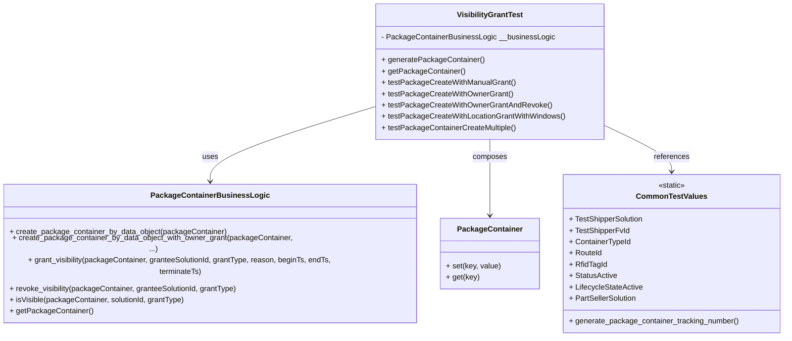
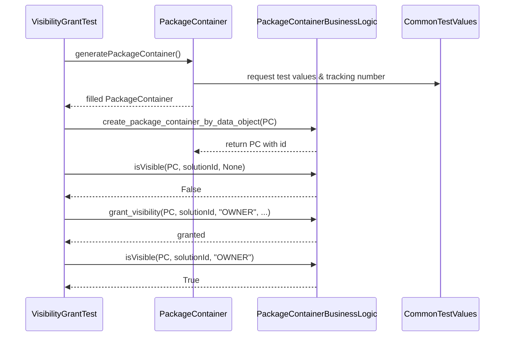

# Diagram: partview_core/partview_service/partview_service/tests/framework/VisibilityGrantTest.py

> Auto-generated by Obscura crawlers

## Diagram 1

### SVG

<svg id="container" width="1657.3828125" xmlns="http://www.w3.org/2000/svg" class="classDiagram" height="714" viewBox="0 0 1657.3828125 714" role="graphics-document document" aria-roledescription="class"><g><defs><marker id="container_class-aggregationStart" class="marker aggregation class" refX="18" refY="7" markerWidth="190" markerHeight="240" orient="auto"><path d="M 18,7 L9,13 L1,7 L9,1 Z"></path></marker></defs><defs><marker id="container_class-aggregationEnd" class="marker aggregation class" refX="1" refY="7" markerWidth="20" markerHeight="28" orient="auto"><path d="M 18,7 L9,13 L1,7 L9,1 Z"></path></marker></defs><defs><marker id="container_class-extensionStart" class="marker extension class" refX="18" refY="7" markerWidth="190" markerHeight="240" orient="auto"><path d="M 1,7 L18,13 V 1 Z"></path></marker></defs><defs><marker id="container_class-extensionEnd" class="marker extension class" refX="1" refY="7" markerWidth="20" markerHeight="28" orient="auto"><path d="M 1,1 V 13 L18,7 Z"></path></marker></defs><defs><marker id="container_class-compositionStart" class="marker composition class" refX="18" refY="7" markerWidth="190" markerHeight="240" orient="auto"><path d="M 18,7 L9,13 L1,7 L9,1 Z"></path></marker></defs><defs><marker id="container_class-compositionEnd" class="marker composition class" refX="1" refY="7" markerWidth="20" markerHeight="28" orient="auto"><path d="M 18,7 L9,13 L1,7 L9,1 Z"></path></marker></defs><defs><marker id="container_class-dependencyStart" class="marker dependency class" refX="6" refY="7" markerWidth="190" markerHeight="240" orient="auto"><path d="M 5,7 L9,13 L1,7 L9,1 Z"></path></marker></defs><defs><marker id="container_class-dependencyEnd" class="marker dependency class" refX="13" refY="7" markerWidth="20" markerHeight="28" orient="auto"><path d="M 18,7 L9,13 L14,7 L9,1 Z"></path></marker></defs><defs><marker id="container_class-lollipopStart" class="marker lollipop class" refX="13" refY="7" markerWidth="190" markerHeight="240" orient="auto"><circle stroke="black" fill="transparent" cx="7" cy="7" r="6"></circle></marker></defs><defs><marker id="container_class-lollipopEnd" class="marker lollipop class" refX="1" refY="7" markerWidth="190" markerHeight="240" orient="auto"><circle stroke="black" fill="transparent" cx="7" cy="7" r="6"></circle></marker></defs><g class="root"><g class="clusters"></g><g class="edgePaths"><path d="M803.172,224.874L744.107,242.895C685.042,260.916,566.911,296.958,507.846,327.646C448.781,358.333,448.781,383.667,448.781,396.333L448.781,409" id="id_VisibilityGrantTest_PackageContainerBusinessLogic_1" class="edge-thickness-normal edge-pattern-solid relation" style=";;;" data-edge="true" data-et="edge" data-id="id_VisibilityGrantTest_PackageContainerBusinessLogic_1" data-points="W3sieCI6ODAzLjE3MTg3NSwieSI6MjI0Ljg3NDMzOTg5NTk2MzY2fSx7IngiOjQ0OC43ODEyNSwieSI6MzMzfSx7IngiOjQ0OC43ODEyNSwieSI6NDE1fV0=" marker-end="url(#container_class-dependencyEnd)"></path><path d="M1042.023,296L1042.023,302.167C1042.023,308.333,1042.023,320.667,1042.023,347.5C1042.023,374.333,1042.023,415.667,1042.023,436.333L1042.023,457" id="id_VisibilityGrantTest_PackageContainer_2" class="edge-thickness-normal edge-pattern-solid relation" style=";;;" data-edge="true" data-et="edge" data-id="id_VisibilityGrantTest_PackageContainer_2" data-points="W3sieCI6MTA0Mi4wMjM0Mzc1LCJ5IjoyOTZ9LHsieCI6MTA0Mi4wMjM0Mzc1LCJ5IjozMzN9LHsieCI6MTA0Mi4wMjM0Mzc1LCJ5Ijo0NjN9XQ==" marker-end="url(#container_class-dependencyEnd)"></path><path d="M1280.875,265.796L1304.385,276.996C1327.895,288.197,1374.914,310.599,1398.424,326.966C1421.934,343.333,1421.934,353.667,1421.934,358.833L1421.934,364" id="id_VisibilityGrantTest_CommonTestValues_3" class="edge-thickness-normal edge-pattern-solid relation" style=";;;" data-edge="true" data-et="edge" data-id="id_VisibilityGrantTest_CommonTestValues_3" data-points="W3sieCI6MTI4MC44NzUsInkiOjI2NS43OTU2NzUzNzU1NTEzNX0seyJ4IjoxNDIxLjkzMzU5Mzc1LCJ5IjozMzN9LHsieCI6MTQyMS45MzM1OTM3NSwieSI6MzcwfV0=" marker-end="url(#container_class-dependencyEnd)"></path></g><g class="edgeLabels"><g class="edgeLabel" transform="translate(448.78125, 333)"><g class="label" data-id="id_VisibilityGrantTest_PackageContainerBusinessLogic_1" transform="translate(-16.4921875, -12)"><foreignObject width="32.984375" height="24">

uses

</foreignObject></g></g><g class="edgeLabel" transform="translate(1042.0234375, 333)"><g class="label" data-id="id_VisibilityGrantTest_PackageContainer_2" transform="translate(-36.453125, -12)"><foreignObject width="72.90625" height="24">

composes

</foreignObject></g></g><g class="edgeLabel" transform="translate(1421.93359375, 333)"><g class="label" data-id="id_VisibilityGrantTest_CommonTestValues_3" transform="translate(-37.828125, -12)"><foreignObject width="75.65625" height="24">

references

</foreignObject></g></g></g><g class="nodes"><g class="node default" id="classId-VisibilityGrantTest-0" transform="translate(1042.0234375, 152)"><g class="basic label-container"><path d="M-238.8515625 -144 L238.8515625 -144 L238.8515625 144 L-238.8515625 144" stroke="none" stroke-width="0" fill="#ECECFF" style=""></path><path d="M-238.8515625 -144 C-120.31822774435061 -144, -1.7848929887012162 -144, 238.8515625 -144 M-238.8515625 -144 C-123.61381397595906 -144, -8.376065451918123 -144, 238.8515625 -144 M238.8515625 -144 C238.8515625 -46.67369271332508, 238.8515625 50.65261457334984, 238.8515625 144 M238.8515625 -144 C238.8515625 -56.02131354327675, 238.8515625 31.957372913446505, 238.8515625 144 M238.8515625 144 C84.70741245963265 144, -69.4367375807347 144, -238.8515625 144 M238.8515625 144 C107.66750861878461 144, -23.516545262430782 144, -238.8515625 144 M-238.8515625 144 C-238.8515625 29.501070685683757, -238.8515625 -84.99785862863249, -238.8515625 -144 M-238.8515625 144 C-238.8515625 79.53024419887117, -238.8515625 15.060488397742347, -238.8515625 -144" stroke="#9370DB" stroke-width="1.3" fill="none" stroke-dasharray="0 0" style=""></path></g><g class="annotation-group text" transform="translate(0, -120)"></g><g class="label-group text" transform="translate(-67.21875, -120)"><g class="label" style="font-weight: bolder" transform="translate(0,-12)"><foreignObject width="134.4375" height="24">

VisibilityGrantTest

</foreignObject></g></g><g class="members-group text" transform="translate(-226.8515625, -72)"><g class="label" style="" transform="translate(0,-12)"><foreignObject width="362.34375" height="24">

- PackageContainerBusinessLogic __businessLogic

</foreignObject></g></g><g class="methods-group text" transform="translate(-226.8515625, -24)"><g class="label" style="" transform="translate(0,-12)"><foreignObject width="214.609375" height="24">

+ generatePackageContainer()

</foreignObject></g><g class="label" style="" transform="translate(0,12)"><foreignObject width="173.71875" height="24">

+ getPackageContainer()

</foreignObject></g><g class="label" style="" transform="translate(0,36)"><foreignObject width="279.609375" height="24">

+ testPackageCreateWithManualGrant()

</foreignObject></g><g class="label" style="" transform="translate(0,60)"><foreignObject width="273.359375" height="24">

+ testPackageCreateWithOwnerGrant()

</foreignObject></g><g class="label" style="" transform="translate(0,84)"><foreignObject width="353.484375" height="24">

+ testPackageCreateWithOwnerGrantAndRevoke()

</foreignObject></g><g class="label" style="" transform="translate(0,108)"><foreignObject width="386.484375" height="24">

+ testPackageCreateWithLocationGrantWithWindows()

</foreignObject></g><g class="label" style="" transform="translate(0,132)"><foreignObject width="284.171875" height="24">

+ testPackageContainerCreateMultiple()

</foreignObject></g></g><g class="divider" style=""><path d="M-238.8515625 -96 C-49.82515747789398 -96, 139.20124754421204 -96, 238.8515625 -96 M-238.8515625 -96 C-63.42844755642267 -96, 111.99466738715466 -96, 238.8515625 -96" stroke="#9370DB" stroke-width="1.3" fill="none" stroke-dasharray="0 0" style=""></path></g><g class="divider" style=""><path d="M-238.8515625 -48 C-105.2166859862158 -48, 28.418190527568413 -48, 238.8515625 -48 M-238.8515625 -48 C-85.58823218321217 -48, 67.67509813357566 -48, 238.8515625 -48" stroke="#9370DB" stroke-width="1.3" fill="none" stroke-dasharray="0 0" style=""></path></g></g><g class="node default" id="classId-PackageContainerBusinessLogic-1" transform="translate(448.78125, 538)"><g class="basic label-container"><path d="M-440.78125 -123 L440.78125 -123 L440.78125 123 L-440.78125 123" stroke="none" stroke-width="0" fill="#ECECFF" style=""></path><path d="M-440.78125 -123 C-250.8154245031139 -123, -60.84959900622778 -123, 440.78125 -123 M-440.78125 -123 C-184.9073795135785 -123, 70.96649097284302 -123, 440.78125 -123 M440.78125 -123 C440.78125 -40.80486294992616, 440.78125 41.39027410014768, 440.78125 123 M440.78125 -123 C440.78125 -46.05372202182605, 440.78125 30.892555956347906, 440.78125 123 M440.78125 123 C137.13536419489685 123, -166.5105216102063 123, -440.78125 123 M440.78125 123 C128.72680885880567 123, -183.32763228238866 123, -440.78125 123 M-440.78125 123 C-440.78125 56.17554338406947, -440.78125 -10.648913231861059, -440.78125 -123 M-440.78125 123 C-440.78125 68.23330718562383, -440.78125 13.466614371247644, -440.78125 -123" stroke="#9370DB" stroke-width="1.3" fill="none" stroke-dasharray="0 0" style=""></path></g><g class="annotation-group text" transform="translate(0, -99)"></g><g class="label-group text" transform="translate(-116.859375, -99)"><g class="label" style="font-weight: bolder" transform="translate(0,-12)"><foreignObject width="233.71875" height="24">

PackageContainerBusinessLogic

</foreignObject></g></g><g class="members-group text" transform="translate(-428.78125, -51)"></g><g class="methods-group text" transform="translate(-428.78125, -21)"><g class="label" style="" transform="translate(0,-12)"><foreignObject width="458.796875" height="24">

+ create_package_container_by_data_object(packageContainer)

</foreignObject></g><g class="label" style="" transform="translate(0,12)"><foreignObject width="614.3125" height="24">

+ create_package_container_by_data_object_with_owner_grant(packageContainer, ...)

</foreignObject></g><g class="label" style="" transform="translate(0,36)"><foreignObject width="740.703125" height="24">

+ grant_visibility(packageContainer, granteeSolutionId, grantType, reason, beginTs, endTs, terminateTs)

</foreignObject></g><g class="label" style="" transform="translate(0,60)"><foreignObject width="485.78125" height="24">

+ revoke_visibility(packageContainer, granteeSolutionId, grantType)

</foreignObject></g><g class="label" style="" transform="translate(0,84)"><foreignObject width="372.8125" height="24">

+ isVisible(packageContainer, solutionId, grantType)

</foreignObject></g><g class="label" style="" transform="translate(0,108)"><foreignObject width="173.71875" height="24">

+ getPackageContainer()

</foreignObject></g></g><g class="divider" style=""><path d="M-440.78125 -75 C-140.53443450753997 -75, 159.71238098492006 -75, 440.78125 -75 M-440.78125 -75 C-251.73422149706826 -75, -62.687192994136524 -75, 440.78125 -75" stroke="#9370DB" stroke-width="1.3" fill="none" stroke-dasharray="0 0" style=""></path></g><g class="divider" style=""><path d="M-440.78125 -51 C-183.69696483547017 -51, 73.38732032905966 -51, 440.78125 -51 M-440.78125 -51 C-216.19514273985448 -51, 8.39096452029105 -51, 440.78125 -51" stroke="#9370DB" stroke-width="1.3" fill="none" stroke-dasharray="0 0" style=""></path></g></g><g class="node default" id="classId-PackageContainer-2" transform="translate(1042.0234375, 538)"><g class="basic label-container"><path d="M-102.4609375 -75 L102.4609375 -75 L102.4609375 75 L-102.4609375 75" stroke="none" stroke-width="0" fill="#ECECFF" style=""></path><path d="M-102.4609375 -75 C-24.421883006680048 -75, 53.617171486639904 -75, 102.4609375 -75 M-102.4609375 -75 C-48.28632688900647 -75, 5.888283721987065 -75, 102.4609375 -75 M102.4609375 -75 C102.4609375 -24.187110803530814, 102.4609375 26.625778392938372, 102.4609375 75 M102.4609375 -75 C102.4609375 -34.413877158674765, 102.4609375 6.17224568265047, 102.4609375 75 M102.4609375 75 C37.09447686034834 75, -28.271983779303326 75, -102.4609375 75 M102.4609375 75 C29.366416802115992 75, -43.728103895768015 75, -102.4609375 75 M-102.4609375 75 C-102.4609375 40.8156701412072, -102.4609375 6.631340282414399, -102.4609375 -75 M-102.4609375 75 C-102.4609375 20.54929428790274, -102.4609375 -33.90141142419452, -102.4609375 -75" stroke="#9370DB" stroke-width="1.3" fill="none" stroke-dasharray="0 0" style=""></path></g><g class="annotation-group text" transform="translate(0, -51)"></g><g class="label-group text" transform="translate(-65.453125, -51)"><g class="label" style="font-weight: bolder" transform="translate(0,-12)"><foreignObject width="130.90625" height="24">

PackageContainer

</foreignObject></g></g><g class="members-group text" transform="translate(-90.4609375, -3)"></g><g class="methods-group text" transform="translate(-90.4609375, 27)"><g class="label" style="" transform="translate(0,-12)"><foreignObject width="115.46875" height="24">

+ set(key, value)

</foreignObject></g><g class="label" style="" transform="translate(0,12)"><foreignObject width="69.734375" height="24">

+ get(key)

</foreignObject></g></g><g class="divider" style=""><path d="M-102.4609375 -27 C-48.77384262874297 -27, 4.913252242514062 -27, 102.4609375 -27 M-102.4609375 -27 C-43.15248397504059 -27, 16.155969549918822 -27, 102.4609375 -27" stroke="#9370DB" stroke-width="1.3" fill="none" stroke-dasharray="0 0" style=""></path></g><g class="divider" style=""><path d="M-102.4609375 -3 C-56.97904184801518 -3, -11.497146196030357 -3, 102.4609375 -3 M-102.4609375 -3 C-47.4580378650897 -3, 7.544861769820599 -3, 102.4609375 -3" stroke="#9370DB" stroke-width="1.3" fill="none" stroke-dasharray="0 0" style=""></path></g></g><g class="node default" id="classId-CommonTestValues-3" transform="translate(1421.93359375, 538)"><g class="basic label-container"><path d="M-227.44921875 -168 L227.44921875 -168 L227.44921875 168 L-227.44921875 168" stroke="none" stroke-width="0" fill="#ECECFF" style=""></path><path d="M-227.44921875 -168 C-104.93282578217637 -168, 17.58356718564727 -168, 227.44921875 -168 M-227.44921875 -168 C-123.90983364680616 -168, -20.370448543612326 -168, 227.44921875 -168 M227.44921875 -168 C227.44921875 -63.62344221607161, 227.44921875 40.75311556785678, 227.44921875 168 M227.44921875 -168 C227.44921875 -37.41627682764698, 227.44921875 93.16744634470604, 227.44921875 168 M227.44921875 168 C135.39868752195576 168, 43.34815629391153 168, -227.44921875 168 M227.44921875 168 C87.2709931255826 168, -52.90723249883479 168, -227.44921875 168 M-227.44921875 168 C-227.44921875 59.71688170225127, -227.44921875 -48.56623659549746, -227.44921875 -168 M-227.44921875 168 C-227.44921875 79.6831972451261, -227.44921875 -8.63360550974781, -227.44921875 -168" stroke="#9370DB" stroke-width="1.3" fill="none" stroke-dasharray="0 0" style=""></path></g><g class="annotation-group text" transform="translate(-29.0234375, -144)"><g class="label" style="" transform="translate(0,-12)"><foreignObject width="58.046875" height="24">

«static»

</foreignObject></g></g><g class="label-group text" transform="translate(-70.9453125, -120)"><g class="label" style="font-weight: bolder" transform="translate(0,-12)"><foreignObject width="141.890625" height="24">

CommonTestValues

</foreignObject></g></g><g class="members-group text" transform="translate(-215.44921875, -72)"><g class="label" style="" transform="translate(0,-12)"><foreignObject width="159.171875" height="24">

+ TestShipperSolution

</foreignObject></g><g class="label" style="" transform="translate(0,12)"><foreignObject width="127.5625" height="24">

+ TestShipperFvId

</foreignObject></g><g class="label" style="" transform="translate(0,36)"><foreignObject width="130.765625" height="24">

+ ContainerTypeId

</foreignObject></g><g class="label" style="" transform="translate(0,60)"><foreignObject width="68.875" height="24">

+ RouteId

</foreignObject></g><g class="label" style="" transform="translate(0,84)"><foreignObject width="79.296875" height="24">

+ RfidTagId

</foreignObject></g><g class="label" style="" transform="translate(0,108)"><foreignObject width="101.515625" height="24">

+ StatusActive

</foreignObject></g><g class="label" style="" transform="translate(0,132)"><foreignObject width="156.046875" height="24">

+ LifecycleStateActive

</foreignObject></g><g class="label" style="" transform="translate(0,156)"><foreignObject width="144.015625" height="24">

+ PartSellerSolution

</foreignObject></g></g><g class="methods-group text" transform="translate(-215.44921875, 144)"><g class="label" style="" transform="translate(0,-12)"><foreignObject width="359.953125" height="24">

+ generate_package_container_tracking_number()

</foreignObject></g></g><g class="divider" style=""><path d="M-227.44921875 -96 C-48.89381159932782 -96, 129.66159555134436 -96, 227.44921875 -96 M-227.44921875 -96 C-124.34345305327827 -96, -21.237687356556535 -96, 227.44921875 -96" stroke="#9370DB" stroke-width="1.3" fill="none" stroke-dasharray="0 0" style=""></path></g><g class="divider" style=""><path d="M-227.44921875 120 C-104.05387033214977 120, 19.34147808570046 120, 227.44921875 120 M-227.44921875 120 C-124.28985411089523 120, -21.13048947179047 120, 227.44921875 120" stroke="#9370DB" stroke-width="1.3" fill="none" stroke-dasharray="0 0" style=""></path></g></g></g></g></g></svg>

## Diagram 2

### SVG

<svg id="container" width="1032.5" xmlns="http://www.w3.org/2000/svg" height="699" viewBox="-50 -10 1032.5 699" role="graphics-document document" aria-roledescription="sequence"><g><rect x="772.5" y="613" fill="#eaeaea" stroke="#666" width="160" height="65" name="CV" rx="3" ry="3" class="actor actor-bottom"></rect><text x="852.5" y="645.5" dominant-baseline="central" alignment-baseline="central" class="actor actor-box" style="text-anchor: middle; font-size: 16px; font-weight: 400;"><tspan x="852.5" dy="0">CommonTestValues</tspan></text></g><g><rect x="472.5" y="613" fill="#eaeaea" stroke="#666" width="250" height="65" name="BL" rx="3" ry="3" class="actor actor-bottom"></rect><text x="597.5" y="645.5" dominant-baseline="central" alignment-baseline="central" class="actor actor-box" style="text-anchor: middle; font-size: 16px; font-weight: 400;"><tspan x="597.5" dy="0">PackageContainerBusinessLogic</tspan></text></g><g><rect x="272.5" y="613" fill="#eaeaea" stroke="#666" width="150" height="65" name="PC" rx="3" ry="3" class="actor actor-bottom"></rect><text x="347.5" y="645.5" dominant-baseline="central" alignment-baseline="central" class="actor actor-box" style="text-anchor: middle; font-size: 16px; font-weight: 400;"><tspan x="347.5" dy="0">PackageContainer</tspan></text></g><g><rect x="0" y="613" fill="#eaeaea" stroke="#666" width="151" height="65" name="Test" rx="3" ry="3" class="actor actor-bottom"></rect><text x="75.5" y="645.5" dominant-baseline="central" alignment-baseline="central" class="actor actor-box" style="text-anchor: middle; font-size: 16px; font-weight: 400;"><tspan x="75.5" dy="0">VisibilityGrantTest</tspan></text></g><g><line id="actor3" x1="852.5" y1="65" x2="852.5" y2="613" class="actor-line 200" stroke-width="0.5px" stroke="#999" name="CV"></line><g id="root-3"><rect x="772.5" y="0" fill="#eaeaea" stroke="#666" width="160" height="65" name="CV" rx="3" ry="3" class="actor actor-top"></rect><text x="852.5" y="32.5" dominant-baseline="central" alignment-baseline="central" class="actor actor-box" style="text-anchor: middle; font-size: 16px; font-weight: 400;"><tspan x="852.5" dy="0">CommonTestValues</tspan></text></g></g><g><line id="actor2" x1="597.5" y1="65" x2="597.5" y2="613" class="actor-line 200" stroke-width="0.5px" stroke="#999" name="BL"></line><g id="root-2"><rect x="472.5" y="0" fill="#eaeaea" stroke="#666" width="250" height="65" name="BL" rx="3" ry="3" class="actor actor-top"></rect><text x="597.5" y="32.5" dominant-baseline="central" alignment-baseline="central" class="actor actor-box" style="text-anchor: middle; font-size: 16px; font-weight: 400;"><tspan x="597.5" dy="0">PackageContainerBusinessLogic</tspan></text></g></g><g><line id="actor1" x1="347.5" y1="65" x2="347.5" y2="613" class="actor-line 200" stroke-width="0.5px" stroke="#999" name="PC"></line><g id="root-1"><rect x="272.5" y="0" fill="#eaeaea" stroke="#666" width="150" height="65" name="PC" rx="3" ry="3" class="actor actor-top"></rect><text x="347.5" y="32.5" dominant-baseline="central" alignment-baseline="central" class="actor actor-box" style="text-anchor: middle; font-size: 16px; font-weight: 400;"><tspan x="347.5" dy="0">PackageContainer</tspan></text></g></g><g><line id="actor0" x1="75.5" y1="65" x2="75.5" y2="613" class="actor-line 200" stroke-width="0.5px" stroke="#999" name="Test"></line><g id="root-0"><rect x="0" y="0" fill="#eaeaea" stroke="#666" width="151" height="65" name="Test" rx="3" ry="3" class="actor actor-top"></rect><text x="75.5" y="32.5" dominant-baseline="central" alignment-baseline="central" class="actor actor-box" style="text-anchor: middle; font-size: 16px; font-weight: 400;"><tspan x="75.5" dy="0">VisibilityGrantTest</tspan></text></g></g><g></g><defs><symbol id="computer" width="24" height="24"><path transform="scale(.5)" d="M2 2v13h20v-13h-20zm18 11h-16v-9h16v9zm-10.228 6l.466-1h3.524l.467 1h-4.457zm14.228 3h-24l2-6h2.104l-1.33 4h18.45l-1.297-4h2.073l2 6zm-5-10h-14v-7h14v7z"></path></symbol></defs><defs><symbol id="database" fill-rule="evenodd" clip-rule="evenodd"><path transform="scale(.5)" d="M12.258.001l.256.004.255.005.253.008.251.01.249.012.247.015.246.016.242.019.241.02.239.023.236.024.233.027.231.028.229.031.225.032.223.034.22.036.217.038.214.04.211.041.208.043.205.045.201.046.198.048.194.05.191.051.187.053.183.054.18.056.175.057.172.059.168.06.163.061.16.063.155.064.15.066.074.033.073.033.071.034.07.034.069.035.068.035.067.035.066.035.064.036.064.036.062.036.06.036.06.037.058.037.058.037.055.038.055.038.053.038.052.038.051.039.05.039.048.039.047.039.045.04.044.04.043.04.041.04.04.041.039.041.037.041.036.041.034.041.033.042.032.042.03.042.029.042.027.042.026.043.024.043.023.043.021.043.02.043.018.044.017.043.015.044.013.044.012.044.011.045.009.044.007.045.006.045.004.045.002.045.001.045v17l-.001.045-.002.045-.004.045-.006.045-.007.045-.009.044-.011.045-.012.044-.013.044-.015.044-.017.043-.018.044-.02.043-.021.043-.023.043-.024.043-.026.043-.027.042-.029.042-.03.042-.032.042-.033.042-.034.041-.036.041-.037.041-.039.041-.04.041-.041.04-.043.04-.044.04-.045.04-.047.039-.048.039-.05.039-.051.039-.052.038-.053.038-.055.038-.055.038-.058.037-.058.037-.06.037-.06.036-.062.036-.064.036-.064.036-.066.035-.067.035-.068.035-.069.035-.07.034-.071.034-.073.033-.074.033-.15.066-.155.064-.16.063-.163.061-.168.06-.172.059-.175.057-.18.056-.183.054-.187.053-.191.051-.194.05-.198.048-.201.046-.205.045-.208.043-.211.041-.214.04-.217.038-.22.036-.223.034-.225.032-.229.031-.231.028-.233.027-.236.024-.239.023-.241.02-.242.019-.246.016-.247.015-.249.012-.251.01-.253.008-.255.005-.256.004-.258.001-.258-.001-.256-.004-.255-.005-.253-.008-.251-.01-.249-.012-.247-.015-.245-.016-.243-.019-.241-.02-.238-.023-.236-.024-.234-.027-.231-.028-.228-.031-.226-.032-.223-.034-.22-.036-.217-.038-.214-.04-.211-.041-.208-.043-.204-.045-.201-.046-.198-.048-.195-.05-.19-.051-.187-.053-.184-.054-.179-.056-.176-.057-.172-.059-.167-.06-.164-.061-.159-.063-.155-.064-.151-.066-.074-.033-.072-.033-.072-.034-.07-.034-.069-.035-.068-.035-.067-.035-.066-.035-.064-.036-.063-.036-.062-.036-.061-.036-.06-.037-.058-.037-.057-.037-.056-.038-.055-.038-.053-.038-.052-.038-.051-.039-.049-.039-.049-.039-.046-.039-.046-.04-.044-.04-.043-.04-.041-.04-.04-.041-.039-.041-.037-.041-.036-.041-.034-.041-.033-.042-.032-.042-.03-.042-.029-.042-.027-.042-.026-.043-.024-.043-.023-.043-.021-.043-.02-.043-.018-.044-.017-.043-.015-.044-.013-.044-.012-.044-.011-.045-.009-.044-.007-.045-.006-.045-.004-.045-.002-.045-.001-.045v-17l.001-.045.002-.045.004-.045.006-.045.007-.045.009-.044.011-.045.012-.044.013-.044.015-.044.017-.043.018-.044.02-.043.021-.043.023-.043.024-.043.026-.043.027-.042.029-.042.03-.042.032-.042.033-.042.034-.041.036-.041.037-.041.039-.041.04-.041.041-.04.043-.04.044-.04.046-.04.046-.039.049-.039.049-.039.051-.039.052-.038.053-.038.055-.038.056-.038.057-.037.058-.037.06-.037.061-.036.062-.036.063-.036.064-.036.066-.035.067-.035.068-.035.069-.035.07-.034.072-.034.072-.033.074-.033.151-.066.155-.064.159-.063.164-.061.167-.06.172-.059.176-.057.179-.056.184-.054.187-.053.19-.051.195-.05.198-.048.201-.046.204-.045.208-.043.211-.041.214-.04.217-.038.22-.036.223-.034.226-.032.228-.031.231-.028.234-.027.236-.024.238-.023.241-.02.243-.019.245-.016.247-.015.249-.012.251-.01.253-.008.255-.005.256-.004.258-.001.258.001zm-9.258 20.499v.01l.001.021.003.021.004.022.005.021.006.022.007.022.009.023.01.022.011.023.012.023.013.023.015.023.016.024.017.023.018.024.019.024.021.024.022.025.023.024.024.025.052.049.056.05.061.051.066.051.07.051.075.051.079.052.084.052.088.052.092.052.097.052.102.051.105.052.11.052.114.051.119.051.123.051.127.05.131.05.135.05.139.048.144.049.147.047.152.047.155.047.16.045.163.045.167.043.171.043.176.041.178.041.183.039.187.039.19.037.194.035.197.035.202.033.204.031.209.03.212.029.216.027.219.025.222.024.226.021.23.02.233.018.236.016.24.015.243.012.246.01.249.008.253.005.256.004.259.001.26-.001.257-.004.254-.005.25-.008.247-.011.244-.012.241-.014.237-.016.233-.018.231-.021.226-.021.224-.024.22-.026.216-.027.212-.028.21-.031.205-.031.202-.034.198-.034.194-.036.191-.037.187-.039.183-.04.179-.04.175-.042.172-.043.168-.044.163-.045.16-.046.155-.046.152-.047.148-.048.143-.049.139-.049.136-.05.131-.05.126-.05.123-.051.118-.052.114-.051.11-.052.106-.052.101-.052.096-.052.092-.052.088-.053.083-.051.079-.052.074-.052.07-.051.065-.051.06-.051.056-.05.051-.05.023-.024.023-.025.021-.024.02-.024.019-.024.018-.024.017-.024.015-.023.014-.024.013-.023.012-.023.01-.023.01-.022.008-.022.006-.022.006-.022.004-.022.004-.021.001-.021.001-.021v-4.127l-.077.055-.08.053-.083.054-.085.053-.087.052-.09.052-.093.051-.095.05-.097.05-.1.049-.102.049-.105.048-.106.047-.109.047-.111.046-.114.045-.115.045-.118.044-.12.043-.122.042-.124.042-.126.041-.128.04-.13.04-.132.038-.134.038-.135.037-.138.037-.139.035-.142.035-.143.034-.144.033-.147.032-.148.031-.15.03-.151.03-.153.029-.154.027-.156.027-.158.026-.159.025-.161.024-.162.023-.163.022-.165.021-.166.02-.167.019-.169.018-.169.017-.171.016-.173.015-.173.014-.175.013-.175.012-.177.011-.178.01-.179.008-.179.008-.181.006-.182.005-.182.004-.184.003-.184.002h-.37l-.184-.002-.184-.003-.182-.004-.182-.005-.181-.006-.179-.008-.179-.008-.178-.01-.176-.011-.176-.012-.175-.013-.173-.014-.172-.015-.171-.016-.17-.017-.169-.018-.167-.019-.166-.02-.165-.021-.163-.022-.162-.023-.161-.024-.159-.025-.157-.026-.156-.027-.155-.027-.153-.029-.151-.03-.15-.03-.148-.031-.146-.032-.145-.033-.143-.034-.141-.035-.14-.035-.137-.037-.136-.037-.134-.038-.132-.038-.13-.04-.128-.04-.126-.041-.124-.042-.122-.042-.12-.044-.117-.043-.116-.045-.113-.045-.112-.046-.109-.047-.106-.047-.105-.048-.102-.049-.1-.049-.097-.05-.095-.05-.093-.052-.09-.051-.087-.052-.085-.053-.083-.054-.08-.054-.077-.054v4.127zm0-5.654v.011l.001.021.003.021.004.021.005.022.006.022.007.022.009.022.01.022.011.023.012.023.013.023.015.024.016.023.017.024.018.024.019.024.021.024.022.024.023.025.024.024.052.05.056.05.061.05.066.051.07.051.075.052.079.051.084.052.088.052.092.052.097.052.102.052.105.052.11.051.114.051.119.052.123.05.127.051.131.05.135.049.139.049.144.048.147.048.152.047.155.046.16.045.163.045.167.044.171.042.176.042.178.04.183.04.187.038.19.037.194.036.197.034.202.033.204.032.209.03.212.028.216.027.219.025.222.024.226.022.23.02.233.018.236.016.24.014.243.012.246.01.249.008.253.006.256.003.259.001.26-.001.257-.003.254-.006.25-.008.247-.01.244-.012.241-.015.237-.016.233-.018.231-.02.226-.022.224-.024.22-.025.216-.027.212-.029.21-.03.205-.032.202-.033.198-.035.194-.036.191-.037.187-.039.183-.039.179-.041.175-.042.172-.043.168-.044.163-.045.16-.045.155-.047.152-.047.148-.048.143-.048.139-.05.136-.049.131-.05.126-.051.123-.051.118-.051.114-.052.11-.052.106-.052.101-.052.096-.052.092-.052.088-.052.083-.052.079-.052.074-.051.07-.052.065-.051.06-.05.056-.051.051-.049.023-.025.023-.024.021-.025.02-.024.019-.024.018-.024.017-.024.015-.023.014-.023.013-.024.012-.022.01-.023.01-.023.008-.022.006-.022.006-.022.004-.021.004-.022.001-.021.001-.021v-4.139l-.077.054-.08.054-.083.054-.085.052-.087.053-.09.051-.093.051-.095.051-.097.05-.1.049-.102.049-.105.048-.106.047-.109.047-.111.046-.114.045-.115.044-.118.044-.12.044-.122.042-.124.042-.126.041-.128.04-.13.039-.132.039-.134.038-.135.037-.138.036-.139.036-.142.035-.143.033-.144.033-.147.033-.148.031-.15.03-.151.03-.153.028-.154.028-.156.027-.158.026-.159.025-.161.024-.162.023-.163.022-.165.021-.166.02-.167.019-.169.018-.169.017-.171.016-.173.015-.173.014-.175.013-.175.012-.177.011-.178.009-.179.009-.179.007-.181.007-.182.005-.182.004-.184.003-.184.002h-.37l-.184-.002-.184-.003-.182-.004-.182-.005-.181-.007-.179-.007-.179-.009-.178-.009-.176-.011-.176-.012-.175-.013-.173-.014-.172-.015-.171-.016-.17-.017-.169-.018-.167-.019-.166-.02-.165-.021-.163-.022-.162-.023-.161-.024-.159-.025-.157-.026-.156-.027-.155-.028-.153-.028-.151-.03-.15-.03-.148-.031-.146-.033-.145-.033-.143-.033-.141-.035-.14-.036-.137-.036-.136-.037-.134-.038-.132-.039-.13-.039-.128-.04-.126-.041-.124-.042-.122-.043-.12-.043-.117-.044-.116-.044-.113-.046-.112-.046-.109-.046-.106-.047-.105-.048-.102-.049-.1-.049-.097-.05-.095-.051-.093-.051-.09-.051-.087-.053-.085-.052-.083-.054-.08-.054-.077-.054v4.139zm0-5.666v.011l.001.02.003.022.004.021.005.022.006.021.007.022.009.023.01.022.011.023.012.023.013.023.015.023.016.024.017.024.018.023.019.024.021.025.022.024.023.024.024.025.052.05.056.05.061.05.066.051.07.051.075.052.079.051.084.052.088.052.092.052.097.052.102.052.105.051.11.052.114.051.119.051.123.051.127.05.131.05.135.05.139.049.144.048.147.048.152.047.155.046.16.045.163.045.167.043.171.043.176.042.178.04.183.04.187.038.19.037.194.036.197.034.202.033.204.032.209.03.212.028.216.027.219.025.222.024.226.021.23.02.233.018.236.017.24.014.243.012.246.01.249.008.253.006.256.003.259.001.26-.001.257-.003.254-.006.25-.008.247-.01.244-.013.241-.014.237-.016.233-.018.231-.02.226-.022.224-.024.22-.025.216-.027.212-.029.21-.03.205-.032.202-.033.198-.035.194-.036.191-.037.187-.039.183-.039.179-.041.175-.042.172-.043.168-.044.163-.045.16-.045.155-.047.152-.047.148-.048.143-.049.139-.049.136-.049.131-.051.126-.05.123-.051.118-.052.114-.051.11-.052.106-.052.101-.052.096-.052.092-.052.088-.052.083-.052.079-.052.074-.052.07-.051.065-.051.06-.051.056-.05.051-.049.023-.025.023-.025.021-.024.02-.024.019-.024.018-.024.017-.024.015-.023.014-.024.013-.023.012-.023.01-.022.01-.023.008-.022.006-.022.006-.022.004-.022.004-.021.001-.021.001-.021v-4.153l-.077.054-.08.054-.083.053-.085.053-.087.053-.09.051-.093.051-.095.051-.097.05-.1.049-.102.048-.105.048-.106.048-.109.046-.111.046-.114.046-.115.044-.118.044-.12.043-.122.043-.124.042-.126.041-.128.04-.13.039-.132.039-.134.038-.135.037-.138.036-.139.036-.142.034-.143.034-.144.033-.147.032-.148.032-.15.03-.151.03-.153.028-.154.028-.156.027-.158.026-.159.024-.161.024-.162.023-.163.023-.165.021-.166.02-.167.019-.169.018-.169.017-.171.016-.173.015-.173.014-.175.013-.175.012-.177.01-.178.01-.179.009-.179.007-.181.006-.182.006-.182.004-.184.003-.184.001-.185.001-.185-.001-.184-.001-.184-.003-.182-.004-.182-.006-.181-.006-.179-.007-.179-.009-.178-.01-.176-.01-.176-.012-.175-.013-.173-.014-.172-.015-.171-.016-.17-.017-.169-.018-.167-.019-.166-.02-.165-.021-.163-.023-.162-.023-.161-.024-.159-.024-.157-.026-.156-.027-.155-.028-.153-.028-.151-.03-.15-.03-.148-.032-.146-.032-.145-.033-.143-.034-.141-.034-.14-.036-.137-.036-.136-.037-.134-.038-.132-.039-.13-.039-.128-.041-.126-.041-.124-.041-.122-.043-.12-.043-.117-.044-.116-.044-.113-.046-.112-.046-.109-.046-.106-.048-.105-.048-.102-.048-.1-.05-.097-.049-.095-.051-.093-.051-.09-.052-.087-.052-.085-.053-.083-.053-.08-.054-.077-.054v4.153zm8.74-8.179l-.257.004-.254.005-.25.008-.247.011-.244.012-.241.014-.237.016-.233.018-.231.021-.226.022-.224.023-.22.026-.216.027-.212.028-.21.031-.205.032-.202.033-.198.034-.194.036-.191.038-.187.038-.183.04-.179.041-.175.042-.172.043-.168.043-.163.045-.16.046-.155.046-.152.048-.148.048-.143.048-.139.049-.136.05-.131.05-.126.051-.123.051-.118.051-.114.052-.11.052-.106.052-.101.052-.096.052-.092.052-.088.052-.083.052-.079.052-.074.051-.07.052-.065.051-.06.05-.056.05-.051.05-.023.025-.023.024-.021.024-.02.025-.019.024-.018.024-.017.023-.015.024-.014.023-.013.023-.012.023-.01.023-.01.022-.008.022-.006.023-.006.021-.004.022-.004.021-.001.021-.001.021.001.021.001.021.004.021.004.022.006.021.006.023.008.022.01.022.01.023.012.023.013.023.014.023.015.024.017.023.018.024.019.024.02.025.021.024.023.024.023.025.051.05.056.05.06.05.065.051.07.052.074.051.079.052.083.052.088.052.092.052.096.052.101.052.106.052.11.052.114.052.118.051.123.051.126.051.131.05.136.05.139.049.143.048.148.048.152.048.155.046.16.046.163.045.168.043.172.043.175.042.179.041.183.04.187.038.191.038.194.036.198.034.202.033.205.032.21.031.212.028.216.027.22.026.224.023.226.022.231.021.233.018.237.016.241.014.244.012.247.011.25.008.254.005.257.004.26.001.26-.001.257-.004.254-.005.25-.008.247-.011.244-.012.241-.014.237-.016.233-.018.231-.021.226-.022.224-.023.22-.026.216-.027.212-.028.21-.031.205-.032.202-.033.198-.034.194-.036.191-.038.187-.038.183-.04.179-.041.175-.042.172-.043.168-.043.163-.045.16-.046.155-.046.152-.048.148-.048.143-.048.139-.049.136-.05.131-.05.126-.051.123-.051.118-.051.114-.052.11-.052.106-.052.101-.052.096-.052.092-.052.088-.052.083-.052.079-.052.074-.051.07-.052.065-.051.06-.05.056-.05.051-.05.023-.025.023-.024.021-.024.02-.025.019-.024.018-.024.017-.023.015-.024.014-.023.013-.023.012-.023.01-.023.01-.022.008-.022.006-.023.006-.021.004-.022.004-.021.001-.021.001-.021-.001-.021-.001-.021-.004-.021-.004-.022-.006-.021-.006-.023-.008-.022-.01-.022-.01-.023-.012-.023-.013-.023-.014-.023-.015-.024-.017-.023-.018-.024-.019-.024-.02-.025-.021-.024-.023-.024-.023-.025-.051-.05-.056-.05-.06-.05-.065-.051-.07-.052-.074-.051-.079-.052-.083-.052-.088-.052-.092-.052-.096-.052-.101-.052-.106-.052-.11-.052-.114-.052-.118-.051-.123-.051-.126-.051-.131-.05-.136-.05-.139-.049-.143-.048-.148-.048-.152-.048-.155-.046-.16-.046-.163-.045-.168-.043-.172-.043-.175-.042-.179-.041-.183-.04-.187-.038-.191-.038-.194-.036-.198-.034-.202-.033-.205-.032-.21-.031-.212-.028-.216-.027-.22-.026-.224-.023-.226-.022-.231-.021-.233-.018-.237-.016-.241-.014-.244-.012-.247-.011-.25-.008-.254-.005-.257-.004-.26-.001-.26.001z"></path></symbol></defs><defs><symbol id="clock" width="24" height="24"><path transform="scale(.5)" d="M12 2c5.514 0 10 4.486 10 10s-4.486 10-10 10-10-4.486-10-10 4.486-10 10-10zm0-2c-6.627 0-12 5.373-12 12s5.373 12 12 12 12-5.373 12-12-5.373-12-12-12zm5.848 12.459c.202.038.202.333.001.372-1.907.361-6.045 1.111-6.547 1.111-.719 0-1.301-.582-1.301-1.301 0-.512.77-5.447 1.125-7.445.034-.192.312-.181.343.014l.985 6.238 5.394 1.011z"></path></symbol></defs><defs><marker id="arrowhead" refX="7.9" refY="5" markerUnits="userSpaceOnUse" markerWidth="12" markerHeight="12" orient="auto-start-reverse"><path d="M -1 0 L 10 5 L 0 10 z"></path></marker></defs><defs><marker id="crosshead" markerWidth="15" markerHeight="8" orient="auto" refX="4" refY="4.5"><path fill="none" stroke="#000000" stroke-width="1pt" d="M 1,2 L 6,7 M 6,2 L 1,7" style="stroke-dasharray: 0, 0;"></path></marker></defs><defs><marker id="filled-head" refX="15.5" refY="7" markerWidth="20" markerHeight="28" orient="auto"><path d="M 18,7 L9,13 L14,7 L9,1 Z"></path></marker></defs><defs><marker id="sequencenumber" refX="15" refY="15" markerWidth="60" markerHeight="40" orient="auto"><circle cx="15" cy="15" r="6"></circle></marker></defs><text x="210" y="80" text-anchor="middle" dominant-baseline="middle" alignment-baseline="middle" class="messageText" dy="1em" style="font-size: 16px; font-weight: 400;">generatePackageContainer()</text><line x1="76.5" y1="113" x2="343.5" y2="113" class="messageLine0" stroke-width="2" stroke="none" marker-end="url(#arrowhead)" style="fill: none;"></line><text x="599" y="128" text-anchor="middle" dominant-baseline="middle" alignment-baseline="middle" class="messageText" dy="1em" style="font-size: 16px; font-weight: 400;">request test values &amp; tracking number</text><line x1="348.5" y1="161" x2="848.5" y2="161" class="messageLine0" stroke-width="2" stroke="none" marker-end="url(#arrowhead)" style="fill: none;"></line><text x="213" y="176" text-anchor="middle" dominant-baseline="middle" alignment-baseline="middle" class="messageText" dy="1em" style="font-size: 16px; font-weight: 400;">filled PackageContainer</text><line x1="346.5" y1="209" x2="79.5" y2="209" class="messageLine1" stroke-width="2" stroke="none" marker-end="url(#arrowhead)" style="stroke-dasharray: 3, 3; fill: none;"></line><text x="335" y="224" text-anchor="middle" dominant-baseline="middle" alignment-baseline="middle" class="messageText" dy="1em" style="font-size: 16px; font-weight: 400;">create_package_container_by_data_object(PC)</text><line x1="76.5" y1="257" x2="593.5" y2="257" class="messageLine0" stroke-width="2" stroke="none" marker-end="url(#arrowhead)" style="fill: none;"></line><text x="474" y="272" text-anchor="middle" dominant-baseline="middle" alignment-baseline="middle" class="messageText" dy="1em" style="font-size: 16px; font-weight: 400;">return PC with id</text><line x1="596.5" y1="305" x2="351.5" y2="305" class="messageLine1" stroke-width="2" stroke="none" marker-end="url(#arrowhead)" style="stroke-dasharray: 3, 3; fill: none;"></line><text x="335" y="320" text-anchor="middle" dominant-baseline="middle" alignment-baseline="middle" class="messageText" dy="1em" style="font-size: 16px; font-weight: 400;">isVisible(PC, solutionId, None)</text><line x1="76.5" y1="353" x2="593.5" y2="353" class="messageLine0" stroke-width="2" stroke="none" marker-end="url(#arrowhead)" style="fill: none;"></line><text x="338" y="368" text-anchor="middle" dominant-baseline="middle" alignment-baseline="middle" class="messageText" dy="1em" style="font-size: 16px; font-weight: 400;">False</text><line x1="596.5" y1="401" x2="79.5" y2="401" class="messageLine1" stroke-width="2" stroke="none" marker-end="url(#arrowhead)" style="stroke-dasharray: 3, 3; fill: none;"></line><text x="335" y="416" text-anchor="middle" dominant-baseline="middle" alignment-baseline="middle" class="messageText" dy="1em" style="font-size: 16px; font-weight: 400;">grant_visibility(PC, solutionId, "OWNER", ...)</text><line x1="76.5" y1="449" x2="593.5" y2="449" class="messageLine0" stroke-width="2" stroke="none" marker-end="url(#arrowhead)" style="fill: none;"></line><text x="338" y="464" text-anchor="middle" dominant-baseline="middle" alignment-baseline="middle" class="messageText" dy="1em" style="font-size: 16px; font-weight: 400;">granted</text><line x1="596.5" y1="497" x2="79.5" y2="497" class="messageLine1" stroke-width="2" stroke="none" marker-end="url(#arrowhead)" style="stroke-dasharray: 3, 3; fill: none;"></line><text x="335" y="512" text-anchor="middle" dominant-baseline="middle" alignment-baseline="middle" class="messageText" dy="1em" style="font-size: 16px; font-weight: 400;">isVisible(PC, solutionId, "OWNER")</text><line x1="76.5" y1="545" x2="593.5" y2="545" class="messageLine0" stroke-width="2" stroke="none" marker-end="url(#arrowhead)" style="fill: none;"></line><text x="338" y="560" text-anchor="middle" dominant-baseline="middle" alignment-baseline="middle" class="messageText" dy="1em" style="font-size: 16px; font-weight: 400;">True</text><line x1="596.5" y1="593" x2="79.5" y2="593" class="messageLine1" stroke-width="2" stroke="none" marker-end="url(#arrowhead)" style="stroke-dasharray: 3, 3; fill: none;"></line></svg>
