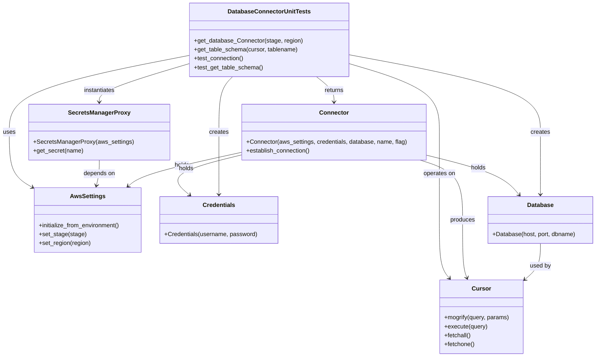
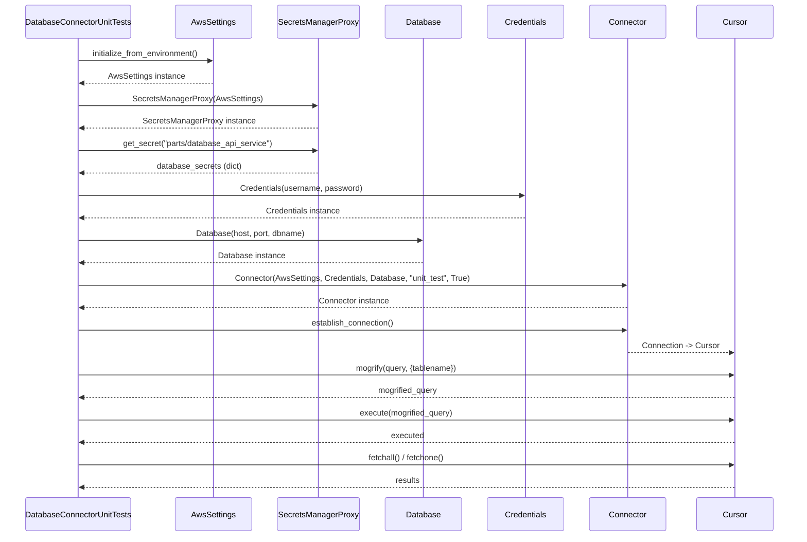

# Diagram: partview_core/partview_service/partview_service/tests/framework/database_connector_test.py

> Auto-generated by Obscura crawlers

## Diagram 1

### SVG

<svg id="container" width="1590.513671875" xmlns="http://www.w3.org/2000/svg" class="classDiagram" height="958" viewBox="0 0 1590.513671875 958" role="graphics-document document" aria-roledescription="class"><g><defs><marker id="container_class-aggregationStart" class="marker aggregation class" refX="18" refY="7" markerWidth="190" markerHeight="240" orient="auto"><path d="M 18,7 L9,13 L1,7 L9,1 Z"></path></marker></defs><defs><marker id="container_class-aggregationEnd" class="marker aggregation class" refX="1" refY="7" markerWidth="20" markerHeight="28" orient="auto"><path d="M 18,7 L9,13 L1,7 L9,1 Z"></path></marker></defs><defs><marker id="container_class-extensionStart" class="marker extension class" refX="18" refY="7" markerWidth="190" markerHeight="240" orient="auto"><path d="M 1,7 L18,13 V 1 Z"></path></marker></defs><defs><marker id="container_class-extensionEnd" class="marker extension class" refX="1" refY="7" markerWidth="20" markerHeight="28" orient="auto"><path d="M 1,1 V 13 L18,7 Z"></path></marker></defs><defs><marker id="container_class-compositionStart" class="marker composition class" refX="18" refY="7" markerWidth="190" markerHeight="240" orient="auto"><path d="M 18,7 L9,13 L1,7 L9,1 Z"></path></marker></defs><defs><marker id="container_class-compositionEnd" class="marker composition class" refX="1" refY="7" markerWidth="20" markerHeight="28" orient="auto"><path d="M 18,7 L9,13 L1,7 L9,1 Z"></path></marker></defs><defs><marker id="container_class-dependencyStart" class="marker dependency class" refX="6" refY="7" markerWidth="190" markerHeight="240" orient="auto"><path d="M 5,7 L9,13 L1,7 L9,1 Z"></path></marker></defs><defs><marker id="container_class-dependencyEnd" class="marker dependency class" refX="13" refY="7" markerWidth="20" markerHeight="28" orient="auto"><path d="M 18,7 L9,13 L14,7 L9,1 Z"></path></marker></defs><defs><marker id="container_class-lollipopStart" class="marker lollipop class" refX="13" refY="7" markerWidth="190" markerHeight="240" orient="auto"><circle stroke="black" fill="transparent" cx="7" cy="7" r="6"></circle></marker></defs><defs><marker id="container_class-lollipopEnd" class="marker lollipop class" refX="1" refY="7" markerWidth="190" markerHeight="240" orient="auto"><circle stroke="black" fill="transparent" cx="7" cy="7" r="6"></circle></marker></defs><g class="root"><g class="clusters"></g><g class="edgePaths"><path d="M503.135,148.431L423.361,164.192C343.587,179.954,184.04,211.477,104.266,245.905C24.492,280.333,24.492,317.667,24.492,355C24.492,392.333,24.492,429.667,33.668,453.976C42.844,478.286,61.197,489.571,70.373,495.214L79.549,500.857" id="id_DatabaseConnectorUnitTests_AwsSettings_1" class="edge-thickness-normal edge-pattern-solid relation" style=";;;" data-edge="true" data-et="edge" data-id="id_DatabaseConnectorUnitTests_AwsSettings_1" data-points="W3sieCI6NTAzLjEzNDc2NTYyNSwieSI6MTQ4LjQzMDUxNDY4ODE0ODE4fSx7IngiOjI0LjQ5MjE4NzUsInkiOjI0M30seyJ4IjoyNC40OTIxODc1LCJ5IjozNTV9LHsieCI6MjQuNDkyMTg3NSwieSI6NDY3fSx7IngiOjg0LjY1OTczMDk3Mjc4MjI2LCJ5Ijo1MDR9XQ==" marker-end="url(#container_class-dependencyEnd)"></path><path d="M503.135,169.97L462.603,182.142C422.072,194.314,341.008,218.657,300.477,235.995C259.945,253.333,259.945,263.667,259.945,268.833L259.945,274" id="id_DatabaseConnectorUnitTests_SecretsManagerProxy_2" class="edge-thickness-normal edge-pattern-solid relation" style=";;;" data-edge="true" data-et="edge" data-id="id_DatabaseConnectorUnitTests_SecretsManagerProxy_2" data-points="W3sieCI6NTAzLjEzNDc2NTYyNSwieSI6MTY5Ljk3MDI3Mjc3NjI4MDMyfSx7IngiOjI1OS45NDUzMTI1LCJ5IjoyNDN9LHsieCI6MjU5Ljk0NTMxMjUsInkiOjI4MH1d" marker-end="url(#container_class-dependencyEnd)"></path><path d="M839.442,206L847.329,212.167C855.216,218.333,870.99,230.667,878.877,242C886.764,253.333,886.764,263.667,886.764,268.833L886.764,274" id="id_DatabaseConnectorUnitTests_Connector_3" class="edge-thickness-normal edge-pattern-solid relation" style=";;;" data-edge="true" data-et="edge" data-id="id_DatabaseConnectorUnitTests_Connector_3" data-points="W3sieCI6ODM5LjQ0MjQ0MDI1NzM1MjksInkiOjIwNn0seyJ4Ijo4ODYuNzYzNjcxODc1LCJ5IjoyNDN9LHsieCI6ODg2Ljc2MzY3MTg3NSwieSI6MjgwfV0=" marker-end="url(#container_class-dependencyEnd)"></path><path d="M922.518,169.615L963.478,181.846C1004.438,194.076,1086.359,218.538,1127.319,249.436C1168.279,280.333,1168.279,317.667,1168.279,355C1168.279,392.333,1168.279,429.667,1168.279,469C1168.279,508.333,1168.279,549.667,1168.279,591C1168.279,632.333,1168.279,673.667,1172.94,699.742C1177.602,725.818,1186.924,736.636,1191.585,742.046L1196.246,747.455" id="id_DatabaseConnectorUnitTests_Cursor_4" class="edge-thickness-normal edge-pattern-solid relation" style=";;;" data-edge="true" data-et="edge" data-id="id_DatabaseConnectorUnitTests_Cursor_4" data-points="W3sieCI6OTIyLjUxNzU3ODEyNSwieSI6MTY5LjYxNDYzNTE1MDQzMzk3fSx7IngiOjExNjguMjc5Mjk2ODc1LCJ5IjoyNDN9LHsieCI6MTE2OC4yNzkyOTY4NzUsInkiOjM1NX0seyJ4IjoxMTY4LjI3OTI5Njg3NSwieSI6NDY3fSx7IngiOjExNjguMjc5Mjk2ODc1LCJ5Ijo1OTF9LHsieCI6MTE2OC4yNzkyOTY4NzUsInkiOjcxNX0seyJ4IjoxMjAwLjE2Mjc4NDM1MjAyMiwieSI6NzUyfV0=" marker-end="url(#container_class-dependencyEnd)"></path><path d="M259.945,430L259.945,436.167C259.945,442.333,259.945,454.667,258.527,466.035C257.109,477.404,254.272,487.808,252.853,493.009L251.435,498.211" id="id_SecretsManagerProxy_AwsSettings_5" class="edge-thickness-normal edge-pattern-solid relation" style=";;;" data-edge="true" data-et="edge" data-id="id_SecretsManagerProxy_AwsSettings_5" data-points="W3sieCI6MjU5Ljk0NTMxMjUsInkiOjQzMH0seyJ4IjoyNTkuOTQ1MzEyNSwieSI6NDY3fSx7IngiOjI0OS44NTY2ODE1Nzc2MjA5OCwieSI6NTA0fV0=" marker-end="url(#container_class-dependencyEnd)"></path><path d="M640.248,408.824L595.84,418.52C551.431,428.216,462.614,447.608,411.628,462.828C360.642,478.047,347.486,489.094,340.909,494.618L334.331,500.142" id="id_Connector_AwsSettings_6" class="edge-thickness-normal edge-pattern-solid relation" style=";;;" data-edge="true" data-et="edge" data-id="id_Connector_AwsSettings_6" data-points="W3sieCI6NjQwLjI0ODA0Njg3NSwieSI6NDA4LjgyMzY1OTA5MDk5NTY1fSx7IngiOjM3My43OTY4NzUsInkiOjQ2N30seyJ4IjozMjkuNzM2NDA2ODgwMDQwMywieSI6NTA0fV0=" marker-end="url(#container_class-dependencyEnd)"></path><path d="M640.248,416.004L605.902,424.503C571.556,433.002,502.864,450.001,479.639,468.017C456.413,486.033,478.655,505.066,489.776,514.582L500.897,524.099" id="id_Connector_Credentials_7" class="edge-thickness-normal edge-pattern-solid relation" style=";;;" data-edge="true" data-et="edge" data-id="id_Connector_Credentials_7" data-points="W3sieCI6NjQwLjI0ODA0Njg3NSwieSI6NDE2LjAwMzY0NjUzMjM0MTl9LHsieCI6NDM0LjE3MTg3NSwieSI6NDY3fSx7IngiOjUwNS40NTU0NDAzOTgxODU1LCJ5Ijo1Mjh9XQ==" marker-end="url(#container_class-dependencyEnd)"></path><path d="M1133.279,416.401L1167.137,424.834C1200.994,433.268,1268.709,450.134,1310.518,467.97C1352.326,485.806,1368.229,504.612,1376.18,514.015L1384.132,523.418" id="id_Connector_Database_8" class="edge-thickness-normal edge-pattern-solid relation" style=";;;" data-edge="true" data-et="edge" data-id="id_Connector_Database_8" data-points="W3sieCI6MTEzMy4yNzkyOTY4NzUsInkiOjQxNi40MDEzNzA4MjY5MjY2fSx7IngiOjEzMzYuNDIzODI4MTI1LCJ5Ijo0Njd9LHsieCI6MTM4OC4wMDU5NTM4ODEwNDgzLCJ5Ijo1Mjh9XQ==" marker-end="url(#container_class-dependencyEnd)"></path><path d="M1117.66,430L1136.644,436.167C1155.629,442.333,1193.599,454.667,1212.584,481.5C1231.568,508.333,1231.568,549.667,1231.568,591C1231.568,632.333,1231.568,673.667,1233.644,699.57C1235.72,725.474,1239.871,735.948,1241.947,741.185L1244.023,746.422" id="id_Connector_Cursor_9" class="edge-thickness-normal edge-pattern-solid relation" style=";;;" data-edge="true" data-et="edge" data-id="id_Connector_Cursor_9" data-points="W3sieCI6MTExNy42NTk2Njc5Njg3NSwieSI6NDMwfSx7IngiOjEyMzEuNTY4MzU5Mzc1LCJ5Ijo0Njd9LHsieCI6MTIzMS41NjgzNTkzNzUsInkiOjU5MX0seyJ4IjoxMjMxLjU2ODM1OTM3NSwieSI6NzE1fSx7IngiOjEyNDYuMjMzNDk4OTY1OTkyNiwieSI6NzUyfV0=" marker-end="url(#container_class-dependencyEnd)"></path><path d="M1441.279,654L1441.279,664.167C1441.279,674.333,1441.279,694.667,1434.748,710.534C1428.218,726.401,1415.156,737.802,1408.625,743.503L1402.094,749.204" id="id_Database_Cursor_10" class="edge-thickness-normal edge-pattern-solid relation" style=";;;" data-edge="true" data-et="edge" data-id="id_Database_Cursor_10" data-points="W3sieCI6MTQ0MS4yNzkyOTY4NzUsInkiOjY1NH0seyJ4IjoxNDQxLjI3OTI5Njg3NSwieSI6NzE1fSx7IngiOjEzOTcuNTc0MjE4NzUsInkiOjc1My4xNDkxNDgyMDgwNDAzfV0=" marker-end="url(#container_class-dependencyEnd)"></path><path d="M579.076,522L579.076,512.833C579.076,503.667,579.076,485.333,579.076,457.5C579.076,429.667,579.076,392.333,579.076,355C579.076,317.667,579.076,280.333,585.141,255.5C591.205,230.667,603.335,218.333,609.399,212.167L615.464,206" id="id_Credentials_DatabaseConnectorUnitTests_11" class="edge-thickness-normal edge-pattern-solid relation" style=";;;" data-edge="true" data-et="edge" data-id="id_Credentials_DatabaseConnectorUnitTests_11" data-points="W3sieCI6NTc5LjA3NjE3MTg3NSwieSI6NTI4fSx7IngiOjU3OS4wNzYxNzE4NzUsInkiOjQ2N30seyJ4Ijo1NzkuMDc2MTcxODc1LCJ5IjozNTV9LHsieCI6NTc5LjA3NjE3MTg3NSwieSI6MjQzfSx7IngiOjYxNS40NjQwMzk1MjIwNTg4LCJ5IjoyMDZ9XQ==" marker-start="url(#container_class-dependencyStart)"></path><path d="M1441.279,522L1441.279,512.833C1441.279,503.667,1441.279,485.333,1441.279,457.5C1441.279,429.667,1441.279,392.333,1441.279,355C1441.279,317.667,1441.279,280.333,1354.819,245.525C1268.359,210.716,1095.438,178.433,1008.978,162.291L922.518,146.149" id="id_Database_DatabaseConnectorUnitTests_12" class="edge-thickness-normal edge-pattern-solid relation" style=";;;" data-edge="true" data-et="edge" data-id="id_Database_DatabaseConnectorUnitTests_12" data-points="W3sieCI6MTQ0MS4yNzkyOTY4NzUsInkiOjUyOH0seyJ4IjoxNDQxLjI3OTI5Njg3NSwieSI6NDY3fSx7IngiOjE0NDEuMjc5Mjk2ODc1LCJ5IjozNTV9LHsieCI6MTQ0MS4yNzkyOTY4NzUsInkiOjI0M30seyJ4Ijo5MjIuNTE3NTc4MTI1LCJ5IjoxNDYuMTQ4NzUyNzA4MDA3MTJ9XQ==" marker-start="url(#container_class-dependencyStart)"></path></g><g class="edgeLabels"><g class="edgeLabel" transform="translate(24.4921875, 355)"><g class="label" data-id="id_DatabaseConnectorUnitTests_AwsSettings_1" transform="translate(-16.4921875, -12)"><foreignObject width="32.984375" height="24">

uses

</foreignObject></g></g><g class="edgeLabel" transform="translate(259.9453125, 243)"><g class="label" data-id="id_DatabaseConnectorUnitTests_SecretsManagerProxy_2" transform="translate(-42.9140625, -12)"><foreignObject width="85.828125" height="24">

instantiates

</foreignObject></g></g><g class="edgeLabel" transform="translate(886.763671875, 243)"><g class="label" data-id="id_DatabaseConnectorUnitTests_Connector_3" transform="translate(-26.265625, -12)"><foreignObject width="52.53125" height="24">

returns

</foreignObject></g></g><g class="edgeLabel" transform="translate(1168.279296875, 467)"><g class="label" data-id="id_DatabaseConnectorUnitTests_Cursor_4" transform="translate(-43.2890625, -12)"><foreignObject width="86.578125" height="24">

operates on

</foreignObject></g></g><g class="edgeLabel" transform="translate(259.9453125, 467)"><g class="label" data-id="id_SecretsManagerProxy_AwsSettings_5" transform="translate(-42.9453125, -12)"><foreignObject width="85.890625" height="24">

depends on

</foreignObject></g></g><g class="edgeLabel" transform="translate(478.91687, 444.04834)"><g class="label" data-id="id_Connector_AwsSettings_6" transform="translate(-20.1875, -12)"><foreignObject width="40.375" height="24">

holds

</foreignObject></g></g><g class="edgeLabel" transform="translate(491.67313, 452.77053)"><g class="label" data-id="id_Connector_Credentials_7" transform="translate(-20.1875, -12)"><foreignObject width="40.375" height="24">

holds

</foreignObject></g></g><g class="edgeLabel" transform="translate(1273.61019, 451.35457)"><g class="label" data-id="id_Connector_Database_8" transform="translate(-20.1875, -12)"><foreignObject width="40.375" height="24">

holds

</foreignObject></g></g><g class="edgeLabel" transform="translate(1231.568359375, 591)"><g class="label" data-id="id_Connector_Cursor_9" transform="translate(-33.4765625, -12)"><foreignObject width="66.953125" height="24">

produces

</foreignObject></g></g><g class="edgeLabel" transform="translate(1441.279296875, 715)"><g class="label" data-id="id_Database_Cursor_10" transform="translate(-28.3125, -12)"><foreignObject width="56.625" height="24">

used by

</foreignObject></g></g><g class="edgeLabel" transform="translate(579.076171875, 355)"><g class="label" data-id="id_Credentials_DatabaseConnectorUnitTests_11" transform="translate(-26.171875, -12)"><foreignObject width="52.34375" height="24">

creates

</foreignObject></g></g><g class="edgeLabel" transform="translate(1441.279296875, 355)"><g class="label" data-id="id_Database_DatabaseConnectorUnitTests_12" transform="translate(-26.171875, -12)"><foreignObject width="52.34375" height="24">

creates

</foreignObject></g></g></g><g class="nodes"><g class="node default" id="classId-DatabaseConnectorUnitTests-0" transform="translate(712.826171875, 107)"><g class="basic label-container"><path d="M-209.69140625 -99 L209.69140625 -99 L209.69140625 99 L-209.69140625 99" stroke="none" stroke-width="0" fill="#ECECFF" style=""></path><path d="M-209.69140625 -99 C-107.6425470350056 -99, -5.593687820011212 -99, 209.69140625 -99 M-209.69140625 -99 C-111.50950156115542 -99, -13.327596872310835 -99, 209.69140625 -99 M209.69140625 -99 C209.69140625 -35.72291088211095, 209.69140625 27.554178235778096, 209.69140625 99 M209.69140625 -99 C209.69140625 -50.24988723674904, 209.69140625 -1.4997744734980785, 209.69140625 99 M209.69140625 99 C49.01557666643163 99, -111.66025291713675 99, -209.69140625 99 M209.69140625 99 C48.99565516608399 99, -111.70009591783202 99, -209.69140625 99 M-209.69140625 99 C-209.69140625 33.98392933519908, -209.69140625 -31.032141329601842, -209.69140625 -99 M-209.69140625 99 C-209.69140625 47.49546390605001, -209.69140625 -4.009072187899974, -209.69140625 -99" stroke="#9370DB" stroke-width="1.3" fill="none" stroke-dasharray="0 0" style=""></path></g><g class="annotation-group text" transform="translate(0, -75)"></g><g class="label-group text" transform="translate(-105.8671875, -75)"><g class="label" style="font-weight: bolder" transform="translate(0,-12)"><foreignObject width="211.734375" height="24">

DatabaseConnectorUnitTests

</foreignObject></g></g><g class="members-group text" transform="translate(-197.69140625, -27)"></g><g class="methods-group text" transform="translate(-197.69140625, 3)"><g class="label" style="" transform="translate(0,-12)"><foreignObject width="289.515625" height="24">

+get_database_Connector(stage, region)

</foreignObject></g><g class="label" style="" transform="translate(0,12)"><foreignObject width="280" height="24">

+get_table_schema(cursor, tablename)

</foreignObject></g><g class="label" style="" transform="translate(0,36)"><foreignObject width="134.578125" height="24">

+test_connection()

</foreignObject></g><g class="label" style="" transform="translate(0,60)"><foreignObject width="185.640625" height="24">

+test_get_table_schema()

</foreignObject></g></g><g class="divider" style=""><path d="M-209.69140625 -51 C-62.22370898868337 -51, 85.24398827263326 -51, 209.69140625 -51 M-209.69140625 -51 C-97.73117427245646 -51, 14.229057705087087 -51, 209.69140625 -51" stroke="#9370DB" stroke-width="1.3" fill="none" stroke-dasharray="0 0" style=""></path></g><g class="divider" style=""><path d="M-209.69140625 -27 C-53.921744752983955 -27, 101.84791674403209 -27, 209.69140625 -27 M-209.69140625 -27 C-104.9990103167701 -27, -0.3066143835401931 -27, 209.69140625 -27" stroke="#9370DB" stroke-width="1.3" fill="none" stroke-dasharray="0 0" style=""></path></g></g><g class="node default" id="classId-AwsSettings-1" transform="translate(226.134765625, 591)"><g class="basic label-container"><path d="M-145.68359375 -87 L145.68359375 -87 L145.68359375 87 L-145.68359375 87" stroke="none" stroke-width="0" fill="#ECECFF" style=""></path><path d="M-145.68359375 -87 C-48.383067365961494 -87, 48.91745901807701 -87, 145.68359375 -87 M-145.68359375 -87 C-50.42000619474605 -87, 44.8435813605079 -87, 145.68359375 -87 M145.68359375 -87 C145.68359375 -38.3507787093608, 145.68359375 10.298442581278394, 145.68359375 87 M145.68359375 -87 C145.68359375 -26.369817974355968, 145.68359375 34.260364051288065, 145.68359375 87 M145.68359375 87 C53.14720453977756 87, -39.38918467044488 87, -145.68359375 87 M145.68359375 87 C75.33456712650961 87, 4.985540503019223 87, -145.68359375 87 M-145.68359375 87 C-145.68359375 44.11479320946029, -145.68359375 1.2295864189205759, -145.68359375 -87 M-145.68359375 87 C-145.68359375 51.19937489612123, -145.68359375 15.398749792242455, -145.68359375 -87" stroke="#9370DB" stroke-width="1.3" fill="none" stroke-dasharray="0 0" style=""></path></g><g class="annotation-group text" transform="translate(0, -63)"></g><g class="label-group text" transform="translate(-44.8203125, -63)"><g class="label" style="font-weight: bolder" transform="translate(0,-12)"><foreignObject width="89.640625" height="24">

AwsSettings

</foreignObject></g></g><g class="members-group text" transform="translate(-133.68359375, -15)"></g><g class="methods-group text" transform="translate(-133.68359375, 15)"><g class="label" style="" transform="translate(0,-12)"><foreignObject width="222.546875" height="24">

+initialize_from_environment()

</foreignObject></g><g class="label" style="" transform="translate(0,12)"><foreignObject width="125.578125" height="24">

+set_stage(stage)

</foreignObject></g><g class="label" style="" transform="translate(0,36)"><foreignObject width="140.578125" height="24">

+set_region(region)

</foreignObject></g></g><g class="divider" style=""><path d="M-145.68359375 -39 C-70.7640337514536 -39, 4.1555262470928085 -39, 145.68359375 -39 M-145.68359375 -39 C-35.652393302710706 -39, 74.37880714457859 -39, 145.68359375 -39" stroke="#9370DB" stroke-width="1.3" fill="none" stroke-dasharray="0 0" style=""></path></g><g class="divider" style=""><path d="M-145.68359375 -15 C-55.1132641271215 -15, 35.45706549575701 -15, 145.68359375 -15 M-145.68359375 -15 C-56.85529180203187 -15, 31.973010145936257 -15, 145.68359375 -15" stroke="#9370DB" stroke-width="1.3" fill="none" stroke-dasharray="0 0" style=""></path></g></g><g class="node default" id="classId-SecretsManagerProxy-2" transform="translate(259.9453125, 355)"><g class="basic label-container"><path d="M-183.9609375 -75 L183.9609375 -75 L183.9609375 75 L-183.9609375 75" stroke="none" stroke-width="0" fill="#ECECFF" style=""></path><path d="M-183.9609375 -75 C-54.030289543757306 -75, 75.90035841248539 -75, 183.9609375 -75 M-183.9609375 -75 C-55.73853527614719 -75, 72.48386694770562 -75, 183.9609375 -75 M183.9609375 -75 C183.9609375 -22.00670694364529, 183.9609375 30.986586112709418, 183.9609375 75 M183.9609375 -75 C183.9609375 -37.207202242064774, 183.9609375 0.5855955158704518, 183.9609375 75 M183.9609375 75 C67.63749362491063 75, -48.685950250178735 75, -183.9609375 75 M183.9609375 75 C95.13298464271939 75, 6.305031785438786 75, -183.9609375 75 M-183.9609375 75 C-183.9609375 19.005966244804135, -183.9609375 -36.98806751039173, -183.9609375 -75 M-183.9609375 75 C-183.9609375 37.44988603414092, -183.9609375 -0.10022793171816602, -183.9609375 -75" stroke="#9370DB" stroke-width="1.3" fill="none" stroke-dasharray="0 0" style=""></path></g><g class="annotation-group text" transform="translate(0, -51)"></g><g class="label-group text" transform="translate(-79.03125, -51)"><g class="label" style="font-weight: bolder" transform="translate(0,-12)"><foreignObject width="158.0625" height="24">

SecretsManagerProxy

</foreignObject></g></g><g class="members-group text" transform="translate(-171.9609375, -3)"></g><g class="methods-group text" transform="translate(-171.9609375, 27)"><g class="label" style="" transform="translate(0,-12)"><foreignObject width="264.890625" height="24">

+SecretsManagerProxy(aws_settings)

</foreignObject></g><g class="label" style="" transform="translate(0,12)"><foreignObject width="133.78125" height="24">

+get_secret(name)

</foreignObject></g></g><g class="divider" style=""><path d="M-183.9609375 -27 C-53.049801735309956 -27, 77.86133402938009 -27, 183.9609375 -27 M-183.9609375 -27 C-58.11516792792729 -27, 67.73060164414542 -27, 183.9609375 -27" stroke="#9370DB" stroke-width="1.3" fill="none" stroke-dasharray="0 0" style=""></path></g><g class="divider" style=""><path d="M-183.9609375 -3 C-79.30905806279527 -3, 25.342821374409453 -3, 183.9609375 -3 M-183.9609375 -3 C-90.5308035739747 -3, 2.8993303520506117 -3, 183.9609375 -3" stroke="#9370DB" stroke-width="1.3" fill="none" stroke-dasharray="0 0" style=""></path></g></g><g class="node default" id="classId-Connector-3" transform="translate(886.763671875, 355)"><g class="basic label-container"><path d="M-246.515625 -75 L246.515625 -75 L246.515625 75 L-246.515625 75" stroke="none" stroke-width="0" fill="#ECECFF" style=""></path><path d="M-246.515625 -75 C-62.955815359591696 -75, 120.60399428081661 -75, 246.515625 -75 M-246.515625 -75 C-91.14364935346347 -75, 64.22832629307305 -75, 246.515625 -75 M246.515625 -75 C246.515625 -17.549621781237235, 246.515625 39.90075643752553, 246.515625 75 M246.515625 -75 C246.515625 -37.15688232347153, 246.515625 0.6862353530569436, 246.515625 75 M246.515625 75 C138.27334406282483 75, 30.031063125649638 75, -246.515625 75 M246.515625 75 C141.9132458570911 75, 37.3108667141822 75, -246.515625 75 M-246.515625 75 C-246.515625 36.4164282517037, -246.515625 -2.167143496592601, -246.515625 -75 M-246.515625 75 C-246.515625 34.012616627381675, -246.515625 -6.97476674523665, -246.515625 -75" stroke="#9370DB" stroke-width="1.3" fill="none" stroke-dasharray="0 0" style=""></path></g><g class="annotation-group text" transform="translate(0, -51)"></g><g class="label-group text" transform="translate(-37.421875, -51)"><g class="label" style="font-weight: bolder" transform="translate(0,-12)"><foreignObject width="74.84375" height="24">

Connector

</foreignObject></g></g><g class="members-group text" transform="translate(-234.515625, -3)"></g><g class="methods-group text" transform="translate(-234.515625, 27)"><g class="label" style="" transform="translate(0,-12)"><foreignObject width="431.609375" height="24">

+Connector(aws_settings, credentials, database, name, flag)

</foreignObject></g><g class="label" style="" transform="translate(0,12)"><foreignObject width="173.265625" height="24">

+establish_connection()

</foreignObject></g></g><g class="divider" style=""><path d="M-246.515625 -27 C-73.0560111867357 -27, 100.4036026265286 -27, 246.515625 -27 M-246.515625 -27 C-96.2750644957361 -27, 53.96549600852779 -27, 246.515625 -27" stroke="#9370DB" stroke-width="1.3" fill="none" stroke-dasharray="0 0" style=""></path></g><g class="divider" style=""><path d="M-246.515625 -3 C-88.81477989825964 -3, 68.88606520348071 -3, 246.515625 -3 M-246.515625 -3 C-123.68387685146548 -3, -0.852128702930969 -3, 246.515625 -3" stroke="#9370DB" stroke-width="1.3" fill="none" stroke-dasharray="0 0" style=""></path></g></g><g class="node default" id="classId-Credentials-4" transform="translate(579.076171875, 591)"><g class="basic label-container"><path d="M-157.2578125 -63 L157.2578125 -63 L157.2578125 63 L-157.2578125 63" stroke="none" stroke-width="0" fill="#ECECFF" style=""></path><path d="M-157.2578125 -63 C-78.51976754600537 -63, 0.21827740798926243 -63, 157.2578125 -63 M-157.2578125 -63 C-88.03258217761235 -63, -18.80735185522471 -63, 157.2578125 -63 M157.2578125 -63 C157.2578125 -24.149494877289364, 157.2578125 14.701010245421273, 157.2578125 63 M157.2578125 -63 C157.2578125 -13.086756579256345, 157.2578125 36.82648684148731, 157.2578125 63 M157.2578125 63 C78.79729991580889 63, 0.33678733161778496 63, -157.2578125 63 M157.2578125 63 C48.51716023441314 63, -60.22349203117372 63, -157.2578125 63 M-157.2578125 63 C-157.2578125 33.96751615960548, -157.2578125 4.935032319210954, -157.2578125 -63 M-157.2578125 63 C-157.2578125 14.147893110120414, -157.2578125 -34.70421377975917, -157.2578125 -63" stroke="#9370DB" stroke-width="1.3" fill="none" stroke-dasharray="0 0" style=""></path></g><g class="annotation-group text" transform="translate(0, -39)"></g><g class="label-group text" transform="translate(-41.609375, -39)"><g class="label" style="font-weight: bolder" transform="translate(0,-12)"><foreignObject width="83.21875" height="24">

Credentials

</foreignObject></g></g><g class="members-group text" transform="translate(-145.2578125, 9)"></g><g class="methods-group text" transform="translate(-145.2578125, 39)"><g class="label" style="" transform="translate(0,-12)"><foreignObject width="248.90625" height="24">

+Credentials(username, password)

</foreignObject></g></g><g class="divider" style=""><path d="M-157.2578125 -15 C-52.74514944240613 -15, 51.76751361518774 -15, 157.2578125 -15 M-157.2578125 -15 C-53.72349293482169 -15, 49.810826630356615 -15, 157.2578125 -15" stroke="#9370DB" stroke-width="1.3" fill="none" stroke-dasharray="0 0" style=""></path></g><g class="divider" style=""><path d="M-157.2578125 9 C-81.18082668545938 9, -5.103840870918759 9, 157.2578125 9 M-157.2578125 9 C-75.61872044484143 9, 6.020371610317142 9, 157.2578125 9" stroke="#9370DB" stroke-width="1.3" fill="none" stroke-dasharray="0 0" style=""></path></g></g><g class="node default" id="classId-Database-5" transform="translate(1441.279296875, 591)"><g class="basic label-container"><path d="M-141.234375 -63 L141.234375 -63 L141.234375 63 L-141.234375 63" stroke="none" stroke-width="0" fill="#ECECFF" style=""></path><path d="M-141.234375 -63 C-77.78101888258539 -63, -14.327662765170771 -63, 141.234375 -63 M-141.234375 -63 C-65.08742641266859 -63, 11.059522174662817 -63, 141.234375 -63 M141.234375 -63 C141.234375 -22.521754446000863, 141.234375 17.956491107998275, 141.234375 63 M141.234375 -63 C141.234375 -26.574848499747688, 141.234375 9.850303000504624, 141.234375 63 M141.234375 63 C61.45654912181415 63, -18.321276756371702 63, -141.234375 63 M141.234375 63 C62.43693606078554 63, -16.360502878428917 63, -141.234375 63 M-141.234375 63 C-141.234375 26.700874309685382, -141.234375 -9.598251380629236, -141.234375 -63 M-141.234375 63 C-141.234375 20.85116218145148, -141.234375 -21.297675637097043, -141.234375 -63" stroke="#9370DB" stroke-width="1.3" fill="none" stroke-dasharray="0 0" style=""></path></g><g class="annotation-group text" transform="translate(0, -39)"></g><g class="label-group text" transform="translate(-34.171875, -39)"><g class="label" style="font-weight: bolder" transform="translate(0,-12)"><foreignObject width="68.34375" height="24">

Database

</foreignObject></g></g><g class="members-group text" transform="translate(-129.234375, 9)"></g><g class="methods-group text" transform="translate(-129.234375, 39)"><g class="label" style="" transform="translate(0,-12)"><foreignObject width="224.296875" height="24">

+Database(host, port, dbname)

</foreignObject></g></g><g class="divider" style=""><path d="M-141.234375 -15 C-69.48315174351791 -15, 2.268071512964184 -15, 141.234375 -15 M-141.234375 -15 C-54.786449399925814 -15, 31.66147620014837 -15, 141.234375 -15" stroke="#9370DB" stroke-width="1.3" fill="none" stroke-dasharray="0 0" style=""></path></g><g class="divider" style=""><path d="M-141.234375 9 C-70.85581102055824 9, -0.4772470411164704 9, 141.234375 9 M-141.234375 9 C-75.82785447287013 9, -10.421333945740258 9, 141.234375 9" stroke="#9370DB" stroke-width="1.3" fill="none" stroke-dasharray="0 0" style=""></path></g></g><g class="node default" id="classId-Cursor-6" transform="translate(1285.47265625, 851)"><g class="basic label-container"><path d="M-112.1015625 -99 L112.1015625 -99 L112.1015625 99 L-112.1015625 99" stroke="none" stroke-width="0" fill="#ECECFF" style=""></path><path d="M-112.1015625 -99 C-45.12075126292892 -99, 21.86005997414216 -99, 112.1015625 -99 M-112.1015625 -99 C-64.98672232752611 -99, -17.871882155052234 -99, 112.1015625 -99 M112.1015625 -99 C112.1015625 -54.543642429053676, 112.1015625 -10.087284858107353, 112.1015625 99 M112.1015625 -99 C112.1015625 -57.505728125005184, 112.1015625 -16.01145625001037, 112.1015625 99 M112.1015625 99 C36.315253525753164 99, -39.47105544849367 99, -112.1015625 99 M112.1015625 99 C45.00545298819998 99, -22.090656523600046 99, -112.1015625 99 M-112.1015625 99 C-112.1015625 52.79363266305127, -112.1015625 6.587265326102539, -112.1015625 -99 M-112.1015625 99 C-112.1015625 47.89371129580976, -112.1015625 -3.212577408380483, -112.1015625 -99" stroke="#9370DB" stroke-width="1.3" fill="none" stroke-dasharray="0 0" style=""></path></g><g class="annotation-group text" transform="translate(0, -75)"></g><g class="label-group text" transform="translate(-23.90625, -75)"><g class="label" style="font-weight: bolder" transform="translate(0,-12)"><foreignObject width="47.8125" height="24">

Cursor

</foreignObject></g></g><g class="members-group text" transform="translate(-100.1015625, -27)"></g><g class="methods-group text" transform="translate(-100.1015625, 3)"><g class="label" style="" transform="translate(0,-12)"><foreignObject width="176.296875" height="24">

+mogrify(query, params)

</foreignObject></g><g class="label" style="" transform="translate(0,12)"><foreignObject width="115.96875" height="24">

+execute(query)

</foreignObject></g><g class="label" style="" transform="translate(0,36)"><foreignObject width="72.515625" height="24">

+fetchall()

</foreignObject></g><g class="label" style="" transform="translate(0,60)"><foreignObject width="82.046875" height="24">

+fetchone()

</foreignObject></g></g><g class="divider" style=""><path d="M-112.1015625 -51 C-61.71656335342882 -51, -11.331564206857635 -51, 112.1015625 -51 M-112.1015625 -51 C-48.601732645742224 -51, 14.898097208515551 -51, 112.1015625 -51" stroke="#9370DB" stroke-width="1.3" fill="none" stroke-dasharray="0 0" style=""></path></g><g class="divider" style=""><path d="M-112.1015625 -27 C-60.931027900172744 -27, -9.760493300345487 -27, 112.1015625 -27 M-112.1015625 -27 C-45.7717210050013 -27, 20.558120489997407 -27, 112.1015625 -27" stroke="#9370DB" stroke-width="1.3" fill="none" stroke-dasharray="0 0" style=""></path></g></g></g></g></g></svg>

## Diagram 2

### SVG

<svg id="container" width="1621.5" xmlns="http://www.w3.org/2000/svg" height="1131" viewBox="-50 -10 1621.5 1131" role="graphics-document document" aria-roledescription="sequence"><g><rect x="1371.5" y="1045" fill="#eaeaea" stroke="#666" width="150" height="65" name="Curs" rx="3" ry="3" class="actor actor-bottom"></rect><text x="1446.5" y="1077.5" dominant-baseline="central" alignment-baseline="central" class="actor actor-box" style="text-anchor: middle; font-size: 16px; font-weight: 400;"><tspan x="1446.5" dy="0">Cursor</tspan></text></g><g><rect x="1148.5" y="1045" fill="#eaeaea" stroke="#666" width="150" height="65" name="Conn" rx="3" ry="3" class="actor actor-bottom"></rect><text x="1223.5" y="1077.5" dominant-baseline="central" alignment-baseline="central" class="actor actor-box" style="text-anchor: middle; font-size: 16px; font-weight: 400;"><tspan x="1223.5" dy="0">Connector</tspan></text></g><g><rect x="948.5" y="1045" fill="#eaeaea" stroke="#666" width="150" height="65" name="Cred" rx="3" ry="3" class="actor actor-bottom"></rect><text x="1023.5" y="1077.5" dominant-baseline="central" alignment-baseline="central" class="actor actor-box" style="text-anchor: middle; font-size: 16px; font-weight: 400;"><tspan x="1023.5" dy="0">Credentials</tspan></text></g><g><rect x="748.5" y="1045" fill="#eaeaea" stroke="#666" width="150" height="65" name="DB" rx="3" ry="3" class="actor actor-bottom"></rect><text x="823.5" y="1077.5" dominant-baseline="central" alignment-baseline="central" class="actor actor-box" style="text-anchor: middle; font-size: 16px; font-weight: 400;"><tspan x="823.5" dy="0">Database</tspan></text></g><g><rect x="524.5" y="1045" fill="#eaeaea" stroke="#666" width="174" height="65" name="Secrets" rx="3" ry="3" class="actor actor-bottom"></rect><text x="611.5" y="1077.5" dominant-baseline="central" alignment-baseline="central" class="actor actor-box" style="text-anchor: middle; font-size: 16px; font-weight: 400;"><tspan x="611.5" dy="0">SecretsManagerProxy</tspan></text></g><g><rect x="324.5" y="1045" fill="#eaeaea" stroke="#666" width="150" height="65" name="Aws" rx="3" ry="3" class="actor actor-bottom"></rect><text x="399.5" y="1077.5" dominant-baseline="central" alignment-baseline="central" class="actor actor-box" style="text-anchor: middle; font-size: 16px; font-weight: 400;"><tspan x="399.5" dy="0">AwsSettings</tspan></text></g><g><rect x="0" y="1045" fill="#eaeaea" stroke="#666" width="229" height="65" name="Test" rx="3" ry="3" class="actor actor-bottom"></rect><text x="114.5" y="1077.5" dominant-baseline="central" alignment-baseline="central" class="actor actor-box" style="text-anchor: middle; font-size: 16px; font-weight: 400;"><tspan x="114.5" dy="0">DatabaseConnectorUnitTests</tspan></text></g><g><line id="actor6" x1="1446.5" y1="65" x2="1446.5" y2="1045" class="actor-line 200" stroke-width="0.5px" stroke="#999" name="Curs"></line><g id="root-6"><rect x="1371.5" y="0" fill="#eaeaea" stroke="#666" width="150" height="65" name="Curs" rx="3" ry="3" class="actor actor-top"></rect><text x="1446.5" y="32.5" dominant-baseline="central" alignment-baseline="central" class="actor actor-box" style="text-anchor: middle; font-size: 16px; font-weight: 400;"><tspan x="1446.5" dy="0">Cursor</tspan></text></g></g><g><line id="actor5" x1="1223.5" y1="65" x2="1223.5" y2="1045" class="actor-line 200" stroke-width="0.5px" stroke="#999" name="Conn"></line><g id="root-5"><rect x="1148.5" y="0" fill="#eaeaea" stroke="#666" width="150" height="65" name="Conn" rx="3" ry="3" class="actor actor-top"></rect><text x="1223.5" y="32.5" dominant-baseline="central" alignment-baseline="central" class="actor actor-box" style="text-anchor: middle; font-size: 16px; font-weight: 400;"><tspan x="1223.5" dy="0">Connector</tspan></text></g></g><g><line id="actor4" x1="1023.5" y1="65" x2="1023.5" y2="1045" class="actor-line 200" stroke-width="0.5px" stroke="#999" name="Cred"></line><g id="root-4"><rect x="948.5" y="0" fill="#eaeaea" stroke="#666" width="150" height="65" name="Cred" rx="3" ry="3" class="actor actor-top"></rect><text x="1023.5" y="32.5" dominant-baseline="central" alignment-baseline="central" class="actor actor-box" style="text-anchor: middle; font-size: 16px; font-weight: 400;"><tspan x="1023.5" dy="0">Credentials</tspan></text></g></g><g><line id="actor3" x1="823.5" y1="65" x2="823.5" y2="1045" class="actor-line 200" stroke-width="0.5px" stroke="#999" name="DB"></line><g id="root-3"><rect x="748.5" y="0" fill="#eaeaea" stroke="#666" width="150" height="65" name="DB" rx="3" ry="3" class="actor actor-top"></rect><text x="823.5" y="32.5" dominant-baseline="central" alignment-baseline="central" class="actor actor-box" style="text-anchor: middle; font-size: 16px; font-weight: 400;"><tspan x="823.5" dy="0">Database</tspan></text></g></g><g><line id="actor2" x1="611.5" y1="65" x2="611.5" y2="1045" class="actor-line 200" stroke-width="0.5px" stroke="#999" name="Secrets"></line><g id="root-2"><rect x="524.5" y="0" fill="#eaeaea" stroke="#666" width="174" height="65" name="Secrets" rx="3" ry="3" class="actor actor-top"></rect><text x="611.5" y="32.5" dominant-baseline="central" alignment-baseline="central" class="actor actor-box" style="text-anchor: middle; font-size: 16px; font-weight: 400;"><tspan x="611.5" dy="0">SecretsManagerProxy</tspan></text></g></g><g><line id="actor1" x1="399.5" y1="65" x2="399.5" y2="1045" class="actor-line 200" stroke-width="0.5px" stroke="#999" name="Aws"></line><g id="root-1"><rect x="324.5" y="0" fill="#eaeaea" stroke="#666" width="150" height="65" name="Aws" rx="3" ry="3" class="actor actor-top"></rect><text x="399.5" y="32.5" dominant-baseline="central" alignment-baseline="central" class="actor actor-box" style="text-anchor: middle; font-size: 16px; font-weight: 400;"><tspan x="399.5" dy="0">AwsSettings</tspan></text></g></g><g><line id="actor0" x1="114.5" y1="65" x2="114.5" y2="1045" class="actor-line 200" stroke-width="0.5px" stroke="#999" name="Test"></line><g id="root-0"><rect x="0" y="0" fill="#eaeaea" stroke="#666" width="229" height="65" name="Test" rx="3" ry="3" class="actor actor-top"></rect><text x="114.5" y="32.5" dominant-baseline="central" alignment-baseline="central" class="actor actor-box" style="text-anchor: middle; font-size: 16px; font-weight: 400;"><tspan x="114.5" dy="0">DatabaseConnectorUnitTests</tspan></text></g></g><g></g><defs><symbol id="computer" width="24" height="24"><path transform="scale(.5)" d="M2 2v13h20v-13h-20zm18 11h-16v-9h16v9zm-10.228 6l.466-1h3.524l.467 1h-4.457zm14.228 3h-24l2-6h2.104l-1.33 4h18.45l-1.297-4h2.073l2 6zm-5-10h-14v-7h14v7z"></path></symbol></defs><defs><symbol id="database" fill-rule="evenodd" clip-rule="evenodd"><path transform="scale(.5)" d="M12.258.001l.256.004.255.005.253.008.251.01.249.012.247.015.246.016.242.019.241.02.239.023.236.024.233.027.231.028.229.031.225.032.223.034.22.036.217.038.214.04.211.041.208.043.205.045.201.046.198.048.194.05.191.051.187.053.183.054.18.056.175.057.172.059.168.06.163.061.16.063.155.064.15.066.074.033.073.033.071.034.07.034.069.035.068.035.067.035.066.035.064.036.064.036.062.036.06.036.06.037.058.037.058.037.055.038.055.038.053.038.052.038.051.039.05.039.048.039.047.039.045.04.044.04.043.04.041.04.04.041.039.041.037.041.036.041.034.041.033.042.032.042.03.042.029.042.027.042.026.043.024.043.023.043.021.043.02.043.018.044.017.043.015.044.013.044.012.044.011.045.009.044.007.045.006.045.004.045.002.045.001.045v17l-.001.045-.002.045-.004.045-.006.045-.007.045-.009.044-.011.045-.012.044-.013.044-.015.044-.017.043-.018.044-.02.043-.021.043-.023.043-.024.043-.026.043-.027.042-.029.042-.03.042-.032.042-.033.042-.034.041-.036.041-.037.041-.039.041-.04.041-.041.04-.043.04-.044.04-.045.04-.047.039-.048.039-.05.039-.051.039-.052.038-.053.038-.055.038-.055.038-.058.037-.058.037-.06.037-.06.036-.062.036-.064.036-.064.036-.066.035-.067.035-.068.035-.069.035-.07.034-.071.034-.073.033-.074.033-.15.066-.155.064-.16.063-.163.061-.168.06-.172.059-.175.057-.18.056-.183.054-.187.053-.191.051-.194.05-.198.048-.201.046-.205.045-.208.043-.211.041-.214.04-.217.038-.22.036-.223.034-.225.032-.229.031-.231.028-.233.027-.236.024-.239.023-.241.02-.242.019-.246.016-.247.015-.249.012-.251.01-.253.008-.255.005-.256.004-.258.001-.258-.001-.256-.004-.255-.005-.253-.008-.251-.01-.249-.012-.247-.015-.245-.016-.243-.019-.241-.02-.238-.023-.236-.024-.234-.027-.231-.028-.228-.031-.226-.032-.223-.034-.22-.036-.217-.038-.214-.04-.211-.041-.208-.043-.204-.045-.201-.046-.198-.048-.195-.05-.19-.051-.187-.053-.184-.054-.179-.056-.176-.057-.172-.059-.167-.06-.164-.061-.159-.063-.155-.064-.151-.066-.074-.033-.072-.033-.072-.034-.07-.034-.069-.035-.068-.035-.067-.035-.066-.035-.064-.036-.063-.036-.062-.036-.061-.036-.06-.037-.058-.037-.057-.037-.056-.038-.055-.038-.053-.038-.052-.038-.051-.039-.049-.039-.049-.039-.046-.039-.046-.04-.044-.04-.043-.04-.041-.04-.04-.041-.039-.041-.037-.041-.036-.041-.034-.041-.033-.042-.032-.042-.03-.042-.029-.042-.027-.042-.026-.043-.024-.043-.023-.043-.021-.043-.02-.043-.018-.044-.017-.043-.015-.044-.013-.044-.012-.044-.011-.045-.009-.044-.007-.045-.006-.045-.004-.045-.002-.045-.001-.045v-17l.001-.045.002-.045.004-.045.006-.045.007-.045.009-.044.011-.045.012-.044.013-.044.015-.044.017-.043.018-.044.02-.043.021-.043.023-.043.024-.043.026-.043.027-.042.029-.042.03-.042.032-.042.033-.042.034-.041.036-.041.037-.041.039-.041.04-.041.041-.04.043-.04.044-.04.046-.04.046-.039.049-.039.049-.039.051-.039.052-.038.053-.038.055-.038.056-.038.057-.037.058-.037.06-.037.061-.036.062-.036.063-.036.064-.036.066-.035.067-.035.068-.035.069-.035.07-.034.072-.034.072-.033.074-.033.151-.066.155-.064.159-.063.164-.061.167-.06.172-.059.176-.057.179-.056.184-.054.187-.053.19-.051.195-.05.198-.048.201-.046.204-.045.208-.043.211-.041.214-.04.217-.038.22-.036.223-.034.226-.032.228-.031.231-.028.234-.027.236-.024.238-.023.241-.02.243-.019.245-.016.247-.015.249-.012.251-.01.253-.008.255-.005.256-.004.258-.001.258.001zm-9.258 20.499v.01l.001.021.003.021.004.022.005.021.006.022.007.022.009.023.01.022.011.023.012.023.013.023.015.023.016.024.017.023.018.024.019.024.021.024.022.025.023.024.024.025.052.049.056.05.061.051.066.051.07.051.075.051.079.052.084.052.088.052.092.052.097.052.102.051.105.052.11.052.114.051.119.051.123.051.127.05.131.05.135.05.139.048.144.049.147.047.152.047.155.047.16.045.163.045.167.043.171.043.176.041.178.041.183.039.187.039.19.037.194.035.197.035.202.033.204.031.209.03.212.029.216.027.219.025.222.024.226.021.23.02.233.018.236.016.24.015.243.012.246.01.249.008.253.005.256.004.259.001.26-.001.257-.004.254-.005.25-.008.247-.011.244-.012.241-.014.237-.016.233-.018.231-.021.226-.021.224-.024.22-.026.216-.027.212-.028.21-.031.205-.031.202-.034.198-.034.194-.036.191-.037.187-.039.183-.04.179-.04.175-.042.172-.043.168-.044.163-.045.16-.046.155-.046.152-.047.148-.048.143-.049.139-.049.136-.05.131-.05.126-.05.123-.051.118-.052.114-.051.11-.052.106-.052.101-.052.096-.052.092-.052.088-.053.083-.051.079-.052.074-.052.07-.051.065-.051.06-.051.056-.05.051-.05.023-.024.023-.025.021-.024.02-.024.019-.024.018-.024.017-.024.015-.023.014-.024.013-.023.012-.023.01-.023.01-.022.008-.022.006-.022.006-.022.004-.022.004-.021.001-.021.001-.021v-4.127l-.077.055-.08.053-.083.054-.085.053-.087.052-.09.052-.093.051-.095.05-.097.05-.1.049-.102.049-.105.048-.106.047-.109.047-.111.046-.114.045-.115.045-.118.044-.12.043-.122.042-.124.042-.126.041-.128.04-.13.04-.132.038-.134.038-.135.037-.138.037-.139.035-.142.035-.143.034-.144.033-.147.032-.148.031-.15.03-.151.03-.153.029-.154.027-.156.027-.158.026-.159.025-.161.024-.162.023-.163.022-.165.021-.166.02-.167.019-.169.018-.169.017-.171.016-.173.015-.173.014-.175.013-.175.012-.177.011-.178.01-.179.008-.179.008-.181.006-.182.005-.182.004-.184.003-.184.002h-.37l-.184-.002-.184-.003-.182-.004-.182-.005-.181-.006-.179-.008-.179-.008-.178-.01-.176-.011-.176-.012-.175-.013-.173-.014-.172-.015-.171-.016-.17-.017-.169-.018-.167-.019-.166-.02-.165-.021-.163-.022-.162-.023-.161-.024-.159-.025-.157-.026-.156-.027-.155-.027-.153-.029-.151-.03-.15-.03-.148-.031-.146-.032-.145-.033-.143-.034-.141-.035-.14-.035-.137-.037-.136-.037-.134-.038-.132-.038-.13-.04-.128-.04-.126-.041-.124-.042-.122-.042-.12-.044-.117-.043-.116-.045-.113-.045-.112-.046-.109-.047-.106-.047-.105-.048-.102-.049-.1-.049-.097-.05-.095-.05-.093-.052-.09-.051-.087-.052-.085-.053-.083-.054-.08-.054-.077-.054v4.127zm0-5.654v.011l.001.021.003.021.004.021.005.022.006.022.007.022.009.022.01.022.011.023.012.023.013.023.015.024.016.023.017.024.018.024.019.024.021.024.022.024.023.025.024.024.052.05.056.05.061.05.066.051.07.051.075.052.079.051.084.052.088.052.092.052.097.052.102.052.105.052.11.051.114.051.119.052.123.05.127.051.131.05.135.049.139.049.144.048.147.048.152.047.155.046.16.045.163.045.167.044.171.042.176.042.178.04.183.04.187.038.19.037.194.036.197.034.202.033.204.032.209.03.212.028.216.027.219.025.222.024.226.022.23.02.233.018.236.016.24.014.243.012.246.01.249.008.253.006.256.003.259.001.26-.001.257-.003.254-.006.25-.008.247-.01.244-.012.241-.015.237-.016.233-.018.231-.02.226-.022.224-.024.22-.025.216-.027.212-.029.21-.03.205-.032.202-.033.198-.035.194-.036.191-.037.187-.039.183-.039.179-.041.175-.042.172-.043.168-.044.163-.045.16-.045.155-.047.152-.047.148-.048.143-.048.139-.05.136-.049.131-.05.126-.051.123-.051.118-.051.114-.052.11-.052.106-.052.101-.052.096-.052.092-.052.088-.052.083-.052.079-.052.074-.051.07-.052.065-.051.06-.05.056-.051.051-.049.023-.025.023-.024.021-.025.02-.024.019-.024.018-.024.017-.024.015-.023.014-.023.013-.024.012-.022.01-.023.01-.023.008-.022.006-.022.006-.022.004-.021.004-.022.001-.021.001-.021v-4.139l-.077.054-.08.054-.083.054-.085.052-.087.053-.09.051-.093.051-.095.051-.097.05-.1.049-.102.049-.105.048-.106.047-.109.047-.111.046-.114.045-.115.044-.118.044-.12.044-.122.042-.124.042-.126.041-.128.04-.13.039-.132.039-.134.038-.135.037-.138.036-.139.036-.142.035-.143.033-.144.033-.147.033-.148.031-.15.03-.151.03-.153.028-.154.028-.156.027-.158.026-.159.025-.161.024-.162.023-.163.022-.165.021-.166.02-.167.019-.169.018-.169.017-.171.016-.173.015-.173.014-.175.013-.175.012-.177.011-.178.009-.179.009-.179.007-.181.007-.182.005-.182.004-.184.003-.184.002h-.37l-.184-.002-.184-.003-.182-.004-.182-.005-.181-.007-.179-.007-.179-.009-.178-.009-.176-.011-.176-.012-.175-.013-.173-.014-.172-.015-.171-.016-.17-.017-.169-.018-.167-.019-.166-.02-.165-.021-.163-.022-.162-.023-.161-.024-.159-.025-.157-.026-.156-.027-.155-.028-.153-.028-.151-.03-.15-.03-.148-.031-.146-.033-.145-.033-.143-.033-.141-.035-.14-.036-.137-.036-.136-.037-.134-.038-.132-.039-.13-.039-.128-.04-.126-.041-.124-.042-.122-.043-.12-.043-.117-.044-.116-.044-.113-.046-.112-.046-.109-.046-.106-.047-.105-.048-.102-.049-.1-.049-.097-.05-.095-.051-.093-.051-.09-.051-.087-.053-.085-.052-.083-.054-.08-.054-.077-.054v4.139zm0-5.666v.011l.001.02.003.022.004.021.005.022.006.021.007.022.009.023.01.022.011.023.012.023.013.023.015.023.016.024.017.024.018.023.019.024.021.025.022.024.023.024.024.025.052.05.056.05.061.05.066.051.07.051.075.052.079.051.084.052.088.052.092.052.097.052.102.052.105.051.11.052.114.051.119.051.123.051.127.05.131.05.135.05.139.049.144.048.147.048.152.047.155.046.16.045.163.045.167.043.171.043.176.042.178.04.183.04.187.038.19.037.194.036.197.034.202.033.204.032.209.03.212.028.216.027.219.025.222.024.226.021.23.02.233.018.236.017.24.014.243.012.246.01.249.008.253.006.256.003.259.001.26-.001.257-.003.254-.006.25-.008.247-.01.244-.013.241-.014.237-.016.233-.018.231-.02.226-.022.224-.024.22-.025.216-.027.212-.029.21-.03.205-.032.202-.033.198-.035.194-.036.191-.037.187-.039.183-.039.179-.041.175-.042.172-.043.168-.044.163-.045.16-.045.155-.047.152-.047.148-.048.143-.049.139-.049.136-.049.131-.051.126-.05.123-.051.118-.052.114-.051.11-.052.106-.052.101-.052.096-.052.092-.052.088-.052.083-.052.079-.052.074-.052.07-.051.065-.051.06-.051.056-.05.051-.049.023-.025.023-.025.021-.024.02-.024.019-.024.018-.024.017-.024.015-.023.014-.024.013-.023.012-.023.01-.022.01-.023.008-.022.006-.022.006-.022.004-.022.004-.021.001-.021.001-.021v-4.153l-.077.054-.08.054-.083.053-.085.053-.087.053-.09.051-.093.051-.095.051-.097.05-.1.049-.102.048-.105.048-.106.048-.109.046-.111.046-.114.046-.115.044-.118.044-.12.043-.122.043-.124.042-.126.041-.128.04-.13.039-.132.039-.134.038-.135.037-.138.036-.139.036-.142.034-.143.034-.144.033-.147.032-.148.032-.15.03-.151.03-.153.028-.154.028-.156.027-.158.026-.159.024-.161.024-.162.023-.163.023-.165.021-.166.02-.167.019-.169.018-.169.017-.171.016-.173.015-.173.014-.175.013-.175.012-.177.01-.178.01-.179.009-.179.007-.181.006-.182.006-.182.004-.184.003-.184.001-.185.001-.185-.001-.184-.001-.184-.003-.182-.004-.182-.006-.181-.006-.179-.007-.179-.009-.178-.01-.176-.01-.176-.012-.175-.013-.173-.014-.172-.015-.171-.016-.17-.017-.169-.018-.167-.019-.166-.02-.165-.021-.163-.023-.162-.023-.161-.024-.159-.024-.157-.026-.156-.027-.155-.028-.153-.028-.151-.03-.15-.03-.148-.032-.146-.032-.145-.033-.143-.034-.141-.034-.14-.036-.137-.036-.136-.037-.134-.038-.132-.039-.13-.039-.128-.041-.126-.041-.124-.041-.122-.043-.12-.043-.117-.044-.116-.044-.113-.046-.112-.046-.109-.046-.106-.048-.105-.048-.102-.048-.1-.05-.097-.049-.095-.051-.093-.051-.09-.052-.087-.052-.085-.053-.083-.053-.08-.054-.077-.054v4.153zm8.74-8.179l-.257.004-.254.005-.25.008-.247.011-.244.012-.241.014-.237.016-.233.018-.231.021-.226.022-.224.023-.22.026-.216.027-.212.028-.21.031-.205.032-.202.033-.198.034-.194.036-.191.038-.187.038-.183.04-.179.041-.175.042-.172.043-.168.043-.163.045-.16.046-.155.046-.152.048-.148.048-.143.048-.139.049-.136.05-.131.05-.126.051-.123.051-.118.051-.114.052-.11.052-.106.052-.101.052-.096.052-.092.052-.088.052-.083.052-.079.052-.074.051-.07.052-.065.051-.06.05-.056.05-.051.05-.023.025-.023.024-.021.024-.02.025-.019.024-.018.024-.017.023-.015.024-.014.023-.013.023-.012.023-.01.023-.01.022-.008.022-.006.023-.006.021-.004.022-.004.021-.001.021-.001.021.001.021.001.021.004.021.004.022.006.021.006.023.008.022.01.022.01.023.012.023.013.023.014.023.015.024.017.023.018.024.019.024.02.025.021.024.023.024.023.025.051.05.056.05.06.05.065.051.07.052.074.051.079.052.083.052.088.052.092.052.096.052.101.052.106.052.11.052.114.052.118.051.123.051.126.051.131.05.136.05.139.049.143.048.148.048.152.048.155.046.16.046.163.045.168.043.172.043.175.042.179.041.183.04.187.038.191.038.194.036.198.034.202.033.205.032.21.031.212.028.216.027.22.026.224.023.226.022.231.021.233.018.237.016.241.014.244.012.247.011.25.008.254.005.257.004.26.001.26-.001.257-.004.254-.005.25-.008.247-.011.244-.012.241-.014.237-.016.233-.018.231-.021.226-.022.224-.023.22-.026.216-.027.212-.028.21-.031.205-.032.202-.033.198-.034.194-.036.191-.038.187-.038.183-.04.179-.041.175-.042.172-.043.168-.043.163-.045.16-.046.155-.046.152-.048.148-.048.143-.048.139-.049.136-.05.131-.05.126-.051.123-.051.118-.051.114-.052.11-.052.106-.052.101-.052.096-.052.092-.052.088-.052.083-.052.079-.052.074-.051.07-.052.065-.051.06-.05.056-.05.051-.05.023-.025.023-.024.021-.024.02-.025.019-.024.018-.024.017-.023.015-.024.014-.023.013-.023.012-.023.01-.023.01-.022.008-.022.006-.023.006-.021.004-.022.004-.021.001-.021.001-.021-.001-.021-.001-.021-.004-.021-.004-.022-.006-.021-.006-.023-.008-.022-.01-.022-.01-.023-.012-.023-.013-.023-.014-.023-.015-.024-.017-.023-.018-.024-.019-.024-.02-.025-.021-.024-.023-.024-.023-.025-.051-.05-.056-.05-.06-.05-.065-.051-.07-.052-.074-.051-.079-.052-.083-.052-.088-.052-.092-.052-.096-.052-.101-.052-.106-.052-.11-.052-.114-.052-.118-.051-.123-.051-.126-.051-.131-.05-.136-.05-.139-.049-.143-.048-.148-.048-.152-.048-.155-.046-.16-.046-.163-.045-.168-.043-.172-.043-.175-.042-.179-.041-.183-.04-.187-.038-.191-.038-.194-.036-.198-.034-.202-.033-.205-.032-.21-.031-.212-.028-.216-.027-.22-.026-.224-.023-.226-.022-.231-.021-.233-.018-.237-.016-.241-.014-.244-.012-.247-.011-.25-.008-.254-.005-.257-.004-.26-.001-.26.001z"></path></symbol></defs><defs><symbol id="clock" width="24" height="24"><path transform="scale(.5)" d="M12 2c5.514 0 10 4.486 10 10s-4.486 10-10 10-10-4.486-10-10 4.486-10 10-10zm0-2c-6.627 0-12 5.373-12 12s5.373 12 12 12 12-5.373 12-12-5.373-12-12-12zm5.848 12.459c.202.038.202.333.001.372-1.907.361-6.045 1.111-6.547 1.111-.719 0-1.301-.582-1.301-1.301 0-.512.77-5.447 1.125-7.445.034-.192.312-.181.343.014l.985 6.238 5.394 1.011z"></path></symbol></defs><defs><marker id="arrowhead" refX="7.9" refY="5" markerUnits="userSpaceOnUse" markerWidth="12" markerHeight="12" orient="auto-start-reverse"><path d="M -1 0 L 10 5 L 0 10 z"></path></marker></defs><defs><marker id="crosshead" markerWidth="15" markerHeight="8" orient="auto" refX="4" refY="4.5"><path fill="none" stroke="#000000" stroke-width="1pt" d="M 1,2 L 6,7 M 6,2 L 1,7" style="stroke-dasharray: 0, 0;"></path></marker></defs><defs><marker id="filled-head" refX="15.5" refY="7" markerWidth="20" markerHeight="28" orient="auto"><path d="M 18,7 L9,13 L14,7 L9,1 Z"></path></marker></defs><defs><marker id="sequencenumber" refX="15" refY="15" markerWidth="60" markerHeight="40" orient="auto"><circle cx="15" cy="15" r="6"></circle></marker></defs><text x="256" y="80" text-anchor="middle" dominant-baseline="middle" alignment-baseline="middle" class="messageText" dy="1em" style="font-size: 16px; font-weight: 400;">initialize_from_environment()</text><line x1="115.5" y1="113" x2="395.5" y2="113" class="messageLine0" stroke-width="2" stroke="none" marker-end="url(#arrowhead)" style="fill: none;"></line><text x="259" y="128" text-anchor="middle" dominant-baseline="middle" alignment-baseline="middle" class="messageText" dy="1em" style="font-size: 16px; font-weight: 400;">AwsSettings instance</text><line x1="398.5" y1="161" x2="118.5" y2="161" class="messageLine1" stroke-width="2" stroke="none" marker-end="url(#arrowhead)" style="stroke-dasharray: 3, 3; fill: none;"></line><text x="362" y="176" text-anchor="middle" dominant-baseline="middle" alignment-baseline="middle" class="messageText" dy="1em" style="font-size: 16px; font-weight: 400;">SecretsManagerProxy(AwsSettings)</text><line x1="115.5" y1="209" x2="607.5" y2="209" class="messageLine0" stroke-width="2" stroke="none" marker-end="url(#arrowhead)" style="fill: none;"></line><text x="365" y="224" text-anchor="middle" dominant-baseline="middle" alignment-baseline="middle" class="messageText" dy="1em" style="font-size: 16px; font-weight: 400;">SecretsManagerProxy instance</text><line x1="610.5" y1="257" x2="118.5" y2="257" class="messageLine1" stroke-width="2" stroke="none" marker-end="url(#arrowhead)" style="stroke-dasharray: 3, 3; fill: none;"></line><text x="362" y="272" text-anchor="middle" dominant-baseline="middle" alignment-baseline="middle" class="messageText" dy="1em" style="font-size: 16px; font-weight: 400;">get_secret("parts/database_api_service")</text><line x1="115.5" y1="305" x2="607.5" y2="305" class="messageLine0" stroke-width="2" stroke="none" marker-end="url(#arrowhead)" style="fill: none;"></line><text x="365" y="320" text-anchor="middle" dominant-baseline="middle" alignment-baseline="middle" class="messageText" dy="1em" style="font-size: 16px; font-weight: 400;">database_secrets (dict)</text><line x1="610.5" y1="353" x2="118.5" y2="353" class="messageLine1" stroke-width="2" stroke="none" marker-end="url(#arrowhead)" style="stroke-dasharray: 3, 3; fill: none;"></line><text x="568" y="368" text-anchor="middle" dominant-baseline="middle" alignment-baseline="middle" class="messageText" dy="1em" style="font-size: 16px; font-weight: 400;">Credentials(username, password)</text><line x1="115.5" y1="401" x2="1019.5" y2="401" class="messageLine0" stroke-width="2" stroke="none" marker-end="url(#arrowhead)" style="fill: none;"></line><text x="571" y="416" text-anchor="middle" dominant-baseline="middle" alignment-baseline="middle" class="messageText" dy="1em" style="font-size: 16px; font-weight: 400;">Credentials instance</text><line x1="1022.5" y1="449" x2="118.5" y2="449" class="messageLine1" stroke-width="2" stroke="none" marker-end="url(#arrowhead)" style="stroke-dasharray: 3, 3; fill: none;"></line><text x="468" y="464" text-anchor="middle" dominant-baseline="middle" alignment-baseline="middle" class="messageText" dy="1em" style="font-size: 16px; font-weight: 400;">Database(host, port, dbname)</text><line x1="115.5" y1="497" x2="819.5" y2="497" class="messageLine0" stroke-width="2" stroke="none" marker-end="url(#arrowhead)" style="fill: none;"></line><text x="471" y="512" text-anchor="middle" dominant-baseline="middle" alignment-baseline="middle" class="messageText" dy="1em" style="font-size: 16px; font-weight: 400;">Database instance</text><line x1="822.5" y1="545" x2="118.5" y2="545" class="messageLine1" stroke-width="2" stroke="none" marker-end="url(#arrowhead)" style="stroke-dasharray: 3, 3; fill: none;"></line><text x="668" y="560" text-anchor="middle" dominant-baseline="middle" alignment-baseline="middle" class="messageText" dy="1em" style="font-size: 16px; font-weight: 400;">Connector(AwsSettings, Credentials, Database, "unit_test", True)</text><line x1="115.5" y1="593" x2="1219.5" y2="593" class="messageLine0" stroke-width="2" stroke="none" marker-end="url(#arrowhead)" style="fill: none;"></line><text x="671" y="608" text-anchor="middle" dominant-baseline="middle" alignment-baseline="middle" class="messageText" dy="1em" style="font-size: 16px; font-weight: 400;">Connector instance</text><line x1="1222.5" y1="641" x2="118.5" y2="641" class="messageLine1" stroke-width="2" stroke="none" marker-end="url(#arrowhead)" style="stroke-dasharray: 3, 3; fill: none;"></line><text x="668" y="656" text-anchor="middle" dominant-baseline="middle" alignment-baseline="middle" class="messageText" dy="1em" style="font-size: 16px; font-weight: 400;">establish_connection()</text><line x1="115.5" y1="689" x2="1219.5" y2="689" class="messageLine0" stroke-width="2" stroke="none" marker-end="url(#arrowhead)" style="fill: none;"></line><text x="1334" y="704" text-anchor="middle" dominant-baseline="middle" alignment-baseline="middle" class="messageText" dy="1em" style="font-size: 16px; font-weight: 400;">Connection -&gt; Cursor</text><line x1="1224.5" y1="737" x2="1442.5" y2="737" class="messageLine1" stroke-width="2" stroke="none" marker-end="url(#arrowhead)" style="stroke-dasharray: 3, 3; fill: none;"></line><text x="779" y="752" text-anchor="middle" dominant-baseline="middle" alignment-baseline="middle" class="messageText" dy="1em" style="font-size: 16px; font-weight: 400;">mogrify(query, {tablename})</text><line x1="115.5" y1="785" x2="1442.5" y2="785" class="messageLine0" stroke-width="2" stroke="none" marker-end="url(#arrowhead)" style="fill: none;"></line><text x="782" y="800" text-anchor="middle" dominant-baseline="middle" alignment-baseline="middle" class="messageText" dy="1em" style="font-size: 16px; font-weight: 400;">mogrified_query</text><line x1="1445.5" y1="833" x2="118.5" y2="833" class="messageLine1" stroke-width="2" stroke="none" marker-end="url(#arrowhead)" style="stroke-dasharray: 3, 3; fill: none;"></line><text x="779" y="848" text-anchor="middle" dominant-baseline="middle" alignment-baseline="middle" class="messageText" dy="1em" style="font-size: 16px; font-weight: 400;">execute(mogrified_query)</text><line x1="115.5" y1="881" x2="1442.5" y2="881" class="messageLine0" stroke-width="2" stroke="none" marker-end="url(#arrowhead)" style="fill: none;"></line><text x="782" y="896" text-anchor="middle" dominant-baseline="middle" alignment-baseline="middle" class="messageText" dy="1em" style="font-size: 16px; font-weight: 400;">executed</text><line x1="1445.5" y1="929" x2="118.5" y2="929" class="messageLine1" stroke-width="2" stroke="none" marker-end="url(#arrowhead)" style="stroke-dasharray: 3, 3; fill: none;"></line><text x="779" y="944" text-anchor="middle" dominant-baseline="middle" alignment-baseline="middle" class="messageText" dy="1em" style="font-size: 16px; font-weight: 400;">fetchall() / fetchone()</text><line x1="115.5" y1="977" x2="1442.5" y2="977" class="messageLine0" stroke-width="2" stroke="none" marker-end="url(#arrowhead)" style="fill: none;"></line><text x="782" y="992" text-anchor="middle" dominant-baseline="middle" alignment-baseline="middle" class="messageText" dy="1em" style="font-size: 16px; font-weight: 400;">results</text><line x1="1445.5" y1="1025" x2="118.5" y2="1025" class="messageLine1" stroke-width="2" stroke="none" marker-end="url(#arrowhead)" style="stroke-dasharray: 3, 3; fill: none;"></line></svg>
