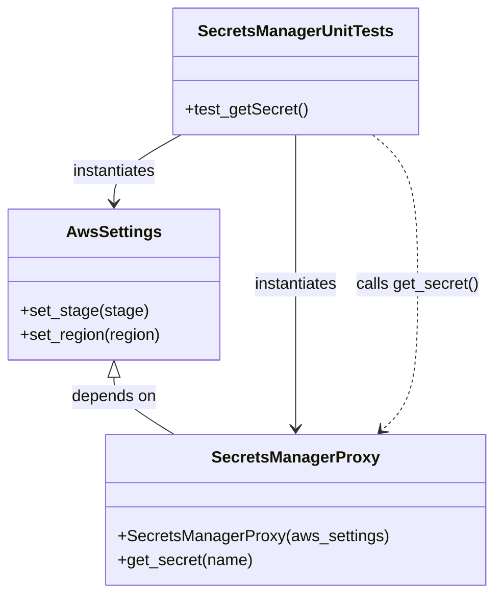

# Diagram: partview_core/partview_service/partview_service/tests/framework/secrets_manager_proxy_test.py

> Auto-generated by Obscura crawlers

## Mermaid

### SVG

<svg id="container" width="488.6328125" xmlns="http://www.w3.org/2000/svg" class="classDiagram" height="590" viewBox="0 0 488.6328125 590" role="graphics-document document" aria-roledescription="class"><g><defs><marker id="container_class-aggregationStart" class="marker aggregation class" refX="18" refY="7" markerWidth="190" markerHeight="240" orient="auto"><path d="M 18,7 L9,13 L1,7 L9,1 Z"></path></marker></defs><defs><marker id="container_class-aggregationEnd" class="marker aggregation class" refX="1" refY="7" markerWidth="20" markerHeight="28" orient="auto"><path d="M 18,7 L9,13 L1,7 L9,1 Z"></path></marker></defs><defs><marker id="container_class-extensionStart" class="marker extension class" refX="18" refY="7" markerWidth="190" markerHeight="240" orient="auto"><path d="M 1,7 L18,13 V 1 Z"></path></marker></defs><defs><marker id="container_class-extensionEnd" class="marker extension class" refX="1" refY="7" markerWidth="20" markerHeight="28" orient="auto"><path d="M 1,1 V 13 L18,7 Z"></path></marker></defs><defs><marker id="container_class-compositionStart" class="marker composition class" refX="18" refY="7" markerWidth="190" markerHeight="240" orient="auto"><path d="M 18,7 L9,13 L1,7 L9,1 Z"></path></marker></defs><defs><marker id="container_class-compositionEnd" class="marker composition class" refX="1" refY="7" markerWidth="20" markerHeight="28" orient="auto"><path d="M 18,7 L9,13 L1,7 L9,1 Z"></path></marker></defs><defs><marker id="container_class-dependencyStart" class="marker dependency class" refX="6" refY="7" markerWidth="190" markerHeight="240" orient="auto"><path d="M 5,7 L9,13 L1,7 L9,1 Z"></path></marker></defs><defs><marker id="container_class-dependencyEnd" class="marker dependency class" refX="13" refY="7" markerWidth="20" markerHeight="28" orient="auto"><path d="M 18,7 L9,13 L14,7 L9,1 Z"></path></marker></defs><defs><marker id="container_class-lollipopStart" class="marker lollipop class" refX="13" refY="7" markerWidth="190" markerHeight="240" orient="auto"><circle stroke="black" fill="transparent" cx="7" cy="7" r="6"></circle></marker></defs><defs><marker id="container_class-lollipopEnd" class="marker lollipop class" refX="1" refY="7" markerWidth="190" markerHeight="240" orient="auto"><circle stroke="black" fill="transparent" cx="7" cy="7" r="6"></circle></marker></defs><g class="root"><g class="clusters"></g><g class="edgePaths"><path d="M112.699,375.25L112.699,378.542C112.699,381.833,112.699,388.417,122.754,397.875C132.808,407.333,152.918,419.667,162.972,425.833L173.027,432" id="id_AwsSettings_SecretsManagerProxy_1" class="edge-thickness-normal edge-pattern-solid relation" style=";;;" data-edge="true" data-et="edge" data-id="id_AwsSettings_SecretsManagerProxy_1" data-points="W3sieCI6MTEyLjY5OTIxODc1LCJ5IjozNTh9LHsieCI6MTEyLjY5OTIxODc1LCJ5IjozOTV9LHsieCI6MTczLjAyNjgyMDU5MTUxNzg2LCJ5Ijo0MzJ9XQ==" marker-start="url(#container_class-extensionStart)"></path><path d="M180.266,134L169.005,140.167C157.744,146.333,135.222,158.667,123.96,170C112.699,181.333,112.699,191.667,112.699,196.833L112.699,202" id="id_SecretsManagerUnitTests_AwsSettings_2" class="edge-thickness-normal edge-pattern-solid relation" style=";;;" data-edge="true" data-et="edge" data-id="id_SecretsManagerUnitTests_AwsSettings_2" data-points="W3sieCI6MTgwLjI2NjEzMjgxMjUwMDAyLCJ5IjoxMzR9LHsieCI6MTEyLjY5OTIxODc1LCJ5IjoxNzF9LHsieCI6MTEyLjY5OTIxODc1LCJ5IjoyMDh9XQ==" marker-end="url(#container_class-dependencyEnd)"></path><path d="M295.313,134L295.313,140.167C295.313,146.333,295.313,158.667,295.313,183.5C295.313,208.333,295.313,245.667,295.313,283C295.313,320.333,295.313,357.667,295.313,381.5C295.313,405.333,295.313,415.667,295.313,420.833L295.313,426" id="id_SecretsManagerUnitTests_SecretsManagerProxy_3" class="edge-thickness-normal edge-pattern-solid relation" style=";;;" data-edge="true" data-et="edge" data-id="id_SecretsManagerUnitTests_SecretsManagerProxy_3" data-points="W3sieCI6Mjk1LjMxMjUsInkiOjEzNH0seyJ4IjoyOTUuMzEyNSwieSI6MTcxfSx7IngiOjI5NS4zMTI1LCJ5IjoyODN9LHsieCI6Mjk1LjMxMjUsInkiOjM5NX0seyJ4IjoyOTUuMzEyNSwieSI6NDMyfV0=" marker-end="url(#container_class-dependencyEnd)"></path><path d="M373.506,134L381.16,140.167C388.814,146.333,404.122,158.667,411.776,183.5C419.43,208.333,419.43,245.667,419.43,283C419.43,320.333,419.43,357.667,413.338,381.83C407.247,405.993,395.064,416.987,388.973,422.484L382.881,427.98" id="id_SecretsManagerUnitTests_SecretsManagerProxy_4" class="edge-thickness-normal edge-pattern-dashed relation" style=";;;" data-edge="true" data-et="edge" data-id="id_SecretsManagerUnitTests_SecretsManagerProxy_4" data-points="W3sieCI6MzczLjUwNjMyODEyNSwieSI6MTM0fSx7IngiOjQxOS40Mjk2ODc1LCJ5IjoxNzF9LHsieCI6NDE5LjQyOTY4NzUsInkiOjI4M30seyJ4Ijo0MTkuNDI5Njg3NSwieSI6Mzk1fSx7IngiOjM3OC40MjY2ODgwNTgwMzU3LCJ5Ijo0MzJ9XQ==" marker-end="url(#container_class-dependencyEnd)"></path></g><g class="edgeLabels"><g class="edgeLabel" transform="translate(112.69921875, 395)"><g class="label" data-id="id_AwsSettings_SecretsManagerProxy_1" transform="translate(-42.9453125, -12)"><foreignObject width="85.890625" height="24">

depends on

</foreignObject></g></g><g class="edgeLabel" transform="translate(112.69921875, 171)"><g class="label" data-id="id_SecretsManagerUnitTests_AwsSettings_2" transform="translate(-42.9140625, -12)"><foreignObject width="85.828125" height="24">

instantiates

</foreignObject></g></g><g class="edgeLabel" transform="translate(295.3125, 283)"><g class="label" data-id="id_SecretsManagerUnitTests_SecretsManagerProxy_3" transform="translate(-42.9140625, -12)"><foreignObject width="85.828125" height="24">

instantiates

</foreignObject></g></g><g class="edgeLabel" transform="translate(419.4296875, 283)"><g class="label" data-id="id_SecretsManagerUnitTests_SecretsManagerProxy_4" transform="translate(-61.203125, -12)"><foreignObject width="122.40625" height="24">

calls get_secret()

</foreignObject></g></g></g><g class="nodes"><g class="node default" id="classId-AwsSettings-0" transform="translate(112.69921875, 283)"><g class="basic label-container"><path d="M-104.69921875 -75 L104.69921875 -75 L104.69921875 75 L-104.69921875 75" stroke="none" stroke-width="0" fill="#ECECFF" style=""></path><path d="M-104.69921875 -75 C-50.07129245965797 -75, 4.5566338306840635 -75, 104.69921875 -75 M-104.69921875 -75 C-60.68522911022165 -75, -16.671239470443297 -75, 104.69921875 -75 M104.69921875 -75 C104.69921875 -44.77575957011996, 104.69921875 -14.551519140239925, 104.69921875 75 M104.69921875 -75 C104.69921875 -37.64657871974991, 104.69921875 -0.2931574394998222, 104.69921875 75 M104.69921875 75 C46.01091301038274 75, -12.677392729234526 75, -104.69921875 75 M104.69921875 75 C56.36253395185187 75, 8.025849153703746 75, -104.69921875 75 M-104.69921875 75 C-104.69921875 24.999203344053313, -104.69921875 -25.001593311893373, -104.69921875 -75 M-104.69921875 75 C-104.69921875 44.63416393739287, -104.69921875 14.268327874785747, -104.69921875 -75" stroke="#9370DB" stroke-width="1.3" fill="none" stroke-dasharray="0 0" style=""></path></g><g class="annotation-group text" transform="translate(0, -51)"></g><g class="label-group text" transform="translate(-44.8203125, -51)"><g class="label" style="font-weight: bolder" transform="translate(0,-12)"><foreignObject width="89.640625" height="24">

AwsSettings

</foreignObject></g></g><g class="members-group text" transform="translate(-92.69921875, -3)"></g><g class="methods-group text" transform="translate(-92.69921875, 27)"><g class="label" style="" transform="translate(0,-12)"><foreignObject width="125.578125" height="24">

+set_stage(stage)

</foreignObject></g><g class="label" style="" transform="translate(0,12)"><foreignObject width="140.578125" height="24">

+set_region(region)

</foreignObject></g></g><g class="divider" style=""><path d="M-104.69921875 -27 C-54.965692932845705 -27, -5.232167115691411 -27, 104.69921875 -27 M-104.69921875 -27 C-39.11705429162859 -27, 26.465110166742818 -27, 104.69921875 -27" stroke="#9370DB" stroke-width="1.3" fill="none" stroke-dasharray="0 0" style=""></path></g><g class="divider" style=""><path d="M-104.69921875 -3 C-21.34306257995611 -3, 62.01309359008778 -3, 104.69921875 -3 M-104.69921875 -3 C-21.712832804553372 -3, 61.273553140893256 -3, 104.69921875 -3" stroke="#9370DB" stroke-width="1.3" fill="none" stroke-dasharray="0 0" style=""></path></g></g><g class="node default" id="classId-SecretsManagerProxy-1" transform="translate(295.3125, 507)"><g class="basic label-container"><path d="M-183.9609375 -75 L183.9609375 -75 L183.9609375 75 L-183.9609375 75" stroke="none" stroke-width="0" fill="#ECECFF" style=""></path><path d="M-183.9609375 -75 C-70.2313298940944 -75, 43.4982777118112 -75, 183.9609375 -75 M-183.9609375 -75 C-60.69328524263254 -75, 62.57436701473492 -75, 183.9609375 -75 M183.9609375 -75 C183.9609375 -42.38796387917596, 183.9609375 -9.775927758351926, 183.9609375 75 M183.9609375 -75 C183.9609375 -42.683622310902166, 183.9609375 -10.367244621804332, 183.9609375 75 M183.9609375 75 C58.28560493006886 75, -67.38972763986229 75, -183.9609375 75 M183.9609375 75 C74.60892684990388 75, -34.74308380019224 75, -183.9609375 75 M-183.9609375 75 C-183.9609375 22.1349681403403, -183.9609375 -30.730063719319404, -183.9609375 -75 M-183.9609375 75 C-183.9609375 25.31028194876925, -183.9609375 -24.379436102461497, -183.9609375 -75" stroke="#9370DB" stroke-width="1.3" fill="none" stroke-dasharray="0 0" style=""></path></g><g class="annotation-group text" transform="translate(0, -51)"></g><g class="label-group text" transform="translate(-79.03125, -51)"><g class="label" style="font-weight: bolder" transform="translate(0,-12)"><foreignObject width="158.0625" height="24">

SecretsManagerProxy

</foreignObject></g></g><g class="members-group text" transform="translate(-171.9609375, -3)"></g><g class="methods-group text" transform="translate(-171.9609375, 27)"><g class="label" style="" transform="translate(0,-12)"><foreignObject width="264.890625" height="24">

+SecretsManagerProxy(aws_settings)

</foreignObject></g><g class="label" style="" transform="translate(0,12)"><foreignObject width="133.78125" height="24">

+get_secret(name)

</foreignObject></g></g><g class="divider" style=""><path d="M-183.9609375 -27 C-93.9893950139366 -27, -4.0178525278732025 -27, 183.9609375 -27 M-183.9609375 -27 C-56.28706102438885 -27, 71.3868154512223 -27, 183.9609375 -27" stroke="#9370DB" stroke-width="1.3" fill="none" stroke-dasharray="0 0" style=""></path></g><g class="divider" style=""><path d="M-183.9609375 -3 C-92.02222983020583 -3, -0.08352216041166116 -3, 183.9609375 -3 M-183.9609375 -3 C-48.88757933272282 -3, 86.18577883455436 -3, 183.9609375 -3" stroke="#9370DB" stroke-width="1.3" fill="none" stroke-dasharray="0 0" style=""></path></g></g><g class="node default" id="classId-SecretsManagerUnitTests-2" transform="translate(295.3125, 71)"><g class="basic label-container"><path d="M-119.4921875 -63 L119.4921875 -63 L119.4921875 63 L-119.4921875 63" stroke="none" stroke-width="0" fill="#ECECFF" style=""></path><path d="M-119.4921875 -63 C-28.6456024871965 -63, 62.200982525607 -63, 119.4921875 -63 M-119.4921875 -63 C-41.575052420444464 -63, 36.34208265911107 -63, 119.4921875 -63 M119.4921875 -63 C119.4921875 -16.795982130750403, 119.4921875 29.408035738499194, 119.4921875 63 M119.4921875 -63 C119.4921875 -15.896376042718543, 119.4921875 31.207247914562913, 119.4921875 63 M119.4921875 63 C69.55488277961373 63, 19.61757805922747 63, -119.4921875 63 M119.4921875 63 C33.26793586228028 63, -52.956315775439435 63, -119.4921875 63 M-119.4921875 63 C-119.4921875 21.786935232863165, -119.4921875 -19.42612953427367, -119.4921875 -63 M-119.4921875 63 C-119.4921875 13.599952698393977, -119.4921875 -35.800094603212045, -119.4921875 -63" stroke="#9370DB" stroke-width="1.3" fill="none" stroke-dasharray="0 0" style=""></path></g><g class="annotation-group text" transform="translate(0, -39)"></g><g class="label-group text" transform="translate(-92.890625, -39)"><g class="label" style="font-weight: bolder" transform="translate(0,-12)"><foreignObject width="185.78125" height="24">

SecretsManagerUnitTests

</foreignObject></g></g><g class="members-group text" transform="translate(-107.4921875, 9)"></g><g class="methods-group text" transform="translate(-107.4921875, 39)"><g class="label" style="" transform="translate(0,-12)"><foreignObject width="122.09375" height="24">

+test_getSecret()

</foreignObject></g></g><g class="divider" style=""><path d="M-119.4921875 -15 C-54.509856310140634 -15, 10.472474879718732 -15, 119.4921875 -15 M-119.4921875 -15 C-31.85893549842703 -15, 55.77431650314594 -15, 119.4921875 -15" stroke="#9370DB" stroke-width="1.3" fill="none" stroke-dasharray="0 0" style=""></path></g><g class="divider" style=""><path d="M-119.4921875 9 C-64.44354310814465 9, -9.394898716289305 9, 119.4921875 9 M-119.4921875 9 C-32.985556943520606 9, 53.52107361295879 9, 119.4921875 9" stroke="#9370DB" stroke-width="1.3" fill="none" stroke-dasharray="0 0" style=""></path></g></g></g></g></g></svg>
