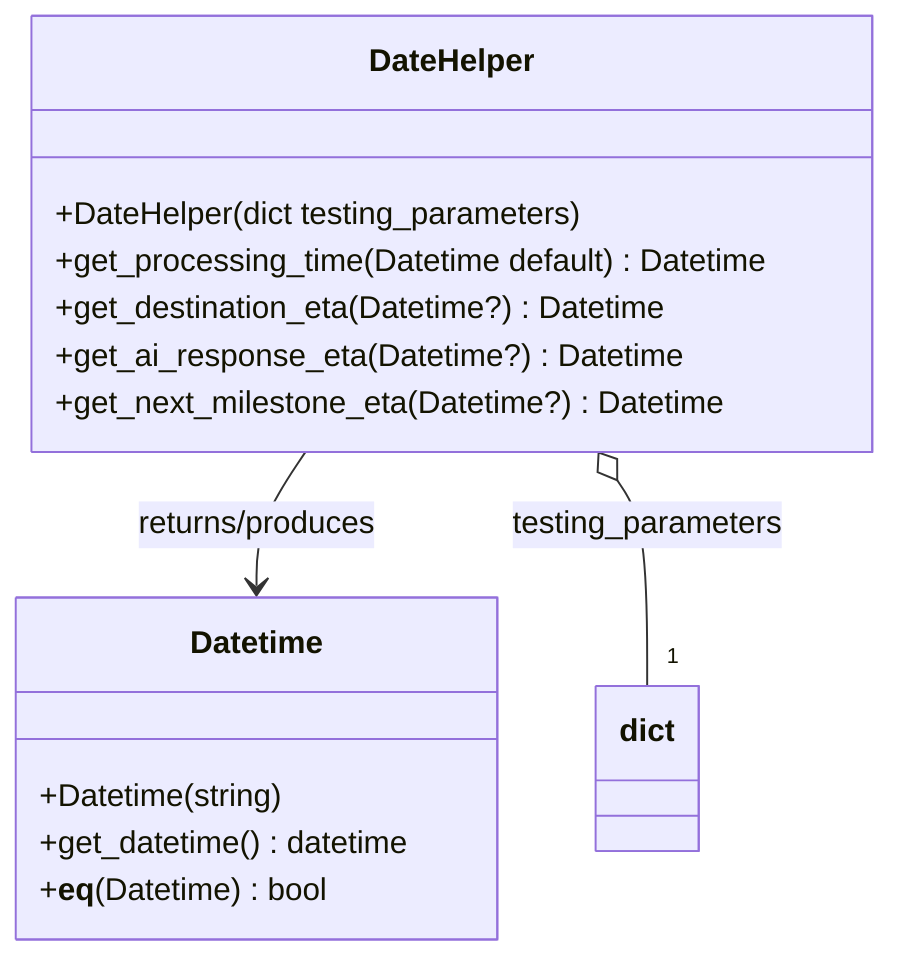

# Diagram: partview_core/partview_service/partview_service/tests/framework/test_date_helper.py

> Auto-generated by Obscura crawlers

## Mermaid

### SVG

<svg id="container" width="457.333984375" xmlns="http://www.w3.org/2000/svg" class="classDiagram" height="486" viewBox="0 0 457.333984375 486" role="graphics-document document" aria-roledescription="class"><g><defs><marker id="container_class-aggregationStart" class="marker aggregation class" refX="18" refY="7" markerWidth="190" markerHeight="240" orient="auto"><path d="M 18,7 L9,13 L1,7 L9,1 Z"></path></marker></defs><defs><marker id="container_class-aggregationEnd" class="marker aggregation class" refX="1" refY="7" markerWidth="20" markerHeight="28" orient="auto"><path d="M 18,7 L9,13 L1,7 L9,1 Z"></path></marker></defs><defs><marker id="container_class-extensionStart" class="marker extension class" refX="18" refY="7" markerWidth="190" markerHeight="240" orient="auto"><path d="M 1,7 L18,13 V 1 Z"></path></marker></defs><defs><marker id="container_class-extensionEnd" class="marker extension class" refX="1" refY="7" markerWidth="20" markerHeight="28" orient="auto"><path d="M 1,1 V 13 L18,7 Z"></path></marker></defs><defs><marker id="container_class-compositionStart" class="marker composition class" refX="18" refY="7" markerWidth="190" markerHeight="240" orient="auto"><path d="M 18,7 L9,13 L1,7 L9,1 Z"></path></marker></defs><defs><marker id="container_class-compositionEnd" class="marker composition class" refX="1" refY="7" markerWidth="20" markerHeight="28" orient="auto"><path d="M 18,7 L9,13 L1,7 L9,1 Z"></path></marker></defs><defs><marker id="container_class-dependencyStart" class="marker dependency class" refX="6" refY="7" markerWidth="190" markerHeight="240" orient="auto"><path d="M 5,7 L9,13 L1,7 L9,1 Z"></path></marker></defs><defs><marker id="container_class-dependencyEnd" class="marker dependency class" refX="13" refY="7" markerWidth="20" markerHeight="28" orient="auto"><path d="M 18,7 L9,13 L14,7 L9,1 Z"></path></marker></defs><defs><marker id="container_class-lollipopStart" class="marker lollipop class" refX="13" refY="7" markerWidth="190" markerHeight="240" orient="auto"><circle stroke="black" fill="transparent" cx="7" cy="7" r="6"></circle></marker></defs><defs><marker id="container_class-lollipopEnd" class="marker lollipop class" refX="1" refY="7" markerWidth="190" markerHeight="240" orient="auto"><circle stroke="black" fill="transparent" cx="7" cy="7" r="6"></circle></marker></defs><g class="root"><g class="clusters"></g><g class="edgePaths"><path d="M157.634,230L153.456,236.167C149.278,242.333,140.922,254.667,136.744,266C132.566,277.333,132.566,287.667,132.566,292.833L132.566,298" id="id_DateHelper_Datetime_1" class="edge-thickness-normal edge-pattern-solid relation" style=";;;" data-edge="true" data-et="edge" data-id="id_DateHelper_Datetime_1" data-points="W3sieCI6MTU3LjYzNDI3NzM0Mzc1LCJ5IjoyMzB9LHsieCI6MTMyLjU2NjQwNjI1LCJ5IjoyNjd9LHsieCI6MTMyLjU2NjQwNjI1LCJ5IjozMDR9XQ==" marker-end="url(#container_class-dependencyEnd)"></path><path d="M317.717,244.281L320.282,248.067C322.848,251.854,327.979,259.427,330.544,276.88C333.109,294.333,333.109,321.667,333.109,335.333L333.109,349" id="id_DateHelper_dict_2" class="edge-thickness-normal edge-pattern-solid relation" style=";;;" data-edge="true" data-et="edge" data-id="id_DateHelper_dict_2" data-points="W3sieCI6MzA4LjA0MTUwMzkwNjI1LCJ5IjoyMzB9LHsieCI6MzMzLjEwOTM3NSwieSI6MjY3fSx7IngiOjMzMy4xMDkzNzUsInkiOjM0OX1d" marker-start="url(#container_class-aggregationStart)"></path></g><g class="edgeLabels"><g class="edgeLabel" transform="translate(132.56640625, 267)"><g class="label" data-id="id_DateHelper_Datetime_1" transform="translate(-63.65625, -12)"><foreignObject width="127.3125" height="24">

returns/produces

</foreignObject></g></g><g class="edgeLabel" transform="translate(333.109375, 267)"><g class="label" data-id="id_DateHelper_dict_2" transform="translate(-70.28125, -12)"><foreignObject width="140.5625" height="24">

testing_parameters

</foreignObject></g></g><g class="edgeTerminals" transform="translate(343.1093774999998, 326.5000021428571)"><g class="inner" transform="translate(0, 0)"></g><foreignObject style="width: 9px; height: 12px;">
1
</foreignObject></g></g><g class="nodes"><g class="node default" id="classId-DateHelper-0" transform="translate(232.837890625, 119)"><g class="basic label-container"><path d="M-216.49609375 -111 L216.49609375 -111 L216.49609375 111 L-216.49609375 111" stroke="none" stroke-width="0" fill="#ECECFF" style=""></path><path d="M-216.49609375 -111 C-90.33404375414081 -111, 35.828006241718384 -111, 216.49609375 -111 M-216.49609375 -111 C-47.23346890819832 -111, 122.02915593360336 -111, 216.49609375 -111 M216.49609375 -111 C216.49609375 -47.26709237405308, 216.49609375 16.465815251893844, 216.49609375 111 M216.49609375 -111 C216.49609375 -49.478427835416994, 216.49609375 12.043144329166012, 216.49609375 111 M216.49609375 111 C54.17095943178154 111, -108.15417488643692 111, -216.49609375 111 M216.49609375 111 C111.26535711505161 111, 6.034620480103229 111, -216.49609375 111 M-216.49609375 111 C-216.49609375 47.88803592114751, -216.49609375 -15.223928157704975, -216.49609375 -111 M-216.49609375 111 C-216.49609375 59.72650726678115, -216.49609375 8.453014533562296, -216.49609375 -111" stroke="#9370DB" stroke-width="1.3" fill="none" stroke-dasharray="0 0" style=""></path></g><g class="annotation-group text" transform="translate(0, -87)"></g><g class="label-group text" transform="translate(-41.3984375, -87)"><g class="label" style="font-weight: bolder" transform="translate(0,-12)"><foreignObject width="82.796875" height="24">

DateHelper

</foreignObject></g></g><g class="members-group text" transform="translate(-204.49609375, -39)"></g><g class="methods-group text" transform="translate(-204.49609375, -9)"><g class="label" style="" transform="translate(0,-12)"><foreignObject width="272.453125" height="24">

+DateHelper(dict testing_parameters)

</foreignObject></g><g class="label" style="" transform="translate(0,12)"><foreignObject width="367.59375" height="24">

+get_processing_time(Datetime default) : Datetime

</foreignObject></g><g class="label" style="" transform="translate(0,36)"><foreignObject width="313.8125" height="24">

+get_destination_eta(Datetime?) : Datetime

</foreignObject></g><g class="label" style="" transform="translate(0,60)"><foreignObject width="318.203125" height="24">

+get_ai_response_eta(Datetime?) : Datetime

</foreignObject></g><g class="label" style="" transform="translate(0,84)"><foreignObject width="342.484375" height="24">

+get_next_milestone_eta(Datetime?) : Datetime

</foreignObject></g></g><g class="divider" style=""><path d="M-216.49609375 -63 C-121.7816613528721 -63, -27.067228955744213 -63, 216.49609375 -63 M-216.49609375 -63 C-123.34717693877657 -63, -30.19826012755314 -63, 216.49609375 -63" stroke="#9370DB" stroke-width="1.3" fill="none" stroke-dasharray="0 0" style=""></path></g><g class="divider" style=""><path d="M-216.49609375 -39 C-116.11786549937268 -39, -15.739637248745368 -39, 216.49609375 -39 M-216.49609375 -39 C-72.82353817118809 -39, 70.84901740762382 -39, 216.49609375 -39" stroke="#9370DB" stroke-width="1.3" fill="none" stroke-dasharray="0 0" style=""></path></g></g><g class="node default" id="classId-Datetime-1" transform="translate(132.56640625, 391)"><g class="basic label-container"><path d="M-124.56640625 -87 L124.56640625 -87 L124.56640625 87 L-124.56640625 87" stroke="none" stroke-width="0" fill="#ECECFF" style=""></path><path d="M-124.56640625 -87 C-32.96645914306015 -87, 58.6334879638797 -87, 124.56640625 -87 M-124.56640625 -87 C-55.78052799539667 -87, 13.005350259206665 -87, 124.56640625 -87 M124.56640625 -87 C124.56640625 -46.93848422051848, 124.56640625 -6.876968441036965, 124.56640625 87 M124.56640625 -87 C124.56640625 -30.508251773693665, 124.56640625 25.98349645261267, 124.56640625 87 M124.56640625 87 C41.115759263670014 87, -42.33488772265997 87, -124.56640625 87 M124.56640625 87 C70.1594463613659 87, 15.752486472731789 87, -124.56640625 87 M-124.56640625 87 C-124.56640625 19.729566335574305, -124.56640625 -47.54086732885139, -124.56640625 -87 M-124.56640625 87 C-124.56640625 27.915512463321548, -124.56640625 -31.168975073356904, -124.56640625 -87" stroke="#9370DB" stroke-width="1.3" fill="none" stroke-dasharray="0 0" style=""></path></g><g class="annotation-group text" transform="translate(0, -63)"></g><g class="label-group text" transform="translate(-33.3984375, -63)"><g class="label" style="font-weight: bolder" transform="translate(0,-12)"><foreignObject width="66.796875" height="24">

Datetime

</foreignObject></g></g><g class="members-group text" transform="translate(-112.56640625, -15)"></g><g class="methods-group text" transform="translate(-112.56640625, 15)"><g class="label" style="" transform="translate(0,-12)"><foreignObject width="125.8125" height="24">

+Datetime(string)

</foreignObject></g><g class="label" style="" transform="translate(0,12)"><foreignObject width="191.734375" height="24">

+get_datetime() : datetime

</foreignObject></g><g class="label" style="" transform="translate(0,36)"><foreignObject width="147.828125" height="24">

+<strong>eq</strong>(Datetime) : bool

</foreignObject></g></g><g class="divider" style=""><path d="M-124.56640625 -39 C-25.399874885854317 -39, 73.76665647829137 -39, 124.56640625 -39 M-124.56640625 -39 C-60.985719124630755 -39, 2.59496800073849 -39, 124.56640625 -39" stroke="#9370DB" stroke-width="1.3" fill="none" stroke-dasharray="0 0" style=""></path></g><g class="divider" style=""><path d="M-124.56640625 -15 C-46.16817718904635 -15, 32.23005187190731 -15, 124.56640625 -15 M-124.56640625 -15 C-71.68138135147413 -15, -18.796356452948274 -15, 124.56640625 -15" stroke="#9370DB" stroke-width="1.3" fill="none" stroke-dasharray="0 0" style=""></path></g></g><g class="node default" id="classId-dict-2" transform="translate(333.109375, 391)"><g class="basic label-container"><path d="M-25.9765625 -42 L25.9765625 -42 L25.9765625 42 L-25.9765625 42" stroke="none" stroke-width="0" fill="#ECECFF" style=""></path><path d="M-25.9765625 -42 C-10.821472676292 -42, 4.333617147416 -42, 25.9765625 -42 M-25.9765625 -42 C-13.2893247429983 -42, -0.6020869859965998 -42, 25.9765625 -42 M25.9765625 -42 C25.9765625 -17.275501884333202, 25.9765625 7.448996231333595, 25.9765625 42 M25.9765625 -42 C25.9765625 -12.790547447928123, 25.9765625 16.418905104143754, 25.9765625 42 M25.9765625 42 C11.952377536638242 42, -2.0718074267235167 42, -25.9765625 42 M25.9765625 42 C15.071236349127789 42, 4.1659101982555775 42, -25.9765625 42 M-25.9765625 42 C-25.9765625 9.834685022455318, -25.9765625 -22.330629955089364, -25.9765625 -42 M-25.9765625 42 C-25.9765625 15.214739517792353, -25.9765625 -11.570520964415294, -25.9765625 -42" stroke="#9370DB" stroke-width="1.3" fill="none" stroke-dasharray="0 0" style=""></path></g><g class="annotation-group text" transform="translate(0, -18)"></g><g class="label-group text" transform="translate(-13.9765625, -18)"><g class="label" style="font-weight: bolder" transform="translate(0,-12)"><foreignObject width="27.953125" height="24">

dict

</foreignObject></g></g><g class="members-group text" transform="translate(-13.9765625, 30)"></g><g class="methods-group text" transform="translate(-13.9765625, 60)"></g><g class="divider" style=""><path d="M-25.9765625 6 C-15.08930235761486 6, -4.202042215229721 6, 25.9765625 6 M-25.9765625 6 C-12.174839452607113 6, 1.6268835947857738 6, 25.9765625 6" stroke="#9370DB" stroke-width="1.3" fill="none" stroke-dasharray="0 0" style=""></path></g><g class="divider" style=""><path d="M-25.9765625 24 C-10.21207611011747 24, 5.552410279765059 24, 25.9765625 24 M-25.9765625 24 C-9.706297231136624 24, 6.563968037726752 24, 25.9765625 24" stroke="#9370DB" stroke-width="1.3" fill="none" stroke-dasharray="0 0" style=""></path></g></g></g></g></g></svg>
