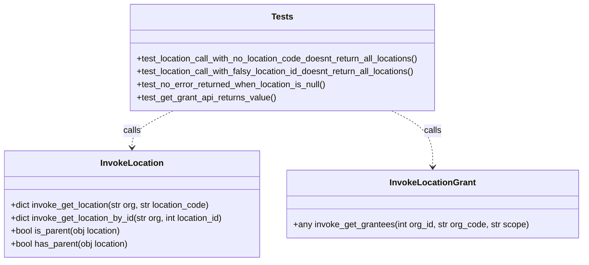

# Diagram: partview_core/partview_service/partview_service/tests/framework/test_invoke_location.py

> Auto-generated by Obscura crawlers

## Mermaid

### SVG

<svg id="container" width="1089.5625" xmlns="http://www.w3.org/2000/svg" class="classDiagram" height="486" viewBox="0 0 1089.5625 486" role="graphics-document document" aria-roledescription="class"><g><defs><marker id="container_class-aggregationStart" class="marker aggregation class" refX="18" refY="7" markerWidth="190" markerHeight="240" orient="auto"><path d="M 18,7 L9,13 L1,7 L9,1 Z"></path></marker></defs><defs><marker id="container_class-aggregationEnd" class="marker aggregation class" refX="1" refY="7" markerWidth="20" markerHeight="28" orient="auto"><path d="M 18,7 L9,13 L1,7 L9,1 Z"></path></marker></defs><defs><marker id="container_class-extensionStart" class="marker extension class" refX="18" refY="7" markerWidth="190" markerHeight="240" orient="auto"><path d="M 1,7 L18,13 V 1 Z"></path></marker></defs><defs><marker id="container_class-extensionEnd" class="marker extension class" refX="1" refY="7" markerWidth="20" markerHeight="28" orient="auto"><path d="M 1,1 V 13 L18,7 Z"></path></marker></defs><defs><marker id="container_class-compositionStart" class="marker composition class" refX="18" refY="7" markerWidth="190" markerHeight="240" orient="auto"><path d="M 18,7 L9,13 L1,7 L9,1 Z"></path></marker></defs><defs><marker id="container_class-compositionEnd" class="marker composition class" refX="1" refY="7" markerWidth="20" markerHeight="28" orient="auto"><path d="M 18,7 L9,13 L1,7 L9,1 Z"></path></marker></defs><defs><marker id="container_class-dependencyStart" class="marker dependency class" refX="6" refY="7" markerWidth="190" markerHeight="240" orient="auto"><path d="M 5,7 L9,13 L1,7 L9,1 Z"></path></marker></defs><defs><marker id="container_class-dependencyEnd" class="marker dependency class" refX="13" refY="7" markerWidth="20" markerHeight="28" orient="auto"><path d="M 18,7 L9,13 L14,7 L9,1 Z"></path></marker></defs><defs><marker id="container_class-lollipopStart" class="marker lollipop class" refX="13" refY="7" markerWidth="190" markerHeight="240" orient="auto"><circle stroke="black" fill="transparent" cx="7" cy="7" r="6"></circle></marker></defs><defs><marker id="container_class-lollipopEnd" class="marker lollipop class" refX="1" refY="7" markerWidth="190" markerHeight="240" orient="auto"><circle stroke="black" fill="transparent" cx="7" cy="7" r="6"></circle></marker></defs><g class="root"><g class="clusters"></g><g class="edgePaths"><path d="M326.356,206L313.62,212.167C300.883,218.333,275.41,230.667,262.674,242C249.938,253.333,249.938,263.667,249.938,268.833L249.938,274" id="id_Tests_InvokeLocation_1" class="edge-thickness-normal edge-pattern-dashed relation" style=";;;" data-edge="true" data-et="edge" data-id="id_Tests_InvokeLocation_1" data-points="W3sieCI6MzI2LjM1NjI3Mjk3Nzk0MTIsInkiOjIwNn0seyJ4IjoyNDkuOTM3NSwieSI6MjQzfSx7IngiOjI0OS45Mzc1LCJ5IjoyODB9XQ==" marker-end="url(#container_class-dependencyEnd)"></path><path d="M735.3,206L748.036,212.167C760.773,218.333,786.246,230.667,798.982,248C811.719,265.333,811.719,287.667,811.719,298.833L811.719,310" id="id_Tests_InvokeLocationGrant_2" class="edge-thickness-normal edge-pattern-dashed relation" style=";;;" data-edge="true" data-et="edge" data-id="id_Tests_InvokeLocationGrant_2" data-points="W3sieCI6NzM1LjI5OTk3NzAyMjA1ODgsInkiOjIwNn0seyJ4Ijo4MTEuNzE4NzUsInkiOjI0M30seyJ4Ijo4MTEuNzE4NzUsInkiOjMxNn1d" marker-end="url(#container_class-dependencyEnd)"></path></g><g class="edgeLabels"><g class="edgeLabel" transform="translate(249.9375, 243)"><g class="label" data-id="id_Tests_InvokeLocation_1" transform="translate(-16.4453125, -12)"><foreignObject width="32.890625" height="24">

calls

</foreignObject></g></g><g class="edgeLabel" transform="translate(811.71875, 243)"><g class="label" data-id="id_Tests_InvokeLocationGrant_2" transform="translate(-16.4453125, -12)"><foreignObject width="32.890625" height="24">

calls

</foreignObject></g></g></g><g class="nodes"><g class="node default" id="classId-InvokeLocation-0" transform="translate(249.9375, 379)"><g class="basic label-container"><path d="M-241.9375 -99 L241.9375 -99 L241.9375 99 L-241.9375 99" stroke="none" stroke-width="0" fill="#ECECFF" style=""></path><path d="M-241.9375 -99 C-70.97843011296189 -99, 99.98063977407622 -99, 241.9375 -99 M-241.9375 -99 C-125.66942733266592 -99, -9.401354665331837 -99, 241.9375 -99 M241.9375 -99 C241.9375 -48.91620043312656, 241.9375 1.1675991337468759, 241.9375 99 M241.9375 -99 C241.9375 -29.659581389763346, 241.9375 39.68083722047331, 241.9375 99 M241.9375 99 C131.17315543359078 99, 20.408810867181558 99, -241.9375 99 M241.9375 99 C122.72309611539409 99, 3.5086922307881707 99, -241.9375 99 M-241.9375 99 C-241.9375 40.019766699388406, -241.9375 -18.96046660122319, -241.9375 -99 M-241.9375 99 C-241.9375 33.07409879961628, -241.9375 -32.85180240076744, -241.9375 -99" stroke="#9370DB" stroke-width="1.3" fill="none" stroke-dasharray="0 0" style=""></path></g><g class="annotation-group text" transform="translate(0, -75)"></g><g class="label-group text" transform="translate(-55.703125, -75)"><g class="label" style="font-weight: bolder" transform="translate(0,-12)"><foreignObject width="111.40625" height="24">

InvokeLocation

</foreignObject></g></g><g class="members-group text" transform="translate(-229.9375, -27)"></g><g class="methods-group text" transform="translate(-229.9375, 3)"><g class="label" style="" transform="translate(0,-12)"><foreignObject width="376.9375" height="24">

+dict invoke_get_location(str org, str location_code)

</foreignObject></g><g class="label" style="" transform="translate(0,12)"><foreignObject width="404.171875" height="24">

+dict invoke_get_location_by_id(str org, int location_id)

</foreignObject></g><g class="label" style="" transform="translate(0,36)"><foreignObject width="209.796875" height="24">

+bool is_parent(obj location)

</foreignObject></g><g class="label" style="" transform="translate(0,60)"><foreignObject width="223.203125" height="24">

+bool has_parent(obj location)

</foreignObject></g></g><g class="divider" style=""><path d="M-241.9375 -51 C-65.07393724670541 -51, 111.78962550658918 -51, 241.9375 -51 M-241.9375 -51 C-122.40007130252505 -51, -2.862642605050098 -51, 241.9375 -51" stroke="#9370DB" stroke-width="1.3" fill="none" stroke-dasharray="0 0" style=""></path></g><g class="divider" style=""><path d="M-241.9375 -27 C-87.41339340078764 -27, 67.11071319842472 -27, 241.9375 -27 M-241.9375 -27 C-127.4459274379198 -27, -12.954354875839613 -27, 241.9375 -27" stroke="#9370DB" stroke-width="1.3" fill="none" stroke-dasharray="0 0" style=""></path></g></g><g class="node default" id="classId-InvokeLocationGrant-1" transform="translate(811.71875, 379)"><g class="basic label-container"><path d="M-269.84375 -63 L269.84375 -63 L269.84375 63 L-269.84375 63" stroke="none" stroke-width="0" fill="#ECECFF" style=""></path><path d="M-269.84375 -63 C-113.80282846166358 -63, 42.23809307667284 -63, 269.84375 -63 M-269.84375 -63 C-101.98796794398964 -63, 65.86781411202071 -63, 269.84375 -63 M269.84375 -63 C269.84375 -28.61192246555816, 269.84375 5.776155068883682, 269.84375 63 M269.84375 -63 C269.84375 -13.490109638325364, 269.84375 36.01978072334927, 269.84375 63 M269.84375 63 C75.28010256242229 63, -119.28354487515543 63, -269.84375 63 M269.84375 63 C142.39669679810606 63, 14.949643596212127 63, -269.84375 63 M-269.84375 63 C-269.84375 13.07792105001451, -269.84375 -36.84415789997098, -269.84375 -63 M-269.84375 63 C-269.84375 28.211382670867025, -269.84375 -6.577234658265951, -269.84375 -63" stroke="#9370DB" stroke-width="1.3" fill="none" stroke-dasharray="0 0" style=""></path></g><g class="annotation-group text" transform="translate(0, -39)"></g><g class="label-group text" transform="translate(-75.875, -39)"><g class="label" style="font-weight: bolder" transform="translate(0,-12)"><foreignObject width="151.75" height="24">

InvokeLocationGrant

</foreignObject></g></g><g class="members-group text" transform="translate(-257.84375, 9)"></g><g class="methods-group text" transform="translate(-257.84375, 39)"><g class="label" style="" transform="translate(0,-12)"><foreignObject width="439.8125" height="24">

+any invoke_get_grantees(int org_id, str org_code, str scope)

</foreignObject></g></g><g class="divider" style=""><path d="M-269.84375 -15 C-98.19304564323758 -15, 73.45765871352484 -15, 269.84375 -15 M-269.84375 -15 C-62.61493500307492 -15, 144.61387999385016 -15, 269.84375 -15" stroke="#9370DB" stroke-width="1.3" fill="none" stroke-dasharray="0 0" style=""></path></g><g class="divider" style=""><path d="M-269.84375 9 C-144.16489331031346 9, -18.48603662062692 9, 269.84375 9 M-269.84375 9 C-101.95924248977727 9, 65.92526502044547 9, 269.84375 9" stroke="#9370DB" stroke-width="1.3" fill="none" stroke-dasharray="0 0" style=""></path></g></g><g class="node default" id="classId-Tests-2" transform="translate(530.828125, 107)"><g class="basic label-container"><path d="M-288.88671875 -99 L288.88671875 -99 L288.88671875 99 L-288.88671875 99" stroke="none" stroke-width="0" fill="#ECECFF" style=""></path><path d="M-288.88671875 -99 C-69.19359348792068 -99, 150.49953177415864 -99, 288.88671875 -99 M-288.88671875 -99 C-128.27394238216948 -99, 32.33883398566104 -99, 288.88671875 -99 M288.88671875 -99 C288.88671875 -34.45717383551043, 288.88671875 30.085652328979137, 288.88671875 99 M288.88671875 -99 C288.88671875 -24.773665748614988, 288.88671875 49.452668502770024, 288.88671875 99 M288.88671875 99 C155.2686164203163 99, 21.650514090632612 99, -288.88671875 99 M288.88671875 99 C94.83017981445565 99, -99.2263591210887 99, -288.88671875 99 M-288.88671875 99 C-288.88671875 30.046666591644964, -288.88671875 -38.90666681671007, -288.88671875 -99 M-288.88671875 99 C-288.88671875 57.10003009498487, -288.88671875 15.200060189969733, -288.88671875 -99" stroke="#9370DB" stroke-width="1.3" fill="none" stroke-dasharray="0 0" style=""></path></g><g class="annotation-group text" transform="translate(0, -75)"></g><g class="label-group text" transform="translate(-19.1171875, -75)"><g class="label" style="font-weight: bolder" transform="translate(0,-12)"><foreignObject width="38.234375" height="24">

Tests

</foreignObject></g></g><g class="members-group text" transform="translate(-276.88671875, -27)"></g><g class="methods-group text" transform="translate(-276.88671875, 3)"><g class="label" style="" transform="translate(0,-12)"><foreignObject width="534.65625" height="24">

+test_location_call_with_no_location_code_doesnt_return_all_locations()

</foreignObject></g><g class="label" style="" transform="translate(0,12)"><foreignObject width="528.515625" height="24">

+test_location_call_with_falsy_location_id_doesnt_return_all_locations()

</foreignObject></g><g class="label" style="" transform="translate(0,36)"><foreignObject width="357.625" height="24">

+test_no_error_returned_when_location_is_null()

</foreignObject></g><g class="label" style="" transform="translate(0,60)"><foreignObject width="261.03125" height="24">

+test_get_grant_api_returns_value()

</foreignObject></g></g><g class="divider" style=""><path d="M-288.88671875 -51 C-89.16183228738751 -51, 110.56305417522498 -51, 288.88671875 -51 M-288.88671875 -51 C-76.35218953030798 -51, 136.18233968938404 -51, 288.88671875 -51" stroke="#9370DB" stroke-width="1.3" fill="none" stroke-dasharray="0 0" style=""></path></g><g class="divider" style=""><path d="M-288.88671875 -27 C-116.59441961216126 -27, 55.69787952567748 -27, 288.88671875 -27 M-288.88671875 -27 C-130.91088429573287 -27, 27.06495015853426 -27, 288.88671875 -27" stroke="#9370DB" stroke-width="1.3" fill="none" stroke-dasharray="0 0" style=""></path></g></g></g></g></g></svg>
