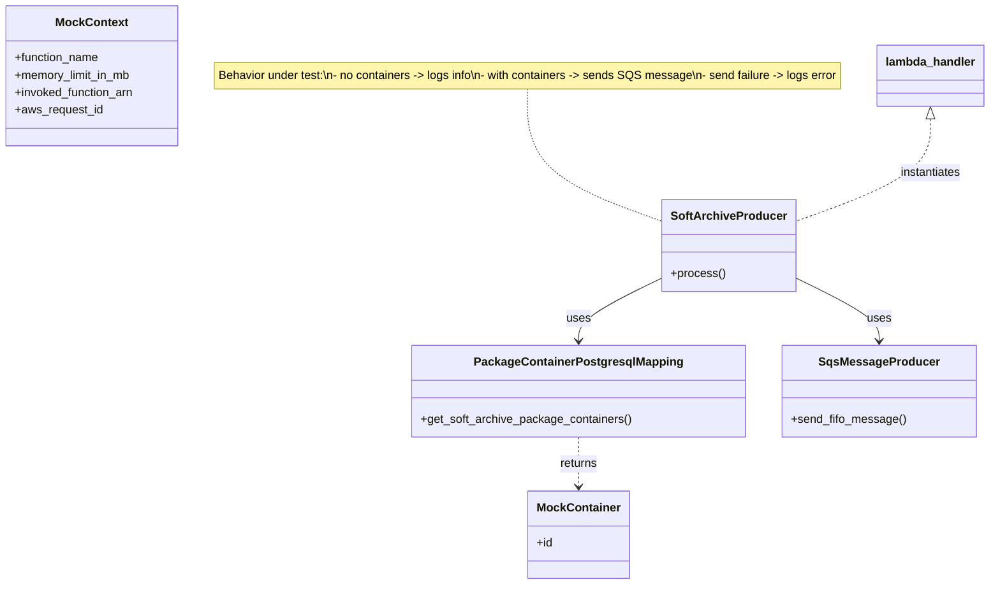
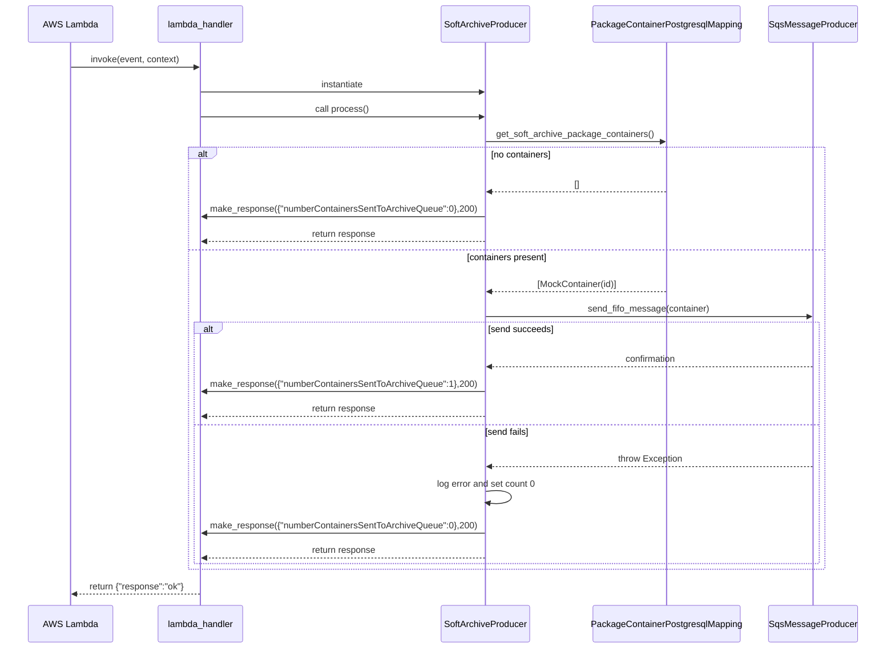

# Diagram: partview_core/partview_service/partview_service/tests/unit/api/archive/soft_archive/test_soft_archive_producer.py

> Auto-generated by Obscura crawlers

## Diagram 1

### SVG

<svg id="container" width="1379.8046875" xmlns="http://www.w3.org/2000/svg" class="classDiagram" height="802" viewBox="0 0 1379.8046875 802" role="graphics-document document" aria-roledescription="class"><g><defs><marker id="container_class-aggregationStart" class="marker aggregation class" refX="18" refY="7" markerWidth="190" markerHeight="240" orient="auto"><path d="M 18,7 L9,13 L1,7 L9,1 Z"></path></marker></defs><defs><marker id="container_class-aggregationEnd" class="marker aggregation class" refX="1" refY="7" markerWidth="20" markerHeight="28" orient="auto"><path d="M 18,7 L9,13 L1,7 L9,1 Z"></path></marker></defs><defs><marker id="container_class-extensionStart" class="marker extension class" refX="18" refY="7" markerWidth="190" markerHeight="240" orient="auto"><path d="M 1,7 L18,13 V 1 Z"></path></marker></defs><defs><marker id="container_class-extensionEnd" class="marker extension class" refX="1" refY="7" markerWidth="20" markerHeight="28" orient="auto"><path d="M 1,1 V 13 L18,7 Z"></path></marker></defs><defs><marker id="container_class-compositionStart" class="marker composition class" refX="18" refY="7" markerWidth="190" markerHeight="240" orient="auto"><path d="M 18,7 L9,13 L1,7 L9,1 Z"></path></marker></defs><defs><marker id="container_class-compositionEnd" class="marker composition class" refX="1" refY="7" markerWidth="20" markerHeight="28" orient="auto"><path d="M 18,7 L9,13 L1,7 L9,1 Z"></path></marker></defs><defs><marker id="container_class-dependencyStart" class="marker dependency class" refX="6" refY="7" markerWidth="190" markerHeight="240" orient="auto"><path d="M 5,7 L9,13 L1,7 L9,1 Z"></path></marker></defs><defs><marker id="container_class-dependencyEnd" class="marker dependency class" refX="13" refY="7" markerWidth="20" markerHeight="28" orient="auto"><path d="M 18,7 L9,13 L14,7 L9,1 Z"></path></marker></defs><defs><marker id="container_class-lollipopStart" class="marker lollipop class" refX="13" refY="7" markerWidth="190" markerHeight="240" orient="auto"><circle stroke="black" fill="transparent" cx="7" cy="7" r="6"></circle></marker></defs><defs><marker id="container_class-lollipopEnd" class="marker lollipop class" refX="1" refY="7" markerWidth="190" markerHeight="240" orient="auto"><circle stroke="black" fill="transparent" cx="7" cy="7" r="6"></circle></marker></defs><g class="root"><g class="clusters"></g><g class="edgePaths"><path d="M736.727,122L736.727,141.167C736.727,160.333,736.727,198.667,769.154,229.351C801.582,260.035,866.438,283.07,898.865,294.588L931.293,306.105" id="edgeNote1" class="edge-thickness-normal edge-pattern-dotted relation" style="fill: none;;;fill: none" data-edge="true" data-et="edge" data-id="edgeNote1" data-points="W3sieCI6NzM2LjcyNjU2MjUsInkiOjEyMn0seyJ4Ijo3MzYuNzI2NTYyNSwieSI6MjM3fSx7IngiOjkzMS4yOTI5Njg3NSwieSI6MzA2LjEwNTI2MjQyNzY4MTV9XQ=="></path><path d="M931.293,380.186L912.221,389.655C893.148,399.124,855.004,418.062,835.932,432.698C816.859,447.333,816.859,457.667,816.859,462.833L816.859,468" id="id_SoftArchiveProducer_PackageContainerPostgresqlMapping_1" class="edge-thickness-normal edge-pattern-solid relation" style=";;;" data-edge="true" data-et="edge" data-id="id_SoftArchiveProducer_PackageContainerPostgresqlMapping_1" data-points="W3sieCI6OTMxLjI5Mjk2ODc1LCJ5IjozODAuMTg2MDA1NDY5MDM3ODd9LHsieCI6ODE2Ljg1OTM3NSwieSI6NDM3fSx7IngiOjgxNi44NTkzNzUsInkiOjQ3NH1d" marker-end="url(#container_class-dependencyEnd)"></path><path d="M1105.262,380.186L1124.334,389.655C1143.406,399.124,1181.551,418.062,1200.623,432.698C1219.695,447.333,1219.695,457.667,1219.695,462.833L1219.695,468" id="id_SoftArchiveProducer_SqsMessageProducer_2" class="edge-thickness-normal edge-pattern-solid relation" style=";;;" data-edge="true" data-et="edge" data-id="id_SoftArchiveProducer_SqsMessageProducer_2" data-points="W3sieCI6MTEwNS4yNjE3MTg3NSwieSI6MzgwLjE4NjAwNTQ2OTAzNzg3fSx7IngiOjEyMTkuNjk1MzEyNSwieSI6NDM3fSx7IngiOjEyMTkuNjk1MzEyNSwieSI6NDc0fV0=" marker-end="url(#container_class-dependencyEnd)"></path><path d="M816.859,600L816.859,606.167C816.859,612.333,816.859,624.667,816.859,636C816.859,647.333,816.859,657.667,816.859,662.833L816.859,668" id="id_PackageContainerPostgresqlMapping_MockContainer_3" class="edge-thickness-normal edge-pattern-dashed relation" style=";;;" data-edge="true" data-et="edge" data-id="id_PackageContainerPostgresqlMapping_MockContainer_3" data-points="W3sieCI6ODE2Ljg1OTM3NSwieSI6NjAwfSx7IngiOjgxNi44NTkzNzUsInkiOjYzN30seyJ4Ijo4MTYuODU5Mzc1LCJ5Ijo2NzR9XQ==" marker-end="url(#container_class-dependencyEnd)"></path><path d="M1299.828,163.25L1299.828,175.542C1299.828,187.833,1299.828,212.417,1267.4,236.226C1234.973,260.035,1170.117,283.07,1137.689,294.588L1105.262,306.105" id="id_lambda_handler_SoftArchiveProducer_4" class="edge-thickness-normal edge-pattern-dashed relation" style=";;;" data-edge="true" data-et="edge" data-id="id_lambda_handler_SoftArchiveProducer_4" data-points="W3sieCI6MTI5OS44MjgxMjUsInkiOjE0Nn0seyJ4IjoxMjk5LjgyODEyNSwieSI6MjM3fSx7IngiOjExMDUuMjYxNzE4NzUsInkiOjMwNi4xMDUyNjI0Mjc2ODE1fV0=" marker-start="url(#container_class-extensionStart)"></path></g><g class="edgeLabels"><g class="edgeLabel"><g class="label" data-id="edgeNote1" transform="translate(0, 0)"><foreignObject width="0" height="0">

</foreignObject></g></g><g class="edgeLabel" transform="translate(816.859375, 437)"><g class="label" data-id="id_SoftArchiveProducer_PackageContainerPostgresqlMapping_1" transform="translate(-16.4921875, -12)"><foreignObject width="32.984375" height="24">

uses

</foreignObject></g></g><g class="edgeLabel" transform="translate(1219.6953125, 437)"><g class="label" data-id="id_SoftArchiveProducer_SqsMessageProducer_2" transform="translate(-16.4921875, -12)"><foreignObject width="32.984375" height="24">

uses

</foreignObject></g></g><g class="edgeLabel" transform="translate(816.859375, 637)"><g class="label" data-id="id_PackageContainerPostgresqlMapping_MockContainer_3" transform="translate(-26.265625, -12)"><foreignObject width="52.53125" height="24">

returns

</foreignObject></g></g><g class="edgeLabel" transform="translate(1299.828125, 237)"><g class="label" data-id="id_lambda_handler_SoftArchiveProducer_4" transform="translate(-42.9140625, -12)"><foreignObject width="85.828125" height="24">

instantiates

</foreignObject></g></g></g><g class="nodes"><g class="node default" id="classId-SoftArchiveProducer-0" transform="translate(1018.27734375, 337)"><g class="basic label-container"><path d="M-86.984375 -63 L86.984375 -63 L86.984375 63 L-86.984375 63" stroke="none" stroke-width="0" fill="#ECECFF" style=""></path><path d="M-86.984375 -63 C-46.60432607279544 -63, -6.224277145590875 -63, 86.984375 -63 M-86.984375 -63 C-47.20643245240221 -63, -7.428489904804422 -63, 86.984375 -63 M86.984375 -63 C86.984375 -36.689118968863596, 86.984375 -10.3782379377272, 86.984375 63 M86.984375 -63 C86.984375 -19.12809536832082, 86.984375 24.743809263358358, 86.984375 63 M86.984375 63 C21.511450511791082 63, -43.961473976417835 63, -86.984375 63 M86.984375 63 C25.40862678352167 63, -36.16712143295666 63, -86.984375 63 M-86.984375 63 C-86.984375 32.293601144747726, -86.984375 1.587202289495444, -86.984375 -63 M-86.984375 63 C-86.984375 18.774986796090083, -86.984375 -25.450026407819834, -86.984375 -63" stroke="#9370DB" stroke-width="1.3" fill="none" stroke-dasharray="0 0" style=""></path></g><g class="annotation-group text" transform="translate(0, -39)"></g><g class="label-group text" transform="translate(-74.984375, -39)"><g class="label" style="font-weight: bolder" transform="translate(0,-12)"><foreignObject width="149.96875" height="24">

SoftArchiveProducer

</foreignObject></g></g><g class="members-group text" transform="translate(-74.984375, 9)"></g><g class="methods-group text" transform="translate(-74.984375, 39)"><g class="label" style="" transform="translate(0,-12)"><foreignObject width="73.734375" height="24">

+process()

</foreignObject></g></g><g class="divider" style=""><path d="M-86.984375 -15 C-25.49562719468591 -15, 35.99312061062818 -15, 86.984375 -15 M-86.984375 -15 C-43.505691566223405 -15, -0.02700813244680944 -15, 86.984375 -15" stroke="#9370DB" stroke-width="1.3" fill="none" stroke-dasharray="0 0" style=""></path></g><g class="divider" style=""><path d="M-86.984375 9 C-42.57615273212917 9, 1.8320695357416668 9, 86.984375 9 M-86.984375 9 C-25.29868077878986 9, 36.38701344242028 9, 86.984375 9" stroke="#9370DB" stroke-width="1.3" fill="none" stroke-dasharray="0 0" style=""></path></g></g><g class="node default" id="classId-PackageContainerPostgresqlMapping-1" transform="translate(816.859375, 537)"><g class="basic label-container"><path d="M-224.30078125 -63 L224.30078125 -63 L224.30078125 63 L-224.30078125 63" stroke="none" stroke-width="0" fill="#ECECFF" style=""></path><path d="M-224.30078125 -63 C-80.63660989459126 -63, 63.02756146081748 -63, 224.30078125 -63 M-224.30078125 -63 C-124.17249653057915 -63, -24.044211811158306 -63, 224.30078125 -63 M224.30078125 -63 C224.30078125 -20.79356664972316, 224.30078125 21.41286670055368, 224.30078125 63 M224.30078125 -63 C224.30078125 -33.02978908154966, 224.30078125 -3.0595781630993173, 224.30078125 63 M224.30078125 63 C94.98506902779675 63, -34.33064319440649 63, -224.30078125 63 M224.30078125 63 C45.24323742264099 63, -133.81430640471802 63, -224.30078125 63 M-224.30078125 63 C-224.30078125 26.12871986189463, -224.30078125 -10.742560276210739, -224.30078125 -63 M-224.30078125 63 C-224.30078125 28.906925085695995, -224.30078125 -5.186149828608009, -224.30078125 -63" stroke="#9370DB" stroke-width="1.3" fill="none" stroke-dasharray="0 0" style=""></path></g><g class="annotation-group text" transform="translate(0, -39)"></g><g class="label-group text" transform="translate(-135.8515625, -39)"><g class="label" style="font-weight: bolder" transform="translate(0,-12)"><foreignObject width="271.703125" height="24">

PackageContainerPostgresqlMapping

</foreignObject></g></g><g class="members-group text" transform="translate(-212.30078125, 9)"></g><g class="methods-group text" transform="translate(-212.30078125, 39)"><g class="label" style="" transform="translate(0,-12)"><foreignObject width="288.75" height="24">

+get_soft_archive_package_containers()

</foreignObject></g></g><g class="divider" style=""><path d="M-224.30078125 -15 C-121.33888581225128 -15, -18.376990374502554 -15, 224.30078125 -15 M-224.30078125 -15 C-72.43923630547673 -15, 79.42230863904655 -15, 224.30078125 -15" stroke="#9370DB" stroke-width="1.3" fill="none" stroke-dasharray="0 0" style=""></path></g><g class="divider" style=""><path d="M-224.30078125 9 C-119.0567150048179 9, -13.812648759635806 9, 224.30078125 9 M-224.30078125 9 C-46.24221962394975 9, 131.8163420021005 9, 224.30078125 9" stroke="#9370DB" stroke-width="1.3" fill="none" stroke-dasharray="0 0" style=""></path></g></g><g class="node default" id="classId-SqsMessageProducer-2" transform="translate(1219.6953125, 537)"><g class="basic label-container"><path d="M-128.53515625 -63 L128.53515625 -63 L128.53515625 63 L-128.53515625 63" stroke="none" stroke-width="0" fill="#ECECFF" style=""></path><path d="M-128.53515625 -63 C-57.92045037689283 -63, 12.694255496214339 -63, 128.53515625 -63 M-128.53515625 -63 C-67.94339904572563 -63, -7.351641841451254 -63, 128.53515625 -63 M128.53515625 -63 C128.53515625 -24.359308297659958, 128.53515625 14.281383404680085, 128.53515625 63 M128.53515625 -63 C128.53515625 -30.531601372008012, 128.53515625 1.9367972559839757, 128.53515625 63 M128.53515625 63 C60.37677105702883 63, -7.781614135942334 63, -128.53515625 63 M128.53515625 63 C75.47571349301964 63, 22.416270736039266 63, -128.53515625 63 M-128.53515625 63 C-128.53515625 24.74964012924343, -128.53515625 -13.500719741513137, -128.53515625 -63 M-128.53515625 63 C-128.53515625 24.82736328278711, -128.53515625 -13.345273434425778, -128.53515625 -63" stroke="#9370DB" stroke-width="1.3" fill="none" stroke-dasharray="0 0" style=""></path></g><g class="annotation-group text" transform="translate(0, -39)"></g><g class="label-group text" transform="translate(-77.4453125, -39)"><g class="label" style="font-weight: bolder" transform="translate(0,-12)"><foreignObject width="154.890625" height="24">

SqsMessageProducer

</foreignObject></g></g><g class="members-group text" transform="translate(-116.53515625, 9)"></g><g class="methods-group text" transform="translate(-116.53515625, 39)"><g class="label" style="" transform="translate(0,-12)"><foreignObject width="155.625" height="24">

+send_fifo_message()

</foreignObject></g></g><g class="divider" style=""><path d="M-128.53515625 -15 C-36.99388901905749 -15, 54.54737821188502 -15, 128.53515625 -15 M-128.53515625 -15 C-50.354667723807395 -15, 27.82582080238521 -15, 128.53515625 -15" stroke="#9370DB" stroke-width="1.3" fill="none" stroke-dasharray="0 0" style=""></path></g><g class="divider" style=""><path d="M-128.53515625 9 C-37.26733235179471 9, 54.000491546410586 9, 128.53515625 9 M-128.53515625 9 C-26.521382683580995 9, 75.49239088283801 9, 128.53515625 9" stroke="#9370DB" stroke-width="1.3" fill="none" stroke-dasharray="0 0" style=""></path></g></g><g class="node default" id="classId-MockContainer-3" transform="translate(816.859375, 734)"><g class="basic label-container"><path d="M-66.8125 -60 L66.8125 -60 L66.8125 60 L-66.8125 60" stroke="none" stroke-width="0" fill="#ECECFF" style=""></path><path d="M-66.8125 -60 C-22.81465335961699 -60, 21.18319328076602 -60, 66.8125 -60 M-66.8125 -60 C-31.139595282093595 -60, 4.533309435812811 -60, 66.8125 -60 M66.8125 -60 C66.8125 -24.56839507545717, 66.8125 10.863209849085663, 66.8125 60 M66.8125 -60 C66.8125 -20.03548271322839, 66.8125 19.92903457354322, 66.8125 60 M66.8125 60 C39.849763678514904 60, 12.887027357029815 60, -66.8125 60 M66.8125 60 C30.937006322687004 60, -4.938487354625991 60, -66.8125 60 M-66.8125 60 C-66.8125 28.611564553745485, -66.8125 -2.776870892509031, -66.8125 -60 M-66.8125 60 C-66.8125 25.98490769329665, -66.8125 -8.030184613406703, -66.8125 -60" stroke="#9370DB" stroke-width="1.3" fill="none" stroke-dasharray="0 0" style=""></path></g><g class="annotation-group text" transform="translate(0, -36)"></g><g class="label-group text" transform="translate(-54.8125, -36)"><g class="label" style="font-weight: bolder" transform="translate(0,-12)"><foreignObject width="109.625" height="24">

MockContainer

</foreignObject></g></g><g class="members-group text" transform="translate(-54.8125, 12)"><g class="label" style="" transform="translate(0,-12)"><foreignObject width="22.078125" height="24">

+id

</foreignObject></g></g><g class="methods-group text" transform="translate(-54.8125, 60)"></g><g class="divider" style=""><path d="M-66.8125 -12 C-27.79224165766452 -12, 11.228016684670962 -12, 66.8125 -12 M-66.8125 -12 C-27.862961788820847 -12, 11.086576422358306 -12, 66.8125 -12" stroke="#9370DB" stroke-width="1.3" fill="none" stroke-dasharray="0 0" style=""></path></g><g class="divider" style=""><path d="M-66.8125 36 C-15.88226620699858 36, 35.04796758600284 36, 66.8125 36 M-66.8125 36 C-17.52835869507419 36, 31.75578260985162 36, 66.8125 36" stroke="#9370DB" stroke-width="1.3" fill="none" stroke-dasharray="0 0" style=""></path></g></g><g class="node default" id="classId-MockContext-4" transform="translate(126.80078125, 104)"><g class="basic label-container"><path d="M-118.80078125 -96 L118.80078125 -96 L118.80078125 96 L-118.80078125 96" stroke="none" stroke-width="0" fill="#ECECFF" style=""></path><path d="M-118.80078125 -96 C-59.228601630070635 -96, 0.3435779898587299 -96, 118.80078125 -96 M-118.80078125 -96 C-37.22584871865972 -96, 44.34908381268056 -96, 118.80078125 -96 M118.80078125 -96 C118.80078125 -20.554962292160724, 118.80078125 54.89007541567855, 118.80078125 96 M118.80078125 -96 C118.80078125 -35.27249446324656, 118.80078125 25.45501107350688, 118.80078125 96 M118.80078125 96 C36.65574555940931 96, -45.48929013118138 96, -118.80078125 96 M118.80078125 96 C39.99804829726017 96, -38.80468465547966 96, -118.80078125 96 M-118.80078125 96 C-118.80078125 31.60589018017224, -118.80078125 -32.78821963965552, -118.80078125 -96 M-118.80078125 96 C-118.80078125 55.25225609951275, -118.80078125 14.504512199025498, -118.80078125 -96" stroke="#9370DB" stroke-width="1.3" fill="none" stroke-dasharray="0 0" style=""></path></g><g class="annotation-group text" transform="translate(0, -72)"></g><g class="label-group text" transform="translate(-47.3828125, -72)"><g class="label" style="font-weight: bolder" transform="translate(0,-12)"><foreignObject width="94.765625" height="24">

MockContext

</foreignObject></g></g><g class="members-group text" transform="translate(-106.80078125, -24)"><g class="label" style="" transform="translate(0,-12)"><foreignObject width="117.28125" height="24">

+function_name

</foreignObject></g><g class="label" style="" transform="translate(0,12)"><foreignObject width="162.15625" height="24">

+memory_limit_in_mb

</foreignObject></g><g class="label" style="" transform="translate(0,36)"><foreignObject width="166.21875" height="24">

+invoked_function_arn

</foreignObject></g><g class="label" style="" transform="translate(0,60)"><foreignObject width="120.984375" height="24">

+aws_request_id

</foreignObject></g></g><g class="methods-group text" transform="translate(-106.80078125, 96)"></g><g class="divider" style=""><path d="M-118.80078125 -48 C-49.22606548846835 -48, 20.3486502730633 -48, 118.80078125 -48 M-118.80078125 -48 C-65.63644320136214 -48, -12.472105152724282 -48, 118.80078125 -48" stroke="#9370DB" stroke-width="1.3" fill="none" stroke-dasharray="0 0" style=""></path></g><g class="divider" style=""><path d="M-118.80078125 72 C-56.20815256073602 72, 6.3844761285279645 72, 118.80078125 72 M-118.80078125 72 C-57.90946655509384 72, 2.981848139812314 72, 118.80078125 72" stroke="#9370DB" stroke-width="1.3" fill="none" stroke-dasharray="0 0" style=""></path></g></g><g class="node default" id="classId-lambda_handler-5" transform="translate(1299.828125, 104)"><g class="basic label-container"><path d="M-71.9765625 -42 L71.9765625 -42 L71.9765625 42 L-71.9765625 42" stroke="none" stroke-width="0" fill="#ECECFF" style=""></path><path d="M-71.9765625 -42 C-17.771384426358168 -42, 36.433793647283665 -42, 71.9765625 -42 M-71.9765625 -42 C-21.42727497135646 -42, 29.12201255728708 -42, 71.9765625 -42 M71.9765625 -42 C71.9765625 -22.32016386478972, 71.9765625 -2.6403277295794396, 71.9765625 42 M71.9765625 -42 C71.9765625 -10.489874959618547, 71.9765625 21.020250080762906, 71.9765625 42 M71.9765625 42 C34.096837837299695 42, -3.7828868254006096 42, -71.9765625 42 M71.9765625 42 C21.47734170383694 42, -29.021879092326117 42, -71.9765625 42 M-71.9765625 42 C-71.9765625 13.817562726503635, -71.9765625 -14.36487454699273, -71.9765625 -42 M-71.9765625 42 C-71.9765625 18.32104573304776, -71.9765625 -5.357908533904478, -71.9765625 -42" stroke="#9370DB" stroke-width="1.3" fill="none" stroke-dasharray="0 0" style=""></path></g><g class="annotation-group text" transform="translate(0, -18)"></g><g class="label-group text" transform="translate(-59.9765625, -18)"><g class="label" style="font-weight: bolder" transform="translate(0,-12)"><foreignObject width="119.953125" height="24">

lambda_handler

</foreignObject></g></g><g class="members-group text" transform="translate(-59.9765625, 30)"></g><g class="methods-group text" transform="translate(-59.9765625, 60)"></g><g class="divider" style=""><path d="M-71.9765625 6 C-40.94897232631928 6, -9.921382152638564 6, 71.9765625 6 M-71.9765625 6 C-14.826860237611022 6, 42.322842024777955 6, 71.9765625 6" stroke="#9370DB" stroke-width="1.3" fill="none" stroke-dasharray="0 0" style=""></path></g><g class="divider" style=""><path d="M-71.9765625 24 C-37.70437779059592 24, -3.4321930811918406 24, 71.9765625 24 M-71.9765625 24 C-33.01102925003215 24, 5.954503999935696 24, 71.9765625 24" stroke="#9370DB" stroke-width="1.3" fill="none" stroke-dasharray="0 0" style=""></path></g></g><g class="node undefined" id="note0" transform="translate(736.7265625, 104)"><g class="basic label-container"><path d="M-441.125 -18 L441.125 -18 L441.125 18 L-441.125 18" stroke="none" stroke-width="0" fill="#fff5ad" style="fill:#fff5ad !important;stroke:#aaaa33 !important"></path><path d="M-441.125 -18 C-250.0773568156049 -18, -59.0297136312098 -18, 441.125 -18 M-441.125 -18 C-234.74259378294641 -18, -28.36018756589283 -18, 441.125 -18 M441.125 -18 C441.125 -5.709652952163005, 441.125 6.580694095673991, 441.125 18 M441.125 -18 C441.125 -9.536634033633208, 441.125 -1.0732680672664152, 441.125 18 M441.125 18 C155.57220821925642 18, -129.98058356148715 18, -441.125 18 M441.125 18 C96.39692312906385 18, -248.3311537418723 18, -441.125 18 M-441.125 18 C-441.125 7.067144345625309, -441.125 -3.8657113087493826, -441.125 -18 M-441.125 18 C-441.125 4.64215012885113, -441.125 -8.71569974229774, -441.125 -18" stroke="#aaaa33" stroke-width="1.3" fill="none" stroke-dasharray="0 0" style="fill:#fff5ad !important;stroke:#aaaa33 !important"></path></g><g class="label" style="text-align:left !important;white-space:nowrap !important" transform="translate(-435.125, -12)"><rect></rect><foreignObject width="870.25" height="24">

Behavior under test:\n- no containers -&gt; logs info\n- with containers -&gt; sends SQS message\n- send failure -&gt; logs error

</foreignObject></g></g></g></g></g></svg>

## Diagram 2

### SVG

<svg id="container" width="1678.5" xmlns="http://www.w3.org/2000/svg" height="1217" viewBox="-50 -10 1678.5 1217" role="graphics-document document" aria-roledescription="sequence"><g><rect x="1405.5" y="1131" fill="#eaeaea" stroke="#666" width="173" height="65" name="SQS" rx="3" ry="3" class="actor actor-bottom"></rect><text x="1492" y="1163.5" dominant-baseline="central" alignment-baseline="central" class="actor actor-box" style="text-anchor: middle; font-size: 16px; font-weight: 400;"><tspan x="1492" dy="0">SqsMessageProducer</tspan></text></g><g><rect x="1068.5" y="1131" fill="#eaeaea" stroke="#666" width="287" height="65" name="SQL" rx="3" ry="3" class="actor actor-bottom"></rect><text x="1212" y="1163.5" dominant-baseline="central" alignment-baseline="central" class="actor actor-box" style="text-anchor: middle; font-size: 16px; font-weight: 400;"><tspan x="1212" dy="0">PackageContainerPostgresqlMapping</tspan></text></g><g><rect x="777" y="1131" fill="#eaeaea" stroke="#666" width="168" height="65" name="Producer" rx="3" ry="3" class="actor actor-bottom"></rect><text x="861" y="1163.5" dominant-baseline="central" alignment-baseline="central" class="actor actor-box" style="text-anchor: middle; font-size: 16px; font-weight: 400;"><tspan x="861" dy="0">SoftArchiveProducer</tspan></text></g><g><rect x="243" y="1131" fill="#eaeaea" stroke="#666" width="150" height="65" name="Handler" rx="3" ry="3" class="actor actor-bottom"></rect><text x="318" y="1163.5" dominant-baseline="central" alignment-baseline="central" class="actor actor-box" style="text-anchor: middle; font-size: 16px; font-weight: 400;"><tspan x="318" dy="0">lambda_handler</tspan></text></g><g><rect x="0" y="1131" fill="#eaeaea" stroke="#666" width="150" height="65" name="Caller" rx="3" ry="3" class="actor actor-bottom"></rect><text x="75" y="1163.5" dominant-baseline="central" alignment-baseline="central" class="actor actor-box" style="text-anchor: middle; font-size: 16px; font-weight: 400;"><tspan x="75" dy="0">AWS Lambda</tspan></text></g><g><line id="actor4" x1="1492" y1="65" x2="1492" y2="1131" class="actor-line 200" stroke-width="0.5px" stroke="#999" name="SQS"></line><g id="root-4"><rect x="1405.5" y="0" fill="#eaeaea" stroke="#666" width="173" height="65" name="SQS" rx="3" ry="3" class="actor actor-top"></rect><text x="1492" y="32.5" dominant-baseline="central" alignment-baseline="central" class="actor actor-box" style="text-anchor: middle; font-size: 16px; font-weight: 400;"><tspan x="1492" dy="0">SqsMessageProducer</tspan></text></g></g><g><line id="actor3" x1="1212" y1="65" x2="1212" y2="1131" class="actor-line 200" stroke-width="0.5px" stroke="#999" name="SQL"></line><g id="root-3"><rect x="1068.5" y="0" fill="#eaeaea" stroke="#666" width="287" height="65" name="SQL" rx="3" ry="3" class="actor actor-top"></rect><text x="1212" y="32.5" dominant-baseline="central" alignment-baseline="central" class="actor actor-box" style="text-anchor: middle; font-size: 16px; font-weight: 400;"><tspan x="1212" dy="0">PackageContainerPostgresqlMapping</tspan></text></g></g><g><line id="actor2" x1="861" y1="65" x2="861" y2="1131" class="actor-line 200" stroke-width="0.5px" stroke="#999" name="Producer"></line><g id="root-2"><rect x="777" y="0" fill="#eaeaea" stroke="#666" width="168" height="65" name="Producer" rx="3" ry="3" class="actor actor-top"></rect><text x="861" y="32.5" dominant-baseline="central" alignment-baseline="central" class="actor actor-box" style="text-anchor: middle; font-size: 16px; font-weight: 400;"><tspan x="861" dy="0">SoftArchiveProducer</tspan></text></g></g><g><line id="actor1" x1="318" y1="65" x2="318" y2="1131" class="actor-line 200" stroke-width="0.5px" stroke="#999" name="Handler"></line><g id="root-1"><rect x="243" y="0" fill="#eaeaea" stroke="#666" width="150" height="65" name="Handler" rx="3" ry="3" class="actor actor-top"></rect><text x="318" y="32.5" dominant-baseline="central" alignment-baseline="central" class="actor actor-box" style="text-anchor: middle; font-size: 16px; font-weight: 400;"><tspan x="318" dy="0">lambda_handler</tspan></text></g></g><g><line id="actor0" x1="75" y1="65" x2="75" y2="1131" class="actor-line 200" stroke-width="0.5px" stroke="#999" name="Caller"></line><g id="root-0"><rect x="0" y="0" fill="#eaeaea" stroke="#666" width="150" height="65" name="Caller" rx="3" ry="3" class="actor actor-top"></rect><text x="75" y="32.5" dominant-baseline="central" alignment-baseline="central" class="actor actor-box" style="text-anchor: middle; font-size: 16px; font-weight: 400;"><tspan x="75" dy="0">AWS Lambda</tspan></text></g></g><g></g><defs><symbol id="computer" width="24" height="24"><path transform="scale(.5)" d="M2 2v13h20v-13h-20zm18 11h-16v-9h16v9zm-10.228 6l.466-1h3.524l.467 1h-4.457zm14.228 3h-24l2-6h2.104l-1.33 4h18.45l-1.297-4h2.073l2 6zm-5-10h-14v-7h14v7z"></path></symbol></defs><defs><symbol id="database" fill-rule="evenodd" clip-rule="evenodd"><path transform="scale(.5)" d="M12.258.001l.256.004.255.005.253.008.251.01.249.012.247.015.246.016.242.019.241.02.239.023.236.024.233.027.231.028.229.031.225.032.223.034.22.036.217.038.214.04.211.041.208.043.205.045.201.046.198.048.194.05.191.051.187.053.183.054.18.056.175.057.172.059.168.06.163.061.16.063.155.064.15.066.074.033.073.033.071.034.07.034.069.035.068.035.067.035.066.035.064.036.064.036.062.036.06.036.06.037.058.037.058.037.055.038.055.038.053.038.052.038.051.039.05.039.048.039.047.039.045.04.044.04.043.04.041.04.04.041.039.041.037.041.036.041.034.041.033.042.032.042.03.042.029.042.027.042.026.043.024.043.023.043.021.043.02.043.018.044.017.043.015.044.013.044.012.044.011.045.009.044.007.045.006.045.004.045.002.045.001.045v17l-.001.045-.002.045-.004.045-.006.045-.007.045-.009.044-.011.045-.012.044-.013.044-.015.044-.017.043-.018.044-.02.043-.021.043-.023.043-.024.043-.026.043-.027.042-.029.042-.03.042-.032.042-.033.042-.034.041-.036.041-.037.041-.039.041-.04.041-.041.04-.043.04-.044.04-.045.04-.047.039-.048.039-.05.039-.051.039-.052.038-.053.038-.055.038-.055.038-.058.037-.058.037-.06.037-.06.036-.062.036-.064.036-.064.036-.066.035-.067.035-.068.035-.069.035-.07.034-.071.034-.073.033-.074.033-.15.066-.155.064-.16.063-.163.061-.168.06-.172.059-.175.057-.18.056-.183.054-.187.053-.191.051-.194.05-.198.048-.201.046-.205.045-.208.043-.211.041-.214.04-.217.038-.22.036-.223.034-.225.032-.229.031-.231.028-.233.027-.236.024-.239.023-.241.02-.242.019-.246.016-.247.015-.249.012-.251.01-.253.008-.255.005-.256.004-.258.001-.258-.001-.256-.004-.255-.005-.253-.008-.251-.01-.249-.012-.247-.015-.245-.016-.243-.019-.241-.02-.238-.023-.236-.024-.234-.027-.231-.028-.228-.031-.226-.032-.223-.034-.22-.036-.217-.038-.214-.04-.211-.041-.208-.043-.204-.045-.201-.046-.198-.048-.195-.05-.19-.051-.187-.053-.184-.054-.179-.056-.176-.057-.172-.059-.167-.06-.164-.061-.159-.063-.155-.064-.151-.066-.074-.033-.072-.033-.072-.034-.07-.034-.069-.035-.068-.035-.067-.035-.066-.035-.064-.036-.063-.036-.062-.036-.061-.036-.06-.037-.058-.037-.057-.037-.056-.038-.055-.038-.053-.038-.052-.038-.051-.039-.049-.039-.049-.039-.046-.039-.046-.04-.044-.04-.043-.04-.041-.04-.04-.041-.039-.041-.037-.041-.036-.041-.034-.041-.033-.042-.032-.042-.03-.042-.029-.042-.027-.042-.026-.043-.024-.043-.023-.043-.021-.043-.02-.043-.018-.044-.017-.043-.015-.044-.013-.044-.012-.044-.011-.045-.009-.044-.007-.045-.006-.045-.004-.045-.002-.045-.001-.045v-17l.001-.045.002-.045.004-.045.006-.045.007-.045.009-.044.011-.045.012-.044.013-.044.015-.044.017-.043.018-.044.02-.043.021-.043.023-.043.024-.043.026-.043.027-.042.029-.042.03-.042.032-.042.033-.042.034-.041.036-.041.037-.041.039-.041.04-.041.041-.04.043-.04.044-.04.046-.04.046-.039.049-.039.049-.039.051-.039.052-.038.053-.038.055-.038.056-.038.057-.037.058-.037.06-.037.061-.036.062-.036.063-.036.064-.036.066-.035.067-.035.068-.035.069-.035.07-.034.072-.034.072-.033.074-.033.151-.066.155-.064.159-.063.164-.061.167-.06.172-.059.176-.057.179-.056.184-.054.187-.053.19-.051.195-.05.198-.048.201-.046.204-.045.208-.043.211-.041.214-.04.217-.038.22-.036.223-.034.226-.032.228-.031.231-.028.234-.027.236-.024.238-.023.241-.02.243-.019.245-.016.247-.015.249-.012.251-.01.253-.008.255-.005.256-.004.258-.001.258.001zm-9.258 20.499v.01l.001.021.003.021.004.022.005.021.006.022.007.022.009.023.01.022.011.023.012.023.013.023.015.023.016.024.017.023.018.024.019.024.021.024.022.025.023.024.024.025.052.049.056.05.061.051.066.051.07.051.075.051.079.052.084.052.088.052.092.052.097.052.102.051.105.052.11.052.114.051.119.051.123.051.127.05.131.05.135.05.139.048.144.049.147.047.152.047.155.047.16.045.163.045.167.043.171.043.176.041.178.041.183.039.187.039.19.037.194.035.197.035.202.033.204.031.209.03.212.029.216.027.219.025.222.024.226.021.23.02.233.018.236.016.24.015.243.012.246.01.249.008.253.005.256.004.259.001.26-.001.257-.004.254-.005.25-.008.247-.011.244-.012.241-.014.237-.016.233-.018.231-.021.226-.021.224-.024.22-.026.216-.027.212-.028.21-.031.205-.031.202-.034.198-.034.194-.036.191-.037.187-.039.183-.04.179-.04.175-.042.172-.043.168-.044.163-.045.16-.046.155-.046.152-.047.148-.048.143-.049.139-.049.136-.05.131-.05.126-.05.123-.051.118-.052.114-.051.11-.052.106-.052.101-.052.096-.052.092-.052.088-.053.083-.051.079-.052.074-.052.07-.051.065-.051.06-.051.056-.05.051-.05.023-.024.023-.025.021-.024.02-.024.019-.024.018-.024.017-.024.015-.023.014-.024.013-.023.012-.023.01-.023.01-.022.008-.022.006-.022.006-.022.004-.022.004-.021.001-.021.001-.021v-4.127l-.077.055-.08.053-.083.054-.085.053-.087.052-.09.052-.093.051-.095.05-.097.05-.1.049-.102.049-.105.048-.106.047-.109.047-.111.046-.114.045-.115.045-.118.044-.12.043-.122.042-.124.042-.126.041-.128.04-.13.04-.132.038-.134.038-.135.037-.138.037-.139.035-.142.035-.143.034-.144.033-.147.032-.148.031-.15.03-.151.03-.153.029-.154.027-.156.027-.158.026-.159.025-.161.024-.162.023-.163.022-.165.021-.166.02-.167.019-.169.018-.169.017-.171.016-.173.015-.173.014-.175.013-.175.012-.177.011-.178.01-.179.008-.179.008-.181.006-.182.005-.182.004-.184.003-.184.002h-.37l-.184-.002-.184-.003-.182-.004-.182-.005-.181-.006-.179-.008-.179-.008-.178-.01-.176-.011-.176-.012-.175-.013-.173-.014-.172-.015-.171-.016-.17-.017-.169-.018-.167-.019-.166-.02-.165-.021-.163-.022-.162-.023-.161-.024-.159-.025-.157-.026-.156-.027-.155-.027-.153-.029-.151-.03-.15-.03-.148-.031-.146-.032-.145-.033-.143-.034-.141-.035-.14-.035-.137-.037-.136-.037-.134-.038-.132-.038-.13-.04-.128-.04-.126-.041-.124-.042-.122-.042-.12-.044-.117-.043-.116-.045-.113-.045-.112-.046-.109-.047-.106-.047-.105-.048-.102-.049-.1-.049-.097-.05-.095-.05-.093-.052-.09-.051-.087-.052-.085-.053-.083-.054-.08-.054-.077-.054v4.127zm0-5.654v.011l.001.021.003.021.004.021.005.022.006.022.007.022.009.022.01.022.011.023.012.023.013.023.015.024.016.023.017.024.018.024.019.024.021.024.022.024.023.025.024.024.052.05.056.05.061.05.066.051.07.051.075.052.079.051.084.052.088.052.092.052.097.052.102.052.105.052.11.051.114.051.119.052.123.05.127.051.131.05.135.049.139.049.144.048.147.048.152.047.155.046.16.045.163.045.167.044.171.042.176.042.178.04.183.04.187.038.19.037.194.036.197.034.202.033.204.032.209.03.212.028.216.027.219.025.222.024.226.022.23.02.233.018.236.016.24.014.243.012.246.01.249.008.253.006.256.003.259.001.26-.001.257-.003.254-.006.25-.008.247-.01.244-.012.241-.015.237-.016.233-.018.231-.02.226-.022.224-.024.22-.025.216-.027.212-.029.21-.03.205-.032.202-.033.198-.035.194-.036.191-.037.187-.039.183-.039.179-.041.175-.042.172-.043.168-.044.163-.045.16-.045.155-.047.152-.047.148-.048.143-.048.139-.05.136-.049.131-.05.126-.051.123-.051.118-.051.114-.052.11-.052.106-.052.101-.052.096-.052.092-.052.088-.052.083-.052.079-.052.074-.051.07-.052.065-.051.06-.05.056-.051.051-.049.023-.025.023-.024.021-.025.02-.024.019-.024.018-.024.017-.024.015-.023.014-.023.013-.024.012-.022.01-.023.01-.023.008-.022.006-.022.006-.022.004-.021.004-.022.001-.021.001-.021v-4.139l-.077.054-.08.054-.083.054-.085.052-.087.053-.09.051-.093.051-.095.051-.097.05-.1.049-.102.049-.105.048-.106.047-.109.047-.111.046-.114.045-.115.044-.118.044-.12.044-.122.042-.124.042-.126.041-.128.04-.13.039-.132.039-.134.038-.135.037-.138.036-.139.036-.142.035-.143.033-.144.033-.147.033-.148.031-.15.03-.151.03-.153.028-.154.028-.156.027-.158.026-.159.025-.161.024-.162.023-.163.022-.165.021-.166.02-.167.019-.169.018-.169.017-.171.016-.173.015-.173.014-.175.013-.175.012-.177.011-.178.009-.179.009-.179.007-.181.007-.182.005-.182.004-.184.003-.184.002h-.37l-.184-.002-.184-.003-.182-.004-.182-.005-.181-.007-.179-.007-.179-.009-.178-.009-.176-.011-.176-.012-.175-.013-.173-.014-.172-.015-.171-.016-.17-.017-.169-.018-.167-.019-.166-.02-.165-.021-.163-.022-.162-.023-.161-.024-.159-.025-.157-.026-.156-.027-.155-.028-.153-.028-.151-.03-.15-.03-.148-.031-.146-.033-.145-.033-.143-.033-.141-.035-.14-.036-.137-.036-.136-.037-.134-.038-.132-.039-.13-.039-.128-.04-.126-.041-.124-.042-.122-.043-.12-.043-.117-.044-.116-.044-.113-.046-.112-.046-.109-.046-.106-.047-.105-.048-.102-.049-.1-.049-.097-.05-.095-.051-.093-.051-.09-.051-.087-.053-.085-.052-.083-.054-.08-.054-.077-.054v4.139zm0-5.666v.011l.001.02.003.022.004.021.005.022.006.021.007.022.009.023.01.022.011.023.012.023.013.023.015.023.016.024.017.024.018.023.019.024.021.025.022.024.023.024.024.025.052.05.056.05.061.05.066.051.07.051.075.052.079.051.084.052.088.052.092.052.097.052.102.052.105.051.11.052.114.051.119.051.123.051.127.05.131.05.135.05.139.049.144.048.147.048.152.047.155.046.16.045.163.045.167.043.171.043.176.042.178.04.183.04.187.038.19.037.194.036.197.034.202.033.204.032.209.03.212.028.216.027.219.025.222.024.226.021.23.02.233.018.236.017.24.014.243.012.246.01.249.008.253.006.256.003.259.001.26-.001.257-.003.254-.006.25-.008.247-.01.244-.013.241-.014.237-.016.233-.018.231-.02.226-.022.224-.024.22-.025.216-.027.212-.029.21-.03.205-.032.202-.033.198-.035.194-.036.191-.037.187-.039.183-.039.179-.041.175-.042.172-.043.168-.044.163-.045.16-.045.155-.047.152-.047.148-.048.143-.049.139-.049.136-.049.131-.051.126-.05.123-.051.118-.052.114-.051.11-.052.106-.052.101-.052.096-.052.092-.052.088-.052.083-.052.079-.052.074-.052.07-.051.065-.051.06-.051.056-.05.051-.049.023-.025.023-.025.021-.024.02-.024.019-.024.018-.024.017-.024.015-.023.014-.024.013-.023.012-.023.01-.022.01-.023.008-.022.006-.022.006-.022.004-.022.004-.021.001-.021.001-.021v-4.153l-.077.054-.08.054-.083.053-.085.053-.087.053-.09.051-.093.051-.095.051-.097.05-.1.049-.102.048-.105.048-.106.048-.109.046-.111.046-.114.046-.115.044-.118.044-.12.043-.122.043-.124.042-.126.041-.128.04-.13.039-.132.039-.134.038-.135.037-.138.036-.139.036-.142.034-.143.034-.144.033-.147.032-.148.032-.15.03-.151.03-.153.028-.154.028-.156.027-.158.026-.159.024-.161.024-.162.023-.163.023-.165.021-.166.02-.167.019-.169.018-.169.017-.171.016-.173.015-.173.014-.175.013-.175.012-.177.01-.178.01-.179.009-.179.007-.181.006-.182.006-.182.004-.184.003-.184.001-.185.001-.185-.001-.184-.001-.184-.003-.182-.004-.182-.006-.181-.006-.179-.007-.179-.009-.178-.01-.176-.01-.176-.012-.175-.013-.173-.014-.172-.015-.171-.016-.17-.017-.169-.018-.167-.019-.166-.02-.165-.021-.163-.023-.162-.023-.161-.024-.159-.024-.157-.026-.156-.027-.155-.028-.153-.028-.151-.03-.15-.03-.148-.032-.146-.032-.145-.033-.143-.034-.141-.034-.14-.036-.137-.036-.136-.037-.134-.038-.132-.039-.13-.039-.128-.041-.126-.041-.124-.041-.122-.043-.12-.043-.117-.044-.116-.044-.113-.046-.112-.046-.109-.046-.106-.048-.105-.048-.102-.048-.1-.05-.097-.049-.095-.051-.093-.051-.09-.052-.087-.052-.085-.053-.083-.053-.08-.054-.077-.054v4.153zm8.74-8.179l-.257.004-.254.005-.25.008-.247.011-.244.012-.241.014-.237.016-.233.018-.231.021-.226.022-.224.023-.22.026-.216.027-.212.028-.21.031-.205.032-.202.033-.198.034-.194.036-.191.038-.187.038-.183.04-.179.041-.175.042-.172.043-.168.043-.163.045-.16.046-.155.046-.152.048-.148.048-.143.048-.139.049-.136.05-.131.05-.126.051-.123.051-.118.051-.114.052-.11.052-.106.052-.101.052-.096.052-.092.052-.088.052-.083.052-.079.052-.074.051-.07.052-.065.051-.06.05-.056.05-.051.05-.023.025-.023.024-.021.024-.02.025-.019.024-.018.024-.017.023-.015.024-.014.023-.013.023-.012.023-.01.023-.01.022-.008.022-.006.023-.006.021-.004.022-.004.021-.001.021-.001.021.001.021.001.021.004.021.004.022.006.021.006.023.008.022.01.022.01.023.012.023.013.023.014.023.015.024.017.023.018.024.019.024.02.025.021.024.023.024.023.025.051.05.056.05.06.05.065.051.07.052.074.051.079.052.083.052.088.052.092.052.096.052.101.052.106.052.11.052.114.052.118.051.123.051.126.051.131.05.136.05.139.049.143.048.148.048.152.048.155.046.16.046.163.045.168.043.172.043.175.042.179.041.183.04.187.038.191.038.194.036.198.034.202.033.205.032.21.031.212.028.216.027.22.026.224.023.226.022.231.021.233.018.237.016.241.014.244.012.247.011.25.008.254.005.257.004.26.001.26-.001.257-.004.254-.005.25-.008.247-.011.244-.012.241-.014.237-.016.233-.018.231-.021.226-.022.224-.023.22-.026.216-.027.212-.028.21-.031.205-.032.202-.033.198-.034.194-.036.191-.038.187-.038.183-.04.179-.041.175-.042.172-.043.168-.043.163-.045.16-.046.155-.046.152-.048.148-.048.143-.048.139-.049.136-.05.131-.05.126-.051.123-.051.118-.051.114-.052.11-.052.106-.052.101-.052.096-.052.092-.052.088-.052.083-.052.079-.052.074-.051.07-.052.065-.051.06-.05.056-.05.051-.05.023-.025.023-.024.021-.024.02-.025.019-.024.018-.024.017-.023.015-.024.014-.023.013-.023.012-.023.01-.023.01-.022.008-.022.006-.023.006-.021.004-.022.004-.021.001-.021.001-.021-.001-.021-.001-.021-.004-.021-.004-.022-.006-.021-.006-.023-.008-.022-.01-.022-.01-.023-.012-.023-.013-.023-.014-.023-.015-.024-.017-.023-.018-.024-.019-.024-.02-.025-.021-.024-.023-.024-.023-.025-.051-.05-.056-.05-.06-.05-.065-.051-.07-.052-.074-.051-.079-.052-.083-.052-.088-.052-.092-.052-.096-.052-.101-.052-.106-.052-.11-.052-.114-.052-.118-.051-.123-.051-.126-.051-.131-.05-.136-.05-.139-.049-.143-.048-.148-.048-.152-.048-.155-.046-.16-.046-.163-.045-.168-.043-.172-.043-.175-.042-.179-.041-.183-.04-.187-.038-.191-.038-.194-.036-.198-.034-.202-.033-.205-.032-.21-.031-.212-.028-.216-.027-.22-.026-.224-.023-.226-.022-.231-.021-.233-.018-.237-.016-.241-.014-.244-.012-.247-.011-.25-.008-.254-.005-.257-.004-.26-.001-.26.001z"></path></symbol></defs><defs><symbol id="clock" width="24" height="24"><path transform="scale(.5)" d="M12 2c5.514 0 10 4.486 10 10s-4.486 10-10 10-10-4.486-10-10 4.486-10 10-10zm0-2c-6.627 0-12 5.373-12 12s5.373 12 12 12 12-5.373 12-12-5.373-12-12-12zm5.848 12.459c.202.038.202.333.001.372-1.907.361-6.045 1.111-6.547 1.111-.719 0-1.301-.582-1.301-1.301 0-.512.77-5.447 1.125-7.445.034-.192.312-.181.343.014l.985 6.238 5.394 1.011z"></path></symbol></defs><defs><marker id="arrowhead" refX="7.9" refY="5" markerUnits="userSpaceOnUse" markerWidth="12" markerHeight="12" orient="auto-start-reverse"><path d="M -1 0 L 10 5 L 0 10 z"></path></marker></defs><defs><marker id="crosshead" markerWidth="15" markerHeight="8" orient="auto" refX="4" refY="4.5"><path fill="none" stroke="#000000" stroke-width="1pt" d="M 1,2 L 6,7 M 6,2 L 1,7" style="stroke-dasharray: 0, 0;"></path></marker></defs><defs><marker id="filled-head" refX="15.5" refY="7" markerWidth="20" markerHeight="28" orient="auto"><path d="M 18,7 L9,13 L14,7 L9,1 Z"></path></marker></defs><defs><marker id="sequencenumber" refX="15" refY="15" markerWidth="60" markerHeight="40" orient="auto"><circle cx="15" cy="15" r="6"></circle></marker></defs><g><line x1="307" y1="597" x2="1503" y2="597" class="loopLine"></line><line x1="1503" y1="597" x2="1503" y2="1053" class="loopLine"></line><line x1="307" y1="1053" x2="1503" y2="1053" class="loopLine"></line><line x1="307" y1="597" x2="307" y2="1053" class="loopLine"></line><line x1="307" y1="791" x2="1503" y2="791" class="loopLine" style="stroke-dasharray: 3, 3;"></line><polygon points="307,597 357,597 357,610 348.6,617 307,617" class="labelBox"></polygon><text x="332" y="610" text-anchor="middle" dominant-baseline="middle" alignment-baseline="middle" class="labelText" style="font-size: 16px; font-weight: 400;">alt</text><text x="930" y="615" text-anchor="middle" class="loopText" style="font-size: 16px; font-weight: 400;"><tspan x="930">[send succeeds]</tspan></text><text x="905" y="809" text-anchor="middle" class="loopText" style="font-size: 16px; font-weight: 400;">[send fails]</text></g><g><line x1="297" y1="267" x2="1513" y2="267" class="loopLine"></line><line x1="1513" y1="267" x2="1513" y2="1063" class="loopLine"></line><line x1="297" y1="1063" x2="1513" y2="1063" class="loopLine"></line><line x1="297" y1="267" x2="297" y2="1063" class="loopLine"></line><line x1="297" y1="461" x2="1513" y2="461" class="loopLine" style="stroke-dasharray: 3, 3;"></line><polygon points="297,267 347,267 347,280 338.6,287 297,287" class="labelBox"></polygon><text x="322" y="280" text-anchor="middle" dominant-baseline="middle" alignment-baseline="middle" class="labelText" style="font-size: 16px; font-weight: 400;">alt</text><text x="930" y="285" text-anchor="middle" class="loopText" style="font-size: 16px; font-weight: 400;"><tspan x="930">[no containers]</tspan></text><text x="905" y="479" text-anchor="middle" class="loopText" style="font-size: 16px; font-weight: 400;">[containers present]</text></g><text x="195" y="80" text-anchor="middle" dominant-baseline="middle" alignment-baseline="middle" class="messageText" dy="1em" style="font-size: 16px; font-weight: 400;">invoke(event, context)</text><line x1="76" y1="113" x2="314" y2="113" class="messageLine0" stroke-width="2" stroke="none" marker-end="url(#arrowhead)" style="fill: none;"></line><text x="588" y="128" text-anchor="middle" dominant-baseline="middle" alignment-baseline="middle" class="messageText" dy="1em" style="font-size: 16px; font-weight: 400;">instantiate</text><line x1="319" y1="161" x2="857" y2="161" class="messageLine0" stroke-width="2" stroke="none" marker-end="url(#arrowhead)" style="fill: none;"></line><text x="588" y="176" text-anchor="middle" dominant-baseline="middle" alignment-baseline="middle" class="messageText" dy="1em" style="font-size: 16px; font-weight: 400;">call process()</text><line x1="319" y1="209" x2="857" y2="209" class="messageLine0" stroke-width="2" stroke="none" marker-end="url(#arrowhead)" style="fill: none;"></line><text x="1035" y="224" text-anchor="middle" dominant-baseline="middle" alignment-baseline="middle" class="messageText" dy="1em" style="font-size: 16px; font-weight: 400;">get_soft_archive_package_containers()</text><line x1="862" y1="257" x2="1208" y2="257" class="messageLine0" stroke-width="2" stroke="none" marker-end="url(#arrowhead)" style="fill: none;"></line><text x="1038" y="317" text-anchor="middle" dominant-baseline="middle" alignment-baseline="middle" class="messageText" dy="1em" style="font-size: 16px; font-weight: 400;">[]</text><line x1="1211" y1="350" x2="865" y2="350" class="messageLine1" stroke-width="2" stroke="none" marker-end="url(#arrowhead)" style="stroke-dasharray: 3, 3; fill: none;"></line><text x="591" y="365" text-anchor="middle" dominant-baseline="middle" alignment-baseline="middle" class="messageText" dy="1em" style="font-size: 16px; font-weight: 400;">make_response({"numberContainersSentToArchiveQueue":0},200)</text><line x1="860" y1="398" x2="322" y2="398" class="messageLine0" stroke-width="2" stroke="none" marker-end="url(#arrowhead)" style="fill: none;"></line><text x="591" y="413" text-anchor="middle" dominant-baseline="middle" alignment-baseline="middle" class="messageText" dy="1em" style="font-size: 16px; font-weight: 400;">return response</text><line x1="860" y1="446" x2="322" y2="446" class="messageLine1" stroke-width="2" stroke="none" marker-end="url(#arrowhead)" style="stroke-dasharray: 3, 3; fill: none;"></line><text x="1038" y="506" text-anchor="middle" dominant-baseline="middle" alignment-baseline="middle" class="messageText" dy="1em" style="font-size: 16px; font-weight: 400;">[MockContainer(id)]</text><line x1="1211" y1="539" x2="865" y2="539" class="messageLine1" stroke-width="2" stroke="none" marker-end="url(#arrowhead)" style="stroke-dasharray: 3, 3; fill: none;"></line><text x="1175" y="554" text-anchor="middle" dominant-baseline="middle" alignment-baseline="middle" class="messageText" dy="1em" style="font-size: 16px; font-weight: 400;">send_fifo_message(container)</text><line x1="862" y1="587" x2="1488" y2="587" class="messageLine0" stroke-width="2" stroke="none" marker-end="url(#arrowhead)" style="fill: none;"></line><text x="1178" y="647" text-anchor="middle" dominant-baseline="middle" alignment-baseline="middle" class="messageText" dy="1em" style="font-size: 16px; font-weight: 400;">confirmation</text><line x1="1491" y1="680" x2="865" y2="680" class="messageLine1" stroke-width="2" stroke="none" marker-end="url(#arrowhead)" style="stroke-dasharray: 3, 3; fill: none;"></line><text x="591" y="695" text-anchor="middle" dominant-baseline="middle" alignment-baseline="middle" class="messageText" dy="1em" style="font-size: 16px; font-weight: 400;">make_response({"numberContainersSentToArchiveQueue":1},200)</text><line x1="860" y1="728" x2="322" y2="728" class="messageLine0" stroke-width="2" stroke="none" marker-end="url(#arrowhead)" style="fill: none;"></line><text x="591" y="743" text-anchor="middle" dominant-baseline="middle" alignment-baseline="middle" class="messageText" dy="1em" style="font-size: 16px; font-weight: 400;">return response</text><line x1="860" y1="776" x2="322" y2="776" class="messageLine1" stroke-width="2" stroke="none" marker-end="url(#arrowhead)" style="stroke-dasharray: 3, 3; fill: none;"></line><text x="1178" y="836" text-anchor="middle" dominant-baseline="middle" alignment-baseline="middle" class="messageText" dy="1em" style="font-size: 16px; font-weight: 400;">throw Exception</text><line x1="1491" y1="869" x2="865" y2="869" class="messageLine1" stroke-width="2" stroke="none" marker-end="url(#arrowhead)" style="stroke-dasharray: 3, 3; fill: none;"></line><text x="862" y="884" text-anchor="middle" dominant-baseline="middle" alignment-baseline="middle" class="messageText" dy="1em" style="font-size: 16px; font-weight: 400;">log error and set count 0</text><path d="M 862,917 C 922,907 922,947 862,937" class="messageLine0" stroke-width="2" stroke="none" marker-end="url(#arrowhead)" style="fill: none;"></path><text x="591" y="962" text-anchor="middle" dominant-baseline="middle" alignment-baseline="middle" class="messageText" dy="1em" style="font-size: 16px; font-weight: 400;">make_response({"numberContainersSentToArchiveQueue":0},200)</text><line x1="860" y1="995" x2="322" y2="995" class="messageLine0" stroke-width="2" stroke="none" marker-end="url(#arrowhead)" style="fill: none;"></line><text x="591" y="1010" text-anchor="middle" dominant-baseline="middle" alignment-baseline="middle" class="messageText" dy="1em" style="font-size: 16px; font-weight: 400;">return response</text><line x1="860" y1="1043" x2="322" y2="1043" class="messageLine1" stroke-width="2" stroke="none" marker-end="url(#arrowhead)" style="stroke-dasharray: 3, 3; fill: none;"></line><text x="198" y="1078" text-anchor="middle" dominant-baseline="middle" alignment-baseline="middle" class="messageText" dy="1em" style="font-size: 16px; font-weight: 400;">return {"response":"ok"}</text><line x1="317" y1="1111" x2="79" y2="1111" class="messageLine1" stroke-width="2" stroke="none" marker-end="url(#arrowhead)" style="stroke-dasharray: 3, 3; fill: none;"></line></svg>
