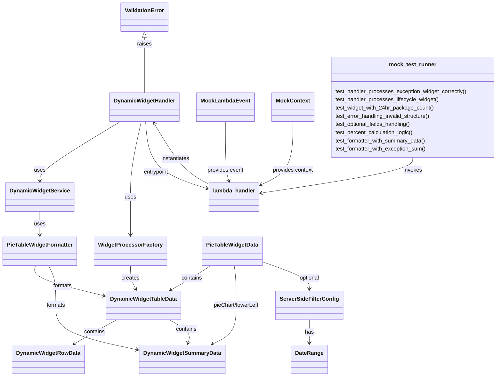

# Diagram: partview_core/partview_service/partview_service/tests/unit/api/dashboard_dynamic_widget/test_dynamic_widget.py

> Auto-generated by Obscura crawlers

## Mermaid

### SVG

<svg id="container" width="1434.60546875" xmlns="http://www.w3.org/2000/svg" class="classDiagram" height="1100" viewBox="0 0 1434.60546875 1100" role="graphics-document document" aria-roledescription="class"><g><defs><marker id="container_class-aggregationStart" class="marker aggregation class" refX="18" refY="7" markerWidth="190" markerHeight="240" orient="auto"><path d="M 18,7 L9,13 L1,7 L9,1 Z"></path></marker></defs><defs><marker id="container_class-aggregationEnd" class="marker aggregation class" refX="1" refY="7" markerWidth="20" markerHeight="28" orient="auto"><path d="M 18,7 L9,13 L1,7 L9,1 Z"></path></marker></defs><defs><marker id="container_class-extensionStart" class="marker extension class" refX="18" refY="7" markerWidth="190" markerHeight="240" orient="auto"><path d="M 1,7 L18,13 V 1 Z"></path></marker></defs><defs><marker id="container_class-extensionEnd" class="marker extension class" refX="1" refY="7" markerWidth="20" markerHeight="28" orient="auto"><path d="M 1,1 V 13 L18,7 Z"></path></marker></defs><defs><marker id="container_class-compositionStart" class="marker composition class" refX="18" refY="7" markerWidth="190" markerHeight="240" orient="auto"><path d="M 18,7 L9,13 L1,7 L9,1 Z"></path></marker></defs><defs><marker id="container_class-compositionEnd" class="marker composition class" refX="1" refY="7" markerWidth="20" markerHeight="28" orient="auto"><path d="M 18,7 L9,13 L1,7 L9,1 Z"></path></marker></defs><defs><marker id="container_class-dependencyStart" class="marker dependency class" refX="6" refY="7" markerWidth="190" markerHeight="240" orient="auto"><path d="M 5,7 L9,13 L1,7 L9,1 Z"></path></marker></defs><defs><marker id="container_class-dependencyEnd" class="marker dependency class" refX="13" refY="7" markerWidth="20" markerHeight="28" orient="auto"><path d="M 18,7 L9,13 L14,7 L9,1 Z"></path></marker></defs><defs><marker id="container_class-lollipopStart" class="marker lollipop class" refX="13" refY="7" markerWidth="190" markerHeight="240" orient="auto"><circle stroke="black" fill="transparent" cx="7" cy="7" r="6"></circle></marker></defs><defs><marker id="container_class-lollipopEnd" class="marker lollipop class" refX="1" refY="7" markerWidth="190" markerHeight="240" orient="auto"><circle stroke="black" fill="transparent" cx="7" cy="7" r="6"></circle></marker></defs><g class="root"><g class="clusters"></g><g class="edgePaths"><path d="M350.949,355L311.319,378.667C271.69,402.333,192.431,449.667,152.801,478.5C113.172,507.333,113.172,517.667,113.172,522.833L113.172,528" id="id_DynamicWidgetHandler_DynamicWidgetService_1" class="edge-thickness-normal edge-pattern-solid relation" style=";;;" data-edge="true" data-et="edge" data-id="id_DynamicWidgetHandler_DynamicWidgetService_1" data-points="W3sieCI6MzUwLjk0ODkyMTUzNTMyNjEsInkiOjM1NX0seyJ4IjoxMTMuMTcxODc1LCJ5Ijo0OTd9LHsieCI6MTEzLjE3MTg3NSwieSI6NTM0fV0=" marker-end="url(#container_class-dependencyEnd)"></path><path d="M409.216,355L402.42,378.667C395.623,402.333,382.03,449.667,375.234,486.5C368.438,523.333,368.438,549.667,368.438,576C368.438,602.333,368.438,628.667,368.438,647C368.438,665.333,368.438,675.667,368.438,680.833L368.438,686" id="id_DynamicWidgetHandler_WidgetProcessorFactory_2" class="edge-thickness-normal edge-pattern-solid relation" style=";;;" data-edge="true" data-et="edge" data-id="id_DynamicWidgetHandler_WidgetProcessorFactory_2" data-points="W3sieCI6NDA5LjIxNjA3NTA2NzkzNDgsInkiOjM1NX0seyJ4IjozNjguNDM3NSwieSI6NDk3fSx7IngiOjM2OC40Mzc1LCJ5Ijo1NzZ9LHsieCI6MzY4LjQzNzUsInkiOjY1NX0seyJ4IjozNjguNDM3NSwieSI6NjkyfV0=" marker-end="url(#container_class-dependencyEnd)"></path><path d="M422.505,355L423.197,378.667C423.889,402.333,425.273,449.667,452.876,482.223C480.48,514.78,534.303,532.561,561.215,541.451L588.127,550.341" id="id_DynamicWidgetHandler_lambda_handler_3" class="edge-thickness-normal edge-pattern-solid relation" style=";;;" data-edge="true" data-et="edge" data-id="id_DynamicWidgetHandler_lambda_handler_3" data-points="W3sieCI6NDIyLjUwNTEzNzU2NzkzNDgsInkiOjM1NX0seyJ4Ijo0MjYuNjU2MjUsInkiOjQ5N30seyJ4Ijo1OTMuODI0MjE4NzUsInkiOjU1Mi4yMjI5NjI3MDg4NzQ0fV0=" marker-end="url(#container_class-dependencyEnd)"></path><path d="M593.824,534.8L582.818,528.5C571.813,522.2,549.801,509.6,525.596,480.499C501.391,451.398,474.993,405.795,461.795,382.994L448.596,360.193" id="id_lambda_handler_DynamicWidgetHandler_4" class="edge-thickness-normal edge-pattern-solid relation" style=";;;" data-edge="true" data-et="edge" data-id="id_lambda_handler_DynamicWidgetHandler_4" data-points="W3sieCI6NTkzLjgyNDIxODc1LCJ5Ijo1MzQuNzk5NTI0NDk2OTAwN30seyJ4Ijo1MjcuNzg5MDYyNSwieSI6NDk3fSx7IngiOjQ0NS41ODk4MDEyOTA3NjA5LCJ5IjozNTV9XQ==" marker-end="url(#container_class-dependencyEnd)"></path><path d="M368.438,776L368.438,782.167C368.438,788.333,368.438,800.667,371.007,812.101C373.576,823.536,378.715,834.071,381.284,839.339L383.854,844.607" id="id_WidgetProcessorFactory_DynamicWidgetTableData_5" class="edge-thickness-normal edge-pattern-solid relation" style=";;;" data-edge="true" data-et="edge" data-id="id_WidgetProcessorFactory_DynamicWidgetTableData_5" data-points="W3sieCI6MzY4LjQzNzUsInkiOjc3Nn0seyJ4IjozNjguNDM3NSwieSI6ODEzfSx7IngiOjM4Ni40ODM3ODE2NDU1Njk2LCJ5Ijo4NTB9XQ==" marker-end="url(#container_class-dependencyEnd)"></path><path d="M113.172,618L113.172,624.167C113.172,630.333,113.172,642.667,113.172,654C113.172,665.333,113.172,675.667,113.172,680.833L113.172,686" id="id_DynamicWidgetService_PieTableWidgetFormatter_6" class="edge-thickness-normal edge-pattern-solid relation" style=";;;" data-edge="true" data-et="edge" data-id="id_DynamicWidgetService_PieTableWidgetFormatter_6" data-points="W3sieCI6MTEzLjE3MTg3NSwieSI6NjE4fSx7IngiOjExMy4xNzE4NzUsInkiOjY1NX0seyJ4IjoxMTMuMTcxODc1LCJ5Ijo2OTJ9XQ==" marker-end="url(#container_class-dependencyEnd)"></path><path d="M100.36,776L98.479,782.167C96.598,788.333,92.836,800.667,125.385,815.39C157.934,830.112,226.794,847.225,261.224,855.781L295.654,864.337" id="id_PieTableWidgetFormatter_DynamicWidgetTableData_7" class="edge-thickness-normal edge-pattern-solid relation" style=";;;" data-edge="true" data-et="edge" data-id="id_PieTableWidgetFormatter_DynamicWidgetTableData_7" data-points="W3sieCI6MTAwLjM2MDQ2MjgxNjQ1NTcsInkiOjc3Nn0seyJ4Ijo4OS4wNzQyMTg3NSwieSI6ODEzfSx7IngiOjMwMS40NzY1NjI1LCJ5Ijo4NjUuNzg0MTI2NTE2MDE3M31d" marker-end="url(#container_class-dependencyEnd)"></path><path d="M136.186,776L139.565,782.167C142.945,788.333,149.703,800.667,153.082,820C156.461,839.333,156.461,865.667,156.461,892C156.461,918.333,156.461,944.667,195.628,966.406C234.795,988.146,313.129,1005.291,352.296,1013.864L391.463,1022.437" id="id_PieTableWidgetFormatter_DynamicWidgetSummaryData_8" class="edge-thickness-normal edge-pattern-solid relation" style=";;;" data-edge="true" data-et="edge" data-id="id_PieTableWidgetFormatter_DynamicWidgetSummaryData_8" data-points="W3sieCI6MTM2LjE4NjMxMzI5MTEzOTI0LCJ5Ijo3NzZ9LHsieCI6MTU2LjQ2MDkzNzUsInkiOjgxM30seyJ4IjoxNTYuNDYwOTM3NSwieSI6ODkyfSx7IngiOjE1Ni40NjA5Mzc1LCJ5Ijo5NzF9LHsieCI6Mzk3LjMyNDIxODc1LCJ5IjoxMDIzLjcxOTM5MDkwMjQ5OX1d" marker-end="url(#container_class-dependencyEnd)"></path><path d="M597.15,776L588.054,782.167C578.958,788.333,560.766,800.667,541.949,812.497C523.132,824.327,503.69,835.653,493.968,841.316L484.247,846.98" id="id_PieTableWidgetData_DynamicWidgetTableData_9" class="edge-thickness-normal edge-pattern-solid relation" style=";;;" data-edge="true" data-et="edge" data-id="id_PieTableWidgetData_DynamicWidgetTableData_9" data-points="W3sieCI6NTk3LjE1MDMxNjQ1NTY5NjIsInkiOjc3Nn0seyJ4Ijo1NDIuNTc0MjE4NzUsInkiOjgxM30seyJ4Ijo0NzkuMDYyNzk2Njc3MjE1MiwieSI6ODUwfV0=" marker-end="url(#container_class-dependencyEnd)"></path><path d="M332.156,934L321.172,940.167C310.188,946.333,288.219,958.667,268.122,970.474C248.025,982.281,229.8,993.561,220.687,999.202L211.574,1004.842" id="id_DynamicWidgetTableData_DynamicWidgetRowData_10" class="edge-thickness-normal edge-pattern-solid relation" style=";;;" data-edge="true" data-et="edge" data-id="id_DynamicWidgetTableData_DynamicWidgetRowData_10" data-points="W3sieCI6MzMyLjE1NjI1LCJ5Ijo5MzR9LHsieCI6MjY2LjI1LCJ5Ijo5NzF9LHsieCI6MjA2LjQ3MjYwNjgwMzc5NzQ4LCJ5IjoxMDA4fV0=" marker-end="url(#container_class-dependencyEnd)"></path><path d="M479.063,934L489.648,940.167C500.233,946.333,521.404,958.667,530.327,970.047C539.251,981.428,535.927,991.856,534.265,997.069L532.603,1002.283" id="id_DynamicWidgetTableData_DynamicWidgetSummaryData_11" class="edge-thickness-normal edge-pattern-solid relation" style=";;;" data-edge="true" data-et="edge" data-id="id_DynamicWidgetTableData_DynamicWidgetSummaryData_11" data-points="W3sieCI6NDc5LjA2Mjc5NjY3NzIxNTIsInkiOjkzNH0seyJ4Ijo1NDIuNTc0MjE4NzUsInkiOjk3MX0seyJ4Ijo1MzAuNzgxMjAwNTUzNzk3NSwieSI6MTAwOH1d" marker-end="url(#container_class-dependencyEnd)"></path><path d="M666.318,776L667.378,782.167C668.437,788.333,670.557,800.667,671.616,820C672.676,839.333,672.676,865.667,672.676,892C672.676,918.333,672.676,944.667,661.446,963.547C650.216,982.426,627.756,993.853,616.527,999.566L605.297,1005.279" id="id_PieTableWidgetData_DynamicWidgetSummaryData_12" class="edge-thickness-normal edge-pattern-solid relation" style=";;;" data-edge="true" data-et="edge" data-id="id_PieTableWidgetData_DynamicWidgetSummaryData_12" data-points="W3sieCI6NjY2LjMxODIzNTc1OTQ5MzYsInkiOjc3Nn0seyJ4Ijo2NzIuNjc1NzgxMjUsInkiOjgxM30seyJ4Ijo2NzIuNjc1NzgxMjUsInkiOjg5Mn0seyJ4Ijo2NzIuNjc1NzgxMjUsInkiOjk3MX0seyJ4Ijo1OTkuOTQ5MTE5ODU3NTk1LCJ5IjoxMDA4fV0=" marker-end="url(#container_class-dependencyEnd)"></path><path d="M744.867,764.374L767.751,772.479C790.634,780.583,836.401,796.791,859.285,810.062C882.168,823.333,882.168,833.667,882.168,838.833L882.168,844" id="id_PieTableWidgetData_ServerSideFilterConfig_13" class="edge-thickness-normal edge-pattern-solid relation" style=";;;" data-edge="true" data-et="edge" data-id="id_PieTableWidgetData_ServerSideFilterConfig_13" data-points="W3sieCI6NzQ0Ljg2NzE4NzUsInkiOjc2NC4zNzQyOTI5NjkwOTJ9LHsieCI6ODgyLjE2Nzk2ODc1LCJ5Ijo4MTN9LHsieCI6ODgyLjE2Nzk2ODc1LCJ5Ijo4NTB9XQ==" marker-end="url(#container_class-dependencyEnd)"></path><path d="M882.168,934L882.168,940.167C882.168,946.333,882.168,958.667,882.168,970C882.168,981.333,882.168,991.667,882.168,996.833L882.168,1002" id="id_ServerSideFilterConfig_DateRange_14" class="edge-thickness-normal edge-pattern-solid relation" style=";;;" data-edge="true" data-et="edge" data-id="id_ServerSideFilterConfig_DateRange_14" data-points="W3sieCI6ODgyLjE2Nzk2ODc1LCJ5Ijo5MzR9LHsieCI6ODgyLjE2Nzk2ODc1LCJ5Ijo5NzF9LHsieCI6ODgyLjE2Nzk2ODc1LCJ5IjoxMDA4fV0=" marker-end="url(#container_class-dependencyEnd)"></path><path d="M649.684,355L649.684,378.667C649.684,402.333,649.684,449.667,650.742,478.52C651.8,507.374,653.916,517.747,654.975,522.934L656.033,528.121" id="id_MockLambdaEvent_lambda_handler_15" class="edge-thickness-normal edge-pattern-solid relation" style=";;;" data-edge="true" data-et="edge" data-id="id_MockLambdaEvent_lambda_handler_15" data-points="W3sieCI6NjQ5LjY4MzU5Mzc1LCJ5IjozNTV9LHsieCI6NjQ5LjY4MzU5Mzc1LCJ5Ijo0OTd9LHsieCI6NjU3LjIzMjE0OTkyMDg4NjEsInkiOjUzNH1d" marker-end="url(#container_class-dependencyEnd)"></path><path d="M839.613,355L839.613,378.667C839.613,402.333,839.613,449.667,823.551,480.634C807.489,511.601,775.364,526.202,759.302,533.503L743.24,540.803" id="id_MockContext_lambda_handler_16" class="edge-thickness-normal edge-pattern-solid relation" style=";;;" data-edge="true" data-et="edge" data-id="id_MockContext_lambda_handler_16" data-points="W3sieCI6ODM5LjYxMzI4MTI1LCJ5IjozNTV9LHsieCI6ODM5LjYxMzI4MTI1LCJ5Ijo0OTd9LHsieCI6NzM3Ljc3NzM0Mzc1LCJ5Ijo1NDMuMjg1NzMzNTQ5MDgzfV0=" marker-end="url(#container_class-dependencyEnd)"></path><path d="M421.277,109.25L421.277,112.542C421.277,115.833,421.277,122.417,421.277,149.375C421.277,176.333,421.277,223.667,421.277,247.333L421.277,271" id="id_ValidationError_DynamicWidgetHandler_17" class="edge-thickness-normal edge-pattern-solid relation" style=";;;" data-edge="true" data-et="edge" data-id="id_ValidationError_DynamicWidgetHandler_17" data-points="W3sieCI6NDIxLjI3NzM0Mzc1LCJ5Ijo5Mn0seyJ4Ijo0MjEuMjc3MzQzNzUsInkiOjEyOX0seyJ4Ijo0MjEuMjc3MzQzNzUsInkiOjI3MX1d" marker-start="url(#container_class-extensionStart)"></path><path d="M1187.801,460L1187.801,466.167C1187.801,472.333,1187.801,484.667,1113.786,502.035C1039.77,519.403,891.74,541.806,817.725,553.008L743.71,564.209" id="id_mock_test_runner_lambda_handler_18" class="edge-thickness-normal edge-pattern-solid relation" style=";;;" data-edge="true" data-et="edge" data-id="id_mock_test_runner_lambda_handler_18" data-points="W3sieCI6MTE4Ny44MDA3ODEyNSwieSI6NDYwfSx7IngiOjExODcuODAwNzgxMjUsInkiOjQ5N30seyJ4Ijo3MzcuNzc3MzQzNzUsInkiOjU2NS4xMDY5OTUzMzA0NTk4fV0=" marker-end="url(#container_class-dependencyEnd)"></path></g><g class="edgeLabels"><g class="edgeLabel" transform="translate(113.171875, 497)"><g class="label" data-id="id_DynamicWidgetHandler_DynamicWidgetService_1" transform="translate(-16.4921875, -12)"><foreignObject width="32.984375" height="24">

uses

</foreignObject></g></g><g class="edgeLabel" transform="translate(368.4375, 576)"><g class="label" data-id="id_DynamicWidgetHandler_WidgetProcessorFactory_2" transform="translate(-16.4921875, -12)"><foreignObject width="32.984375" height="24">

uses

</foreignObject></g></g><g class="edgeLabel" transform="translate(442.79471, 502.33125)"><g class="label" data-id="id_DynamicWidgetHandler_lambda_handler_3" transform="translate(-38.21875, -12)"><foreignObject width="76.4375" height="24">

entrypoint

</foreignObject></g></g><g class="edgeLabel" transform="translate(505.749, 458.92559)"><g class="label" data-id="id_lambda_handler_DynamicWidgetHandler_4" transform="translate(-42.9140625, -12)"><foreignObject width="85.828125" height="24">

instantiates

</foreignObject></g></g><g class="edgeLabel" transform="translate(368.4375, 813)"><g class="label" data-id="id_WidgetProcessorFactory_DynamicWidgetTableData_5" transform="translate(-26.171875, -12)"><foreignObject width="52.34375" height="24">

creates

</foreignObject></g></g><g class="edgeLabel" transform="translate(113.171875, 655)"><g class="label" data-id="id_DynamicWidgetService_PieTableWidgetFormatter_6" transform="translate(-16.4921875, -12)"><foreignObject width="32.984375" height="24">

uses

</foreignObject></g></g><g class="edgeLabel" transform="translate(176.50479, 834.72738)"><g class="label" data-id="id_PieTableWidgetFormatter_DynamicWidgetTableData_7" transform="translate(-28.1953125, -12)"><foreignObject width="56.390625" height="24">

formats

</foreignObject></g></g><g class="edgeLabel" transform="translate(156.4609375, 892)"><g class="label" data-id="id_PieTableWidgetFormatter_DynamicWidgetSummaryData_8" transform="translate(-28.1953125, -12)"><foreignObject width="56.390625" height="24">

formats

</foreignObject></g></g><g class="edgeLabel" transform="translate(539.30498, 814.90457)"><g class="label" data-id="id_PieTableWidgetData_DynamicWidgetTableData_9" transform="translate(-30.890625, -12)"><foreignObject width="61.78125" height="24">

contains

</foreignObject></g></g><g class="edgeLabel" transform="translate(268.55213, 969.70758)"><g class="label" data-id="id_DynamicWidgetTableData_DynamicWidgetRowData_10" transform="translate(-30.890625, -12)"><foreignObject width="61.78125" height="24">

contains

</foreignObject></g></g><g class="edgeLabel" transform="translate(527.59603, 962.27412)"><g class="label" data-id="id_DynamicWidgetTableData_DynamicWidgetSummaryData_11" transform="translate(-30.890625, -12)"><foreignObject width="61.78125" height="24">

contains

</foreignObject></g></g><g class="edgeLabel" transform="translate(672.67578125, 892)"><g class="label" data-id="id_PieTableWidgetData_DynamicWidgetSummaryData_12" transform="translate(-68.8203125, -12)"><foreignObject width="137.640625" height="24">

pieChart/lowerLeft

</foreignObject></g></g><g class="edgeLabel" transform="translate(882.16796875, 813)"><g class="label" data-id="id_PieTableWidgetData_ServerSideFilterConfig_13" transform="translate(-30.546875, -12)"><foreignObject width="61.09375" height="24">

optional

</foreignObject></g></g><g class="edgeLabel" transform="translate(882.16796875, 971)"><g class="label" data-id="id_ServerSideFilterConfig_DateRange_14" transform="translate(-12.703125, -12)"><foreignObject width="25.40625" height="24">

has

</foreignObject></g></g><g class="edgeLabel" transform="translate(649.68359375, 497)"><g class="label" data-id="id_MockLambdaEvent_lambda_handler_15" transform="translate(-53.6015625, -12)"><foreignObject width="107.203125" height="24">

provides event

</foreignObject></g></g><g class="edgeLabel" transform="translate(839.61328125, 497)"><g class="label" data-id="id_MockContext_lambda_handler_16" transform="translate(-60.28125, -12)"><foreignObject width="120.5625" height="24">

provides context

</foreignObject></g></g><g class="edgeLabel" transform="translate(421.27734375, 129)"><g class="label" data-id="id_ValidationError_DynamicWidgetHandler_17" transform="translate(-21.25, -12)"><foreignObject width="42.5" height="24">

raises

</foreignObject></g></g><g class="edgeLabel" transform="translate(1187.80078125, 497)"><g class="label" data-id="id_mock_test_runner_lambda_handler_18" transform="translate(-27.5859375, -12)"><foreignObject width="55.171875" height="24">

invokes

</foreignObject></g></g></g><g class="nodes"><g class="node default" id="classId-DynamicWidgetHandler-0" transform="translate(421.27734375, 313)"><g class="basic label-container"><path d="M-97.859375 -42 L97.859375 -42 L97.859375 42 L-97.859375 42" stroke="none" stroke-width="0" fill="#ECECFF" style=""></path><path d="M-97.859375 -42 C-42.44209765157771 -42, 12.975179696844577 -42, 97.859375 -42 M-97.859375 -42 C-56.36577594700087 -42, -14.87217689400174 -42, 97.859375 -42 M97.859375 -42 C97.859375 -20.185175564693147, 97.859375 1.629648870613707, 97.859375 42 M97.859375 -42 C97.859375 -14.831567060029197, 97.859375 12.336865879941605, 97.859375 42 M97.859375 42 C46.72106215087366 42, -4.417250698252687 42, -97.859375 42 M97.859375 42 C28.325115016111624 42, -41.20914496777675 42, -97.859375 42 M-97.859375 42 C-97.859375 9.501022191486399, -97.859375 -22.997955617027202, -97.859375 -42 M-97.859375 42 C-97.859375 10.235664377836319, -97.859375 -21.528671244327363, -97.859375 -42" stroke="#9370DB" stroke-width="1.3" fill="none" stroke-dasharray="0 0" style=""></path></g><g class="annotation-group text" transform="translate(0, -18)"></g><g class="label-group text" transform="translate(-85.859375, -18)"><g class="label" style="font-weight: bolder" transform="translate(0,-12)"><foreignObject width="171.71875" height="24">

DynamicWidgetHandler

</foreignObject></g></g><g class="members-group text" transform="translate(-85.859375, 30)"></g><g class="methods-group text" transform="translate(-85.859375, 60)"></g><g class="divider" style=""><path d="M-97.859375 6 C-49.50555585735391 6, -1.1517367147078232 6, 97.859375 6 M-97.859375 6 C-25.745129434203946 6, 46.36911613159211 6, 97.859375 6" stroke="#9370DB" stroke-width="1.3" fill="none" stroke-dasharray="0 0" style=""></path></g><g class="divider" style=""><path d="M-97.859375 24 C-32.9052731570587 24, 32.0488286858826 24, 97.859375 24 M-97.859375 24 C-27.81076928756609 24, 42.23783642486782 24, 97.859375 24" stroke="#9370DB" stroke-width="1.3" fill="none" stroke-dasharray="0 0" style=""></path></g></g><g class="node default" id="classId-DynamicWidgetService-1" transform="translate(113.171875, 576)"><g class="basic label-container"><path d="M-95.421875 -42 L95.421875 -42 L95.421875 42 L-95.421875 42" stroke="none" stroke-width="0" fill="#ECECFF" style=""></path><path d="M-95.421875 -42 C-21.163548316812197 -42, 53.09477836637561 -42, 95.421875 -42 M-95.421875 -42 C-34.17500496631801 -42, 27.071865067363973 -42, 95.421875 -42 M95.421875 -42 C95.421875 -11.54477130535388, 95.421875 18.91045738929224, 95.421875 42 M95.421875 -42 C95.421875 -21.413953110243803, 95.421875 -0.8279062204876055, 95.421875 42 M95.421875 42 C32.13910289037496 42, -31.143669219250086 42, -95.421875 42 M95.421875 42 C42.85057183028879 42, -9.720731339422414 42, -95.421875 42 M-95.421875 42 C-95.421875 18.667868242533544, -95.421875 -4.664263514932912, -95.421875 -42 M-95.421875 42 C-95.421875 12.224483887620202, -95.421875 -17.551032224759595, -95.421875 -42" stroke="#9370DB" stroke-width="1.3" fill="none" stroke-dasharray="0 0" style=""></path></g><g class="annotation-group text" transform="translate(0, -18)"></g><g class="label-group text" transform="translate(-83.421875, -18)"><g class="label" style="font-weight: bolder" transform="translate(0,-12)"><foreignObject width="166.84375" height="24">

DynamicWidgetService

</foreignObject></g></g><g class="members-group text" transform="translate(-83.421875, 30)"></g><g class="methods-group text" transform="translate(-83.421875, 60)"></g><g class="divider" style=""><path d="M-95.421875 6 C-51.22474248472505 6, -7.027609969450097 6, 95.421875 6 M-95.421875 6 C-37.651821263493574 6, 20.118232473012853 6, 95.421875 6" stroke="#9370DB" stroke-width="1.3" fill="none" stroke-dasharray="0 0" style=""></path></g><g class="divider" style=""><path d="M-95.421875 24 C-25.594595060123154 24, 44.23268487975369 24, 95.421875 24 M-95.421875 24 C-20.661455077109665 24, 54.09896484578067 24, 95.421875 24" stroke="#9370DB" stroke-width="1.3" fill="none" stroke-dasharray="0 0" style=""></path></g></g><g class="node default" id="classId-WidgetProcessorFactory-2" transform="translate(368.4375, 734)"><g class="basic label-container"><path d="M-100.09375 -42 L100.09375 -42 L100.09375 42 L-100.09375 42" stroke="none" stroke-width="0" fill="#ECECFF" style=""></path><path d="M-100.09375 -42 C-55.83695110015433 -42, -11.58015220030866 -42, 100.09375 -42 M-100.09375 -42 C-56.33958619127283 -42, -12.585422382545659 -42, 100.09375 -42 M100.09375 -42 C100.09375 -10.692726590211315, 100.09375 20.61454681957737, 100.09375 42 M100.09375 -42 C100.09375 -11.775749846839286, 100.09375 18.448500306321428, 100.09375 42 M100.09375 42 C26.845983497094423 42, -46.401783005811154 42, -100.09375 42 M100.09375 42 C27.953325445291554 42, -44.18709910941689 42, -100.09375 42 M-100.09375 42 C-100.09375 14.67610168598436, -100.09375 -12.64779662803128, -100.09375 -42 M-100.09375 42 C-100.09375 9.336491923780478, -100.09375 -23.327016152439043, -100.09375 -42" stroke="#9370DB" stroke-width="1.3" fill="none" stroke-dasharray="0 0" style=""></path></g><g class="annotation-group text" transform="translate(0, -18)"></g><g class="label-group text" transform="translate(-88.09375, -18)"><g class="label" style="font-weight: bolder" transform="translate(0,-12)"><foreignObject width="176.1875" height="24">

WidgetProcessorFactory

</foreignObject></g></g><g class="members-group text" transform="translate(-88.09375, 30)"></g><g class="methods-group text" transform="translate(-88.09375, 60)"></g><g class="divider" style=""><path d="M-100.09375 6 C-29.96272535057693 6, 40.16829929884614 6, 100.09375 6 M-100.09375 6 C-40.55014344064489 6, 18.993463118710224 6, 100.09375 6" stroke="#9370DB" stroke-width="1.3" fill="none" stroke-dasharray="0 0" style=""></path></g><g class="divider" style=""><path d="M-100.09375 24 C-21.858110666639533 24, 56.377528666720934 24, 100.09375 24 M-100.09375 24 C-39.55410871129553 24, 20.985532577408947 24, 100.09375 24" stroke="#9370DB" stroke-width="1.3" fill="none" stroke-dasharray="0 0" style=""></path></g></g><g class="node default" id="classId-PieTableWidgetFormatter-3" transform="translate(113.171875, 734)"><g class="basic label-container"><path d="M-105.171875 -42 L105.171875 -42 L105.171875 42 L-105.171875 42" stroke="none" stroke-width="0" fill="#ECECFF" style=""></path><path d="M-105.171875 -42 C-53.63362640621518 -42, -2.095377812430357 -42, 105.171875 -42 M-105.171875 -42 C-49.10659317260128 -42, 6.958688654797442 -42, 105.171875 -42 M105.171875 -42 C105.171875 -8.682742230086454, 105.171875 24.634515539827092, 105.171875 42 M105.171875 -42 C105.171875 -17.48258594547099, 105.171875 7.034828109058019, 105.171875 42 M105.171875 42 C27.52915611873199 42, -50.11356276253602 42, -105.171875 42 M105.171875 42 C30.14169750688825 42, -44.8884799862235 42, -105.171875 42 M-105.171875 42 C-105.171875 23.240797469711172, -105.171875 4.481594939422344, -105.171875 -42 M-105.171875 42 C-105.171875 13.689034436026798, -105.171875 -14.621931127946404, -105.171875 -42" stroke="#9370DB" stroke-width="1.3" fill="none" stroke-dasharray="0 0" style=""></path></g><g class="annotation-group text" transform="translate(0, -18)"></g><g class="label-group text" transform="translate(-93.171875, -18)"><g class="label" style="font-weight: bolder" transform="translate(0,-12)"><foreignObject width="186.34375" height="24">

PieTableWidgetFormatter

</foreignObject></g></g><g class="members-group text" transform="translate(-93.171875, 30)"></g><g class="methods-group text" transform="translate(-93.171875, 60)"></g><g class="divider" style=""><path d="M-105.171875 6 C-34.006203213363904 6, 37.15946857327219 6, 105.171875 6 M-105.171875 6 C-61.65346994922596 6, -18.135064898451915 6, 105.171875 6" stroke="#9370DB" stroke-width="1.3" fill="none" stroke-dasharray="0 0" style=""></path></g><g class="divider" style=""><path d="M-105.171875 24 C-63.102910551358555 24, -21.03394610271711 24, 105.171875 24 M-105.171875 24 C-23.671765918638002 24, 57.828343162723996 24, 105.171875 24" stroke="#9370DB" stroke-width="1.3" fill="none" stroke-dasharray="0 0" style=""></path></g></g><g class="node default" id="classId-PieTableWidgetData-4" transform="translate(659.1015625, 734)"><g class="basic label-container"><path d="M-85.765625 -42 L85.765625 -42 L85.765625 42 L-85.765625 42" stroke="none" stroke-width="0" fill="#ECECFF" style=""></path><path d="M-85.765625 -42 C-19.392637251543277 -42, 46.980350496913445 -42, 85.765625 -42 M-85.765625 -42 C-20.08445075985749 -42, 45.59672348028502 -42, 85.765625 -42 M85.765625 -42 C85.765625 -9.616978593417421, 85.765625 22.766042813165157, 85.765625 42 M85.765625 -42 C85.765625 -11.284045705396345, 85.765625 19.43190858920731, 85.765625 42 M85.765625 42 C25.980543872707237 42, -33.804537254585526 42, -85.765625 42 M85.765625 42 C45.27322595710825 42, 4.7808269142165045 42, -85.765625 42 M-85.765625 42 C-85.765625 23.616291867020053, -85.765625 5.232583734040105, -85.765625 -42 M-85.765625 42 C-85.765625 16.495299048099746, -85.765625 -9.009401903800509, -85.765625 -42" stroke="#9370DB" stroke-width="1.3" fill="none" stroke-dasharray="0 0" style=""></path></g><g class="annotation-group text" transform="translate(0, -18)"></g><g class="label-group text" transform="translate(-73.765625, -18)"><g class="label" style="font-weight: bolder" transform="translate(0,-12)"><foreignObject width="147.53125" height="24">

PieTableWidgetData

</foreignObject></g></g><g class="members-group text" transform="translate(-73.765625, 30)"></g><g class="methods-group text" transform="translate(-73.765625, 60)"></g><g class="divider" style=""><path d="M-85.765625 6 C-31.62573698230006 6, 22.514151035399877 6, 85.765625 6 M-85.765625 6 C-48.48472087766376 6, -11.203816755327523 6, 85.765625 6" stroke="#9370DB" stroke-width="1.3" fill="none" stroke-dasharray="0 0" style=""></path></g><g class="divider" style=""><path d="M-85.765625 24 C-34.3507908817043 24, 17.064043236591402 24, 85.765625 24 M-85.765625 24 C-31.18031075242709 24, 23.40500349514582 24, 85.765625 24" stroke="#9370DB" stroke-width="1.3" fill="none" stroke-dasharray="0 0" style=""></path></g></g><g class="node default" id="classId-DynamicWidgetTableData-5" transform="translate(406.96875, 892)"><g class="basic label-container"><path d="M-105.4921875 -42 L105.4921875 -42 L105.4921875 42 L-105.4921875 42" stroke="none" stroke-width="0" fill="#ECECFF" style=""></path><path d="M-105.4921875 -42 C-46.57855223190936 -42, 12.335083036181274 -42, 105.4921875 -42 M-105.4921875 -42 C-40.62876538109646 -42, 24.234656737807086 -42, 105.4921875 -42 M105.4921875 -42 C105.4921875 -9.808867344173755, 105.4921875 22.38226531165249, 105.4921875 42 M105.4921875 -42 C105.4921875 -11.346112995211747, 105.4921875 19.307774009576505, 105.4921875 42 M105.4921875 42 C53.19765333283117 42, 0.9031191656623463 42, -105.4921875 42 M105.4921875 42 C47.164522361293294 42, -11.163142777413412 42, -105.4921875 42 M-105.4921875 42 C-105.4921875 11.494767408711443, -105.4921875 -19.010465182577114, -105.4921875 -42 M-105.4921875 42 C-105.4921875 22.04153955522169, -105.4921875 2.0830791104433786, -105.4921875 -42" stroke="#9370DB" stroke-width="1.3" fill="none" stroke-dasharray="0 0" style=""></path></g><g class="annotation-group text" transform="translate(0, -18)"></g><g class="label-group text" transform="translate(-93.4921875, -18)"><g class="label" style="font-weight: bolder" transform="translate(0,-12)"><foreignObject width="186.984375" height="24">

DynamicWidgetTableData

</foreignObject></g></g><g class="members-group text" transform="translate(-93.4921875, 30)"></g><g class="methods-group text" transform="translate(-93.4921875, 60)"></g><g class="divider" style=""><path d="M-105.4921875 6 C-54.568311449889976 6, -3.644435399779951 6, 105.4921875 6 M-105.4921875 6 C-40.36921838098276 6, 24.753750738034483 6, 105.4921875 6" stroke="#9370DB" stroke-width="1.3" fill="none" stroke-dasharray="0 0" style=""></path></g><g class="divider" style=""><path d="M-105.4921875 24 C-57.662728853623946 24, -9.833270207247892 24, 105.4921875 24 M-105.4921875 24 C-62.68518442124568 24, -19.87818134249136 24, 105.4921875 24" stroke="#9370DB" stroke-width="1.3" fill="none" stroke-dasharray="0 0" style=""></path></g></g><g class="node default" id="classId-DynamicWidgetRowData-6" transform="translate(138.6171875, 1050)"><g class="basic label-container"><path d="M-101.140625 -42 L101.140625 -42 L101.140625 42 L-101.140625 42" stroke="none" stroke-width="0" fill="#ECECFF" style=""></path><path d="M-101.140625 -42 C-23.03438747636079 -42, 55.07185004727842 -42, 101.140625 -42 M-101.140625 -42 C-23.23005726663783 -42, 54.68051046672434 -42, 101.140625 -42 M101.140625 -42 C101.140625 -20.093143101385895, 101.140625 1.8137137972282105, 101.140625 42 M101.140625 -42 C101.140625 -12.316226949562921, 101.140625 17.367546100874158, 101.140625 42 M101.140625 42 C26.797886021617487 42, -47.54485295676503 42, -101.140625 42 M101.140625 42 C57.212330970450324 42, 13.284036940900648 42, -101.140625 42 M-101.140625 42 C-101.140625 10.248273566674214, -101.140625 -21.50345286665157, -101.140625 -42 M-101.140625 42 C-101.140625 20.26452402192933, -101.140625 -1.4709519561413416, -101.140625 -42" stroke="#9370DB" stroke-width="1.3" fill="none" stroke-dasharray="0 0" style=""></path></g><g class="annotation-group text" transform="translate(0, -18)"></g><g class="label-group text" transform="translate(-89.140625, -18)"><g class="label" style="font-weight: bolder" transform="translate(0,-12)"><foreignObject width="178.28125" height="24">

DynamicWidgetRowData

</foreignObject></g></g><g class="members-group text" transform="translate(-89.140625, 30)"></g><g class="methods-group text" transform="translate(-89.140625, 60)"></g><g class="divider" style=""><path d="M-101.140625 6 C-20.956195218102536 6, 59.22823456379493 6, 101.140625 6 M-101.140625 6 C-57.72700679876626 6, -14.313388597532523 6, 101.140625 6" stroke="#9370DB" stroke-width="1.3" fill="none" stroke-dasharray="0 0" style=""></path></g><g class="divider" style=""><path d="M-101.140625 24 C-40.320538482330264 24, 20.499548035339473 24, 101.140625 24 M-101.140625 24 C-45.99011210367016 24, 9.160400792659686 24, 101.140625 24" stroke="#9370DB" stroke-width="1.3" fill="none" stroke-dasharray="0 0" style=""></path></g></g><g class="node default" id="classId-DynamicWidgetSummaryData-7" transform="translate(517.39453125, 1050)"><g class="basic label-container"><path d="M-120.0703125 -42 L120.0703125 -42 L120.0703125 42 L-120.0703125 42" stroke="none" stroke-width="0" fill="#ECECFF" style=""></path><path d="M-120.0703125 -42 C-44.34975238515321 -42, 31.37080772969358 -42, 120.0703125 -42 M-120.0703125 -42 C-71.36741055484424 -42, -22.664508609688482 -42, 120.0703125 -42 M120.0703125 -42 C120.0703125 -14.664007947142782, 120.0703125 12.671984105714436, 120.0703125 42 M120.0703125 -42 C120.0703125 -19.61083792665994, 120.0703125 2.77832414668012, 120.0703125 42 M120.0703125 42 C48.763828831176866 42, -22.542654837646268 42, -120.0703125 42 M120.0703125 42 C54.555808662884274 42, -10.958695174231451 42, -120.0703125 42 M-120.0703125 42 C-120.0703125 9.001273969364455, -120.0703125 -23.99745206127109, -120.0703125 -42 M-120.0703125 42 C-120.0703125 23.074645463038525, -120.0703125 4.14929092607705, -120.0703125 -42" stroke="#9370DB" stroke-width="1.3" fill="none" stroke-dasharray="0 0" style=""></path></g><g class="annotation-group text" transform="translate(0, -18)"></g><g class="label-group text" transform="translate(-108.0703125, -18)"><g class="label" style="font-weight: bolder" transform="translate(0,-12)"><foreignObject width="216.140625" height="24">

DynamicWidgetSummaryData

</foreignObject></g></g><g class="members-group text" transform="translate(-108.0703125, 30)"></g><g class="methods-group text" transform="translate(-108.0703125, 60)"></g><g class="divider" style=""><path d="M-120.0703125 6 C-51.92300069381602 6, 16.224311112367957 6, 120.0703125 6 M-120.0703125 6 C-38.558089486519094 6, 42.95413352696181 6, 120.0703125 6" stroke="#9370DB" stroke-width="1.3" fill="none" stroke-dasharray="0 0" style=""></path></g><g class="divider" style=""><path d="M-120.0703125 24 C-53.9903828770351 24, 12.089546745929795 24, 120.0703125 24 M-120.0703125 24 C-38.35051430807374 24, 43.36928388385252 24, 120.0703125 24" stroke="#9370DB" stroke-width="1.3" fill="none" stroke-dasharray="0 0" style=""></path></g></g><g class="node default" id="classId-ServerSideFilterConfig-8" transform="translate(882.16796875, 892)"><g class="basic label-container"><path d="M-93.7109375 -42 L93.7109375 -42 L93.7109375 42 L-93.7109375 42" stroke="none" stroke-width="0" fill="#ECECFF" style=""></path><path d="M-93.7109375 -42 C-21.132510449812955 -42, 51.44591660037409 -42, 93.7109375 -42 M-93.7109375 -42 C-19.23100599863409 -42, 55.24892550273182 -42, 93.7109375 -42 M93.7109375 -42 C93.7109375 -10.174786952431518, 93.7109375 21.650426095136964, 93.7109375 42 M93.7109375 -42 C93.7109375 -20.63343819132605, 93.7109375 0.7331236173478999, 93.7109375 42 M93.7109375 42 C52.1918493170972 42, 10.672761134194403 42, -93.7109375 42 M93.7109375 42 C52.80137261030341 42, 11.89180772060682 42, -93.7109375 42 M-93.7109375 42 C-93.7109375 9.071234707998208, -93.7109375 -23.857530584003584, -93.7109375 -42 M-93.7109375 42 C-93.7109375 23.9385862816748, -93.7109375 5.877172563349603, -93.7109375 -42" stroke="#9370DB" stroke-width="1.3" fill="none" stroke-dasharray="0 0" style=""></path></g><g class="annotation-group text" transform="translate(0, -18)"></g><g class="label-group text" transform="translate(-81.7109375, -18)"><g class="label" style="font-weight: bolder" transform="translate(0,-12)"><foreignObject width="163.421875" height="24">

ServerSideFilterConfig

</foreignObject></g></g><g class="members-group text" transform="translate(-81.7109375, 30)"></g><g class="methods-group text" transform="translate(-81.7109375, 60)"></g><g class="divider" style=""><path d="M-93.7109375 6 C-48.187054211565474 6, -2.6631709231309486 6, 93.7109375 6 M-93.7109375 6 C-24.683851990429716 6, 44.34323351914057 6, 93.7109375 6" stroke="#9370DB" stroke-width="1.3" fill="none" stroke-dasharray="0 0" style=""></path></g><g class="divider" style=""><path d="M-93.7109375 24 C-28.011638835069846 24, 37.68765982986031 24, 93.7109375 24 M-93.7109375 24 C-46.55389257368991 24, 0.6031523526201852 24, 93.7109375 24" stroke="#9370DB" stroke-width="1.3" fill="none" stroke-dasharray="0 0" style=""></path></g></g><g class="node default" id="classId-DateRange-9" transform="translate(882.16796875, 1050)"><g class="basic label-container"><path d="M-51.3828125 -42 L51.3828125 -42 L51.3828125 42 L-51.3828125 42" stroke="none" stroke-width="0" fill="#ECECFF" style=""></path><path d="M-51.3828125 -42 C-18.143021865529235 -42, 15.09676876894153 -42, 51.3828125 -42 M-51.3828125 -42 C-17.340289942218533 -42, 16.702232615562934 -42, 51.3828125 -42 M51.3828125 -42 C51.3828125 -11.660041085082298, 51.3828125 18.679917829835404, 51.3828125 42 M51.3828125 -42 C51.3828125 -15.308054650107639, 51.3828125 11.383890699784722, 51.3828125 42 M51.3828125 42 C17.59749972566582 42, -16.18781304866836 42, -51.3828125 42 M51.3828125 42 C26.96676915745436 42, 2.5507258149087235 42, -51.3828125 42 M-51.3828125 42 C-51.3828125 20.16618013933938, -51.3828125 -1.6676397213212368, -51.3828125 -42 M-51.3828125 42 C-51.3828125 24.835762200070146, -51.3828125 7.671524400140292, -51.3828125 -42" stroke="#9370DB" stroke-width="1.3" fill="none" stroke-dasharray="0 0" style=""></path></g><g class="annotation-group text" transform="translate(0, -18)"></g><g class="label-group text" transform="translate(-39.3828125, -18)"><g class="label" style="font-weight: bolder" transform="translate(0,-12)"><foreignObject width="78.765625" height="24">

DateRange

</foreignObject></g></g><g class="members-group text" transform="translate(-39.3828125, 30)"></g><g class="methods-group text" transform="translate(-39.3828125, 60)"></g><g class="divider" style=""><path d="M-51.3828125 6 C-13.425192023643454 6, 24.53242845271309 6, 51.3828125 6 M-51.3828125 6 C-29.53877355540069 6, -7.694734610801383 6, 51.3828125 6" stroke="#9370DB" stroke-width="1.3" fill="none" stroke-dasharray="0 0" style=""></path></g><g class="divider" style=""><path d="M-51.3828125 24 C-26.153750180577518 24, -0.9246878611550358 24, 51.3828125 24 M-51.3828125 24 C-29.98139117960262 24, -8.579969859205242 24, 51.3828125 24" stroke="#9370DB" stroke-width="1.3" fill="none" stroke-dasharray="0 0" style=""></path></g></g><g class="node default" id="classId-MockLambdaEvent-10" transform="translate(649.68359375, 313)"><g class="basic label-container"><path d="M-80.546875 -42 L80.546875 -42 L80.546875 42 L-80.546875 42" stroke="none" stroke-width="0" fill="#ECECFF" style=""></path><path d="M-80.546875 -42 C-34.80054662874788 -42, 10.945781742504238 -42, 80.546875 -42 M-80.546875 -42 C-45.23991582663141 -42, -9.93295665326282 -42, 80.546875 -42 M80.546875 -42 C80.546875 -21.969744449978165, 80.546875 -1.9394888999563307, 80.546875 42 M80.546875 -42 C80.546875 -11.678056989887708, 80.546875 18.643886020224585, 80.546875 42 M80.546875 42 C19.301762239453524 42, -41.94335052109295 42, -80.546875 42 M80.546875 42 C35.043613665461066 42, -10.459647669077867 42, -80.546875 42 M-80.546875 42 C-80.546875 22.91736935670892, -80.546875 3.834738713417842, -80.546875 -42 M-80.546875 42 C-80.546875 15.461814620538835, -80.546875 -11.07637075892233, -80.546875 -42" stroke="#9370DB" stroke-width="1.3" fill="none" stroke-dasharray="0 0" style=""></path></g><g class="annotation-group text" transform="translate(0, -18)"></g><g class="label-group text" transform="translate(-68.546875, -18)"><g class="label" style="font-weight: bolder" transform="translate(0,-12)"><foreignObject width="137.09375" height="24">

MockLambdaEvent

</foreignObject></g></g><g class="members-group text" transform="translate(-68.546875, 30)"></g><g class="methods-group text" transform="translate(-68.546875, 60)"></g><g class="divider" style=""><path d="M-80.546875 6 C-31.17236644850596 6, 18.202142102988077 6, 80.546875 6 M-80.546875 6 C-41.98281622513643 6, -3.4187574502728637 6, 80.546875 6" stroke="#9370DB" stroke-width="1.3" fill="none" stroke-dasharray="0 0" style=""></path></g><g class="divider" style=""><path d="M-80.546875 24 C-29.152371852913227 24, 22.242131294173547 24, 80.546875 24 M-80.546875 24 C-40.2164380222885 24, 0.11399895542299987 24, 80.546875 24" stroke="#9370DB" stroke-width="1.3" fill="none" stroke-dasharray="0 0" style=""></path></g></g><g class="node default" id="classId-MockContext-11" transform="translate(839.61328125, 313)"><g class="basic label-container"><path d="M-59.3828125 -42 L59.3828125 -42 L59.3828125 42 L-59.3828125 42" stroke="none" stroke-width="0" fill="#ECECFF" style=""></path><path d="M-59.3828125 -42 C-32.314117536035106 -42, -5.245422572070211 -42, 59.3828125 -42 M-59.3828125 -42 C-26.009685829154876 -42, 7.363440841690249 -42, 59.3828125 -42 M59.3828125 -42 C59.3828125 -11.123926009037191, 59.3828125 19.752147981925617, 59.3828125 42 M59.3828125 -42 C59.3828125 -19.67244405908476, 59.3828125 2.6551118818304786, 59.3828125 42 M59.3828125 42 C16.420405464104803 42, -26.542001571790394 42, -59.3828125 42 M59.3828125 42 C21.366073761484984 42, -16.650664977030033 42, -59.3828125 42 M-59.3828125 42 C-59.3828125 11.904211719328874, -59.3828125 -18.191576561342252, -59.3828125 -42 M-59.3828125 42 C-59.3828125 24.715379618276074, -59.3828125 7.430759236552149, -59.3828125 -42" stroke="#9370DB" stroke-width="1.3" fill="none" stroke-dasharray="0 0" style=""></path></g><g class="annotation-group text" transform="translate(0, -18)"></g><g class="label-group text" transform="translate(-47.3828125, -18)"><g class="label" style="font-weight: bolder" transform="translate(0,-12)"><foreignObject width="94.765625" height="24">

MockContext

</foreignObject></g></g><g class="members-group text" transform="translate(-47.3828125, 30)"></g><g class="methods-group text" transform="translate(-47.3828125, 60)"></g><g class="divider" style=""><path d="M-59.3828125 6 C-28.707399787954838 6, 1.9680129240903241 6, 59.3828125 6 M-59.3828125 6 C-30.099698155719597 6, -0.8165838114391946 6, 59.3828125 6" stroke="#9370DB" stroke-width="1.3" fill="none" stroke-dasharray="0 0" style=""></path></g><g class="divider" style=""><path d="M-59.3828125 24 C-14.449598495945587 24, 30.483615508108826 24, 59.3828125 24 M-59.3828125 24 C-32.514608311649965 24, -5.646404123299938 24, 59.3828125 24" stroke="#9370DB" stroke-width="1.3" fill="none" stroke-dasharray="0 0" style=""></path></g></g><g class="node default" id="classId-ValidationError-12" transform="translate(421.27734375, 50)"><g class="basic label-container"><path d="M-67.1796875 -42 L67.1796875 -42 L67.1796875 42 L-67.1796875 42" stroke="none" stroke-width="0" fill="#ECECFF" style=""></path><path d="M-67.1796875 -42 C-33.7739818629472 -42, -0.36827622589440523 -42, 67.1796875 -42 M-67.1796875 -42 C-21.807385545236116 -42, 23.56491640952777 -42, 67.1796875 -42 M67.1796875 -42 C67.1796875 -18.398471552236845, 67.1796875 5.203056895526309, 67.1796875 42 M67.1796875 -42 C67.1796875 -24.08368614535249, 67.1796875 -6.167372290704982, 67.1796875 42 M67.1796875 42 C27.67693899918281 42, -11.825809501634382 42, -67.1796875 42 M67.1796875 42 C26.874657554327797 42, -13.430372391344406 42, -67.1796875 42 M-67.1796875 42 C-67.1796875 22.062144498745557, -67.1796875 2.1242889974911137, -67.1796875 -42 M-67.1796875 42 C-67.1796875 12.24993502601771, -67.1796875 -17.50012994796458, -67.1796875 -42" stroke="#9370DB" stroke-width="1.3" fill="none" stroke-dasharray="0 0" style=""></path></g><g class="annotation-group text" transform="translate(0, -18)"></g><g class="label-group text" transform="translate(-55.1796875, -18)"><g class="label" style="font-weight: bolder" transform="translate(0,-12)"><foreignObject width="110.359375" height="24">

ValidationError

</foreignObject></g></g><g class="members-group text" transform="translate(-55.1796875, 30)"></g><g class="methods-group text" transform="translate(-55.1796875, 60)"></g><g class="divider" style=""><path d="M-67.1796875 6 C-16.42992225003656 6, 34.31984299992688 6, 67.1796875 6 M-67.1796875 6 C-38.30660251402112 6, -9.433517528042252 6, 67.1796875 6" stroke="#9370DB" stroke-width="1.3" fill="none" stroke-dasharray="0 0" style=""></path></g><g class="divider" style=""><path d="M-67.1796875 24 C-36.37838523640509 24, -5.5770829728101745 24, 67.1796875 24 M-67.1796875 24 C-38.498958670348884 24, -9.818229840697768 24, 67.1796875 24" stroke="#9370DB" stroke-width="1.3" fill="none" stroke-dasharray="0 0" style=""></path></g></g><g class="node default" id="classId-lambda_handler-13" transform="translate(665.80078125, 576)"><g class="basic label-container"><path d="M-71.9765625 -42 L71.9765625 -42 L71.9765625 42 L-71.9765625 42" stroke="none" stroke-width="0" fill="#ECECFF" style=""></path><path d="M-71.9765625 -42 C-39.9304268887369 -42, -7.884291277473807 -42, 71.9765625 -42 M-71.9765625 -42 C-34.80579037606009 -42, 2.364981747879824 -42, 71.9765625 -42 M71.9765625 -42 C71.9765625 -24.912020327746827, 71.9765625 -7.824040655493654, 71.9765625 42 M71.9765625 -42 C71.9765625 -15.473945872616088, 71.9765625 11.052108254767823, 71.9765625 42 M71.9765625 42 C21.766412553216874 42, -28.443737393566252 42, -71.9765625 42 M71.9765625 42 C30.598656941301407 42, -10.779248617397187 42, -71.9765625 42 M-71.9765625 42 C-71.9765625 13.88591297787934, -71.9765625 -14.228174044241321, -71.9765625 -42 M-71.9765625 42 C-71.9765625 9.713628777369415, -71.9765625 -22.57274244526117, -71.9765625 -42" stroke="#9370DB" stroke-width="1.3" fill="none" stroke-dasharray="0 0" style=""></path></g><g class="annotation-group text" transform="translate(0, -18)"></g><g class="label-group text" transform="translate(-59.9765625, -18)"><g class="label" style="font-weight: bolder" transform="translate(0,-12)"><foreignObject width="119.953125" height="24">

lambda_handler

</foreignObject></g></g><g class="members-group text" transform="translate(-59.9765625, 30)"></g><g class="methods-group text" transform="translate(-59.9765625, 60)"></g><g class="divider" style=""><path d="M-71.9765625 6 C-16.97714774686027 6, 38.02226700627946 6, 71.9765625 6 M-71.9765625 6 C-35.608802224517696 6, 0.7589580509646083 6, 71.9765625 6" stroke="#9370DB" stroke-width="1.3" fill="none" stroke-dasharray="0 0" style=""></path></g><g class="divider" style=""><path d="M-71.9765625 24 C-17.042803799439426 24, 37.89095490112115 24, 71.9765625 24 M-71.9765625 24 C-23.06181196052524 24, 25.85293857894952 24, 71.9765625 24" stroke="#9370DB" stroke-width="1.3" fill="none" stroke-dasharray="0 0" style=""></path></g></g><g class="node default" id="classId-mock_test_runner-14" transform="translate(1187.80078125, 313)"><g class="basic label-container"><path d="M-238.8046875 -147 L238.8046875 -147 L238.8046875 147 L-238.8046875 147" stroke="none" stroke-width="0" fill="#ECECFF" style=""></path><path d="M-238.8046875 -147 C-106.08199362151862 -147, 26.64070025696276 -147, 238.8046875 -147 M-238.8046875 -147 C-49.73654116376315 -147, 139.3316051724737 -147, 238.8046875 -147 M238.8046875 -147 C238.8046875 -62.567072729186364, 238.8046875 21.86585454162727, 238.8046875 147 M238.8046875 -147 C238.8046875 -59.065843188850764, 238.8046875 28.868313622298473, 238.8046875 147 M238.8046875 147 C120.02452647927785 147, 1.2443654585557056 147, -238.8046875 147 M238.8046875 147 C80.76138757345905 147, -77.2819123530819 147, -238.8046875 147 M-238.8046875 147 C-238.8046875 39.374649580547285, -238.8046875 -68.25070083890543, -238.8046875 -147 M-238.8046875 147 C-238.8046875 86.21404343882732, -238.8046875 25.428086877654636, -238.8046875 -147" stroke="#9370DB" stroke-width="1.3" fill="none" stroke-dasharray="0 0" style=""></path></g><g class="annotation-group text" transform="translate(0, -123)"></g><g class="label-group text" transform="translate(-66.796875, -123)"><g class="label" style="font-weight: bolder" transform="translate(0,-12)"><foreignObject width="133.59375" height="24">

mock_test_runner

</foreignObject></g></g><g class="members-group text" transform="translate(-226.8046875, -75)"></g><g class="methods-group text" transform="translate(-226.8046875, -45)"><g class="label" style="" transform="translate(0,-12)"><foreignObject width="386.8125" height="24">

test_handler_processes_exception_widget_correctly()

</foreignObject></g><g class="label" style="" transform="translate(0,12)"><foreignObject width="304.515625" height="24">

test_handler_processes_lifecycle_widget()

</foreignObject></g><g class="label" style="" transform="translate(0,36)"><foreignObject width="287.828125" height="24">

test_widget_with_24hr_package_count()

</foreignObject></g><g class="label" style="" transform="translate(0,60)"><foreignObject width="284.25" height="24">

test_error_handling_invalid_structure()

</foreignObject></g><g class="label" style="" transform="translate(0,84)"><foreignObject width="226.453125" height="24">

test_optional_fields_handling()

</foreignObject></g><g class="label" style="" transform="translate(0,108)"><foreignObject width="231.671875" height="24">

test_percent_calculation_logic()

</foreignObject></g><g class="label" style="" transform="translate(0,132)"><foreignObject width="268.515625" height="24">

test_formatter_with_summary_data()

</foreignObject></g><g class="label" style="" transform="translate(0,156)"><foreignObject width="270.640625" height="24">

test_formatter_with_exception_sum()

</foreignObject></g></g><g class="divider" style=""><path d="M-238.8046875 -99 C-63.48162392848272 -99, 111.84143964303456 -99, 238.8046875 -99 M-238.8046875 -99 C-81.57470685904019 -99, 75.65527378191962 -99, 238.8046875 -99" stroke="#9370DB" stroke-width="1.3" fill="none" stroke-dasharray="0 0" style=""></path></g><g class="divider" style=""><path d="M-238.8046875 -75 C-61.3856950665068 -75, 116.0332973669864 -75, 238.8046875 -75 M-238.8046875 -75 C-138.2949611347662 -75, -37.785234769532394 -75, 238.8046875 -75" stroke="#9370DB" stroke-width="1.3" fill="none" stroke-dasharray="0 0" style=""></path></g></g></g></g></g></svg>
