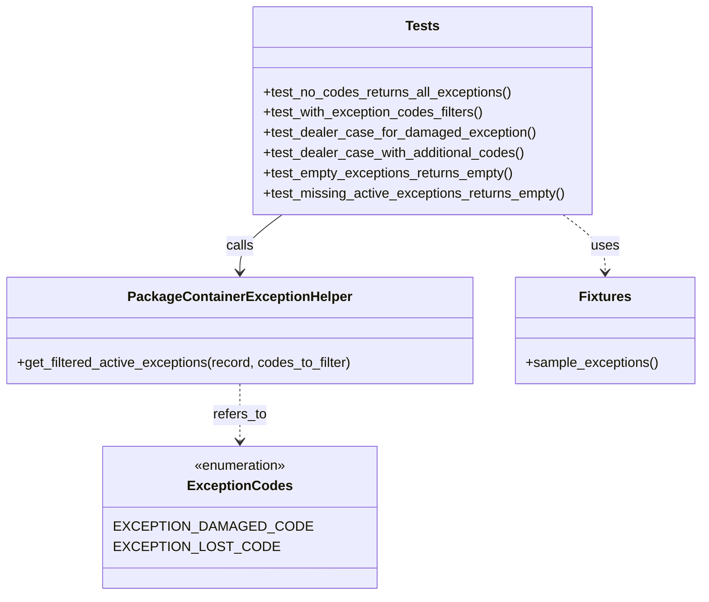

# Diagram: partview_core/partview_service/partview_service/tests/unit/api/package_container/helpers/test_PackageContainerExceptionHelper.py

> Auto-generated by Obscura crawlers

## Mermaid

### SVG

<svg id="container" width="824.9765625" xmlns="http://www.w3.org/2000/svg" class="classDiagram" height="704" viewBox="0 0 824.9765625 704" role="graphics-document document" aria-roledescription="class"><g><defs><marker id="container_class-aggregationStart" class="marker aggregation class" refX="18" refY="7" markerWidth="190" markerHeight="240" orient="auto"><path d="M 18,7 L9,13 L1,7 L9,1 Z"></path></marker></defs><defs><marker id="container_class-aggregationEnd" class="marker aggregation class" refX="1" refY="7" markerWidth="20" markerHeight="28" orient="auto"><path d="M 18,7 L9,13 L1,7 L9,1 Z"></path></marker></defs><defs><marker id="container_class-extensionStart" class="marker extension class" refX="18" refY="7" markerWidth="190" markerHeight="240" orient="auto"><path d="M 1,7 L18,13 V 1 Z"></path></marker></defs><defs><marker id="container_class-extensionEnd" class="marker extension class" refX="1" refY="7" markerWidth="20" markerHeight="28" orient="auto"><path d="M 1,1 V 13 L18,7 Z"></path></marker></defs><defs><marker id="container_class-compositionStart" class="marker composition class" refX="18" refY="7" markerWidth="190" markerHeight="240" orient="auto"><path d="M 18,7 L9,13 L1,7 L9,1 Z"></path></marker></defs><defs><marker id="container_class-compositionEnd" class="marker composition class" refX="1" refY="7" markerWidth="20" markerHeight="28" orient="auto"><path d="M 18,7 L9,13 L1,7 L9,1 Z"></path></marker></defs><defs><marker id="container_class-dependencyStart" class="marker dependency class" refX="6" refY="7" markerWidth="190" markerHeight="240" orient="auto"><path d="M 5,7 L9,13 L1,7 L9,1 Z"></path></marker></defs><defs><marker id="container_class-dependencyEnd" class="marker dependency class" refX="13" refY="7" markerWidth="20" markerHeight="28" orient="auto"><path d="M 18,7 L9,13 L14,7 L9,1 Z"></path></marker></defs><defs><marker id="container_class-lollipopStart" class="marker lollipop class" refX="13" refY="7" markerWidth="190" markerHeight="240" orient="auto"><circle stroke="black" fill="transparent" cx="7" cy="7" r="6"></circle></marker></defs><defs><marker id="container_class-lollipopEnd" class="marker lollipop class" refX="1" refY="7" markerWidth="190" markerHeight="240" orient="auto"><circle stroke="black" fill="transparent" cx="7" cy="7" r="6"></circle></marker></defs><g class="root"><g class="clusters"></g><g class="edgePaths"><path d="M332.269,254L323.992,260.167C315.716,266.333,299.163,278.667,290.886,290C282.609,301.333,282.609,311.667,282.609,316.833L282.609,322" id="id_Tests_PackageContainerExceptionHelper_1" class="edge-thickness-normal edge-pattern-solid relation" style=";;;" data-edge="true" data-et="edge" data-id="id_Tests_PackageContainerExceptionHelper_1" data-points="W3sieCI6MzMyLjI2ODk1NzUxOTUzMTIsInkiOjI1NH0seyJ4IjoyODIuNjA5Mzc1LCJ5IjoyOTF9LHsieCI6MjgyLjYwOTM3NSwieSI6MzI4fV0=" marker-end="url(#container_class-dependencyEnd)"></path><path d="M662.438,254L670.715,260.167C678.991,266.333,695.544,278.667,703.821,290C712.098,301.333,712.098,311.667,712.098,316.833L712.098,322" id="id_Tests_Fixtures_2" class="edge-thickness-normal edge-pattern-dashed relation" style=";;;" data-edge="true" data-et="edge" data-id="id_Tests_Fixtures_2" data-points="W3sieCI6NjYyLjQzODA3MzczMDQ2ODgsInkiOjI1NH0seyJ4Ijo3MTIuMDk3NjU2MjUsInkiOjI5MX0seyJ4Ijo3MTIuMDk3NjU2MjUsInkiOjMyOH1d" marker-end="url(#container_class-dependencyEnd)"></path><path d="M282.609,454L282.609,460.167C282.609,466.333,282.609,478.667,282.609,490C282.609,501.333,282.609,511.667,282.609,516.833L282.609,522" id="id_PackageContainerExceptionHelper_ExceptionCodes_3" class="edge-thickness-normal edge-pattern-dashed relation" style=";;;" data-edge="true" data-et="edge" data-id="id_PackageContainerExceptionHelper_ExceptionCodes_3" data-points="W3sieCI6MjgyLjYwOTM3NSwieSI6NDU0fSx7IngiOjI4Mi42MDkzNzUsInkiOjQ5MX0seyJ4IjoyODIuNjA5Mzc1LCJ5Ijo1Mjh9XQ==" marker-end="url(#container_class-dependencyEnd)"></path></g><g class="edgeLabels"><g class="edgeLabel" transform="translate(282.609375, 291)"><g class="label" data-id="id_Tests_PackageContainerExceptionHelper_1" transform="translate(-16.4453125, -12)"><foreignObject width="32.890625" height="24">

calls

</foreignObject></g></g><g class="edgeLabel" transform="translate(712.09765625, 291)"><g class="label" data-id="id_Tests_Fixtures_2" transform="translate(-16.4921875, -12)"><foreignObject width="32.984375" height="24">

uses

</foreignObject></g></g><g class="edgeLabel" transform="translate(282.609375, 491)"><g class="label" data-id="id_PackageContainerExceptionHelper_ExceptionCodes_3" transform="translate(-32.15625, -12)"><foreignObject width="64.3125" height="24">

refers_to

</foreignObject></g></g></g><g class="nodes"><g class="node default" id="classId-PackageContainerExceptionHelper-0" transform="translate(282.609375, 391)"><g class="basic label-container"><path d="M-274.609375 -63 L274.609375 -63 L274.609375 63 L-274.609375 63" stroke="none" stroke-width="0" fill="#ECECFF" style=""></path><path d="M-274.609375 -63 C-91.4509685902178 -63, 91.7074378195644 -63, 274.609375 -63 M-274.609375 -63 C-87.21372438502539 -63, 100.18192622994923 -63, 274.609375 -63 M274.609375 -63 C274.609375 -25.770633144892138, 274.609375 11.458733710215725, 274.609375 63 M274.609375 -63 C274.609375 -20.961994649720907, 274.609375 21.076010700558186, 274.609375 63 M274.609375 63 C105.11672714914417 63, -64.37592070171166 63, -274.609375 63 M274.609375 63 C145.69144532487124 63, 16.773515649742478 63, -274.609375 63 M-274.609375 63 C-274.609375 34.727272468579486, -274.609375 6.454544937158971, -274.609375 -63 M-274.609375 63 C-274.609375 26.002824434184355, -274.609375 -10.99435113163129, -274.609375 -63" stroke="#9370DB" stroke-width="1.3" fill="none" stroke-dasharray="0 0" style=""></path></g><g class="annotation-group text" transform="translate(0, -39)"></g><g class="label-group text" transform="translate(-125.671875, -39)"><g class="label" style="font-weight: bolder" transform="translate(0,-12)"><foreignObject width="251.34375" height="24">

PackageContainerExceptionHelper

</foreignObject></g></g><g class="members-group text" transform="translate(-262.609375, 9)"></g><g class="methods-group text" transform="translate(-262.609375, 39)"><g class="label" style="" transform="translate(0,-12)"><foreignObject width="399.546875" height="24">

+get_filtered_active_exceptions(record, codes_to_filter)

</foreignObject></g></g><g class="divider" style=""><path d="M-274.609375 -15 C-145.59215228267098 -15, -16.57492956534196 -15, 274.609375 -15 M-274.609375 -15 C-98.13054229324686 -15, 78.34829041350628 -15, 274.609375 -15" stroke="#9370DB" stroke-width="1.3" fill="none" stroke-dasharray="0 0" style=""></path></g><g class="divider" style=""><path d="M-274.609375 9 C-110.97238772134733 9, 52.66459955730534 9, 274.609375 9 M-274.609375 9 C-96.23555418538265 9, 82.13826662923469 9, 274.609375 9" stroke="#9370DB" stroke-width="1.3" fill="none" stroke-dasharray="0 0" style=""></path></g></g><g class="node default" id="classId-ExceptionCodes-1" transform="translate(282.609375, 612)"><g class="basic label-container"><path d="M-141.9765625 -84 L141.9765625 -84 L141.9765625 84 L-141.9765625 84" stroke="none" stroke-width="0" fill="#ECECFF" style=""></path><path d="M-141.9765625 -84 C-30.019141535525193 -84, 81.93827942894961 -84, 141.9765625 -84 M-141.9765625 -84 C-66.48445484756837 -84, 9.007652804863255 -84, 141.9765625 -84 M141.9765625 -84 C141.9765625 -34.09243326651527, 141.9765625 15.815133466969456, 141.9765625 84 M141.9765625 -84 C141.9765625 -34.995755486288246, 141.9765625 14.008489027423508, 141.9765625 84 M141.9765625 84 C33.15137080074999 84, -75.67382089850003 84, -141.9765625 84 M141.9765625 84 C63.896532454830265 84, -14.18349759033947 84, -141.9765625 84 M-141.9765625 84 C-141.9765625 43.357476893410244, -141.9765625 2.7149537868204874, -141.9765625 -84 M-141.9765625 84 C-141.9765625 27.583391399235083, -141.9765625 -28.833217201529834, -141.9765625 -84" stroke="#9370DB" stroke-width="1.3" fill="none" stroke-dasharray="0 0" style=""></path></g><g class="annotation-group text" transform="translate(-55.5546875, -60)"><g class="label" style="" transform="translate(0,-12)"><foreignObject width="111.109375" height="24">

«enumeration»

</foreignObject></g></g><g class="label-group text" transform="translate(-57.890625, -36)"><g class="label" style="font-weight: bolder" transform="translate(0,-12)"><foreignObject width="115.78125" height="24">

ExceptionCodes

</foreignObject></g></g><g class="members-group text" transform="translate(-129.9765625, 12)"><g class="label" style="" transform="translate(0,-12)"><foreignObject width="202.0625" height="24">

EXCEPTION_DAMAGED_CODE

</foreignObject></g><g class="label" style="" transform="translate(0,12)"><foreignObject width="167.125" height="24">

EXCEPTION_LOST_CODE

</foreignObject></g></g><g class="methods-group text" transform="translate(-129.9765625, 84)"></g><g class="divider" style=""><path d="M-141.9765625 -12 C-82.4862850578242 -12, -22.996007615648395 -12, 141.9765625 -12 M-141.9765625 -12 C-84.69955671473294 -12, -27.42255092946587 -12, 141.9765625 -12" stroke="#9370DB" stroke-width="1.3" fill="none" stroke-dasharray="0 0" style=""></path></g><g class="divider" style=""><path d="M-141.9765625 60 C-75.6623378496895 60, -9.348113199378986 60, 141.9765625 60 M-141.9765625 60 C-47.28502661471872 60, 47.406509270562566 60, 141.9765625 60" stroke="#9370DB" stroke-width="1.3" fill="none" stroke-dasharray="0 0" style=""></path></g></g><g class="node default" id="classId-Tests-2" transform="translate(497.353515625, 131)"><g class="basic label-container"><path d="M-201.64453125 -123 L201.64453125 -123 L201.64453125 123 L-201.64453125 123" stroke="none" stroke-width="0" fill="#ECECFF" style=""></path><path d="M-201.64453125 -123 C-118.23023703619982 -123, -34.81594282239965 -123, 201.64453125 -123 M-201.64453125 -123 C-77.24034000688984 -123, 47.163851236220324 -123, 201.64453125 -123 M201.64453125 -123 C201.64453125 -53.391103254142806, 201.64453125 16.21779349171439, 201.64453125 123 M201.64453125 -123 C201.64453125 -61.559661681030775, 201.64453125 -0.11932336206155014, 201.64453125 123 M201.64453125 123 C112.41214167256341 123, 23.179752095126815 123, -201.64453125 123 M201.64453125 123 C83.17867906454786 123, -35.28717312090427 123, -201.64453125 123 M-201.64453125 123 C-201.64453125 56.70151220816318, -201.64453125 -9.59697558367364, -201.64453125 -123 M-201.64453125 123 C-201.64453125 52.92071784371811, -201.64453125 -17.158564312563783, -201.64453125 -123" stroke="#9370DB" stroke-width="1.3" fill="none" stroke-dasharray="0 0" style=""></path></g><g class="annotation-group text" transform="translate(0, -99)"></g><g class="label-group text" transform="translate(-19.1171875, -99)"><g class="label" style="font-weight: bolder" transform="translate(0,-12)"><foreignObject width="38.234375" height="24">

Tests

</foreignObject></g></g><g class="members-group text" transform="translate(-189.64453125, -51)"></g><g class="methods-group text" transform="translate(-189.64453125, -21)"><g class="label" style="" transform="translate(0,-12)"><foreignObject width="295.28125" height="24">

+test_no_codes_returns_all_exceptions()

</foreignObject></g><g class="label" style="" transform="translate(0,12)"><foreignObject width="263.34375" height="24">

+test_with_exception_codes_filters()

</foreignObject></g><g class="label" style="" transform="translate(0,36)"><foreignObject width="319.65625" height="24">

+test_dealer_case_for_damaged_exception()

</foreignObject></g><g class="label" style="" transform="translate(0,60)"><foreignObject width="310.75" height="24">

+test_dealer_case_with_additional_codes()

</foreignObject></g><g class="label" style="" transform="translate(0,84)"><foreignObject width="298.75" height="24">

+test_empty_exceptions_returns_empty()

</foreignObject></g><g class="label" style="" transform="translate(0,108)"><foreignObject width="360.171875" height="24">

+test_missing_active_exceptions_returns_empty()

</foreignObject></g></g><g class="divider" style=""><path d="M-201.64453125 -75 C-79.01203502787949 -75, 43.62046119424102 -75, 201.64453125 -75 M-201.64453125 -75 C-102.14056256355418 -75, -2.6365938771083677 -75, 201.64453125 -75" stroke="#9370DB" stroke-width="1.3" fill="none" stroke-dasharray="0 0" style=""></path></g><g class="divider" style=""><path d="M-201.64453125 -51 C-83.13405754355014 -51, 35.376416162899716 -51, 201.64453125 -51 M-201.64453125 -51 C-71.22397900054995 -51, 59.19657324890011 -51, 201.64453125 -51" stroke="#9370DB" stroke-width="1.3" fill="none" stroke-dasharray="0 0" style=""></path></g></g><g class="node default" id="classId-Fixtures-3" transform="translate(712.09765625, 391)"><g class="basic label-container"><path d="M-104.87890625 -63 L104.87890625 -63 L104.87890625 63 L-104.87890625 63" stroke="none" stroke-width="0" fill="#ECECFF" style=""></path><path d="M-104.87890625 -63 C-30.378335148194978 -63, 44.122235953610044 -63, 104.87890625 -63 M-104.87890625 -63 C-41.014897315931904 -63, 22.84911161813619 -63, 104.87890625 -63 M104.87890625 -63 C104.87890625 -18.90081881384762, 104.87890625 25.198362372304757, 104.87890625 63 M104.87890625 -63 C104.87890625 -16.968092171575123, 104.87890625 29.063815656849755, 104.87890625 63 M104.87890625 63 C52.69544727957654 63, 0.5119883091530824 63, -104.87890625 63 M104.87890625 63 C49.773939179227796 63, -5.331027891544409 63, -104.87890625 63 M-104.87890625 63 C-104.87890625 31.33735653259473, -104.87890625 -0.32528693481054205, -104.87890625 -63 M-104.87890625 63 C-104.87890625 33.70428901734512, -104.87890625 4.408578034690244, -104.87890625 -63" stroke="#9370DB" stroke-width="1.3" fill="none" stroke-dasharray="0 0" style=""></path></g><g class="annotation-group text" transform="translate(0, -39)"></g><g class="label-group text" transform="translate(-28.9296875, -39)"><g class="label" style="font-weight: bolder" transform="translate(0,-12)"><foreignObject width="57.859375" height="24">

Fixtures

</foreignObject></g></g><g class="members-group text" transform="translate(-92.87890625, 9)"></g><g class="methods-group text" transform="translate(-92.87890625, 39)"><g class="label" style="" transform="translate(0,-12)"><foreignObject width="156.828125" height="24">

+sample_exceptions()

</foreignObject></g></g><g class="divider" style=""><path d="M-104.87890625 -15 C-21.529635094329677 -15, 61.819636061340645 -15, 104.87890625 -15 M-104.87890625 -15 C-27.563609955271005 -15, 49.75168633945799 -15, 104.87890625 -15" stroke="#9370DB" stroke-width="1.3" fill="none" stroke-dasharray="0 0" style=""></path></g><g class="divider" style=""><path d="M-104.87890625 9 C-60.938966001941694 9, -16.999025753883387 9, 104.87890625 9 M-104.87890625 9 C-28.77706352322444 9, 47.32477920355112 9, 104.87890625 9" stroke="#9370DB" stroke-width="1.3" fill="none" stroke-dasharray="0 0" style=""></path></g></g></g></g></g></svg>
