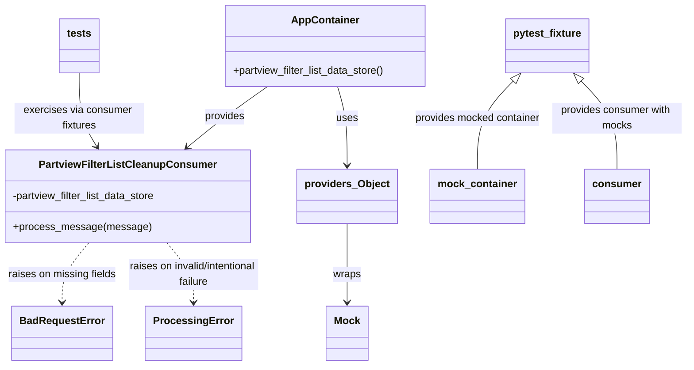

# Diagram: partview_core/partview_service/partview_service/tests/unit/api/partview_filter_list/package_container_filter_list_cleanup_consumer_test.py


> Auto-generated by Obscura crawlers

## Diagram 1



### SVG

<svg id="container" width="1054.517578125" xmlns="http://www.w3.org/2000/svg" class="classDiagram" height="566" viewBox="0 0 1054.517578125 566" role="graphics-document document" aria-roledescription="class"><style>#container{font-family:"trebuchet ms",verdana,arial,sans-serif;font-size:16px;fill:#333;}@keyframes edge-animation-frame{from{stroke-dashoffset:0;}}@keyframes dash{to{stroke-dashoffset:0;}}#container .edge-animation-slow{stroke-dasharray:9,5!important;stroke-dashoffset:900;animation:dash 50s linear infinite;stroke-linecap:round;}#container .edge-animation-fast{stroke-dasharray:9,5!important;stroke-dashoffset:900;animation:dash 20s linear infinite;stroke-linecap:round;}#container .error-icon{fill:#552222;}#container .error-text{fill:#552222;stroke:#552222;}#container .edge-thickness-normal{stroke-width:1px;}#container .edge-thickness-thick{stroke-width:3.5px;}#container .edge-pattern-solid{stroke-dasharray:0;}#container .edge-thickness-invisible{stroke-width:0;fill:none;}#container .edge-pattern-dashed{stroke-dasharray:3;}#container .edge-pattern-dotted{stroke-dasharray:2;}#container .marker{fill:#333333;stroke:#333333;}#container .marker.cross{stroke:#333333;}#container svg{font-family:"trebuchet ms",verdana,arial,sans-serif;font-size:16px;}#container p{margin:0;}#container g.classGroup text{fill:#9370DB;stroke:none;font-family:"trebuchet ms",verdana,arial,sans-serif;font-size:10px;}#container g.classGroup text .title{font-weight:bolder;}#container .nodeLabel,#container .edgeLabel{color:#131300;}#container .edgeLabel .label rect{fill:#ECECFF;}#container .label text{fill:#131300;}#container .labelBkg{background:#ECECFF;}#container .edgeLabel .label span{background:#ECECFF;}#container .classTitle{font-weight:bolder;}#container .node rect,#container .node circle,#container .node ellipse,#container .node polygon,#container .node path{fill:#ECECFF;stroke:#9370DB;stroke-width:1px;}#container .divider{stroke:#9370DB;stroke-width:1;}#container g.clickable{cursor:pointer;}#container g.classGroup rect{fill:#ECECFF;stroke:#9370DB;}#container g.classGroup line{stroke:#9370DB;stroke-width:1;}#container .classLabel .box{stroke:none;stroke-width:0;fill:#ECECFF;opacity:0.5;}#container .classLabel .label{fill:#9370DB;font-size:10px;}#container .relation{stroke:#333333;stroke-width:1;fill:none;}#container .dashed-line{stroke-dasharray:3;}#container .dotted-line{stroke-dasharray:1 2;}#container #compositionStart,#container .composition{fill:#333333!important;stroke:#333333!important;stroke-width:1;}#container #compositionEnd,#container .composition{fill:#333333!important;stroke:#333333!important;stroke-width:1;}#container #dependencyStart,#container .dependency{fill:#333333!important;stroke:#333333!important;stroke-width:1;}#container #dependencyStart,#container .dependency{fill:#333333!important;stroke:#333333!important;stroke-width:1;}#container #extensionStart,#container .extension{fill:transparent!important;stroke:#333333!important;stroke-width:1;}#container #extensionEnd,#container .extension{fill:transparent!important;stroke:#333333!important;stroke-width:1;}#container #aggregationStart,#container .aggregation{fill:transparent!important;stroke:#333333!important;stroke-width:1;}#container #aggregationEnd,#container .aggregation{fill:transparent!important;stroke:#333333!important;stroke-width:1;}#container #lollipopStart,#container .lollipop{fill:#ECECFF!important;stroke:#333333!important;stroke-width:1;}#container #lollipopEnd,#container .lollipop{fill:#ECECFF!important;stroke:#333333!important;stroke-width:1;}#container .edgeTerminals{font-size:11px;line-height:initial;}#container .classTitleText{text-anchor:middle;font-size:18px;fill:#333;}#container .label-icon{display:inline-block;height:1em;overflow:visible;vertical-align:-0.125em;}#container .node .label-icon path{fill:currentColor;stroke:revert;stroke-width:revert;}#container :root{--mermaid-font-family:"trebuchet ms",verdana,arial,sans-serif;}</style><g><defs><marker id="container_class-aggregationStart" class="marker aggregation class" refX="18" refY="7" markerWidth="190" markerHeight="240" orient="auto"><path d="M 18,7 L9,13 L1,7 L9,1 Z"></path></marker></defs><defs><marker id="container_class-aggregationEnd" class="marker aggregation class" refX="1" refY="7" markerWidth="20" markerHeight="28" orient="auto"><path d="M 18,7 L9,13 L1,7 L9,1 Z"></path></marker></defs><defs><marker id="container_class-extensionStart" class="marker extension class" refX="18" refY="7" markerWidth="190" markerHeight="240" orient="auto"><path d="M 1,7 L18,13 V 1 Z"></path></marker></defs><defs><marker id="container_class-extensionEnd" class="marker extension class" refX="1" refY="7" markerWidth="20" markerHeight="28" orient="auto"><path d="M 1,1 V 13 L18,7 Z"></path></marker></defs><defs><marker id="container_class-compositionStart" class="marker composition class" refX="18" refY="7" markerWidth="190" markerHeight="240" orient="auto"><path d="M 18,7 L9,13 L1,7 L9,1 Z"></path></marker></defs><defs><marker id="container_class-compositionEnd" class="marker composition class" refX="1" refY="7" markerWidth="20" markerHeight="28" orient="auto"><path d="M 18,7 L9,13 L1,7 L9,1 Z"></path></marker></defs><defs><marker id="container_class-dependencyStart" class="marker dependency class" refX="6" refY="7" markerWidth="190" markerHeight="240" orient="auto"><path d="M 5,7 L9,13 L1,7 L9,1 Z"></path></marker></defs><defs><marker id="container_class-dependencyEnd" class="marker dependency class" refX="13" refY="7" markerWidth="20" markerHeight="28" orient="auto"><path d="M 18,7 L9,13 L14,7 L9,1 Z"></path></marker></defs><defs><marker id="container_class-lollipopStart" class="marker lollipop class" refX="13" refY="7" markerWidth="190" markerHeight="240" orient="auto"><circle stroke="black" fill="transparent" cx="7" cy="7" r="6"></circle></marker></defs><defs><marker id="container_class-lollipopEnd" class="marker lollipop class" refX="1" refY="7" markerWidth="190" markerHeight="240" orient="auto"><circle stroke="black" fill="transparent" cx="7" cy="7" r="6"></circle></marker></defs><g class="root"><g class="clusters"></g><g class="edgePaths"><path d="M407.383,134L395.916,142.167C384.449,150.333,361.516,166.667,341.321,182.348C321.127,198.028,303.672,213.057,294.944,220.571L286.216,228.085" id="id_AppContainer_PartviewFilterListCleanupConsumer_1" class="edge-thickness-normal edge-pattern-solid relation" style=";;;" data-edge="true" data-et="edge" data-id="id_AppContainer_PartviewFilterListCleanupConsumer_1" data-points="W3sieCI6NDA3LjM4MzE3ODcxMDkzNzUsInkiOjEzNH0seyJ4IjozMzguNTgyMDMxMjUsInkiOjE4M30seyJ4IjoyODEuNjY5NTE4MzM2Nzc2ODMsInkiOjIzMn1d" marker-end="url(#container_class-dependencyEnd)"></path><path d="M516.656,134L519.355,142.167C522.053,150.333,527.449,166.667,530.148,187C532.846,207.333,532.846,231.667,532.846,243.833L532.846,256" id="id_AppContainer_providers_Object_2" class="edge-thickness-normal edge-pattern-solid relation" style=";;;" data-edge="true" data-et="edge" data-id="id_AppContainer_providers_Object_2" data-points="W3sieCI6NTE2LjY1NjQ5NDE0MDYyNSwieSI6MTM0fSx7IngiOjUzMi44NDU3MDMxMjUsInkiOjE4M30seyJ4Ijo1MzIuODQ1NzAzMTI1LCJ5IjoyNjJ9XQ==" marker-end="url(#container_class-dependencyEnd)"></path><path d="M532.846,346L532.846,359.167C532.846,372.333,532.846,398.667,532.846,419C532.846,439.333,532.846,453.667,532.846,460.833L532.846,468" id="id_providers_Object_Mock_3" class="edge-thickness-normal edge-pattern-solid relation" style=";;;" data-edge="true" data-et="edge" data-id="id_providers_Object_Mock_3" data-points="W3sieCI6NTMyLjg0NTcwMzEyNSwieSI6MzQ2fSx7IngiOjUzMi44NDU3MDMxMjUsInkiOjQyNX0seyJ4Ijo1MzIuODQ1NzAzMTI1LCJ5Ijo0NzR9XQ==" marker-end="url(#container_class-dependencyEnd)"></path><path d="M137.24,376L130.343,384.167C123.446,392.333,109.653,408.667,102.756,424C95.859,439.333,95.859,453.667,95.859,460.833L95.859,468" id="id_PartviewFilterListCleanupConsumer_BadRequestError_4" class="edge-thickness-normal edge-pattern-dashed relation" style=";;;" data-edge="true" data-et="edge" data-id="id_PartviewFilterListCleanupConsumer_BadRequestError_4" data-points="W3sieCI6MTM3LjIzOTUwODAwNjE5ODM1LCJ5IjozNzZ9LHsieCI6OTUuODU5Mzc1LCJ5Ijo0MjV9LHsieCI6OTUuODU5Mzc1LCJ5Ijo0NzR9XQ==" marker-end="url(#container_class-dependencyEnd)"></path><path d="M258.846,376L265.743,384.167C272.64,392.333,286.433,408.667,293.33,424C300.227,439.333,300.227,453.667,300.227,460.833L300.227,468" id="id_PartviewFilterListCleanupConsumer_ProcessingError_5" class="edge-thickness-normal edge-pattern-dashed relation" style=";;;" data-edge="true" data-et="edge" data-id="id_PartviewFilterListCleanupConsumer_ProcessingError_5" data-points="W3sieCI6MjU4Ljg0NjQyOTQ5MzgwMTcsInkiOjM3Nn0seyJ4IjozMDAuMjI2NTYyNSwieSI6NDI1fSx7IngiOjMwMC4yMjY1NjI1LCJ5Ijo0NzR9XQ==" marker-end="url(#container_class-dependencyEnd)"></path><path d="M784.125,125.343L774.744,134.953C765.363,144.562,746.6,163.781,737.219,186.557C727.838,209.333,727.838,235.667,727.838,248.833L727.838,262" id="id_pytest_fixture_mock_container_6" class="edge-thickness-normal edge-pattern-solid relation" style=";;;" data-edge="true" data-et="edge" data-id="id_pytest_fixture_mock_container_6" data-points="W3sieCI6Nzk2LjE3NTI5Mjk2ODc1LCJ5IjoxMTN9LHsieCI6NzI3LjgzNzg5MDYyNSwieSI6MTgzfSx7IngiOjcyNy44Mzc4OTA2MjUsInkiOjI2Mn1d" marker-start="url(#container_class-extensionStart)"></path><path d="M890.23,125.343L899.612,134.953C908.993,144.562,927.755,163.781,937.136,186.557C946.518,209.333,946.518,235.667,946.518,248.833L946.518,262" id="id_pytest_fixture_consumer_7" class="edge-thickness-normal edge-pattern-solid relation" style=";;;" data-edge="true" data-et="edge" data-id="id_pytest_fixture_consumer_7" data-points="W3sieCI6ODc4LjE4MDE3NTc4MTI1LCJ5IjoxMTN9LHsieCI6OTQ2LjUxNzU3ODEyNSwieSI6MTgzfSx7IngiOjk0Ni41MTc1NzgxMjUsInkiOjI2Mn1d" marker-start="url(#container_class-extensionStart)"></path><path d="M122.387,113L122.387,124.667C122.387,136.333,122.387,159.667,126.963,178.652C131.539,197.638,140.691,212.275,145.267,219.594L149.843,226.913" id="id_tests_PartviewFilterListCleanupConsumer_8" class="edge-thickness-normal edge-pattern-solid relation" style=";;;" data-edge="true" data-et="edge" data-id="id_tests_PartviewFilterListCleanupConsumer_8" data-points="W3sieCI6MTIyLjM4NjcxODc1LCJ5IjoxMTN9LHsieCI6MTIyLjM4NjcxODc1LCJ5IjoxODN9LHsieCI6MTUzLjAyNDM3MzcwODY3NzY3LCJ5IjoyMzJ9XQ==" marker-end="url(#container_class-dependencyEnd)"></path></g><g class="edgeLabels"><g class="edgeLabel" transform="translate(342.39667, 180.28323)"><g class="label" data-id="id_AppContainer_PartviewFilterListCleanupConsumer_1" transform="translate(-31.3125, -12)"><foreignObject width="62.625" height="24"><div xmlns="http://www.w3.org/1999/xhtml" class="labelBkg" style="display: table-cell; white-space: nowrap; line-height: 1.5; max-width: 200px; text-align: center;"><span class="edgeLabel"><p>provides</p></span></div></foreignObject></g></g><g class="edgeLabel" transform="translate(532.845703125, 183)"><g class="label" data-id="id_AppContainer_providers_Object_2" transform="translate(-16.4921875, -12)"><foreignObject width="32.984375" height="24"><div xmlns="http://www.w3.org/1999/xhtml" class="labelBkg" style="display: table-cell; white-space: nowrap; line-height: 1.5; max-width: 200px; text-align: center;"><span class="edgeLabel"><p>uses</p></span></div></foreignObject></g></g><g class="edgeLabel" transform="translate(532.845703125, 425)"><g class="label" data-id="id_providers_Object_Mock_3" transform="translate(-21.390625, -12)"><foreignObject width="42.78125" height="24"><div xmlns="http://www.w3.org/1999/xhtml" class="labelBkg" style="display: table-cell; white-space: nowrap; line-height: 1.5; max-width: 200px; text-align: center;"><span class="edgeLabel"><p>wraps</p></span></div></foreignObject></g></g><g class="edgeLabel" transform="translate(95.859375, 425)"><g class="label" data-id="id_PartviewFilterListCleanupConsumer_BadRequestError_4" transform="translate(-84.3671875, -12)"><foreignObject width="168.734375" height="24"><div xmlns="http://www.w3.org/1999/xhtml" class="labelBkg" style="display: table-cell; white-space: nowrap; line-height: 1.5; max-width: 200px; text-align: center;"><span class="edgeLabel"><p>raises on missing fields</p></span></div></foreignObject></g></g><g class="edgeLabel" transform="translate(300.2265625, 425)"><g class="label" data-id="id_PartviewFilterListCleanupConsumer_ProcessingError_5" transform="translate(-100, -24)"><foreignObject width="200" height="48"><div xmlns="http://www.w3.org/1999/xhtml" class="labelBkg" style="display: table; white-space: break-spaces; line-height: 1.5; max-width: 200px; text-align: center; width: 200px;"><span class="edgeLabel"><p>raises on invalid/intentional failure</p></span></div></foreignObject></g></g><g class="edgeLabel" transform="translate(727.837890625, 183)"><g class="label" data-id="id_pytest_fixture_mock_container_6" transform="translate(-98.6796875, -12)"><foreignObject width="197.359375" height="24"><div xmlns="http://www.w3.org/1999/xhtml" class="labelBkg" style="display: table-cell; white-space: nowrap; line-height: 1.5; max-width: 200px; text-align: center;"><span class="edgeLabel"><p>provides mocked container</p></span></div></foreignObject></g></g><g class="edgeLabel" transform="translate(946.517578125, 183)"><g class="label" data-id="id_pytest_fixture_consumer_7" transform="translate(-100, -24)"><foreignObject width="200" height="48"><div xmlns="http://www.w3.org/1999/xhtml" class="labelBkg" style="display: table; white-space: break-spaces; line-height: 1.5; max-width: 200px; text-align: center; width: 200px;"><span class="edgeLabel"><p>provides consumer with mocks</p></span></div></foreignObject></g></g><g class="edgeLabel" transform="translate(122.38671875, 183)"><g class="label" data-id="id_tests_PartviewFilterListCleanupConsumer_8" transform="translate(-100, -24)"><foreignObject width="200" height="48"><div xmlns="http://www.w3.org/1999/xhtml" class="labelBkg" style="display: table; white-space: break-spaces; line-height: 1.5; max-width: 200px; text-align: center; width: 200px;"><span class="edgeLabel"><p>exercises via consumer fixtures</p></span></div></foreignObject></g></g></g><g class="nodes"><g class="node default" id="classId-PartviewFilterListCleanupConsumer-0" transform="translate(198.04296875, 304)"><g class="basic label-container"><path d="M-190.04296875 -72 L190.04296875 -72 L190.04296875 72 L-190.04296875 72" stroke="none" stroke-width="0" fill="#ECECFF" style=""></path><path d="M-190.04296875 -72 C-97.98888444937397 -72, -5.934800148747939 -72, 190.04296875 -72 M-190.04296875 -72 C-68.85872217596433 -72, 52.32552439807134 -72, 190.04296875 -72 M190.04296875 -72 C190.04296875 -38.05858975164704, 190.04296875 -4.117179503294082, 190.04296875 72 M190.04296875 -72 C190.04296875 -27.0500966004359, 190.04296875 17.8998067991282, 190.04296875 72 M190.04296875 72 C63.974264800683386 72, -62.09443914863323 72, -190.04296875 72 M190.04296875 72 C106.02109462116192 72, 21.999220492323843 72, -190.04296875 72 M-190.04296875 72 C-190.04296875 36.43408296212674, -190.04296875 0.8681659242534749, -190.04296875 -72 M-190.04296875 72 C-190.04296875 21.885259995830495, -190.04296875 -28.22948000833901, -190.04296875 -72" stroke="#9370DB" stroke-width="1.3" fill="none" stroke-dasharray="0 0" style=""></path></g><g class="annotation-group text" transform="translate(0, -48)"></g><g class="label-group text" transform="translate(-130.0703125, -48)"><g class="label" style="font-weight: bolder" transform="translate(0,-12)"><foreignObject width="260.140625" height="24"><div xmlns="http://www.w3.org/1999/xhtml" style="display: table-cell; white-space: nowrap; line-height: 1.5; max-width: 307px; text-align: center;"><span class="nodeLabel markdown-node-label" style=""><p>PartviewFilterListCleanupConsumer</p></span></div></foreignObject></g></g><g class="members-group text" transform="translate(-178.04296875, 0)"><g class="label" style="" transform="translate(0,-12)"><foreignObject width="226.015625" height="24"><div xmlns="http://www.w3.org/1999/xhtml" style="display: table-cell; white-space: nowrap; line-height: 1.5; max-width: 283px; text-align: center;"><span class="nodeLabel markdown-node-label" style=""><p>-partview_filter_list_data_store</p></span></div></foreignObject></g></g><g class="methods-group text" transform="translate(-178.04296875, 48)"><g class="label" style="" transform="translate(0,-12)"><foreignObject width="206.5" height="24"><div xmlns="http://www.w3.org/1999/xhtml" style="display: table-cell; white-space: nowrap; line-height: 1.5; max-width: 264px; text-align: center;"><span class="nodeLabel markdown-node-label" style=""><p>+process_message(message)</p></span></div></foreignObject></g></g><g class="divider" style=""><path d="M-190.04296875 -24 C-68.98853251564557 -24, 52.06590371870885 -24, 190.04296875 -24 M-190.04296875 -24 C-78.05616514365234 -24, 33.93063846269533 -24, 190.04296875 -24" stroke="#9370DB" stroke-width="1.3" fill="none" stroke-dasharray="0 0" style=""></path></g><g class="divider" style=""><path d="M-190.04296875 24 C-63.64696396563507 24, 62.74904081872987 24, 190.04296875 24 M-190.04296875 24 C-45.81056203078802 24, 98.42184468842396 24, 190.04296875 24" stroke="#9370DB" stroke-width="1.3" fill="none" stroke-dasharray="0 0" style=""></path></g></g><g class="node default" id="classId-AppContainer-1" transform="translate(495.841796875, 71)"><g class="basic label-container"><path d="M-155.890625 -63 L155.890625 -63 L155.890625 63 L-155.890625 63" stroke="none" stroke-width="0" fill="#ECECFF" style=""></path><path d="M-155.890625 -63 C-64.90810087400615 -63, 26.074423251987696 -63, 155.890625 -63 M-155.890625 -63 C-87.51360906197608 -63, -19.136593123952167 -63, 155.890625 -63 M155.890625 -63 C155.890625 -16.446346195178094, 155.890625 30.10730760964381, 155.890625 63 M155.890625 -63 C155.890625 -23.687232470565398, 155.890625 15.625535058869204, 155.890625 63 M155.890625 63 C57.662856337544426 63, -40.56491232491115 63, -155.890625 63 M155.890625 63 C78.01778887709904 63, 0.14495275419807285 63, -155.890625 63 M-155.890625 63 C-155.890625 19.655959162598464, -155.890625 -23.688081674803072, -155.890625 -63 M-155.890625 63 C-155.890625 36.17840046742671, -155.890625 9.356800934853418, -155.890625 -63" stroke="#9370DB" stroke-width="1.3" fill="none" stroke-dasharray="0 0" style=""></path></g><g class="annotation-group text" transform="translate(0, -39)"></g><g class="label-group text" transform="translate(-49.875, -39)"><g class="label" style="font-weight: bolder" transform="translate(0,-12)"><foreignObject width="99.75" height="24"><div xmlns="http://www.w3.org/1999/xhtml" style="display: table-cell; white-space: nowrap; line-height: 1.5; max-width: 150px; text-align: center;"><span class="nodeLabel markdown-node-label" style=""><p>AppContainer</p></span></div></foreignObject></g></g><g class="members-group text" transform="translate(-143.890625, 9)"></g><g class="methods-group text" transform="translate(-143.890625, 39)"><g class="label" style="" transform="translate(0,-12)"><foreignObject width="237.90625" height="24"><div xmlns="http://www.w3.org/1999/xhtml" style="display: table-cell; white-space: nowrap; line-height: 1.5; max-width: 295px; text-align: center;"><span class="nodeLabel markdown-node-label" style=""><p>+partview_filter_list_data_store()</p></span></div></foreignObject></g></g><g class="divider" style=""><path d="M-155.890625 -15 C-46.50808709506509 -15, 62.87445080986981 -15, 155.890625 -15 M-155.890625 -15 C-36.161382635880315 -15, 83.56785972823937 -15, 155.890625 -15" stroke="#9370DB" stroke-width="1.3" fill="none" stroke-dasharray="0 0" style=""></path></g><g class="divider" style=""><path d="M-155.890625 9 C-59.693936899803774 9, 36.50275120039245 9, 155.890625 9 M-155.890625 9 C-80.66048641400009 9, -5.43034782800018 9, 155.890625 9" stroke="#9370DB" stroke-width="1.3" fill="none" stroke-dasharray="0 0" style=""></path></g></g><g class="node default" id="classId-Mock-2" transform="translate(532.845703125, 516)"><g class="basic label-container"><path d="M-31.2109375 -42 L31.2109375 -42 L31.2109375 42 L-31.2109375 42" stroke="none" stroke-width="0" fill="#ECECFF" style=""></path><path d="M-31.2109375 -42 C-14.186825222234589 -42, 2.8372870555308225 -42, 31.2109375 -42 M-31.2109375 -42 C-11.686787016135852 -42, 7.837363467728295 -42, 31.2109375 -42 M31.2109375 -42 C31.2109375 -20.92597818190465, 31.2109375 0.1480436361906996, 31.2109375 42 M31.2109375 -42 C31.2109375 -11.156003583520182, 31.2109375 19.687992832959637, 31.2109375 42 M31.2109375 42 C17.971219055122774 42, 4.7315006102455435 42, -31.2109375 42 M31.2109375 42 C15.968193231230757 42, 0.7254489624615132 42, -31.2109375 42 M-31.2109375 42 C-31.2109375 21.03554857855799, -31.2109375 0.07109715711597886, -31.2109375 -42 M-31.2109375 42 C-31.2109375 21.488375492038724, -31.2109375 0.976750984077448, -31.2109375 -42" stroke="#9370DB" stroke-width="1.3" fill="none" stroke-dasharray="0 0" style=""></path></g><g class="annotation-group text" transform="translate(0, -18)"></g><g class="label-group text" transform="translate(-19.2109375, -18)"><g class="label" style="font-weight: bolder" transform="translate(0,-12)"><foreignObject width="38.421875" height="24"><div xmlns="http://www.w3.org/1999/xhtml" style="display: table-cell; white-space: nowrap; line-height: 1.5; max-width: 88px; text-align: center;"><span class="nodeLabel markdown-node-label" style=""><p>Mock</p></span></div></foreignObject></g></g><g class="members-group text" transform="translate(-19.2109375, 30)"></g><g class="methods-group text" transform="translate(-19.2109375, 60)"></g><g class="divider" style=""><path d="M-31.2109375 6 C-9.459141754383246 6, 12.292653991233507 6, 31.2109375 6 M-31.2109375 6 C-14.557705674821332 6, 2.095526150357337 6, 31.2109375 6" stroke="#9370DB" stroke-width="1.3" fill="none" stroke-dasharray="0 0" style=""></path></g><g class="divider" style=""><path d="M-31.2109375 24 C-7.247988094477545 24, 16.71496131104491 24, 31.2109375 24 M-31.2109375 24 C-18.225537600177802 24, -5.2401377003556 24, 31.2109375 24" stroke="#9370DB" stroke-width="1.3" fill="none" stroke-dasharray="0 0" style=""></path></g></g><g class="node default" id="classId-providers_Object-3" transform="translate(532.845703125, 304)"><g class="basic label-container"><path d="M-74.4765625 -42 L74.4765625 -42 L74.4765625 42 L-74.4765625 42" stroke="none" stroke-width="0" fill="#ECECFF" style=""></path><path d="M-74.4765625 -42 C-15.662273096106375 -42, 43.15201630778725 -42, 74.4765625 -42 M-74.4765625 -42 C-31.851622333097495 -42, 10.77331783380501 -42, 74.4765625 -42 M74.4765625 -42 C74.4765625 -24.11113990187705, 74.4765625 -6.222279803754098, 74.4765625 42 M74.4765625 -42 C74.4765625 -21.9262618734153, 74.4765625 -1.8525237468305988, 74.4765625 42 M74.4765625 42 C39.94028643230001 42, 5.404010364600026 42, -74.4765625 42 M74.4765625 42 C30.03372654316128 42, -14.409109413677442 42, -74.4765625 42 M-74.4765625 42 C-74.4765625 19.60621618220051, -74.4765625 -2.7875676355989825, -74.4765625 -42 M-74.4765625 42 C-74.4765625 15.797179070114368, -74.4765625 -10.405641859771265, -74.4765625 -42" stroke="#9370DB" stroke-width="1.3" fill="none" stroke-dasharray="0 0" style=""></path></g><g class="annotation-group text" transform="translate(0, -18)"></g><g class="label-group text" transform="translate(-62.4765625, -18)"><g class="label" style="font-weight: bolder" transform="translate(0,-12)"><foreignObject width="124.953125" height="24"><div xmlns="http://www.w3.org/1999/xhtml" style="display: table-cell; white-space: nowrap; line-height: 1.5; max-width: 173px; text-align: center;"><span class="nodeLabel markdown-node-label" style=""><p>providers_Object</p></span></div></foreignObject></g></g><g class="members-group text" transform="translate(-62.4765625, 30)"></g><g class="methods-group text" transform="translate(-62.4765625, 60)"></g><g class="divider" style=""><path d="M-74.4765625 6 C-38.22998842588782 6, -1.983414351775636 6, 74.4765625 6 M-74.4765625 6 C-18.64746600713908 6, 37.18163048572184 6, 74.4765625 6" stroke="#9370DB" stroke-width="1.3" fill="none" stroke-dasharray="0 0" style=""></path></g><g class="divider" style=""><path d="M-74.4765625 24 C-27.030642642030188 24, 20.415277215939625 24, 74.4765625 24 M-74.4765625 24 C-31.088137833443866 24, 12.300286833112267 24, 74.4765625 24" stroke="#9370DB" stroke-width="1.3" fill="none" stroke-dasharray="0 0" style=""></path></g></g><g class="node default" id="classId-BadRequestError-4" transform="translate(95.859375, 516)"><g class="basic label-container"><path d="M-74.28125 -42 L74.28125 -42 L74.28125 42 L-74.28125 42" stroke="none" stroke-width="0" fill="#ECECFF" style=""></path><path d="M-74.28125 -42 C-40.41701844977646 -42, -6.552786899552913 -42, 74.28125 -42 M-74.28125 -42 C-16.053077614438223 -42, 42.175094771123554 -42, 74.28125 -42 M74.28125 -42 C74.28125 -12.155368637862392, 74.28125 17.689262724275217, 74.28125 42 M74.28125 -42 C74.28125 -11.888280275863373, 74.28125 18.223439448273254, 74.28125 42 M74.28125 42 C32.98282928482054 42, -8.315591430358921 42, -74.28125 42 M74.28125 42 C40.95780225515757 42, 7.634354510315134 42, -74.28125 42 M-74.28125 42 C-74.28125 22.303543406604717, -74.28125 2.6070868132094347, -74.28125 -42 M-74.28125 42 C-74.28125 11.463176435511247, -74.28125 -19.073647128977505, -74.28125 -42" stroke="#9370DB" stroke-width="1.3" fill="none" stroke-dasharray="0 0" style=""></path></g><g class="annotation-group text" transform="translate(0, -18)"></g><g class="label-group text" transform="translate(-62.28125, -18)"><g class="label" style="font-weight: bolder" transform="translate(0,-12)"><foreignObject width="124.5625" height="24"><div xmlns="http://www.w3.org/1999/xhtml" style="display: table-cell; white-space: nowrap; line-height: 1.5; max-width: 174px; text-align: center;"><span class="nodeLabel markdown-node-label" style=""><p>BadRequestError</p></span></div></foreignObject></g></g><g class="members-group text" transform="translate(-62.28125, 30)"></g><g class="methods-group text" transform="translate(-62.28125, 60)"></g><g class="divider" style=""><path d="M-74.28125 6 C-25.08848506376691 6, 24.10427987246618 6, 74.28125 6 M-74.28125 6 C-35.03495376231693 6, 4.211342475366138 6, 74.28125 6" stroke="#9370DB" stroke-width="1.3" fill="none" stroke-dasharray="0 0" style=""></path></g><g class="divider" style=""><path d="M-74.28125 24 C-37.52735349138281 24, -0.773456982765623 24, 74.28125 24 M-74.28125 24 C-40.44623919249643 24, -6.611228384992856 24, 74.28125 24" stroke="#9370DB" stroke-width="1.3" fill="none" stroke-dasharray="0 0" style=""></path></g></g><g class="node default" id="classId-ProcessingError-5" transform="translate(300.2265625, 516)"><g class="basic label-container"><path d="M-69.5078125 -42 L69.5078125 -42 L69.5078125 42 L-69.5078125 42" stroke="none" stroke-width="0" fill="#ECECFF" style=""></path><path d="M-69.5078125 -42 C-34.39473865410059 -42, 0.7183351917988148 -42, 69.5078125 -42 M-69.5078125 -42 C-26.52995224747329 -42, 16.44790800505342 -42, 69.5078125 -42 M69.5078125 -42 C69.5078125 -11.219658286659417, 69.5078125 19.560683426681166, 69.5078125 42 M69.5078125 -42 C69.5078125 -19.813190772659063, 69.5078125 2.373618454681875, 69.5078125 42 M69.5078125 42 C26.758163553743508 42, -15.991485392512985 42, -69.5078125 42 M69.5078125 42 C41.66668027585671 42, 13.825548051713426 42, -69.5078125 42 M-69.5078125 42 C-69.5078125 12.051561060774215, -69.5078125 -17.89687787845157, -69.5078125 -42 M-69.5078125 42 C-69.5078125 10.068108966983718, -69.5078125 -21.863782066032563, -69.5078125 -42" stroke="#9370DB" stroke-width="1.3" fill="none" stroke-dasharray="0 0" style=""></path></g><g class="annotation-group text" transform="translate(0, -18)"></g><g class="label-group text" transform="translate(-57.5078125, -18)"><g class="label" style="font-weight: bolder" transform="translate(0,-12)"><foreignObject width="115.015625" height="24"><div xmlns="http://www.w3.org/1999/xhtml" style="display: table-cell; white-space: nowrap; line-height: 1.5; max-width: 164px; text-align: center;"><span class="nodeLabel markdown-node-label" style=""><p>ProcessingError</p></span></div></foreignObject></g></g><g class="members-group text" transform="translate(-57.5078125, 30)"></g><g class="methods-group text" transform="translate(-57.5078125, 60)"></g><g class="divider" style=""><path d="M-69.5078125 6 C-29.71864843520614 6, 10.070515629587717 6, 69.5078125 6 M-69.5078125 6 C-15.512392106269907 6, 38.483028287460186 6, 69.5078125 6" stroke="#9370DB" stroke-width="1.3" fill="none" stroke-dasharray="0 0" style=""></path></g><g class="divider" style=""><path d="M-69.5078125 24 C-19.050954680857835 24, 31.40590313828433 24, 69.5078125 24 M-69.5078125 24 C-32.53983490591665 24, 4.428142688166702 24, 69.5078125 24" stroke="#9370DB" stroke-width="1.3" fill="none" stroke-dasharray="0 0" style=""></path></g></g><g class="node default" id="classId-pytest_fixture-6" transform="translate(837.177734375, 71)"><g class="basic label-container"><path d="M-63.109375 -42 L63.109375 -42 L63.109375 42 L-63.109375 42" stroke="none" stroke-width="0" fill="#ECECFF" style=""></path><path d="M-63.109375 -42 C-29.846214185359315 -42, 3.4169466292813695 -42, 63.109375 -42 M-63.109375 -42 C-18.29597852055008 -42, 26.51741795889984 -42, 63.109375 -42 M63.109375 -42 C63.109375 -23.123674455252765, 63.109375 -4.247348910505529, 63.109375 42 M63.109375 -42 C63.109375 -15.752085742085626, 63.109375 10.495828515828748, 63.109375 42 M63.109375 42 C20.455098895682937 42, -22.199177208634126 42, -63.109375 42 M63.109375 42 C21.289200906794896 42, -20.530973186410208 42, -63.109375 42 M-63.109375 42 C-63.109375 16.977755762447558, -63.109375 -8.044488475104885, -63.109375 -42 M-63.109375 42 C-63.109375 18.2641880268406, -63.109375 -5.4716239463188, -63.109375 -42" stroke="#9370DB" stroke-width="1.3" fill="none" stroke-dasharray="0 0" style=""></path></g><g class="annotation-group text" transform="translate(0, -18)"></g><g class="label-group text" transform="translate(-51.109375, -18)"><g class="label" style="font-weight: bolder" transform="translate(0,-12)"><foreignObject width="102.21875" height="24"><div xmlns="http://www.w3.org/1999/xhtml" style="display: table-cell; white-space: nowrap; line-height: 1.5; max-width: 149px; text-align: center;"><span class="nodeLabel markdown-node-label" style=""><p>pytest_fixture</p></span></div></foreignObject></g></g><g class="members-group text" transform="translate(-51.109375, 30)"></g><g class="methods-group text" transform="translate(-51.109375, 60)"></g><g class="divider" style=""><path d="M-63.109375 6 C-30.820404984423206 6, 1.468565031153588 6, 63.109375 6 M-63.109375 6 C-17.05768753524977 6, 28.99399992950046 6, 63.109375 6" stroke="#9370DB" stroke-width="1.3" fill="none" stroke-dasharray="0 0" style=""></path></g><g class="divider" style=""><path d="M-63.109375 24 C-27.63033775012498 24, 7.84869949975004 24, 63.109375 24 M-63.109375 24 C-36.386789101372045 24, -9.664203202744098 24, 63.109375 24" stroke="#9370DB" stroke-width="1.3" fill="none" stroke-dasharray="0 0" style=""></path></g></g><g class="node default" id="classId-tests-7" transform="translate(122.38671875, 71)"><g class="basic label-container"><path d="M-30.1796875 -42 L30.1796875 -42 L30.1796875 42 L-30.1796875 42" stroke="none" stroke-width="0" fill="#ECECFF" style=""></path><path d="M-30.1796875 -42 C-7.265499130371687 -42, 15.648689239256626 -42, 30.1796875 -42 M-30.1796875 -42 C-15.50652227768466 -42, -0.8333570553693193 -42, 30.1796875 -42 M30.1796875 -42 C30.1796875 -16.694211317435375, 30.1796875 8.61157736512925, 30.1796875 42 M30.1796875 -42 C30.1796875 -12.509245319198794, 30.1796875 16.981509361602413, 30.1796875 42 M30.1796875 42 C6.917137200169094 42, -16.345413099661812 42, -30.1796875 42 M30.1796875 42 C12.112847748616964 42, -5.953992002766071 42, -30.1796875 42 M-30.1796875 42 C-30.1796875 9.604755269672062, -30.1796875 -22.790489460655877, -30.1796875 -42 M-30.1796875 42 C-30.1796875 9.210158080130967, -30.1796875 -23.579683839738067, -30.1796875 -42" stroke="#9370DB" stroke-width="1.3" fill="none" stroke-dasharray="0 0" style=""></path></g><g class="annotation-group text" transform="translate(0, -18)"></g><g class="label-group text" transform="translate(-18.1796875, -18)"><g class="label" style="font-weight: bolder" transform="translate(0,-12)"><foreignObject width="36.359375" height="24"><div xmlns="http://www.w3.org/1999/xhtml" style="display: table-cell; white-space: nowrap; line-height: 1.5; max-width: 85px; text-align: center;"><span class="nodeLabel markdown-node-label" style=""><p>tests</p></span></div></foreignObject></g></g><g class="members-group text" transform="translate(-18.1796875, 30)"></g><g class="methods-group text" transform="translate(-18.1796875, 60)"></g><g class="divider" style=""><path d="M-30.1796875 6 C-17.199233491403596 6, -4.218779482807193 6, 30.1796875 6 M-30.1796875 6 C-12.92612665207723 6, 4.327434195845541 6, 30.1796875 6" stroke="#9370DB" stroke-width="1.3" fill="none" stroke-dasharray="0 0" style=""></path></g><g class="divider" style=""><path d="M-30.1796875 24 C-6.320651530046213 24, 17.538384439907574 24, 30.1796875 24 M-30.1796875 24 C-16.271125752838316 24, -2.3625640056766315 24, 30.1796875 24" stroke="#9370DB" stroke-width="1.3" fill="none" stroke-dasharray="0 0" style=""></path></g></g><g class="node default" id="classId-mock_container-8" transform="translate(727.837890625, 304)"><g class="basic label-container"><path d="M-70.515625 -42 L70.515625 -42 L70.515625 42 L-70.515625 42" stroke="none" stroke-width="0" fill="#ECECFF" style=""></path><path d="M-70.515625 -42 C-27.6509399864049 -42, 15.2137450271902 -42, 70.515625 -42 M-70.515625 -42 C-17.966452108913785 -42, 34.58272078217243 -42, 70.515625 -42 M70.515625 -42 C70.515625 -15.005572793307135, 70.515625 11.98885441338573, 70.515625 42 M70.515625 -42 C70.515625 -22.538284306079905, 70.515625 -3.076568612159811, 70.515625 42 M70.515625 42 C17.582549837949117 42, -35.35052532410177 42, -70.515625 42 M70.515625 42 C17.85106189538017 42, -34.81350120923966 42, -70.515625 42 M-70.515625 42 C-70.515625 24.776182099992045, -70.515625 7.5523641999840905, -70.515625 -42 M-70.515625 42 C-70.515625 16.269604521191592, -70.515625 -9.460790957616815, -70.515625 -42" stroke="#9370DB" stroke-width="1.3" fill="none" stroke-dasharray="0 0" style=""></path></g><g class="annotation-group text" transform="translate(0, -18)"></g><g class="label-group text" transform="translate(-58.515625, -18)"><g class="label" style="font-weight: bolder" transform="translate(0,-12)"><foreignObject width="117.03125" height="24"><div xmlns="http://www.w3.org/1999/xhtml" style="display: table-cell; white-space: nowrap; line-height: 1.5; max-width: 167px; text-align: center;"><span class="nodeLabel markdown-node-label" style=""><p>mock_container</p></span></div></foreignObject></g></g><g class="members-group text" transform="translate(-58.515625, 30)"></g><g class="methods-group text" transform="translate(-58.515625, 60)"></g><g class="divider" style=""><path d="M-70.515625 6 C-20.437732114807154 6, 29.64016077038569 6, 70.515625 6 M-70.515625 6 C-25.37643204911447 6, 19.76276090177106 6, 70.515625 6" stroke="#9370DB" stroke-width="1.3" fill="none" stroke-dasharray="0 0" style=""></path></g><g class="divider" style=""><path d="M-70.515625 24 C-27.39159115198931 24, 15.73244269602138 24, 70.515625 24 M-70.515625 24 C-22.25448198890067 24, 26.006661022198656 24, 70.515625 24" stroke="#9370DB" stroke-width="1.3" fill="none" stroke-dasharray="0 0" style=""></path></g></g><g class="node default" id="classId-consumer-9" transform="translate(946.517578125, 304)"><g class="basic label-container"><path d="M-47.7890625 -42 L47.7890625 -42 L47.7890625 42 L-47.7890625 42" stroke="none" stroke-width="0" fill="#ECECFF" style=""></path><path d="M-47.7890625 -42 C-14.581533902769479 -42, 18.625994694461042 -42, 47.7890625 -42 M-47.7890625 -42 C-18.295299822209028 -42, 11.198462855581944 -42, 47.7890625 -42 M47.7890625 -42 C47.7890625 -21.401820183886155, 47.7890625 -0.8036403677723101, 47.7890625 42 M47.7890625 -42 C47.7890625 -11.48439759928743, 47.7890625 19.03120480142514, 47.7890625 42 M47.7890625 42 C26.902136404254087 42, 6.015210308508173 42, -47.7890625 42 M47.7890625 42 C12.19333971405267 42, -23.40238307189466 42, -47.7890625 42 M-47.7890625 42 C-47.7890625 15.41062077820646, -47.7890625 -11.178758443587078, -47.7890625 -42 M-47.7890625 42 C-47.7890625 24.42898817400403, -47.7890625 6.857976348008059, -47.7890625 -42" stroke="#9370DB" stroke-width="1.3" fill="none" stroke-dasharray="0 0" style=""></path></g><g class="annotation-group text" transform="translate(0, -18)"></g><g class="label-group text" transform="translate(-35.7890625, -18)"><g class="label" style="font-weight: bolder" transform="translate(0,-12)"><foreignObject width="71.578125" height="24"><div xmlns="http://www.w3.org/1999/xhtml" style="display: table-cell; white-space: nowrap; line-height: 1.5; max-width: 122px; text-align: center;"><span class="nodeLabel markdown-node-label" style=""><p>consumer</p></span></div></foreignObject></g></g><g class="members-group text" transform="translate(-35.7890625, 30)"></g><g class="methods-group text" transform="translate(-35.7890625, 60)"></g><g class="divider" style=""><path d="M-47.7890625 6 C-22.747136444817492 6, 2.294789610365015 6, 47.7890625 6 M-47.7890625 6 C-27.99582875348635 6, -8.2025950069727 6, 47.7890625 6" stroke="#9370DB" stroke-width="1.3" fill="none" stroke-dasharray="0 0" style=""></path></g><g class="divider" style=""><path d="M-47.7890625 24 C-11.781863547571085 24, 24.22533540485783 24, 47.7890625 24 M-47.7890625 24 C-18.97077986388677 24, 9.847502772226463 24, 47.7890625 24" stroke="#9370DB" stroke-width="1.3" fill="none" stroke-dasharray="0 0" style=""></path></g></g></g></g></g></svg>

## Diagram 2

```mermaid
flowchart TD
    A[Incoming message] --> B{Has "body" key?}
    B -- No --> C[ProcessingError: Invalid message body]
    B -- Yes --> D[Parse JSON body]
    D --> E{Required fields present?}
    E -- No --> F[BadRequestError: Missing required fields]
    E -- Yes --> G{triggerFilterCleanupFailure == True?}
    G -- Yes --> H[ProcessingError: Intentional failure triggered!]
    G -- No --> I[Call partview_filter_list_data_store to cleanup]
    I --> J[Success or store-handled result]
```

> SVG rendering failed for this diagram.
