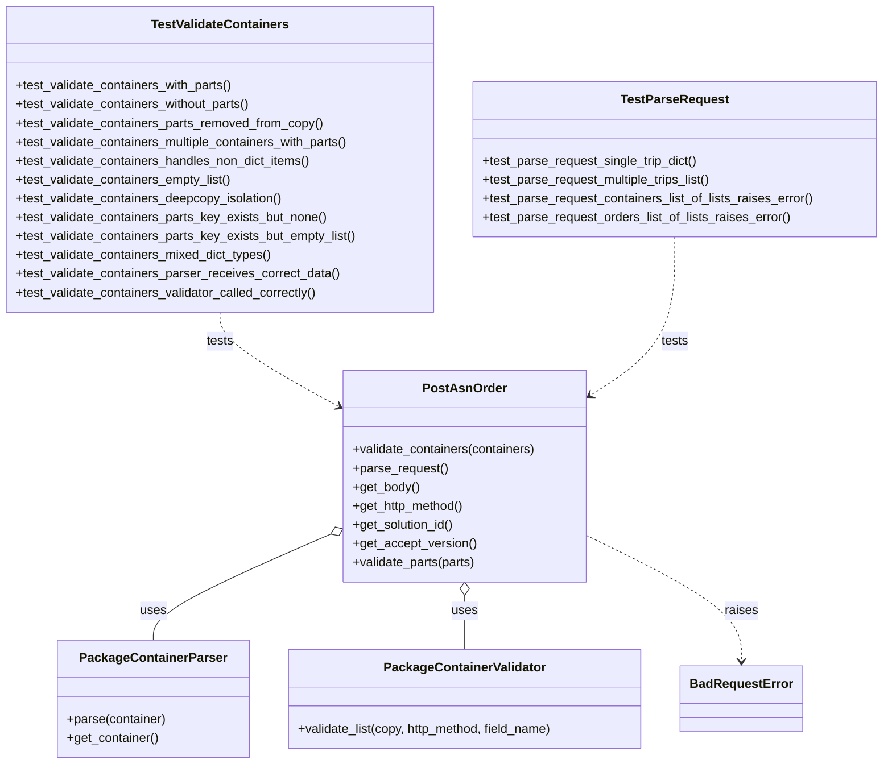

# Diagram: partview_core/partview_service/partview_service/tests/unit/api/public/test_PostFullOrder.py


> Auto-generated by Obscura crawlers

## Diagram 1



### SVG

<svg id="container" width="1129.578125" xmlns="http://www.w3.org/2000/svg" class="classDiagram" height="974" viewBox="0 0 1129.578125 974" role="graphics-document document" aria-roledescription="class"><style>#container{font-family:"trebuchet ms",verdana,arial,sans-serif;font-size:16px;fill:#333;}@keyframes edge-animation-frame{from{stroke-dashoffset:0;}}@keyframes dash{to{stroke-dashoffset:0;}}#container .edge-animation-slow{stroke-dasharray:9,5!important;stroke-dashoffset:900;animation:dash 50s linear infinite;stroke-linecap:round;}#container .edge-animation-fast{stroke-dasharray:9,5!important;stroke-dashoffset:900;animation:dash 20s linear infinite;stroke-linecap:round;}#container .error-icon{fill:#552222;}#container .error-text{fill:#552222;stroke:#552222;}#container .edge-thickness-normal{stroke-width:1px;}#container .edge-thickness-thick{stroke-width:3.5px;}#container .edge-pattern-solid{stroke-dasharray:0;}#container .edge-thickness-invisible{stroke-width:0;fill:none;}#container .edge-pattern-dashed{stroke-dasharray:3;}#container .edge-pattern-dotted{stroke-dasharray:2;}#container .marker{fill:#333333;stroke:#333333;}#container .marker.cross{stroke:#333333;}#container svg{font-family:"trebuchet ms",verdana,arial,sans-serif;font-size:16px;}#container p{margin:0;}#container g.classGroup text{fill:#9370DB;stroke:none;font-family:"trebuchet ms",verdana,arial,sans-serif;font-size:10px;}#container g.classGroup text .title{font-weight:bolder;}#container .nodeLabel,#container .edgeLabel{color:#131300;}#container .edgeLabel .label rect{fill:#ECECFF;}#container .label text{fill:#131300;}#container .labelBkg{background:#ECECFF;}#container .edgeLabel .label span{background:#ECECFF;}#container .classTitle{font-weight:bolder;}#container .node rect,#container .node circle,#container .node ellipse,#container .node polygon,#container .node path{fill:#ECECFF;stroke:#9370DB;stroke-width:1px;}#container .divider{stroke:#9370DB;stroke-width:1;}#container g.clickable{cursor:pointer;}#container g.classGroup rect{fill:#ECECFF;stroke:#9370DB;}#container g.classGroup line{stroke:#9370DB;stroke-width:1;}#container .classLabel .box{stroke:none;stroke-width:0;fill:#ECECFF;opacity:0.5;}#container .classLabel .label{fill:#9370DB;font-size:10px;}#container .relation{stroke:#333333;stroke-width:1;fill:none;}#container .dashed-line{stroke-dasharray:3;}#container .dotted-line{stroke-dasharray:1 2;}#container #compositionStart,#container .composition{fill:#333333!important;stroke:#333333!important;stroke-width:1;}#container #compositionEnd,#container .composition{fill:#333333!important;stroke:#333333!important;stroke-width:1;}#container #dependencyStart,#container .dependency{fill:#333333!important;stroke:#333333!important;stroke-width:1;}#container #dependencyStart,#container .dependency{fill:#333333!important;stroke:#333333!important;stroke-width:1;}#container #extensionStart,#container .extension{fill:transparent!important;stroke:#333333!important;stroke-width:1;}#container #extensionEnd,#container .extension{fill:transparent!important;stroke:#333333!important;stroke-width:1;}#container #aggregationStart,#container .aggregation{fill:transparent!important;stroke:#333333!important;stroke-width:1;}#container #aggregationEnd,#container .aggregation{fill:transparent!important;stroke:#333333!important;stroke-width:1;}#container #lollipopStart,#container .lollipop{fill:#ECECFF!important;stroke:#333333!important;stroke-width:1;}#container #lollipopEnd,#container .lollipop{fill:#ECECFF!important;stroke:#333333!important;stroke-width:1;}#container .edgeTerminals{font-size:11px;line-height:initial;}#container .classTitleText{text-anchor:middle;font-size:18px;fill:#333;}#container .label-icon{display:inline-block;height:1em;overflow:visible;vertical-align:-0.125em;}#container .node .label-icon path{fill:currentColor;stroke:revert;stroke-width:revert;}#container :root{--mermaid-font-family:"trebuchet ms",verdana,arial,sans-serif;}</style><g><defs><marker id="container_class-aggregationStart" class="marker aggregation class" refX="18" refY="7" markerWidth="190" markerHeight="240" orient="auto"><path d="M 18,7 L9,13 L1,7 L9,1 Z"></path></marker></defs><defs><marker id="container_class-aggregationEnd" class="marker aggregation class" refX="1" refY="7" markerWidth="20" markerHeight="28" orient="auto"><path d="M 18,7 L9,13 L1,7 L9,1 Z"></path></marker></defs><defs><marker id="container_class-extensionStart" class="marker extension class" refX="18" refY="7" markerWidth="190" markerHeight="240" orient="auto"><path d="M 1,7 L18,13 V 1 Z"></path></marker></defs><defs><marker id="container_class-extensionEnd" class="marker extension class" refX="1" refY="7" markerWidth="20" markerHeight="28" orient="auto"><path d="M 1,1 V 13 L18,7 Z"></path></marker></defs><defs><marker id="container_class-compositionStart" class="marker composition class" refX="18" refY="7" markerWidth="190" markerHeight="240" orient="auto"><path d="M 18,7 L9,13 L1,7 L9,1 Z"></path></marker></defs><defs><marker id="container_class-compositionEnd" class="marker composition class" refX="1" refY="7" markerWidth="20" markerHeight="28" orient="auto"><path d="M 18,7 L9,13 L1,7 L9,1 Z"></path></marker></defs><defs><marker id="container_class-dependencyStart" class="marker dependency class" refX="6" refY="7" markerWidth="190" markerHeight="240" orient="auto"><path d="M 5,7 L9,13 L1,7 L9,1 Z"></path></marker></defs><defs><marker id="container_class-dependencyEnd" class="marker dependency class" refX="13" refY="7" markerWidth="20" markerHeight="28" orient="auto"><path d="M 18,7 L9,13 L14,7 L9,1 Z"></path></marker></defs><defs><marker id="container_class-lollipopStart" class="marker lollipop class" refX="13" refY="7" markerWidth="190" markerHeight="240" orient="auto"><circle stroke="black" fill="transparent" cx="7" cy="7" r="6"></circle></marker></defs><defs><marker id="container_class-lollipopEnd" class="marker lollipop class" refX="1" refY="7" markerWidth="190" markerHeight="240" orient="auto"><circle stroke="black" fill="transparent" cx="7" cy="7" r="6"></circle></marker></defs><g class="root"><g class="clusters"></g><g class="edgePaths"><path d="M424.261,681.128L386.566,697.44C348.872,713.752,273.484,746.376,235.79,768.855C198.096,791.333,198.096,803.667,198.096,809.833L198.096,816" id="id_PostAsnOrder_PackageContainerParser_1" class="edge-thickness-normal edge-pattern-solid relation" style=";;;" data-edge="true" data-et="edge" data-id="id_PostAsnOrder_PackageContainerParser_1" data-points="W3sieCI6NDQwLjA5MTc5Njg3NSwieSI6Njc0LjI3NjkzMzY2MDkzMzd9LHsieCI6MTk4LjA5NTcwMzEyNSwieSI6Nzc5fSx7IngiOjE5OC4wOTU3MDMxMjUsInkiOjgxNn1d" marker-start="url(#container_class-aggregationStart)"></path><path d="M595.557,759.25L595.557,762.542C595.557,765.833,595.557,772.417,595.557,783.875C595.557,795.333,595.557,811.667,595.557,819.833L595.557,828" id="id_PostAsnOrder_PackageContainerValidator_2" class="edge-thickness-normal edge-pattern-solid relation" style=";;;" data-edge="true" data-et="edge" data-id="id_PostAsnOrder_PackageContainerValidator_2" data-points="W3sieCI6NTk1LjU1NjY0MDYyNSwieSI6NzQyfSx7IngiOjU5NS41NTY2NDA2MjUsInkiOjc3OX0seyJ4Ijo1OTUuNTU2NjQwNjI1LCJ5Ijo4Mjh9XQ==" marker-start="url(#container_class-aggregationStart)"></path><path d="M751.021,683.081L783.688,699.068C816.355,715.054,881.688,747.027,914.355,773.68C947.021,800.333,947.021,821.667,947.021,832.333L947.021,843" id="id_PostAsnOrder_BadRequestError_3" class="edge-thickness-normal edge-pattern-dashed relation" style=";;;" data-edge="true" data-et="edge" data-id="id_PostAsnOrder_BadRequestError_3" data-points="W3sieCI6NzUxLjAyMTQ4NDM3NSwieSI6NjgzLjA4MTQ0NDg0NTc5MDV9LHsieCI6OTQ3LjAyMTQ4NDM3NSwieSI6Nzc5fSx7IngiOjk0Ny4wMjE0ODQzNzUsInkiOjg0OX1d" marker-end="url(#container_class-dependencyEnd)"></path><path d="M281.664,398L281.664,404.167C281.664,410.333,281.664,422.667,307.192,442.821C332.719,462.976,383.775,490.952,409.302,504.94L434.83,518.929" id="id_TestValidateContainers_PostAsnOrder_4" class="edge-thickness-normal edge-pattern-dashed relation" style=";;;" data-edge="true" data-et="edge" data-id="id_TestValidateContainers_PostAsnOrder_4" data-points="W3sieCI6MjgxLjY2NDA2MjUsInkiOjM5OH0seyJ4IjoyODEuNjY0MDYyNSwieSI6NDM1fSx7IngiOjQ0MC4wOTE3OTY4NzUsInkiOjUyMS44MTE3NzAwNDk3MTZ9XQ==" marker-end="url(#container_class-dependencyEnd)"></path><path d="M863.453,302L863.453,324.167C863.453,346.333,863.453,390.667,845.556,424.324C827.659,457.981,791.865,480.963,773.968,492.453L756.07,503.944" id="id_TestParseRequest_PostAsnOrder_5" class="edge-thickness-normal edge-pattern-dashed relation" style=";;;" data-edge="true" data-et="edge" data-id="id_TestParseRequest_PostAsnOrder_5" data-points="W3sieCI6ODYzLjQ1MzEyNSwieSI6MzAyfSx7IngiOjg2My40NTMxMjUsInkiOjQzNX0seyJ4Ijo3NTEuMDIxNDg0Mzc1LCJ5Ijo1MDcuMTg1NTAxOTIxMDcyfV0=" marker-end="url(#container_class-dependencyEnd)"></path></g><g class="edgeLabels"><g class="edgeLabel" transform="translate(198.095703125, 779)"><g class="label" data-id="id_PostAsnOrder_PackageContainerParser_1" transform="translate(-16.4921875, -12)"><foreignObject width="32.984375" height="24"><div xmlns="http://www.w3.org/1999/xhtml" class="labelBkg" style="display: table-cell; white-space: nowrap; line-height: 1.5; max-width: 200px; text-align: center;"><span class="edgeLabel"><p>uses</p></span></div></foreignObject></g></g><g class="edgeLabel" transform="translate(595.556640625, 779)"><g class="label" data-id="id_PostAsnOrder_PackageContainerValidator_2" transform="translate(-16.4921875, -12)"><foreignObject width="32.984375" height="24"><div xmlns="http://www.w3.org/1999/xhtml" class="labelBkg" style="display: table-cell; white-space: nowrap; line-height: 1.5; max-width: 200px; text-align: center;"><span class="edgeLabel"><p>uses</p></span></div></foreignObject></g></g><g class="edgeLabel" transform="translate(947.021484375, 779)"><g class="label" data-id="id_PostAsnOrder_BadRequestError_3" transform="translate(-21.25, -12)"><foreignObject width="42.5" height="24"><div xmlns="http://www.w3.org/1999/xhtml" class="labelBkg" style="display: table-cell; white-space: nowrap; line-height: 1.5; max-width: 200px; text-align: center;"><span class="edgeLabel"><p>raises</p></span></div></foreignObject></g></g><g class="edgeLabel" transform="translate(281.6640625, 435)"><g class="label" data-id="id_TestValidateContainers_PostAsnOrder_4" transform="translate(-17.4921875, -12)"><foreignObject width="34.984375" height="24"><div xmlns="http://www.w3.org/1999/xhtml" class="labelBkg" style="display: table-cell; white-space: nowrap; line-height: 1.5; max-width: 200px; text-align: center;"><span class="edgeLabel"><p>tests</p></span></div></foreignObject></g></g><g class="edgeLabel" transform="translate(863.453125, 435)"><g class="label" data-id="id_TestParseRequest_PostAsnOrder_5" transform="translate(-17.4921875, -12)"><foreignObject width="34.984375" height="24"><div xmlns="http://www.w3.org/1999/xhtml" class="labelBkg" style="display: table-cell; white-space: nowrap; line-height: 1.5; max-width: 200px; text-align: center;"><span class="edgeLabel"><p>tests</p></span></div></foreignObject></g></g></g><g class="nodes"><g class="node default" id="classId-PostAsnOrder-0" transform="translate(595.556640625, 607)"><g class="basic label-container"><path d="M-155.46484375 -135 L155.46484375 -135 L155.46484375 135 L-155.46484375 135" stroke="none" stroke-width="0" fill="#ECECFF" style=""></path><path d="M-155.46484375 -135 C-74.10347460400031 -135, 7.257894541999377 -135, 155.46484375 -135 M-155.46484375 -135 C-74.45511941811233 -135, 6.554604913775336 -135, 155.46484375 -135 M155.46484375 -135 C155.46484375 -62.00868640092668, 155.46484375 10.982627198146645, 155.46484375 135 M155.46484375 -135 C155.46484375 -48.43942064619645, 155.46484375 38.121158707607094, 155.46484375 135 M155.46484375 135 C73.94663392537115 135, -7.571575899257709 135, -155.46484375 135 M155.46484375 135 C87.88297689774886 135, 20.301110045497722 135, -155.46484375 135 M-155.46484375 135 C-155.46484375 78.9093652874341, -155.46484375 22.818730574868212, -155.46484375 -135 M-155.46484375 135 C-155.46484375 68.18484772405267, -155.46484375 1.3696954481053467, -155.46484375 -135" stroke="#9370DB" stroke-width="1.3" fill="none" stroke-dasharray="0 0" style=""></path></g><g class="annotation-group text" transform="translate(0, -111)"></g><g class="label-group text" transform="translate(-50.3046875, -111)"><g class="label" style="font-weight: bolder" transform="translate(0,-12)"><foreignObject width="100.609375" height="24"><div xmlns="http://www.w3.org/1999/xhtml" style="display: table-cell; white-space: nowrap; line-height: 1.5; max-width: 149px; text-align: center;"><span class="nodeLabel markdown-node-label" style=""><p>PostAsnOrder</p></span></div></foreignObject></g></g><g class="members-group text" transform="translate(-143.46484375, -63)"></g><g class="methods-group text" transform="translate(-143.46484375, -33)"><g class="label" style="" transform="translate(0,-12)"><foreignObject width="236.625" height="24"><div xmlns="http://www.w3.org/1999/xhtml" style="display: table-cell; white-space: nowrap; line-height: 1.5; max-width: 294px; text-align: center;"><span class="nodeLabel markdown-node-label" style=""><p>+validate_containers(containers)</p></span></div></foreignObject></g><g class="label" style="" transform="translate(0,12)"><foreignObject width="121.796875" height="24"><div xmlns="http://www.w3.org/1999/xhtml" style="display: table-cell; white-space: nowrap; line-height: 1.5; max-width: 179px; text-align: center;"><span class="nodeLabel markdown-node-label" style=""><p>+parse_request()</p></span></div></foreignObject></g><g class="label" style="" transform="translate(0,36)"><foreignObject width="85.53125" height="24"><div xmlns="http://www.w3.org/1999/xhtml" style="display: table-cell; white-space: nowrap; line-height: 1.5; max-width: 143px; text-align: center;"><span class="nodeLabel markdown-node-label" style=""><p>+get_body()</p></span></div></foreignObject></g><g class="label" style="" transform="translate(0,60)"><foreignObject width="144.171875" height="24"><div xmlns="http://www.w3.org/1999/xhtml" style="display: table-cell; white-space: nowrap; line-height: 1.5; max-width: 202px; text-align: center;"><span class="nodeLabel markdown-node-label" style=""><p>+get_http_method()</p></span></div></foreignObject></g><g class="label" style="" transform="translate(0,84)"><foreignObject width="131.46875" height="24"><div xmlns="http://www.w3.org/1999/xhtml" style="display: table-cell; white-space: nowrap; line-height: 1.5; max-width: 189px; text-align: center;"><span class="nodeLabel markdown-node-label" style=""><p>+get_solution_id()</p></span></div></foreignObject></g><g class="label" style="" transform="translate(0,108)"><foreignObject width="157.28125" height="24"><div xmlns="http://www.w3.org/1999/xhtml" style="display: table-cell; white-space: nowrap; line-height: 1.5; max-width: 215px; text-align: center;"><span class="nodeLabel markdown-node-label" style=""><p>+get_accept_version()</p></span></div></foreignObject></g><g class="label" style="" transform="translate(0,132)"><foreignObject width="159.03125" height="24"><div xmlns="http://www.w3.org/1999/xhtml" style="display: table-cell; white-space: nowrap; line-height: 1.5; max-width: 216px; text-align: center;"><span class="nodeLabel markdown-node-label" style=""><p>+validate_parts(parts)</p></span></div></foreignObject></g></g><g class="divider" style=""><path d="M-155.46484375 -87 C-56.53870576611773 -87, 42.38743221776454 -87, 155.46484375 -87 M-155.46484375 -87 C-37.74684482014324 -87, 79.97115410971352 -87, 155.46484375 -87" stroke="#9370DB" stroke-width="1.3" fill="none" stroke-dasharray="0 0" style=""></path></g><g class="divider" style=""><path d="M-155.46484375 -63 C-63.06322952897318 -63, 29.338384692053637 -63, 155.46484375 -63 M-155.46484375 -63 C-80.60475868802907 -63, -5.74467362605813 -63, 155.46484375 -63" stroke="#9370DB" stroke-width="1.3" fill="none" stroke-dasharray="0 0" style=""></path></g></g><g class="node default" id="classId-PackageContainerParser-1" transform="translate(198.095703125, 891)"><g class="basic label-container"><path d="M-120.27734375 -75 L120.27734375 -75 L120.27734375 75 L-120.27734375 75" stroke="none" stroke-width="0" fill="#ECECFF" style=""></path><path d="M-120.27734375 -75 C-45.076473237015165 -75, 30.12439727596967 -75, 120.27734375 -75 M-120.27734375 -75 C-49.33232429273188 -75, 21.612695164536234 -75, 120.27734375 -75 M120.27734375 -75 C120.27734375 -35.821303252010075, 120.27734375 3.3573934959798493, 120.27734375 75 M120.27734375 -75 C120.27734375 -23.510230126157055, 120.27734375 27.97953974768589, 120.27734375 75 M120.27734375 75 C51.921842535280575 75, -16.43365867943885 75, -120.27734375 75 M120.27734375 75 C36.031352868400646 75, -48.21463801319871 75, -120.27734375 75 M-120.27734375 75 C-120.27734375 36.89404671268427, -120.27734375 -1.2119065746314561, -120.27734375 -75 M-120.27734375 75 C-120.27734375 29.36798555882546, -120.27734375 -16.26402888234908, -120.27734375 -75" stroke="#9370DB" stroke-width="1.3" fill="none" stroke-dasharray="0 0" style=""></path></g><g class="annotation-group text" transform="translate(0, -51)"></g><g class="label-group text" transform="translate(-88.8203125, -51)"><g class="label" style="font-weight: bolder" transform="translate(0,-12)"><foreignObject width="177.640625" height="24"><div xmlns="http://www.w3.org/1999/xhtml" style="display: table-cell; white-space: nowrap; line-height: 1.5; max-width: 225px; text-align: center;"><span class="nodeLabel markdown-node-label" style=""><p>PackageContainerParser</p></span></div></foreignObject></g></g><g class="members-group text" transform="translate(-108.27734375, -3)"></g><g class="methods-group text" transform="translate(-108.27734375, 27)"><g class="label" style="" transform="translate(0,-12)"><foreignObject width="127.734375" height="24"><div xmlns="http://www.w3.org/1999/xhtml" style="display: table-cell; white-space: nowrap; line-height: 1.5; max-width: 185px; text-align: center;"><span class="nodeLabel markdown-node-label" style=""><p>+parse(container)</p></span></div></foreignObject></g><g class="label" style="" transform="translate(0,12)"><foreignObject width="118.125" height="24"><div xmlns="http://www.w3.org/1999/xhtml" style="display: table-cell; white-space: nowrap; line-height: 1.5; max-width: 175px; text-align: center;"><span class="nodeLabel markdown-node-label" style=""><p>+get_container()</p></span></div></foreignObject></g></g><g class="divider" style=""><path d="M-120.27734375 -27 C-67.18526495634215 -27, -14.093186162684304 -27, 120.27734375 -27 M-120.27734375 -27 C-36.36848149969629 -27, 47.540380750607426 -27, 120.27734375 -27" stroke="#9370DB" stroke-width="1.3" fill="none" stroke-dasharray="0 0" style=""></path></g><g class="divider" style=""><path d="M-120.27734375 -3 C-62.12165010381465 -3, -3.9659564576293036 -3, 120.27734375 -3 M-120.27734375 -3 C-24.499192446202073 -3, 71.27895885759585 -3, 120.27734375 -3" stroke="#9370DB" stroke-width="1.3" fill="none" stroke-dasharray="0 0" style=""></path></g></g><g class="node default" id="classId-PackageContainerValidator-2" transform="translate(595.556640625, 891)"><g class="basic label-container"><path d="M-227.18359375 -63 L227.18359375 -63 L227.18359375 63 L-227.18359375 63" stroke="none" stroke-width="0" fill="#ECECFF" style=""></path><path d="M-227.18359375 -63 C-132.0992182291722 -63, -37.01484270834442 -63, 227.18359375 -63 M-227.18359375 -63 C-101.36173571257935 -63, 24.460122324841308 -63, 227.18359375 -63 M227.18359375 -63 C227.18359375 -37.161141599556586, 227.18359375 -11.322283199113166, 227.18359375 63 M227.18359375 -63 C227.18359375 -27.534776179191518, 227.18359375 7.930447641616965, 227.18359375 63 M227.18359375 63 C79.91670124203753 63, -67.35019126592493 63, -227.18359375 63 M227.18359375 63 C130.13505446386108 63, 33.08651517772219 63, -227.18359375 63 M-227.18359375 63 C-227.18359375 34.60795729910711, -227.18359375 6.215914598214219, -227.18359375 -63 M-227.18359375 63 C-227.18359375 18.875231380474432, -227.18359375 -25.249537239051136, -227.18359375 -63" stroke="#9370DB" stroke-width="1.3" fill="none" stroke-dasharray="0 0" style=""></path></g><g class="annotation-group text" transform="translate(0, -39)"></g><g class="label-group text" transform="translate(-98.6328125, -39)"><g class="label" style="font-weight: bolder" transform="translate(0,-12)"><foreignObject width="197.265625" height="24"><div xmlns="http://www.w3.org/1999/xhtml" style="display: table-cell; white-space: nowrap; line-height: 1.5; max-width: 245px; text-align: center;"><span class="nodeLabel markdown-node-label" style=""><p>PackageContainerValidator</p></span></div></foreignObject></g></g><g class="members-group text" transform="translate(-215.18359375, 9)"></g><g class="methods-group text" transform="translate(-215.18359375, 39)"><g class="label" style="" transform="translate(0,-12)"><foreignObject width="331.734375" height="24"><div xmlns="http://www.w3.org/1999/xhtml" style="display: table-cell; white-space: nowrap; line-height: 1.5; max-width: 389px; text-align: center;"><span class="nodeLabel markdown-node-label" style=""><p>+validate_list(copy, http_method, field_name)</p></span></div></foreignObject></g></g><g class="divider" style=""><path d="M-227.18359375 -15 C-123.34839835152732 -15, -19.513202953054645 -15, 227.18359375 -15 M-227.18359375 -15 C-54.92226611594262 -15, 117.33906151811476 -15, 227.18359375 -15" stroke="#9370DB" stroke-width="1.3" fill="none" stroke-dasharray="0 0" style=""></path></g><g class="divider" style=""><path d="M-227.18359375 9 C-104.40784851521211 9, 18.367896719575782 9, 227.18359375 9 M-227.18359375 9 C-49.079835968659324 9, 129.02392181268135 9, 227.18359375 9" stroke="#9370DB" stroke-width="1.3" fill="none" stroke-dasharray="0 0" style=""></path></g></g><g class="node default" id="classId-BadRequestError-3" transform="translate(947.021484375, 891)"><g class="basic label-container"><path d="M-74.28125 -42 L74.28125 -42 L74.28125 42 L-74.28125 42" stroke="none" stroke-width="0" fill="#ECECFF" style=""></path><path d="M-74.28125 -42 C-16.372981195964357 -42, 41.535287608071286 -42, 74.28125 -42 M-74.28125 -42 C-27.67464567895928 -42, 18.93195864208144 -42, 74.28125 -42 M74.28125 -42 C74.28125 -16.935083310295475, 74.28125 8.12983337940905, 74.28125 42 M74.28125 -42 C74.28125 -8.95698792635504, 74.28125 24.08602414728992, 74.28125 42 M74.28125 42 C30.691923532593506 42, -12.897402934812987 42, -74.28125 42 M74.28125 42 C29.356136124626232 42, -15.568977750747536 42, -74.28125 42 M-74.28125 42 C-74.28125 19.11497448446596, -74.28125 -3.7700510310680784, -74.28125 -42 M-74.28125 42 C-74.28125 11.107925385102998, -74.28125 -19.784149229794004, -74.28125 -42" stroke="#9370DB" stroke-width="1.3" fill="none" stroke-dasharray="0 0" style=""></path></g><g class="annotation-group text" transform="translate(0, -18)"></g><g class="label-group text" transform="translate(-62.28125, -18)"><g class="label" style="font-weight: bolder" transform="translate(0,-12)"><foreignObject width="124.5625" height="24"><div xmlns="http://www.w3.org/1999/xhtml" style="display: table-cell; white-space: nowrap; line-height: 1.5; max-width: 174px; text-align: center;"><span class="nodeLabel markdown-node-label" style=""><p>BadRequestError</p></span></div></foreignObject></g></g><g class="members-group text" transform="translate(-62.28125, 30)"></g><g class="methods-group text" transform="translate(-62.28125, 60)"></g><g class="divider" style=""><path d="M-74.28125 6 C-26.149019399520476 6, 21.983211200959047 6, 74.28125 6 M-74.28125 6 C-25.801637329732962 6, 22.677975340534076 6, 74.28125 6" stroke="#9370DB" stroke-width="1.3" fill="none" stroke-dasharray="0 0" style=""></path></g><g class="divider" style=""><path d="M-74.28125 24 C-44.14413247897866 24, -14.007014957957317 24, 74.28125 24 M-74.28125 24 C-27.873706798350966 24, 18.533836403298068 24, 74.28125 24" stroke="#9370DB" stroke-width="1.3" fill="none" stroke-dasharray="0 0" style=""></path></g></g><g class="node default" id="classId-TestValidateContainers-4" transform="translate(281.6640625, 203)"><g class="basic label-container"><path d="M-273.6640625 -195 L273.6640625 -195 L273.6640625 195 L-273.6640625 195" stroke="none" stroke-width="0" fill="#ECECFF" style=""></path><path d="M-273.6640625 -195 C-155.66407627036713 -195, -37.664090040734266 -195, 273.6640625 -195 M-273.6640625 -195 C-153.0677782607185 -195, -32.471494021437024 -195, 273.6640625 -195 M273.6640625 -195 C273.6640625 -45.82151115912464, 273.6640625 103.35697768175072, 273.6640625 195 M273.6640625 -195 C273.6640625 -80.3859129591295, 273.6640625 34.228174081741, 273.6640625 195 M273.6640625 195 C153.2941760328057 195, 32.92428956561136 195, -273.6640625 195 M273.6640625 195 C104.84835265336443 195, -63.96735719327114 195, -273.6640625 195 M-273.6640625 195 C-273.6640625 75.28568221925318, -273.6640625 -44.42863556149365, -273.6640625 -195 M-273.6640625 195 C-273.6640625 75.91434119099229, -273.6640625 -43.17131761801542, -273.6640625 -195" stroke="#9370DB" stroke-width="1.3" fill="none" stroke-dasharray="0 0" style=""></path></g><g class="annotation-group text" transform="translate(0, -171)"></g><g class="label-group text" transform="translate(-84.34375, -171)"><g class="label" style="font-weight: bolder" transform="translate(0,-12)"><foreignObject width="168.6875" height="24"><div xmlns="http://www.w3.org/1999/xhtml" style="display: table-cell; white-space: nowrap; line-height: 1.5; max-width: 216px; text-align: center;"><span class="nodeLabel markdown-node-label" style=""><p>TestValidateContainers</p></span></div></foreignObject></g></g><g class="members-group text" transform="translate(-261.6640625, -123)"></g><g class="methods-group text" transform="translate(-261.6640625, -93)"><g class="label" style="" transform="translate(0,-12)"><foreignObject width="280.234375" height="24"><div xmlns="http://www.w3.org/1999/xhtml" style="display: table-cell; white-space: nowrap; line-height: 1.5; max-width: 338px; text-align: center;"><span class="nodeLabel markdown-node-label" style=""><p>+test_validate_containers_with_parts()</p></span></div></foreignObject></g><g class="label" style="" transform="translate(0,12)"><foreignObject width="304.671875" height="24"><div xmlns="http://www.w3.org/1999/xhtml" style="display: table-cell; white-space: nowrap; line-height: 1.5; max-width: 362px; text-align: center;"><span class="nodeLabel markdown-node-label" style=""><p>+test_validate_containers_without_parts()</p></span></div></foreignObject></g><g class="label" style="" transform="translate(0,36)"><foreignObject width="396.703125" height="24"><div xmlns="http://www.w3.org/1999/xhtml" style="display: table-cell; white-space: nowrap; line-height: 1.5; max-width: 454px; text-align: center;"><span class="nodeLabel markdown-node-label" style=""><p>+test_validate_containers_parts_removed_from_copy()</p></span></div></foreignObject></g><g class="label" style="" transform="translate(0,60)"><foreignObject width="433.171875" height="24"><div xmlns="http://www.w3.org/1999/xhtml" style="display: table-cell; white-space: nowrap; line-height: 1.5; max-width: 491px; text-align: center;"><span class="nodeLabel markdown-node-label" style=""><p>+test_validate_containers_multiple_containers_with_parts()</p></span></div></foreignObject></g><g class="label" style="" transform="translate(0,84)"><foreignObject width="381.328125" height="24"><div xmlns="http://www.w3.org/1999/xhtml" style="display: table-cell; white-space: nowrap; line-height: 1.5; max-width: 439px; text-align: center;"><span class="nodeLabel markdown-node-label" style=""><p>+test_validate_containers_handles_non_dict_items()</p></span></div></foreignObject></g><g class="label" style="" transform="translate(0,108)"><foreignObject width="278.9375" height="24"><div xmlns="http://www.w3.org/1999/xhtml" style="display: table-cell; white-space: nowrap; line-height: 1.5; max-width: 336px; text-align: center;"><span class="nodeLabel markdown-node-label" style=""><p>+test_validate_containers_empty_list()</p></span></div></foreignObject></g><g class="label" style="" transform="translate(0,132)"><foreignObject width="345.28125" height="24"><div xmlns="http://www.w3.org/1999/xhtml" style="display: table-cell; white-space: nowrap; line-height: 1.5; max-width: 403px; text-align: center;"><span class="nodeLabel markdown-node-label" style=""><p>+test_validate_containers_deepcopy_isolation()</p></span></div></foreignObject></g><g class="label" style="" transform="translate(0,156)"><foreignObject width="400.484375" height="24"><div xmlns="http://www.w3.org/1999/xhtml" style="display: table-cell; white-space: nowrap; line-height: 1.5; max-width: 458px; text-align: center;"><span class="nodeLabel markdown-node-label" style=""><p>+test_validate_containers_parts_key_exists_but_none()</p></span></div></foreignObject></g><g class="label" style="" transform="translate(0,180)"><foreignObject width="438.984375" height="24"><div xmlns="http://www.w3.org/1999/xhtml" style="display: table-cell; white-space: nowrap; line-height: 1.5; max-width: 496px; text-align: center;"><span class="nodeLabel markdown-node-label" style=""><p>+test_validate_containers_parts_key_exists_but_empty_list()</p></span></div></foreignObject></g><g class="label" style="" transform="translate(0,204)"><foreignObject width="330.515625" height="24"><div xmlns="http://www.w3.org/1999/xhtml" style="display: table-cell; white-space: nowrap; line-height: 1.5; max-width: 388px; text-align: center;"><span class="nodeLabel markdown-node-label" style=""><p>+test_validate_containers_mixed_dict_types()</p></span></div></foreignObject></g><g class="label" style="" transform="translate(0,228)"><foreignObject width="415" height="24"><div xmlns="http://www.w3.org/1999/xhtml" style="display: table-cell; white-space: nowrap; line-height: 1.5; max-width: 472px; text-align: center;"><span class="nodeLabel markdown-node-label" style=""><p>+test_validate_containers_parser_receives_correct_data()</p></span></div></foreignObject></g><g class="label" style="" transform="translate(0,252)"><foreignObject width="389.09375" height="24"><div xmlns="http://www.w3.org/1999/xhtml" style="display: table-cell; white-space: nowrap; line-height: 1.5; max-width: 446px; text-align: center;"><span class="nodeLabel markdown-node-label" style=""><p>+test_validate_containers_validator_called_correctly()</p></span></div></foreignObject></g></g><g class="divider" style=""><path d="M-273.6640625 -147 C-154.56733228269405 -147, -35.47060206538811 -147, 273.6640625 -147 M-273.6640625 -147 C-128.76164202509153 -147, 16.140778449816935 -147, 273.6640625 -147" stroke="#9370DB" stroke-width="1.3" fill="none" stroke-dasharray="0 0" style=""></path></g><g class="divider" style=""><path d="M-273.6640625 -123 C-59.06117222516667 -123, 155.54171804966666 -123, 273.6640625 -123 M-273.6640625 -123 C-74.6843216641524 -123, 124.29541917169519 -123, 273.6640625 -123" stroke="#9370DB" stroke-width="1.3" fill="none" stroke-dasharray="0 0" style=""></path></g></g><g class="node default" id="classId-TestParseRequest-5" transform="translate(863.453125, 203)"><g class="basic label-container"><path d="M-258.125 -99 L258.125 -99 L258.125 99 L-258.125 99" stroke="none" stroke-width="0" fill="#ECECFF" style=""></path><path d="M-258.125 -99 C-111.8791565080266 -99, 34.366686983946806 -99, 258.125 -99 M-258.125 -99 C-137.48853995688492 -99, -16.852079913769842 -99, 258.125 -99 M258.125 -99 C258.125 -37.81307791351419, 258.125 23.373844172971616, 258.125 99 M258.125 -99 C258.125 -48.917166901395, 258.125 1.165666197210001, 258.125 99 M258.125 99 C55.40658670756562 99, -147.31182658486875 99, -258.125 99 M258.125 99 C64.596908810613 99, -128.931182378774 99, -258.125 99 M-258.125 99 C-258.125 38.81070783737308, -258.125 -21.37858432525384, -258.125 -99 M-258.125 99 C-258.125 31.99043787441512, -258.125 -35.01912425116976, -258.125 -99" stroke="#9370DB" stroke-width="1.3" fill="none" stroke-dasharray="0 0" style=""></path></g><g class="annotation-group text" transform="translate(0, -75)"></g><g class="label-group text" transform="translate(-65.390625, -75)"><g class="label" style="font-weight: bolder" transform="translate(0,-12)"><foreignObject width="130.78125" height="24"><div xmlns="http://www.w3.org/1999/xhtml" style="display: table-cell; white-space: nowrap; line-height: 1.5; max-width: 178px; text-align: center;"><span class="nodeLabel markdown-node-label" style=""><p>TestParseRequest</p></span></div></foreignObject></g></g><g class="members-group text" transform="translate(-246.125, -27)"></g><g class="methods-group text" transform="translate(-246.125, 3)"><g class="label" style="" transform="translate(0,-12)"><foreignObject width="277.703125" height="24"><div xmlns="http://www.w3.org/1999/xhtml" style="display: table-cell; white-space: nowrap; line-height: 1.5; max-width: 335px; text-align: center;"><span class="nodeLabel markdown-node-label" style=""><p>+test_parse_request_single_trip_dict()</p></span></div></foreignObject></g><g class="label" style="" transform="translate(0,12)"><foreignObject width="298.109375" height="24"><div xmlns="http://www.w3.org/1999/xhtml" style="display: table-cell; white-space: nowrap; line-height: 1.5; max-width: 355px; text-align: center;"><span class="nodeLabel markdown-node-label" style=""><p>+test_parse_request_multiple_trips_list()</p></span></div></foreignObject></g><g class="label" style="" transform="translate(0,36)"><foreignObject width="426.859375" height="24"><div xmlns="http://www.w3.org/1999/xhtml" style="display: table-cell; white-space: nowrap; line-height: 1.5; max-width: 484px; text-align: center;"><span class="nodeLabel markdown-node-label" style=""><p>+test_parse_request_containers_list_of_lists_raises_error()</p></span></div></foreignObject></g><g class="label" style="" transform="translate(0,60)"><foreignObject width="397.15625" height="24"><div xmlns="http://www.w3.org/1999/xhtml" style="display: table-cell; white-space: nowrap; line-height: 1.5; max-width: 455px; text-align: center;"><span class="nodeLabel markdown-node-label" style=""><p>+test_parse_request_orders_list_of_lists_raises_error()</p></span></div></foreignObject></g></g><g class="divider" style=""><path d="M-258.125 -51 C-67.10084503481991 -51, 123.92330993036018 -51, 258.125 -51 M-258.125 -51 C-74.68095091986123 -51, 108.76309816027754 -51, 258.125 -51" stroke="#9370DB" stroke-width="1.3" fill="none" stroke-dasharray="0 0" style=""></path></g><g class="divider" style=""><path d="M-258.125 -27 C-74.1775076875945 -27, 109.769984624811 -27, 258.125 -27 M-258.125 -27 C-124.14405019444749 -27, 9.836899611105025 -27, 258.125 -27" stroke="#9370DB" stroke-width="1.3" fill="none" stroke-dasharray="0 0" style=""></path></g></g></g></g></g></svg>

## Diagram 2

```mermaid
flowchart TD
    A[get_body()] --> B{body type}
    B -- dict --> C[trip = body]
    B -- list --> D[for trip in body]
    C --> E[check containers and orders]
    D --> E
    E --> F{containers is list of lists?}
    F -- yes --> G[Raise BadRequestError: "Containers should not be a list of lists"]
    F -- no --> H{orders is list of lists?}
    H -- yes --> I[Raise BadRequestError: "Orders should not be a list of lists"]
    H -- no --> J[For each container: deepcopy -> remove parts from copy -> parser.parse(copy)]
    J --> K[Instantiate PackageContainerValidator and call validate_list(copy, http_method, "containers")]
    J --> L[If parts present -> call validate_parts(original_parts)]
    K --> M[Return handler with __parsed_body_list populated]
    G --> Z[Stop]
    I --> Z
    M --> Z
```

> SVG rendering failed for this diagram.
