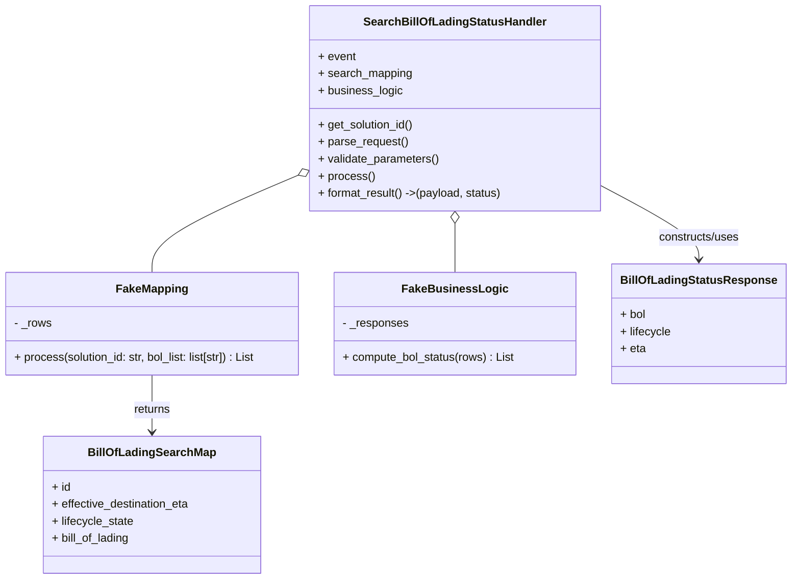
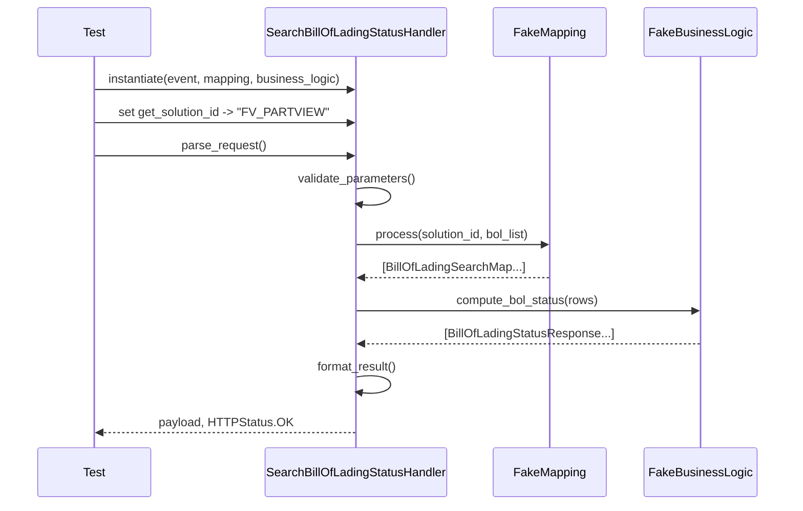

# Diagram: partview_core/partview_service/partview_service/tests/unit/api/public/test_SearchBillOfLadingStatus.py

> Auto-generated by Obscura crawlers

## Diagram 1

### SVG

<svg id="container" width="1100.8046875" xmlns="http://www.w3.org/2000/svg" class="classDiagram" height="812" viewBox="0 0 1100.8046875 812" role="graphics-document document" aria-roledescription="class"><g><defs><marker id="container_class-aggregationStart" class="marker aggregation class" refX="18" refY="7" markerWidth="190" markerHeight="240" orient="auto"><path d="M 18,7 L9,13 L1,7 L9,1 Z"></path></marker></defs><defs><marker id="container_class-aggregationEnd" class="marker aggregation class" refX="1" refY="7" markerWidth="20" markerHeight="28" orient="auto"><path d="M 18,7 L9,13 L1,7 L9,1 Z"></path></marker></defs><defs><marker id="container_class-extensionStart" class="marker extension class" refX="18" refY="7" markerWidth="190" markerHeight="240" orient="auto"><path d="M 1,7 L18,13 V 1 Z"></path></marker></defs><defs><marker id="container_class-extensionEnd" class="marker extension class" refX="1" refY="7" markerWidth="20" markerHeight="28" orient="auto"><path d="M 1,1 V 13 L18,7 Z"></path></marker></defs><defs><marker id="container_class-compositionStart" class="marker composition class" refX="18" refY="7" markerWidth="190" markerHeight="240" orient="auto"><path d="M 18,7 L9,13 L1,7 L9,1 Z"></path></marker></defs><defs><marker id="container_class-compositionEnd" class="marker composition class" refX="1" refY="7" markerWidth="20" markerHeight="28" orient="auto"><path d="M 18,7 L9,13 L1,7 L9,1 Z"></path></marker></defs><defs><marker id="container_class-dependencyStart" class="marker dependency class" refX="6" refY="7" markerWidth="190" markerHeight="240" orient="auto"><path d="M 5,7 L9,13 L1,7 L9,1 Z"></path></marker></defs><defs><marker id="container_class-dependencyEnd" class="marker dependency class" refX="13" refY="7" markerWidth="20" markerHeight="28" orient="auto"><path d="M 18,7 L9,13 L14,7 L9,1 Z"></path></marker></defs><defs><marker id="container_class-lollipopStart" class="marker lollipop class" refX="13" refY="7" markerWidth="190" markerHeight="240" orient="auto"><circle stroke="black" fill="transparent" cx="7" cy="7" r="6"></circle></marker></defs><defs><marker id="container_class-lollipopEnd" class="marker lollipop class" refX="1" refY="7" markerWidth="190" markerHeight="240" orient="auto"><circle stroke="black" fill="transparent" cx="7" cy="7" r="6"></circle></marker></defs><g class="root"><g class="clusters"></g><g class="edgePaths"><path d="M217.527,526L217.527,534.167C217.527,542.333,217.527,558.667,217.527,572C217.527,585.333,217.527,595.667,217.527,600.833L217.527,606" id="id_FakeMapping_BillOfLadingSearchMap_1" class="edge-thickness-normal edge-pattern-solid relation" style=";;;" data-edge="true" data-et="edge" data-id="id_FakeMapping_BillOfLadingSearchMap_1" data-points="W3sieCI6MjE3LjUyNzM0Mzc1LCJ5Ijo1MjZ9LHsieCI6MjE3LjUyNzM0Mzc1LCJ5Ijo1NzV9LHsieCI6MjE3LjUyNzM0Mzc1LCJ5Ijo2MTJ9XQ==" marker-end="url(#container_class-dependencyEnd)"></path><path d="M424.878,245.038L390.319,259.699C355.761,274.359,286.644,303.679,252.086,326.506C217.527,349.333,217.527,365.667,217.527,373.833L217.527,382" id="id_SearchBillOfLadingStatusHandler_FakeMapping_2" class="edge-thickness-normal edge-pattern-solid relation" style=";;;" data-edge="true" data-et="edge" data-id="id_SearchBillOfLadingStatusHandler_FakeMapping_2" data-points="W3sieCI6NDQwLjc1NzgxMjUsInkiOjIzOC4zMDE3Mzg1ODExMjAwNX0seyJ4IjoyMTcuNTI3MzQzNzUsInkiOjMzM30seyJ4IjoyMTcuNTI3MzQzNzUsInkiOjM4Mn1d" marker-start="url(#container_class-aggregationStart)"></path><path d="M644.195,313.25L644.195,316.542C644.195,319.833,644.195,326.417,644.195,337.875C644.195,349.333,644.195,365.667,644.195,373.833L644.195,382" id="id_SearchBillOfLadingStatusHandler_FakeBusinessLogic_3" class="edge-thickness-normal edge-pattern-solid relation" style=";;;" data-edge="true" data-et="edge" data-id="id_SearchBillOfLadingStatusHandler_FakeBusinessLogic_3" data-points="W3sieCI6NjQ0LjE5NTMxMjUsInkiOjI5Nn0seyJ4Ijo2NDQuMTk1MzEyNSwieSI6MzMzfSx7IngiOjY0NC4xOTUzMTI1LCJ5IjozODJ9XQ==" marker-start="url(#container_class-aggregationStart)"></path><path d="M847.633,262.619L869.206,274.349C890.779,286.079,933.924,309.54,955.497,326.436C977.07,343.333,977.07,353.667,977.07,358.833L977.07,364" id="id_SearchBillOfLadingStatusHandler_BillOfLadingStatusResponse_4" class="edge-thickness-normal edge-pattern-solid relation" style=";;;" data-edge="true" data-et="edge" data-id="id_SearchBillOfLadingStatusHandler_BillOfLadingStatusResponse_4" data-points="W3sieCI6ODQ3LjYzMjgxMjUsInkiOjI2Mi42MTg2NjMxNjE4NDc1fSx7IngiOjk3Ny4wNzAzMTI1LCJ5IjozMzN9LHsieCI6OTc3LjA3MDMxMjUsInkiOjM3MH1d" marker-end="url(#container_class-dependencyEnd)"></path></g><g class="edgeLabels"><g class="edgeLabel" transform="translate(217.52734375, 575)"><g class="label" data-id="id_FakeMapping_BillOfLadingSearchMap_1" transform="translate(-26.265625, -12)"><foreignObject width="52.53125" height="24">

returns

</foreignObject></g></g><g class="edgeLabel"><g class="label" data-id="id_SearchBillOfLadingStatusHandler_FakeMapping_2" transform="translate(0, 0)"><foreignObject width="0" height="0">

</foreignObject></g></g><g class="edgeLabel"><g class="label" data-id="id_SearchBillOfLadingStatusHandler_FakeBusinessLogic_3" transform="translate(0, 0)"><foreignObject width="0" height="0">

</foreignObject></g></g><g class="edgeLabel" transform="translate(977.0703125, 333)"><g class="label" data-id="id_SearchBillOfLadingStatusHandler_BillOfLadingStatusResponse_4" transform="translate(-58.25, -12)"><foreignObject width="116.5" height="24">

constructs/uses

</foreignObject></g></g></g><g class="nodes"><g class="node default" id="classId-FakeMapping-0" transform="translate(217.52734375, 454)"><g class="basic label-container"><path d="M-209.52734375 -72 L209.52734375 -72 L209.52734375 72 L-209.52734375 72" stroke="none" stroke-width="0" fill="#ECECFF" style=""></path><path d="M-209.52734375 -72 C-123.18312449382033 -72, -36.83890523764066 -72, 209.52734375 -72 M-209.52734375 -72 C-114.1151180024767 -72, -18.70289225495341 -72, 209.52734375 -72 M209.52734375 -72 C209.52734375 -39.42415816350401, 209.52734375 -6.848316327008021, 209.52734375 72 M209.52734375 -72 C209.52734375 -33.21847117702744, 209.52734375 5.563057645945122, 209.52734375 72 M209.52734375 72 C102.89619855988005 72, -3.7349466302399037 72, -209.52734375 72 M209.52734375 72 C60.688744702918456 72, -88.14985434416309 72, -209.52734375 72 M-209.52734375 72 C-209.52734375 18.52651129543991, -209.52734375 -34.94697740912018, -209.52734375 -72 M-209.52734375 72 C-209.52734375 40.67994116788239, -209.52734375 9.35988233576478, -209.52734375 -72" stroke="#9370DB" stroke-width="1.3" fill="none" stroke-dasharray="0 0" style=""></path></g><g class="annotation-group text" transform="translate(0, -48)"></g><g class="label-group text" transform="translate(-48.0390625, -48)"><g class="label" style="font-weight: bolder" transform="translate(0,-12)"><foreignObject width="96.078125" height="24">

FakeMapping

</foreignObject></g></g><g class="members-group text" transform="translate(-197.52734375, 0)"><g class="label" style="" transform="translate(0,-12)"><foreignObject width="53" height="24">

- _rows

</foreignObject></g></g><g class="methods-group text" transform="translate(-197.52734375, 48)"><g class="label" style="" transform="translate(0,-12)"><foreignObject width="347.015625" height="24">

+ process(solution_id: str, bol_list: list[str]) : List

</foreignObject></g></g><g class="divider" style=""><path d="M-209.52734375 -24 C-109.74494322245219 -24, -9.962542694904386 -24, 209.52734375 -24 M-209.52734375 -24 C-69.78114896444362 -24, 69.96504582111277 -24, 209.52734375 -24" stroke="#9370DB" stroke-width="1.3" fill="none" stroke-dasharray="0 0" style=""></path></g><g class="divider" style=""><path d="M-209.52734375 24 C-46.70992500480193 24, 116.10749374039614 24, 209.52734375 24 M-209.52734375 24 C-59.30696885157627 24, 90.91340604684746 24, 209.52734375 24" stroke="#9370DB" stroke-width="1.3" fill="none" stroke-dasharray="0 0" style=""></path></g></g><g class="node default" id="classId-FakeBusinessLogic-1" transform="translate(644.1953125, 454)"><g class="basic label-container"><path d="M-167.140625 -72 L167.140625 -72 L167.140625 72 L-167.140625 72" stroke="none" stroke-width="0" fill="#ECECFF" style=""></path><path d="M-167.140625 -72 C-72.35992773926372 -72, 22.42076952147255 -72, 167.140625 -72 M-167.140625 -72 C-51.073553419619785 -72, 64.99351816076043 -72, 167.140625 -72 M167.140625 -72 C167.140625 -39.03814889929107, 167.140625 -6.0762977985821465, 167.140625 72 M167.140625 -72 C167.140625 -34.196439963595104, 167.140625 3.607120072809792, 167.140625 72 M167.140625 72 C64.54765734785272 72, -38.04531030429456 72, -167.140625 72 M167.140625 72 C55.42613229408548 72, -56.288360411829046 72, -167.140625 72 M-167.140625 72 C-167.140625 26.384253430243056, -167.140625 -19.231493139513887, -167.140625 -72 M-167.140625 72 C-167.140625 40.7228204008807, -167.140625 9.4456408017614, -167.140625 -72" stroke="#9370DB" stroke-width="1.3" fill="none" stroke-dasharray="0 0" style=""></path></g><g class="annotation-group text" transform="translate(0, -48)"></g><g class="label-group text" transform="translate(-67.9375, -48)"><g class="label" style="font-weight: bolder" transform="translate(0,-12)"><foreignObject width="135.875" height="24">

FakeBusinessLogic

</foreignObject></g></g><g class="members-group text" transform="translate(-155.140625, 0)"><g class="label" style="" transform="translate(0,-12)"><foreignObject width="92.796875" height="24">

- _responses

</foreignObject></g></g><g class="methods-group text" transform="translate(-155.140625, 48)"><g class="label" style="" transform="translate(0,-12)"><foreignObject width="242.34375" height="24">

+ compute_bol_status(rows) : List

</foreignObject></g></g><g class="divider" style=""><path d="M-167.140625 -24 C-63.705261309770634 -24, 39.73010238045873 -24, 167.140625 -24 M-167.140625 -24 C-72.78758460571747 -24, 21.56545578856506 -24, 167.140625 -24" stroke="#9370DB" stroke-width="1.3" fill="none" stroke-dasharray="0 0" style=""></path></g><g class="divider" style=""><path d="M-167.140625 24 C-60.564717695150534 24, 46.01118960969893 24, 167.140625 24 M-167.140625 24 C-37.501885099514624 24, 92.13685480097075 24, 167.140625 24" stroke="#9370DB" stroke-width="1.3" fill="none" stroke-dasharray="0 0" style=""></path></g></g><g class="node default" id="classId-SearchBillOfLadingStatusHandler-2" transform="translate(644.1953125, 152)"><g class="basic label-container"><path d="M-203.4375 -144 L203.4375 -144 L203.4375 144 L-203.4375 144" stroke="none" stroke-width="0" fill="#ECECFF" style=""></path><path d="M-203.4375 -144 C-72.38742262692159 -144, 58.66265474615682 -144, 203.4375 -144 M-203.4375 -144 C-105.70684198542556 -144, -7.97618397085111 -144, 203.4375 -144 M203.4375 -144 C203.4375 -37.97808146006136, 203.4375 68.04383707987728, 203.4375 144 M203.4375 -144 C203.4375 -31.45536032051072, 203.4375 81.08927935897856, 203.4375 144 M203.4375 144 C98.43793718601785 144, -6.561625627964304 144, -203.4375 144 M203.4375 144 C63.773399771482815 144, -75.89070045703437 144, -203.4375 144 M-203.4375 144 C-203.4375 62.31403836415511, -203.4375 -19.37192327168978, -203.4375 -144 M-203.4375 144 C-203.4375 81.27879507329428, -203.4375 18.557590146588552, -203.4375 -144" stroke="#9370DB" stroke-width="1.3" fill="none" stroke-dasharray="0 0" style=""></path></g><g class="annotation-group text" transform="translate(0, -120)"></g><g class="label-group text" transform="translate(-122.09375, -120)"><g class="label" style="font-weight: bolder" transform="translate(0,-12)"><foreignObject width="244.1875" height="24">

SearchBillOfLadingStatusHandler

</foreignObject></g></g><g class="members-group text" transform="translate(-191.4375, -72)"><g class="label" style="" transform="translate(0,-12)"><foreignObject width="52.5625" height="24">

+ event

</foreignObject></g><g class="label" style="" transform="translate(0,12)"><foreignObject width="131.640625" height="24">

+ search_mapping

</foreignObject></g><g class="label" style="" transform="translate(0,36)"><foreignObject width="118.1875" height="24">

+ business_logic

</foreignObject></g></g><g class="methods-group text" transform="translate(-191.4375, 24)"><g class="label" style="" transform="translate(0,-12)"><foreignObject width="135.703125" height="24">

+ get_solution_id()

</foreignObject></g><g class="label" style="" transform="translate(0,12)"><foreignObject width="126.046875" height="24">

+ parse_request()

</foreignObject></g><g class="label" style="" transform="translate(0,36)"><foreignObject width="170.953125" height="24">

+ validate_parameters()

</foreignObject></g><g class="label" style="" transform="translate(0,60)"><foreignObject width="77.96875" height="24">

+ process()

</foreignObject></g><g class="label" style="" transform="translate(0,84)"><foreignObject width="260.78125" height="24">

+ format_result() -&gt;(payload, status)

</foreignObject></g></g><g class="divider" style=""><path d="M-203.4375 -96 C-76.00680862416844 -96, 51.423882751663115 -96, 203.4375 -96 M-203.4375 -96 C-90.87423333634457 -96, 21.689033327310852 -96, 203.4375 -96" stroke="#9370DB" stroke-width="1.3" fill="none" stroke-dasharray="0 0" style=""></path></g><g class="divider" style=""><path d="M-203.4375 0 C-88.39671364444048 0, 26.644072711119037 0, 203.4375 0 M-203.4375 0 C-99.56989025205054 0, 4.297719495898917 0, 203.4375 0" stroke="#9370DB" stroke-width="1.3" fill="none" stroke-dasharray="0 0" style=""></path></g></g><g class="node default" id="classId-BillOfLadingSearchMap-3" transform="translate(217.52734375, 708)"><g class="basic label-container"><path d="M-152.78125 -96 L152.78125 -96 L152.78125 96 L-152.78125 96" stroke="none" stroke-width="0" fill="#ECECFF" style=""></path><path d="M-152.78125 -96 C-65.34869413103154 -96, 22.083861737936928 -96, 152.78125 -96 M-152.78125 -96 C-37.79852121676291 -96, 77.18420756647419 -96, 152.78125 -96 M152.78125 -96 C152.78125 -55.955420596253575, 152.78125 -15.91084119250715, 152.78125 96 M152.78125 -96 C152.78125 -22.94094608266954, 152.78125 50.11810783466092, 152.78125 96 M152.78125 96 C55.44128714830927 96, -41.89867570338146 96, -152.78125 96 M152.78125 96 C70.66278153003039 96, -11.455686939939227 96, -152.78125 96 M-152.78125 96 C-152.78125 41.950236028487105, -152.78125 -12.099527943025791, -152.78125 -96 M-152.78125 96 C-152.78125 43.08604417372587, -152.78125 -9.827911652548266, -152.78125 -96" stroke="#9370DB" stroke-width="1.3" fill="none" stroke-dasharray="0 0" style=""></path></g><g class="annotation-group text" transform="translate(0, -72)"></g><g class="label-group text" transform="translate(-84.96875, -72)"><g class="label" style="font-weight: bolder" transform="translate(0,-12)"><foreignObject width="169.9375" height="24">

BillOfLadingSearchMap

</foreignObject></g></g><g class="members-group text" transform="translate(-140.78125, -24)"><g class="label" style="" transform="translate(0,-12)"><foreignObject width="26.3125" height="24">

+ id

</foreignObject></g><g class="label" style="" transform="translate(0,12)"><foreignObject width="196.59375" height="24">

+ effective_destination_eta

</foreignObject></g><g class="label" style="" transform="translate(0,36)"><foreignObject width="115.875" height="24">

+ lifecycle_state

</foreignObject></g><g class="label" style="" transform="translate(0,60)"><foreignObject width="111.09375" height="24">

+ bill_of_lading

</foreignObject></g></g><g class="methods-group text" transform="translate(-140.78125, 96)"></g><g class="divider" style=""><path d="M-152.78125 -48 C-83.97605693066137 -48, -15.170863861322744 -48, 152.78125 -48 M-152.78125 -48 C-74.35957518106946 -48, 4.062099637861081 -48, 152.78125 -48" stroke="#9370DB" stroke-width="1.3" fill="none" stroke-dasharray="0 0" style=""></path></g><g class="divider" style=""><path d="M-152.78125 72 C-34.36825516729087 72, 84.04473966541826 72, 152.78125 72 M-152.78125 72 C-52.05287452244899 72, 48.675500955102024 72, 152.78125 72" stroke="#9370DB" stroke-width="1.3" fill="none" stroke-dasharray="0 0" style=""></path></g></g><g class="node default" id="classId-BillOfLadingStatusResponse-4" transform="translate(977.0703125, 454)"><g class="basic label-container"><path d="M-115.734375 -84 L115.734375 -84 L115.734375 84 L-115.734375 84" stroke="none" stroke-width="0" fill="#ECECFF" style=""></path><path d="M-115.734375 -84 C-47.9205537442527 -84, 19.8932675114946 -84, 115.734375 -84 M-115.734375 -84 C-34.00679453957862 -84, 47.72078592084276 -84, 115.734375 -84 M115.734375 -84 C115.734375 -41.65326582602208, 115.734375 0.693468347955843, 115.734375 84 M115.734375 -84 C115.734375 -34.240204088184704, 115.734375 15.519591823630591, 115.734375 84 M115.734375 84 C62.076174440697095 84, 8.41797388139419 84, -115.734375 84 M115.734375 84 C64.26836607154604 84, 12.802357143092095 84, -115.734375 84 M-115.734375 84 C-115.734375 50.247118057212155, -115.734375 16.49423611442431, -115.734375 -84 M-115.734375 84 C-115.734375 46.65177253866713, -115.734375 9.303545077334263, -115.734375 -84" stroke="#9370DB" stroke-width="1.3" fill="none" stroke-dasharray="0 0" style=""></path></g><g class="annotation-group text" transform="translate(0, -60)"></g><g class="label-group text" transform="translate(-103.734375, -60)"><g class="label" style="font-weight: bolder" transform="translate(0,-12)"><foreignObject width="207.46875" height="24">

BillOfLadingStatusResponse

</foreignObject></g></g><g class="members-group text" transform="translate(-103.734375, -12)"><g class="label" style="" transform="translate(0,-12)"><foreignObject width="35.765625" height="24">

+ bol

</foreignObject></g><g class="label" style="" transform="translate(0,12)"><foreignObject width="71.78125" height="24">

+ lifecycle

</foreignObject></g><g class="label" style="" transform="translate(0,36)"><foreignObject width="35.3125" height="24">

+ eta

</foreignObject></g></g><g class="methods-group text" transform="translate(-103.734375, 84)"></g><g class="divider" style=""><path d="M-115.734375 -36 C-51.34003871446426 -36, 13.054297571071487 -36, 115.734375 -36 M-115.734375 -36 C-45.196573357272925 -36, 25.34122828545415 -36, 115.734375 -36" stroke="#9370DB" stroke-width="1.3" fill="none" stroke-dasharray="0 0" style=""></path></g><g class="divider" style=""><path d="M-115.734375 60 C-46.256266482297306 60, 23.221842035405388 60, 115.734375 60 M-115.734375 60 C-33.80613398568089 60, 48.122107028638226 60, 115.734375 60" stroke="#9370DB" stroke-width="1.3" fill="none" stroke-dasharray="0 0" style=""></path></g></g></g></g></g></svg>

## Diagram 2

### SVG

<svg id="container" width="1119" xmlns="http://www.w3.org/2000/svg" height="711" viewBox="-50 -10 1119 711" role="graphics-document document" aria-roledescription="sequence"><g><rect x="865" y="625" fill="#eaeaea" stroke="#666" width="154" height="65" name="Business" rx="3" ry="3" class="actor actor-bottom"></rect><text x="942" y="657.5" dominant-baseline="central" alignment-baseline="central" class="actor actor-box" style="text-anchor: middle; font-size: 16px; font-weight: 400;"><tspan x="942" dy="0">FakeBusinessLogic</tspan></text></g><g><rect x="665" y="625" fill="#eaeaea" stroke="#666" width="150" height="65" name="Mapping" rx="3" ry="3" class="actor actor-bottom"></rect><text x="740" y="657.5" dominant-baseline="central" alignment-baseline="central" class="actor actor-box" style="text-anchor: middle; font-size: 16px; font-weight: 400;"><tspan x="740" dy="0">FakeMapping</tspan></text></g><g><rect x="329" y="625" fill="#eaeaea" stroke="#666" width="262" height="65" name="Handler" rx="3" ry="3" class="actor actor-bottom"></rect><text x="460" y="657.5" dominant-baseline="central" alignment-baseline="central" class="actor actor-box" style="text-anchor: middle; font-size: 16px; font-weight: 400;"><tspan x="460" dy="0">SearchBillOfLadingStatusHandler</tspan></text></g><g><rect x="0" y="625" fill="#eaeaea" stroke="#666" width="150" height="65" name="Test" rx="3" ry="3" class="actor actor-bottom"></rect><text x="75" y="657.5" dominant-baseline="central" alignment-baseline="central" class="actor actor-box" style="text-anchor: middle; font-size: 16px; font-weight: 400;"><tspan x="75" dy="0">Test</tspan></text></g><g><line id="actor3" x1="942" y1="65" x2="942" y2="625" class="actor-line 200" stroke-width="0.5px" stroke="#999" name="Business"></line><g id="root-3"><rect x="865" y="0" fill="#eaeaea" stroke="#666" width="154" height="65" name="Business" rx="3" ry="3" class="actor actor-top"></rect><text x="942" y="32.5" dominant-baseline="central" alignment-baseline="central" class="actor actor-box" style="text-anchor: middle; font-size: 16px; font-weight: 400;"><tspan x="942" dy="0">FakeBusinessLogic</tspan></text></g></g><g><line id="actor2" x1="740" y1="65" x2="740" y2="625" class="actor-line 200" stroke-width="0.5px" stroke="#999" name="Mapping"></line><g id="root-2"><rect x="665" y="0" fill="#eaeaea" stroke="#666" width="150" height="65" name="Mapping" rx="3" ry="3" class="actor actor-top"></rect><text x="740" y="32.5" dominant-baseline="central" alignment-baseline="central" class="actor actor-box" style="text-anchor: middle; font-size: 16px; font-weight: 400;"><tspan x="740" dy="0">FakeMapping</tspan></text></g></g><g><line id="actor1" x1="460" y1="65" x2="460" y2="625" class="actor-line 200" stroke-width="0.5px" stroke="#999" name="Handler"></line><g id="root-1"><rect x="329" y="0" fill="#eaeaea" stroke="#666" width="262" height="65" name="Handler" rx="3" ry="3" class="actor actor-top"></rect><text x="460" y="32.5" dominant-baseline="central" alignment-baseline="central" class="actor actor-box" style="text-anchor: middle; font-size: 16px; font-weight: 400;"><tspan x="460" dy="0">SearchBillOfLadingStatusHandler</tspan></text></g></g><g><line id="actor0" x1="75" y1="65" x2="75" y2="625" class="actor-line 200" stroke-width="0.5px" stroke="#999" name="Test"></line><g id="root-0"><rect x="0" y="0" fill="#eaeaea" stroke="#666" width="150" height="65" name="Test" rx="3" ry="3" class="actor actor-top"></rect><text x="75" y="32.5" dominant-baseline="central" alignment-baseline="central" class="actor actor-box" style="text-anchor: middle; font-size: 16px; font-weight: 400;"><tspan x="75" dy="0">Test</tspan></text></g></g><g></g><defs><symbol id="computer" width="24" height="24"><path transform="scale(.5)" d="M2 2v13h20v-13h-20zm18 11h-16v-9h16v9zm-10.228 6l.466-1h3.524l.467 1h-4.457zm14.228 3h-24l2-6h2.104l-1.33 4h18.45l-1.297-4h2.073l2 6zm-5-10h-14v-7h14v7z"></path></symbol></defs><defs><symbol id="database" fill-rule="evenodd" clip-rule="evenodd"><path transform="scale(.5)" d="M12.258.001l.256.004.255.005.253.008.251.01.249.012.247.015.246.016.242.019.241.02.239.023.236.024.233.027.231.028.229.031.225.032.223.034.22.036.217.038.214.04.211.041.208.043.205.045.201.046.198.048.194.05.191.051.187.053.183.054.18.056.175.057.172.059.168.06.163.061.16.063.155.064.15.066.074.033.073.033.071.034.07.034.069.035.068.035.067.035.066.035.064.036.064.036.062.036.06.036.06.037.058.037.058.037.055.038.055.038.053.038.052.038.051.039.05.039.048.039.047.039.045.04.044.04.043.04.041.04.04.041.039.041.037.041.036.041.034.041.033.042.032.042.03.042.029.042.027.042.026.043.024.043.023.043.021.043.02.043.018.044.017.043.015.044.013.044.012.044.011.045.009.044.007.045.006.045.004.045.002.045.001.045v17l-.001.045-.002.045-.004.045-.006.045-.007.045-.009.044-.011.045-.012.044-.013.044-.015.044-.017.043-.018.044-.02.043-.021.043-.023.043-.024.043-.026.043-.027.042-.029.042-.03.042-.032.042-.033.042-.034.041-.036.041-.037.041-.039.041-.04.041-.041.04-.043.04-.044.04-.045.04-.047.039-.048.039-.05.039-.051.039-.052.038-.053.038-.055.038-.055.038-.058.037-.058.037-.06.037-.06.036-.062.036-.064.036-.064.036-.066.035-.067.035-.068.035-.069.035-.07.034-.071.034-.073.033-.074.033-.15.066-.155.064-.16.063-.163.061-.168.06-.172.059-.175.057-.18.056-.183.054-.187.053-.191.051-.194.05-.198.048-.201.046-.205.045-.208.043-.211.041-.214.04-.217.038-.22.036-.223.034-.225.032-.229.031-.231.028-.233.027-.236.024-.239.023-.241.02-.242.019-.246.016-.247.015-.249.012-.251.01-.253.008-.255.005-.256.004-.258.001-.258-.001-.256-.004-.255-.005-.253-.008-.251-.01-.249-.012-.247-.015-.245-.016-.243-.019-.241-.02-.238-.023-.236-.024-.234-.027-.231-.028-.228-.031-.226-.032-.223-.034-.22-.036-.217-.038-.214-.04-.211-.041-.208-.043-.204-.045-.201-.046-.198-.048-.195-.05-.19-.051-.187-.053-.184-.054-.179-.056-.176-.057-.172-.059-.167-.06-.164-.061-.159-.063-.155-.064-.151-.066-.074-.033-.072-.033-.072-.034-.07-.034-.069-.035-.068-.035-.067-.035-.066-.035-.064-.036-.063-.036-.062-.036-.061-.036-.06-.037-.058-.037-.057-.037-.056-.038-.055-.038-.053-.038-.052-.038-.051-.039-.049-.039-.049-.039-.046-.039-.046-.04-.044-.04-.043-.04-.041-.04-.04-.041-.039-.041-.037-.041-.036-.041-.034-.041-.033-.042-.032-.042-.03-.042-.029-.042-.027-.042-.026-.043-.024-.043-.023-.043-.021-.043-.02-.043-.018-.044-.017-.043-.015-.044-.013-.044-.012-.044-.011-.045-.009-.044-.007-.045-.006-.045-.004-.045-.002-.045-.001-.045v-17l.001-.045.002-.045.004-.045.006-.045.007-.045.009-.044.011-.045.012-.044.013-.044.015-.044.017-.043.018-.044.02-.043.021-.043.023-.043.024-.043.026-.043.027-.042.029-.042.03-.042.032-.042.033-.042.034-.041.036-.041.037-.041.039-.041.04-.041.041-.04.043-.04.044-.04.046-.04.046-.039.049-.039.049-.039.051-.039.052-.038.053-.038.055-.038.056-.038.057-.037.058-.037.06-.037.061-.036.062-.036.063-.036.064-.036.066-.035.067-.035.068-.035.069-.035.07-.034.072-.034.072-.033.074-.033.151-.066.155-.064.159-.063.164-.061.167-.06.172-.059.176-.057.179-.056.184-.054.187-.053.19-.051.195-.05.198-.048.201-.046.204-.045.208-.043.211-.041.214-.04.217-.038.22-.036.223-.034.226-.032.228-.031.231-.028.234-.027.236-.024.238-.023.241-.02.243-.019.245-.016.247-.015.249-.012.251-.01.253-.008.255-.005.256-.004.258-.001.258.001zm-9.258 20.499v.01l.001.021.003.021.004.022.005.021.006.022.007.022.009.023.01.022.011.023.012.023.013.023.015.023.016.024.017.023.018.024.019.024.021.024.022.025.023.024.024.025.052.049.056.05.061.051.066.051.07.051.075.051.079.052.084.052.088.052.092.052.097.052.102.051.105.052.11.052.114.051.119.051.123.051.127.05.131.05.135.05.139.048.144.049.147.047.152.047.155.047.16.045.163.045.167.043.171.043.176.041.178.041.183.039.187.039.19.037.194.035.197.035.202.033.204.031.209.03.212.029.216.027.219.025.222.024.226.021.23.02.233.018.236.016.24.015.243.012.246.01.249.008.253.005.256.004.259.001.26-.001.257-.004.254-.005.25-.008.247-.011.244-.012.241-.014.237-.016.233-.018.231-.021.226-.021.224-.024.22-.026.216-.027.212-.028.21-.031.205-.031.202-.034.198-.034.194-.036.191-.037.187-.039.183-.04.179-.04.175-.042.172-.043.168-.044.163-.045.16-.046.155-.046.152-.047.148-.048.143-.049.139-.049.136-.05.131-.05.126-.05.123-.051.118-.052.114-.051.11-.052.106-.052.101-.052.096-.052.092-.052.088-.053.083-.051.079-.052.074-.052.07-.051.065-.051.06-.051.056-.05.051-.05.023-.024.023-.025.021-.024.02-.024.019-.024.018-.024.017-.024.015-.023.014-.024.013-.023.012-.023.01-.023.01-.022.008-.022.006-.022.006-.022.004-.022.004-.021.001-.021.001-.021v-4.127l-.077.055-.08.053-.083.054-.085.053-.087.052-.09.052-.093.051-.095.05-.097.05-.1.049-.102.049-.105.048-.106.047-.109.047-.111.046-.114.045-.115.045-.118.044-.12.043-.122.042-.124.042-.126.041-.128.04-.13.04-.132.038-.134.038-.135.037-.138.037-.139.035-.142.035-.143.034-.144.033-.147.032-.148.031-.15.03-.151.03-.153.029-.154.027-.156.027-.158.026-.159.025-.161.024-.162.023-.163.022-.165.021-.166.02-.167.019-.169.018-.169.017-.171.016-.173.015-.173.014-.175.013-.175.012-.177.011-.178.01-.179.008-.179.008-.181.006-.182.005-.182.004-.184.003-.184.002h-.37l-.184-.002-.184-.003-.182-.004-.182-.005-.181-.006-.179-.008-.179-.008-.178-.01-.176-.011-.176-.012-.175-.013-.173-.014-.172-.015-.171-.016-.17-.017-.169-.018-.167-.019-.166-.02-.165-.021-.163-.022-.162-.023-.161-.024-.159-.025-.157-.026-.156-.027-.155-.027-.153-.029-.151-.03-.15-.03-.148-.031-.146-.032-.145-.033-.143-.034-.141-.035-.14-.035-.137-.037-.136-.037-.134-.038-.132-.038-.13-.04-.128-.04-.126-.041-.124-.042-.122-.042-.12-.044-.117-.043-.116-.045-.113-.045-.112-.046-.109-.047-.106-.047-.105-.048-.102-.049-.1-.049-.097-.05-.095-.05-.093-.052-.09-.051-.087-.052-.085-.053-.083-.054-.08-.054-.077-.054v4.127zm0-5.654v.011l.001.021.003.021.004.021.005.022.006.022.007.022.009.022.01.022.011.023.012.023.013.023.015.024.016.023.017.024.018.024.019.024.021.024.022.024.023.025.024.024.052.05.056.05.061.05.066.051.07.051.075.052.079.051.084.052.088.052.092.052.097.052.102.052.105.052.11.051.114.051.119.052.123.05.127.051.131.05.135.049.139.049.144.048.147.048.152.047.155.046.16.045.163.045.167.044.171.042.176.042.178.04.183.04.187.038.19.037.194.036.197.034.202.033.204.032.209.03.212.028.216.027.219.025.222.024.226.022.23.02.233.018.236.016.24.014.243.012.246.01.249.008.253.006.256.003.259.001.26-.001.257-.003.254-.006.25-.008.247-.01.244-.012.241-.015.237-.016.233-.018.231-.02.226-.022.224-.024.22-.025.216-.027.212-.029.21-.03.205-.032.202-.033.198-.035.194-.036.191-.037.187-.039.183-.039.179-.041.175-.042.172-.043.168-.044.163-.045.16-.045.155-.047.152-.047.148-.048.143-.048.139-.05.136-.049.131-.05.126-.051.123-.051.118-.051.114-.052.11-.052.106-.052.101-.052.096-.052.092-.052.088-.052.083-.052.079-.052.074-.051.07-.052.065-.051.06-.05.056-.051.051-.049.023-.025.023-.024.021-.025.02-.024.019-.024.018-.024.017-.024.015-.023.014-.023.013-.024.012-.022.01-.023.01-.023.008-.022.006-.022.006-.022.004-.021.004-.022.001-.021.001-.021v-4.139l-.077.054-.08.054-.083.054-.085.052-.087.053-.09.051-.093.051-.095.051-.097.05-.1.049-.102.049-.105.048-.106.047-.109.047-.111.046-.114.045-.115.044-.118.044-.12.044-.122.042-.124.042-.126.041-.128.04-.13.039-.132.039-.134.038-.135.037-.138.036-.139.036-.142.035-.143.033-.144.033-.147.033-.148.031-.15.03-.151.03-.153.028-.154.028-.156.027-.158.026-.159.025-.161.024-.162.023-.163.022-.165.021-.166.02-.167.019-.169.018-.169.017-.171.016-.173.015-.173.014-.175.013-.175.012-.177.011-.178.009-.179.009-.179.007-.181.007-.182.005-.182.004-.184.003-.184.002h-.37l-.184-.002-.184-.003-.182-.004-.182-.005-.181-.007-.179-.007-.179-.009-.178-.009-.176-.011-.176-.012-.175-.013-.173-.014-.172-.015-.171-.016-.17-.017-.169-.018-.167-.019-.166-.02-.165-.021-.163-.022-.162-.023-.161-.024-.159-.025-.157-.026-.156-.027-.155-.028-.153-.028-.151-.03-.15-.03-.148-.031-.146-.033-.145-.033-.143-.033-.141-.035-.14-.036-.137-.036-.136-.037-.134-.038-.132-.039-.13-.039-.128-.04-.126-.041-.124-.042-.122-.043-.12-.043-.117-.044-.116-.044-.113-.046-.112-.046-.109-.046-.106-.047-.105-.048-.102-.049-.1-.049-.097-.05-.095-.051-.093-.051-.09-.051-.087-.053-.085-.052-.083-.054-.08-.054-.077-.054v4.139zm0-5.666v.011l.001.02.003.022.004.021.005.022.006.021.007.022.009.023.01.022.011.023.012.023.013.023.015.023.016.024.017.024.018.023.019.024.021.025.022.024.023.024.024.025.052.05.056.05.061.05.066.051.07.051.075.052.079.051.084.052.088.052.092.052.097.052.102.052.105.051.11.052.114.051.119.051.123.051.127.05.131.05.135.05.139.049.144.048.147.048.152.047.155.046.16.045.163.045.167.043.171.043.176.042.178.04.183.04.187.038.19.037.194.036.197.034.202.033.204.032.209.03.212.028.216.027.219.025.222.024.226.021.23.02.233.018.236.017.24.014.243.012.246.01.249.008.253.006.256.003.259.001.26-.001.257-.003.254-.006.25-.008.247-.01.244-.013.241-.014.237-.016.233-.018.231-.02.226-.022.224-.024.22-.025.216-.027.212-.029.21-.03.205-.032.202-.033.198-.035.194-.036.191-.037.187-.039.183-.039.179-.041.175-.042.172-.043.168-.044.163-.045.16-.045.155-.047.152-.047.148-.048.143-.049.139-.049.136-.049.131-.051.126-.05.123-.051.118-.052.114-.051.11-.052.106-.052.101-.052.096-.052.092-.052.088-.052.083-.052.079-.052.074-.052.07-.051.065-.051.06-.051.056-.05.051-.049.023-.025.023-.025.021-.024.02-.024.019-.024.018-.024.017-.024.015-.023.014-.024.013-.023.012-.023.01-.022.01-.023.008-.022.006-.022.006-.022.004-.022.004-.021.001-.021.001-.021v-4.153l-.077.054-.08.054-.083.053-.085.053-.087.053-.09.051-.093.051-.095.051-.097.05-.1.049-.102.048-.105.048-.106.048-.109.046-.111.046-.114.046-.115.044-.118.044-.12.043-.122.043-.124.042-.126.041-.128.04-.13.039-.132.039-.134.038-.135.037-.138.036-.139.036-.142.034-.143.034-.144.033-.147.032-.148.032-.15.03-.151.03-.153.028-.154.028-.156.027-.158.026-.159.024-.161.024-.162.023-.163.023-.165.021-.166.02-.167.019-.169.018-.169.017-.171.016-.173.015-.173.014-.175.013-.175.012-.177.01-.178.01-.179.009-.179.007-.181.006-.182.006-.182.004-.184.003-.184.001-.185.001-.185-.001-.184-.001-.184-.003-.182-.004-.182-.006-.181-.006-.179-.007-.179-.009-.178-.01-.176-.01-.176-.012-.175-.013-.173-.014-.172-.015-.171-.016-.17-.017-.169-.018-.167-.019-.166-.02-.165-.021-.163-.023-.162-.023-.161-.024-.159-.024-.157-.026-.156-.027-.155-.028-.153-.028-.151-.03-.15-.03-.148-.032-.146-.032-.145-.033-.143-.034-.141-.034-.14-.036-.137-.036-.136-.037-.134-.038-.132-.039-.13-.039-.128-.041-.126-.041-.124-.041-.122-.043-.12-.043-.117-.044-.116-.044-.113-.046-.112-.046-.109-.046-.106-.048-.105-.048-.102-.048-.1-.05-.097-.049-.095-.051-.093-.051-.09-.052-.087-.052-.085-.053-.083-.053-.08-.054-.077-.054v4.153zm8.74-8.179l-.257.004-.254.005-.25.008-.247.011-.244.012-.241.014-.237.016-.233.018-.231.021-.226.022-.224.023-.22.026-.216.027-.212.028-.21.031-.205.032-.202.033-.198.034-.194.036-.191.038-.187.038-.183.04-.179.041-.175.042-.172.043-.168.043-.163.045-.16.046-.155.046-.152.048-.148.048-.143.048-.139.049-.136.05-.131.05-.126.051-.123.051-.118.051-.114.052-.11.052-.106.052-.101.052-.096.052-.092.052-.088.052-.083.052-.079.052-.074.051-.07.052-.065.051-.06.05-.056.05-.051.05-.023.025-.023.024-.021.024-.02.025-.019.024-.018.024-.017.023-.015.024-.014.023-.013.023-.012.023-.01.023-.01.022-.008.022-.006.023-.006.021-.004.022-.004.021-.001.021-.001.021.001.021.001.021.004.021.004.022.006.021.006.023.008.022.01.022.01.023.012.023.013.023.014.023.015.024.017.023.018.024.019.024.02.025.021.024.023.024.023.025.051.05.056.05.06.05.065.051.07.052.074.051.079.052.083.052.088.052.092.052.096.052.101.052.106.052.11.052.114.052.118.051.123.051.126.051.131.05.136.05.139.049.143.048.148.048.152.048.155.046.16.046.163.045.168.043.172.043.175.042.179.041.183.04.187.038.191.038.194.036.198.034.202.033.205.032.21.031.212.028.216.027.22.026.224.023.226.022.231.021.233.018.237.016.241.014.244.012.247.011.25.008.254.005.257.004.26.001.26-.001.257-.004.254-.005.25-.008.247-.011.244-.012.241-.014.237-.016.233-.018.231-.021.226-.022.224-.023.22-.026.216-.027.212-.028.21-.031.205-.032.202-.033.198-.034.194-.036.191-.038.187-.038.183-.04.179-.041.175-.042.172-.043.168-.043.163-.045.16-.046.155-.046.152-.048.148-.048.143-.048.139-.049.136-.05.131-.05.126-.051.123-.051.118-.051.114-.052.11-.052.106-.052.101-.052.096-.052.092-.052.088-.052.083-.052.079-.052.074-.051.07-.052.065-.051.06-.05.056-.05.051-.05.023-.025.023-.024.021-.024.02-.025.019-.024.018-.024.017-.023.015-.024.014-.023.013-.023.012-.023.01-.023.01-.022.008-.022.006-.023.006-.021.004-.022.004-.021.001-.021.001-.021-.001-.021-.001-.021-.004-.021-.004-.022-.006-.021-.006-.023-.008-.022-.01-.022-.01-.023-.012-.023-.013-.023-.014-.023-.015-.024-.017-.023-.018-.024-.019-.024-.02-.025-.021-.024-.023-.024-.023-.025-.051-.05-.056-.05-.06-.05-.065-.051-.07-.052-.074-.051-.079-.052-.083-.052-.088-.052-.092-.052-.096-.052-.101-.052-.106-.052-.11-.052-.114-.052-.118-.051-.123-.051-.126-.051-.131-.05-.136-.05-.139-.049-.143-.048-.148-.048-.152-.048-.155-.046-.16-.046-.163-.045-.168-.043-.172-.043-.175-.042-.179-.041-.183-.04-.187-.038-.191-.038-.194-.036-.198-.034-.202-.033-.205-.032-.21-.031-.212-.028-.216-.027-.22-.026-.224-.023-.226-.022-.231-.021-.233-.018-.237-.016-.241-.014-.244-.012-.247-.011-.25-.008-.254-.005-.257-.004-.26-.001-.26.001z"></path></symbol></defs><defs><symbol id="clock" width="24" height="24"><path transform="scale(.5)" d="M12 2c5.514 0 10 4.486 10 10s-4.486 10-10 10-10-4.486-10-10 4.486-10 10-10zm0-2c-6.627 0-12 5.373-12 12s5.373 12 12 12 12-5.373 12-12-5.373-12-12-12zm5.848 12.459c.202.038.202.333.001.372-1.907.361-6.045 1.111-6.547 1.111-.719 0-1.301-.582-1.301-1.301 0-.512.77-5.447 1.125-7.445.034-.192.312-.181.343.014l.985 6.238 5.394 1.011z"></path></symbol></defs><defs><marker id="arrowhead" refX="7.9" refY="5" markerUnits="userSpaceOnUse" markerWidth="12" markerHeight="12" orient="auto-start-reverse"><path d="M -1 0 L 10 5 L 0 10 z"></path></marker></defs><defs><marker id="crosshead" markerWidth="15" markerHeight="8" orient="auto" refX="4" refY="4.5"><path fill="none" stroke="#000000" stroke-width="1pt" d="M 1,2 L 6,7 M 6,2 L 1,7" style="stroke-dasharray: 0, 0;"></path></marker></defs><defs><marker id="filled-head" refX="15.5" refY="7" markerWidth="20" markerHeight="28" orient="auto"><path d="M 18,7 L9,13 L14,7 L9,1 Z"></path></marker></defs><defs><marker id="sequencenumber" refX="15" refY="15" markerWidth="60" markerHeight="40" orient="auto"><circle cx="15" cy="15" r="6"></circle></marker></defs><text x="266" y="80" text-anchor="middle" dominant-baseline="middle" alignment-baseline="middle" class="messageText" dy="1em" style="font-size: 16px; font-weight: 400;">instantiate(event, mapping, business_logic)</text><line x1="76" y1="113" x2="456" y2="113" class="messageLine0" stroke-width="2" stroke="none" marker-end="url(#arrowhead)" style="fill: none;"></line><text x="266" y="128" text-anchor="middle" dominant-baseline="middle" alignment-baseline="middle" class="messageText" dy="1em" style="font-size: 16px; font-weight: 400;">set get_solution_id -&gt; "FV_PARTVIEW"</text><line x1="76" y1="161" x2="456" y2="161" class="messageLine0" stroke-width="2" stroke="none" marker-end="url(#arrowhead)" style="fill: none;"></line><text x="266" y="176" text-anchor="middle" dominant-baseline="middle" alignment-baseline="middle" class="messageText" dy="1em" style="font-size: 16px; font-weight: 400;">parse_request()</text><line x1="76" y1="209" x2="456" y2="209" class="messageLine0" stroke-width="2" stroke="none" marker-end="url(#arrowhead)" style="fill: none;"></line><text x="461" y="224" text-anchor="middle" dominant-baseline="middle" alignment-baseline="middle" class="messageText" dy="1em" style="font-size: 16px; font-weight: 400;">validate_parameters()</text><path d="M 461,257 C 521,247 521,287 461,277" class="messageLine0" stroke-width="2" stroke="none" marker-end="url(#arrowhead)" style="fill: none;"></path><text x="599" y="302" text-anchor="middle" dominant-baseline="middle" alignment-baseline="middle" class="messageText" dy="1em" style="font-size: 16px; font-weight: 400;">process(solution_id, bol_list)</text><line x1="461" y1="335" x2="736" y2="335" class="messageLine0" stroke-width="2" stroke="none" marker-end="url(#arrowhead)" style="fill: none;"></line><text x="602" y="350" text-anchor="middle" dominant-baseline="middle" alignment-baseline="middle" class="messageText" dy="1em" style="font-size: 16px; font-weight: 400;">[BillOfLadingSearchMap...]</text><line x1="739" y1="383" x2="464" y2="383" class="messageLine1" stroke-width="2" stroke="none" marker-end="url(#arrowhead)" style="stroke-dasharray: 3, 3; fill: none;"></line><text x="700" y="398" text-anchor="middle" dominant-baseline="middle" alignment-baseline="middle" class="messageText" dy="1em" style="font-size: 16px; font-weight: 400;">compute_bol_status(rows)</text><line x1="461" y1="431" x2="938" y2="431" class="messageLine0" stroke-width="2" stroke="none" marker-end="url(#arrowhead)" style="fill: none;"></line><text x="703" y="446" text-anchor="middle" dominant-baseline="middle" alignment-baseline="middle" class="messageText" dy="1em" style="font-size: 16px; font-weight: 400;">[BillOfLadingStatusResponse...]</text><line x1="941" y1="479" x2="464" y2="479" class="messageLine1" stroke-width="2" stroke="none" marker-end="url(#arrowhead)" style="stroke-dasharray: 3, 3; fill: none;"></line><text x="461" y="494" text-anchor="middle" dominant-baseline="middle" alignment-baseline="middle" class="messageText" dy="1em" style="font-size: 16px; font-weight: 400;">format_result()</text><path d="M 461,527 C 521,517 521,557 461,547" class="messageLine0" stroke-width="2" stroke="none" marker-end="url(#arrowhead)" style="fill: none;"></path><text x="269" y="572" text-anchor="middle" dominant-baseline="middle" alignment-baseline="middle" class="messageText" dy="1em" style="font-size: 16px; font-weight: 400;">payload, HTTPStatus.OK</text><line x1="459" y1="605" x2="79" y2="605" class="messageLine1" stroke-width="2" stroke="none" marker-end="url(#arrowhead)" style="stroke-dasharray: 3, 3; fill: none;"></line></svg>
