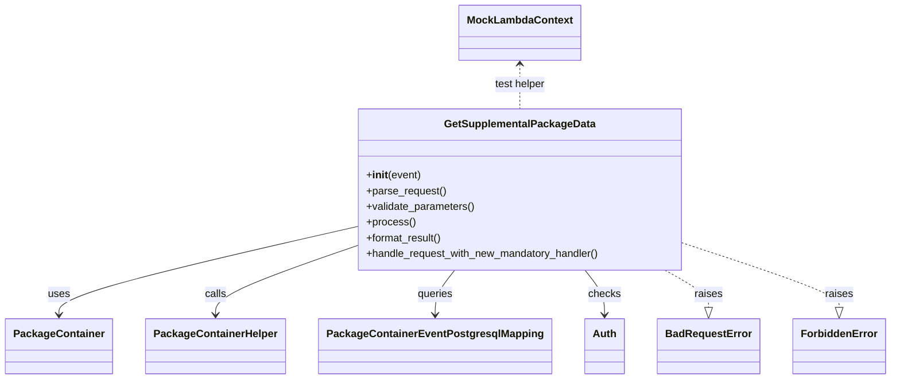

# Diagram: partview_core/partview_service/partview_service/tests/unit/api/qa_utility/test_qa_utility.py


> Auto-generated by Obscura crawlers

## Diagram 1



### SVG

<svg id="container" width="1302.25" xmlns="http://www.w3.org/2000/svg" class="classDiagram" height="578" viewBox="0 0 1302.25 578" role="graphics-document document" aria-roledescription="class"><style>#container{font-family:"trebuchet ms",verdana,arial,sans-serif;font-size:16px;fill:#333;}@keyframes edge-animation-frame{from{stroke-dashoffset:0;}}@keyframes dash{to{stroke-dashoffset:0;}}#container .edge-animation-slow{stroke-dasharray:9,5!important;stroke-dashoffset:900;animation:dash 50s linear infinite;stroke-linecap:round;}#container .edge-animation-fast{stroke-dasharray:9,5!important;stroke-dashoffset:900;animation:dash 20s linear infinite;stroke-linecap:round;}#container .error-icon{fill:#552222;}#container .error-text{fill:#552222;stroke:#552222;}#container .edge-thickness-normal{stroke-width:1px;}#container .edge-thickness-thick{stroke-width:3.5px;}#container .edge-pattern-solid{stroke-dasharray:0;}#container .edge-thickness-invisible{stroke-width:0;fill:none;}#container .edge-pattern-dashed{stroke-dasharray:3;}#container .edge-pattern-dotted{stroke-dasharray:2;}#container .marker{fill:#333333;stroke:#333333;}#container .marker.cross{stroke:#333333;}#container svg{font-family:"trebuchet ms",verdana,arial,sans-serif;font-size:16px;}#container p{margin:0;}#container g.classGroup text{fill:#9370DB;stroke:none;font-family:"trebuchet ms",verdana,arial,sans-serif;font-size:10px;}#container g.classGroup text .title{font-weight:bolder;}#container .nodeLabel,#container .edgeLabel{color:#131300;}#container .edgeLabel .label rect{fill:#ECECFF;}#container .label text{fill:#131300;}#container .labelBkg{background:#ECECFF;}#container .edgeLabel .label span{background:#ECECFF;}#container .classTitle{font-weight:bolder;}#container .node rect,#container .node circle,#container .node ellipse,#container .node polygon,#container .node path{fill:#ECECFF;stroke:#9370DB;stroke-width:1px;}#container .divider{stroke:#9370DB;stroke-width:1;}#container g.clickable{cursor:pointer;}#container g.classGroup rect{fill:#ECECFF;stroke:#9370DB;}#container g.classGroup line{stroke:#9370DB;stroke-width:1;}#container .classLabel .box{stroke:none;stroke-width:0;fill:#ECECFF;opacity:0.5;}#container .classLabel .label{fill:#9370DB;font-size:10px;}#container .relation{stroke:#333333;stroke-width:1;fill:none;}#container .dashed-line{stroke-dasharray:3;}#container .dotted-line{stroke-dasharray:1 2;}#container #compositionStart,#container .composition{fill:#333333!important;stroke:#333333!important;stroke-width:1;}#container #compositionEnd,#container .composition{fill:#333333!important;stroke:#333333!important;stroke-width:1;}#container #dependencyStart,#container .dependency{fill:#333333!important;stroke:#333333!important;stroke-width:1;}#container #dependencyStart,#container .dependency{fill:#333333!important;stroke:#333333!important;stroke-width:1;}#container #extensionStart,#container .extension{fill:transparent!important;stroke:#333333!important;stroke-width:1;}#container #extensionEnd,#container .extension{fill:transparent!important;stroke:#333333!important;stroke-width:1;}#container #aggregationStart,#container .aggregation{fill:transparent!important;stroke:#333333!important;stroke-width:1;}#container #aggregationEnd,#container .aggregation{fill:transparent!important;stroke:#333333!important;stroke-width:1;}#container #lollipopStart,#container .lollipop{fill:#ECECFF!important;stroke:#333333!important;stroke-width:1;}#container #lollipopEnd,#container .lollipop{fill:#ECECFF!important;stroke:#333333!important;stroke-width:1;}#container .edgeTerminals{font-size:11px;line-height:initial;}#container .classTitleText{text-anchor:middle;font-size:18px;fill:#333;}#container .label-icon{display:inline-block;height:1em;overflow:visible;vertical-align:-0.125em;}#container .node .label-icon path{fill:currentColor;stroke:revert;stroke-width:revert;}#container :root{--mermaid-font-family:"trebuchet ms",verdana,arial,sans-serif;}</style><g><defs><marker id="container_class-aggregationStart" class="marker aggregation class" refX="18" refY="7" markerWidth="190" markerHeight="240" orient="auto"><path d="M 18,7 L9,13 L1,7 L9,1 Z"></path></marker></defs><defs><marker id="container_class-aggregationEnd" class="marker aggregation class" refX="1" refY="7" markerWidth="20" markerHeight="28" orient="auto"><path d="M 18,7 L9,13 L1,7 L9,1 Z"></path></marker></defs><defs><marker id="container_class-extensionStart" class="marker extension class" refX="18" refY="7" markerWidth="190" markerHeight="240" orient="auto"><path d="M 1,7 L18,13 V 1 Z"></path></marker></defs><defs><marker id="container_class-extensionEnd" class="marker extension class" refX="1" refY="7" markerWidth="20" markerHeight="28" orient="auto"><path d="M 1,1 V 13 L18,7 Z"></path></marker></defs><defs><marker id="container_class-compositionStart" class="marker composition class" refX="18" refY="7" markerWidth="190" markerHeight="240" orient="auto"><path d="M 18,7 L9,13 L1,7 L9,1 Z"></path></marker></defs><defs><marker id="container_class-compositionEnd" class="marker composition class" refX="1" refY="7" markerWidth="20" markerHeight="28" orient="auto"><path d="M 18,7 L9,13 L1,7 L9,1 Z"></path></marker></defs><defs><marker id="container_class-dependencyStart" class="marker dependency class" refX="6" refY="7" markerWidth="190" markerHeight="240" orient="auto"><path d="M 5,7 L9,13 L1,7 L9,1 Z"></path></marker></defs><defs><marker id="container_class-dependencyEnd" class="marker dependency class" refX="13" refY="7" markerWidth="20" markerHeight="28" orient="auto"><path d="M 18,7 L9,13 L14,7 L9,1 Z"></path></marker></defs><defs><marker id="container_class-lollipopStart" class="marker lollipop class" refX="13" refY="7" markerWidth="190" markerHeight="240" orient="auto"><circle stroke="black" fill="transparent" cx="7" cy="7" r="6"></circle></marker></defs><defs><marker id="container_class-lollipopEnd" class="marker lollipop class" refX="1" refY="7" markerWidth="190" markerHeight="240" orient="auto"><circle stroke="black" fill="transparent" cx="7" cy="7" r="6"></circle></marker></defs><g class="root"><g class="clusters"></g><g class="edgePaths"><path d="M511.102,347.804L440.16,364.67C369.219,381.536,227.336,415.268,156.395,437.301C85.453,459.333,85.453,469.667,85.453,474.833L85.453,480" id="id_GetSupplementalPackageData_PackageContainer_1" class="edge-thickness-normal edge-pattern-solid relation" style=";;;" data-edge="true" data-et="edge" data-id="id_GetSupplementalPackageData_PackageContainer_1" data-points="W3sieCI6NTExLjEwMTU2MjUsInkiOjM0Ny44MDM5NTg1NTcwNDIxfSx7IngiOjg1LjQ1MzEyNSwieSI6NDQ5fSx7IngiOjg1LjQ1MzEyNSwieSI6NDg2fV0=" marker-end="url(#container_class-dependencyEnd)"></path><path d="M511.102,378.219L478.397,390.016C445.693,401.812,380.284,425.406,347.579,442.37C314.875,459.333,314.875,469.667,314.875,474.833L314.875,480" id="id_GetSupplementalPackageData_PackageContainerHelper_2" class="edge-thickness-normal edge-pattern-solid relation" style=";;;" data-edge="true" data-et="edge" data-id="id_GetSupplementalPackageData_PackageContainerHelper_2" data-points="W3sieCI6NTExLjEwMTU2MjUsInkiOjM3OC4yMTg2MDI3NjY5ODk5fSx7IngiOjMxNC44NzUsInkiOjQ0OX0seyJ4IjozMTQuODc1LCJ5Ijo0ODZ9XQ==" marker-end="url(#container_class-dependencyEnd)"></path><path d="M663.474,412L658.713,418.167C653.951,424.333,644.429,436.667,639.668,448C634.906,459.333,634.906,469.667,634.906,474.833L634.906,480" id="id_GetSupplementalPackageData_PackageContainerEventPostgresqlMapping_3" class="edge-thickness-normal edge-pattern-solid relation" style=";;;" data-edge="true" data-et="edge" data-id="id_GetSupplementalPackageData_PackageContainerEventPostgresqlMapping_3" data-points="W3sieCI6NjYzLjQ3Mzc1NDg4MjgxMjUsInkiOjQxMn0seyJ4Ijo2MzQuOTA2MjUsInkiOjQ0OX0seyJ4Ijo2MzQuOTA2MjUsInkiOjQ4Nn1d" marker-end="url(#container_class-dependencyEnd)"></path><path d="M853.409,412L858.17,418.167C862.932,424.333,872.454,436.667,877.215,448C881.977,459.333,881.977,469.667,881.977,474.833L881.977,480" id="id_GetSupplementalPackageData_Auth_4" class="edge-thickness-normal edge-pattern-solid relation" style=";;;" data-edge="true" data-et="edge" data-id="id_GetSupplementalPackageData_Auth_4" data-points="W3sieCI6ODUzLjQwOTA1NzYxNzE4NzUsInkiOjQxMn0seyJ4Ijo4ODEuOTc2NTYyNSwieSI6NDQ5fSx7IngiOjg4MS45NzY1NjI1LCJ5Ijo0ODZ9XQ==" marker-end="url(#container_class-dependencyEnd)"></path><path d="M971.25,412L981.919,418.167C992.589,424.333,1013.927,436.667,1024.596,446.125C1035.266,455.583,1035.266,462.167,1035.266,465.458L1035.266,468.75" id="id_GetSupplementalPackageData_BadRequestError_5" class="edge-thickness-normal edge-pattern-dashed relation" style=";;;" data-edge="true" data-et="edge" data-id="id_GetSupplementalPackageData_BadRequestError_5" data-points="W3sieCI6OTcxLjI1MDAyNDQxNDA2MjUsInkiOjQxMn0seyJ4IjoxMDM1LjI2NTYyNSwieSI6NDQ5fSx7IngiOjEwMzUuMjY1NjI1LCJ5Ijo0ODZ9XQ==" marker-end="url(#container_class-extensionEnd)"></path><path d="M1005.781,373.478L1042.634,386.065C1079.487,398.652,1153.193,423.826,1190.046,439.705C1226.898,455.583,1226.898,462.167,1226.898,465.458L1226.898,468.75" id="id_GetSupplementalPackageData_ForbiddenError_6" class="edge-thickness-normal edge-pattern-dashed relation" style=";;;" data-edge="true" data-et="edge" data-id="id_GetSupplementalPackageData_ForbiddenError_6" data-points="W3sieCI6MTAwNS43ODEyNSwieSI6MzczLjQ3ODEzMjE2NTkzNzA0fSx7IngiOjEyMjYuODk4NDM3NSwieSI6NDQ5fSx7IngiOjEyMjYuODk4NDM3NSwieSI6NDg2fV0=" marker-end="url(#container_class-extensionEnd)"></path><path d="M758.441,98L758.441,103.167C758.441,108.333,758.441,118.667,758.441,130C758.441,141.333,758.441,153.667,758.441,159.833L758.441,166" id="id_MockLambdaContext_GetSupplementalPackageData_7" class="edge-thickness-normal edge-pattern-dashed relation" style=";;;" data-edge="true" data-et="edge" data-id="id_MockLambdaContext_GetSupplementalPackageData_7" data-points="W3sieCI6NzU4LjQ0MTQwNjI1LCJ5Ijo5Mn0seyJ4Ijo3NTguNDQxNDA2MjUsInkiOjEyOX0seyJ4Ijo3NTguNDQxNDA2MjUsInkiOjE2Nn1d" marker-start="url(#container_class-dependencyStart)"></path></g><g class="edgeLabels"><g class="edgeLabel" transform="translate(85.453125, 449)"><g class="label" data-id="id_GetSupplementalPackageData_PackageContainer_1" transform="translate(-16.4921875, -12)"><foreignObject width="32.984375" height="24"><div xmlns="http://www.w3.org/1999/xhtml" class="labelBkg" style="display: table-cell; white-space: nowrap; line-height: 1.5; max-width: 200px; text-align: center;"><span class="edgeLabel"><p>uses</p></span></div></foreignObject></g></g><g class="edgeLabel" transform="translate(314.875, 449)"><g class="label" data-id="id_GetSupplementalPackageData_PackageContainerHelper_2" transform="translate(-16.4453125, -12)"><foreignObject width="32.890625" height="24"><div xmlns="http://www.w3.org/1999/xhtml" class="labelBkg" style="display: table-cell; white-space: nowrap; line-height: 1.5; max-width: 200px; text-align: center;"><span class="edgeLabel"><p>calls</p></span></div></foreignObject></g></g><g class="edgeLabel" transform="translate(634.90625, 449)"><g class="label" data-id="id_GetSupplementalPackageData_PackageContainerEventPostgresqlMapping_3" transform="translate(-27.2421875, -12)"><foreignObject width="54.484375" height="24"><div xmlns="http://www.w3.org/1999/xhtml" class="labelBkg" style="display: table-cell; white-space: nowrap; line-height: 1.5; max-width: 200px; text-align: center;"><span class="edgeLabel"><p>queries</p></span></div></foreignObject></g></g><g class="edgeLabel" transform="translate(881.9765625, 449)"><g class="label" data-id="id_GetSupplementalPackageData_Auth_4" transform="translate(-24.4921875, -12)"><foreignObject width="48.984375" height="24"><div xmlns="http://www.w3.org/1999/xhtml" class="labelBkg" style="display: table-cell; white-space: nowrap; line-height: 1.5; max-width: 200px; text-align: center;"><span class="edgeLabel"><p>checks</p></span></div></foreignObject></g></g><g class="edgeLabel" transform="translate(1035.265625, 449)"><g class="label" data-id="id_GetSupplementalPackageData_BadRequestError_5" transform="translate(-21.25, -12)"><foreignObject width="42.5" height="24"><div xmlns="http://www.w3.org/1999/xhtml" class="labelBkg" style="display: table-cell; white-space: nowrap; line-height: 1.5; max-width: 200px; text-align: center;"><span class="edgeLabel"><p>raises</p></span></div></foreignObject></g></g><g class="edgeLabel" transform="translate(1226.8984375, 449)"><g class="label" data-id="id_GetSupplementalPackageData_ForbiddenError_6" transform="translate(-21.25, -12)"><foreignObject width="42.5" height="24"><div xmlns="http://www.w3.org/1999/xhtml" class="labelBkg" style="display: table-cell; white-space: nowrap; line-height: 1.5; max-width: 200px; text-align: center;"><span class="edgeLabel"><p>raises</p></span></div></foreignObject></g></g><g class="edgeLabel" transform="translate(758.44140625, 129)"><g class="label" data-id="id_MockLambdaContext_GetSupplementalPackageData_7" transform="translate(-39.46875, -12)"><foreignObject width="78.9375" height="24"><div xmlns="http://www.w3.org/1999/xhtml" class="labelBkg" style="display: table-cell; white-space: nowrap; line-height: 1.5; max-width: 200px; text-align: center;"><span class="edgeLabel"><p>test helper</p></span></div></foreignObject></g></g></g><g class="nodes"><g class="node default" id="classId-GetSupplementalPackageData-0" transform="translate(758.44140625, 289)"><g class="basic label-container"><path d="M-247.33984375 -123 L247.33984375 -123 L247.33984375 123 L-247.33984375 123" stroke="none" stroke-width="0" fill="#ECECFF" style=""></path><path d="M-247.33984375 -123 C-59.463617439294694 -123, 128.4126088714106 -123, 247.33984375 -123 M-247.33984375 -123 C-111.93407612132901 -123, 23.471691507341973 -123, 247.33984375 -123 M247.33984375 -123 C247.33984375 -38.43066988650685, 247.33984375 46.1386602269863, 247.33984375 123 M247.33984375 -123 C247.33984375 -44.07321841354491, 247.33984375 34.853563172910185, 247.33984375 123 M247.33984375 123 C67.77053709435225 123, -111.7987695612955 123, -247.33984375 123 M247.33984375 123 C49.53449532578452 123, -148.27085309843096 123, -247.33984375 123 M-247.33984375 123 C-247.33984375 40.45997088181659, -247.33984375 -42.080058236366824, -247.33984375 -123 M-247.33984375 123 C-247.33984375 52.576129204684094, -247.33984375 -17.847741590631813, -247.33984375 -123" stroke="#9370DB" stroke-width="1.3" fill="none" stroke-dasharray="0 0" style=""></path></g><g class="annotation-group text" transform="translate(0, -99)"></g><g class="label-group text" transform="translate(-110.3203125, -99)"><g class="label" style="font-weight: bolder" transform="translate(0,-12)"><foreignObject width="220.640625" height="24"><div xmlns="http://www.w3.org/1999/xhtml" style="display: table-cell; white-space: nowrap; line-height: 1.5; max-width: 267px; text-align: center;"><span class="nodeLabel markdown-node-label" style=""><p>GetSupplementalPackageData</p></span></div></foreignObject></g></g><g class="members-group text" transform="translate(-235.33984375, -51)"></g><g class="methods-group text" transform="translate(-235.33984375, -21)"><g class="label" style="" transform="translate(0,-12)"><foreignObject width="83.140625" height="24"><div xmlns="http://www.w3.org/1999/xhtml" style="display: table-cell; white-space: nowrap; line-height: 1.5; max-width: 172px; text-align: center;"><span class="nodeLabel markdown-node-label" style=""><p>+<strong>init</strong>(event)</p></span></div></foreignObject></g><g class="label" style="" transform="translate(0,12)"><foreignObject width="121.796875" height="24"><div xmlns="http://www.w3.org/1999/xhtml" style="display: table-cell; white-space: nowrap; line-height: 1.5; max-width: 179px; text-align: center;"><span class="nodeLabel markdown-node-label" style=""><p>+parse_request()</p></span></div></foreignObject></g><g class="label" style="" transform="translate(0,36)"><foreignObject width="166.546875" height="24"><div xmlns="http://www.w3.org/1999/xhtml" style="display: table-cell; white-space: nowrap; line-height: 1.5; max-width: 224px; text-align: center;"><span class="nodeLabel markdown-node-label" style=""><p>+validate_parameters()</p></span></div></foreignObject></g><g class="label" style="" transform="translate(0,60)"><foreignObject width="73.734375" height="24"><div xmlns="http://www.w3.org/1999/xhtml" style="display: table-cell; white-space: nowrap; line-height: 1.5; max-width: 131px; text-align: center;"><span class="nodeLabel markdown-node-label" style=""><p>+process()</p></span></div></foreignObject></g><g class="label" style="" transform="translate(0,84)"><foreignObject width="117.015625" height="24"><div xmlns="http://www.w3.org/1999/xhtml" style="display: table-cell; white-space: nowrap; line-height: 1.5; max-width: 174px; text-align: center;"><span class="nodeLabel markdown-node-label" style=""><p>+format_result()</p></span></div></foreignObject></g><g class="label" style="" transform="translate(0,108)"><foreignObject width="360.359375" height="24"><div xmlns="http://www.w3.org/1999/xhtml" style="display: table-cell; white-space: nowrap; line-height: 1.5; max-width: 418px; text-align: center;"><span class="nodeLabel markdown-node-label" style=""><p>+handle_request_with_new_mandatory_handler()</p></span></div></foreignObject></g></g><g class="divider" style=""><path d="M-247.33984375 -75 C-82.16210358154211 -75, 83.01563658691578 -75, 247.33984375 -75 M-247.33984375 -75 C-121.32695884917528 -75, 4.685926051649432 -75, 247.33984375 -75" stroke="#9370DB" stroke-width="1.3" fill="none" stroke-dasharray="0 0" style=""></path></g><g class="divider" style=""><path d="M-247.33984375 -51 C-141.62537767203975 -51, -35.91091159407952 -51, 247.33984375 -51 M-247.33984375 -51 C-127.19186748400425 -51, -7.043891218008497 -51, 247.33984375 -51" stroke="#9370DB" stroke-width="1.3" fill="none" stroke-dasharray="0 0" style=""></path></g></g><g class="node default" id="classId-PackageContainer-1" transform="translate(85.453125, 528)"><g class="basic label-container"><path d="M-77.453125 -42 L77.453125 -42 L77.453125 42 L-77.453125 42" stroke="none" stroke-width="0" fill="#ECECFF" style=""></path><path d="M-77.453125 -42 C-20.176190595256173 -42, 37.10074380948765 -42, 77.453125 -42 M-77.453125 -42 C-38.61088776341975 -42, 0.23134947316050614 -42, 77.453125 -42 M77.453125 -42 C77.453125 -18.541945525357374, 77.453125 4.9161089492852525, 77.453125 42 M77.453125 -42 C77.453125 -11.243069282935227, 77.453125 19.513861434129545, 77.453125 42 M77.453125 42 C36.92476495105672 42, -3.6035950978865543 42, -77.453125 42 M77.453125 42 C27.074024949879693 42, -23.305075100240614 42, -77.453125 42 M-77.453125 42 C-77.453125 19.623444614003642, -77.453125 -2.7531107719927164, -77.453125 -42 M-77.453125 42 C-77.453125 22.324488309258715, -77.453125 2.6489766185174304, -77.453125 -42" stroke="#9370DB" stroke-width="1.3" fill="none" stroke-dasharray="0 0" style=""></path></g><g class="annotation-group text" transform="translate(0, -18)"></g><g class="label-group text" transform="translate(-65.453125, -18)"><g class="label" style="font-weight: bolder" transform="translate(0,-12)"><foreignObject width="130.90625" height="24"><div xmlns="http://www.w3.org/1999/xhtml" style="display: table-cell; white-space: nowrap; line-height: 1.5; max-width: 179px; text-align: center;"><span class="nodeLabel markdown-node-label" style=""><p>PackageContainer</p></span></div></foreignObject></g></g><g class="members-group text" transform="translate(-65.453125, 30)"></g><g class="methods-group text" transform="translate(-65.453125, 60)"></g><g class="divider" style=""><path d="M-77.453125 6 C-36.72972610339047 6, 3.993672793219062 6, 77.453125 6 M-77.453125 6 C-30.80758641438129 6, 15.837952171237418 6, 77.453125 6" stroke="#9370DB" stroke-width="1.3" fill="none" stroke-dasharray="0 0" style=""></path></g><g class="divider" style=""><path d="M-77.453125 24 C-30.295194671560694 24, 16.862735656878613 24, 77.453125 24 M-77.453125 24 C-38.74249176146839 24, -0.031858522936786926 24, 77.453125 24" stroke="#9370DB" stroke-width="1.3" fill="none" stroke-dasharray="0 0" style=""></path></g></g><g class="node default" id="classId-PackageContainerHelper-2" transform="translate(314.875, 528)"><g class="basic label-container"><path d="M-101.96875 -42 L101.96875 -42 L101.96875 42 L-101.96875 42" stroke="none" stroke-width="0" fill="#ECECFF" style=""></path><path d="M-101.96875 -42 C-40.553985775385314 -42, 20.86077844922937 -42, 101.96875 -42 M-101.96875 -42 C-33.03001468318 -42, 35.90872063364 -42, 101.96875 -42 M101.96875 -42 C101.96875 -16.753608023452433, 101.96875 8.492783953095135, 101.96875 42 M101.96875 -42 C101.96875 -8.407463126403655, 101.96875 25.18507374719269, 101.96875 42 M101.96875 42 C39.29526910926689 42, -23.37821178146622 42, -101.96875 42 M101.96875 42 C41.38518118632912 42, -19.19838762734176 42, -101.96875 42 M-101.96875 42 C-101.96875 14.550778839944233, -101.96875 -12.898442320111535, -101.96875 -42 M-101.96875 42 C-101.96875 19.045941451467506, -101.96875 -3.908117097064988, -101.96875 -42" stroke="#9370DB" stroke-width="1.3" fill="none" stroke-dasharray="0 0" style=""></path></g><g class="annotation-group text" transform="translate(0, -18)"></g><g class="label-group text" transform="translate(-89.96875, -18)"><g class="label" style="font-weight: bolder" transform="translate(0,-12)"><foreignObject width="179.9375" height="24"><div xmlns="http://www.w3.org/1999/xhtml" style="display: table-cell; white-space: nowrap; line-height: 1.5; max-width: 228px; text-align: center;"><span class="nodeLabel markdown-node-label" style=""><p>PackageContainerHelper</p></span></div></foreignObject></g></g><g class="members-group text" transform="translate(-89.96875, 30)"></g><g class="methods-group text" transform="translate(-89.96875, 60)"></g><g class="divider" style=""><path d="M-101.96875 6 C-29.992936663573843 6, 41.98287667285231 6, 101.96875 6 M-101.96875 6 C-44.07099214819427 6, 13.826765703611457 6, 101.96875 6" stroke="#9370DB" stroke-width="1.3" fill="none" stroke-dasharray="0 0" style=""></path></g><g class="divider" style=""><path d="M-101.96875 24 C-24.97020097917658 24, 52.02834804164684 24, 101.96875 24 M-101.96875 24 C-51.63211707696814 24, -1.295484153936286 24, 101.96875 24" stroke="#9370DB" stroke-width="1.3" fill="none" stroke-dasharray="0 0" style=""></path></g></g><g class="node default" id="classId-PackageContainerEventPostgresqlMapping-3" transform="translate(634.90625, 528)"><g class="basic label-container"><path d="M-168.0625 -42 L168.0625 -42 L168.0625 42 L-168.0625 42" stroke="none" stroke-width="0" fill="#ECECFF" style=""></path><path d="M-168.0625 -42 C-58.43902045269719 -42, 51.184459094605614 -42, 168.0625 -42 M-168.0625 -42 C-46.576275828333706 -42, 74.90994834333259 -42, 168.0625 -42 M168.0625 -42 C168.0625 -10.214598825991867, 168.0625 21.570802348016265, 168.0625 42 M168.0625 -42 C168.0625 -17.031918768493277, 168.0625 7.936162463013446, 168.0625 42 M168.0625 42 C87.21159638541933 42, 6.360692770838654 42, -168.0625 42 M168.0625 42 C75.8969092431254 42, -16.268681513749186 42, -168.0625 42 M-168.0625 42 C-168.0625 13.280267199058208, -168.0625 -15.439465601883583, -168.0625 -42 M-168.0625 42 C-168.0625 14.683867836736042, -168.0625 -12.632264326527917, -168.0625 -42" stroke="#9370DB" stroke-width="1.3" fill="none" stroke-dasharray="0 0" style=""></path></g><g class="annotation-group text" transform="translate(0, -18)"></g><g class="label-group text" transform="translate(-156.0625, -18)"><g class="label" style="font-weight: bolder" transform="translate(0,-12)"><foreignObject width="312.125" height="24"><div xmlns="http://www.w3.org/1999/xhtml" style="display: table-cell; white-space: nowrap; line-height: 1.5; max-width: 357px; text-align: center;"><span class="nodeLabel markdown-node-label" style=""><p>PackageContainerEventPostgresqlMapping</p></span></div></foreignObject></g></g><g class="members-group text" transform="translate(-156.0625, 30)"></g><g class="methods-group text" transform="translate(-156.0625, 60)"></g><g class="divider" style=""><path d="M-168.0625 6 C-89.92277959210936 6, -11.783059184218729 6, 168.0625 6 M-168.0625 6 C-51.0266657891536 6, 66.0091684216928 6, 168.0625 6" stroke="#9370DB" stroke-width="1.3" fill="none" stroke-dasharray="0 0" style=""></path></g><g class="divider" style=""><path d="M-168.0625 24 C-69.68018262837263 24, 28.70213474325473 24, 168.0625 24 M-168.0625 24 C-76.36639919251392 24, 15.329701614972151 24, 168.0625 24" stroke="#9370DB" stroke-width="1.3" fill="none" stroke-dasharray="0 0" style=""></path></g></g><g class="node default" id="classId-Auth-4" transform="translate(881.9765625, 528)"><g class="basic label-container"><path d="M-29.0078125 -42 L29.0078125 -42 L29.0078125 42 L-29.0078125 42" stroke="none" stroke-width="0" fill="#ECECFF" style=""></path><path d="M-29.0078125 -42 C-15.725481962996223 -42, -2.443151425992447 -42, 29.0078125 -42 M-29.0078125 -42 C-16.05922822462854 -42, -3.1106439492570814 -42, 29.0078125 -42 M29.0078125 -42 C29.0078125 -10.480891224100567, 29.0078125 21.038217551798866, 29.0078125 42 M29.0078125 -42 C29.0078125 -15.024984745372038, 29.0078125 11.950030509255924, 29.0078125 42 M29.0078125 42 C14.637986159795513 42, 0.26815981959102686 42, -29.0078125 42 M29.0078125 42 C8.276342078715754 42, -12.455128342568493 42, -29.0078125 42 M-29.0078125 42 C-29.0078125 17.384816141110175, -29.0078125 -7.23036771777965, -29.0078125 -42 M-29.0078125 42 C-29.0078125 15.224790983267365, -29.0078125 -11.55041803346527, -29.0078125 -42" stroke="#9370DB" stroke-width="1.3" fill="none" stroke-dasharray="0 0" style=""></path></g><g class="annotation-group text" transform="translate(0, -18)"></g><g class="label-group text" transform="translate(-17.0078125, -18)"><g class="label" style="font-weight: bolder" transform="translate(0,-12)"><foreignObject width="34.015625" height="24"><div xmlns="http://www.w3.org/1999/xhtml" style="display: table-cell; white-space: nowrap; line-height: 1.5; max-width: 84px; text-align: center;"><span class="nodeLabel markdown-node-label" style=""><p>Auth</p></span></div></foreignObject></g></g><g class="members-group text" transform="translate(-17.0078125, 30)"></g><g class="methods-group text" transform="translate(-17.0078125, 60)"></g><g class="divider" style=""><path d="M-29.0078125 6 C-8.523989767673939 6, 11.959832964652122 6, 29.0078125 6 M-29.0078125 6 C-13.498552401701629 6, 2.010707696596743 6, 29.0078125 6" stroke="#9370DB" stroke-width="1.3" fill="none" stroke-dasharray="0 0" style=""></path></g><g class="divider" style=""><path d="M-29.0078125 24 C-6.112234835883722 24, 16.783342828232556 24, 29.0078125 24 M-29.0078125 24 C-5.958678109005273 24, 17.090456281989454 24, 29.0078125 24" stroke="#9370DB" stroke-width="1.3" fill="none" stroke-dasharray="0 0" style=""></path></g></g><g class="node default" id="classId-BadRequestError-5" transform="translate(1035.265625, 528)"><g class="basic label-container"><path d="M-74.28125 -42 L74.28125 -42 L74.28125 42 L-74.28125 42" stroke="none" stroke-width="0" fill="#ECECFF" style=""></path><path d="M-74.28125 -42 C-18.225165729321397 -42, 37.83091854135721 -42, 74.28125 -42 M-74.28125 -42 C-23.586268163232198 -42, 27.108713673535604 -42, 74.28125 -42 M74.28125 -42 C74.28125 -12.103282638834138, 74.28125 17.793434722331725, 74.28125 42 M74.28125 -42 C74.28125 -12.227420220962767, 74.28125 17.545159558074467, 74.28125 42 M74.28125 42 C34.314088501970325 42, -5.65307299605935 42, -74.28125 42 M74.28125 42 C15.302030022757592 42, -43.67718995448482 42, -74.28125 42 M-74.28125 42 C-74.28125 9.364722508088441, -74.28125 -23.270554983823118, -74.28125 -42 M-74.28125 42 C-74.28125 17.565885328924097, -74.28125 -6.868229342151807, -74.28125 -42" stroke="#9370DB" stroke-width="1.3" fill="none" stroke-dasharray="0 0" style=""></path></g><g class="annotation-group text" transform="translate(0, -18)"></g><g class="label-group text" transform="translate(-62.28125, -18)"><g class="label" style="font-weight: bolder" transform="translate(0,-12)"><foreignObject width="124.5625" height="24"><div xmlns="http://www.w3.org/1999/xhtml" style="display: table-cell; white-space: nowrap; line-height: 1.5; max-width: 174px; text-align: center;"><span class="nodeLabel markdown-node-label" style=""><p>BadRequestError</p></span></div></foreignObject></g></g><g class="members-group text" transform="translate(-62.28125, 30)"></g><g class="methods-group text" transform="translate(-62.28125, 60)"></g><g class="divider" style=""><path d="M-74.28125 6 C-20.97893239972572 6, 32.32338520054856 6, 74.28125 6 M-74.28125 6 C-43.63180643183449 6, -12.982362863668989 6, 74.28125 6" stroke="#9370DB" stroke-width="1.3" fill="none" stroke-dasharray="0 0" style=""></path></g><g class="divider" style=""><path d="M-74.28125 24 C-19.447263821497422 24, 35.386722357005155 24, 74.28125 24 M-74.28125 24 C-31.074249105484434 24, 12.132751789031133 24, 74.28125 24" stroke="#9370DB" stroke-width="1.3" fill="none" stroke-dasharray="0 0" style=""></path></g></g><g class="node default" id="classId-ForbiddenError-6" transform="translate(1226.8984375, 528)"><g class="basic label-container"><path d="M-67.3515625 -42 L67.3515625 -42 L67.3515625 42 L-67.3515625 42" stroke="none" stroke-width="0" fill="#ECECFF" style=""></path><path d="M-67.3515625 -42 C-20.72164520859515 -42, 25.908272082809702 -42, 67.3515625 -42 M-67.3515625 -42 C-17.795054689334762 -42, 31.761453121330476 -42, 67.3515625 -42 M67.3515625 -42 C67.3515625 -17.725021445701298, 67.3515625 6.549957108597404, 67.3515625 42 M67.3515625 -42 C67.3515625 -17.511753229628724, 67.3515625 6.976493540742553, 67.3515625 42 M67.3515625 42 C29.981468546984097 42, -7.388625406031807 42, -67.3515625 42 M67.3515625 42 C18.479045658672355 42, -30.39347118265529 42, -67.3515625 42 M-67.3515625 42 C-67.3515625 20.175465749694872, -67.3515625 -1.6490685006102552, -67.3515625 -42 M-67.3515625 42 C-67.3515625 20.31617736346337, -67.3515625 -1.3676452730732578, -67.3515625 -42" stroke="#9370DB" stroke-width="1.3" fill="none" stroke-dasharray="0 0" style=""></path></g><g class="annotation-group text" transform="translate(0, -18)"></g><g class="label-group text" transform="translate(-55.3515625, -18)"><g class="label" style="font-weight: bolder" transform="translate(0,-12)"><foreignObject width="110.703125" height="24"><div xmlns="http://www.w3.org/1999/xhtml" style="display: table-cell; white-space: nowrap; line-height: 1.5; max-width: 161px; text-align: center;"><span class="nodeLabel markdown-node-label" style=""><p>ForbiddenError</p></span></div></foreignObject></g></g><g class="members-group text" transform="translate(-55.3515625, 30)"></g><g class="methods-group text" transform="translate(-55.3515625, 60)"></g><g class="divider" style=""><path d="M-67.3515625 6 C-25.175061107099985 6, 17.00144028580003 6, 67.3515625 6 M-67.3515625 6 C-28.471767252804838 6, 10.408027994390324 6, 67.3515625 6" stroke="#9370DB" stroke-width="1.3" fill="none" stroke-dasharray="0 0" style=""></path></g><g class="divider" style=""><path d="M-67.3515625 24 C-22.80519871732595 24, 21.7411650653481 24, 67.3515625 24 M-67.3515625 24 C-25.07784265419845 24, 17.195877191603103 24, 67.3515625 24" stroke="#9370DB" stroke-width="1.3" fill="none" stroke-dasharray="0 0" style=""></path></g></g><g class="node default" id="classId-MockLambdaContext-7" transform="translate(758.44140625, 50)"><g class="basic label-container"><path d="M-88.5078125 -42 L88.5078125 -42 L88.5078125 42 L-88.5078125 42" stroke="none" stroke-width="0" fill="#ECECFF" style=""></path><path d="M-88.5078125 -42 C-27.097685467931733 -42, 34.312441564136535 -42, 88.5078125 -42 M-88.5078125 -42 C-31.407731166588555 -42, 25.69235016682289 -42, 88.5078125 -42 M88.5078125 -42 C88.5078125 -23.76683227933198, 88.5078125 -5.533664558663958, 88.5078125 42 M88.5078125 -42 C88.5078125 -24.291810562548537, 88.5078125 -6.583621125097075, 88.5078125 42 M88.5078125 42 C25.900521791950368 42, -36.706768916099264 42, -88.5078125 42 M88.5078125 42 C44.490399732167745 42, 0.47298696433549026 42, -88.5078125 42 M-88.5078125 42 C-88.5078125 13.448256009364691, -88.5078125 -15.103487981270618, -88.5078125 -42 M-88.5078125 42 C-88.5078125 21.025974532106712, -88.5078125 0.05194906421342438, -88.5078125 -42" stroke="#9370DB" stroke-width="1.3" fill="none" stroke-dasharray="0 0" style=""></path></g><g class="annotation-group text" transform="translate(0, -18)"></g><g class="label-group text" transform="translate(-76.5078125, -18)"><g class="label" style="font-weight: bolder" transform="translate(0,-12)"><foreignObject width="153.015625" height="24"><div xmlns="http://www.w3.org/1999/xhtml" style="display: table-cell; white-space: nowrap; line-height: 1.5; max-width: 201px; text-align: center;"><span class="nodeLabel markdown-node-label" style=""><p>MockLambdaContext</p></span></div></foreignObject></g></g><g class="members-group text" transform="translate(-76.5078125, 30)"></g><g class="methods-group text" transform="translate(-76.5078125, 60)"></g><g class="divider" style=""><path d="M-88.5078125 6 C-21.339422602542626 6, 45.82896729491475 6, 88.5078125 6 M-88.5078125 6 C-27.433454844376236 6, 33.64090281124753 6, 88.5078125 6" stroke="#9370DB" stroke-width="1.3" fill="none" stroke-dasharray="0 0" style=""></path></g><g class="divider" style=""><path d="M-88.5078125 24 C-47.78708967177412 24, -7.066366843548238 24, 88.5078125 24 M-88.5078125 24 C-20.64527265343716 24, 47.21726719312568 24, 88.5078125 24" stroke="#9370DB" stroke-width="1.3" fill="none" stroke-dasharray="0 0" style=""></path></g></g></g></g></g></svg>

## Diagram 2

```mermaid
flowchart TD
    A[lambda_handler(event, context)] --> B{parse_request}
    B -->|missing table or external_id| E[BadRequestError]
    B --> C[validate_parameters]
    C -->|auth fail| F[ForbiddenError]
    C -->|no container| E
    C --> D[process]
    D --> G[format_result]
    G --> H[return response]
    subgraph TestFlows
        T1[Test: test_parse_request_*] --> B
        T2[Test: test_validate_parameters_*] --> C
        T3[Test: test_process_package_container_event] --> D
        T4[Test: test_lambda_handler_invokes_handler] --> A
    end
```

> SVG rendering failed for this diagram.
