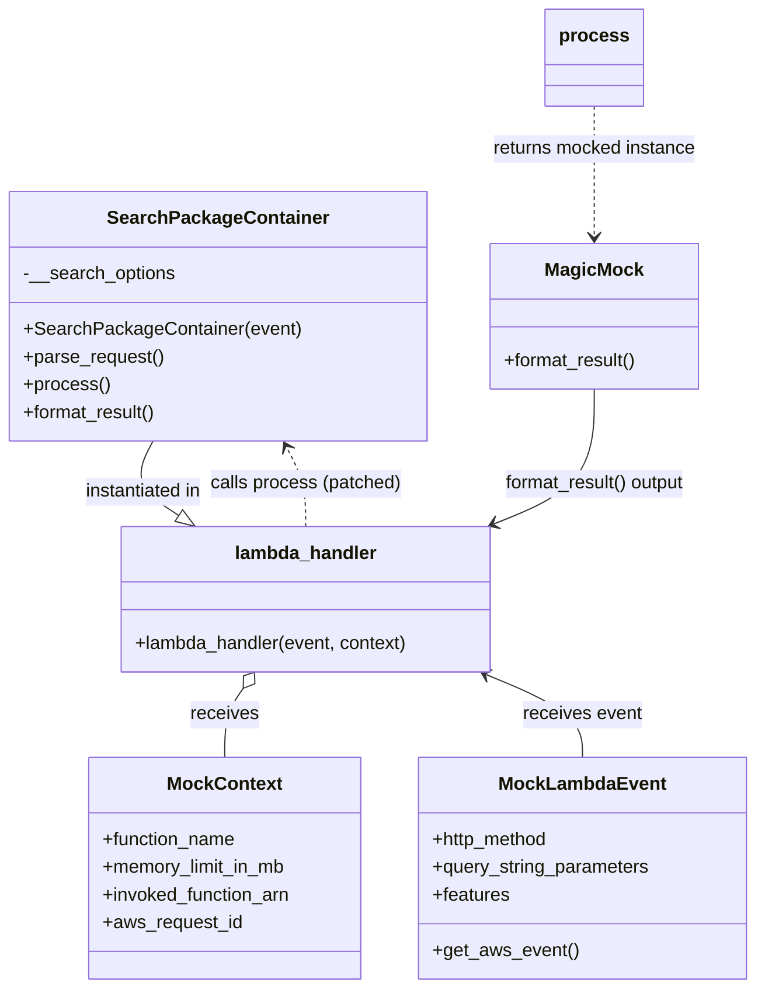
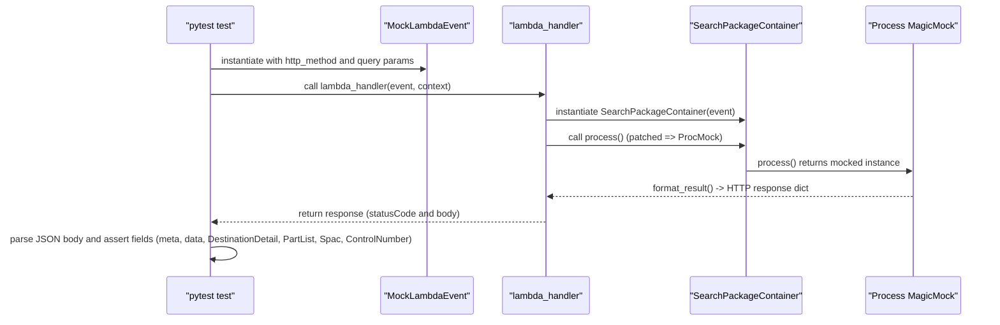

# Diagram: partview_core/partview_service/partview_service/tests/unit/api/search/test_search_package_container.py

> Auto-generated by Obscura crawlers

## Diagram 1

### SVG

<svg id="container" width="644.7109375" xmlns="http://www.w3.org/2000/svg" class="classDiagram" height="856" viewBox="0 0 644.7109375 856" role="graphics-document document" aria-roledescription="class"><g><defs><marker id="container_class-aggregationStart" class="marker aggregation class" refX="18" refY="7" markerWidth="190" markerHeight="240" orient="auto"><path d="M 18,7 L9,13 L1,7 L9,1 Z"></path></marker></defs><defs><marker id="container_class-aggregationEnd" class="marker aggregation class" refX="1" refY="7" markerWidth="20" markerHeight="28" orient="auto"><path d="M 18,7 L9,13 L1,7 L9,1 Z"></path></marker></defs><defs><marker id="container_class-extensionStart" class="marker extension class" refX="18" refY="7" markerWidth="190" markerHeight="240" orient="auto"><path d="M 1,7 L18,13 V 1 Z"></path></marker></defs><defs><marker id="container_class-extensionEnd" class="marker extension class" refX="1" refY="7" markerWidth="20" markerHeight="28" orient="auto"><path d="M 1,1 V 13 L18,7 Z"></path></marker></defs><defs><marker id="container_class-compositionStart" class="marker composition class" refX="18" refY="7" markerWidth="190" markerHeight="240" orient="auto"><path d="M 18,7 L9,13 L1,7 L9,1 Z"></path></marker></defs><defs><marker id="container_class-compositionEnd" class="marker composition class" refX="1" refY="7" markerWidth="20" markerHeight="28" orient="auto"><path d="M 18,7 L9,13 L1,7 L9,1 Z"></path></marker></defs><defs><marker id="container_class-dependencyStart" class="marker dependency class" refX="6" refY="7" markerWidth="190" markerHeight="240" orient="auto"><path d="M 5,7 L9,13 L1,7 L9,1 Z"></path></marker></defs><defs><marker id="container_class-dependencyEnd" class="marker dependency class" refX="13" refY="7" markerWidth="20" markerHeight="28" orient="auto"><path d="M 18,7 L9,13 L14,7 L9,1 Z"></path></marker></defs><defs><marker id="container_class-lollipopStart" class="marker lollipop class" refX="13" refY="7" markerWidth="190" markerHeight="240" orient="auto"><circle stroke="black" fill="transparent" cx="7" cy="7" r="6"></circle></marker></defs><defs><marker id="container_class-lollipopEnd" class="marker lollipop class" refX="1" refY="7" markerWidth="190" markerHeight="240" orient="auto"><circle stroke="black" fill="transparent" cx="7" cy="7" r="6"></circle></marker></defs><g class="root"><g class="clusters"></g><g class="edgePaths"><path d="M124.627,382L121.309,388.167C117.991,394.333,111.355,406.667,115.239,417.449C119.122,428.231,133.526,437.462,140.728,442.077L147.93,446.692" id="id_SearchPackageContainer_lambda_handler_1" class="edge-thickness-normal edge-pattern-solid relation" style=";;;" data-edge="true" data-et="edge" data-id="id_SearchPackageContainer_lambda_handler_1" data-points="W3sieCI6MTI0LjYyNzE4MjExMjA2ODk3LCJ5IjozODJ9LHsieCI6MTA0LjcxODc1LCJ5Ijo0MTl9LHsieCI6MTYyLjQ1MzIwMzEyNTAwMDAyLCJ5Ijo0NTZ9XQ==" marker-end="url(#container_class-extensionEnd)"></path><path d="M202.908,595.777L199.992,599.647C197.075,603.518,191.243,611.259,188.326,621.296C185.41,631.333,185.41,643.667,185.41,649.833L185.41,656" id="id_lambda_handler_MockContext_2" class="edge-thickness-normal edge-pattern-solid relation" style=";;;" data-edge="true" data-et="edge" data-id="id_lambda_handler_MockContext_2" data-points="W3sieCI6MjEzLjI4ODc4OTA2MjUsInkiOjU4Mn0seyJ4IjoxODUuNDEwMTU2MjUsInkiOjYxOX0seyJ4IjoxODUuNDEwMTU2MjUsInkiOjY1Nn1d" marker-start="url(#container_class-aggregationStart)"></path><path d="M414.141,584.352L427.694,590.127C441.247,595.901,468.354,607.451,481.908,619.392C495.461,631.333,495.461,643.667,495.461,649.833L495.461,656" id="id_lambda_handler_MockLambdaEvent_3" class="edge-thickness-normal edge-pattern-solid relation" style=";;;" data-edge="true" data-et="edge" data-id="id_lambda_handler_MockLambdaEvent_3" data-points="W3sieCI6NDA4LjYyMDc4MTI1LCJ5Ijo1ODJ9LHsieCI6NDk1LjQ2MDkzNzUsInkiOjYxOX0seyJ4Ijo0OTUuNDYwOTM3NSwieSI6NjU2fV0=" marker-start="url(#container_class-dependencyStart)"></path><path d="M260.758,456L260.758,449.833C260.758,443.667,260.758,431.333,257.914,419.881C255.069,408.428,249.381,397.856,246.537,392.57L243.692,387.284" id="id_lambda_handler_SearchPackageContainer_4" class="edge-thickness-normal edge-pattern-dashed relation" style=";;;" data-edge="true" data-et="edge" data-id="id_lambda_handler_SearchPackageContainer_4" data-points="W3sieCI6MjYwLjc1NzgxMjUsInkiOjQ1Nn0seyJ4IjoyNjAuNzU3ODEyNSwieSI6NDE5fSx7IngiOjI0MC44NDkzODAzODc5MzEwMywieSI6MzgyfV0=" marker-end="url(#container_class-dependencyEnd)"></path><path d="M510.592,92L510.592,98.167C510.592,104.333,510.592,116.667,510.592,135.5C510.592,154.333,510.592,179.667,510.592,192.333L510.592,205" id="id_process_MagicMock_5" class="edge-thickness-normal edge-pattern-dashed relation" style=";;;" data-edge="true" data-et="edge" data-id="id_process_MagicMock_5" data-points="W3sieCI6NTEwLjU5MTc5Njg3NSwieSI6OTJ9LHsieCI6NTEwLjU5MTc5Njg3NSwieSI6MTI5fSx7IngiOjUxMC41OTE3OTY4NzUsInkiOjIxMX1d" marker-end="url(#container_class-dependencyEnd)"></path><path d="M510.592,337L510.592,350.667C510.592,364.333,510.592,391.667,496.114,411.128C481.636,430.59,452.68,442.18,438.202,447.975L423.724,453.77" id="id_MagicMock_lambda_handler_6" class="edge-thickness-normal edge-pattern-solid relation" style=";;;" data-edge="true" data-et="edge" data-id="id_MagicMock_lambda_handler_6" data-points="W3sieCI6NTEwLjU5MTc5Njg3NSwieSI6MzM3fSx7IngiOjUxMC41OTE3OTY4NzUsInkiOjQxOX0seyJ4Ijo0MTguMTUzMjIyNjU2MjUsInkiOjQ1Nn1d" marker-end="url(#container_class-dependencyEnd)"></path></g><g class="edgeLabels"><g class="edgeLabel" transform="translate(115.89848, 426.1647)"><g class="label" data-id="id_SearchPackageContainer_lambda_handler_1" transform="translate(-53.03125, -12)"><foreignObject width="106.0625" height="24">

instantiated in

</foreignObject></g></g><g class="edgeLabel" transform="translate(185.41015625, 619)"><g class="label" data-id="id_lambda_handler_MockContext_2" transform="translate(-29.4921875, -12)"><foreignObject width="58.984375" height="24">

receives

</foreignObject></g></g><g class="edgeLabel" transform="translate(495.4609375, 619)"><g class="label" data-id="id_lambda_handler_MockLambdaEvent_3" transform="translate(-51.78125, -12)"><foreignObject width="103.5625" height="24">

receives event

</foreignObject></g></g><g class="edgeLabel" transform="translate(260.7578125, 419)"><g class="label" data-id="id_lambda_handler_SearchPackageContainer_4" transform="translate(-83.0078125, -12)"><foreignObject width="166.015625" height="24">

calls process (patched)

</foreignObject></g></g><g class="edgeLabel" transform="translate(510.591796875, 129)"><g class="label" data-id="id_process_MagicMock_5" transform="translate(-89.6015625, -12)"><foreignObject width="179.203125" height="24">

returns mocked instance

</foreignObject></g></g><g class="edgeLabel" transform="translate(510.591796875, 419)"><g class="label" data-id="id_MagicMock_lambda_handler_6" transform="translate(-81.265625, -12)"><foreignObject width="162.53125" height="24">

format_result() output

</foreignObject></g></g></g><g class="nodes"><g class="node default" id="classId-SearchPackageContainer-0" transform="translate(182.73828125, 274)"><g class="basic label-container"><path d="M-174.73828125 -108 L174.73828125 -108 L174.73828125 108 L-174.73828125 108" stroke="none" stroke-width="0" fill="#ECECFF" style=""></path><path d="M-174.73828125 -108 C-82.4666281892996 -108, 9.805024871400803 -108, 174.73828125 -108 M-174.73828125 -108 C-103.41407695684764 -108, -32.089872663695274 -108, 174.73828125 -108 M174.73828125 -108 C174.73828125 -31.29962149365072, 174.73828125 45.40075701269856, 174.73828125 108 M174.73828125 -108 C174.73828125 -23.763749248675822, 174.73828125 60.472501502648356, 174.73828125 108 M174.73828125 108 C79.865084446809 108, -15.008112356381986 108, -174.73828125 108 M174.73828125 108 C70.09575030186724 108, -34.54678064626552 108, -174.73828125 108 M-174.73828125 108 C-174.73828125 59.13059334550429, -174.73828125 10.261186691008575, -174.73828125 -108 M-174.73828125 108 C-174.73828125 55.7844741855972, -174.73828125 3.568948371194395, -174.73828125 -108" stroke="#9370DB" stroke-width="1.3" fill="none" stroke-dasharray="0 0" style=""></path></g><g class="annotation-group text" transform="translate(0, -84)"></g><g class="label-group text" transform="translate(-90.1640625, -84)"><g class="label" style="font-weight: bolder" transform="translate(0,-12)"><foreignObject width="180.328125" height="24">

SearchPackageContainer

</foreignObject></g></g><g class="members-group text" transform="translate(-162.73828125, -36)"><g class="label" style="" transform="translate(0,-12)"><foreignObject width="132.4375" height="24">

-__search_options

</foreignObject></g></g><g class="methods-group text" transform="translate(-162.73828125, 12)"><g class="label" style="" transform="translate(0,-12)"><foreignObject width="235.3125" height="24">

+SearchPackageContainer(event)

</foreignObject></g><g class="label" style="" transform="translate(0,12)"><foreignObject width="121.796875" height="24">

+parse_request()

</foreignObject></g><g class="label" style="" transform="translate(0,36)"><foreignObject width="73.734375" height="24">

+process()

</foreignObject></g><g class="label" style="" transform="translate(0,60)"><foreignObject width="117.015625" height="24">

+format_result()

</foreignObject></g></g><g class="divider" style=""><path d="M-174.73828125 -60 C-74.39196295751557 -60, 25.954355334968852 -60, 174.73828125 -60 M-174.73828125 -60 C-46.99440260570587 -60, 80.74947603858826 -60, 174.73828125 -60" stroke="#9370DB" stroke-width="1.3" fill="none" stroke-dasharray="0 0" style=""></path></g><g class="divider" style=""><path d="M-174.73828125 -12 C-90.76083465040179 -12, -6.78338805080358 -12, 174.73828125 -12 M-174.73828125 -12 C-46.49206327229027 -12, 81.75415470541947 -12, 174.73828125 -12" stroke="#9370DB" stroke-width="1.3" fill="none" stroke-dasharray="0 0" style=""></path></g></g><g class="node default" id="classId-MockLambdaEvent-1" transform="translate(495.4609375, 752)"><g class="basic label-container"><path d="M-141.25 -96 L141.25 -96 L141.25 96 L-141.25 96" stroke="none" stroke-width="0" fill="#ECECFF" style=""></path><path d="M-141.25 -96 C-40.805641331981846 -96, 59.63871733603631 -96, 141.25 -96 M-141.25 -96 C-28.537705941029017 -96, 84.17458811794197 -96, 141.25 -96 M141.25 -96 C141.25 -20.11001915564482, 141.25 55.77996168871036, 141.25 96 M141.25 -96 C141.25 -31.074706220305174, 141.25 33.85058755938965, 141.25 96 M141.25 96 C42.20132134126342 96, -56.847357317473154 96, -141.25 96 M141.25 96 C68.26592870789433 96, -4.718142584211336 96, -141.25 96 M-141.25 96 C-141.25 21.46061201718082, -141.25 -53.07877596563836, -141.25 -96 M-141.25 96 C-141.25 45.80190552562783, -141.25 -4.396188948744339, -141.25 -96" stroke="#9370DB" stroke-width="1.3" fill="none" stroke-dasharray="0 0" style=""></path></g><g class="annotation-group text" transform="translate(0, -72)"></g><g class="label-group text" transform="translate(-68.546875, -72)"><g class="label" style="font-weight: bolder" transform="translate(0,-12)"><foreignObject width="137.09375" height="24">

MockLambdaEvent

</foreignObject></g></g><g class="members-group text" transform="translate(-129.25, -24)"><g class="label" style="" transform="translate(0,-12)"><foreignObject width="102.921875" height="24">

+http_method

</foreignObject></g><g class="label" style="" transform="translate(0,12)"><foreignObject width="189.953125" height="24">

+query_string_parameters

</foreignObject></g><g class="label" style="" transform="translate(0,36)"><foreignObject width="67.1875" height="24">

+features

</foreignObject></g></g><g class="methods-group text" transform="translate(-129.25, 72)"><g class="label" style="" transform="translate(0,-12)"><foreignObject width="124.5" height="24">

+get_aws_event()

</foreignObject></g></g><g class="divider" style=""><path d="M-141.25 -48 C-43.2016209424079 -48, 54.8467581151842 -48, 141.25 -48 M-141.25 -48 C-33.25562776019612 -48, 74.73874447960776 -48, 141.25 -48" stroke="#9370DB" stroke-width="1.3" fill="none" stroke-dasharray="0 0" style=""></path></g><g class="divider" style=""><path d="M-141.25 48 C-84.21519520804404 48, -27.180390416088073 48, 141.25 48 M-141.25 48 C-33.85464630471087 48, 73.54070739057826 48, 141.25 48" stroke="#9370DB" stroke-width="1.3" fill="none" stroke-dasharray="0 0" style=""></path></g></g><g class="node default" id="classId-MockContext-2" transform="translate(185.41015625, 752)"><g class="basic label-container"><path d="M-118.80078125 -96 L118.80078125 -96 L118.80078125 96 L-118.80078125 96" stroke="none" stroke-width="0" fill="#ECECFF" style=""></path><path d="M-118.80078125 -96 C-56.68724770364173 -96, 5.426285842716538 -96, 118.80078125 -96 M-118.80078125 -96 C-34.18718319022162 -96, 50.426414869556766 -96, 118.80078125 -96 M118.80078125 -96 C118.80078125 -47.00255215928625, 118.80078125 1.9948956814274936, 118.80078125 96 M118.80078125 -96 C118.80078125 -25.910410623287618, 118.80078125 44.179178753424765, 118.80078125 96 M118.80078125 96 C35.46800734417364 96, -47.864766561652715 96, -118.80078125 96 M118.80078125 96 C59.48579283647789 96, 0.1708044229557828 96, -118.80078125 96 M-118.80078125 96 C-118.80078125 51.418483836060794, -118.80078125 6.836967672121588, -118.80078125 -96 M-118.80078125 96 C-118.80078125 34.23757627116871, -118.80078125 -27.524847457662574, -118.80078125 -96" stroke="#9370DB" stroke-width="1.3" fill="none" stroke-dasharray="0 0" style=""></path></g><g class="annotation-group text" transform="translate(0, -72)"></g><g class="label-group text" transform="translate(-47.3828125, -72)"><g class="label" style="font-weight: bolder" transform="translate(0,-12)"><foreignObject width="94.765625" height="24">

MockContext

</foreignObject></g></g><g class="members-group text" transform="translate(-106.80078125, -24)"><g class="label" style="" transform="translate(0,-12)"><foreignObject width="117.28125" height="24">

+function_name

</foreignObject></g><g class="label" style="" transform="translate(0,12)"><foreignObject width="162.15625" height="24">

+memory_limit_in_mb

</foreignObject></g><g class="label" style="" transform="translate(0,36)"><foreignObject width="166.21875" height="24">

+invoked_function_arn

</foreignObject></g><g class="label" style="" transform="translate(0,60)"><foreignObject width="120.984375" height="24">

+aws_request_id

</foreignObject></g></g><g class="methods-group text" transform="translate(-106.80078125, 96)"></g><g class="divider" style=""><path d="M-118.80078125 -48 C-45.49166464625715 -48, 27.8174519574857 -48, 118.80078125 -48 M-118.80078125 -48 C-39.74595177575071 -48, 39.30887769849858 -48, 118.80078125 -48" stroke="#9370DB" stroke-width="1.3" fill="none" stroke-dasharray="0 0" style=""></path></g><g class="divider" style=""><path d="M-118.80078125 72 C-40.845317589093085 72, 37.11014607181383 72, 118.80078125 72 M-118.80078125 72 C-36.345631525762315 72, 46.10951819847537 72, 118.80078125 72" stroke="#9370DB" stroke-width="1.3" fill="none" stroke-dasharray="0 0" style=""></path></g></g><g class="node default" id="classId-MagicMock-3" transform="translate(510.591796875, 274)"><g class="basic label-container"><path d="M-90.65625 -63 L90.65625 -63 L90.65625 63 L-90.65625 63" stroke="none" stroke-width="0" fill="#ECECFF" style=""></path><path d="M-90.65625 -63 C-51.2537740813638 -63, -11.851298162727602 -63, 90.65625 -63 M-90.65625 -63 C-39.322589000465406 -63, 12.011071999069188 -63, 90.65625 -63 M90.65625 -63 C90.65625 -35.354829651325794, 90.65625 -7.709659302651588, 90.65625 63 M90.65625 -63 C90.65625 -25.58284447216677, 90.65625 11.834311055666461, 90.65625 63 M90.65625 63 C40.96285857307367 63, -8.730532853852665 63, -90.65625 63 M90.65625 63 C52.67696572188307 63, 14.697681443766143 63, -90.65625 63 M-90.65625 63 C-90.65625 23.304633897138018, -90.65625 -16.390732205723964, -90.65625 -63 M-90.65625 63 C-90.65625 23.09258839204108, -90.65625 -16.81482321591784, -90.65625 -63" stroke="#9370DB" stroke-width="1.3" fill="none" stroke-dasharray="0 0" style=""></path></g><g class="annotation-group text" transform="translate(0, -39)"></g><g class="label-group text" transform="translate(-40.296875, -39)"><g class="label" style="font-weight: bolder" transform="translate(0,-12)"><foreignObject width="80.59375" height="24">

MagicMock

</foreignObject></g></g><g class="members-group text" transform="translate(-78.65625, 9)"></g><g class="methods-group text" transform="translate(-78.65625, 39)"><g class="label" style="" transform="translate(0,-12)"><foreignObject width="117.015625" height="24">

+format_result()

</foreignObject></g></g><g class="divider" style=""><path d="M-90.65625 -15 C-38.05991360517458 -15, 14.536422789650842 -15, 90.65625 -15 M-90.65625 -15 C-21.91035843653391 -15, 46.83553312693218 -15, 90.65625 -15" stroke="#9370DB" stroke-width="1.3" fill="none" stroke-dasharray="0 0" style=""></path></g><g class="divider" style=""><path d="M-90.65625 9 C-41.46756409871458 9, 7.721121802570835 9, 90.65625 9 M-90.65625 9 C-44.34084805381843 9, 1.974553892363133 9, 90.65625 9" stroke="#9370DB" stroke-width="1.3" fill="none" stroke-dasharray="0 0" style=""></path></g></g><g class="node default" id="classId-lambda_handler-4" transform="translate(260.7578125, 519)"><g class="basic label-container"><path d="M-162.08203125 -63 L162.08203125 -63 L162.08203125 63 L-162.08203125 63" stroke="none" stroke-width="0" fill="#ECECFF" style=""></path><path d="M-162.08203125 -63 C-84.48305339405728 -63, -6.884075538114558 -63, 162.08203125 -63 M-162.08203125 -63 C-49.06320917480214 -63, 63.95561290039572 -63, 162.08203125 -63 M162.08203125 -63 C162.08203125 -30.237687129985744, 162.08203125 2.5246257400285117, 162.08203125 63 M162.08203125 -63 C162.08203125 -21.473884670919034, 162.08203125 20.052230658161932, 162.08203125 63 M162.08203125 63 C63.32139765063829 63, -35.43923594872342 63, -162.08203125 63 M162.08203125 63 C55.786201513658014 63, -50.50962822268397 63, -162.08203125 63 M-162.08203125 63 C-162.08203125 16.210398685638843, -162.08203125 -30.579202628722314, -162.08203125 -63 M-162.08203125 63 C-162.08203125 22.254495998490846, -162.08203125 -18.491008003018308, -162.08203125 -63" stroke="#9370DB" stroke-width="1.3" fill="none" stroke-dasharray="0 0" style=""></path></g><g class="annotation-group text" transform="translate(0, -39)"></g><g class="label-group text" transform="translate(-59.9765625, -39)"><g class="label" style="font-weight: bolder" transform="translate(0,-12)"><foreignObject width="119.953125" height="24">

lambda_handler

</foreignObject></g></g><g class="members-group text" transform="translate(-150.08203125, 9)"></g><g class="methods-group text" transform="translate(-150.08203125, 39)"><g class="label" style="" transform="translate(0,-12)"><foreignObject width="240.1875" height="24">

+lambda_handler(event, context)

</foreignObject></g></g><g class="divider" style=""><path d="M-162.08203125 -15 C-69.80727059847692 -15, 22.467490053046163 -15, 162.08203125 -15 M-162.08203125 -15 C-94.30388773920427 -15, -26.52574422840854 -15, 162.08203125 -15" stroke="#9370DB" stroke-width="1.3" fill="none" stroke-dasharray="0 0" style=""></path></g><g class="divider" style=""><path d="M-162.08203125 9 C-41.75296318313673 9, 78.57610488372654 9, 162.08203125 9 M-162.08203125 9 C-39.906258448728806 9, 82.26951435254239 9, 162.08203125 9" stroke="#9370DB" stroke-width="1.3" fill="none" stroke-dasharray="0 0" style=""></path></g></g><g class="node default" id="classId-process-5" transform="translate(510.591796875, 50)"><g class="basic label-container"><path d="M-40.1796875 -42 L40.1796875 -42 L40.1796875 42 L-40.1796875 42" stroke="none" stroke-width="0" fill="#ECECFF" style=""></path><path d="M-40.1796875 -42 C-15.565088259631946 -42, 9.049510980736109 -42, 40.1796875 -42 M-40.1796875 -42 C-21.28793552664507 -42, -2.396183553290143 -42, 40.1796875 -42 M40.1796875 -42 C40.1796875 -9.20381977102138, 40.1796875 23.59236045795724, 40.1796875 42 M40.1796875 -42 C40.1796875 -20.63505127762372, 40.1796875 0.7298974447525595, 40.1796875 42 M40.1796875 42 C20.924961391646818 42, 1.6702352832936356 42, -40.1796875 42 M40.1796875 42 C11.390089639686824 42, -17.399508220626352 42, -40.1796875 42 M-40.1796875 42 C-40.1796875 15.420897695933466, -40.1796875 -11.158204608133069, -40.1796875 -42 M-40.1796875 42 C-40.1796875 20.2063946513748, -40.1796875 -1.5872106972503985, -40.1796875 -42" stroke="#9370DB" stroke-width="1.3" fill="none" stroke-dasharray="0 0" style=""></path></g><g class="annotation-group text" transform="translate(0, -18)"></g><g class="label-group text" transform="translate(-28.1796875, -18)"><g class="label" style="font-weight: bolder" transform="translate(0,-12)"><foreignObject width="56.359375" height="24">

process

</foreignObject></g></g><g class="members-group text" transform="translate(-28.1796875, 30)"></g><g class="methods-group text" transform="translate(-28.1796875, 60)"></g><g class="divider" style=""><path d="M-40.1796875 6 C-17.676380501212375 6, 4.826926497575251 6, 40.1796875 6 M-40.1796875 6 C-19.909231495097423 6, 0.3612245098051545 6, 40.1796875 6" stroke="#9370DB" stroke-width="1.3" fill="none" stroke-dasharray="0 0" style=""></path></g><g class="divider" style=""><path d="M-40.1796875 24 C-20.538191344954807 24, -0.8966951899096145 24, 40.1796875 24 M-40.1796875 24 C-15.701495855100454 24, 8.776695789799092 24, 40.1796875 24" stroke="#9370DB" stroke-width="1.3" fill="none" stroke-dasharray="0 0" style=""></path></g></g></g></g></g></svg>

## Diagram 2

### SVG

<svg id="container" width="1860.5" xmlns="http://www.w3.org/2000/svg" height="585" viewBox="-322 -10 1860.5 585" role="graphics-document document" aria-roledescription="sequence"><g><rect x="1317.5" y="499" fill="#eaeaea" stroke="#666" width="171" height="65" name="ProcMock" rx="3" ry="3" class="actor actor-bottom"></rect><text x="1403" y="531.5" dominant-baseline="central" alignment-baseline="central" class="actor actor-box" style="text-anchor: middle; font-size: 16px; font-weight: 400;"><tspan x="1403" dy="0">"Process MagicMock"</tspan></text></g><g><rect x="979" y="499" fill="#eaeaea" stroke="#666" width="210" height="65" name="SPC" rx="3" ry="3" class="actor actor-bottom"></rect><text x="1084" y="531.5" dominant-baseline="central" alignment-baseline="central" class="actor actor-box" style="text-anchor: middle; font-size: 16px; font-weight: 400;"><tspan x="1084" dy="0">"SearchPackageContainer"</tspan></text></g><g><rect x="627" y="499" fill="#eaeaea" stroke="#666" width="152" height="65" name="Handler" rx="3" ry="3" class="actor actor-bottom"></rect><text x="703" y="531.5" dominant-baseline="central" alignment-baseline="central" class="actor actor-box" style="text-anchor: middle; font-size: 16px; font-weight: 400;"><tspan x="703" dy="0">"lambda_handler"</tspan></text></g><g><rect x="409" y="499" fill="#eaeaea" stroke="#666" width="168" height="65" name="Event" rx="3" ry="3" class="actor actor-bottom"></rect><text x="493" y="531.5" dominant-baseline="central" alignment-baseline="central" class="actor actor-box" style="text-anchor: middle; font-size: 16px; font-weight: 400;"><tspan x="493" dy="0">"MockLambdaEvent"</tspan></text></g><g><rect x="0" y="499" fill="#eaeaea" stroke="#666" width="150" height="65" name="Test" rx="3" ry="3" class="actor actor-bottom"></rect><text x="75" y="531.5" dominant-baseline="central" alignment-baseline="central" class="actor actor-box" style="text-anchor: middle; font-size: 16px; font-weight: 400;"><tspan x="75" dy="0">"pytest test"</tspan></text></g><g><line id="actor4" x1="1403" y1="65" x2="1403" y2="499" class="actor-line 200" stroke-width="0.5px" stroke="#999" name="ProcMock"></line><g id="root-4"><rect x="1317.5" y="0" fill="#eaeaea" stroke="#666" width="171" height="65" name="ProcMock" rx="3" ry="3" class="actor actor-top"></rect><text x="1403" y="32.5" dominant-baseline="central" alignment-baseline="central" class="actor actor-box" style="text-anchor: middle; font-size: 16px; font-weight: 400;"><tspan x="1403" dy="0">"Process MagicMock"</tspan></text></g></g><g><line id="actor3" x1="1084" y1="65" x2="1084" y2="499" class="actor-line 200" stroke-width="0.5px" stroke="#999" name="SPC"></line><g id="root-3"><rect x="979" y="0" fill="#eaeaea" stroke="#666" width="210" height="65" name="SPC" rx="3" ry="3" class="actor actor-top"></rect><text x="1084" y="32.5" dominant-baseline="central" alignment-baseline="central" class="actor actor-box" style="text-anchor: middle; font-size: 16px; font-weight: 400;"><tspan x="1084" dy="0">"SearchPackageContainer"</tspan></text></g></g><g><line id="actor2" x1="703" y1="65" x2="703" y2="499" class="actor-line 200" stroke-width="0.5px" stroke="#999" name="Handler"></line><g id="root-2"><rect x="627" y="0" fill="#eaeaea" stroke="#666" width="152" height="65" name="Handler" rx="3" ry="3" class="actor actor-top"></rect><text x="703" y="32.5" dominant-baseline="central" alignment-baseline="central" class="actor actor-box" style="text-anchor: middle; font-size: 16px; font-weight: 400;"><tspan x="703" dy="0">"lambda_handler"</tspan></text></g></g><g><line id="actor1" x1="493" y1="65" x2="493" y2="499" class="actor-line 200" stroke-width="0.5px" stroke="#999" name="Event"></line><g id="root-1"><rect x="409" y="0" fill="#eaeaea" stroke="#666" width="168" height="65" name="Event" rx="3" ry="3" class="actor actor-top"></rect><text x="493" y="32.5" dominant-baseline="central" alignment-baseline="central" class="actor actor-box" style="text-anchor: middle; font-size: 16px; font-weight: 400;"><tspan x="493" dy="0">"MockLambdaEvent"</tspan></text></g></g><g><line id="actor0" x1="75" y1="65" x2="75" y2="499" class="actor-line 200" stroke-width="0.5px" stroke="#999" name="Test"></line><g id="root-0"><rect x="0" y="0" fill="#eaeaea" stroke="#666" width="150" height="65" name="Test" rx="3" ry="3" class="actor actor-top"></rect><text x="75" y="32.5" dominant-baseline="central" alignment-baseline="central" class="actor actor-box" style="text-anchor: middle; font-size: 16px; font-weight: 400;"><tspan x="75" dy="0">"pytest test"</tspan></text></g></g><g></g><defs><symbol id="computer" width="24" height="24"><path transform="scale(.5)" d="M2 2v13h20v-13h-20zm18 11h-16v-9h16v9zm-10.228 6l.466-1h3.524l.467 1h-4.457zm14.228 3h-24l2-6h2.104l-1.33 4h18.45l-1.297-4h2.073l2 6zm-5-10h-14v-7h14v7z"></path></symbol></defs><defs><symbol id="database" fill-rule="evenodd" clip-rule="evenodd"><path transform="scale(.5)" d="M12.258.001l.256.004.255.005.253.008.251.01.249.012.247.015.246.016.242.019.241.02.239.023.236.024.233.027.231.028.229.031.225.032.223.034.22.036.217.038.214.04.211.041.208.043.205.045.201.046.198.048.194.05.191.051.187.053.183.054.18.056.175.057.172.059.168.06.163.061.16.063.155.064.15.066.074.033.073.033.071.034.07.034.069.035.068.035.067.035.066.035.064.036.064.036.062.036.06.036.06.037.058.037.058.037.055.038.055.038.053.038.052.038.051.039.05.039.048.039.047.039.045.04.044.04.043.04.041.04.04.041.039.041.037.041.036.041.034.041.033.042.032.042.03.042.029.042.027.042.026.043.024.043.023.043.021.043.02.043.018.044.017.043.015.044.013.044.012.044.011.045.009.044.007.045.006.045.004.045.002.045.001.045v17l-.001.045-.002.045-.004.045-.006.045-.007.045-.009.044-.011.045-.012.044-.013.044-.015.044-.017.043-.018.044-.02.043-.021.043-.023.043-.024.043-.026.043-.027.042-.029.042-.03.042-.032.042-.033.042-.034.041-.036.041-.037.041-.039.041-.04.041-.041.04-.043.04-.044.04-.045.04-.047.039-.048.039-.05.039-.051.039-.052.038-.053.038-.055.038-.055.038-.058.037-.058.037-.06.037-.06.036-.062.036-.064.036-.064.036-.066.035-.067.035-.068.035-.069.035-.07.034-.071.034-.073.033-.074.033-.15.066-.155.064-.16.063-.163.061-.168.06-.172.059-.175.057-.18.056-.183.054-.187.053-.191.051-.194.05-.198.048-.201.046-.205.045-.208.043-.211.041-.214.04-.217.038-.22.036-.223.034-.225.032-.229.031-.231.028-.233.027-.236.024-.239.023-.241.02-.242.019-.246.016-.247.015-.249.012-.251.01-.253.008-.255.005-.256.004-.258.001-.258-.001-.256-.004-.255-.005-.253-.008-.251-.01-.249-.012-.247-.015-.245-.016-.243-.019-.241-.02-.238-.023-.236-.024-.234-.027-.231-.028-.228-.031-.226-.032-.223-.034-.22-.036-.217-.038-.214-.04-.211-.041-.208-.043-.204-.045-.201-.046-.198-.048-.195-.05-.19-.051-.187-.053-.184-.054-.179-.056-.176-.057-.172-.059-.167-.06-.164-.061-.159-.063-.155-.064-.151-.066-.074-.033-.072-.033-.072-.034-.07-.034-.069-.035-.068-.035-.067-.035-.066-.035-.064-.036-.063-.036-.062-.036-.061-.036-.06-.037-.058-.037-.057-.037-.056-.038-.055-.038-.053-.038-.052-.038-.051-.039-.049-.039-.049-.039-.046-.039-.046-.04-.044-.04-.043-.04-.041-.04-.04-.041-.039-.041-.037-.041-.036-.041-.034-.041-.033-.042-.032-.042-.03-.042-.029-.042-.027-.042-.026-.043-.024-.043-.023-.043-.021-.043-.02-.043-.018-.044-.017-.043-.015-.044-.013-.044-.012-.044-.011-.045-.009-.044-.007-.045-.006-.045-.004-.045-.002-.045-.001-.045v-17l.001-.045.002-.045.004-.045.006-.045.007-.045.009-.044.011-.045.012-.044.013-.044.015-.044.017-.043.018-.044.02-.043.021-.043.023-.043.024-.043.026-.043.027-.042.029-.042.03-.042.032-.042.033-.042.034-.041.036-.041.037-.041.039-.041.04-.041.041-.04.043-.04.044-.04.046-.04.046-.039.049-.039.049-.039.051-.039.052-.038.053-.038.055-.038.056-.038.057-.037.058-.037.06-.037.061-.036.062-.036.063-.036.064-.036.066-.035.067-.035.068-.035.069-.035.07-.034.072-.034.072-.033.074-.033.151-.066.155-.064.159-.063.164-.061.167-.06.172-.059.176-.057.179-.056.184-.054.187-.053.19-.051.195-.05.198-.048.201-.046.204-.045.208-.043.211-.041.214-.04.217-.038.22-.036.223-.034.226-.032.228-.031.231-.028.234-.027.236-.024.238-.023.241-.02.243-.019.245-.016.247-.015.249-.012.251-.01.253-.008.255-.005.256-.004.258-.001.258.001zm-9.258 20.499v.01l.001.021.003.021.004.022.005.021.006.022.007.022.009.023.01.022.011.023.012.023.013.023.015.023.016.024.017.023.018.024.019.024.021.024.022.025.023.024.024.025.052.049.056.05.061.051.066.051.07.051.075.051.079.052.084.052.088.052.092.052.097.052.102.051.105.052.11.052.114.051.119.051.123.051.127.05.131.05.135.05.139.048.144.049.147.047.152.047.155.047.16.045.163.045.167.043.171.043.176.041.178.041.183.039.187.039.19.037.194.035.197.035.202.033.204.031.209.03.212.029.216.027.219.025.222.024.226.021.23.02.233.018.236.016.24.015.243.012.246.01.249.008.253.005.256.004.259.001.26-.001.257-.004.254-.005.25-.008.247-.011.244-.012.241-.014.237-.016.233-.018.231-.021.226-.021.224-.024.22-.026.216-.027.212-.028.21-.031.205-.031.202-.034.198-.034.194-.036.191-.037.187-.039.183-.04.179-.04.175-.042.172-.043.168-.044.163-.045.16-.046.155-.046.152-.047.148-.048.143-.049.139-.049.136-.05.131-.05.126-.05.123-.051.118-.052.114-.051.11-.052.106-.052.101-.052.096-.052.092-.052.088-.053.083-.051.079-.052.074-.052.07-.051.065-.051.06-.051.056-.05.051-.05.023-.024.023-.025.021-.024.02-.024.019-.024.018-.024.017-.024.015-.023.014-.024.013-.023.012-.023.01-.023.01-.022.008-.022.006-.022.006-.022.004-.022.004-.021.001-.021.001-.021v-4.127l-.077.055-.08.053-.083.054-.085.053-.087.052-.09.052-.093.051-.095.05-.097.05-.1.049-.102.049-.105.048-.106.047-.109.047-.111.046-.114.045-.115.045-.118.044-.12.043-.122.042-.124.042-.126.041-.128.04-.13.04-.132.038-.134.038-.135.037-.138.037-.139.035-.142.035-.143.034-.144.033-.147.032-.148.031-.15.03-.151.03-.153.029-.154.027-.156.027-.158.026-.159.025-.161.024-.162.023-.163.022-.165.021-.166.02-.167.019-.169.018-.169.017-.171.016-.173.015-.173.014-.175.013-.175.012-.177.011-.178.01-.179.008-.179.008-.181.006-.182.005-.182.004-.184.003-.184.002h-.37l-.184-.002-.184-.003-.182-.004-.182-.005-.181-.006-.179-.008-.179-.008-.178-.01-.176-.011-.176-.012-.175-.013-.173-.014-.172-.015-.171-.016-.17-.017-.169-.018-.167-.019-.166-.02-.165-.021-.163-.022-.162-.023-.161-.024-.159-.025-.157-.026-.156-.027-.155-.027-.153-.029-.151-.03-.15-.03-.148-.031-.146-.032-.145-.033-.143-.034-.141-.035-.14-.035-.137-.037-.136-.037-.134-.038-.132-.038-.13-.04-.128-.04-.126-.041-.124-.042-.122-.042-.12-.044-.117-.043-.116-.045-.113-.045-.112-.046-.109-.047-.106-.047-.105-.048-.102-.049-.1-.049-.097-.05-.095-.05-.093-.052-.09-.051-.087-.052-.085-.053-.083-.054-.08-.054-.077-.054v4.127zm0-5.654v.011l.001.021.003.021.004.021.005.022.006.022.007.022.009.022.01.022.011.023.012.023.013.023.015.024.016.023.017.024.018.024.019.024.021.024.022.024.023.025.024.024.052.05.056.05.061.05.066.051.07.051.075.052.079.051.084.052.088.052.092.052.097.052.102.052.105.052.11.051.114.051.119.052.123.05.127.051.131.05.135.049.139.049.144.048.147.048.152.047.155.046.16.045.163.045.167.044.171.042.176.042.178.04.183.04.187.038.19.037.194.036.197.034.202.033.204.032.209.03.212.028.216.027.219.025.222.024.226.022.23.02.233.018.236.016.24.014.243.012.246.01.249.008.253.006.256.003.259.001.26-.001.257-.003.254-.006.25-.008.247-.01.244-.012.241-.015.237-.016.233-.018.231-.02.226-.022.224-.024.22-.025.216-.027.212-.029.21-.03.205-.032.202-.033.198-.035.194-.036.191-.037.187-.039.183-.039.179-.041.175-.042.172-.043.168-.044.163-.045.16-.045.155-.047.152-.047.148-.048.143-.048.139-.05.136-.049.131-.05.126-.051.123-.051.118-.051.114-.052.11-.052.106-.052.101-.052.096-.052.092-.052.088-.052.083-.052.079-.052.074-.051.07-.052.065-.051.06-.05.056-.051.051-.049.023-.025.023-.024.021-.025.02-.024.019-.024.018-.024.017-.024.015-.023.014-.023.013-.024.012-.022.01-.023.01-.023.008-.022.006-.022.006-.022.004-.021.004-.022.001-.021.001-.021v-4.139l-.077.054-.08.054-.083.054-.085.052-.087.053-.09.051-.093.051-.095.051-.097.05-.1.049-.102.049-.105.048-.106.047-.109.047-.111.046-.114.045-.115.044-.118.044-.12.044-.122.042-.124.042-.126.041-.128.04-.13.039-.132.039-.134.038-.135.037-.138.036-.139.036-.142.035-.143.033-.144.033-.147.033-.148.031-.15.03-.151.03-.153.028-.154.028-.156.027-.158.026-.159.025-.161.024-.162.023-.163.022-.165.021-.166.02-.167.019-.169.018-.169.017-.171.016-.173.015-.173.014-.175.013-.175.012-.177.011-.178.009-.179.009-.179.007-.181.007-.182.005-.182.004-.184.003-.184.002h-.37l-.184-.002-.184-.003-.182-.004-.182-.005-.181-.007-.179-.007-.179-.009-.178-.009-.176-.011-.176-.012-.175-.013-.173-.014-.172-.015-.171-.016-.17-.017-.169-.018-.167-.019-.166-.02-.165-.021-.163-.022-.162-.023-.161-.024-.159-.025-.157-.026-.156-.027-.155-.028-.153-.028-.151-.03-.15-.03-.148-.031-.146-.033-.145-.033-.143-.033-.141-.035-.14-.036-.137-.036-.136-.037-.134-.038-.132-.039-.13-.039-.128-.04-.126-.041-.124-.042-.122-.043-.12-.043-.117-.044-.116-.044-.113-.046-.112-.046-.109-.046-.106-.047-.105-.048-.102-.049-.1-.049-.097-.05-.095-.051-.093-.051-.09-.051-.087-.053-.085-.052-.083-.054-.08-.054-.077-.054v4.139zm0-5.666v.011l.001.02.003.022.004.021.005.022.006.021.007.022.009.023.01.022.011.023.012.023.013.023.015.023.016.024.017.024.018.023.019.024.021.025.022.024.023.024.024.025.052.05.056.05.061.05.066.051.07.051.075.052.079.051.084.052.088.052.092.052.097.052.102.052.105.051.11.052.114.051.119.051.123.051.127.05.131.05.135.05.139.049.144.048.147.048.152.047.155.046.16.045.163.045.167.043.171.043.176.042.178.04.183.04.187.038.19.037.194.036.197.034.202.033.204.032.209.03.212.028.216.027.219.025.222.024.226.021.23.02.233.018.236.017.24.014.243.012.246.01.249.008.253.006.256.003.259.001.26-.001.257-.003.254-.006.25-.008.247-.01.244-.013.241-.014.237-.016.233-.018.231-.02.226-.022.224-.024.22-.025.216-.027.212-.029.21-.03.205-.032.202-.033.198-.035.194-.036.191-.037.187-.039.183-.039.179-.041.175-.042.172-.043.168-.044.163-.045.16-.045.155-.047.152-.047.148-.048.143-.049.139-.049.136-.049.131-.051.126-.05.123-.051.118-.052.114-.051.11-.052.106-.052.101-.052.096-.052.092-.052.088-.052.083-.052.079-.052.074-.052.07-.051.065-.051.06-.051.056-.05.051-.049.023-.025.023-.025.021-.024.02-.024.019-.024.018-.024.017-.024.015-.023.014-.024.013-.023.012-.023.01-.022.01-.023.008-.022.006-.022.006-.022.004-.022.004-.021.001-.021.001-.021v-4.153l-.077.054-.08.054-.083.053-.085.053-.087.053-.09.051-.093.051-.095.051-.097.05-.1.049-.102.048-.105.048-.106.048-.109.046-.111.046-.114.046-.115.044-.118.044-.12.043-.122.043-.124.042-.126.041-.128.04-.13.039-.132.039-.134.038-.135.037-.138.036-.139.036-.142.034-.143.034-.144.033-.147.032-.148.032-.15.03-.151.03-.153.028-.154.028-.156.027-.158.026-.159.024-.161.024-.162.023-.163.023-.165.021-.166.02-.167.019-.169.018-.169.017-.171.016-.173.015-.173.014-.175.013-.175.012-.177.01-.178.01-.179.009-.179.007-.181.006-.182.006-.182.004-.184.003-.184.001-.185.001-.185-.001-.184-.001-.184-.003-.182-.004-.182-.006-.181-.006-.179-.007-.179-.009-.178-.01-.176-.01-.176-.012-.175-.013-.173-.014-.172-.015-.171-.016-.17-.017-.169-.018-.167-.019-.166-.02-.165-.021-.163-.023-.162-.023-.161-.024-.159-.024-.157-.026-.156-.027-.155-.028-.153-.028-.151-.03-.15-.03-.148-.032-.146-.032-.145-.033-.143-.034-.141-.034-.14-.036-.137-.036-.136-.037-.134-.038-.132-.039-.13-.039-.128-.041-.126-.041-.124-.041-.122-.043-.12-.043-.117-.044-.116-.044-.113-.046-.112-.046-.109-.046-.106-.048-.105-.048-.102-.048-.1-.05-.097-.049-.095-.051-.093-.051-.09-.052-.087-.052-.085-.053-.083-.053-.08-.054-.077-.054v4.153zm8.74-8.179l-.257.004-.254.005-.25.008-.247.011-.244.012-.241.014-.237.016-.233.018-.231.021-.226.022-.224.023-.22.026-.216.027-.212.028-.21.031-.205.032-.202.033-.198.034-.194.036-.191.038-.187.038-.183.04-.179.041-.175.042-.172.043-.168.043-.163.045-.16.046-.155.046-.152.048-.148.048-.143.048-.139.049-.136.05-.131.05-.126.051-.123.051-.118.051-.114.052-.11.052-.106.052-.101.052-.096.052-.092.052-.088.052-.083.052-.079.052-.074.051-.07.052-.065.051-.06.05-.056.05-.051.05-.023.025-.023.024-.021.024-.02.025-.019.024-.018.024-.017.023-.015.024-.014.023-.013.023-.012.023-.01.023-.01.022-.008.022-.006.023-.006.021-.004.022-.004.021-.001.021-.001.021.001.021.001.021.004.021.004.022.006.021.006.023.008.022.01.022.01.023.012.023.013.023.014.023.015.024.017.023.018.024.019.024.02.025.021.024.023.024.023.025.051.05.056.05.06.05.065.051.07.052.074.051.079.052.083.052.088.052.092.052.096.052.101.052.106.052.11.052.114.052.118.051.123.051.126.051.131.05.136.05.139.049.143.048.148.048.152.048.155.046.16.046.163.045.168.043.172.043.175.042.179.041.183.04.187.038.191.038.194.036.198.034.202.033.205.032.21.031.212.028.216.027.22.026.224.023.226.022.231.021.233.018.237.016.241.014.244.012.247.011.25.008.254.005.257.004.26.001.26-.001.257-.004.254-.005.25-.008.247-.011.244-.012.241-.014.237-.016.233-.018.231-.021.226-.022.224-.023.22-.026.216-.027.212-.028.21-.031.205-.032.202-.033.198-.034.194-.036.191-.038.187-.038.183-.04.179-.041.175-.042.172-.043.168-.043.163-.045.16-.046.155-.046.152-.048.148-.048.143-.048.139-.049.136-.05.131-.05.126-.051.123-.051.118-.051.114-.052.11-.052.106-.052.101-.052.096-.052.092-.052.088-.052.083-.052.079-.052.074-.051.07-.052.065-.051.06-.05.056-.05.051-.05.023-.025.023-.024.021-.024.02-.025.019-.024.018-.024.017-.023.015-.024.014-.023.013-.023.012-.023.01-.023.01-.022.008-.022.006-.023.006-.021.004-.022.004-.021.001-.021.001-.021-.001-.021-.001-.021-.004-.021-.004-.022-.006-.021-.006-.023-.008-.022-.01-.022-.01-.023-.012-.023-.013-.023-.014-.023-.015-.024-.017-.023-.018-.024-.019-.024-.02-.025-.021-.024-.023-.024-.023-.025-.051-.05-.056-.05-.06-.05-.065-.051-.07-.052-.074-.051-.079-.052-.083-.052-.088-.052-.092-.052-.096-.052-.101-.052-.106-.052-.11-.052-.114-.052-.118-.051-.123-.051-.126-.051-.131-.05-.136-.05-.139-.049-.143-.048-.148-.048-.152-.048-.155-.046-.16-.046-.163-.045-.168-.043-.172-.043-.175-.042-.179-.041-.183-.04-.187-.038-.191-.038-.194-.036-.198-.034-.202-.033-.205-.032-.21-.031-.212-.028-.216-.027-.22-.026-.224-.023-.226-.022-.231-.021-.233-.018-.237-.016-.241-.014-.244-.012-.247-.011-.25-.008-.254-.005-.257-.004-.26-.001-.26.001z"></path></symbol></defs><defs><symbol id="clock" width="24" height="24"><path transform="scale(.5)" d="M12 2c5.514 0 10 4.486 10 10s-4.486 10-10 10-10-4.486-10-10 4.486-10 10-10zm0-2c-6.627 0-12 5.373-12 12s5.373 12 12 12 12-5.373 12-12-5.373-12-12-12zm5.848 12.459c.202.038.202.333.001.372-1.907.361-6.045 1.111-6.547 1.111-.719 0-1.301-.582-1.301-1.301 0-.512.77-5.447 1.125-7.445.034-.192.312-.181.343.014l.985 6.238 5.394 1.011z"></path></symbol></defs><defs><marker id="arrowhead" refX="7.9" refY="5" markerUnits="userSpaceOnUse" markerWidth="12" markerHeight="12" orient="auto-start-reverse"><path d="M -1 0 L 10 5 L 0 10 z"></path></marker></defs><defs><marker id="crosshead" markerWidth="15" markerHeight="8" orient="auto" refX="4" refY="4.5"><path fill="none" stroke="#000000" stroke-width="1pt" d="M 1,2 L 6,7 M 6,2 L 1,7" style="stroke-dasharray: 0, 0;"></path></marker></defs><defs><marker id="filled-head" refX="15.5" refY="7" markerWidth="20" markerHeight="28" orient="auto"><path d="M 18,7 L9,13 L14,7 L9,1 Z"></path></marker></defs><defs><marker id="sequencenumber" refX="15" refY="15" markerWidth="60" markerHeight="40" orient="auto"><circle cx="15" cy="15" r="6"></circle></marker></defs><text x="283" y="80" text-anchor="middle" dominant-baseline="middle" alignment-baseline="middle" class="messageText" dy="1em" style="font-size: 16px; font-weight: 400;">instantiate with http_method and query params</text><line x1="76" y1="113" x2="489" y2="113" class="messageLine0" stroke-width="2" stroke="none" marker-end="url(#arrowhead)" style="fill: none;"></line><text x="388" y="128" text-anchor="middle" dominant-baseline="middle" alignment-baseline="middle" class="messageText" dy="1em" style="font-size: 16px; font-weight: 400;">call lambda_handler(event, context)</text><line x1="76" y1="161" x2="699" y2="161" class="messageLine0" stroke-width="2" stroke="none" marker-end="url(#arrowhead)" style="fill: none;"></line><text x="892" y="176" text-anchor="middle" dominant-baseline="middle" alignment-baseline="middle" class="messageText" dy="1em" style="font-size: 16px; font-weight: 400;">instantiate SearchPackageContainer(event)</text><line x1="704" y1="209" x2="1080" y2="209" class="messageLine0" stroke-width="2" stroke="none" marker-end="url(#arrowhead)" style="fill: none;"></line><text x="892" y="224" text-anchor="middle" dominant-baseline="middle" alignment-baseline="middle" class="messageText" dy="1em" style="font-size: 16px; font-weight: 400;">call process()  (patched =&gt; ProcMock)</text><line x1="704" y1="257" x2="1080" y2="257" class="messageLine0" stroke-width="2" stroke="none" marker-end="url(#arrowhead)" style="fill: none;"></line><text x="1242" y="272" text-anchor="middle" dominant-baseline="middle" alignment-baseline="middle" class="messageText" dy="1em" style="font-size: 16px; font-weight: 400;">process() returns mocked instance</text><line x1="1085" y1="305" x2="1399" y2="305" class="messageLine0" stroke-width="2" stroke="none" marker-end="url(#arrowhead)" style="fill: none;"></line><text x="1055" y="320" text-anchor="middle" dominant-baseline="middle" alignment-baseline="middle" class="messageText" dy="1em" style="font-size: 16px; font-weight: 400;">format_result() -&gt; HTTP response dict</text><line x1="1402" y1="353" x2="707" y2="353" class="messageLine1" stroke-width="2" stroke="none" marker-end="url(#arrowhead)" style="stroke-dasharray: 3, 3; fill: none;"></line><text x="391" y="368" text-anchor="middle" dominant-baseline="middle" alignment-baseline="middle" class="messageText" dy="1em" style="font-size: 16px; font-weight: 400;">return response (statusCode and body)</text><line x1="702" y1="401" x2="79" y2="401" class="messageLine1" stroke-width="2" stroke="none" marker-end="url(#arrowhead)" style="stroke-dasharray: 3, 3; fill: none;"></line><text x="76" y="416" text-anchor="middle" dominant-baseline="middle" alignment-baseline="middle" class="messageText" dy="1em" style="font-size: 16px; font-weight: 400;">parse JSON body and assert fields (meta, data, DestinationDetail, PartList, Spac, ControlNumber)</text><path d="M 76,449 C 136,439 136,479 76,469" class="messageLine0" stroke-width="2" stroke="none" marker-end="url(#arrowhead)" style="fill: none;"></path></svg>
