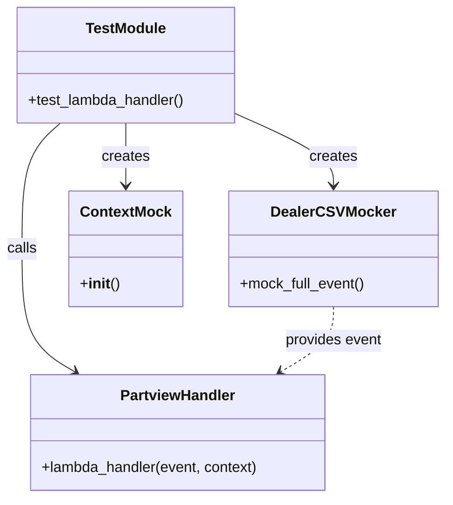

# Diagram: partview_core/partview_service/partview_service/tests/unit/api/test_dealer_onboarding_producer.py

> Auto-generated by Obscura crawlers

## Mermaid

### SVG

<svg id="container" width="478.2578125" xmlns="http://www.w3.org/2000/svg" class="classDiagram" height="542" viewBox="0 0 478.2578125 542" role="graphics-document document" aria-roledescription="class"><g><defs><marker id="container_class-aggregationStart" class="marker aggregation class" refX="18" refY="7" markerWidth="190" markerHeight="240" orient="auto"><path d="M 18,7 L9,13 L1,7 L9,1 Z"></path></marker></defs><defs><marker id="container_class-aggregationEnd" class="marker aggregation class" refX="1" refY="7" markerWidth="20" markerHeight="28" orient="auto"><path d="M 18,7 L9,13 L1,7 L9,1 Z"></path></marker></defs><defs><marker id="container_class-extensionStart" class="marker extension class" refX="18" refY="7" markerWidth="190" markerHeight="240" orient="auto"><path d="M 1,7 L18,13 V 1 Z"></path></marker></defs><defs><marker id="container_class-extensionEnd" class="marker extension class" refX="1" refY="7" markerWidth="20" markerHeight="28" orient="auto"><path d="M 1,1 V 13 L18,7 Z"></path></marker></defs><defs><marker id="container_class-compositionStart" class="marker composition class" refX="18" refY="7" markerWidth="190" markerHeight="240" orient="auto"><path d="M 18,7 L9,13 L1,7 L9,1 Z"></path></marker></defs><defs><marker id="container_class-compositionEnd" class="marker composition class" refX="1" refY="7" markerWidth="20" markerHeight="28" orient="auto"><path d="M 18,7 L9,13 L1,7 L9,1 Z"></path></marker></defs><defs><marker id="container_class-dependencyStart" class="marker dependency class" refX="6" refY="7" markerWidth="190" markerHeight="240" orient="auto"><path d="M 5,7 L9,13 L1,7 L9,1 Z"></path></marker></defs><defs><marker id="container_class-dependencyEnd" class="marker dependency class" refX="13" refY="7" markerWidth="20" markerHeight="28" orient="auto"><path d="M 18,7 L9,13 L14,7 L9,1 Z"></path></marker></defs><defs><marker id="container_class-lollipopStart" class="marker lollipop class" refX="13" refY="7" markerWidth="190" markerHeight="240" orient="auto"><circle stroke="black" fill="transparent" cx="7" cy="7" r="6"></circle></marker></defs><defs><marker id="container_class-lollipopEnd" class="marker lollipop class" refX="1" refY="7" markerWidth="190" markerHeight="240" orient="auto"><circle stroke="black" fill="transparent" cx="7" cy="7" r="6"></circle></marker></defs><g class="root"><g class="clusters"></g><g class="edgePaths"><path d="M255.242,124.995L272.278,132.663C289.314,140.33,323.385,155.665,340.421,168.499C357.457,181.333,357.457,191.667,357.457,196.833L357.457,202" id="id_TestModule_DealerCSVMocker_1" class="edge-thickness-normal edge-pattern-solid relation" style=";;;" data-edge="true" data-et="edge" data-id="id_TestModule_DealerCSVMocker_1" data-points="W3sieCI6MjU1LjI0MjE4NzUsInkiOjEyNC45OTUzMjM0MDU4MjY0MX0seyJ4IjozNTcuNDU3MDMxMjUsInkiOjE3MX0seyJ4IjozNTcuNDU3MDMxMjUsInkiOjIwOH1d" marker-end="url(#container_class-dependencyEnd)"></path><path d="M135.273,134L135.273,140.167C135.273,146.333,135.273,158.667,135.273,170C135.273,181.333,135.273,191.667,135.273,196.833L135.273,202" id="id_TestModule_ContextMock_2" class="edge-thickness-normal edge-pattern-solid relation" style=";;;" data-edge="true" data-et="edge" data-id="id_TestModule_ContextMock_2" data-points="W3sieCI6MTM1LjI3MzQzNzUsInkiOjEzNH0seyJ4IjoxMzUuMjczNDM3NSwieSI6MTcxfSx7IngiOjEzNS4yNzM0Mzc1LCJ5IjoyMDh9XQ==" marker-end="url(#container_class-dependencyEnd)"></path><path d="M65.452,134L58.617,140.167C51.783,146.333,38.114,158.667,31.28,181.5C24.445,204.333,24.445,237.667,24.445,271C24.445,304.333,24.445,337.667,33.856,359.985C43.266,382.304,62.088,393.607,71.498,399.259L80.909,404.911" id="id_TestModule_PartviewHandler_3" class="edge-thickness-normal edge-pattern-solid relation" style=";;;" data-edge="true" data-et="edge" data-id="id_TestModule_PartviewHandler_3" data-points="W3sieCI6NjUuNDUxNzE4NzUsInkiOjEzNH0seyJ4IjoyNC40NDUzMTI1LCJ5IjoxNzF9LHsieCI6MjQuNDQ1MzEyNSwieSI6MjcxfSx7IngiOjI0LjQ0NTMxMjUsInkiOjM3MX0seyJ4Ijo4Ni4wNTI0ODA0Njg3NSwieSI6NDA4fV0=" marker-end="url(#container_class-dependencyEnd)"></path><path d="M357.457,334L357.457,340.167C357.457,346.333,357.457,358.667,348.046,370.485C338.636,382.304,319.815,393.607,310.404,399.259L300.994,404.911" id="id_DealerCSVMocker_PartviewHandler_4" class="edge-thickness-normal edge-pattern-dashed relation" style=";;;" data-edge="true" data-et="edge" data-id="id_DealerCSVMocker_PartviewHandler_4" data-points="W3sieCI6MzU3LjQ1NzAzMTI1LCJ5IjozMzR9LHsieCI6MzU3LjQ1NzAzMTI1LCJ5IjozNzF9LHsieCI6Mjk1Ljg0OTg2MzI4MTI1LCJ5Ijo0MDh9XQ==" marker-end="url(#container_class-dependencyEnd)"></path></g><g class="edgeLabels"><g class="edgeLabel" transform="translate(357.45703125, 171)"><g class="label" data-id="id_TestModule_DealerCSVMocker_1" transform="translate(-26.171875, -12)"><foreignObject width="52.34375" height="24">

creates

</foreignObject></g></g><g class="edgeLabel" transform="translate(135.2734375, 171)"><g class="label" data-id="id_TestModule_ContextMock_2" transform="translate(-26.171875, -12)"><foreignObject width="52.34375" height="24">

creates

</foreignObject></g></g><g class="edgeLabel" transform="translate(24.4453125, 271)"><g class="label" data-id="id_TestModule_PartviewHandler_3" transform="translate(-16.4453125, -12)"><foreignObject width="32.890625" height="24">

calls

</foreignObject></g></g><g class="edgeLabel" transform="translate(357.45703125, 371)"><g class="label" data-id="id_DealerCSVMocker_PartviewHandler_4" transform="translate(-53.6015625, -12)"><foreignObject width="107.203125" height="24">

provides event

</foreignObject></g></g></g><g class="nodes"><g class="node default" id="classId-TestModule-0" transform="translate(135.2734375, 71)"><g class="basic label-container"><path d="M-119.96875 -63 L119.96875 -63 L119.96875 63 L-119.96875 63" stroke="none" stroke-width="0" fill="#ECECFF" style=""></path><path d="M-119.96875 -63 C-71.60983963176344 -63, -23.250929263526885 -63, 119.96875 -63 M-119.96875 -63 C-58.119684375332156 -63, 3.729381249335688 -63, 119.96875 -63 M119.96875 -63 C119.96875 -17.630282343938404, 119.96875 27.73943531212319, 119.96875 63 M119.96875 -63 C119.96875 -36.86762862240273, 119.96875 -10.735257244805453, 119.96875 63 M119.96875 63 C39.93001822147566 63, -40.108713557048674 63, -119.96875 63 M119.96875 63 C36.149179864888396 63, -47.67039027022321 63, -119.96875 63 M-119.96875 63 C-119.96875 19.047611986503235, -119.96875 -24.90477602699353, -119.96875 -63 M-119.96875 63 C-119.96875 14.62508631671836, -119.96875 -33.74982736656328, -119.96875 -63" stroke="#9370DB" stroke-width="1.3" fill="none" stroke-dasharray="0 0" style=""></path></g><g class="annotation-group text" transform="translate(0, -39)"></g><g class="label-group text" transform="translate(-42.34375, -39)"><g class="label" style="font-weight: bolder" transform="translate(0,-12)"><foreignObject width="84.6875" height="24">

TestModule

</foreignObject></g></g><g class="members-group text" transform="translate(-107.96875, 9)"></g><g class="methods-group text" transform="translate(-107.96875, 39)"><g class="label" style="" transform="translate(0,-12)"><foreignObject width="173.59375" height="24">

+test_lambda_handler()

</foreignObject></g></g><g class="divider" style=""><path d="M-119.96875 -15 C-61.25449989999443 -15, -2.5402497999888567 -15, 119.96875 -15 M-119.96875 -15 C-35.710065480053075 -15, 48.54861903989385 -15, 119.96875 -15" stroke="#9370DB" stroke-width="1.3" fill="none" stroke-dasharray="0 0" style=""></path></g><g class="divider" style=""><path d="M-119.96875 9 C-50.01816296476332 9, 19.93242407047336 9, 119.96875 9 M-119.96875 9 C-47.406348004529605 9, 25.15605399094079 9, 119.96875 9" stroke="#9370DB" stroke-width="1.3" fill="none" stroke-dasharray="0 0" style=""></path></g></g><g class="node default" id="classId-DealerCSVMocker-1" transform="translate(357.45703125, 271)"><g class="basic label-container"><path d="M-112.80078125 -63 L112.80078125 -63 L112.80078125 63 L-112.80078125 63" stroke="none" stroke-width="0" fill="#ECECFF" style=""></path><path d="M-112.80078125 -63 C-42.88160509710292 -63, 27.03757105579416 -63, 112.80078125 -63 M-112.80078125 -63 C-24.503918150107864 -63, 63.79294494978427 -63, 112.80078125 -63 M112.80078125 -63 C112.80078125 -29.825623663428345, 112.80078125 3.3487526731433093, 112.80078125 63 M112.80078125 -63 C112.80078125 -24.245800734621156, 112.80078125 14.508398530757688, 112.80078125 63 M112.80078125 63 C63.45974464351494 63, 14.118708037029876 63, -112.80078125 63 M112.80078125 63 C48.77239779519657 63, -15.255985659606864 63, -112.80078125 63 M-112.80078125 63 C-112.80078125 22.747957291055158, -112.80078125 -17.504085417889684, -112.80078125 -63 M-112.80078125 63 C-112.80078125 33.39832570262358, -112.80078125 3.796651405247154, -112.80078125 -63" stroke="#9370DB" stroke-width="1.3" fill="none" stroke-dasharray="0 0" style=""></path></g><g class="annotation-group text" transform="translate(0, -39)"></g><g class="label-group text" transform="translate(-63.9609375, -39)"><g class="label" style="font-weight: bolder" transform="translate(0,-12)"><foreignObject width="127.921875" height="24">

DealerCSVMocker

</foreignObject></g></g><g class="members-group text" transform="translate(-100.80078125, 9)"></g><g class="methods-group text" transform="translate(-100.80078125, 39)"><g class="label" style="" transform="translate(0,-12)"><foreignObject width="137.640625" height="24">

+mock_full_event()

</foreignObject></g></g><g class="divider" style=""><path d="M-112.80078125 -15 C-67.62133379985721 -15, -22.44188634971441 -15, 112.80078125 -15 M-112.80078125 -15 C-25.51461875008019 -15, 61.77154374983962 -15, 112.80078125 -15" stroke="#9370DB" stroke-width="1.3" fill="none" stroke-dasharray="0 0" style=""></path></g><g class="divider" style=""><path d="M-112.80078125 9 C-48.124815810614095 9, 16.55114962877181 9, 112.80078125 9 M-112.80078125 9 C-23.316638439380597 9, 66.1675043712388 9, 112.80078125 9" stroke="#9370DB" stroke-width="1.3" fill="none" stroke-dasharray="0 0" style=""></path></g></g><g class="node default" id="classId-ContextMock-2" transform="translate(135.2734375, 271)"><g class="basic label-container"><path d="M-59.3828125 -63 L59.3828125 -63 L59.3828125 63 L-59.3828125 63" stroke="none" stroke-width="0" fill="#ECECFF" style=""></path><path d="M-59.3828125 -63 C-19.698558707558817 -63, 19.985695084882366 -63, 59.3828125 -63 M-59.3828125 -63 C-14.659869206655003 -63, 30.063074086689994 -63, 59.3828125 -63 M59.3828125 -63 C59.3828125 -21.88755983495121, 59.3828125 19.224880330097577, 59.3828125 63 M59.3828125 -63 C59.3828125 -30.074790238077426, 59.3828125 2.8504195238451473, 59.3828125 63 M59.3828125 63 C17.947856306179055 63, -23.48709988764189 63, -59.3828125 63 M59.3828125 63 C18.114102959660237 63, -23.154606580679527 63, -59.3828125 63 M-59.3828125 63 C-59.3828125 32.85296789810905, -59.3828125 2.7059357962180997, -59.3828125 -63 M-59.3828125 63 C-59.3828125 30.590905959744227, -59.3828125 -1.818188080511547, -59.3828125 -63" stroke="#9370DB" stroke-width="1.3" fill="none" stroke-dasharray="0 0" style=""></path></g><g class="annotation-group text" transform="translate(0, -39)"></g><g class="label-group text" transform="translate(-47.3828125, -39)"><g class="label" style="font-weight: bolder" transform="translate(0,-12)"><foreignObject width="94.765625" height="24">

ContextMock

</foreignObject></g></g><g class="members-group text" transform="translate(-47.3828125, 9)"></g><g class="methods-group text" transform="translate(-47.3828125, 39)"><g class="label" style="" transform="translate(0,-12)"><foreignObject width="42.796875" height="24">

+<strong>init</strong>()

</foreignObject></g></g><g class="divider" style=""><path d="M-59.3828125 -15 C-20.160964051247113 -15, 19.060884397505774 -15, 59.3828125 -15 M-59.3828125 -15 C-12.378909530751628 -15, 34.624993438496745 -15, 59.3828125 -15" stroke="#9370DB" stroke-width="1.3" fill="none" stroke-dasharray="0 0" style=""></path></g><g class="divider" style=""><path d="M-59.3828125 9 C-21.16238731132796 9, 17.058037877344077 9, 59.3828125 9 M-59.3828125 9 C-14.606341856286662 9, 30.170128787426677 9, 59.3828125 9" stroke="#9370DB" stroke-width="1.3" fill="none" stroke-dasharray="0 0" style=""></path></g></g><g class="node default" id="classId-PartviewHandler-3" transform="translate(190.951171875, 471)"><g class="basic label-container"><path d="M-162.53515625 -63 L162.53515625 -63 L162.53515625 63 L-162.53515625 63" stroke="none" stroke-width="0" fill="#ECECFF" style=""></path><path d="M-162.53515625 -63 C-37.718400081229746 -63, 87.09835608754051 -63, 162.53515625 -63 M-162.53515625 -63 C-89.16431765145568 -63, -15.793479052911351 -63, 162.53515625 -63 M162.53515625 -63 C162.53515625 -16.10180788384551, 162.53515625 30.79638423230898, 162.53515625 63 M162.53515625 -63 C162.53515625 -21.64878096759498, 162.53515625 19.70243806481004, 162.53515625 63 M162.53515625 63 C82.31003417894118 63, 2.08491210788236 63, -162.53515625 63 M162.53515625 63 C74.5473655186502 63, -13.440425212699608 63, -162.53515625 63 M-162.53515625 63 C-162.53515625 27.061374256839265, -162.53515625 -8.87725148632147, -162.53515625 -63 M-162.53515625 63 C-162.53515625 23.83575609822678, -162.53515625 -15.328487803546437, -162.53515625 -63" stroke="#9370DB" stroke-width="1.3" fill="none" stroke-dasharray="0 0" style=""></path></g><g class="annotation-group text" transform="translate(0, -39)"></g><g class="label-group text" transform="translate(-60.8828125, -39)"><g class="label" style="font-weight: bolder" transform="translate(0,-12)"><foreignObject width="121.765625" height="24">

PartviewHandler

</foreignObject></g></g><g class="members-group text" transform="translate(-150.53515625, 9)"></g><g class="methods-group text" transform="translate(-150.53515625, 39)"><g class="label" style="" transform="translate(0,-12)"><foreignObject width="240.1875" height="24">

+lambda_handler(event, context)

</foreignObject></g></g><g class="divider" style=""><path d="M-162.53515625 -15 C-85.00560326461868 -15, -7.47605027923737 -15, 162.53515625 -15 M-162.53515625 -15 C-55.10124597904927 -15, 52.332664291901466 -15, 162.53515625 -15" stroke="#9370DB" stroke-width="1.3" fill="none" stroke-dasharray="0 0" style=""></path></g><g class="divider" style=""><path d="M-162.53515625 9 C-54.35275488090481 9, 53.82964648819038 9, 162.53515625 9 M-162.53515625 9 C-56.67209578102374 9, 49.190964687952516 9, 162.53515625 9" stroke="#9370DB" stroke-width="1.3" fill="none" stroke-dasharray="0 0" style=""></path></g></g></g></g></g></svg>
