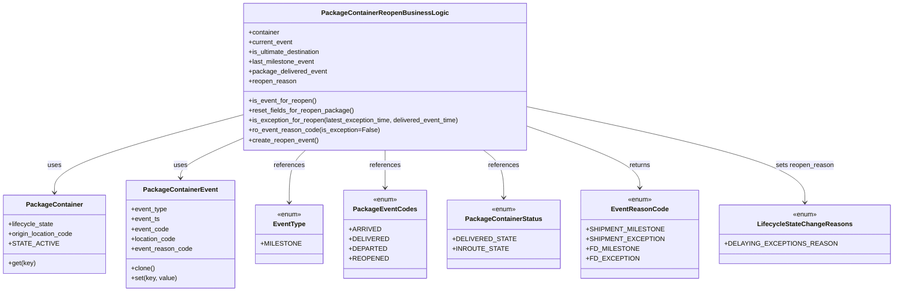
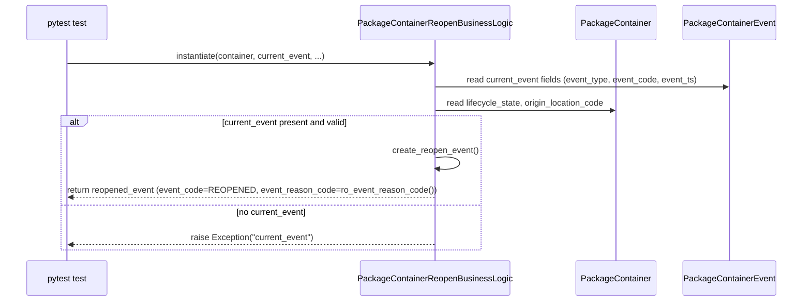

# Diagram: partview_core/partview_service/partview_service/tests/unit/business/package_container/event/package_container_reopen_business_logic_test.py

> Auto-generated by Obscura crawlers

## Diagram 1

### SVG

<svg id="container" width="2031.875" xmlns="http://www.w3.org/2000/svg" class="classDiagram" height="714" viewBox="0 0 2031.875 714" role="graphics-document document" aria-roledescription="class"><g><defs><marker id="container_class-aggregationStart" class="marker aggregation class" refX="18" refY="7" markerWidth="190" markerHeight="240" orient="auto"><path d="M 18,7 L9,13 L1,7 L9,1 Z"></path></marker></defs><defs><marker id="container_class-aggregationEnd" class="marker aggregation class" refX="1" refY="7" markerWidth="20" markerHeight="28" orient="auto"><path d="M 18,7 L9,13 L1,7 L9,1 Z"></path></marker></defs><defs><marker id="container_class-extensionStart" class="marker extension class" refX="18" refY="7" markerWidth="190" markerHeight="240" orient="auto"><path d="M 1,7 L18,13 V 1 Z"></path></marker></defs><defs><marker id="container_class-extensionEnd" class="marker extension class" refX="1" refY="7" markerWidth="20" markerHeight="28" orient="auto"><path d="M 1,1 V 13 L18,7 Z"></path></marker></defs><defs><marker id="container_class-compositionStart" class="marker composition class" refX="18" refY="7" markerWidth="190" markerHeight="240" orient="auto"><path d="M 18,7 L9,13 L1,7 L9,1 Z"></path></marker></defs><defs><marker id="container_class-compositionEnd" class="marker composition class" refX="1" refY="7" markerWidth="20" markerHeight="28" orient="auto"><path d="M 18,7 L9,13 L1,7 L9,1 Z"></path></marker></defs><defs><marker id="container_class-dependencyStart" class="marker dependency class" refX="6" refY="7" markerWidth="190" markerHeight="240" orient="auto"><path d="M 5,7 L9,13 L1,7 L9,1 Z"></path></marker></defs><defs><marker id="container_class-dependencyEnd" class="marker dependency class" refX="13" refY="7" markerWidth="20" markerHeight="28" orient="auto"><path d="M 18,7 L9,13 L14,7 L9,1 Z"></path></marker></defs><defs><marker id="container_class-lollipopStart" class="marker lollipop class" refX="13" refY="7" markerWidth="190" markerHeight="240" orient="auto"><circle stroke="black" fill="transparent" cx="7" cy="7" r="6"></circle></marker></defs><defs><marker id="container_class-lollipopEnd" class="marker lollipop class" refX="1" refY="7" markerWidth="190" markerHeight="240" orient="auto"><circle stroke="black" fill="transparent" cx="7" cy="7" r="6"></circle></marker></defs><g class="root"><g class="clusters"></g><g class="edgePaths"><path d="M561.957,284.706L490.46,304.755C418.964,324.804,275.97,364.902,204.473,396.118C132.977,427.333,132.977,449.667,132.977,460.833L132.977,472" id="id_PackageContainerReopenBusinessLogic_PackageContainer_1" class="edge-thickness-normal edge-pattern-solid relation" style=";;;" data-edge="true" data-et="edge" data-id="id_PackageContainerReopenBusinessLogic_PackageContainer_1" data-points="W3sieCI6NTYxLjk1NzAzMTI1LCJ5IjoyODQuNzA1OTk3ODU5NzEwMDd9LHsieCI6MTMyLjk3NjU2MjUsInkiOjQwNX0seyJ4IjoxMzIuOTc2NTYyNSwieSI6NDc4fV0=" marker-end="url(#container_class-dependencyEnd)"></path><path d="M561.957,347.311L541.144,356.926C520.331,366.541,478.704,385.77,457.891,400.552C437.078,415.333,437.078,425.667,437.078,430.833L437.078,436" id="id_PackageContainerReopenBusinessLogic_PackageContainerEvent_2" class="edge-thickness-normal edge-pattern-solid relation" style=";;;" data-edge="true" data-et="edge" data-id="id_PackageContainerReopenBusinessLogic_PackageContainerEvent_2" data-points="W3sieCI6NTYxLjk1NzAzMTI1LCJ5IjozNDcuMzExNDk4OTkzNzk2NX0seyJ4Ijo0MzcuMDc4MTI1LCJ5Ijo0MDV9LHsieCI6NDM3LjA3ODEyNSwieSI6NDQyfV0=" marker-end="url(#container_class-dependencyEnd)"></path><path d="M727.851,368L721.719,374.167C715.588,380.333,703.325,392.667,697.194,414C691.063,435.333,691.063,465.667,691.063,480.833L691.063,496" id="id_PackageContainerReopenBusinessLogic_EventType_3" class="edge-thickness-normal edge-pattern-solid relation" style=";;;" data-edge="true" data-et="edge" data-id="id_PackageContainerReopenBusinessLogic_EventType_3" data-points="W3sieCI6NzI3Ljg1MDY5ODQ0NDcwMDUsInkiOjM2OH0seyJ4Ijo2OTEuMDYyNSwieSI6NDA1fSx7IngiOjY5MS4wNjI1LCJ5Ijo1MDJ9XQ==" marker-end="url(#container_class-dependencyEnd)"></path><path d="M906.82,368L906.82,374.167C906.82,380.333,906.82,392.667,906.82,408C906.82,423.333,906.82,441.667,906.82,450.833L906.82,460" id="id_PackageContainerReopenBusinessLogic_PackageEventCodes_4" class="edge-thickness-normal edge-pattern-solid relation" style=";;;" data-edge="true" data-et="edge" data-id="id_PackageContainerReopenBusinessLogic_PackageEventCodes_4" data-points="W3sieCI6OTA2LjgyMDMxMjUsInkiOjM2OH0seyJ4Ijo5MDYuODIwMzEyNSwieSI6NDA1fSx7IngiOjkwNi44MjAzMTI1LCJ5Ijo0NjZ9XQ==" marker-end="url(#container_class-dependencyEnd)"></path><path d="M1126.082,368L1133.594,374.167C1141.105,380.333,1156.129,392.667,1163.641,412C1171.152,431.333,1171.152,457.667,1171.152,470.833L1171.152,484" id="id_PackageContainerReopenBusinessLogic_PackageContainerStatus_5" class="edge-thickness-normal edge-pattern-solid relation" style=";;;" data-edge="true" data-et="edge" data-id="id_PackageContainerReopenBusinessLogic_PackageContainerStatus_5" data-points="W3sieCI6MTEyNi4wODE5MDUyNDE5MzU2LCJ5IjozNjh9LHsieCI6MTE3MS4xNTIzNDM3NSwieSI6NDA1fSx7IngiOjExNzEuMTUyMzQzNzUsInkiOjQ5MH1d" marker-end="url(#container_class-dependencyEnd)"></path><path d="M1251.684,320.093L1288.629,334.244C1325.574,348.395,1399.465,376.698,1436.41,400.016C1473.355,423.333,1473.355,441.667,1473.355,450.833L1473.355,460" id="id_PackageContainerReopenBusinessLogic_EventReasonCode_6" class="edge-thickness-normal edge-pattern-solid relation" style=";;;" data-edge="true" data-et="edge" data-id="id_PackageContainerReopenBusinessLogic_EventReasonCode_6" data-points="W3sieCI6MTI1MS42ODM1OTM3NSwieSI6MzIwLjA5MzAwNjQxOTIyODd9LHsieCI6MTQ3My4zNTU0Njg3NSwieSI6NDA1fSx7IngiOjE0NzMuMzU1NDY4NzUsInkiOjQ2Nn1d" marker-end="url(#container_class-dependencyEnd)"></path><path d="M1251.684,268.366L1349.403,291.138C1447.122,313.911,1642.561,359.455,1740.281,397.394C1838,435.333,1838,465.667,1838,480.833L1838,496" id="id_PackageContainerReopenBusinessLogic_LifecycleStateChangeReasons_7" class="edge-thickness-normal edge-pattern-solid relation" style=";;;" data-edge="true" data-et="edge" data-id="id_PackageContainerReopenBusinessLogic_LifecycleStateChangeReasons_7" data-points="W3sieCI6MTI1MS42ODM1OTM3NSwieSI6MjY4LjM2NjE1NjAwMTcxMTU0fSx7IngiOjE4MzgsInkiOjQwNX0seyJ4IjoxODM4LCJ5Ijo1MDJ9XQ==" marker-end="url(#container_class-dependencyEnd)"></path></g><g class="edgeLabels"><g class="edgeLabel" transform="translate(132.9765625, 405)"><g class="label" data-id="id_PackageContainerReopenBusinessLogic_PackageContainer_1" transform="translate(-16.4921875, -12)"><foreignObject width="32.984375" height="24">

uses

</foreignObject></g></g><g class="edgeLabel" transform="translate(437.078125, 405)"><g class="label" data-id="id_PackageContainerReopenBusinessLogic_PackageContainerEvent_2" transform="translate(-16.4921875, -12)"><foreignObject width="32.984375" height="24">

uses

</foreignObject></g></g><g class="edgeLabel" transform="translate(691.0625, 405)"><g class="label" data-id="id_PackageContainerReopenBusinessLogic_EventType_3" transform="translate(-37.828125, -12)"><foreignObject width="75.65625" height="24">

references

</foreignObject></g></g><g class="edgeLabel" transform="translate(906.8203125, 405)"><g class="label" data-id="id_PackageContainerReopenBusinessLogic_PackageEventCodes_4" transform="translate(-37.828125, -12)"><foreignObject width="75.65625" height="24">

references

</foreignObject></g></g><g class="edgeLabel" transform="translate(1171.15234375, 405)"><g class="label" data-id="id_PackageContainerReopenBusinessLogic_PackageContainerStatus_5" transform="translate(-37.828125, -12)"><foreignObject width="75.65625" height="24">

references

</foreignObject></g></g><g class="edgeLabel" transform="translate(1473.35546875, 405)"><g class="label" data-id="id_PackageContainerReopenBusinessLogic_EventReasonCode_6" transform="translate(-26.265625, -12)"><foreignObject width="52.53125" height="24">

returns

</foreignObject></g></g><g class="edgeLabel" transform="translate(1838, 405)"><g class="label" data-id="id_PackageContainerReopenBusinessLogic_LifecycleStateChangeReasons_7" transform="translate(-71.1796875, -12)"><foreignObject width="142.359375" height="24">

sets reopen_reason

</foreignObject></g></g></g><g class="nodes"><g class="node default" id="classId-PackageContainerReopenBusinessLogic-0" transform="translate(906.8203125, 188)"><g class="basic label-container"><path d="M-344.86328125 -180 L344.86328125 -180 L344.86328125 180 L-344.86328125 180" stroke="none" stroke-width="0" fill="#ECECFF" style=""></path><path d="M-344.86328125 -180 C-80.2641142464189 -180, 184.3350527571622 -180, 344.86328125 -180 M-344.86328125 -180 C-202.74131649256552 -180, -60.61935173513103 -180, 344.86328125 -180 M344.86328125 -180 C344.86328125 -54.95206650204895, 344.86328125 70.0958669959021, 344.86328125 180 M344.86328125 -180 C344.86328125 -79.95990738801895, 344.86328125 20.080185223962104, 344.86328125 180 M344.86328125 180 C106.15772602867946 180, -132.54782919264107 180, -344.86328125 180 M344.86328125 180 C103.69790519686359 180, -137.46747085627283 180, -344.86328125 180 M-344.86328125 180 C-344.86328125 82.75645030509546, -344.86328125 -14.487099389809089, -344.86328125 -180 M-344.86328125 180 C-344.86328125 96.46157576311226, -344.86328125 12.92315152622453, -344.86328125 -180" stroke="#9370DB" stroke-width="1.3" fill="none" stroke-dasharray="0 0" style=""></path></g><g class="annotation-group text" transform="translate(0, -156)"></g><g class="label-group text" transform="translate(-144.5703125, -156)"><g class="label" style="font-weight: bolder" transform="translate(0,-12)"><foreignObject width="289.140625" height="24">

PackageContainerReopenBusinessLogic

</foreignObject></g></g><g class="members-group text" transform="translate(-332.86328125, -108)"><g class="label" style="" transform="translate(0,-12)"><foreignObject width="77.1875" height="24">

+container

</foreignObject></g><g class="label" style="" transform="translate(0,12)"><foreignObject width="108.875" height="24">

+current_event

</foreignObject></g><g class="label" style="" transform="translate(0,36)"><foreignObject width="179.4375" height="24">

+is_ultimate_destination

</foreignObject></g><g class="label" style="" transform="translate(0,60)"><foreignObject width="162.734375" height="24">

+last_milestone_event

</foreignObject></g><g class="label" style="" transform="translate(0,84)"><foreignObject width="190.984375" height="24">

+package_delivered_event

</foreignObject></g><g class="label" style="" transform="translate(0,108)"><foreignObject width="116.65625" height="24">

+reopen_reason

</foreignObject></g></g><g class="methods-group text" transform="translate(-332.86328125, 60)"><g class="label" style="" transform="translate(0,-12)"><foreignObject width="165.484375" height="24">

+is_event_for_reopen()

</foreignObject></g><g class="label" style="" transform="translate(0,12)"><foreignObject width="256.40625" height="24">

+reset_fields_for_reopen_package()

</foreignObject></g><g class="label" style="" transform="translate(0,36)"><foreignObject width="521.15625" height="24">

+is_exception_for_reopen(latest_exception_time, delivered_event_time)

</foreignObject></g><g class="label" style="" transform="translate(0,60)"><foreignObject width="316.421875" height="24">

+ro_event_reason_code(is_exception=False)

</foreignObject></g><g class="label" style="" transform="translate(0,84)"><foreignObject width="170.921875" height="24">

+create_reopen_event()

</foreignObject></g></g><g class="divider" style=""><path d="M-344.86328125 -132 C-182.94785878867455 -132, -21.032436327349103 -132, 344.86328125 -132 M-344.86328125 -132 C-121.60970872798862 -132, 101.64386379402276 -132, 344.86328125 -132" stroke="#9370DB" stroke-width="1.3" fill="none" stroke-dasharray="0 0" style=""></path></g><g class="divider" style=""><path d="M-344.86328125 36 C-176.8037855353703 36, -8.744289820740619 36, 344.86328125 36 M-344.86328125 36 C-120.81796393287675 36, 103.2273533842465 36, 344.86328125 36" stroke="#9370DB" stroke-width="1.3" fill="none" stroke-dasharray="0 0" style=""></path></g></g><g class="node default" id="classId-PackageContainer-1" transform="translate(132.9765625, 574)"><g class="basic label-container"><path d="M-124.9765625 -96 L124.9765625 -96 L124.9765625 96 L-124.9765625 96" stroke="none" stroke-width="0" fill="#ECECFF" style=""></path><path d="M-124.9765625 -96 C-33.951539015577936 -96, 57.07348446884413 -96, 124.9765625 -96 M-124.9765625 -96 C-60.06887620246323 -96, 4.838810095073541 -96, 124.9765625 -96 M124.9765625 -96 C124.9765625 -35.85581798632336, 124.9765625 24.288364027353282, 124.9765625 96 M124.9765625 -96 C124.9765625 -40.42869599480642, 124.9765625 15.142608010387164, 124.9765625 96 M124.9765625 96 C44.41109446320627 96, -36.15437357358746 96, -124.9765625 96 M124.9765625 96 C50.65485006871579 96, -23.666862362568423 96, -124.9765625 96 M-124.9765625 96 C-124.9765625 54.34476212022582, -124.9765625 12.689524240451647, -124.9765625 -96 M-124.9765625 96 C-124.9765625 20.64012949224673, -124.9765625 -54.71974101550654, -124.9765625 -96" stroke="#9370DB" stroke-width="1.3" fill="none" stroke-dasharray="0 0" style=""></path></g><g class="annotation-group text" transform="translate(0, -72)"></g><g class="label-group text" transform="translate(-65.453125, -72)"><g class="label" style="font-weight: bolder" transform="translate(0,-12)"><foreignObject width="130.90625" height="24">

PackageContainer

</foreignObject></g></g><g class="members-group text" transform="translate(-112.9765625, -24)"><g class="label" style="" transform="translate(0,-12)"><foreignObject width="111.640625" height="24">

+lifecycle_state

</foreignObject></g><g class="label" style="" transform="translate(0,12)"><foreignObject width="160.5" height="24">

+origin_location_code

</foreignObject></g><g class="label" style="" transform="translate(0,36)"><foreignObject width="104.96875" height="24">

+STATE_ACTIVE

</foreignObject></g></g><g class="methods-group text" transform="translate(-112.9765625, 72)"><g class="label" style="" transform="translate(0,-12)"><foreignObject width="65.5" height="24">

+get(key)

</foreignObject></g></g><g class="divider" style=""><path d="M-124.9765625 -48 C-73.41552320712867 -48, -21.854483914257344 -48, 124.9765625 -48 M-124.9765625 -48 C-55.299115525074996 -48, 14.378331449850009 -48, 124.9765625 -48" stroke="#9370DB" stroke-width="1.3" fill="none" stroke-dasharray="0 0" style=""></path></g><g class="divider" style=""><path d="M-124.9765625 48 C-41.18350797980476 48, 42.60954654039048 48, 124.9765625 48 M-124.9765625 48 C-45.87318120446021 48, 33.23020009107958 48, 124.9765625 48" stroke="#9370DB" stroke-width="1.3" fill="none" stroke-dasharray="0 0" style=""></path></g></g><g class="node default" id="classId-PackageContainerEvent-2" transform="translate(437.078125, 574)"><g class="basic label-container"><path d="M-129.125 -132 L129.125 -132 L129.125 132 L-129.125 132" stroke="none" stroke-width="0" fill="#ECECFF" style=""></path><path d="M-129.125 -132 C-55.6395070845618 -132, 17.8459858308764 -132, 129.125 -132 M-129.125 -132 C-31.456009583843382 -132, 66.21298083231324 -132, 129.125 -132 M129.125 -132 C129.125 -67.19562389701842, 129.125 -2.3912477940368433, 129.125 132 M129.125 -132 C129.125 -37.92038380315189, 129.125 56.159232393696215, 129.125 132 M129.125 132 C32.675766275594626 132, -63.77346744881075 132, -129.125 132 M129.125 132 C53.06905476275381 132, -22.986890474492384 132, -129.125 132 M-129.125 132 C-129.125 77.5641598703995, -129.125 23.128319740798972, -129.125 -132 M-129.125 132 C-129.125 70.19591952934904, -129.125 8.391839058698082, -129.125 -132" stroke="#9370DB" stroke-width="1.3" fill="none" stroke-dasharray="0 0" style=""></path></g><g class="annotation-group text" transform="translate(0, -108)"></g><g class="label-group text" transform="translate(-85.65625, -108)"><g class="label" style="font-weight: bolder" transform="translate(0,-12)"><foreignObject width="171.3125" height="24">

PackageContainerEvent

</foreignObject></g></g><g class="members-group text" transform="translate(-117.125, -60)"><g class="label" style="" transform="translate(0,-12)"><foreignObject width="88.125" height="24">

+event_type

</foreignObject></g><g class="label" style="" transform="translate(0,12)"><foreignObject width="69.578125" height="24">

+event_ts

</foreignObject></g><g class="label" style="" transform="translate(0,36)"><foreignObject width="91.28125" height="24">

+event_code

</foreignObject></g><g class="label" style="" transform="translate(0,60)"><foreignObject width="110.109375" height="24">

+location_code

</foreignObject></g><g class="label" style="" transform="translate(0,84)"><foreignObject width="148.59375" height="24">

+event_reason_code

</foreignObject></g></g><g class="methods-group text" transform="translate(-117.125, 84)"><g class="label" style="" transform="translate(0,-12)"><foreignObject width="58.0625" height="24">

+clone()

</foreignObject></g><g class="label" style="" transform="translate(0,12)"><foreignObject width="111.21875" height="24">

+set(key, value)

</foreignObject></g></g><g class="divider" style=""><path d="M-129.125 -84 C-43.310194099607784 -84, 42.50461180078443 -84, 129.125 -84 M-129.125 -84 C-76.3532327881261 -84, -23.581465576252214 -84, 129.125 -84" stroke="#9370DB" stroke-width="1.3" fill="none" stroke-dasharray="0 0" style=""></path></g><g class="divider" style=""><path d="M-129.125 60 C-73.30216735387013 60, -17.479334707740264 60, 129.125 60 M-129.125 60 C-77.18274308074612 60, -25.240486161492257 60, 129.125 60" stroke="#9370DB" stroke-width="1.3" fill="none" stroke-dasharray="0 0" style=""></path></g></g><g class="node default" id="classId-EventType-3" transform="translate(691.0625, 574)"><g class="basic label-container"><path d="M-74.859375 -72 L74.859375 -72 L74.859375 72 L-74.859375 72" stroke="none" stroke-width="0" fill="#ECECFF" style=""></path><path d="M-74.859375 -72 C-24.35659124942901 -72, 26.146192501141982 -72, 74.859375 -72 M-74.859375 -72 C-43.61129470466808 -72, -12.363214409336166 -72, 74.859375 -72 M74.859375 -72 C74.859375 -35.61519361119805, 74.859375 0.7696127776038963, 74.859375 72 M74.859375 -72 C74.859375 -41.91749201418793, 74.859375 -11.834984028375857, 74.859375 72 M74.859375 72 C42.88890207041631 72, 10.918429140832615 72, -74.859375 72 M74.859375 72 C23.40550273680533 72, -28.048369526389337 72, -74.859375 72 M-74.859375 72 C-74.859375 38.107670092638955, -74.859375 4.21534018527791, -74.859375 -72 M-74.859375 72 C-74.859375 39.83034617695995, -74.859375 7.660692353919899, -74.859375 -72" stroke="#9370DB" stroke-width="1.3" fill="none" stroke-dasharray="0 0" style=""></path></g><g class="annotation-group text" transform="translate(-29.53125, -48)"><g class="label" style="" transform="translate(0,-12)"><foreignObject width="59.0625" height="24">

«enum»

</foreignObject></g></g><g class="label-group text" transform="translate(-37.546875, -24)"><g class="label" style="font-weight: bolder" transform="translate(0,-12)"><foreignObject width="75.09375" height="24">

EventType

</foreignObject></g></g><g class="members-group text" transform="translate(-62.859375, 24)"><g class="label" style="" transform="translate(0,-12)"><foreignObject width="88.171875" height="24">

+MILESTONE

</foreignObject></g></g><g class="methods-group text" transform="translate(-62.859375, 72)"></g><g class="divider" style=""><path d="M-74.859375 0 C-21.180025292748716 0, 32.49932441450257 0, 74.859375 0 M-74.859375 0 C-37.273296728159295 0, 0.3127815436814103 0, 74.859375 0" stroke="#9370DB" stroke-width="1.3" fill="none" stroke-dasharray="0 0" style=""></path></g><g class="divider" style=""><path d="M-74.859375 48 C-21.05638786043051 48, 32.74659927913898 48, 74.859375 48 M-74.859375 48 C-38.57903956382508 48, -2.2987041276501543 48, 74.859375 48" stroke="#9370DB" stroke-width="1.3" fill="none" stroke-dasharray="0 0" style=""></path></g></g><g class="node default" id="classId-PackageEventCodes-4" transform="translate(906.8203125, 574)"><g class="basic label-container"><path d="M-90.8984375 -108 L90.8984375 -108 L90.8984375 108 L-90.8984375 108" stroke="none" stroke-width="0" fill="#ECECFF" style=""></path><path d="M-90.8984375 -108 C-22.608670765038696 -108, 45.68109596992261 -108, 90.8984375 -108 M-90.8984375 -108 C-51.60828097120088 -108, -12.318124442401754 -108, 90.8984375 -108 M90.8984375 -108 C90.8984375 -32.53640122321404, 90.8984375 42.927197553571915, 90.8984375 108 M90.8984375 -108 C90.8984375 -37.331908010423334, 90.8984375 33.33618397915333, 90.8984375 108 M90.8984375 108 C48.7936288371927 108, 6.688820174385398 108, -90.8984375 108 M90.8984375 108 C24.053516506053498 108, -42.791404487893004 108, -90.8984375 108 M-90.8984375 108 C-90.8984375 51.393111672223284, -90.8984375 -5.213776655553431, -90.8984375 -108 M-90.8984375 108 C-90.8984375 51.283416236151986, -90.8984375 -5.433167527696028, -90.8984375 -108" stroke="#9370DB" stroke-width="1.3" fill="none" stroke-dasharray="0 0" style=""></path></g><g class="annotation-group text" transform="translate(-29.53125, -84)"><g class="label" style="" transform="translate(0,-12)"><foreignObject width="59.0625" height="24">

«enum»

</foreignObject></g></g><g class="label-group text" transform="translate(-72.25, -60)"><g class="label" style="font-weight: bolder" transform="translate(0,-12)"><foreignObject width="144.5" height="24">

PackageEventCodes

</foreignObject></g></g><g class="members-group text" transform="translate(-78.8984375, -12)"><g class="label" style="" transform="translate(0,-12)"><foreignObject width="68.84375" height="24">

+ARRIVED

</foreignObject></g><g class="label" style="" transform="translate(0,12)"><foreignObject width="85.546875" height="24">

+DELIVERED

</foreignObject></g><g class="label" style="" transform="translate(0,36)"><foreignObject width="80.859375" height="24">

+DEPARTED

</foreignObject></g><g class="label" style="" transform="translate(0,60)"><foreignObject width="84.765625" height="24">

+REOPENED

</foreignObject></g></g><g class="methods-group text" transform="translate(-78.8984375, 108)"></g><g class="divider" style=""><path d="M-90.8984375 -36 C-32.25593405904599 -36, 26.386569381908018 -36, 90.8984375 -36 M-90.8984375 -36 C-43.50291172117639 -36, 3.892614057647222 -36, 90.8984375 -36" stroke="#9370DB" stroke-width="1.3" fill="none" stroke-dasharray="0 0" style=""></path></g><g class="divider" style=""><path d="M-90.8984375 84 C-48.49984665578343 84, -6.101255811566858 84, 90.8984375 84 M-90.8984375 84 C-49.61508737131096 84, -8.331737242621926 84, 90.8984375 84" stroke="#9370DB" stroke-width="1.3" fill="none" stroke-dasharray="0 0" style=""></path></g></g><g class="node default" id="classId-PackageContainerStatus-5" transform="translate(1171.15234375, 574)"><g class="basic label-container"><path d="M-123.43359375 -84 L123.43359375 -84 L123.43359375 84 L-123.43359375 84" stroke="none" stroke-width="0" fill="#ECECFF" style=""></path><path d="M-123.43359375 -84 C-70.44273567073355 -84, -17.451877591467124 -84, 123.43359375 -84 M-123.43359375 -84 C-61.84620870444871 -84, -0.25882365889742687 -84, 123.43359375 -84 M123.43359375 -84 C123.43359375 -31.75812459162669, 123.43359375 20.48375081674662, 123.43359375 84 M123.43359375 -84 C123.43359375 -46.15776467507926, 123.43359375 -8.315529350158513, 123.43359375 84 M123.43359375 84 C67.3974997344256 84, 11.361405718851188 84, -123.43359375 84 M123.43359375 84 C58.20968851830136 84, -7.014216713397275 84, -123.43359375 84 M-123.43359375 84 C-123.43359375 34.50159524888655, -123.43359375 -14.996809502226895, -123.43359375 -84 M-123.43359375 84 C-123.43359375 31.41646192059209, -123.43359375 -21.167076158815817, -123.43359375 -84" stroke="#9370DB" stroke-width="1.3" fill="none" stroke-dasharray="0 0" style=""></path></g><g class="annotation-group text" transform="translate(-29.53125, -60)"><g class="label" style="" transform="translate(0,-12)"><foreignObject width="59.0625" height="24">

«enum»

</foreignObject></g></g><g class="label-group text" transform="translate(-88.9296875, -36)"><g class="label" style="font-weight: bolder" transform="translate(0,-12)"><foreignObject width="177.859375" height="24">

PackageContainerStatus

</foreignObject></g></g><g class="members-group text" transform="translate(-111.43359375, 12)"><g class="label" style="" transform="translate(0,-12)"><foreignObject width="133.9375" height="24">

+DELIVERED_STATE

</foreignObject></g><g class="label" style="" transform="translate(0,12)"><foreignObject width="120.71875" height="24">

+INROUTE_STATE

</foreignObject></g></g><g class="methods-group text" transform="translate(-111.43359375, 84)"></g><g class="divider" style=""><path d="M-123.43359375 -12 C-46.58059545544906 -12, 30.272402839101886 -12, 123.43359375 -12 M-123.43359375 -12 C-26.570327060071676 -12, 70.29293962985665 -12, 123.43359375 -12" stroke="#9370DB" stroke-width="1.3" fill="none" stroke-dasharray="0 0" style=""></path></g><g class="divider" style=""><path d="M-123.43359375 60 C-33.69804812057305 60, 56.0374975088539 60, 123.43359375 60 M-123.43359375 60 C-57.3472021242046 60, 8.7391895015908 60, 123.43359375 60" stroke="#9370DB" stroke-width="1.3" fill="none" stroke-dasharray="0 0" style=""></path></g></g><g class="node default" id="classId-EventReasonCode-6" transform="translate(1473.35546875, 574)"><g class="basic label-container"><path d="M-128.76953125 -108 L128.76953125 -108 L128.76953125 108 L-128.76953125 108" stroke="none" stroke-width="0" fill="#ECECFF" style=""></path><path d="M-128.76953125 -108 C-67.30885106075662 -108, -5.848170871513247 -108, 128.76953125 -108 M-128.76953125 -108 C-51.994470412771946 -108, 24.780590424456108 -108, 128.76953125 -108 M128.76953125 -108 C128.76953125 -30.921828735272584, 128.76953125 46.15634252945483, 128.76953125 108 M128.76953125 -108 C128.76953125 -31.595975815149686, 128.76953125 44.80804836970063, 128.76953125 108 M128.76953125 108 C46.09474626706252 108, -36.58003871587496 108, -128.76953125 108 M128.76953125 108 C38.92258266929241 108, -50.92436591141518 108, -128.76953125 108 M-128.76953125 108 C-128.76953125 43.939176447130706, -128.76953125 -20.12164710573859, -128.76953125 -108 M-128.76953125 108 C-128.76953125 43.509457394312975, -128.76953125 -20.98108521137405, -128.76953125 -108" stroke="#9370DB" stroke-width="1.3" fill="none" stroke-dasharray="0 0" style=""></path></g><g class="annotation-group text" transform="translate(-29.53125, -84)"><g class="label" style="" transform="translate(0,-12)"><foreignObject width="59.0625" height="24">

«enum»

</foreignObject></g></g><g class="label-group text" transform="translate(-65.1484375, -60)"><g class="label" style="font-weight: bolder" transform="translate(0,-12)"><foreignObject width="130.296875" height="24">

EventReasonCode

</foreignObject></g></g><g class="members-group text" transform="translate(-116.76953125, -12)"><g class="label" style="" transform="translate(0,-12)"><foreignObject width="168.390625" height="24">

+SHIPMENT_MILESTONE

</foreignObject></g><g class="label" style="" transform="translate(0,12)"><foreignObject width="166.59375" height="24">

+SHIPMENT_EXCEPTION

</foreignObject></g><g class="label" style="" transform="translate(0,36)"><foreignObject width="114.015625" height="24">

+FD_MILESTONE

</foreignObject></g><g class="label" style="" transform="translate(0,60)"><foreignObject width="112.21875" height="24">

+FD_EXCEPTION

</foreignObject></g></g><g class="methods-group text" transform="translate(-116.76953125, 108)"></g><g class="divider" style=""><path d="M-128.76953125 -36 C-28.84215505248953 -36, 71.08522114502094 -36, 128.76953125 -36 M-128.76953125 -36 C-51.723156899089275 -36, 25.32321745182145 -36, 128.76953125 -36" stroke="#9370DB" stroke-width="1.3" fill="none" stroke-dasharray="0 0" style=""></path></g><g class="divider" style=""><path d="M-128.76953125 84 C-56.33234861821906 84, 16.104834013561884 84, 128.76953125 84 M-128.76953125 84 C-61.09500942335289 84, 6.579512403294217 84, 128.76953125 84" stroke="#9370DB" stroke-width="1.3" fill="none" stroke-dasharray="0 0" style=""></path></g></g><g class="node default" id="classId-LifecycleStateChangeReasons-7" transform="translate(1838, 574)"><g class="basic label-container"><path d="M-185.875 -72 L185.875 -72 L185.875 72 L-185.875 72" stroke="none" stroke-width="0" fill="#ECECFF" style=""></path><path d="M-185.875 -72 C-41.570736957051 -72, 102.733526085898 -72, 185.875 -72 M-185.875 -72 C-50.66303037901676 -72, 84.54893924196648 -72, 185.875 -72 M185.875 -72 C185.875 -30.75833540858767, 185.875 10.483329182824662, 185.875 72 M185.875 -72 C185.875 -24.420691390492067, 185.875 23.158617219015866, 185.875 72 M185.875 72 C37.69852666330479 72, -110.47794667339042 72, -185.875 72 M185.875 72 C50.868106959682876 72, -84.13878608063425 72, -185.875 72 M-185.875 72 C-185.875 15.920029756158002, -185.875 -40.159940487684, -185.875 -72 M-185.875 72 C-185.875 36.82907954773082, -185.875 1.6581590954616416, -185.875 -72" stroke="#9370DB" stroke-width="1.3" fill="none" stroke-dasharray="0 0" style=""></path></g><g class="annotation-group text" transform="translate(-29.53125, -48)"><g class="label" style="" transform="translate(0,-12)"><foreignObject width="59.0625" height="24">

«enum»

</foreignObject></g></g><g class="label-group text" transform="translate(-108.609375, -24)"><g class="label" style="font-weight: bolder" transform="translate(0,-12)"><foreignObject width="217.21875" height="24">

LifecycleStateChangeReasons

</foreignObject></g></g><g class="members-group text" transform="translate(-173.875, 24)"><g class="label" style="" transform="translate(0,-12)"><foreignObject width="239.140625" height="24">

+DELAYING_EXCEPTIONS_REASON

</foreignObject></g></g><g class="methods-group text" transform="translate(-173.875, 72)"></g><g class="divider" style=""><path d="M-185.875 0 C-99.8399160716396 0, -13.804832143279214 0, 185.875 0 M-185.875 0 C-55.95033288756764 0, 73.97433422486472 0, 185.875 0" stroke="#9370DB" stroke-width="1.3" fill="none" stroke-dasharray="0 0" style=""></path></g><g class="divider" style=""><path d="M-185.875 48 C-57.91428596023236 48, 70.04642807953527 48, 185.875 48 M-185.875 48 C-69.7107668830472 48, 46.4534662339056 48, 185.875 48" stroke="#9370DB" stroke-width="1.3" fill="none" stroke-dasharray="0 0" style=""></path></g></g></g></g></g></svg>

## Diagram 2

### SVG

<svg id="container" width="1610" xmlns="http://www.w3.org/2000/svg" height="589" viewBox="-50 -10 1610 589" role="graphics-document document" aria-roledescription="sequence"><g><rect x="1321" y="503" fill="#eaeaea" stroke="#666" width="189" height="65" name="Event" rx="3" ry="3" class="actor actor-bottom"></rect><text x="1415.5" y="535.5" dominant-baseline="central" alignment-baseline="central" class="actor actor-box" style="text-anchor: middle; font-size: 16px; font-weight: 400;"><tspan x="1415.5" dy="0">PackageContainerEvent</tspan></text></g><g><rect x="1121" y="503" fill="#eaeaea" stroke="#666" width="150" height="65" name="Container" rx="3" ry="3" class="actor actor-bottom"></rect><text x="1196" y="535.5" dominant-baseline="central" alignment-baseline="central" class="actor actor-box" style="text-anchor: middle; font-size: 16px; font-weight: 400;"><tspan x="1196" dy="0">PackageContainer</tspan></text></g><g><rect x="672.5" y="503" fill="#eaeaea" stroke="#666" width="305" height="65" name="Logic" rx="3" ry="3" class="actor actor-bottom"></rect><text x="825" y="535.5" dominant-baseline="central" alignment-baseline="central" class="actor actor-box" style="text-anchor: middle; font-size: 16px; font-weight: 400;"><tspan x="825" dy="0">PackageContainerReopenBusinessLogic</tspan></text></g><g><rect x="0" y="503" fill="#eaeaea" stroke="#666" width="150" height="65" name="Test" rx="3" ry="3" class="actor actor-bottom"></rect><text x="75" y="535.5" dominant-baseline="central" alignment-baseline="central" class="actor actor-box" style="text-anchor: middle; font-size: 16px; font-weight: 400;"><tspan x="75" dy="0">pytest test</tspan></text></g><g><line id="actor3" x1="1415.5" y1="65" x2="1415.5" y2="503" class="actor-line 200" stroke-width="0.5px" stroke="#999" name="Event"></line><g id="root-3"><rect x="1321" y="0" fill="#eaeaea" stroke="#666" width="189" height="65" name="Event" rx="3" ry="3" class="actor actor-top"></rect><text x="1415.5" y="32.5" dominant-baseline="central" alignment-baseline="central" class="actor actor-box" style="text-anchor: middle; font-size: 16px; font-weight: 400;"><tspan x="1415.5" dy="0">PackageContainerEvent</tspan></text></g></g><g><line id="actor2" x1="1196" y1="65" x2="1196" y2="503" class="actor-line 200" stroke-width="0.5px" stroke="#999" name="Container"></line><g id="root-2"><rect x="1121" y="0" fill="#eaeaea" stroke="#666" width="150" height="65" name="Container" rx="3" ry="3" class="actor actor-top"></rect><text x="1196" y="32.5" dominant-baseline="central" alignment-baseline="central" class="actor actor-box" style="text-anchor: middle; font-size: 16px; font-weight: 400;"><tspan x="1196" dy="0">PackageContainer</tspan></text></g></g><g><line id="actor1" x1="825" y1="65" x2="825" y2="503" class="actor-line 200" stroke-width="0.5px" stroke="#999" name="Logic"></line><g id="root-1"><rect x="672.5" y="0" fill="#eaeaea" stroke="#666" width="305" height="65" name="Logic" rx="3" ry="3" class="actor actor-top"></rect><text x="825" y="32.5" dominant-baseline="central" alignment-baseline="central" class="actor actor-box" style="text-anchor: middle; font-size: 16px; font-weight: 400;"><tspan x="825" dy="0">PackageContainerReopenBusinessLogic</tspan></text></g></g><g><line id="actor0" x1="75" y1="65" x2="75" y2="503" class="actor-line 200" stroke-width="0.5px" stroke="#999" name="Test"></line><g id="root-0"><rect x="0" y="0" fill="#eaeaea" stroke="#666" width="150" height="65" name="Test" rx="3" ry="3" class="actor actor-top"></rect><text x="75" y="32.5" dominant-baseline="central" alignment-baseline="central" class="actor actor-box" style="text-anchor: middle; font-size: 16px; font-weight: 400;"><tspan x="75" dy="0">pytest test</tspan></text></g></g><g></g><defs><symbol id="computer" width="24" height="24"><path transform="scale(.5)" d="M2 2v13h20v-13h-20zm18 11h-16v-9h16v9zm-10.228 6l.466-1h3.524l.467 1h-4.457zm14.228 3h-24l2-6h2.104l-1.33 4h18.45l-1.297-4h2.073l2 6zm-5-10h-14v-7h14v7z"></path></symbol></defs><defs><symbol id="database" fill-rule="evenodd" clip-rule="evenodd"><path transform="scale(.5)" d="M12.258.001l.256.004.255.005.253.008.251.01.249.012.247.015.246.016.242.019.241.02.239.023.236.024.233.027.231.028.229.031.225.032.223.034.22.036.217.038.214.04.211.041.208.043.205.045.201.046.198.048.194.05.191.051.187.053.183.054.18.056.175.057.172.059.168.06.163.061.16.063.155.064.15.066.074.033.073.033.071.034.07.034.069.035.068.035.067.035.066.035.064.036.064.036.062.036.06.036.06.037.058.037.058.037.055.038.055.038.053.038.052.038.051.039.05.039.048.039.047.039.045.04.044.04.043.04.041.04.04.041.039.041.037.041.036.041.034.041.033.042.032.042.03.042.029.042.027.042.026.043.024.043.023.043.021.043.02.043.018.044.017.043.015.044.013.044.012.044.011.045.009.044.007.045.006.045.004.045.002.045.001.045v17l-.001.045-.002.045-.004.045-.006.045-.007.045-.009.044-.011.045-.012.044-.013.044-.015.044-.017.043-.018.044-.02.043-.021.043-.023.043-.024.043-.026.043-.027.042-.029.042-.03.042-.032.042-.033.042-.034.041-.036.041-.037.041-.039.041-.04.041-.041.04-.043.04-.044.04-.045.04-.047.039-.048.039-.05.039-.051.039-.052.038-.053.038-.055.038-.055.038-.058.037-.058.037-.06.037-.06.036-.062.036-.064.036-.064.036-.066.035-.067.035-.068.035-.069.035-.07.034-.071.034-.073.033-.074.033-.15.066-.155.064-.16.063-.163.061-.168.06-.172.059-.175.057-.18.056-.183.054-.187.053-.191.051-.194.05-.198.048-.201.046-.205.045-.208.043-.211.041-.214.04-.217.038-.22.036-.223.034-.225.032-.229.031-.231.028-.233.027-.236.024-.239.023-.241.02-.242.019-.246.016-.247.015-.249.012-.251.01-.253.008-.255.005-.256.004-.258.001-.258-.001-.256-.004-.255-.005-.253-.008-.251-.01-.249-.012-.247-.015-.245-.016-.243-.019-.241-.02-.238-.023-.236-.024-.234-.027-.231-.028-.228-.031-.226-.032-.223-.034-.22-.036-.217-.038-.214-.04-.211-.041-.208-.043-.204-.045-.201-.046-.198-.048-.195-.05-.19-.051-.187-.053-.184-.054-.179-.056-.176-.057-.172-.059-.167-.06-.164-.061-.159-.063-.155-.064-.151-.066-.074-.033-.072-.033-.072-.034-.07-.034-.069-.035-.068-.035-.067-.035-.066-.035-.064-.036-.063-.036-.062-.036-.061-.036-.06-.037-.058-.037-.057-.037-.056-.038-.055-.038-.053-.038-.052-.038-.051-.039-.049-.039-.049-.039-.046-.039-.046-.04-.044-.04-.043-.04-.041-.04-.04-.041-.039-.041-.037-.041-.036-.041-.034-.041-.033-.042-.032-.042-.03-.042-.029-.042-.027-.042-.026-.043-.024-.043-.023-.043-.021-.043-.02-.043-.018-.044-.017-.043-.015-.044-.013-.044-.012-.044-.011-.045-.009-.044-.007-.045-.006-.045-.004-.045-.002-.045-.001-.045v-17l.001-.045.002-.045.004-.045.006-.045.007-.045.009-.044.011-.045.012-.044.013-.044.015-.044.017-.043.018-.044.02-.043.021-.043.023-.043.024-.043.026-.043.027-.042.029-.042.03-.042.032-.042.033-.042.034-.041.036-.041.037-.041.039-.041.04-.041.041-.04.043-.04.044-.04.046-.04.046-.039.049-.039.049-.039.051-.039.052-.038.053-.038.055-.038.056-.038.057-.037.058-.037.06-.037.061-.036.062-.036.063-.036.064-.036.066-.035.067-.035.068-.035.069-.035.07-.034.072-.034.072-.033.074-.033.151-.066.155-.064.159-.063.164-.061.167-.06.172-.059.176-.057.179-.056.184-.054.187-.053.19-.051.195-.05.198-.048.201-.046.204-.045.208-.043.211-.041.214-.04.217-.038.22-.036.223-.034.226-.032.228-.031.231-.028.234-.027.236-.024.238-.023.241-.02.243-.019.245-.016.247-.015.249-.012.251-.01.253-.008.255-.005.256-.004.258-.001.258.001zm-9.258 20.499v.01l.001.021.003.021.004.022.005.021.006.022.007.022.009.023.01.022.011.023.012.023.013.023.015.023.016.024.017.023.018.024.019.024.021.024.022.025.023.024.024.025.052.049.056.05.061.051.066.051.07.051.075.051.079.052.084.052.088.052.092.052.097.052.102.051.105.052.11.052.114.051.119.051.123.051.127.05.131.05.135.05.139.048.144.049.147.047.152.047.155.047.16.045.163.045.167.043.171.043.176.041.178.041.183.039.187.039.19.037.194.035.197.035.202.033.204.031.209.03.212.029.216.027.219.025.222.024.226.021.23.02.233.018.236.016.24.015.243.012.246.01.249.008.253.005.256.004.259.001.26-.001.257-.004.254-.005.25-.008.247-.011.244-.012.241-.014.237-.016.233-.018.231-.021.226-.021.224-.024.22-.026.216-.027.212-.028.21-.031.205-.031.202-.034.198-.034.194-.036.191-.037.187-.039.183-.04.179-.04.175-.042.172-.043.168-.044.163-.045.16-.046.155-.046.152-.047.148-.048.143-.049.139-.049.136-.05.131-.05.126-.05.123-.051.118-.052.114-.051.11-.052.106-.052.101-.052.096-.052.092-.052.088-.053.083-.051.079-.052.074-.052.07-.051.065-.051.06-.051.056-.05.051-.05.023-.024.023-.025.021-.024.02-.024.019-.024.018-.024.017-.024.015-.023.014-.024.013-.023.012-.023.01-.023.01-.022.008-.022.006-.022.006-.022.004-.022.004-.021.001-.021.001-.021v-4.127l-.077.055-.08.053-.083.054-.085.053-.087.052-.09.052-.093.051-.095.05-.097.05-.1.049-.102.049-.105.048-.106.047-.109.047-.111.046-.114.045-.115.045-.118.044-.12.043-.122.042-.124.042-.126.041-.128.04-.13.04-.132.038-.134.038-.135.037-.138.037-.139.035-.142.035-.143.034-.144.033-.147.032-.148.031-.15.03-.151.03-.153.029-.154.027-.156.027-.158.026-.159.025-.161.024-.162.023-.163.022-.165.021-.166.02-.167.019-.169.018-.169.017-.171.016-.173.015-.173.014-.175.013-.175.012-.177.011-.178.01-.179.008-.179.008-.181.006-.182.005-.182.004-.184.003-.184.002h-.37l-.184-.002-.184-.003-.182-.004-.182-.005-.181-.006-.179-.008-.179-.008-.178-.01-.176-.011-.176-.012-.175-.013-.173-.014-.172-.015-.171-.016-.17-.017-.169-.018-.167-.019-.166-.02-.165-.021-.163-.022-.162-.023-.161-.024-.159-.025-.157-.026-.156-.027-.155-.027-.153-.029-.151-.03-.15-.03-.148-.031-.146-.032-.145-.033-.143-.034-.141-.035-.14-.035-.137-.037-.136-.037-.134-.038-.132-.038-.13-.04-.128-.04-.126-.041-.124-.042-.122-.042-.12-.044-.117-.043-.116-.045-.113-.045-.112-.046-.109-.047-.106-.047-.105-.048-.102-.049-.1-.049-.097-.05-.095-.05-.093-.052-.09-.051-.087-.052-.085-.053-.083-.054-.08-.054-.077-.054v4.127zm0-5.654v.011l.001.021.003.021.004.021.005.022.006.022.007.022.009.022.01.022.011.023.012.023.013.023.015.024.016.023.017.024.018.024.019.024.021.024.022.024.023.025.024.024.052.05.056.05.061.05.066.051.07.051.075.052.079.051.084.052.088.052.092.052.097.052.102.052.105.052.11.051.114.051.119.052.123.05.127.051.131.05.135.049.139.049.144.048.147.048.152.047.155.046.16.045.163.045.167.044.171.042.176.042.178.04.183.04.187.038.19.037.194.036.197.034.202.033.204.032.209.03.212.028.216.027.219.025.222.024.226.022.23.02.233.018.236.016.24.014.243.012.246.01.249.008.253.006.256.003.259.001.26-.001.257-.003.254-.006.25-.008.247-.01.244-.012.241-.015.237-.016.233-.018.231-.02.226-.022.224-.024.22-.025.216-.027.212-.029.21-.03.205-.032.202-.033.198-.035.194-.036.191-.037.187-.039.183-.039.179-.041.175-.042.172-.043.168-.044.163-.045.16-.045.155-.047.152-.047.148-.048.143-.048.139-.05.136-.049.131-.05.126-.051.123-.051.118-.051.114-.052.11-.052.106-.052.101-.052.096-.052.092-.052.088-.052.083-.052.079-.052.074-.051.07-.052.065-.051.06-.05.056-.051.051-.049.023-.025.023-.024.021-.025.02-.024.019-.024.018-.024.017-.024.015-.023.014-.023.013-.024.012-.022.01-.023.01-.023.008-.022.006-.022.006-.022.004-.021.004-.022.001-.021.001-.021v-4.139l-.077.054-.08.054-.083.054-.085.052-.087.053-.09.051-.093.051-.095.051-.097.05-.1.049-.102.049-.105.048-.106.047-.109.047-.111.046-.114.045-.115.044-.118.044-.12.044-.122.042-.124.042-.126.041-.128.04-.13.039-.132.039-.134.038-.135.037-.138.036-.139.036-.142.035-.143.033-.144.033-.147.033-.148.031-.15.03-.151.03-.153.028-.154.028-.156.027-.158.026-.159.025-.161.024-.162.023-.163.022-.165.021-.166.02-.167.019-.169.018-.169.017-.171.016-.173.015-.173.014-.175.013-.175.012-.177.011-.178.009-.179.009-.179.007-.181.007-.182.005-.182.004-.184.003-.184.002h-.37l-.184-.002-.184-.003-.182-.004-.182-.005-.181-.007-.179-.007-.179-.009-.178-.009-.176-.011-.176-.012-.175-.013-.173-.014-.172-.015-.171-.016-.17-.017-.169-.018-.167-.019-.166-.02-.165-.021-.163-.022-.162-.023-.161-.024-.159-.025-.157-.026-.156-.027-.155-.028-.153-.028-.151-.03-.15-.03-.148-.031-.146-.033-.145-.033-.143-.033-.141-.035-.14-.036-.137-.036-.136-.037-.134-.038-.132-.039-.13-.039-.128-.04-.126-.041-.124-.042-.122-.043-.12-.043-.117-.044-.116-.044-.113-.046-.112-.046-.109-.046-.106-.047-.105-.048-.102-.049-.1-.049-.097-.05-.095-.051-.093-.051-.09-.051-.087-.053-.085-.052-.083-.054-.08-.054-.077-.054v4.139zm0-5.666v.011l.001.02.003.022.004.021.005.022.006.021.007.022.009.023.01.022.011.023.012.023.013.023.015.023.016.024.017.024.018.023.019.024.021.025.022.024.023.024.024.025.052.05.056.05.061.05.066.051.07.051.075.052.079.051.084.052.088.052.092.052.097.052.102.052.105.051.11.052.114.051.119.051.123.051.127.05.131.05.135.05.139.049.144.048.147.048.152.047.155.046.16.045.163.045.167.043.171.043.176.042.178.04.183.04.187.038.19.037.194.036.197.034.202.033.204.032.209.03.212.028.216.027.219.025.222.024.226.021.23.02.233.018.236.017.24.014.243.012.246.01.249.008.253.006.256.003.259.001.26-.001.257-.003.254-.006.25-.008.247-.01.244-.013.241-.014.237-.016.233-.018.231-.02.226-.022.224-.024.22-.025.216-.027.212-.029.21-.03.205-.032.202-.033.198-.035.194-.036.191-.037.187-.039.183-.039.179-.041.175-.042.172-.043.168-.044.163-.045.16-.045.155-.047.152-.047.148-.048.143-.049.139-.049.136-.049.131-.051.126-.05.123-.051.118-.052.114-.051.11-.052.106-.052.101-.052.096-.052.092-.052.088-.052.083-.052.079-.052.074-.052.07-.051.065-.051.06-.051.056-.05.051-.049.023-.025.023-.025.021-.024.02-.024.019-.024.018-.024.017-.024.015-.023.014-.024.013-.023.012-.023.01-.022.01-.023.008-.022.006-.022.006-.022.004-.022.004-.021.001-.021.001-.021v-4.153l-.077.054-.08.054-.083.053-.085.053-.087.053-.09.051-.093.051-.095.051-.097.05-.1.049-.102.048-.105.048-.106.048-.109.046-.111.046-.114.046-.115.044-.118.044-.12.043-.122.043-.124.042-.126.041-.128.04-.13.039-.132.039-.134.038-.135.037-.138.036-.139.036-.142.034-.143.034-.144.033-.147.032-.148.032-.15.03-.151.03-.153.028-.154.028-.156.027-.158.026-.159.024-.161.024-.162.023-.163.023-.165.021-.166.02-.167.019-.169.018-.169.017-.171.016-.173.015-.173.014-.175.013-.175.012-.177.01-.178.01-.179.009-.179.007-.181.006-.182.006-.182.004-.184.003-.184.001-.185.001-.185-.001-.184-.001-.184-.003-.182-.004-.182-.006-.181-.006-.179-.007-.179-.009-.178-.01-.176-.01-.176-.012-.175-.013-.173-.014-.172-.015-.171-.016-.17-.017-.169-.018-.167-.019-.166-.02-.165-.021-.163-.023-.162-.023-.161-.024-.159-.024-.157-.026-.156-.027-.155-.028-.153-.028-.151-.03-.15-.03-.148-.032-.146-.032-.145-.033-.143-.034-.141-.034-.14-.036-.137-.036-.136-.037-.134-.038-.132-.039-.13-.039-.128-.041-.126-.041-.124-.041-.122-.043-.12-.043-.117-.044-.116-.044-.113-.046-.112-.046-.109-.046-.106-.048-.105-.048-.102-.048-.1-.05-.097-.049-.095-.051-.093-.051-.09-.052-.087-.052-.085-.053-.083-.053-.08-.054-.077-.054v4.153zm8.74-8.179l-.257.004-.254.005-.25.008-.247.011-.244.012-.241.014-.237.016-.233.018-.231.021-.226.022-.224.023-.22.026-.216.027-.212.028-.21.031-.205.032-.202.033-.198.034-.194.036-.191.038-.187.038-.183.04-.179.041-.175.042-.172.043-.168.043-.163.045-.16.046-.155.046-.152.048-.148.048-.143.048-.139.049-.136.05-.131.05-.126.051-.123.051-.118.051-.114.052-.11.052-.106.052-.101.052-.096.052-.092.052-.088.052-.083.052-.079.052-.074.051-.07.052-.065.051-.06.05-.056.05-.051.05-.023.025-.023.024-.021.024-.02.025-.019.024-.018.024-.017.023-.015.024-.014.023-.013.023-.012.023-.01.023-.01.022-.008.022-.006.023-.006.021-.004.022-.004.021-.001.021-.001.021.001.021.001.021.004.021.004.022.006.021.006.023.008.022.01.022.01.023.012.023.013.023.014.023.015.024.017.023.018.024.019.024.02.025.021.024.023.024.023.025.051.05.056.05.06.05.065.051.07.052.074.051.079.052.083.052.088.052.092.052.096.052.101.052.106.052.11.052.114.052.118.051.123.051.126.051.131.05.136.05.139.049.143.048.148.048.152.048.155.046.16.046.163.045.168.043.172.043.175.042.179.041.183.04.187.038.191.038.194.036.198.034.202.033.205.032.21.031.212.028.216.027.22.026.224.023.226.022.231.021.233.018.237.016.241.014.244.012.247.011.25.008.254.005.257.004.26.001.26-.001.257-.004.254-.005.25-.008.247-.011.244-.012.241-.014.237-.016.233-.018.231-.021.226-.022.224-.023.22-.026.216-.027.212-.028.21-.031.205-.032.202-.033.198-.034.194-.036.191-.038.187-.038.183-.04.179-.041.175-.042.172-.043.168-.043.163-.045.16-.046.155-.046.152-.048.148-.048.143-.048.139-.049.136-.05.131-.05.126-.051.123-.051.118-.051.114-.052.11-.052.106-.052.101-.052.096-.052.092-.052.088-.052.083-.052.079-.052.074-.051.07-.052.065-.051.06-.05.056-.05.051-.05.023-.025.023-.024.021-.024.02-.025.019-.024.018-.024.017-.023.015-.024.014-.023.013-.023.012-.023.01-.023.01-.022.008-.022.006-.023.006-.021.004-.022.004-.021.001-.021.001-.021-.001-.021-.001-.021-.004-.021-.004-.022-.006-.021-.006-.023-.008-.022-.01-.022-.01-.023-.012-.023-.013-.023-.014-.023-.015-.024-.017-.023-.018-.024-.019-.024-.02-.025-.021-.024-.023-.024-.023-.025-.051-.05-.056-.05-.06-.05-.065-.051-.07-.052-.074-.051-.079-.052-.083-.052-.088-.052-.092-.052-.096-.052-.101-.052-.106-.052-.11-.052-.114-.052-.118-.051-.123-.051-.126-.051-.131-.05-.136-.05-.139-.049-.143-.048-.148-.048-.152-.048-.155-.046-.16-.046-.163-.045-.168-.043-.172-.043-.175-.042-.179-.041-.183-.04-.187-.038-.191-.038-.194-.036-.198-.034-.202-.033-.205-.032-.21-.031-.212-.028-.216-.027-.22-.026-.224-.023-.226-.022-.231-.021-.233-.018-.237-.016-.241-.014-.244-.012-.247-.011-.25-.008-.254-.005-.257-.004-.26-.001-.26.001z"></path></symbol></defs><defs><symbol id="clock" width="24" height="24"><path transform="scale(.5)" d="M12 2c5.514 0 10 4.486 10 10s-4.486 10-10 10-10-4.486-10-10 4.486-10 10-10zm0-2c-6.627 0-12 5.373-12 12s5.373 12 12 12 12-5.373 12-12-5.373-12-12-12zm5.848 12.459c.202.038.202.333.001.372-1.907.361-6.045 1.111-6.547 1.111-.719 0-1.301-.582-1.301-1.301 0-.512.77-5.447 1.125-7.445.034-.192.312-.181.343.014l.985 6.238 5.394 1.011z"></path></symbol></defs><defs><marker id="arrowhead" refX="7.9" refY="5" markerUnits="userSpaceOnUse" markerWidth="12" markerHeight="12" orient="auto-start-reverse"><path d="M -1 0 L 10 5 L 0 10 z"></path></marker></defs><defs><marker id="crosshead" markerWidth="15" markerHeight="8" orient="auto" refX="4" refY="4.5"><path fill="none" stroke="#000000" stroke-width="1pt" d="M 1,2 L 6,7 M 6,2 L 1,7" style="stroke-dasharray: 0, 0;"></path></marker></defs><defs><marker id="filled-head" refX="15.5" refY="7" markerWidth="20" markerHeight="28" orient="auto"><path d="M 18,7 L9,13 L14,7 L9,1 Z"></path></marker></defs><defs><marker id="sequencenumber" refX="15" refY="15" markerWidth="60" markerHeight="40" orient="auto"><circle cx="15" cy="15" r="6"></circle></marker></defs><g><line x1="64" y1="219" x2="917.5" y2="219" class="loopLine"></line><line x1="917.5" y1="219" x2="917.5" y2="483" class="loopLine"></line><line x1="64" y1="483" x2="917.5" y2="483" class="loopLine"></line><line x1="64" y1="219" x2="64" y2="483" class="loopLine"></line><line x1="64" y1="395" x2="917.5" y2="395" class="loopLine" style="stroke-dasharray: 3, 3;"></line><polygon points="64,219 114,219 114,232 105.6,239 64,239" class="labelBox"></polygon><text x="89" y="232" text-anchor="middle" dominant-baseline="middle" alignment-baseline="middle" class="labelText" style="font-size: 16px; font-weight: 400;">alt</text><text x="515.75" y="237" text-anchor="middle" class="loopText" style="font-size: 16px; font-weight: 400;"><tspan x="515.75">[current_event present and valid]</tspan></text><text x="490.75" y="413" text-anchor="middle" class="loopText" style="font-size: 16px; font-weight: 400;">[no current_event]</text></g><text x="449" y="80" text-anchor="middle" dominant-baseline="middle" alignment-baseline="middle" class="messageText" dy="1em" style="font-size: 16px; font-weight: 400;">instantiate(container, current_event, ...)</text><line x1="76" y1="113" x2="821" y2="113" class="messageLine0" stroke-width="2" stroke="none" marker-end="url(#arrowhead)" style="fill: none;"></line><text x="1119" y="128" text-anchor="middle" dominant-baseline="middle" alignment-baseline="middle" class="messageText" dy="1em" style="font-size: 16px; font-weight: 400;">read current_event fields (event_type, event_code, event_ts)</text><line x1="826" y1="161" x2="1411.5" y2="161" class="messageLine0" stroke-width="2" stroke="none" marker-end="url(#arrowhead)" style="fill: none;"></line><text x="1009" y="176" text-anchor="middle" dominant-baseline="middle" alignment-baseline="middle" class="messageText" dy="1em" style="font-size: 16px; font-weight: 400;">read lifecycle_state, origin_location_code</text><line x1="826" y1="209" x2="1192" y2="209" class="messageLine0" stroke-width="2" stroke="none" marker-end="url(#arrowhead)" style="fill: none;"></line><text x="826" y="269" text-anchor="middle" dominant-baseline="middle" alignment-baseline="middle" class="messageText" dy="1em" style="font-size: 16px; font-weight: 400;">create_reopen_event()</text><path d="M 826,302 C 886,292 886,332 826,322" class="messageLine0" stroke-width="2" stroke="none" marker-end="url(#arrowhead)" style="fill: none;"></path><text x="452" y="347" text-anchor="middle" dominant-baseline="middle" alignment-baseline="middle" class="messageText" dy="1em" style="font-size: 16px; font-weight: 400;">return reopened_event (event_code=REOPENED, event_reason_code=ro_event_reason_code())</text><line x1="824" y1="380" x2="79" y2="380" class="messageLine1" stroke-width="2" stroke="none" marker-end="url(#arrowhead)" style="stroke-dasharray: 3, 3; fill: none;"></line><text x="452" y="440" text-anchor="middle" dominant-baseline="middle" alignment-baseline="middle" class="messageText" dy="1em" style="font-size: 16px; font-weight: 400;">raise Exception("current_event")</text><line x1="824" y1="473" x2="79" y2="473" class="messageLine1" stroke-width="2" stroke="none" marker-end="url(#arrowhead)" style="stroke-dasharray: 3, 3; fill: none;"></line></svg>
