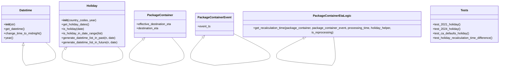

# Diagram: partview_core/partview_service/partview_service/tests/unit/business/package_container/event/test_eta_holiday.py


> Auto-generated by Obscura crawlers

## Diagram 1



### SVG

<svg id="container" width="2734.5234375" xmlns="http://www.w3.org/2000/svg" class="classDiagram" height="362.25" viewBox="0 0 2734.5234375 362.25" role="graphics-document document" aria-roledescription="class"><style>#container{font-family:"trebuchet ms",verdana,arial,sans-serif;font-size:16px;fill:#333;}@keyframes edge-animation-frame{from{stroke-dashoffset:0;}}@keyframes dash{to{stroke-dashoffset:0;}}#container .edge-animation-slow{stroke-dasharray:9,5!important;stroke-dashoffset:900;animation:dash 50s linear infinite;stroke-linecap:round;}#container .edge-animation-fast{stroke-dasharray:9,5!important;stroke-dashoffset:900;animation:dash 20s linear infinite;stroke-linecap:round;}#container .error-icon{fill:#552222;}#container .error-text{fill:#552222;stroke:#552222;}#container .edge-thickness-normal{stroke-width:1px;}#container .edge-thickness-thick{stroke-width:3.5px;}#container .edge-pattern-solid{stroke-dasharray:0;}#container .edge-thickness-invisible{stroke-width:0;fill:none;}#container .edge-pattern-dashed{stroke-dasharray:3;}#container .edge-pattern-dotted{stroke-dasharray:2;}#container .marker{fill:#333333;stroke:#333333;}#container .marker.cross{stroke:#333333;}#container svg{font-family:"trebuchet ms",verdana,arial,sans-serif;font-size:16px;}#container p{margin:0;}#container g.classGroup text{fill:#9370DB;stroke:none;font-family:"trebuchet ms",verdana,arial,sans-serif;font-size:10px;}#container g.classGroup text .title{font-weight:bolder;}#container .nodeLabel,#container .edgeLabel{color:#131300;}#container .edgeLabel .label rect{fill:#ECECFF;}#container .label text{fill:#131300;}#container .labelBkg{background:#ECECFF;}#container .edgeLabel .label span{background:#ECECFF;}#container .classTitle{font-weight:bolder;}#container .node rect,#container .node circle,#container .node ellipse,#container .node polygon,#container .node path{fill:#ECECFF;stroke:#9370DB;stroke-width:1px;}#container .divider{stroke:#9370DB;stroke-width:1;}#container g.clickable{cursor:pointer;}#container g.classGroup rect{fill:#ECECFF;stroke:#9370DB;}#container g.classGroup line{stroke:#9370DB;stroke-width:1;}#container .classLabel .box{stroke:none;stroke-width:0;fill:#ECECFF;opacity:0.5;}#container .classLabel .label{fill:#9370DB;font-size:10px;}#container .relation{stroke:#333333;stroke-width:1;fill:none;}#container .dashed-line{stroke-dasharray:3;}#container .dotted-line{stroke-dasharray:1 2;}#container #compositionStart,#container .composition{fill:#333333!important;stroke:#333333!important;stroke-width:1;}#container #compositionEnd,#container .composition{fill:#333333!important;stroke:#333333!important;stroke-width:1;}#container #dependencyStart,#container .dependency{fill:#333333!important;stroke:#333333!important;stroke-width:1;}#container #dependencyStart,#container .dependency{fill:#333333!important;stroke:#333333!important;stroke-width:1;}#container #extensionStart,#container .extension{fill:transparent!important;stroke:#333333!important;stroke-width:1;}#container #extensionEnd,#container .extension{fill:transparent!important;stroke:#333333!important;stroke-width:1;}#container #aggregationStart,#container .aggregation{fill:transparent!important;stroke:#333333!important;stroke-width:1;}#container #aggregationEnd,#container .aggregation{fill:transparent!important;stroke:#333333!important;stroke-width:1;}#container #lollipopStart,#container .lollipop{fill:#ECECFF!important;stroke:#333333!important;stroke-width:1;}#container #lollipopEnd,#container .lollipop{fill:#ECECFF!important;stroke:#333333!important;stroke-width:1;}#container .edgeTerminals{font-size:11px;line-height:initial;}#container .classTitleText{text-anchor:middle;font-size:18px;fill:#333;}#container .label-icon{display:inline-block;height:1em;overflow:visible;vertical-align:-0.125em;}#container .node .label-icon path{fill:currentColor;stroke:revert;stroke-width:revert;}#container :root{--mermaid-font-family:"trebuchet ms",verdana,arial,sans-serif;}</style><g><defs><marker id="container_class-aggregationStart" class="marker aggregation class" refX="18" refY="7" markerWidth="190" markerHeight="240" orient="auto"><path d="M 18,7 L9,13 L1,7 L9,1 Z"></path></marker></defs><defs><marker id="container_class-aggregationEnd" class="marker aggregation class" refX="1" refY="7" markerWidth="20" markerHeight="28" orient="auto"><path d="M 18,7 L9,13 L1,7 L9,1 Z"></path></marker></defs><defs><marker id="container_class-extensionStart" class="marker extension class" refX="18" refY="7" markerWidth="190" markerHeight="240" orient="auto"><path d="M 1,7 L18,13 V 1 Z"></path></marker></defs><defs><marker id="container_class-extensionEnd" class="marker extension class" refX="1" refY="7" markerWidth="20" markerHeight="28" orient="auto"><path d="M 1,1 V 13 L18,7 Z"></path></marker></defs><defs><marker id="container_class-compositionStart" class="marker composition class" refX="18" refY="7" markerWidth="190" markerHeight="240" orient="auto"><path d="M 18,7 L9,13 L1,7 L9,1 Z"></path></marker></defs><defs><marker id="container_class-compositionEnd" class="marker composition class" refX="1" refY="7" markerWidth="20" markerHeight="28" orient="auto"><path d="M 18,7 L9,13 L1,7 L9,1 Z"></path></marker></defs><defs><marker id="container_class-dependencyStart" class="marker dependency class" refX="6" refY="7" markerWidth="190" markerHeight="240" orient="auto"><path d="M 5,7 L9,13 L1,7 L9,1 Z"></path></marker></defs><defs><marker id="container_class-dependencyEnd" class="marker dependency class" refX="13" refY="7" markerWidth="20" markerHeight="28" orient="auto"><path d="M 18,7 L9,13 L14,7 L9,1 Z"></path></marker></defs><defs><marker id="container_class-lollipopStart" class="marker lollipop class" refX="13" refY="7" markerWidth="190" markerHeight="240" orient="auto"><circle stroke="black" fill="transparent" cx="7" cy="7" r="6"></circle></marker></defs><defs><marker id="container_class-lollipopEnd" class="marker lollipop class" refX="1" refY="7" markerWidth="190" markerHeight="240" orient="auto"><circle stroke="black" fill="transparent" cx="7" cy="7" r="6"></circle></marker></defs><g class="root"><g class="clusters"></g><g class="edgePaths"><path d="M126.128,247.13L125.499,252.442C124.87,257.754,123.612,268.377,122.983,277.855C122.354,287.333,122.354,295.667,122.354,299.833L122.354,304" id="Datetime-cyclic-special-1" class="edge-thickness-normal edge-pattern-solid relation" style=";;;" data-edge="true" data-et="edge" data-id="Datetime-cyclic-special-1" data-points="W3sieCI6MTI4LjE1NjEwMjE5NTY5Njc1LCJ5IjoyMzB9LHsieCI6MTIyLjM1MzkwNjI0OTYyNzQ3LCJ5IjoyNzl9LHsieCI6MTIyLjM1MzkwNjI0OTYyNzQ3LCJ5IjozMDR9XQ==" marker-start="url(#container_class-extensionStart)"></path><path d="M122.354,304.1L122.354,308.267C122.354,312.433,122.354,320.767,125.269,329.1C128.184,337.433,134.014,345.767,136.929,349.933L139.844,354.1" id="Datetime-cyclic-special-mid" class="edge-thickness-normal edge-pattern-solid relation" style=";;;" data-edge="true" data-et="edge" data-id="Datetime-cyclic-special-mid" data-points="W3sieCI6MTIyLjM1MzkwNjI0OTYyNzQ3LCJ5IjozMDQuMTAwMDAwMDAxNDkwMX0seyJ4IjoxMjIuMzUzOTA2MjQ5NjI3NDcsInkiOjMyOS4xMDAwMDAwMDE0OTAxfSx7IngiOjEzOS44NDM5MjYyMDk1NTg5LCJ5IjozNTQuMTAwMDAwMDAxNDkwMX1d"></path><path d="M139.929,354.142L167.208,349.969C194.488,345.795,249.047,337.447,276.326,329.099C303.606,320.75,303.606,312.4,303.606,304.05C303.606,295.7,303.606,287.35,294.571,275.008C285.537,262.667,267.468,246.333,258.433,238.167L249.399,230" id="Datetime-cyclic-special-2" class="edge-thickness-normal edge-pattern-solid relation" style=";;;" data-edge="true" data-et="edge" data-id="Datetime-cyclic-special-2" data-points="W3sieCI6MTM5LjkyODkwNjI1MDc0NTA2LCJ5IjozNTQuMTQyMzUwMDcwNDc1fSx7IngiOjMwMy42MDU4NTkzNzQ2Mjc0NywieSI6MzI5LjEwMDAwMDAwMTQ5MDF9LHsieCI6MzAzLjYwNTg1OTM3NDYyNzQ3LCJ5IjozMDQuMDUwMDAwMDAwNzQ1MDZ9LHsieCI6MzAzLjYwNTg1OTM3NDYyNzQ3LCJ5IjoyNzl9LHsieCI6MjQ5LjM5ODk2MjczMjAxNDMzLCJ5IjoyMzB9XQ=="></path><path d="M353.516,265.567L351.039,267.806C348.562,270.045,343.609,274.522,341.133,280.928C338.656,287.333,338.656,295.667,338.656,299.833L338.656,304" id="Holiday-cyclic-special-1" class="edge-thickness-normal edge-pattern-solid relation" style=";;;" data-edge="true" data-et="edge" data-id="Holiday-cyclic-special-1" data-points="W3sieCI6MzY2LjMxMjQzOTI5NTA3MzEsInkiOjI1NH0seyJ4IjozMzguNjU1ODU5Mzc1MzcyNTMsInkiOjI3OX0seyJ4IjozMzguNjU1ODU5Mzc1MzcyNTMsInkiOjMwNH1d" marker-start="url(#container_class-extensionStart)"></path><path d="M338.656,304.1L338.656,308.267C338.656,312.433,338.656,320.767,365.935,329.107C393.215,337.447,447.774,345.795,475.053,349.969L502.333,354.142" id="Holiday-cyclic-special-mid" class="edge-thickness-normal edge-pattern-solid relation" style=";;;" data-edge="true" data-et="edge" data-id="Holiday-cyclic-special-mid" data-points="W3sieCI6MzM4LjY1NTg1OTM3NTM3MjUzLCJ5IjozMDQuMTAwMDAwMDAxNDkwMX0seyJ4IjozMzguNjU1ODU5Mzc1MzcyNTMsInkiOjMyOS4xMDAwMDAwMDE0OTAxfSx7IngiOjUwMi4zMzI4MTI0OTkyNTQ5NCwieSI6MzU0LjE0MjM1MDA3MDQ3NX1d"></path><path d="M502.433,354.143L530.465,349.969C558.496,345.795,614.56,337.448,642.592,329.099C670.623,320.75,670.623,312.4,670.623,304.05C670.623,295.7,670.623,287.35,665.887,279.008C661.15,270.667,651.677,262.333,646.941,258.167L642.204,254" id="Holiday-cyclic-special-2" class="edge-thickness-normal edge-pattern-solid relation" style=";;;" data-edge="true" data-et="edge" data-id="Holiday-cyclic-special-2" data-points="W3sieCI6NTAyLjQzMjgxMjUwMDc0NTA2LCJ5IjozNTQuMTQyNTU1MzA3OTU0Nn0seyJ4Ijo2NzAuNjIzNDM3NDk5NjI3NSwieSI6MzI5LjEwMDAwMDAwMTQ5MDF9LHsieCI6NjcwLjYyMzQzNzQ5OTYyNzUsInkiOjMwNC4wNTAwMDAwMDA3NDUwNn0seyJ4Ijo2NzAuNjIzNDM3NDk5NjI3NSwieSI6Mjc5fSx7IngiOjY0Mi4yMDQ0MTMwMDY0NDcxLCJ5IjoyNTR9XQ=="></path><path d="M779.115,214.394L766.875,225.161C754.635,235.929,730.154,257.465,717.914,272.399C705.673,287.333,705.673,295.667,705.673,299.833L705.673,304" id="PackageContainer-cyclic-special-1" class="edge-thickness-normal edge-pattern-solid relation" style=";;;" data-edge="true" data-et="edge" data-id="PackageContainer-cyclic-special-1" data-points="W3sieCI6NzkyLjA2NzI3MTk1OTY0MDcsInkiOjIwM30seyJ4Ijo3MDUuNjczNDM3NTAwMzcyNSwieSI6Mjc5fSx7IngiOjcwNS42NzM0Mzc1MDAzNzI1LCJ5IjozMDR9XQ==" marker-start="url(#container_class-extensionStart)"></path><path d="M705.673,304.1L705.673,308.267C705.673,312.433,705.673,320.767,733.705,329.107C761.737,337.448,817.801,345.795,845.832,349.969L873.864,354.143" id="PackageContainer-cyclic-special-mid" class="edge-thickness-normal edge-pattern-solid relation" style=";;;" data-edge="true" data-et="edge" data-id="PackageContainer-cyclic-special-mid" data-points="W3sieCI6NzA1LjY3MzQzNzUwMDM3MjUsInkiOjMwNC4xMDAwMDAwMDE0OTAxfSx7IngiOjcwNS42NzM0Mzc1MDAzNzI1LCJ5IjozMjkuMTAwMDAwMDAxNDkwMX0seyJ4Ijo4NzMuODY0MDYyNDk5MjU0OSwieSI6MzU0LjE0MjU1NTMwNzk1NDZ9XQ=="></path><path d="M873.964,354.14L895.082,349.967C916.199,345.793,958.435,337.447,979.553,329.098C1000.67,320.75,1000.67,312.4,1000.67,304.05C1000.67,295.7,1000.67,287.35,989.822,270.508C978.973,253.667,957.276,228.333,946.428,215.667L935.579,203" id="PackageContainer-cyclic-special-2" class="edge-thickness-normal edge-pattern-solid relation" style=";;;" data-edge="true" data-et="edge" data-id="PackageContainer-cyclic-special-2" data-points="W3sieCI6ODczLjk2NDA2MjUwMDc0NTEsInkiOjM1NC4xNDAxMTg4MzI1MjAwNX0seyJ4IjoxMDAwLjY3MDMxMjQ5OTYyNzUsInkiOjMyOS4xMDAwMDAwMDE0OTAxfSx7IngiOjEwMDAuNjcwMzEyNDk5NjI3NSwieSI6MzA0LjA1MDAwMDAwMDc0NTA2fSx7IngiOjEwMDAuNjcwMzEyNDk5NjI3NSwieSI6Mjc5fSx7IngiOjkzNS41NzkyNjUyMDI1MjE1LCJ5IjoyMDN9XQ=="></path><path d="M1099.868,204.102L1089.177,216.585C1078.485,229.068,1057.103,254.034,1046.412,270.684C1035.72,287.333,1035.72,295.667,1035.72,299.833L1035.72,304" id="PackageContainerEvent-cyclic-special-1" class="edge-thickness-normal edge-pattern-solid relation" style=";;;" data-edge="true" data-et="edge" data-id="PackageContainerEvent-cyclic-special-1" data-points="W3sieCI6MTExMS4wODg4OTM1ODEyMzIsInkiOjE5MX0seyJ4IjoxMDM1LjcyMDMxMjUwMDM3MjUsInkiOjI3OX0seyJ4IjoxMDM1LjcyMDMxMjUwMDM3MjUsInkiOjMwNH1d" marker-start="url(#container_class-extensionStart)"></path><path d="M1035.72,304.1L1035.72,308.267C1035.72,312.433,1035.72,320.767,1056.838,329.107C1077.956,337.447,1120.191,345.793,1141.309,349.967L1162.427,354.14" id="PackageContainerEvent-cyclic-special-mid" class="edge-thickness-normal edge-pattern-solid relation" style=";;;" data-edge="true" data-et="edge" data-id="PackageContainerEvent-cyclic-special-mid" data-points="W3sieCI6MTAzNS43MjAzMTI1MDAzNzI1LCJ5IjozMDQuMTAwMDAwMDAxNDkwMX0seyJ4IjoxMDM1LjcyMDMxMjUwMDM3MjUsInkiOjMyOS4xMDAwMDAwMDE0OTAxfSx7IngiOjExNjIuNDI2NTYyNDk5MjU1LCJ5IjozNTQuMTQwMTE4ODMyNTIwMDV9XQ=="></path><path d="M1162.527,354.146L1213.224,349.972C1263.921,345.797,1365.316,337.449,1416.014,329.099C1466.711,320.75,1466.711,312.4,1466.711,304.05C1466.711,295.7,1466.711,287.35,1432.282,266.426C1397.852,245.502,1328.992,212.004,1294.563,195.255L1260.133,178.506" id="PackageContainerEvent-cyclic-special-2" class="edge-thickness-normal edge-pattern-solid relation" style=";;;" data-edge="true" data-et="edge" data-id="PackageContainerEvent-cyclic-special-2" data-points="W3sieCI6MTE2Mi41MjY1NjI1MDA3NDUsInkiOjM1NC4xNDU4ODMxMTU2NzE4NH0seyJ4IjoxNDY2LjcxMTMyODEyNDYyNzUsInkiOjMyOS4xMDAwMDAwMDE0OTAxfSx7IngiOjE0NjYuNzExMzI4MTI0NjI3NSwieSI6MzA0LjA1MDAwMDAwMDc0NTA2fSx7IngiOjE0NjYuNzExMzI4MTI0NjI3NSwieSI6Mjc5fSx7IngiOjEyNjAuMTMyODEyNSwieSI6MTc4LjUwNjQ4NzIwMzQ3OTY1fV0="></path><path d="M1660.979,201.546L1634.443,214.455C1607.906,227.364,1554.834,253.182,1528.298,270.258C1501.761,287.333,1501.761,295.667,1501.761,299.833L1501.761,304" id="PackageContainerEtaLogic-cyclic-special-1" class="edge-thickness-normal edge-pattern-solid relation" style=";;;" data-edge="true" data-et="edge" data-id="PackageContainerEtaLogic-cyclic-special-1" data-points="W3sieCI6MTY3Ni40OTA3NTQzMjg3MDU5LCJ5IjoxOTR9LHsieCI6MTUwMS43NjEzMjgxMjUzNzI1LCJ5IjoyNzl9LHsieCI6MTUwMS43NjEzMjgxMjUzNzI1LCJ5IjozMDR9XQ==" marker-start="url(#container_class-extensionStart)"></path><path d="M1501.761,304.1L1501.761,308.267C1501.761,312.433,1501.761,320.767,1552.459,329.108C1603.156,337.449,1704.551,345.797,1755.249,349.972L1805.946,354.146" id="PackageContainerEtaLogic-cyclic-special-mid" class="edge-thickness-normal edge-pattern-solid relation" style=";;;" data-edge="true" data-et="edge" data-id="PackageContainerEtaLogic-cyclic-special-mid" data-points="W3sieCI6MTUwMS43NjEzMjgxMjUzNzI1LCJ5IjozMDQuMTAwMDAwMDAxNDkwMX0seyJ4IjoxNTAxLjc2MTMyODEyNTM3MjUsInkiOjMyOS4xMDAwMDAwMDE0OTAxfSx7IngiOjE4MDUuOTQ2MDkzNzQ5MjU1LCJ5IjozNTQuMTQ1ODgzMTE1NjcxODR9XQ=="></path><path d="M1806.031,354.1L1808.946,349.933C1811.861,345.767,1817.691,337.433,1820.606,329.092C1823.521,320.75,1823.521,312.4,1823.521,304.05C1823.521,295.7,1823.521,287.35,1821.844,269.008C1820.166,250.667,1816.811,222.333,1815.134,208.167L1813.456,194" id="PackageContainerEtaLogic-cyclic-special-2" class="edge-thickness-normal edge-pattern-solid relation" style=";;;" data-edge="true" data-et="edge" data-id="PackageContainerEtaLogic-cyclic-special-2" data-points="W3sieCI6MTgwNi4wMzEwNzM3OTA0NDEsInkiOjM1NC4xMDAwMDAwMDE0OTAxfSx7IngiOjE4MjMuNTIxMDkzNzUwMzcyNSwieSI6MzI5LjEwMDAwMDAwMTQ5MDF9LHsieCI6MTgyMy41MjEwOTM3NTAzNzI1LCJ5IjozMDQuMDUwMDAwMDAwNzQ1MDZ9LHsieCI6MTgyMy41MjEwOTM3NTAzNzI1LCJ5IjoyNzl9LHsieCI6MTgxMy40NTYwNTk5NjYzNzQ4LCJ5IjoxOTR9XQ=="></path></g><g class="edgeLabels"><g class="edgeLabel"><g class="label" data-id="Datetime-cyclic-special-1" transform="translate(0, 0)"><foreignObject width="0" height="0"><div xmlns="http://www.w3.org/1999/xhtml" class="labelBkg" style="display: table-cell; white-space: nowrap; line-height: 1.5; max-width: 200px; text-align: center;"><span class="edgeLabel"></span></div></foreignObject></g></g><g class="edgeLabel"><g class="label" data-id="Datetime-cyclic-special-mid" transform="translate(0, 0)"><foreignObject width="0" height="0"><div xmlns="http://www.w3.org/1999/xhtml" class="labelBkg" style="display: table-cell; white-space: nowrap; line-height: 1.5; max-width: 200px; text-align: center;"><span class="edgeLabel"></span></div></foreignObject></g></g><g class="edgeLabel"><g class="label" data-id="Datetime-cyclic-special-2" transform="translate(0, 0)"><foreignObject width="0" height="0"><div xmlns="http://www.w3.org/1999/xhtml" class="labelBkg" style="display: table-cell; white-space: nowrap; line-height: 1.5; max-width: 200px; text-align: center;"><span class="edgeLabel"></span></div></foreignObject></g></g><g class="edgeLabel"><g class="label" data-id="Holiday-cyclic-special-1" transform="translate(0, 0)"><foreignObject width="0" height="0"><div xmlns="http://www.w3.org/1999/xhtml" class="labelBkg" style="display: table-cell; white-space: nowrap; line-height: 1.5; max-width: 200px; text-align: center;"><span class="edgeLabel"></span></div></foreignObject></g></g><g class="edgeLabel"><g class="label" data-id="Holiday-cyclic-special-mid" transform="translate(0, 0)"><foreignObject width="0" height="0"><div xmlns="http://www.w3.org/1999/xhtml" class="labelBkg" style="display: table-cell; white-space: nowrap; line-height: 1.5; max-width: 200px; text-align: center;"><span class="edgeLabel"></span></div></foreignObject></g></g><g class="edgeLabel"><g class="label" data-id="Holiday-cyclic-special-2" transform="translate(0, 0)"><foreignObject width="0" height="0"><div xmlns="http://www.w3.org/1999/xhtml" class="labelBkg" style="display: table-cell; white-space: nowrap; line-height: 1.5; max-width: 200px; text-align: center;"><span class="edgeLabel"></span></div></foreignObject></g></g><g class="edgeLabel"><g class="label" data-id="PackageContainer-cyclic-special-1" transform="translate(0, 0)"><foreignObject width="0" height="0"><div xmlns="http://www.w3.org/1999/xhtml" class="labelBkg" style="display: table-cell; white-space: nowrap; line-height: 1.5; max-width: 200px; text-align: center;"><span class="edgeLabel"></span></div></foreignObject></g></g><g class="edgeLabel"><g class="label" data-id="PackageContainer-cyclic-special-mid" transform="translate(0, 0)"><foreignObject width="0" height="0"><div xmlns="http://www.w3.org/1999/xhtml" class="labelBkg" style="display: table-cell; white-space: nowrap; line-height: 1.5; max-width: 200px; text-align: center;"><span class="edgeLabel"></span></div></foreignObject></g></g><g class="edgeLabel"><g class="label" data-id="PackageContainer-cyclic-special-2" transform="translate(0, 0)"><foreignObject width="0" height="0"><div xmlns="http://www.w3.org/1999/xhtml" class="labelBkg" style="display: table-cell; white-space: nowrap; line-height: 1.5; max-width: 200px; text-align: center;"><span class="edgeLabel"></span></div></foreignObject></g></g><g class="edgeLabel"><g class="label" data-id="PackageContainerEvent-cyclic-special-1" transform="translate(0, 0)"><foreignObject width="0" height="0"><div xmlns="http://www.w3.org/1999/xhtml" class="labelBkg" style="display: table-cell; white-space: nowrap; line-height: 1.5; max-width: 200px; text-align: center;"><span class="edgeLabel"></span></div></foreignObject></g></g><g class="edgeLabel"><g class="label" data-id="PackageContainerEvent-cyclic-special-mid" transform="translate(0, 0)"><foreignObject width="0" height="0"><div xmlns="http://www.w3.org/1999/xhtml" class="labelBkg" style="display: table-cell; white-space: nowrap; line-height: 1.5; max-width: 200px; text-align: center;"><span class="edgeLabel"></span></div></foreignObject></g></g><g class="edgeLabel"><g class="label" data-id="PackageContainerEvent-cyclic-special-2" transform="translate(0, 0)"><foreignObject width="0" height="0"><div xmlns="http://www.w3.org/1999/xhtml" class="labelBkg" style="display: table-cell; white-space: nowrap; line-height: 1.5; max-width: 200px; text-align: center;"><span class="edgeLabel"></span></div></foreignObject></g></g><g class="edgeLabel"><g class="label" data-id="PackageContainerEtaLogic-cyclic-special-1" transform="translate(0, 0)"><foreignObject width="0" height="0"><div xmlns="http://www.w3.org/1999/xhtml" class="labelBkg" style="display: table-cell; white-space: nowrap; line-height: 1.5; max-width: 200px; text-align: center;"><span class="edgeLabel"></span></div></foreignObject></g></g><g class="edgeLabel"><g class="label" data-id="PackageContainerEtaLogic-cyclic-special-mid" transform="translate(0, 0)"><foreignObject width="0" height="0"><div xmlns="http://www.w3.org/1999/xhtml" class="labelBkg" style="display: table-cell; white-space: nowrap; line-height: 1.5; max-width: 200px; text-align: center;"><span class="edgeLabel"></span></div></foreignObject></g></g><g class="edgeLabel"><g class="label" data-id="PackageContainerEtaLogic-cyclic-special-2" transform="translate(0, 0)"><foreignObject width="0" height="0"><div xmlns="http://www.w3.org/1999/xhtml" class="labelBkg" style="display: table-cell; white-space: nowrap; line-height: 1.5; max-width: 200px; text-align: center;"><span class="edgeLabel"></span></div></foreignObject></g></g></g><g class="nodes"><g class="node default" id="classId-Datetime-0" transform="translate(139.87890625, 131)"><g class="basic label-container"><path d="M-131.87890625 -99 L131.87890625 -99 L131.87890625 99 L-131.87890625 99" stroke="none" stroke-width="0" fill="#ECECFF" style=""></path><path d="M-131.87890625 -99 C-73.53839634978269 -99, -15.19788644956536 -99, 131.87890625 -99 M-131.87890625 -99 C-51.26607420374184 -99, 29.346757842516325 -99, 131.87890625 -99 M131.87890625 -99 C131.87890625 -38.51699218637022, 131.87890625 21.966015627259566, 131.87890625 99 M131.87890625 -99 C131.87890625 -36.9511765672558, 131.87890625 25.0976468654884, 131.87890625 99 M131.87890625 99 C31.795410143500547 99, -68.2880859629989 99, -131.87890625 99 M131.87890625 99 C33.85312504888695 99, -64.1726561522261 99, -131.87890625 99 M-131.87890625 99 C-131.87890625 22.914882126010426, -131.87890625 -53.17023574797915, -131.87890625 -99 M-131.87890625 99 C-131.87890625 49.40402155759371, -131.87890625 -0.19195688481258344, -131.87890625 -99" stroke="#9370DB" stroke-width="1.3" fill="none" stroke-dasharray="0 0" style=""></path></g><g class="annotation-group text" transform="translate(0, -75)"></g><g class="label-group text" transform="translate(-33.3984375, -75)"><g class="label" style="font-weight: bolder" transform="translate(0,-12)"><foreignObject width="66.796875" height="24"><div xmlns="http://www.w3.org/1999/xhtml" style="display: table-cell; white-space: nowrap; line-height: 1.5; max-width: 116px; text-align: center;"><span class="nodeLabel markdown-node-label" style=""><p>Datetime</p></span></div></foreignObject></g></g><g class="members-group text" transform="translate(-119.87890625, -27)"></g><g class="methods-group text" transform="translate(-119.87890625, 3)"><g class="label" style="" transform="translate(0,-12)"><foreignObject width="62.21875" height="24"><div xmlns="http://www.w3.org/1999/xhtml" style="display: table-cell; white-space: nowrap; line-height: 1.5; max-width: 151px; text-align: center;"><span class="nodeLabel markdown-node-label" style=""><p>+<strong>init</strong>(str)</p></span></div></foreignObject></g><g class="label" style="" transform="translate(0,12)"><foreignObject width="114.171875" height="24"><div xmlns="http://www.w3.org/1999/xhtml" style="display: table-cell; white-space: nowrap; line-height: 1.5; max-width: 172px; text-align: center;"><span class="nodeLabel markdown-node-label" style=""><p>+get_datetime()</p></span></div></foreignObject></g><g class="label" style="" transform="translate(0,36)"><foreignObject width="206.359375" height="24"><div xmlns="http://www.w3.org/1999/xhtml" style="display: table-cell; white-space: nowrap; line-height: 1.5; max-width: 264px; text-align: center;"><span class="nodeLabel markdown-node-label" style=""><p>+change_time_to_midnight()</p></span></div></foreignObject></g><g class="label" style="" transform="translate(0,60)"><foreignObject width="49.453125" height="24"><div xmlns="http://www.w3.org/1999/xhtml" style="display: table-cell; white-space: nowrap; line-height: 1.5; max-width: 107px; text-align: center;"><span class="nodeLabel markdown-node-label" style=""><p>+year()</p></span></div></foreignObject></g></g><g class="divider" style=""><path d="M-131.87890625 -51 C-71.56160923443919 -51, -11.244312218878378 -51, 131.87890625 -51 M-131.87890625 -51 C-35.360678820818706 -51, 61.15754860836259 -51, 131.87890625 -51" stroke="#9370DB" stroke-width="1.3" fill="none" stroke-dasharray="0 0" style=""></path></g><g class="divider" style=""><path d="M-131.87890625 -27 C-36.57059761410849 -27, 58.737711021783014 -27, 131.87890625 -27 M-131.87890625 -27 C-51.11635776462407 -27, 29.64619072075186 -27, 131.87890625 -27" stroke="#9370DB" stroke-width="1.3" fill="none" stroke-dasharray="0 0" style=""></path></g></g><g class="node default" id="classId-Holiday-1" transform="translate(502.3828125, 131)"><g class="basic label-container"><path d="M-180.625 -123 L180.625 -123 L180.625 123 L-180.625 123" stroke="none" stroke-width="0" fill="#ECECFF" style=""></path><path d="M-180.625 -123 C-105.2167631726117 -123, -29.808526345223413 -123, 180.625 -123 M-180.625 -123 C-79.04045708263772 -123, 22.54408583472457 -123, 180.625 -123 M180.625 -123 C180.625 -40.892266521337945, 180.625 41.21546695732411, 180.625 123 M180.625 -123 C180.625 -34.52992232191741, 180.625 53.94015535616518, 180.625 123 M180.625 123 C100.95579536730348 123, 21.28659073460696 123, -180.625 123 M180.625 123 C64.27809337692558 123, -52.068813246148835 123, -180.625 123 M-180.625 123 C-180.625 40.000693077144135, -180.625 -42.99861384571173, -180.625 -123 M-180.625 123 C-180.625 47.28856524256372, -180.625 -28.42286951487256, -180.625 -123" stroke="#9370DB" stroke-width="1.3" fill="none" stroke-dasharray="0 0" style=""></path></g><g class="annotation-group text" transform="translate(0, -99)"></g><g class="label-group text" transform="translate(-27.84375, -99)"><g class="label" style="font-weight: bolder" transform="translate(0,-12)"><foreignObject width="55.6875" height="24"><div xmlns="http://www.w3.org/1999/xhtml" style="display: table-cell; white-space: nowrap; line-height: 1.5; max-width: 105px; text-align: center;"><span class="nodeLabel markdown-node-label" style=""><p>Holiday</p></span></div></foreignObject></g></g><g class="members-group text" transform="translate(-168.625, -51)"></g><g class="methods-group text" transform="translate(-168.625, -21)"><g class="label" style="" transform="translate(0,-12)"><foreignObject width="187.265625" height="24"><div xmlns="http://www.w3.org/1999/xhtml" style="display: table-cell; white-space: nowrap; line-height: 1.5; max-width: 276px; text-align: center;"><span class="nodeLabel markdown-node-label" style=""><p>+<strong>init</strong>(country_codes, year)</p></span></div></foreignObject></g><g class="label" style="" transform="translate(0,12)"><foreignObject width="150.578125" height="24"><div xmlns="http://www.w3.org/1999/xhtml" style="display: table-cell; white-space: nowrap; line-height: 1.5; max-width: 208px; text-align: center;"><span class="nodeLabel markdown-node-label" style=""><p>+get_holiday_dates()</p></span></div></foreignObject></g><g class="label" style="" transform="translate(0,36)"><foreignObject width="124.703125" height="24"><div xmlns="http://www.w3.org/1999/xhtml" style="display: table-cell; white-space: nowrap; line-height: 1.5; max-width: 182px; text-align: center;"><span class="nodeLabel markdown-node-label" style=""><p>+is_holiday(date)</p></span></div></foreignObject></g><g class="label" style="" transform="translate(0,60)"><foreignObject width="225.359375" height="24"><div xmlns="http://www.w3.org/1999/xhtml" style="display: table-cell; white-space: nowrap; line-height: 1.5; max-width: 283px; text-align: center;"><span class="nodeLabel markdown-node-label" style=""><p>+is_holiday_in_date_range(list)</p></span></div></foreignObject></g><g class="label" style="" transform="translate(0,84)"><foreignObject width="296.6875" height="24"><div xmlns="http://www.w3.org/1999/xhtml" style="display: table-cell; white-space: nowrap; line-height: 1.5; max-width: 354px; text-align: center;"><span class="nodeLabel markdown-node-label" style=""><p>+generate_datetime_list_in_past(n, date)</p></span></div></foreignObject></g><g class="label" style="" transform="translate(0,108)"><foreignObject width="309.40625" height="24"><div xmlns="http://www.w3.org/1999/xhtml" style="display: table-cell; white-space: nowrap; line-height: 1.5; max-width: 367px; text-align: center;"><span class="nodeLabel markdown-node-label" style=""><p>+generate_datetime_list_in_future(n, date)</p></span></div></foreignObject></g></g><g class="divider" style=""><path d="M-180.625 -75 C-78.70244377613813 -75, 23.22011244772375 -75, 180.625 -75 M-180.625 -75 C-75.77421007345932 -75, 29.07657985308137 -75, 180.625 -75" stroke="#9370DB" stroke-width="1.3" fill="none" stroke-dasharray="0 0" style=""></path></g><g class="divider" style=""><path d="M-180.625 -51 C-72.69083918384106 -51, 35.24332163231787 -51, 180.625 -51 M-180.625 -51 C-78.50289143330157 -51, 23.61921713339686 -51, 180.625 -51" stroke="#9370DB" stroke-width="1.3" fill="none" stroke-dasharray="0 0" style=""></path></g></g><g class="node default" id="classId-PackageContainer-2" transform="translate(873.9140625, 131)"><g class="basic label-container"><path d="M-140.90625 -72 L140.90625 -72 L140.90625 72 L-140.90625 72" stroke="none" stroke-width="0" fill="#ECECFF" style=""></path><path d="M-140.90625 -72 C-68.03868905896191 -72, 4.828871882076186 -72, 140.90625 -72 M-140.90625 -72 C-68.10035554102154 -72, 4.705538917956915 -72, 140.90625 -72 M140.90625 -72 C140.90625 -27.21176157198802, 140.90625 17.57647685602396, 140.90625 72 M140.90625 -72 C140.90625 -42.81657332652216, 140.90625 -13.633146653044314, 140.90625 72 M140.90625 72 C51.095393802925756 72, -38.71546239414849 72, -140.90625 72 M140.90625 72 C43.36800505145247 72, -54.17023989709506 72, -140.90625 72 M-140.90625 72 C-140.90625 30.296049654191755, -140.90625 -11.40790069161649, -140.90625 -72 M-140.90625 72 C-140.90625 29.132244948589644, -140.90625 -13.735510102820712, -140.90625 -72" stroke="#9370DB" stroke-width="1.3" fill="none" stroke-dasharray="0 0" style=""></path></g><g class="annotation-group text" transform="translate(0, -48)"></g><g class="label-group text" transform="translate(-65.453125, -48)"><g class="label" style="font-weight: bolder" transform="translate(0,-12)"><foreignObject width="130.90625" height="24"><div xmlns="http://www.w3.org/1999/xhtml" style="display: table-cell; white-space: nowrap; line-height: 1.5; max-width: 179px; text-align: center;"><span class="nodeLabel markdown-node-label" style=""><p>PackageContainer</p></span></div></foreignObject></g></g><g class="members-group text" transform="translate(-128.90625, 0)"><g class="label" style="" transform="translate(0,-12)"><foreignObject width="192.359375" height="24"><div xmlns="http://www.w3.org/1999/xhtml" style="display: table-cell; white-space: nowrap; line-height: 1.5; max-width: 250px; text-align: center;"><span class="nodeLabel markdown-node-label" style=""><p>+effective_destination_eta</p></span></div></foreignObject></g><g class="label" style="" transform="translate(0,12)"><foreignObject width="122.21875" height="24"><div xmlns="http://www.w3.org/1999/xhtml" style="display: table-cell; white-space: nowrap; line-height: 1.5; max-width: 180px; text-align: center;"><span class="nodeLabel markdown-node-label" style=""><p>+destination_eta</p></span></div></foreignObject></g></g><g class="methods-group text" transform="translate(-128.90625, 72)"></g><g class="divider" style=""><path d="M-140.90625 -24 C-44.74840432441928 -24, 51.40944135116143 -24, 140.90625 -24 M-140.90625 -24 C-48.09997910477304 -24, 44.70629179045392 -24, 140.90625 -24" stroke="#9370DB" stroke-width="1.3" fill="none" stroke-dasharray="0 0" style=""></path></g><g class="divider" style=""><path d="M-140.90625 48 C-47.154139170097054 48, 46.59797165980589 48, 140.90625 48 M-140.90625 48 C-49.61411625407894 48, 41.67801749184213 48, 140.90625 48" stroke="#9370DB" stroke-width="1.3" fill="none" stroke-dasharray="0 0" style=""></path></g></g><g class="node default" id="classId-PackageContainerEvent-3" transform="translate(1162.4765625, 131)"><g class="basic label-container"><path d="M-97.65625 -60 L97.65625 -60 L97.65625 60 L-97.65625 60" stroke="none" stroke-width="0" fill="#ECECFF" style=""></path><path d="M-97.65625 -60 C-35.3445832784235 -60, 26.967083443153 -60, 97.65625 -60 M-97.65625 -60 C-34.18447974690129 -60, 29.287290506197422 -60, 97.65625 -60 M97.65625 -60 C97.65625 -32.75613792531648, 97.65625 -5.512275850632953, 97.65625 60 M97.65625 -60 C97.65625 -28.403922901199685, 97.65625 3.1921541976006296, 97.65625 60 M97.65625 60 C56.26567703762701 60, 14.875104075254015 60, -97.65625 60 M97.65625 60 C40.71522581974158 60, -16.225798360516833 60, -97.65625 60 M-97.65625 60 C-97.65625 21.69019054102001, -97.65625 -16.619618917959983, -97.65625 -60 M-97.65625 60 C-97.65625 21.77999238671029, -97.65625 -16.44001522657942, -97.65625 -60" stroke="#9370DB" stroke-width="1.3" fill="none" stroke-dasharray="0 0" style=""></path></g><g class="annotation-group text" transform="translate(0, -36)"></g><g class="label-group text" transform="translate(-85.65625, -36)"><g class="label" style="font-weight: bolder" transform="translate(0,-12)"><foreignObject width="171.3125" height="24"><div xmlns="http://www.w3.org/1999/xhtml" style="display: table-cell; white-space: nowrap; line-height: 1.5; max-width: 219px; text-align: center;"><span class="nodeLabel markdown-node-label" style=""><p>PackageContainerEvent</p></span></div></foreignObject></g></g><g class="members-group text" transform="translate(-85.65625, 12)"><g class="label" style="" transform="translate(0,-12)"><foreignObject width="69.578125" height="24"><div xmlns="http://www.w3.org/1999/xhtml" style="display: table-cell; white-space: nowrap; line-height: 1.5; max-width: 127px; text-align: center;"><span class="nodeLabel markdown-node-label" style=""><p>+event_ts</p></span></div></foreignObject></g></g><g class="methods-group text" transform="translate(-85.65625, 60)"></g><g class="divider" style=""><path d="M-97.65625 -12 C-48.471310271724235 -12, 0.71362945655153 -12, 97.65625 -12 M-97.65625 -12 C-30.3533185178551 -12, 36.9496129642898 -12, 97.65625 -12" stroke="#9370DB" stroke-width="1.3" fill="none" stroke-dasharray="0 0" style=""></path></g><g class="divider" style=""><path d="M-97.65625 36 C-34.095800216026646 36, 29.464649567946708 36, 97.65625 36 M-97.65625 36 C-32.74630941831043 36, 32.16363116337914 36, 97.65625 36" stroke="#9370DB" stroke-width="1.3" fill="none" stroke-dasharray="0 0" style=""></path></g></g><g class="node default" id="classId-PackageContainerEtaLogic-4" transform="translate(1805.99609375, 131)"><g class="basic label-container"><path d="M-495.86328125 -63 L495.86328125 -63 L495.86328125 63 L-495.86328125 63" stroke="none" stroke-width="0" fill="#ECECFF" style=""></path><path d="M-495.86328125 -63 C-293.6285620660202 -63, -91.39384288204047 -63, 495.86328125 -63 M-495.86328125 -63 C-259.90256002648107 -63, -23.94183880296208 -63, 495.86328125 -63 M495.86328125 -63 C495.86328125 -20.077961919067448, 495.86328125 22.844076161865104, 495.86328125 63 M495.86328125 -63 C495.86328125 -15.645261874174174, 495.86328125 31.70947625165165, 495.86328125 63 M495.86328125 63 C228.57754051862668 63, -38.70820021274665 63, -495.86328125 63 M495.86328125 63 C169.32895766230962 63, -157.20536592538076 63, -495.86328125 63 M-495.86328125 63 C-495.86328125 35.648744330814345, -495.86328125 8.297488661628691, -495.86328125 -63 M-495.86328125 63 C-495.86328125 28.234401615226687, -495.86328125 -6.531196769546625, -495.86328125 -63" stroke="#9370DB" stroke-width="1.3" fill="none" stroke-dasharray="0 0" style=""></path></g><g class="annotation-group text" transform="translate(0, -39)"></g><g class="label-group text" transform="translate(-95.9609375, -39)"><g class="label" style="font-weight: bolder" transform="translate(0,-12)"><foreignObject width="191.921875" height="24"><div xmlns="http://www.w3.org/1999/xhtml" style="display: table-cell; white-space: nowrap; line-height: 1.5; max-width: 239px; text-align: center;"><span class="nodeLabel markdown-node-label" style=""><p>PackageContainerEtaLogic</p></span></div></foreignObject></g></g><g class="members-group text" transform="translate(-483.86328125, 9)"></g><g class="methods-group text" transform="translate(-483.86328125, 39)"><g class="label" style="" transform="translate(0,-12)"><foreignObject width="871.765625" height="24"><div xmlns="http://www.w3.org/1999/xhtml" style="display: table-cell; white-space: nowrap; line-height: 1.5; max-width: 929px; text-align: center;"><span class="nodeLabel markdown-node-label" style=""><p>+get_recalculation_time(package_container, package_container_event, processing_time, holiday_helper, is_reprocessing)</p></span></div></foreignObject></g></g><g class="divider" style=""><path d="M-495.86328125 -15 C-189.53284755298853 -15, 116.79758614402294 -15, 495.86328125 -15 M-495.86328125 -15 C-231.80209686120276 -15, 32.25908752759449 -15, 495.86328125 -15" stroke="#9370DB" stroke-width="1.3" fill="none" stroke-dasharray="0 0" style=""></path></g><g class="divider" style=""><path d="M-495.86328125 9 C-269.9523485772404 9, -44.0414159044808 9, 495.86328125 9 M-495.86328125 9 C-185.77945608086276 9, 124.30436908827448 9, 495.86328125 9" stroke="#9370DB" stroke-width="1.3" fill="none" stroke-dasharray="0 0" style=""></path></g></g><g class="node default" id="classId-Tests-5" transform="translate(2539.19140625, 131)"><g class="basic label-container"><path d="M-187.33203125 -99 L187.33203125 -99 L187.33203125 99 L-187.33203125 99" stroke="none" stroke-width="0" fill="#ECECFF" style=""></path><path d="M-187.33203125 -99 C-67.74030809160834 -99, 51.85141506678332 -99, 187.33203125 -99 M-187.33203125 -99 C-77.97070245839039 -99, 31.390626333219217 -99, 187.33203125 -99 M187.33203125 -99 C187.33203125 -42.86572767548578, 187.33203125 13.268544649028442, 187.33203125 99 M187.33203125 -99 C187.33203125 -20.465910478489562, 187.33203125 58.068179043020876, 187.33203125 99 M187.33203125 99 C72.95330445245636 99, -41.42542234508727 99, -187.33203125 99 M187.33203125 99 C38.07000063415356 99, -111.19202998169288 99, -187.33203125 99 M-187.33203125 99 C-187.33203125 36.17873832848914, -187.33203125 -26.642523343021722, -187.33203125 -99 M-187.33203125 99 C-187.33203125 48.4836310776499, -187.33203125 -2.0327378447001934, -187.33203125 -99" stroke="#9370DB" stroke-width="1.3" fill="none" stroke-dasharray="0 0" style=""></path></g><g class="annotation-group text" transform="translate(0, -75)"></g><g class="label-group text" transform="translate(-19.1171875, -75)"><g class="label" style="font-weight: bolder" transform="translate(0,-12)"><foreignObject width="38.234375" height="24"><div xmlns="http://www.w3.org/1999/xhtml" style="display: table-cell; white-space: nowrap; line-height: 1.5; max-width: 87px; text-align: center;"><span class="nodeLabel markdown-node-label" style=""><p>Tests</p></span></div></foreignObject></g></g><g class="members-group text" transform="translate(-175.33203125, -27)"></g><g class="methods-group text" transform="translate(-175.33203125, 3)"><g class="label" style="" transform="translate(0,-12)"><foreignObject width="147.359375" height="24"><div xmlns="http://www.w3.org/1999/xhtml" style="display: table-cell; white-space: nowrap; line-height: 1.5; max-width: 205px; text-align: center;"><span class="nodeLabel markdown-node-label" style=""><p>+test_2021_holiday()</p></span></div></foreignObject></g><g class="label" style="" transform="translate(0,12)"><foreignObject width="148.90625" height="24"><div xmlns="http://www.w3.org/1999/xhtml" style="display: table-cell; white-space: nowrap; line-height: 1.5; max-width: 206px; text-align: center;"><span class="nodeLabel markdown-node-label" style=""><p>+test_2024_holiday()</p></span></div></foreignObject></g><g class="label" style="" transform="translate(0,36)"><foreignObject width="199.046875" height="24"><div xmlns="http://www.w3.org/1999/xhtml" style="display: table-cell; white-space: nowrap; line-height: 1.5; max-width: 256px; text-align: center;"><span class="nodeLabel markdown-node-label" style=""><p>+test_ca_defaults_holiday()</p></span></div></foreignObject></g><g class="label" style="" transform="translate(0,60)"><foreignObject width="331.546875" height="24"><div xmlns="http://www.w3.org/1999/xhtml" style="display: table-cell; white-space: nowrap; line-height: 1.5; max-width: 389px; text-align: center;"><span class="nodeLabel markdown-node-label" style=""><p>+test_holiday_recalculation_time_difference()</p></span></div></foreignObject></g></g><g class="divider" style=""><path d="M-187.33203125 -51 C-110.52175444798372 -51, -33.71147764596745 -51, 187.33203125 -51 M-187.33203125 -51 C-100.61402203481933 -51, -13.896012819638656 -51, 187.33203125 -51" stroke="#9370DB" stroke-width="1.3" fill="none" stroke-dasharray="0 0" style=""></path></g><g class="divider" style=""><path d="M-187.33203125 -27 C-75.65068664335624 -27, 36.030657963287524 -27, 187.33203125 -27 M-187.33203125 -27 C-73.85774830243389 -27, 39.61653464513222 -27, 187.33203125 -27" stroke="#9370DB" stroke-width="1.3" fill="none" stroke-dasharray="0 0" style=""></path></g></g><g class="label edgeLabel" id="Datetime---Datetime---1" transform="translate(122.35390624962747, 304.05000000074506)"><rect width="0.1" height="0.1"></rect><g class="label" style="" transform="translate(0, 0)"><rect></rect><foreignObject width="0" height="0"><div xmlns="http://www.w3.org/1999/xhtml" style="display: table-cell; white-space: nowrap; line-height: 1.5; max-width: 10px; text-align: center;"><span class="nodeLabel"></span></div></foreignObject></g></g><g class="label edgeLabel" id="Datetime---Datetime---2" transform="translate(139.87890625, 354.1500000022352)"><rect width="0.1" height="0.1"></rect><g class="label" style="" transform="translate(0, 0)"><rect></rect><foreignObject width="0" height="0"><div xmlns="http://www.w3.org/1999/xhtml" style="display: table-cell; white-space: nowrap; line-height: 1.5; max-width: 10px; text-align: center;"><span class="nodeLabel"></span></div></foreignObject></g></g><g class="label edgeLabel" id="Holiday---Holiday---1" transform="translate(338.65585937537253, 304.05000000074506)"><rect width="0.1" height="0.1"></rect><g class="label" style="" transform="translate(0, 0)"><rect></rect><foreignObject width="0" height="0"><div xmlns="http://www.w3.org/1999/xhtml" style="display: table-cell; white-space: nowrap; line-height: 1.5; max-width: 10px; text-align: center;"><span class="nodeLabel"></span></div></foreignObject></g></g><g class="label edgeLabel" id="Holiday---Holiday---2" transform="translate(502.3828125, 354.1500000022352)"><rect width="0.1" height="0.1"></rect><g class="label" style="" transform="translate(0, 0)"><rect></rect><foreignObject width="0" height="0"><div xmlns="http://www.w3.org/1999/xhtml" style="display: table-cell; white-space: nowrap; line-height: 1.5; max-width: 10px; text-align: center;"><span class="nodeLabel"></span></div></foreignObject></g></g><g class="label edgeLabel" id="PackageContainer---PackageContainer---1" transform="translate(705.6734375003725, 304.05000000074506)"><rect width="0.1" height="0.1"></rect><g class="label" style="" transform="translate(0, 0)"><rect></rect><foreignObject width="0" height="0"><div xmlns="http://www.w3.org/1999/xhtml" style="display: table-cell; white-space: nowrap; line-height: 1.5; max-width: 10px; text-align: center;"><span class="nodeLabel"></span></div></foreignObject></g></g><g class="label edgeLabel" id="PackageContainer---PackageContainer---2" transform="translate(873.9140625, 354.1500000022352)"><rect width="0.1" height="0.1"></rect><g class="label" style="" transform="translate(0, 0)"><rect></rect><foreignObject width="0" height="0"><div xmlns="http://www.w3.org/1999/xhtml" style="display: table-cell; white-space: nowrap; line-height: 1.5; max-width: 10px; text-align: center;"><span class="nodeLabel"></span></div></foreignObject></g></g><g class="label edgeLabel" id="PackageContainerEvent---PackageContainerEvent---1" transform="translate(1035.7203125003725, 304.05000000074506)"><rect width="0.1" height="0.1"></rect><g class="label" style="" transform="translate(0, 0)"><rect></rect><foreignObject width="0" height="0"><div xmlns="http://www.w3.org/1999/xhtml" style="display: table-cell; white-space: nowrap; line-height: 1.5; max-width: 10px; text-align: center;"><span class="nodeLabel"></span></div></foreignObject></g></g><g class="label edgeLabel" id="PackageContainerEvent---PackageContainerEvent---2" transform="translate(1162.4765625, 354.1500000022352)"><rect width="0.1" height="0.1"></rect><g class="label" style="" transform="translate(0, 0)"><rect></rect><foreignObject width="0" height="0"><div xmlns="http://www.w3.org/1999/xhtml" style="display: table-cell; white-space: nowrap; line-height: 1.5; max-width: 10px; text-align: center;"><span class="nodeLabel"></span></div></foreignObject></g></g><g class="label edgeLabel" id="PackageContainerEtaLogic---PackageContainerEtaLogic---1" transform="translate(1501.7613281253725, 304.05000000074506)"><rect width="0.1" height="0.1"></rect><g class="label" style="" transform="translate(0, 0)"><rect></rect><foreignObject width="0" height="0"><div xmlns="http://www.w3.org/1999/xhtml" style="display: table-cell; white-space: nowrap; line-height: 1.5; max-width: 10px; text-align: center;"><span class="nodeLabel"></span></div></foreignObject></g></g><g class="label edgeLabel" id="PackageContainerEtaLogic---PackageContainerEtaLogic---2" transform="translate(1805.99609375, 354.1500000022352)"><rect width="0.1" height="0.1"></rect><g class="label" style="" transform="translate(0, 0)"><rect></rect><foreignObject width="0" height="0"><div xmlns="http://www.w3.org/1999/xhtml" style="display: table-cell; white-space: nowrap; line-height: 1.5; max-width: 10px; text-align: center;"><span class="nodeLabel"></span></div></foreignObject></g></g></g></g></g></svg>

## Diagram 2

```mermaid
sequenceDiagram
    participant TestSuite as Tests
    participant D as Datetime
    participant H as HolidayHelper
    participant PC as PackageContainer
    participant PCE as PackageContainerEvent
    participant Logic as PackageContainerEtaLogic

    TestSuite->>D: create Datetime(event_timestring)
    TestSuite->>H: Holiday(country_codes=["US","CA"], year=event_time.year())
    TestSuite->>D: D.get_datetime()
    TestSuite->>PC: new PackageContainer()
    TestSuite->>D: D + 14 days -> eta
    TestSuite->>PC: set effective_destination_eta and destination_eta
    TestSuite->>PCE: new PackageContainerEvent(); set event_ts
    TestSuite->>Logic: get_recalculation_time(PC, PCE, processing_time, H, is_reprocessing)
    Logic-->>TestSuite: recalculation_time
    TestSuite->>D: compute difference = recalculation_time - event_time.get_datetime()
    TestSuite-->>TestSuite: hours = difference.total_seconds()/3600
    alt hours in [96,120]
        TestSuite-->>TestSuite: assert_holiday_recalc_timing passes
    else hours in [72,96]
        TestSuite-->>TestSuite: assert_non_holiday_recalc_timing passes
    end
```

> SVG rendering failed for this diagram.
