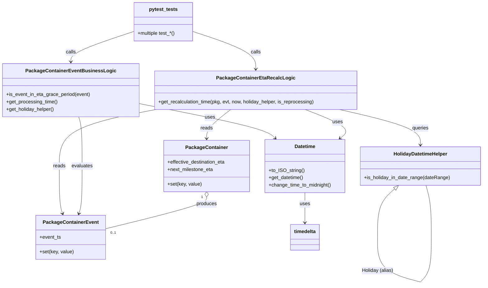

# Diagram: partview_core/partview_service/partview_service/tests/unit/business/package_container/event/test_eta_recalc_logic.py

> Auto-generated by Obscura crawlers

## Mermaid

### SVG

<svg id="container" width="1563.669921875" xmlns="http://www.w3.org/2000/svg" class="classDiagram" height="930.1499633789062" viewBox="0 0 1563.669921875 930.1499633789062" role="graphics-document document" aria-roledescription="class"><g><defs><marker id="container_class-aggregationStart" class="marker aggregation class" refX="18" refY="7" markerWidth="190" markerHeight="240" orient="auto"><path d="M 18,7 L9,13 L1,7 L9,1 Z"></path></marker></defs><defs><marker id="container_class-aggregationEnd" class="marker aggregation class" refX="1" refY="7" markerWidth="20" markerHeight="28" orient="auto"><path d="M 18,7 L9,13 L1,7 L9,1 Z"></path></marker></defs><defs><marker id="container_class-extensionStart" class="marker extension class" refX="18" refY="7" markerWidth="190" markerHeight="240" orient="auto"><path d="M 1,7 L18,13 V 1 Z"></path></marker></defs><defs><marker id="container_class-extensionEnd" class="marker extension class" refX="1" refY="7" markerWidth="20" markerHeight="28" orient="auto"><path d="M 1,1 V 13 L18,7 Z"></path></marker></defs><defs><marker id="container_class-compositionStart" class="marker composition class" refX="18" refY="7" markerWidth="190" markerHeight="240" orient="auto"><path d="M 18,7 L9,13 L1,7 L9,1 Z"></path></marker></defs><defs><marker id="container_class-compositionEnd" class="marker composition class" refX="1" refY="7" markerWidth="20" markerHeight="28" orient="auto"><path d="M 18,7 L9,13 L1,7 L9,1 Z"></path></marker></defs><defs><marker id="container_class-dependencyStart" class="marker dependency class" refX="6" refY="7" markerWidth="190" markerHeight="240" orient="auto"><path d="M 5,7 L9,13 L1,7 L9,1 Z"></path></marker></defs><defs><marker id="container_class-dependencyEnd" class="marker dependency class" refX="13" refY="7" markerWidth="20" markerHeight="28" orient="auto"><path d="M 18,7 L9,13 L14,7 L9,1 Z"></path></marker></defs><defs><marker id="container_class-lollipopStart" class="marker lollipop class" refX="13" refY="7" markerWidth="190" markerHeight="240" orient="auto"><circle stroke="black" fill="transparent" cx="7" cy="7" r="6"></circle></marker></defs><defs><marker id="container_class-lollipopEnd" class="marker lollipop class" refX="1" refY="7" markerWidth="190" markerHeight="240" orient="auto"><circle stroke="black" fill="transparent" cx="7" cy="7" r="6"></circle></marker></defs><g class="root"><g class="clusters"></g><g class="edgePaths"><path d="M984.221,630L984.221,636.167C984.221,642.333,984.221,654.667,984.221,671C984.221,687.333,984.221,707.667,984.221,717.833L984.221,728" id="id_Datetime_timedelta_1" class="edge-thickness-normal edge-pattern-solid relation" style=";;;" data-edge="true" data-et="edge" data-id="id_Datetime_timedelta_1" data-points="W3sieCI6OTg0LjIyMDcwMzEyNSwieSI6NjMwfSx7IngiOjk4NC4yMjA3MDMxMjUsInkiOjY2N30seyJ4Ijo5ODQuMjIwNzAzMTI1LCJ5Ijo3MzR9XQ==" marker-end="url(#container_class-dependencyEnd)"></path><path d="M444.039,338.251L511.879,351.709C579.719,365.167,715.398,392.084,789.128,411.027C862.857,429.97,874.636,440.941,880.526,446.426L886.415,451.911" id="id_PackageContainerEventBusinessLogic_Datetime_2" class="edge-thickness-normal edge-pattern-solid relation" style=";;;" data-edge="true" data-et="edge" data-id="id_PackageContainerEventBusinessLogic_Datetime_2" data-points="W3sieCI6NDQ0LjAzOTA2MjUsInkiOjMzOC4yNTEwMjAyMTY4NTQ2N30seyJ4Ijo4NTEuMDc4MTI1LCJ5Ijo0MTl9LHsieCI6ODkwLjgwNjE1MjM0Mzc1LCJ5Ijo0NTZ9XQ==" marker-end="url(#container_class-dependencyEnd)"></path><path d="M984.32,358L1010.381,368.167C1036.442,378.333,1088.564,398.667,1107.627,414.379C1126.691,430.091,1112.696,441.182,1105.698,446.728L1098.701,452.273" id="id_PackageContainerEtaRecalcLogic_Datetime_3" class="edge-thickness-normal edge-pattern-solid relation" style=";;;" data-edge="true" data-et="edge" data-id="id_PackageContainerEtaRecalcLogic_Datetime_3" data-points="W3sieCI6OTg0LjMyMDIwMjI0Mjk0MzUsInkiOjM1OH0seyJ4IjoxMTQwLjY4NTU0Njg3NSwieSI6NDE5fSx7IngiOjEwOTMuOTk4NDU2NDAxMjA5OCwieSI6NDU2fV0=" marker-end="url(#container_class-dependencyEnd)"></path><path d="M740.83,358L727.598,368.167C714.365,378.333,687.9,398.667,674.668,414.5C661.436,430.333,661.436,441.667,661.436,447.333L661.436,453" id="id_PackageContainerEtaRecalcLogic_PackageContainer_4" class="edge-thickness-normal edge-pattern-solid relation" style=";;;" data-edge="true" data-et="edge" data-id="id_PackageContainerEtaRecalcLogic_PackageContainer_4" data-points="W3sieCI6NzQwLjgzMDI4Mjg4ODEwNDksInkiOjM1OH0seyJ4Ijo2NjEuNDM1NTQ2ODc1LCJ5Ijo0MTl9LHsieCI6NjYxLjQzNTU0Njg3NSwieSI6NDU5fV0=" marker-end="url(#container_class-dependencyEnd)"></path><path d="M497.822,358L445.373,368.167C392.925,378.333,288.029,398.667,235.581,429.5C183.133,460.333,183.133,501.667,183.133,543C183.133,584.333,183.133,625.667,184.92,651.554C186.707,677.441,190.282,687.882,192.069,693.103L193.856,698.323" id="id_PackageContainerEtaRecalcLogic_PackageContainerEvent_5" class="edge-thickness-normal edge-pattern-solid relation" style=";;;" data-edge="true" data-et="edge" data-id="id_PackageContainerEtaRecalcLogic_PackageContainerEvent_5" data-points="W3sieCI6NDk3LjgyMTYzNTU4NDY3NzQ0LCJ5IjozNTh9LHsieCI6MTgzLjEzMjgxMjUsInkiOjQxOX0seyJ4IjoxODMuMTMyODEyNSwieSI6NTQzfSx7IngiOjE4My4xMzI4MTI1LCJ5Ijo2Njd9LHsieCI6MTk1Ljc5OTg0OTQ4Mzk0NDk3LCJ5Ijo3MDR9XQ==" marker-end="url(#container_class-dependencyEnd)"></path><path d="M1096.196,358L1140.31,368.167C1184.425,378.333,1272.655,398.667,1316.77,418C1360.885,437.333,1360.885,455.667,1360.885,464.833L1360.885,474" id="id_PackageContainerEtaRecalcLogic_HolidayDatetimeHelper_6" class="edge-thickness-normal edge-pattern-solid relation" style=";;;" data-edge="true" data-et="edge" data-id="id_PackageContainerEtaRecalcLogic_HolidayDatetimeHelper_6" data-points="W3sieCI6MTA5Ni4xOTU2MTE3NjkxNTMyLCJ5IjozNTh9LHsieCI6MTM2MC44ODQ3NjU2MjUsInkiOjQxOX0seyJ4IjoxMzYwLjg4NDc2NTYyNSwieSI6NDgwfV0=" marker-end="url(#container_class-dependencyEnd)"></path><path d="M248.293,382L249.872,388.167C251.451,394.333,254.608,406.667,256.187,433.5C257.766,460.333,257.766,501.667,257.766,543C257.766,584.333,257.766,625.667,255.978,651.554C254.191,677.441,250.617,687.882,248.829,693.103L247.042,698.323" id="id_PackageContainerEventBusinessLogic_PackageContainerEvent_7" class="edge-thickness-normal edge-pattern-solid relation" style=";;;" data-edge="true" data-et="edge" data-id="id_PackageContainerEventBusinessLogic_PackageContainerEvent_7" data-points="W3sieCI6MjQ4LjI5MzAwMDI1MjAxNjEzLCJ5IjozODJ9LHsieCI6MjU3Ljc2NTYyNSwieSI6NDE5fSx7IngiOjI1Ny43NjU2MjUsInkiOjU0M30seyJ4IjoyNTcuNzY1NjI1LCJ5Ijo2Njd9LHsieCI6MjQ1LjA5ODU4ODAxNjA1NTAzLCJ5Ijo3MDR9XQ==" marker-end="url(#container_class-dependencyEnd)"></path><path d="M621.443,103.513L655.007,114.761C688.572,126.009,755.7,148.504,789.264,168.919C822.828,189.333,822.828,207.667,822.828,216.833L822.828,226" id="id_pytest_tests_PackageContainerEtaRecalcLogic_8" class="edge-thickness-normal edge-pattern-solid relation" style=";;;" data-edge="true" data-et="edge" data-id="id_pytest_tests_PackageContainerEtaRecalcLogic_8" data-points="W3sieCI6NjIxLjQ0MzM1OTM3NSwieSI6MTAzLjUxMjc3OTU2MzE3MTI5fSx7IngiOjgyMi44MjgxMjUsInkiOjE3MX0seyJ4Ijo4MjIuODI4MTI1LCJ5IjoyMzJ9XQ==" marker-end="url(#container_class-dependencyEnd)"></path><path d="M427.404,103.513L393.84,114.761C360.276,126.009,293.148,148.504,259.584,164.919C226.02,181.333,226.02,191.667,226.02,196.833L226.02,202" id="id_pytest_tests_PackageContainerEventBusinessLogic_9" class="edge-thickness-normal edge-pattern-solid relation" style=";;;" data-edge="true" data-et="edge" data-id="id_pytest_tests_PackageContainerEventBusinessLogic_9" data-points="W3sieCI6NDI3LjQwNDI5Njg3NSwieSI6MTAzLjUxMjc3OTU2MzE3MTI5fSx7IngiOjIyNi4wMTk1MzEyNSwieSI6MTcxfSx7IngiOjIyNi4wMTk1MzEyNSwieSI6MjA4fV0=" marker-end="url(#container_class-dependencyEnd)"></path><path d="M661.436,644.25L661.436,648.042C661.436,651.833,661.436,659.417,606.344,676.825C551.253,694.234,441.07,721.469,385.978,735.086L330.887,748.703" id="id_PackageContainer_PackageContainerEvent_10" class="edge-thickness-normal edge-pattern-solid relation" style=";;;" data-edge="true" data-et="edge" data-id="id_PackageContainer_PackageContainerEvent_10" data-points="W3sieCI6NjYxLjQzNTU0Njg3NSwieSI6NjI3fSx7IngiOjY2MS40MzU1NDY4NzUsInkiOjY2N30seyJ4IjozMzAuODg2NzE4NzUsInkiOjc0OC43MDI4MTAxOTU1NH1d" marker-start="url(#container_class-aggregationStart)"></path><path d="M1277.084,617.457L1267.79,625.715C1258.497,633.972,1239.91,650.486,1230.617,676.901C1221.324,703.317,1221.324,739.633,1221.324,757.792L1221.324,775.95" id="HolidayDatetimeHelper-cyclic-special-1" class="edge-thickness-normal edge-pattern-solid relation" style=";;;" data-edge="true" data-et="edge" data-id="HolidayDatetimeHelper-cyclic-special-1" data-points="W3sieCI6MTI4OS45Nzg4MDU0NDM3Mzc3LCJ5Ijo2MDZ9LHsieCI6MTIyMS4zMjM4MjgxMjUzNzI1LCJ5Ijo2Njd9LHsieCI6MTIyMS4zMjM4MjgxMjUzNzI1LCJ5Ijo3NzUuOTQ5OTk5OTk5MjU0OX1d" marker-start="url(#container_class-extensionStart)"></path><path d="M1221.324,776.05L1221.324,794.208C1221.324,812.367,1221.324,848.683,1244.576,873.014C1267.827,897.346,1314.331,909.691,1337.583,915.864L1360.835,922.037" id="HolidayDatetimeHelper-cyclic-special-mid" class="edge-thickness-normal edge-pattern-solid relation" style=";;;" data-edge="true" data-et="edge" data-id="HolidayDatetimeHelper-cyclic-special-mid" data-points="W3sieCI6MTIyMS4zMjM4MjgxMjUzNzI1LCJ5Ijo3NzYuMDUwMDAwMDAwNzQ1MX0seyJ4IjoxMjIxLjMyMzgyODEyNTM3MjUsInkiOjg4NX0seyJ4IjoxMzYwLjgzNDc2NTYyNDI1NSwieSI6OTIyLjAzNjcyNjIyOTAwOX1d"></path><path d="M1360.933,922L1366.913,915.833C1372.892,909.667,1384.851,897.333,1390.831,873C1396.811,848.667,1396.811,812.333,1396.811,776C1396.811,739.667,1396.811,703.333,1393.865,675C1390.919,646.667,1385.028,626.333,1382.083,616.167L1379.137,606" id="HolidayDatetimeHelper-cyclic-special-2" class="edge-thickness-normal edge-pattern-solid relation" style=";;;" data-edge="true" data-et="edge" data-id="HolidayDatetimeHelper-cyclic-special-2" data-points="W3sieCI6MTM2MC45MzMyNDg0NjE0MTY1LCJ5Ijo5MjJ9LHsieCI6MTM5Ni44MTA1NDY4NzUsInkiOjg4NX0seyJ4IjoxMzk2LjgxMDU0Njg3NSwieSI6Nzc2fSx7IngiOjEzOTYuODEwNTQ2ODc1LCJ5Ijo2Njd9LHsieCI6MTM3OS4xMzczODAyOTIzMzg4LCJ5Ijo2MDZ9XQ=="></path></g><g class="edgeLabels"><g class="edgeLabel" transform="translate(984.220703125, 667)"><g class="label" data-id="id_Datetime_timedelta_1" transform="translate(-16.4921875, -12)"><foreignObject width="32.984375" height="24">

uses

</foreignObject></g></g><g class="edgeLabel" transform="translate(674.18431, 383.90756)"><g class="label" data-id="id_PackageContainerEventBusinessLogic_Datetime_2" transform="translate(-16.4921875, -12)"><foreignObject width="32.984375" height="24">

uses

</foreignObject></g></g><g class="edgeLabel" transform="translate(1090.25154, 399.32509)"><g class="label" data-id="id_PackageContainerEtaRecalcLogic_Datetime_3" transform="translate(-16.4921875, -12)"><foreignObject width="32.984375" height="24">

uses

</foreignObject></g></g><g class="edgeLabel" transform="translate(661.435546875, 419)"><g class="label" data-id="id_PackageContainerEtaRecalcLogic_PackageContainer_4" transform="translate(-20.0078125, -12)"><foreignObject width="40.015625" height="24">

reads

</foreignObject></g></g><g class="edgeLabel" transform="translate(183.1328125, 543)"><g class="label" data-id="id_PackageContainerEtaRecalcLogic_PackageContainerEvent_5" transform="translate(-20.0078125, -12)"><foreignObject width="40.015625" height="24">

reads

</foreignObject></g></g><g class="edgeLabel" transform="translate(1360.884765625, 419)"><g class="label" data-id="id_PackageContainerEtaRecalcLogic_HolidayDatetimeHelper_6" transform="translate(-27.2421875, -12)"><foreignObject width="54.484375" height="24">

queries

</foreignObject></g></g><g class="edgeLabel" transform="translate(257.765625, 543)"><g class="label" data-id="id_PackageContainerEventBusinessLogic_PackageContainerEvent_7" transform="translate(-34.625, -12)"><foreignObject width="69.25" height="24">

evaluates

</foreignObject></g></g><g class="edgeLabel" transform="translate(822.828125, 171)"><g class="label" data-id="id_pytest_tests_PackageContainerEtaRecalcLogic_8" transform="translate(-16.4453125, -12)"><foreignObject width="32.890625" height="24">

calls

</foreignObject></g></g><g class="edgeLabel" transform="translate(226.01953125, 171)"><g class="label" data-id="id_pytest_tests_PackageContainerEventBusinessLogic_9" transform="translate(-16.4453125, -12)"><foreignObject width="32.890625" height="24">

calls

</foreignObject></g></g><g class="edgeLabel" transform="translate(661.435546875, 667)"><g class="label" data-id="id_PackageContainer_PackageContainerEvent_10" transform="translate(-33.4765625, -12)"><foreignObject width="66.953125" height="24">

produces

</foreignObject></g></g><g class="edgeLabel"><g class="label" data-id="HolidayDatetimeHelper-cyclic-special-1" transform="translate(0, 0)"><foreignObject width="0" height="0">

</foreignObject></g></g><g class="edgeLabel" transform="translate(1221.3238281253725, 885)"><g class="label" data-id="HolidayDatetimeHelper-cyclic-special-mid" transform="translate(-51.8515625, -12)"><foreignObject width="103.703125" height="24">

Holiday (alias)

</foreignObject></g></g><g class="edgeLabel"><g class="label" data-id="HolidayDatetimeHelper-cyclic-special-2" transform="translate(0, 0)"><foreignObject width="0" height="0">

</foreignObject></g></g><g class="edgeTerminals" transform="translate(646.4355484375002, 644.5000013392857)"><g class="inner" transform="translate(0, 0)"><foreignObject style="width: 9px; height: 12px;">
1
</foreignObject></g></g><g class="edgeTerminals" transform="translate(346.4747339671686, 754.0654215015999)"><g class="inner" transform="translate(0, 0)"></g><foreignObject style="width: 36px; height: 12px;">
0..1
</foreignObject></g></g><g class="nodes"><g class="node default" id="classId-HolidayDatetimeHelper-0" transform="translate(1360.884765625, 543)"><g class="basic label-container"><path d="M-194.78515625 -63 L194.78515625 -63 L194.78515625 63 L-194.78515625 63" stroke="none" stroke-width="0" fill="#ECECFF" style=""></path><path d="M-194.78515625 -63 C-80.83377218322151 -63, 33.117611883556975 -63, 194.78515625 -63 M-194.78515625 -63 C-65.45275312982395 -63, 63.87964999035211 -63, 194.78515625 -63 M194.78515625 -63 C194.78515625 -29.229436052362743, 194.78515625 4.5411278952745135, 194.78515625 63 M194.78515625 -63 C194.78515625 -18.569129429499682, 194.78515625 25.861741141000635, 194.78515625 63 M194.78515625 63 C86.04129920271633 63, -22.702557844567337 63, -194.78515625 63 M194.78515625 63 C114.7953835784672 63, 34.80561090693439 63, -194.78515625 63 M-194.78515625 63 C-194.78515625 27.56285348577685, -194.78515625 -7.874293028446303, -194.78515625 -63 M-194.78515625 63 C-194.78515625 12.81723696097854, -194.78515625 -37.36552607804292, -194.78515625 -63" stroke="#9370DB" stroke-width="1.3" fill="none" stroke-dasharray="0 0" style=""></path></g><g class="annotation-group text" transform="translate(0, -39)"></g><g class="label-group text" transform="translate(-85.7578125, -39)"><g class="label" style="font-weight: bolder" transform="translate(0,-12)"><foreignObject width="171.515625" height="24">

HolidayDatetimeHelper

</foreignObject></g></g><g class="members-group text" transform="translate(-182.78515625, 9)"></g><g class="methods-group text" transform="translate(-182.78515625, 39)"><g class="label" style="" transform="translate(0,-12)"><foreignObject width="279.8125" height="24">

+is_holiday_in_date_range(dateRange)

</foreignObject></g></g><g class="divider" style=""><path d="M-194.78515625 -15 C-45.60646373974558 -15, 103.57222877050884 -15, 194.78515625 -15 M-194.78515625 -15 C-48.13734725616459 -15, 98.51046173767082 -15, 194.78515625 -15" stroke="#9370DB" stroke-width="1.3" fill="none" stroke-dasharray="0 0" style=""></path></g><g class="divider" style=""><path d="M-194.78515625 9 C-58.907850777435584 9, 76.96945469512883 9, 194.78515625 9 M-194.78515625 9 C-42.78623602852096 9, 109.21268419295808 9, 194.78515625 9" stroke="#9370DB" stroke-width="1.3" fill="none" stroke-dasharray="0 0" style=""></path></g></g><g class="node default" id="classId-Datetime-1" transform="translate(984.220703125, 543)"><g class="basic label-container"><path d="M-131.87890625 -87 L131.87890625 -87 L131.87890625 87 L-131.87890625 87" stroke="none" stroke-width="0" fill="#ECECFF" style=""></path><path d="M-131.87890625 -87 C-52.67936529708898 -87, 26.520175655822044 -87, 131.87890625 -87 M-131.87890625 -87 C-64.38501507660801 -87, 3.1088760967839733 -87, 131.87890625 -87 M131.87890625 -87 C131.87890625 -20.966460035251785, 131.87890625 45.06707992949643, 131.87890625 87 M131.87890625 -87 C131.87890625 -32.37566282909349, 131.87890625 22.248674341813015, 131.87890625 87 M131.87890625 87 C33.91876118399597 87, -64.04138388200806 87, -131.87890625 87 M131.87890625 87 C73.2073236655662 87, 14.535741081132386 87, -131.87890625 87 M-131.87890625 87 C-131.87890625 29.743316295082046, -131.87890625 -27.513367409835908, -131.87890625 -87 M-131.87890625 87 C-131.87890625 32.48425587715319, -131.87890625 -22.031488245693623, -131.87890625 -87" stroke="#9370DB" stroke-width="1.3" fill="none" stroke-dasharray="0 0" style=""></path></g><g class="annotation-group text" transform="translate(0, -63)"></g><g class="label-group text" transform="translate(-33.3984375, -63)"><g class="label" style="font-weight: bolder" transform="translate(0,-12)"><foreignObject width="66.796875" height="24">

Datetime

</foreignObject></g></g><g class="members-group text" transform="translate(-119.87890625, -15)"></g><g class="methods-group text" transform="translate(-119.87890625, 15)"><g class="label" style="" transform="translate(0,-12)"><foreignObject width="114.984375" height="24">

+to_ISO_string()

</foreignObject></g><g class="label" style="" transform="translate(0,12)"><foreignObject width="114.171875" height="24">

+get_datetime()

</foreignObject></g><g class="label" style="" transform="translate(0,36)"><foreignObject width="206.359375" height="24">

+change_time_to_midnight()

</foreignObject></g></g><g class="divider" style=""><path d="M-131.87890625 -39 C-67.45070977031966 -39, -3.022513290639324 -39, 131.87890625 -39 M-131.87890625 -39 C-37.380845795152524 -39, 57.11721465969495 -39, 131.87890625 -39" stroke="#9370DB" stroke-width="1.3" fill="none" stroke-dasharray="0 0" style=""></path></g><g class="divider" style=""><path d="M-131.87890625 -15 C-61.81888696739118 -15, 8.24113231521764 -15, 131.87890625 -15 M-131.87890625 -15 C-63.541016647738445 -15, 4.79687295452311 -15, 131.87890625 -15" stroke="#9370DB" stroke-width="1.3" fill="none" stroke-dasharray="0 0" style=""></path></g></g><g class="node default" id="classId-PackageContainer-2" transform="translate(661.435546875, 543)"><g class="basic label-container"><path d="M-140.90625 -84 L140.90625 -84 L140.90625 84 L-140.90625 84" stroke="none" stroke-width="0" fill="#ECECFF" style=""></path><path d="M-140.90625 -84 C-75.05548971133818 -84, -9.204729422676365 -84, 140.90625 -84 M-140.90625 -84 C-36.628904247702266 -84, 67.64844150459547 -84, 140.90625 -84 M140.90625 -84 C140.90625 -39.87044259683732, 140.90625 4.259114806325357, 140.90625 84 M140.90625 -84 C140.90625 -31.20533011755122, 140.90625 21.58933976489756, 140.90625 84 M140.90625 84 C69.3515003487215 84, -2.2032493025569977 84, -140.90625 84 M140.90625 84 C66.53927349178969 84, -7.827703016420628 84, -140.90625 84 M-140.90625 84 C-140.90625 27.56427316998562, -140.90625 -28.871453660028763, -140.90625 -84 M-140.90625 84 C-140.90625 39.251186903207696, -140.90625 -5.497626193584608, -140.90625 -84" stroke="#9370DB" stroke-width="1.3" fill="none" stroke-dasharray="0 0" style=""></path></g><g class="annotation-group text" transform="translate(0, -60)"></g><g class="label-group text" transform="translate(-65.453125, -60)"><g class="label" style="font-weight: bolder" transform="translate(0,-12)"><foreignObject width="130.90625" height="24">

PackageContainer

</foreignObject></g></g><g class="members-group text" transform="translate(-128.90625, -12)"><g class="label" style="" transform="translate(0,-12)"><foreignObject width="192.359375" height="24">

+effective_destination_eta

</foreignObject></g><g class="label" style="" transform="translate(0,12)"><foreignObject width="150.5625" height="24">

+next_milestone_eta

</foreignObject></g></g><g class="methods-group text" transform="translate(-128.90625, 60)"><g class="label" style="" transform="translate(0,-12)"><foreignObject width="111.21875" height="24">

+set(key, value)

</foreignObject></g></g><g class="divider" style=""><path d="M-140.90625 -36 C-81.30380985999129 -36, -21.70136971998258 -36, 140.90625 -36 M-140.90625 -36 C-35.449882570560945 -36, 70.00648485887811 -36, 140.90625 -36" stroke="#9370DB" stroke-width="1.3" fill="none" stroke-dasharray="0 0" style=""></path></g><g class="divider" style=""><path d="M-140.90625 36 C-29.785483189157773 36, 81.33528362168445 36, 140.90625 36 M-140.90625 36 C-78.80517625751835 36, -16.70410251503671 36, 140.90625 36" stroke="#9370DB" stroke-width="1.3" fill="none" stroke-dasharray="0 0" style=""></path></g></g><g class="node default" id="classId-PackageContainerEvent-3" transform="translate(220.44921875, 776)"><g class="basic label-container"><path d="M-110.4375 -72 L110.4375 -72 L110.4375 72 L-110.4375 72" stroke="none" stroke-width="0" fill="#ECECFF" style=""></path><path d="M-110.4375 -72 C-30.59234288392419 -72, 49.25281423215162 -72, 110.4375 -72 M-110.4375 -72 C-25.880582420776847 -72, 58.67633515844631 -72, 110.4375 -72 M110.4375 -72 C110.4375 -36.01578295784611, 110.4375 -0.031565915692226554, 110.4375 72 M110.4375 -72 C110.4375 -22.76533831484707, 110.4375 26.469323370305858, 110.4375 72 M110.4375 72 C59.35340136749767 72, 8.269302734995335 72, -110.4375 72 M110.4375 72 C53.62228186659554 72, -3.192936266808914 72, -110.4375 72 M-110.4375 72 C-110.4375 17.333197075905375, -110.4375 -37.33360584818925, -110.4375 -72 M-110.4375 72 C-110.4375 38.522316597571454, -110.4375 5.044633195142907, -110.4375 -72" stroke="#9370DB" stroke-width="1.3" fill="none" stroke-dasharray="0 0" style=""></path></g><g class="annotation-group text" transform="translate(0, -48)"></g><g class="label-group text" transform="translate(-85.65625, -48)"><g class="label" style="font-weight: bolder" transform="translate(0,-12)"><foreignObject width="171.3125" height="24">

PackageContainerEvent

</foreignObject></g></g><g class="members-group text" transform="translate(-98.4375, 0)"><g class="label" style="" transform="translate(0,-12)"><foreignObject width="69.578125" height="24">

+event_ts

</foreignObject></g></g><g class="methods-group text" transform="translate(-98.4375, 48)"><g class="label" style="" transform="translate(0,-12)"><foreignObject width="111.21875" height="24">

+set(key, value)

</foreignObject></g></g><g class="divider" style=""><path d="M-110.4375 -24 C-40.47579297567529 -24, 29.48591404864942 -24, 110.4375 -24 M-110.4375 -24 C-38.9518201542473 -24, 32.5338596915054 -24, 110.4375 -24" stroke="#9370DB" stroke-width="1.3" fill="none" stroke-dasharray="0 0" style=""></path></g><g class="divider" style=""><path d="M-110.4375 24 C-46.91518821399584 24, 16.60712357200832 24, 110.4375 24 M-110.4375 24 C-60.480738145884864 24, -10.523976291769728 24, 110.4375 24" stroke="#9370DB" stroke-width="1.3" fill="none" stroke-dasharray="0 0" style=""></path></g></g><g class="node default" id="classId-PackageContainerEventBusinessLogic-4" transform="translate(226.01953125, 295)"><g class="basic label-container"><path d="M-218.01953125 -87 L218.01953125 -87 L218.01953125 87 L-218.01953125 87" stroke="none" stroke-width="0" fill="#ECECFF" style=""></path><path d="M-218.01953125 -87 C-76.72718576371281 -87, 64.56515972257438 -87, 218.01953125 -87 M-218.01953125 -87 C-52.14381827040796 -87, 113.73189470918408 -87, 218.01953125 -87 M218.01953125 -87 C218.01953125 -41.49098081637012, 218.01953125 4.018038367259763, 218.01953125 87 M218.01953125 -87 C218.01953125 -52.007783603171575, 218.01953125 -17.01556720634315, 218.01953125 87 M218.01953125 87 C81.34044859380228 87, -55.33863406239544 87, -218.01953125 87 M218.01953125 87 C52.465319488278794 87, -113.08889227344241 87, -218.01953125 87 M-218.01953125 87 C-218.01953125 26.599308826513834, -218.01953125 -33.80138234697233, -218.01953125 -87 M-218.01953125 87 C-218.01953125 42.575382157766846, -218.01953125 -1.8492356844663078, -218.01953125 -87" stroke="#9370DB" stroke-width="1.3" fill="none" stroke-dasharray="0 0" style=""></path></g><g class="annotation-group text" transform="translate(0, -63)"></g><g class="label-group text" transform="translate(-137.0703125, -63)"><g class="label" style="font-weight: bolder" transform="translate(0,-12)"><foreignObject width="274.140625" height="24">

PackageContainerEventBusinessLogic

</foreignObject></g></g><g class="members-group text" transform="translate(-206.01953125, -15)"></g><g class="methods-group text" transform="translate(-206.01953125, 15)"><g class="label" style="" transform="translate(0,-12)"><foreignObject width="274.96875" height="24">

+is_event_in_eta_grace_period(event)

</foreignObject></g><g class="label" style="" transform="translate(0,12)"><foreignObject width="167.609375" height="24">

+get_processing_time()

</foreignObject></g><g class="label" style="" transform="translate(0,36)"><foreignObject width="158.09375" height="24">

+get_holiday_helper()

</foreignObject></g></g><g class="divider" style=""><path d="M-218.01953125 -39 C-74.75692436334302 -39, 68.50568252331396 -39, 218.01953125 -39 M-218.01953125 -39 C-98.61399738478494 -39, 20.791536480430125 -39, 218.01953125 -39" stroke="#9370DB" stroke-width="1.3" fill="none" stroke-dasharray="0 0" style=""></path></g><g class="divider" style=""><path d="M-218.01953125 -15 C-61.408029421241196 -15, 95.20347240751761 -15, 218.01953125 -15 M-218.01953125 -15 C-129.87482842257498 -15, -41.73012559514993 -15, 218.01953125 -15" stroke="#9370DB" stroke-width="1.3" fill="none" stroke-dasharray="0 0" style=""></path></g></g><g class="node default" id="classId-PackageContainerEtaRecalcLogic-5" transform="translate(822.828125, 295)"><g class="basic label-container"><path d="M-328.7890625 -63 L328.7890625 -63 L328.7890625 63 L-328.7890625 63" stroke="none" stroke-width="0" fill="#ECECFF" style=""></path><path d="M-328.7890625 -63 C-194.24708473997225 -63, -59.7051069799445 -63, 328.7890625 -63 M-328.7890625 -63 C-122.75424264616444 -63, 83.28057720767112 -63, 328.7890625 -63 M328.7890625 -63 C328.7890625 -22.196494990890912, 328.7890625 18.607010018218176, 328.7890625 63 M328.7890625 -63 C328.7890625 -29.13553233088885, 328.7890625 4.7289353382223, 328.7890625 63 M328.7890625 63 C81.21737223132027 63, -166.35431803735946 63, -328.7890625 63 M328.7890625 63 C69.44042207572937 63, -189.90821834854125 63, -328.7890625 63 M-328.7890625 63 C-328.7890625 15.076279124926401, -328.7890625 -32.8474417501472, -328.7890625 -63 M-328.7890625 63 C-328.7890625 33.32536781593278, -328.7890625 3.650735631865551, -328.7890625 -63" stroke="#9370DB" stroke-width="1.3" fill="none" stroke-dasharray="0 0" style=""></path></g><g class="annotation-group text" transform="translate(0, -39)"></g><g class="label-group text" transform="translate(-119.421875, -39)"><g class="label" style="font-weight: bolder" transform="translate(0,-12)"><foreignObject width="238.84375" height="24">

PackageContainerEtaRecalcLogic

</foreignObject></g></g><g class="members-group text" transform="translate(-316.7890625, 9)"></g><g class="methods-group text" transform="translate(-316.7890625, 39)"><g class="label" style="" transform="translate(0,-12)"><foreignObject width="514.15625" height="24">

+get_recalculation_time(pkg, evt, now, holiday_helper, is_reprocessing)

</foreignObject></g></g><g class="divider" style=""><path d="M-328.7890625 -15 C-160.3122211164211 -15, 8.164620267157773 -15, 328.7890625 -15 M-328.7890625 -15 C-99.61364351678802 -15, 129.56177546642397 -15, 328.7890625 -15" stroke="#9370DB" stroke-width="1.3" fill="none" stroke-dasharray="0 0" style=""></path></g><g class="divider" style=""><path d="M-328.7890625 9 C-120.59279906856665 9, 87.6034643628667 9, 328.7890625 9 M-328.7890625 9 C-182.02742011115635 9, -35.26577772231269 9, 328.7890625 9" stroke="#9370DB" stroke-width="1.3" fill="none" stroke-dasharray="0 0" style=""></path></g></g><g class="node default" id="classId-timedelta-6" transform="translate(984.220703125, 776)"><g class="basic label-container"><path d="M-47.4921875 -42 L47.4921875 -42 L47.4921875 42 L-47.4921875 42" stroke="none" stroke-width="0" fill="#ECECFF" style=""></path><path d="M-47.4921875 -42 C-23.495951300704302 -42, 0.5002848985913957 -42, 47.4921875 -42 M-47.4921875 -42 C-23.392967254794574 -42, 0.706252990410853 -42, 47.4921875 -42 M47.4921875 -42 C47.4921875 -24.85256756706768, 47.4921875 -7.705135134135361, 47.4921875 42 M47.4921875 -42 C47.4921875 -19.688284057617246, 47.4921875 2.623431884765509, 47.4921875 42 M47.4921875 42 C13.535794174090178 42, -20.420599151819644 42, -47.4921875 42 M47.4921875 42 C9.709107973590442 42, -28.073971552819117 42, -47.4921875 42 M-47.4921875 42 C-47.4921875 12.839302440707055, -47.4921875 -16.32139511858589, -47.4921875 -42 M-47.4921875 42 C-47.4921875 12.92580842303699, -47.4921875 -16.14838315392602, -47.4921875 -42" stroke="#9370DB" stroke-width="1.3" fill="none" stroke-dasharray="0 0" style=""></path></g><g class="annotation-group text" transform="translate(0, -18)"></g><g class="label-group text" transform="translate(-35.4921875, -18)"><g class="label" style="font-weight: bolder" transform="translate(0,-12)"><foreignObject width="70.984375" height="24">

timedelta

</foreignObject></g></g><g class="members-group text" transform="translate(-35.4921875, 30)"></g><g class="methods-group text" transform="translate(-35.4921875, 60)"></g><g class="divider" style=""><path d="M-47.4921875 6 C-15.638368154596357 6, 16.215451190807286 6, 47.4921875 6 M-47.4921875 6 C-17.29593150930639 6, 12.900324481387223 6, 47.4921875 6" stroke="#9370DB" stroke-width="1.3" fill="none" stroke-dasharray="0 0" style=""></path></g><g class="divider" style=""><path d="M-47.4921875 24 C-26.42248108307249 24, -5.352774666144981 24, 47.4921875 24 M-47.4921875 24 C-23.222442048432416 24, 1.0473034031351673 24, 47.4921875 24" stroke="#9370DB" stroke-width="1.3" fill="none" stroke-dasharray="0 0" style=""></path></g></g><g class="node default" id="classId-pytest_tests-7" transform="translate(524.423828125, 71)"><g class="basic label-container"><path d="M-97.01953125 -63 L97.01953125 -63 L97.01953125 63 L-97.01953125 63" stroke="none" stroke-width="0" fill="#ECECFF" style=""></path><path d="M-97.01953125 -63 C-30.204508026569044 -63, 36.61051519686191 -63, 97.01953125 -63 M-97.01953125 -63 C-31.493310131597696 -63, 34.03291098680461 -63, 97.01953125 -63 M97.01953125 -63 C97.01953125 -20.76175807887561, 97.01953125 21.476483842248783, 97.01953125 63 M97.01953125 -63 C97.01953125 -20.803977119025546, 97.01953125 21.392045761948907, 97.01953125 63 M97.01953125 63 C43.82052820526993 63, -9.37847483946014 63, -97.01953125 63 M97.01953125 63 C54.24509070472811 63, 11.470650159456227 63, -97.01953125 63 M-97.01953125 63 C-97.01953125 27.42348860204895, -97.01953125 -8.153022795902103, -97.01953125 -63 M-97.01953125 63 C-97.01953125 25.250935084464096, -97.01953125 -12.498129831071807, -97.01953125 -63" stroke="#9370DB" stroke-width="1.3" fill="none" stroke-dasharray="0 0" style=""></path></g><g class="annotation-group text" transform="translate(0, -39)"></g><g class="label-group text" transform="translate(-45.3515625, -39)"><g class="label" style="font-weight: bolder" transform="translate(0,-12)"><foreignObject width="90.703125" height="24">

pytest_tests

</foreignObject></g></g><g class="members-group text" transform="translate(-85.01953125, 9)"></g><g class="methods-group text" transform="translate(-85.01953125, 39)"><g class="label" style="" transform="translate(0,-12)"><foreignObject width="124.6875" height="24">

+multiple test_*()

</foreignObject></g></g><g class="divider" style=""><path d="M-97.01953125 -15 C-24.55644857963398 -15, 47.90663409073204 -15, 97.01953125 -15 M-97.01953125 -15 C-53.29716418953481 -15, -9.574797129069623 -15, 97.01953125 -15" stroke="#9370DB" stroke-width="1.3" fill="none" stroke-dasharray="0 0" style=""></path></g><g class="divider" style=""><path d="M-97.01953125 9 C-39.27147355950801 9, 18.47658413098398 9, 97.01953125 9 M-97.01953125 9 C-47.12183016856065 9, 2.775870912878702 9, 97.01953125 9" stroke="#9370DB" stroke-width="1.3" fill="none" stroke-dasharray="0 0" style=""></path></g></g><g class="label edgeLabel" id="HolidayDatetimeHelper---HolidayDatetimeHelper---1" transform="translate(1221.3238281253725, 776)"><rect width="0.1" height="0.1"></rect><g class="label" style="" transform="translate(0, 0)"><rect></rect><foreignObject width="0" height="0">

</foreignObject></g></g><g class="label edgeLabel" id="HolidayDatetimeHelper---HolidayDatetimeHelper---2" transform="translate(1360.884765625, 922.0500000007451)"><rect width="0.1" height="0.1"></rect><g class="label" style="" transform="translate(0, 0)"><rect></rect><foreignObject width="0" height="0">

</foreignObject></g></g></g></g></g></svg>
