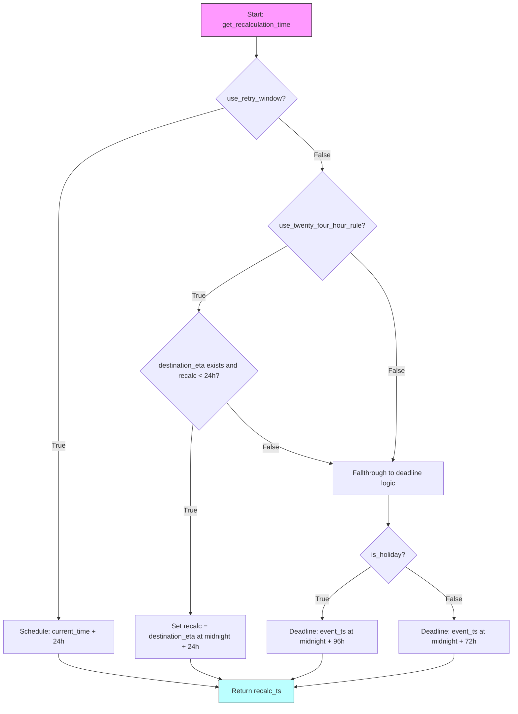

# Diagram: partview_core/partview_service/partview_service/tests/unit/business/package_container/event/test_eta_recalc_parameters.py

> Auto-generated by Obscura crawlers

## Mermaid

### SVG

<svg id="container" width="1206" xmlns="http://www.w3.org/2000/svg" class="flowchart" height="1660.203125" viewBox="0 0 1206 1660.203125" role="graphics-document document" aria-roledescription="flowchart-v2"><g><marker id="container_flowchart-v2-pointEnd" class="marker flowchart-v2" viewBox="0 0 10 10" refX="5" refY="5" markerUnits="userSpaceOnUse" markerWidth="8" markerHeight="8" orient="auto"><path d="M 0 0 L 10 5 L 0 10 z" class="arrowMarkerPath" style="stroke-width: 1; stroke-dasharray: 1, 0;"></path></marker><marker id="container_flowchart-v2-pointStart" class="marker flowchart-v2" viewBox="0 0 10 10" refX="4.5" refY="5" markerUnits="userSpaceOnUse" markerWidth="8" markerHeight="8" orient="auto"><path d="M 0 5 L 10 10 L 10 0 z" class="arrowMarkerPath" style="stroke-width: 1; stroke-dasharray: 1, 0;"></path></marker><marker id="container_flowchart-v2-circleEnd" class="marker flowchart-v2" viewBox="0 0 10 10" refX="11" refY="5" markerUnits="userSpaceOnUse" markerWidth="11" markerHeight="11" orient="auto"><circle cx="5" cy="5" r="5" class="arrowMarkerPath" style="stroke-width: 1; stroke-dasharray: 1, 0;"></circle></marker><marker id="container_flowchart-v2-circleStart" class="marker flowchart-v2" viewBox="0 0 10 10" refX="-1" refY="5" markerUnits="userSpaceOnUse" markerWidth="11" markerHeight="11" orient="auto"><circle cx="5" cy="5" r="5" class="arrowMarkerPath" style="stroke-width: 1; stroke-dasharray: 1, 0;"></circle></marker><marker id="container_flowchart-v2-crossEnd" class="marker cross flowchart-v2" viewBox="0 0 11 11" refX="12" refY="5.2" markerUnits="userSpaceOnUse" markerWidth="11" markerHeight="11" orient="auto"><path d="M 1,1 l 9,9 M 10,1 l -9,9" class="arrowMarkerPath" style="stroke-width: 2; stroke-dasharray: 1, 0;"></path></marker><marker id="container_flowchart-v2-crossStart" class="marker cross flowchart-v2" viewBox="0 0 11 11" refX="-1" refY="5.2" markerUnits="userSpaceOnUse" markerWidth="11" markerHeight="11" orient="auto"><path d="M 1,1 l 9,9 M 10,1 l -9,9" class="arrowMarkerPath" style="stroke-width: 2; stroke-dasharray: 1, 0;"></path></marker><g class="root"><g class="clusters"></g><g class="edgePaths"><path d="M603,86L603,90.167C603,94.333,603,102.667,603,110.333C603,118,603,125,603,128.5L603,132" id="L_A_B_0" class="edge-thickness-normal edge-pattern-solid edge-thickness-normal edge-pattern-solid flowchart-link" style=";" data-edge="true" data-et="edge" data-id="L_A_B_0" data-points="W3sieCI6NjAzLCJ5Ijo4Nn0seyJ4Ijo2MDMsInkiOjExMX0seyJ4Ijo2MDMsInkiOjEzNn1d" marker-end="url(#container_flowchart-v2-pointEnd)"></path><path d="M528.336,253.383L463.28,271.993C398.224,290.604,268.112,327.825,203.056,374.059C138,420.292,138,475.536,138,530.781C138,586.026,138,641.271,138,698.227C138,755.182,138,813.849,138,872.516C138,931.182,138,989.849,138,1031.849C138,1073.849,138,1099.182,138,1124.516C138,1149.849,138,1175.182,138,1205.24C138,1235.297,138,1270.078,138,1304.859C138,1339.641,138,1374.422,138,1399.313C138,1424.203,138,1439.203,138,1446.703L138,1454.203" id="L_B_C_0" class="edge-thickness-normal edge-pattern-solid edge-thickness-normal edge-pattern-solid flowchart-link" style=";" data-edge="true" data-et="edge" data-id="L_B_C_0" data-points="W3sieCI6NTI4LjMzNTg3MjA3ODU5MjMsInkiOjI1My4zODI3NDcwNzg1OTIyNX0seyJ4IjoxMzgsInkiOjM2NS4wNDY4NzV9LHsieCI6MTM4LCJ5Ijo1MzAuNzgxMjV9LHsieCI6MTM4LCJ5Ijo2OTYuNTE1NjI1fSx7IngiOjEzOCwieSI6ODcyLjUxNTYyNX0seyJ4IjoxMzgsInkiOjEwNDguNTE1NjI1fSx7IngiOjEzOCwieSI6MTEyNC41MTU2MjV9LHsieCI6MTM4LCJ5IjoxMjAwLjUxNTYyNX0seyJ4IjoxMzgsInkiOjEzMDQuODU5Mzc1fSx7IngiOjEzOCwieSI6MTQwOS4yMDMxMjV9LHsieCI6MTM4LCJ5IjoxNDU4LjIwMzEyNX1d" marker-end="url(#container_flowchart-v2-pointEnd)"></path><path d="M654.675,276.372L671.896,291.151C689.117,305.93,723.558,335.489,740.779,355.768C758,376.047,758,387.047,758,392.547L758,398.047" id="L_B_D_0" class="edge-thickness-normal edge-pattern-solid edge-thickness-normal edge-pattern-solid flowchart-link" style=";" data-edge="true" data-et="edge" data-id="L_B_D_0" data-points="W3sieCI6NjU0LjY3NTA3NTI3MDU2NzIsInkiOjI3Ni4zNzE3OTk3Mjk0MzI4NH0seyJ4Ijo3NTgsInkiOjM2NS4wNDY4NzV9LHsieCI6NzU4LCJ5Ijo0MDIuMDQ2ODc1fV0=" marker-end="url(#container_flowchart-v2-pointEnd)"></path><path d="M675.988,577.503L641.17,597.339C606.352,617.174,536.717,656.845,501.9,682.18C467.082,707.516,467.082,718.516,467.082,724.016L467.082,729.516" id="L_D_E_0" class="edge-thickness-normal edge-pattern-solid edge-thickness-normal edge-pattern-solid flowchart-link" style=";" data-edge="true" data-et="edge" data-id="L_D_E_0" data-points="W3sieCI6Njc1Ljk4NzYyNTgyNTQ3MDcsInkiOjU3Ny41MDMyNTA4MjU0NzA3fSx7IngiOjQ2Ny4wODIwMzEyNSwieSI6Njk2LjUxNTYyNX0seyJ4Ijo0NjcuMDgyMDMxMjUsInkiOjczMy41MTU2MjV9XQ==" marker-end="url(#container_flowchart-v2-pointEnd)"></path><path d="M453.486,997.919L452.571,1006.352C451.657,1014.785,449.829,1031.65,448.914,1052.75C448,1073.849,448,1099.182,448,1124.516C448,1149.849,448,1175.182,448,1205.24C448,1235.297,448,1270.078,448,1304.859C448,1339.641,448,1374.422,448,1397.313C448,1420.203,448,1431.203,448,1436.703L448,1442.203" id="L_E_F_0" class="edge-thickness-normal edge-pattern-solid edge-thickness-normal edge-pattern-solid flowchart-link" style=";" data-edge="true" data-et="edge" data-id="L_E_F_0" data-points="W3sieCI6NDUzLjQ4NTY4NzU2NDQ1MTA0LCJ5Ijo5OTcuOTE5MjgxMzE0NDUxfSx7IngiOjQ0OCwieSI6MTA0OC41MTU2MjV9LHsieCI6NDQ4LCJ5IjoxMTI0LjUxNTYyNX0seyJ4Ijo0NDgsInkiOjEyMDAuNTE1NjI1fSx7IngiOjQ0OCwieSI6MTMwNC44NTkzNzV9LHsieCI6NDQ4LCJ5IjoxNDA5LjIwMzEyNX0seyJ4Ijo0NDgsInkiOjE0NDYuMjAzMTI1fV0=" marker-end="url(#container_flowchart-v2-pointEnd)"></path><path d="M532.173,946.425L547.158,963.44C562.142,980.455,592.112,1014.485,633.272,1038.338C674.431,1062.191,726.781,1075.867,752.955,1082.705L779.13,1089.543" id="L_E_G_0" class="edge-thickness-normal edge-pattern-solid edge-thickness-normal edge-pattern-solid flowchart-link" style=";" data-edge="true" data-et="edge" data-id="L_E_G_0" data-points="W3sieCI6NTMyLjE3MjY2NTY5MTA4NzYsInkiOjk0Ni40MjQ5OTA1NTg5MTI0fSx7IngiOjYyMi4wODIwMzEyNSwieSI6MTA0OC41MTU2MjV9LHsieCI6NzgzLCJ5IjoxMDkwLjU1NDE2MTQyMTYxOH1d" marker-end="url(#container_flowchart-v2-pointEnd)"></path><path d="M823.948,593.567L841.971,610.725C859.993,627.883,896.037,662.199,914.06,708.691C932.082,755.182,932.082,813.849,932.082,872.516C932.082,931.182,932.082,989.849,930.696,1024.702C929.31,1059.556,926.538,1070.596,925.152,1076.116L923.766,1081.636" id="L_D_G_0" class="edge-thickness-normal edge-pattern-solid edge-thickness-normal edge-pattern-solid flowchart-link" style=";" data-edge="true" data-et="edge" data-id="L_D_G_0" data-points="W3sieCI6ODIzLjk0ODM4MDAwNjE0OTksInkiOjU5My41NjcyNDQ5OTM4NTAxfSx7IngiOjkzMi4wODIwMzEyNSwieSI6Njk2LjUxNTYyNX0seyJ4Ijo5MzIuMDgyMDMxMjUsInkiOjg3Mi41MTU2MjV9LHsieCI6OTMyLjA4MjAzMTI1LCJ5IjoxMDQ4LjUxNTYyNX0seyJ4Ijo5MjIuNzkyMDk0OTgzNTUyNiwieSI6MTA4NS41MTU2MjV9XQ==" marker-end="url(#container_flowchart-v2-pointEnd)"></path><path d="M913,1163.516L913,1169.682C913,1175.849,913,1188.182,913,1199.849C913,1211.516,913,1222.516,913,1228.016L913,1233.516" id="L_G_H_0" class="edge-thickness-normal edge-pattern-solid edge-thickness-normal edge-pattern-solid flowchart-link" style=";" data-edge="true" data-et="edge" data-id="L_G_H_0" data-points="W3sieCI6OTEzLCJ5IjoxMTYzLjUxNTYyNX0seyJ4Ijo5MTMsInkiOjEyMDAuNTE1NjI1fSx7IngiOjkxMywieSI6MTIzNy41MTU2MjV9XQ==" marker-end="url(#container_flowchart-v2-pointEnd)"></path><path d="M872.751,1331.954L853.626,1344.829C834.501,1357.704,796.25,1383.454,777.125,1403.828C758,1424.203,758,1439.203,758,1446.703L758,1454.203" id="L_H_I_0" class="edge-thickness-normal edge-pattern-solid edge-thickness-normal edge-pattern-solid flowchart-link" style=";" data-edge="true" data-et="edge" data-id="L_H_I_0" data-points="W3sieCI6ODcyLjc1MTE3NDg0MDM0MjIsInkiOjEzMzEuOTU0Mjk5ODQwMzQyMn0seyJ4Ijo3NTgsInkiOjE0MDkuMjAzMTI1fSx7IngiOjc1OCwieSI6MTQ1OC4yMDMxMjV9XQ==" marker-end="url(#container_flowchart-v2-pointEnd)"></path><path d="M953.249,1331.954L972.374,1344.829C991.499,1357.704,1029.75,1383.454,1048.875,1403.828C1068,1424.203,1068,1439.203,1068,1446.703L1068,1454.203" id="L_H_J_0" class="edge-thickness-normal edge-pattern-solid edge-thickness-normal edge-pattern-solid flowchart-link" style=";" data-edge="true" data-et="edge" data-id="L_H_J_0" data-points="W3sieCI6OTUzLjI0ODgyNTE1OTY1NzgsInkiOjEzMzEuOTU0Mjk5ODQwMzQyMn0seyJ4IjoxMDY4LCJ5IjoxNDA5LjIwMzEyNX0seyJ4IjoxMDY4LCJ5IjoxNDU4LjIwMzEyNX1d" marker-end="url(#container_flowchart-v2-pointEnd)"></path><path d="M138,1536.203L138,1542.37C138,1548.536,138,1560.87,200.087,1573.98C262.175,1587.089,386.35,1600.976,448.437,1607.919L510.525,1614.862" id="L_C_K_0" class="edge-thickness-normal edge-pattern-solid edge-thickness-normal edge-pattern-solid flowchart-link" style=";" data-edge="true" data-et="edge" data-id="L_C_K_0" data-points="W3sieCI6MTM4LCJ5IjoxNTM2LjIwMzEyNX0seyJ4IjoxMzgsInkiOjE1NzMuMjAzMTI1fSx7IngiOjUxNC41LCJ5IjoxNjE1LjMwNjM1MDgwNjQ1MTV9XQ==" marker-end="url(#container_flowchart-v2-pointEnd)"></path><path d="M448,1548.203L448,1552.37C448,1556.536,448,1564.87,459.788,1572.991C471.576,1581.112,495.151,1589.022,506.939,1592.976L518.727,1596.931" id="L_F_K_0" class="edge-thickness-normal edge-pattern-solid edge-thickness-normal edge-pattern-solid flowchart-link" style=";" data-edge="true" data-et="edge" data-id="L_F_K_0" data-points="W3sieCI6NDQ4LCJ5IjoxNTQ4LjIwMzEyNX0seyJ4Ijo0NDgsInkiOjE1NzMuMjAzMTI1fSx7IngiOjUyMi41MTkyMzA3NjkyMzA3LCJ5IjoxNTk4LjIwMzEyNX1d" marker-end="url(#container_flowchart-v2-pointEnd)"></path><path d="M758,1536.203L758,1542.37C758,1548.536,758,1560.87,746.212,1570.991C734.424,1581.112,710.849,1589.022,699.061,1592.976L687.273,1596.931" id="L_I_K_0" class="edge-thickness-normal edge-pattern-solid edge-thickness-normal edge-pattern-solid flowchart-link" style=";" data-edge="true" data-et="edge" data-id="L_I_K_0" data-points="W3sieCI6NzU4LCJ5IjoxNTM2LjIwMzEyNX0seyJ4Ijo3NTgsInkiOjE1NzMuMjAzMTI1fSx7IngiOjY4My40ODA3NjkyMzA3NjkzLCJ5IjoxNTk4LjIwMzEyNX1d" marker-end="url(#container_flowchart-v2-pointEnd)"></path><path d="M1068,1536.203L1068,1542.37C1068,1548.536,1068,1560.87,1005.913,1573.98C943.825,1587.089,819.65,1600.976,757.563,1607.919L695.475,1614.862" id="L_J_K_0" class="edge-thickness-normal edge-pattern-solid edge-thickness-normal edge-pattern-solid flowchart-link" style=";" data-edge="true" data-et="edge" data-id="L_J_K_0" data-points="W3sieCI6MTA2OCwieSI6MTUzNi4yMDMxMjV9LHsieCI6MTA2OCwieSI6MTU3My4yMDMxMjV9LHsieCI6NjkxLjUsInkiOjE2MTUuMzA2MzUwODA2NDUxNX1d" marker-end="url(#container_flowchart-v2-pointEnd)"></path></g><g class="edgeLabels"><g class="edgeLabel"><g class="label" data-id="L_A_B_0" transform="translate(0, 0)"><foreignObject width="0" height="0">

</foreignObject></g></g><g class="edgeLabel" transform="translate(138, 1048.515625)"><g class="label" data-id="L_B_C_0" transform="translate(-16.0078125, -12)"><foreignObject width="32.015625" height="24">

True

</foreignObject></g></g><g class="edgeLabel" transform="translate(758, 365.046875)"><g class="label" data-id="L_B_D_0" transform="translate(-18.1640625, -12)"><foreignObject width="36.328125" height="24">

False

</foreignObject></g></g><g class="edgeLabel" transform="translate(467.08203125, 696.515625)"><g class="label" data-id="L_D_E_0" transform="translate(-16.0078125, -12)"><foreignObject width="32.015625" height="24">

True

</foreignObject></g></g><g class="edgeLabel" transform="translate(448, 1200.515625)"><g class="label" data-id="L_E_F_0" transform="translate(-16.0078125, -12)"><foreignObject width="32.015625" height="24">

True

</foreignObject></g></g><g class="edgeLabel" transform="translate(636.73091, 1052.34253)"><g class="label" data-id="L_E_G_0" transform="translate(-18.1640625, -12)"><foreignObject width="36.328125" height="24">

False

</foreignObject></g></g><g class="edgeLabel" transform="translate(932.08203125, 872.515625)"><g class="label" data-id="L_D_G_0" transform="translate(-18.1640625, -12)"><foreignObject width="36.328125" height="24">

False

</foreignObject></g></g><g class="edgeLabel"><g class="label" data-id="L_G_H_0" transform="translate(0, 0)"><foreignObject width="0" height="0">

</foreignObject></g></g><g class="edgeLabel" transform="translate(758, 1409.203125)"><g class="label" data-id="L_H_I_0" transform="translate(-16.0078125, -12)"><foreignObject width="32.015625" height="24">

True

</foreignObject></g></g><g class="edgeLabel" transform="translate(1068, 1409.203125)"><g class="label" data-id="L_H_J_0" transform="translate(-18.1640625, -12)"><foreignObject width="36.328125" height="24">

False

</foreignObject></g></g><g class="edgeLabel"><g class="label" data-id="L_C_K_0" transform="translate(0, 0)"><foreignObject width="0" height="0">

</foreignObject></g></g><g class="edgeLabel"><g class="label" data-id="L_F_K_0" transform="translate(0, 0)"><foreignObject width="0" height="0">

</foreignObject></g></g><g class="edgeLabel"><g class="label" data-id="L_I_K_0" transform="translate(0, 0)"><foreignObject width="0" height="0">

</foreignObject></g></g><g class="edgeLabel"><g class="label" data-id="L_J_K_0" transform="translate(0, 0)"><foreignObject width="0" height="0">

</foreignObject></g></g></g><g class="nodes"><g class="node default" id="flowchart-A-0" transform="translate(603, 47)"><rect class="basic label-container" style="fill:#f9f !important;stroke:#333 !important;stroke-width:1px !important" x="-130" y="-39" width="260" height="78"></rect><g class="label" style="" transform="translate(-100, -24)"><rect></rect><foreignObject width="200" height="48">

Start: get_recalculation_time

</foreignObject></g></g><g class="node default" id="flowchart-B-1" transform="translate(603, 232.0234375)"><polygon points="96.0234375,0 192.046875,-96.0234375 96.0234375,-192.046875 0,-96.0234375" class="label-container" transform="translate(-95.5234375, 96.0234375)"></polygon><g class="label" style="" transform="translate(-69.0234375, -12)"><rect></rect><foreignObject width="138.046875" height="24">

use_retry_window?

</foreignObject></g></g><g class="node default" id="flowchart-C-3" transform="translate(138, 1497.203125)"><rect class="basic label-container" style="" x="-130" y="-39" width="260" height="78"></rect><g class="label" style="" transform="translate(-100, -24)"><rect></rect><foreignObject width="200" height="48">

Schedule: current_time + 24h

</foreignObject></g></g><g class="node default" id="flowchart-D-5" transform="translate(758, 530.78125)"><polygon points="128.734375,0 257.46875,-128.734375 128.734375,-257.46875 0,-128.734375" class="label-container" transform="translate(-128.234375, 128.734375)"></polygon><g class="label" style="" transform="translate(-101.734375, -12)"><rect></rect><foreignObject width="203.46875" height="24">

use_twenty_four_hour_rule?

</foreignObject></g></g><g class="node default" id="flowchart-E-7" transform="translate(467.08203125, 872.515625)"><polygon points="139,0 278,-139 139,-278 0,-139" class="label-container" transform="translate(-138.5, 139)"></polygon><g class="label" style="" transform="translate(-100, -24)"><rect></rect><foreignObject width="200" height="48">

destination_eta exists and recalc &lt; 24h?

</foreignObject></g></g><g class="node default" id="flowchart-F-9" transform="translate(448, 1497.203125)"><rect class="basic label-container" style="" x="-130" y="-51" width="260" height="102"></rect><g class="label" style="" transform="translate(-100, -36)"><rect></rect><foreignObject width="200" height="72">

Set recalc = destination_eta at midnight + 24h

</foreignObject></g></g><g class="node default" id="flowchart-G-11" transform="translate(913, 1124.515625)"><rect class="basic label-container" style="" x="-130" y="-39" width="260" height="78"></rect><g class="label" style="" transform="translate(-100, -24)"><rect></rect><foreignObject width="200" height="48">

Fallthrough to deadline logic

</foreignObject></g></g><g class="node default" id="flowchart-H-15" transform="translate(913, 1304.859375)"><polygon points="67.34375,0 134.6875,-67.34375 67.34375,-134.6875 0,-67.34375" class="label-container" transform="translate(-66.84375, 67.34375)"></polygon><g class="label" style="" transform="translate(-40.34375, -12)"><rect></rect><foreignObject width="80.6875" height="24">

is_holiday?

</foreignObject></g></g><g class="node default" id="flowchart-I-17" transform="translate(758, 1497.203125)"><rect class="basic label-container" style="" x="-130" y="-39" width="260" height="78"></rect><g class="label" style="" transform="translate(-100, -24)"><rect></rect><foreignObject width="200" height="48">

Deadline: event_ts at midnight + 96h

</foreignObject></g></g><g class="node default" id="flowchart-J-19" transform="translate(1068, 1497.203125)"><rect class="basic label-container" style="" x="-130" y="-39" width="260" height="78"></rect><g class="label" style="" transform="translate(-100, -24)"><rect></rect><foreignObject width="200" height="48">

Deadline: event_ts at midnight + 72h

</foreignObject></g></g><g class="node default" id="flowchart-K-21" transform="translate(603, 1625.203125)"><rect class="basic label-container" style="fill:#bff !important;stroke:#333 !important;stroke-width:1px !important" x="-88.5" y="-27" width="177" height="54"></rect><g class="label" style="" transform="translate(-58.5, -12)"><rect></rect><foreignObject width="117" height="24">

Return recalc_ts

</foreignObject></g></g></g></g></g></svg>
