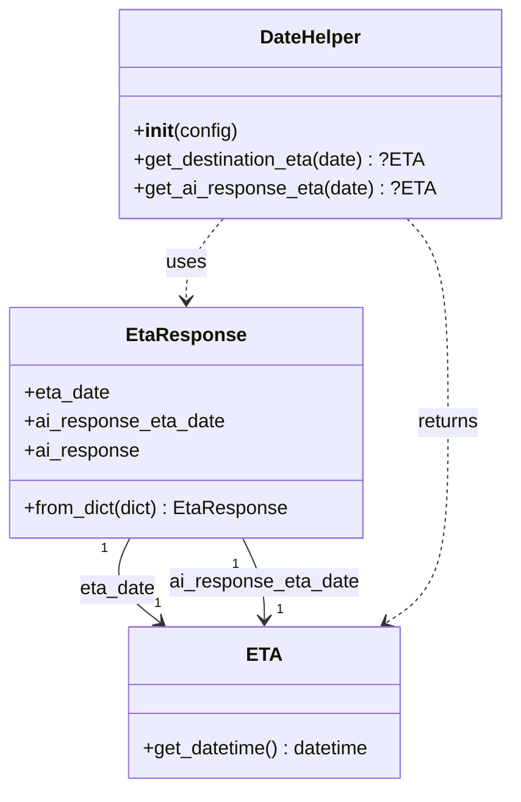

# Diagram: partview_core/partview_service/partview_service/tests/unit/business/package_container/event/test_eta_response.py


> Auto-generated by Obscura crawlers

## Diagram 1



### SVG

<svg id="container" width="420.189453125" xmlns="http://www.w3.org/2000/svg" class="classDiagram" height="656" viewBox="0 0 420.189453125 656" role="graphics-document document" aria-roledescription="class"><style>#container{font-family:"trebuchet ms",verdana,arial,sans-serif;font-size:16px;fill:#333;}@keyframes edge-animation-frame{from{stroke-dashoffset:0;}}@keyframes dash{to{stroke-dashoffset:0;}}#container .edge-animation-slow{stroke-dasharray:9,5!important;stroke-dashoffset:900;animation:dash 50s linear infinite;stroke-linecap:round;}#container .edge-animation-fast{stroke-dasharray:9,5!important;stroke-dashoffset:900;animation:dash 20s linear infinite;stroke-linecap:round;}#container .error-icon{fill:#552222;}#container .error-text{fill:#552222;stroke:#552222;}#container .edge-thickness-normal{stroke-width:1px;}#container .edge-thickness-thick{stroke-width:3.5px;}#container .edge-pattern-solid{stroke-dasharray:0;}#container .edge-thickness-invisible{stroke-width:0;fill:none;}#container .edge-pattern-dashed{stroke-dasharray:3;}#container .edge-pattern-dotted{stroke-dasharray:2;}#container .marker{fill:#333333;stroke:#333333;}#container .marker.cross{stroke:#333333;}#container svg{font-family:"trebuchet ms",verdana,arial,sans-serif;font-size:16px;}#container p{margin:0;}#container g.classGroup text{fill:#9370DB;stroke:none;font-family:"trebuchet ms",verdana,arial,sans-serif;font-size:10px;}#container g.classGroup text .title{font-weight:bolder;}#container .nodeLabel,#container .edgeLabel{color:#131300;}#container .edgeLabel .label rect{fill:#ECECFF;}#container .label text{fill:#131300;}#container .labelBkg{background:#ECECFF;}#container .edgeLabel .label span{background:#ECECFF;}#container .classTitle{font-weight:bolder;}#container .node rect,#container .node circle,#container .node ellipse,#container .node polygon,#container .node path{fill:#ECECFF;stroke:#9370DB;stroke-width:1px;}#container .divider{stroke:#9370DB;stroke-width:1;}#container g.clickable{cursor:pointer;}#container g.classGroup rect{fill:#ECECFF;stroke:#9370DB;}#container g.classGroup line{stroke:#9370DB;stroke-width:1;}#container .classLabel .box{stroke:none;stroke-width:0;fill:#ECECFF;opacity:0.5;}#container .classLabel .label{fill:#9370DB;font-size:10px;}#container .relation{stroke:#333333;stroke-width:1;fill:none;}#container .dashed-line{stroke-dasharray:3;}#container .dotted-line{stroke-dasharray:1 2;}#container #compositionStart,#container .composition{fill:#333333!important;stroke:#333333!important;stroke-width:1;}#container #compositionEnd,#container .composition{fill:#333333!important;stroke:#333333!important;stroke-width:1;}#container #dependencyStart,#container .dependency{fill:#333333!important;stroke:#333333!important;stroke-width:1;}#container #dependencyStart,#container .dependency{fill:#333333!important;stroke:#333333!important;stroke-width:1;}#container #extensionStart,#container .extension{fill:transparent!important;stroke:#333333!important;stroke-width:1;}#container #extensionEnd,#container .extension{fill:transparent!important;stroke:#333333!important;stroke-width:1;}#container #aggregationStart,#container .aggregation{fill:transparent!important;stroke:#333333!important;stroke-width:1;}#container #aggregationEnd,#container .aggregation{fill:transparent!important;stroke:#333333!important;stroke-width:1;}#container #lollipopStart,#container .lollipop{fill:#ECECFF!important;stroke:#333333!important;stroke-width:1;}#container #lollipopEnd,#container .lollipop{fill:#ECECFF!important;stroke:#333333!important;stroke-width:1;}#container .edgeTerminals{font-size:11px;line-height:initial;}#container .classTitleText{text-anchor:middle;font-size:18px;fill:#333;}#container .label-icon{display:inline-block;height:1em;overflow:visible;vertical-align:-0.125em;}#container .node .label-icon path{fill:currentColor;stroke:revert;stroke-width:revert;}#container :root{--mermaid-font-family:"trebuchet ms",verdana,arial,sans-serif;}</style><g><defs><marker id="container_class-aggregationStart" class="marker aggregation class" refX="18" refY="7" markerWidth="190" markerHeight="240" orient="auto"><path d="M 18,7 L9,13 L1,7 L9,1 Z"></path></marker></defs><defs><marker id="container_class-aggregationEnd" class="marker aggregation class" refX="1" refY="7" markerWidth="20" markerHeight="28" orient="auto"><path d="M 18,7 L9,13 L1,7 L9,1 Z"></path></marker></defs><defs><marker id="container_class-extensionStart" class="marker extension class" refX="18" refY="7" markerWidth="190" markerHeight="240" orient="auto"><path d="M 1,7 L18,13 V 1 Z"></path></marker></defs><defs><marker id="container_class-extensionEnd" class="marker extension class" refX="1" refY="7" markerWidth="20" markerHeight="28" orient="auto"><path d="M 1,1 V 13 L18,7 Z"></path></marker></defs><defs><marker id="container_class-compositionStart" class="marker composition class" refX="18" refY="7" markerWidth="190" markerHeight="240" orient="auto"><path d="M 18,7 L9,13 L1,7 L9,1 Z"></path></marker></defs><defs><marker id="container_class-compositionEnd" class="marker composition class" refX="1" refY="7" markerWidth="20" markerHeight="28" orient="auto"><path d="M 18,7 L9,13 L1,7 L9,1 Z"></path></marker></defs><defs><marker id="container_class-dependencyStart" class="marker dependency class" refX="6" refY="7" markerWidth="190" markerHeight="240" orient="auto"><path d="M 5,7 L9,13 L1,7 L9,1 Z"></path></marker></defs><defs><marker id="container_class-dependencyEnd" class="marker dependency class" refX="13" refY="7" markerWidth="20" markerHeight="28" orient="auto"><path d="M 18,7 L9,13 L14,7 L9,1 Z"></path></marker></defs><defs><marker id="container_class-lollipopStart" class="marker lollipop class" refX="13" refY="7" markerWidth="190" markerHeight="240" orient="auto"><circle stroke="black" fill="transparent" cx="7" cy="7" r="6"></circle></marker></defs><defs><marker id="container_class-lollipopEnd" class="marker lollipop class" refX="1" refY="7" markerWidth="190" markerHeight="240" orient="auto"><circle stroke="black" fill="transparent" cx="7" cy="7" r="6"></circle></marker></defs><g class="root"><g class="clusters"></g><g class="edgePaths"><path d="M106.181,448L103.135,454.167C100.09,460.333,93.998,472.667,98.258,484.394C102.519,496.122,117.131,507.244,124.437,512.805L131.744,518.366" id="id_EtaResponse_ETA_1" class="edge-thickness-normal edge-pattern-solid relation" style=";;;" data-edge="true" data-et="edge" data-id="id_EtaResponse_ETA_1" data-points="W3sieCI6MTA2LjE4MTMwMjg2NjU0MTM2LCJ5Ijo0NDh9LHsieCI6ODcuOTA2MjUsInkiOjQ4NX0seyJ4IjoxMzYuNTE3ODkwNjI1LCJ5Ijo1MjJ9XQ==" marker-end="url(#container_class-dependencyEnd)"></path><path d="M201.014,448L204.06,454.167C207.106,460.333,213.197,472.667,216.243,484C219.289,495.333,219.289,505.667,219.289,510.833L219.289,516" id="id_EtaResponse_ETA_2" class="edge-thickness-normal edge-pattern-solid relation" style=";;;" data-edge="true" data-et="edge" data-id="id_EtaResponse_ETA_2" data-points="W3sieCI6MjAxLjAxNDAwOTYzMzQ1ODY0LCJ5Ijo0NDh9LHsieCI6MjE5LjI4OTA2MjUsInkiOjQ4NX0seyJ4IjoyMTkuMjg5MDYyNSwieSI6NTIyfV0=" marker-end="url(#container_class-dependencyEnd)"></path><path d="M338.049,182L343.792,188.167C349.535,194.333,361.02,206.667,366.763,235C372.506,263.333,372.506,307.667,372.506,352C372.506,396.333,372.506,440.667,363.895,468.453C355.284,496.24,338.062,507.48,329.451,513.101L320.84,518.721" id="id_DateHelper_ETA_3" class="edge-thickness-normal edge-pattern-dashed relation" style=";;;" data-edge="true" data-et="edge" data-id="id_DateHelper_ETA_3" data-points="W3sieCI6MzM4LjA0OTE0MzE0NTE2MTMsInkiOjE4Mn0seyJ4IjozNzIuNTA1ODU5Mzc1LCJ5IjoyMTl9LHsieCI6MzcyLjUwNTg1OTM3NSwieSI6MzUyfSx7IngiOjM3Mi41MDU4NTkzNzUsInkiOjQ4NX0seyJ4IjozMTUuODE1NjQ0NTMxMjUsInkiOjUyMn1d" marker-end="url(#container_class-dependencyEnd)"></path><path d="M184.46,182L179.317,188.167C174.173,194.333,163.885,206.667,158.741,218C153.598,229.333,153.598,239.667,153.598,244.833L153.598,250" id="id_DateHelper_EtaResponse_4" class="edge-thickness-normal edge-pattern-dashed relation" style=";;;" data-edge="true" data-et="edge" data-id="id_DateHelper_EtaResponse_4" data-points="W3sieCI6MTg0LjQ2MDMyMzIxMDY4NTUsInkiOjE4Mn0seyJ4IjoxNTMuNTk3NjU2MjUsInkiOjIxOX0seyJ4IjoxNTMuNTk3NjU2MjUsInkiOjI1Nn1d" marker-end="url(#container_class-dependencyEnd)"></path></g><g class="edgeLabels"><g class="edgeLabel" transform="translate(95.79338, 491.00316)"><g class="label" data-id="id_EtaResponse_ETA_1" transform="translate(-31.8125, -12)"><foreignObject width="63.625" height="24"><div xmlns="http://www.w3.org/1999/xhtml" class="labelBkg" style="display: table-cell; white-space: nowrap; line-height: 1.5; max-width: 200px; text-align: center;"><span class="edgeLabel"><p>eta_date</p></span></div></foreignObject></g></g><g class="edgeLabel" transform="translate(219.2890625, 485)"><g class="label" data-id="id_EtaResponse_ETA_2" transform="translate(-79.5703125, -12)"><foreignObject width="159.140625" height="24"><div xmlns="http://www.w3.org/1999/xhtml" class="labelBkg" style="display: table-cell; white-space: nowrap; line-height: 1.5; max-width: 200px; text-align: center;"><span class="edgeLabel"><p>ai_response_eta_date</p></span></div></foreignObject></g></g><g class="edgeLabel" transform="translate(372.505859375, 352)"><g class="label" data-id="id_DateHelper_ETA_3" transform="translate(-26.265625, -12)"><foreignObject width="52.53125" height="24"><div xmlns="http://www.w3.org/1999/xhtml" class="labelBkg" style="display: table-cell; white-space: nowrap; line-height: 1.5; max-width: 200px; text-align: center;"><span class="edgeLabel"><p>returns</p></span></div></foreignObject></g></g><g class="edgeLabel" transform="translate(153.59765625, 219)"><g class="label" data-id="id_DateHelper_EtaResponse_4" transform="translate(-16.4921875, -12)"><foreignObject width="32.984375" height="24"><div xmlns="http://www.w3.org/1999/xhtml" class="labelBkg" style="display: table-cell; white-space: nowrap; line-height: 1.5; max-width: 200px; text-align: center;"><span class="edgeLabel"><p>uses</p></span></div></foreignObject></g></g><g class="edgeTerminals" transform="translate(84.98251751211538, 457.0477318173734)"><g class="inner" transform="translate(0, 0)"><foreignObject style="width: 9px; height: 12px;"><div xmlns="http://www.w3.org/1999/xhtml" style="display: inline-block; padding-right: 1px; white-space: nowrap;"><span class="edgeLabel">1</span></div></foreignObject></g></g><g class="edgeTerminals" transform="translate(195.31488547015715, 470.3331573213201)"><g class="inner" transform="translate(0, 0)"><foreignObject style="width: 9px; height: 12px;"><div xmlns="http://www.w3.org/1999/xhtml" style="display: inline-block; padding-right: 1px; white-space: nowrap;"><span class="edgeLabel">1</span></div></foreignObject></g></g><g class="edgeTerminals" transform="translate(126.67749577600603, 494.4651238572158)"><g class="inner" transform="translate(0, 0)"></g><foreignObject style="width: 9px; height: 12px;"><div xmlns="http://www.w3.org/1999/xhtml" style="display: inline-block; padding-right: 1px; white-space: nowrap;"><span class="edgeLabel">1</span></div></foreignObject></g><g class="edgeTerminals" transform="translate(229.28906124999997, 499.4999989285714)"><g class="inner" transform="translate(0, 0)"></g><foreignObject style="width: 9px; height: 12px;"><div xmlns="http://www.w3.org/1999/xhtml" style="display: inline-block; padding-right: 1px; white-space: nowrap;"><span class="edgeLabel">1</span></div></foreignObject></g></g><g class="nodes"><g class="node default" id="classId-EtaResponse-0" transform="translate(153.59765625, 352)"><g class="basic label-container"><path d="M-145.59765625 -96 L145.59765625 -96 L145.59765625 96 L-145.59765625 96" stroke="none" stroke-width="0" fill="#ECECFF" style=""></path><path d="M-145.59765625 -96 C-83.78021717698142 -96, -21.962778103962847 -96, 145.59765625 -96 M-145.59765625 -96 C-82.99252433193175 -96, -20.38739241386348 -96, 145.59765625 -96 M145.59765625 -96 C145.59765625 -55.34432981325307, 145.59765625 -14.688659626506137, 145.59765625 96 M145.59765625 -96 C145.59765625 -54.24536299628725, 145.59765625 -12.490725992574497, 145.59765625 96 M145.59765625 96 C34.22098763838008 96, -77.15568097323984 96, -145.59765625 96 M145.59765625 96 C70.29636511599462 96, -5.004926018010764 96, -145.59765625 96 M-145.59765625 96 C-145.59765625 30.464467817027057, -145.59765625 -35.07106436594589, -145.59765625 -96 M-145.59765625 96 C-145.59765625 54.51170045774087, -145.59765625 13.023400915481744, -145.59765625 -96" stroke="#9370DB" stroke-width="1.3" fill="none" stroke-dasharray="0 0" style=""></path></g><g class="annotation-group text" transform="translate(0, -72)"></g><g class="label-group text" transform="translate(-46.8828125, -72)"><g class="label" style="font-weight: bolder" transform="translate(0,-12)"><foreignObject width="93.765625" height="24"><div xmlns="http://www.w3.org/1999/xhtml" style="display: table-cell; white-space: nowrap; line-height: 1.5; max-width: 143px; text-align: center;"><span class="nodeLabel markdown-node-label" style=""><p>EtaResponse</p></span></div></foreignObject></g></g><g class="members-group text" transform="translate(-133.59765625, -24)"><g class="label" style="" transform="translate(0,-12)"><foreignObject width="71.609375" height="24"><div xmlns="http://www.w3.org/1999/xhtml" style="display: table-cell; white-space: nowrap; line-height: 1.5; max-width: 129px; text-align: center;"><span class="nodeLabel markdown-node-label" style=""><p>+eta_date</p></span></div></foreignObject></g><g class="label" style="" transform="translate(0,12)"><foreignObject width="166.890625" height="24"><div xmlns="http://www.w3.org/1999/xhtml" style="display: table-cell; white-space: nowrap; line-height: 1.5; max-width: 224px; text-align: center;"><span class="nodeLabel markdown-node-label" style=""><p>+ai_response_eta_date</p></span></div></foreignObject></g><g class="label" style="" transform="translate(0,36)"><foreignObject width="95.59375" height="24"><div xmlns="http://www.w3.org/1999/xhtml" style="display: table-cell; white-space: nowrap; line-height: 1.5; max-width: 153px; text-align: center;"><span class="nodeLabel markdown-node-label" style=""><p>+ai_response</p></span></div></foreignObject></g></g><g class="methods-group text" transform="translate(-133.59765625, 72)"><g class="label" style="" transform="translate(0,-12)"><foreignObject width="220.3125" height="24"><div xmlns="http://www.w3.org/1999/xhtml" style="display: table-cell; white-space: nowrap; line-height: 1.5; max-width: 278px; text-align: center;"><span class="nodeLabel markdown-node-label" style=""><p>+from_dict(dict) : EtaResponse</p></span></div></foreignObject></g></g><g class="divider" style=""><path d="M-145.59765625 -48 C-38.380077497611 -48, 68.837501254778 -48, 145.59765625 -48 M-145.59765625 -48 C-83.11901654233651 -48, -20.640376834673006 -48, 145.59765625 -48" stroke="#9370DB" stroke-width="1.3" fill="none" stroke-dasharray="0 0" style=""></path></g><g class="divider" style=""><path d="M-145.59765625 48 C-46.86417427501836 48, 51.86930769996329 48, 145.59765625 48 M-145.59765625 48 C-69.8543677164282 48, 5.8889208171436 48, 145.59765625 48" stroke="#9370DB" stroke-width="1.3" fill="none" stroke-dasharray="0 0" style=""></path></g></g><g class="node default" id="classId-DateHelper-1" transform="translate(257.029296875, 95)"><g class="basic label-container"><path d="M-155.16015625 -87 L155.16015625 -87 L155.16015625 87 L-155.16015625 87" stroke="none" stroke-width="0" fill="#ECECFF" style=""></path><path d="M-155.16015625 -87 C-74.53379016297177 -87, 6.092575924056462 -87, 155.16015625 -87 M-155.16015625 -87 C-60.15185216837274 -87, 34.85645191325452 -87, 155.16015625 -87 M155.16015625 -87 C155.16015625 -36.61692138247375, 155.16015625 13.766157235052503, 155.16015625 87 M155.16015625 -87 C155.16015625 -41.10019691852828, 155.16015625 4.799606162943434, 155.16015625 87 M155.16015625 87 C82.37440961042354 87, 9.588662970847082 87, -155.16015625 87 M155.16015625 87 C49.466576383925116 87, -56.22700348214977 87, -155.16015625 87 M-155.16015625 87 C-155.16015625 18.61094757324183, -155.16015625 -49.77810485351634, -155.16015625 -87 M-155.16015625 87 C-155.16015625 36.62463740314614, -155.16015625 -13.750725193707723, -155.16015625 -87" stroke="#9370DB" stroke-width="1.3" fill="none" stroke-dasharray="0 0" style=""></path></g><g class="annotation-group text" transform="translate(0, -63)"></g><g class="label-group text" transform="translate(-41.3984375, -63)"><g class="label" style="font-weight: bolder" transform="translate(0,-12)"><foreignObject width="82.796875" height="24"><div xmlns="http://www.w3.org/1999/xhtml" style="display: table-cell; white-space: nowrap; line-height: 1.5; max-width: 133px; text-align: center;"><span class="nodeLabel markdown-node-label" style=""><p>DateHelper</p></span></div></foreignObject></g></g><g class="members-group text" transform="translate(-143.16015625, -15)"></g><g class="methods-group text" transform="translate(-143.16015625, 15)"><g class="label" style="" transform="translate(0,-12)"><foreignObject width="86.359375" height="24"><div xmlns="http://www.w3.org/1999/xhtml" style="display: table-cell; white-space: nowrap; line-height: 1.5; max-width: 175px; text-align: center;"><span class="nodeLabel markdown-node-label" style=""><p>+<strong>init</strong>(config)</p></span></div></foreignObject></g><g class="label" style="" transform="translate(0,12)"><foreignObject width="240.53125" height="24"><div xmlns="http://www.w3.org/1999/xhtml" style="display: table-cell; white-space: nowrap; line-height: 1.5; max-width: 299px; text-align: center;"><span class="nodeLabel markdown-node-label" style=""><p>+get_destination_eta(date) : ?ETA</p></span></div></foreignObject></g><g class="label" style="" transform="translate(0,36)"><foreignObject width="244.921875" height="24"><div xmlns="http://www.w3.org/1999/xhtml" style="display: table-cell; white-space: nowrap; line-height: 1.5; max-width: 303px; text-align: center;"><span class="nodeLabel markdown-node-label" style=""><p>+get_ai_response_eta(date) : ?ETA</p></span></div></foreignObject></g></g><g class="divider" style=""><path d="M-155.16015625 -39 C-51.35146254438098 -39, 52.45723116123804 -39, 155.16015625 -39 M-155.16015625 -39 C-90.32147256624198 -39, -25.48278888248396 -39, 155.16015625 -39" stroke="#9370DB" stroke-width="1.3" fill="none" stroke-dasharray="0 0" style=""></path></g><g class="divider" style=""><path d="M-155.16015625 -15 C-51.88289241435869 -15, 51.394371421282614 -15, 155.16015625 -15 M-155.16015625 -15 C-76.42345701738189 -15, 2.3132422152362153 -15, 155.16015625 -15" stroke="#9370DB" stroke-width="1.3" fill="none" stroke-dasharray="0 0" style=""></path></g></g><g class="node default" id="classId-ETA-2" transform="translate(219.2890625, 585)"><g class="basic label-container"><path d="M-114.29296875 -63 L114.29296875 -63 L114.29296875 63 L-114.29296875 63" stroke="none" stroke-width="0" fill="#ECECFF" style=""></path><path d="M-114.29296875 -63 C-54.90403426584202 -63, 4.484900218315957 -63, 114.29296875 -63 M-114.29296875 -63 C-50.24866512831758 -63, 13.795638493364834 -63, 114.29296875 -63 M114.29296875 -63 C114.29296875 -16.417773938412473, 114.29296875 30.164452123175053, 114.29296875 63 M114.29296875 -63 C114.29296875 -31.299148824424524, 114.29296875 0.4017023511509521, 114.29296875 63 M114.29296875 63 C48.67752216830603 63, -16.937924413387947 63, -114.29296875 63 M114.29296875 63 C68.51310158459528 63, 22.733234419190552 63, -114.29296875 63 M-114.29296875 63 C-114.29296875 25.91005022814072, -114.29296875 -11.179899543718562, -114.29296875 -63 M-114.29296875 63 C-114.29296875 17.313761922026785, -114.29296875 -28.37247615594643, -114.29296875 -63" stroke="#9370DB" stroke-width="1.3" fill="none" stroke-dasharray="0 0" style=""></path></g><g class="annotation-group text" transform="translate(0, -39)"></g><g class="label-group text" transform="translate(-12.8515625, -39)"><g class="label" style="font-weight: bolder" transform="translate(0,-12)"><foreignObject width="25.703125" height="24"><div xmlns="http://www.w3.org/1999/xhtml" style="display: table-cell; white-space: nowrap; line-height: 1.5; max-width: 76px; text-align: center;"><span class="nodeLabel markdown-node-label" style=""><p>ETA</p></span></div></foreignObject></g></g><g class="members-group text" transform="translate(-102.29296875, 9)"></g><g class="methods-group text" transform="translate(-102.29296875, 39)"><g class="label" style="" transform="translate(0,-12)"><foreignObject width="191.734375" height="24"><div xmlns="http://www.w3.org/1999/xhtml" style="display: table-cell; white-space: nowrap; line-height: 1.5; max-width: 249px; text-align: center;"><span class="nodeLabel markdown-node-label" style=""><p>+get_datetime() : datetime</p></span></div></foreignObject></g></g><g class="divider" style=""><path d="M-114.29296875 -15 C-50.712877473873135 -15, 12.86721380225373 -15, 114.29296875 -15 M-114.29296875 -15 C-30.091952036066644 -15, 54.10906467786671 -15, 114.29296875 -15" stroke="#9370DB" stroke-width="1.3" fill="none" stroke-dasharray="0 0" style=""></path></g><g class="divider" style=""><path d="M-114.29296875 9 C-42.38324401744727 9, 29.526480715105464 9, 114.29296875 9 M-114.29296875 9 C-31.91080397142713 9, 50.47136080714574 9, 114.29296875 9" stroke="#9370DB" stroke-width="1.3" fill="none" stroke-dasharray="0 0" style=""></path></g></g></g></g></g></svg>

## Diagram 2

```mermaid
flowchart TD
    A[Load JSON response_dict] --> B[DateHelper({}) instantiate]
    B --> C[EtaResponse.from_dict(response_dict)]
    C --> D[Compute eta = date_helper.get_destination_eta(...) or get_ai_response_eta(...)]
    D --> E[eta_date = date_helper.get_destination_eta(...)]
    E --> F[ai_date = date_helper.get_ai_response_eta(...)]
    D --> G[eta_datetime = eta.get_datetime()]
    G --> H{Assertions}
    H --> H1[year == 2025]
    H --> H2[month == 5]
    H --> H3[day == 21]
    H --> H4[eta_date is None]
    H --> H5[ai_date is not None]
    H --> H6[ai_date == eta]
```

> SVG rendering failed for this diagram.
