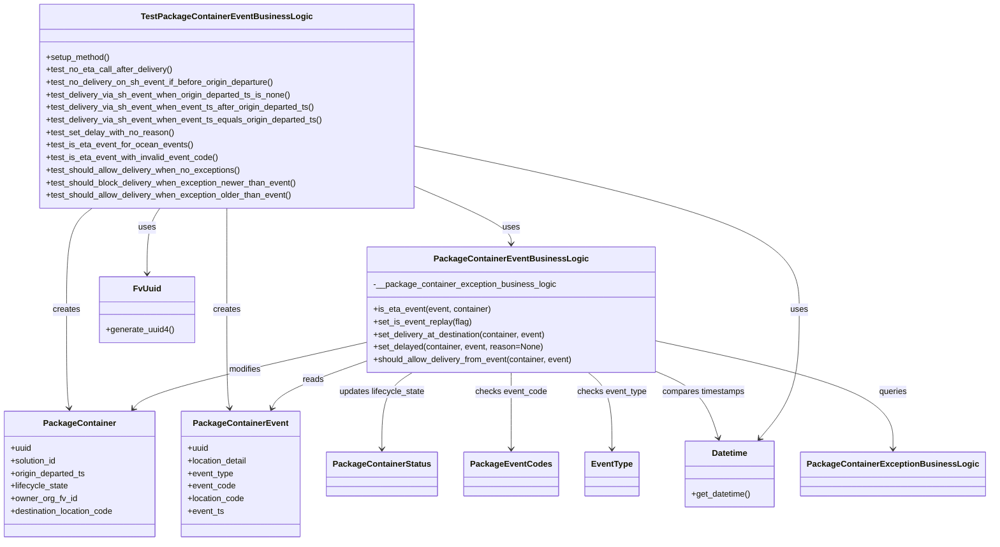
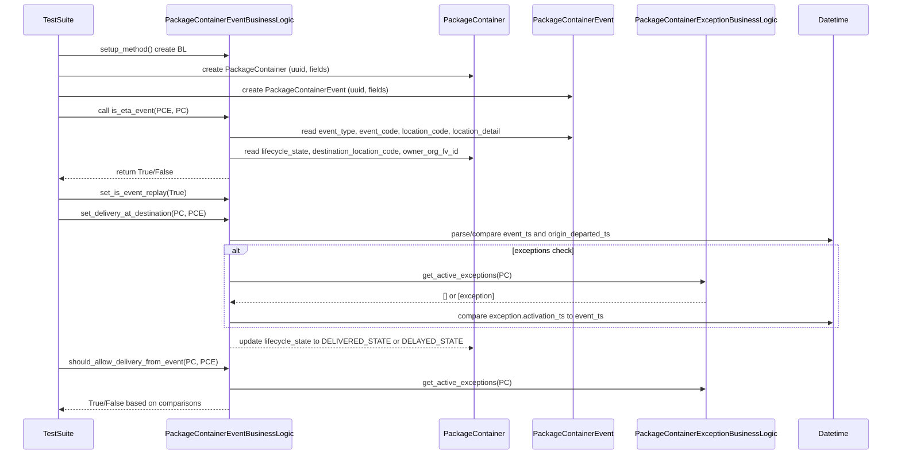

# Diagram: partview_core/partview_service/partview_service/tests/unit/business/package_container/event/test_package_container_event_business_logic.py

> Auto-generated by Obscura crawlers

## Diagram 1

### SVG

<svg id="container" width="1844.228515625" xmlns="http://www.w3.org/2000/svg" class="classDiagram" height="1034" viewBox="0 0 1844.228515625 1034" role="graphics-document document" aria-roledescription="class"><g><defs><marker id="container_class-aggregationStart" class="marker aggregation class" refX="18" refY="7" markerWidth="190" markerHeight="240" orient="auto"><path d="M 18,7 L9,13 L1,7 L9,1 Z"></path></marker></defs><defs><marker id="container_class-aggregationEnd" class="marker aggregation class" refX="1" refY="7" markerWidth="20" markerHeight="28" orient="auto"><path d="M 18,7 L9,13 L1,7 L9,1 Z"></path></marker></defs><defs><marker id="container_class-extensionStart" class="marker extension class" refX="18" refY="7" markerWidth="190" markerHeight="240" orient="auto"><path d="M 1,7 L18,13 V 1 Z"></path></marker></defs><defs><marker id="container_class-extensionEnd" class="marker extension class" refX="1" refY="7" markerWidth="20" markerHeight="28" orient="auto"><path d="M 1,1 V 13 L18,7 Z"></path></marker></defs><defs><marker id="container_class-compositionStart" class="marker composition class" refX="18" refY="7" markerWidth="190" markerHeight="240" orient="auto"><path d="M 18,7 L9,13 L1,7 L9,1 Z"></path></marker></defs><defs><marker id="container_class-compositionEnd" class="marker composition class" refX="1" refY="7" markerWidth="20" markerHeight="28" orient="auto"><path d="M 18,7 L9,13 L1,7 L9,1 Z"></path></marker></defs><defs><marker id="container_class-dependencyStart" class="marker dependency class" refX="6" refY="7" markerWidth="190" markerHeight="240" orient="auto"><path d="M 5,7 L9,13 L1,7 L9,1 Z"></path></marker></defs><defs><marker id="container_class-dependencyEnd" class="marker dependency class" refX="13" refY="7" markerWidth="20" markerHeight="28" orient="auto"><path d="M 18,7 L9,13 L14,7 L9,1 Z"></path></marker></defs><defs><marker id="container_class-lollipopStart" class="marker lollipop class" refX="13" refY="7" markerWidth="190" markerHeight="240" orient="auto"><circle stroke="black" fill="transparent" cx="7" cy="7" r="6"></circle></marker></defs><defs><marker id="container_class-lollipopEnd" class="marker lollipop class" refX="1" refY="7" markerWidth="190" markerHeight="240" orient="auto"><circle stroke="black" fill="transparent" cx="7" cy="7" r="6"></circle></marker></defs><g class="root"><g class="clusters"></g><g class="edgePaths"><path d="M787.051,358.386L816.146,371.155C845.242,383.924,903.434,409.462,932.529,427.398C961.625,445.333,961.625,455.667,961.625,460.833L961.625,466" id="id_TestPackageContainerEventBusinessLogic_PackageContainerEventBusinessLogic_1" class="edge-thickness-normal edge-pattern-solid relation" style=";;;" data-edge="true" data-et="edge" data-id="id_TestPackageContainerEventBusinessLogic_PackageContainerEventBusinessLogic_1" data-points="W3sieCI6Nzg3LjA1MDc4MTI1LCJ5IjozNTguMzg1NTM2MjAzODI2Mn0seyJ4Ijo5NjEuNjI1LCJ5Ijo0MzV9LHsieCI6OTYxLjYyNSwieSI6NDcyfV0=" marker-end="url(#container_class-dependencyEnd)"></path><path d="M176.47,398L168.358,404.167C160.245,410.333,144.021,422.667,135.909,455C127.797,487.333,127.797,539.667,127.797,592C127.797,644.333,127.797,696.667,128.643,728.013C129.488,759.359,131.18,769.719,132.025,774.899L132.871,780.078" id="id_TestPackageContainerEventBusinessLogic_PackageContainer_2" class="edge-thickness-normal edge-pattern-solid relation" style=";;;" data-edge="true" data-et="edge" data-id="id_TestPackageContainerEventBusinessLogic_PackageContainer_2" data-points="W3sieCI6MTc2LjQ2OTY0MjM3NjA3NzU2LCJ5IjozOTh9LHsieCI6MTI3Ljc5Njg3NSwieSI6NDM1fSx7IngiOjEyNy43OTY4NzUsInkiOjU5Mn0seyJ4IjoxMjcuNzk2ODc1LCJ5Ijo3NDl9LHsieCI6MTMzLjgzNzcyODkwMTI3MzksInkiOjc4Nn1d" marker-end="url(#container_class-dependencyEnd)"></path><path d="M432.988,398L432.988,404.167C432.988,410.333,432.988,422.667,432.988,455C432.988,487.333,432.988,539.667,432.988,592C432.988,644.333,432.988,696.667,433.952,728.017C434.916,759.367,436.844,769.734,437.809,774.918L438.773,780.101" id="id_TestPackageContainerEventBusinessLogic_PackageContainerEvent_3" class="edge-thickness-normal edge-pattern-solid relation" style=";;;" data-edge="true" data-et="edge" data-id="id_TestPackageContainerEventBusinessLogic_PackageContainerEvent_3" data-points="W3sieCI6NDMyLjk4ODI4MTI1LCJ5IjozOTh9LHsieCI6NDMyLjk4ODI4MTI1LCJ5Ijo0MzV9LHsieCI6NDMyLjk4ODI4MTI1LCJ5Ijo1OTJ9LHsieCI6NDMyLjk4ODI4MTI1LCJ5Ijo3NDl9LHsieCI6NDM5Ljg2OTYyNTc5NjE3ODM1LCJ5Ijo3ODZ9XQ==" marker-end="url(#container_class-dependencyEnd)"></path><path d="M687.715,655.292L620.125,670.91C552.535,686.528,417.355,717.764,345.343,738.775C273.33,759.787,264.485,770.574,260.062,775.967L255.639,781.36" id="id_PackageContainerEventBusinessLogic_PackageContainer_4" class="edge-thickness-normal edge-pattern-solid relation" style=";;;" data-edge="true" data-et="edge" data-id="id_PackageContainerEventBusinessLogic_PackageContainer_4" data-points="W3sieCI6Njg3LjcxNDg0Mzc1LCJ5Ijo2NTUuMjkyMjg2Mzc2MjU4M30seyJ4IjoyODIuMTc1NzgxMjUsInkiOjc0OX0seyJ4IjoyNTEuODM0MzQ1MTQzMzEyMSwieSI6Nzg2fV0=" marker-end="url(#container_class-dependencyEnd)"></path><path d="M687.715,692.244L661.868,701.703C636.021,711.163,584.327,730.081,556.122,744.795C527.918,759.509,523.202,770.017,520.845,775.272L518.487,780.526" id="id_PackageContainerEventBusinessLogic_PackageContainerEvent_5" class="edge-thickness-normal edge-pattern-solid relation" style=";;;" data-edge="true" data-et="edge" data-id="id_PackageContainerEventBusinessLogic_PackageContainerEvent_5" data-points="W3sieCI6Njg3LjcxNDg0Mzc1LCJ5Ijo2OTIuMjQ0MDAzOTMzNjM4fSx7IngiOjUzMi42MzI4MTI1LCJ5Ijo3NDl9LHsieCI6NTE2LjAzMTA1MDk1NTQxNCwieSI6Nzg2fV0=" marker-end="url(#container_class-dependencyEnd)"></path><path d="M781.87,712L772.632,718.167C763.395,724.333,744.92,736.667,735.683,761C726.445,785.333,726.445,821.667,726.445,839.833L726.445,858" id="id_PackageContainerEventBusinessLogic_PackageContainerStatus_6" class="edge-thickness-normal edge-pattern-solid relation" style=";;;" data-edge="true" data-et="edge" data-id="id_PackageContainerEventBusinessLogic_PackageContainerStatus_6" data-points="W3sieCI6NzgxLjg2OTgyNDg0MDc2NDMsInkiOjcxMn0seyJ4Ijo3MjYuNDQ1MzEyNSwieSI6NzQ5fSx7IngiOjcyNi40NDUzMTI1LCJ5Ijo4NjR9XQ==" marker-end="url(#container_class-dependencyEnd)"></path><path d="M961.625,712L961.625,718.167C961.625,724.333,961.625,736.667,961.625,761C961.625,785.333,961.625,821.667,961.625,839.833L961.625,858" id="id_PackageContainerEventBusinessLogic_PackageEventCodes_7" class="edge-thickness-normal edge-pattern-solid relation" style=";;;" data-edge="true" data-et="edge" data-id="id_PackageContainerEventBusinessLogic_PackageEventCodes_7" data-points="W3sieCI6OTYxLjYyNSwieSI6NzEyfSx7IngiOjk2MS42MjUsInkiOjc0OX0seyJ4Ijo5NjEuNjI1LCJ5Ijo4NjR9XQ==" marker-end="url(#container_class-dependencyEnd)"></path><path d="M1102.107,712L1109.326,718.167C1116.545,724.333,1130.983,736.667,1138.203,761C1145.422,785.333,1145.422,821.667,1145.422,839.833L1145.422,858" id="id_PackageContainerEventBusinessLogic_EventType_8" class="edge-thickness-normal edge-pattern-solid relation" style=";;;" data-edge="true" data-et="edge" data-id="id_PackageContainerEventBusinessLogic_EventType_8" data-points="W3sieCI6MTEwMi4xMDY2ODc4OTgwODkxLCJ5Ijo3MTJ9LHsieCI6MTE0NS40MjE4NzUsInkiOjc0OX0seyJ4IjoxMTQ1LjQyMTg3NSwieSI6ODY0fV0=" marker-end="url(#container_class-dependencyEnd)"></path><path d="M1235.535,711.536L1249.843,717.78C1264.15,724.024,1292.766,736.512,1311.755,757.47C1330.744,778.427,1340.107,807.855,1344.788,822.569L1349.47,837.282" id="id_PackageContainerEventBusinessLogic_Datetime_9" class="edge-thickness-normal edge-pattern-solid relation" style=";;;" data-edge="true" data-et="edge" data-id="id_PackageContainerEventBusinessLogic_Datetime_9" data-points="W3sieCI6MTIzNS41MzUxNTYyNSwieSI6NzExLjUzNjMyODM0NzY3NTF9LHsieCI6MTMyMS4zODA4NTkzNzUsInkiOjc0OX0seyJ4IjoxMzUxLjI4OTA5OTgyMDg2LCJ5Ijo4NDN9XQ==" marker-end="url(#container_class-dependencyEnd)"></path><path d="M787.051,280.137L905.523,305.947C1023.995,331.758,1260.939,383.379,1379.411,435.356C1497.883,487.333,1497.883,539.667,1497.883,592C1497.883,644.333,1497.883,696.667,1485.882,737.721C1473.882,778.776,1449.881,808.552,1437.881,823.44L1425.88,838.329" id="id_TestPackageContainerEventBusinessLogic_Datetime_10" class="edge-thickness-normal edge-pattern-solid relation" style=";;;" data-edge="true" data-et="edge" data-id="id_TestPackageContainerEventBusinessLogic_Datetime_10" data-points="W3sieCI6Nzg3LjA1MDc4MTI1LCJ5IjoyODAuMTM2NzQ2OTYzNjQ0NDR9LHsieCI6MTQ5Ny44ODI4MTI1LCJ5Ijo0MzV9LHsieCI6MTQ5Ny44ODI4MTI1LCJ5Ijo1OTJ9LHsieCI6MTQ5Ny44ODI4MTI1LCJ5Ijo3NDl9LHsieCI6MTQyMi4xMTQ3MjQzMjMyNDgzLCJ5Ijo4NDN9XQ==" marker-end="url(#container_class-dependencyEnd)"></path><path d="M306.228,398L302.219,404.167C298.21,410.333,290.193,422.667,286.184,443.5C282.176,464.333,282.176,493.667,282.176,508.333L282.176,523" id="id_TestPackageContainerEventBusinessLogic_FvUuid_11" class="edge-thickness-normal edge-pattern-solid relation" style=";;;" data-edge="true" data-et="edge" data-id="id_TestPackageContainerEventBusinessLogic_FvUuid_11" data-points="W3sieCI6MzA2LjIyNzc3NDc4NDQ4MjgsInkiOjM5OH0seyJ4IjoyODIuMTc1NzgxMjUsInkiOjQzNX0seyJ4IjoyODIuMTc1NzgxMjUsInkiOjUyOX1d" marker-end="url(#container_class-dependencyEnd)"></path><path d="M1235.535,652.565L1308.225,668.637C1380.915,684.71,1526.294,716.855,1598.984,751.094C1671.674,785.333,1671.674,821.667,1671.674,839.833L1671.674,858" id="id_PackageContainerEventBusinessLogic_PackageContainerExceptionBusinessLogic_12" class="edge-thickness-normal edge-pattern-solid relation" style=";;;" data-edge="true" data-et="edge" data-id="id_PackageContainerEventBusinessLogic_PackageContainerExceptionBusinessLogic_12" data-points="W3sieCI6MTIzNS41MzUxNTYyNSwieSI6NjUyLjU2NDcwMDM4MDk3MDd9LHsieCI6MTY3MS42NzM4MjgxMjUsInkiOjc0OX0seyJ4IjoxNjcxLjY3MzgyODEyNSwieSI6ODY0fV0=" marker-end="url(#container_class-dependencyEnd)"></path></g><g class="edgeLabels"><g class="edgeLabel" transform="translate(961.625, 435)"><g class="label" data-id="id_TestPackageContainerEventBusinessLogic_PackageContainerEventBusinessLogic_1" transform="translate(-16.4921875, -12)"><foreignObject width="32.984375" height="24">

uses

</foreignObject></g></g><g class="edgeLabel" transform="translate(127.796875, 592)"><g class="label" data-id="id_TestPackageContainerEventBusinessLogic_PackageContainer_2" transform="translate(-26.171875, -12)"><foreignObject width="52.34375" height="24">

creates

</foreignObject></g></g><g class="edgeLabel" transform="translate(432.98828125, 592)"><g class="label" data-id="id_TestPackageContainerEventBusinessLogic_PackageContainerEvent_3" transform="translate(-26.171875, -12)"><foreignObject width="52.34375" height="24">

creates

</foreignObject></g></g><g class="edgeLabel" transform="translate(461.63464, 707.53253)"><g class="label" data-id="id_PackageContainerEventBusinessLogic_PackageContainer_4" transform="translate(-31.265625, -12)"><foreignObject width="62.53125" height="24">

modifies

</foreignObject></g></g><g class="edgeLabel" transform="translate(591.13202, 727.59081)"><g class="label" data-id="id_PackageContainerEventBusinessLogic_PackageContainerEvent_5" transform="translate(-20.0078125, -12)"><foreignObject width="40.015625" height="24">

reads

</foreignObject></g></g><g class="edgeLabel" transform="translate(726.4453125, 749)"><g class="label" data-id="id_PackageContainerEventBusinessLogic_PackageContainerStatus_6" transform="translate(-83.359375, -12)"><foreignObject width="166.71875" height="24">

updates lifecycle_state

</foreignObject></g></g><g class="edgeLabel" transform="translate(961.625, 749)"><g class="label" data-id="id_PackageContainerEventBusinessLogic_PackageEventCodes_7" transform="translate(-68.2578125, -12)"><foreignObject width="136.515625" height="24">

checks event_code

</foreignObject></g></g><g class="edgeLabel" transform="translate(1145.421875, 749)"><g class="label" data-id="id_PackageContainerEventBusinessLogic_EventType_8" transform="translate(-66.6796875, -12)"><foreignObject width="133.359375" height="24">

checks event_type

</foreignObject></g></g><g class="edgeLabel" transform="translate(1322.13566, 751.37229)"><g class="label" data-id="id_PackageContainerEventBusinessLogic_Datetime_9" transform="translate(-79.90625, -12)"><foreignObject width="159.8125" height="24">

compares timestamps

</foreignObject></g></g><g class="edgeLabel" transform="translate(1497.8828125, 592)"><g class="label" data-id="id_TestPackageContainerEventBusinessLogic_Datetime_10" transform="translate(-16.4921875, -12)"><foreignObject width="32.984375" height="24">

uses

</foreignObject></g></g><g class="edgeLabel" transform="translate(282.17578125, 435)"><g class="label" data-id="id_TestPackageContainerEventBusinessLogic_FvUuid_11" transform="translate(-16.4921875, -12)"><foreignObject width="32.984375" height="24">

uses

</foreignObject></g></g><g class="edgeLabel" transform="translate(1671.673828125, 749)"><g class="label" data-id="id_PackageContainerEventBusinessLogic_PackageContainerExceptionBusinessLogic_12" transform="translate(-27.2421875, -12)"><foreignObject width="54.484375" height="24">

queries

</foreignObject></g></g></g><g class="nodes"><g class="node default" id="classId-TestPackageContainerEventBusinessLogic-0" transform="translate(432.98828125, 203)"><g class="basic label-container"><path d="M-354.0625 -195 L354.0625 -195 L354.0625 195 L-354.0625 195" stroke="none" stroke-width="0" fill="#ECECFF" style=""></path><path d="M-354.0625 -195 C-159.95251551026251 -195, 34.15746897947497 -195, 354.0625 -195 M-354.0625 -195 C-208.39526577848713 -195, -62.72803155697426 -195, 354.0625 -195 M354.0625 -195 C354.0625 -114.35822800556187, 354.0625 -33.71645601112374, 354.0625 195 M354.0625 -195 C354.0625 -112.39233001393254, 354.0625 -29.784660027865073, 354.0625 195 M354.0625 195 C118.72697919005898 195, -116.60854161988203 195, -354.0625 195 M354.0625 195 C89.22149805695864 195, -175.61950388608273 195, -354.0625 195 M-354.0625 195 C-354.0625 59.57909595975693, -354.0625 -75.84180808048615, -354.0625 -195 M-354.0625 195 C-354.0625 101.47777292971581, -354.0625 7.9555458594316235, -354.0625 -195" stroke="#9370DB" stroke-width="1.3" fill="none" stroke-dasharray="0 0" style=""></path></g><g class="annotation-group text" transform="translate(0, -171)"></g><g class="label-group text" transform="translate(-152.3125, -171)"><g class="label" style="font-weight: bolder" transform="translate(0,-12)"><foreignObject width="304.625" height="24">

TestPackageContainerEventBusinessLogic

</foreignObject></g></g><g class="members-group text" transform="translate(-342.0625, -123)"></g><g class="methods-group text" transform="translate(-342.0625, -93)"><g class="label" style="" transform="translate(0,-12)"><foreignObject width="123.640625" height="24">

+setup_method()

</foreignObject></g><g class="label" style="" transform="translate(0,12)"><foreignObject width="244.28125" height="24">

+test_no_eta_call_after_delivery()

</foreignObject></g><g class="label" style="" transform="translate(0,36)"><foreignObject width="441.46875" height="24">

+test_no_delivery_on_sh_event_if_before_origin_departure()

</foreignObject></g><g class="label" style="" transform="translate(0,60)"><foreignObject width="471.375" height="24">

+test_delivery_via_sh_event_when_origin_departed_ts_is_none()

</foreignObject></g><g class="label" style="" transform="translate(0,84)"><foreignObject width="517.046875" height="24">

+test_delivery_via_sh_event_when_event_ts_after_origin_departed_ts()

</foreignObject></g><g class="label" style="" transform="translate(0,108)"><foreignObject width="531.8125" height="24">

+test_delivery_via_sh_event_when_event_ts_equals_origin_departed_ts()

</foreignObject></g><g class="label" style="" transform="translate(0,132)"><foreignObject width="246" height="24">

+test_set_delay_with_no_reason()

</foreignObject></g><g class="label" style="" transform="translate(0,156)"><foreignObject width="279.75" height="24">

+test_is_eta_event_for_ocean_events()

</foreignObject></g><g class="label" style="" transform="translate(0,180)"><foreignObject width="332.65625" height="24">

+test_is_eta_event_with_invalid_event_code()

</foreignObject></g><g class="label" style="" transform="translate(0,204)"><foreignObject width="375.59375" height="24">

+test_should_allow_delivery_when_no_exceptions()

</foreignObject></g><g class="label" style="" transform="translate(0,228)"><foreignObject width="483.75" height="24">

+test_should_block_delivery_when_exception_newer_than_event()

</foreignObject></g><g class="label" style="" transform="translate(0,252)"><foreignObject width="476.109375" height="24">

+test_should_allow_delivery_when_exception_older_than_event()

</foreignObject></g></g><g class="divider" style=""><path d="M-354.0625 -147 C-158.8665405163326 -147, 36.32941896733479 -147, 354.0625 -147 M-354.0625 -147 C-112.00884882628321 -147, 130.04480234743357 -147, 354.0625 -147" stroke="#9370DB" stroke-width="1.3" fill="none" stroke-dasharray="0 0" style=""></path></g><g class="divider" style=""><path d="M-354.0625 -123 C-130.51414257473866 -123, 93.03421485052269 -123, 354.0625 -123 M-354.0625 -123 C-155.89468194268588 -123, 42.273136114628244 -123, 354.0625 -123" stroke="#9370DB" stroke-width="1.3" fill="none" stroke-dasharray="0 0" style=""></path></g></g><g class="node default" id="classId-PackageContainerEventBusinessLogic-1" transform="translate(961.625, 592)"><g class="basic label-container"><path d="M-273.91015625 -120 L273.91015625 -120 L273.91015625 120 L-273.91015625 120" stroke="none" stroke-width="0" fill="#ECECFF" style=""></path><path d="M-273.91015625 -120 C-93.16933710951332 -120, 87.57148203097336 -120, 273.91015625 -120 M-273.91015625 -120 C-96.30170663981667 -120, 81.30674297036666 -120, 273.91015625 -120 M273.91015625 -120 C273.91015625 -58.76078981089754, 273.91015625 2.478420378204916, 273.91015625 120 M273.91015625 -120 C273.91015625 -24.474953294581496, 273.91015625 71.05009341083701, 273.91015625 120 M273.91015625 120 C145.25582019208662 120, 16.601484134173234 120, -273.91015625 120 M273.91015625 120 C100.92702772613637 120, -72.05610079772725 120, -273.91015625 120 M-273.91015625 120 C-273.91015625 32.078134630738205, -273.91015625 -55.84373073852359, -273.91015625 -120 M-273.91015625 120 C-273.91015625 60.99500640103594, -273.91015625 1.990012802071874, -273.91015625 -120" stroke="#9370DB" stroke-width="1.3" fill="none" stroke-dasharray="0 0" style=""></path></g><g class="annotation-group text" transform="translate(0, -96)"></g><g class="label-group text" transform="translate(-137.0703125, -96)"><g class="label" style="font-weight: bolder" transform="translate(0,-12)"><foreignObject width="274.140625" height="24">

PackageContainerEventBusinessLogic

</foreignObject></g></g><g class="members-group text" transform="translate(-261.91015625, -48)"><g class="label" style="" transform="translate(0,-12)"><foreignObject width="349.25" height="24">

-__package_container_exception_business_logic

</foreignObject></g></g><g class="methods-group text" transform="translate(-261.91015625, 0)"><g class="label" style="" transform="translate(0,-12)"><foreignObject width="227.125" height="24">

+is_eta_event(event, container)

</foreignObject></g><g class="label" style="" transform="translate(0,12)"><foreignObject width="188.09375" height="24">

+set_is_event_replay(flag)

</foreignObject></g><g class="label" style="" transform="translate(0,36)"><foreignObject width="335.859375" height="24">

+set_delivery_at_destination(container, event)

</foreignObject></g><g class="label" style="" transform="translate(0,60)"><foreignObject width="325.625" height="24">

+set_delayed(container, event, reason=None)

</foreignObject></g><g class="label" style="" transform="translate(0,84)"><foreignObject width="386.75" height="24">

+should_allow_delivery_from_event(container, event)

</foreignObject></g></g><g class="divider" style=""><path d="M-273.91015625 -72 C-104.26485476752566 -72, 65.38044671494868 -72, 273.91015625 -72 M-273.91015625 -72 C-144.1996611252435 -72, -14.489166000486989 -72, 273.91015625 -72" stroke="#9370DB" stroke-width="1.3" fill="none" stroke-dasharray="0 0" style=""></path></g><g class="divider" style=""><path d="M-273.91015625 -24 C-154.67363514885307 -24, -35.4371140477061 -24, 273.91015625 -24 M-273.91015625 -24 C-150.52414018554566 -24, -27.138124121091295 -24, 273.91015625 -24" stroke="#9370DB" stroke-width="1.3" fill="none" stroke-dasharray="0 0" style=""></path></g></g><g class="node default" id="classId-PackageContainer-2" transform="translate(153.4296875, 906)"><g class="basic label-container"><path d="M-145.4296875 -120 L145.4296875 -120 L145.4296875 120 L-145.4296875 120" stroke="none" stroke-width="0" fill="#ECECFF" style=""></path><path d="M-145.4296875 -120 C-85.9497794832198 -120, -26.469871466439585 -120, 145.4296875 -120 M-145.4296875 -120 C-64.2433897112166 -120, 16.942908077566813 -120, 145.4296875 -120 M145.4296875 -120 C145.4296875 -30.968692709288064, 145.4296875 58.06261458142387, 145.4296875 120 M145.4296875 -120 C145.4296875 -38.28716022693213, 145.4296875 43.42567954613574, 145.4296875 120 M145.4296875 120 C50.627095982562494 120, -44.17549553487501 120, -145.4296875 120 M145.4296875 120 C83.6526431088416 120, 21.875598717683218 120, -145.4296875 120 M-145.4296875 120 C-145.4296875 57.315973612472185, -145.4296875 -5.368052775055631, -145.4296875 -120 M-145.4296875 120 C-145.4296875 54.1461925040813, -145.4296875 -11.707614991837403, -145.4296875 -120" stroke="#9370DB" stroke-width="1.3" fill="none" stroke-dasharray="0 0" style=""></path></g><g class="annotation-group text" transform="translate(0, -96)"></g><g class="label-group text" transform="translate(-65.453125, -96)"><g class="label" style="font-weight: bolder" transform="translate(0,-12)"><foreignObject width="130.90625" height="24">

PackageContainer

</foreignObject></g></g><g class="members-group text" transform="translate(-133.4296875, -48)"><g class="label" style="" transform="translate(0,-12)"><foreignObject width="40.703125" height="24">

+uuid

</foreignObject></g><g class="label" style="" transform="translate(0,12)"><foreignObject width="90.21875" height="24">

+solution_id

</foreignObject></g><g class="label" style="" transform="translate(0,36)"><foreignObject width="145.8125" height="24">

+origin_departed_ts

</foreignObject></g><g class="label" style="" transform="translate(0,60)"><foreignObject width="111.640625" height="24">

+lifecycle_state

</foreignObject></g><g class="label" style="" transform="translate(0,84)"><foreignObject width="126.609375" height="24">

+owner_org_fv_id

</foreignObject></g><g class="label" style="" transform="translate(0,108)"><foreignObject width="201.40625" height="24">

+destination_location_code

</foreignObject></g></g><g class="methods-group text" transform="translate(-133.4296875, 120)"></g><g class="divider" style=""><path d="M-145.4296875 -72 C-58.672846043041304 -72, 28.083995413917393 -72, 145.4296875 -72 M-145.4296875 -72 C-47.69730028828968 -72, 50.035086923420636 -72, 145.4296875 -72" stroke="#9370DB" stroke-width="1.3" fill="none" stroke-dasharray="0 0" style=""></path></g><g class="divider" style=""><path d="M-145.4296875 96 C-70.30564881736336 96, 4.818389865273275 96, 145.4296875 96 M-145.4296875 96 C-57.246185819465566 96, 30.937315861068868 96, 145.4296875 96" stroke="#9370DB" stroke-width="1.3" fill="none" stroke-dasharray="0 0" style=""></path></g></g><g class="node default" id="classId-PackageContainerEvent-3" transform="translate(462.1875, 906)"><g class="basic label-container"><path d="M-113.328125 -120 L113.328125 -120 L113.328125 120 L-113.328125 120" stroke="none" stroke-width="0" fill="#ECECFF" style=""></path><path d="M-113.328125 -120 C-44.83128934464631 -120, 23.665546310707384 -120, 113.328125 -120 M-113.328125 -120 C-53.51751227094367 -120, 6.2931004581126615 -120, 113.328125 -120 M113.328125 -120 C113.328125 -43.100236787952554, 113.328125 33.79952642409489, 113.328125 120 M113.328125 -120 C113.328125 -34.50954913579696, 113.328125 50.98090172840608, 113.328125 120 M113.328125 120 C60.27117561489191 120, 7.214226229783819 120, -113.328125 120 M113.328125 120 C39.60388600404279 120, -34.120352991914416 120, -113.328125 120 M-113.328125 120 C-113.328125 37.252143288166295, -113.328125 -45.49571342366741, -113.328125 -120 M-113.328125 120 C-113.328125 35.485873093965324, -113.328125 -49.02825381206935, -113.328125 -120" stroke="#9370DB" stroke-width="1.3" fill="none" stroke-dasharray="0 0" style=""></path></g><g class="annotation-group text" transform="translate(0, -96)"></g><g class="label-group text" transform="translate(-85.65625, -96)"><g class="label" style="font-weight: bolder" transform="translate(0,-12)"><foreignObject width="171.3125" height="24">

PackageContainerEvent

</foreignObject></g></g><g class="members-group text" transform="translate(-101.328125, -48)"><g class="label" style="" transform="translate(0,-12)"><foreignObject width="40.703125" height="24">

+uuid

</foreignObject></g><g class="label" style="" transform="translate(0,12)"><foreignObject width="117" height="24">

+location_detail

</foreignObject></g><g class="label" style="" transform="translate(0,36)"><foreignObject width="88.125" height="24">

+event_type

</foreignObject></g><g class="label" style="" transform="translate(0,60)"><foreignObject width="91.28125" height="24">

+event_code

</foreignObject></g><g class="label" style="" transform="translate(0,84)"><foreignObject width="110.109375" height="24">

+location_code

</foreignObject></g><g class="label" style="" transform="translate(0,108)"><foreignObject width="69.578125" height="24">

+event_ts

</foreignObject></g></g><g class="methods-group text" transform="translate(-101.328125, 120)"></g><g class="divider" style=""><path d="M-113.328125 -72 C-24.067169559450036 -72, 65.19378588109993 -72, 113.328125 -72 M-113.328125 -72 C-35.328293986714925 -72, 42.67153702657015 -72, 113.328125 -72" stroke="#9370DB" stroke-width="1.3" fill="none" stroke-dasharray="0 0" style=""></path></g><g class="divider" style=""><path d="M-113.328125 96 C-26.061784865731184 96, 61.20455526853763 96, 113.328125 96 M-113.328125 96 C-55.53929563834658 96, 2.2495337233068398 96, 113.328125 96" stroke="#9370DB" stroke-width="1.3" fill="none" stroke-dasharray="0 0" style=""></path></g></g><g class="node default" id="classId-Datetime-4" transform="translate(1371.333984375, 906)"><g class="basic label-container"><path d="M-85.78515625 -63 L85.78515625 -63 L85.78515625 63 L-85.78515625 63" stroke="none" stroke-width="0" fill="#ECECFF" style=""></path><path d="M-85.78515625 -63 C-40.83094513709222 -63, 4.123265975815556 -63, 85.78515625 -63 M-85.78515625 -63 C-33.7123663021489 -63, 18.3604236457022 -63, 85.78515625 -63 M85.78515625 -63 C85.78515625 -14.427607640895658, 85.78515625 34.14478471820868, 85.78515625 63 M85.78515625 -63 C85.78515625 -12.975409812168394, 85.78515625 37.04918037566321, 85.78515625 63 M85.78515625 63 C32.41255559980665 63, -20.960045050386697 63, -85.78515625 63 M85.78515625 63 C17.312108333258834 63, -51.16093958348233 63, -85.78515625 63 M-85.78515625 63 C-85.78515625 21.558410729770117, -85.78515625 -19.883178540459767, -85.78515625 -63 M-85.78515625 63 C-85.78515625 21.572948328381067, -85.78515625 -19.854103343237867, -85.78515625 -63" stroke="#9370DB" stroke-width="1.3" fill="none" stroke-dasharray="0 0" style=""></path></g><g class="annotation-group text" transform="translate(0, -39)"></g><g class="label-group text" transform="translate(-33.3984375, -39)"><g class="label" style="font-weight: bolder" transform="translate(0,-12)"><foreignObject width="66.796875" height="24">

Datetime

</foreignObject></g></g><g class="members-group text" transform="translate(-73.78515625, 9)"></g><g class="methods-group text" transform="translate(-73.78515625, 39)"><g class="label" style="" transform="translate(0,-12)"><foreignObject width="114.171875" height="24">

+get_datetime()

</foreignObject></g></g><g class="divider" style=""><path d="M-85.78515625 -15 C-43.87938435560839 -15, -1.9736124612167742 -15, 85.78515625 -15 M-85.78515625 -15 C-21.511444498928228 -15, 42.762267252143545 -15, 85.78515625 -15" stroke="#9370DB" stroke-width="1.3" fill="none" stroke-dasharray="0 0" style=""></path></g><g class="divider" style=""><path d="M-85.78515625 9 C-44.237862399366804 9, -2.6905685487336086 9, 85.78515625 9 M-85.78515625 9 C-29.10324187023646 9, 27.57867250952708 9, 85.78515625 9" stroke="#9370DB" stroke-width="1.3" fill="none" stroke-dasharray="0 0" style=""></path></g></g><g class="node default" id="classId-FvUuid-5" transform="translate(282.17578125, 592)"><g class="basic label-container"><path d="M-89.640625 -63 L89.640625 -63 L89.640625 63 L-89.640625 63" stroke="none" stroke-width="0" fill="#ECECFF" style=""></path><path d="M-89.640625 -63 C-49.800246997321345 -63, -9.95986899464269 -63, 89.640625 -63 M-89.640625 -63 C-19.723908763040768 -63, 50.192807473918464 -63, 89.640625 -63 M89.640625 -63 C89.640625 -35.52264169688173, 89.640625 -8.045283393763455, 89.640625 63 M89.640625 -63 C89.640625 -30.49155747335223, 89.640625 2.016885053295539, 89.640625 63 M89.640625 63 C41.1175692571028 63, -7.405486485794398 63, -89.640625 63 M89.640625 63 C35.542088401925625 63, -18.55644819614875 63, -89.640625 63 M-89.640625 63 C-89.640625 23.33612983299451, -89.640625 -16.327740334010983, -89.640625 -63 M-89.640625 63 C-89.640625 14.493414371629918, -89.640625 -34.013171256740165, -89.640625 -63" stroke="#9370DB" stroke-width="1.3" fill="none" stroke-dasharray="0 0" style=""></path></g><g class="annotation-group text" transform="translate(0, -39)"></g><g class="label-group text" transform="translate(-24.5625, -39)"><g class="label" style="font-weight: bolder" transform="translate(0,-12)"><foreignObject width="49.125" height="24">

FvUuid

</foreignObject></g></g><g class="members-group text" transform="translate(-77.640625, 9)"></g><g class="methods-group text" transform="translate(-77.640625, 39)"><g class="label" style="" transform="translate(0,-12)"><foreignObject width="130.71875" height="24">

+generate_uuid4()

</foreignObject></g></g><g class="divider" style=""><path d="M-89.640625 -15 C-23.61878871631167 -15, 42.40304756737666 -15, 89.640625 -15 M-89.640625 -15 C-49.436883295210244 -15, -9.233141590420487 -15, 89.640625 -15" stroke="#9370DB" stroke-width="1.3" fill="none" stroke-dasharray="0 0" style=""></path></g><g class="divider" style=""><path d="M-89.640625 9 C-24.9301036528653 9, 39.7804176942694 9, 89.640625 9 M-89.640625 9 C-44.238100648810146 9, 1.1644237023797075 9, 89.640625 9" stroke="#9370DB" stroke-width="1.3" fill="none" stroke-dasharray="0 0" style=""></path></g></g><g class="node default" id="classId-PackageContainerStatus-6" transform="translate(726.4453125, 906)"><g class="basic label-container"><path d="M-100.9296875 -42 L100.9296875 -42 L100.9296875 42 L-100.9296875 42" stroke="none" stroke-width="0" fill="#ECECFF" style=""></path><path d="M-100.9296875 -42 C-41.455635173764584 -42, 18.018417152470832 -42, 100.9296875 -42 M-100.9296875 -42 C-49.37287842883029 -42, 2.183930642339419 -42, 100.9296875 -42 M100.9296875 -42 C100.9296875 -21.452457217645932, 100.9296875 -0.9049144352918645, 100.9296875 42 M100.9296875 -42 C100.9296875 -19.645453586323107, 100.9296875 2.7090928273537855, 100.9296875 42 M100.9296875 42 C46.41977239012569 42, -8.090142719748627 42, -100.9296875 42 M100.9296875 42 C35.49371584415999 42, -29.942255811680013 42, -100.9296875 42 M-100.9296875 42 C-100.9296875 10.315794031174217, -100.9296875 -21.368411937651565, -100.9296875 -42 M-100.9296875 42 C-100.9296875 20.828779689490872, -100.9296875 -0.34244062101825534, -100.9296875 -42" stroke="#9370DB" stroke-width="1.3" fill="none" stroke-dasharray="0 0" style=""></path></g><g class="annotation-group text" transform="translate(0, -18)"></g><g class="label-group text" transform="translate(-88.9296875, -18)"><g class="label" style="font-weight: bolder" transform="translate(0,-12)"><foreignObject width="177.859375" height="24">

PackageContainerStatus

</foreignObject></g></g><g class="members-group text" transform="translate(-88.9296875, 30)"></g><g class="methods-group text" transform="translate(-88.9296875, 60)"></g><g class="divider" style=""><path d="M-100.9296875 6 C-29.255361483064434 6, 42.41896453387113 6, 100.9296875 6 M-100.9296875 6 C-25.07238271514072 6, 50.78492206971856 6, 100.9296875 6" stroke="#9370DB" stroke-width="1.3" fill="none" stroke-dasharray="0 0" style=""></path></g><g class="divider" style=""><path d="M-100.9296875 24 C-53.36306636524115 24, -5.7964452304823055 24, 100.9296875 24 M-100.9296875 24 C-27.535283016769682 24, 45.859121466460635 24, 100.9296875 24" stroke="#9370DB" stroke-width="1.3" fill="none" stroke-dasharray="0 0" style=""></path></g></g><g class="node default" id="classId-PackageEventCodes-7" transform="translate(961.625, 906)"><g class="basic label-container"><path d="M-84.25 -42 L84.25 -42 L84.25 42 L-84.25 42" stroke="none" stroke-width="0" fill="#ECECFF" style=""></path><path d="M-84.25 -42 C-43.45951954559133 -42, -2.669039091182654 -42, 84.25 -42 M-84.25 -42 C-30.423539083054678 -42, 23.402921833890645 -42, 84.25 -42 M84.25 -42 C84.25 -20.896950772071875, 84.25 0.20609845585624953, 84.25 42 M84.25 -42 C84.25 -18.131267467021157, 84.25 5.737465065957686, 84.25 42 M84.25 42 C19.024076011753635 42, -46.20184797649273 42, -84.25 42 M84.25 42 C41.90113008244982 42, -0.4477398351003643 42, -84.25 42 M-84.25 42 C-84.25 15.468702767799222, -84.25 -11.062594464401556, -84.25 -42 M-84.25 42 C-84.25 18.088922685633428, -84.25 -5.822154628733145, -84.25 -42" stroke="#9370DB" stroke-width="1.3" fill="none" stroke-dasharray="0 0" style=""></path></g><g class="annotation-group text" transform="translate(0, -18)"></g><g class="label-group text" transform="translate(-72.25, -18)"><g class="label" style="font-weight: bolder" transform="translate(0,-12)"><foreignObject width="144.5" height="24">

PackageEventCodes

</foreignObject></g></g><g class="members-group text" transform="translate(-72.25, 30)"></g><g class="methods-group text" transform="translate(-72.25, 60)"></g><g class="divider" style=""><path d="M-84.25 6 C-43.36309843133387 6, -2.4761968626677344 6, 84.25 6 M-84.25 6 C-39.4483154058582 6, 5.353369188283594 6, 84.25 6" stroke="#9370DB" stroke-width="1.3" fill="none" stroke-dasharray="0 0" style=""></path></g><g class="divider" style=""><path d="M-84.25 24 C-20.963864045131288 24, 42.322271909737424 24, 84.25 24 M-84.25 24 C-41.93978793120968 24, 0.37042413758064185 24, 84.25 24" stroke="#9370DB" stroke-width="1.3" fill="none" stroke-dasharray="0 0" style=""></path></g></g><g class="node default" id="classId-EventType-8" transform="translate(1145.421875, 906)"><g class="basic label-container"><path d="M-49.546875 -42 L49.546875 -42 L49.546875 42 L-49.546875 42" stroke="none" stroke-width="0" fill="#ECECFF" style=""></path><path d="M-49.546875 -42 C-13.336202996442061 -42, 22.874469007115877 -42, 49.546875 -42 M-49.546875 -42 C-12.904656111613164 -42, 23.73756277677367 -42, 49.546875 -42 M49.546875 -42 C49.546875 -19.874639017607652, 49.546875 2.250721964784695, 49.546875 42 M49.546875 -42 C49.546875 -11.513308070484062, 49.546875 18.973383859031877, 49.546875 42 M49.546875 42 C26.044912530051846 42, 2.542950060103692 42, -49.546875 42 M49.546875 42 C14.961152270129887 42, -19.624570459740227 42, -49.546875 42 M-49.546875 42 C-49.546875 15.98721047845881, -49.546875 -10.02557904308238, -49.546875 -42 M-49.546875 42 C-49.546875 15.097467448872244, -49.546875 -11.805065102255512, -49.546875 -42" stroke="#9370DB" stroke-width="1.3" fill="none" stroke-dasharray="0 0" style=""></path></g><g class="annotation-group text" transform="translate(0, -18)"></g><g class="label-group text" transform="translate(-37.546875, -18)"><g class="label" style="font-weight: bolder" transform="translate(0,-12)"><foreignObject width="75.09375" height="24">

EventType

</foreignObject></g></g><g class="members-group text" transform="translate(-37.546875, 30)"></g><g class="methods-group text" transform="translate(-37.546875, 60)"></g><g class="divider" style=""><path d="M-49.546875 6 C-24.676507401933378 6, 0.1938601961332438 6, 49.546875 6 M-49.546875 6 C-26.795469008188157 6, -4.044063016376313 6, 49.546875 6" stroke="#9370DB" stroke-width="1.3" fill="none" stroke-dasharray="0 0" style=""></path></g><g class="divider" style=""><path d="M-49.546875 24 C-25.72249382873765 24, -1.898112657475302 24, 49.546875 24 M-49.546875 24 C-19.8557500426664 24, 9.835374914667199 24, 49.546875 24" stroke="#9370DB" stroke-width="1.3" fill="none" stroke-dasharray="0 0" style=""></path></g></g><g class="node default" id="classId-PackageContainerExceptionBusinessLogic-9" transform="translate(1671.673828125, 906)"><g class="basic label-container"><path d="M-164.5546875 -42 L164.5546875 -42 L164.5546875 42 L-164.5546875 42" stroke="none" stroke-width="0" fill="#ECECFF" style=""></path><path d="M-164.5546875 -42 C-59.3090591183347 -42, 45.9365692633306 -42, 164.5546875 -42 M-164.5546875 -42 C-56.911687541079786 -42, 50.73131241784043 -42, 164.5546875 -42 M164.5546875 -42 C164.5546875 -10.12014994893386, 164.5546875 21.75970010213228, 164.5546875 42 M164.5546875 -42 C164.5546875 -12.966828787133355, 164.5546875 16.06634242573329, 164.5546875 42 M164.5546875 42 C50.969406011693366 42, -62.61587547661327 42, -164.5546875 42 M164.5546875 42 C52.83859800227914 42, -58.87749149544172 42, -164.5546875 42 M-164.5546875 42 C-164.5546875 25.06412653338891, -164.5546875 8.128253066777823, -164.5546875 -42 M-164.5546875 42 C-164.5546875 19.046772544064382, -164.5546875 -3.9064549118712364, -164.5546875 -42" stroke="#9370DB" stroke-width="1.3" fill="none" stroke-dasharray="0 0" style=""></path></g><g class="annotation-group text" transform="translate(0, -18)"></g><g class="label-group text" transform="translate(-152.5546875, -18)"><g class="label" style="font-weight: bolder" transform="translate(0,-12)"><foreignObject width="305.109375" height="24">

PackageContainerExceptionBusinessLogic

</foreignObject></g></g><g class="members-group text" transform="translate(-152.5546875, 30)"></g><g class="methods-group text" transform="translate(-152.5546875, 60)"></g><g class="divider" style=""><path d="M-164.5546875 6 C-83.6571795534745 6, -2.759671606949013 6, 164.5546875 6 M-164.5546875 6 C-77.11196950545006 6, 10.330748489099875 6, 164.5546875 6" stroke="#9370DB" stroke-width="1.3" fill="none" stroke-dasharray="0 0" style=""></path></g><g class="divider" style=""><path d="M-164.5546875 24 C-48.385315169124695 24, 67.78405716175061 24, 164.5546875 24 M-164.5546875 24 C-71.60625531410273 24, 21.34217687179455 24, 164.5546875 24" stroke="#9370DB" stroke-width="1.3" fill="none" stroke-dasharray="0 0" style=""></path></g></g></g></g></g></svg>

## Diagram 2

### SVG

<svg id="container" width="1984" xmlns="http://www.w3.org/2000/svg" height="1042" viewBox="-50 -10 1984 1042" role="graphics-document document" aria-roledescription="sequence"><g><rect x="1734" y="956" fill="#eaeaea" stroke="#666" width="150" height="65" name="DT" rx="3" ry="3" class="actor actor-bottom"></rect><text x="1809" y="988.5" dominant-baseline="central" alignment-baseline="central" class="actor actor-box" style="text-anchor: middle; font-size: 16px; font-weight: 400;"><tspan x="1809" dy="0">Datetime</tspan></text></g><g><rect x="1363" y="956" fill="#eaeaea" stroke="#666" width="321" height="65" name="EX" rx="3" ry="3" class="actor actor-bottom"></rect><text x="1523.5" y="988.5" dominant-baseline="central" alignment-baseline="central" class="actor actor-box" style="text-anchor: middle; font-size: 16px; font-weight: 400;"><tspan x="1523.5" dy="0">PackageContainerExceptionBusinessLogic</tspan></text></g><g><rect x="1124" y="956" fill="#eaeaea" stroke="#666" width="189" height="65" name="PCE" rx="3" ry="3" class="actor actor-bottom"></rect><text x="1218.5" y="988.5" dominant-baseline="central" alignment-baseline="central" class="actor actor-box" style="text-anchor: middle; font-size: 16px; font-weight: 400;"><tspan x="1218.5" dy="0">PackageContainerEvent</tspan></text></g><g><rect x="924" y="956" fill="#eaeaea" stroke="#666" width="150" height="65" name="PC" rx="3" ry="3" class="actor actor-bottom"></rect><text x="999" y="988.5" dominant-baseline="central" alignment-baseline="central" class="actor actor-box" style="text-anchor: middle; font-size: 16px; font-weight: 400;"><tspan x="999" dy="0">PackageContainer</tspan></text></g><g><rect x="316" y="956" fill="#eaeaea" stroke="#666" width="290" height="65" name="BL" rx="3" ry="3" class="actor actor-bottom"></rect><text x="461" y="988.5" dominant-baseline="central" alignment-baseline="central" class="actor actor-box" style="text-anchor: middle; font-size: 16px; font-weight: 400;"><tspan x="461" dy="0">PackageContainerEventBusinessLogic</tspan></text></g><g><rect x="0" y="956" fill="#eaeaea" stroke="#666" width="150" height="65" name="Test" rx="3" ry="3" class="actor actor-bottom"></rect><text x="75" y="988.5" dominant-baseline="central" alignment-baseline="central" class="actor actor-box" style="text-anchor: middle; font-size: 16px; font-weight: 400;"><tspan x="75" dy="0">TestSuite</tspan></text></g><g><line id="actor5" x1="1809" y1="65" x2="1809" y2="956" class="actor-line 200" stroke-width="0.5px" stroke="#999" name="DT"></line><g id="root-5"><rect x="1734" y="0" fill="#eaeaea" stroke="#666" width="150" height="65" name="DT" rx="3" ry="3" class="actor actor-top"></rect><text x="1809" y="32.5" dominant-baseline="central" alignment-baseline="central" class="actor actor-box" style="text-anchor: middle; font-size: 16px; font-weight: 400;"><tspan x="1809" dy="0">Datetime</tspan></text></g></g><g><line id="actor4" x1="1523.5" y1="65" x2="1523.5" y2="956" class="actor-line 200" stroke-width="0.5px" stroke="#999" name="EX"></line><g id="root-4"><rect x="1363" y="0" fill="#eaeaea" stroke="#666" width="321" height="65" name="EX" rx="3" ry="3" class="actor actor-top"></rect><text x="1523.5" y="32.5" dominant-baseline="central" alignment-baseline="central" class="actor actor-box" style="text-anchor: middle; font-size: 16px; font-weight: 400;"><tspan x="1523.5" dy="0">PackageContainerExceptionBusinessLogic</tspan></text></g></g><g><line id="actor3" x1="1218.5" y1="65" x2="1218.5" y2="956" class="actor-line 200" stroke-width="0.5px" stroke="#999" name="PCE"></line><g id="root-3"><rect x="1124" y="0" fill="#eaeaea" stroke="#666" width="189" height="65" name="PCE" rx="3" ry="3" class="actor actor-top"></rect><text x="1218.5" y="32.5" dominant-baseline="central" alignment-baseline="central" class="actor actor-box" style="text-anchor: middle; font-size: 16px; font-weight: 400;"><tspan x="1218.5" dy="0">PackageContainerEvent</tspan></text></g></g><g><line id="actor2" x1="999" y1="65" x2="999" y2="956" class="actor-line 200" stroke-width="0.5px" stroke="#999" name="PC"></line><g id="root-2"><rect x="924" y="0" fill="#eaeaea" stroke="#666" width="150" height="65" name="PC" rx="3" ry="3" class="actor actor-top"></rect><text x="999" y="32.5" dominant-baseline="central" alignment-baseline="central" class="actor actor-box" style="text-anchor: middle; font-size: 16px; font-weight: 400;"><tspan x="999" dy="0">PackageContainer</tspan></text></g></g><g><line id="actor1" x1="461" y1="65" x2="461" y2="956" class="actor-line 200" stroke-width="0.5px" stroke="#999" name="BL"></line><g id="root-1"><rect x="316" y="0" fill="#eaeaea" stroke="#666" width="290" height="65" name="BL" rx="3" ry="3" class="actor actor-top"></rect><text x="461" y="32.5" dominant-baseline="central" alignment-baseline="central" class="actor actor-box" style="text-anchor: middle; font-size: 16px; font-weight: 400;"><tspan x="461" dy="0">PackageContainerEventBusinessLogic</tspan></text></g></g><g><line id="actor0" x1="75" y1="65" x2="75" y2="956" class="actor-line 200" stroke-width="0.5px" stroke="#999" name="Test"></line><g id="root-0"><rect x="0" y="0" fill="#eaeaea" stroke="#666" width="150" height="65" name="Test" rx="3" ry="3" class="actor actor-top"></rect><text x="75" y="32.5" dominant-baseline="central" alignment-baseline="central" class="actor actor-box" style="text-anchor: middle; font-size: 16px; font-weight: 400;"><tspan x="75" dy="0">TestSuite</tspan></text></g></g><g></g><defs><symbol id="computer" width="24" height="24"><path transform="scale(.5)" d="M2 2v13h20v-13h-20zm18 11h-16v-9h16v9zm-10.228 6l.466-1h3.524l.467 1h-4.457zm14.228 3h-24l2-6h2.104l-1.33 4h18.45l-1.297-4h2.073l2 6zm-5-10h-14v-7h14v7z"></path></symbol></defs><defs><symbol id="database" fill-rule="evenodd" clip-rule="evenodd"><path transform="scale(.5)" d="M12.258.001l.256.004.255.005.253.008.251.01.249.012.247.015.246.016.242.019.241.02.239.023.236.024.233.027.231.028.229.031.225.032.223.034.22.036.217.038.214.04.211.041.208.043.205.045.201.046.198.048.194.05.191.051.187.053.183.054.18.056.175.057.172.059.168.06.163.061.16.063.155.064.15.066.074.033.073.033.071.034.07.034.069.035.068.035.067.035.066.035.064.036.064.036.062.036.06.036.06.037.058.037.058.037.055.038.055.038.053.038.052.038.051.039.05.039.048.039.047.039.045.04.044.04.043.04.041.04.04.041.039.041.037.041.036.041.034.041.033.042.032.042.03.042.029.042.027.042.026.043.024.043.023.043.021.043.02.043.018.044.017.043.015.044.013.044.012.044.011.045.009.044.007.045.006.045.004.045.002.045.001.045v17l-.001.045-.002.045-.004.045-.006.045-.007.045-.009.044-.011.045-.012.044-.013.044-.015.044-.017.043-.018.044-.02.043-.021.043-.023.043-.024.043-.026.043-.027.042-.029.042-.03.042-.032.042-.033.042-.034.041-.036.041-.037.041-.039.041-.04.041-.041.04-.043.04-.044.04-.045.04-.047.039-.048.039-.05.039-.051.039-.052.038-.053.038-.055.038-.055.038-.058.037-.058.037-.06.037-.06.036-.062.036-.064.036-.064.036-.066.035-.067.035-.068.035-.069.035-.07.034-.071.034-.073.033-.074.033-.15.066-.155.064-.16.063-.163.061-.168.06-.172.059-.175.057-.18.056-.183.054-.187.053-.191.051-.194.05-.198.048-.201.046-.205.045-.208.043-.211.041-.214.04-.217.038-.22.036-.223.034-.225.032-.229.031-.231.028-.233.027-.236.024-.239.023-.241.02-.242.019-.246.016-.247.015-.249.012-.251.01-.253.008-.255.005-.256.004-.258.001-.258-.001-.256-.004-.255-.005-.253-.008-.251-.01-.249-.012-.247-.015-.245-.016-.243-.019-.241-.02-.238-.023-.236-.024-.234-.027-.231-.028-.228-.031-.226-.032-.223-.034-.22-.036-.217-.038-.214-.04-.211-.041-.208-.043-.204-.045-.201-.046-.198-.048-.195-.05-.19-.051-.187-.053-.184-.054-.179-.056-.176-.057-.172-.059-.167-.06-.164-.061-.159-.063-.155-.064-.151-.066-.074-.033-.072-.033-.072-.034-.07-.034-.069-.035-.068-.035-.067-.035-.066-.035-.064-.036-.063-.036-.062-.036-.061-.036-.06-.037-.058-.037-.057-.037-.056-.038-.055-.038-.053-.038-.052-.038-.051-.039-.049-.039-.049-.039-.046-.039-.046-.04-.044-.04-.043-.04-.041-.04-.04-.041-.039-.041-.037-.041-.036-.041-.034-.041-.033-.042-.032-.042-.03-.042-.029-.042-.027-.042-.026-.043-.024-.043-.023-.043-.021-.043-.02-.043-.018-.044-.017-.043-.015-.044-.013-.044-.012-.044-.011-.045-.009-.044-.007-.045-.006-.045-.004-.045-.002-.045-.001-.045v-17l.001-.045.002-.045.004-.045.006-.045.007-.045.009-.044.011-.045.012-.044.013-.044.015-.044.017-.043.018-.044.02-.043.021-.043.023-.043.024-.043.026-.043.027-.042.029-.042.03-.042.032-.042.033-.042.034-.041.036-.041.037-.041.039-.041.04-.041.041-.04.043-.04.044-.04.046-.04.046-.039.049-.039.049-.039.051-.039.052-.038.053-.038.055-.038.056-.038.057-.037.058-.037.06-.037.061-.036.062-.036.063-.036.064-.036.066-.035.067-.035.068-.035.069-.035.07-.034.072-.034.072-.033.074-.033.151-.066.155-.064.159-.063.164-.061.167-.06.172-.059.176-.057.179-.056.184-.054.187-.053.19-.051.195-.05.198-.048.201-.046.204-.045.208-.043.211-.041.214-.04.217-.038.22-.036.223-.034.226-.032.228-.031.231-.028.234-.027.236-.024.238-.023.241-.02.243-.019.245-.016.247-.015.249-.012.251-.01.253-.008.255-.005.256-.004.258-.001.258.001zm-9.258 20.499v.01l.001.021.003.021.004.022.005.021.006.022.007.022.009.023.01.022.011.023.012.023.013.023.015.023.016.024.017.023.018.024.019.024.021.024.022.025.023.024.024.025.052.049.056.05.061.051.066.051.07.051.075.051.079.052.084.052.088.052.092.052.097.052.102.051.105.052.11.052.114.051.119.051.123.051.127.05.131.05.135.05.139.048.144.049.147.047.152.047.155.047.16.045.163.045.167.043.171.043.176.041.178.041.183.039.187.039.19.037.194.035.197.035.202.033.204.031.209.03.212.029.216.027.219.025.222.024.226.021.23.02.233.018.236.016.24.015.243.012.246.01.249.008.253.005.256.004.259.001.26-.001.257-.004.254-.005.25-.008.247-.011.244-.012.241-.014.237-.016.233-.018.231-.021.226-.021.224-.024.22-.026.216-.027.212-.028.21-.031.205-.031.202-.034.198-.034.194-.036.191-.037.187-.039.183-.04.179-.04.175-.042.172-.043.168-.044.163-.045.16-.046.155-.046.152-.047.148-.048.143-.049.139-.049.136-.05.131-.05.126-.05.123-.051.118-.052.114-.051.11-.052.106-.052.101-.052.096-.052.092-.052.088-.053.083-.051.079-.052.074-.052.07-.051.065-.051.06-.051.056-.05.051-.05.023-.024.023-.025.021-.024.02-.024.019-.024.018-.024.017-.024.015-.023.014-.024.013-.023.012-.023.01-.023.01-.022.008-.022.006-.022.006-.022.004-.022.004-.021.001-.021.001-.021v-4.127l-.077.055-.08.053-.083.054-.085.053-.087.052-.09.052-.093.051-.095.05-.097.05-.1.049-.102.049-.105.048-.106.047-.109.047-.111.046-.114.045-.115.045-.118.044-.12.043-.122.042-.124.042-.126.041-.128.04-.13.04-.132.038-.134.038-.135.037-.138.037-.139.035-.142.035-.143.034-.144.033-.147.032-.148.031-.15.03-.151.03-.153.029-.154.027-.156.027-.158.026-.159.025-.161.024-.162.023-.163.022-.165.021-.166.02-.167.019-.169.018-.169.017-.171.016-.173.015-.173.014-.175.013-.175.012-.177.011-.178.01-.179.008-.179.008-.181.006-.182.005-.182.004-.184.003-.184.002h-.37l-.184-.002-.184-.003-.182-.004-.182-.005-.181-.006-.179-.008-.179-.008-.178-.01-.176-.011-.176-.012-.175-.013-.173-.014-.172-.015-.171-.016-.17-.017-.169-.018-.167-.019-.166-.02-.165-.021-.163-.022-.162-.023-.161-.024-.159-.025-.157-.026-.156-.027-.155-.027-.153-.029-.151-.03-.15-.03-.148-.031-.146-.032-.145-.033-.143-.034-.141-.035-.14-.035-.137-.037-.136-.037-.134-.038-.132-.038-.13-.04-.128-.04-.126-.041-.124-.042-.122-.042-.12-.044-.117-.043-.116-.045-.113-.045-.112-.046-.109-.047-.106-.047-.105-.048-.102-.049-.1-.049-.097-.05-.095-.05-.093-.052-.09-.051-.087-.052-.085-.053-.083-.054-.08-.054-.077-.054v4.127zm0-5.654v.011l.001.021.003.021.004.021.005.022.006.022.007.022.009.022.01.022.011.023.012.023.013.023.015.024.016.023.017.024.018.024.019.024.021.024.022.024.023.025.024.024.052.05.056.05.061.05.066.051.07.051.075.052.079.051.084.052.088.052.092.052.097.052.102.052.105.052.11.051.114.051.119.052.123.05.127.051.131.05.135.049.139.049.144.048.147.048.152.047.155.046.16.045.163.045.167.044.171.042.176.042.178.04.183.04.187.038.19.037.194.036.197.034.202.033.204.032.209.03.212.028.216.027.219.025.222.024.226.022.23.02.233.018.236.016.24.014.243.012.246.01.249.008.253.006.256.003.259.001.26-.001.257-.003.254-.006.25-.008.247-.01.244-.012.241-.015.237-.016.233-.018.231-.02.226-.022.224-.024.22-.025.216-.027.212-.029.21-.03.205-.032.202-.033.198-.035.194-.036.191-.037.187-.039.183-.039.179-.041.175-.042.172-.043.168-.044.163-.045.16-.045.155-.047.152-.047.148-.048.143-.048.139-.05.136-.049.131-.05.126-.051.123-.051.118-.051.114-.052.11-.052.106-.052.101-.052.096-.052.092-.052.088-.052.083-.052.079-.052.074-.051.07-.052.065-.051.06-.05.056-.051.051-.049.023-.025.023-.024.021-.025.02-.024.019-.024.018-.024.017-.024.015-.023.014-.023.013-.024.012-.022.01-.023.01-.023.008-.022.006-.022.006-.022.004-.021.004-.022.001-.021.001-.021v-4.139l-.077.054-.08.054-.083.054-.085.052-.087.053-.09.051-.093.051-.095.051-.097.05-.1.049-.102.049-.105.048-.106.047-.109.047-.111.046-.114.045-.115.044-.118.044-.12.044-.122.042-.124.042-.126.041-.128.04-.13.039-.132.039-.134.038-.135.037-.138.036-.139.036-.142.035-.143.033-.144.033-.147.033-.148.031-.15.03-.151.03-.153.028-.154.028-.156.027-.158.026-.159.025-.161.024-.162.023-.163.022-.165.021-.166.02-.167.019-.169.018-.169.017-.171.016-.173.015-.173.014-.175.013-.175.012-.177.011-.178.009-.179.009-.179.007-.181.007-.182.005-.182.004-.184.003-.184.002h-.37l-.184-.002-.184-.003-.182-.004-.182-.005-.181-.007-.179-.007-.179-.009-.178-.009-.176-.011-.176-.012-.175-.013-.173-.014-.172-.015-.171-.016-.17-.017-.169-.018-.167-.019-.166-.02-.165-.021-.163-.022-.162-.023-.161-.024-.159-.025-.157-.026-.156-.027-.155-.028-.153-.028-.151-.03-.15-.03-.148-.031-.146-.033-.145-.033-.143-.033-.141-.035-.14-.036-.137-.036-.136-.037-.134-.038-.132-.039-.13-.039-.128-.04-.126-.041-.124-.042-.122-.043-.12-.043-.117-.044-.116-.044-.113-.046-.112-.046-.109-.046-.106-.047-.105-.048-.102-.049-.1-.049-.097-.05-.095-.051-.093-.051-.09-.051-.087-.053-.085-.052-.083-.054-.08-.054-.077-.054v4.139zm0-5.666v.011l.001.02.003.022.004.021.005.022.006.021.007.022.009.023.01.022.011.023.012.023.013.023.015.023.016.024.017.024.018.023.019.024.021.025.022.024.023.024.024.025.052.05.056.05.061.05.066.051.07.051.075.052.079.051.084.052.088.052.092.052.097.052.102.052.105.051.11.052.114.051.119.051.123.051.127.05.131.05.135.05.139.049.144.048.147.048.152.047.155.046.16.045.163.045.167.043.171.043.176.042.178.04.183.04.187.038.19.037.194.036.197.034.202.033.204.032.209.03.212.028.216.027.219.025.222.024.226.021.23.02.233.018.236.017.24.014.243.012.246.01.249.008.253.006.256.003.259.001.26-.001.257-.003.254-.006.25-.008.247-.01.244-.013.241-.014.237-.016.233-.018.231-.02.226-.022.224-.024.22-.025.216-.027.212-.029.21-.03.205-.032.202-.033.198-.035.194-.036.191-.037.187-.039.183-.039.179-.041.175-.042.172-.043.168-.044.163-.045.16-.045.155-.047.152-.047.148-.048.143-.049.139-.049.136-.049.131-.051.126-.05.123-.051.118-.052.114-.051.11-.052.106-.052.101-.052.096-.052.092-.052.088-.052.083-.052.079-.052.074-.052.07-.051.065-.051.06-.051.056-.05.051-.049.023-.025.023-.025.021-.024.02-.024.019-.024.018-.024.017-.024.015-.023.014-.024.013-.023.012-.023.01-.022.01-.023.008-.022.006-.022.006-.022.004-.022.004-.021.001-.021.001-.021v-4.153l-.077.054-.08.054-.083.053-.085.053-.087.053-.09.051-.093.051-.095.051-.097.05-.1.049-.102.048-.105.048-.106.048-.109.046-.111.046-.114.046-.115.044-.118.044-.12.043-.122.043-.124.042-.126.041-.128.04-.13.039-.132.039-.134.038-.135.037-.138.036-.139.036-.142.034-.143.034-.144.033-.147.032-.148.032-.15.03-.151.03-.153.028-.154.028-.156.027-.158.026-.159.024-.161.024-.162.023-.163.023-.165.021-.166.02-.167.019-.169.018-.169.017-.171.016-.173.015-.173.014-.175.013-.175.012-.177.01-.178.01-.179.009-.179.007-.181.006-.182.006-.182.004-.184.003-.184.001-.185.001-.185-.001-.184-.001-.184-.003-.182-.004-.182-.006-.181-.006-.179-.007-.179-.009-.178-.01-.176-.01-.176-.012-.175-.013-.173-.014-.172-.015-.171-.016-.17-.017-.169-.018-.167-.019-.166-.02-.165-.021-.163-.023-.162-.023-.161-.024-.159-.024-.157-.026-.156-.027-.155-.028-.153-.028-.151-.03-.15-.03-.148-.032-.146-.032-.145-.033-.143-.034-.141-.034-.14-.036-.137-.036-.136-.037-.134-.038-.132-.039-.13-.039-.128-.041-.126-.041-.124-.041-.122-.043-.12-.043-.117-.044-.116-.044-.113-.046-.112-.046-.109-.046-.106-.048-.105-.048-.102-.048-.1-.05-.097-.049-.095-.051-.093-.051-.09-.052-.087-.052-.085-.053-.083-.053-.08-.054-.077-.054v4.153zm8.74-8.179l-.257.004-.254.005-.25.008-.247.011-.244.012-.241.014-.237.016-.233.018-.231.021-.226.022-.224.023-.22.026-.216.027-.212.028-.21.031-.205.032-.202.033-.198.034-.194.036-.191.038-.187.038-.183.04-.179.041-.175.042-.172.043-.168.043-.163.045-.16.046-.155.046-.152.048-.148.048-.143.048-.139.049-.136.05-.131.05-.126.051-.123.051-.118.051-.114.052-.11.052-.106.052-.101.052-.096.052-.092.052-.088.052-.083.052-.079.052-.074.051-.07.052-.065.051-.06.05-.056.05-.051.05-.023.025-.023.024-.021.024-.02.025-.019.024-.018.024-.017.023-.015.024-.014.023-.013.023-.012.023-.01.023-.01.022-.008.022-.006.023-.006.021-.004.022-.004.021-.001.021-.001.021.001.021.001.021.004.021.004.022.006.021.006.023.008.022.01.022.01.023.012.023.013.023.014.023.015.024.017.023.018.024.019.024.02.025.021.024.023.024.023.025.051.05.056.05.06.05.065.051.07.052.074.051.079.052.083.052.088.052.092.052.096.052.101.052.106.052.11.052.114.052.118.051.123.051.126.051.131.05.136.05.139.049.143.048.148.048.152.048.155.046.16.046.163.045.168.043.172.043.175.042.179.041.183.04.187.038.191.038.194.036.198.034.202.033.205.032.21.031.212.028.216.027.22.026.224.023.226.022.231.021.233.018.237.016.241.014.244.012.247.011.25.008.254.005.257.004.26.001.26-.001.257-.004.254-.005.25-.008.247-.011.244-.012.241-.014.237-.016.233-.018.231-.021.226-.022.224-.023.22-.026.216-.027.212-.028.21-.031.205-.032.202-.033.198-.034.194-.036.191-.038.187-.038.183-.04.179-.041.175-.042.172-.043.168-.043.163-.045.16-.046.155-.046.152-.048.148-.048.143-.048.139-.049.136-.05.131-.05.126-.051.123-.051.118-.051.114-.052.11-.052.106-.052.101-.052.096-.052.092-.052.088-.052.083-.052.079-.052.074-.051.07-.052.065-.051.06-.05.056-.05.051-.05.023-.025.023-.024.021-.024.02-.025.019-.024.018-.024.017-.023.015-.024.014-.023.013-.023.012-.023.01-.023.01-.022.008-.022.006-.023.006-.021.004-.022.004-.021.001-.021.001-.021-.001-.021-.001-.021-.004-.021-.004-.022-.006-.021-.006-.023-.008-.022-.01-.022-.01-.023-.012-.023-.013-.023-.014-.023-.015-.024-.017-.023-.018-.024-.019-.024-.02-.025-.021-.024-.023-.024-.023-.025-.051-.05-.056-.05-.06-.05-.065-.051-.07-.052-.074-.051-.079-.052-.083-.052-.088-.052-.092-.052-.096-.052-.101-.052-.106-.052-.11-.052-.114-.052-.118-.051-.123-.051-.126-.051-.131-.05-.136-.05-.139-.049-.143-.048-.148-.048-.152-.048-.155-.046-.16-.046-.163-.045-.168-.043-.172-.043-.175-.042-.179-.041-.183-.04-.187-.038-.191-.038-.194-.036-.198-.034-.202-.033-.205-.032-.21-.031-.212-.028-.216-.027-.22-.026-.224-.023-.226-.022-.231-.021-.233-.018-.237-.016-.241-.014-.244-.012-.247-.011-.25-.008-.254-.005-.257-.004-.26-.001-.26.001z"></path></symbol></defs><defs><symbol id="clock" width="24" height="24"><path transform="scale(.5)" d="M12 2c5.514 0 10 4.486 10 10s-4.486 10-10 10-10-4.486-10-10 4.486-10 10-10zm0-2c-6.627 0-12 5.373-12 12s5.373 12 12 12 12-5.373 12-12-5.373-12-12-12zm5.848 12.459c.202.038.202.333.001.372-1.907.361-6.045 1.111-6.547 1.111-.719 0-1.301-.582-1.301-1.301 0-.512.77-5.447 1.125-7.445.034-.192.312-.181.343.014l.985 6.238 5.394 1.011z"></path></symbol></defs><defs><marker id="arrowhead" refX="7.9" refY="5" markerUnits="userSpaceOnUse" markerWidth="12" markerHeight="12" orient="auto-start-reverse"><path d="M -1 0 L 10 5 L 0 10 z"></path></marker></defs><defs><marker id="crosshead" markerWidth="15" markerHeight="8" orient="auto" refX="4" refY="4.5"><path fill="none" stroke="#000000" stroke-width="1pt" d="M 1,2 L 6,7 M 6,2 L 1,7" style="stroke-dasharray: 0, 0;"></path></marker></defs><defs><marker id="filled-head" refX="15.5" refY="7" markerWidth="20" markerHeight="28" orient="auto"><path d="M 18,7 L9,13 L14,7 L9,1 Z"></path></marker></defs><defs><marker id="sequencenumber" refX="15" refY="15" markerWidth="60" markerHeight="40" orient="auto"><circle cx="15" cy="15" r="6"></circle></marker></defs><g><line x1="450" y1="555" x2="1820" y2="555" class="loopLine"></line><line x1="1820" y1="555" x2="1820" y2="744" class="loopLine"></line><line x1="450" y1="744" x2="1820" y2="744" class="loopLine"></line><line x1="450" y1="555" x2="450" y2="744" class="loopLine"></line><polygon points="450,555 500,555 500,568 491.6,575 450,575" class="labelBox"></polygon><text x="475" y="568" text-anchor="middle" dominant-baseline="middle" alignment-baseline="middle" class="labelText" style="font-size: 16px; font-weight: 400;">alt</text><text x="1160" y="573" text-anchor="middle" class="loopText" style="font-size: 16px; font-weight: 400;"><tspan x="1160">[exceptions check]</tspan></text></g><text x="267" y="80" text-anchor="middle" dominant-baseline="middle" alignment-baseline="middle" class="messageText" dy="1em" style="font-size: 16px; font-weight: 400;">setup_method() create BL</text><line x1="76" y1="113" x2="457" y2="113" class="messageLine0" stroke-width="2" stroke="none" marker-end="url(#arrowhead)" style="fill: none;"></line><text x="536" y="128" text-anchor="middle" dominant-baseline="middle" alignment-baseline="middle" class="messageText" dy="1em" style="font-size: 16px; font-weight: 400;">create PackageContainer (uuid, fields)</text><line x1="76" y1="161" x2="995" y2="161" class="messageLine0" stroke-width="2" stroke="none" marker-end="url(#arrowhead)" style="fill: none;"></line><text x="645" y="176" text-anchor="middle" dominant-baseline="middle" alignment-baseline="middle" class="messageText" dy="1em" style="font-size: 16px; font-weight: 400;">create PackageContainerEvent (uuid, fields)</text><line x1="76" y1="209" x2="1214.5" y2="209" class="messageLine0" stroke-width="2" stroke="none" marker-end="url(#arrowhead)" style="fill: none;"></line><text x="267" y="224" text-anchor="middle" dominant-baseline="middle" alignment-baseline="middle" class="messageText" dy="1em" style="font-size: 16px; font-weight: 400;">call is_eta_event(PCE, PC)</text><line x1="76" y1="257" x2="457" y2="257" class="messageLine0" stroke-width="2" stroke="none" marker-end="url(#arrowhead)" style="fill: none;"></line><text x="838" y="272" text-anchor="middle" dominant-baseline="middle" alignment-baseline="middle" class="messageText" dy="1em" style="font-size: 16px; font-weight: 400;">read event_type, event_code, location_code, location_detail</text><line x1="462" y1="305" x2="1214.5" y2="305" class="messageLine0" stroke-width="2" stroke="none" marker-end="url(#arrowhead)" style="fill: none;"></line><text x="729" y="320" text-anchor="middle" dominant-baseline="middle" alignment-baseline="middle" class="messageText" dy="1em" style="font-size: 16px; font-weight: 400;">read lifecycle_state, destination_location_code, owner_org_fv_id</text><line x1="462" y1="353" x2="995" y2="353" class="messageLine0" stroke-width="2" stroke="none" marker-end="url(#arrowhead)" style="fill: none;"></line><text x="270" y="368" text-anchor="middle" dominant-baseline="middle" alignment-baseline="middle" class="messageText" dy="1em" style="font-size: 16px; font-weight: 400;">return True/False</text><line x1="460" y1="401" x2="79" y2="401" class="messageLine1" stroke-width="2" stroke="none" marker-end="url(#arrowhead)" style="stroke-dasharray: 3, 3; fill: none;"></line><text x="267" y="416" text-anchor="middle" dominant-baseline="middle" alignment-baseline="middle" class="messageText" dy="1em" style="font-size: 16px; font-weight: 400;">set_is_event_replay(True)</text><line x1="76" y1="449" x2="457" y2="449" class="messageLine0" stroke-width="2" stroke="none" marker-end="url(#arrowhead)" style="fill: none;"></line><text x="267" y="464" text-anchor="middle" dominant-baseline="middle" alignment-baseline="middle" class="messageText" dy="1em" style="font-size: 16px; font-weight: 400;">set_delivery_at_destination(PC, PCE)</text><line x1="76" y1="497" x2="457" y2="497" class="messageLine0" stroke-width="2" stroke="none" marker-end="url(#arrowhead)" style="fill: none;"></line><text x="1134" y="512" text-anchor="middle" dominant-baseline="middle" alignment-baseline="middle" class="messageText" dy="1em" style="font-size: 16px; font-weight: 400;">parse/compare event_ts and origin_departed_ts</text><line x1="462" y1="545" x2="1805" y2="545" class="messageLine0" stroke-width="2" stroke="none" marker-end="url(#arrowhead)" style="fill: none;"></line><text x="991" y="605" text-anchor="middle" dominant-baseline="middle" alignment-baseline="middle" class="messageText" dy="1em" style="font-size: 16px; font-weight: 400;">get_active_exceptions(PC)</text><line x1="462" y1="638" x2="1519.5" y2="638" class="messageLine0" stroke-width="2" stroke="none" marker-end="url(#arrowhead)" style="fill: none;"></line><text x="994" y="653" text-anchor="middle" dominant-baseline="middle" alignment-baseline="middle" class="messageText" dy="1em" style="font-size: 16px; font-weight: 400;">[] or [exception]</text><line x1="1522.5" y1="686" x2="465" y2="686" class="messageLine1" stroke-width="2" stroke="none" marker-end="url(#arrowhead)" style="stroke-dasharray: 3, 3; fill: none;"></line><text x="1134" y="701" text-anchor="middle" dominant-baseline="middle" alignment-baseline="middle" class="messageText" dy="1em" style="font-size: 16px; font-weight: 400;">compare exception.activation_ts to event_ts</text><line x1="462" y1="734" x2="1805" y2="734" class="messageLine0" stroke-width="2" stroke="none" marker-end="url(#arrowhead)" style="fill: none;"></line><text x="729" y="759" text-anchor="middle" dominant-baseline="middle" alignment-baseline="middle" class="messageText" dy="1em" style="font-size: 16px; font-weight: 400;">update lifecycle_state to DELIVERED_STATE or DELAYED_STATE</text><line x1="462" y1="792" x2="995" y2="792" class="messageLine1" stroke-width="2" stroke="none" marker-end="url(#arrowhead)" style="stroke-dasharray: 3, 3; fill: none;"></line><text x="267" y="807" text-anchor="middle" dominant-baseline="middle" alignment-baseline="middle" class="messageText" dy="1em" style="font-size: 16px; font-weight: 400;">should_allow_delivery_from_event(PC, PCE)</text><line x1="76" y1="840" x2="457" y2="840" class="messageLine0" stroke-width="2" stroke="none" marker-end="url(#arrowhead)" style="fill: none;"></line><text x="991" y="855" text-anchor="middle" dominant-baseline="middle" alignment-baseline="middle" class="messageText" dy="1em" style="font-size: 16px; font-weight: 400;">get_active_exceptions(PC)</text><line x1="462" y1="888" x2="1519.5" y2="888" class="messageLine0" stroke-width="2" stroke="none" marker-end="url(#arrowhead)" style="fill: none;"></line><text x="270" y="903" text-anchor="middle" dominant-baseline="middle" alignment-baseline="middle" class="messageText" dy="1em" style="font-size: 16px; font-weight: 400;">True/False based on comparisons</text><line x1="460" y1="936" x2="79" y2="936" class="messageLine1" stroke-width="2" stroke="none" marker-end="url(#arrowhead)" style="stroke-dasharray: 3, 3; fill: none;"></line></svg>
