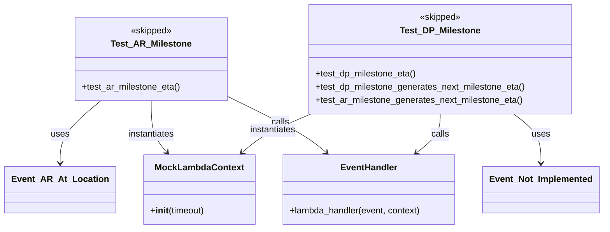

# Diagram: partview_core/partview_service/partview_service/tests/unit/business/package_container/event/test_package_container_event_eta.py

> Auto-generated by Obscura crawlers

## Mermaid

> SVG rendering failed for this diagram.
