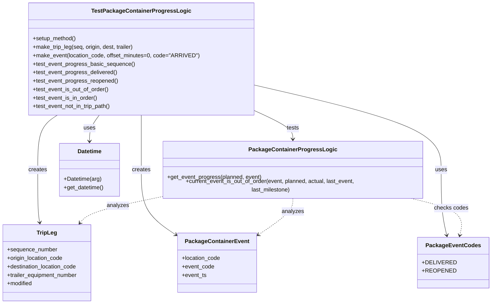

# Diagram: partview_core/partview_service/partview_service/tests/unit/business/package_container/event/test_package_progress_logic.py

> Auto-generated by Obscura crawlers

## Mermaid

### SVG

<svg id="container" width="1389.40625" xmlns="http://www.w3.org/2000/svg" class="classDiagram" height="848" viewBox="0 0 1389.40625 848" role="graphics-document document" aria-roledescription="class"><g><defs><marker id="container_class-aggregationStart" class="marker aggregation class" refX="18" refY="7" markerWidth="190" markerHeight="240" orient="auto"><path d="M 18,7 L9,13 L1,7 L9,1 Z"></path></marker></defs><defs><marker id="container_class-aggregationEnd" class="marker aggregation class" refX="1" refY="7" markerWidth="20" markerHeight="28" orient="auto"><path d="M 18,7 L9,13 L1,7 L9,1 Z"></path></marker></defs><defs><marker id="container_class-extensionStart" class="marker extension class" refX="18" refY="7" markerWidth="190" markerHeight="240" orient="auto"><path d="M 1,7 L18,13 V 1 Z"></path></marker></defs><defs><marker id="container_class-extensionEnd" class="marker extension class" refX="1" refY="7" markerWidth="20" markerHeight="28" orient="auto"><path d="M 1,1 V 13 L18,7 Z"></path></marker></defs><defs><marker id="container_class-compositionStart" class="marker composition class" refX="18" refY="7" markerWidth="190" markerHeight="240" orient="auto"><path d="M 18,7 L9,13 L1,7 L9,1 Z"></path></marker></defs><defs><marker id="container_class-compositionEnd" class="marker composition class" refX="1" refY="7" markerWidth="20" markerHeight="28" orient="auto"><path d="M 18,7 L9,13 L1,7 L9,1 Z"></path></marker></defs><defs><marker id="container_class-dependencyStart" class="marker dependency class" refX="6" refY="7" markerWidth="190" markerHeight="240" orient="auto"><path d="M 5,7 L9,13 L1,7 L9,1 Z"></path></marker></defs><defs><marker id="container_class-dependencyEnd" class="marker dependency class" refX="13" refY="7" markerWidth="20" markerHeight="28" orient="auto"><path d="M 18,7 L9,13 L14,7 L9,1 Z"></path></marker></defs><defs><marker id="container_class-lollipopStart" class="marker lollipop class" refX="13" refY="7" markerWidth="190" markerHeight="240" orient="auto"><circle stroke="black" fill="transparent" cx="7" cy="7" r="6"></circle></marker></defs><defs><marker id="container_class-lollipopEnd" class="marker lollipop class" refX="1" refY="7" markerWidth="190" markerHeight="240" orient="auto"><circle stroke="black" fill="transparent" cx="7" cy="7" r="6"></circle></marker></defs><g class="root"><g class="clusters"></g><g class="edgePaths"><path d="M713.992,308.088L734.137,317.24C754.281,326.392,794.57,344.696,814.715,359.015C834.859,373.333,834.859,383.667,834.859,388.833L834.859,394" id="id_TestPackageContainerProgressLogic_PackageContainerProgressLogic_1" class="edge-thickness-normal edge-pattern-solid relation" style=";;;" data-edge="true" data-et="edge" data-id="id_TestPackageContainerProgressLogic_PackageContainerProgressLogic_1" data-points="W3sieCI6NzEzLjk5MjE4NzUsInkiOjMwOC4wODc2Mjk3MDYwOTAwN30seyJ4Ijo4MzQuODU5Mzc1LCJ5IjozNjN9LHsieCI6ODM0Ljg1OTM3NSwieSI6NDAwfV0=" marker-end="url(#container_class-dependencyEnd)"></path><path d="M403.445,326L403.445,332.167C403.445,338.333,403.445,350.667,403.445,375.5C403.445,400.333,403.445,437.667,403.445,475C403.445,512.333,403.445,549.667,420.253,579.631C437.06,609.596,470.675,632.192,487.483,643.491L504.29,654.789" id="id_TestPackageContainerProgressLogic_PackageContainerEvent_2" class="edge-thickness-normal edge-pattern-solid relation" style=";;;" data-edge="true" data-et="edge" data-id="id_TestPackageContainerProgressLogic_PackageContainerEvent_2" data-points="W3sieCI6NDAzLjQ0NTMxMjUsInkiOjMyNn0seyJ4Ijo0MDMuNDQ1MzEyNSwieSI6MzYzfSx7IngiOjQwMy40NDUzMTI1LCJ5Ijo0NzV9LHsieCI6NDAzLjQ0NTMxMjUsInkiOjU4N30seyJ4Ijo1MDkuMjY5NTMxMjUsInkiOjY1OC4xMzU4OTAzMzE1NzY4fV0=" marker-end="url(#container_class-dependencyEnd)"></path><path d="M165.015,326L155.768,332.167C146.52,338.333,128.026,350.667,118.779,375.5C109.531,400.333,109.531,437.667,109.531,475C109.531,512.333,109.531,549.667,110.444,573.515C111.356,597.364,113.18,607.727,114.093,612.909L115.005,618.091" id="id_TestPackageContainerProgressLogic_TripLeg_3" class="edge-thickness-normal edge-pattern-solid relation" style=";;;" data-edge="true" data-et="edge" data-id="id_TestPackageContainerProgressLogic_TripLeg_3" data-points="W3sieCI6MTY1LjAxNTAyNzEwNDU5MTg0LCJ5IjozMjZ9LHsieCI6MTA5LjUzMTI1LCJ5IjozNjN9LHsieCI6MTA5LjUzMTI1LCJ5Ijo0NzV9LHsieCI6MTA5LjUzMTI1LCJ5Ijo1ODd9LHsieCI6MTE2LjA0NTEyMzkyMjQxMzgsInkiOjYyNH1d" marker-end="url(#container_class-dependencyEnd)"></path><path d="M284.23,326L279.607,332.167C274.983,338.333,265.736,350.667,261.112,362C256.488,373.333,256.488,383.667,256.488,388.833L256.488,394" id="id_TestPackageContainerProgressLogic_Datetime_4" class="edge-thickness-normal edge-pattern-solid relation" style=";;;" data-edge="true" data-et="edge" data-id="id_TestPackageContainerProgressLogic_Datetime_4" data-points="W3sieCI6Mjg0LjIzMDE2OTgwMjI5NTksInkiOjMyNn0seyJ4IjoyNTYuNDg4MjgxMjUsInkiOjM2M30seyJ4IjoyNTYuNDg4MjgxMjUsInkiOjQwMH1d" marker-end="url(#container_class-dependencyEnd)"></path><path d="M713.992,238.344L804.426,259.12C894.859,279.896,1075.727,321.448,1166.16,360.891C1256.594,400.333,1256.594,437.667,1256.594,475C1256.594,512.333,1256.594,549.667,1259.212,579.526C1261.83,609.386,1267.065,631.772,1269.683,642.965L1272.301,654.158" id="id_TestPackageContainerProgressLogic_PackageEventCodes_5" class="edge-thickness-normal edge-pattern-solid relation" style=";;;" data-edge="true" data-et="edge" data-id="id_TestPackageContainerProgressLogic_PackageEventCodes_5" data-points="W3sieCI6NzEzLjk5MjE4NzUsInkiOjIzOC4zNDQxOTM4NDA4Mjg1NX0seyJ4IjoxMjU2LjU5Mzc1LCJ5IjozNjN9LHsieCI6MTI1Ni41OTM3NSwieSI6NDc1fSx7IngiOjEyNTYuNTkzNzUsInkiOjU4N30seyJ4IjoxMjczLjY2NzcyNjI5MzEwMzQsInkiOjY2MH1d" marker-end="url(#container_class-dependencyEnd)"></path><path d="M464.617,546.696L429.929,553.414C395.241,560.131,325.865,573.565,286.654,585.683C247.444,597.8,238.399,608.6,233.877,614L229.355,619.4" id="id_PackageContainerProgressLogic_TripLeg_6" class="edge-thickness-normal edge-pattern-dashed relation" style=";;;" data-edge="true" data-et="edge" data-id="id_PackageContainerProgressLogic_TripLeg_6" data-points="W3sieCI6NDY0LjYxNzE4NzUsInkiOjU0Ni42OTYzOTk1MDU2MTU5fSx7IngiOjI1Ni40ODgyODEyNSwieSI6NTg3fSx7IngiOjIyNS41MDI3NzQ3ODQ0ODI3NywieSI6NjI0fV0=" marker-end="url(#container_class-dependencyEnd)"></path><path d="M834.859,550L834.859,556.167C834.859,562.333,834.859,574.667,818.052,592.131C801.244,609.596,767.63,632.192,750.822,643.491L734.015,654.789" id="id_PackageContainerProgressLogic_PackageContainerEvent_7" class="edge-thickness-normal edge-pattern-dashed relation" style=";;;" data-edge="true" data-et="edge" data-id="id_PackageContainerProgressLogic_PackageContainerEvent_7" data-points="W3sieCI6ODM0Ljg1OTM3NSwieSI6NTUwfSx7IngiOjgzNC44NTkzNzUsInkiOjU4N30seyJ4Ijo3MjkuMDM1MTU2MjUsInkiOjY1OC4xMzU4OTAzMzE1NzY4fV0=" marker-end="url(#container_class-dependencyEnd)"></path><path d="M1162.691,550L1189.646,556.167C1216.602,562.333,1270.512,574.667,1294.849,592.026C1319.186,609.386,1313.95,631.772,1311.332,642.965L1308.714,654.158" id="id_PackageContainerProgressLogic_PackageEventCodes_8" class="edge-thickness-normal edge-pattern-dashed relation" style=";;;" data-edge="true" data-et="edge" data-id="id_PackageContainerProgressLogic_PackageEventCodes_8" data-points="W3sieCI6MTE2Mi42OTE0MDYyNSwieSI6NTUwfSx7IngiOjEzMjQuNDIxODc1LCJ5Ijo1ODd9LHsieCI6MTMwNy4zNDc4OTg3MDY4OTY2LCJ5Ijo2NjB9XQ==" marker-end="url(#container_class-dependencyEnd)"></path></g><g class="edgeLabels"><g class="edgeLabel" transform="translate(834.859375, 363)"><g class="label" data-id="id_TestPackageContainerProgressLogic_PackageContainerProgressLogic_1" transform="translate(-17.4921875, -12)"><foreignObject width="34.984375" height="24">

tests

</foreignObject></g></g><g class="edgeLabel" transform="translate(403.4453125, 475)"><g class="label" data-id="id_TestPackageContainerProgressLogic_PackageContainerEvent_2" transform="translate(-26.171875, -12)"><foreignObject width="52.34375" height="24">

creates

</foreignObject></g></g><g class="edgeLabel" transform="translate(109.53125, 475)"><g class="label" data-id="id_TestPackageContainerProgressLogic_TripLeg_3" transform="translate(-26.171875, -12)"><foreignObject width="52.34375" height="24">

creates

</foreignObject></g></g><g class="edgeLabel" transform="translate(256.48828125, 363)"><g class="label" data-id="id_TestPackageContainerProgressLogic_Datetime_4" transform="translate(-16.4921875, -12)"><foreignObject width="32.984375" height="24">

uses

</foreignObject></g></g><g class="edgeLabel" transform="translate(1256.59375, 475)"><g class="label" data-id="id_TestPackageContainerProgressLogic_PackageEventCodes_5" transform="translate(-16.4921875, -12)"><foreignObject width="32.984375" height="24">

uses

</foreignObject></g></g><g class="edgeLabel" transform="translate(336.86245, 571.43576)"><g class="label" data-id="id_PackageContainerProgressLogic_TripLeg_6" transform="translate(-31.0546875, -12)"><foreignObject width="62.109375" height="24">

analyzes

</foreignObject></g></g><g class="edgeLabel" transform="translate(834.859375, 587)"><g class="label" data-id="id_PackageContainerProgressLogic_PackageContainerEvent_7" transform="translate(-31.0546875, -12)"><foreignObject width="62.109375" height="24">

analyzes

</foreignObject></g></g><g class="edgeLabel" transform="translate(1280.09765, 576.8597)"><g class="label" data-id="id_PackageContainerProgressLogic_PackageEventCodes_8" transform="translate(-47.828125, -12)"><foreignObject width="95.65625" height="24">

checks codes

</foreignObject></g></g></g><g class="nodes"><g class="node default" id="classId-PackageContainerProgressLogic-0" transform="translate(834.859375, 475)"><g class="basic label-container"><path d="M-370.2421875 -75 L370.2421875 -75 L370.2421875 75 L-370.2421875 75" stroke="none" stroke-width="0" fill="#ECECFF" style=""></path><path d="M-370.2421875 -75 C-102.83749614687946 -75, 164.56719520624108 -75, 370.2421875 -75 M-370.2421875 -75 C-158.2100490821922 -75, 53.8220893356156 -75, 370.2421875 -75 M370.2421875 -75 C370.2421875 -16.259102442808107, 370.2421875 42.481795114383786, 370.2421875 75 M370.2421875 -75 C370.2421875 -18.459016912087982, 370.2421875 38.081966175824036, 370.2421875 75 M370.2421875 75 C104.41705092578496 75, -161.40808564843007 75, -370.2421875 75 M370.2421875 75 C143.9504630999554 75, -82.34126130008917 75, -370.2421875 75 M-370.2421875 75 C-370.2421875 27.32756437665215, -370.2421875 -20.344871246695703, -370.2421875 -75 M-370.2421875 75 C-370.2421875 16.629005037570508, -370.2421875 -41.741989924858984, -370.2421875 -75" stroke="#9370DB" stroke-width="1.3" fill="none" stroke-dasharray="0 0" style=""></path></g><g class="annotation-group text" transform="translate(0, -51)"></g><g class="label-group text" transform="translate(-116.265625, -51)"><g class="label" style="font-weight: bolder" transform="translate(0,-12)"><foreignObject width="232.53125" height="24">

PackageContainerProgressLogic

</foreignObject></g></g><g class="members-group text" transform="translate(-358.2421875, -3)"></g><g class="methods-group text" transform="translate(-358.2421875, 27)"><g class="label" style="" transform="translate(0,-12)"><foreignObject width="267.90625" height="24">

+get_event_progress(planned, event)

</foreignObject></g><g class="label" style="" transform="translate(0,12)"><foreignObject width="600.21875" height="24">

+current_event_is_out_of_order(event, planned, actual, last_event, last_milestone)

</foreignObject></g></g><g class="divider" style=""><path d="M-370.2421875 -27 C-139.8330149595522 -27, 90.5761575808956 -27, 370.2421875 -27 M-370.2421875 -27 C-211.1710513912244 -27, -52.09991528244882 -27, 370.2421875 -27" stroke="#9370DB" stroke-width="1.3" fill="none" stroke-dasharray="0 0" style=""></path></g><g class="divider" style=""><path d="M-370.2421875 -3 C-113.26933133945471 -3, 143.70352482109058 -3, 370.2421875 -3 M-370.2421875 -3 C-161.4223284823502 -3, 47.39753053529961 -3, 370.2421875 -3" stroke="#9370DB" stroke-width="1.3" fill="none" stroke-dasharray="0 0" style=""></path></g></g><g class="node default" id="classId-PackageContainerEvent-1" transform="translate(619.15234375, 732)"><g class="basic label-container"><path d="M-109.8828125 -84 L109.8828125 -84 L109.8828125 84 L-109.8828125 84" stroke="none" stroke-width="0" fill="#ECECFF" style=""></path><path d="M-109.8828125 -84 C-42.79107021862525 -84, 24.3006720627495 -84, 109.8828125 -84 M-109.8828125 -84 C-42.63745222629241 -84, 24.60790804741518 -84, 109.8828125 -84 M109.8828125 -84 C109.8828125 -36.49346162672333, 109.8828125 11.013076746553338, 109.8828125 84 M109.8828125 -84 C109.8828125 -18.983550334846512, 109.8828125 46.032899330306975, 109.8828125 84 M109.8828125 84 C39.91377831362017 84, -30.05525587275966 84, -109.8828125 84 M109.8828125 84 C33.76602128882169 84, -42.35076992235662 84, -109.8828125 84 M-109.8828125 84 C-109.8828125 26.266499393295568, -109.8828125 -31.467001213408864, -109.8828125 -84 M-109.8828125 84 C-109.8828125 50.33349997296797, -109.8828125 16.66699994593594, -109.8828125 -84" stroke="#9370DB" stroke-width="1.3" fill="none" stroke-dasharray="0 0" style=""></path></g><g class="annotation-group text" transform="translate(0, -60)"></g><g class="label-group text" transform="translate(-85.65625, -60)"><g class="label" style="font-weight: bolder" transform="translate(0,-12)"><foreignObject width="171.3125" height="24">

PackageContainerEvent

</foreignObject></g></g><g class="members-group text" transform="translate(-97.8828125, -12)"><g class="label" style="" transform="translate(0,-12)"><foreignObject width="110.109375" height="24">

+location_code

</foreignObject></g><g class="label" style="" transform="translate(0,12)"><foreignObject width="91.28125" height="24">

+event_code

</foreignObject></g><g class="label" style="" transform="translate(0,36)"><foreignObject width="69.578125" height="24">

+event_ts

</foreignObject></g></g><g class="methods-group text" transform="translate(-97.8828125, 84)"></g><g class="divider" style=""><path d="M-109.8828125 -36 C-23.50305154987484 -36, 62.87670940025032 -36, 109.8828125 -36 M-109.8828125 -36 C-28.830977169664195 -36, 52.22085816067161 -36, 109.8828125 -36" stroke="#9370DB" stroke-width="1.3" fill="none" stroke-dasharray="0 0" style=""></path></g><g class="divider" style=""><path d="M-109.8828125 60 C-41.03771285212581 60, 27.807386795748386 60, 109.8828125 60 M-109.8828125 60 C-33.836590701593124 60, 42.20963109681375 60, 109.8828125 60" stroke="#9370DB" stroke-width="1.3" fill="none" stroke-dasharray="0 0" style=""></path></g></g><g class="node default" id="classId-TripLeg-2" transform="translate(135.05859375, 732)"><g class="basic label-container"><path d="M-127.05859375 -108 L127.05859375 -108 L127.05859375 108 L-127.05859375 108" stroke="none" stroke-width="0" fill="#ECECFF" style=""></path><path d="M-127.05859375 -108 C-58.67003746668638 -108, 9.718518816627238 -108, 127.05859375 -108 M-127.05859375 -108 C-75.17492248863101 -108, -23.291251227262038 -108, 127.05859375 -108 M127.05859375 -108 C127.05859375 -49.325231582247504, 127.05859375 9.349536835504992, 127.05859375 108 M127.05859375 -108 C127.05859375 -36.89084787484579, 127.05859375 34.21830425030842, 127.05859375 108 M127.05859375 108 C58.47320934422136 108, -10.11217506155728 108, -127.05859375 108 M127.05859375 108 C68.07046689397262 108, 9.082340037945258 108, -127.05859375 108 M-127.05859375 108 C-127.05859375 26.188742077989758, -127.05859375 -55.622515844020484, -127.05859375 -108 M-127.05859375 108 C-127.05859375 45.860538573350645, -127.05859375 -16.27892285329871, -127.05859375 -108" stroke="#9370DB" stroke-width="1.3" fill="none" stroke-dasharray="0 0" style=""></path></g><g class="annotation-group text" transform="translate(0, -84)"></g><g class="label-group text" transform="translate(-27.0546875, -84)"><g class="label" style="font-weight: bolder" transform="translate(0,-12)"><foreignObject width="54.109375" height="24">

TripLeg

</foreignObject></g></g><g class="members-group text" transform="translate(-115.05859375, -36)"><g class="label" style="" transform="translate(0,-12)"><foreignObject width="142.015625" height="24">

+sequence_number

</foreignObject></g><g class="label" style="" transform="translate(0,12)"><foreignObject width="160.5" height="24">

+origin_location_code

</foreignObject></g><g class="label" style="" transform="translate(0,36)"><foreignObject width="201.40625" height="24">

+destination_location_code

</foreignObject></g><g class="label" style="" transform="translate(0,60)"><foreignObject width="203.0625" height="24">

+trailer_equipment_number

</foreignObject></g><g class="label" style="" transform="translate(0,84)"><foreignObject width="72.609375" height="24">

+modified

</foreignObject></g></g><g class="methods-group text" transform="translate(-115.05859375, 108)"></g><g class="divider" style=""><path d="M-127.05859375 -60 C-64.03849818239775 -60, -1.0184026147955052 -60, 127.05859375 -60 M-127.05859375 -60 C-73.98174475235592 -60, -20.904895754711845 -60, 127.05859375 -60" stroke="#9370DB" stroke-width="1.3" fill="none" stroke-dasharray="0 0" style=""></path></g><g class="divider" style=""><path d="M-127.05859375 84 C-65.88362275607713 84, -4.708651762154261 84, 127.05859375 84 M-127.05859375 84 C-47.806702026590216 84, 31.44518969681957 84, 127.05859375 84" stroke="#9370DB" stroke-width="1.3" fill="none" stroke-dasharray="0 0" style=""></path></g></g><g class="node default" id="classId-Datetime-3" transform="translate(256.48828125, 475)"><g class="basic label-container"><path d="M-85.78515625 -75 L85.78515625 -75 L85.78515625 75 L-85.78515625 75" stroke="none" stroke-width="0" fill="#ECECFF" style=""></path><path d="M-85.78515625 -75 C-48.748916109275676 -75, -11.712675968551352 -75, 85.78515625 -75 M-85.78515625 -75 C-31.159997334532477 -75, 23.465161580935046 -75, 85.78515625 -75 M85.78515625 -75 C85.78515625 -30.43597250369065, 85.78515625 14.1280549926187, 85.78515625 75 M85.78515625 -75 C85.78515625 -42.368180551456646, 85.78515625 -9.736361102913293, 85.78515625 75 M85.78515625 75 C22.89696653627383 75, -39.99122317745234 75, -85.78515625 75 M85.78515625 75 C19.470870170164744 75, -46.84341590967051 75, -85.78515625 75 M-85.78515625 75 C-85.78515625 24.592733450101555, -85.78515625 -25.81453309979689, -85.78515625 -75 M-85.78515625 75 C-85.78515625 23.235428935055012, -85.78515625 -28.529142129889976, -85.78515625 -75" stroke="#9370DB" stroke-width="1.3" fill="none" stroke-dasharray="0 0" style=""></path></g><g class="annotation-group text" transform="translate(0, -51)"></g><g class="label-group text" transform="translate(-33.3984375, -51)"><g class="label" style="font-weight: bolder" transform="translate(0,-12)"><foreignObject width="66.796875" height="24">

Datetime

</foreignObject></g></g><g class="members-group text" transform="translate(-73.78515625, -3)"></g><g class="methods-group text" transform="translate(-73.78515625, 27)"><g class="label" style="" transform="translate(0,-12)"><foreignObject width="107.140625" height="24">

+Datetime(arg)

</foreignObject></g><g class="label" style="" transform="translate(0,12)"><foreignObject width="114.171875" height="24">

+get_datetime()

</foreignObject></g></g><g class="divider" style=""><path d="M-85.78515625 -27 C-41.439200157275664 -27, 2.906755935448672 -27, 85.78515625 -27 M-85.78515625 -27 C-51.30462892323892 -27, -16.824101596477846 -27, 85.78515625 -27" stroke="#9370DB" stroke-width="1.3" fill="none" stroke-dasharray="0 0" style=""></path></g><g class="divider" style=""><path d="M-85.78515625 -3 C-20.61244468582744 -3, 44.56026687834512 -3, 85.78515625 -3 M-85.78515625 -3 C-39.56528239259392 -3, 6.654591464812157 -3, 85.78515625 -3" stroke="#9370DB" stroke-width="1.3" fill="none" stroke-dasharray="0 0" style=""></path></g></g><g class="node default" id="classId-PackageEventCodes-4" transform="translate(1290.5078125, 732)"><g class="basic label-container"><path d="M-90.8984375 -72 L90.8984375 -72 L90.8984375 72 L-90.8984375 72" stroke="none" stroke-width="0" fill="#ECECFF" style=""></path><path d="M-90.8984375 -72 C-27.88094329347217 -72, 35.13655091305566 -72, 90.8984375 -72 M-90.8984375 -72 C-48.487293347688585 -72, -6.07614919537717 -72, 90.8984375 -72 M90.8984375 -72 C90.8984375 -14.446100390241654, 90.8984375 43.10779921951669, 90.8984375 72 M90.8984375 -72 C90.8984375 -35.21297754211931, 90.8984375 1.5740449157613767, 90.8984375 72 M90.8984375 72 C27.77588763551308 72, -35.34666222897384 72, -90.8984375 72 M90.8984375 72 C46.20957766725365 72, 1.5207178345072947 72, -90.8984375 72 M-90.8984375 72 C-90.8984375 38.401037812450525, -90.8984375 4.80207562490105, -90.8984375 -72 M-90.8984375 72 C-90.8984375 23.895744845785316, -90.8984375 -24.208510308429368, -90.8984375 -72" stroke="#9370DB" stroke-width="1.3" fill="none" stroke-dasharray="0 0" style=""></path></g><g class="annotation-group text" transform="translate(0, -48)"></g><g class="label-group text" transform="translate(-72.25, -48)"><g class="label" style="font-weight: bolder" transform="translate(0,-12)"><foreignObject width="144.5" height="24">

PackageEventCodes

</foreignObject></g></g><g class="members-group text" transform="translate(-78.8984375, 0)"><g class="label" style="" transform="translate(0,-12)"><foreignObject width="85.546875" height="24">

+DELIVERED

</foreignObject></g><g class="label" style="" transform="translate(0,12)"><foreignObject width="84.765625" height="24">

+REOPENED

</foreignObject></g></g><g class="methods-group text" transform="translate(-78.8984375, 72)"></g><g class="divider" style=""><path d="M-90.8984375 -24 C-27.201323816077497 -24, 36.495789867845005 -24, 90.8984375 -24 M-90.8984375 -24 C-33.14830747645249 -24, 24.601822547095026 -24, 90.8984375 -24" stroke="#9370DB" stroke-width="1.3" fill="none" stroke-dasharray="0 0" style=""></path></g><g class="divider" style=""><path d="M-90.8984375 48 C-41.05964554865049 48, 8.779146402699027 48, 90.8984375 48 M-90.8984375 48 C-28.134975428569184 48, 34.62848664286163 48, 90.8984375 48" stroke="#9370DB" stroke-width="1.3" fill="none" stroke-dasharray="0 0" style=""></path></g></g><g class="node default" id="classId-TestPackageContainerProgressLogic-5" transform="translate(403.4453125, 167)"><g class="basic label-container"><path d="M-310.546875 -159 L310.546875 -159 L310.546875 159 L-310.546875 159" stroke="none" stroke-width="0" fill="#ECECFF" style=""></path><path d="M-310.546875 -159 C-166.66604569923282 -159, -22.78521639846565 -159, 310.546875 -159 M-310.546875 -159 C-186.19468567110385 -159, -61.84249634220768 -159, 310.546875 -159 M310.546875 -159 C310.546875 -64.11240423948738, 310.546875 30.77519152102525, 310.546875 159 M310.546875 -159 C310.546875 -55.959972733578155, 310.546875 47.08005453284369, 310.546875 159 M310.546875 159 C105.37759620227175 159, -99.7916825954565 159, -310.546875 159 M310.546875 159 C177.69593501831625 159, 44.8449950366325 159, -310.546875 159 M-310.546875 159 C-310.546875 82.14719278031416, -310.546875 5.294385560628314, -310.546875 -159 M-310.546875 159 C-310.546875 53.077906628677454, -310.546875 -52.84418674264509, -310.546875 -159" stroke="#9370DB" stroke-width="1.3" fill="none" stroke-dasharray="0 0" style=""></path></g><g class="annotation-group text" transform="translate(0, -135)"></g><g class="label-group text" transform="translate(-131.515625, -135)"><g class="label" style="font-weight: bolder" transform="translate(0,-12)"><foreignObject width="263.03125" height="24">

TestPackageContainerProgressLogic

</foreignObject></g></g><g class="members-group text" transform="translate(-298.546875, -87)"></g><g class="methods-group text" transform="translate(-298.546875, -57)"><g class="label" style="" transform="translate(0,-12)"><foreignObject width="123.640625" height="24">

+setup_method()

</foreignObject></g><g class="label" style="" transform="translate(0,12)"><foreignObject width="288.625" height="24">

+make_trip_leg(seq, origin, dest, trailer)

</foreignObject></g><g class="label" style="" transform="translate(0,36)"><foreignObject width="465.578125" height="24">

+make_event(location_code, offset_minutes=0, code="ARRIVED")

</foreignObject></g><g class="label" style="" transform="translate(0,60)"><foreignObject width="287.5625" height="24">

+test_event_progress_basic_sequence()

</foreignObject></g><g class="label" style="" transform="translate(0,84)"><foreignObject width="240.1875" height="24">

+test_event_progress_delivered()

</foreignObject></g><g class="label" style="" transform="translate(0,108)"><foreignObject width="242.15625" height="24">

+test_event_progress_reopened()

</foreignObject></g><g class="label" style="" transform="translate(0,132)"><foreignObject width="216.265625" height="24">

+test_event_is_out_of_order()

</foreignObject></g><g class="label" style="" transform="translate(0,156)"><foreignObject width="183.8125" height="24">

+test_event_is_in_order()

</foreignObject></g><g class="label" style="" transform="translate(0,180)"><foreignObject width="224.3125" height="24">

+test_event_not_in_trip_path()

</foreignObject></g></g><g class="divider" style=""><path d="M-310.546875 -111 C-97.25282444506655 -111, 116.0412261098669 -111, 310.546875 -111 M-310.546875 -111 C-156.2454026087355 -111, -1.9439302174710065 -111, 310.546875 -111" stroke="#9370DB" stroke-width="1.3" fill="none" stroke-dasharray="0 0" style=""></path></g><g class="divider" style=""><path d="M-310.546875 -87 C-124.29673561871121 -87, 61.95340376257758 -87, 310.546875 -87 M-310.546875 -87 C-128.59865594340903 -87, 53.349563113181944 -87, 310.546875 -87" stroke="#9370DB" stroke-width="1.3" fill="none" stroke-dasharray="0 0" style=""></path></g></g></g></g></g></svg>
