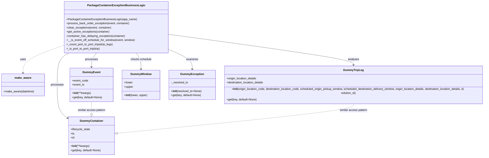

# Diagram: partview_core/partview_service/partview_service/tests/unit/business/package_container/package_container_exception_business_logic_test.py

> Auto-generated by Obscura crawlers

## Mermaid

### SVG

<svg id="container" width="2801.21875" xmlns="http://www.w3.org/2000/svg" class="classDiagram" height="866" viewBox="0 0 2801.21875 866" role="graphics-document document" aria-roledescription="class"><g><defs><marker id="container_class-aggregationStart" class="marker aggregation class" refX="18" refY="7" markerWidth="190" markerHeight="240" orient="auto"><path d="M 18,7 L9,13 L1,7 L9,1 Z"></path></marker></defs><defs><marker id="container_class-aggregationEnd" class="marker aggregation class" refX="1" refY="7" markerWidth="20" markerHeight="28" orient="auto"><path d="M 18,7 L9,13 L1,7 L9,1 Z"></path></marker></defs><defs><marker id="container_class-extensionStart" class="marker extension class" refX="18" refY="7" markerWidth="190" markerHeight="240" orient="auto"><path d="M 1,7 L18,13 V 1 Z"></path></marker></defs><defs><marker id="container_class-extensionEnd" class="marker extension class" refX="1" refY="7" markerWidth="20" markerHeight="28" orient="auto"><path d="M 1,1 V 13 L18,7 Z"></path></marker></defs><defs><marker id="container_class-compositionStart" class="marker composition class" refX="18" refY="7" markerWidth="190" markerHeight="240" orient="auto"><path d="M 18,7 L9,13 L1,7 L9,1 Z"></path></marker></defs><defs><marker id="container_class-compositionEnd" class="marker composition class" refX="1" refY="7" markerWidth="20" markerHeight="28" orient="auto"><path d="M 18,7 L9,13 L1,7 L9,1 Z"></path></marker></defs><defs><marker id="container_class-dependencyStart" class="marker dependency class" refX="6" refY="7" markerWidth="190" markerHeight="240" orient="auto"><path d="M 5,7 L9,13 L1,7 L9,1 Z"></path></marker></defs><defs><marker id="container_class-dependencyEnd" class="marker dependency class" refX="13" refY="7" markerWidth="20" markerHeight="28" orient="auto"><path d="M 18,7 L9,13 L14,7 L9,1 Z"></path></marker></defs><defs><marker id="container_class-lollipopStart" class="marker lollipop class" refX="13" refY="7" markerWidth="190" markerHeight="240" orient="auto"><circle stroke="black" fill="transparent" cx="7" cy="7" r="6"></circle></marker></defs><defs><marker id="container_class-lollipopEnd" class="marker lollipop class" refX="1" refY="7" markerWidth="190" markerHeight="240" orient="auto"><circle stroke="black" fill="transparent" cx="7" cy="7" r="6"></circle></marker></defs><g class="root"><g class="clusters"></g><g class="edgePaths"><path d="M388.604,302L377.503,308.167C366.403,314.333,344.201,326.667,333.101,355C322,383.333,322,427.667,322,472C322,516.333,322,560.667,331.717,590.166C341.434,619.666,360.867,634.332,370.584,641.666L380.301,648.999" id="id_PackageContainerExceptionBusinessLogic_DummyContainer_1" class="edge-thickness-normal edge-pattern-solid relation" style=";;;" data-edge="true" data-et="edge" data-id="id_PackageContainerExceptionBusinessLogic_DummyContainer_1" data-points="W3sieCI6Mzg4LjYwMzc3MDM4MDQzNDgsInkiOjMwMn0seyJ4IjozMjIsInkiOjMzOX0seyJ4IjozMjIsInkiOjQ3Mn0seyJ4IjozMjIsInkiOjYwNX0seyJ4IjozODUuMDg5ODQzNzUsInkiOjY1Mi42MTMwNDAyOTYwMTkyfV0=" marker-end="url(#container_class-dependencyEnd)"></path><path d="M542.101,302L537.44,308.167C532.778,314.333,523.456,326.667,518.794,338C514.133,349.333,514.133,359.667,514.133,364.833L514.133,370" id="id_PackageContainerExceptionBusinessLogic_DummyEvent_2" class="edge-thickness-normal edge-pattern-solid relation" style=";;;" data-edge="true" data-et="edge" data-id="id_PackageContainerExceptionBusinessLogic_DummyEvent_2" data-points="W3sieCI6NTQyLjEwMTE4MDM2Njg0NzksInkiOjMwMn0seyJ4Ijo1MTQuMTMyODEyNSwieSI6MzM5fSx7IngiOjUxNC4xMzI4MTI1LCJ5IjozNzZ9XQ==" marker-end="url(#container_class-dependencyEnd)"></path><path d="M939.082,193.319L1120.212,217.6C1301.341,241.88,1663.6,290.44,1844.73,319.887C2025.859,349.333,2025.859,359.667,2025.859,364.833L2025.859,370" id="id_PackageContainerExceptionBusinessLogic_DummyTripLeg_3" class="edge-thickness-normal edge-pattern-solid relation" style=";;;" data-edge="true" data-et="edge" data-id="id_PackageContainerExceptionBusinessLogic_DummyTripLeg_3" data-points="W3sieCI6OTM5LjA4MjAzMTI1LCJ5IjoxOTMuMzE5NDU3MjUwNTA5NH0seyJ4IjoyMDI1Ljg1OTM3NSwieSI6MzM5fSx7IngiOjIwMjUuODU5Mzc1LCJ5IjozNzZ9XQ==" marker-end="url(#container_class-dependencyEnd)"></path><path d="M764.336,302L768.998,308.167C773.659,314.333,782.982,326.667,787.643,340C792.305,353.333,792.305,367.667,792.305,374.833L792.305,382" id="id_PackageContainerExceptionBusinessLogic_DummyWindow_4" class="edge-thickness-normal edge-pattern-solid relation" style=";;;" data-edge="true" data-et="edge" data-id="id_PackageContainerExceptionBusinessLogic_DummyWindow_4" data-points="W3sieCI6NzY0LjMzNjMxOTYzMzE1MjEsInkiOjMwMn0seyJ4Ijo3OTIuMzA0Njg3NSwieSI6MzM5fSx7IngiOjc5Mi4zMDQ2ODc1LCJ5IjozODh9XQ==" marker-end="url(#container_class-dependencyEnd)"></path><path d="M939.082,278.588L962.371,288.657C985.66,298.725,1032.238,318.863,1055.527,336.098C1078.816,353.333,1078.816,367.667,1078.816,374.833L1078.816,382" id="id_PackageContainerExceptionBusinessLogic_DummyException_5" class="edge-thickness-normal edge-pattern-solid relation" style=";;;" data-edge="true" data-et="edge" data-id="id_PackageContainerExceptionBusinessLogic_DummyException_5" data-points="W3sieCI6OTM5LjA4MjAzMTI1LCJ5IjoyNzguNTg4MTg5NDAyNzd9LHsieCI6MTA3OC44MTY0MDYyNSwieSI6MzM5fSx7IngiOjEwNzguODE2NDA2MjUsInkiOjM4OH1d" marker-end="url(#container_class-dependencyEnd)"></path><path d="M367.355,255.454L327.73,269.378C288.105,283.302,208.855,311.151,169.23,335.742C129.605,360.333,129.605,381.667,129.605,392.333L129.605,403" id="id_PackageContainerExceptionBusinessLogic_make_aware_6" class="edge-thickness-normal edge-pattern-dashed relation" style=";;;" data-edge="true" data-et="edge" data-id="id_PackageContainerExceptionBusinessLogic_make_aware_6" data-points="W3sieCI6MzY3LjM1NTQ2ODc1LCJ5IjoyNTUuNDUzNjA4ODYyNjk1Mzh9LHsieCI6MTI5LjYwNTQ2ODc1LCJ5IjozMzl9LHsieCI6MTI5LjYwNTQ2ODc1LCJ5Ijo0MDl9XQ==" marker-end="url(#container_class-dependencyEnd)"></path><path d="M514.133,568L514.133,574.167C514.133,580.333,514.133,592.667,514.133,602.125C514.133,611.583,514.133,618.167,514.133,621.458L514.133,624.75" id="id_DummyEvent_DummyContainer_7" class="edge-thickness-normal edge-pattern-dashed relation" style=";;;" data-edge="true" data-et="edge" data-id="id_DummyEvent_DummyContainer_7" data-points="W3sieCI6NTE0LjEzMjgxMjUsInkiOjU2OH0seyJ4Ijo1MTQuMTMyODEyNSwieSI6NjA1fSx7IngiOjUxNC4xMzI4MTI1LCJ5Ijo2NDJ9XQ==" marker-end="url(#container_class-extensionEnd)"></path><path d="M2025.859,568L2025.859,574.167C2025.859,580.333,2025.859,592.667,1798.274,620.663C1570.689,648.659,1115.518,692.317,887.932,714.146L660.347,735.976" id="id_DummyTripLeg_DummyContainer_8" class="edge-thickness-normal edge-pattern-dashed relation" style=";;;" data-edge="true" data-et="edge" data-id="id_DummyTripLeg_DummyContainer_8" data-points="W3sieCI6MjAyNS44NTkzNzUsInkiOjU2OH0seyJ4IjoyMDI1Ljg1OTM3NSwieSI6NjA1fSx7IngiOjY0My4xNzU3ODEyNSwieSI6NzM3LjYyMjYwOTE4NTQ4MjJ9XQ==" marker-end="url(#container_class-extensionEnd)"></path></g><g class="edgeLabels"><g class="edgeLabel" transform="translate(322, 472)"><g class="label" data-id="id_PackageContainerExceptionBusinessLogic_DummyContainer_1" transform="translate(-35.7890625, -12)"><foreignObject width="71.578125" height="24">

processes

</foreignObject></g></g><g class="edgeLabel" transform="translate(514.1328125, 339)"><g class="label" data-id="id_PackageContainerExceptionBusinessLogic_DummyEvent_2" transform="translate(-35.7890625, -12)"><foreignObject width="71.578125" height="24">

processes

</foreignObject></g></g><g class="edgeLabel" transform="translate(2025.859375, 339)"><g class="label" data-id="id_PackageContainerExceptionBusinessLogic_DummyTripLeg_3" transform="translate(-31.2890625, -12)"><foreignObject width="62.578125" height="24">

analyses

</foreignObject></g></g><g class="edgeLabel" transform="translate(792.3046875, 339)"><g class="label" data-id="id_PackageContainerExceptionBusinessLogic_DummyWindow_4" transform="translate(-59.3203125, -12)"><foreignObject width="118.640625" height="24">

checks schedule

</foreignObject></g></g><g class="edgeLabel" transform="translate(1078.81640625, 339)"><g class="label" data-id="id_PackageContainerExceptionBusinessLogic_DummyException_5" transform="translate(-34.296875, -12)"><foreignObject width="68.59375" height="24">

examines

</foreignObject></g></g><g class="edgeLabel" transform="translate(129.60546875, 339)"><g class="label" data-id="id_PackageContainerExceptionBusinessLogic_make_aware_6" transform="translate(-16.4921875, -12)"><foreignObject width="32.984375" height="24">

uses

</foreignObject></g></g><g class="edgeLabel" transform="translate(514.1328125, 605)"><g class="label" data-id="id_DummyEvent_DummyContainer_7" transform="translate(-79.34375, -12)"><foreignObject width="158.6875" height="24">

similar access pattern

</foreignObject></g></g><g class="edgeLabel" transform="translate(2025.859375, 605)"><g class="label" data-id="id_DummyTripLeg_DummyContainer_8" transform="translate(-79.34375, -12)"><foreignObject width="158.6875" height="24">

similar access pattern

</foreignObject></g></g></g><g class="nodes"><g class="node default" id="classId-PackageContainerExceptionBusinessLogic-0" transform="translate(653.21875, 155)"><g class="basic label-container"><path d="M-285.86328125 -147 L285.86328125 -147 L285.86328125 147 L-285.86328125 147" stroke="none" stroke-width="0" fill="#ECECFF" style=""></path><path d="M-285.86328125 -147 C-150.29154670127662 -147, -14.719812152553231 -147, 285.86328125 -147 M-285.86328125 -147 C-170.60938761905885 -147, -55.3554939881177 -147, 285.86328125 -147 M285.86328125 -147 C285.86328125 -61.78700244577769, 285.86328125 23.425995108444624, 285.86328125 147 M285.86328125 -147 C285.86328125 -72.5876990196856, 285.86328125 1.8246019606287973, 285.86328125 147 M285.86328125 147 C149.13627016739923 147, 12.409259084798464 147, -285.86328125 147 M285.86328125 147 C135.37143114424606 147, -15.12041896150788 147, -285.86328125 147 M-285.86328125 147 C-285.86328125 35.07446110381858, -285.86328125 -76.85107779236284, -285.86328125 -147 M-285.86328125 147 C-285.86328125 77.93710210282426, -285.86328125 8.87420420564851, -285.86328125 -147" stroke="#9370DB" stroke-width="1.3" fill="none" stroke-dasharray="0 0" style=""></path></g><g class="annotation-group text" transform="translate(0, -123)"></g><g class="label-group text" transform="translate(-152.5546875, -123)"><g class="label" style="font-weight: bolder" transform="translate(0,-12)"><foreignObject width="305.109375" height="24">

PackageContainerExceptionBusinessLogic

</foreignObject></g></g><g class="members-group text" transform="translate(-273.86328125, -75)"></g><g class="methods-group text" transform="translate(-273.86328125, -45)"><g class="label" style="" transform="translate(0,-12)"><foreignObject width="395.171875" height="24">

+PackageContainerExceptionBusinessLogic(app_name)

</foreignObject></g><g class="label" style="" transform="translate(0,12)"><foreignObject width="358.28125" height="24">

+process_back_order_exception(event, container)

</foreignObject></g><g class="label" style="" transform="translate(0,36)"><foreignObject width="256.6875" height="24">

+clear_exceptions(event, container)

</foreignObject></g><g class="label" style="" transform="translate(0,60)"><foreignObject width="247.1875" height="24">

+get_active_exceptions(container)

</foreignObject></g><g class="label" style="" transform="translate(0,84)"><foreignObject width="337.125" height="24">

+container_has_delaying_exception(container)

</foreignObject></g><g class="label" style="" transform="translate(0,108)"><foreignObject width="389.984375" height="24">

+__is_event_off_schedule_for_window(event, window)

</foreignObject></g><g class="label" style="" transform="translate(0,132)"><foreignObject width="271.265625" height="24">

+_count_port_to_port_trips(trip_legs)

</foreignObject></g><g class="label" style="" transform="translate(0,156)"><foreignObject width="197.796875" height="24">

+_is_port_to_port_trip(trip)

</foreignObject></g></g><g class="divider" style=""><path d="M-285.86328125 -99 C-98.74609068947123 -99, 88.37109987105754 -99, 285.86328125 -99 M-285.86328125 -99 C-135.6186378721871 -99, 14.626005505625812 -99, 285.86328125 -99" stroke="#9370DB" stroke-width="1.3" fill="none" stroke-dasharray="0 0" style=""></path></g><g class="divider" style=""><path d="M-285.86328125 -75 C-155.79360259611548 -75, -25.723923942230954 -75, 285.86328125 -75 M-285.86328125 -75 C-76.40097988692222 -75, 133.06132147615557 -75, 285.86328125 -75" stroke="#9370DB" stroke-width="1.3" fill="none" stroke-dasharray="0 0" style=""></path></g></g><g class="node default" id="classId-make_aware-1" transform="translate(129.60546875, 472)"><g class="basic label-container"><path d="M-121.60546875 -63 L121.60546875 -63 L121.60546875 63 L-121.60546875 63" stroke="none" stroke-width="0" fill="#ECECFF" style=""></path><path d="M-121.60546875 -63 C-43.7951235764789 -63, 34.0152215970422 -63, 121.60546875 -63 M-121.60546875 -63 C-66.61669831116897 -63, -11.627927872337949 -63, 121.60546875 -63 M121.60546875 -63 C121.60546875 -20.105530665949438, 121.60546875 22.788938668101125, 121.60546875 63 M121.60546875 -63 C121.60546875 -29.17581955453572, 121.60546875 4.648360890928558, 121.60546875 63 M121.60546875 63 C57.32396785602741 63, -6.957533037945183 63, -121.60546875 63 M121.60546875 63 C72.23316017147573 63, 22.860851592951462 63, -121.60546875 63 M-121.60546875 63 C-121.60546875 21.75160102120713, -121.60546875 -19.49679795758574, -121.60546875 -63 M-121.60546875 63 C-121.60546875 22.080054621059404, -121.60546875 -18.839890757881193, -121.60546875 -63" stroke="#9370DB" stroke-width="1.3" fill="none" stroke-dasharray="0 0" style=""></path></g><g class="annotation-group text" transform="translate(0, -39)"></g><g class="label-group text" transform="translate(-45.7109375, -39)"><g class="label" style="font-weight: bolder" transform="translate(0,-12)"><foreignObject width="91.421875" height="24">

make_aware

</foreignObject></g></g><g class="members-group text" transform="translate(-109.60546875, 9)"></g><g class="methods-group text" transform="translate(-109.60546875, 39)"><g class="label" style="" transform="translate(0,-12)"><foreignObject width="173.5" height="24">

+make_aware(datetime)

</foreignObject></g></g><g class="divider" style=""><path d="M-121.60546875 -15 C-52.499981139383166 -15, 16.605506471233667 -15, 121.60546875 -15 M-121.60546875 -15 C-48.77561325476613 -15, 24.054242240467744 -15, 121.60546875 -15" stroke="#9370DB" stroke-width="1.3" fill="none" stroke-dasharray="0 0" style=""></path></g><g class="divider" style=""><path d="M-121.60546875 9 C-32.63492551249482 9, 56.335617725010366 9, 121.60546875 9 M-121.60546875 9 C-61.29296132186309 9, -0.9804538937261782 9, 121.60546875 9" stroke="#9370DB" stroke-width="1.3" fill="none" stroke-dasharray="0 0" style=""></path></g></g><g class="node default" id="classId-DummyContainer-2" transform="translate(514.1328125, 750)"><g class="basic label-container"><path d="M-129.04296875 -108 L129.04296875 -108 L129.04296875 108 L-129.04296875 108" stroke="none" stroke-width="0" fill="#ECECFF" style=""></path><path d="M-129.04296875 -108 C-36.93582630386433 -108, 55.17131614227134 -108, 129.04296875 -108 M-129.04296875 -108 C-59.42138269944978 -108, 10.200203351100441 -108, 129.04296875 -108 M129.04296875 -108 C129.04296875 -32.01918556928244, 129.04296875 43.961628861435116, 129.04296875 108 M129.04296875 -108 C129.04296875 -30.123267800036416, 129.04296875 47.75346439992717, 129.04296875 108 M129.04296875 108 C53.64361642480533 108, -21.75573590038934 108, -129.04296875 108 M129.04296875 108 C31.89612732544545 108, -65.2507140991091 108, -129.04296875 108 M-129.04296875 108 C-129.04296875 61.41224817184412, -129.04296875 14.824496343688239, -129.04296875 -108 M-129.04296875 108 C-129.04296875 26.0855218935137, -129.04296875 -55.8289562129726, -129.04296875 -108" stroke="#9370DB" stroke-width="1.3" fill="none" stroke-dasharray="0 0" style=""></path></g><g class="annotation-group text" transform="translate(0, -84)"></g><g class="label-group text" transform="translate(-63.0078125, -84)"><g class="label" style="font-weight: bolder" transform="translate(0,-12)"><foreignObject width="126.015625" height="24">

DummyContainer

</foreignObject></g></g><g class="members-group text" transform="translate(-117.04296875, -36)"><g class="label" style="" transform="translate(0,-12)"><foreignObject width="111.640625" height="24">

+lifecycle_state

</foreignObject></g><g class="label" style="" transform="translate(0,12)"><foreignObject width="21.15625" height="24">

+ts

</foreignObject></g><g class="label" style="" transform="translate(0,36)"><foreignObject width="22.078125" height="24">

+id

</foreignObject></g></g><g class="methods-group text" transform="translate(-117.04296875, 60)"><g class="label" style="" transform="translate(0,-12)"><foreignObject width="106.703125" height="24">

+<strong>init</strong>(**kwargs)

</foreignObject></g><g class="label" style="" transform="translate(0,12)"><foreignObject width="171.078125" height="24">

+get(key, default=None)

</foreignObject></g></g><g class="divider" style=""><path d="M-129.04296875 -60 C-54.47824874415963 -60, 20.086471261680742 -60, 129.04296875 -60 M-129.04296875 -60 C-45.14010492584741 -60, 38.76275889830518 -60, 129.04296875 -60" stroke="#9370DB" stroke-width="1.3" fill="none" stroke-dasharray="0 0" style=""></path></g><g class="divider" style=""><path d="M-129.04296875 36 C-41.28417779584528 36, 46.47461315830944 36, 129.04296875 36 M-129.04296875 36 C-32.19178464613866 36, 64.65939945772269 36, 129.04296875 36" stroke="#9370DB" stroke-width="1.3" fill="none" stroke-dasharray="0 0" style=""></path></g></g><g class="node default" id="classId-DummyEvent-3" transform="translate(514.1328125, 472)"><g class="basic label-container"><path d="M-121.34375 -96 L121.34375 -96 L121.34375 96 L-121.34375 96" stroke="none" stroke-width="0" fill="#ECECFF" style=""></path><path d="M-121.34375 -96 C-51.207625828628906 -96, 18.928498342742188 -96, 121.34375 -96 M-121.34375 -96 C-67.92538385997528 -96, -14.507017719950568 -96, 121.34375 -96 M121.34375 -96 C121.34375 -44.682855997413895, 121.34375 6.634288005172209, 121.34375 96 M121.34375 -96 C121.34375 -43.14328791245618, 121.34375 9.713424175087638, 121.34375 96 M121.34375 96 C69.12245911931981 96, 16.901168238639627 96, -121.34375 96 M121.34375 96 C51.27867724231109 96, -18.78639551537782 96, -121.34375 96 M-121.34375 96 C-121.34375 46.75292530890183, -121.34375 -2.4941493821963405, -121.34375 -96 M-121.34375 96 C-121.34375 36.84453991066737, -121.34375 -22.310920178665256, -121.34375 -96" stroke="#9370DB" stroke-width="1.3" fill="none" stroke-dasharray="0 0" style=""></path></g><g class="annotation-group text" transform="translate(0, -72)"></g><g class="label-group text" transform="translate(-47.609375, -72)"><g class="label" style="font-weight: bolder" transform="translate(0,-12)"><foreignObject width="95.21875" height="24">

DummyEvent

</foreignObject></g></g><g class="members-group text" transform="translate(-109.34375, -24)"><g class="label" style="" transform="translate(0,-12)"><foreignObject width="91.28125" height="24">

+event_code

</foreignObject></g><g class="label" style="" transform="translate(0,12)"><foreignObject width="69.578125" height="24">

+event_ts

</foreignObject></g></g><g class="methods-group text" transform="translate(-109.34375, 48)"><g class="label" style="" transform="translate(0,-12)"><foreignObject width="106.703125" height="24">

+<strong>init</strong>(**kwargs)

</foreignObject></g><g class="label" style="" transform="translate(0,12)"><foreignObject width="171.078125" height="24">

+get(key, default=None)

</foreignObject></g></g><g class="divider" style=""><path d="M-121.34375 -48 C-28.18666557766082 -48, 64.97041884467836 -48, 121.34375 -48 M-121.34375 -48 C-67.0807243132147 -48, -12.817698626429404 -48, 121.34375 -48" stroke="#9370DB" stroke-width="1.3" fill="none" stroke-dasharray="0 0" style=""></path></g><g class="divider" style=""><path d="M-121.34375 24 C-47.50029728228344 24, 26.34315543543312 24, 121.34375 24 M-121.34375 24 C-60.544540272583376 24, 0.2546694548332482 24, 121.34375 24" stroke="#9370DB" stroke-width="1.3" fill="none" stroke-dasharray="0 0" style=""></path></g></g><g class="node default" id="classId-DummyTripLeg-4" transform="translate(2025.859375, 472)"><g class="basic label-container"><path d="M-767.359375 -96 L767.359375 -96 L767.359375 96 L-767.359375 96" stroke="none" stroke-width="0" fill="#ECECFF" style=""></path><path d="M-767.359375 -96 C-269.77052761962665 -96, 227.8183197607467 -96, 767.359375 -96 M-767.359375 -96 C-399.7316861601577 -96, -32.10399732031544 -96, 767.359375 -96 M767.359375 -96 C767.359375 -35.17445351976272, 767.359375 25.651092960474557, 767.359375 96 M767.359375 -96 C767.359375 -50.98213992625106, 767.359375 -5.964279852502116, 767.359375 96 M767.359375 96 C286.19772640739114 96, -194.9639221852177 96, -767.359375 96 M767.359375 96 C370.61768492312905 96, -26.124005153741905 96, -767.359375 96 M-767.359375 96 C-767.359375 52.0172228914507, -767.359375 8.0344457829014, -767.359375 -96 M-767.359375 96 C-767.359375 51.46614831966565, -767.359375 6.932296639331298, -767.359375 -96" stroke="#9370DB" stroke-width="1.3" fill="none" stroke-dasharray="0 0" style=""></path></g><g class="annotation-group text" transform="translate(0, -72)"></g><g class="label-group text" transform="translate(-54.453125, -72)"><g class="label" style="font-weight: bolder" transform="translate(0,-12)"><foreignObject width="108.90625" height="24">

DummyTripLeg

</foreignObject></g></g><g class="members-group text" transform="translate(-755.359375, -24)"><g class="label" style="" transform="translate(0,-12)"><foreignObject width="174.875" height="24">

+origin_location_details

</foreignObject></g><g class="label" style="" transform="translate(0,12)"><foreignObject width="215.765625" height="24">

+destination_location_details

</foreignObject></g></g><g class="methods-group text" transform="translate(-755.359375, 48)"><g class="label" style="" transform="translate(0,-12)"><foreignObject width="1456.265625" height="24">

+<strong>init</strong>(origin_location_code, destination_location_code, scheduled_origin_pickup_window, scheduled_destination_delivery_window, origin_location_details, destination_location_details, id, solution_id)

</foreignObject></g><g class="label" style="" transform="translate(0,12)"><foreignObject width="171.078125" height="24">

+get(key, default=None)

</foreignObject></g></g><g class="divider" style=""><path d="M-767.359375 -48 C-174.65628318949905 -48, 418.0468086210019 -48, 767.359375 -48 M-767.359375 -48 C-264.2302799892076 -48, 238.89881502158482 -48, 767.359375 -48" stroke="#9370DB" stroke-width="1.3" fill="none" stroke-dasharray="0 0" style=""></path></g><g class="divider" style=""><path d="M-767.359375 24 C-372.8583778525866 24, 21.642619294826773 24, 767.359375 24 M-767.359375 24 C-374.21459945340445 24, 18.930176093191108 24, 767.359375 24" stroke="#9370DB" stroke-width="1.3" fill="none" stroke-dasharray="0 0" style=""></path></g></g><g class="node default" id="classId-DummyWindow-5" transform="translate(792.3046875, 472)"><g class="basic label-container"><path d="M-106.828125 -84 L106.828125 -84 L106.828125 84 L-106.828125 84" stroke="none" stroke-width="0" fill="#ECECFF" style=""></path><path d="M-106.828125 -84 C-63.990842245427906 -84, -21.153559490855812 -84, 106.828125 -84 M-106.828125 -84 C-27.10676231808148 -84, 52.61460036383704 -84, 106.828125 -84 M106.828125 -84 C106.828125 -29.59288643422842, 106.828125 24.814227131543163, 106.828125 84 M106.828125 -84 C106.828125 -25.515054018870828, 106.828125 32.969891962258345, 106.828125 84 M106.828125 84 C38.39565825494033 84, -30.03680849011934 84, -106.828125 84 M106.828125 84 C46.34022546354382 84, -14.147674072912366 84, -106.828125 84 M-106.828125 84 C-106.828125 41.41256866342817, -106.828125 -1.1748626731436644, -106.828125 -84 M-106.828125 84 C-106.828125 36.47620168626179, -106.828125 -11.047596627476423, -106.828125 -84" stroke="#9370DB" stroke-width="1.3" fill="none" stroke-dasharray="0 0" style=""></path></g><g class="annotation-group text" transform="translate(0, -60)"></g><g class="label-group text" transform="translate(-56.515625, -60)"><g class="label" style="font-weight: bolder" transform="translate(0,-12)"><foreignObject width="113.03125" height="24">

DummyWindow

</foreignObject></g></g><g class="members-group text" transform="translate(-94.828125, -12)"><g class="label" style="" transform="translate(0,-12)"><foreignObject width="48.3125" height="24">

+lower

</foreignObject></g><g class="label" style="" transform="translate(0,12)"><foreignObject width="51.203125" height="24">

+upper

</foreignObject></g></g><g class="methods-group text" transform="translate(-94.828125, 60)"><g class="label" style="" transform="translate(0,-12)"><foreignObject width="133.140625" height="24">

+<strong>init</strong>(lower, upper)

</foreignObject></g></g><g class="divider" style=""><path d="M-106.828125 -36 C-27.35741388198032 -36, 52.11329723603936 -36, 106.828125 -36 M-106.828125 -36 C-22.88751006110232 -36, 61.05310487779536 -36, 106.828125 -36" stroke="#9370DB" stroke-width="1.3" fill="none" stroke-dasharray="0 0" style=""></path></g><g class="divider" style=""><path d="M-106.828125 36 C-30.214858256047393 36, 46.398408487905215 36, 106.828125 36 M-106.828125 36 C-57.234213817890186 36, -7.6403026357803725 36, 106.828125 36" stroke="#9370DB" stroke-width="1.3" fill="none" stroke-dasharray="0 0" style=""></path></g></g><g class="node default" id="classId-DummyException-6" transform="translate(1078.81640625, 472)"><g class="basic label-container"><path d="M-129.68359375 -84 L129.68359375 -84 L129.68359375 84 L-129.68359375 84" stroke="none" stroke-width="0" fill="#ECECFF" style=""></path><path d="M-129.68359375 -84 C-33.4769105020727 -84, 62.7297727458546 -84, 129.68359375 -84 M-129.68359375 -84 C-73.40643220508426 -84, -17.1292706601685 -84, 129.68359375 -84 M129.68359375 -84 C129.68359375 -40.47315122911691, 129.68359375 3.0536975417661836, 129.68359375 84 M129.68359375 -84 C129.68359375 -36.831939766247366, 129.68359375 10.336120467505268, 129.68359375 84 M129.68359375 84 C40.92313550113896 84, -47.837322747722084 84, -129.68359375 84 M129.68359375 84 C54.42918399557635 84, -20.825225758847296 84, -129.68359375 84 M-129.68359375 84 C-129.68359375 36.714740487097366, -129.68359375 -10.570519025805268, -129.68359375 -84 M-129.68359375 84 C-129.68359375 17.543639004839406, -129.68359375 -48.91272199032119, -129.68359375 -84" stroke="#9370DB" stroke-width="1.3" fill="none" stroke-dasharray="0 0" style=""></path></g><g class="annotation-group text" transform="translate(0, -60)"></g><g class="label-group text" transform="translate(-63.1015625, -60)"><g class="label" style="font-weight: bolder" transform="translate(0,-12)"><foreignObject width="126.203125" height="24">

DummyException

</foreignObject></g></g><g class="members-group text" transform="translate(-117.68359375, -12)"><g class="label" style="" transform="translate(0,-12)"><foreignObject width="96.59375" height="24">

-_resolved_ts

</foreignObject></g></g><g class="methods-group text" transform="translate(-117.68359375, 36)"><g class="label" style="" transform="translate(0,-12)"><foreignObject width="172.265625" height="24">

+<strong>init</strong>(resolved_ts=None)

</foreignObject></g><g class="label" style="" transform="translate(0,12)"><foreignObject width="171.078125" height="24">

+get(key, default=None)

</foreignObject></g></g><g class="divider" style=""><path d="M-129.68359375 -36 C-60.81089507366835 -36, 8.061803602663304 -36, 129.68359375 -36 M-129.68359375 -36 C-54.161697327223166 -36, 21.360199095553668 -36, 129.68359375 -36" stroke="#9370DB" stroke-width="1.3" fill="none" stroke-dasharray="0 0" style=""></path></g><g class="divider" style=""><path d="M-129.68359375 12 C-68.90006825131294 12, -8.116542752625904 12, 129.68359375 12 M-129.68359375 12 C-32.20266751010483 12, 65.27825872979034 12, 129.68359375 12" stroke="#9370DB" stroke-width="1.3" fill="none" stroke-dasharray="0 0" style=""></path></g></g></g></g></g></svg>
