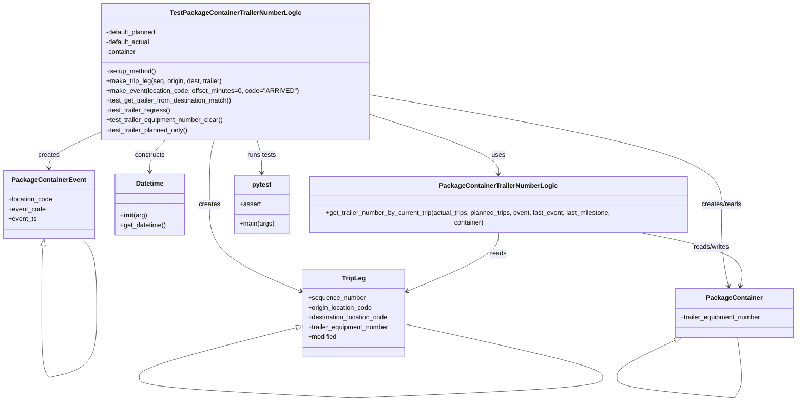

# Diagram: partview_core/partview_service/partview_service/tests/unit/business/package_container/trip_leg/test_trailer_equipment_number_logic.py

> Auto-generated by Obscura crawlers

## Mermaid

### SVG

<svg id="container" width="1981.36328125" xmlns="http://www.w3.org/2000/svg" class="classDiagram" height="984.25" viewBox="0 0 1981.36328125 984.25" role="graphics-document document" aria-roledescription="class"><g><defs><marker id="container_class-aggregationStart" class="marker aggregation class" refX="18" refY="7" markerWidth="190" markerHeight="240" orient="auto"><path d="M 18,7 L9,13 L1,7 L9,1 Z"></path></marker></defs><defs><marker id="container_class-aggregationEnd" class="marker aggregation class" refX="1" refY="7" markerWidth="20" markerHeight="28" orient="auto"><path d="M 18,7 L9,13 L1,7 L9,1 Z"></path></marker></defs><defs><marker id="container_class-extensionStart" class="marker extension class" refX="18" refY="7" markerWidth="190" markerHeight="240" orient="auto"><path d="M 1,7 L18,13 V 1 Z"></path></marker></defs><defs><marker id="container_class-extensionEnd" class="marker extension class" refX="1" refY="7" markerWidth="20" markerHeight="28" orient="auto"><path d="M 1,1 V 13 L18,7 Z"></path></marker></defs><defs><marker id="container_class-compositionStart" class="marker composition class" refX="18" refY="7" markerWidth="190" markerHeight="240" orient="auto"><path d="M 18,7 L9,13 L1,7 L9,1 Z"></path></marker></defs><defs><marker id="container_class-compositionEnd" class="marker composition class" refX="1" refY="7" markerWidth="20" markerHeight="28" orient="auto"><path d="M 18,7 L9,13 L1,7 L9,1 Z"></path></marker></defs><defs><marker id="container_class-dependencyStart" class="marker dependency class" refX="6" refY="7" markerWidth="190" markerHeight="240" orient="auto"><path d="M 5,7 L9,13 L1,7 L9,1 Z"></path></marker></defs><defs><marker id="container_class-dependencyEnd" class="marker dependency class" refX="13" refY="7" markerWidth="20" markerHeight="28" orient="auto"><path d="M 18,7 L9,13 L14,7 L9,1 Z"></path></marker></defs><defs><marker id="container_class-lollipopStart" class="marker lollipop class" refX="13" refY="7" markerWidth="190" markerHeight="240" orient="auto"><circle stroke="black" fill="transparent" cx="7" cy="7" r="6"></circle></marker></defs><defs><marker id="container_class-lollipopEnd" class="marker lollipop class" refX="1" refY="7" markerWidth="190" markerHeight="240" orient="auto"><circle stroke="black" fill="transparent" cx="7" cy="7" r="6"></circle></marker></defs><g class="root"><g class="clusters"></g><g class="edgePaths"><path d="M895.133,276.113L951.184,293.594C1007.234,311.076,1119.336,346.038,1175.387,372.186C1231.438,398.333,1231.438,415.667,1231.438,424.333L1231.438,433" id="id_TestPackageContainerTrailerNumberLogic_PackageContainerTrailerNumberLogic_1" class="edge-thickness-normal edge-pattern-solid relation" style=";;;" data-edge="true" data-et="edge" data-id="id_TestPackageContainerTrailerNumberLogic_PackageContainerTrailerNumberLogic_1" data-points="W3sieCI6ODk1LjEzMjgxMjUsInkiOjI3Ni4xMTMzODkxOTU5MzUxfSx7IngiOjEyMzEuNDM3NSwieSI6MzgxfSx7IngiOjEyMzEuNDM3NSwieSI6NDM5fV0=" marker-end="url(#container_class-dependencyEnd)"></path><path d="M401.558,344L395.224,350.167C388.889,356.333,376.22,368.667,369.885,381.5C363.551,394.333,363.551,407.667,363.551,414.333L363.551,421" id="id_TestPackageContainerTrailerNumberLogic_Datetime_2" class="edge-thickness-normal edge-pattern-solid relation" style=";;;" data-edge="true" data-et="edge" data-id="id_TestPackageContainerTrailerNumberLogic_Datetime_2" data-points="W3sieCI6NDAxLjU1ODI2OTgxNzA3MzIsInkiOjM0NH0seyJ4IjozNjMuNTUwNzgxMjUsInkiOjM4MX0seyJ4IjozNjMuNTUwNzgxMjUsInkiOjQyN31d" marker-end="url(#container_class-dependencyEnd)"></path><path d="M253.133,320.23L230.591,330.358C208.049,340.487,162.966,360.743,140.424,376.038C117.883,391.333,117.883,401.667,117.883,406.833L117.883,412" id="id_TestPackageContainerTrailerNumberLogic_PackageContainerEvent_3" class="edge-thickness-normal edge-pattern-solid relation" style=";;;" data-edge="true" data-et="edge" data-id="id_TestPackageContainerTrailerNumberLogic_PackageContainerEvent_3" data-points="W3sieCI6MjUzLjEzMjgxMjUsInkiOjMyMC4yMzAxMzY5ODYzMDE0fSx7IngiOjExNy44ODI4MTI1LCJ5IjozODF9LHsieCI6MTE3Ljg4MjgxMjUsInkiOjQxOH1d" marker-end="url(#container_class-dependencyEnd)"></path><path d="M895.133,229.939L1044.966,255.115C1194.799,280.292,1494.466,330.646,1644.299,375.99C1794.133,421.333,1794.133,461.667,1794.133,502C1794.133,542.333,1794.133,582.667,1797.133,616.025C1800.132,649.383,1806.132,675.766,1809.131,688.958L1812.131,702.149" id="id_TestPackageContainerTrailerNumberLogic_PackageContainer_4" class="edge-thickness-normal edge-pattern-solid relation" style=";;;" data-edge="true" data-et="edge" data-id="id_TestPackageContainerTrailerNumberLogic_PackageContainer_4" data-points="W3sieCI6ODk1LjEzMjgxMjUsInkiOjIyOS45Mzg1MjQ1OTAxNjM5Mn0seyJ4IjoxNzk0LjEzMjgxMjUsInkiOjM4MX0seyJ4IjoxNzk0LjEzMjgxMjUsInkiOjUwMn0seyJ4IjoxNzk0LjEzMjgxMjUsInkiOjYyM30seyJ4IjoxODEzLjQ2MTYxMDk5MTM3OTMsInkiOjcwOH1d" marker-end="url(#container_class-dependencyEnd)"></path><path d="M521.991,344L520.077,350.167C518.164,356.333,514.336,368.667,512.422,395C510.508,421.333,510.508,461.667,510.508,502C510.508,542.333,510.508,582.667,548.481,618.108C586.454,653.55,662.401,684.1,700.374,699.375L738.348,714.65" id="id_TestPackageContainerTrailerNumberLogic_TripLeg_5" class="edge-thickness-normal edge-pattern-solid relation" style=";;;" data-edge="true" data-et="edge" data-id="id_TestPackageContainerTrailerNumberLogic_TripLeg_5" data-points="W3sieCI6NTIxLjk5MTM0OTA4NTM2NTksInkiOjM0NH0seyJ4Ijo1MTAuNTA3ODEyNSwieSI6MzgxfSx7IngiOjUxMC41MDc4MTI1LCJ5Ijo1MDJ9LHsieCI6NTEwLjUwNzgxMjUsInkiOjYyM30seyJ4Ijo3NDMuOTE0MDYyNSwieSI6NzE2Ljg4OTYxNzM1NjA2MTV9XQ==" marker-end="url(#container_class-dependencyEnd)"></path><path d="M626.274,344L628.188,350.167C630.102,356.333,633.93,368.667,635.844,382C637.758,395.333,637.758,409.667,637.758,416.833L637.758,424" id="id_TestPackageContainerTrailerNumberLogic_pytest_6" class="edge-thickness-normal edge-pattern-solid relation" style=";;;" data-edge="true" data-et="edge" data-id="id_TestPackageContainerTrailerNumberLogic_pytest_6" data-points="W3sieCI6NjI2LjI3NDI3NTkxNDYzNDEsInkiOjM0NH0seyJ4Ijo2MzcuNzU3ODEyNSwieSI6MzgxfSx7IngiOjYzNy43NTc4MTI1LCJ5Ijo0MzB9XQ==" marker-end="url(#container_class-dependencyEnd)"></path><path d="M1231.438,565L1231.438,574.667C1231.438,584.333,1231.438,603.667,1193.464,628.608C1155.491,653.55,1079.544,684.1,1041.571,699.375L1003.598,714.65" id="id_PackageContainerTrailerNumberLogic_TripLeg_7" class="edge-thickness-normal edge-pattern-solid relation" style=";;;" data-edge="true" data-et="edge" data-id="id_PackageContainerTrailerNumberLogic_TripLeg_7" data-points="W3sieCI6MTIzMS40Mzc1LCJ5Ijo1NjV9LHsieCI6MTIzMS40Mzc1LCJ5Ijo2MjN9LHsieCI6OTk4LjAzMTI1LCJ5Ijo3MTYuODg5NjE3MzU2MDYxNX1d" marker-end="url(#container_class-dependencyEnd)"></path><path d="M1558.746,565L1608.968,574.667C1659.19,584.333,1759.634,603.667,1806.856,626.525C1854.079,649.383,1848.079,675.766,1845.079,688.958L1842.08,702.149" id="id_PackageContainerTrailerNumberLogic_PackageContainer_8" class="edge-thickness-normal edge-pattern-solid relation" style=";;;" data-edge="true" data-et="edge" data-id="id_PackageContainerTrailerNumberLogic_PackageContainer_8" data-points="W3sieCI6MTU1OC43NDYyNTUxNjUyODkzLCJ5Ijo1NjV9LHsieCI6MTg2MC4wNzgxMjUsInkiOjYyM30seyJ4IjoxODQwLjc0OTMyNjUwODYyMDcsInkiOjcwOH1d" marker-end="url(#container_class-dependencyEnd)"></path><path d="M103.244,603.072L102.763,606.393C102.282,609.715,101.32,616.357,100.839,643.837C100.358,671.317,100.358,719.633,100.358,743.792L100.358,767.95" id="PackageContainerEvent-cyclic-special-1" class="edge-thickness-normal edge-pattern-solid relation" style=";;;" data-edge="true" data-et="edge" data-id="PackageContainerEvent-cyclic-special-1" data-points="W3sieCI6MTA1LjcxNjY5Njc5NzI2MjA1LCJ5Ijo1ODZ9LHsieCI6MTAwLjM1NzgxMjQ5OTYyNzQ3LCJ5Ijo2MjN9LHsieCI6MTAwLjM1NzgxMjQ5OTYyNzQ3LCJ5Ijo3NjcuOTQ5OTk5OTk5MjU0OX1d" marker-start="url(#container_class-extensionStart)"></path><path d="M100.358,768.05L100.358,790.208C100.358,812.367,100.358,856.683,103.273,883.008C106.188,909.333,112.018,917.667,114.933,921.833L117.848,926" id="PackageContainerEvent-cyclic-special-mid" class="edge-thickness-normal edge-pattern-solid relation" style=";;;" data-edge="true" data-et="edge" data-id="PackageContainerEvent-cyclic-special-mid" data-points="W3sieCI6MTAwLjM1NzgxMjQ5OTYyNzQ3LCJ5Ijo3NjguMDUwMDAwMDAwNzQ1MX0seyJ4IjoxMDAuMzU3ODEyNDk5NjI3NDcsInkiOjkwMX0seyJ4IjoxMTcuODQ3ODMyNDU5NTU4ODksInkiOjkyNn1d"></path><path d="M117.933,926.039L137.138,921.866C156.344,917.693,194.755,909.346,213.96,883.007C233.166,856.667,233.166,812.333,233.166,766C233.166,719.667,233.166,671.333,227.291,641C221.415,610.667,209.665,598.333,203.789,592.167L197.914,586" id="PackageContainerEvent-cyclic-special-2" class="edge-thickness-normal edge-pattern-solid relation" style=";;;" data-edge="true" data-et="edge" data-id="PackageContainerEvent-cyclic-special-2" data-points="W3sieCI6MTE3LjkzMjgxMjUwMDc0NTA2LCJ5Ijo5MjYuMDM5MTM1NDUxNjYyOX0seyJ4IjoyMzMuMTY2MDE1NjI1LCJ5Ijo5MDF9LHsieCI6MjMzLjE2NjAxNTYyNSwieSI6NzY4fSx7IngiOjIzMy4xNjYwMTU2MjUsInkiOjYyM30seyJ4IjoxOTcuOTE0MTI3MDY2MTE1NywieSI6NTg2fV0="></path><path d="M1677.471,835.054L1652.944,846.045C1628.417,857.036,1579.364,879.018,1554.837,894.176C1530.31,909.333,1530.31,917.667,1530.31,921.833L1530.31,926" id="PackageContainer-cyclic-special-1" class="edge-thickness-normal edge-pattern-solid relation" style=";;;" data-edge="true" data-et="edge" data-id="PackageContainer-cyclic-special-1" data-points="W3sieCI6MTY5My4yMTI4NDY1Njk3MTcsInkiOjgyOH0seyJ4IjoxNTMwLjMxMDE1NjI1MDM3MjUsInkiOjkwMX0seyJ4IjoxNTMwLjMxMDE1NjI1MDM3MjUsInkiOjkyNn1d" marker-start="url(#container_class-extensionStart)"></path><path d="M1530.31,926.1L1530.31,930.267C1530.31,934.433,1530.31,942.767,1579.768,951.108C1629.225,959.449,1728.14,967.797,1777.598,971.971L1827.055,976.146" id="PackageContainer-cyclic-special-mid" class="edge-thickness-normal edge-pattern-solid relation" style=";;;" data-edge="true" data-et="edge" data-id="PackageContainer-cyclic-special-mid" data-points="W3sieCI6MTUzMC4zMTAxNTYyNTAzNzI1LCJ5Ijo5MjYuMTAwMDAwMDAxNDkwMX0seyJ4IjoxNTMwLjMxMDE1NjI1MDM3MjUsInkiOjk1MS4xMDAwMDAwMDE0OTAxfSx7IngiOjE4MjcuMDU1NDY4NzQ5MjU1LCJ5Ijo5NzYuMTQ1Nzc5OTIyMDQ1M31d"></path><path d="M1827.14,976.1L1830.055,971.933C1832.97,967.767,1838.8,959.433,1841.715,951.092C1844.63,942.75,1844.63,934.4,1844.63,926.05C1844.63,917.7,1844.63,909.35,1843.027,893.008C1841.424,876.667,1838.218,852.333,1836.615,840.167L1835.011,828" id="PackageContainer-cyclic-special-2" class="edge-thickness-normal edge-pattern-solid relation" style=";;;" data-edge="true" data-et="edge" data-id="PackageContainer-cyclic-special-2" data-points="W3sieCI6MTgyNy4xNDA0NDg3OTA0NDEsInkiOjk3Ni4xMDAwMDAwMDE0OTAxfSx7IngiOjE4NDQuNjMwNDY4NzUwMzcyNSwieSI6OTUxLjEwMDAwMDAwMTQ5MDF9LHsieCI6MTg0NC42MzA0Njg3NTAzNzI1LCJ5Ijo5MjYuMDUwMDAwMDAwNzQ1MX0seyJ4IjoxODQ0LjYzMDQ2ODc1MDM3MjUsInkiOjkwMX0seyJ4IjoxODM1LjAxMTQ4Mzc4Nzc2MiwieSI6ODI4fV0="></path><path d="M727.18,803.967L662.524,820.139C597.868,836.311,468.557,868.656,403.901,888.994C339.245,909.333,339.245,917.667,339.245,921.833L339.245,926" id="TripLeg-cyclic-special-1" class="edge-thickness-normal edge-pattern-solid relation" style=";;;" data-edge="true" data-et="edge" data-id="TripLeg-cyclic-special-1" data-points="W3sieCI6NzQzLjkxNDA2MjUsInkiOjc5OS43ODA5MzY1NDA4ODh9LHsieCI6MzM5LjI0NTMxMjUwMDc0NTA2LCJ5Ijo5MDF9LHsieCI6MzM5LjI0NTMxMjUwMDc0NTA2LCJ5Ijo5MjZ9XQ==" marker-start="url(#container_class-extensionStart)"></path><path d="M339.245,926.1L339.245,930.267C339.245,934.433,339.245,942.767,427.858,951.108C516.471,959.449,693.697,967.798,782.31,971.973L870.923,976.148" id="TripLeg-cyclic-special-mid" class="edge-thickness-normal edge-pattern-solid relation" style=";;;" data-edge="true" data-et="edge" data-id="TripLeg-cyclic-special-mid" data-points="W3sieCI6MzM5LjI0NTMxMjUwMDc0NTA2LCJ5Ijo5MjYuMTAwMDAwMDAxNDkwMX0seyJ4IjozMzkuMjQ1MzEyNTAwNzQ1MDYsInkiOjk1MS4xMDAwMDAwMDE0OTAxfSx7IngiOjg3MC45MjI2NTYyNDkyNTQ5LCJ5Ijo5NzYuMTQ3NjQ0NDcxNjU0Nn1d"></path><path d="M871.023,976.148L975.062,971.973C1079.102,967.799,1287.181,959.449,1391.221,951.1C1495.26,942.75,1495.26,934.4,1495.26,926.05C1495.26,917.7,1495.26,909.35,1412.389,887.52C1329.517,865.69,1163.774,830.379,1080.903,812.724L998.031,795.069" id="TripLeg-cyclic-special-2" class="edge-thickness-normal edge-pattern-solid relation" style=";;;" data-edge="true" data-et="edge" data-id="TripLeg-cyclic-special-2" data-points="W3sieCI6ODcxLjAyMjY1NjI1MDc0NTEsInkiOjk3Ni4xNDc5OTM3MTUwMzc4fSx7IngiOjE0OTUuMjYwMTU2MjQ5NjI3NSwieSI6OTUxLjEwMDAwMDAwMTQ5MDF9LHsieCI6MTQ5NS4yNjAxNTYyNDk2Mjc1LCJ5Ijo5MjYuMDUwMDAwMDAwNzQ1MX0seyJ4IjoxNDk1LjI2MDE1NjI0OTYyNzUsInkiOjkwMX0seyJ4Ijo5OTguMDMxMjUsInkiOjc5NS4wNjg5MjczMjcxNjkxfV0="></path></g><g class="edgeLabels"><g class="edgeLabel" transform="translate(1231.4375, 381)"><g class="label" data-id="id_TestPackageContainerTrailerNumberLogic_PackageContainerTrailerNumberLogic_1" transform="translate(-16.4921875, -12)"><foreignObject width="32.984375" height="24">

uses

</foreignObject></g></g><g class="edgeLabel" transform="translate(363.55078125, 381)"><g class="label" data-id="id_TestPackageContainerTrailerNumberLogic_Datetime_2" transform="translate(-37.84375, -12)"><foreignObject width="75.6875" height="24">

constructs

</foreignObject></g></g><g class="edgeLabel" transform="translate(117.8828125, 381)"><g class="label" data-id="id_TestPackageContainerTrailerNumberLogic_PackageContainerEvent_3" transform="translate(-26.171875, -12)"><foreignObject width="52.34375" height="24">

creates

</foreignObject></g></g><g class="edgeLabel" transform="translate(1794.1328125, 502)"><g class="label" data-id="id_TestPackageContainerTrailerNumberLogic_PackageContainer_4" transform="translate(-50.09375, -12)"><foreignObject width="100.1875" height="24">

creates/reads

</foreignObject></g></g><g class="edgeLabel" transform="translate(510.5078125, 502)"><g class="label" data-id="id_TestPackageContainerTrailerNumberLogic_TripLeg_5" transform="translate(-26.171875, -12)"><foreignObject width="52.34375" height="24">

creates

</foreignObject></g></g><g class="edgeLabel" transform="translate(637.7578125, 381)"><g class="label" data-id="id_TestPackageContainerTrailerNumberLogic_pytest_6" transform="translate(-35.78125, -12)"><foreignObject width="71.5625" height="24">

runs tests

</foreignObject></g></g><g class="edgeLabel" transform="translate(1231.4375, 623)"><g class="label" data-id="id_PackageContainerTrailerNumberLogic_TripLeg_7" transform="translate(-20.0078125, -12)"><foreignObject width="40.015625" height="24">

reads

</foreignObject></g></g><g class="edgeLabel" transform="translate(1752.21156, 602.23797)"><g class="label" data-id="id_PackageContainerTrailerNumberLogic_PackageContainer_8" transform="translate(-45.9453125, -12)"><foreignObject width="91.890625" height="24">

reads/writes

</foreignObject></g></g><g class="edgeLabel"><g class="label" data-id="PackageContainerEvent-cyclic-special-1" transform="translate(0, 0)"><foreignObject width="0" height="0">

</foreignObject></g></g><g class="edgeLabel"><g class="label" data-id="PackageContainerEvent-cyclic-special-mid" transform="translate(0, 0)"><foreignObject width="0" height="0">

</foreignObject></g></g><g class="edgeLabel"><g class="label" data-id="PackageContainerEvent-cyclic-special-2" transform="translate(0, 0)"><foreignObject width="0" height="0">

</foreignObject></g></g><g class="edgeLabel"><g class="label" data-id="PackageContainer-cyclic-special-1" transform="translate(0, 0)"><foreignObject width="0" height="0">

</foreignObject></g></g><g class="edgeLabel"><g class="label" data-id="PackageContainer-cyclic-special-mid" transform="translate(0, 0)"><foreignObject width="0" height="0">

</foreignObject></g></g><g class="edgeLabel"><g class="label" data-id="PackageContainer-cyclic-special-2" transform="translate(0, 0)"><foreignObject width="0" height="0">

</foreignObject></g></g><g class="edgeLabel"><g class="label" data-id="TripLeg-cyclic-special-1" transform="translate(0, 0)"><foreignObject width="0" height="0">

</foreignObject></g></g><g class="edgeLabel"><g class="label" data-id="TripLeg-cyclic-special-mid" transform="translate(0, 0)"><foreignObject width="0" height="0">

</foreignObject></g></g><g class="edgeLabel"><g class="label" data-id="TripLeg-cyclic-special-2" transform="translate(0, 0)"><foreignObject width="0" height="0">

</foreignObject></g></g></g><g class="nodes"><g class="node default" id="classId-TestPackageContainerTrailerNumberLogic-0" transform="translate(574.1328125, 176)"><g class="basic label-container"><path d="M-321 -168 L321 -168 L321 168 L-321 168" stroke="none" stroke-width="0" fill="#ECECFF" style=""></path><path d="M-321 -168 C-75.89020965745758 -168, 169.21958068508485 -168, 321 -168 M-321 -168 C-106.14654369425497 -168, 108.70691261149005 -168, 321 -168 M321 -168 C321 -96.85954367509828, 321 -25.71908735019656, 321 168 M321 -168 C321 -82.58805045282206, 321 2.8238990943558804, 321 168 M321 168 C95.64248070090485 168, -129.7150385981903 168, -321 168 M321 168 C107.95615140616826 168, -105.08769718766348 168, -321 168 M-321 168 C-321 35.91169601963293, -321 -96.17660796073415, -321 -168 M-321 168 C-321 94.32276468968126, -321 20.64552937936253, -321 -168" stroke="#9370DB" stroke-width="1.3" fill="none" stroke-dasharray="0 0" style=""></path></g><g class="annotation-group text" transform="translate(0, -144)"></g><g class="label-group text" transform="translate(-152.421875, -144)"><g class="label" style="font-weight: bolder" transform="translate(0,-12)"><foreignObject width="304.84375" height="24">

TestPackageContainerTrailerNumberLogic

</foreignObject></g></g><g class="members-group text" transform="translate(-309, -96)"><g class="label" style="" transform="translate(0,-12)"><foreignObject width="126.40625" height="24">

-default_planned

</foreignObject></g><g class="label" style="" transform="translate(0,12)"><foreignObject width="110.90625" height="24">

-default_actual

</foreignObject></g><g class="label" style="" transform="translate(0,36)"><foreignObject width="75.65625" height="24">

-container

</foreignObject></g></g><g class="methods-group text" transform="translate(-309, 0)"><g class="label" style="" transform="translate(0,-12)"><foreignObject width="123.640625" height="24">

+setup_method()

</foreignObject></g><g class="label" style="" transform="translate(0,12)"><foreignObject width="288.625" height="24">

+make_trip_leg(seq, origin, dest, trailer)

</foreignObject></g><g class="label" style="" transform="translate(0,36)"><foreignObject width="465.578125" height="24">

+make_event(location_code, offset_minutes=0, code="ARRIVED")

</foreignObject></g><g class="label" style="" transform="translate(0,60)"><foreignObject width="314.1875" height="24">

+test_get_trailer_from_destination_match()

</foreignObject></g><g class="label" style="" transform="translate(0,84)"><foreignObject width="156.875" height="24">

+test_trailer_regress()

</foreignObject></g><g class="label" style="" transform="translate(0,108)"><foreignObject width="291.359375" height="24">

+test_trailer_equipment_number_clear()

</foreignObject></g><g class="label" style="" transform="translate(0,132)"><foreignObject width="203.90625" height="24">

+test_trailer_planned_only()

</foreignObject></g></g><g class="divider" style=""><path d="M-321 -120 C-93.88901205841077 -120, 133.22197588317846 -120, 321 -120 M-321 -120 C-117.97057387547838 -120, 85.05885224904324 -120, 321 -120" stroke="#9370DB" stroke-width="1.3" fill="none" stroke-dasharray="0 0" style=""></path></g><g class="divider" style=""><path d="M-321 -24 C-159.5197988346678 -24, 1.960402330664408 -24, 321 -24 M-321 -24 C-138.56392457887668 -24, 43.87215084224664 -24, 321 -24" stroke="#9370DB" stroke-width="1.3" fill="none" stroke-dasharray="0 0" style=""></path></g></g><g class="node default" id="classId-PackageContainerTrailerNumberLogic-1" transform="translate(1231.4375, 502)"><g class="basic label-container"><path d="M-477.6015625 -63 L477.6015625 -63 L477.6015625 63 L-477.6015625 63" stroke="none" stroke-width="0" fill="#ECECFF" style=""></path><path d="M-477.6015625 -63 C-154.0527604290067 -63, 169.4960416419866 -63, 477.6015625 -63 M-477.6015625 -63 C-155.09632965687518 -63, 167.40890318624963 -63, 477.6015625 -63 M477.6015625 -63 C477.6015625 -35.01220551395761, 477.6015625 -7.024411027915214, 477.6015625 63 M477.6015625 -63 C477.6015625 -17.98514760480407, 477.6015625 27.02970479039186, 477.6015625 63 M477.6015625 63 C133.8600449191186 63, -209.8814726617628 63, -477.6015625 63 M477.6015625 63 C165.36601071475053 63, -146.86954107049894 63, -477.6015625 63 M-477.6015625 63 C-477.6015625 32.801806152008126, -477.6015625 2.603612304016245, -477.6015625 -63 M-477.6015625 63 C-477.6015625 35.25877732656864, -477.6015625 7.517554653137282, -477.6015625 -63" stroke="#9370DB" stroke-width="1.3" fill="none" stroke-dasharray="0 0" style=""></path></g><g class="annotation-group text" transform="translate(0, -39)"></g><g class="label-group text" transform="translate(-137.171875, -39)"><g class="label" style="font-weight: bolder" transform="translate(0,-12)"><foreignObject width="274.34375" height="24">

PackageContainerTrailerNumberLogic

</foreignObject></g></g><g class="members-group text" transform="translate(-465.6015625, 9)"></g><g class="methods-group text" transform="translate(-465.6015625, 39)"><g class="label" style="" transform="translate(0,-12)"><foreignObject width="794.03125" height="24">

+get_trailer_number_by_current_trip(actual_trips, planned_trips, event, last_event, last_milestone, container)

</foreignObject></g></g><g class="divider" style=""><path d="M-477.6015625 -15 C-218.25874599409167 -15, 41.08407051181666 -15, 477.6015625 -15 M-477.6015625 -15 C-259.4144731092152 -15, -41.22738371843036 -15, 477.6015625 -15" stroke="#9370DB" stroke-width="1.3" fill="none" stroke-dasharray="0 0" style=""></path></g><g class="divider" style=""><path d="M-477.6015625 9 C-139.44863375561562 9, 198.70429498876877 9, 477.6015625 9 M-477.6015625 9 C-142.7475699639246 9, 192.1064225721508 9, 477.6015625 9" stroke="#9370DB" stroke-width="1.3" fill="none" stroke-dasharray="0 0" style=""></path></g></g><g class="node default" id="classId-Datetime-2" transform="translate(363.55078125, 502)"><g class="basic label-container"><path d="M-85.78515625 -75 L85.78515625 -75 L85.78515625 75 L-85.78515625 75" stroke="none" stroke-width="0" fill="#ECECFF" style=""></path><path d="M-85.78515625 -75 C-47.14517086612867 -75, -8.505185482257346 -75, 85.78515625 -75 M-85.78515625 -75 C-17.605886747941213 -75, 50.573382754117574 -75, 85.78515625 -75 M85.78515625 -75 C85.78515625 -42.3987275227943, 85.78515625 -9.797455045588606, 85.78515625 75 M85.78515625 -75 C85.78515625 -21.077254764586186, 85.78515625 32.84549047082763, 85.78515625 75 M85.78515625 75 C25.783990875350668 75, -34.217174499298665 75, -85.78515625 75 M85.78515625 75 C22.756904389077825 75, -40.27134747184435 75, -85.78515625 75 M-85.78515625 75 C-85.78515625 44.514633894804795, -85.78515625 14.029267789609591, -85.78515625 -75 M-85.78515625 75 C-85.78515625 38.59166923832478, -85.78515625 2.183338476649567, -85.78515625 -75" stroke="#9370DB" stroke-width="1.3" fill="none" stroke-dasharray="0 0" style=""></path></g><g class="annotation-group text" transform="translate(0, -51)"></g><g class="label-group text" transform="translate(-33.3984375, -51)"><g class="label" style="font-weight: bolder" transform="translate(0,-12)"><foreignObject width="66.796875" height="24">

Datetime

</foreignObject></g></g><g class="members-group text" transform="translate(-73.78515625, -3)"></g><g class="methods-group text" transform="translate(-73.78515625, 27)"><g class="label" style="" transform="translate(0,-12)"><foreignObject width="65.75" height="24">

+<strong>init</strong>(arg)

</foreignObject></g><g class="label" style="" transform="translate(0,12)"><foreignObject width="114.171875" height="24">

+get_datetime()

</foreignObject></g></g><g class="divider" style=""><path d="M-85.78515625 -27 C-32.88534352213516 -27, 20.014469205729682 -27, 85.78515625 -27 M-85.78515625 -27 C-50.77965917671246 -27, -15.774162103424914 -27, 85.78515625 -27" stroke="#9370DB" stroke-width="1.3" fill="none" stroke-dasharray="0 0" style=""></path></g><g class="divider" style=""><path d="M-85.78515625 -3 C-35.561917029395964 -3, 14.661322191208072 -3, 85.78515625 -3 M-85.78515625 -3 C-34.35127611710375 -3, 17.082604015792498 -3, 85.78515625 -3" stroke="#9370DB" stroke-width="1.3" fill="none" stroke-dasharray="0 0" style=""></path></g></g><g class="node default" id="classId-PackageContainerEvent-3" transform="translate(117.8828125, 502)"><g class="basic label-container"><path d="M-109.8828125 -84 L109.8828125 -84 L109.8828125 84 L-109.8828125 84" stroke="none" stroke-width="0" fill="#ECECFF" style=""></path><path d="M-109.8828125 -84 C-49.73455597404483 -84, 10.413700551910338 -84, 109.8828125 -84 M-109.8828125 -84 C-64.79057766161554 -84, -19.698342823231073 -84, 109.8828125 -84 M109.8828125 -84 C109.8828125 -23.76153217435074, 109.8828125 36.47693565129852, 109.8828125 84 M109.8828125 -84 C109.8828125 -28.521317070781578, 109.8828125 26.957365858436845, 109.8828125 84 M109.8828125 84 C50.29519139226146 84, -9.292429715477084 84, -109.8828125 84 M109.8828125 84 C40.5013449920078 84, -28.880122515984397 84, -109.8828125 84 M-109.8828125 84 C-109.8828125 30.723757361771774, -109.8828125 -22.55248527645645, -109.8828125 -84 M-109.8828125 84 C-109.8828125 22.042920476394244, -109.8828125 -39.91415904721151, -109.8828125 -84" stroke="#9370DB" stroke-width="1.3" fill="none" stroke-dasharray="0 0" style=""></path></g><g class="annotation-group text" transform="translate(0, -60)"></g><g class="label-group text" transform="translate(-85.65625, -60)"><g class="label" style="font-weight: bolder" transform="translate(0,-12)"><foreignObject width="171.3125" height="24">

PackageContainerEvent

</foreignObject></g></g><g class="members-group text" transform="translate(-97.8828125, -12)"><g class="label" style="" transform="translate(0,-12)"><foreignObject width="110.109375" height="24">

+location_code

</foreignObject></g><g class="label" style="" transform="translate(0,12)"><foreignObject width="91.28125" height="24">

+event_code

</foreignObject></g><g class="label" style="" transform="translate(0,36)"><foreignObject width="69.578125" height="24">

+event_ts

</foreignObject></g></g><g class="methods-group text" transform="translate(-97.8828125, 84)"></g><g class="divider" style=""><path d="M-109.8828125 -36 C-47.09202994729413 -36, 15.698752605411741 -36, 109.8828125 -36 M-109.8828125 -36 C-35.97734914961501 -36, 37.92811420076998 -36, 109.8828125 -36" stroke="#9370DB" stroke-width="1.3" fill="none" stroke-dasharray="0 0" style=""></path></g><g class="divider" style=""><path d="M-109.8828125 60 C-41.04110460466687 60, 27.80060329066626 60, 109.8828125 60 M-109.8828125 60 C-22.4611121521355 60, 64.960588195729 60, 109.8828125 60" stroke="#9370DB" stroke-width="1.3" fill="none" stroke-dasharray="0 0" style=""></path></g></g><g class="node default" id="classId-PackageContainer-4" transform="translate(1827.10546875, 768)"><g class="basic label-container"><path d="M-146.2578125 -60 L146.2578125 -60 L146.2578125 60 L-146.2578125 60" stroke="none" stroke-width="0" fill="#ECECFF" style=""></path><path d="M-146.2578125 -60 C-78.45679039079856 -60, -10.655768281597119 -60, 146.2578125 -60 M-146.2578125 -60 C-43.57513545644083 -60, 59.107541587118334 -60, 146.2578125 -60 M146.2578125 -60 C146.2578125 -23.410202736100075, 146.2578125 13.17959452779985, 146.2578125 60 M146.2578125 -60 C146.2578125 -35.92237200442217, 146.2578125 -11.844744008844344, 146.2578125 60 M146.2578125 60 C65.85957808485459 60, -14.53865633029082 60, -146.2578125 60 M146.2578125 60 C81.20719524186684 60, 16.156577983733683 60, -146.2578125 60 M-146.2578125 60 C-146.2578125 19.539964588408694, -146.2578125 -20.920070823182613, -146.2578125 -60 M-146.2578125 60 C-146.2578125 20.48824318152667, -146.2578125 -19.02351363694666, -146.2578125 -60" stroke="#9370DB" stroke-width="1.3" fill="none" stroke-dasharray="0 0" style=""></path></g><g class="annotation-group text" transform="translate(0, -36)"></g><g class="label-group text" transform="translate(-65.453125, -36)"><g class="label" style="font-weight: bolder" transform="translate(0,-12)"><foreignObject width="130.90625" height="24">

PackageContainer

</foreignObject></g></g><g class="members-group text" transform="translate(-134.2578125, 12)"><g class="label" style="" transform="translate(0,-12)"><foreignObject width="203.0625" height="24">

+trailer_equipment_number

</foreignObject></g></g><g class="methods-group text" transform="translate(-134.2578125, 60)"></g><g class="divider" style=""><path d="M-146.2578125 -12 C-83.24393517339732 -12, -20.230057846794622 -12, 146.2578125 -12 M-146.2578125 -12 C-31.56752678307508 -12, 83.12275893384984 -12, 146.2578125 -12" stroke="#9370DB" stroke-width="1.3" fill="none" stroke-dasharray="0 0" style=""></path></g><g class="divider" style=""><path d="M-146.2578125 36 C-71.75557467066102 36, 2.7466631586779613 36, 146.2578125 36 M-146.2578125 36 C-85.64449638372193 36, -25.031180267443858 36, 146.2578125 36" stroke="#9370DB" stroke-width="1.3" fill="none" stroke-dasharray="0 0" style=""></path></g></g><g class="node default" id="classId-TripLeg-5" transform="translate(870.97265625, 768)"><g class="basic label-container"><path d="M-127.05859375 -108 L127.05859375 -108 L127.05859375 108 L-127.05859375 108" stroke="none" stroke-width="0" fill="#ECECFF" style=""></path><path d="M-127.05859375 -108 C-35.385325322914824 -108, 56.28794310417035 -108, 127.05859375 -108 M-127.05859375 -108 C-33.26448217602466 -108, 60.529629397950686 -108, 127.05859375 -108 M127.05859375 -108 C127.05859375 -26.316186633697313, 127.05859375 55.36762673260537, 127.05859375 108 M127.05859375 -108 C127.05859375 -62.32616634215202, 127.05859375 -16.652332684304042, 127.05859375 108 M127.05859375 108 C51.991388682567106 108, -23.07581638486579 108, -127.05859375 108 M127.05859375 108 C68.45360214194784 108, 9.84861053389568 108, -127.05859375 108 M-127.05859375 108 C-127.05859375 40.8177417004045, -127.05859375 -26.364516599191006, -127.05859375 -108 M-127.05859375 108 C-127.05859375 62.48907778012076, -127.05859375 16.978155560241518, -127.05859375 -108" stroke="#9370DB" stroke-width="1.3" fill="none" stroke-dasharray="0 0" style=""></path></g><g class="annotation-group text" transform="translate(0, -84)"></g><g class="label-group text" transform="translate(-27.0546875, -84)"><g class="label" style="font-weight: bolder" transform="translate(0,-12)"><foreignObject width="54.109375" height="24">

TripLeg

</foreignObject></g></g><g class="members-group text" transform="translate(-115.05859375, -36)"><g class="label" style="" transform="translate(0,-12)"><foreignObject width="142.015625" height="24">

+sequence_number

</foreignObject></g><g class="label" style="" transform="translate(0,12)"><foreignObject width="160.5" height="24">

+origin_location_code

</foreignObject></g><g class="label" style="" transform="translate(0,36)"><foreignObject width="201.40625" height="24">

+destination_location_code

</foreignObject></g><g class="label" style="" transform="translate(0,60)"><foreignObject width="203.0625" height="24">

+trailer_equipment_number

</foreignObject></g><g class="label" style="" transform="translate(0,84)"><foreignObject width="72.609375" height="24">

+modified

</foreignObject></g></g><g class="methods-group text" transform="translate(-115.05859375, 108)"></g><g class="divider" style=""><path d="M-127.05859375 -60 C-67.80616624303073 -60, -8.553738736061462 -60, 127.05859375 -60 M-127.05859375 -60 C-35.68215783507756 -60, 55.69427807984488 -60, 127.05859375 -60" stroke="#9370DB" stroke-width="1.3" fill="none" stroke-dasharray="0 0" style=""></path></g><g class="divider" style=""><path d="M-127.05859375 84 C-31.22081782530603 84, 64.61695809938794 84, 127.05859375 84 M-127.05859375 84 C-68.83405962171105 84, -10.609525493422112 84, 127.05859375 84" stroke="#9370DB" stroke-width="1.3" fill="none" stroke-dasharray="0 0" style=""></path></g></g><g class="node default" id="classId-pytest-6" transform="translate(637.7578125, 502)"><g class="basic label-container"><path d="M-66.078125 -72 L66.078125 -72 L66.078125 72 L-66.078125 72" stroke="none" stroke-width="0" fill="#ECECFF" style=""></path><path d="M-66.078125 -72 C-25.567665175491683 -72, 14.942794649016633 -72, 66.078125 -72 M-66.078125 -72 C-25.501513097306045 -72, 15.07509880538791 -72, 66.078125 -72 M66.078125 -72 C66.078125 -43.169086206981405, 66.078125 -14.338172413962809, 66.078125 72 M66.078125 -72 C66.078125 -23.65431459624061, 66.078125 24.69137080751878, 66.078125 72 M66.078125 72 C13.698795871498078 72, -38.680533257003844 72, -66.078125 72 M66.078125 72 C25.83837007568613 72, -14.401384848627742 72, -66.078125 72 M-66.078125 72 C-66.078125 35.19633530588918, -66.078125 -1.6073293882216433, -66.078125 -72 M-66.078125 72 C-66.078125 38.408347974274854, -66.078125 4.816695948549707, -66.078125 -72" stroke="#9370DB" stroke-width="1.3" fill="none" stroke-dasharray="0 0" style=""></path></g><g class="annotation-group text" transform="translate(0, -48)"></g><g class="label-group text" transform="translate(-23.171875, -48)"><g class="label" style="font-weight: bolder" transform="translate(0,-12)"><foreignObject width="46.34375" height="24">

pytest

</foreignObject></g></g><g class="members-group text" transform="translate(-54.078125, 0)"><g class="label" style="" transform="translate(0,-12)"><foreignObject width="51.75" height="24">

+assert

</foreignObject></g></g><g class="methods-group text" transform="translate(-54.078125, 48)"><g class="label" style="" transform="translate(0,-12)"><foreignObject width="84.984375" height="24">

+main(args)

</foreignObject></g></g><g class="divider" style=""><path d="M-66.078125 -24 C-29.223594181531674 -24, 7.630936636936653 -24, 66.078125 -24 M-66.078125 -24 C-37.221020394658666 -24, -8.363915789317325 -24, 66.078125 -24" stroke="#9370DB" stroke-width="1.3" fill="none" stroke-dasharray="0 0" style=""></path></g><g class="divider" style=""><path d="M-66.078125 24 C-34.01616458871375 24, -1.9542041774274992 24, 66.078125 24 M-66.078125 24 C-34.11255445711144 24, -2.1469839142228935 24, 66.078125 24" stroke="#9370DB" stroke-width="1.3" fill="none" stroke-dasharray="0 0" style=""></path></g></g><g class="label edgeLabel" id="PackageContainerEvent---PackageContainerEvent---1" transform="translate(100.35781249962747, 768)"><rect width="0.1" height="0.1"></rect><g class="label" style="" transform="translate(0, 0)"><rect></rect><foreignObject width="0" height="0">

</foreignObject></g></g><g class="label edgeLabel" id="PackageContainerEvent---PackageContainerEvent---2" transform="translate(117.8828125, 926.0500000007451)"><rect width="0.1" height="0.1"></rect><g class="label" style="" transform="translate(0, 0)"><rect></rect><foreignObject width="0" height="0">

</foreignObject></g></g><g class="label edgeLabel" id="PackageContainer---PackageContainer---1" transform="translate(1530.3101562503725, 926.0500000007451)"><rect width="0.1" height="0.1"></rect><g class="label" style="" transform="translate(0, 0)"><rect></rect><foreignObject width="0" height="0">

</foreignObject></g></g><g class="label edgeLabel" id="PackageContainer---PackageContainer---2" transform="translate(1827.10546875, 976.1500000022352)"><rect width="0.1" height="0.1"></rect><g class="label" style="" transform="translate(0, 0)"><rect></rect><foreignObject width="0" height="0">

</foreignObject></g></g><g class="label edgeLabel" id="TripLeg---TripLeg---1" transform="translate(339.24531250074506, 926.0500000007451)"><rect width="0.1" height="0.1"></rect><g class="label" style="" transform="translate(0, 0)"><rect></rect><foreignObject width="0" height="0">

</foreignObject></g></g><g class="label edgeLabel" id="TripLeg---TripLeg---2" transform="translate(870.97265625, 976.1500000022352)"><rect width="0.1" height="0.1"></rect><g class="label" style="" transform="translate(0, 0)"><rect></rect><foreignObject width="0" height="0">

</foreignObject></g></g></g></g></g></svg>
