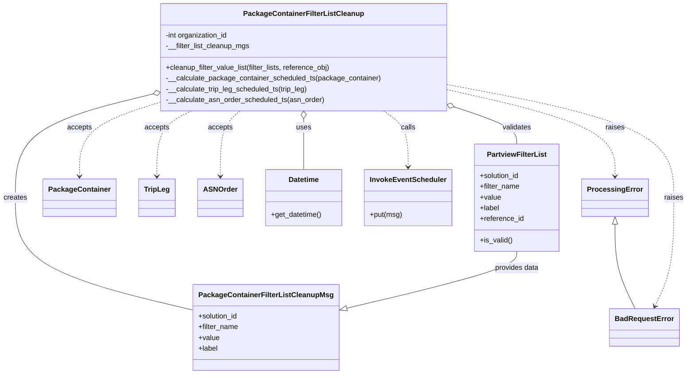

# Diagram: partview_core/partview_service/partview_service/tests/unit/business/package_container_filter_list/package_container_filter_list_cleanup_test.py

> Auto-generated by Obscura crawlers

## Mermaid

### SVG

<svg id="container" width="1492.3984375" xmlns="http://www.w3.org/2000/svg" class="classDiagram" height="836" viewBox="0 0 1492.3984375 836" role="graphics-document document" aria-roledescription="class"><g><defs><marker id="container_class-aggregationStart" class="marker aggregation class" refX="18" refY="7" markerWidth="190" markerHeight="240" orient="auto"><path d="M 18,7 L9,13 L1,7 L9,1 Z"></path></marker></defs><defs><marker id="container_class-aggregationEnd" class="marker aggregation class" refX="1" refY="7" markerWidth="20" markerHeight="28" orient="auto"><path d="M 18,7 L9,13 L1,7 L9,1 Z"></path></marker></defs><defs><marker id="container_class-extensionStart" class="marker extension class" refX="18" refY="7" markerWidth="190" markerHeight="240" orient="auto"><path d="M 1,7 L18,13 V 1 Z"></path></marker></defs><defs><marker id="container_class-extensionEnd" class="marker extension class" refX="1" refY="7" markerWidth="20" markerHeight="28" orient="auto"><path d="M 1,1 V 13 L18,7 Z"></path></marker></defs><defs><marker id="container_class-compositionStart" class="marker composition class" refX="18" refY="7" markerWidth="190" markerHeight="240" orient="auto"><path d="M 18,7 L9,13 L1,7 L9,1 Z"></path></marker></defs><defs><marker id="container_class-compositionEnd" class="marker composition class" refX="1" refY="7" markerWidth="20" markerHeight="28" orient="auto"><path d="M 18,7 L9,13 L1,7 L9,1 Z"></path></marker></defs><defs><marker id="container_class-dependencyStart" class="marker dependency class" refX="6" refY="7" markerWidth="190" markerHeight="240" orient="auto"><path d="M 5,7 L9,13 L1,7 L9,1 Z"></path></marker></defs><defs><marker id="container_class-dependencyEnd" class="marker dependency class" refX="13" refY="7" markerWidth="20" markerHeight="28" orient="auto"><path d="M 18,7 L9,13 L14,7 L9,1 Z"></path></marker></defs><defs><marker id="container_class-lollipopStart" class="marker lollipop class" refX="13" refY="7" markerWidth="190" markerHeight="240" orient="auto"><circle stroke="black" fill="transparent" cx="7" cy="7" r="6"></circle></marker></defs><defs><marker id="container_class-lollipopEnd" class="marker lollipop class" refX="1" refY="7" markerWidth="190" markerHeight="240" orient="auto"><circle stroke="black" fill="transparent" cx="7" cy="7" r="6"></circle></marker></defs><g class="root"><g class="clusters"></g><g class="edgePaths"><path d="M990.975,239.881L1013.274,247.401C1035.574,254.921,1080.174,269.96,1102.474,283.647C1124.773,297.333,1124.773,309.667,1124.773,315.833L1124.773,322" id="id_PackageContainerFilterListCleanup_PartviewFilterList_1" class="edge-thickness-normal edge-pattern-solid relation" style=";;;" data-edge="true" data-et="edge" data-id="id_PackageContainerFilterListCleanup_PartviewFilterList_1" data-points="W3sieCI6OTc0LjYyODkwNjI1LCJ5IjoyMzQuMzY5NDEzMjg0NzgyOTh9LHsieCI6MTEyNC43NzM0Mzc1LCJ5IjoyODV9LHsieCI6MTEyNC43NzM0Mzc1LCJ5IjozMjJ9XQ==" marker-start="url(#container_class-aggregationStart)"></path><path d="M327.024,211.438L278.215,223.698C229.406,235.959,131.789,260.479,82.981,298.906C34.172,337.333,34.172,389.667,34.172,442C34.172,494.333,34.172,546.667,99.433,588.751C164.694,630.835,295.216,662.669,360.477,678.587L425.738,694.504" id="id_PackageContainerFilterListCleanup_PackageContainerFilterListCleanupMsg_2" class="edge-thickness-normal edge-pattern-solid relation" style=";;;" data-edge="true" data-et="edge" data-id="id_PackageContainerFilterListCleanup_PackageContainerFilterListCleanupMsg_2" data-points="W3sieCI6MzQzLjc1MzkwNjI1LCJ5IjoyMDcuMjM1NDIzODkzMDAzMzR9LHsieCI6MzQuMTcxODc1LCJ5IjoyODV9LHsieCI6MzQuMTcxODc1LCJ5Ijo0NDJ9LHsieCI6MzQuMTcxODc1LCJ5Ijo1OTl9LHsieCI6NDI1LjczODI4MTI1LCJ5Ijo2OTQuNTAzODY0Njk2MjMyOH1d" marker-start="url(#container_class-aggregationStart)"></path><path d="M659.191,265.25L659.191,268.542C659.191,271.833,659.191,278.417,659.191,297.375C659.191,316.333,659.191,347.667,659.191,363.333L659.191,379" id="id_PackageContainerFilterListCleanup_Datetime_3" class="edge-thickness-normal edge-pattern-solid relation" style=";;;" data-edge="true" data-et="edge" data-id="id_PackageContainerFilterListCleanup_Datetime_3" data-points="W3sieCI6NjU5LjE5MTQwNjI1LCJ5IjoyNDh9LHsieCI6NjU5LjE5MTQwNjI1LCJ5IjoyODV9LHsieCI6NjU5LjE5MTQwNjI1LCJ5IjozNzl9XQ==" marker-start="url(#container_class-aggregationStart)"></path><path d="M834.322,248L843.322,254.167C852.321,260.333,870.321,272.667,879.321,293.5C888.32,314.333,888.32,343.667,888.32,358.333L888.32,373" id="id_PackageContainerFilterListCleanup_InvokeEventScheduler_4" class="edge-thickness-normal edge-pattern-dashed relation" style=";;;" data-edge="true" data-et="edge" data-id="id_PackageContainerFilterListCleanup_InvokeEventScheduler_4" data-points="W3sieCI6ODM0LjMyMTc4MDQ1MzgyMTcsInkiOjI0OH0seyJ4Ijo4ODguMzIwMzEyNSwieSI6Mjg1fSx7IngiOjg4OC4zMjAzMTI1LCJ5IjozNzl9XQ==" marker-end="url(#container_class-dependencyEnd)"></path><path d="M343.754,229.818L315.261,239.015C286.768,248.212,229.783,266.606,201.29,293.97C172.797,321.333,172.797,357.667,172.797,375.833L172.797,394" id="id_PackageContainerFilterListCleanup_PackageContainer_5" class="edge-thickness-normal edge-pattern-dashed relation" style=";;;" data-edge="true" data-et="edge" data-id="id_PackageContainerFilterListCleanup_PackageContainer_5" data-points="W3sieCI6MzQzLjc1MzkwNjI1LCJ5IjoyMjkuODE3OTM2NTA2NjYxNzR9LHsieCI6MTcyLjc5Njg3NSwieSI6Mjg1fSx7IngiOjE3Mi43OTY4NzUsInkiOjQwMH1d" marker-end="url(#container_class-dependencyEnd)"></path><path d="M414.692,248L402.127,254.167C389.563,260.333,364.434,272.667,351.869,297C339.305,321.333,339.305,357.667,339.305,375.833L339.305,394" id="id_PackageContainerFilterListCleanup_TripLeg_6" class="edge-thickness-normal edge-pattern-dashed relation" style=";;;" data-edge="true" data-et="edge" data-id="id_PackageContainerFilterListCleanup_TripLeg_6" data-points="W3sieCI6NDE0LjY5MjAwMzM4Mzc1OCwieSI6MjQ4fSx7IngiOjMzOS4zMDQ2ODc1LCJ5IjoyODV9LHsieCI6MzM5LjMwNDY4NzUsInkiOjQwMH1d" marker-end="url(#container_class-dependencyEnd)"></path><path d="M519.083,248L511.883,254.167C504.683,260.333,490.283,272.667,483.083,297C475.883,321.333,475.883,357.667,475.883,375.833L475.883,394" id="id_PackageContainerFilterListCleanup_ASNOrder_7" class="edge-thickness-normal edge-pattern-dashed relation" style=";;;" data-edge="true" data-et="edge" data-id="id_PackageContainerFilterListCleanup_ASNOrder_7" data-points="W3sieCI6NTE5LjA4MjkyNjk1MDYzNjksInkiOjI0OH0seyJ4Ijo0NzUuODgyODEyNSwieSI6Mjg1fSx7IngiOjQ3NS44ODI4MTI1LCJ5Ijo0MDB9XQ==" marker-end="url(#container_class-dependencyEnd)"></path><path d="M1124.773,562L1124.773,568.167C1124.773,574.333,1124.773,586.667,1062.305,608.069C999.838,629.472,874.902,659.944,812.434,675.18L749.966,690.416" id="id_PartviewFilterList_PackageContainerFilterListCleanupMsg_8" class="edge-thickness-normal edge-pattern-solid relation" style=";;;" data-edge="true" data-et="edge" data-id="id_PartviewFilterList_PackageContainerFilterListCleanupMsg_8" data-points="W3sieCI6MTEyNC43NzM0Mzc1LCJ5Ijo1NjJ9LHsieCI6MTEyNC43NzM0Mzc1LCJ5Ijo1OTl9LHsieCI6NzMzLjIwNzAzMTI1LCJ5Ijo2OTQuNTAzODY0Njk2MjMyOH1d" marker-end="url(#container_class-extensionEnd)"></path><path d="M1337.391,501.25L1337.391,517.542C1337.391,533.833,1337.391,566.417,1344.561,597.875C1351.731,629.333,1366.072,659.667,1373.243,674.833L1380.413,690" id="id_ProcessingError_BadRequestError_9" class="edge-thickness-normal edge-pattern-solid relation" style=";;;" data-edge="true" data-et="edge" data-id="id_ProcessingError_BadRequestError_9" data-points="W3sieCI6MTMzNy4zOTA2MjUsInkiOjQ4NH0seyJ4IjoxMzM3LjM5MDYyNSwieSI6NTk5fSx7IngiOjEzODAuNDEzMDM0NTM5NDczOCwieSI6NjkwfV0=" marker-start="url(#container_class-extensionStart)"></path><path d="M974.629,201.022L1035.089,215.019C1095.549,229.015,1216.47,257.007,1276.93,289.17C1337.391,321.333,1337.391,357.667,1337.391,375.833L1337.391,394" id="id_PackageContainerFilterListCleanup_ProcessingError_10" class="edge-thickness-normal edge-pattern-dashed relation" style=";;;" data-edge="true" data-et="edge" data-id="id_PackageContainerFilterListCleanup_ProcessingError_10" data-points="W3sieCI6OTc0LjYyODkwNjI1LCJ5IjoyMDEuMDIyMzMwNTA1MzAxODV9LHsieCI6MTMzNy4zOTA2MjUsInkiOjI4NX0seyJ4IjoxMzM3LjM5MDYyNSwieSI6NDAwfV0=" marker-end="url(#container_class-dependencyEnd)"></path><path d="M974.629,189.6L1056.049,205.5C1137.469,221.4,1300.309,253.2,1381.729,295.267C1463.148,337.333,1463.148,389.667,1463.148,442C1463.148,494.333,1463.148,546.667,1456.405,587.096C1449.662,627.525,1436.176,656.05,1429.433,670.313L1422.691,684.576" id="id_PackageContainerFilterListCleanup_BadRequestError_11" class="edge-thickness-normal edge-pattern-dashed relation" style=";;;" data-edge="true" data-et="edge" data-id="id_PackageContainerFilterListCleanup_BadRequestError_11" data-points="W3sieCI6OTc0LjYyODkwNjI1LCJ5IjoxODkuNTk5OTE4MzcyNTAzMn0seyJ4IjoxNDYzLjE0ODQzNzUsInkiOjI4NX0seyJ4IjoxNDYzLjE0ODQzNzUsInkiOjQ0Mn0seyJ4IjoxNDYzLjE0ODQzNzUsInkiOjU5OX0seyJ4IjoxNDIwLjEyNjAyNzk2MDUyNjIsInkiOjY5MH1d" marker-end="url(#container_class-dependencyEnd)"></path></g><g class="edgeLabels"><g class="edgeLabel" transform="translate(1124.7734375, 285)"><g class="label" data-id="id_PackageContainerFilterListCleanup_PartviewFilterList_1" transform="translate(-32.6875, -12)"><foreignObject width="65.375" height="24">

validates

</foreignObject></g></g><g class="edgeLabel" transform="translate(34.171875, 442)"><g class="label" data-id="id_PackageContainerFilterListCleanup_PackageContainerFilterListCleanupMsg_2" transform="translate(-26.171875, -12)"><foreignObject width="52.34375" height="24">

creates

</foreignObject></g></g><g class="edgeLabel" transform="translate(659.19140625, 285)"><g class="label" data-id="id_PackageContainerFilterListCleanup_Datetime_3" transform="translate(-16.4921875, -12)"><foreignObject width="32.984375" height="24">

uses

</foreignObject></g></g><g class="edgeLabel" transform="translate(888.3203125, 285)"><g class="label" data-id="id_PackageContainerFilterListCleanup_InvokeEventScheduler_4" transform="translate(-16.4453125, -12)"><foreignObject width="32.890625" height="24">

calls

</foreignObject></g></g><g class="edgeLabel" transform="translate(172.796875, 285)"><g class="label" data-id="id_PackageContainerFilterListCleanup_PackageContainer_5" transform="translate(-27.421875, -12)"><foreignObject width="54.84375" height="24">

accepts

</foreignObject></g></g><g class="edgeLabel" transform="translate(339.3046875, 285)"><g class="label" data-id="id_PackageContainerFilterListCleanup_TripLeg_6" transform="translate(-27.421875, -12)"><foreignObject width="54.84375" height="24">

accepts

</foreignObject></g></g><g class="edgeLabel" transform="translate(475.8828125, 285)"><g class="label" data-id="id_PackageContainerFilterListCleanup_ASNOrder_7" transform="translate(-27.421875, -12)"><foreignObject width="54.84375" height="24">

accepts

</foreignObject></g></g><g class="edgeLabel" transform="translate(1124.7734375, 599)"><g class="label" data-id="id_PartviewFilterList_PackageContainerFilterListCleanupMsg_8" transform="translate(-49.7578125, -12)"><foreignObject width="99.515625" height="24">

provides data

</foreignObject></g></g><g class="edgeLabel"><g class="label" data-id="id_ProcessingError_BadRequestError_9" transform="translate(0, 0)"><foreignObject width="0" height="0">

</foreignObject></g></g><g class="edgeLabel" transform="translate(1337.390625, 285)"><g class="label" data-id="id_PackageContainerFilterListCleanup_ProcessingError_10" transform="translate(-21.25, -12)"><foreignObject width="42.5" height="24">

raises

</foreignObject></g></g><g class="edgeLabel" transform="translate(1463.1484375, 442)"><g class="label" data-id="id_PackageContainerFilterListCleanup_BadRequestError_11" transform="translate(-21.25, -12)"><foreignObject width="42.5" height="24">

raises

</foreignObject></g></g></g><g class="nodes"><g class="node default" id="classId-PackageContainerFilterListCleanup-0" transform="translate(659.19140625, 128)"><g class="basic label-container"><path d="M-315.4375 -120 L315.4375 -120 L315.4375 120 L-315.4375 120" stroke="none" stroke-width="0" fill="#ECECFF" style=""></path><path d="M-315.4375 -120 C-97.28607924377036 -120, 120.86534151245928 -120, 315.4375 -120 M-315.4375 -120 C-167.31713773884474 -120, -19.19677547768947 -120, 315.4375 -120 M315.4375 -120 C315.4375 -37.73402965331658, 315.4375 44.531940693366835, 315.4375 120 M315.4375 -120 C315.4375 -37.09234044732226, 315.4375 45.815319105355485, 315.4375 120 M315.4375 120 C77.62717829214796 120, -160.18314341570408 120, -315.4375 120 M315.4375 120 C95.40920427895193 120, -124.61909144209613 120, -315.4375 120 M-315.4375 120 C-315.4375 24.887099119960666, -315.4375 -70.22580176007867, -315.4375 -120 M-315.4375 120 C-315.4375 68.10633972936051, -315.4375 16.212679458721027, -315.4375 -120" stroke="#9370DB" stroke-width="1.3" fill="none" stroke-dasharray="0 0" style=""></path></g><g class="annotation-group text" transform="translate(0, -96)"></g><g class="label-group text" transform="translate(-127.171875, -96)"><g class="label" style="font-weight: bolder" transform="translate(0,-12)"><foreignObject width="254.34375" height="24">

PackageContainerFilterListCleanup

</foreignObject></g></g><g class="members-group text" transform="translate(-303.4375, -48)"><g class="label" style="" transform="translate(0,-12)"><foreignObject width="143.109375" height="24">

-int organization_id

</foreignObject></g><g class="label" style="" transform="translate(0,12)"><foreignObject width="188.09375" height="24">

-__filter_list_cleanup_mgs

</foreignObject></g></g><g class="methods-group text" transform="translate(-303.4375, 24)"><g class="label" style="" transform="translate(0,-12)"><foreignObject width="372.1875" height="24">

+cleanup_filter_value_list(filter_lists, reference_obj)

</foreignObject></g><g class="label" style="" transform="translate(0,12)"><foreignObject width="479.703125" height="24">

-__calculate_package_container_scheduled_ts(package_container)

</foreignObject></g><g class="label" style="" transform="translate(0,36)"><foreignObject width="319.921875" height="24">

-__calculate_trip_leg_scheduled_ts(trip_leg)

</foreignObject></g><g class="label" style="" transform="translate(0,60)"><foreignObject width="353.46875" height="24">

-__calculate_asn_order_scheduled_ts(asn_order)

</foreignObject></g></g><g class="divider" style=""><path d="M-315.4375 -72 C-96.01681737309542 -72, 123.40386525380916 -72, 315.4375 -72 M-315.4375 -72 C-156.1255305313429 -72, 3.1864389373142217 -72, 315.4375 -72" stroke="#9370DB" stroke-width="1.3" fill="none" stroke-dasharray="0 0" style=""></path></g><g class="divider" style=""><path d="M-315.4375 0 C-64.84891192191813 0, 185.73967615616374 0, 315.4375 0 M-315.4375 0 C-147.1432840393311 0, 21.150931921337815 0, 315.4375 0" stroke="#9370DB" stroke-width="1.3" fill="none" stroke-dasharray="0 0" style=""></path></g></g><g class="node default" id="classId-PartviewFilterList-1" transform="translate(1124.7734375, 442)"><g class="basic label-container"><path d="M-93.109375 -120 L93.109375 -120 L93.109375 120 L-93.109375 120" stroke="none" stroke-width="0" fill="#ECECFF" style=""></path><path d="M-93.109375 -120 C-40.566733461309155 -120, 11.975908077381689 -120, 93.109375 -120 M-93.109375 -120 C-30.938542646186775 -120, 31.23228970762645 -120, 93.109375 -120 M93.109375 -120 C93.109375 -53.312189933796276, 93.109375 13.375620132407448, 93.109375 120 M93.109375 -120 C93.109375 -50.43722679212718, 93.109375 19.125546415745646, 93.109375 120 M93.109375 120 C48.03941231830152 120, 2.969449636603045 120, -93.109375 120 M93.109375 120 C22.734172420270866 120, -47.64103015945827 120, -93.109375 120 M-93.109375 120 C-93.109375 38.77245744007202, -93.109375 -42.455085119855966, -93.109375 -120 M-93.109375 120 C-93.109375 35.28291345464321, -93.109375 -49.434173090713585, -93.109375 -120" stroke="#9370DB" stroke-width="1.3" fill="none" stroke-dasharray="0 0" style=""></path></g><g class="annotation-group text" transform="translate(0, -96)"></g><g class="label-group text" transform="translate(-63.96875, -96)"><g class="label" style="font-weight: bolder" transform="translate(0,-12)"><foreignObject width="127.9375" height="24">

PartviewFilterList

</foreignObject></g></g><g class="members-group text" transform="translate(-81.109375, -48)"><g class="label" style="" transform="translate(0,-12)"><foreignObject width="90.21875" height="24">

+solution_id

</foreignObject></g><g class="label" style="" transform="translate(0,12)"><foreignObject width="89.625" height="24">

+filter_name

</foreignObject></g><g class="label" style="" transform="translate(0,36)"><foreignObject width="46.71875" height="24">

+value

</foreignObject></g><g class="label" style="" transform="translate(0,60)"><foreignObject width="44.21875" height="24">

+label

</foreignObject></g><g class="label" style="" transform="translate(0,84)"><foreignObject width="98.25" height="24">

+reference_id

</foreignObject></g></g><g class="methods-group text" transform="translate(-81.109375, 96)"><g class="label" style="" transform="translate(0,-12)"><foreignObject width="72.796875" height="24">

+is_valid()

</foreignObject></g></g><g class="divider" style=""><path d="M-93.109375 -72 C-49.643586630029695 -72, -6.17779826005939 -72, 93.109375 -72 M-93.109375 -72 C-42.794965629341924 -72, 7.519443741316152 -72, 93.109375 -72" stroke="#9370DB" stroke-width="1.3" fill="none" stroke-dasharray="0 0" style=""></path></g><g class="divider" style=""><path d="M-93.109375 72 C-49.38325977745154 72, -5.657144554903084 72, 93.109375 72 M-93.109375 72 C-28.300441950166785 72, 36.50849109966643 72, 93.109375 72" stroke="#9370DB" stroke-width="1.3" fill="none" stroke-dasharray="0 0" style=""></path></g></g><g class="node default" id="classId-PackageContainerFilterListCleanupMsg-2" transform="translate(579.47265625, 732)"><g class="basic label-container"><path d="M-153.734375 -96 L153.734375 -96 L153.734375 96 L-153.734375 96" stroke="none" stroke-width="0" fill="#ECECFF" style=""></path><path d="M-153.734375 -96 C-36.085921683301436 -96, 81.56253163339713 -96, 153.734375 -96 M-153.734375 -96 C-68.60227289010582 -96, 16.529829219788354 -96, 153.734375 -96 M153.734375 -96 C153.734375 -54.84528343434435, 153.734375 -13.690566868688705, 153.734375 96 M153.734375 -96 C153.734375 -43.17359959846698, 153.734375 9.652800803066043, 153.734375 96 M153.734375 96 C44.70283209034332 96, -64.32871081931336 96, -153.734375 96 M153.734375 96 C59.203582396768596 96, -35.32721020646281 96, -153.734375 96 M-153.734375 96 C-153.734375 36.13190927485575, -153.734375 -23.7361814502885, -153.734375 -96 M-153.734375 96 C-153.734375 19.938641969791945, -153.734375 -56.12271606041611, -153.734375 -96" stroke="#9370DB" stroke-width="1.3" fill="none" stroke-dasharray="0 0" style=""></path></g><g class="annotation-group text" transform="translate(0, -72)"></g><g class="label-group text" transform="translate(-141.734375, -72)"><g class="label" style="font-weight: bolder" transform="translate(0,-12)"><foreignObject width="283.46875" height="24">

PackageContainerFilterListCleanupMsg

</foreignObject></g></g><g class="members-group text" transform="translate(-141.734375, -24)"><g class="label" style="" transform="translate(0,-12)"><foreignObject width="90.21875" height="24">

+solution_id

</foreignObject></g><g class="label" style="" transform="translate(0,12)"><foreignObject width="89.625" height="24">

+filter_name

</foreignObject></g><g class="label" style="" transform="translate(0,36)"><foreignObject width="46.71875" height="24">

+value

</foreignObject></g><g class="label" style="" transform="translate(0,60)"><foreignObject width="44.21875" height="24">

+label

</foreignObject></g></g><g class="methods-group text" transform="translate(-141.734375, 96)"></g><g class="divider" style=""><path d="M-153.734375 -48 C-59.55411765500435 -48, 34.626139689991305 -48, 153.734375 -48 M-153.734375 -48 C-33.14274029880893 -48, 87.44889440238214 -48, 153.734375 -48" stroke="#9370DB" stroke-width="1.3" fill="none" stroke-dasharray="0 0" style=""></path></g><g class="divider" style=""><path d="M-153.734375 72 C-82.6452567591468 72, -11.556138518293608 72, 153.734375 72 M-153.734375 72 C-77.17648378565843 72, -0.6185925713168672 72, 153.734375 72" stroke="#9370DB" stroke-width="1.3" fill="none" stroke-dasharray="0 0" style=""></path></g></g><g class="node default" id="classId-PackageContainer-3" transform="translate(172.796875, 442)"><g class="basic label-container"><path d="M-77.453125 -42 L77.453125 -42 L77.453125 42 L-77.453125 42" stroke="none" stroke-width="0" fill="#ECECFF" style=""></path><path d="M-77.453125 -42 C-27.482402624201256 -42, 22.488319751597487 -42, 77.453125 -42 M-77.453125 -42 C-45.08376974754055 -42, -12.714414495081101 -42, 77.453125 -42 M77.453125 -42 C77.453125 -20.909368334905462, 77.453125 0.1812633301890756, 77.453125 42 M77.453125 -42 C77.453125 -23.173498610164522, 77.453125 -4.346997220329044, 77.453125 42 M77.453125 42 C41.92235713921029 42, 6.391589278420582 42, -77.453125 42 M77.453125 42 C37.277325975399464 42, -2.8984730492010726 42, -77.453125 42 M-77.453125 42 C-77.453125 25.00519293996881, -77.453125 8.010385879937623, -77.453125 -42 M-77.453125 42 C-77.453125 8.634352284091754, -77.453125 -24.73129543181649, -77.453125 -42" stroke="#9370DB" stroke-width="1.3" fill="none" stroke-dasharray="0 0" style=""></path></g><g class="annotation-group text" transform="translate(0, -18)"></g><g class="label-group text" transform="translate(-65.453125, -18)"><g class="label" style="font-weight: bolder" transform="translate(0,-12)"><foreignObject width="130.90625" height="24">

PackageContainer

</foreignObject></g></g><g class="members-group text" transform="translate(-65.453125, 30)"></g><g class="methods-group text" transform="translate(-65.453125, 60)"></g><g class="divider" style=""><path d="M-77.453125 6 C-17.224058536957756 6, 43.00500792608449 6, 77.453125 6 M-77.453125 6 C-23.138365949639955 6, 31.17639310072009 6, 77.453125 6" stroke="#9370DB" stroke-width="1.3" fill="none" stroke-dasharray="0 0" style=""></path></g><g class="divider" style=""><path d="M-77.453125 24 C-38.518379579996925 24, 0.41636584000615073 24, 77.453125 24 M-77.453125 24 C-37.71610581620996 24, 2.0209133675800786 24, 77.453125 24" stroke="#9370DB" stroke-width="1.3" fill="none" stroke-dasharray="0 0" style=""></path></g></g><g class="node default" id="classId-TripLeg-4" transform="translate(339.3046875, 442)"><g class="basic label-container"><path d="M-39.0546875 -42 L39.0546875 -42 L39.0546875 42 L-39.0546875 42" stroke="none" stroke-width="0" fill="#ECECFF" style=""></path><path d="M-39.0546875 -42 C-19.31668775567469 -42, 0.421311988650622 -42, 39.0546875 -42 M-39.0546875 -42 C-14.844978233159306 -42, 9.364731033681387 -42, 39.0546875 -42 M39.0546875 -42 C39.0546875 -17.43584848563426, 39.0546875 7.12830302873148, 39.0546875 42 M39.0546875 -42 C39.0546875 -15.96335819776337, 39.0546875 10.07328360447326, 39.0546875 42 M39.0546875 42 C9.803570039864127 42, -19.447547420271746 42, -39.0546875 42 M39.0546875 42 C9.779857551260495 42, -19.49497239747901 42, -39.0546875 42 M-39.0546875 42 C-39.0546875 20.136579851013977, -39.0546875 -1.7268402979720463, -39.0546875 -42 M-39.0546875 42 C-39.0546875 18.8032921342631, -39.0546875 -4.393415731473802, -39.0546875 -42" stroke="#9370DB" stroke-width="1.3" fill="none" stroke-dasharray="0 0" style=""></path></g><g class="annotation-group text" transform="translate(0, -18)"></g><g class="label-group text" transform="translate(-27.0546875, -18)"><g class="label" style="font-weight: bolder" transform="translate(0,-12)"><foreignObject width="54.109375" height="24">

TripLeg

</foreignObject></g></g><g class="members-group text" transform="translate(-27.0546875, 30)"></g><g class="methods-group text" transform="translate(-27.0546875, 60)"></g><g class="divider" style=""><path d="M-39.0546875 6 C-16.301827107965615 6, 6.451033284068771 6, 39.0546875 6 M-39.0546875 6 C-14.639448342577658 6, 9.775790814844683 6, 39.0546875 6" stroke="#9370DB" stroke-width="1.3" fill="none" stroke-dasharray="0 0" style=""></path></g><g class="divider" style=""><path d="M-39.0546875 24 C-15.074924671917334 24, 8.904838156165333 24, 39.0546875 24 M-39.0546875 24 C-10.445721192545673 24, 18.163245114908655 24, 39.0546875 24" stroke="#9370DB" stroke-width="1.3" fill="none" stroke-dasharray="0 0" style=""></path></g></g><g class="node default" id="classId-ASNOrder-5" transform="translate(475.8828125, 442)"><g class="basic label-container"><path d="M-47.5234375 -42 L47.5234375 -42 L47.5234375 42 L-47.5234375 42" stroke="none" stroke-width="0" fill="#ECECFF" style=""></path><path d="M-47.5234375 -42 C-22.514349419869568 -42, 2.4947386602608645 -42, 47.5234375 -42 M-47.5234375 -42 C-28.49750673564419 -42, -9.471575971288381 -42, 47.5234375 -42 M47.5234375 -42 C47.5234375 -24.888009132527326, 47.5234375 -7.7760182650546525, 47.5234375 42 M47.5234375 -42 C47.5234375 -15.099165105434949, 47.5234375 11.801669789130102, 47.5234375 42 M47.5234375 42 C23.728546295823456 42, -0.06634490835308782 42, -47.5234375 42 M47.5234375 42 C21.630444237407747 42, -4.262549025184505 42, -47.5234375 42 M-47.5234375 42 C-47.5234375 11.530014272768426, -47.5234375 -18.939971454463148, -47.5234375 -42 M-47.5234375 42 C-47.5234375 8.56865736982045, -47.5234375 -24.8626852603591, -47.5234375 -42" stroke="#9370DB" stroke-width="1.3" fill="none" stroke-dasharray="0 0" style=""></path></g><g class="annotation-group text" transform="translate(0, -18)"></g><g class="label-group text" transform="translate(-35.5234375, -18)"><g class="label" style="font-weight: bolder" transform="translate(0,-12)"><foreignObject width="71.046875" height="24">

ASNOrder

</foreignObject></g></g><g class="members-group text" transform="translate(-35.5234375, 30)"></g><g class="methods-group text" transform="translate(-35.5234375, 60)"></g><g class="divider" style=""><path d="M-47.5234375 6 C-17.475172315106644 6, 12.573092869786713 6, 47.5234375 6 M-47.5234375 6 C-15.934245439173129 6, 15.654946621653743 6, 47.5234375 6" stroke="#9370DB" stroke-width="1.3" fill="none" stroke-dasharray="0 0" style=""></path></g><g class="divider" style=""><path d="M-47.5234375 24 C-25.714988695292224 24, -3.9065398905844475 24, 47.5234375 24 M-47.5234375 24 C-19.230586100189868 24, 9.062265299620265 24, 47.5234375 24" stroke="#9370DB" stroke-width="1.3" fill="none" stroke-dasharray="0 0" style=""></path></g></g><g class="node default" id="classId-Datetime-6" transform="translate(659.19140625, 442)"><g class="basic label-container"><path d="M-85.78515625 -63 L85.78515625 -63 L85.78515625 63 L-85.78515625 63" stroke="none" stroke-width="0" fill="#ECECFF" style=""></path><path d="M-85.78515625 -63 C-50.81410631041278 -63, -15.843056370825565 -63, 85.78515625 -63 M-85.78515625 -63 C-24.659606246963605 -63, 36.46594375607279 -63, 85.78515625 -63 M85.78515625 -63 C85.78515625 -17.282371735600755, 85.78515625 28.43525652879849, 85.78515625 63 M85.78515625 -63 C85.78515625 -34.46059675652664, 85.78515625 -5.921193513053275, 85.78515625 63 M85.78515625 63 C23.576952432125836 63, -38.63125138574833 63, -85.78515625 63 M85.78515625 63 C23.066131942118353 63, -39.65289236576329 63, -85.78515625 63 M-85.78515625 63 C-85.78515625 31.78708731226499, -85.78515625 0.5741746245299808, -85.78515625 -63 M-85.78515625 63 C-85.78515625 19.77665587298889, -85.78515625 -23.44668825402222, -85.78515625 -63" stroke="#9370DB" stroke-width="1.3" fill="none" stroke-dasharray="0 0" style=""></path></g><g class="annotation-group text" transform="translate(0, -39)"></g><g class="label-group text" transform="translate(-33.3984375, -39)"><g class="label" style="font-weight: bolder" transform="translate(0,-12)"><foreignObject width="66.796875" height="24">

Datetime

</foreignObject></g></g><g class="members-group text" transform="translate(-73.78515625, 9)"></g><g class="methods-group text" transform="translate(-73.78515625, 39)"><g class="label" style="" transform="translate(0,-12)"><foreignObject width="114.171875" height="24">

+get_datetime()

</foreignObject></g></g><g class="divider" style=""><path d="M-85.78515625 -15 C-32.164199745913 -15, 21.456756758173995 -15, 85.78515625 -15 M-85.78515625 -15 C-38.34860035022677 -15, 9.087955549546464 -15, 85.78515625 -15" stroke="#9370DB" stroke-width="1.3" fill="none" stroke-dasharray="0 0" style=""></path></g><g class="divider" style=""><path d="M-85.78515625 9 C-31.951884295016235 9, 21.88138765996753 9, 85.78515625 9 M-85.78515625 9 C-34.98241299410113 9, 15.820330261797736 9, 85.78515625 9" stroke="#9370DB" stroke-width="1.3" fill="none" stroke-dasharray="0 0" style=""></path></g></g><g class="node default" id="classId-InvokeEventScheduler-7" transform="translate(888.3203125, 442)"><g class="basic label-container"><path d="M-93.34375 -63 L93.34375 -63 L93.34375 63 L-93.34375 63" stroke="none" stroke-width="0" fill="#ECECFF" style=""></path><path d="M-93.34375 -63 C-51.47624793311354 -63, -9.608745866227082 -63, 93.34375 -63 M-93.34375 -63 C-45.731610400062415 -63, 1.8805291998751699 -63, 93.34375 -63 M93.34375 -63 C93.34375 -22.50899726652232, 93.34375 17.982005466955357, 93.34375 63 M93.34375 -63 C93.34375 -19.49556138028371, 93.34375 24.00887723943258, 93.34375 63 M93.34375 63 C50.99591565618425 63, 8.648081312368504 63, -93.34375 63 M93.34375 63 C23.226195568532617 63, -46.891358862934766 63, -93.34375 63 M-93.34375 63 C-93.34375 34.51006178822305, -93.34375 6.020123576446096, -93.34375 -63 M-93.34375 63 C-93.34375 27.71233371142978, -93.34375 -7.575332577140443, -93.34375 -63" stroke="#9370DB" stroke-width="1.3" fill="none" stroke-dasharray="0 0" style=""></path></g><g class="annotation-group text" transform="translate(0, -39)"></g><g class="label-group text" transform="translate(-81.34375, -39)"><g class="label" style="font-weight: bolder" transform="translate(0,-12)"><foreignObject width="162.6875" height="24">

InvokeEventScheduler

</foreignObject></g></g><g class="members-group text" transform="translate(-81.34375, 9)"></g><g class="methods-group text" transform="translate(-81.34375, 39)"><g class="label" style="" transform="translate(0,-12)"><foreignObject width="72.453125" height="24">

+put(msg)

</foreignObject></g></g><g class="divider" style=""><path d="M-93.34375 -15 C-38.09215059434914 -15, 17.159448811301715 -15, 93.34375 -15 M-93.34375 -15 C-47.758107699758106 -15, -2.172465399516213 -15, 93.34375 -15" stroke="#9370DB" stroke-width="1.3" fill="none" stroke-dasharray="0 0" style=""></path></g><g class="divider" style=""><path d="M-93.34375 9 C-20.748186923643658 9, 51.847376152712684 9, 93.34375 9 M-93.34375 9 C-24.057226277183986 9, 45.22929744563203 9, 93.34375 9" stroke="#9370DB" stroke-width="1.3" fill="none" stroke-dasharray="0 0" style=""></path></g></g><g class="node default" id="classId-ProcessingError-8" transform="translate(1337.390625, 442)"><g class="basic label-container"><path d="M-69.5078125 -42 L69.5078125 -42 L69.5078125 42 L-69.5078125 42" stroke="none" stroke-width="0" fill="#ECECFF" style=""></path><path d="M-69.5078125 -42 C-35.965274971267846 -42, -2.4227374425356913 -42, 69.5078125 -42 M-69.5078125 -42 C-40.817217835453796 -42, -12.126623170907592 -42, 69.5078125 -42 M69.5078125 -42 C69.5078125 -11.989882796327354, 69.5078125 18.020234407345292, 69.5078125 42 M69.5078125 -42 C69.5078125 -19.275050065203473, 69.5078125 3.449899869593054, 69.5078125 42 M69.5078125 42 C38.52162620857183 42, 7.5354399171436555 42, -69.5078125 42 M69.5078125 42 C13.906476147502843 42, -41.69486020499431 42, -69.5078125 42 M-69.5078125 42 C-69.5078125 17.096542430328515, -69.5078125 -7.806915139342969, -69.5078125 -42 M-69.5078125 42 C-69.5078125 14.064748800002544, -69.5078125 -13.870502399994912, -69.5078125 -42" stroke="#9370DB" stroke-width="1.3" fill="none" stroke-dasharray="0 0" style=""></path></g><g class="annotation-group text" transform="translate(0, -18)"></g><g class="label-group text" transform="translate(-57.5078125, -18)"><g class="label" style="font-weight: bolder" transform="translate(0,-12)"><foreignObject width="115.015625" height="24">

ProcessingError

</foreignObject></g></g><g class="members-group text" transform="translate(-57.5078125, 30)"></g><g class="methods-group text" transform="translate(-57.5078125, 60)"></g><g class="divider" style=""><path d="M-69.5078125 6 C-24.009552824963237 6, 21.488706850073527 6, 69.5078125 6 M-69.5078125 6 C-15.595280767797384 6, 38.31725096440523 6, 69.5078125 6" stroke="#9370DB" stroke-width="1.3" fill="none" stroke-dasharray="0 0" style=""></path></g><g class="divider" style=""><path d="M-69.5078125 24 C-40.21904079412943 24, -10.930269088258846 24, 69.5078125 24 M-69.5078125 24 C-30.027681395242354 24, 9.452449709515292 24, 69.5078125 24" stroke="#9370DB" stroke-width="1.3" fill="none" stroke-dasharray="0 0" style=""></path></g></g><g class="node default" id="classId-BadRequestError-9" transform="translate(1400.26953125, 732)"><g class="basic label-container"><path d="M-74.28125 -42 L74.28125 -42 L74.28125 42 L-74.28125 42" stroke="none" stroke-width="0" fill="#ECECFF" style=""></path><path d="M-74.28125 -42 C-43.795490429709744 -42, -13.309730859419489 -42, 74.28125 -42 M-74.28125 -42 C-43.80374640974841 -42, -13.326242819496827 -42, 74.28125 -42 M74.28125 -42 C74.28125 -20.31013818349915, 74.28125 1.3797236330017029, 74.28125 42 M74.28125 -42 C74.28125 -21.584404398815693, 74.28125 -1.1688087976313852, 74.28125 42 M74.28125 42 C41.75531300040039 42, 9.229376000800784 42, -74.28125 42 M74.28125 42 C15.782333346321174 42, -42.71658330735765 42, -74.28125 42 M-74.28125 42 C-74.28125 10.334326208841276, -74.28125 -21.33134758231745, -74.28125 -42 M-74.28125 42 C-74.28125 16.24207648773542, -74.28125 -9.515847024529158, -74.28125 -42" stroke="#9370DB" stroke-width="1.3" fill="none" stroke-dasharray="0 0" style=""></path></g><g class="annotation-group text" transform="translate(0, -18)"></g><g class="label-group text" transform="translate(-62.28125, -18)"><g class="label" style="font-weight: bolder" transform="translate(0,-12)"><foreignObject width="124.5625" height="24">

BadRequestError

</foreignObject></g></g><g class="members-group text" transform="translate(-62.28125, 30)"></g><g class="methods-group text" transform="translate(-62.28125, 60)"></g><g class="divider" style=""><path d="M-74.28125 6 C-31.546814886986752 6, 11.187620226026496 6, 74.28125 6 M-74.28125 6 C-43.06939385147734 6, -11.857537702954673 6, 74.28125 6" stroke="#9370DB" stroke-width="1.3" fill="none" stroke-dasharray="0 0" style=""></path></g><g class="divider" style=""><path d="M-74.28125 24 C-33.94785065673363 24, 6.3855486865327435 24, 74.28125 24 M-74.28125 24 C-23.863095734078776 24, 26.555058531842448 24, 74.28125 24" stroke="#9370DB" stroke-width="1.3" fill="none" stroke-dasharray="0 0" style=""></path></g></g></g></g></g></svg>
