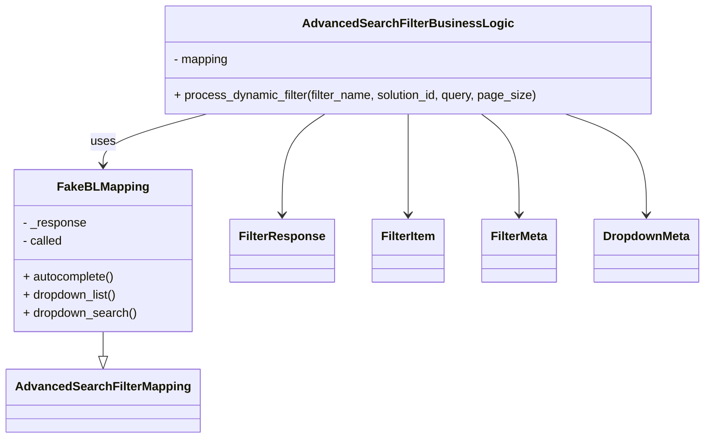

# Diagram: partview_core/partview_service/partview_service/tests/unit/core/business/open_search/test_AdvancedSearchFilterBusinessLogic.py


> Auto-generated by Obscura crawlers

## Diagram 1



### SVG

<svg id="container" width="915.77734375" xmlns="http://www.w3.org/2000/svg" class="classDiagram" height="584" viewBox="0 0 915.77734375 584" role="graphics-document document" aria-roledescription="class"><style>#container{font-family:"trebuchet ms",verdana,arial,sans-serif;font-size:16px;fill:#333;}@keyframes edge-animation-frame{from{stroke-dashoffset:0;}}@keyframes dash{to{stroke-dashoffset:0;}}#container .edge-animation-slow{stroke-dasharray:9,5!important;stroke-dashoffset:900;animation:dash 50s linear infinite;stroke-linecap:round;}#container .edge-animation-fast{stroke-dasharray:9,5!important;stroke-dashoffset:900;animation:dash 20s linear infinite;stroke-linecap:round;}#container .error-icon{fill:#552222;}#container .error-text{fill:#552222;stroke:#552222;}#container .edge-thickness-normal{stroke-width:1px;}#container .edge-thickness-thick{stroke-width:3.5px;}#container .edge-pattern-solid{stroke-dasharray:0;}#container .edge-thickness-invisible{stroke-width:0;fill:none;}#container .edge-pattern-dashed{stroke-dasharray:3;}#container .edge-pattern-dotted{stroke-dasharray:2;}#container .marker{fill:#333333;stroke:#333333;}#container .marker.cross{stroke:#333333;}#container svg{font-family:"trebuchet ms",verdana,arial,sans-serif;font-size:16px;}#container p{margin:0;}#container g.classGroup text{fill:#9370DB;stroke:none;font-family:"trebuchet ms",verdana,arial,sans-serif;font-size:10px;}#container g.classGroup text .title{font-weight:bolder;}#container .nodeLabel,#container .edgeLabel{color:#131300;}#container .edgeLabel .label rect{fill:#ECECFF;}#container .label text{fill:#131300;}#container .labelBkg{background:#ECECFF;}#container .edgeLabel .label span{background:#ECECFF;}#container .classTitle{font-weight:bolder;}#container .node rect,#container .node circle,#container .node ellipse,#container .node polygon,#container .node path{fill:#ECECFF;stroke:#9370DB;stroke-width:1px;}#container .divider{stroke:#9370DB;stroke-width:1;}#container g.clickable{cursor:pointer;}#container g.classGroup rect{fill:#ECECFF;stroke:#9370DB;}#container g.classGroup line{stroke:#9370DB;stroke-width:1;}#container .classLabel .box{stroke:none;stroke-width:0;fill:#ECECFF;opacity:0.5;}#container .classLabel .label{fill:#9370DB;font-size:10px;}#container .relation{stroke:#333333;stroke-width:1;fill:none;}#container .dashed-line{stroke-dasharray:3;}#container .dotted-line{stroke-dasharray:1 2;}#container #compositionStart,#container .composition{fill:#333333!important;stroke:#333333!important;stroke-width:1;}#container #compositionEnd,#container .composition{fill:#333333!important;stroke:#333333!important;stroke-width:1;}#container #dependencyStart,#container .dependency{fill:#333333!important;stroke:#333333!important;stroke-width:1;}#container #dependencyStart,#container .dependency{fill:#333333!important;stroke:#333333!important;stroke-width:1;}#container #extensionStart,#container .extension{fill:transparent!important;stroke:#333333!important;stroke-width:1;}#container #extensionEnd,#container .extension{fill:transparent!important;stroke:#333333!important;stroke-width:1;}#container #aggregationStart,#container .aggregation{fill:transparent!important;stroke:#333333!important;stroke-width:1;}#container #aggregationEnd,#container .aggregation{fill:transparent!important;stroke:#333333!important;stroke-width:1;}#container #lollipopStart,#container .lollipop{fill:#ECECFF!important;stroke:#333333!important;stroke-width:1;}#container #lollipopEnd,#container .lollipop{fill:#ECECFF!important;stroke:#333333!important;stroke-width:1;}#container .edgeTerminals{font-size:11px;line-height:initial;}#container .classTitleText{text-anchor:middle;font-size:18px;fill:#333;}#container .label-icon{display:inline-block;height:1em;overflow:visible;vertical-align:-0.125em;}#container .node .label-icon path{fill:currentColor;stroke:revert;stroke-width:revert;}#container :root{--mermaid-font-family:"trebuchet ms",verdana,arial,sans-serif;}</style><g><defs><marker id="container_class-aggregationStart" class="marker aggregation class" refX="18" refY="7" markerWidth="190" markerHeight="240" orient="auto"><path d="M 18,7 L9,13 L1,7 L9,1 Z"></path></marker></defs><defs><marker id="container_class-aggregationEnd" class="marker aggregation class" refX="1" refY="7" markerWidth="20" markerHeight="28" orient="auto"><path d="M 18,7 L9,13 L1,7 L9,1 Z"></path></marker></defs><defs><marker id="container_class-extensionStart" class="marker extension class" refX="18" refY="7" markerWidth="190" markerHeight="240" orient="auto"><path d="M 1,7 L18,13 V 1 Z"></path></marker></defs><defs><marker id="container_class-extensionEnd" class="marker extension class" refX="1" refY="7" markerWidth="20" markerHeight="28" orient="auto"><path d="M 1,1 V 13 L18,7 Z"></path></marker></defs><defs><marker id="container_class-compositionStart" class="marker composition class" refX="18" refY="7" markerWidth="190" markerHeight="240" orient="auto"><path d="M 18,7 L9,13 L1,7 L9,1 Z"></path></marker></defs><defs><marker id="container_class-compositionEnd" class="marker composition class" refX="1" refY="7" markerWidth="20" markerHeight="28" orient="auto"><path d="M 18,7 L9,13 L1,7 L9,1 Z"></path></marker></defs><defs><marker id="container_class-dependencyStart" class="marker dependency class" refX="6" refY="7" markerWidth="190" markerHeight="240" orient="auto"><path d="M 5,7 L9,13 L1,7 L9,1 Z"></path></marker></defs><defs><marker id="container_class-dependencyEnd" class="marker dependency class" refX="13" refY="7" markerWidth="20" markerHeight="28" orient="auto"><path d="M 18,7 L9,13 L14,7 L9,1 Z"></path></marker></defs><defs><marker id="container_class-lollipopStart" class="marker lollipop class" refX="13" refY="7" markerWidth="190" markerHeight="240" orient="auto"><circle stroke="black" fill="transparent" cx="7" cy="7" r="6"></circle></marker></defs><defs><marker id="container_class-lollipopEnd" class="marker lollipop class" refX="1" refY="7" markerWidth="190" markerHeight="240" orient="auto"><circle stroke="black" fill="transparent" cx="7" cy="7" r="6"></circle></marker></defs><g class="root"><g class="clusters"></g><g class="edgePaths"><path d="M130.422,442L130.422,446.167C130.422,450.333,130.422,458.667,130.422,464.125C130.422,469.583,130.422,472.167,130.422,473.458L130.422,474.75" id="id_FakeBLMapping_AdvancedSearchFilterMapping_1" class="edge-thickness-normal edge-pattern-solid relation" style=";;;" data-edge="true" data-et="edge" data-id="id_FakeBLMapping_AdvancedSearchFilterMapping_1" data-points="W3sieCI6MTMwLjQyMTg3NSwieSI6NDQyfSx7IngiOjEzMC40MjE4NzUsInkiOjQ2N30seyJ4IjoxMzAuNDIxODc1LCJ5Ijo0OTJ9XQ==" marker-end="url(#container_class-extensionEnd)"></path><path d="M265.034,152L242.598,158.167C220.163,164.333,175.292,176.667,152.857,188C130.422,199.333,130.422,209.667,130.422,214.833L130.422,220" id="id_AdvancedSearchFilterBusinessLogic_FakeBLMapping_2" class="edge-thickness-normal edge-pattern-solid relation" style=";;;" data-edge="true" data-et="edge" data-id="id_AdvancedSearchFilterBusinessLogic_FakeBLMapping_2" data-points="W3sieCI6MjY1LjAzMzUwNzc0MDgyNTcsInkiOjE1Mn0seyJ4IjoxMzAuNDIxODc1LCJ5IjoxODl9LHsieCI6MTMwLjQyMTg3NSwieSI6MjI2fV0=" marker-end="url(#container_class-dependencyEnd)"></path><path d="M418.893,152L409.635,158.167C400.378,164.333,381.863,176.667,372.605,199C363.348,221.333,363.348,253.667,363.348,269.833L363.348,286" id="id_AdvancedSearchFilterBusinessLogic_FilterResponse_3" class="edge-thickness-normal edge-pattern-solid relation" style=";;;" data-edge="true" data-et="edge" data-id="id_AdvancedSearchFilterBusinessLogic_FilterResponse_3" data-points="W3sieCI6NDE4Ljg5MjczOTM5MjIwMTg2LCJ5IjoxNTJ9LHsieCI6MzYzLjM0NzY1NjI1LCJ5IjoxODl9LHsieCI6MzYzLjM0NzY1NjI1LCJ5IjoyOTJ9XQ==" marker-end="url(#container_class-dependencyEnd)"></path><path d="M526.98,152L526.98,158.167C526.98,164.333,526.98,176.667,526.98,199C526.98,221.333,526.98,253.667,526.98,269.833L526.98,286" id="id_AdvancedSearchFilterBusinessLogic_FilterItem_4" class="edge-thickness-normal edge-pattern-solid relation" style=";;;" data-edge="true" data-et="edge" data-id="id_AdvancedSearchFilterBusinessLogic_FilterItem_4" data-points="W3sieCI6NTI2Ljk4MDQ2ODc1LCJ5IjoxNTJ9LHsieCI6NTI2Ljk4MDQ2ODc1LCJ5IjoxODl9LHsieCI6NTI2Ljk4MDQ2ODc1LCJ5IjoyOTJ9XQ==" marker-end="url(#container_class-dependencyEnd)"></path><path d="M623.601,152L631.877,158.167C640.152,164.333,656.703,176.667,664.978,199C673.254,221.333,673.254,253.667,673.254,269.833L673.254,286" id="id_AdvancedSearchFilterBusinessLogic_FilterMeta_5" class="edge-thickness-normal edge-pattern-solid relation" style=";;;" data-edge="true" data-et="edge" data-id="id_AdvancedSearchFilterBusinessLogic_FilterMeta_5" data-points="W3sieCI6NjIzLjYwMTQ1NDk4ODUzMjIsInkiOjE1Mn0seyJ4Ijo2NzMuMjUzOTA2MjUsInkiOjE4OX0seyJ4Ijo2NzMuMjUzOTA2MjUsInkiOjI5Mn1d" marker-end="url(#container_class-dependencyEnd)"></path><path d="M733.738,152L751.446,158.167C769.155,164.333,804.571,176.667,822.28,199C839.988,221.333,839.988,253.667,839.988,269.833L839.988,286" id="id_AdvancedSearchFilterBusinessLogic_DropdownMeta_6" class="edge-thickness-normal edge-pattern-solid relation" style=";;;" data-edge="true" data-et="edge" data-id="id_AdvancedSearchFilterBusinessLogic_DropdownMeta_6" data-points="W3sieCI6NzMzLjczNzkyMjg3ODQ0MDQsInkiOjE1Mn0seyJ4Ijo4MzkuOTg4MjgxMjUsInkiOjE4OX0seyJ4Ijo4MzkuOTg4MjgxMjUsInkiOjI5Mn1d" marker-end="url(#container_class-dependencyEnd)"></path></g><g class="edgeLabels"><g class="edgeLabel"><g class="label" data-id="id_FakeBLMapping_AdvancedSearchFilterMapping_1" transform="translate(0, 0)"><foreignObject width="0" height="0"><div xmlns="http://www.w3.org/1999/xhtml" class="labelBkg" style="display: table-cell; white-space: nowrap; line-height: 1.5; max-width: 200px; text-align: center;"><span class="edgeLabel"></span></div></foreignObject></g></g><g class="edgeLabel" transform="translate(130.421875, 189)"><g class="label" data-id="id_AdvancedSearchFilterBusinessLogic_FakeBLMapping_2" transform="translate(-16.4921875, -12)"><foreignObject width="32.984375" height="24"><div xmlns="http://www.w3.org/1999/xhtml" class="labelBkg" style="display: table-cell; white-space: nowrap; line-height: 1.5; max-width: 200px; text-align: center;"><span class="edgeLabel"><p>uses</p></span></div></foreignObject></g></g><g class="edgeLabel"><g class="label" data-id="id_AdvancedSearchFilterBusinessLogic_FilterResponse_3" transform="translate(0, 0)"><foreignObject width="0" height="0"><div xmlns="http://www.w3.org/1999/xhtml" class="labelBkg" style="display: table-cell; white-space: nowrap; line-height: 1.5; max-width: 200px; text-align: center;"><span class="edgeLabel"></span></div></foreignObject></g></g><g class="edgeLabel"><g class="label" data-id="id_AdvancedSearchFilterBusinessLogic_FilterItem_4" transform="translate(0, 0)"><foreignObject width="0" height="0"><div xmlns="http://www.w3.org/1999/xhtml" class="labelBkg" style="display: table-cell; white-space: nowrap; line-height: 1.5; max-width: 200px; text-align: center;"><span class="edgeLabel"></span></div></foreignObject></g></g><g class="edgeLabel"><g class="label" data-id="id_AdvancedSearchFilterBusinessLogic_FilterMeta_5" transform="translate(0, 0)"><foreignObject width="0" height="0"><div xmlns="http://www.w3.org/1999/xhtml" class="labelBkg" style="display: table-cell; white-space: nowrap; line-height: 1.5; max-width: 200px; text-align: center;"><span class="edgeLabel"></span></div></foreignObject></g></g><g class="edgeLabel"><g class="label" data-id="id_AdvancedSearchFilterBusinessLogic_DropdownMeta_6" transform="translate(0, 0)"><foreignObject width="0" height="0"><div xmlns="http://www.w3.org/1999/xhtml" class="labelBkg" style="display: table-cell; white-space: nowrap; line-height: 1.5; max-width: 200px; text-align: center;"><span class="edgeLabel"></span></div></foreignObject></g></g></g><g class="nodes"><g class="node default" id="classId-FakeBLMapping-0" transform="translate(130.421875, 334)"><g class="basic label-container"><path d="M-116.62109375 -108 L116.62109375 -108 L116.62109375 108 L-116.62109375 108" stroke="none" stroke-width="0" fill="#ECECFF" style=""></path><path d="M-116.62109375 -108 C-33.2077940863245 -108, 50.205505577351005 -108, 116.62109375 -108 M-116.62109375 -108 C-34.10939198789207 -108, 48.402309774215865 -108, 116.62109375 -108 M116.62109375 -108 C116.62109375 -54.89893183857792, 116.62109375 -1.7978636771558456, 116.62109375 108 M116.62109375 -108 C116.62109375 -51.63872396910564, 116.62109375 4.7225520617887184, 116.62109375 108 M116.62109375 108 C66.20337486756485 108, 15.785655985129694 108, -116.62109375 108 M116.62109375 108 C40.781228824381245 108, -35.05863610123751 108, -116.62109375 108 M-116.62109375 108 C-116.62109375 42.8531231274648, -116.62109375 -22.293753745070404, -116.62109375 -108 M-116.62109375 108 C-116.62109375 48.34682949969755, -116.62109375 -11.306341000604903, -116.62109375 -108" stroke="#9370DB" stroke-width="1.3" fill="none" stroke-dasharray="0 0" style=""></path></g><g class="annotation-group text" transform="translate(0, -84)"></g><g class="label-group text" transform="translate(-56.9921875, -84)"><g class="label" style="font-weight: bolder" transform="translate(0,-12)"><foreignObject width="113.984375" height="24"><div xmlns="http://www.w3.org/1999/xhtml" style="display: table-cell; white-space: nowrap; line-height: 1.5; max-width: 163px; text-align: center;"><span class="nodeLabel markdown-node-label" style=""><p>FakeBLMapping</p></span></div></foreignObject></g></g><g class="members-group text" transform="translate(-104.62109375, -36)"><g class="label" style="" transform="translate(0,-12)"><foreignObject width="85.3125" height="24"><div xmlns="http://www.w3.org/1999/xhtml" style="display: table-cell; white-space: nowrap; line-height: 1.5; max-width: 143px; text-align: center;"><span class="nodeLabel markdown-node-label" style=""><p>- _response</p></span></div></foreignObject></g><g class="label" style="" transform="translate(0,12)"><foreignObject width="54.3125" height="24"><div xmlns="http://www.w3.org/1999/xhtml" style="display: table-cell; white-space: nowrap; line-height: 1.5; max-width: 112px; text-align: center;"><span class="nodeLabel markdown-node-label" style=""><p>- called</p></span></div></foreignObject></g></g><g class="methods-group text" transform="translate(-104.62109375, 36)"><g class="label" style="" transform="translate(0,-12)"><foreignObject width="122.96875" height="24"><div xmlns="http://www.w3.org/1999/xhtml" style="display: table-cell; white-space: nowrap; line-height: 1.5; max-width: 180px; text-align: center;"><span class="nodeLabel markdown-node-label" style=""><p>+ autocomplete()</p></span></div></foreignObject></g><g class="label" style="" transform="translate(0,12)"><foreignObject width="127.078125" height="24"><div xmlns="http://www.w3.org/1999/xhtml" style="display: table-cell; white-space: nowrap; line-height: 1.5; max-width: 184px; text-align: center;"><span class="nodeLabel markdown-node-label" style=""><p>+ dropdown_list()</p></span></div></foreignObject></g><g class="label" style="" transform="translate(0,36)"><foreignObject width="152.25" height="24"><div xmlns="http://www.w3.org/1999/xhtml" style="display: table-cell; white-space: nowrap; line-height: 1.5; max-width: 210px; text-align: center;"><span class="nodeLabel markdown-node-label" style=""><p>+ dropdown_search()</p></span></div></foreignObject></g></g><g class="divider" style=""><path d="M-116.62109375 -60 C-50.12806001583188 -60, 16.364973718336245 -60, 116.62109375 -60 M-116.62109375 -60 C-46.72302905488456 -60, 23.175035640230874 -60, 116.62109375 -60" stroke="#9370DB" stroke-width="1.3" fill="none" stroke-dasharray="0 0" style=""></path></g><g class="divider" style=""><path d="M-116.62109375 12 C-49.655293833971115 12, 17.31050608205777 12, 116.62109375 12 M-116.62109375 12 C-34.384779232042305 12, 47.85153528591539 12, 116.62109375 12" stroke="#9370DB" stroke-width="1.3" fill="none" stroke-dasharray="0 0" style=""></path></g></g><g class="node default" id="classId-AdvancedSearchFilterMapping-1" transform="translate(130.421875, 534)"><g class="basic label-container"><path d="M-122.421875 -42 L122.421875 -42 L122.421875 42 L-122.421875 42" stroke="none" stroke-width="0" fill="#ECECFF" style=""></path><path d="M-122.421875 -42 C-53.15385326738354 -42, 16.114168465232922 -42, 122.421875 -42 M-122.421875 -42 C-43.10062691727414 -42, 36.22062116545172 -42, 122.421875 -42 M122.421875 -42 C122.421875 -15.50570446003644, 122.421875 10.988591079927119, 122.421875 42 M122.421875 -42 C122.421875 -11.72208422235503, 122.421875 18.55583155528994, 122.421875 42 M122.421875 42 C64.94501784033255 42, 7.468160680665122 42, -122.421875 42 M122.421875 42 C56.562092261141515 42, -9.29769047771697 42, -122.421875 42 M-122.421875 42 C-122.421875 12.681615353467393, -122.421875 -16.636769293065214, -122.421875 -42 M-122.421875 42 C-122.421875 12.822728980452496, -122.421875 -16.35454203909501, -122.421875 -42" stroke="#9370DB" stroke-width="1.3" fill="none" stroke-dasharray="0 0" style=""></path></g><g class="annotation-group text" transform="translate(0, -18)"></g><g class="label-group text" transform="translate(-110.421875, -18)"><g class="label" style="font-weight: bolder" transform="translate(0,-12)"><foreignObject width="220.84375" height="24"><div xmlns="http://www.w3.org/1999/xhtml" style="display: table-cell; white-space: nowrap; line-height: 1.5; max-width: 269px; text-align: center;"><span class="nodeLabel markdown-node-label" style=""><p>AdvancedSearchFilterMapping</p></span></div></foreignObject></g></g><g class="members-group text" transform="translate(-110.421875, 30)"></g><g class="methods-group text" transform="translate(-110.421875, 60)"></g><g class="divider" style=""><path d="M-122.421875 6 C-68.77386990654736 6, -15.125864813094708 6, 122.421875 6 M-122.421875 6 C-37.24734923479009 6, 47.927176530419814 6, 122.421875 6" stroke="#9370DB" stroke-width="1.3" fill="none" stroke-dasharray="0 0" style=""></path></g><g class="divider" style=""><path d="M-122.421875 24 C-52.6785267489999 24, 17.0648215020002 24, 122.421875 24 M-122.421875 24 C-67.70271792507084 24, -12.983560850141686 24, 122.421875 24" stroke="#9370DB" stroke-width="1.3" fill="none" stroke-dasharray="0 0" style=""></path></g></g><g class="node default" id="classId-AdvancedSearchFilterBusinessLogic-2" transform="translate(526.98046875, 80)"><g class="basic label-container"><path d="M-321.56640625 -72 L321.56640625 -72 L321.56640625 72 L-321.56640625 72" stroke="none" stroke-width="0" fill="#ECECFF" style=""></path><path d="M-321.56640625 -72 C-177.0301177623522 -72, -32.49382927470441 -72, 321.56640625 -72 M-321.56640625 -72 C-147.71631801178216 -72, 26.133770226435672 -72, 321.56640625 -72 M321.56640625 -72 C321.56640625 -25.438756921304773, 321.56640625 21.122486157390455, 321.56640625 72 M321.56640625 -72 C321.56640625 -39.722851453330804, 321.56640625 -7.445702906661609, 321.56640625 72 M321.56640625 72 C176.6849578305226 72, 31.803509411045184 72, -321.56640625 72 M321.56640625 72 C146.39610634490188 72, -28.774193560196238 72, -321.56640625 72 M-321.56640625 72 C-321.56640625 33.58467071217786, -321.56640625 -4.830658575644279, -321.56640625 -72 M-321.56640625 72 C-321.56640625 14.72375511301206, -321.56640625 -42.55248977397588, -321.56640625 -72" stroke="#9370DB" stroke-width="1.3" fill="none" stroke-dasharray="0 0" style=""></path></g><g class="annotation-group text" transform="translate(0, -48)"></g><g class="label-group text" transform="translate(-130.3203125, -48)"><g class="label" style="font-weight: bolder" transform="translate(0,-12)"><foreignObject width="260.640625" height="24"><div xmlns="http://www.w3.org/1999/xhtml" style="display: table-cell; white-space: nowrap; line-height: 1.5; max-width: 307px; text-align: center;"><span class="nodeLabel markdown-node-label" style=""><p>AdvancedSearchFilterBusinessLogic</p></span></div></foreignObject></g></g><g class="members-group text" transform="translate(-309.56640625, 0)"><g class="label" style="" transform="translate(0,-12)"><foreignObject width="74.328125" height="24"><div xmlns="http://www.w3.org/1999/xhtml" style="display: table-cell; white-space: nowrap; line-height: 1.5; max-width: 132px; text-align: center;"><span class="nodeLabel markdown-node-label" style=""><p>- mapping</p></span></div></foreignObject></g></g><g class="methods-group text" transform="translate(-309.56640625, 48)"><g class="label" style="" transform="translate(0,-12)"><foreignObject width="488.8125" height="24"><div xmlns="http://www.w3.org/1999/xhtml" style="display: table-cell; white-space: nowrap; line-height: 1.5; max-width: 546px; text-align: center;"><span class="nodeLabel markdown-node-label" style=""><p>+ process_dynamic_filter(filter_name, solution_id, query, page_size)</p></span></div></foreignObject></g></g><g class="divider" style=""><path d="M-321.56640625 -24 C-120.09185099508434 -24, 81.38270425983131 -24, 321.56640625 -24 M-321.56640625 -24 C-156.71105148807695 -24, 8.144303273846106 -24, 321.56640625 -24" stroke="#9370DB" stroke-width="1.3" fill="none" stroke-dasharray="0 0" style=""></path></g><g class="divider" style=""><path d="M-321.56640625 24 C-163.9200740327354 24, -6.273741815470828 24, 321.56640625 24 M-321.56640625 24 C-126.04447589030312 24, 69.47745446939376 24, 321.56640625 24" stroke="#9370DB" stroke-width="1.3" fill="none" stroke-dasharray="0 0" style=""></path></g></g><g class="node default" id="classId-FilterResponse-3" transform="translate(363.34765625, 334)"><g class="basic label-container"><path d="M-66.3046875 -42 L66.3046875 -42 L66.3046875 42 L-66.3046875 42" stroke="none" stroke-width="0" fill="#ECECFF" style=""></path><path d="M-66.3046875 -42 C-25.489083298484758 -42, 15.326520903030485 -42, 66.3046875 -42 M-66.3046875 -42 C-13.942138487450698 -42, 38.4204105250986 -42, 66.3046875 -42 M66.3046875 -42 C66.3046875 -17.056503981433984, 66.3046875 7.886992037132032, 66.3046875 42 M66.3046875 -42 C66.3046875 -21.368528847463878, 66.3046875 -0.7370576949277563, 66.3046875 42 M66.3046875 42 C20.763503984754756 42, -24.777679530490488 42, -66.3046875 42 M66.3046875 42 C19.816425556256476 42, -26.671836387487048 42, -66.3046875 42 M-66.3046875 42 C-66.3046875 17.967799353381796, -66.3046875 -6.064401293236408, -66.3046875 -42 M-66.3046875 42 C-66.3046875 14.21860888346366, -66.3046875 -13.562782233072681, -66.3046875 -42" stroke="#9370DB" stroke-width="1.3" fill="none" stroke-dasharray="0 0" style=""></path></g><g class="annotation-group text" transform="translate(0, -18)"></g><g class="label-group text" transform="translate(-54.3046875, -18)"><g class="label" style="font-weight: bolder" transform="translate(0,-12)"><foreignObject width="108.609375" height="24"><div xmlns="http://www.w3.org/1999/xhtml" style="display: table-cell; white-space: nowrap; line-height: 1.5; max-width: 157px; text-align: center;"><span class="nodeLabel markdown-node-label" style=""><p>FilterResponse</p></span></div></foreignObject></g></g><g class="members-group text" transform="translate(-54.3046875, 30)"></g><g class="methods-group text" transform="translate(-54.3046875, 60)"></g><g class="divider" style=""><path d="M-66.3046875 6 C-35.9936476255493 6, -5.682607751098594 6, 66.3046875 6 M-66.3046875 6 C-31.695640948350693 6, 2.9134056032986138 6, 66.3046875 6" stroke="#9370DB" stroke-width="1.3" fill="none" stroke-dasharray="0 0" style=""></path></g><g class="divider" style=""><path d="M-66.3046875 24 C-30.926592943943852 24, 4.4515016121122954 24, 66.3046875 24 M-66.3046875 24 C-16.04184349546999 24, 34.22100050906002 24, 66.3046875 24" stroke="#9370DB" stroke-width="1.3" fill="none" stroke-dasharray="0 0" style=""></path></g></g><g class="node default" id="classId-FilterItem-4" transform="translate(526.98046875, 334)"><g class="basic label-container"><path d="M-47.328125 -42 L47.328125 -42 L47.328125 42 L-47.328125 42" stroke="none" stroke-width="0" fill="#ECECFF" style=""></path><path d="M-47.328125 -42 C-26.827577721623705 -42, -6.327030443247409 -42, 47.328125 -42 M-47.328125 -42 C-26.060358782635237 -42, -4.792592565270475 -42, 47.328125 -42 M47.328125 -42 C47.328125 -8.591901253061181, 47.328125 24.816197493877638, 47.328125 42 M47.328125 -42 C47.328125 -10.197442314222108, 47.328125 21.605115371555783, 47.328125 42 M47.328125 42 C24.999627549630507 42, 2.6711300992610134 42, -47.328125 42 M47.328125 42 C24.679029322172383 42, 2.0299336443447658 42, -47.328125 42 M-47.328125 42 C-47.328125 17.44698098852092, -47.328125 -7.10603802295816, -47.328125 -42 M-47.328125 42 C-47.328125 21.06591402992302, -47.328125 0.1318280598460433, -47.328125 -42" stroke="#9370DB" stroke-width="1.3" fill="none" stroke-dasharray="0 0" style=""></path></g><g class="annotation-group text" transform="translate(0, -18)"></g><g class="label-group text" transform="translate(-35.328125, -18)"><g class="label" style="font-weight: bolder" transform="translate(0,-12)"><foreignObject width="70.65625" height="24"><div xmlns="http://www.w3.org/1999/xhtml" style="display: table-cell; white-space: nowrap; line-height: 1.5; max-width: 120px; text-align: center;"><span class="nodeLabel markdown-node-label" style=""><p>FilterItem</p></span></div></foreignObject></g></g><g class="members-group text" transform="translate(-35.328125, 30)"></g><g class="methods-group text" transform="translate(-35.328125, 60)"></g><g class="divider" style=""><path d="M-47.328125 6 C-13.979745773057537 6, 19.368633453884925 6, 47.328125 6 M-47.328125 6 C-25.454839533798122 6, -3.581554067596244 6, 47.328125 6" stroke="#9370DB" stroke-width="1.3" fill="none" stroke-dasharray="0 0" style=""></path></g><g class="divider" style=""><path d="M-47.328125 24 C-21.899682706484487 24, 3.5287595870310255 24, 47.328125 24 M-47.328125 24 C-23.140498577824317 24, 1.0471278443513654 24, 47.328125 24" stroke="#9370DB" stroke-width="1.3" fill="none" stroke-dasharray="0 0" style=""></path></g></g><g class="node default" id="classId-FilterMeta-5" transform="translate(673.25390625, 334)"><g class="basic label-container"><path d="M-48.9453125 -42 L48.9453125 -42 L48.9453125 42 L-48.9453125 42" stroke="none" stroke-width="0" fill="#ECECFF" style=""></path><path d="M-48.9453125 -42 C-17.636340200345664 -42, 13.672632099308672 -42, 48.9453125 -42 M-48.9453125 -42 C-11.32240481153729 -42, 26.30050287692542 -42, 48.9453125 -42 M48.9453125 -42 C48.9453125 -12.528980604392522, 48.9453125 16.942038791214955, 48.9453125 42 M48.9453125 -42 C48.9453125 -17.566536677253737, 48.9453125 6.866926645492526, 48.9453125 42 M48.9453125 42 C26.36883624407409 42, 3.7923599881481778 42, -48.9453125 42 M48.9453125 42 C16.92626349540643 42, -15.092785509187138 42, -48.9453125 42 M-48.9453125 42 C-48.9453125 16.40621862885421, -48.9453125 -9.187562742291583, -48.9453125 -42 M-48.9453125 42 C-48.9453125 13.022787074764292, -48.9453125 -15.954425850471416, -48.9453125 -42" stroke="#9370DB" stroke-width="1.3" fill="none" stroke-dasharray="0 0" style=""></path></g><g class="annotation-group text" transform="translate(0, -18)"></g><g class="label-group text" transform="translate(-36.9453125, -18)"><g class="label" style="font-weight: bolder" transform="translate(0,-12)"><foreignObject width="73.890625" height="24"><div xmlns="http://www.w3.org/1999/xhtml" style="display: table-cell; white-space: nowrap; line-height: 1.5; max-width: 122px; text-align: center;"><span class="nodeLabel markdown-node-label" style=""><p>FilterMeta</p></span></div></foreignObject></g></g><g class="members-group text" transform="translate(-36.9453125, 30)"></g><g class="methods-group text" transform="translate(-36.9453125, 60)"></g><g class="divider" style=""><path d="M-48.9453125 6 C-23.534642907947692 6, 1.876026684104616 6, 48.9453125 6 M-48.9453125 6 C-12.498634367242012 6, 23.948043765515976 6, 48.9453125 6" stroke="#9370DB" stroke-width="1.3" fill="none" stroke-dasharray="0 0" style=""></path></g><g class="divider" style=""><path d="M-48.9453125 24 C-9.995258108925292 24, 28.954796282149417 24, 48.9453125 24 M-48.9453125 24 C-18.992054271997535 24, 10.96120395600493 24, 48.9453125 24" stroke="#9370DB" stroke-width="1.3" fill="none" stroke-dasharray="0 0" style=""></path></g></g><g class="node default" id="classId-DropdownMeta-6" transform="translate(839.98828125, 334)"><g class="basic label-container"><path d="M-67.7890625 -42 L67.7890625 -42 L67.7890625 42 L-67.7890625 42" stroke="none" stroke-width="0" fill="#ECECFF" style=""></path><path d="M-67.7890625 -42 C-27.285606914540146 -42, 13.217848670919707 -42, 67.7890625 -42 M-67.7890625 -42 C-26.999482161853223 -42, 13.790098176293554 -42, 67.7890625 -42 M67.7890625 -42 C67.7890625 -10.771285608251361, 67.7890625 20.457428783497278, 67.7890625 42 M67.7890625 -42 C67.7890625 -10.032677363058596, 67.7890625 21.934645273882808, 67.7890625 42 M67.7890625 42 C18.816216155626158 42, -30.156630188747684 42, -67.7890625 42 M67.7890625 42 C34.55600262726502 42, 1.3229427545300467 42, -67.7890625 42 M-67.7890625 42 C-67.7890625 21.09706637484648, -67.7890625 0.19413274969296168, -67.7890625 -42 M-67.7890625 42 C-67.7890625 8.668085662794645, -67.7890625 -24.66382867441071, -67.7890625 -42" stroke="#9370DB" stroke-width="1.3" fill="none" stroke-dasharray="0 0" style=""></path></g><g class="annotation-group text" transform="translate(0, -18)"></g><g class="label-group text" transform="translate(-55.7890625, -18)"><g class="label" style="font-weight: bolder" transform="translate(0,-12)"><foreignObject width="111.578125" height="24"><div xmlns="http://www.w3.org/1999/xhtml" style="display: table-cell; white-space: nowrap; line-height: 1.5; max-width: 160px; text-align: center;"><span class="nodeLabel markdown-node-label" style=""><p>DropdownMeta</p></span></div></foreignObject></g></g><g class="members-group text" transform="translate(-55.7890625, 30)"></g><g class="methods-group text" transform="translate(-55.7890625, 60)"></g><g class="divider" style=""><path d="M-67.7890625 6 C-23.130743261337827 6, 21.527575977324346 6, 67.7890625 6 M-67.7890625 6 C-35.80523858657531 6, -3.8214146731506133 6, 67.7890625 6" stroke="#9370DB" stroke-width="1.3" fill="none" stroke-dasharray="0 0" style=""></path></g><g class="divider" style=""><path d="M-67.7890625 24 C-20.519319720945568 24, 26.750423058108865 24, 67.7890625 24 M-67.7890625 24 C-29.76246621007106 24, 8.264130079857878 24, 67.7890625 24" stroke="#9370DB" stroke-width="1.3" fill="none" stroke-dasharray="0 0" style=""></path></g></g></g></g></g></svg>

## Diagram 2

```mermaid
flowchart TD
A[process_dynamic_filter(filter_name, solution_id, query, page_size)] --> B{filter_name matches}
B -->|shipment-id\npart-number\norder-number\ntracking-number\nbill-of-lading| C[call mapping.autocomplete()]
B -->|origin\ndestination\ncarrier\norder-priority-list\ncurrent-location\nfinal-mile-origin\nparts\ntrailer-equipment-number (query is None)| D[call mapping.dropdown_list()]
B -->|origin\ndestination\ncarrier\norder-priority-list\ncurrent-location\nfinal-mile-origin\nparts\ntrailer-equipment-number (query provided)| E[call mapping.dropdown_search()]
C --> F[receive FilterResponse]
D --> F
E --> F
F --> G{meta.searchAfter present?}
G -->|yes| H[serialize meta.searchAfter into out.meta_dict["searchAfter"]]
G -->|no| I[return result without searchAfter]
```

> SVG rendering failed for this diagram.
