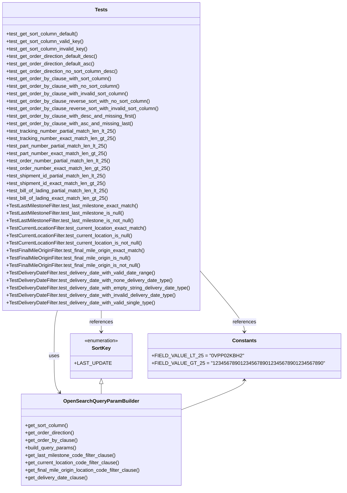

# Diagram: partview_core/partview_service/partview_service/tests/unit/core/business/open_search/test_OpenSearchQueryParamBuilder.py

> Auto-generated by Obscura crawlers

## Mermaid

### SVG

<svg id="container" width="1034.5625" xmlns="http://www.w3.org/2000/svg" class="classDiagram" height="1568" viewBox="0 0 1034.5625 1568" role="graphics-document document" aria-roledescription="class"><g><defs><marker id="container_class-aggregationStart" class="marker aggregation class" refX="18" refY="7" markerWidth="190" markerHeight="240" orient="auto"><path d="M 18,7 L9,13 L1,7 L9,1 Z"></path></marker></defs><defs><marker id="container_class-aggregationEnd" class="marker aggregation class" refX="1" refY="7" markerWidth="20" markerHeight="28" orient="auto"><path d="M 18,7 L9,13 L1,7 L9,1 Z"></path></marker></defs><defs><marker id="container_class-extensionStart" class="marker extension class" refX="18" refY="7" markerWidth="190" markerHeight="240" orient="auto"><path d="M 1,7 L18,13 V 1 Z"></path></marker></defs><defs><marker id="container_class-extensionEnd" class="marker extension class" refX="1" refY="7" markerWidth="20" markerHeight="28" orient="auto"><path d="M 1,1 V 13 L18,7 Z"></path></marker></defs><defs><marker id="container_class-compositionStart" class="marker composition class" refX="18" refY="7" markerWidth="190" markerHeight="240" orient="auto"><path d="M 18,7 L9,13 L1,7 L9,1 Z"></path></marker></defs><defs><marker id="container_class-compositionEnd" class="marker composition class" refX="1" refY="7" markerWidth="20" markerHeight="28" orient="auto"><path d="M 18,7 L9,13 L1,7 L9,1 Z"></path></marker></defs><defs><marker id="container_class-dependencyStart" class="marker dependency class" refX="6" refY="7" markerWidth="190" markerHeight="240" orient="auto"><path d="M 5,7 L9,13 L1,7 L9,1 Z"></path></marker></defs><defs><marker id="container_class-dependencyEnd" class="marker dependency class" refX="13" refY="7" markerWidth="20" markerHeight="28" orient="auto"><path d="M 18,7 L9,13 L14,7 L9,1 Z"></path></marker></defs><defs><marker id="container_class-lollipopStart" class="marker lollipop class" refX="13" refY="7" markerWidth="190" markerHeight="240" orient="auto"><circle stroke="black" fill="transparent" cx="7" cy="7" r="6"></circle></marker></defs><defs><marker id="container_class-lollipopEnd" class="marker lollipop class" refX="1" refY="7" markerWidth="190" markerHeight="240" orient="auto"><circle stroke="black" fill="transparent" cx="7" cy="7" r="6"></circle></marker></defs><g class="root"><g class="clusters"></g><g class="edgePaths"><path d="M195.677,998L194.016,1004.167C192.355,1010.333,189.033,1022.667,187.372,1047C185.711,1071.333,185.711,1107.667,185.711,1142C185.711,1176.333,185.711,1208.667,188.542,1228.232C191.373,1247.797,197.036,1254.593,199.867,1257.992L202.698,1261.39" id="id_Tests_OpenSearchQueryParamBuilder_1" class="edge-thickness-normal edge-pattern-solid relation" style=";;;" data-edge="true" data-et="edge" data-id="id_Tests_OpenSearchQueryParamBuilder_1" data-points="W3sieCI6MTk1LjY3NjgwMTg2Nzk1MTEzLCJ5Ijo5OTh9LHsieCI6MTg1LjcxMDkzNzUsInkiOjEwMzV9LHsieCI6MTg1LjcxMDkzNzUsInkiOjExNDR9LHsieCI6MTg1LjcxMDkzNzUsInkiOjEyNDF9LHsieCI6MjA2LjUzODQwMzg4ODA4MTQsInkiOjEyNjZ9XQ==" marker-end="url(#container_class-dependencyEnd)"></path><path d="M329.004,998L329.004,1004.167C329.004,1010.333,329.004,1022.667,329.004,1034C329.004,1045.333,329.004,1055.667,329.004,1060.833L329.004,1066" id="id_Tests_SortKey_2" class="edge-thickness-normal edge-pattern-solid relation" style=";;;" data-edge="true" data-et="edge" data-id="id_Tests_SortKey_2" data-points="W3sieCI6MzI5LjAwMzkwNjI1LCJ5Ijo5OTh9LHsieCI6MzI5LjAwMzkwNjI1LCJ5IjoxMDM1fSx7IngiOjMyOS4wMDM5MDYyNSwieSI6MTA3Mn1d" marker-end="url(#container_class-dependencyEnd)"></path><path d="M650.008,909.915L666.454,930.763C682.9,951.61,715.792,993.305,732.238,1019.319C748.684,1045.333,748.684,1055.667,748.684,1060.833L748.684,1066" id="id_Tests_Constants_3" class="edge-thickness-normal edge-pattern-solid relation" style=";;;" data-edge="true" data-et="edge" data-id="id_Tests_Constants_3" data-points="W3sieCI6NjUwLjAwNzgxMjUsInkiOjkwOS45MTUyODEzNzE1ODE3fSx7IngiOjc0OC42ODM1OTM3NSwieSI6MTAzNX0seyJ4Ijo3NDguNjgzNTkzNzUsInkiOjEwNzJ9XQ==" marker-end="url(#container_class-dependencyEnd)"></path><path d="M329.004,1233.25L329.004,1234.542C329.004,1235.833,329.004,1238.417,329.004,1243.875C329.004,1249.333,329.004,1257.667,329.004,1261.833L329.004,1266" id="id_SortKey_OpenSearchQueryParamBuilder_4" class="edge-thickness-normal edge-pattern-solid relation" style=";;;" data-edge="true" data-et="edge" data-id="id_SortKey_OpenSearchQueryParamBuilder_4" data-points="W3sieCI6MzI5LjAwMzkwNjI1LCJ5IjoxMjE2fSx7IngiOjMyOS4wMDM5MDYyNSwieSI6MTI0MX0seyJ4IjozMjkuMDAzOTA2MjUsInkiOjEyNjZ9XQ==" marker-start="url(#container_class-extensionStart)"></path><path d="M748.684,1222L748.684,1225.167C748.684,1228.333,748.684,1234.667,721.674,1248.903C694.665,1263.139,640.647,1285.277,613.638,1296.347L586.629,1307.416" id="id_Constants_OpenSearchQueryParamBuilder_5" class="edge-thickness-normal edge-pattern-solid relation" style=";;;" data-edge="true" data-et="edge" data-id="id_Constants_OpenSearchQueryParamBuilder_5" data-points="W3sieCI6NzQ4LjY4MzU5Mzc1LCJ5IjoxMjE2fSx7IngiOjc0OC42ODM1OTM3NSwieSI6MTI0MX0seyJ4Ijo1ODYuNjI4OTA2MjUsInkiOjEzMDcuNDE1OTA0OTg3MDYyM31d" marker-start="url(#container_class-dependencyStart)"></path></g><g class="edgeLabels"><g class="edgeLabel" transform="translate(185.7109375, 1144)"><g class="label" data-id="id_Tests_OpenSearchQueryParamBuilder_1" transform="translate(-16.4921875, -12)"><foreignObject width="32.984375" height="24">

uses

</foreignObject></g></g><g class="edgeLabel" transform="translate(329.00390625, 1035)"><g class="label" data-id="id_Tests_SortKey_2" transform="translate(-37.828125, -12)"><foreignObject width="75.65625" height="24">

references

</foreignObject></g></g><g class="edgeLabel" transform="translate(748.68359375, 1035)"><g class="label" data-id="id_Tests_Constants_3" transform="translate(-37.828125, -12)"><foreignObject width="75.65625" height="24">

references

</foreignObject></g></g><g class="edgeLabel"><g class="label" data-id="id_SortKey_OpenSearchQueryParamBuilder_4" transform="translate(0, 0)"><foreignObject width="0" height="0">

</foreignObject></g></g><g class="edgeLabel"><g class="label" data-id="id_Constants_OpenSearchQueryParamBuilder_5" transform="translate(0, 0)"><foreignObject width="0" height="0">

</foreignObject></g></g></g><g class="nodes"><g class="node default" id="classId-OpenSearchQueryParamBuilder-0" transform="translate(329.00390625, 1413)"><g class="basic label-container"><path d="M-257.625 -147 L257.625 -147 L257.625 147 L-257.625 147" stroke="none" stroke-width="0" fill="#ECECFF" style=""></path><path d="M-257.625 -147 C-126.9986143580135 -147, 3.6277712839730043 -147, 257.625 -147 M-257.625 -147 C-83.57909345412779 -147, 90.46681309174443 -147, 257.625 -147 M257.625 -147 C257.625 -46.44769189648133, 257.625 54.10461620703734, 257.625 147 M257.625 -147 C257.625 -45.742092553151366, 257.625 55.51581489369727, 257.625 147 M257.625 147 C124.71393934625058 147, -8.197121307498833 147, -257.625 147 M257.625 147 C153.0760023817224 147, 48.52700476344481 147, -257.625 147 M-257.625 147 C-257.625 69.31356985681883, -257.625 -8.37286028636234, -257.625 -147 M-257.625 147 C-257.625 40.492832955987396, -257.625 -66.01433408802521, -257.625 -147" stroke="#9370DB" stroke-width="1.3" fill="none" stroke-dasharray="0 0" style=""></path></g><g class="annotation-group text" transform="translate(0, -123)"></g><g class="label-group text" transform="translate(-115.28125, -123)"><g class="label" style="font-weight: bolder" transform="translate(0,-12)"><foreignObject width="230.5625" height="24">

OpenSearchQueryParamBuilder

</foreignObject></g></g><g class="members-group text" transform="translate(-245.625, -75)"></g><g class="methods-group text" transform="translate(-245.625, -45)"><g class="label" style="" transform="translate(0,-12)"><foreignObject width="139.765625" height="24">

+get_sort_column()

</foreignObject></g><g class="label" style="" transform="translate(0,12)"><foreignObject width="160.296875" height="24">

+get_order_direction()

</foreignObject></g><g class="label" style="" transform="translate(0,36)"><foreignObject width="166.765625" height="24">

+get_order_by_clause()

</foreignObject></g><g class="label" style="" transform="translate(0,60)"><foreignObject width="166.90625" height="24">

+build_query_params()

</foreignObject></g><g class="label" style="" transform="translate(0,84)"><foreignObject width="293.625" height="24">

+get_last_milestone_code_filter_clause()

</foreignObject></g><g class="label" style="" transform="translate(0,108)"><foreignObject width="306.921875" height="24">

+get_current_location_code_filter_clause()

</foreignObject></g><g class="label" style="" transform="translate(0,132)"><foreignObject width="375.96875" height="24">

+get_final_mile_origin_location_code_filter_clause()

</foreignObject></g><g class="label" style="" transform="translate(0,156)"><foreignObject width="201.171875" height="24">

+get_delivery_date_clause()

</foreignObject></g></g><g class="divider" style=""><path d="M-257.625 -99 C-92.3826826935246 -99, 72.8596346129508 -99, 257.625 -99 M-257.625 -99 C-108.07048373325549 -99, 41.48403253348903 -99, 257.625 -99" stroke="#9370DB" stroke-width="1.3" fill="none" stroke-dasharray="0 0" style=""></path></g><g class="divider" style=""><path d="M-257.625 -75 C-57.1027084070013 -75, 143.4195831859974 -75, 257.625 -75 M-257.625 -75 C-78.6678925795488 -75, 100.28921484090239 -75, 257.625 -75" stroke="#9370DB" stroke-width="1.3" fill="none" stroke-dasharray="0 0" style=""></path></g></g><g class="node default" id="classId-SortKey-1" transform="translate(329.00390625, 1144)"><g class="basic label-container"><path d="M-91.80078125 -72 L91.80078125 -72 L91.80078125 72 L-91.80078125 72" stroke="none" stroke-width="0" fill="#ECECFF" style=""></path><path d="M-91.80078125 -72 C-44.734741438470444 -72, 2.331298373059113 -72, 91.80078125 -72 M-91.80078125 -72 C-45.042884258815555 -72, 1.7150127323688906 -72, 91.80078125 -72 M91.80078125 -72 C91.80078125 -25.77745803720645, 91.80078125 20.4450839255871, 91.80078125 72 M91.80078125 -72 C91.80078125 -36.14020085691934, 91.80078125 -0.2804017138386854, 91.80078125 72 M91.80078125 72 C47.753070701932295 72, 3.7053601538645893 72, -91.80078125 72 M91.80078125 72 C40.97384492443927 72, -9.85309140112146 72, -91.80078125 72 M-91.80078125 72 C-91.80078125 34.09305489961382, -91.80078125 -3.813890200772363, -91.80078125 -72 M-91.80078125 72 C-91.80078125 16.283222360593435, -91.80078125 -39.43355527881313, -91.80078125 -72" stroke="#9370DB" stroke-width="1.3" fill="none" stroke-dasharray="0 0" style=""></path></g><g class="annotation-group text" transform="translate(-55.5546875, -48)"><g class="label" style="" transform="translate(0,-12)"><foreignObject width="111.109375" height="24">

«enumeration»

</foreignObject></g></g><g class="label-group text" transform="translate(-28.9609375, -24)"><g class="label" style="font-weight: bolder" transform="translate(0,-12)"><foreignObject width="57.921875" height="24">

SortKey

</foreignObject></g></g><g class="members-group text" transform="translate(-79.80078125, 24)"><g class="label" style="" transform="translate(0,-12)"><foreignObject width="104.046875" height="24">

+LAST_UPDATE

</foreignObject></g></g><g class="methods-group text" transform="translate(-79.80078125, 72)"></g><g class="divider" style=""><path d="M-91.80078125 0 C-20.882344660116644 0, 50.03609192976671 0, 91.80078125 0 M-91.80078125 0 C-50.86223648562893 0, -9.923691721257853 0, 91.80078125 0" stroke="#9370DB" stroke-width="1.3" fill="none" stroke-dasharray="0 0" style=""></path></g><g class="divider" style=""><path d="M-91.80078125 48 C-43.14981183171486 48, 5.501157586570287 48, 91.80078125 48 M-91.80078125 48 C-37.846533878360816 48, 16.107713493278368 48, 91.80078125 48" stroke="#9370DB" stroke-width="1.3" fill="none" stroke-dasharray="0 0" style=""></path></g></g><g class="node default" id="classId-Constants-2" transform="translate(748.68359375, 1144)"><g class="basic label-container"><path d="M-277.87890625 -72 L277.87890625 -72 L277.87890625 72 L-277.87890625 72" stroke="none" stroke-width="0" fill="#ECECFF" style=""></path><path d="M-277.87890625 -72 C-144.98927684210219 -72, -12.099647434204371 -72, 277.87890625 -72 M-277.87890625 -72 C-147.26023804217832 -72, -16.64156983435663 -72, 277.87890625 -72 M277.87890625 -72 C277.87890625 -28.763000888448232, 277.87890625 14.473998223103536, 277.87890625 72 M277.87890625 -72 C277.87890625 -35.827786205098285, 277.87890625 0.3444275898034306, 277.87890625 72 M277.87890625 72 C105.55047632530173 72, -66.77795359939654 72, -277.87890625 72 M277.87890625 72 C159.67336185605075 72, 41.467817462101465 72, -277.87890625 72 M-277.87890625 72 C-277.87890625 17.1228231288311, -277.87890625 -37.7543537423378, -277.87890625 -72 M-277.87890625 72 C-277.87890625 32.55826728726078, -277.87890625 -6.883465425478434, -277.87890625 -72" stroke="#9370DB" stroke-width="1.3" fill="none" stroke-dasharray="0 0" style=""></path></g><g class="annotation-group text" transform="translate(0, -48)"></g><g class="label-group text" transform="translate(-36.5390625, -48)"><g class="label" style="font-weight: bolder" transform="translate(0,-12)"><foreignObject width="73.078125" height="24">

Constants

</foreignObject></g></g><g class="members-group text" transform="translate(-265.87890625, 0)"><g class="label" style="" transform="translate(0,-12)"><foreignObject width="265.640625" height="24">

+FIELD_VALUE_LT_25 = "0VPP02KBH2"

</foreignObject></g><g class="label" style="" transform="translate(0,12)"><foreignObject width="495.21875" height="24">

+FIELD_VALUE_GT_25 = "1234567890123456789012345678901234567890"

</foreignObject></g></g><g class="methods-group text" transform="translate(-265.87890625, 72)"></g><g class="divider" style=""><path d="M-277.87890625 -24 C-140.32341998156295 -24, -2.767933713125899 -24, 277.87890625 -24 M-277.87890625 -24 C-90.00347101839097 -24, 97.87196421321806 -24, 277.87890625 -24" stroke="#9370DB" stroke-width="1.3" fill="none" stroke-dasharray="0 0" style=""></path></g><g class="divider" style=""><path d="M-277.87890625 48 C-79.37704251261866 48, 119.12482122476268 48, 277.87890625 48 M-277.87890625 48 C-81.82057510449388 48, 114.23775604101223 48, 277.87890625 48" stroke="#9370DB" stroke-width="1.3" fill="none" stroke-dasharray="0 0" style=""></path></g></g><g class="node default" id="classId-Tests-3" transform="translate(329.00390625, 503)"><g class="basic label-container"><path d="M-321.00390625 -495 L321.00390625 -495 L321.00390625 495 L-321.00390625 495" stroke="none" stroke-width="0" fill="#ECECFF" style=""></path><path d="M-321.00390625 -495 C-134.44532941447974 -495, 52.11324742104051 -495, 321.00390625 -495 M-321.00390625 -495 C-192.006163033059 -495, -63.00841981611802 -495, 321.00390625 -495 M321.00390625 -495 C321.00390625 -102.1903326732455, 321.00390625 290.619334653509, 321.00390625 495 M321.00390625 -495 C321.00390625 -149.35388812866654, 321.00390625 196.29222374266692, 321.00390625 495 M321.00390625 495 C101.13890741762987 495, -118.72609141474027 495, -321.00390625 495 M321.00390625 495 C92.31564256466342 495, -136.37262112067316 495, -321.00390625 495 M-321.00390625 495 C-321.00390625 101.09612689343447, -321.00390625 -292.80774621313105, -321.00390625 -495 M-321.00390625 495 C-321.00390625 245.1937603931726, -321.00390625 -4.612479213654808, -321.00390625 -495" stroke="#9370DB" stroke-width="1.3" fill="none" stroke-dasharray="0 0" style=""></path></g><g class="annotation-group text" transform="translate(0, -471)"></g><g class="label-group text" transform="translate(-19.1171875, -471)"><g class="label" style="font-weight: bolder" transform="translate(0,-12)"><foreignObject width="38.234375" height="24">

Tests

</foreignObject></g></g><g class="members-group text" transform="translate(-309.00390625, -423)"></g><g class="methods-group text" transform="translate(-309.00390625, -393)"><g class="label" style="" transform="translate(0,-12)"><foreignObject width="235.4375" height="24">

+test_get_sort_column_default()

</foreignObject></g><g class="label" style="" transform="translate(0,12)"><foreignObject width="251.328125" height="24">

+test_get_sort_column_valid_key()

</foreignObject></g><g class="label" style="" transform="translate(0,36)"><foreignObject width="265.578125" height="24">

+test_get_sort_column_invalid_key()

</foreignObject></g><g class="label" style="" transform="translate(0,60)"><foreignObject width="297.375" height="24">

+test_get_order_direction_default_desc()

</foreignObject></g><g class="label" style="" transform="translate(0,84)"><foreignObject width="287.625" height="24">

+test_get_order_direction_default_asc()

</foreignObject></g><g class="label" style="" transform="translate(0,108)"><foreignObject width="363.15625" height="24">

+test_get_order_direction_no_sort_column_desc()

</foreignObject></g><g class="label" style="" transform="translate(0,132)"><foreignObject width="340.3125" height="24">

+test_get_order_by_clause_with_sort_column()

</foreignObject></g><g class="label" style="" transform="translate(0,156)"><foreignObject width="367.03125" height="24">

+test_get_order_by_clause_with_no_sort_column()

</foreignObject></g><g class="label" style="" transform="translate(0,180)"><foreignObject width="397.34375" height="24">

+test_get_order_by_clause_with_invalid_sort_column()

</foreignObject></g><g class="label" style="" transform="translate(0,204)"><foreignObject width="465.125" height="24">

+test_get_order_by_clause_reverse_sort_with_no_sort_column()

</foreignObject></g><g class="label" style="" transform="translate(0,228)"><foreignObject width="495.4375" height="24">

+test_get_order_by_clause_reverse_sort_with_invalid_sort_column()

</foreignObject></g><g class="label" style="" transform="translate(0,252)"><foreignObject width="418.5" height="24">

+test_get_order_by_clause_with_desc_and_missing_first()

</foreignObject></g><g class="label" style="" transform="translate(0,276)"><foreignObject width="406.9375" height="24">

+test_get_order_by_clause_with_asc_and_missing_last()

</foreignObject></g><g class="label" style="" transform="translate(0,300)"><foreignObject width="358.9375" height="24">

+test_tracking_number_partial_match_len_lt_25()

</foreignObject></g><g class="label" style="" transform="translate(0,324)"><foreignObject width="353.03125" height="24">

+test_tracking_number_exact_match_len_gt_25()

</foreignObject></g><g class="label" style="" transform="translate(0,348)"><foreignObject width="331.046875" height="24">

+test_part_number_partial_match_len_lt_25()

</foreignObject></g><g class="label" style="" transform="translate(0,372)"><foreignObject width="325.140625" height="24">

+test_part_number_exact_match_len_gt_25()

</foreignObject></g><g class="label" style="" transform="translate(0,396)"><foreignObject width="338.953125" height="24">

+test_order_number_partial_match_len_lt_25()

</foreignObject></g><g class="label" style="" transform="translate(0,420)"><foreignObject width="333.046875" height="24">

+test_order_number_exact_match_len_gt_25()

</foreignObject></g><g class="label" style="" transform="translate(0,444)"><foreignObject width="328.0625" height="24">

+test_shipment_id_partial_match_len_lt_25()

</foreignObject></g><g class="label" style="" transform="translate(0,468)"><foreignObject width="322.15625" height="24">

+test_shipment_id_exact_match_len_gt_25()

</foreignObject></g><g class="label" style="" transform="translate(0,492)"><foreignObject width="336.140625" height="24">

+test_bill_of_lading_partial_match_len_lt_25()

</foreignObject></g><g class="label" style="" transform="translate(0,516)"><foreignObject width="330.234375" height="24">

+test_bill_of_lading_exact_match_len_gt_25()

</foreignObject></g><g class="label" style="" transform="translate(0,540)"><foreignObject width="427.84375" height="24">

+TestLastMilestoneFilter.test_last_milestone_exact_match()

</foreignObject></g><g class="label" style="" transform="translate(0,564)"><foreignObject width="384.703125" height="24">

+TestLastMilestoneFilter.test_last_milestone_is_null()

</foreignObject></g><g class="label" style="" transform="translate(0,588)"><foreignObject width="417.515625" height="24">

+TestLastMilestoneFilter.test_last_milestone_is_not_null()

</foreignObject></g><g class="label" style="" transform="translate(0,612)"><foreignObject width="456.671875" height="24">

+TestCurrentLocationFilter.test_current_location_exact_match()

</foreignObject></g><g class="label" style="" transform="translate(0,636)"><foreignObject width="413.515625" height="24">

+TestCurrentLocationFilter.test_current_location_is_null()

</foreignObject></g><g class="label" style="" transform="translate(0,660)"><foreignObject width="446.328125" height="24">

+TestCurrentLocationFilter.test_current_location_is_not_null()

</foreignObject></g><g class="label" style="" transform="translate(0,684)"><foreignObject width="451.21875" height="24">

+TestFinalMileOriginFilter.test_final_mile_origin_exact_match()

</foreignObject></g><g class="label" style="" transform="translate(0,708)"><foreignObject width="408.078125" height="24">

+TestFinalMileOriginFilter.test_final_mile_origin_is_null()

</foreignObject></g><g class="label" style="" transform="translate(0,732)"><foreignObject width="440.890625" height="24">

+TestFinalMileOriginFilter.test_final_mile_origin_is_not_null()

</foreignObject></g><g class="label" style="" transform="translate(0,756)"><foreignObject width="482.046875" height="24">

+TestDeliveryDateFilter.test_delivery_date_with_valid_date_range()

</foreignObject></g><g class="label" style="" transform="translate(0,780)"><foreignObject width="540.671875" height="24">

+TestDeliveryDateFilter.test_delivery_date_with_none_delivery_date_type()

</foreignObject></g><g class="label" style="" transform="translate(0,804)"><foreignObject width="598.890625" height="24">

+TestDeliveryDateFilter.test_delivery_date_with_empty_string_delivery_date_type()

</foreignObject></g><g class="label" style="" transform="translate(0,828)"><foreignObject width="552.875" height="24">

+TestDeliveryDateFilter.test_delivery_date_with_invalid_delivery_date_type()

</foreignObject></g><g class="label" style="" transform="translate(0,852)"><foreignObject width="483.828125" height="24">

+TestDeliveryDateFilter.test_delivery_date_with_valid_single_type()

</foreignObject></g></g><g class="divider" style=""><path d="M-321.00390625 -447 C-190.16794276675424 -447, -59.331979283508474 -447, 321.00390625 -447 M-321.00390625 -447 C-131.4424889866233 -447, 58.11892827675342 -447, 321.00390625 -447" stroke="#9370DB" stroke-width="1.3" fill="none" stroke-dasharray="0 0" style=""></path></g><g class="divider" style=""><path d="M-321.00390625 -423 C-99.96234152935105 -423, 121.0792231912979 -423, 321.00390625 -423 M-321.00390625 -423 C-67.6691776484484 -423, 185.6655509531032 -423, 321.00390625 -423" stroke="#9370DB" stroke-width="1.3" fill="none" stroke-dasharray="0 0" style=""></path></g></g></g></g></g></svg>
