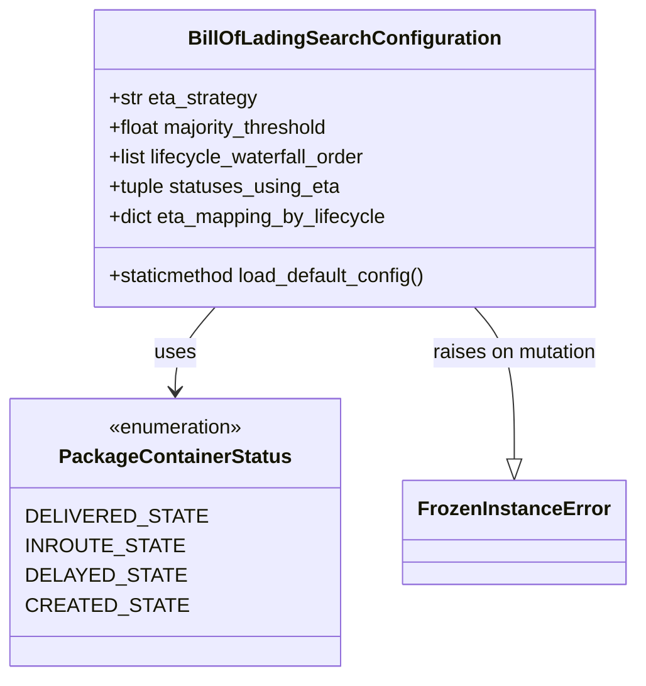

# Diagram: partview_core/partview_service/partview_service/tests/unit/core/business/test_BillOfLadingSearchConfiguration.py


> Auto-generated by Obscura crawlers

## Diagram 1



### SVG

<svg id="container" width="474.6953125" xmlns="http://www.w3.org/2000/svg" class="classDiagram" height="546" viewBox="0 0 474.6953125 546" role="graphics-document document" aria-roledescription="class"><style>#container{font-family:"trebuchet ms",verdana,arial,sans-serif;font-size:16px;fill:#333;}@keyframes edge-animation-frame{from{stroke-dashoffset:0;}}@keyframes dash{to{stroke-dashoffset:0;}}#container .edge-animation-slow{stroke-dasharray:9,5!important;stroke-dashoffset:900;animation:dash 50s linear infinite;stroke-linecap:round;}#container .edge-animation-fast{stroke-dasharray:9,5!important;stroke-dashoffset:900;animation:dash 20s linear infinite;stroke-linecap:round;}#container .error-icon{fill:#552222;}#container .error-text{fill:#552222;stroke:#552222;}#container .edge-thickness-normal{stroke-width:1px;}#container .edge-thickness-thick{stroke-width:3.5px;}#container .edge-pattern-solid{stroke-dasharray:0;}#container .edge-thickness-invisible{stroke-width:0;fill:none;}#container .edge-pattern-dashed{stroke-dasharray:3;}#container .edge-pattern-dotted{stroke-dasharray:2;}#container .marker{fill:#333333;stroke:#333333;}#container .marker.cross{stroke:#333333;}#container svg{font-family:"trebuchet ms",verdana,arial,sans-serif;font-size:16px;}#container p{margin:0;}#container g.classGroup text{fill:#9370DB;stroke:none;font-family:"trebuchet ms",verdana,arial,sans-serif;font-size:10px;}#container g.classGroup text .title{font-weight:bolder;}#container .nodeLabel,#container .edgeLabel{color:#131300;}#container .edgeLabel .label rect{fill:#ECECFF;}#container .label text{fill:#131300;}#container .labelBkg{background:#ECECFF;}#container .edgeLabel .label span{background:#ECECFF;}#container .classTitle{font-weight:bolder;}#container .node rect,#container .node circle,#container .node ellipse,#container .node polygon,#container .node path{fill:#ECECFF;stroke:#9370DB;stroke-width:1px;}#container .divider{stroke:#9370DB;stroke-width:1;}#container g.clickable{cursor:pointer;}#container g.classGroup rect{fill:#ECECFF;stroke:#9370DB;}#container g.classGroup line{stroke:#9370DB;stroke-width:1;}#container .classLabel .box{stroke:none;stroke-width:0;fill:#ECECFF;opacity:0.5;}#container .classLabel .label{fill:#9370DB;font-size:10px;}#container .relation{stroke:#333333;stroke-width:1;fill:none;}#container .dashed-line{stroke-dasharray:3;}#container .dotted-line{stroke-dasharray:1 2;}#container #compositionStart,#container .composition{fill:#333333!important;stroke:#333333!important;stroke-width:1;}#container #compositionEnd,#container .composition{fill:#333333!important;stroke:#333333!important;stroke-width:1;}#container #dependencyStart,#container .dependency{fill:#333333!important;stroke:#333333!important;stroke-width:1;}#container #dependencyStart,#container .dependency{fill:#333333!important;stroke:#333333!important;stroke-width:1;}#container #extensionStart,#container .extension{fill:transparent!important;stroke:#333333!important;stroke-width:1;}#container #extensionEnd,#container .extension{fill:transparent!important;stroke:#333333!important;stroke-width:1;}#container #aggregationStart,#container .aggregation{fill:transparent!important;stroke:#333333!important;stroke-width:1;}#container #aggregationEnd,#container .aggregation{fill:transparent!important;stroke:#333333!important;stroke-width:1;}#container #lollipopStart,#container .lollipop{fill:#ECECFF!important;stroke:#333333!important;stroke-width:1;}#container #lollipopEnd,#container .lollipop{fill:#ECECFF!important;stroke:#333333!important;stroke-width:1;}#container .edgeTerminals{font-size:11px;line-height:initial;}#container .classTitleText{text-anchor:middle;font-size:18px;fill:#333;}#container .label-icon{display:inline-block;height:1em;overflow:visible;vertical-align:-0.125em;}#container .node .label-icon path{fill:currentColor;stroke:revert;stroke-width:revert;}#container :root{--mermaid-font-family:"trebuchet ms",verdana,arial,sans-serif;}</style><g><defs><marker id="container_class-aggregationStart" class="marker aggregation class" refX="18" refY="7" markerWidth="190" markerHeight="240" orient="auto"><path d="M 18,7 L9,13 L1,7 L9,1 Z"></path></marker></defs><defs><marker id="container_class-aggregationEnd" class="marker aggregation class" refX="1" refY="7" markerWidth="20" markerHeight="28" orient="auto"><path d="M 18,7 L9,13 L1,7 L9,1 Z"></path></marker></defs><defs><marker id="container_class-extensionStart" class="marker extension class" refX="18" refY="7" markerWidth="190" markerHeight="240" orient="auto"><path d="M 1,7 L18,13 V 1 Z"></path></marker></defs><defs><marker id="container_class-extensionEnd" class="marker extension class" refX="1" refY="7" markerWidth="20" markerHeight="28" orient="auto"><path d="M 1,1 V 13 L18,7 Z"></path></marker></defs><defs><marker id="container_class-compositionStart" class="marker composition class" refX="18" refY="7" markerWidth="190" markerHeight="240" orient="auto"><path d="M 18,7 L9,13 L1,7 L9,1 Z"></path></marker></defs><defs><marker id="container_class-compositionEnd" class="marker composition class" refX="1" refY="7" markerWidth="20" markerHeight="28" orient="auto"><path d="M 18,7 L9,13 L1,7 L9,1 Z"></path></marker></defs><defs><marker id="container_class-dependencyStart" class="marker dependency class" refX="6" refY="7" markerWidth="190" markerHeight="240" orient="auto"><path d="M 5,7 L9,13 L1,7 L9,1 Z"></path></marker></defs><defs><marker id="container_class-dependencyEnd" class="marker dependency class" refX="13" refY="7" markerWidth="20" markerHeight="28" orient="auto"><path d="M 18,7 L9,13 L14,7 L9,1 Z"></path></marker></defs><defs><marker id="container_class-lollipopStart" class="marker lollipop class" refX="13" refY="7" markerWidth="190" markerHeight="240" orient="auto"><circle stroke="black" fill="transparent" cx="7" cy="7" r="6"></circle></marker></defs><defs><marker id="container_class-lollipopEnd" class="marker lollipop class" refX="1" refY="7" markerWidth="190" markerHeight="240" orient="auto"><circle stroke="black" fill="transparent" cx="7" cy="7" r="6"></circle></marker></defs><g class="root"><g class="clusters"></g><g class="edgePaths"><path d="M157.412,248L152.417,254.167C147.422,260.333,137.432,272.667,132.437,284C127.441,295.333,127.441,305.667,127.441,310.833L127.441,316" id="id_BillOfLadingSearchConfiguration_PackageContainerStatus_1" class="edge-thickness-normal edge-pattern-solid relation" style=";;;" data-edge="true" data-et="edge" data-id="id_BillOfLadingSearchConfiguration_PackageContainerStatus_1" data-points="W3sieCI6MTU3LjQxMjMwODQxOTU4NiwieSI6MjQ4fSx7IngiOjEyNy40NDE0MDYyNSwieSI6Mjg1fSx7IngiOjEyNy40NDE0MDYyNSwieSI6MzIyfV0=" marker-end="url(#container_class-dependencyEnd)"></path><path d="M351.818,248L356.813,254.167C361.808,260.333,371.799,272.667,376.794,293.125C381.789,313.583,381.789,342.167,381.789,356.458L381.789,370.75" id="id_BillOfLadingSearchConfiguration_FrozenInstanceError_2" class="edge-thickness-normal edge-pattern-solid relation" style=";;;" data-edge="true" data-et="edge" data-id="id_BillOfLadingSearchConfiguration_FrozenInstanceError_2" data-points="W3sieCI6MzUxLjgxODE2MDMzMDQxNCwieSI6MjQ4fSx7IngiOjM4MS43ODkwNjI1LCJ5IjoyODV9LHsieCI6MzgxLjc4OTA2MjUsInkiOjM4OH1d" marker-end="url(#container_class-extensionEnd)"></path></g><g class="edgeLabels"><g class="edgeLabel" transform="translate(127.44140625, 285)"><g class="label" data-id="id_BillOfLadingSearchConfiguration_PackageContainerStatus_1" transform="translate(-16.4921875, -12)"><foreignObject width="32.984375" height="24"><div xmlns="http://www.w3.org/1999/xhtml" class="labelBkg" style="display: table-cell; white-space: nowrap; line-height: 1.5; max-width: 200px; text-align: center;"><span class="edgeLabel"><p>uses</p></span></div></foreignObject></g></g><g class="edgeLabel" transform="translate(381.7890625, 285)"><g class="label" data-id="id_BillOfLadingSearchConfiguration_FrozenInstanceError_2" transform="translate(-68.0546875, -12)"><foreignObject width="136.109375" height="24"><div xmlns="http://www.w3.org/1999/xhtml" class="labelBkg" style="display: table-cell; white-space: nowrap; line-height: 1.5; max-width: 200px; text-align: center;"><span class="edgeLabel"><p>raises on mutation</p></span></div></foreignObject></g></g></g><g class="nodes"><g class="node default" id="classId-BillOfLadingSearchConfiguration-0" transform="translate(254.615234375, 128)"><g class="basic label-container"><path d="M-202.5859375 -120 L202.5859375 -120 L202.5859375 120 L-202.5859375 120" stroke="none" stroke-width="0" fill="#ECECFF" style=""></path><path d="M-202.5859375 -120 C-114.8594236633609 -120, -27.1329098267218 -120, 202.5859375 -120 M-202.5859375 -120 C-114.30414847396621 -120, -26.022359447932416 -120, 202.5859375 -120 M202.5859375 -120 C202.5859375 -36.17388816327433, 202.5859375 47.652223673451346, 202.5859375 120 M202.5859375 -120 C202.5859375 -48.68226059458601, 202.5859375 22.635478810827976, 202.5859375 120 M202.5859375 120 C57.3561298840564 120, -87.8736777318872 120, -202.5859375 120 M202.5859375 120 C76.54707585554011 120, -49.49178578891977 120, -202.5859375 120 M-202.5859375 120 C-202.5859375 68.20736769247071, -202.5859375 16.41473538494141, -202.5859375 -120 M-202.5859375 120 C-202.5859375 71.65925276361168, -202.5859375 23.318505527223365, -202.5859375 -120" stroke="#9370DB" stroke-width="1.3" fill="none" stroke-dasharray="0 0" style=""></path></g><g class="annotation-group text" transform="translate(0, -96)"></g><g class="label-group text" transform="translate(-118.890625, -96)"><g class="label" style="font-weight: bolder" transform="translate(0,-12)"><foreignObject width="237.78125" height="24"><div xmlns="http://www.w3.org/1999/xhtml" style="display: table-cell; white-space: nowrap; line-height: 1.5; max-width: 284px; text-align: center;"><span class="nodeLabel markdown-node-label" style=""><p>BillOfLadingSearchConfiguration</p></span></div></foreignObject></g></g><g class="members-group text" transform="translate(-190.5859375, -48)"><g class="label" style="" transform="translate(0,-12)"><foreignObject width="121.078125" height="24"><div xmlns="http://www.w3.org/1999/xhtml" style="display: table-cell; white-space: nowrap; line-height: 1.5; max-width: 179px; text-align: center;"><span class="nodeLabel markdown-node-label" style=""><p>+str eta_strategy</p></span></div></foreignObject></g><g class="label" style="" transform="translate(0,12)"><foreignObject width="182.84375" height="24"><div xmlns="http://www.w3.org/1999/xhtml" style="display: table-cell; white-space: nowrap; line-height: 1.5; max-width: 240px; text-align: center;"><span class="nodeLabel markdown-node-label" style=""><p>+float majority_threshold</p></span></div></foreignObject></g><g class="label" style="" transform="translate(0,36)"><foreignObject width="212.765625" height="24"><div xmlns="http://www.w3.org/1999/xhtml" style="display: table-cell; white-space: nowrap; line-height: 1.5; max-width: 271px; text-align: center;"><span class="nodeLabel markdown-node-label" style=""><p>+list lifecycle_waterfall_order</p></span></div></foreignObject></g><g class="label" style="" transform="translate(0,60)"><foreignObject width="188.484375" height="24"><div xmlns="http://www.w3.org/1999/xhtml" style="display: table-cell; white-space: nowrap; line-height: 1.5; max-width: 246px; text-align: center;"><span class="nodeLabel markdown-node-label" style=""><p>+tuple statuses_using_eta</p></span></div></foreignObject></g><g class="label" style="" transform="translate(0,84)"><foreignObject width="227.703125" height="24"><div xmlns="http://www.w3.org/1999/xhtml" style="display: table-cell; white-space: nowrap; line-height: 1.5; max-width: 285px; text-align: center;"><span class="nodeLabel markdown-node-label" style=""><p>+dict eta_mapping_by_lifecycle</p></span></div></foreignObject></g></g><g class="methods-group text" transform="translate(-190.5859375, 96)"><g class="label" style="" transform="translate(0,-12)"><foreignObject width="262.28125" height="24"><div xmlns="http://www.w3.org/1999/xhtml" style="display: table-cell; white-space: nowrap; line-height: 1.5; max-width: 320px; text-align: center;"><span class="nodeLabel markdown-node-label" style=""><p>+staticmethod load_default_config()</p></span></div></foreignObject></g></g><g class="divider" style=""><path d="M-202.5859375 -72 C-79.59208541326576 -72, 43.40176667346847 -72, 202.5859375 -72 M-202.5859375 -72 C-64.53267775142362 -72, 73.52058199715276 -72, 202.5859375 -72" stroke="#9370DB" stroke-width="1.3" fill="none" stroke-dasharray="0 0" style=""></path></g><g class="divider" style=""><path d="M-202.5859375 72 C-81.42167630756398 72, 39.74258488487203 72, 202.5859375 72 M-202.5859375 72 C-84.85765556274575 72, 32.870626374508504 72, 202.5859375 72" stroke="#9370DB" stroke-width="1.3" fill="none" stroke-dasharray="0 0" style=""></path></g></g><g class="node default" id="classId-PackageContainerStatus-1" transform="translate(127.44140625, 430)"><g class="basic label-container"><path d="M-119.44140625 -108 L119.44140625 -108 L119.44140625 108 L-119.44140625 108" stroke="none" stroke-width="0" fill="#ECECFF" style=""></path><path d="M-119.44140625 -108 C-24.34518454185023 -108, 70.75103716629954 -108, 119.44140625 -108 M-119.44140625 -108 C-25.112256356897873 -108, 69.21689353620425 -108, 119.44140625 -108 M119.44140625 -108 C119.44140625 -35.67513410205083, 119.44140625 36.64973179589833, 119.44140625 108 M119.44140625 -108 C119.44140625 -37.49794470890912, 119.44140625 33.00411058218177, 119.44140625 108 M119.44140625 108 C47.15612939988365 108, -25.129147450232693 108, -119.44140625 108 M119.44140625 108 C27.78166864330089 108, -63.87806896339822 108, -119.44140625 108 M-119.44140625 108 C-119.44140625 23.145847938461046, -119.44140625 -61.70830412307791, -119.44140625 -108 M-119.44140625 108 C-119.44140625 44.94064636934517, -119.44140625 -18.118707261309666, -119.44140625 -108" stroke="#9370DB" stroke-width="1.3" fill="none" stroke-dasharray="0 0" style=""></path></g><g class="annotation-group text" transform="translate(-55.5546875, -84)"><g class="label" style="" transform="translate(0,-12)"><foreignObject width="111.109375" height="24"><div xmlns="http://www.w3.org/1999/xhtml" style="display: table-cell; white-space: nowrap; line-height: 1.5; max-width: 161px; text-align: center;"><span class="nodeLabel markdown-node-label" style=""><p>«enumeration»</p></span></div></foreignObject></g></g><g class="label-group text" transform="translate(-88.9296875, -60)"><g class="label" style="font-weight: bolder" transform="translate(0,-12)"><foreignObject width="177.859375" height="24"><div xmlns="http://www.w3.org/1999/xhtml" style="display: table-cell; white-space: nowrap; line-height: 1.5; max-width: 224px; text-align: center;"><span class="nodeLabel markdown-node-label" style=""><p>PackageContainerStatus</p></span></div></foreignObject></g></g><g class="members-group text" transform="translate(-107.44140625, -12)"><g class="label" style="" transform="translate(0,-12)"><foreignObject width="125.953125" height="24"><div xmlns="http://www.w3.org/1999/xhtml" style="display: table-cell; white-space: nowrap; line-height: 1.5; max-width: 176px; text-align: center;"><span class="nodeLabel markdown-node-label" style=""><p>DELIVERED_STATE</p></span></div></foreignObject></g><g class="label" style="" transform="translate(0,12)"><foreignObject width="112.734375" height="24"><div xmlns="http://www.w3.org/1999/xhtml" style="display: table-cell; white-space: nowrap; line-height: 1.5; max-width: 163px; text-align: center;"><span class="nodeLabel markdown-node-label" style=""><p>INROUTE_STATE</p></span></div></foreignObject></g><g class="label" style="" transform="translate(0,36)"><foreignObject width="111.28125" height="24"><div xmlns="http://www.w3.org/1999/xhtml" style="display: table-cell; white-space: nowrap; line-height: 1.5; max-width: 161px; text-align: center;"><span class="nodeLabel markdown-node-label" style=""><p>DELAYED_STATE</p></span></div></foreignObject></g><g class="label" style="" transform="translate(0,60)"><foreignObject width="111.109375" height="24"><div xmlns="http://www.w3.org/1999/xhtml" style="display: table-cell; white-space: nowrap; line-height: 1.5; max-width: 161px; text-align: center;"><span class="nodeLabel markdown-node-label" style=""><p>CREATED_STATE</p></span></div></foreignObject></g></g><g class="methods-group text" transform="translate(-107.44140625, 108)"></g><g class="divider" style=""><path d="M-119.44140625 -36 C-27.41453968985674 -36, 64.61232687028652 -36, 119.44140625 -36 M-119.44140625 -36 C-40.04091784795098 -36, 39.35957055409804 -36, 119.44140625 -36" stroke="#9370DB" stroke-width="1.3" fill="none" stroke-dasharray="0 0" style=""></path></g><g class="divider" style=""><path d="M-119.44140625 84 C-68.39934714625758 84, -17.35728804251518 84, 119.44140625 84 M-119.44140625 84 C-41.04241312103842 84, 37.35658000792316 84, 119.44140625 84" stroke="#9370DB" stroke-width="1.3" fill="none" stroke-dasharray="0 0" style=""></path></g></g><g class="node default" id="classId-FrozenInstanceError-2" transform="translate(381.7890625, 430)"><g class="basic label-container"><path d="M-84.90625 -42 L84.90625 -42 L84.90625 42 L-84.90625 42" stroke="none" stroke-width="0" fill="#ECECFF" style=""></path><path d="M-84.90625 -42 C-27.011842562468956 -42, 30.882564875062087 -42, 84.90625 -42 M-84.90625 -42 C-18.917944383290276 -42, 47.07036123341945 -42, 84.90625 -42 M84.90625 -42 C84.90625 -22.496828922714332, 84.90625 -2.9936578454286646, 84.90625 42 M84.90625 -42 C84.90625 -22.037432527562817, 84.90625 -2.0748650551256347, 84.90625 42 M84.90625 42 C18.786607519960384 42, -47.33303496007923 42, -84.90625 42 M84.90625 42 C42.43189924483961 42, -0.04245151032077388 42, -84.90625 42 M-84.90625 42 C-84.90625 19.717247062451758, -84.90625 -2.565505875096484, -84.90625 -42 M-84.90625 42 C-84.90625 23.03307423569561, -84.90625 4.066148471391223, -84.90625 -42" stroke="#9370DB" stroke-width="1.3" fill="none" stroke-dasharray="0 0" style=""></path></g><g class="annotation-group text" transform="translate(0, -18)"></g><g class="label-group text" transform="translate(-72.90625, -18)"><g class="label" style="font-weight: bolder" transform="translate(0,-12)"><foreignObject width="145.8125" height="24"><div xmlns="http://www.w3.org/1999/xhtml" style="display: table-cell; white-space: nowrap; line-height: 1.5; max-width: 195px; text-align: center;"><span class="nodeLabel markdown-node-label" style=""><p>FrozenInstanceError</p></span></div></foreignObject></g></g><g class="members-group text" transform="translate(-72.90625, 30)"></g><g class="methods-group text" transform="translate(-72.90625, 60)"></g><g class="divider" style=""><path d="M-84.90625 6 C-22.555812421488056 6, 39.79462515702389 6, 84.90625 6 M-84.90625 6 C-28.7298304249596 6, 27.446589150080797 6, 84.90625 6" stroke="#9370DB" stroke-width="1.3" fill="none" stroke-dasharray="0 0" style=""></path></g><g class="divider" style=""><path d="M-84.90625 24 C-37.734751712013654 24, 9.436746575972691 24, 84.90625 24 M-84.90625 24 C-48.2947163400985 24, -11.683182680197007 24, 84.90625 24" stroke="#9370DB" stroke-width="1.3" fill="none" stroke-dasharray="0 0" style=""></path></g></g></g></g></g></svg>

## Diagram 2

```mermaid
flowchart TD
    A[load_default_config()] --> B[test_defaults_are_sane_and_expected]
    A --> C[test_statuses_using_eta_is_subset_of_known_states]
    A --> D[test_config_is_frozen_and_cannot_be_mutated]
    A --> E[test_created_is_last_and_mapped_to_tbd]
    B --> B1{eta_strategy.upper() == "MOST_FREQUENT_THEN_FURTHEST"}
    B --> B2{0.0 < majority_threshold < 1.0}
    B --> B3{lifecycle_waterfall_order contains all PCS states}
    B --> B4{statuses_using_eta == (INROUTE_STATE,)}
    B --> B5{eta_mapping_by_lifecycle checks for None/"tbd"}
    C --> C1{known = set(lifecycle) ∪ keys(eta_mapping_by_lifecycle)}
    C1 --> C2{statuses_using_eta ⊆ known}
    D --> D1{attempt mutate eta_strategy}
    D1 --> D2[FrozenInstanceError raised]
    E --> E1{lifecycle_waterfall_order[-1] == CREATED_STATE}
    E --> E2{eta_mapping_by_lifecycle[CREATED_STATE] == "tbd"}
```

> SVG rendering failed for this diagram.
