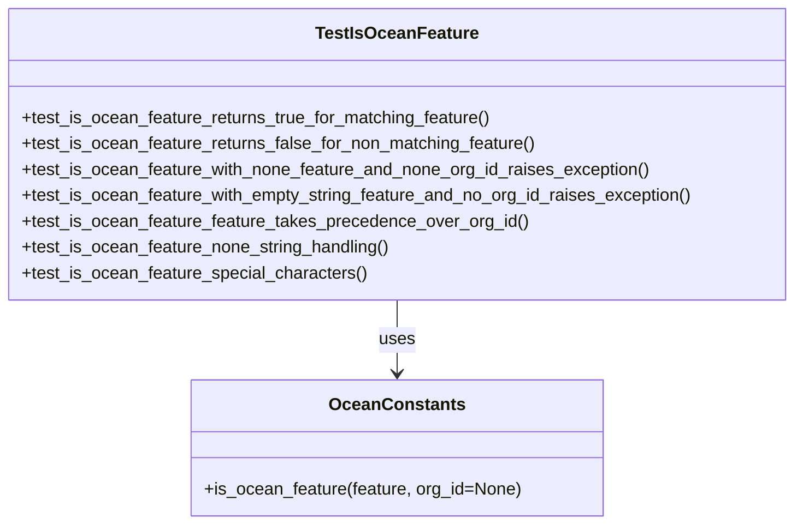

# Diagram: partview_core/partview_service/partview_service/tests/unit/core/business/test_OceanConstants.py


> Auto-generated by Obscura crawlers

## Diagram 1



### SVG

<svg id="container" width="735.6171875" xmlns="http://www.w3.org/2000/svg" class="classDiagram" height="486" viewBox="0 0 735.6171875 486" role="graphics-document document" aria-roledescription="class"><style>#container{font-family:"trebuchet ms",verdana,arial,sans-serif;font-size:16px;fill:#333;}@keyframes edge-animation-frame{from{stroke-dashoffset:0;}}@keyframes dash{to{stroke-dashoffset:0;}}#container .edge-animation-slow{stroke-dasharray:9,5!important;stroke-dashoffset:900;animation:dash 50s linear infinite;stroke-linecap:round;}#container .edge-animation-fast{stroke-dasharray:9,5!important;stroke-dashoffset:900;animation:dash 20s linear infinite;stroke-linecap:round;}#container .error-icon{fill:#552222;}#container .error-text{fill:#552222;stroke:#552222;}#container .edge-thickness-normal{stroke-width:1px;}#container .edge-thickness-thick{stroke-width:3.5px;}#container .edge-pattern-solid{stroke-dasharray:0;}#container .edge-thickness-invisible{stroke-width:0;fill:none;}#container .edge-pattern-dashed{stroke-dasharray:3;}#container .edge-pattern-dotted{stroke-dasharray:2;}#container .marker{fill:#333333;stroke:#333333;}#container .marker.cross{stroke:#333333;}#container svg{font-family:"trebuchet ms",verdana,arial,sans-serif;font-size:16px;}#container p{margin:0;}#container g.classGroup text{fill:#9370DB;stroke:none;font-family:"trebuchet ms",verdana,arial,sans-serif;font-size:10px;}#container g.classGroup text .title{font-weight:bolder;}#container .nodeLabel,#container .edgeLabel{color:#131300;}#container .edgeLabel .label rect{fill:#ECECFF;}#container .label text{fill:#131300;}#container .labelBkg{background:#ECECFF;}#container .edgeLabel .label span{background:#ECECFF;}#container .classTitle{font-weight:bolder;}#container .node rect,#container .node circle,#container .node ellipse,#container .node polygon,#container .node path{fill:#ECECFF;stroke:#9370DB;stroke-width:1px;}#container .divider{stroke:#9370DB;stroke-width:1;}#container g.clickable{cursor:pointer;}#container g.classGroup rect{fill:#ECECFF;stroke:#9370DB;}#container g.classGroup line{stroke:#9370DB;stroke-width:1;}#container .classLabel .box{stroke:none;stroke-width:0;fill:#ECECFF;opacity:0.5;}#container .classLabel .label{fill:#9370DB;font-size:10px;}#container .relation{stroke:#333333;stroke-width:1;fill:none;}#container .dashed-line{stroke-dasharray:3;}#container .dotted-line{stroke-dasharray:1 2;}#container #compositionStart,#container .composition{fill:#333333!important;stroke:#333333!important;stroke-width:1;}#container #compositionEnd,#container .composition{fill:#333333!important;stroke:#333333!important;stroke-width:1;}#container #dependencyStart,#container .dependency{fill:#333333!important;stroke:#333333!important;stroke-width:1;}#container #dependencyStart,#container .dependency{fill:#333333!important;stroke:#333333!important;stroke-width:1;}#container #extensionStart,#container .extension{fill:transparent!important;stroke:#333333!important;stroke-width:1;}#container #extensionEnd,#container .extension{fill:transparent!important;stroke:#333333!important;stroke-width:1;}#container #aggregationStart,#container .aggregation{fill:transparent!important;stroke:#333333!important;stroke-width:1;}#container #aggregationEnd,#container .aggregation{fill:transparent!important;stroke:#333333!important;stroke-width:1;}#container #lollipopStart,#container .lollipop{fill:#ECECFF!important;stroke:#333333!important;stroke-width:1;}#container #lollipopEnd,#container .lollipop{fill:#ECECFF!important;stroke:#333333!important;stroke-width:1;}#container .edgeTerminals{font-size:11px;line-height:initial;}#container .classTitleText{text-anchor:middle;font-size:18px;fill:#333;}#container .label-icon{display:inline-block;height:1em;overflow:visible;vertical-align:-0.125em;}#container .node .label-icon path{fill:currentColor;stroke:revert;stroke-width:revert;}#container :root{--mermaid-font-family:"trebuchet ms",verdana,arial,sans-serif;}</style><g><defs><marker id="container_class-aggregationStart" class="marker aggregation class" refX="18" refY="7" markerWidth="190" markerHeight="240" orient="auto"><path d="M 18,7 L9,13 L1,7 L9,1 Z"></path></marker></defs><defs><marker id="container_class-aggregationEnd" class="marker aggregation class" refX="1" refY="7" markerWidth="20" markerHeight="28" orient="auto"><path d="M 18,7 L9,13 L1,7 L9,1 Z"></path></marker></defs><defs><marker id="container_class-extensionStart" class="marker extension class" refX="18" refY="7" markerWidth="190" markerHeight="240" orient="auto"><path d="M 1,7 L18,13 V 1 Z"></path></marker></defs><defs><marker id="container_class-extensionEnd" class="marker extension class" refX="1" refY="7" markerWidth="20" markerHeight="28" orient="auto"><path d="M 1,1 V 13 L18,7 Z"></path></marker></defs><defs><marker id="container_class-compositionStart" class="marker composition class" refX="18" refY="7" markerWidth="190" markerHeight="240" orient="auto"><path d="M 18,7 L9,13 L1,7 L9,1 Z"></path></marker></defs><defs><marker id="container_class-compositionEnd" class="marker composition class" refX="1" refY="7" markerWidth="20" markerHeight="28" orient="auto"><path d="M 18,7 L9,13 L1,7 L9,1 Z"></path></marker></defs><defs><marker id="container_class-dependencyStart" class="marker dependency class" refX="6" refY="7" markerWidth="190" markerHeight="240" orient="auto"><path d="M 5,7 L9,13 L1,7 L9,1 Z"></path></marker></defs><defs><marker id="container_class-dependencyEnd" class="marker dependency class" refX="13" refY="7" markerWidth="20" markerHeight="28" orient="auto"><path d="M 18,7 L9,13 L14,7 L9,1 Z"></path></marker></defs><defs><marker id="container_class-lollipopStart" class="marker lollipop class" refX="13" refY="7" markerWidth="190" markerHeight="240" orient="auto"><circle stroke="black" fill="transparent" cx="7" cy="7" r="6"></circle></marker></defs><defs><marker id="container_class-lollipopEnd" class="marker lollipop class" refX="1" refY="7" markerWidth="190" markerHeight="240" orient="auto"><circle stroke="black" fill="transparent" cx="7" cy="7" r="6"></circle></marker></defs><g class="root"><g class="clusters"></g><g class="edgePaths"><path d="M367.809,278L367.809,284.167C367.809,290.333,367.809,302.667,367.809,314C367.809,325.333,367.809,335.667,367.809,340.833L367.809,346" id="id_TestIsOceanFeature_OceanConstants_1" class="edge-thickness-normal edge-pattern-solid relation" style=";;;" data-edge="true" data-et="edge" data-id="id_TestIsOceanFeature_OceanConstants_1" data-points="W3sieCI6MzY3LjgwODU5Mzc1LCJ5IjoyNzh9LHsieCI6MzY3LjgwODU5Mzc1LCJ5IjozMTV9LHsieCI6MzY3LjgwODU5Mzc1LCJ5IjozNTJ9XQ==" marker-end="url(#container_class-dependencyEnd)"></path></g><g class="edgeLabels"><g class="edgeLabel" transform="translate(367.80859375, 315)"><g class="label" data-id="id_TestIsOceanFeature_OceanConstants_1" transform="translate(-16.4921875, -12)"><foreignObject width="32.984375" height="24"><div xmlns="http://www.w3.org/1999/xhtml" class="labelBkg" style="display: table-cell; white-space: nowrap; line-height: 1.5; max-width: 200px; text-align: center;"><span class="edgeLabel"><p>uses</p></span></div></foreignObject></g></g></g><g class="nodes"><g class="node default" id="classId-TestIsOceanFeature-0" transform="translate(367.80859375, 143)"><g class="basic label-container"><path d="M-359.80859375 -135 L359.80859375 -135 L359.80859375 135 L-359.80859375 135" stroke="none" stroke-width="0" fill="#ECECFF" style=""></path><path d="M-359.80859375 -135 C-152.061131754121 -135, 55.686330241758014 -135, 359.80859375 -135 M-359.80859375 -135 C-211.01969432366067 -135, -62.230794897321346 -135, 359.80859375 -135 M359.80859375 -135 C359.80859375 -64.08804278636143, 359.80859375 6.8239144272771455, 359.80859375 135 M359.80859375 -135 C359.80859375 -66.35909436251202, 359.80859375 2.2818112749759507, 359.80859375 135 M359.80859375 135 C154.9424894235022 135, -49.92361490299561 135, -359.80859375 135 M359.80859375 135 C107.43009863486307 135, -144.94839648027386 135, -359.80859375 135 M-359.80859375 135 C-359.80859375 44.32302673901171, -359.80859375 -46.35394652197658, -359.80859375 -135 M-359.80859375 135 C-359.80859375 73.38476086657948, -359.80859375 11.769521733158953, -359.80859375 -135" stroke="#9370DB" stroke-width="1.3" fill="none" stroke-dasharray="0 0" style=""></path></g><g class="annotation-group text" transform="translate(0, -111)"></g><g class="label-group text" transform="translate(-71.3828125, -111)"><g class="label" style="font-weight: bolder" transform="translate(0,-12)"><foreignObject width="142.765625" height="24"><div xmlns="http://www.w3.org/1999/xhtml" style="display: table-cell; white-space: nowrap; line-height: 1.5; max-width: 191px; text-align: center;"><span class="nodeLabel markdown-node-label" style=""><p>TestIsOceanFeature</p></span></div></foreignObject></g></g><g class="members-group text" transform="translate(-347.80859375, -63)"></g><g class="methods-group text" transform="translate(-347.80859375, -33)"><g class="label" style="" transform="translate(0,-12)"><foreignObject width="437.890625" height="24"><div xmlns="http://www.w3.org/1999/xhtml" style="display: table-cell; white-space: nowrap; line-height: 1.5; max-width: 495px; text-align: center;"><span class="nodeLabel markdown-node-label" style=""><p>+test_is_ocean_feature_returns_true_for_matching_feature()</p></span></div></foreignObject></g><g class="label" style="" transform="translate(0,12)"><foreignObject width="478.765625" height="24"><div xmlns="http://www.w3.org/1999/xhtml" style="display: table-cell; white-space: nowrap; line-height: 1.5; max-width: 536px; text-align: center;"><span class="nodeLabel markdown-node-label" style=""><p>+test_is_ocean_feature_returns_false_for_non_matching_feature()</p></span></div></foreignObject></g><g class="label" style="" transform="translate(0,36)"><foreignObject width="584.109375" height="24"><div xmlns="http://www.w3.org/1999/xhtml" style="display: table-cell; white-space: nowrap; line-height: 1.5; max-width: 641px; text-align: center;"><span class="nodeLabel markdown-node-label" style=""><p>+test_is_ocean_feature_with_none_feature_and_none_org_id_raises_exception()</p></span></div></foreignObject></g><g class="label" style="" transform="translate(0,60)"><foreignObject width="624.234375" height="24"><div xmlns="http://www.w3.org/1999/xhtml" style="display: table-cell; white-space: nowrap; line-height: 1.5; max-width: 682px; text-align: center;"><span class="nodeLabel markdown-node-label" style=""><p>+test_is_ocean_feature_with_empty_string_feature_and_no_org_id_raises_exception()</p></span></div></foreignObject></g><g class="label" style="" transform="translate(0,84)"><foreignObject width="467.109375" height="24"><div xmlns="http://www.w3.org/1999/xhtml" style="display: table-cell; white-space: nowrap; line-height: 1.5; max-width: 524px; text-align: center;"><span class="nodeLabel markdown-node-label" style=""><p>+test_is_ocean_feature_feature_takes_precedence_over_org_id()</p></span></div></foreignObject></g><g class="label" style="" transform="translate(0,108)"><foreignObject width="343.796875" height="24"><div xmlns="http://www.w3.org/1999/xhtml" style="display: table-cell; white-space: nowrap; line-height: 1.5; max-width: 401px; text-align: center;"><span class="nodeLabel markdown-node-label" style=""><p>+test_is_ocean_feature_none_string_handling()</p></span></div></foreignObject></g><g class="label" style="" transform="translate(0,132)"><foreignObject width="319.5" height="24"><div xmlns="http://www.w3.org/1999/xhtml" style="display: table-cell; white-space: nowrap; line-height: 1.5; max-width: 377px; text-align: center;"><span class="nodeLabel markdown-node-label" style=""><p>+test_is_ocean_feature_special_characters()</p></span></div></foreignObject></g></g><g class="divider" style=""><path d="M-359.80859375 -87 C-155.45158093958807 -87, 48.90543187082386 -87, 359.80859375 -87 M-359.80859375 -87 C-205.90008616543946 -87, -51.99157858087892 -87, 359.80859375 -87" stroke="#9370DB" stroke-width="1.3" fill="none" stroke-dasharray="0 0" style=""></path></g><g class="divider" style=""><path d="M-359.80859375 -63 C-102.16583642706996 -63, 155.47692089586008 -63, 359.80859375 -63 M-359.80859375 -63 C-180.50370929035893 -63, -1.1988248307178537 -63, 359.80859375 -63" stroke="#9370DB" stroke-width="1.3" fill="none" stroke-dasharray="0 0" style=""></path></g></g><g class="node default" id="classId-OceanConstants-1" transform="translate(367.80859375, 415)"><g class="basic label-container"><path d="M-188.3515625 -63 L188.3515625 -63 L188.3515625 63 L-188.3515625 63" stroke="none" stroke-width="0" fill="#ECECFF" style=""></path><path d="M-188.3515625 -63 C-44.58695090795632 -63, 99.17766068408736 -63, 188.3515625 -63 M-188.3515625 -63 C-58.78263371371409 -63, 70.78629507257182 -63, 188.3515625 -63 M188.3515625 -63 C188.3515625 -15.993058393393689, 188.3515625 31.013883213212623, 188.3515625 63 M188.3515625 -63 C188.3515625 -24.39738672555776, 188.3515625 14.205226548884482, 188.3515625 63 M188.3515625 63 C84.44955282886563 63, -19.45245684226873 63, -188.3515625 63 M188.3515625 63 C93.305869947264 63, -1.7398226054719999 63, -188.3515625 63 M-188.3515625 63 C-188.3515625 21.463512285702734, -188.3515625 -20.072975428594532, -188.3515625 -63 M-188.3515625 63 C-188.3515625 15.075623124439531, -188.3515625 -32.84875375112094, -188.3515625 -63" stroke="#9370DB" stroke-width="1.3" fill="none" stroke-dasharray="0 0" style=""></path></g><g class="annotation-group text" transform="translate(0, -39)"></g><g class="label-group text" transform="translate(-59.078125, -39)"><g class="label" style="font-weight: bolder" transform="translate(0,-12)"><foreignObject width="118.15625" height="24"><div xmlns="http://www.w3.org/1999/xhtml" style="display: table-cell; white-space: nowrap; line-height: 1.5; max-width: 167px; text-align: center;"><span class="nodeLabel markdown-node-label" style=""><p>OceanConstants</p></span></div></foreignObject></g></g><g class="members-group text" transform="translate(-176.3515625, 9)"></g><g class="methods-group text" transform="translate(-176.3515625, 39)"><g class="label" style="" transform="translate(0,-12)"><foreignObject width="293.625" height="24"><div xmlns="http://www.w3.org/1999/xhtml" style="display: table-cell; white-space: nowrap; line-height: 1.5; max-width: 351px; text-align: center;"><span class="nodeLabel markdown-node-label" style=""><p>+is_ocean_feature(feature, org_id=None)</p></span></div></foreignObject></g></g><g class="divider" style=""><path d="M-188.3515625 -15 C-85.69422102814241 -15, 16.963120443715184 -15, 188.3515625 -15 M-188.3515625 -15 C-83.13124547323194 -15, 22.089071553536115 -15, 188.3515625 -15" stroke="#9370DB" stroke-width="1.3" fill="none" stroke-dasharray="0 0" style=""></path></g><g class="divider" style=""><path d="M-188.3515625 9 C-105.1105155445981 9, -21.869468589196202 9, 188.3515625 9 M-188.3515625 9 C-91.76174584919727 9, 4.828070801605463 9, 188.3515625 9" stroke="#9370DB" stroke-width="1.3" fill="none" stroke-dasharray="0 0" style=""></path></g></g></g></g></g></svg>

## Diagram 2

```mermaid
flowchart TD
    Start([Start]) --> FeatureProvided{"feature provided\n(non-empty)"}
    FeatureProvided -- Yes --> CheckFeature[Compare lower(feature) == "oceantracking"]
    CheckFeature -- Yes --> ReturnTrue([Return True])
    CheckFeature -- No --> ReturnFalse([Return False])
    FeatureProvided -- No --> OrgIdProvided{"org_id provided\n(not None/empty)"}
    OrgIdProvided -- Yes --> Fallback([Fallback decision by org_id\n(not covered in tests) -> Return False])
    OrgIdProvided -- No --> RaiseError([Raise ValueError: "org_id is required when feature is not provided"])
```

> SVG rendering failed for this diagram.
