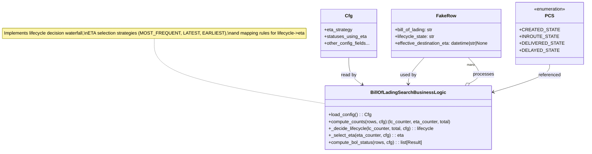

# Diagram: partview_core/partview_service/partview_service/tests/unit/core/business/trip_leg/test_BillOfLadingSearchBusinessLogic.py


> Auto-generated by Obscura crawlers

## Diagram 1



### SVG

<svg id="container" width="1997.65625" xmlns="http://www.w3.org/2000/svg" class="classDiagram" height="528" viewBox="0 0 1997.65625 528" role="graphics-document document" aria-roledescription="class"><style>#container{font-family:"trebuchet ms",verdana,arial,sans-serif;font-size:16px;fill:#333;}@keyframes edge-animation-frame{from{stroke-dashoffset:0;}}@keyframes dash{to{stroke-dashoffset:0;}}#container .edge-animation-slow{stroke-dasharray:9,5!important;stroke-dashoffset:900;animation:dash 50s linear infinite;stroke-linecap:round;}#container .edge-animation-fast{stroke-dasharray:9,5!important;stroke-dashoffset:900;animation:dash 20s linear infinite;stroke-linecap:round;}#container .error-icon{fill:#552222;}#container .error-text{fill:#552222;stroke:#552222;}#container .edge-thickness-normal{stroke-width:1px;}#container .edge-thickness-thick{stroke-width:3.5px;}#container .edge-pattern-solid{stroke-dasharray:0;}#container .edge-thickness-invisible{stroke-width:0;fill:none;}#container .edge-pattern-dashed{stroke-dasharray:3;}#container .edge-pattern-dotted{stroke-dasharray:2;}#container .marker{fill:#333333;stroke:#333333;}#container .marker.cross{stroke:#333333;}#container svg{font-family:"trebuchet ms",verdana,arial,sans-serif;font-size:16px;}#container p{margin:0;}#container g.classGroup text{fill:#9370DB;stroke:none;font-family:"trebuchet ms",verdana,arial,sans-serif;font-size:10px;}#container g.classGroup text .title{font-weight:bolder;}#container .nodeLabel,#container .edgeLabel{color:#131300;}#container .edgeLabel .label rect{fill:#ECECFF;}#container .label text{fill:#131300;}#container .labelBkg{background:#ECECFF;}#container .edgeLabel .label span{background:#ECECFF;}#container .classTitle{font-weight:bolder;}#container .node rect,#container .node circle,#container .node ellipse,#container .node polygon,#container .node path{fill:#ECECFF;stroke:#9370DB;stroke-width:1px;}#container .divider{stroke:#9370DB;stroke-width:1;}#container g.clickable{cursor:pointer;}#container g.classGroup rect{fill:#ECECFF;stroke:#9370DB;}#container g.classGroup line{stroke:#9370DB;stroke-width:1;}#container .classLabel .box{stroke:none;stroke-width:0;fill:#ECECFF;opacity:0.5;}#container .classLabel .label{fill:#9370DB;font-size:10px;}#container .relation{stroke:#333333;stroke-width:1;fill:none;}#container .dashed-line{stroke-dasharray:3;}#container .dotted-line{stroke-dasharray:1 2;}#container #compositionStart,#container .composition{fill:#333333!important;stroke:#333333!important;stroke-width:1;}#container #compositionEnd,#container .composition{fill:#333333!important;stroke:#333333!important;stroke-width:1;}#container #dependencyStart,#container .dependency{fill:#333333!important;stroke:#333333!important;stroke-width:1;}#container #dependencyStart,#container .dependency{fill:#333333!important;stroke:#333333!important;stroke-width:1;}#container #extensionStart,#container .extension{fill:transparent!important;stroke:#333333!important;stroke-width:1;}#container #extensionEnd,#container .extension{fill:transparent!important;stroke:#333333!important;stroke-width:1;}#container #aggregationStart,#container .aggregation{fill:transparent!important;stroke:#333333!important;stroke-width:1;}#container #aggregationEnd,#container .aggregation{fill:transparent!important;stroke:#333333!important;stroke-width:1;}#container #lollipopStart,#container .lollipop{fill:#ECECFF!important;stroke:#333333!important;stroke-width:1;}#container #lollipopEnd,#container .lollipop{fill:#ECECFF!important;stroke:#333333!important;stroke-width:1;}#container .edgeTerminals{font-size:11px;line-height:initial;}#container .classTitleText{text-anchor:middle;font-size:18px;fill:#333;}#container .label-icon{display:inline-block;height:1em;overflow:visible;vertical-align:-0.125em;}#container .node .label-icon path{fill:currentColor;stroke:revert;stroke-width:revert;}#container :root{--mermaid-font-family:"trebuchet ms",verdana,arial,sans-serif;}</style><g><defs><marker id="container_class-aggregationStart" class="marker aggregation class" refX="18" refY="7" markerWidth="190" markerHeight="240" orient="auto"><path d="M 18,7 L9,13 L1,7 L9,1 Z"></path></marker></defs><defs><marker id="container_class-aggregationEnd" class="marker aggregation class" refX="1" refY="7" markerWidth="20" markerHeight="28" orient="auto"><path d="M 18,7 L9,13 L1,7 L9,1 Z"></path></marker></defs><defs><marker id="container_class-extensionStart" class="marker extension class" refX="18" refY="7" markerWidth="190" markerHeight="240" orient="auto"><path d="M 1,7 L18,13 V 1 Z"></path></marker></defs><defs><marker id="container_class-extensionEnd" class="marker extension class" refX="1" refY="7" markerWidth="20" markerHeight="28" orient="auto"><path d="M 1,1 V 13 L18,7 Z"></path></marker></defs><defs><marker id="container_class-compositionStart" class="marker composition class" refX="18" refY="7" markerWidth="190" markerHeight="240" orient="auto"><path d="M 18,7 L9,13 L1,7 L9,1 Z"></path></marker></defs><defs><marker id="container_class-compositionEnd" class="marker composition class" refX="1" refY="7" markerWidth="20" markerHeight="28" orient="auto"><path d="M 18,7 L9,13 L1,7 L9,1 Z"></path></marker></defs><defs><marker id="container_class-dependencyStart" class="marker dependency class" refX="6" refY="7" markerWidth="190" markerHeight="240" orient="auto"><path d="M 5,7 L9,13 L1,7 L9,1 Z"></path></marker></defs><defs><marker id="container_class-dependencyEnd" class="marker dependency class" refX="13" refY="7" markerWidth="20" markerHeight="28" orient="auto"><path d="M 18,7 L9,13 L14,7 L9,1 Z"></path></marker></defs><defs><marker id="container_class-lollipopStart" class="marker lollipop class" refX="13" refY="7" markerWidth="190" markerHeight="240" orient="auto"><circle stroke="black" fill="transparent" cx="7" cy="7" r="6"></circle></marker></defs><defs><marker id="container_class-lollipopEnd" class="marker lollipop class" refX="1" refY="7" markerWidth="190" markerHeight="240" orient="auto"><circle stroke="black" fill="transparent" cx="7" cy="7" r="6"></circle></marker></defs><g class="root"><g class="clusters"></g><g class="edgePaths"><path d="M524.625,134L524.625,155.167C524.625,176.333,524.625,218.667,622.345,256.423C720.066,294.179,915.507,327.358,1013.227,343.947L1110.947,360.537" id="edgeNote1" class="edge-thickness-normal edge-pattern-dotted relation" style="fill: none;;;fill: none" data-edge="true" data-et="edge" data-id="edgeNote1" data-points="W3sieCI6NTI0LjYyNSwieSI6MTM0fSx7IngiOjUyNC42MjUsInkiOjI2MX0seyJ4IjoxMTEwLjk0NzI2NTYyNSwieSI6MzYwLjUzNjgyMTI1ODIyNDl9XQ=="></path><path d="M1452.603,200L1443.239,210.167C1433.875,220.333,1415.147,240.667,1405.784,256C1396.42,271.333,1396.42,281.667,1396.42,286.833L1396.42,292" id="id_FakeRow_BillOfLadingSearchBusinessLogic_1" class="edge-thickness-normal edge-pattern-solid relation" style=";;;" data-edge="true" data-et="edge" data-id="id_FakeRow_BillOfLadingSearchBusinessLogic_1" data-points="W3sieCI6MTQ1Mi42MDI1MzIzMjc1ODYyLCJ5IjoyMDB9LHsieCI6MTM5Ni40MTk5MjE4NzUsInkiOjI2MX0seyJ4IjoxMzk2LjQxOTkyMTg3NSwieSI6Mjk4fV0=" marker-end="url(#container_class-dependencyEnd)"></path><path d="M1187.512,200L1187.512,210.167C1187.512,220.333,1187.512,240.667,1195.4,256.422C1203.289,272.177,1219.066,283.354,1226.954,288.943L1234.843,294.532" id="id_Cfg_BillOfLadingSearchBusinessLogic_2" class="edge-thickness-normal edge-pattern-solid relation" style=";;;" data-edge="true" data-et="edge" data-id="id_Cfg_BillOfLadingSearchBusinessLogic_2" data-points="W3sieCI6MTE4Ny41MTE3MTg3NSwieSI6MjAwfSx7IngiOjExODcuNTExNzE4NzUsInkiOjI2MX0seyJ4IjoxMjM5LjczODc2OTUzMTI1LCJ5IjoyOTh9XQ==" marker-end="url(#container_class-dependencyEnd)"></path><path d="M1882.91,224L1882.91,230.167C1882.91,236.333,1882.91,248.667,1850.364,264.735C1817.818,280.802,1752.725,300.605,1720.179,310.506L1687.633,320.407" id="id_PCS_BillOfLadingSearchBusinessLogic_3" class="edge-thickness-normal edge-pattern-solid relation" style=";;;" data-edge="true" data-et="edge" data-id="id_PCS_BillOfLadingSearchBusinessLogic_3" data-points="W3sieCI6MTg4Mi45MTAxNTYyNSwieSI6MjI0fSx7IngiOjE4ODIuOTEwMTU2MjUsInkiOjI2MX0seyJ4IjoxNjgxLjg5MjU3ODEyNSwieSI6MzIyLjE1MzU0MzE5NjQ0NDU2fV0=" marker-end="url(#container_class-dependencyEnd)"></path><path d="M1608.464,289.533L1616.905,284.777C1625.345,280.022,1642.226,270.511,1641.612,255.589C1640.998,240.667,1622.889,220.333,1613.835,210.167L1604.78,200" id="id_BillOfLadingSearchBusinessLogic_FakeRow_4" class="edge-thickness-normal edge-pattern-solid relation" style=";;;" data-edge="true" data-et="edge" data-id="id_BillOfLadingSearchBusinessLogic_FakeRow_4" data-points="W3sieCI6MTU5My40MzU1NDY4NzUsInkiOjI5OH0seyJ4IjoxNjU5LjEwNzQyMTg3NSwieSI6MjYxfSx7IngiOjE2MDQuNzgwMTE4NTM0NDgyNywieSI6MjAwfV0=" marker-start="url(#container_class-aggregationStart)"></path></g><g class="edgeLabels"><g class="edgeLabel"><g class="label" data-id="edgeNote1" transform="translate(0, 0)"><foreignObject width="0" height="0"><div xmlns="http://www.w3.org/1999/xhtml" class="labelBkg" style="display: table-cell; white-space: nowrap; line-height: 1.5; max-width: 200px; text-align: center;"><span class="edgeLabel"></span></div></foreignObject></g></g><g class="edgeLabel" transform="translate(1396.419921875, 261)"><g class="label" data-id="id_FakeRow_BillOfLadingSearchBusinessLogic_1" transform="translate(-28.3125, -12)"><foreignObject width="56.625" height="24"><div xmlns="http://www.w3.org/1999/xhtml" class="labelBkg" style="display: table-cell; white-space: nowrap; line-height: 1.5; max-width: 200px; text-align: center;"><span class="edgeLabel"><p>used by</p></span></div></foreignObject></g></g><g class="edgeLabel" transform="translate(1187.51171875, 261)"><g class="label" data-id="id_Cfg_BillOfLadingSearchBusinessLogic_2" transform="translate(-27.046875, -12)"><foreignObject width="54.09375" height="24"><div xmlns="http://www.w3.org/1999/xhtml" class="labelBkg" style="display: table-cell; white-space: nowrap; line-height: 1.5; max-width: 200px; text-align: center;"><span class="edgeLabel"><p>read by</p></span></div></foreignObject></g></g><g class="edgeLabel" transform="translate(1882.91015625, 261)"><g class="label" data-id="id_PCS_BillOfLadingSearchBusinessLogic_3" transform="translate(-38.875, -12)"><foreignObject width="77.75" height="24"><div xmlns="http://www.w3.org/1999/xhtml" class="labelBkg" style="display: table-cell; white-space: nowrap; line-height: 1.5; max-width: 200px; text-align: center;"><span class="edgeLabel"><p>referenced</p></span></div></foreignObject></g></g><g class="edgeLabel" transform="translate(1657.00995, 258.6449)"><g class="label" data-id="id_BillOfLadingSearchBusinessLogic_FakeRow_4" transform="translate(-35.7890625, -12)"><foreignObject width="71.578125" height="24"><div xmlns="http://www.w3.org/1999/xhtml" class="labelBkg" style="display: table-cell; white-space: nowrap; line-height: 1.5; max-width: 200px; text-align: center;"><span class="edgeLabel"><p>processes</p></span></div></foreignObject></g></g><g class="edgeTerminals" transform="translate(1616.0451257695718, 302.4784893714938)"><g class="inner" transform="translate(0, 0)"><foreignObject style="width: 9px; height: 12px;"><div xmlns="http://www.w3.org/1999/xhtml" style="display: inline-block; padding-right: 1px; white-space: nowrap;"><span class="edgeLabel">1</span></div></foreignObject></g></g><g class="edgeTerminals" transform="translate(1600.2174998809726, 218.04471071763388)"><g class="inner" transform="translate(0, 0)"></g><foreignObject style="width: 36px; height: 12px;"><div xmlns="http://www.w3.org/1999/xhtml" style="display: inline-block; padding-right: 1px; white-space: nowrap;"><span class="edgeLabel">many</span></div></foreignObject></g></g><g class="nodes"><g class="node default" id="classId-FakeRow-0" transform="translate(1529.96875, 116)"><g class="basic label-container"><path d="M-196.1953125 -84 L196.1953125 -84 L196.1953125 84 L-196.1953125 84" stroke="none" stroke-width="0" fill="#ECECFF" style=""></path><path d="M-196.1953125 -84 C-53.60975028198541 -84, 88.97581193602917 -84, 196.1953125 -84 M-196.1953125 -84 C-92.17071055707889 -84, 11.853891385842218 -84, 196.1953125 -84 M196.1953125 -84 C196.1953125 -41.962787914089425, 196.1953125 0.0744241718211498, 196.1953125 84 M196.1953125 -84 C196.1953125 -34.17111420869297, 196.1953125 15.65777158261406, 196.1953125 84 M196.1953125 84 C91.14990360692093 84, -13.89550528615814 84, -196.1953125 84 M196.1953125 84 C93.08081721082824 84, -10.033678078343513 84, -196.1953125 84 M-196.1953125 84 C-196.1953125 36.77484790802084, -196.1953125 -10.450304183958323, -196.1953125 -84 M-196.1953125 84 C-196.1953125 26.13898513580404, -196.1953125 -31.722029728391917, -196.1953125 -84" stroke="#9370DB" stroke-width="1.3" fill="none" stroke-dasharray="0 0" style=""></path></g><g class="annotation-group text" transform="translate(0, -60)"></g><g class="label-group text" transform="translate(-32.015625, -60)"><g class="label" style="font-weight: bolder" transform="translate(0,-12)"><foreignObject width="64.03125" height="24"><div xmlns="http://www.w3.org/1999/xhtml" style="display: table-cell; white-space: nowrap; line-height: 1.5; max-width: 113px; text-align: center;"><span class="nodeLabel markdown-node-label" style=""><p>FakeRow</p></span></div></foreignObject></g></g><g class="members-group text" transform="translate(-184.1953125, -12)"><g class="label" style="" transform="translate(0,-12)"><foreignObject width="134.359375" height="24"><div xmlns="http://www.w3.org/1999/xhtml" style="display: table-cell; white-space: nowrap; line-height: 1.5; max-width: 193px; text-align: center;"><span class="nodeLabel markdown-node-label" style=""><p>+bill_of_lading: str</p></span></div></foreignObject></g><g class="label" style="" transform="translate(0,12)"><foreignObject width="139.140625" height="24"><div xmlns="http://www.w3.org/1999/xhtml" style="display: table-cell; white-space: nowrap; line-height: 1.5; max-width: 197px; text-align: center;"><span class="nodeLabel markdown-node-label" style=""><p>+lifecycle_state: str</p></span></div></foreignObject></g><g class="label" style="" transform="translate(0,36)"><foreignObject width="336.375" height="24"><div xmlns="http://www.w3.org/1999/xhtml" style="display: table-cell; white-space: nowrap; line-height: 1.5; max-width: 394px; text-align: center;"><span class="nodeLabel markdown-node-label" style=""><p>+effective_destination_eta: datetime|str|None</p></span></div></foreignObject></g></g><g class="methods-group text" transform="translate(-184.1953125, 84)"></g><g class="divider" style=""><path d="M-196.1953125 -36 C-67.00174114426497 -36, 62.19183021147006 -36, 196.1953125 -36 M-196.1953125 -36 C-40.716949527479755 -36, 114.76141344504049 -36, 196.1953125 -36" stroke="#9370DB" stroke-width="1.3" fill="none" stroke-dasharray="0 0" style=""></path></g><g class="divider" style=""><path d="M-196.1953125 60 C-72.4249917024738 60, 51.34532909505239 60, 196.1953125 60 M-196.1953125 60 C-72.045206204302 60, 52.10490009139599 60, 196.1953125 60" stroke="#9370DB" stroke-width="1.3" fill="none" stroke-dasharray="0 0" style=""></path></g></g><g class="node default" id="classId-Cfg-1" transform="translate(1187.51171875, 116)"><g class="basic label-container"><path d="M-96.26171875 -84 L96.26171875 -84 L96.26171875 84 L-96.26171875 84" stroke="none" stroke-width="0" fill="#ECECFF" style=""></path><path d="M-96.26171875 -84 C-42.018339870633696 -84, 12.225039008732608 -84, 96.26171875 -84 M-96.26171875 -84 C-48.81215680198506 -84, -1.3625948539701227 -84, 96.26171875 -84 M96.26171875 -84 C96.26171875 -23.92855851510283, 96.26171875 36.14288296979434, 96.26171875 84 M96.26171875 -84 C96.26171875 -20.826700889036225, 96.26171875 42.34659822192755, 96.26171875 84 M96.26171875 84 C45.557965430920596 84, -5.145787888158807 84, -96.26171875 84 M96.26171875 84 C56.933699600015494 84, 17.605680450030988 84, -96.26171875 84 M-96.26171875 84 C-96.26171875 33.92379508085428, -96.26171875 -16.152409838291433, -96.26171875 -84 M-96.26171875 84 C-96.26171875 24.18910291631483, -96.26171875 -35.62179416737034, -96.26171875 -84" stroke="#9370DB" stroke-width="1.3" fill="none" stroke-dasharray="0 0" style=""></path></g><g class="annotation-group text" transform="translate(0, -60)"></g><g class="label-group text" transform="translate(-11.6953125, -60)"><g class="label" style="font-weight: bolder" transform="translate(0,-12)"><foreignObject width="23.390625" height="24"><div xmlns="http://www.w3.org/1999/xhtml" style="display: table-cell; white-space: nowrap; line-height: 1.5; max-width: 73px; text-align: center;"><span class="nodeLabel markdown-node-label" style=""><p>Cfg</p></span></div></foreignObject></g></g><g class="members-group text" transform="translate(-84.26171875, -12)"><g class="label" style="" transform="translate(0,-12)"><foreignObject width="97.421875" height="24"><div xmlns="http://www.w3.org/1999/xhtml" style="display: table-cell; white-space: nowrap; line-height: 1.5; max-width: 155px; text-align: center;"><span class="nodeLabel markdown-node-label" style=""><p>+eta_strategy</p></span></div></foreignObject></g><g class="label" style="" transform="translate(0,12)"><foreignObject width="146.40625" height="24"><div xmlns="http://www.w3.org/1999/xhtml" style="display: table-cell; white-space: nowrap; line-height: 1.5; max-width: 204px; text-align: center;"><span class="nodeLabel markdown-node-label" style=""><p>+statuses_using_eta</p></span></div></foreignObject></g><g class="label" style="" transform="translate(0,36)"><foreignObject width="156.828125" height="24"><div xmlns="http://www.w3.org/1999/xhtml" style="display: table-cell; white-space: nowrap; line-height: 1.5; max-width: 214px; text-align: center;"><span class="nodeLabel markdown-node-label" style=""><p>+other_config_fields...</p></span></div></foreignObject></g></g><g class="methods-group text" transform="translate(-84.26171875, 84)"></g><g class="divider" style=""><path d="M-96.26171875 -36 C-32.766362327963755 -36, 30.72899409407249 -36, 96.26171875 -36 M-96.26171875 -36 C-52.88960728334851 -36, -9.517495816697021 -36, 96.26171875 -36" stroke="#9370DB" stroke-width="1.3" fill="none" stroke-dasharray="0 0" style=""></path></g><g class="divider" style=""><path d="M-96.26171875 60 C-47.363190112590566 60, 1.5353385248188687 60, 96.26171875 60 M-96.26171875 60 C-24.654398559514348 60, 46.952921630971304 60, 96.26171875 60" stroke="#9370DB" stroke-width="1.3" fill="none" stroke-dasharray="0 0" style=""></path></g></g><g class="node default" id="classId-PCS-2" transform="translate(1882.91015625, 116)"><g class="basic label-container"><path d="M-106.74609375 -108 L106.74609375 -108 L106.74609375 108 L-106.74609375 108" stroke="none" stroke-width="0" fill="#ECECFF" style=""></path><path d="M-106.74609375 -108 C-33.50201515240519 -108, 39.742063445189615 -108, 106.74609375 -108 M-106.74609375 -108 C-56.15105069486473 -108, -5.556007639729458 -108, 106.74609375 -108 M106.74609375 -108 C106.74609375 -58.11267009152293, 106.74609375 -8.225340183045859, 106.74609375 108 M106.74609375 -108 C106.74609375 -47.93334060563639, 106.74609375 12.133318788727223, 106.74609375 108 M106.74609375 108 C21.965453800989664 108, -62.81518614802067 108, -106.74609375 108 M106.74609375 108 C26.949035420932034 108, -52.84802290813593 108, -106.74609375 108 M-106.74609375 108 C-106.74609375 22.28114000376206, -106.74609375 -63.43771999247588, -106.74609375 -108 M-106.74609375 108 C-106.74609375 41.40835502781832, -106.74609375 -25.183289944363366, -106.74609375 -108" stroke="#9370DB" stroke-width="1.3" fill="none" stroke-dasharray="0 0" style=""></path></g><g class="annotation-group text" transform="translate(-55.5546875, -84)"><g class="label" style="" transform="translate(0,-12)"><foreignObject width="111.109375" height="24"><div xmlns="http://www.w3.org/1999/xhtml" style="display: table-cell; white-space: nowrap; line-height: 1.5; max-width: 161px; text-align: center;"><span class="nodeLabel markdown-node-label" style=""><p>«enumeration»</p></span></div></foreignObject></g></g><g class="label-group text" transform="translate(-13.8984375, -60)"><g class="label" style="font-weight: bolder" transform="translate(0,-12)"><foreignObject width="27.796875" height="24"><div xmlns="http://www.w3.org/1999/xhtml" style="display: table-cell; white-space: nowrap; line-height: 1.5; max-width: 77px; text-align: center;"><span class="nodeLabel markdown-node-label" style=""><p>PCS</p></span></div></foreignObject></g></g><g class="members-group text" transform="translate(-94.74609375, -12)"><g class="label" style="" transform="translate(0,-12)"><foreignObject width="119.09375" height="24"><div xmlns="http://www.w3.org/1999/xhtml" style="display: table-cell; white-space: nowrap; line-height: 1.5; max-width: 176px; text-align: center;"><span class="nodeLabel markdown-node-label" style=""><p>+CREATED_STATE</p></span></div></foreignObject></g><g class="label" style="" transform="translate(0,12)"><foreignObject width="120.71875" height="24"><div xmlns="http://www.w3.org/1999/xhtml" style="display: table-cell; white-space: nowrap; line-height: 1.5; max-width: 178px; text-align: center;"><span class="nodeLabel markdown-node-label" style=""><p>+INROUTE_STATE</p></span></div></foreignObject></g><g class="label" style="" transform="translate(0,36)"><foreignObject width="133.9375" height="24"><div xmlns="http://www.w3.org/1999/xhtml" style="display: table-cell; white-space: nowrap; line-height: 1.5; max-width: 191px; text-align: center;"><span class="nodeLabel markdown-node-label" style=""><p>+DELIVERED_STATE</p></span></div></foreignObject></g><g class="label" style="" transform="translate(0,60)"><foreignObject width="119.265625" height="24"><div xmlns="http://www.w3.org/1999/xhtml" style="display: table-cell; white-space: nowrap; line-height: 1.5; max-width: 177px; text-align: center;"><span class="nodeLabel markdown-node-label" style=""><p>+DELAYED_STATE</p></span></div></foreignObject></g></g><g class="methods-group text" transform="translate(-94.74609375, 108)"></g><g class="divider" style=""><path d="M-106.74609375 -36 C-62.59443520116855 -36, -18.442776652337102 -36, 106.74609375 -36 M-106.74609375 -36 C-46.140422157514585 -36, 14.46524943497083 -36, 106.74609375 -36" stroke="#9370DB" stroke-width="1.3" fill="none" stroke-dasharray="0 0" style=""></path></g><g class="divider" style=""><path d="M-106.74609375 84 C-52.38030457959141 84, 1.9854845908171797 84, 106.74609375 84 M-106.74609375 84 C-25.72492300800485 84, 55.2962477339903 84, 106.74609375 84" stroke="#9370DB" stroke-width="1.3" fill="none" stroke-dasharray="0 0" style=""></path></g></g><g class="node default" id="classId-BillOfLadingSearchBusinessLogic-3" transform="translate(1396.419921875, 409)"><g class="basic label-container"><path d="M-285.47265625 -111 L285.47265625 -111 L285.47265625 111 L-285.47265625 111" stroke="none" stroke-width="0" fill="#ECECFF" style=""></path><path d="M-285.47265625 -111 C-130.6048209315223 -111, 24.263014386955376 -111, 285.47265625 -111 M-285.47265625 -111 C-57.45040325514739 -111, 170.57184973970521 -111, 285.47265625 -111 M285.47265625 -111 C285.47265625 -41.60847724790821, 285.47265625 27.783045504183576, 285.47265625 111 M285.47265625 -111 C285.47265625 -44.74637798482942, 285.47265625 21.507244030341155, 285.47265625 111 M285.47265625 111 C143.58866630268687 111, 1.7046763553737492 111, -285.47265625 111 M285.47265625 111 C153.86675008810747 111, 22.260843926214932 111, -285.47265625 111 M-285.47265625 111 C-285.47265625 61.148834748481086, -285.47265625 11.297669496962172, -285.47265625 -111 M-285.47265625 111 C-285.47265625 56.44278504053808, -285.47265625 1.8855700810761533, -285.47265625 -111" stroke="#9370DB" stroke-width="1.3" fill="none" stroke-dasharray="0 0" style=""></path></g><g class="annotation-group text" transform="translate(0, -87)"></g><g class="label-group text" transform="translate(-120.9296875, -87)"><g class="label" style="font-weight: bolder" transform="translate(0,-12)"><foreignObject width="241.859375" height="24"><div xmlns="http://www.w3.org/1999/xhtml" style="display: table-cell; white-space: nowrap; line-height: 1.5; max-width: 289px; text-align: center;"><span class="nodeLabel markdown-node-label" style=""><p>BillOfLadingSearchBusinessLogic</p></span></div></foreignObject></g></g><g class="members-group text" transform="translate(-273.47265625, -39)"></g><g class="methods-group text" transform="translate(-273.47265625, -9)"><g class="label" style="" transform="translate(0,-12)"><foreignObject width="144.6875" height="24"><div xmlns="http://www.w3.org/1999/xhtml" style="display: table-cell; white-space: nowrap; line-height: 1.5; max-width: 203px; text-align: center;"><span class="nodeLabel markdown-node-label" style=""><p>+load_config() : : Cfg</p></span></div></foreignObject></g><g class="label" style="" transform="translate(0,12)"><foreignObject width="426.015625" height="24"><div xmlns="http://www.w3.org/1999/xhtml" style="display: table-cell; white-space: nowrap; line-height: 1.5; max-width: 483px; text-align: center;"><span class="nodeLabel markdown-node-label" style=""><p>+compute_counts(rows, cfg):(lc_counter, eta_counter, total)</p></span></div></foreignObject></g><g class="label" style="" transform="translate(0,36)"><foreignObject width="367.25" height="24"><div xmlns="http://www.w3.org/1999/xhtml" style="display: table-cell; white-space: nowrap; line-height: 1.5; max-width: 425px; text-align: center;"><span class="nodeLabel markdown-node-label" style=""><p>+_decide_lifecycle(lc_counter, total, cfg) : : lifecycle</p></span></div></foreignObject></g><g class="label" style="" transform="translate(0,60)"><foreignObject width="257.921875" height="24"><div xmlns="http://www.w3.org/1999/xhtml" style="display: table-cell; white-space: nowrap; line-height: 1.5; max-width: 315px; text-align: center;"><span class="nodeLabel markdown-node-label" style=""><p>+_select_eta(eta_counter, cfg) : : eta</p></span></div></foreignObject></g><g class="label" style="" transform="translate(0,84)"><foreignObject width="328.1875" height="24"><div xmlns="http://www.w3.org/1999/xhtml" style="display: table-cell; white-space: nowrap; line-height: 1.5; max-width: 386px; text-align: center;"><span class="nodeLabel markdown-node-label" style=""><p>+compute_bol_status(rows, cfg) : : list[Result]</p></span></div></foreignObject></g></g><g class="divider" style=""><path d="M-285.47265625 -63 C-144.71156033134537 -63, -3.950464412690735 -63, 285.47265625 -63 M-285.47265625 -63 C-76.17008877153776 -63, 133.13247870692447 -63, 285.47265625 -63" stroke="#9370DB" stroke-width="1.3" fill="none" stroke-dasharray="0 0" style=""></path></g><g class="divider" style=""><path d="M-285.47265625 -39 C-115.7096996482237 -39, 54.05325695355259 -39, 285.47265625 -39 M-285.47265625 -39 C-158.30013599268105 -39, -31.1276157353621 -39, 285.47265625 -39" stroke="#9370DB" stroke-width="1.3" fill="none" stroke-dasharray="0 0" style=""></path></g></g><g class="node undefined" id="note0" transform="translate(524.625, 116)"><g class="basic label-container"><path d="M-516.625 -18 L516.625 -18 L516.625 18 L-516.625 18" stroke="none" stroke-width="0" fill="#fff5ad" style="fill:#fff5ad !important;stroke:#aaaa33 !important"></path><path d="M-516.625 -18 C-304.5629995276948 -18, -92.50099905538957 -18, 516.625 -18 M-516.625 -18 C-120.88806393665345 -18, 274.8488721266931 -18, 516.625 -18 M516.625 -18 C516.625 -4.844401251086472, 516.625 8.311197497827056, 516.625 18 M516.625 -18 C516.625 -4.517547406437917, 516.625 8.964905187124167, 516.625 18 M516.625 18 C166.8067195433327 18, -183.01156091333462 18, -516.625 18 M516.625 18 C280.9293185168343 18, 45.233637033668685 18, -516.625 18 M-516.625 18 C-516.625 8.37359621600821, -516.625 -1.2528075679835808, -516.625 -18 M-516.625 18 C-516.625 6.904029635192124, -516.625 -4.191940729615752, -516.625 -18" stroke="#aaaa33" stroke-width="1.3" fill="none" stroke-dasharray="0 0" style="fill:#fff5ad !important;stroke:#aaaa33 !important"></path></g><g class="label" style="text-align:left !important;white-space:nowrap !important" transform="translate(-510.625, -12)"><rect></rect><foreignObject width="1021.25" height="24"><div style="text-align: center; white-space: break-spaces; display: table; line-height: 1.5; max-width: 200px; width: 200px;" xmlns="http://www.w3.org/1999/xhtml"><span style="text-align:left !important;white-space:nowrap !important" class="nodeLabel"><p>Implements lifecycle decision waterfall,\nETA selection strategies (MOST_FREQUENT, LATEST, EARLIEST),\nand mapping rules for lifecycle-&gt;eta</p></span></div></foreignObject></g></g></g></g></g></svg>

## Diagram 2

```mermaid
flowchart LR
    Start((start))
    Start --> ComputeCounts[/"compute_counts(rows, cfg)"/]
    ComputeCounts --> LC_Counter[/"lc_counter, eta_counter, total"/]
    LC_Counter --> Decide[_decide_lifecycle(lc_counter, total, cfg)_]
    Decide -->|lifecycle is None| OutputNone[/"Result: lifecycle=None, eta=None"/]
    Decide -->|lifecycle in mapping_only (e.g. DELIVERED, CREATED by default)| MapEta[/"use mapping -> eta mapping value (None or 'tbd')"/]
    MapEta --> OutputMap[/"Result: lifecycle, eta(mapping)"/]
    Decide -->|lifecycle allowed for ETA (in cfg.statuses_using_eta)| FilterEtas[/"filter eta_counter to allowed statuses"/]
    FilterEtas -->|eta_counter empty| OutputNoneEta[/"Result: lifecycle, eta=None or mapping"/]
    FilterEtas -->|eta_counter non-empty| SelectEta[_select_eta(eta_counter, cfg)_]
    SelectEta -->|strategy MOST_FREQUENT| ChooseMost[/"choose most frequent timestamp; tie -> strategy rule"/]
    SelectEta -->|strategy LATEST| ChooseLatest[/"choose latest timestamp"/]
    SelectEta -->|strategy EARLIEST| ChooseEarliest[/"choose earliest timestamp"/]
    ChooseMost --> OutputEta[/"Result: lifecycle, eta=chosen timestamp"/]
    ChooseLatest --> OutputEta
    ChooseEarliest --> OutputEta
    OutputNone --> End((end))
    OutputMap --> End
    OutputNoneEta --> End
    OutputEta --> End
```

> SVG rendering failed for this diagram.
