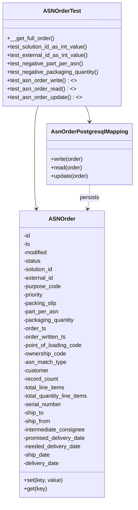

# Diagram: partview_core/partview_service/partview_service/tests/unit/core/datamodel/asn_order_test.py


> Auto-generated by Obscura crawlers

## Diagram 1



### SVG

<svg id="container" width="381.853515625" xmlns="http://www.w3.org/2000/svg" class="classDiagram" height="1424" viewBox="0 0 381.853515625 1424" role="graphics-document document" aria-roledescription="class"><style>#container{font-family:"trebuchet ms",verdana,arial,sans-serif;font-size:16px;fill:#333;}@keyframes edge-animation-frame{from{stroke-dashoffset:0;}}@keyframes dash{to{stroke-dashoffset:0;}}#container .edge-animation-slow{stroke-dasharray:9,5!important;stroke-dashoffset:900;animation:dash 50s linear infinite;stroke-linecap:round;}#container .edge-animation-fast{stroke-dasharray:9,5!important;stroke-dashoffset:900;animation:dash 20s linear infinite;stroke-linecap:round;}#container .error-icon{fill:#552222;}#container .error-text{fill:#552222;stroke:#552222;}#container .edge-thickness-normal{stroke-width:1px;}#container .edge-thickness-thick{stroke-width:3.5px;}#container .edge-pattern-solid{stroke-dasharray:0;}#container .edge-thickness-invisible{stroke-width:0;fill:none;}#container .edge-pattern-dashed{stroke-dasharray:3;}#container .edge-pattern-dotted{stroke-dasharray:2;}#container .marker{fill:#333333;stroke:#333333;}#container .marker.cross{stroke:#333333;}#container svg{font-family:"trebuchet ms",verdana,arial,sans-serif;font-size:16px;}#container p{margin:0;}#container g.classGroup text{fill:#9370DB;stroke:none;font-family:"trebuchet ms",verdana,arial,sans-serif;font-size:10px;}#container g.classGroup text .title{font-weight:bolder;}#container .nodeLabel,#container .edgeLabel{color:#131300;}#container .edgeLabel .label rect{fill:#ECECFF;}#container .label text{fill:#131300;}#container .labelBkg{background:#ECECFF;}#container .edgeLabel .label span{background:#ECECFF;}#container .classTitle{font-weight:bolder;}#container .node rect,#container .node circle,#container .node ellipse,#container .node polygon,#container .node path{fill:#ECECFF;stroke:#9370DB;stroke-width:1px;}#container .divider{stroke:#9370DB;stroke-width:1;}#container g.clickable{cursor:pointer;}#container g.classGroup rect{fill:#ECECFF;stroke:#9370DB;}#container g.classGroup line{stroke:#9370DB;stroke-width:1;}#container .classLabel .box{stroke:none;stroke-width:0;fill:#ECECFF;opacity:0.5;}#container .classLabel .label{fill:#9370DB;font-size:10px;}#container .relation{stroke:#333333;stroke-width:1;fill:none;}#container .dashed-line{stroke-dasharray:3;}#container .dotted-line{stroke-dasharray:1 2;}#container #compositionStart,#container .composition{fill:#333333!important;stroke:#333333!important;stroke-width:1;}#container #compositionEnd,#container .composition{fill:#333333!important;stroke:#333333!important;stroke-width:1;}#container #dependencyStart,#container .dependency{fill:#333333!important;stroke:#333333!important;stroke-width:1;}#container #dependencyStart,#container .dependency{fill:#333333!important;stroke:#333333!important;stroke-width:1;}#container #extensionStart,#container .extension{fill:transparent!important;stroke:#333333!important;stroke-width:1;}#container #extensionEnd,#container .extension{fill:transparent!important;stroke:#333333!important;stroke-width:1;}#container #aggregationStart,#container .aggregation{fill:transparent!important;stroke:#333333!important;stroke-width:1;}#container #aggregationEnd,#container .aggregation{fill:transparent!important;stroke:#333333!important;stroke-width:1;}#container #lollipopStart,#container .lollipop{fill:#ECECFF!important;stroke:#333333!important;stroke-width:1;}#container #lollipopEnd,#container .lollipop{fill:#ECECFF!important;stroke:#333333!important;stroke-width:1;}#container .edgeTerminals{font-size:11px;line-height:initial;}#container .classTitleText{text-anchor:middle;font-size:18px;fill:#333;}#container .label-icon{display:inline-block;height:1em;overflow:visible;vertical-align:-0.125em;}#container .node .label-icon path{fill:currentColor;stroke:revert;stroke-width:revert;}#container :root{--mermaid-font-family:"trebuchet ms",verdana,arial,sans-serif;}</style><g><defs><marker id="container_class-aggregationStart" class="marker aggregation class" refX="18" refY="7" markerWidth="190" markerHeight="240" orient="auto"><path d="M 18,7 L9,13 L1,7 L9,1 Z"></path></marker></defs><defs><marker id="container_class-aggregationEnd" class="marker aggregation class" refX="1" refY="7" markerWidth="20" markerHeight="28" orient="auto"><path d="M 18,7 L9,13 L1,7 L9,1 Z"></path></marker></defs><defs><marker id="container_class-extensionStart" class="marker extension class" refX="18" refY="7" markerWidth="190" markerHeight="240" orient="auto"><path d="M 1,7 L18,13 V 1 Z"></path></marker></defs><defs><marker id="container_class-extensionEnd" class="marker extension class" refX="1" refY="7" markerWidth="20" markerHeight="28" orient="auto"><path d="M 1,1 V 13 L18,7 Z"></path></marker></defs><defs><marker id="container_class-compositionStart" class="marker composition class" refX="18" refY="7" markerWidth="190" markerHeight="240" orient="auto"><path d="M 18,7 L9,13 L1,7 L9,1 Z"></path></marker></defs><defs><marker id="container_class-compositionEnd" class="marker composition class" refX="1" refY="7" markerWidth="20" markerHeight="28" orient="auto"><path d="M 18,7 L9,13 L1,7 L9,1 Z"></path></marker></defs><defs><marker id="container_class-dependencyStart" class="marker dependency class" refX="6" refY="7" markerWidth="190" markerHeight="240" orient="auto"><path d="M 5,7 L9,13 L1,7 L9,1 Z"></path></marker></defs><defs><marker id="container_class-dependencyEnd" class="marker dependency class" refX="13" refY="7" markerWidth="20" markerHeight="28" orient="auto"><path d="M 18,7 L9,13 L14,7 L9,1 Z"></path></marker></defs><defs><marker id="container_class-lollipopStart" class="marker lollipop class" refX="13" refY="7" markerWidth="190" markerHeight="240" orient="auto"><circle stroke="black" fill="transparent" cx="7" cy="7" r="6"></circle></marker></defs><defs><marker id="container_class-lollipopEnd" class="marker lollipop class" refX="1" refY="7" markerWidth="190" markerHeight="240" orient="auto"><circle stroke="black" fill="transparent" cx="7" cy="7" r="6"></circle></marker></defs><g class="root"><g class="clusters"></g><g class="edgePaths"><path d="M112.309,302L110.445,306.167C108.582,310.333,104.854,318.667,102.991,341.5C101.127,364.333,101.127,401.667,101.127,441C101.127,480.333,101.127,521.667,102.023,547.515C102.918,573.363,104.71,583.725,105.606,588.906L106.501,594.088" id="id_ASNOrderTest_ASNOrder_1" class="edge-thickness-normal edge-pattern-solid relation" style=";;;" data-edge="true" data-et="edge" data-id="id_ASNOrderTest_ASNOrder_1" data-points="W3sieCI6MTEyLjMwODg3NzYzNDQ0NzY3LCJ5IjozMDJ9LHsieCI6MTAxLjEyNjk1MzEyNSwieSI6MzI3fSx7IngiOjEwMS4xMjY5NTMxMjUsInkiOjQzOX0seyJ4IjoxMDEuMTI2OTUzMTI1LCJ5Ijo1NjN9LHsieCI6MTA3LjUyMzUxNjUwMjgwODk5LCJ5Ijo2MDB9XQ==" marker-end="url(#container_class-dependencyEnd)"></path><path d="M243.808,302L245.672,306.167C247.536,310.333,251.263,318.667,253.127,326C254.99,333.333,254.99,339.667,254.99,342.833L254.99,346" id="id_ASNOrderTest_AsnOrderPostgresqlMapping_2" class="edge-thickness-normal edge-pattern-solid relation" style=";;;" data-edge="true" data-et="edge" data-id="id_ASNOrderTest_AsnOrderPostgresqlMapping_2" data-points="W3sieCI6MjQzLjgwODMwOTg2NTU1MjMzLCJ5IjozMDJ9LHsieCI6MjU0Ljk5MDIzNDM3NSwieSI6MzI3fSx7IngiOjI1NC45OTAyMzQzNzUsInkiOjM1Mn1d" marker-end="url(#container_class-dependencyEnd)"></path><path d="M254.99,526L254.99,532.167C254.99,538.333,254.99,550.667,254.094,562.015C253.199,573.363,251.407,583.725,250.512,588.906L249.616,594.088" id="id_AsnOrderPostgresqlMapping_ASNOrder_3" class="edge-thickness-normal edge-pattern-dashed relation" style=";;;" data-edge="true" data-et="edge" data-id="id_AsnOrderPostgresqlMapping_ASNOrder_3" data-points="W3sieCI6MjU0Ljk5MDIzNDM3NSwieSI6NTI2fSx7IngiOjI1NC45OTAyMzQzNzUsInkiOjU2M30seyJ4IjoyNDguNTkzNjcwOTk3MTkxLCJ5Ijo2MDB9XQ==" marker-end="url(#container_class-dependencyEnd)"></path></g><g class="edgeLabels"><g class="edgeLabel"><g class="label" data-id="id_ASNOrderTest_ASNOrder_1" transform="translate(0, 0)"><foreignObject width="0" height="0"><div xmlns="http://www.w3.org/1999/xhtml" class="labelBkg" style="display: table-cell; white-space: nowrap; line-height: 1.5; max-width: 200px; text-align: center;"><span class="edgeLabel"></span></div></foreignObject></g></g><g class="edgeLabel"><g class="label" data-id="id_ASNOrderTest_AsnOrderPostgresqlMapping_2" transform="translate(0, 0)"><foreignObject width="0" height="0"><div xmlns="http://www.w3.org/1999/xhtml" class="labelBkg" style="display: table-cell; white-space: nowrap; line-height: 1.5; max-width: 200px; text-align: center;"><span class="edgeLabel"></span></div></foreignObject></g></g><g class="edgeLabel" transform="translate(254.990234375, 563)"><g class="label" data-id="id_AsnOrderPostgresqlMapping_ASNOrder_3" transform="translate(-28.4375, -12)"><foreignObject width="56.875" height="24"><div xmlns="http://www.w3.org/1999/xhtml" class="labelBkg" style="display: table-cell; white-space: nowrap; line-height: 1.5; max-width: 200px; text-align: center;"><span class="edgeLabel"><p>persists</p></span></div></foreignObject></g></g></g><g class="nodes"><g class="node default" id="classId-ASNOrder-0" transform="translate(178.05859375, 1008)"><g class="basic label-container"><path d="M-125.70703125 -408 L125.70703125 -408 L125.70703125 408 L-125.70703125 408" stroke="none" stroke-width="0" fill="#ECECFF" style=""></path><path d="M-125.70703125 -408 C-34.49083104870495 -408, 56.725369152590105 -408, 125.70703125 -408 M-125.70703125 -408 C-39.65556923956245 -408, 46.39589277087509 -408, 125.70703125 -408 M125.70703125 -408 C125.70703125 -84.94377892246388, 125.70703125 238.11244215507224, 125.70703125 408 M125.70703125 -408 C125.70703125 -220.7486839283362, 125.70703125 -33.49736785667238, 125.70703125 408 M125.70703125 408 C66.6451818809674 408, 7.583332511934799 408, -125.70703125 408 M125.70703125 408 C40.61976427558437 408, -44.467502698831254 408, -125.70703125 408 M-125.70703125 408 C-125.70703125 93.36722800306751, -125.70703125 -221.26554399386498, -125.70703125 -408 M-125.70703125 408 C-125.70703125 159.33330354937885, -125.70703125 -89.33339290124229, -125.70703125 -408" stroke="#9370DB" stroke-width="1.3" fill="none" stroke-dasharray="0 0" style=""></path></g><g class="annotation-group text" transform="translate(0, -384)"></g><g class="label-group text" transform="translate(-35.5234375, -384)"><g class="label" style="font-weight: bolder" transform="translate(0,-12)"><foreignObject width="71.046875" height="24"><div xmlns="http://www.w3.org/1999/xhtml" style="display: table-cell; white-space: nowrap; line-height: 1.5; max-width: 121px; text-align: center;"><span class="nodeLabel markdown-node-label" style=""><p>ASNOrder</p></span></div></foreignObject></g></g><g class="members-group text" transform="translate(-113.70703125, -336)"><g class="label" style="" transform="translate(0,-12)"><foreignObject width="20.53125" height="24"><div xmlns="http://www.w3.org/1999/xhtml" style="display: table-cell; white-space: nowrap; line-height: 1.5; max-width: 78px; text-align: center;"><span class="nodeLabel markdown-node-label" style=""><p>-id</p></span></div></foreignObject></g><g class="label" style="" transform="translate(0,12)"><foreignObject width="19.625" height="24"><div xmlns="http://www.w3.org/1999/xhtml" style="display: table-cell; white-space: nowrap; line-height: 1.5; max-width: 77px; text-align: center;"><span class="nodeLabel markdown-node-label" style=""><p>-ts</p></span></div></foreignObject></g><g class="label" style="" transform="translate(0,36)"><foreignObject width="71.078125" height="24"><div xmlns="http://www.w3.org/1999/xhtml" style="display: table-cell; white-space: nowrap; line-height: 1.5; max-width: 128px; text-align: center;"><span class="nodeLabel markdown-node-label" style=""><p>-modified</p></span></div></foreignObject></g><g class="label" style="" transform="translate(0,60)"><foreignObject width="50.859375" height="24"><div xmlns="http://www.w3.org/1999/xhtml" style="display: table-cell; white-space: nowrap; line-height: 1.5; max-width: 108px; text-align: center;"><span class="nodeLabel markdown-node-label" style=""><p>-status</p></span></div></foreignObject></g><g class="label" style="" transform="translate(0,84)"><foreignObject width="88.6875" height="24"><div xmlns="http://www.w3.org/1999/xhtml" style="display: table-cell; white-space: nowrap; line-height: 1.5; max-width: 146px; text-align: center;"><span class="nodeLabel markdown-node-label" style=""><p>-solution_id</p></span></div></foreignObject></g><g class="label" style="" transform="translate(0,108)"><foreignObject width="88.234375" height="24"><div xmlns="http://www.w3.org/1999/xhtml" style="display: table-cell; white-space: nowrap; line-height: 1.5; max-width: 146px; text-align: center;"><span class="nodeLabel markdown-node-label" style=""><p>-external_id</p></span></div></foreignObject></g><g class="label" style="" transform="translate(0,132)"><foreignObject width="109.125" height="24"><div xmlns="http://www.w3.org/1999/xhtml" style="display: table-cell; white-space: nowrap; line-height: 1.5; max-width: 166px; text-align: center;"><span class="nodeLabel markdown-node-label" style=""><p>-purpose_code</p></span></div></foreignObject></g><g class="label" style="" transform="translate(0,156)"><foreignObject width="60.25" height="24"><div xmlns="http://www.w3.org/1999/xhtml" style="display: table-cell; white-space: nowrap; line-height: 1.5; max-width: 118px; text-align: center;"><span class="nodeLabel markdown-node-label" style=""><p>-priority</p></span></div></foreignObject></g><g class="label" style="" transform="translate(0,180)"><foreignObject width="97.109375" height="24"><div xmlns="http://www.w3.org/1999/xhtml" style="display: table-cell; white-space: nowrap; line-height: 1.5; max-width: 154px; text-align: center;"><span class="nodeLabel markdown-node-label" style=""><p>-packing_slip</p></span></div></foreignObject></g><g class="label" style="" transform="translate(0,204)"><foreignObject width="101.28125" height="24"><div xmlns="http://www.w3.org/1999/xhtml" style="display: table-cell; white-space: nowrap; line-height: 1.5; max-width: 159px; text-align: center;"><span class="nodeLabel markdown-node-label" style=""><p>-part_per_asn</p></span></div></foreignObject></g><g class="label" style="" transform="translate(0,228)"><foreignObject width="148.0625" height="24"><div xmlns="http://www.w3.org/1999/xhtml" style="display: table-cell; white-space: nowrap; line-height: 1.5; max-width: 206px; text-align: center;"><span class="nodeLabel markdown-node-label" style=""><p>-packaging_quantity</p></span></div></foreignObject></g><g class="label" style="" transform="translate(0,252)"><foreignObject width="65.921875" height="24"><div xmlns="http://www.w3.org/1999/xhtml" style="display: table-cell; white-space: nowrap; line-height: 1.5; max-width: 123px; text-align: center;"><span class="nodeLabel markdown-node-label" style=""><p>-order_ts</p></span></div></foreignObject></g><g class="label" style="" transform="translate(0,276)"><foreignObject width="125.5" height="24"><div xmlns="http://www.w3.org/1999/xhtml" style="display: table-cell; white-space: nowrap; line-height: 1.5; max-width: 183px; text-align: center;"><span class="nodeLabel markdown-node-label" style=""><p>-order_written_ts</p></span></div></foreignObject></g><g class="label" style="" transform="translate(0,300)"><foreignObject width="172.640625" height="24"><div xmlns="http://www.w3.org/1999/xhtml" style="display: table-cell; white-space: nowrap; line-height: 1.5; max-width: 230px; text-align: center;"><span class="nodeLabel markdown-node-label" style=""><p>-point_of_loading_code</p></span></div></foreignObject></g><g class="label" style="" transform="translate(0,324)"><foreignObject width="124.8125" height="24"><div xmlns="http://www.w3.org/1999/xhtml" style="display: table-cell; white-space: nowrap; line-height: 1.5; max-width: 182px; text-align: center;"><span class="nodeLabel markdown-node-label" style=""><p>-ownership_code</p></span></div></foreignObject></g><g class="label" style="" transform="translate(0,348)"><foreignObject width="124.703125" height="24"><div xmlns="http://www.w3.org/1999/xhtml" style="display: table-cell; white-space: nowrap; line-height: 1.5; max-width: 182px; text-align: center;"><span class="nodeLabel markdown-node-label" style=""><p>-asn_match_type</p></span></div></foreignObject></g><g class="label" style="" transform="translate(0,372)"><foreignObject width="74.21875" height="24"><div xmlns="http://www.w3.org/1999/xhtml" style="display: table-cell; white-space: nowrap; line-height: 1.5; max-width: 132px; text-align: center;"><span class="nodeLabel markdown-node-label" style=""><p>-customer</p></span></div></foreignObject></g><g class="label" style="" transform="translate(0,396)"><foreignObject width="101.9375" height="24"><div xmlns="http://www.w3.org/1999/xhtml" style="display: table-cell; white-space: nowrap; line-height: 1.5; max-width: 160px; text-align: center;"><span class="nodeLabel markdown-node-label" style=""><p>-record_count</p></span></div></foreignObject></g><g class="label" style="" transform="translate(0,420)"><foreignObject width="123.5625" height="24"><div xmlns="http://www.w3.org/1999/xhtml" style="display: table-cell; white-space: nowrap; line-height: 1.5; max-width: 181px; text-align: center;"><span class="nodeLabel markdown-node-label" style=""><p>-total_line_items</p></span></div></foreignObject></g><g class="label" style="" transform="translate(0,444)"><foreignObject width="191.890625" height="24"><div xmlns="http://www.w3.org/1999/xhtml" style="display: table-cell; white-space: nowrap; line-height: 1.5; max-width: 249px; text-align: center;"><span class="nodeLabel markdown-node-label" style=""><p>-total_quantity_line_items</p></span></div></foreignObject></g><g class="label" style="" transform="translate(0,468)"><foreignObject width="111.6875" height="24"><div xmlns="http://www.w3.org/1999/xhtml" style="display: table-cell; white-space: nowrap; line-height: 1.5; max-width: 170px; text-align: center;"><span class="nodeLabel markdown-node-label" style=""><p>-serial_number</p></span></div></foreignObject></g><g class="label" style="" transform="translate(0,492)"><foreignObject width="59.875" height="24"><div xmlns="http://www.w3.org/1999/xhtml" style="display: table-cell; white-space: nowrap; line-height: 1.5; max-width: 117px; text-align: center;"><span class="nodeLabel markdown-node-label" style=""><p>-ship_to</p></span></div></foreignObject></g><g class="label" style="" transform="translate(0,516)"><foreignObject width="79.109375" height="24"><div xmlns="http://www.w3.org/1999/xhtml" style="display: table-cell; white-space: nowrap; line-height: 1.5; max-width: 136px; text-align: center;"><span class="nodeLabel markdown-node-label" style=""><p>-ship_from</p></span></div></foreignObject></g><g class="label" style="" transform="translate(0,540)"><foreignObject width="181.09375" height="24"><div xmlns="http://www.w3.org/1999/xhtml" style="display: table-cell; white-space: nowrap; line-height: 1.5; max-width: 238px; text-align: center;"><span class="nodeLabel markdown-node-label" style=""><p>-intermediate_consignee</p></span></div></foreignObject></g><g class="label" style="" transform="translate(0,564)"><foreignObject width="181.09375" height="24"><div xmlns="http://www.w3.org/1999/xhtml" style="display: table-cell; white-space: nowrap; line-height: 1.5; max-width: 238px; text-align: center;"><span class="nodeLabel markdown-node-label" style=""><p>-promised_delivery_date</p></span></div></foreignObject></g><g class="label" style="" transform="translate(0,588)"><foreignObject width="167.234375" height="24"><div xmlns="http://www.w3.org/1999/xhtml" style="display: table-cell; white-space: nowrap; line-height: 1.5; max-width: 225px; text-align: center;"><span class="nodeLabel markdown-node-label" style=""><p>-needed_delivery_date</p></span></div></foreignObject></g><g class="label" style="" transform="translate(0,612)"><foreignObject width="77.53125" height="24"><div xmlns="http://www.w3.org/1999/xhtml" style="display: table-cell; white-space: nowrap; line-height: 1.5; max-width: 135px; text-align: center;"><span class="nodeLabel markdown-node-label" style=""><p>-ship_date</p></span></div></foreignObject></g><g class="label" style="" transform="translate(0,636)"><foreignObject width="104.5625" height="24"><div xmlns="http://www.w3.org/1999/xhtml" style="display: table-cell; white-space: nowrap; line-height: 1.5; max-width: 162px; text-align: center;"><span class="nodeLabel markdown-node-label" style=""><p>-delivery_date</p></span></div></foreignObject></g></g><g class="methods-group text" transform="translate(-113.70703125, 360)"><g class="label" style="" transform="translate(0,-12)"><foreignObject width="111.21875" height="24"><div xmlns="http://www.w3.org/1999/xhtml" style="display: table-cell; white-space: nowrap; line-height: 1.5; max-width: 169px; text-align: center;"><span class="nodeLabel markdown-node-label" style=""><p>+set(key, value)</p></span></div></foreignObject></g><g class="label" style="" transform="translate(0,12)"><foreignObject width="65.5" height="24"><div xmlns="http://www.w3.org/1999/xhtml" style="display: table-cell; white-space: nowrap; line-height: 1.5; max-width: 123px; text-align: center;"><span class="nodeLabel markdown-node-label" style=""><p>+get(key)</p></span></div></foreignObject></g></g><g class="divider" style=""><path d="M-125.70703125 -360 C-55.131308941092556 -360, 15.444413367814889 -360, 125.70703125 -360 M-125.70703125 -360 C-37.011872017918634 -360, 51.68328721416273 -360, 125.70703125 -360" stroke="#9370DB" stroke-width="1.3" fill="none" stroke-dasharray="0 0" style=""></path></g><g class="divider" style=""><path d="M-125.70703125 336 C-46.717246475105426 336, 32.27253829978915 336, 125.70703125 336 M-125.70703125 336 C-42.30957637919775 336, 41.0878784916045 336, 125.70703125 336" stroke="#9370DB" stroke-width="1.3" fill="none" stroke-dasharray="0 0" style=""></path></g></g><g class="node default" id="classId-ASNOrderTest-1" transform="translate(178.05859375, 155)"><g class="basic label-container"><path d="M-170.05859375 -147 L170.05859375 -147 L170.05859375 147 L-170.05859375 147" stroke="none" stroke-width="0" fill="#ECECFF" style=""></path><path d="M-170.05859375 -147 C-57.82091440967034 -147, 54.416764930659326 -147, 170.05859375 -147 M-170.05859375 -147 C-87.69910215433569 -147, -5.339610558671382 -147, 170.05859375 -147 M170.05859375 -147 C170.05859375 -63.153316817655494, 170.05859375 20.693366364689012, 170.05859375 147 M170.05859375 -147 C170.05859375 -68.54936878661371, 170.05859375 9.901262426772576, 170.05859375 147 M170.05859375 147 C54.2632368534008 147, -61.532120043198404 147, -170.05859375 147 M170.05859375 147 C50.80990530512186 147, -68.43878313975628 147, -170.05859375 147 M-170.05859375 147 C-170.05859375 31.58228414031734, -170.05859375 -83.83543171936532, -170.05859375 -147 M-170.05859375 147 C-170.05859375 36.45576253308877, -170.05859375 -74.08847493382245, -170.05859375 -147" stroke="#9370DB" stroke-width="1.3" fill="none" stroke-dasharray="0 0" style=""></path></g><g class="annotation-group text" transform="translate(0, -123)"></g><g class="label-group text" transform="translate(-50.7734375, -123)"><g class="label" style="font-weight: bolder" transform="translate(0,-12)"><foreignObject width="101.546875" height="24"><div xmlns="http://www.w3.org/1999/xhtml" style="display: table-cell; white-space: nowrap; line-height: 1.5; max-width: 150px; text-align: center;"><span class="nodeLabel markdown-node-label" style=""><p>ASNOrderTest</p></span></div></foreignObject></g></g><g class="members-group text" transform="translate(-158.05859375, -75)"></g><g class="methods-group text" transform="translate(-158.05859375, -45)"><g class="label" style="" transform="translate(0,-12)"><foreignObject width="135.8125" height="24"><div xmlns="http://www.w3.org/1999/xhtml" style="display: table-cell; white-space: nowrap; line-height: 1.5; max-width: 193px; text-align: center;"><span class="nodeLabel markdown-node-label" style=""><p>+__get_full_order()</p></span></div></foreignObject></g><g class="label" style="" transform="translate(0,12)"><foreignObject width="234.734375" height="24"><div xmlns="http://www.w3.org/1999/xhtml" style="display: table-cell; white-space: nowrap; line-height: 1.5; max-width: 292px; text-align: center;"><span class="nodeLabel markdown-node-label" style=""><p>+test_solution_id_as_int_value()</p></span></div></foreignObject></g><g class="label" style="" transform="translate(0,36)"><foreignObject width="233.953125" height="24"><div xmlns="http://www.w3.org/1999/xhtml" style="display: table-cell; white-space: nowrap; line-height: 1.5; max-width: 291px; text-align: center;"><span class="nodeLabel markdown-node-label" style=""><p>+test_external_id_as_int_value()</p></span></div></foreignObject></g><g class="label" style="" transform="translate(0,60)"><foreignObject width="218.5625" height="24"><div xmlns="http://www.w3.org/1999/xhtml" style="display: table-cell; white-space: nowrap; line-height: 1.5; max-width: 276px; text-align: center;"><span class="nodeLabel markdown-node-label" style=""><p>+test_negative_part_per_asn()</p></span></div></foreignObject></g><g class="label" style="" transform="translate(0,84)"><foreignObject width="265.34375" height="24"><div xmlns="http://www.w3.org/1999/xhtml" style="display: table-cell; white-space: nowrap; line-height: 1.5; max-width: 323px; text-align: center;"><span class="nodeLabel markdown-node-label" style=""><p>+test_negative_packaging_quantity()</p></span></div></foreignObject></g><g class="label" style="" transform="translate(0,108)"><foreignObject width="198.140625" height="24"><div xmlns="http://www.w3.org/1999/xhtml" style="display: table-cell; white-space: nowrap; line-height: 1.5; max-width: 295px; text-align: center;"><span class="nodeLabel markdown-node-label" style=""><p>+test_asn_order_write() : &lt;&gt;</p></span></div></foreignObject></g><g class="label" style="" transform="translate(0,132)"><foreignObject width="194.5625" height="24"><div xmlns="http://www.w3.org/1999/xhtml" style="display: table-cell; white-space: nowrap; line-height: 1.5; max-width: 292px; text-align: center;"><span class="nodeLabel markdown-node-label" style=""><p>+test_asn_order_read() : &lt;&gt;</p></span></div></foreignObject></g><g class="label" style="" transform="translate(0,156)"><foreignObject width="213.0625" height="24"><div xmlns="http://www.w3.org/1999/xhtml" style="display: table-cell; white-space: nowrap; line-height: 1.5; max-width: 310px; text-align: center;"><span class="nodeLabel markdown-node-label" style=""><p>+test_asn_order_update() : &lt;&gt;</p></span></div></foreignObject></g></g><g class="divider" style=""><path d="M-170.05859375 -99 C-99.42664312477046 -99, -28.79469249954093 -99, 170.05859375 -99 M-170.05859375 -99 C-36.20668210520202 -99, 97.64522953959596 -99, 170.05859375 -99" stroke="#9370DB" stroke-width="1.3" fill="none" stroke-dasharray="0 0" style=""></path></g><g class="divider" style=""><path d="M-170.05859375 -75 C-78.63171974473225 -75, 12.795154260535497 -75, 170.05859375 -75 M-170.05859375 -75 C-59.623857252295736 -75, 50.81087924540853 -75, 170.05859375 -75" stroke="#9370DB" stroke-width="1.3" fill="none" stroke-dasharray="0 0" style=""></path></g></g><g class="node default" id="classId-AsnOrderPostgresqlMapping-2" transform="translate(254.990234375, 439)"><g class="basic label-container"><path d="M-118.86328125 -87 L118.86328125 -87 L118.86328125 87 L-118.86328125 87" stroke="none" stroke-width="0" fill="#ECECFF" style=""></path><path d="M-118.86328125 -87 C-59.388440672533704 -87, 0.0863999049325912 -87, 118.86328125 -87 M-118.86328125 -87 C-54.636151261832524 -87, 9.590978726334953 -87, 118.86328125 -87 M118.86328125 -87 C118.86328125 -28.708340533375747, 118.86328125 29.583318933248506, 118.86328125 87 M118.86328125 -87 C118.86328125 -47.541603848470125, 118.86328125 -8.08320769694025, 118.86328125 87 M118.86328125 87 C42.81136571787367 87, -33.24054981425266 87, -118.86328125 87 M118.86328125 87 C39.31428015390719 87, -40.23472094218562 87, -118.86328125 87 M-118.86328125 87 C-118.86328125 45.130733505859155, -118.86328125 3.2614670117183095, -118.86328125 -87 M-118.86328125 87 C-118.86328125 19.778651531715838, -118.86328125 -47.442696936568325, -118.86328125 -87" stroke="#9370DB" stroke-width="1.3" fill="none" stroke-dasharray="0 0" style=""></path></g><g class="annotation-group text" transform="translate(0, -63)"></g><g class="label-group text" transform="translate(-104.5234375, -63)"><g class="label" style="font-weight: bolder" transform="translate(0,-12)"><foreignObject width="209.046875" height="24"><div xmlns="http://www.w3.org/1999/xhtml" style="display: table-cell; white-space: nowrap; line-height: 1.5; max-width: 256px; text-align: center;"><span class="nodeLabel markdown-node-label" style=""><p>AsnOrderPostgresqlMapping</p></span></div></foreignObject></g></g><g class="members-group text" transform="translate(-106.86328125, -15)"></g><g class="methods-group text" transform="translate(-106.86328125, 15)"><g class="label" style="" transform="translate(0,-12)"><foreignObject width="94.28125" height="24"><div xmlns="http://www.w3.org/1999/xhtml" style="display: table-cell; white-space: nowrap; line-height: 1.5; max-width: 152px; text-align: center;"><span class="nodeLabel markdown-node-label" style=""><p>+write(order)</p></span></div></foreignObject></g><g class="label" style="" transform="translate(0,12)"><foreignObject width="90.390625" height="24"><div xmlns="http://www.w3.org/1999/xhtml" style="display: table-cell; white-space: nowrap; line-height: 1.5; max-width: 148px; text-align: center;"><span class="nodeLabel markdown-node-label" style=""><p>+read(order)</p></span></div></foreignObject></g><g class="label" style="" transform="translate(0,36)"><foreignObject width="109.203125" height="24"><div xmlns="http://www.w3.org/1999/xhtml" style="display: table-cell; white-space: nowrap; line-height: 1.5; max-width: 167px; text-align: center;"><span class="nodeLabel markdown-node-label" style=""><p>+update(order)</p></span></div></foreignObject></g></g><g class="divider" style=""><path d="M-118.86328125 -39 C-68.27732503174585 -39, -17.691368813491707 -39, 118.86328125 -39 M-118.86328125 -39 C-44.646494328835686 -39, 29.570292592328627 -39, 118.86328125 -39" stroke="#9370DB" stroke-width="1.3" fill="none" stroke-dasharray="0 0" style=""></path></g><g class="divider" style=""><path d="M-118.86328125 -15 C-40.3180188738998 -15, 38.227243502200395 -15, 118.86328125 -15 M-118.86328125 -15 C-39.11159362328476 -15, 40.64009400343048 -15, 118.86328125 -15" stroke="#9370DB" stroke-width="1.3" fill="none" stroke-dasharray="0 0" style=""></path></g></g></g></g></g></svg>

## Diagram 2

```mermaid
sequenceDiagram
participant Test as ASNOrderTest
participant Order as ASNOrder
participant DB as AsnOrderPostgresqlMapping

Test->>Order: __get_full_order() (construct and set fields)
Order-->>Test: ASNOrder with fields set
Test->>Order: set("solution_id", 1234) in test_solution_id_as_int_value
Order-->>Test: AssertionError
Test->>Order: set("external_id", 1234) in test_external_id_as_int_value
Order-->>Test: AssertionError
Test->>Order: set("part_per_asn", -1) in test_negative_part_per_asn
Order-->>Test: AssertionError
Test->>Order: set("packaging_quantity", -1) in test_negative_packaging_quantity
Order-->>Test: AssertionError
alt tests marked skip
  Test-x>DB: test_asn_order_write() skipped
  Test-x>DB: test_asn_order_read() skipped
  Test-x>DB: test_asn_order_update() skipped
else database operations (if not skipped)
  Test->>DB: write(order)
  DB-->>Test: order id / persisted order
  Test->>DB: read(order)
  DB-->>Test: order loaded
  Test->>DB: update(order)
  DB-->>Test: updated order
end
```

> SVG rendering failed for this diagram.
