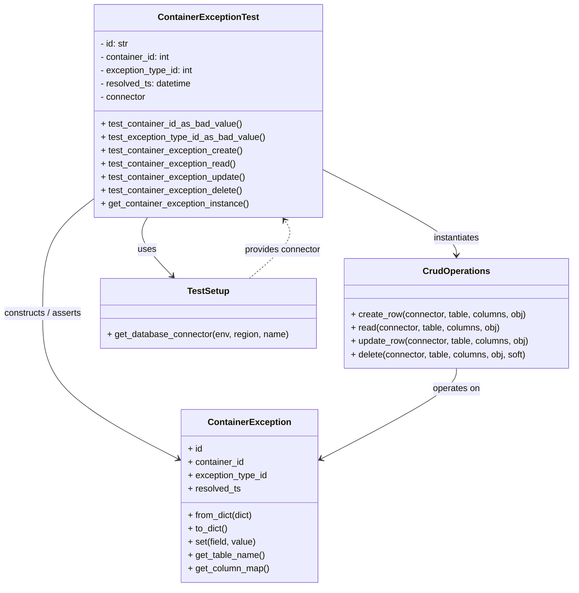
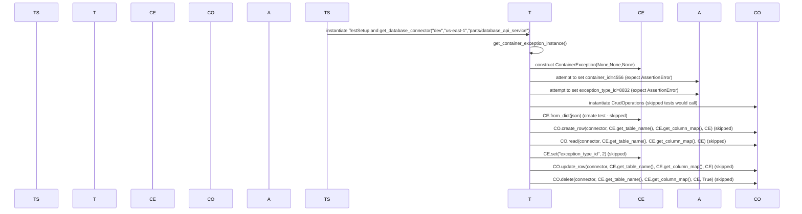

# Diagram: partview_core/partview_service/partview_service/tests/unit/core/datamodel/container_exception_test.py

> Auto-generated by Obscura crawlers

## Diagram 1

### SVG

<svg id="container" width="1041.3828125" xmlns="http://www.w3.org/2000/svg" class="classDiagram" height="1058" viewBox="0 0 1041.3828125 1058" role="graphics-document document" aria-roledescription="class"><g><defs><marker id="container_class-aggregationStart" class="marker aggregation class" refX="18" refY="7" markerWidth="190" markerHeight="240" orient="auto"><path d="M 18,7 L9,13 L1,7 L9,1 Z"></path></marker></defs><defs><marker id="container_class-aggregationEnd" class="marker aggregation class" refX="1" refY="7" markerWidth="20" markerHeight="28" orient="auto"><path d="M 18,7 L9,13 L1,7 L9,1 Z"></path></marker></defs><defs><marker id="container_class-extensionStart" class="marker extension class" refX="18" refY="7" markerWidth="190" markerHeight="240" orient="auto"><path d="M 1,7 L18,13 V 1 Z"></path></marker></defs><defs><marker id="container_class-extensionEnd" class="marker extension class" refX="1" refY="7" markerWidth="20" markerHeight="28" orient="auto"><path d="M 1,1 V 13 L18,7 Z"></path></marker></defs><defs><marker id="container_class-compositionStart" class="marker composition class" refX="18" refY="7" markerWidth="190" markerHeight="240" orient="auto"><path d="M 18,7 L9,13 L1,7 L9,1 Z"></path></marker></defs><defs><marker id="container_class-compositionEnd" class="marker composition class" refX="1" refY="7" markerWidth="20" markerHeight="28" orient="auto"><path d="M 18,7 L9,13 L1,7 L9,1 Z"></path></marker></defs><defs><marker id="container_class-dependencyStart" class="marker dependency class" refX="6" refY="7" markerWidth="190" markerHeight="240" orient="auto"><path d="M 5,7 L9,13 L1,7 L9,1 Z"></path></marker></defs><defs><marker id="container_class-dependencyEnd" class="marker dependency class" refX="13" refY="7" markerWidth="20" markerHeight="28" orient="auto"><path d="M 18,7 L9,13 L14,7 L9,1 Z"></path></marker></defs><defs><marker id="container_class-lollipopStart" class="marker lollipop class" refX="13" refY="7" markerWidth="190" markerHeight="240" orient="auto"><circle stroke="black" fill="transparent" cx="7" cy="7" r="6"></circle></marker></defs><defs><marker id="container_class-lollipopEnd" class="marker lollipop class" refX="1" refY="7" markerWidth="190" markerHeight="240" orient="auto"><circle stroke="black" fill="transparent" cx="7" cy="7" r="6"></circle></marker></defs><g class="root"><g class="clusters"></g><g class="edgePaths"><path d="M270.354,392L266.787,398.167C263.219,404.333,256.084,416.667,263.671,434.284C271.257,451.901,293.565,474.801,304.719,486.252L315.873,497.702" id="id_ContainerExceptionTest_TestSetup_1" class="edge-thickness-normal edge-pattern-solid relation" style=";;;" data-edge="true" data-et="edge" data-id="id_ContainerExceptionTest_TestSetup_1" data-points="W3sieCI6MjcwLjM1NDM1OTk4OTA4MywieSI6MzkyfSx7IngiOjI0OC45NDkyMTg3NSwieSI6NDI5fSx7IngiOjMyMC4wNjAwNTg1OTM3NSwieSI6NTAyfV0=" marker-end="url(#container_class-dependencyEnd)"></path><path d="M585.242,304.131L625.976,324.943C666.71,345.754,748.177,387.377,788.911,413.355C829.645,439.333,829.645,449.667,829.645,454.833L829.645,460" id="id_ContainerExceptionTest_CrudOperations_2" class="edge-thickness-normal edge-pattern-solid relation" style=";;;" data-edge="true" data-et="edge" data-id="id_ContainerExceptionTest_CrudOperations_2" data-points="W3sieCI6NTg1LjI0MjE4NzUsInkiOjMwNC4xMzEwMDU4MTI5OTA4fSx7IngiOjgyOS42NDQ1MzEyNSwieSI6NDI5fSx7IngiOjgyOS42NDQ1MzEyNSwieSI6NDY2fV0=" marker-end="url(#container_class-dependencyEnd)"></path><path d="M177.617,354.827L161.344,367.189C145.07,379.551,112.523,404.276,96.25,439.304C79.977,474.333,79.977,519.667,79.977,565C79.977,610.333,79.977,655.667,121.355,699.639C162.734,743.611,245.492,786.223,286.871,807.529L328.25,828.834" id="id_ContainerExceptionTest_ContainerException_3" class="edge-thickness-normal edge-pattern-solid relation" style=";;;" data-edge="true" data-et="edge" data-id="id_ContainerExceptionTest_ContainerException_3" data-points="W3sieCI6MTc3LjYxNzE4NzUsInkiOjM1NC44MjY5MzIwNDc4OTN9LHsieCI6NzkuOTc2NTYyNSwieSI6NDI5fSx7IngiOjc5Ljk3NjU2MjUsInkiOjU2NX0seyJ4Ijo3OS45NzY1NjI1LCJ5Ijo3MDF9LHsieCI6MzMzLjU4Mzk4NDM3NSwieSI6ODMxLjU4MTA5NTc5NzYxODh9XQ==" marker-end="url(#container_class-dependencyEnd)"></path><path d="M829.645,664L829.645,670.167C829.645,676.333,829.645,688.667,788.266,716.139C746.887,743.611,664.129,786.223,622.75,807.529L581.372,828.834" id="id_CrudOperations_ContainerException_4" class="edge-thickness-normal edge-pattern-solid relation" style=";;;" data-edge="true" data-et="edge" data-id="id_CrudOperations_ContainerException_4" data-points="W3sieCI6ODI5LjY0NDUzMTI1LCJ5Ijo2NjR9LHsieCI6ODI5LjY0NDUzMTI1LCJ5Ijo3MDF9LHsieCI6NTc2LjAzNzEwOTM3NSwieSI6ODMxLjU4MTA5NTc5NzYxODh9XQ==" marker-end="url(#container_class-dependencyEnd)"></path><path d="M454.491,502L468.601,489.833C482.711,477.667,510.931,453.333,521.361,435.824C531.79,418.314,524.43,407.628,520.75,402.284L517.07,396.941" id="id_TestSetup_ContainerExceptionTest_5" class="edge-thickness-normal edge-pattern-dashed relation" style=";;;" data-edge="true" data-et="edge" data-id="id_TestSetup_ContainerExceptionTest_5" data-points="W3sieCI6NDU0LjQ5MTQ4MzgwMDU1MTQ2LCJ5Ijo1MDJ9LHsieCI6NTM5LjE1MDM5MDYyNSwieSI6NDI5fSx7IngiOjUxMy42NjcxMzI5MTQ4NDcxLCJ5IjozOTJ9XQ==" marker-end="url(#container_class-dependencyEnd)"></path></g><g class="edgeLabels"><g class="edgeLabel" transform="translate(269.59121, 450.19037)"><g class="label" data-id="id_ContainerExceptionTest_TestSetup_1" transform="translate(-16.4921875, -12)"><foreignObject width="32.984375" height="24">

uses

</foreignObject></g></g><g class="edgeLabel" transform="translate(829.64453125, 429)"><g class="label" data-id="id_ContainerExceptionTest_CrudOperations_2" transform="translate(-42.9140625, -12)"><foreignObject width="85.828125" height="24">

instantiates

</foreignObject></g></g><g class="edgeLabel" transform="translate(79.9765625, 565)"><g class="label" data-id="id_ContainerExceptionTest_ContainerException_3" transform="translate(-71.9765625, -12)"><foreignObject width="143.953125" height="24">

constructs / asserts

</foreignObject></g></g><g class="edgeLabel" transform="translate(829.64453125, 701)"><g class="label" data-id="id_CrudOperations_ContainerException_4" transform="translate(-43.2890625, -12)"><foreignObject width="86.578125" height="24">

operates on

</foreignObject></g></g><g class="edgeLabel" transform="translate(513.83304, 450.83074)"><g class="label" data-id="id_TestSetup_ContainerExceptionTest_5" transform="translate(-69.859375, -12)"><foreignObject width="139.71875" height="24">

provides connector

</foreignObject></g></g></g><g class="nodes"><g class="node default" id="classId-ContainerExceptionTest-0" transform="translate(381.4296875, 200)"><g class="basic label-container"><path d="M-203.8125 -192 L203.8125 -192 L203.8125 192 L-203.8125 192" stroke="none" stroke-width="0" fill="#ECECFF" style=""></path><path d="M-203.8125 -192 C-53.26321127995021 -192, 97.28607744009958 -192, 203.8125 -192 M-203.8125 -192 C-85.7224563789742 -192, 32.3675872420516 -192, 203.8125 -192 M203.8125 -192 C203.8125 -95.38903453022641, 203.8125 1.2219309395471782, 203.8125 192 M203.8125 -192 C203.8125 -52.30343403540104, 203.8125 87.39313192919792, 203.8125 192 M203.8125 192 C64.0785873679898 192, -75.6553252640204 192, -203.8125 192 M203.8125 192 C113.92648345278643 192, 24.040466905572856 192, -203.8125 192 M-203.8125 192 C-203.8125 41.080016340449646, -203.8125 -109.83996731910071, -203.8125 -192 M-203.8125 192 C-203.8125 94.46188271562855, -203.8125 -3.0762345687429047, -203.8125 -192" stroke="#9370DB" stroke-width="1.3" fill="none" stroke-dasharray="0 0" style=""></path></g><g class="annotation-group text" transform="translate(0, -168)"></g><g class="label-group text" transform="translate(-86.546875, -168)"><g class="label" style="font-weight: bolder" transform="translate(0,-12)"><foreignObject width="173.09375" height="24">

ContainerExceptionTest

</foreignObject></g></g><g class="members-group text" transform="translate(-191.8125, -120)"><g class="label" style="" transform="translate(0,-12)"><foreignObject width="52.28125" height="24">

- id: str

</foreignObject></g><g class="label" style="" transform="translate(0,12)"><foreignObject width="128.765625" height="24">

- container_id: int

</foreignObject></g><g class="label" style="" transform="translate(0,36)"><foreignObject width="171.0625" height="24">

- exception_type_id: int

</foreignObject></g><g class="label" style="" transform="translate(0,60)"><foreignObject width="167.125" height="24">

- resolved_ts: datetime

</foreignObject></g><g class="label" style="" transform="translate(0,84)"><foreignObject width="83.546875" height="24">

- connector

</foreignObject></g></g><g class="methods-group text" transform="translate(-191.8125, 24)"><g class="label" style="" transform="translate(0,-12)"><foreignObject width="254.78125" height="24">

+ test_container_id_as_bad_value()

</foreignObject></g><g class="label" style="" transform="translate(0,12)"><foreignObject width="297.078125" height="24">

+ test_exception_type_id_as_bad_value()

</foreignObject></g><g class="label" style="" transform="translate(0,36)"><foreignObject width="257.640625" height="24">

+ test_container_exception_create()

</foreignObject></g><g class="label" style="" transform="translate(0,60)"><foreignObject width="245.625" height="24">

+ test_container_exception_read()

</foreignObject></g><g class="label" style="" transform="translate(0,84)"><foreignObject width="264.125" height="24">

+ test_container_exception_update()

</foreignObject></g><g class="label" style="" transform="translate(0,108)"><foreignObject width="258.640625" height="24">

+ test_container_exception_delete()

</foreignObject></g><g class="label" style="" transform="translate(0,132)"><foreignObject width="269.296875" height="24">

+ get_container_exception_instance()

</foreignObject></g></g><g class="divider" style=""><path d="M-203.8125 -144 C-66.91772082733738 -144, 69.97705834532525 -144, 203.8125 -144 M-203.8125 -144 C-54.82698039136278 -144, 94.15853921727444 -144, 203.8125 -144" stroke="#9370DB" stroke-width="1.3" fill="none" stroke-dasharray="0 0" style=""></path></g><g class="divider" style=""><path d="M-203.8125 0 C-110.42230346619077 0, -17.032106932381538 0, 203.8125 0 M-203.8125 0 C-81.40672193254781 0, 40.99905613490438 0, 203.8125 0" stroke="#9370DB" stroke-width="1.3" fill="none" stroke-dasharray="0 0" style=""></path></g></g><g class="node default" id="classId-ContainerException-1" transform="translate(454.810546875, 894)"><g class="basic label-container"><path d="M-121.2265625 -156 L121.2265625 -156 L121.2265625 156 L-121.2265625 156" stroke="none" stroke-width="0" fill="#ECECFF" style=""></path><path d="M-121.2265625 -156 C-63.814135406326244 -156, -6.401708312652488 -156, 121.2265625 -156 M-121.2265625 -156 C-38.32465595648851 -156, 44.577250587022974 -156, 121.2265625 -156 M121.2265625 -156 C121.2265625 -77.92091087189485, 121.2265625 0.1581782562103058, 121.2265625 156 M121.2265625 -156 C121.2265625 -34.952951329903655, 121.2265625 86.09409734019269, 121.2265625 156 M121.2265625 156 C66.70787652787882 156, 12.189190555757634 156, -121.2265625 156 M121.2265625 156 C60.94845262593473 156, 0.6703427518694554 156, -121.2265625 156 M-121.2265625 156 C-121.2265625 77.70272613867907, -121.2265625 -0.5945477226418632, -121.2265625 -156 M-121.2265625 156 C-121.2265625 34.66469384522732, -121.2265625 -86.67061230954536, -121.2265625 -156" stroke="#9370DB" stroke-width="1.3" fill="none" stroke-dasharray="0 0" style=""></path></g><g class="annotation-group text" transform="translate(0, -132)"></g><g class="label-group text" transform="translate(-71.296875, -132)"><g class="label" style="font-weight: bolder" transform="translate(0,-12)"><foreignObject width="142.59375" height="24">

ContainerException

</foreignObject></g></g><g class="members-group text" transform="translate(-109.2265625, -84)"><g class="label" style="" transform="translate(0,-12)"><foreignObject width="26.3125" height="24">

+ id

</foreignObject></g><g class="label" style="" transform="translate(0,12)"><foreignObject width="102.546875" height="24">

+ container_id

</foreignObject></g><g class="label" style="" transform="translate(0,36)"><foreignObject width="144.859375" height="24">

+ exception_type_id

</foreignObject></g><g class="label" style="" transform="translate(0,60)"><foreignObject width="95.34375" height="24">

+ resolved_ts

</foreignObject></g></g><g class="methods-group text" transform="translate(-109.2265625, 36)"><g class="label" style="" transform="translate(0,-12)"><foreignObject width="119.71875" height="24">

+ from_dict(dict)

</foreignObject></g><g class="label" style="" transform="translate(0,12)"><foreignObject width="72.65625" height="24">

+ to_dict()

</foreignObject></g><g class="label" style="" transform="translate(0,36)"><foreignObject width="123.625" height="24">

+ set(field, value)

</foreignObject></g><g class="label" style="" transform="translate(0,60)"><foreignObject width="138.875" height="24">

+ get_table_name()

</foreignObject></g><g class="label" style="" transform="translate(0,84)"><foreignObject width="147.15625" height="24">

+ get_column_map()

</foreignObject></g></g><g class="divider" style=""><path d="M-121.2265625 -108 C-58.31207961923875 -108, 4.602403261522497 -108, 121.2265625 -108 M-121.2265625 -108 C-33.965779912177524 -108, 53.29500267564495 -108, 121.2265625 -108" stroke="#9370DB" stroke-width="1.3" fill="none" stroke-dasharray="0 0" style=""></path></g><g class="divider" style=""><path d="M-121.2265625 12 C-58.38220723704186 12, 4.462148025916278 12, 121.2265625 12 M-121.2265625 12 C-30.573192688360223 12, 60.080177123279555 12, 121.2265625 12" stroke="#9370DB" stroke-width="1.3" fill="none" stroke-dasharray="0 0" style=""></path></g></g><g class="node default" id="classId-CrudOperations-2" transform="translate(829.64453125, 565)"><g class="basic label-container"><path d="M-203.73828125 -99 L203.73828125 -99 L203.73828125 99 L-203.73828125 99" stroke="none" stroke-width="0" fill="#ECECFF" style=""></path><path d="M-203.73828125 -99 C-65.16756156257932 -99, 73.40315812484135 -99, 203.73828125 -99 M-203.73828125 -99 C-71.51873718356771 -99, 60.70080688286458 -99, 203.73828125 -99 M203.73828125 -99 C203.73828125 -45.929412153639305, 203.73828125 7.14117569272139, 203.73828125 99 M203.73828125 -99 C203.73828125 -35.508179643545326, 203.73828125 27.98364071290935, 203.73828125 99 M203.73828125 99 C72.00600603785765 99, -59.72626917428471 99, -203.73828125 99 M203.73828125 99 C43.29165714758963 99, -117.15496695482074 99, -203.73828125 99 M-203.73828125 99 C-203.73828125 34.98029095540258, -203.73828125 -29.03941808919484, -203.73828125 -99 M-203.73828125 99 C-203.73828125 32.11572768868574, -203.73828125 -34.768544622628525, -203.73828125 -99" stroke="#9370DB" stroke-width="1.3" fill="none" stroke-dasharray="0 0" style=""></path></g><g class="annotation-group text" transform="translate(0, -75)"></g><g class="label-group text" transform="translate(-57.6171875, -75)"><g class="label" style="font-weight: bolder" transform="translate(0,-12)"><foreignObject width="115.234375" height="24">

CrudOperations

</foreignObject></g></g><g class="members-group text" transform="translate(-191.73828125, -27)"></g><g class="methods-group text" transform="translate(-191.73828125, 3)"><g class="label" style="" transform="translate(0,-12)"><foreignObject width="319.390625" height="24">

+ create_row(connector, table, columns, obj)

</foreignObject></g><g class="label" style="" transform="translate(0,12)"><foreignObject width="272.53125" height="24">

+ read(connector, table, columns, obj)

</foreignObject></g><g class="label" style="" transform="translate(0,36)"><foreignObject width="325.859375" height="24">

+ update_row(connector, table, columns, obj)

</foreignObject></g><g class="label" style="" transform="translate(0,60)"><foreignObject width="321.90625" height="24">

+ delete(connector, table, columns, obj, soft)

</foreignObject></g></g><g class="divider" style=""><path d="M-203.73828125 -51 C-76.02179790132445 -51, 51.694685447351105 -51, 203.73828125 -51 M-203.73828125 -51 C-62.907860361798896 -51, 77.92256052640221 -51, 203.73828125 -51" stroke="#9370DB" stroke-width="1.3" fill="none" stroke-dasharray="0 0" style=""></path></g><g class="divider" style=""><path d="M-203.73828125 -27 C-52.77713806988925 -27, 98.1840051102215 -27, 203.73828125 -27 M-203.73828125 -27 C-67.46535749923933 -27, 68.80756625152134 -27, 203.73828125 -27" stroke="#9370DB" stroke-width="1.3" fill="none" stroke-dasharray="0 0" style=""></path></g></g><g class="node default" id="classId-TestSetup-3" transform="translate(381.4296875, 565)"><g class="basic label-container"><path d="M-194.4765625 -63 L194.4765625 -63 L194.4765625 63 L-194.4765625 63" stroke="none" stroke-width="0" fill="#ECECFF" style=""></path><path d="M-194.4765625 -63 C-85.44439341219486 -63, 23.58777567561029 -63, 194.4765625 -63 M-194.4765625 -63 C-99.31709875280858 -63, -4.157635005617152 -63, 194.4765625 -63 M194.4765625 -63 C194.4765625 -13.661856743670299, 194.4765625 35.6762865126594, 194.4765625 63 M194.4765625 -63 C194.4765625 -32.49355787183846, 194.4765625 -1.9871157436769167, 194.4765625 63 M194.4765625 63 C74.09985219655923 63, -46.27685810688155 63, -194.4765625 63 M194.4765625 63 C43.04396573852466 63, -108.38863102295068 63, -194.4765625 63 M-194.4765625 63 C-194.4765625 16.906182737886574, -194.4765625 -29.18763452422685, -194.4765625 -63 M-194.4765625 63 C-194.4765625 29.210711984615124, -194.4765625 -4.578576030769753, -194.4765625 -63" stroke="#9370DB" stroke-width="1.3" fill="none" stroke-dasharray="0 0" style=""></path></g><g class="annotation-group text" transform="translate(0, -39)"></g><g class="label-group text" transform="translate(-36.6875, -39)"><g class="label" style="font-weight: bolder" transform="translate(0,-12)"><foreignObject width="73.375" height="24">

TestSetup

</foreignObject></g></g><g class="members-group text" transform="translate(-182.4765625, 9)"></g><g class="methods-group text" transform="translate(-182.4765625, 39)"><g class="label" style="" transform="translate(0,-12)"><foreignObject width="328.265625" height="24">

+ get_database_connector(env, region, name)

</foreignObject></g></g><g class="divider" style=""><path d="M-194.4765625 -15 C-106.58604257400631 -15, -18.695522648012627 -15, 194.4765625 -15 M-194.4765625 -15 C-106.38040722248805 -15, -18.28425194497609 -15, 194.4765625 -15" stroke="#9370DB" stroke-width="1.3" fill="none" stroke-dasharray="0 0" style=""></path></g><g class="divider" style=""><path d="M-194.4765625 9 C-82.36654808433101 9, 29.74346633133797 9, 194.4765625 9 M-194.4765625 9 C-58.84006216804332 9, 76.79643816391336 9, 194.4765625 9" stroke="#9370DB" stroke-width="1.3" fill="none" stroke-dasharray="0 0" style=""></path></g></g></g></g></g></svg>

## Diagram 2

### SVG

<svg id="container" width="2847" xmlns="http://www.w3.org/2000/svg" height="777" viewBox="-50 -10 2847 777" role="graphics-document document" aria-roledescription="sequence"><g><rect x="2597" y="691" fill="#eaeaea" stroke="#666" width="150" height="65" name="CO" rx="3" ry="3" class="actor actor-bottom"></rect><text x="2672" y="723.5" dominant-baseline="central" alignment-baseline="central" class="actor actor-box" style="text-anchor: middle; font-size: 16px; font-weight: 400;"><tspan x="2672" dy="0">CO</tspan></text></g><g><rect x="2397" y="691" fill="#eaeaea" stroke="#666" width="150" height="65" name="A" rx="3" ry="3" class="actor actor-bottom"></rect><text x="2472" y="723.5" dominant-baseline="central" alignment-baseline="central" class="actor actor-box" style="text-anchor: middle; font-size: 16px; font-weight: 400;"><tspan x="2472" dy="0">A</tspan></text></g><g><rect x="2197" y="691" fill="#eaeaea" stroke="#666" width="150" height="65" name="CE" rx="3" ry="3" class="actor actor-bottom"></rect><text x="2272" y="723.5" dominant-baseline="central" alignment-baseline="central" class="actor actor-box" style="text-anchor: middle; font-size: 16px; font-weight: 400;"><tspan x="2272" dy="0">CE</tspan></text></g><g><rect x="1780" y="691" fill="#eaeaea" stroke="#666" width="150" height="65" name="T" rx="3" ry="3" class="actor actor-bottom"></rect><text x="1855" y="723.5" dominant-baseline="central" alignment-baseline="central" class="actor actor-box" style="text-anchor: middle; font-size: 16px; font-weight: 400;"><tspan x="1855" dy="0">T</tspan></text></g><g><rect x="1000" y="691" fill="#eaeaea" stroke="#666" width="150" height="65" name="TS" rx="3" ry="3" class="actor actor-bottom"></rect><text x="1075" y="723.5" dominant-baseline="central" alignment-baseline="central" class="actor actor-box" style="text-anchor: middle; font-size: 16px; font-weight: 400;"><tspan x="1075" dy="0">TS</tspan></text></g><g><rect x="800" y="691" fill="#eaeaea" stroke="#666" width="150" height="65" name="Assertion" rx="3" ry="3" class="actor actor-bottom"></rect><text x="875" y="723.5" dominant-baseline="central" alignment-baseline="central" class="actor actor-box" style="text-anchor: middle; font-size: 16px; font-weight: 400;"><tspan x="875" dy="0">A</tspan></text></g><g><rect x="600" y="691" fill="#eaeaea" stroke="#666" width="150" height="65" name="CrudOperations" rx="3" ry="3" class="actor actor-bottom"></rect><text x="675" y="723.5" dominant-baseline="central" alignment-baseline="central" class="actor actor-box" style="text-anchor: middle; font-size: 16px; font-weight: 400;"><tspan x="675" dy="0">CO</tspan></text></g><g><rect x="400" y="691" fill="#eaeaea" stroke="#666" width="150" height="65" name="ContainerException" rx="3" ry="3" class="actor actor-bottom"></rect><text x="475" y="723.5" dominant-baseline="central" alignment-baseline="central" class="actor actor-box" style="text-anchor: middle; font-size: 16px; font-weight: 400;"><tspan x="475" dy="0">CE</tspan></text></g><g><rect x="200" y="691" fill="#eaeaea" stroke="#666" width="150" height="65" name="ContainerExceptionTest" rx="3" ry="3" class="actor actor-bottom"></rect><text x="275" y="723.5" dominant-baseline="central" alignment-baseline="central" class="actor actor-box" style="text-anchor: middle; font-size: 16px; font-weight: 400;"><tspan x="275" dy="0">T</tspan></text></g><g><rect x="0" y="691" fill="#eaeaea" stroke="#666" width="150" height="65" name="TestSetup" rx="3" ry="3" class="actor actor-bottom"></rect><text x="75" y="723.5" dominant-baseline="central" alignment-baseline="central" class="actor actor-box" style="text-anchor: middle; font-size: 16px; font-weight: 400;"><tspan x="75" dy="0">TS</tspan></text></g><g><line id="actor9" x1="2672" y1="65" x2="2672" y2="691" class="actor-line 200" stroke-width="0.5px" stroke="#999" name="CO"></line><g id="root-9"><rect x="2597" y="0" fill="#eaeaea" stroke="#666" width="150" height="65" name="CO" rx="3" ry="3" class="actor actor-top"></rect><text x="2672" y="32.5" dominant-baseline="central" alignment-baseline="central" class="actor actor-box" style="text-anchor: middle; font-size: 16px; font-weight: 400;"><tspan x="2672" dy="0">CO</tspan></text></g></g><g><line id="actor8" x1="2472" y1="65" x2="2472" y2="691" class="actor-line 200" stroke-width="0.5px" stroke="#999" name="A"></line><g id="root-8"><rect x="2397" y="0" fill="#eaeaea" stroke="#666" width="150" height="65" name="A" rx="3" ry="3" class="actor actor-top"></rect><text x="2472" y="32.5" dominant-baseline="central" alignment-baseline="central" class="actor actor-box" style="text-anchor: middle; font-size: 16px; font-weight: 400;"><tspan x="2472" dy="0">A</tspan></text></g></g><g><line id="actor7" x1="2272" y1="65" x2="2272" y2="691" class="actor-line 200" stroke-width="0.5px" stroke="#999" name="CE"></line><g id="root-7"><rect x="2197" y="0" fill="#eaeaea" stroke="#666" width="150" height="65" name="CE" rx="3" ry="3" class="actor actor-top"></rect><text x="2272" y="32.5" dominant-baseline="central" alignment-baseline="central" class="actor actor-box" style="text-anchor: middle; font-size: 16px; font-weight: 400;"><tspan x="2272" dy="0">CE</tspan></text></g></g><g><line id="actor6" x1="1855" y1="65" x2="1855" y2="691" class="actor-line 200" stroke-width="0.5px" stroke="#999" name="T"></line><g id="root-6"><rect x="1780" y="0" fill="#eaeaea" stroke="#666" width="150" height="65" name="T" rx="3" ry="3" class="actor actor-top"></rect><text x="1855" y="32.5" dominant-baseline="central" alignment-baseline="central" class="actor actor-box" style="text-anchor: middle; font-size: 16px; font-weight: 400;"><tspan x="1855" dy="0">T</tspan></text></g></g><g><line id="actor5" x1="1075" y1="65" x2="1075" y2="691" class="actor-line 200" stroke-width="0.5px" stroke="#999" name="TS"></line><g id="root-5"><rect x="1000" y="0" fill="#eaeaea" stroke="#666" width="150" height="65" name="TS" rx="3" ry="3" class="actor actor-top"></rect><text x="1075" y="32.5" dominant-baseline="central" alignment-baseline="central" class="actor actor-box" style="text-anchor: middle; font-size: 16px; font-weight: 400;"><tspan x="1075" dy="0">TS</tspan></text></g></g><g><line id="actor4" x1="875" y1="65" x2="875" y2="691" class="actor-line 200" stroke-width="0.5px" stroke="#999" name="Assertion"></line><g id="root-4"><rect x="800" y="0" fill="#eaeaea" stroke="#666" width="150" height="65" name="Assertion" rx="3" ry="3" class="actor actor-top"></rect><text x="875" y="32.5" dominant-baseline="central" alignment-baseline="central" class="actor actor-box" style="text-anchor: middle; font-size: 16px; font-weight: 400;"><tspan x="875" dy="0">A</tspan></text></g></g><g><line id="actor3" x1="675" y1="65" x2="675" y2="691" class="actor-line 200" stroke-width="0.5px" stroke="#999" name="CrudOperations"></line><g id="root-3"><rect x="600" y="0" fill="#eaeaea" stroke="#666" width="150" height="65" name="CrudOperations" rx="3" ry="3" class="actor actor-top"></rect><text x="675" y="32.5" dominant-baseline="central" alignment-baseline="central" class="actor actor-box" style="text-anchor: middle; font-size: 16px; font-weight: 400;"><tspan x="675" dy="0">CO</tspan></text></g></g><g><line id="actor2" x1="475" y1="65" x2="475" y2="691" class="actor-line 200" stroke-width="0.5px" stroke="#999" name="ContainerException"></line><g id="root-2"><rect x="400" y="0" fill="#eaeaea" stroke="#666" width="150" height="65" name="ContainerException" rx="3" ry="3" class="actor actor-top"></rect><text x="475" y="32.5" dominant-baseline="central" alignment-baseline="central" class="actor actor-box" style="text-anchor: middle; font-size: 16px; font-weight: 400;"><tspan x="475" dy="0">CE</tspan></text></g></g><g><line id="actor1" x1="275" y1="65" x2="275" y2="691" class="actor-line 200" stroke-width="0.5px" stroke="#999" name="ContainerExceptionTest"></line><g id="root-1"><rect x="200" y="0" fill="#eaeaea" stroke="#666" width="150" height="65" name="ContainerExceptionTest" rx="3" ry="3" class="actor actor-top"></rect><text x="275" y="32.5" dominant-baseline="central" alignment-baseline="central" class="actor actor-box" style="text-anchor: middle; font-size: 16px; font-weight: 400;"><tspan x="275" dy="0">T</tspan></text></g></g><g><line id="actor0" x1="75" y1="65" x2="75" y2="691" class="actor-line 200" stroke-width="0.5px" stroke="#999" name="TestSetup"></line><g id="root-0"><rect x="0" y="0" fill="#eaeaea" stroke="#666" width="150" height="65" name="TestSetup" rx="3" ry="3" class="actor actor-top"></rect><text x="75" y="32.5" dominant-baseline="central" alignment-baseline="central" class="actor actor-box" style="text-anchor: middle; font-size: 16px; font-weight: 400;"><tspan x="75" dy="0">TS</tspan></text></g></g><g></g><defs><symbol id="computer" width="24" height="24"><path transform="scale(.5)" d="M2 2v13h20v-13h-20zm18 11h-16v-9h16v9zm-10.228 6l.466-1h3.524l.467 1h-4.457zm14.228 3h-24l2-6h2.104l-1.33 4h18.45l-1.297-4h2.073l2 6zm-5-10h-14v-7h14v7z"></path></symbol></defs><defs><symbol id="database" fill-rule="evenodd" clip-rule="evenodd"><path transform="scale(.5)" d="M12.258.001l.256.004.255.005.253.008.251.01.249.012.247.015.246.016.242.019.241.02.239.023.236.024.233.027.231.028.229.031.225.032.223.034.22.036.217.038.214.04.211.041.208.043.205.045.201.046.198.048.194.05.191.051.187.053.183.054.18.056.175.057.172.059.168.06.163.061.16.063.155.064.15.066.074.033.073.033.071.034.07.034.069.035.068.035.067.035.066.035.064.036.064.036.062.036.06.036.06.037.058.037.058.037.055.038.055.038.053.038.052.038.051.039.05.039.048.039.047.039.045.04.044.04.043.04.041.04.04.041.039.041.037.041.036.041.034.041.033.042.032.042.03.042.029.042.027.042.026.043.024.043.023.043.021.043.02.043.018.044.017.043.015.044.013.044.012.044.011.045.009.044.007.045.006.045.004.045.002.045.001.045v17l-.001.045-.002.045-.004.045-.006.045-.007.045-.009.044-.011.045-.012.044-.013.044-.015.044-.017.043-.018.044-.02.043-.021.043-.023.043-.024.043-.026.043-.027.042-.029.042-.03.042-.032.042-.033.042-.034.041-.036.041-.037.041-.039.041-.04.041-.041.04-.043.04-.044.04-.045.04-.047.039-.048.039-.05.039-.051.039-.052.038-.053.038-.055.038-.055.038-.058.037-.058.037-.06.037-.06.036-.062.036-.064.036-.064.036-.066.035-.067.035-.068.035-.069.035-.07.034-.071.034-.073.033-.074.033-.15.066-.155.064-.16.063-.163.061-.168.06-.172.059-.175.057-.18.056-.183.054-.187.053-.191.051-.194.05-.198.048-.201.046-.205.045-.208.043-.211.041-.214.04-.217.038-.22.036-.223.034-.225.032-.229.031-.231.028-.233.027-.236.024-.239.023-.241.02-.242.019-.246.016-.247.015-.249.012-.251.01-.253.008-.255.005-.256.004-.258.001-.258-.001-.256-.004-.255-.005-.253-.008-.251-.01-.249-.012-.247-.015-.245-.016-.243-.019-.241-.02-.238-.023-.236-.024-.234-.027-.231-.028-.228-.031-.226-.032-.223-.034-.22-.036-.217-.038-.214-.04-.211-.041-.208-.043-.204-.045-.201-.046-.198-.048-.195-.05-.19-.051-.187-.053-.184-.054-.179-.056-.176-.057-.172-.059-.167-.06-.164-.061-.159-.063-.155-.064-.151-.066-.074-.033-.072-.033-.072-.034-.07-.034-.069-.035-.068-.035-.067-.035-.066-.035-.064-.036-.063-.036-.062-.036-.061-.036-.06-.037-.058-.037-.057-.037-.056-.038-.055-.038-.053-.038-.052-.038-.051-.039-.049-.039-.049-.039-.046-.039-.046-.04-.044-.04-.043-.04-.041-.04-.04-.041-.039-.041-.037-.041-.036-.041-.034-.041-.033-.042-.032-.042-.03-.042-.029-.042-.027-.042-.026-.043-.024-.043-.023-.043-.021-.043-.02-.043-.018-.044-.017-.043-.015-.044-.013-.044-.012-.044-.011-.045-.009-.044-.007-.045-.006-.045-.004-.045-.002-.045-.001-.045v-17l.001-.045.002-.045.004-.045.006-.045.007-.045.009-.044.011-.045.012-.044.013-.044.015-.044.017-.043.018-.044.02-.043.021-.043.023-.043.024-.043.026-.043.027-.042.029-.042.03-.042.032-.042.033-.042.034-.041.036-.041.037-.041.039-.041.04-.041.041-.04.043-.04.044-.04.046-.04.046-.039.049-.039.049-.039.051-.039.052-.038.053-.038.055-.038.056-.038.057-.037.058-.037.06-.037.061-.036.062-.036.063-.036.064-.036.066-.035.067-.035.068-.035.069-.035.07-.034.072-.034.072-.033.074-.033.151-.066.155-.064.159-.063.164-.061.167-.06.172-.059.176-.057.179-.056.184-.054.187-.053.19-.051.195-.05.198-.048.201-.046.204-.045.208-.043.211-.041.214-.04.217-.038.22-.036.223-.034.226-.032.228-.031.231-.028.234-.027.236-.024.238-.023.241-.02.243-.019.245-.016.247-.015.249-.012.251-.01.253-.008.255-.005.256-.004.258-.001.258.001zm-9.258 20.499v.01l.001.021.003.021.004.022.005.021.006.022.007.022.009.023.01.022.011.023.012.023.013.023.015.023.016.024.017.023.018.024.019.024.021.024.022.025.023.024.024.025.052.049.056.05.061.051.066.051.07.051.075.051.079.052.084.052.088.052.092.052.097.052.102.051.105.052.11.052.114.051.119.051.123.051.127.05.131.05.135.05.139.048.144.049.147.047.152.047.155.047.16.045.163.045.167.043.171.043.176.041.178.041.183.039.187.039.19.037.194.035.197.035.202.033.204.031.209.03.212.029.216.027.219.025.222.024.226.021.23.02.233.018.236.016.24.015.243.012.246.01.249.008.253.005.256.004.259.001.26-.001.257-.004.254-.005.25-.008.247-.011.244-.012.241-.014.237-.016.233-.018.231-.021.226-.021.224-.024.22-.026.216-.027.212-.028.21-.031.205-.031.202-.034.198-.034.194-.036.191-.037.187-.039.183-.04.179-.04.175-.042.172-.043.168-.044.163-.045.16-.046.155-.046.152-.047.148-.048.143-.049.139-.049.136-.05.131-.05.126-.05.123-.051.118-.052.114-.051.11-.052.106-.052.101-.052.096-.052.092-.052.088-.053.083-.051.079-.052.074-.052.07-.051.065-.051.06-.051.056-.05.051-.05.023-.024.023-.025.021-.024.02-.024.019-.024.018-.024.017-.024.015-.023.014-.024.013-.023.012-.023.01-.023.01-.022.008-.022.006-.022.006-.022.004-.022.004-.021.001-.021.001-.021v-4.127l-.077.055-.08.053-.083.054-.085.053-.087.052-.09.052-.093.051-.095.05-.097.05-.1.049-.102.049-.105.048-.106.047-.109.047-.111.046-.114.045-.115.045-.118.044-.12.043-.122.042-.124.042-.126.041-.128.04-.13.04-.132.038-.134.038-.135.037-.138.037-.139.035-.142.035-.143.034-.144.033-.147.032-.148.031-.15.03-.151.03-.153.029-.154.027-.156.027-.158.026-.159.025-.161.024-.162.023-.163.022-.165.021-.166.02-.167.019-.169.018-.169.017-.171.016-.173.015-.173.014-.175.013-.175.012-.177.011-.178.01-.179.008-.179.008-.181.006-.182.005-.182.004-.184.003-.184.002h-.37l-.184-.002-.184-.003-.182-.004-.182-.005-.181-.006-.179-.008-.179-.008-.178-.01-.176-.011-.176-.012-.175-.013-.173-.014-.172-.015-.171-.016-.17-.017-.169-.018-.167-.019-.166-.02-.165-.021-.163-.022-.162-.023-.161-.024-.159-.025-.157-.026-.156-.027-.155-.027-.153-.029-.151-.03-.15-.03-.148-.031-.146-.032-.145-.033-.143-.034-.141-.035-.14-.035-.137-.037-.136-.037-.134-.038-.132-.038-.13-.04-.128-.04-.126-.041-.124-.042-.122-.042-.12-.044-.117-.043-.116-.045-.113-.045-.112-.046-.109-.047-.106-.047-.105-.048-.102-.049-.1-.049-.097-.05-.095-.05-.093-.052-.09-.051-.087-.052-.085-.053-.083-.054-.08-.054-.077-.054v4.127zm0-5.654v.011l.001.021.003.021.004.021.005.022.006.022.007.022.009.022.01.022.011.023.012.023.013.023.015.024.016.023.017.024.018.024.019.024.021.024.022.024.023.025.024.024.052.05.056.05.061.05.066.051.07.051.075.052.079.051.084.052.088.052.092.052.097.052.102.052.105.052.11.051.114.051.119.052.123.05.127.051.131.05.135.049.139.049.144.048.147.048.152.047.155.046.16.045.163.045.167.044.171.042.176.042.178.04.183.04.187.038.19.037.194.036.197.034.202.033.204.032.209.03.212.028.216.027.219.025.222.024.226.022.23.02.233.018.236.016.24.014.243.012.246.01.249.008.253.006.256.003.259.001.26-.001.257-.003.254-.006.25-.008.247-.01.244-.012.241-.015.237-.016.233-.018.231-.02.226-.022.224-.024.22-.025.216-.027.212-.029.21-.03.205-.032.202-.033.198-.035.194-.036.191-.037.187-.039.183-.039.179-.041.175-.042.172-.043.168-.044.163-.045.16-.045.155-.047.152-.047.148-.048.143-.048.139-.05.136-.049.131-.05.126-.051.123-.051.118-.051.114-.052.11-.052.106-.052.101-.052.096-.052.092-.052.088-.052.083-.052.079-.052.074-.051.07-.052.065-.051.06-.05.056-.051.051-.049.023-.025.023-.024.021-.025.02-.024.019-.024.018-.024.017-.024.015-.023.014-.023.013-.024.012-.022.01-.023.01-.023.008-.022.006-.022.006-.022.004-.021.004-.022.001-.021.001-.021v-4.139l-.077.054-.08.054-.083.054-.085.052-.087.053-.09.051-.093.051-.095.051-.097.05-.1.049-.102.049-.105.048-.106.047-.109.047-.111.046-.114.045-.115.044-.118.044-.12.044-.122.042-.124.042-.126.041-.128.04-.13.039-.132.039-.134.038-.135.037-.138.036-.139.036-.142.035-.143.033-.144.033-.147.033-.148.031-.15.03-.151.03-.153.028-.154.028-.156.027-.158.026-.159.025-.161.024-.162.023-.163.022-.165.021-.166.02-.167.019-.169.018-.169.017-.171.016-.173.015-.173.014-.175.013-.175.012-.177.011-.178.009-.179.009-.179.007-.181.007-.182.005-.182.004-.184.003-.184.002h-.37l-.184-.002-.184-.003-.182-.004-.182-.005-.181-.007-.179-.007-.179-.009-.178-.009-.176-.011-.176-.012-.175-.013-.173-.014-.172-.015-.171-.016-.17-.017-.169-.018-.167-.019-.166-.02-.165-.021-.163-.022-.162-.023-.161-.024-.159-.025-.157-.026-.156-.027-.155-.028-.153-.028-.151-.03-.15-.03-.148-.031-.146-.033-.145-.033-.143-.033-.141-.035-.14-.036-.137-.036-.136-.037-.134-.038-.132-.039-.13-.039-.128-.04-.126-.041-.124-.042-.122-.043-.12-.043-.117-.044-.116-.044-.113-.046-.112-.046-.109-.046-.106-.047-.105-.048-.102-.049-.1-.049-.097-.05-.095-.051-.093-.051-.09-.051-.087-.053-.085-.052-.083-.054-.08-.054-.077-.054v4.139zm0-5.666v.011l.001.02.003.022.004.021.005.022.006.021.007.022.009.023.01.022.011.023.012.023.013.023.015.023.016.024.017.024.018.023.019.024.021.025.022.024.023.024.024.025.052.05.056.05.061.05.066.051.07.051.075.052.079.051.084.052.088.052.092.052.097.052.102.052.105.051.11.052.114.051.119.051.123.051.127.05.131.05.135.05.139.049.144.048.147.048.152.047.155.046.16.045.163.045.167.043.171.043.176.042.178.04.183.04.187.038.19.037.194.036.197.034.202.033.204.032.209.03.212.028.216.027.219.025.222.024.226.021.23.02.233.018.236.017.24.014.243.012.246.01.249.008.253.006.256.003.259.001.26-.001.257-.003.254-.006.25-.008.247-.01.244-.013.241-.014.237-.016.233-.018.231-.02.226-.022.224-.024.22-.025.216-.027.212-.029.21-.03.205-.032.202-.033.198-.035.194-.036.191-.037.187-.039.183-.039.179-.041.175-.042.172-.043.168-.044.163-.045.16-.045.155-.047.152-.047.148-.048.143-.049.139-.049.136-.049.131-.051.126-.05.123-.051.118-.052.114-.051.11-.052.106-.052.101-.052.096-.052.092-.052.088-.052.083-.052.079-.052.074-.052.07-.051.065-.051.06-.051.056-.05.051-.049.023-.025.023-.025.021-.024.02-.024.019-.024.018-.024.017-.024.015-.023.014-.024.013-.023.012-.023.01-.022.01-.023.008-.022.006-.022.006-.022.004-.022.004-.021.001-.021.001-.021v-4.153l-.077.054-.08.054-.083.053-.085.053-.087.053-.09.051-.093.051-.095.051-.097.05-.1.049-.102.048-.105.048-.106.048-.109.046-.111.046-.114.046-.115.044-.118.044-.12.043-.122.043-.124.042-.126.041-.128.04-.13.039-.132.039-.134.038-.135.037-.138.036-.139.036-.142.034-.143.034-.144.033-.147.032-.148.032-.15.03-.151.03-.153.028-.154.028-.156.027-.158.026-.159.024-.161.024-.162.023-.163.023-.165.021-.166.02-.167.019-.169.018-.169.017-.171.016-.173.015-.173.014-.175.013-.175.012-.177.01-.178.01-.179.009-.179.007-.181.006-.182.006-.182.004-.184.003-.184.001-.185.001-.185-.001-.184-.001-.184-.003-.182-.004-.182-.006-.181-.006-.179-.007-.179-.009-.178-.01-.176-.01-.176-.012-.175-.013-.173-.014-.172-.015-.171-.016-.17-.017-.169-.018-.167-.019-.166-.02-.165-.021-.163-.023-.162-.023-.161-.024-.159-.024-.157-.026-.156-.027-.155-.028-.153-.028-.151-.03-.15-.03-.148-.032-.146-.032-.145-.033-.143-.034-.141-.034-.14-.036-.137-.036-.136-.037-.134-.038-.132-.039-.13-.039-.128-.041-.126-.041-.124-.041-.122-.043-.12-.043-.117-.044-.116-.044-.113-.046-.112-.046-.109-.046-.106-.048-.105-.048-.102-.048-.1-.05-.097-.049-.095-.051-.093-.051-.09-.052-.087-.052-.085-.053-.083-.053-.08-.054-.077-.054v4.153zm8.74-8.179l-.257.004-.254.005-.25.008-.247.011-.244.012-.241.014-.237.016-.233.018-.231.021-.226.022-.224.023-.22.026-.216.027-.212.028-.21.031-.205.032-.202.033-.198.034-.194.036-.191.038-.187.038-.183.04-.179.041-.175.042-.172.043-.168.043-.163.045-.16.046-.155.046-.152.048-.148.048-.143.048-.139.049-.136.05-.131.05-.126.051-.123.051-.118.051-.114.052-.11.052-.106.052-.101.052-.096.052-.092.052-.088.052-.083.052-.079.052-.074.051-.07.052-.065.051-.06.05-.056.05-.051.05-.023.025-.023.024-.021.024-.02.025-.019.024-.018.024-.017.023-.015.024-.014.023-.013.023-.012.023-.01.023-.01.022-.008.022-.006.023-.006.021-.004.022-.004.021-.001.021-.001.021.001.021.001.021.004.021.004.022.006.021.006.023.008.022.01.022.01.023.012.023.013.023.014.023.015.024.017.023.018.024.019.024.02.025.021.024.023.024.023.025.051.05.056.05.06.05.065.051.07.052.074.051.079.052.083.052.088.052.092.052.096.052.101.052.106.052.11.052.114.052.118.051.123.051.126.051.131.05.136.05.139.049.143.048.148.048.152.048.155.046.16.046.163.045.168.043.172.043.175.042.179.041.183.04.187.038.191.038.194.036.198.034.202.033.205.032.21.031.212.028.216.027.22.026.224.023.226.022.231.021.233.018.237.016.241.014.244.012.247.011.25.008.254.005.257.004.26.001.26-.001.257-.004.254-.005.25-.008.247-.011.244-.012.241-.014.237-.016.233-.018.231-.021.226-.022.224-.023.22-.026.216-.027.212-.028.21-.031.205-.032.202-.033.198-.034.194-.036.191-.038.187-.038.183-.04.179-.041.175-.042.172-.043.168-.043.163-.045.16-.046.155-.046.152-.048.148-.048.143-.048.139-.049.136-.05.131-.05.126-.051.123-.051.118-.051.114-.052.11-.052.106-.052.101-.052.096-.052.092-.052.088-.052.083-.052.079-.052.074-.051.07-.052.065-.051.06-.05.056-.05.051-.05.023-.025.023-.024.021-.024.02-.025.019-.024.018-.024.017-.023.015-.024.014-.023.013-.023.012-.023.01-.023.01-.022.008-.022.006-.023.006-.021.004-.022.004-.021.001-.021.001-.021-.001-.021-.001-.021-.004-.021-.004-.022-.006-.021-.006-.023-.008-.022-.01-.022-.01-.023-.012-.023-.013-.023-.014-.023-.015-.024-.017-.023-.018-.024-.019-.024-.02-.025-.021-.024-.023-.024-.023-.025-.051-.05-.056-.05-.06-.05-.065-.051-.07-.052-.074-.051-.079-.052-.083-.052-.088-.052-.092-.052-.096-.052-.101-.052-.106-.052-.11-.052-.114-.052-.118-.051-.123-.051-.126-.051-.131-.05-.136-.05-.139-.049-.143-.048-.148-.048-.152-.048-.155-.046-.16-.046-.163-.045-.168-.043-.172-.043-.175-.042-.179-.041-.183-.04-.187-.038-.191-.038-.194-.036-.198-.034-.202-.033-.205-.032-.21-.031-.212-.028-.216-.027-.22-.026-.224-.023-.226-.022-.231-.021-.233-.018-.237-.016-.241-.014-.244-.012-.247-.011-.25-.008-.254-.005-.257-.004-.26-.001-.26.001z"></path></symbol></defs><defs><symbol id="clock" width="24" height="24"><path transform="scale(.5)" d="M12 2c5.514 0 10 4.486 10 10s-4.486 10-10 10-10-4.486-10-10 4.486-10 10-10zm0-2c-6.627 0-12 5.373-12 12s5.373 12 12 12 12-5.373 12-12-5.373-12-12-12zm5.848 12.459c.202.038.202.333.001.372-1.907.361-6.045 1.111-6.547 1.111-.719 0-1.301-.582-1.301-1.301 0-.512.77-5.447 1.125-7.445.034-.192.312-.181.343.014l.985 6.238 5.394 1.011z"></path></symbol></defs><defs><marker id="arrowhead" refX="7.9" refY="5" markerUnits="userSpaceOnUse" markerWidth="12" markerHeight="12" orient="auto-start-reverse"><path d="M -1 0 L 10 5 L 0 10 z"></path></marker></defs><defs><marker id="crosshead" markerWidth="15" markerHeight="8" orient="auto" refX="4" refY="4.5"><path fill="none" stroke="#000000" stroke-width="1pt" d="M 1,2 L 6,7 M 6,2 L 1,7" style="stroke-dasharray: 0, 0;"></path></marker></defs><defs><marker id="filled-head" refX="15.5" refY="7" markerWidth="20" markerHeight="28" orient="auto"><path d="M 18,7 L9,13 L14,7 L9,1 Z"></path></marker></defs><defs><marker id="sequencenumber" refX="15" refY="15" markerWidth="60" markerHeight="40" orient="auto"><circle cx="15" cy="15" r="6"></circle></marker></defs><text x="1464" y="80" text-anchor="middle" dominant-baseline="middle" alignment-baseline="middle" class="messageText" dy="1em" style="font-size: 16px; font-weight: 400;">instantiate TestSetup and get_database_connector("dev","us-east-1","parts/database_api_service")</text><line x1="1076" y1="113" x2="1851" y2="113" class="messageLine0" stroke-width="2" stroke="none" marker-end="url(#arrowhead)" style="fill: none;"></line><text x="1856" y="128" text-anchor="middle" dominant-baseline="middle" alignment-baseline="middle" class="messageText" dy="1em" style="font-size: 16px; font-weight: 400;">get_container_exception_instance()</text><path d="M 1856,161 C 1916,151 1916,191 1856,181" class="messageLine0" stroke-width="2" stroke="none" marker-end="url(#arrowhead)" style="fill: none;"></path><text x="2062" y="206" text-anchor="middle" dominant-baseline="middle" alignment-baseline="middle" class="messageText" dy="1em" style="font-size: 16px; font-weight: 400;">construct ContainerException(None,None,None)</text><line x1="1856" y1="239" x2="2268" y2="239" class="messageLine0" stroke-width="2" stroke="none" marker-end="url(#arrowhead)" style="fill: none;"></line><text x="2162" y="254" text-anchor="middle" dominant-baseline="middle" alignment-baseline="middle" class="messageText" dy="1em" style="font-size: 16px; font-weight: 400;">attempt to set container_id=4556 (expect AssertionError)</text><line x1="1856" y1="287" x2="2468" y2="287" class="messageLine0" stroke-width="2" stroke="none" marker-end="url(#arrowhead)" style="fill: none;"></line><text x="2162" y="302" text-anchor="middle" dominant-baseline="middle" alignment-baseline="middle" class="messageText" dy="1em" style="font-size: 16px; font-weight: 400;">attempt to set exception_type_id=8832 (expect AssertionError)</text><line x1="1856" y1="335" x2="2468" y2="335" class="messageLine0" stroke-width="2" stroke="none" marker-end="url(#arrowhead)" style="fill: none;"></line><text x="2262" y="350" text-anchor="middle" dominant-baseline="middle" alignment-baseline="middle" class="messageText" dy="1em" style="font-size: 16px; font-weight: 400;">instantiate CrudOperations (skipped tests would call)</text><line x1="1856" y1="383" x2="2668" y2="383" class="messageLine0" stroke-width="2" stroke="none" marker-end="url(#arrowhead)" style="fill: none;"></line><text x="2062" y="398" text-anchor="middle" dominant-baseline="middle" alignment-baseline="middle" class="messageText" dy="1em" style="font-size: 16px; font-weight: 400;">CE.from_dict(json) (create test - skipped)</text><line x1="1856" y1="431" x2="2268" y2="431" class="messageLine0" stroke-width="2" stroke="none" marker-end="url(#arrowhead)" style="fill: none;"></line><text x="2262" y="446" text-anchor="middle" dominant-baseline="middle" alignment-baseline="middle" class="messageText" dy="1em" style="font-size: 16px; font-weight: 400;">CO.create_row(connector, CE.get_table_name(), CE.get_column_map(), CE) (skipped)</text><line x1="1856" y1="479" x2="2668" y2="479" class="messageLine0" stroke-width="2" stroke="none" marker-end="url(#arrowhead)" style="fill: none;"></line><text x="2262" y="494" text-anchor="middle" dominant-baseline="middle" alignment-baseline="middle" class="messageText" dy="1em" style="font-size: 16px; font-weight: 400;">CO.read(connector, CE.get_table_name(), CE.get_column_map(), CE) (skipped)</text><line x1="1856" y1="527" x2="2668" y2="527" class="messageLine0" stroke-width="2" stroke="none" marker-end="url(#arrowhead)" style="fill: none;"></line><text x="2062" y="542" text-anchor="middle" dominant-baseline="middle" alignment-baseline="middle" class="messageText" dy="1em" style="font-size: 16px; font-weight: 400;">CE.set("exception_type_id", 2) (skipped)</text><line x1="1856" y1="575" x2="2268" y2="575" class="messageLine0" stroke-width="2" stroke="none" marker-end="url(#arrowhead)" style="fill: none;"></line><text x="2262" y="590" text-anchor="middle" dominant-baseline="middle" alignment-baseline="middle" class="messageText" dy="1em" style="font-size: 16px; font-weight: 400;">CO.update_row(connector, CE.get_table_name(), CE.get_column_map(), CE) (skipped)</text><line x1="1856" y1="623" x2="2668" y2="623" class="messageLine0" stroke-width="2" stroke="none" marker-end="url(#arrowhead)" style="fill: none;"></line><text x="2262" y="638" text-anchor="middle" dominant-baseline="middle" alignment-baseline="middle" class="messageText" dy="1em" style="font-size: 16px; font-weight: 400;">CO.delete(connector, CE.get_table_name(), CE.get_column_map(), CE, True) (skipped)</text><line x1="1856" y1="671" x2="2668" y2="671" class="messageLine0" stroke-width="2" stroke="none" marker-end="url(#arrowhead)" style="fill: none;"></line></svg>
