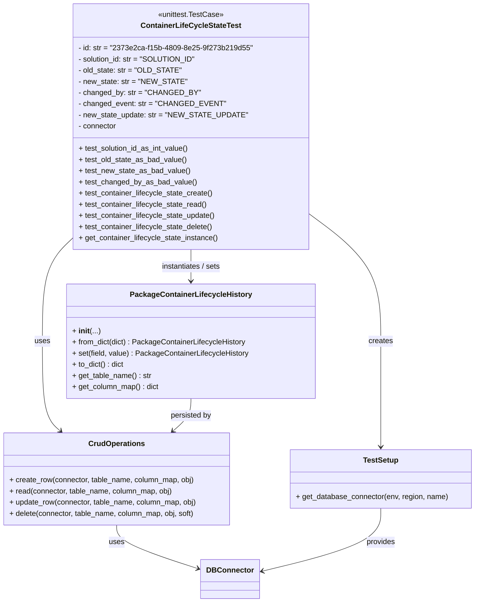
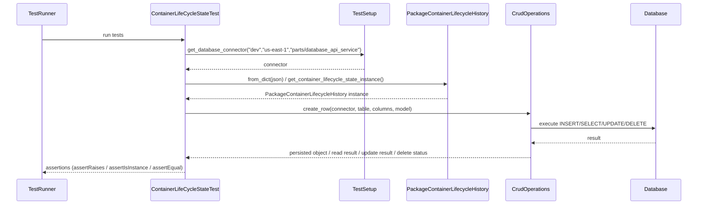

# Diagram: partview_core/partview_service/partview_service/tests/unit/core/datamodel/container_lifecycle_state_test.py

> Auto-generated by Obscura crawlers

## Diagram 1

### SVG

<svg id="container" width="1019.013671875" xmlns="http://www.w3.org/2000/svg" class="classDiagram" height="1294" viewBox="0 0 1019.013671875 1294" role="graphics-document document" aria-roledescription="class"><g><defs><marker id="container_class-aggregationStart" class="marker aggregation class" refX="18" refY="7" markerWidth="190" markerHeight="240" orient="auto"><path d="M 18,7 L9,13 L1,7 L9,1 Z"></path></marker></defs><defs><marker id="container_class-aggregationEnd" class="marker aggregation class" refX="1" refY="7" markerWidth="20" markerHeight="28" orient="auto"><path d="M 18,7 L9,13 L1,7 L9,1 Z"></path></marker></defs><defs><marker id="container_class-extensionStart" class="marker extension class" refX="18" refY="7" markerWidth="190" markerHeight="240" orient="auto"><path d="M 1,7 L18,13 V 1 Z"></path></marker></defs><defs><marker id="container_class-extensionEnd" class="marker extension class" refX="1" refY="7" markerWidth="20" markerHeight="28" orient="auto"><path d="M 1,1 V 13 L18,7 Z"></path></marker></defs><defs><marker id="container_class-compositionStart" class="marker composition class" refX="18" refY="7" markerWidth="190" markerHeight="240" orient="auto"><path d="M 18,7 L9,13 L1,7 L9,1 Z"></path></marker></defs><defs><marker id="container_class-compositionEnd" class="marker composition class" refX="1" refY="7" markerWidth="20" markerHeight="28" orient="auto"><path d="M 18,7 L9,13 L1,7 L9,1 Z"></path></marker></defs><defs><marker id="container_class-dependencyStart" class="marker dependency class" refX="6" refY="7" markerWidth="190" markerHeight="240" orient="auto"><path d="M 5,7 L9,13 L1,7 L9,1 Z"></path></marker></defs><defs><marker id="container_class-dependencyEnd" class="marker dependency class" refX="13" refY="7" markerWidth="20" markerHeight="28" orient="auto"><path d="M 18,7 L9,13 L14,7 L9,1 Z"></path></marker></defs><defs><marker id="container_class-lollipopStart" class="marker lollipop class" refX="13" refY="7" markerWidth="190" markerHeight="240" orient="auto"><circle stroke="black" fill="transparent" cx="7" cy="7" r="6"></circle></marker></defs><defs><marker id="container_class-lollipopEnd" class="marker lollipop class" refX="1" refY="7" markerWidth="190" markerHeight="240" orient="auto"><circle stroke="black" fill="transparent" cx="7" cy="7" r="6"></circle></marker></defs><g class="root"><g class="clusters"></g><g class="edgePaths"><path d="M653.629,452.441L680.78,472.534C707.932,492.627,762.234,532.814,789.386,579.573C816.537,626.333,816.537,679.667,816.537,733C816.537,786.333,816.537,839.667,816.537,877.5C816.537,915.333,816.537,937.667,816.537,948.833L816.537,960" id="id_ContainerLifeCycleStateTest_TestSetup_1" class="edge-thickness-normal edge-pattern-solid relation" style=";;;" data-edge="true" data-et="edge" data-id="id_ContainerLifeCycleStateTest_TestSetup_1" data-points="W3sieCI6NjUzLjYyODkwNjI1LCJ5Ijo0NTIuNDQwNzE3MDMzMTM4NX0seyJ4Ijo4MTYuNTM3MTA5Mzc1LCJ5Ijo1NzN9LHsieCI6ODE2LjUzNzEwOTM3NSwieSI6NzMzfSx7IngiOjgxNi41MzcxMDkzNzUsInkiOjg5M30seyJ4Ijo4MTYuNTM3MTA5Mzc1LCJ5Ijo5NjZ9XQ==" marker-end="url(#container_class-dependencyEnd)"></path><path d="M409.805,536L409.805,542.167C409.805,548.333,409.805,560.667,409.805,572C409.805,583.333,409.805,593.667,409.805,598.833L409.805,604" id="id_ContainerLifeCycleStateTest_PackageContainerLifecycleHistory_2" class="edge-thickness-normal edge-pattern-solid relation" style=";;;" data-edge="true" data-et="edge" data-id="id_ContainerLifeCycleStateTest_PackageContainerLifecycleHistory_2" data-points="W3sieCI6NDA5LjgwNDY4NzUsInkiOjUzNn0seyJ4Ijo0MDkuODA0Njg3NSwieSI6NTczfSx7IngiOjQwOS44MDQ2ODc1LCJ5Ijo2MTB9XQ==" marker-end="url(#container_class-dependencyEnd)"></path><path d="M165.98,504.982L154.117,516.318C142.253,527.655,118.525,550.327,106.661,588.33C94.797,626.333,94.797,679.667,94.797,733C94.797,786.333,94.797,839.667,101.182,871.846C107.567,904.026,120.336,915.052,126.721,920.566L133.106,926.079" id="id_ContainerLifeCycleStateTest_CrudOperations_3" class="edge-thickness-normal edge-pattern-solid relation" style=";;;" data-edge="true" data-et="edge" data-id="id_ContainerLifeCycleStateTest_CrudOperations_3" data-points="W3sieCI6MTY1Ljk4MDQ2ODc1LCJ5Ijo1MDQuOTgxODA4NDg2ODkyNjV9LHsieCI6OTQuNzk2ODc1LCJ5Ijo1NzN9LHsieCI6OTQuNzk2ODc1LCJ5Ijo3MzN9LHsieCI6OTQuNzk2ODc1LCJ5Ijo4OTN9LHsieCI6MTM3LjY0NzIwMjQzNTY2MTc3LCJ5Ijo5MzB9XQ==" marker-end="url(#container_class-dependencyEnd)"></path><path d="M409.805,856L409.805,862.167C409.805,868.333,409.805,880.667,403.42,892.346C397.035,904.026,384.265,915.052,377.881,920.566L371.496,926.079" id="id_PackageContainerLifecycleHistory_CrudOperations_4" class="edge-thickness-normal edge-pattern-solid relation" style=";;;" data-edge="true" data-et="edge" data-id="id_PackageContainerLifecycleHistory_CrudOperations_4" data-points="W3sieCI6NDA5LjgwNDY4NzUsInkiOjg1Nn0seyJ4Ijo0MDkuODA0Njg3NSwieSI6ODkzfSx7IngiOjM2Ni45NTQzNjAwNjQzMzgyMywieSI6OTMwfV0=" marker-end="url(#container_class-dependencyEnd)"></path><path d="M252.301,1128L252.301,1134.167C252.301,1140.333,252.301,1152.667,282.154,1168.483C312.006,1184.3,371.712,1203.6,401.565,1213.25L431.418,1222.901" id="id_CrudOperations_DBConnector_5" class="edge-thickness-normal edge-pattern-solid relation" style=";;;" data-edge="true" data-et="edge" data-id="id_CrudOperations_DBConnector_5" data-points="W3sieCI6MjUyLjMwMDc4MTI1LCJ5IjoxMTI4fSx7IngiOjI1Mi4zMDA3ODEyNSwieSI6MTE2NX0seyJ4Ijo0MzcuMTI2OTUzMTI1LCJ5IjoxMjI0Ljc0NjA4OTk3MjU4OH1d" marker-end="url(#container_class-dependencyEnd)"></path><path d="M816.537,1092L816.537,1104.167C816.537,1116.333,816.537,1140.667,774.127,1163.308C731.717,1185.95,646.897,1206.9,604.487,1217.375L562.077,1227.85" id="id_TestSetup_DBConnector_6" class="edge-thickness-normal edge-pattern-solid relation" style=";;;" data-edge="true" data-et="edge" data-id="id_TestSetup_DBConnector_6" data-points="W3sieCI6ODE2LjUzNzEwOTM3NSwieSI6MTA5Mn0seyJ4Ijo4MTYuNTM3MTA5Mzc1LCJ5IjoxMTY1fSx7IngiOjU1Ni4yNTE5NTMxMjUsInkiOjEyMjkuMjg4NTA0MDQ4NTU4M31d" marker-end="url(#container_class-dependencyEnd)"></path></g><g class="edgeLabels"><g class="edgeLabel" transform="translate(816.537109375, 733)"><g class="label" data-id="id_ContainerLifeCycleStateTest_TestSetup_1" transform="translate(-26.171875, -12)"><foreignObject width="52.34375" height="24">

creates

</foreignObject></g></g><g class="edgeLabel" transform="translate(409.8046875, 573)"><g class="label" data-id="id_ContainerLifeCycleStateTest_PackageContainerLifecycleHistory_2" transform="translate(-66.0390625, -12)"><foreignObject width="132.078125" height="24">

instantiates / sets

</foreignObject></g></g><g class="edgeLabel" transform="translate(94.796875, 733)"><g class="label" data-id="id_ContainerLifeCycleStateTest_CrudOperations_3" transform="translate(-16.4921875, -12)"><foreignObject width="32.984375" height="24">

uses

</foreignObject></g></g><g class="edgeLabel" transform="translate(409.8046875, 893)"><g class="label" data-id="id_PackageContainerLifecycleHistory_CrudOperations_4" transform="translate(-44.5, -12)"><foreignObject width="89" height="24">

persisted by

</foreignObject></g></g><g class="edgeLabel" transform="translate(252.30078125, 1165)"><g class="label" data-id="id_CrudOperations_DBConnector_5" transform="translate(-16.4921875, -12)"><foreignObject width="32.984375" height="24">

uses

</foreignObject></g></g><g class="edgeLabel" transform="translate(816.537109375, 1165)"><g class="label" data-id="id_TestSetup_DBConnector_6" transform="translate(-31.3125, -12)"><foreignObject width="62.625" height="24">

provides

</foreignObject></g></g></g><g class="nodes"><g class="node default" id="classId-ContainerLifeCycleStateTest-0" transform="translate(409.8046875, 272)"><g class="basic label-container"><path d="M-243.82421875 -264 L243.82421875 -264 L243.82421875 264 L-243.82421875 264" stroke="none" stroke-width="0" fill="#ECECFF" style=""></path><path d="M-243.82421875 -264 C-72.55870446113056 -264, 98.70680982773888 -264, 243.82421875 -264 M-243.82421875 -264 C-94.59165173327528 -264, 54.64091528344943 -264, 243.82421875 -264 M243.82421875 -264 C243.82421875 -116.79094200113283, 243.82421875 30.418115997734333, 243.82421875 264 M243.82421875 -264 C243.82421875 -96.46717806256584, 243.82421875 71.06564387486833, 243.82421875 264 M243.82421875 264 C50.806397067935734 264, -142.21142461412853 264, -243.82421875 264 M243.82421875 264 C95.5857257333816 264, -52.65276728323681 264, -243.82421875 264 M-243.82421875 264 C-243.82421875 136.9184283796696, -243.82421875 9.836856759339184, -243.82421875 -264 M-243.82421875 264 C-243.82421875 74.68937801034548, -243.82421875 -114.62124397930904, -243.82421875 -264" stroke="#9370DB" stroke-width="1.3" fill="none" stroke-dasharray="0 0" style=""></path></g><g class="annotation-group text" transform="translate(-70.1328125, -240)"><g class="label" style="" transform="translate(0,-12)"><foreignObject width="140.265625" height="24">

«unittest.TestCase»

</foreignObject></g></g><g class="label-group text" transform="translate(-102.5703125, -216)"><g class="label" style="font-weight: bolder" transform="translate(0,-12)"><foreignObject width="205.140625" height="24">

ContainerLifeCycleStateTest

</foreignObject></g></g><g class="members-group text" transform="translate(-231.82421875, -168)"><g class="label" style="" transform="translate(0,-12)"><foreignObject width="361.078125" height="24">

- id: str = "2373e2ca-f15b-4809-8e25-9f273b219d55"

</foreignObject></g><g class="label" style="" transform="translate(0,12)"><foreignObject width="245.953125" height="24">

- solution_id: str = "SOLUTION_ID"

</foreignObject></g><g class="label" style="" transform="translate(0,36)"><foreignObject width="213.125" height="24">

- old_state: str = "OLD_STATE"

</foreignObject></g><g class="label" style="" transform="translate(0,60)"><foreignObject width="221.890625" height="24">

- new_state: str = "NEW_STATE"

</foreignObject></g><g class="label" style="" transform="translate(0,84)"><foreignObject width="249.484375" height="24">

- changed_by: str = "CHANGED_BY"

</foreignObject></g><g class="label" style="" transform="translate(0,108)"><foreignObject width="299.25" height="24">

- changed_event: str = "CHANGED_EVENT"

</foreignObject></g><g class="label" style="" transform="translate(0,132)"><foreignObject width="344" height="24">

- new_state_update: str = "NEW_STATE_UPDATE"

</foreignObject></g><g class="label" style="" transform="translate(0,156)"><foreignObject width="83.546875" height="24">

- connector

</foreignObject></g></g><g class="methods-group text" transform="translate(-231.82421875, 48)"><g class="label" style="" transform="translate(0,-12)"><foreignObject width="239.046875" height="24">

+ test_solution_id_as_int_value()

</foreignObject></g><g class="label" style="" transform="translate(0,12)"><foreignObject width="232.078125" height="24">

+ test_old_state_as_bad_value()

</foreignObject></g><g class="label" style="" transform="translate(0,36)"><foreignObject width="238.125" height="24">

+ test_new_state_as_bad_value()

</foreignObject></g><g class="label" style="" transform="translate(0,60)"><foreignObject width="251.0625" height="24">

+ test_changed_by_as_bad_value()

</foreignObject></g><g class="label" style="" transform="translate(0,84)"><foreignObject width="290.375" height="24">

+ test_container_lifecycle_state_create()

</foreignObject></g><g class="label" style="" transform="translate(0,108)"><foreignObject width="278.359375" height="24">

+ test_container_lifecycle_state_read()

</foreignObject></g><g class="label" style="" transform="translate(0,132)"><foreignObject width="296.859375" height="24">

+ test_container_lifecycle_state_update()

</foreignObject></g><g class="label" style="" transform="translate(0,156)"><foreignObject width="291.390625" height="24">

+ test_container_lifecycle_state_delete()

</foreignObject></g><g class="label" style="" transform="translate(0,180)"><foreignObject width="302.046875" height="24">

+ get_container_lifecycle_state_instance()

</foreignObject></g></g><g class="divider" style=""><path d="M-243.82421875 -192 C-142.27319247892416 -192, -40.72216620784829 -192, 243.82421875 -192 M-243.82421875 -192 C-129.12872042499157 -192, -14.433222099983112 -192, 243.82421875 -192" stroke="#9370DB" stroke-width="1.3" fill="none" stroke-dasharray="0 0" style=""></path></g><g class="divider" style=""><path d="M-243.82421875 24 C-112.12375432230547 24, 19.576710105389054 24, 243.82421875 24 M-243.82421875 24 C-133.18807601665284 24, -22.551933283305686 24, 243.82421875 24" stroke="#9370DB" stroke-width="1.3" fill="none" stroke-dasharray="0 0" style=""></path></g></g><g class="node default" id="classId-PackageContainerLifecycleHistory-1" transform="translate(409.8046875, 733)"><g class="basic label-container"><path d="M-263.515625 -123 L263.515625 -123 L263.515625 123 L-263.515625 123" stroke="none" stroke-width="0" fill="#ECECFF" style=""></path><path d="M-263.515625 -123 C-68.02566111068401 -123, 127.46430277863197 -123, 263.515625 -123 M-263.515625 -123 C-55.669978250031875 -123, 152.17566849993625 -123, 263.515625 -123 M263.515625 -123 C263.515625 -32.57863996294758, 263.515625 57.84272007410485, 263.515625 123 M263.515625 -123 C263.515625 -60.71456687813199, 263.515625 1.5708662437360204, 263.515625 123 M263.515625 123 C120.26308349712852 123, -22.98945800574296 123, -263.515625 123 M263.515625 123 C54.98678225076799 123, -153.54206049846402 123, -263.515625 123 M-263.515625 123 C-263.515625 58.97738558809296, -263.515625 -5.045228823814085, -263.515625 -123 M-263.515625 123 C-263.515625 59.17596618847047, -263.515625 -4.648067623059063, -263.515625 -123" stroke="#9370DB" stroke-width="1.3" fill="none" stroke-dasharray="0 0" style=""></path></g><g class="annotation-group text" transform="translate(0, -99)"></g><g class="label-group text" transform="translate(-123.90625, -99)"><g class="label" style="font-weight: bolder" transform="translate(0,-12)"><foreignObject width="247.8125" height="24">

PackageContainerLifecycleHistory

</foreignObject></g></g><g class="members-group text" transform="translate(-251.515625, -51)"></g><g class="methods-group text" transform="translate(-251.515625, -21)"><g class="label" style="" transform="translate(0,-12)"><foreignObject width="58.5625" height="24">

+ <strong>init</strong>(...)

</foreignObject></g><g class="label" style="" transform="translate(0,12)"><foreignObject width="375.21875" height="24">

+ from_dict(dict) : PackageContainerLifecycleHistory

</foreignObject></g><g class="label" style="" transform="translate(0,36)"><foreignObject width="379.125" height="24">

+ set(field, value) : PackageContainerLifecycleHistory

</foreignObject></g><g class="label" style="" transform="translate(0,60)"><foreignObject width="112.484375" height="24">

+ to_dict() : dict

</foreignObject></g><g class="label" style="" transform="translate(0,84)"><foreignObject width="170.609375" height="24">

+ get_table_name() : str

</foreignObject></g><g class="label" style="" transform="translate(0,108)"><foreignObject width="186.984375" height="24">

+ get_column_map() : dict

</foreignObject></g></g><g class="divider" style=""><path d="M-263.515625 -75 C-89.798536250546 -75, 83.91855249890801 -75, 263.515625 -75 M-263.515625 -75 C-74.56249627265416 -75, 114.39063245469168 -75, 263.515625 -75" stroke="#9370DB" stroke-width="1.3" fill="none" stroke-dasharray="0 0" style=""></path></g><g class="divider" style=""><path d="M-263.515625 -51 C-116.37213369639457 -51, 30.77135760721086 -51, 263.515625 -51 M-263.515625 -51 C-96.65477906481948 -51, 70.20606687036104 -51, 263.515625 -51" stroke="#9370DB" stroke-width="1.3" fill="none" stroke-dasharray="0 0" style=""></path></g></g><g class="node default" id="classId-CrudOperations-2" transform="translate(252.30078125, 1029)"><g class="basic label-container"><path d="M-244.30078125 -99 L244.30078125 -99 L244.30078125 99 L-244.30078125 99" stroke="none" stroke-width="0" fill="#ECECFF" style=""></path><path d="M-244.30078125 -99 C-140.08727595712367 -99, -35.87377066424733 -99, 244.30078125 -99 M-244.30078125 -99 C-103.19080166758002 -99, 37.91917791483996 -99, 244.30078125 -99 M244.30078125 -99 C244.30078125 -28.845748017042055, 244.30078125 41.30850396591589, 244.30078125 99 M244.30078125 -99 C244.30078125 -43.62895997282002, 244.30078125 11.74208005435996, 244.30078125 99 M244.30078125 99 C123.65071310311316 99, 3.000644956226324 99, -244.30078125 99 M244.30078125 99 C122.15267667762681 99, 0.004572105253629388 99, -244.30078125 99 M-244.30078125 99 C-244.30078125 54.13450386320818, -244.30078125 9.269007726416362, -244.30078125 -99 M-244.30078125 99 C-244.30078125 32.85276892716426, -244.30078125 -33.294462145671474, -244.30078125 -99" stroke="#9370DB" stroke-width="1.3" fill="none" stroke-dasharray="0 0" style=""></path></g><g class="annotation-group text" transform="translate(0, -75)"></g><g class="label-group text" transform="translate(-57.6171875, -75)"><g class="label" style="font-weight: bolder" transform="translate(0,-12)"><foreignObject width="115.234375" height="24">

CrudOperations

</foreignObject></g></g><g class="members-group text" transform="translate(-232.30078125, -27)"></g><g class="methods-group text" transform="translate(-232.30078125, 3)"><g class="label" style="" transform="translate(0,-12)"><foreignObject width="400.5" height="24">

+ create_row(connector, table_name, column_map, obj)

</foreignObject></g><g class="label" style="" transform="translate(0,12)"><foreignObject width="353.65625" height="24">

+ read(connector, table_name, column_map, obj)

</foreignObject></g><g class="label" style="" transform="translate(0,36)"><foreignObject width="406.984375" height="24">

+ update_row(connector, table_name, column_map, obj)

</foreignObject></g><g class="label" style="" transform="translate(0,60)"><foreignObject width="403.03125" height="24">

+ delete(connector, table_name, column_map, obj, soft)

</foreignObject></g></g><g class="divider" style=""><path d="M-244.30078125 -51 C-126.50990584262979 -51, -8.719030435259583 -51, 244.30078125 -51 M-244.30078125 -51 C-68.29328482177431 -51, 107.71421160645139 -51, 244.30078125 -51" stroke="#9370DB" stroke-width="1.3" fill="none" stroke-dasharray="0 0" style=""></path></g><g class="divider" style=""><path d="M-244.30078125 -27 C-108.59674803588587 -27, 27.107285178228267 -27, 244.30078125 -27 M-244.30078125 -27 C-89.14417519870648 -27, 66.01243085258704 -27, 244.30078125 -27" stroke="#9370DB" stroke-width="1.3" fill="none" stroke-dasharray="0 0" style=""></path></g></g><g class="node default" id="classId-TestSetup-3" transform="translate(816.537109375, 1029)"><g class="basic label-container"><path d="M-194.4765625 -63 L194.4765625 -63 L194.4765625 63 L-194.4765625 63" stroke="none" stroke-width="0" fill="#ECECFF" style=""></path><path d="M-194.4765625 -63 C-82.2805755159818 -63, 29.91541146803641 -63, 194.4765625 -63 M-194.4765625 -63 C-64.91957628372182 -63, 64.63740993255635 -63, 194.4765625 -63 M194.4765625 -63 C194.4765625 -21.730941610153238, 194.4765625 19.538116779693524, 194.4765625 63 M194.4765625 -63 C194.4765625 -23.41129221607494, 194.4765625 16.17741556785012, 194.4765625 63 M194.4765625 63 C93.5984456541772 63, -7.279671191645605 63, -194.4765625 63 M194.4765625 63 C63.1452024944997 63, -68.1861575110006 63, -194.4765625 63 M-194.4765625 63 C-194.4765625 32.69378664289492, -194.4765625 2.3875732857898413, -194.4765625 -63 M-194.4765625 63 C-194.4765625 13.719188178099607, -194.4765625 -35.561623643800786, -194.4765625 -63" stroke="#9370DB" stroke-width="1.3" fill="none" stroke-dasharray="0 0" style=""></path></g><g class="annotation-group text" transform="translate(0, -39)"></g><g class="label-group text" transform="translate(-36.6875, -39)"><g class="label" style="font-weight: bolder" transform="translate(0,-12)"><foreignObject width="73.375" height="24">

TestSetup

</foreignObject></g></g><g class="members-group text" transform="translate(-182.4765625, 9)"></g><g class="methods-group text" transform="translate(-182.4765625, 39)"><g class="label" style="" transform="translate(0,-12)"><foreignObject width="328.265625" height="24">

+ get_database_connector(env, region, name)

</foreignObject></g></g><g class="divider" style=""><path d="M-194.4765625 -15 C-104.18260300858434 -15, -13.888643517168674 -15, 194.4765625 -15 M-194.4765625 -15 C-98.86190504789393 -15, -3.2472475957878544 -15, 194.4765625 -15" stroke="#9370DB" stroke-width="1.3" fill="none" stroke-dasharray="0 0" style=""></path></g><g class="divider" style=""><path d="M-194.4765625 9 C-99.41532215068263 9, -4.354081801365254 9, 194.4765625 9 M-194.4765625 9 C-114.09963291395667 9, -33.72270332791334 9, 194.4765625 9" stroke="#9370DB" stroke-width="1.3" fill="none" stroke-dasharray="0 0" style=""></path></g></g><g class="node default" id="classId-DBConnector-4" transform="translate(496.689453125, 1244)"><g class="basic label-container"><path d="M-59.5625 -42 L59.5625 -42 L59.5625 42 L-59.5625 42" stroke="none" stroke-width="0" fill="#ECECFF" style=""></path><path d="M-59.5625 -42 C-14.453554200189004 -42, 30.655391599621993 -42, 59.5625 -42 M-59.5625 -42 C-18.762832550728604 -42, 22.036834898542793 -42, 59.5625 -42 M59.5625 -42 C59.5625 -11.409129210865494, 59.5625 19.181741578269012, 59.5625 42 M59.5625 -42 C59.5625 -19.7651641106472, 59.5625 2.469671778705603, 59.5625 42 M59.5625 42 C17.670653804542148 42, -24.221192390915704 42, -59.5625 42 M59.5625 42 C27.35146367977122 42, -4.859572640457557 42, -59.5625 42 M-59.5625 42 C-59.5625 20.236895954382984, -59.5625 -1.5262080912340323, -59.5625 -42 M-59.5625 42 C-59.5625 14.560359235411468, -59.5625 -12.879281529177064, -59.5625 -42" stroke="#9370DB" stroke-width="1.3" fill="none" stroke-dasharray="0 0" style=""></path></g><g class="annotation-group text" transform="translate(0, -18)"></g><g class="label-group text" transform="translate(-47.5625, -18)"><g class="label" style="font-weight: bolder" transform="translate(0,-12)"><foreignObject width="95.125" height="24">

DBConnector

</foreignObject></g></g><g class="members-group text" transform="translate(-47.5625, 30)"></g><g class="methods-group text" transform="translate(-47.5625, 60)"></g><g class="divider" style=""><path d="M-59.5625 6 C-25.766601267813428 6, 8.029297464373144 6, 59.5625 6 M-59.5625 6 C-21.564462414331636 6, 16.433575171336727 6, 59.5625 6" stroke="#9370DB" stroke-width="1.3" fill="none" stroke-dasharray="0 0" style=""></path></g><g class="divider" style=""><path d="M-59.5625 24 C-28.39016548633381 24, 2.7821690273323796 24, 59.5625 24 M-59.5625 24 C-19.44791460014182 24, 20.666670799716357 24, 59.5625 24" stroke="#9370DB" stroke-width="1.3" fill="none" stroke-dasharray="0 0" style=""></path></g></g></g></g></g></svg>

## Diagram 2

### SVG

<svg id="container" width="2200" xmlns="http://www.w3.org/2000/svg" height="651" viewBox="-50 -10 2200 651" role="graphics-document document" aria-roledescription="sequence"><g><rect x="1950" y="565" fill="#eaeaea" stroke="#666" width="150" height="65" name="DB" rx="3" ry="3" class="actor actor-bottom"></rect><text x="2025" y="597.5" dominant-baseline="central" alignment-baseline="central" class="actor actor-box" style="text-anchor: middle; font-size: 16px; font-weight: 400;"><tspan x="2025" dy="0">Database</tspan></text></g><g><rect x="1588" y="565" fill="#eaeaea" stroke="#666" width="150" height="65" name="CRUD" rx="3" ry="3" class="actor actor-bottom"></rect><text x="1663" y="597.5" dominant-baseline="central" alignment-baseline="central" class="actor actor-box" style="text-anchor: middle; font-size: 16px; font-weight: 400;"><tspan x="1663" dy="0">CrudOperations</tspan></text></g><g><rect x="1275" y="565" fill="#eaeaea" stroke="#666" width="263" height="65" name="Model" rx="3" ry="3" class="actor actor-bottom"></rect><text x="1406.5" y="597.5" dominant-baseline="central" alignment-baseline="central" class="actor actor-box" style="text-anchor: middle; font-size: 16px; font-weight: 400;"><tspan x="1406.5" dy="0">PackageContainerLifecycleHistory</tspan></text></g><g><rect x="1075" y="565" fill="#eaeaea" stroke="#666" width="150" height="65" name="Setup" rx="3" ry="3" class="actor actor-bottom"></rect><text x="1150" y="597.5" dominant-baseline="central" alignment-baseline="central" class="actor actor-box" style="text-anchor: middle; font-size: 16px; font-weight: 400;"><tspan x="1150" dy="0">TestSetup</tspan></text></g><g><rect x="449.5" y="565" fill="#eaeaea" stroke="#666" width="221" height="65" name="TestCase" rx="3" ry="3" class="actor actor-bottom"></rect><text x="560" y="597.5" dominant-baseline="central" alignment-baseline="central" class="actor actor-box" style="text-anchor: middle; font-size: 16px; font-weight: 400;"><tspan x="560" dy="0">ContainerLifeCycleStateTest</tspan></text></g><g><rect x="0" y="565" fill="#eaeaea" stroke="#666" width="150" height="65" name="Runner" rx="3" ry="3" class="actor actor-bottom"></rect><text x="75" y="597.5" dominant-baseline="central" alignment-baseline="central" class="actor actor-box" style="text-anchor: middle; font-size: 16px; font-weight: 400;"><tspan x="75" dy="0">TestRunner</tspan></text></g><g><line id="actor5" x1="2025" y1="65" x2="2025" y2="565" class="actor-line 200" stroke-width="0.5px" stroke="#999" name="DB"></line><g id="root-5"><rect x="1950" y="0" fill="#eaeaea" stroke="#666" width="150" height="65" name="DB" rx="3" ry="3" class="actor actor-top"></rect><text x="2025" y="32.5" dominant-baseline="central" alignment-baseline="central" class="actor actor-box" style="text-anchor: middle; font-size: 16px; font-weight: 400;"><tspan x="2025" dy="0">Database</tspan></text></g></g><g><line id="actor4" x1="1663" y1="65" x2="1663" y2="565" class="actor-line 200" stroke-width="0.5px" stroke="#999" name="CRUD"></line><g id="root-4"><rect x="1588" y="0" fill="#eaeaea" stroke="#666" width="150" height="65" name="CRUD" rx="3" ry="3" class="actor actor-top"></rect><text x="1663" y="32.5" dominant-baseline="central" alignment-baseline="central" class="actor actor-box" style="text-anchor: middle; font-size: 16px; font-weight: 400;"><tspan x="1663" dy="0">CrudOperations</tspan></text></g></g><g><line id="actor3" x1="1406.5" y1="65" x2="1406.5" y2="565" class="actor-line 200" stroke-width="0.5px" stroke="#999" name="Model"></line><g id="root-3"><rect x="1275" y="0" fill="#eaeaea" stroke="#666" width="263" height="65" name="Model" rx="3" ry="3" class="actor actor-top"></rect><text x="1406.5" y="32.5" dominant-baseline="central" alignment-baseline="central" class="actor actor-box" style="text-anchor: middle; font-size: 16px; font-weight: 400;"><tspan x="1406.5" dy="0">PackageContainerLifecycleHistory</tspan></text></g></g><g><line id="actor2" x1="1150" y1="65" x2="1150" y2="565" class="actor-line 200" stroke-width="0.5px" stroke="#999" name="Setup"></line><g id="root-2"><rect x="1075" y="0" fill="#eaeaea" stroke="#666" width="150" height="65" name="Setup" rx="3" ry="3" class="actor actor-top"></rect><text x="1150" y="32.5" dominant-baseline="central" alignment-baseline="central" class="actor actor-box" style="text-anchor: middle; font-size: 16px; font-weight: 400;"><tspan x="1150" dy="0">TestSetup</tspan></text></g></g><g><line id="actor1" x1="560" y1="65" x2="560" y2="565" class="actor-line 200" stroke-width="0.5px" stroke="#999" name="TestCase"></line><g id="root-1"><rect x="449.5" y="0" fill="#eaeaea" stroke="#666" width="221" height="65" name="TestCase" rx="3" ry="3" class="actor actor-top"></rect><text x="560" y="32.5" dominant-baseline="central" alignment-baseline="central" class="actor actor-box" style="text-anchor: middle; font-size: 16px; font-weight: 400;"><tspan x="560" dy="0">ContainerLifeCycleStateTest</tspan></text></g></g><g><line id="actor0" x1="75" y1="65" x2="75" y2="565" class="actor-line 200" stroke-width="0.5px" stroke="#999" name="Runner"></line><g id="root-0"><rect x="0" y="0" fill="#eaeaea" stroke="#666" width="150" height="65" name="Runner" rx="3" ry="3" class="actor actor-top"></rect><text x="75" y="32.5" dominant-baseline="central" alignment-baseline="central" class="actor actor-box" style="text-anchor: middle; font-size: 16px; font-weight: 400;"><tspan x="75" dy="0">TestRunner</tspan></text></g></g><g></g><defs><symbol id="computer" width="24" height="24"><path transform="scale(.5)" d="M2 2v13h20v-13h-20zm18 11h-16v-9h16v9zm-10.228 6l.466-1h3.524l.467 1h-4.457zm14.228 3h-24l2-6h2.104l-1.33 4h18.45l-1.297-4h2.073l2 6zm-5-10h-14v-7h14v7z"></path></symbol></defs><defs><symbol id="database" fill-rule="evenodd" clip-rule="evenodd"><path transform="scale(.5)" d="M12.258.001l.256.004.255.005.253.008.251.01.249.012.247.015.246.016.242.019.241.02.239.023.236.024.233.027.231.028.229.031.225.032.223.034.22.036.217.038.214.04.211.041.208.043.205.045.201.046.198.048.194.05.191.051.187.053.183.054.18.056.175.057.172.059.168.06.163.061.16.063.155.064.15.066.074.033.073.033.071.034.07.034.069.035.068.035.067.035.066.035.064.036.064.036.062.036.06.036.06.037.058.037.058.037.055.038.055.038.053.038.052.038.051.039.05.039.048.039.047.039.045.04.044.04.043.04.041.04.04.041.039.041.037.041.036.041.034.041.033.042.032.042.03.042.029.042.027.042.026.043.024.043.023.043.021.043.02.043.018.044.017.043.015.044.013.044.012.044.011.045.009.044.007.045.006.045.004.045.002.045.001.045v17l-.001.045-.002.045-.004.045-.006.045-.007.045-.009.044-.011.045-.012.044-.013.044-.015.044-.017.043-.018.044-.02.043-.021.043-.023.043-.024.043-.026.043-.027.042-.029.042-.03.042-.032.042-.033.042-.034.041-.036.041-.037.041-.039.041-.04.041-.041.04-.043.04-.044.04-.045.04-.047.039-.048.039-.05.039-.051.039-.052.038-.053.038-.055.038-.055.038-.058.037-.058.037-.06.037-.06.036-.062.036-.064.036-.064.036-.066.035-.067.035-.068.035-.069.035-.07.034-.071.034-.073.033-.074.033-.15.066-.155.064-.16.063-.163.061-.168.06-.172.059-.175.057-.18.056-.183.054-.187.053-.191.051-.194.05-.198.048-.201.046-.205.045-.208.043-.211.041-.214.04-.217.038-.22.036-.223.034-.225.032-.229.031-.231.028-.233.027-.236.024-.239.023-.241.02-.242.019-.246.016-.247.015-.249.012-.251.01-.253.008-.255.005-.256.004-.258.001-.258-.001-.256-.004-.255-.005-.253-.008-.251-.01-.249-.012-.247-.015-.245-.016-.243-.019-.241-.02-.238-.023-.236-.024-.234-.027-.231-.028-.228-.031-.226-.032-.223-.034-.22-.036-.217-.038-.214-.04-.211-.041-.208-.043-.204-.045-.201-.046-.198-.048-.195-.05-.19-.051-.187-.053-.184-.054-.179-.056-.176-.057-.172-.059-.167-.06-.164-.061-.159-.063-.155-.064-.151-.066-.074-.033-.072-.033-.072-.034-.07-.034-.069-.035-.068-.035-.067-.035-.066-.035-.064-.036-.063-.036-.062-.036-.061-.036-.06-.037-.058-.037-.057-.037-.056-.038-.055-.038-.053-.038-.052-.038-.051-.039-.049-.039-.049-.039-.046-.039-.046-.04-.044-.04-.043-.04-.041-.04-.04-.041-.039-.041-.037-.041-.036-.041-.034-.041-.033-.042-.032-.042-.03-.042-.029-.042-.027-.042-.026-.043-.024-.043-.023-.043-.021-.043-.02-.043-.018-.044-.017-.043-.015-.044-.013-.044-.012-.044-.011-.045-.009-.044-.007-.045-.006-.045-.004-.045-.002-.045-.001-.045v-17l.001-.045.002-.045.004-.045.006-.045.007-.045.009-.044.011-.045.012-.044.013-.044.015-.044.017-.043.018-.044.02-.043.021-.043.023-.043.024-.043.026-.043.027-.042.029-.042.03-.042.032-.042.033-.042.034-.041.036-.041.037-.041.039-.041.04-.041.041-.04.043-.04.044-.04.046-.04.046-.039.049-.039.049-.039.051-.039.052-.038.053-.038.055-.038.056-.038.057-.037.058-.037.06-.037.061-.036.062-.036.063-.036.064-.036.066-.035.067-.035.068-.035.069-.035.07-.034.072-.034.072-.033.074-.033.151-.066.155-.064.159-.063.164-.061.167-.06.172-.059.176-.057.179-.056.184-.054.187-.053.19-.051.195-.05.198-.048.201-.046.204-.045.208-.043.211-.041.214-.04.217-.038.22-.036.223-.034.226-.032.228-.031.231-.028.234-.027.236-.024.238-.023.241-.02.243-.019.245-.016.247-.015.249-.012.251-.01.253-.008.255-.005.256-.004.258-.001.258.001zm-9.258 20.499v.01l.001.021.003.021.004.022.005.021.006.022.007.022.009.023.01.022.011.023.012.023.013.023.015.023.016.024.017.023.018.024.019.024.021.024.022.025.023.024.024.025.052.049.056.05.061.051.066.051.07.051.075.051.079.052.084.052.088.052.092.052.097.052.102.051.105.052.11.052.114.051.119.051.123.051.127.05.131.05.135.05.139.048.144.049.147.047.152.047.155.047.16.045.163.045.167.043.171.043.176.041.178.041.183.039.187.039.19.037.194.035.197.035.202.033.204.031.209.03.212.029.216.027.219.025.222.024.226.021.23.02.233.018.236.016.24.015.243.012.246.01.249.008.253.005.256.004.259.001.26-.001.257-.004.254-.005.25-.008.247-.011.244-.012.241-.014.237-.016.233-.018.231-.021.226-.021.224-.024.22-.026.216-.027.212-.028.21-.031.205-.031.202-.034.198-.034.194-.036.191-.037.187-.039.183-.04.179-.04.175-.042.172-.043.168-.044.163-.045.16-.046.155-.046.152-.047.148-.048.143-.049.139-.049.136-.05.131-.05.126-.05.123-.051.118-.052.114-.051.11-.052.106-.052.101-.052.096-.052.092-.052.088-.053.083-.051.079-.052.074-.052.07-.051.065-.051.06-.051.056-.05.051-.05.023-.024.023-.025.021-.024.02-.024.019-.024.018-.024.017-.024.015-.023.014-.024.013-.023.012-.023.01-.023.01-.022.008-.022.006-.022.006-.022.004-.022.004-.021.001-.021.001-.021v-4.127l-.077.055-.08.053-.083.054-.085.053-.087.052-.09.052-.093.051-.095.05-.097.05-.1.049-.102.049-.105.048-.106.047-.109.047-.111.046-.114.045-.115.045-.118.044-.12.043-.122.042-.124.042-.126.041-.128.04-.13.04-.132.038-.134.038-.135.037-.138.037-.139.035-.142.035-.143.034-.144.033-.147.032-.148.031-.15.03-.151.03-.153.029-.154.027-.156.027-.158.026-.159.025-.161.024-.162.023-.163.022-.165.021-.166.02-.167.019-.169.018-.169.017-.171.016-.173.015-.173.014-.175.013-.175.012-.177.011-.178.01-.179.008-.179.008-.181.006-.182.005-.182.004-.184.003-.184.002h-.37l-.184-.002-.184-.003-.182-.004-.182-.005-.181-.006-.179-.008-.179-.008-.178-.01-.176-.011-.176-.012-.175-.013-.173-.014-.172-.015-.171-.016-.17-.017-.169-.018-.167-.019-.166-.02-.165-.021-.163-.022-.162-.023-.161-.024-.159-.025-.157-.026-.156-.027-.155-.027-.153-.029-.151-.03-.15-.03-.148-.031-.146-.032-.145-.033-.143-.034-.141-.035-.14-.035-.137-.037-.136-.037-.134-.038-.132-.038-.13-.04-.128-.04-.126-.041-.124-.042-.122-.042-.12-.044-.117-.043-.116-.045-.113-.045-.112-.046-.109-.047-.106-.047-.105-.048-.102-.049-.1-.049-.097-.05-.095-.05-.093-.052-.09-.051-.087-.052-.085-.053-.083-.054-.08-.054-.077-.054v4.127zm0-5.654v.011l.001.021.003.021.004.021.005.022.006.022.007.022.009.022.01.022.011.023.012.023.013.023.015.024.016.023.017.024.018.024.019.024.021.024.022.024.023.025.024.024.052.05.056.05.061.05.066.051.07.051.075.052.079.051.084.052.088.052.092.052.097.052.102.052.105.052.11.051.114.051.119.052.123.05.127.051.131.05.135.049.139.049.144.048.147.048.152.047.155.046.16.045.163.045.167.044.171.042.176.042.178.04.183.04.187.038.19.037.194.036.197.034.202.033.204.032.209.03.212.028.216.027.219.025.222.024.226.022.23.02.233.018.236.016.24.014.243.012.246.01.249.008.253.006.256.003.259.001.26-.001.257-.003.254-.006.25-.008.247-.01.244-.012.241-.015.237-.016.233-.018.231-.02.226-.022.224-.024.22-.025.216-.027.212-.029.21-.03.205-.032.202-.033.198-.035.194-.036.191-.037.187-.039.183-.039.179-.041.175-.042.172-.043.168-.044.163-.045.16-.045.155-.047.152-.047.148-.048.143-.048.139-.05.136-.049.131-.05.126-.051.123-.051.118-.051.114-.052.11-.052.106-.052.101-.052.096-.052.092-.052.088-.052.083-.052.079-.052.074-.051.07-.052.065-.051.06-.05.056-.051.051-.049.023-.025.023-.024.021-.025.02-.024.019-.024.018-.024.017-.024.015-.023.014-.023.013-.024.012-.022.01-.023.01-.023.008-.022.006-.022.006-.022.004-.021.004-.022.001-.021.001-.021v-4.139l-.077.054-.08.054-.083.054-.085.052-.087.053-.09.051-.093.051-.095.051-.097.05-.1.049-.102.049-.105.048-.106.047-.109.047-.111.046-.114.045-.115.044-.118.044-.12.044-.122.042-.124.042-.126.041-.128.04-.13.039-.132.039-.134.038-.135.037-.138.036-.139.036-.142.035-.143.033-.144.033-.147.033-.148.031-.15.03-.151.03-.153.028-.154.028-.156.027-.158.026-.159.025-.161.024-.162.023-.163.022-.165.021-.166.02-.167.019-.169.018-.169.017-.171.016-.173.015-.173.014-.175.013-.175.012-.177.011-.178.009-.179.009-.179.007-.181.007-.182.005-.182.004-.184.003-.184.002h-.37l-.184-.002-.184-.003-.182-.004-.182-.005-.181-.007-.179-.007-.179-.009-.178-.009-.176-.011-.176-.012-.175-.013-.173-.014-.172-.015-.171-.016-.17-.017-.169-.018-.167-.019-.166-.02-.165-.021-.163-.022-.162-.023-.161-.024-.159-.025-.157-.026-.156-.027-.155-.028-.153-.028-.151-.03-.15-.03-.148-.031-.146-.033-.145-.033-.143-.033-.141-.035-.14-.036-.137-.036-.136-.037-.134-.038-.132-.039-.13-.039-.128-.04-.126-.041-.124-.042-.122-.043-.12-.043-.117-.044-.116-.044-.113-.046-.112-.046-.109-.046-.106-.047-.105-.048-.102-.049-.1-.049-.097-.05-.095-.051-.093-.051-.09-.051-.087-.053-.085-.052-.083-.054-.08-.054-.077-.054v4.139zm0-5.666v.011l.001.02.003.022.004.021.005.022.006.021.007.022.009.023.01.022.011.023.012.023.013.023.015.023.016.024.017.024.018.023.019.024.021.025.022.024.023.024.024.025.052.05.056.05.061.05.066.051.07.051.075.052.079.051.084.052.088.052.092.052.097.052.102.052.105.051.11.052.114.051.119.051.123.051.127.05.131.05.135.05.139.049.144.048.147.048.152.047.155.046.16.045.163.045.167.043.171.043.176.042.178.04.183.04.187.038.19.037.194.036.197.034.202.033.204.032.209.03.212.028.216.027.219.025.222.024.226.021.23.02.233.018.236.017.24.014.243.012.246.01.249.008.253.006.256.003.259.001.26-.001.257-.003.254-.006.25-.008.247-.01.244-.013.241-.014.237-.016.233-.018.231-.02.226-.022.224-.024.22-.025.216-.027.212-.029.21-.03.205-.032.202-.033.198-.035.194-.036.191-.037.187-.039.183-.039.179-.041.175-.042.172-.043.168-.044.163-.045.16-.045.155-.047.152-.047.148-.048.143-.049.139-.049.136-.049.131-.051.126-.05.123-.051.118-.052.114-.051.11-.052.106-.052.101-.052.096-.052.092-.052.088-.052.083-.052.079-.052.074-.052.07-.051.065-.051.06-.051.056-.05.051-.049.023-.025.023-.025.021-.024.02-.024.019-.024.018-.024.017-.024.015-.023.014-.024.013-.023.012-.023.01-.022.01-.023.008-.022.006-.022.006-.022.004-.022.004-.021.001-.021.001-.021v-4.153l-.077.054-.08.054-.083.053-.085.053-.087.053-.09.051-.093.051-.095.051-.097.05-.1.049-.102.048-.105.048-.106.048-.109.046-.111.046-.114.046-.115.044-.118.044-.12.043-.122.043-.124.042-.126.041-.128.04-.13.039-.132.039-.134.038-.135.037-.138.036-.139.036-.142.034-.143.034-.144.033-.147.032-.148.032-.15.03-.151.03-.153.028-.154.028-.156.027-.158.026-.159.024-.161.024-.162.023-.163.023-.165.021-.166.02-.167.019-.169.018-.169.017-.171.016-.173.015-.173.014-.175.013-.175.012-.177.01-.178.01-.179.009-.179.007-.181.006-.182.006-.182.004-.184.003-.184.001-.185.001-.185-.001-.184-.001-.184-.003-.182-.004-.182-.006-.181-.006-.179-.007-.179-.009-.178-.01-.176-.01-.176-.012-.175-.013-.173-.014-.172-.015-.171-.016-.17-.017-.169-.018-.167-.019-.166-.02-.165-.021-.163-.023-.162-.023-.161-.024-.159-.024-.157-.026-.156-.027-.155-.028-.153-.028-.151-.03-.15-.03-.148-.032-.146-.032-.145-.033-.143-.034-.141-.034-.14-.036-.137-.036-.136-.037-.134-.038-.132-.039-.13-.039-.128-.041-.126-.041-.124-.041-.122-.043-.12-.043-.117-.044-.116-.044-.113-.046-.112-.046-.109-.046-.106-.048-.105-.048-.102-.048-.1-.05-.097-.049-.095-.051-.093-.051-.09-.052-.087-.052-.085-.053-.083-.053-.08-.054-.077-.054v4.153zm8.74-8.179l-.257.004-.254.005-.25.008-.247.011-.244.012-.241.014-.237.016-.233.018-.231.021-.226.022-.224.023-.22.026-.216.027-.212.028-.21.031-.205.032-.202.033-.198.034-.194.036-.191.038-.187.038-.183.04-.179.041-.175.042-.172.043-.168.043-.163.045-.16.046-.155.046-.152.048-.148.048-.143.048-.139.049-.136.05-.131.05-.126.051-.123.051-.118.051-.114.052-.11.052-.106.052-.101.052-.096.052-.092.052-.088.052-.083.052-.079.052-.074.051-.07.052-.065.051-.06.05-.056.05-.051.05-.023.025-.023.024-.021.024-.02.025-.019.024-.018.024-.017.023-.015.024-.014.023-.013.023-.012.023-.01.023-.01.022-.008.022-.006.023-.006.021-.004.022-.004.021-.001.021-.001.021.001.021.001.021.004.021.004.022.006.021.006.023.008.022.01.022.01.023.012.023.013.023.014.023.015.024.017.023.018.024.019.024.02.025.021.024.023.024.023.025.051.05.056.05.06.05.065.051.07.052.074.051.079.052.083.052.088.052.092.052.096.052.101.052.106.052.11.052.114.052.118.051.123.051.126.051.131.05.136.05.139.049.143.048.148.048.152.048.155.046.16.046.163.045.168.043.172.043.175.042.179.041.183.04.187.038.191.038.194.036.198.034.202.033.205.032.21.031.212.028.216.027.22.026.224.023.226.022.231.021.233.018.237.016.241.014.244.012.247.011.25.008.254.005.257.004.26.001.26-.001.257-.004.254-.005.25-.008.247-.011.244-.012.241-.014.237-.016.233-.018.231-.021.226-.022.224-.023.22-.026.216-.027.212-.028.21-.031.205-.032.202-.033.198-.034.194-.036.191-.038.187-.038.183-.04.179-.041.175-.042.172-.043.168-.043.163-.045.16-.046.155-.046.152-.048.148-.048.143-.048.139-.049.136-.05.131-.05.126-.051.123-.051.118-.051.114-.052.11-.052.106-.052.101-.052.096-.052.092-.052.088-.052.083-.052.079-.052.074-.051.07-.052.065-.051.06-.05.056-.05.051-.05.023-.025.023-.024.021-.024.02-.025.019-.024.018-.024.017-.023.015-.024.014-.023.013-.023.012-.023.01-.023.01-.022.008-.022.006-.023.006-.021.004-.022.004-.021.001-.021.001-.021-.001-.021-.001-.021-.004-.021-.004-.022-.006-.021-.006-.023-.008-.022-.01-.022-.01-.023-.012-.023-.013-.023-.014-.023-.015-.024-.017-.023-.018-.024-.019-.024-.02-.025-.021-.024-.023-.024-.023-.025-.051-.05-.056-.05-.06-.05-.065-.051-.07-.052-.074-.051-.079-.052-.083-.052-.088-.052-.092-.052-.096-.052-.101-.052-.106-.052-.11-.052-.114-.052-.118-.051-.123-.051-.126-.051-.131-.05-.136-.05-.139-.049-.143-.048-.148-.048-.152-.048-.155-.046-.16-.046-.163-.045-.168-.043-.172-.043-.175-.042-.179-.041-.183-.04-.187-.038-.191-.038-.194-.036-.198-.034-.202-.033-.205-.032-.21-.031-.212-.028-.216-.027-.22-.026-.224-.023-.226-.022-.231-.021-.233-.018-.237-.016-.241-.014-.244-.012-.247-.011-.25-.008-.254-.005-.257-.004-.26-.001-.26.001z"></path></symbol></defs><defs><symbol id="clock" width="24" height="24"><path transform="scale(.5)" d="M12 2c5.514 0 10 4.486 10 10s-4.486 10-10 10-10-4.486-10-10 4.486-10 10-10zm0-2c-6.627 0-12 5.373-12 12s5.373 12 12 12 12-5.373 12-12-5.373-12-12-12zm5.848 12.459c.202.038.202.333.001.372-1.907.361-6.045 1.111-6.547 1.111-.719 0-1.301-.582-1.301-1.301 0-.512.77-5.447 1.125-7.445.034-.192.312-.181.343.014l.985 6.238 5.394 1.011z"></path></symbol></defs><defs><marker id="arrowhead" refX="7.9" refY="5" markerUnits="userSpaceOnUse" markerWidth="12" markerHeight="12" orient="auto-start-reverse"><path d="M -1 0 L 10 5 L 0 10 z"></path></marker></defs><defs><marker id="crosshead" markerWidth="15" markerHeight="8" orient="auto" refX="4" refY="4.5"><path fill="none" stroke="#000000" stroke-width="1pt" d="M 1,2 L 6,7 M 6,2 L 1,7" style="stroke-dasharray: 0, 0;"></path></marker></defs><defs><marker id="filled-head" refX="15.5" refY="7" markerWidth="20" markerHeight="28" orient="auto"><path d="M 18,7 L9,13 L14,7 L9,1 Z"></path></marker></defs><defs><marker id="sequencenumber" refX="15" refY="15" markerWidth="60" markerHeight="40" orient="auto"><circle cx="15" cy="15" r="6"></circle></marker></defs><text x="316" y="80" text-anchor="middle" dominant-baseline="middle" alignment-baseline="middle" class="messageText" dy="1em" style="font-size: 16px; font-weight: 400;">run tests</text><line x1="76" y1="113" x2="556" y2="113" class="messageLine0" stroke-width="2" stroke="none" marker-end="url(#arrowhead)" style="fill: none;"></line><text x="854" y="128" text-anchor="middle" dominant-baseline="middle" alignment-baseline="middle" class="messageText" dy="1em" style="font-size: 16px; font-weight: 400;">get_database_connector("dev","us-east-1","parts/database_api_service")</text><line x1="561" y1="161" x2="1146" y2="161" class="messageLine0" stroke-width="2" stroke="none" marker-end="url(#arrowhead)" style="fill: none;"></line><text x="857" y="176" text-anchor="middle" dominant-baseline="middle" alignment-baseline="middle" class="messageText" dy="1em" style="font-size: 16px; font-weight: 400;">connector</text><line x1="1149" y1="209" x2="564" y2="209" class="messageLine1" stroke-width="2" stroke="none" marker-end="url(#arrowhead)" style="stroke-dasharray: 3, 3; fill: none;"></line><text x="982" y="224" text-anchor="middle" dominant-baseline="middle" alignment-baseline="middle" class="messageText" dy="1em" style="font-size: 16px; font-weight: 400;">from_dict(json) / get_container_lifecycle_state_instance()</text><line x1="561" y1="257" x2="1402.5" y2="257" class="messageLine0" stroke-width="2" stroke="none" marker-end="url(#arrowhead)" style="fill: none;"></line><text x="985" y="272" text-anchor="middle" dominant-baseline="middle" alignment-baseline="middle" class="messageText" dy="1em" style="font-size: 16px; font-weight: 400;">PackageContainerLifecycleHistory instance</text><line x1="1405.5" y1="305" x2="564" y2="305" class="messageLine1" stroke-width="2" stroke="none" marker-end="url(#arrowhead)" style="stroke-dasharray: 3, 3; fill: none;"></line><text x="1110" y="320" text-anchor="middle" dominant-baseline="middle" alignment-baseline="middle" class="messageText" dy="1em" style="font-size: 16px; font-weight: 400;">create_row(connector, table, columns, model)</text><line x1="561" y1="353" x2="1659" y2="353" class="messageLine0" stroke-width="2" stroke="none" marker-end="url(#arrowhead)" style="fill: none;"></line><text x="1843" y="368" text-anchor="middle" dominant-baseline="middle" alignment-baseline="middle" class="messageText" dy="1em" style="font-size: 16px; font-weight: 400;">execute INSERT/SELECT/UPDATE/DELETE</text><line x1="1664" y1="401" x2="2021" y2="401" class="messageLine0" stroke-width="2" stroke="none" marker-end="url(#arrowhead)" style="fill: none;"></line><text x="1846" y="416" text-anchor="middle" dominant-baseline="middle" alignment-baseline="middle" class="messageText" dy="1em" style="font-size: 16px; font-weight: 400;">result</text><line x1="2024" y1="449" x2="1667" y2="449" class="messageLine1" stroke-width="2" stroke="none" marker-end="url(#arrowhead)" style="stroke-dasharray: 3, 3; fill: none;"></line><text x="1113" y="464" text-anchor="middle" dominant-baseline="middle" alignment-baseline="middle" class="messageText" dy="1em" style="font-size: 16px; font-weight: 400;">persisted object / read result / update result / delete status</text><line x1="1662" y1="497" x2="564" y2="497" class="messageLine1" stroke-width="2" stroke="none" marker-end="url(#arrowhead)" style="stroke-dasharray: 3, 3; fill: none;"></line><text x="319" y="512" text-anchor="middle" dominant-baseline="middle" alignment-baseline="middle" class="messageText" dy="1em" style="font-size: 16px; font-weight: 400;">assertions (assertRaises / assertIsInstance / assertEqual)</text><line x1="559" y1="545" x2="79" y2="545" class="messageLine1" stroke-width="2" stroke="none" marker-end="url(#arrowhead)" style="stroke-dasharray: 3, 3; fill: none;"></line></svg>
