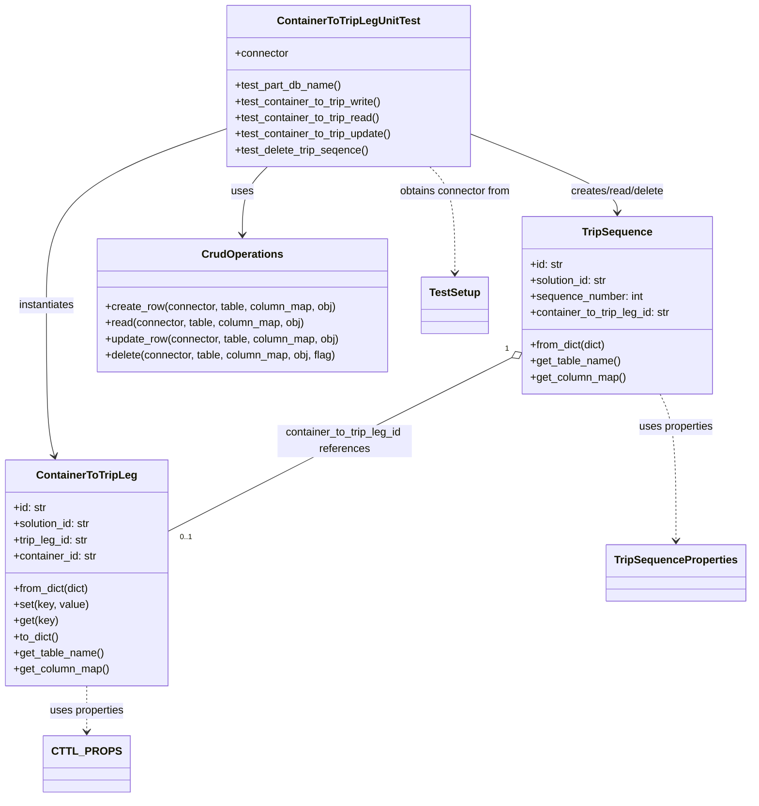

# Diagram: partview_core/partview_service/partview_service/tests/unit/core/datamodel/container_to_trip_leg_test.py


> Auto-generated by Obscura crawlers

## Diagram 1



### SVG

<svg id="container" width="1117.33203125" xmlns="http://www.w3.org/2000/svg" class="classDiagram" height="1186" viewBox="0 0 1117.33203125 1186" role="graphics-document document" aria-roledescription="class"><style>#container{font-family:"trebuchet ms",verdana,arial,sans-serif;font-size:16px;fill:#333;}@keyframes edge-animation-frame{from{stroke-dashoffset:0;}}@keyframes dash{to{stroke-dashoffset:0;}}#container .edge-animation-slow{stroke-dasharray:9,5!important;stroke-dashoffset:900;animation:dash 50s linear infinite;stroke-linecap:round;}#container .edge-animation-fast{stroke-dasharray:9,5!important;stroke-dashoffset:900;animation:dash 20s linear infinite;stroke-linecap:round;}#container .error-icon{fill:#552222;}#container .error-text{fill:#552222;stroke:#552222;}#container .edge-thickness-normal{stroke-width:1px;}#container .edge-thickness-thick{stroke-width:3.5px;}#container .edge-pattern-solid{stroke-dasharray:0;}#container .edge-thickness-invisible{stroke-width:0;fill:none;}#container .edge-pattern-dashed{stroke-dasharray:3;}#container .edge-pattern-dotted{stroke-dasharray:2;}#container .marker{fill:#333333;stroke:#333333;}#container .marker.cross{stroke:#333333;}#container svg{font-family:"trebuchet ms",verdana,arial,sans-serif;font-size:16px;}#container p{margin:0;}#container g.classGroup text{fill:#9370DB;stroke:none;font-family:"trebuchet ms",verdana,arial,sans-serif;font-size:10px;}#container g.classGroup text .title{font-weight:bolder;}#container .nodeLabel,#container .edgeLabel{color:#131300;}#container .edgeLabel .label rect{fill:#ECECFF;}#container .label text{fill:#131300;}#container .labelBkg{background:#ECECFF;}#container .edgeLabel .label span{background:#ECECFF;}#container .classTitle{font-weight:bolder;}#container .node rect,#container .node circle,#container .node ellipse,#container .node polygon,#container .node path{fill:#ECECFF;stroke:#9370DB;stroke-width:1px;}#container .divider{stroke:#9370DB;stroke-width:1;}#container g.clickable{cursor:pointer;}#container g.classGroup rect{fill:#ECECFF;stroke:#9370DB;}#container g.classGroup line{stroke:#9370DB;stroke-width:1;}#container .classLabel .box{stroke:none;stroke-width:0;fill:#ECECFF;opacity:0.5;}#container .classLabel .label{fill:#9370DB;font-size:10px;}#container .relation{stroke:#333333;stroke-width:1;fill:none;}#container .dashed-line{stroke-dasharray:3;}#container .dotted-line{stroke-dasharray:1 2;}#container #compositionStart,#container .composition{fill:#333333!important;stroke:#333333!important;stroke-width:1;}#container #compositionEnd,#container .composition{fill:#333333!important;stroke:#333333!important;stroke-width:1;}#container #dependencyStart,#container .dependency{fill:#333333!important;stroke:#333333!important;stroke-width:1;}#container #dependencyStart,#container .dependency{fill:#333333!important;stroke:#333333!important;stroke-width:1;}#container #extensionStart,#container .extension{fill:transparent!important;stroke:#333333!important;stroke-width:1;}#container #extensionEnd,#container .extension{fill:transparent!important;stroke:#333333!important;stroke-width:1;}#container #aggregationStart,#container .aggregation{fill:transparent!important;stroke:#333333!important;stroke-width:1;}#container #aggregationEnd,#container .aggregation{fill:transparent!important;stroke:#333333!important;stroke-width:1;}#container #lollipopStart,#container .lollipop{fill:#ECECFF!important;stroke:#333333!important;stroke-width:1;}#container #lollipopEnd,#container .lollipop{fill:#ECECFF!important;stroke:#333333!important;stroke-width:1;}#container .edgeTerminals{font-size:11px;line-height:initial;}#container .classTitleText{text-anchor:middle;font-size:18px;fill:#333;}#container .label-icon{display:inline-block;height:1em;overflow:visible;vertical-align:-0.125em;}#container .node .label-icon path{fill:currentColor;stroke:revert;stroke-width:revert;}#container :root{--mermaid-font-family:"trebuchet ms",verdana,arial,sans-serif;}</style><g><defs><marker id="container_class-aggregationStart" class="marker aggregation class" refX="18" refY="7" markerWidth="190" markerHeight="240" orient="auto"><path d="M 18,7 L9,13 L1,7 L9,1 Z"></path></marker></defs><defs><marker id="container_class-aggregationEnd" class="marker aggregation class" refX="1" refY="7" markerWidth="20" markerHeight="28" orient="auto"><path d="M 18,7 L9,13 L1,7 L9,1 Z"></path></marker></defs><defs><marker id="container_class-extensionStart" class="marker extension class" refX="18" refY="7" markerWidth="190" markerHeight="240" orient="auto"><path d="M 1,7 L18,13 V 1 Z"></path></marker></defs><defs><marker id="container_class-extensionEnd" class="marker extension class" refX="1" refY="7" markerWidth="20" markerHeight="28" orient="auto"><path d="M 1,1 V 13 L18,7 Z"></path></marker></defs><defs><marker id="container_class-compositionStart" class="marker composition class" refX="18" refY="7" markerWidth="190" markerHeight="240" orient="auto"><path d="M 18,7 L9,13 L1,7 L9,1 Z"></path></marker></defs><defs><marker id="container_class-compositionEnd" class="marker composition class" refX="1" refY="7" markerWidth="20" markerHeight="28" orient="auto"><path d="M 18,7 L9,13 L1,7 L9,1 Z"></path></marker></defs><defs><marker id="container_class-dependencyStart" class="marker dependency class" refX="6" refY="7" markerWidth="190" markerHeight="240" orient="auto"><path d="M 5,7 L9,13 L1,7 L9,1 Z"></path></marker></defs><defs><marker id="container_class-dependencyEnd" class="marker dependency class" refX="13" refY="7" markerWidth="20" markerHeight="28" orient="auto"><path d="M 18,7 L9,13 L14,7 L9,1 Z"></path></marker></defs><defs><marker id="container_class-lollipopStart" class="marker lollipop class" refX="13" refY="7" markerWidth="190" markerHeight="240" orient="auto"><circle stroke="black" fill="transparent" cx="7" cy="7" r="6"></circle></marker></defs><defs><marker id="container_class-lollipopEnd" class="marker lollipop class" refX="1" refY="7" markerWidth="190" markerHeight="240" orient="auto"><circle stroke="black" fill="transparent" cx="7" cy="7" r="6"></circle></marker></defs><g class="root"><g class="clusters"></g><g class="edgePaths"><path d="M400.21,248L393.992,254.167C387.774,260.333,375.338,272.667,369.12,289.5C362.902,306.333,362.902,327.667,362.902,338.333L362.902,349" id="id_ContainerToTripLegUnitTest_CrudOperations_1" class="edge-thickness-normal edge-pattern-solid relation" style=";;;" data-edge="true" data-et="edge" data-id="id_ContainerToTripLegUnitTest_CrudOperations_1" data-points="W3sieCI6NDAwLjIxMDI3ODE2NDgwODksInkiOjI0OH0seyJ4IjozNjIuOTAyMzQzNzUsInkiOjI4NX0seyJ4IjozNjIuOTAyMzQzNzUsInkiOjM1NX1d" marker-end="url(#container_class-dependencyEnd)"></path><path d="M339.775,190.722L294.323,206.435C248.871,222.148,157.967,253.574,112.515,297.454C67.063,341.333,67.063,397.667,67.063,456C67.063,514.333,67.063,574.667,69.054,612.036C71.046,649.406,75.029,663.811,77.02,671.014L79.012,678.217" id="id_ContainerToTripLegUnitTest_ContainerToTripLeg_2" class="edge-thickness-normal edge-pattern-solid relation" style=";;;" data-edge="true" data-et="edge" data-id="id_ContainerToTripLegUnitTest_ContainerToTripLeg_2" data-points="W3sieCI6MzM5Ljc3NTM5MDYyNSwieSI6MTkwLjcyMjIxNjcyNjk0NzQ0fSx7IngiOjY3LjA2MjUsInkiOjI4NX0seyJ4Ijo2Ny4wNjI1LCJ5Ijo0NTR9LHsieCI6NjcuMDYyNSwieSI6NjM1fSx7IngiOjgwLjYxMDg4NzA5Njc3NDE5LCJ5Ijo2ODR9XQ==" marker-end="url(#container_class-dependencyEnd)"></path><path d="M702.643,199.24L739.045,213.533C775.447,227.827,848.251,256.413,884.653,275.873C921.055,295.333,921.055,305.667,921.055,310.833L921.055,316" id="id_ContainerToTripLegUnitTest_TripSequence_3" class="edge-thickness-normal edge-pattern-solid relation" style=";;;" data-edge="true" data-et="edge" data-id="id_ContainerToTripLegUnitTest_TripSequence_3" data-points="W3sieCI6NzAyLjY0MjU3ODEyNSwieSI6MTk5LjI0MDE2NTg4NDMwMTA2fSx7IngiOjkyMS4wNTQ2ODc1LCJ5IjoyODV9LHsieCI6OTIxLjA1NDY4NzUsInkiOjMyMn1d" marker-end="url(#container_class-dependencyEnd)"></path><path d="M762.732,532.084L727.953,549.236C693.174,566.389,623.617,600.695,537.515,643.929C451.414,687.164,348.77,739.328,297.447,765.41L246.125,791.492" id="id_TripSequence_ContainerToTripLeg_4" class="edge-thickness-normal edge-pattern-solid relation" style=";;;" data-edge="true" data-et="edge" data-id="id_TripSequence_ContainerToTripLeg_4" data-points="W3sieCI6Nzc4LjIwMzEyNSwieSI6NTI0LjQ1MzQyNzg1MDY4ODJ9LHsieCI6NTU0LjA1ODU5Mzc1LCJ5Ijo2MzV9LHsieCI6MjQ2LjEyNSwieSI6NzkxLjQ5MjI3NDMzNjUyNjF9XQ==" marker-start="url(#container_class-aggregationStart)"></path><path d="M642.208,248L648.426,254.167C654.644,260.333,667.08,272.667,673.298,299C679.516,325.333,679.516,365.667,679.516,385.833L679.516,406" id="id_ContainerToTripLegUnitTest_TestSetup_5" class="edge-thickness-normal edge-pattern-dashed relation" style=";;;" data-edge="true" data-et="edge" data-id="id_ContainerToTripLegUnitTest_TestSetup_5" data-points="W3sieCI6NjQyLjIwNzY5MDU4NTE5MTEsInkiOjI0OH0seyJ4Ijo2NzkuNTE1NjI1LCJ5IjoyODV9LHsieCI6Njc5LjUxNTYyNSwieSI6NDEyfV0=" marker-end="url(#container_class-dependencyEnd)"></path><path d="M127.063,1020L127.063,1026.167C127.063,1032.333,127.063,1044.667,127.063,1056C127.063,1067.333,127.063,1077.667,127.063,1082.833L127.063,1088" id="id_ContainerToTripLeg_CTTL_PROPS_6" class="edge-thickness-normal edge-pattern-dashed relation" style=";;;" data-edge="true" data-et="edge" data-id="id_ContainerToTripLeg_CTTL_PROPS_6" data-points="W3sieCI6MTI3LjA2MjUsInkiOjEwMjB9LHsieCI6MTI3LjA2MjUsInkiOjEwNTd9LHsieCI6MTI3LjA2MjUsInkiOjEwOTR9XQ==" marker-end="url(#container_class-dependencyEnd)"></path><path d="M985.348,586L989.326,594.167C993.304,602.333,1001.259,618.667,1005.237,655C1009.215,691.333,1009.215,747.667,1009.215,775.833L1009.215,804" id="id_TripSequence_TripSequenceProperties_7" class="edge-thickness-normal edge-pattern-dashed relation" style=";;;" data-edge="true" data-et="edge" data-id="id_TripSequence_TripSequenceProperties_7" data-points="W3sieCI6OTg1LjM0ODI4MjExMzI1OTYsInkiOjU4Nn0seyJ4IjoxMDA5LjIxNDg0Mzc1LCJ5Ijo2MzV9LHsieCI6MTAwOS4yMTQ4NDM3NSwieSI6ODEwfV0=" marker-end="url(#container_class-dependencyEnd)"></path></g><g class="edgeLabels"><g class="edgeLabel" transform="translate(362.90234375, 285)"><g class="label" data-id="id_ContainerToTripLegUnitTest_CrudOperations_1" transform="translate(-16.4921875, -12)"><foreignObject width="32.984375" height="24"><div xmlns="http://www.w3.org/1999/xhtml" class="labelBkg" style="display: table-cell; white-space: nowrap; line-height: 1.5; max-width: 200px; text-align: center;"><span class="edgeLabel"><p>uses</p></span></div></foreignObject></g></g><g class="edgeLabel" transform="translate(67.0625, 454)"><g class="label" data-id="id_ContainerToTripLegUnitTest_ContainerToTripLeg_2" transform="translate(-42.9140625, -12)"><foreignObject width="85.828125" height="24"><div xmlns="http://www.w3.org/1999/xhtml" class="labelBkg" style="display: table-cell; white-space: nowrap; line-height: 1.5; max-width: 200px; text-align: center;"><span class="edgeLabel"><p>instantiates</p></span></div></foreignObject></g></g><g class="edgeLabel" transform="translate(921.0546875, 285)"><g class="label" data-id="id_ContainerToTripLegUnitTest_TripSequence_3" transform="translate(-73.0546875, -12)"><foreignObject width="146.109375" height="24"><div xmlns="http://www.w3.org/1999/xhtml" class="labelBkg" style="display: table-cell; white-space: nowrap; line-height: 1.5; max-width: 200px; text-align: center;"><span class="edgeLabel"><p>creates/read/delete</p></span></div></foreignObject></g></g><g class="edgeLabel" transform="translate(511.49274, 656.63202)"><g class="label" data-id="id_TripSequence_ContainerToTripLeg_4" transform="translate(-100, -24)"><foreignObject width="200" height="48"><div xmlns="http://www.w3.org/1999/xhtml" class="labelBkg" style="display: table; white-space: break-spaces; line-height: 1.5; max-width: 200px; text-align: center; width: 200px;"><span class="edgeLabel"><p>container_to_trip_leg_id references</p></span></div></foreignObject></g></g><g class="edgeLabel" transform="translate(679.515625, 285)"><g class="label" data-id="id_ContainerToTripLegUnitTest_TestSetup_5" transform="translate(-85.015625, -12)"><foreignObject width="170.03125" height="24"><div xmlns="http://www.w3.org/1999/xhtml" class="labelBkg" style="display: table-cell; white-space: nowrap; line-height: 1.5; max-width: 200px; text-align: center;"><span class="edgeLabel"><p>obtains connector from</p></span></div></foreignObject></g></g><g class="edgeLabel" transform="translate(127.0625, 1057)"><g class="label" data-id="id_ContainerToTripLeg_CTTL_PROPS_6" transform="translate(-56.3203125, -12)"><foreignObject width="112.640625" height="24"><div xmlns="http://www.w3.org/1999/xhtml" class="labelBkg" style="display: table-cell; white-space: nowrap; line-height: 1.5; max-width: 200px; text-align: center;"><span class="edgeLabel"><p>uses properties</p></span></div></foreignObject></g></g><g class="edgeLabel" transform="translate(1009.21484375, 635)"><g class="label" data-id="id_TripSequence_TripSequenceProperties_7" transform="translate(-56.3203125, -12)"><foreignObject width="112.640625" height="24"><div xmlns="http://www.w3.org/1999/xhtml" class="labelBkg" style="display: table-cell; white-space: nowrap; line-height: 1.5; max-width: 200px; text-align: center;"><span class="edgeLabel"><p>uses properties</p></span></div></foreignObject></g></g><g class="edgeTerminals" transform="translate(755.8733002505151, 518.7412477196958)"><g class="inner" transform="translate(0, 0)"><foreignObject style="width: 9px; height: 12px;"><div xmlns="http://www.w3.org/1999/xhtml" style="display: inline-block; padding-right: 1px; white-space: nowrap;"><span class="edgeLabel">1</span></div></foreignObject></g></g><g class="edgeTerminals" transform="translate(263.5217591171094, 791.9360938245809)"><g class="inner" transform="translate(0, 0)"></g><foreignObject style="width: 36px; height: 12px;"><div xmlns="http://www.w3.org/1999/xhtml" style="display: inline-block; padding-right: 1px; white-space: nowrap;"><span class="edgeLabel">0..1</span></div></foreignObject></g></g><g class="nodes"><g class="node default" id="classId-ContainerToTripLeg-0" transform="translate(127.0625, 852)"><g class="basic label-container"><path d="M-119.0625 -168 L119.0625 -168 L119.0625 168 L-119.0625 168" stroke="none" stroke-width="0" fill="#ECECFF" style=""></path><path d="M-119.0625 -168 C-65.28434642871012 -168, -11.506192857420245 -168, 119.0625 -168 M-119.0625 -168 C-64.23965603803035 -168, -9.41681207606068 -168, 119.0625 -168 M119.0625 -168 C119.0625 -54.42886589892407, 119.0625 59.142268202151854, 119.0625 168 M119.0625 -168 C119.0625 -65.32064700398195, 119.0625 37.35870599203611, 119.0625 168 M119.0625 168 C59.87558572330922 168, 0.6886714466184429 168, -119.0625 168 M119.0625 168 C26.704232467730364 168, -65.65403506453927 168, -119.0625 168 M-119.0625 168 C-119.0625 39.59819343801945, -119.0625 -88.8036131239611, -119.0625 -168 M-119.0625 168 C-119.0625 50.07704974541322, -119.0625 -67.84590050917356, -119.0625 -168" stroke="#9370DB" stroke-width="1.3" fill="none" stroke-dasharray="0 0" style=""></path></g><g class="annotation-group text" transform="translate(0, -144)"></g><g class="label-group text" transform="translate(-71.203125, -144)"><g class="label" style="font-weight: bolder" transform="translate(0,-12)"><foreignObject width="142.40625" height="24"><div xmlns="http://www.w3.org/1999/xhtml" style="display: table-cell; white-space: nowrap; line-height: 1.5; max-width: 191px; text-align: center;"><span class="nodeLabel markdown-node-label" style=""><p>ContainerToTripLeg</p></span></div></foreignObject></g></g><g class="members-group text" transform="translate(-107.0625, -96)"><g class="label" style="" transform="translate(0,-12)"><foreignObject width="49.578125" height="24"><div xmlns="http://www.w3.org/1999/xhtml" style="display: table-cell; white-space: nowrap; line-height: 1.5; max-width: 108px; text-align: center;"><span class="nodeLabel markdown-node-label" style=""><p>+id: str</p></span></div></foreignObject></g><g class="label" style="" transform="translate(0,12)"><foreignObject width="117.71875" height="24"><div xmlns="http://www.w3.org/1999/xhtml" style="display: table-cell; white-space: nowrap; line-height: 1.5; max-width: 176px; text-align: center;"><span class="nodeLabel markdown-node-label" style=""><p>+solution_id: str</p></span></div></foreignObject></g><g class="label" style="" transform="translate(0,36)"><foreignObject width="113.34375" height="24"><div xmlns="http://www.w3.org/1999/xhtml" style="display: table-cell; white-space: nowrap; line-height: 1.5; max-width: 172px; text-align: center;"><span class="nodeLabel markdown-node-label" style=""><p>+trip_leg_id: str</p></span></div></foreignObject></g><g class="label" style="" transform="translate(0,60)"><foreignObject width="125.8125" height="24"><div xmlns="http://www.w3.org/1999/xhtml" style="display: table-cell; white-space: nowrap; line-height: 1.5; max-width: 184px; text-align: center;"><span class="nodeLabel markdown-node-label" style=""><p>+container_id: str</p></span></div></foreignObject></g></g><g class="methods-group text" transform="translate(-107.0625, 24)"><g class="label" style="" transform="translate(0,-12)"><foreignObject width="115.234375" height="24"><div xmlns="http://www.w3.org/1999/xhtml" style="display: table-cell; white-space: nowrap; line-height: 1.5; max-width: 173px; text-align: center;"><span class="nodeLabel markdown-node-label" style=""><p>+from_dict(dict)</p></span></div></foreignObject></g><g class="label" style="" transform="translate(0,12)"><foreignObject width="111.21875" height="24"><div xmlns="http://www.w3.org/1999/xhtml" style="display: table-cell; white-space: nowrap; line-height: 1.5; max-width: 169px; text-align: center;"><span class="nodeLabel markdown-node-label" style=""><p>+set(key, value)</p></span></div></foreignObject></g><g class="label" style="" transform="translate(0,36)"><foreignObject width="65.5" height="24"><div xmlns="http://www.w3.org/1999/xhtml" style="display: table-cell; white-space: nowrap; line-height: 1.5; max-width: 123px; text-align: center;"><span class="nodeLabel markdown-node-label" style=""><p>+get(key)</p></span></div></foreignObject></g><g class="label" style="" transform="translate(0,60)"><foreignObject width="68.34375" height="24"><div xmlns="http://www.w3.org/1999/xhtml" style="display: table-cell; white-space: nowrap; line-height: 1.5; max-width: 126px; text-align: center;"><span class="nodeLabel markdown-node-label" style=""><p>+to_dict()</p></span></div></foreignObject></g><g class="label" style="" transform="translate(0,84)"><foreignObject width="134.625" height="24"><div xmlns="http://www.w3.org/1999/xhtml" style="display: table-cell; white-space: nowrap; line-height: 1.5; max-width: 192px; text-align: center;"><span class="nodeLabel markdown-node-label" style=""><p>+get_table_name()</p></span></div></foreignObject></g><g class="label" style="" transform="translate(0,108)"><foreignObject width="142.921875" height="24"><div xmlns="http://www.w3.org/1999/xhtml" style="display: table-cell; white-space: nowrap; line-height: 1.5; max-width: 200px; text-align: center;"><span class="nodeLabel markdown-node-label" style=""><p>+get_column_map()</p></span></div></foreignObject></g></g><g class="divider" style=""><path d="M-119.0625 -120 C-56.544609170097374 -120, 5.973281659805252 -120, 119.0625 -120 M-119.0625 -120 C-33.54550369158805 -120, 51.971492616823895 -120, 119.0625 -120" stroke="#9370DB" stroke-width="1.3" fill="none" stroke-dasharray="0 0" style=""></path></g><g class="divider" style=""><path d="M-119.0625 0 C-33.95987295398696 0, 51.14275409202608 0, 119.0625 0 M-119.0625 0 C-59.60709913386932 0, -0.15169826773863804 0, 119.0625 0" stroke="#9370DB" stroke-width="1.3" fill="none" stroke-dasharray="0 0" style=""></path></g></g><g class="node default" id="classId-TripSequence-1" transform="translate(921.0546875, 454)"><g class="basic label-container"><path d="M-142.8515625 -132 L142.8515625 -132 L142.8515625 132 L-142.8515625 132" stroke="none" stroke-width="0" fill="#ECECFF" style=""></path><path d="M-142.8515625 -132 C-82.44531257798985 -132, -22.03906265597972 -132, 142.8515625 -132 M-142.8515625 -132 C-60.65258147536639 -132, 21.54639954926722 -132, 142.8515625 -132 M142.8515625 -132 C142.8515625 -65.54771966697345, 142.8515625 0.9045606660531007, 142.8515625 132 M142.8515625 -132 C142.8515625 -32.85531388627129, 142.8515625 66.28937222745742, 142.8515625 132 M142.8515625 132 C72.00311526283035 132, 1.1546680256606976 132, -142.8515625 132 M142.8515625 132 C80.28724115099769 132, 17.72291980199536 132, -142.8515625 132 M-142.8515625 132 C-142.8515625 45.021256083136734, -142.8515625 -41.95748783372653, -142.8515625 -132 M-142.8515625 132 C-142.8515625 55.64735453749773, -142.8515625 -20.705290925004533, -142.8515625 -132" stroke="#9370DB" stroke-width="1.3" fill="none" stroke-dasharray="0 0" style=""></path></g><g class="annotation-group text" transform="translate(0, -108)"></g><g class="label-group text" transform="translate(-49.8125, -108)"><g class="label" style="font-weight: bolder" transform="translate(0,-12)"><foreignObject width="99.625" height="24"><div xmlns="http://www.w3.org/1999/xhtml" style="display: table-cell; white-space: nowrap; line-height: 1.5; max-width: 148px; text-align: center;"><span class="nodeLabel markdown-node-label" style=""><p>TripSequence</p></span></div></foreignObject></g></g><g class="members-group text" transform="translate(-130.8515625, -60)"><g class="label" style="" transform="translate(0,-12)"><foreignObject width="49.578125" height="24"><div xmlns="http://www.w3.org/1999/xhtml" style="display: table-cell; white-space: nowrap; line-height: 1.5; max-width: 108px; text-align: center;"><span class="nodeLabel markdown-node-label" style=""><p>+id: str</p></span></div></foreignObject></g><g class="label" style="" transform="translate(0,12)"><foreignObject width="117.71875" height="24"><div xmlns="http://www.w3.org/1999/xhtml" style="display: table-cell; white-space: nowrap; line-height: 1.5; max-width: 176px; text-align: center;"><span class="nodeLabel markdown-node-label" style=""><p>+solution_id: str</p></span></div></foreignObject></g><g class="label" style="" transform="translate(0,36)"><foreignObject width="169.90625" height="24"><div xmlns="http://www.w3.org/1999/xhtml" style="display: table-cell; white-space: nowrap; line-height: 1.5; max-width: 227px; text-align: center;"><span class="nodeLabel markdown-node-label" style=""><p>+sequence_number: int</p></span></div></foreignObject></g><g class="label" style="" transform="translate(0,60)"><foreignObject width="211.890625" height="24"><div xmlns="http://www.w3.org/1999/xhtml" style="display: table-cell; white-space: nowrap; line-height: 1.5; max-width: 270px; text-align: center;"><span class="nodeLabel markdown-node-label" style=""><p>+container_to_trip_leg_id: str</p></span></div></foreignObject></g></g><g class="methods-group text" transform="translate(-130.8515625, 60)"><g class="label" style="" transform="translate(0,-12)"><foreignObject width="115.234375" height="24"><div xmlns="http://www.w3.org/1999/xhtml" style="display: table-cell; white-space: nowrap; line-height: 1.5; max-width: 173px; text-align: center;"><span class="nodeLabel markdown-node-label" style=""><p>+from_dict(dict)</p></span></div></foreignObject></g><g class="label" style="" transform="translate(0,12)"><foreignObject width="134.625" height="24"><div xmlns="http://www.w3.org/1999/xhtml" style="display: table-cell; white-space: nowrap; line-height: 1.5; max-width: 192px; text-align: center;"><span class="nodeLabel markdown-node-label" style=""><p>+get_table_name()</p></span></div></foreignObject></g><g class="label" style="" transform="translate(0,36)"><foreignObject width="142.921875" height="24"><div xmlns="http://www.w3.org/1999/xhtml" style="display: table-cell; white-space: nowrap; line-height: 1.5; max-width: 200px; text-align: center;"><span class="nodeLabel markdown-node-label" style=""><p>+get_column_map()</p></span></div></foreignObject></g></g><g class="divider" style=""><path d="M-142.8515625 -84 C-80.84986606422751 -84, -18.84816962845501 -84, 142.8515625 -84 M-142.8515625 -84 C-37.85155549190179 -84, 67.14845151619642 -84, 142.8515625 -84" stroke="#9370DB" stroke-width="1.3" fill="none" stroke-dasharray="0 0" style=""></path></g><g class="divider" style=""><path d="M-142.8515625 36 C-83.46330975869921 36, -24.075057017398436 36, 142.8515625 36 M-142.8515625 36 C-68.01873265991766 36, 6.81409718016468 36, 142.8515625 36" stroke="#9370DB" stroke-width="1.3" fill="none" stroke-dasharray="0 0" style=""></path></g></g><g class="node default" id="classId-CrudOperations-2" transform="translate(362.90234375, 454)"><g class="basic label-container"><path d="M-217.92578125 -99 L217.92578125 -99 L217.92578125 99 L-217.92578125 99" stroke="none" stroke-width="0" fill="#ECECFF" style=""></path><path d="M-217.92578125 -99 C-114.38931462896645 -99, -10.852848007932892 -99, 217.92578125 -99 M-217.92578125 -99 C-50.54917626426192 -99, 116.82742872147617 -99, 217.92578125 -99 M217.92578125 -99 C217.92578125 -57.35789908200488, 217.92578125 -15.715798164009755, 217.92578125 99 M217.92578125 -99 C217.92578125 -29.813004085521328, 217.92578125 39.373991828957344, 217.92578125 99 M217.92578125 99 C68.08121490469819 99, -81.76335144060363 99, -217.92578125 99 M217.92578125 99 C46.49536115598576 99, -124.93505893802848 99, -217.92578125 99 M-217.92578125 99 C-217.92578125 54.08431734109304, -217.92578125 9.168634682186081, -217.92578125 -99 M-217.92578125 99 C-217.92578125 31.492215167158776, -217.92578125 -36.01556966568245, -217.92578125 -99" stroke="#9370DB" stroke-width="1.3" fill="none" stroke-dasharray="0 0" style=""></path></g><g class="annotation-group text" transform="translate(0, -75)"></g><g class="label-group text" transform="translate(-57.6171875, -75)"><g class="label" style="font-weight: bolder" transform="translate(0,-12)"><foreignObject width="115.234375" height="24"><div xmlns="http://www.w3.org/1999/xhtml" style="display: table-cell; white-space: nowrap; line-height: 1.5; max-width: 164px; text-align: center;"><span class="nodeLabel markdown-node-label" style=""><p>CrudOperations</p></span></div></foreignObject></g></g><g class="members-group text" transform="translate(-205.92578125, -27)"></g><g class="methods-group text" transform="translate(-205.92578125, 3)"><g class="label" style="" transform="translate(0,-12)"><foreignObject width="347.75" height="24"><div xmlns="http://www.w3.org/1999/xhtml" style="display: table-cell; white-space: nowrap; line-height: 1.5; max-width: 405px; text-align: center;"><span class="nodeLabel markdown-node-label" style=""><p>+create_row(connector, table, column_map, obj)</p></span></div></foreignObject></g><g class="label" style="" transform="translate(0,12)"><foreignObject width="300.90625" height="24"><div xmlns="http://www.w3.org/1999/xhtml" style="display: table-cell; white-space: nowrap; line-height: 1.5; max-width: 358px; text-align: center;"><span class="nodeLabel markdown-node-label" style=""><p>+read(connector, table, column_map, obj)</p></span></div></foreignObject></g><g class="label" style="" transform="translate(0,36)"><foreignObject width="354.234375" height="24"><div xmlns="http://www.w3.org/1999/xhtml" style="display: table-cell; white-space: nowrap; line-height: 1.5; max-width: 412px; text-align: center;"><span class="nodeLabel markdown-node-label" style=""><p>+update_row(connector, table, column_map, obj)</p></span></div></foreignObject></g><g class="label" style="" transform="translate(0,60)"><foreignObject width="348.578125" height="24"><div xmlns="http://www.w3.org/1999/xhtml" style="display: table-cell; white-space: nowrap; line-height: 1.5; max-width: 406px; text-align: center;"><span class="nodeLabel markdown-node-label" style=""><p>+delete(connector, table, column_map, obj, flag)</p></span></div></foreignObject></g></g><g class="divider" style=""><path d="M-217.92578125 -51 C-77.37856130159773 -51, 63.168658646804545 -51, 217.92578125 -51 M-217.92578125 -51 C-111.57765090026597 -51, -5.22952055053193 -51, 217.92578125 -51" stroke="#9370DB" stroke-width="1.3" fill="none" stroke-dasharray="0 0" style=""></path></g><g class="divider" style=""><path d="M-217.92578125 -27 C-102.97501797831 -27, 11.975745293379987 -27, 217.92578125 -27 M-217.92578125 -27 C-83.02490968349164 -27, 51.875961883016714 -27, 217.92578125 -27" stroke="#9370DB" stroke-width="1.3" fill="none" stroke-dasharray="0 0" style=""></path></g></g><g class="node default" id="classId-ContainerToTripLegUnitTest-3" transform="translate(521.208984375, 128)"><g class="basic label-container"><path d="M-181.43359375 -120 L181.43359375 -120 L181.43359375 120 L-181.43359375 120" stroke="none" stroke-width="0" fill="#ECECFF" style=""></path><path d="M-181.43359375 -120 C-36.615070394347526 -120, 108.20345296130495 -120, 181.43359375 -120 M-181.43359375 -120 C-37.50438312995911 -120, 106.42482749008178 -120, 181.43359375 -120 M181.43359375 -120 C181.43359375 -30.316230973120412, 181.43359375 59.367538053759176, 181.43359375 120 M181.43359375 -120 C181.43359375 -33.5522015379981, 181.43359375 52.8955969240038, 181.43359375 120 M181.43359375 120 C63.89348667331542 120, -53.646620403369155 120, -181.43359375 120 M181.43359375 120 C68.43171233515741 120, -44.57016907968517 120, -181.43359375 120 M-181.43359375 120 C-181.43359375 25.579324949959798, -181.43359375 -68.8413501000804, -181.43359375 -120 M-181.43359375 120 C-181.43359375 56.219204260493186, -181.43359375 -7.561591479013629, -181.43359375 -120" stroke="#9370DB" stroke-width="1.3" fill="none" stroke-dasharray="0 0" style=""></path></g><g class="annotation-group text" transform="translate(0, -96)"></g><g class="label-group text" transform="translate(-101.6171875, -96)"><g class="label" style="font-weight: bolder" transform="translate(0,-12)"><foreignObject width="203.234375" height="24"><div xmlns="http://www.w3.org/1999/xhtml" style="display: table-cell; white-space: nowrap; line-height: 1.5; max-width: 250px; text-align: center;"><span class="nodeLabel markdown-node-label" style=""><p>ContainerToTripLegUnitTest</p></span></div></foreignObject></g></g><g class="members-group text" transform="translate(-169.43359375, -48)"><g class="label" style="" transform="translate(0,-12)"><foreignObject width="80.84375" height="24"><div xmlns="http://www.w3.org/1999/xhtml" style="display: table-cell; white-space: nowrap; line-height: 1.5; max-width: 139px; text-align: center;"><span class="nodeLabel markdown-node-label" style=""><p>+connector</p></span></div></foreignObject></g></g><g class="methods-group text" transform="translate(-169.43359375, 0)"><g class="label" style="" transform="translate(0,-12)"><foreignObject width="159.6875" height="24"><div xmlns="http://www.w3.org/1999/xhtml" style="display: table-cell; white-space: nowrap; line-height: 1.5; max-width: 217px; text-align: center;"><span class="nodeLabel markdown-node-label" style=""><p>+test_part_db_name()</p></span></div></foreignObject></g><g class="label" style="" transform="translate(0,12)"><foreignObject width="222.328125" height="24"><div xmlns="http://www.w3.org/1999/xhtml" style="display: table-cell; white-space: nowrap; line-height: 1.5; max-width: 280px; text-align: center;"><span class="nodeLabel markdown-node-label" style=""><p>+test_container_to_trip_write()</p></span></div></foreignObject></g><g class="label" style="" transform="translate(0,36)"><foreignObject width="218.765625" height="24"><div xmlns="http://www.w3.org/1999/xhtml" style="display: table-cell; white-space: nowrap; line-height: 1.5; max-width: 276px; text-align: center;"><span class="nodeLabel markdown-node-label" style=""><p>+test_container_to_trip_read()</p></span></div></foreignObject></g><g class="label" style="" transform="translate(0,60)"><foreignObject width="237.25" height="24"><div xmlns="http://www.w3.org/1999/xhtml" style="display: table-cell; white-space: nowrap; line-height: 1.5; max-width: 295px; text-align: center;"><span class="nodeLabel markdown-node-label" style=""><p>+test_container_to_trip_update()</p></span></div></foreignObject></g><g class="label" style="" transform="translate(0,84)"><foreignObject width="201.203125" height="24"><div xmlns="http://www.w3.org/1999/xhtml" style="display: table-cell; white-space: nowrap; line-height: 1.5; max-width: 259px; text-align: center;"><span class="nodeLabel markdown-node-label" style=""><p>+test_delete_trip_seqence()</p></span></div></foreignObject></g></g><g class="divider" style=""><path d="M-181.43359375 -72 C-97.03335431253934 -72, -12.63311487507869 -72, 181.43359375 -72 M-181.43359375 -72 C-88.54428257843969 -72, 4.345028593120617 -72, 181.43359375 -72" stroke="#9370DB" stroke-width="1.3" fill="none" stroke-dasharray="0 0" style=""></path></g><g class="divider" style=""><path d="M-181.43359375 -24 C-90.4667940752376 -24, 0.5000055995247976 -24, 181.43359375 -24 M-181.43359375 -24 C-86.61994669671716 -24, 8.193700356565671 -24, 181.43359375 -24" stroke="#9370DB" stroke-width="1.3" fill="none" stroke-dasharray="0 0" style=""></path></g></g><g class="node default" id="classId-TestSetup-4" transform="translate(679.515625, 454)"><g class="basic label-container"><path d="M-48.6875 -42 L48.6875 -42 L48.6875 42 L-48.6875 42" stroke="none" stroke-width="0" fill="#ECECFF" style=""></path><path d="M-48.6875 -42 C-26.321986944916492 -42, -3.956473889832985 -42, 48.6875 -42 M-48.6875 -42 C-25.072626634578036 -42, -1.457753269156072 -42, 48.6875 -42 M48.6875 -42 C48.6875 -16.822161452269732, 48.6875 8.355677095460535, 48.6875 42 M48.6875 -42 C48.6875 -15.686411373982327, 48.6875 10.627177252035345, 48.6875 42 M48.6875 42 C22.26897910878147 42, -4.149541782437062 42, -48.6875 42 M48.6875 42 C10.706093992651262 42, -27.275312014697477 42, -48.6875 42 M-48.6875 42 C-48.6875 13.478613495025431, -48.6875 -15.042773009949137, -48.6875 -42 M-48.6875 42 C-48.6875 16.49667659493972, -48.6875 -9.006646810120557, -48.6875 -42" stroke="#9370DB" stroke-width="1.3" fill="none" stroke-dasharray="0 0" style=""></path></g><g class="annotation-group text" transform="translate(0, -18)"></g><g class="label-group text" transform="translate(-36.6875, -18)"><g class="label" style="font-weight: bolder" transform="translate(0,-12)"><foreignObject width="73.375" height="24"><div xmlns="http://www.w3.org/1999/xhtml" style="display: table-cell; white-space: nowrap; line-height: 1.5; max-width: 121px; text-align: center;"><span class="nodeLabel markdown-node-label" style=""><p>TestSetup</p></span></div></foreignObject></g></g><g class="members-group text" transform="translate(-36.6875, 30)"></g><g class="methods-group text" transform="translate(-36.6875, 60)"></g><g class="divider" style=""><path d="M-48.6875 6 C-23.097091671723394 6, 2.493316656553212 6, 48.6875 6 M-48.6875 6 C-13.040173592856299 6, 22.607152814287403 6, 48.6875 6" stroke="#9370DB" stroke-width="1.3" fill="none" stroke-dasharray="0 0" style=""></path></g><g class="divider" style=""><path d="M-48.6875 24 C-28.16145103118678 24, -7.635402062373558 24, 48.6875 24 M-48.6875 24 C-18.673196038446317 24, 11.341107923107366 24, 48.6875 24" stroke="#9370DB" stroke-width="1.3" fill="none" stroke-dasharray="0 0" style=""></path></g></g><g class="node default" id="classId-CTTL_PROPS-5" transform="translate(127.0625, 1136)"><g class="basic label-container"><path d="M-57.828125 -42 L57.828125 -42 L57.828125 42 L-57.828125 42" stroke="none" stroke-width="0" fill="#ECECFF" style=""></path><path d="M-57.828125 -42 C-25.34392509744891 -42, 7.14027480510218 -42, 57.828125 -42 M-57.828125 -42 C-23.197080762141105 -42, 11.433963475717789 -42, 57.828125 -42 M57.828125 -42 C57.828125 -13.139040053012419, 57.828125 15.721919893975162, 57.828125 42 M57.828125 -42 C57.828125 -20.841327499723427, 57.828125 0.3173450005531464, 57.828125 42 M57.828125 42 C28.594197639247216 42, -0.6397297215055673 42, -57.828125 42 M57.828125 42 C27.747112756762682 42, -2.3338994864746354 42, -57.828125 42 M-57.828125 42 C-57.828125 15.852914625255277, -57.828125 -10.294170749489446, -57.828125 -42 M-57.828125 42 C-57.828125 11.566321003497691, -57.828125 -18.867357993004617, -57.828125 -42" stroke="#9370DB" stroke-width="1.3" fill="none" stroke-dasharray="0 0" style=""></path></g><g class="annotation-group text" transform="translate(0, -18)"></g><g class="label-group text" transform="translate(-45.828125, -18)"><g class="label" style="font-weight: bolder" transform="translate(0,-12)"><foreignObject width="91.65625" height="24"><div xmlns="http://www.w3.org/1999/xhtml" style="display: table-cell; white-space: nowrap; line-height: 1.5; max-width: 140px; text-align: center;"><span class="nodeLabel markdown-node-label" style=""><p>CTTL_PROPS</p></span></div></foreignObject></g></g><g class="members-group text" transform="translate(-45.828125, 30)"></g><g class="methods-group text" transform="translate(-45.828125, 60)"></g><g class="divider" style=""><path d="M-57.828125 6 C-20.622513594857182 6, 16.583097810285636 6, 57.828125 6 M-57.828125 6 C-18.544043884569597 6, 20.740037230860807 6, 57.828125 6" stroke="#9370DB" stroke-width="1.3" fill="none" stroke-dasharray="0 0" style=""></path></g><g class="divider" style=""><path d="M-57.828125 24 C-19.4374278317621 24, 18.9532693364758 24, 57.828125 24 M-57.828125 24 C-19.711014984561736 24, 18.40609503087653 24, 57.828125 24" stroke="#9370DB" stroke-width="1.3" fill="none" stroke-dasharray="0 0" style=""></path></g></g><g class="node default" id="classId-TripSequenceProperties-6" transform="translate(1009.21484375, 852)"><g class="basic label-container"><path d="M-100.1171875 -42 L100.1171875 -42 L100.1171875 42 L-100.1171875 42" stroke="none" stroke-width="0" fill="#ECECFF" style=""></path><path d="M-100.1171875 -42 C-25.50562093760864 -42, 49.10594562478272 -42, 100.1171875 -42 M-100.1171875 -42 C-20.936919135254513 -42, 58.243349229490974 -42, 100.1171875 -42 M100.1171875 -42 C100.1171875 -22.37145258761734, 100.1171875 -2.7429051752346822, 100.1171875 42 M100.1171875 -42 C100.1171875 -17.450997446889936, 100.1171875 7.098005106220128, 100.1171875 42 M100.1171875 42 C33.03200285474152 42, -34.05318179051696 42, -100.1171875 42 M100.1171875 42 C51.41261574543621 42, 2.708043990872426 42, -100.1171875 42 M-100.1171875 42 C-100.1171875 16.250993591453927, -100.1171875 -9.498012817092146, -100.1171875 -42 M-100.1171875 42 C-100.1171875 24.93844867604888, -100.1171875 7.876897352097757, -100.1171875 -42" stroke="#9370DB" stroke-width="1.3" fill="none" stroke-dasharray="0 0" style=""></path></g><g class="annotation-group text" transform="translate(0, -18)"></g><g class="label-group text" transform="translate(-88.1171875, -18)"><g class="label" style="font-weight: bolder" transform="translate(0,-12)"><foreignObject width="176.234375" height="24"><div xmlns="http://www.w3.org/1999/xhtml" style="display: table-cell; white-space: nowrap; line-height: 1.5; max-width: 223px; text-align: center;"><span class="nodeLabel markdown-node-label" style=""><p>TripSequenceProperties</p></span></div></foreignObject></g></g><g class="members-group text" transform="translate(-88.1171875, 30)"></g><g class="methods-group text" transform="translate(-88.1171875, 60)"></g><g class="divider" style=""><path d="M-100.1171875 6 C-31.99486760675184 6, 36.12745228649632 6, 100.1171875 6 M-100.1171875 6 C-45.29558469941278 6, 9.526018101174444 6, 100.1171875 6" stroke="#9370DB" stroke-width="1.3" fill="none" stroke-dasharray="0 0" style=""></path></g><g class="divider" style=""><path d="M-100.1171875 24 C-44.11026331079116 24, 11.896660878417677 24, 100.1171875 24 M-100.1171875 24 C-32.12294287756619 24, 35.87130174486762 24, 100.1171875 24" stroke="#9370DB" stroke-width="1.3" fill="none" stroke-dasharray="0 0" style=""></path></g></g></g></g></g></svg>

## Diagram 2

```mermaid
sequenceDiagram
participant Test as ContainerToTripLegUnitTest
participant Setup as TestSetup
participant CO as CrudOperations
participant CTL1 as ContainerToTripLeg#1
participant CTL2 as ContainerToTripLeg#2
participant CTL3 as ContainerToTripLeg#3
participant TS as TripSequence

Test ->> Setup: get_database_connector("dev","us-east-1","parts/database_api_service")
Note right of Test: connector assigned
Test ->> CTL1: ContainerToTripLeg().from_dict({...})
Test ->> CTL2: ContainerToTripLeg().set(...).set(...).set(...)
Test ->> CTL3: ContainerToTripLeg(); set attributes directly
Test ->> CO: create_row(connector, ContainerToTripLeg.table, column_map, CTL1)
CO -->> Test: row created (id assigned)
Test ->> CO: create_row(..., CTL2)
CO -->> Test: row created
Test ->> CO: create_row(..., CTL3)
CO -->> Test: row created
Test ->> TS: TripSequence().from_dict({...})
Test ->> CO: create_row(connector, TripSequence.table, column_map, TS)
CO -->> Test: trip sequence row created
Test ->> CO: delete(connector, TripSequence.table, column_map, TS, False)
CO -->> Test: trip sequence deleted
```

> SVG rendering failed for this diagram.
