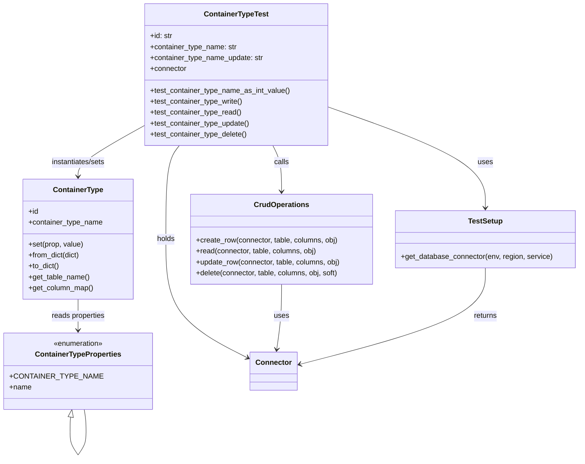
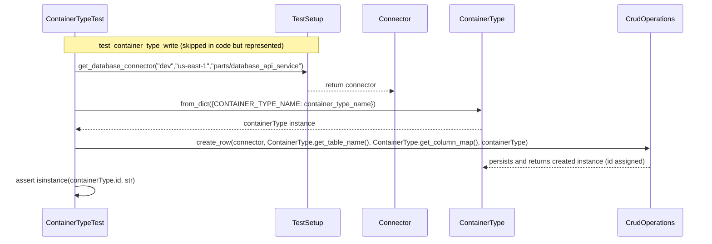

# Diagram: partview_core/partview_service/partview_service/tests/unit/core/datamodel/container_type_test.py

> Auto-generated by Obscura crawlers

## Diagram 1

### SVG

<svg id="container" width="1260.8570556640625" xmlns="http://www.w3.org/2000/svg" class="classDiagram" height="1008.25" viewBox="0 0 1260.8570556640625 1008.25" role="graphics-document document" aria-roledescription="class"><g><defs><marker id="container_class-aggregationStart" class="marker aggregation class" refX="18" refY="7" markerWidth="190" markerHeight="240" orient="auto"><path d="M 18,7 L9,13 L1,7 L9,1 Z"></path></marker></defs><defs><marker id="container_class-aggregationEnd" class="marker aggregation class" refX="1" refY="7" markerWidth="20" markerHeight="28" orient="auto"><path d="M 18,7 L9,13 L1,7 L9,1 Z"></path></marker></defs><defs><marker id="container_class-extensionStart" class="marker extension class" refX="18" refY="7" markerWidth="190" markerHeight="240" orient="auto"><path d="M 1,7 L18,13 V 1 Z"></path></marker></defs><defs><marker id="container_class-extensionEnd" class="marker extension class" refX="1" refY="7" markerWidth="20" markerHeight="28" orient="auto"><path d="M 1,1 V 13 L18,7 Z"></path></marker></defs><defs><marker id="container_class-compositionStart" class="marker composition class" refX="18" refY="7" markerWidth="190" markerHeight="240" orient="auto"><path d="M 18,7 L9,13 L1,7 L9,1 Z"></path></marker></defs><defs><marker id="container_class-compositionEnd" class="marker composition class" refX="1" refY="7" markerWidth="20" markerHeight="28" orient="auto"><path d="M 18,7 L9,13 L1,7 L9,1 Z"></path></marker></defs><defs><marker id="container_class-dependencyStart" class="marker dependency class" refX="6" refY="7" markerWidth="190" markerHeight="240" orient="auto"><path d="M 5,7 L9,13 L1,7 L9,1 Z"></path></marker></defs><defs><marker id="container_class-dependencyEnd" class="marker dependency class" refX="13" refY="7" markerWidth="20" markerHeight="28" orient="auto"><path d="M 18,7 L9,13 L14,7 L9,1 Z"></path></marker></defs><defs><marker id="container_class-lollipopStart" class="marker lollipop class" refX="13" refY="7" markerWidth="190" markerHeight="240" orient="auto"><circle stroke="black" fill="transparent" cx="7" cy="7" r="6"></circle></marker></defs><defs><marker id="container_class-lollipopEnd" class="marker lollipop class" refX="1" refY="7" markerWidth="190" markerHeight="240" orient="auto"><circle stroke="black" fill="transparent" cx="7" cy="7" r="6"></circle></marker></defs><g class="root"><g class="clusters"></g><g class="edgePaths"><path d="M696.344,233.081L756.179,253.735C816.015,274.388,935.686,315.694,995.521,353.014C1055.357,390.333,1055.357,423.667,1055.357,440.333L1055.357,457" id="id_ContainerTypeTest_TestSetup_1" class="edge-thickness-normal edge-pattern-solid relation" style=";;;" data-edge="true" data-et="edge" data-id="id_ContainerTypeTest_TestSetup_1" data-points="W3sieCI6Njk2LjM0Mzc1LCJ5IjoyMzMuMDgxNDEwNjY5MjU0ODR9LHsieCI6MTA1NS4zNTcwMzEyNTAzNzI1LCJ5IjozNTd9LHsieCI6MTA1NS4zNTcwMzEyNTAzNzI1LCJ5Ijo0NjN9XQ==" marker-end="url(#container_class-dependencyEnd)"></path><path d="M377.566,320L372.876,326.167C368.186,332.333,358.807,344.667,354.117,379C349.427,413.333,349.427,469.667,349.427,526C349.427,582.333,349.427,638.667,380.179,682.383C410.93,726.1,472.432,757.201,503.183,772.751L533.935,788.301" id="id_ContainerTypeTest_Connector_2" class="edge-thickness-normal edge-pattern-solid relation" style=";;;" data-edge="true" data-et="edge" data-id="id_ContainerTypeTest_Connector_2" data-points="W3sieCI6Mzc3LjU2NTcwNTk1ODg1MDM0LCJ5IjozMjB9LHsieCI6MzQ5LjQyNzM0Mzc1MDM3MjUzLCJ5IjozNTd9LHsieCI6MzQ5LjQyNzM0Mzc1MDM3MjUzLCJ5Ijo1MjZ9LHsieCI6MzQ5LjQyNzM0Mzc1MDM3MjUzLCJ5Ijo2OTV9LHsieCI6NTM5LjI4OTA2MjUsInkiOjc5MS4wMDg1Mzc4NTU0NzM4fV0=" marker-end="url(#container_class-dependencyEnd)"></path><path d="M296.063,277.587L272.742,290.823C249.421,304.058,202.779,330.529,179.458,348.931C156.137,367.333,156.137,377.667,156.137,382.833L156.137,388" id="id_ContainerTypeTest_ContainerType_3" class="edge-thickness-normal edge-pattern-solid relation" style=";;;" data-edge="true" data-et="edge" data-id="id_ContainerTypeTest_ContainerType_3" data-points="W3sieCI6Mjk2LjA2MjUsInkiOjI3Ny41ODcwNTIxNjEyMjc3fSx7IngiOjE1Ni4xMzY3MTg3NSwieSI6MzU3fSx7IngiOjE1Ni4xMzY3MTg3NSwieSI6Mzk0fV0=" marker-end="url(#container_class-dependencyEnd)"></path><path d="M585.142,320L588.657,326.167C592.173,332.333,599.204,344.667,602.72,361.5C606.236,378.333,606.236,399.667,606.236,410.333L606.236,421" id="id_ContainerTypeTest_CrudOperations_4" class="edge-thickness-normal edge-pattern-solid relation" style=";;;" data-edge="true" data-et="edge" data-id="id_ContainerTypeTest_CrudOperations_4" data-points="W3sieCI6NTg1LjE0MTU2NDExOTQ3MjIsInkiOjMyMH0seyJ4Ijo2MDYuMjM1OTM3NTAwMzcyNSwieSI6MzU3fSx7IngiOjYwNi4yMzU5Mzc1MDAzNzI1LCJ5Ijo0Mjd9XQ==" marker-end="url(#container_class-dependencyEnd)"></path><path d="M156.137,658L156.137,664.167C156.137,670.333,156.137,682.667,156.137,694C156.137,705.333,156.137,715.667,156.137,720.833L156.137,726" id="id_ContainerType_ContainerTypeProperties_5" class="edge-thickness-normal edge-pattern-solid relation" style=";;;" data-edge="true" data-et="edge" data-id="id_ContainerType_ContainerTypeProperties_5" data-points="W3sieCI6MTU2LjEzNjcxODc1LCJ5Ijo2NTh9LHsieCI6MTU2LjEzNjcxODc1LCJ5Ijo2OTV9LHsieCI6MTU2LjEzNjcxODc1LCJ5Ijo3MzJ9XQ==" marker-end="url(#container_class-dependencyEnd)"></path><path d="M606.236,625L606.236,636.667C606.236,648.333,606.236,671.667,604.472,695.51C602.709,719.354,599.181,743.708,597.418,755.885L595.654,768.062" id="id_CrudOperations_Connector_6" class="edge-thickness-normal edge-pattern-solid relation" style=";;;" data-edge="true" data-et="edge" data-id="id_CrudOperations_Connector_6" data-points="W3sieCI6NjA2LjIzNTkzNzUwMDM3MjUsInkiOjYyNX0seyJ4Ijo2MDYuMjM1OTM3NTAwMzcyNSwieSI6Njk1fSx7IngiOjU5NC43OTM5OTUzNTEzNjksInkiOjc3NH1d" marker-end="url(#container_class-dependencyEnd)"></path><path d="M1055.357,589L1055.357,606.667C1055.357,624.333,1055.357,659.667,986.788,695.113C918.218,730.56,781.08,766.119,712.51,783.899L643.941,801.679" id="id_TestSetup_Connector_7" class="edge-thickness-normal edge-pattern-solid relation" style=";;;" data-edge="true" data-et="edge" data-id="id_TestSetup_Connector_7" data-points="W3sieCI6MTA1NS4zNTcwMzEyNTAzNzI1LCJ5Ijo1ODl9LHsieCI6MTA1NS4zNTcwMzEyNTAzNzI1LCJ5Ijo2OTV9LHsieCI6NjM4LjEzMjgxMjUsInkiOjgwMy4xODUwNDg4OTQ0NjQ4fV0=" marker-end="url(#container_class-dependencyEnd)"></path><path d="M139.893,917.031L139.679,918.359C139.466,919.688,139.039,922.344,138.825,927.839C138.612,933.333,138.612,941.667,138.612,945.833L138.612,950" id="ContainerTypeProperties-cyclic-special-1" class="edge-thickness-normal edge-pattern-solid relation" style=";;;" data-edge="true" data-et="edge" data-id="ContainerTypeProperties-cyclic-special-1" data-points="W3sieCI6MTQyLjYzMTIxNDE2MjU1Njk0LCJ5Ijo5MDB9LHsieCI6MTM4LjYxMTcxODc0OTYyNzQ3LCJ5Ijo5MjV9LHsieCI6MTM4LjYxMTcxODc0OTYyNzQ3LCJ5Ijo5NTB9XQ==" marker-start="url(#container_class-extensionStart)"></path><path d="M138.612,950.1L138.612,954.267C138.612,958.433,138.612,966.767,141.527,975.1C144.442,983.433,150.272,991.767,153.187,995.933L156.102,1000.1" id="ContainerTypeProperties-cyclic-special-mid" class="edge-thickness-normal edge-pattern-solid relation" style=";;;" data-edge="true" data-et="edge" data-id="ContainerTypeProperties-cyclic-special-mid" data-points="W3sieCI6MTM4LjYxMTcxODc0OTYyNzQ3LCJ5Ijo5NTAuMTAwMDAwMDAxNDkwMX0seyJ4IjoxMzguNjExNzE4NzQ5NjI3NDcsInkiOjk3NS4xMDAwMDAwMDE0OTAxfSx7IngiOjE1Ni4xMDE3Mzg3MDk1NTg5LCJ5IjoxMDAwLjEwMDAwMDAwMTQ5MDF9XQ=="></path><path d="M156.172,1000.1L159.087,995.933C162.002,991.767,167.832,983.433,170.747,975.092C173.662,966.75,173.662,958.4,173.662,950.05C173.662,941.7,173.662,933.35,172.992,925.008C172.322,916.667,170.982,908.333,170.312,904.167L169.642,900" id="ContainerTypeProperties-cyclic-special-2" class="edge-thickness-normal edge-pattern-solid relation" style=";;;" data-edge="true" data-et="edge" data-id="ContainerTypeProperties-cyclic-special-2" data-points="W3sieCI6MTU2LjE3MTY5ODc5MDQ0MTEsInkiOjEwMDAuMTAwMDAwMDAxNDkwMX0seyJ4IjoxNzMuNjYxNzE4NzUwMzcyNTMsInkiOjk3NS4xMDAwMDAwMDE0OTAxfSx7IngiOjE3My42NjE3MTg3NTAzNzI1MywieSI6OTUwLjA1MDAwMDAwMDc0NTF9LHsieCI6MTczLjY2MTcxODc1MDM3MjUzLCJ5Ijo5MjV9LHsieCI6MTY5LjY0MjIyMzMzNzQ0MzA2LCJ5Ijo5MDB9XQ=="></path></g><g class="edgeLabels"><g class="edgeLabel" transform="translate(1055.3570312503725, 357)"><g class="label" data-id="id_ContainerTypeTest_TestSetup_1" transform="translate(-16.4921875, -12)"><foreignObject width="32.984375" height="24">

uses

</foreignObject></g></g><g class="edgeLabel" transform="translate(349.42734375037253, 526)"><g class="label" data-id="id_ContainerTypeTest_Connector_2" transform="translate(-20.1875, -12)"><foreignObject width="40.375" height="24">

holds

</foreignObject></g></g><g class="edgeLabel" transform="translate(156.13671875, 357)"><g class="label" data-id="id_ContainerTypeTest_ContainerType_3" transform="translate(-61.5546875, -12)"><foreignObject width="123.109375" height="24">

instantiates/sets

</foreignObject></g></g><g class="edgeLabel" transform="translate(606.2359375003725, 357)"><g class="label" data-id="id_ContainerTypeTest_CrudOperations_4" transform="translate(-16.4453125, -12)"><foreignObject width="32.890625" height="24">

calls

</foreignObject></g></g><g class="edgeLabel" transform="translate(156.13671875, 695)"><g class="label" data-id="id_ContainerType_ContainerTypeProperties_5" transform="translate(-59.8359375, -12)"><foreignObject width="119.671875" height="24">

reads properties

</foreignObject></g></g><g class="edgeLabel" transform="translate(606.2359375003725, 695)"><g class="label" data-id="id_CrudOperations_Connector_6" transform="translate(-16.4921875, -12)"><foreignObject width="32.984375" height="24">

uses

</foreignObject></g></g><g class="edgeLabel" transform="translate(1055.3570312503725, 695)"><g class="label" data-id="id_TestSetup_Connector_7" transform="translate(-26.265625, -12)"><foreignObject width="52.53125" height="24">

returns

</foreignObject></g></g><g class="edgeLabel"><g class="label" data-id="ContainerTypeProperties-cyclic-special-1" transform="translate(0, 0)"><foreignObject width="0" height="0">

</foreignObject></g></g><g class="edgeLabel"><g class="label" data-id="ContainerTypeProperties-cyclic-special-mid" transform="translate(0, 0)"><foreignObject width="0" height="0">

</foreignObject></g></g><g class="edgeLabel"><g class="label" data-id="ContainerTypeProperties-cyclic-special-2" transform="translate(0, 0)"><foreignObject width="0" height="0">

</foreignObject></g></g></g><g class="nodes"><g class="node default" id="classId-ContainerTypeTest-0" transform="translate(496.203125, 164)"><g class="basic label-container"><path d="M-200.140625 -156 L200.140625 -156 L200.140625 156 L-200.140625 156" stroke="none" stroke-width="0" fill="#ECECFF" style=""></path><path d="M-200.140625 -156 C-55.2435310413498 -156, 89.6535629173004 -156, 200.140625 -156 M-200.140625 -156 C-48.484743588834476 -156, 103.17113782233105 -156, 200.140625 -156 M200.140625 -156 C200.140625 -74.04484629852357, 200.140625 7.910307402952867, 200.140625 156 M200.140625 -156 C200.140625 -58.617460400694014, 200.140625 38.76507919861197, 200.140625 156 M200.140625 156 C93.75930988938799 156, -12.622005221224015 156, -200.140625 156 M200.140625 156 C87.80702895653785 156, -24.526567086924302 156, -200.140625 156 M-200.140625 156 C-200.140625 81.97098204488083, -200.140625 7.941964089761655, -200.140625 -156 M-200.140625 156 C-200.140625 84.62953248270229, -200.140625 13.259064965404576, -200.140625 -156" stroke="#9370DB" stroke-width="1.3" fill="none" stroke-dasharray="0 0" style=""></path></g><g class="annotation-group text" transform="translate(0, -132)"></g><g class="label-group text" transform="translate(-68.1875, -132)"><g class="label" style="font-weight: bolder" transform="translate(0,-12)"><foreignObject width="136.375" height="24">

ContainerTypeTest

</foreignObject></g></g><g class="members-group text" transform="translate(-188.140625, -84)"><g class="label" style="" transform="translate(0,-12)"><foreignObject width="49.578125" height="24">

+id: str

</foreignObject></g><g class="label" style="" transform="translate(0,12)"><foreignObject width="191.71875" height="24">

+container_type_name: str

</foreignObject></g><g class="label" style="" transform="translate(0,36)"><foreignObject width="250.75" height="24">

+container_type_name_update: str

</foreignObject></g><g class="label" style="" transform="translate(0,60)"><foreignObject width="80.84375" height="24">

+connector

</foreignObject></g></g><g class="methods-group text" transform="translate(-188.140625, 36)"><g class="label" style="" transform="translate(0,-12)"><foreignObject width="308.09375" height="24">

+test_container_type_name_as_int_value()

</foreignObject></g><g class="label" style="" transform="translate(0,12)"><foreignObject width="205.59375" height="24">

+test_container_type_write()

</foreignObject></g><g class="label" style="" transform="translate(0,36)"><foreignObject width="202.03125" height="24">

+test_container_type_read()

</foreignObject></g><g class="label" style="" transform="translate(0,60)"><foreignObject width="220.515625" height="24">

+test_container_type_update()

</foreignObject></g><g class="label" style="" transform="translate(0,84)"><foreignObject width="215.046875" height="24">

+test_container_type_delete()

</foreignObject></g></g><g class="divider" style=""><path d="M-200.140625 -108 C-103.58924602125214 -108, -7.037867042504274 -108, 200.140625 -108 M-200.140625 -108 C-117.32651434515614 -108, -34.51240369031228 -108, 200.140625 -108" stroke="#9370DB" stroke-width="1.3" fill="none" stroke-dasharray="0 0" style=""></path></g><g class="divider" style=""><path d="M-200.140625 12 C-66.49229198788467 12, 67.15604102423066 12, 200.140625 12 M-200.140625 12 C-78.63102610704193 12, 42.878572785916134 12, 200.140625 12" stroke="#9370DB" stroke-width="1.3" fill="none" stroke-dasharray="0 0" style=""></path></g></g><g class="node default" id="classId-ContainerType-1" transform="translate(156.13671875, 526)"><g class="basic label-container"><path d="M-120.578125 -132 L120.578125 -132 L120.578125 132 L-120.578125 132" stroke="none" stroke-width="0" fill="#ECECFF" style=""></path><path d="M-120.578125 -132 C-60.00611789685711 -132, 0.5658892062857745 -132, 120.578125 -132 M-120.578125 -132 C-47.4068533438938 -132, 25.7644183122124 -132, 120.578125 -132 M120.578125 -132 C120.578125 -47.25978914495215, 120.578125 37.4804217100957, 120.578125 132 M120.578125 -132 C120.578125 -27.25022650631952, 120.578125 77.49954698736096, 120.578125 132 M120.578125 132 C52.387165940860754 132, -15.803793118278492 132, -120.578125 132 M120.578125 132 C42.59326388796825 132, -35.3915972240635 132, -120.578125 132 M-120.578125 132 C-120.578125 41.93509914617762, -120.578125 -48.12980170764476, -120.578125 -132 M-120.578125 132 C-120.578125 28.01180798055222, -120.578125 -75.97638403889556, -120.578125 -132" stroke="#9370DB" stroke-width="1.3" fill="none" stroke-dasharray="0 0" style=""></path></g><g class="annotation-group text" transform="translate(0, -108)"></g><g class="label-group text" transform="translate(-52.9375, -108)"><g class="label" style="font-weight: bolder" transform="translate(0,-12)"><foreignObject width="105.875" height="24">

ContainerType

</foreignObject></g></g><g class="members-group text" transform="translate(-108.578125, -60)"><g class="label" style="" transform="translate(0,-12)"><foreignObject width="22.078125" height="24">

+id

</foreignObject></g><g class="label" style="" transform="translate(0,12)"><foreignObject width="164.21875" height="24">

+container_type_name

</foreignObject></g></g><g class="methods-group text" transform="translate(-108.578125, 12)"><g class="label" style="" transform="translate(0,-12)"><foreignObject width="121.171875" height="24">

+set(prop, value)

</foreignObject></g><g class="label" style="" transform="translate(0,12)"><foreignObject width="115.234375" height="24">

+from_dict(dict)

</foreignObject></g><g class="label" style="" transform="translate(0,36)"><foreignObject width="68.34375" height="24">

+to_dict()

</foreignObject></g><g class="label" style="" transform="translate(0,60)"><foreignObject width="134.625" height="24">

+get_table_name()

</foreignObject></g><g class="label" style="" transform="translate(0,84)"><foreignObject width="142.921875" height="24">

+get_column_map()

</foreignObject></g></g><g class="divider" style=""><path d="M-120.578125 -84 C-46.435513059238374 -84, 27.70709888152325 -84, 120.578125 -84 M-120.578125 -84 C-29.026296109563788 -84, 62.525532780872425 -84, 120.578125 -84" stroke="#9370DB" stroke-width="1.3" fill="none" stroke-dasharray="0 0" style=""></path></g><g class="divider" style=""><path d="M-120.578125 -12 C-48.38440749821241 -12, 23.809310003575177 -12, 120.578125 -12 M-120.578125 -12 C-72.19030979541932 -12, -23.802494590838663 -12, 120.578125 -12" stroke="#9370DB" stroke-width="1.3" fill="none" stroke-dasharray="0 0" style=""></path></g></g><g class="node default" id="classId-ContainerTypeProperties-2" transform="translate(156.13671875, 816)"><g class="basic label-container"><path d="M-148.13671875 -84 L148.13671875 -84 L148.13671875 84 L-148.13671875 84" stroke="none" stroke-width="0" fill="#ECECFF" style=""></path><path d="M-148.13671875 -84 C-78.68997988165782 -84, -9.24324101331564 -84, 148.13671875 -84 M-148.13671875 -84 C-62.42408189269398 -84, 23.288554964612047 -84, 148.13671875 -84 M148.13671875 -84 C148.13671875 -25.654910370393516, 148.13671875 32.69017925921297, 148.13671875 84 M148.13671875 -84 C148.13671875 -35.11640088193794, 148.13671875 13.767198236124116, 148.13671875 84 M148.13671875 84 C72.5184459961077 84, -3.099826757784598 84, -148.13671875 84 M148.13671875 84 C36.14514902594914 84, -75.84642069810172 84, -148.13671875 84 M-148.13671875 84 C-148.13671875 21.261690744882664, -148.13671875 -41.47661851023467, -148.13671875 -84 M-148.13671875 84 C-148.13671875 37.33436502955547, -148.13671875 -9.331269940889058, -148.13671875 -84" stroke="#9370DB" stroke-width="1.3" fill="none" stroke-dasharray="0 0" style=""></path></g><g class="annotation-group text" transform="translate(-55.5546875, -60)"><g class="label" style="" transform="translate(0,-12)"><foreignObject width="111.109375" height="24">

«enumeration»

</foreignObject></g></g><g class="label-group text" transform="translate(-91.2421875, -36)"><g class="label" style="font-weight: bolder" transform="translate(0,-12)"><foreignObject width="182.484375" height="24">

ContainerTypeProperties

</foreignObject></g></g><g class="members-group text" transform="translate(-136.13671875, 12)"><g class="label" style="" transform="translate(0,-12)"><foreignObject width="181.03125" height="24">

+CONTAINER_TYPE_NAME

</foreignObject></g><g class="label" style="" transform="translate(0,12)"><foreignObject width="48.5" height="24">

+name

</foreignObject></g></g><g class="methods-group text" transform="translate(-136.13671875, 84)"></g><g class="divider" style=""><path d="M-148.13671875 -12 C-45.94683838805757 -12, 56.24304197388486 -12, 148.13671875 -12 M-148.13671875 -12 C-42.403543028789855 -12, 63.32963269242029 -12, 148.13671875 -12" stroke="#9370DB" stroke-width="1.3" fill="none" stroke-dasharray="0 0" style=""></path></g><g class="divider" style=""><path d="M-148.13671875 60 C-38.80067666271297 60, 70.53536542457405 60, 148.13671875 60 M-148.13671875 60 C-62.24289320656136 60, 23.650932336877275 60, 148.13671875 60" stroke="#9370DB" stroke-width="1.3" fill="none" stroke-dasharray="0 0" style=""></path></g></g><g class="node default" id="classId-CrudOperations-3" transform="translate(606.2359375003725, 526)"><g class="basic label-container"><path d="M-201.62109375 -99 L201.62109375 -99 L201.62109375 99 L-201.62109375 99" stroke="none" stroke-width="0" fill="#ECECFF" style=""></path><path d="M-201.62109375 -99 C-114.58332830969597 -99, -27.545562869391944 -99, 201.62109375 -99 M-201.62109375 -99 C-116.44514656502062 -99, -31.269199380041243 -99, 201.62109375 -99 M201.62109375 -99 C201.62109375 -29.17947790417911, 201.62109375 40.64104419164178, 201.62109375 99 M201.62109375 -99 C201.62109375 -30.255073299069437, 201.62109375 38.489853401861126, 201.62109375 99 M201.62109375 99 C48.022110680122324 99, -105.57687238975535 99, -201.62109375 99 M201.62109375 99 C119.93432335325767 99, 38.247552956515335 99, -201.62109375 99 M-201.62109375 99 C-201.62109375 54.07935471101056, -201.62109375 9.158709422021118, -201.62109375 -99 M-201.62109375 99 C-201.62109375 49.32725605567564, -201.62109375 -0.3454878886487194, -201.62109375 -99" stroke="#9370DB" stroke-width="1.3" fill="none" stroke-dasharray="0 0" style=""></path></g><g class="annotation-group text" transform="translate(0, -75)"></g><g class="label-group text" transform="translate(-57.6171875, -75)"><g class="label" style="font-weight: bolder" transform="translate(0,-12)"><foreignObject width="115.234375" height="24">

CrudOperations

</foreignObject></g></g><g class="members-group text" transform="translate(-189.62109375, -27)"></g><g class="methods-group text" transform="translate(-189.62109375, 3)"><g class="label" style="" transform="translate(0,-12)"><foreignObject width="315.140625" height="24">

+create_row(connector, table, columns, obj)

</foreignObject></g><g class="label" style="" transform="translate(0,12)"><foreignObject width="268.296875" height="24">

+read(connector, table, columns, obj)

</foreignObject></g><g class="label" style="" transform="translate(0,36)"><foreignObject width="321.625" height="24">

+update_row(connector, table, columns, obj)

</foreignObject></g><g class="label" style="" transform="translate(0,60)"><foreignObject width="317.671875" height="24">

+delete(connector, table, columns, obj, soft)

</foreignObject></g></g><g class="divider" style=""><path d="M-201.62109375 -51 C-85.76240018772751 -51, 30.096293374544985 -51, 201.62109375 -51 M-201.62109375 -51 C-108.55103379201726 -51, -15.480973834034529 -51, 201.62109375 -51" stroke="#9370DB" stroke-width="1.3" fill="none" stroke-dasharray="0 0" style=""></path></g><g class="divider" style=""><path d="M-201.62109375 -27 C-120.51389108757144 -27, -39.406688425142875 -27, 201.62109375 -27 M-201.62109375 -27 C-56.81588763729863 -27, 87.98931847540274 -27, 201.62109375 -27" stroke="#9370DB" stroke-width="1.3" fill="none" stroke-dasharray="0 0" style=""></path></g></g><g class="node default" id="classId-TestSetup-4" transform="translate(1055.3570312503725, 526)"><g class="basic label-container"><path d="M-197.5 -63 L197.5 -63 L197.5 63 L-197.5 63" stroke="none" stroke-width="0" fill="#ECECFF" style=""></path><path d="M-197.5 -63 C-82.86268758213127 -63, 31.774624835737455 -63, 197.5 -63 M-197.5 -63 C-80.53527594344183 -63, 36.42944811311634 -63, 197.5 -63 M197.5 -63 C197.5 -15.298793786171814, 197.5 32.40241242765637, 197.5 63 M197.5 -63 C197.5 -34.46111430782022, 197.5 -5.922228615640435, 197.5 63 M197.5 63 C83.38135835057744 63, -30.737283298845114 63, -197.5 63 M197.5 63 C103.13412984805649 63, 8.768259696112978 63, -197.5 63 M-197.5 63 C-197.5 24.60364178253652, -197.5 -13.792716434926959, -197.5 -63 M-197.5 63 C-197.5 12.855244289675205, -197.5 -37.28951142064959, -197.5 -63" stroke="#9370DB" stroke-width="1.3" fill="none" stroke-dasharray="0 0" style=""></path></g><g class="annotation-group text" transform="translate(0, -39)"></g><g class="label-group text" transform="translate(-36.6875, -39)"><g class="label" style="font-weight: bolder" transform="translate(0,-12)"><foreignObject width="73.375" height="24">

TestSetup

</foreignObject></g></g><g class="members-group text" transform="translate(-185.5, 9)"></g><g class="methods-group text" transform="translate(-185.5, 39)"><g class="label" style="" transform="translate(0,-12)"><foreignObject width="334.3125" height="24">

+get_database_connector(env, region, service)

</foreignObject></g></g><g class="divider" style=""><path d="M-197.5 -15 C-93.1004512546034 -15, 11.299097490793201 -15, 197.5 -15 M-197.5 -15 C-101.35312517464504 -15, -5.206250349290087 -15, 197.5 -15" stroke="#9370DB" stroke-width="1.3" fill="none" stroke-dasharray="0 0" style=""></path></g><g class="divider" style=""><path d="M-197.5 9 C-82.77248190336758 9, 31.955036193264846 9, 197.5 9 M-197.5 9 C-69.83067042347648 9, 57.83865915304705 9, 197.5 9" stroke="#9370DB" stroke-width="1.3" fill="none" stroke-dasharray="0 0" style=""></path></g></g><g class="node default" id="classId-Connector-5" transform="translate(588.7109375, 816)"><g class="basic label-container"><path d="M-49.421875 -42 L49.421875 -42 L49.421875 42 L-49.421875 42" stroke="none" stroke-width="0" fill="#ECECFF" style=""></path><path d="M-49.421875 -42 C-29.48244604783578 -42, -9.543017095671559 -42, 49.421875 -42 M-49.421875 -42 C-19.07389007343803 -42, 11.274094853123941 -42, 49.421875 -42 M49.421875 -42 C49.421875 -24.11556583300265, 49.421875 -6.231131666005297, 49.421875 42 M49.421875 -42 C49.421875 -14.093200957827083, 49.421875 13.813598084345834, 49.421875 42 M49.421875 42 C19.974348318594053 42, -9.473178362811893 42, -49.421875 42 M49.421875 42 C15.134519455765137 42, -19.152836088469726 42, -49.421875 42 M-49.421875 42 C-49.421875 14.677691353258094, -49.421875 -12.644617293483812, -49.421875 -42 M-49.421875 42 C-49.421875 10.32122201224632, -49.421875 -21.35755597550736, -49.421875 -42" stroke="#9370DB" stroke-width="1.3" fill="none" stroke-dasharray="0 0" style=""></path></g><g class="annotation-group text" transform="translate(0, -18)"></g><g class="label-group text" transform="translate(-37.421875, -18)"><g class="label" style="font-weight: bolder" transform="translate(0,-12)"><foreignObject width="74.84375" height="24">

Connector

</foreignObject></g></g><g class="members-group text" transform="translate(-37.421875, 30)"></g><g class="methods-group text" transform="translate(-37.421875, 60)"></g><g class="divider" style=""><path d="M-49.421875 6 C-11.942987622653362 6, 25.535899754693276 6, 49.421875 6 M-49.421875 6 C-21.10627547623375 6, 7.209324047532498 6, 49.421875 6" stroke="#9370DB" stroke-width="1.3" fill="none" stroke-dasharray="0 0" style=""></path></g><g class="divider" style=""><path d="M-49.421875 24 C-14.53191385944423 24, 20.35804728111154 24, 49.421875 24 M-49.421875 24 C-10.158536396724493 24, 29.104802206551014 24, 49.421875 24" stroke="#9370DB" stroke-width="1.3" fill="none" stroke-dasharray="0 0" style=""></path></g></g><g class="label edgeLabel" id="ContainerTypeProperties---ContainerTypeProperties---1" transform="translate(138.61171874962747, 950.0500000007451)"><rect width="0.1" height="0.1"></rect><g class="label" style="" transform="translate(0, 0)"><rect></rect><foreignObject width="0" height="0">

</foreignObject></g></g><g class="label edgeLabel" id="ContainerTypeProperties---ContainerTypeProperties---2" transform="translate(156.13671875, 1000.1500000022352)"><rect width="0.1" height="0.1"></rect><g class="label" style="" transform="translate(0, 0)"><rect></rect><foreignObject width="0" height="0">

</foreignObject></g></g></g></g></g></svg>

## Diagram 2

### SVG

<svg id="container" width="1740" xmlns="http://www.w3.org/2000/svg" height="586" viewBox="-112 -10 1740 586" role="graphics-document document" aria-roledescription="sequence"><g><rect x="1428" y="500" fill="#eaeaea" stroke="#666" width="150" height="65" name="CRUD" rx="3" ry="3" class="actor actor-bottom"></rect><text x="1503" y="532.5" dominant-baseline="central" alignment-baseline="central" class="actor actor-box" style="text-anchor: middle; font-size: 16px; font-weight: 400;"><tspan x="1503" dy="0">CrudOperations</tspan></text></g><g><rect x="992" y="500" fill="#eaeaea" stroke="#666" width="150" height="65" name="Model" rx="3" ry="3" class="actor actor-bottom"></rect><text x="1067" y="532.5" dominant-baseline="central" alignment-baseline="central" class="actor actor-box" style="text-anchor: middle; font-size: 16px; font-weight: 400;"><tspan x="1067" dy="0">ContainerType</tspan></text></g><g><rect x="792" y="500" fill="#eaeaea" stroke="#666" width="150" height="65" name="Connector" rx="3" ry="3" class="actor actor-bottom"></rect><text x="867" y="532.5" dominant-baseline="central" alignment-baseline="central" class="actor actor-box" style="text-anchor: middle; font-size: 16px; font-weight: 400;"><tspan x="867" dy="0">Connector</tspan></text></g><g><rect x="592" y="500" fill="#eaeaea" stroke="#666" width="150" height="65" name="Setup" rx="3" ry="3" class="actor actor-bottom"></rect><text x="667" y="532.5" dominant-baseline="central" alignment-baseline="central" class="actor actor-box" style="text-anchor: middle; font-size: 16px; font-weight: 400;"><tspan x="667" dy="0">TestSetup</tspan></text></g><g><rect x="0" y="500" fill="#eaeaea" stroke="#666" width="154" height="65" name="TestCase" rx="3" ry="3" class="actor actor-bottom"></rect><text x="77" y="532.5" dominant-baseline="central" alignment-baseline="central" class="actor actor-box" style="text-anchor: middle; font-size: 16px; font-weight: 400;"><tspan x="77" dy="0">ContainerTypeTest</tspan></text></g><g><line id="actor4" x1="1503" y1="65" x2="1503" y2="500" class="actor-line 200" stroke-width="0.5px" stroke="#999" name="CRUD"></line><g id="root-4"><rect x="1428" y="0" fill="#eaeaea" stroke="#666" width="150" height="65" name="CRUD" rx="3" ry="3" class="actor actor-top"></rect><text x="1503" y="32.5" dominant-baseline="central" alignment-baseline="central" class="actor actor-box" style="text-anchor: middle; font-size: 16px; font-weight: 400;"><tspan x="1503" dy="0">CrudOperations</tspan></text></g></g><g><line id="actor3" x1="1067" y1="65" x2="1067" y2="500" class="actor-line 200" stroke-width="0.5px" stroke="#999" name="Model"></line><g id="root-3"><rect x="992" y="0" fill="#eaeaea" stroke="#666" width="150" height="65" name="Model" rx="3" ry="3" class="actor actor-top"></rect><text x="1067" y="32.5" dominant-baseline="central" alignment-baseline="central" class="actor actor-box" style="text-anchor: middle; font-size: 16px; font-weight: 400;"><tspan x="1067" dy="0">ContainerType</tspan></text></g></g><g><line id="actor2" x1="867" y1="65" x2="867" y2="500" class="actor-line 200" stroke-width="0.5px" stroke="#999" name="Connector"></line><g id="root-2"><rect x="792" y="0" fill="#eaeaea" stroke="#666" width="150" height="65" name="Connector" rx="3" ry="3" class="actor actor-top"></rect><text x="867" y="32.5" dominant-baseline="central" alignment-baseline="central" class="actor actor-box" style="text-anchor: middle; font-size: 16px; font-weight: 400;"><tspan x="867" dy="0">Connector</tspan></text></g></g><g><line id="actor1" x1="667" y1="65" x2="667" y2="500" class="actor-line 200" stroke-width="0.5px" stroke="#999" name="Setup"></line><g id="root-1"><rect x="592" y="0" fill="#eaeaea" stroke="#666" width="150" height="65" name="Setup" rx="3" ry="3" class="actor actor-top"></rect><text x="667" y="32.5" dominant-baseline="central" alignment-baseline="central" class="actor actor-box" style="text-anchor: middle; font-size: 16px; font-weight: 400;"><tspan x="667" dy="0">TestSetup</tspan></text></g></g><g><line id="actor0" x1="77" y1="65" x2="77" y2="500" class="actor-line 200" stroke-width="0.5px" stroke="#999" name="TestCase"></line><g id="root-0"><rect x="0" y="0" fill="#eaeaea" stroke="#666" width="154" height="65" name="TestCase" rx="3" ry="3" class="actor actor-top"></rect><text x="77" y="32.5" dominant-baseline="central" alignment-baseline="central" class="actor actor-box" style="text-anchor: middle; font-size: 16px; font-weight: 400;"><tspan x="77" dy="0">ContainerTypeTest</tspan></text></g></g><g></g><defs><symbol id="computer" width="24" height="24"><path transform="scale(.5)" d="M2 2v13h20v-13h-20zm18 11h-16v-9h16v9zm-10.228 6l.466-1h3.524l.467 1h-4.457zm14.228 3h-24l2-6h2.104l-1.33 4h18.45l-1.297-4h2.073l2 6zm-5-10h-14v-7h14v7z"></path></symbol></defs><defs><symbol id="database" fill-rule="evenodd" clip-rule="evenodd"><path transform="scale(.5)" d="M12.258.001l.256.004.255.005.253.008.251.01.249.012.247.015.246.016.242.019.241.02.239.023.236.024.233.027.231.028.229.031.225.032.223.034.22.036.217.038.214.04.211.041.208.043.205.045.201.046.198.048.194.05.191.051.187.053.183.054.18.056.175.057.172.059.168.06.163.061.16.063.155.064.15.066.074.033.073.033.071.034.07.034.069.035.068.035.067.035.066.035.064.036.064.036.062.036.06.036.06.037.058.037.058.037.055.038.055.038.053.038.052.038.051.039.05.039.048.039.047.039.045.04.044.04.043.04.041.04.04.041.039.041.037.041.036.041.034.041.033.042.032.042.03.042.029.042.027.042.026.043.024.043.023.043.021.043.02.043.018.044.017.043.015.044.013.044.012.044.011.045.009.044.007.045.006.045.004.045.002.045.001.045v17l-.001.045-.002.045-.004.045-.006.045-.007.045-.009.044-.011.045-.012.044-.013.044-.015.044-.017.043-.018.044-.02.043-.021.043-.023.043-.024.043-.026.043-.027.042-.029.042-.03.042-.032.042-.033.042-.034.041-.036.041-.037.041-.039.041-.04.041-.041.04-.043.04-.044.04-.045.04-.047.039-.048.039-.05.039-.051.039-.052.038-.053.038-.055.038-.055.038-.058.037-.058.037-.06.037-.06.036-.062.036-.064.036-.064.036-.066.035-.067.035-.068.035-.069.035-.07.034-.071.034-.073.033-.074.033-.15.066-.155.064-.16.063-.163.061-.168.06-.172.059-.175.057-.18.056-.183.054-.187.053-.191.051-.194.05-.198.048-.201.046-.205.045-.208.043-.211.041-.214.04-.217.038-.22.036-.223.034-.225.032-.229.031-.231.028-.233.027-.236.024-.239.023-.241.02-.242.019-.246.016-.247.015-.249.012-.251.01-.253.008-.255.005-.256.004-.258.001-.258-.001-.256-.004-.255-.005-.253-.008-.251-.01-.249-.012-.247-.015-.245-.016-.243-.019-.241-.02-.238-.023-.236-.024-.234-.027-.231-.028-.228-.031-.226-.032-.223-.034-.22-.036-.217-.038-.214-.04-.211-.041-.208-.043-.204-.045-.201-.046-.198-.048-.195-.05-.19-.051-.187-.053-.184-.054-.179-.056-.176-.057-.172-.059-.167-.06-.164-.061-.159-.063-.155-.064-.151-.066-.074-.033-.072-.033-.072-.034-.07-.034-.069-.035-.068-.035-.067-.035-.066-.035-.064-.036-.063-.036-.062-.036-.061-.036-.06-.037-.058-.037-.057-.037-.056-.038-.055-.038-.053-.038-.052-.038-.051-.039-.049-.039-.049-.039-.046-.039-.046-.04-.044-.04-.043-.04-.041-.04-.04-.041-.039-.041-.037-.041-.036-.041-.034-.041-.033-.042-.032-.042-.03-.042-.029-.042-.027-.042-.026-.043-.024-.043-.023-.043-.021-.043-.02-.043-.018-.044-.017-.043-.015-.044-.013-.044-.012-.044-.011-.045-.009-.044-.007-.045-.006-.045-.004-.045-.002-.045-.001-.045v-17l.001-.045.002-.045.004-.045.006-.045.007-.045.009-.044.011-.045.012-.044.013-.044.015-.044.017-.043.018-.044.02-.043.021-.043.023-.043.024-.043.026-.043.027-.042.029-.042.03-.042.032-.042.033-.042.034-.041.036-.041.037-.041.039-.041.04-.041.041-.04.043-.04.044-.04.046-.04.046-.039.049-.039.049-.039.051-.039.052-.038.053-.038.055-.038.056-.038.057-.037.058-.037.06-.037.061-.036.062-.036.063-.036.064-.036.066-.035.067-.035.068-.035.069-.035.07-.034.072-.034.072-.033.074-.033.151-.066.155-.064.159-.063.164-.061.167-.06.172-.059.176-.057.179-.056.184-.054.187-.053.19-.051.195-.05.198-.048.201-.046.204-.045.208-.043.211-.041.214-.04.217-.038.22-.036.223-.034.226-.032.228-.031.231-.028.234-.027.236-.024.238-.023.241-.02.243-.019.245-.016.247-.015.249-.012.251-.01.253-.008.255-.005.256-.004.258-.001.258.001zm-9.258 20.499v.01l.001.021.003.021.004.022.005.021.006.022.007.022.009.023.01.022.011.023.012.023.013.023.015.023.016.024.017.023.018.024.019.024.021.024.022.025.023.024.024.025.052.049.056.05.061.051.066.051.07.051.075.051.079.052.084.052.088.052.092.052.097.052.102.051.105.052.11.052.114.051.119.051.123.051.127.05.131.05.135.05.139.048.144.049.147.047.152.047.155.047.16.045.163.045.167.043.171.043.176.041.178.041.183.039.187.039.19.037.194.035.197.035.202.033.204.031.209.03.212.029.216.027.219.025.222.024.226.021.23.02.233.018.236.016.24.015.243.012.246.01.249.008.253.005.256.004.259.001.26-.001.257-.004.254-.005.25-.008.247-.011.244-.012.241-.014.237-.016.233-.018.231-.021.226-.021.224-.024.22-.026.216-.027.212-.028.21-.031.205-.031.202-.034.198-.034.194-.036.191-.037.187-.039.183-.04.179-.04.175-.042.172-.043.168-.044.163-.045.16-.046.155-.046.152-.047.148-.048.143-.049.139-.049.136-.05.131-.05.126-.05.123-.051.118-.052.114-.051.11-.052.106-.052.101-.052.096-.052.092-.052.088-.053.083-.051.079-.052.074-.052.07-.051.065-.051.06-.051.056-.05.051-.05.023-.024.023-.025.021-.024.02-.024.019-.024.018-.024.017-.024.015-.023.014-.024.013-.023.012-.023.01-.023.01-.022.008-.022.006-.022.006-.022.004-.022.004-.021.001-.021.001-.021v-4.127l-.077.055-.08.053-.083.054-.085.053-.087.052-.09.052-.093.051-.095.05-.097.05-.1.049-.102.049-.105.048-.106.047-.109.047-.111.046-.114.045-.115.045-.118.044-.12.043-.122.042-.124.042-.126.041-.128.04-.13.04-.132.038-.134.038-.135.037-.138.037-.139.035-.142.035-.143.034-.144.033-.147.032-.148.031-.15.03-.151.03-.153.029-.154.027-.156.027-.158.026-.159.025-.161.024-.162.023-.163.022-.165.021-.166.02-.167.019-.169.018-.169.017-.171.016-.173.015-.173.014-.175.013-.175.012-.177.011-.178.01-.179.008-.179.008-.181.006-.182.005-.182.004-.184.003-.184.002h-.37l-.184-.002-.184-.003-.182-.004-.182-.005-.181-.006-.179-.008-.179-.008-.178-.01-.176-.011-.176-.012-.175-.013-.173-.014-.172-.015-.171-.016-.17-.017-.169-.018-.167-.019-.166-.02-.165-.021-.163-.022-.162-.023-.161-.024-.159-.025-.157-.026-.156-.027-.155-.027-.153-.029-.151-.03-.15-.03-.148-.031-.146-.032-.145-.033-.143-.034-.141-.035-.14-.035-.137-.037-.136-.037-.134-.038-.132-.038-.13-.04-.128-.04-.126-.041-.124-.042-.122-.042-.12-.044-.117-.043-.116-.045-.113-.045-.112-.046-.109-.047-.106-.047-.105-.048-.102-.049-.1-.049-.097-.05-.095-.05-.093-.052-.09-.051-.087-.052-.085-.053-.083-.054-.08-.054-.077-.054v4.127zm0-5.654v.011l.001.021.003.021.004.021.005.022.006.022.007.022.009.022.01.022.011.023.012.023.013.023.015.024.016.023.017.024.018.024.019.024.021.024.022.024.023.025.024.024.052.05.056.05.061.05.066.051.07.051.075.052.079.051.084.052.088.052.092.052.097.052.102.052.105.052.11.051.114.051.119.052.123.05.127.051.131.05.135.049.139.049.144.048.147.048.152.047.155.046.16.045.163.045.167.044.171.042.176.042.178.04.183.04.187.038.19.037.194.036.197.034.202.033.204.032.209.03.212.028.216.027.219.025.222.024.226.022.23.02.233.018.236.016.24.014.243.012.246.01.249.008.253.006.256.003.259.001.26-.001.257-.003.254-.006.25-.008.247-.01.244-.012.241-.015.237-.016.233-.018.231-.02.226-.022.224-.024.22-.025.216-.027.212-.029.21-.03.205-.032.202-.033.198-.035.194-.036.191-.037.187-.039.183-.039.179-.041.175-.042.172-.043.168-.044.163-.045.16-.045.155-.047.152-.047.148-.048.143-.048.139-.05.136-.049.131-.05.126-.051.123-.051.118-.051.114-.052.11-.052.106-.052.101-.052.096-.052.092-.052.088-.052.083-.052.079-.052.074-.051.07-.052.065-.051.06-.05.056-.051.051-.049.023-.025.023-.024.021-.025.02-.024.019-.024.018-.024.017-.024.015-.023.014-.023.013-.024.012-.022.01-.023.01-.023.008-.022.006-.022.006-.022.004-.021.004-.022.001-.021.001-.021v-4.139l-.077.054-.08.054-.083.054-.085.052-.087.053-.09.051-.093.051-.095.051-.097.05-.1.049-.102.049-.105.048-.106.047-.109.047-.111.046-.114.045-.115.044-.118.044-.12.044-.122.042-.124.042-.126.041-.128.04-.13.039-.132.039-.134.038-.135.037-.138.036-.139.036-.142.035-.143.033-.144.033-.147.033-.148.031-.15.03-.151.03-.153.028-.154.028-.156.027-.158.026-.159.025-.161.024-.162.023-.163.022-.165.021-.166.02-.167.019-.169.018-.169.017-.171.016-.173.015-.173.014-.175.013-.175.012-.177.011-.178.009-.179.009-.179.007-.181.007-.182.005-.182.004-.184.003-.184.002h-.37l-.184-.002-.184-.003-.182-.004-.182-.005-.181-.007-.179-.007-.179-.009-.178-.009-.176-.011-.176-.012-.175-.013-.173-.014-.172-.015-.171-.016-.17-.017-.169-.018-.167-.019-.166-.02-.165-.021-.163-.022-.162-.023-.161-.024-.159-.025-.157-.026-.156-.027-.155-.028-.153-.028-.151-.03-.15-.03-.148-.031-.146-.033-.145-.033-.143-.033-.141-.035-.14-.036-.137-.036-.136-.037-.134-.038-.132-.039-.13-.039-.128-.04-.126-.041-.124-.042-.122-.043-.12-.043-.117-.044-.116-.044-.113-.046-.112-.046-.109-.046-.106-.047-.105-.048-.102-.049-.1-.049-.097-.05-.095-.051-.093-.051-.09-.051-.087-.053-.085-.052-.083-.054-.08-.054-.077-.054v4.139zm0-5.666v.011l.001.02.003.022.004.021.005.022.006.021.007.022.009.023.01.022.011.023.012.023.013.023.015.023.016.024.017.024.018.023.019.024.021.025.022.024.023.024.024.025.052.05.056.05.061.05.066.051.07.051.075.052.079.051.084.052.088.052.092.052.097.052.102.052.105.051.11.052.114.051.119.051.123.051.127.05.131.05.135.05.139.049.144.048.147.048.152.047.155.046.16.045.163.045.167.043.171.043.176.042.178.04.183.04.187.038.19.037.194.036.197.034.202.033.204.032.209.03.212.028.216.027.219.025.222.024.226.021.23.02.233.018.236.017.24.014.243.012.246.01.249.008.253.006.256.003.259.001.26-.001.257-.003.254-.006.25-.008.247-.01.244-.013.241-.014.237-.016.233-.018.231-.02.226-.022.224-.024.22-.025.216-.027.212-.029.21-.03.205-.032.202-.033.198-.035.194-.036.191-.037.187-.039.183-.039.179-.041.175-.042.172-.043.168-.044.163-.045.16-.045.155-.047.152-.047.148-.048.143-.049.139-.049.136-.049.131-.051.126-.05.123-.051.118-.052.114-.051.11-.052.106-.052.101-.052.096-.052.092-.052.088-.052.083-.052.079-.052.074-.052.07-.051.065-.051.06-.051.056-.05.051-.049.023-.025.023-.025.021-.024.02-.024.019-.024.018-.024.017-.024.015-.023.014-.024.013-.023.012-.023.01-.022.01-.023.008-.022.006-.022.006-.022.004-.022.004-.021.001-.021.001-.021v-4.153l-.077.054-.08.054-.083.053-.085.053-.087.053-.09.051-.093.051-.095.051-.097.05-.1.049-.102.048-.105.048-.106.048-.109.046-.111.046-.114.046-.115.044-.118.044-.12.043-.122.043-.124.042-.126.041-.128.04-.13.039-.132.039-.134.038-.135.037-.138.036-.139.036-.142.034-.143.034-.144.033-.147.032-.148.032-.15.03-.151.03-.153.028-.154.028-.156.027-.158.026-.159.024-.161.024-.162.023-.163.023-.165.021-.166.02-.167.019-.169.018-.169.017-.171.016-.173.015-.173.014-.175.013-.175.012-.177.01-.178.01-.179.009-.179.007-.181.006-.182.006-.182.004-.184.003-.184.001-.185.001-.185-.001-.184-.001-.184-.003-.182-.004-.182-.006-.181-.006-.179-.007-.179-.009-.178-.01-.176-.01-.176-.012-.175-.013-.173-.014-.172-.015-.171-.016-.17-.017-.169-.018-.167-.019-.166-.02-.165-.021-.163-.023-.162-.023-.161-.024-.159-.024-.157-.026-.156-.027-.155-.028-.153-.028-.151-.03-.15-.03-.148-.032-.146-.032-.145-.033-.143-.034-.141-.034-.14-.036-.137-.036-.136-.037-.134-.038-.132-.039-.13-.039-.128-.041-.126-.041-.124-.041-.122-.043-.12-.043-.117-.044-.116-.044-.113-.046-.112-.046-.109-.046-.106-.048-.105-.048-.102-.048-.1-.05-.097-.049-.095-.051-.093-.051-.09-.052-.087-.052-.085-.053-.083-.053-.08-.054-.077-.054v4.153zm8.74-8.179l-.257.004-.254.005-.25.008-.247.011-.244.012-.241.014-.237.016-.233.018-.231.021-.226.022-.224.023-.22.026-.216.027-.212.028-.21.031-.205.032-.202.033-.198.034-.194.036-.191.038-.187.038-.183.04-.179.041-.175.042-.172.043-.168.043-.163.045-.16.046-.155.046-.152.048-.148.048-.143.048-.139.049-.136.05-.131.05-.126.051-.123.051-.118.051-.114.052-.11.052-.106.052-.101.052-.096.052-.092.052-.088.052-.083.052-.079.052-.074.051-.07.052-.065.051-.06.05-.056.05-.051.05-.023.025-.023.024-.021.024-.02.025-.019.024-.018.024-.017.023-.015.024-.014.023-.013.023-.012.023-.01.023-.01.022-.008.022-.006.023-.006.021-.004.022-.004.021-.001.021-.001.021.001.021.001.021.004.021.004.022.006.021.006.023.008.022.01.022.01.023.012.023.013.023.014.023.015.024.017.023.018.024.019.024.02.025.021.024.023.024.023.025.051.05.056.05.06.05.065.051.07.052.074.051.079.052.083.052.088.052.092.052.096.052.101.052.106.052.11.052.114.052.118.051.123.051.126.051.131.05.136.05.139.049.143.048.148.048.152.048.155.046.16.046.163.045.168.043.172.043.175.042.179.041.183.04.187.038.191.038.194.036.198.034.202.033.205.032.21.031.212.028.216.027.22.026.224.023.226.022.231.021.233.018.237.016.241.014.244.012.247.011.25.008.254.005.257.004.26.001.26-.001.257-.004.254-.005.25-.008.247-.011.244-.012.241-.014.237-.016.233-.018.231-.021.226-.022.224-.023.22-.026.216-.027.212-.028.21-.031.205-.032.202-.033.198-.034.194-.036.191-.038.187-.038.183-.04.179-.041.175-.042.172-.043.168-.043.163-.045.16-.046.155-.046.152-.048.148-.048.143-.048.139-.049.136-.05.131-.05.126-.051.123-.051.118-.051.114-.052.11-.052.106-.052.101-.052.096-.052.092-.052.088-.052.083-.052.079-.052.074-.051.07-.052.065-.051.06-.05.056-.05.051-.05.023-.025.023-.024.021-.024.02-.025.019-.024.018-.024.017-.023.015-.024.014-.023.013-.023.012-.023.01-.023.01-.022.008-.022.006-.023.006-.021.004-.022.004-.021.001-.021.001-.021-.001-.021-.001-.021-.004-.021-.004-.022-.006-.021-.006-.023-.008-.022-.01-.022-.01-.023-.012-.023-.013-.023-.014-.023-.015-.024-.017-.023-.018-.024-.019-.024-.02-.025-.021-.024-.023-.024-.023-.025-.051-.05-.056-.05-.06-.05-.065-.051-.07-.052-.074-.051-.079-.052-.083-.052-.088-.052-.092-.052-.096-.052-.101-.052-.106-.052-.11-.052-.114-.052-.118-.051-.123-.051-.126-.051-.131-.05-.136-.05-.139-.049-.143-.048-.148-.048-.152-.048-.155-.046-.16-.046-.163-.045-.168-.043-.172-.043-.175-.042-.179-.041-.183-.04-.187-.038-.191-.038-.194-.036-.198-.034-.202-.033-.205-.032-.21-.031-.212-.028-.216-.027-.22-.026-.224-.023-.226-.022-.231-.021-.233-.018-.237-.016-.241-.014-.244-.012-.247-.011-.25-.008-.254-.005-.257-.004-.26-.001-.26.001z"></path></symbol></defs><defs><symbol id="clock" width="24" height="24"><path transform="scale(.5)" d="M12 2c5.514 0 10 4.486 10 10s-4.486 10-10 10-10-4.486-10-10 4.486-10 10-10zm0-2c-6.627 0-12 5.373-12 12s5.373 12 12 12 12-5.373 12-12-5.373-12-12-12zm5.848 12.459c.202.038.202.333.001.372-1.907.361-6.045 1.111-6.547 1.111-.719 0-1.301-.582-1.301-1.301 0-.512.77-5.447 1.125-7.445.034-.192.312-.181.343.014l.985 6.238 5.394 1.011z"></path></symbol></defs><defs><marker id="arrowhead" refX="7.9" refY="5" markerUnits="userSpaceOnUse" markerWidth="12" markerHeight="12" orient="auto-start-reverse"><path d="M -1 0 L 10 5 L 0 10 z"></path></marker></defs><defs><marker id="crosshead" markerWidth="15" markerHeight="8" orient="auto" refX="4" refY="4.5"><path fill="none" stroke="#000000" stroke-width="1pt" d="M 1,2 L 6,7 M 6,2 L 1,7" style="stroke-dasharray: 0, 0;"></path></marker></defs><defs><marker id="filled-head" refX="15.5" refY="7" markerWidth="20" markerHeight="28" orient="auto"><path d="M 18,7 L9,13 L14,7 L9,1 Z"></path></marker></defs><defs><marker id="sequencenumber" refX="15" refY="15" markerWidth="60" markerHeight="40" orient="auto"><circle cx="15" cy="15" r="6"></circle></marker></defs><g><rect x="52" y="75" fill="#EDF2AE" stroke="#666" width="640" height="39" class="note"></rect><text x="372" y="80" text-anchor="middle" dominant-baseline="middle" alignment-baseline="middle" class="noteText" dy="1em" style="font-size: 16px; font-weight: 400;"><tspan x="372">test_container_type_write (skipped in code but represented)</tspan></text></g><text x="371" y="129" text-anchor="middle" dominant-baseline="middle" alignment-baseline="middle" class="messageText" dy="1em" style="font-size: 16px; font-weight: 400;">get_database_connector("dev","us-east-1","parts/database_api_service")</text><line x1="78" y1="162" x2="663" y2="162" class="messageLine0" stroke-width="2" stroke="none" marker-end="url(#arrowhead)" style="fill: none;"></line><text x="766" y="177" text-anchor="middle" dominant-baseline="middle" alignment-baseline="middle" class="messageText" dy="1em" style="font-size: 16px; font-weight: 400;">return connector</text><line x1="668" y1="210" x2="863" y2="210" class="messageLine1" stroke-width="2" stroke="none" marker-end="url(#arrowhead)" style="stroke-dasharray: 3, 3; fill: none;"></line><text x="571" y="225" text-anchor="middle" dominant-baseline="middle" alignment-baseline="middle" class="messageText" dy="1em" style="font-size: 16px; font-weight: 400;">from_dict({CONTAINER_TYPE_NAME: container_type_name})</text><line x1="78" y1="258" x2="1063" y2="258" class="messageLine0" stroke-width="2" stroke="none" marker-end="url(#arrowhead)" style="fill: none;"></line><text x="574" y="273" text-anchor="middle" dominant-baseline="middle" alignment-baseline="middle" class="messageText" dy="1em" style="font-size: 16px; font-weight: 400;">containerType instance</text><line x1="1066" y1="306" x2="81" y2="306" class="messageLine1" stroke-width="2" stroke="none" marker-end="url(#arrowhead)" style="stroke-dasharray: 3, 3; fill: none;"></line><text x="789" y="321" text-anchor="middle" dominant-baseline="middle" alignment-baseline="middle" class="messageText" dy="1em" style="font-size: 16px; font-weight: 400;">create_row(connector, ContainerType.get_table_name(), ContainerType.get_column_map(), containerType)</text><line x1="78" y1="354" x2="1499" y2="354" class="messageLine0" stroke-width="2" stroke="none" marker-end="url(#arrowhead)" style="fill: none;"></line><text x="1287" y="369" text-anchor="middle" dominant-baseline="middle" alignment-baseline="middle" class="messageText" dy="1em" style="font-size: 16px; font-weight: 400;">persists and returns created instance (id assigned)</text><line x1="1502" y1="402" x2="1071" y2="402" class="messageLine1" stroke-width="2" stroke="none" marker-end="url(#arrowhead)" style="stroke-dasharray: 3, 3; fill: none;"></line><text x="78" y="417" text-anchor="middle" dominant-baseline="middle" alignment-baseline="middle" class="messageText" dy="1em" style="font-size: 16px; font-weight: 400;">assert isinstance(containerType.id, str)</text><path d="M 78,450 C 138,440 138,480 78,470" class="messageLine0" stroke-width="2" stroke="none" marker-end="url(#arrowhead)" style="fill: none;"></path></svg>
