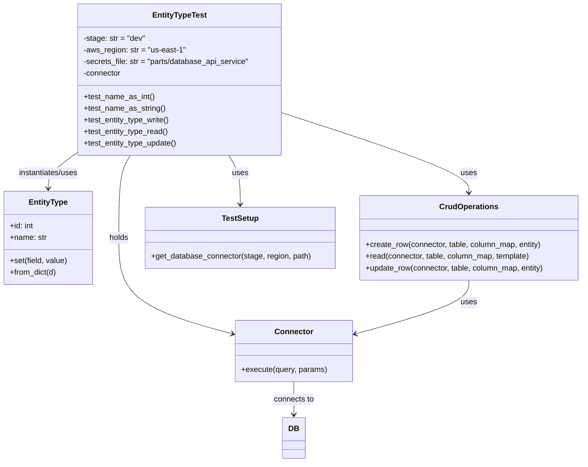
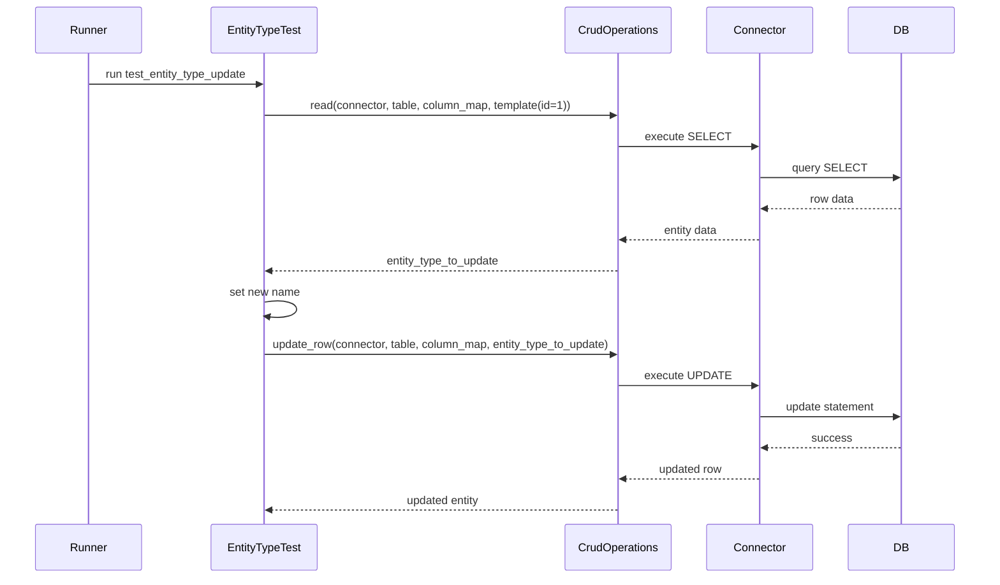

# Diagram: partview_core/partview_service/partview_service/tests/unit/core/datamodel/entity_type_test.py

> Auto-generated by Obscura crawlers

## Diagram 1

### SVG

<svg id="container" width="1203.34375" xmlns="http://www.w3.org/2000/svg" class="classDiagram" height="952" viewBox="0 0 1203.34375 952" role="graphics-document document" aria-roledescription="class"><g><defs><marker id="container_class-aggregationStart" class="marker aggregation class" refX="18" refY="7" markerWidth="190" markerHeight="240" orient="auto"><path d="M 18,7 L9,13 L1,7 L9,1 Z"></path></marker></defs><defs><marker id="container_class-aggregationEnd" class="marker aggregation class" refX="1" refY="7" markerWidth="20" markerHeight="28" orient="auto"><path d="M 18,7 L9,13 L1,7 L9,1 Z"></path></marker></defs><defs><marker id="container_class-extensionStart" class="marker extension class" refX="18" refY="7" markerWidth="190" markerHeight="240" orient="auto"><path d="M 1,7 L18,13 V 1 Z"></path></marker></defs><defs><marker id="container_class-extensionEnd" class="marker extension class" refX="1" refY="7" markerWidth="20" markerHeight="28" orient="auto"><path d="M 1,1 V 13 L18,7 Z"></path></marker></defs><defs><marker id="container_class-compositionStart" class="marker composition class" refX="18" refY="7" markerWidth="190" markerHeight="240" orient="auto"><path d="M 18,7 L9,13 L1,7 L9,1 Z"></path></marker></defs><defs><marker id="container_class-compositionEnd" class="marker composition class" refX="1" refY="7" markerWidth="20" markerHeight="28" orient="auto"><path d="M 18,7 L9,13 L1,7 L9,1 Z"></path></marker></defs><defs><marker id="container_class-dependencyStart" class="marker dependency class" refX="6" refY="7" markerWidth="190" markerHeight="240" orient="auto"><path d="M 5,7 L9,13 L1,7 L9,1 Z"></path></marker></defs><defs><marker id="container_class-dependencyEnd" class="marker dependency class" refX="13" refY="7" markerWidth="20" markerHeight="28" orient="auto"><path d="M 18,7 L9,13 L14,7 L9,1 Z"></path></marker></defs><defs><marker id="container_class-lollipopStart" class="marker lollipop class" refX="13" refY="7" markerWidth="190" markerHeight="240" orient="auto"><circle stroke="black" fill="transparent" cx="7" cy="7" r="6"></circle></marker></defs><defs><marker id="container_class-lollipopEnd" class="marker lollipop class" refX="1" refY="7" markerWidth="190" markerHeight="240" orient="auto"><circle stroke="black" fill="transparent" cx="7" cy="7" r="6"></circle></marker></defs><g class="root"><g class="clusters"></g><g class="edgePaths"><path d="M471.62,320L475.621,326.167C479.622,332.333,487.623,344.667,491.624,361.5C495.625,378.333,495.625,399.667,495.625,410.333L495.625,421" id="id_EntityTypeTest_TestSetup_1" class="edge-thickness-normal edge-pattern-solid relation" style=";;;" data-edge="true" data-et="edge" data-id="id_EntityTypeTest_TestSetup_1" data-points="W3sieCI6NDcxLjYyMDA4MTc2ODEzNDcsInkiOjMyMH0seyJ4Ijo0OTUuNjI1LCJ5IjozNTd9LHsieCI6NDk1LjYyNSwieSI6NDI3fV0=" marker-end="url(#container_class-dependencyEnd)"></path><path d="M158.477,314.708L148.564,321.757C138.652,328.806,118.828,342.903,108.916,355.118C99.004,367.333,99.004,377.667,99.004,382.833L99.004,388" id="id_EntityTypeTest_EntityType_2" class="edge-thickness-normal edge-pattern-solid relation" style=";;;" data-edge="true" data-et="edge" data-id="id_EntityTypeTest_EntityType_2" data-points="W3sieCI6MTU4LjQ3NjU2MjUsInkiOjMxNC43MDgzMzMzMzMzMzMzN30seyJ4Ijo5OS4wMDM5MDYyNSwieSI6MzU3fSx7IngiOjk5LjAwMzkwNjI1LCJ5IjozOTR9XQ==" marker-end="url(#container_class-dependencyEnd)"></path><path d="M582.344,232.435L646.637,253.196C710.931,273.957,839.518,315.478,903.812,342.906C968.105,370.333,968.105,383.667,968.105,390.333L968.105,397" id="id_EntityTypeTest_CrudOperations_3" class="edge-thickness-normal edge-pattern-solid relation" style=";;;" data-edge="true" data-et="edge" data-id="id_EntityTypeTest_CrudOperations_3" data-points="W3sieCI6NTgyLjM0Mzc1LCJ5IjoyMzIuNDM0ODQwODYwMDc0NX0seyJ4Ijo5NjguMTA1NDY4NzUsInkiOjM1N30seyJ4Ijo5NjguMTA1NDY4NzUsInkiOjQwM31d" marker-end="url(#container_class-dependencyEnd)"></path><path d="M269.2,320L265.199,326.167C261.199,332.333,253.197,344.667,249.196,373C245.195,401.333,245.195,445.667,245.195,490C245.195,534.333,245.195,578.667,284.608,611.737C324.021,644.808,402.847,666.616,442.259,677.52L481.672,688.424" id="id_EntityTypeTest_Connector_4" class="edge-thickness-normal edge-pattern-solid relation" style=";;;" data-edge="true" data-et="edge" data-id="id_EntityTypeTest_Connector_4" data-points="W3sieCI6MjY5LjIwMDIzMDczMTg2NTMsInkiOjMyMH0seyJ4IjoyNDUuMTk1MzEyNSwieSI6MzU3fSx7IngiOjI0NS4xOTUzMTI1LCJ5Ijo0OTB9LHsieCI6MjQ1LjE5NTMxMjUsInkiOjYyM30seyJ4Ijo0ODcuNDU1MDc4MTI1LCJ5Ijo2OTAuMDIzNDc4MjM3Mzc2fV0=" marker-end="url(#container_class-dependencyEnd)"></path><path d="M968.105,577L968.105,584.667C968.105,592.333,968.105,607.667,928.693,626.237C889.28,644.808,810.454,666.616,771.041,677.52L731.628,688.424" id="id_CrudOperations_Connector_5" class="edge-thickness-normal edge-pattern-solid relation" style=";;;" data-edge="true" data-et="edge" data-id="id_CrudOperations_Connector_5" data-points="W3sieCI6OTY4LjEwNTQ2ODc1LCJ5Ijo1Nzd9LHsieCI6OTY4LjEwNTQ2ODc1LCJ5Ijo2MjN9LHsieCI6NzI1Ljg0NTcwMzEyNSwieSI6NjkwLjAyMzQ3ODIzNzM3Nn1d" marker-end="url(#container_class-dependencyEnd)"></path><path d="M606.65,786L606.65,792.167C606.65,798.333,606.65,810.667,606.65,822C606.65,833.333,606.65,843.667,606.65,848.833L606.65,854" id="id_Connector_DB_6" class="edge-thickness-normal edge-pattern-solid relation" style=";;;" data-edge="true" data-et="edge" data-id="id_Connector_DB_6" data-points="W3sieCI6NjA2LjY1MDM5MDYyNSwieSI6Nzg2fSx7IngiOjYwNi42NTAzOTA2MjUsInkiOjgyM30seyJ4Ijo2MDYuNjUwMzkwNjI1LCJ5Ijo4NjB9XQ==" marker-end="url(#container_class-dependencyEnd)"></path></g><g class="edgeLabels"><g class="edgeLabel" transform="translate(495.625, 357)"><g class="label" data-id="id_EntityTypeTest_TestSetup_1" transform="translate(-16.4921875, -12)"><foreignObject width="32.984375" height="24">

uses

</foreignObject></g></g><g class="edgeLabel" transform="translate(99.00390625, 357)"><g class="label" data-id="id_EntityTypeTest_EntityType_2" transform="translate(-63.3203125, -12)"><foreignObject width="126.640625" height="24">

instantiates/uses

</foreignObject></g></g><g class="edgeLabel" transform="translate(968.10546875, 357)"><g class="label" data-id="id_EntityTypeTest_CrudOperations_3" transform="translate(-16.4921875, -12)"><foreignObject width="32.984375" height="24">

uses

</foreignObject></g></g><g class="edgeLabel" transform="translate(245.1953125, 490)"><g class="label" data-id="id_EntityTypeTest_Connector_4" transform="translate(-20.1875, -12)"><foreignObject width="40.375" height="24">

holds

</foreignObject></g></g><g class="edgeLabel" transform="translate(968.10546875, 623)"><g class="label" data-id="id_CrudOperations_Connector_5" transform="translate(-16.4921875, -12)"><foreignObject width="32.984375" height="24">

uses

</foreignObject></g></g><g class="edgeLabel" transform="translate(606.650390625, 823)"><g class="label" data-id="id_Connector_DB_6" transform="translate(-42.0859375, -12)"><foreignObject width="84.171875" height="24">

connects to

</foreignObject></g></g></g><g class="nodes"><g class="node default" id="classId-EntityTypeTest-0" transform="translate(370.41015625, 164)"><g class="basic label-container"><path d="M-211.93359375 -156 L211.93359375 -156 L211.93359375 156 L-211.93359375 156" stroke="none" stroke-width="0" fill="#ECECFF" style=""></path><path d="M-211.93359375 -156 C-115.35585777629086 -156, -18.778121802581722 -156, 211.93359375 -156 M-211.93359375 -156 C-100.60977806229035 -156, 10.714037625419309 -156, 211.93359375 -156 M211.93359375 -156 C211.93359375 -80.65251007433149, 211.93359375 -5.305020148662976, 211.93359375 156 M211.93359375 -156 C211.93359375 -85.43306533639775, 211.93359375 -14.866130672795492, 211.93359375 156 M211.93359375 156 C103.06245549753416 156, -5.808682754931681 156, -211.93359375 156 M211.93359375 156 C55.351396848692644 156, -101.23080005261471 156, -211.93359375 156 M-211.93359375 156 C-211.93359375 55.31046098338798, -211.93359375 -45.37907803322403, -211.93359375 -156 M-211.93359375 156 C-211.93359375 63.60401210094243, -211.93359375 -28.791975798115146, -211.93359375 -156" stroke="#9370DB" stroke-width="1.3" fill="none" stroke-dasharray="0 0" style=""></path></g><g class="annotation-group text" transform="translate(0, -132)"></g><g class="label-group text" transform="translate(-53.8671875, -132)"><g class="label" style="font-weight: bolder" transform="translate(0,-12)"><foreignObject width="107.734375" height="24">

EntityTypeTest

</foreignObject></g></g><g class="members-group text" transform="translate(-199.93359375, -84)"><g class="label" style="" transform="translate(0,-12)"><foreignObject width="127.609375" height="24">

-stage: str = "dev"

</foreignObject></g><g class="label" style="" transform="translate(0,12)"><foreignObject width="209.546875" height="24">

-aws_region: str = "us-east-1"

</foreignObject></g><g class="label" style="" transform="translate(0,36)"><foreignObject width="346" height="24">

-secrets_file: str = "parts/database_api_service"

</foreignObject></g><g class="label" style="" transform="translate(0,60)"><foreignObject width="79.296875" height="24">

-connector

</foreignObject></g></g><g class="methods-group text" transform="translate(-199.93359375, 36)"><g class="label" style="" transform="translate(0,-12)"><foreignObject width="145.96875" height="24">

+test_name_as_int()

</foreignObject></g><g class="label" style="" transform="translate(0,12)"><foreignObject width="167.9375" height="24">

+test_name_as_string()

</foreignObject></g><g class="label" style="" transform="translate(0,36)"><foreignObject width="179.140625" height="24">

+test_entity_type_write()

</foreignObject></g><g class="label" style="" transform="translate(0,60)"><foreignObject width="175.578125" height="24">

+test_entity_type_read()

</foreignObject></g><g class="label" style="" transform="translate(0,84)"><foreignObject width="194.078125" height="24">

+test_entity_type_update()

</foreignObject></g></g><g class="divider" style=""><path d="M-211.93359375 -108 C-103.66431944170226 -108, 4.604954866595477 -108, 211.93359375 -108 M-211.93359375 -108 C-82.60513420520078 -108, 46.72332533959843 -108, 211.93359375 -108" stroke="#9370DB" stroke-width="1.3" fill="none" stroke-dasharray="0 0" style=""></path></g><g class="divider" style=""><path d="M-211.93359375 12 C-109.46814938397009 12, -7.002705017940173 12, 211.93359375 12 M-211.93359375 12 C-77.104336119936 12, 57.72492151012801 12, 211.93359375 12" stroke="#9370DB" stroke-width="1.3" fill="none" stroke-dasharray="0 0" style=""></path></g></g><g class="node default" id="classId-EntityType-1" transform="translate(99.00390625, 490)"><g class="basic label-container"><path d="M-91.00390625 -96 L91.00390625 -96 L91.00390625 96 L-91.00390625 96" stroke="none" stroke-width="0" fill="#ECECFF" style=""></path><path d="M-91.00390625 -96 C-32.615091760434744 -96, 25.77372272913051 -96, 91.00390625 -96 M-91.00390625 -96 C-25.27819564733916 -96, 40.44751495532168 -96, 91.00390625 -96 M91.00390625 -96 C91.00390625 -28.951095044579716, 91.00390625 38.09780991084057, 91.00390625 96 M91.00390625 -96 C91.00390625 -26.969020442519508, 91.00390625 42.061959114960985, 91.00390625 96 M91.00390625 96 C47.84838833367898 96, 4.692870417357966 96, -91.00390625 96 M91.00390625 96 C22.344199683815418 96, -46.315506882369164 96, -91.00390625 96 M-91.00390625 96 C-91.00390625 31.14630371979726, -91.00390625 -33.70739256040548, -91.00390625 -96 M-91.00390625 96 C-91.00390625 57.55591951109284, -91.00390625 19.111839022185677, -91.00390625 -96" stroke="#9370DB" stroke-width="1.3" fill="none" stroke-dasharray="0 0" style=""></path></g><g class="annotation-group text" transform="translate(0, -72)"></g><g class="label-group text" transform="translate(-38.6171875, -72)"><g class="label" style="font-weight: bolder" transform="translate(0,-12)"><foreignObject width="77.234375" height="24">

EntityType

</foreignObject></g></g><g class="members-group text" transform="translate(-79.00390625, -24)"><g class="label" style="" transform="translate(0,-12)"><foreignObject width="49.8125" height="24">

+id: int

</foreignObject></g><g class="label" style="" transform="translate(0,12)"><foreignObject width="76.015625" height="24">

+name: str

</foreignObject></g></g><g class="methods-group text" transform="translate(-79.00390625, 48)"><g class="label" style="" transform="translate(0,-12)"><foreignObject width="119.390625" height="24">

+set(field, value)

</foreignObject></g><g class="label" style="" transform="translate(0,12)"><foreignObject width="97.296875" height="24">

+from_dict(d)

</foreignObject></g></g><g class="divider" style=""><path d="M-91.00390625 -48 C-42.058848510230824 -48, 6.886209229538352 -48, 91.00390625 -48 M-91.00390625 -48 C-25.122262301981507 -48, 40.759381646036985 -48, 91.00390625 -48" stroke="#9370DB" stroke-width="1.3" fill="none" stroke-dasharray="0 0" style=""></path></g><g class="divider" style=""><path d="M-91.00390625 24 C-52.21740215761883 24, -13.430898065237656 24, 91.00390625 24 M-91.00390625 24 C-38.26975176483877 24, 14.464402720322454 24, 91.00390625 24" stroke="#9370DB" stroke-width="1.3" fill="none" stroke-dasharray="0 0" style=""></path></g></g><g class="node default" id="classId-CrudOperations-2" transform="translate(968.10546875, 490)"><g class="basic label-container"><path d="M-227.23828125 -87 L227.23828125 -87 L227.23828125 87 L-227.23828125 87" stroke="none" stroke-width="0" fill="#ECECFF" style=""></path><path d="M-227.23828125 -87 C-126.50301766832469 -87, -25.767754086649376 -87, 227.23828125 -87 M-227.23828125 -87 C-130.72600773538568 -87, -34.213734220771386 -87, 227.23828125 -87 M227.23828125 -87 C227.23828125 -45.086105265571696, 227.23828125 -3.172210531143392, 227.23828125 87 M227.23828125 -87 C227.23828125 -27.842069073044698, 227.23828125 31.315861853910604, 227.23828125 87 M227.23828125 87 C66.02442255449995 87, -95.1894361410001 87, -227.23828125 87 M227.23828125 87 C45.967590807974005 87, -135.303099634052 87, -227.23828125 87 M-227.23828125 87 C-227.23828125 35.10015242414318, -227.23828125 -16.799695151713635, -227.23828125 -87 M-227.23828125 87 C-227.23828125 21.896342288477967, -227.23828125 -43.207315423044065, -227.23828125 -87" stroke="#9370DB" stroke-width="1.3" fill="none" stroke-dasharray="0 0" style=""></path></g><g class="annotation-group text" transform="translate(0, -63)"></g><g class="label-group text" transform="translate(-57.6171875, -63)"><g class="label" style="font-weight: bolder" transform="translate(0,-12)"><foreignObject width="115.234375" height="24">

CrudOperations

</foreignObject></g></g><g class="members-group text" transform="translate(-215.23828125, -15)"></g><g class="methods-group text" transform="translate(-215.23828125, 15)"><g class="label" style="" transform="translate(0,-12)"><foreignObject width="366.375" height="24">

+create_row(connector, table, column_map, entity)

</foreignObject></g><g class="label" style="" transform="translate(0,12)"><foreignObject width="342.609375" height="24">

+read(connector, table, column_map, template)

</foreignObject></g><g class="label" style="" transform="translate(0,36)"><foreignObject width="372.859375" height="24">

+update_row(connector, table, column_map, entity)

</foreignObject></g></g><g class="divider" style=""><path d="M-227.23828125 -39 C-83.09732706545427 -39, 61.04362711909147 -39, 227.23828125 -39 M-227.23828125 -39 C-53.14590671249968 -39, 120.94646782500064 -39, 227.23828125 -39" stroke="#9370DB" stroke-width="1.3" fill="none" stroke-dasharray="0 0" style=""></path></g><g class="divider" style=""><path d="M-227.23828125 -15 C-127.35805881114594 -15, -27.477836372291875 -15, 227.23828125 -15 M-227.23828125 -15 C-122.94993357307916 -15, -18.66158589615833 -15, 227.23828125 -15" stroke="#9370DB" stroke-width="1.3" fill="none" stroke-dasharray="0 0" style=""></path></g></g><g class="node default" id="classId-TestSetup-3" transform="translate(495.625, 490)"><g class="basic label-container"><path d="M-195.2421875 -63 L195.2421875 -63 L195.2421875 63 L-195.2421875 63" stroke="none" stroke-width="0" fill="#ECECFF" style=""></path><path d="M-195.2421875 -63 C-58.8761960289151 -63, 77.4897954421698 -63, 195.2421875 -63 M-195.2421875 -63 C-82.402800364238 -63, 30.43658677152399 -63, 195.2421875 -63 M195.2421875 -63 C195.2421875 -29.22895629063568, 195.2421875 4.5420874187286415, 195.2421875 63 M195.2421875 -63 C195.2421875 -20.11282462022107, 195.2421875 22.774350759557862, 195.2421875 63 M195.2421875 63 C96.1323142270791 63, -2.9775590458417867 63, -195.2421875 63 M195.2421875 63 C48.41521888065239 63, -98.41174973869522 63, -195.2421875 63 M-195.2421875 63 C-195.2421875 29.803228794971012, -195.2421875 -3.393542410057975, -195.2421875 -63 M-195.2421875 63 C-195.2421875 22.556639927690163, -195.2421875 -17.886720144619673, -195.2421875 -63" stroke="#9370DB" stroke-width="1.3" fill="none" stroke-dasharray="0 0" style=""></path></g><g class="annotation-group text" transform="translate(0, -39)"></g><g class="label-group text" transform="translate(-36.6875, -39)"><g class="label" style="font-weight: bolder" transform="translate(0,-12)"><foreignObject width="73.375" height="24">

TestSetup

</foreignObject></g></g><g class="members-group text" transform="translate(-183.2421875, 9)"></g><g class="methods-group text" transform="translate(-183.2421875, 39)"><g class="label" style="" transform="translate(0,-12)"><foreignObject width="329.796875" height="24">

+get_database_connector(stage, region, path)

</foreignObject></g></g><g class="divider" style=""><path d="M-195.2421875 -15 C-103.56906453656022 -15, -11.895941573120439 -15, 195.2421875 -15 M-195.2421875 -15 C-51.138273815537815 -15, 92.96563986892437 -15, 195.2421875 -15" stroke="#9370DB" stroke-width="1.3" fill="none" stroke-dasharray="0 0" style=""></path></g><g class="divider" style=""><path d="M-195.2421875 9 C-115.33328731219683 9, -35.42438712439366 9, 195.2421875 9 M-195.2421875 9 C-116.22617818538346 9, -37.21016887076692 9, 195.2421875 9" stroke="#9370DB" stroke-width="1.3" fill="none" stroke-dasharray="0 0" style=""></path></g></g><g class="node default" id="classId-Connector-4" transform="translate(606.650390625, 723)"><g class="basic label-container"><path d="M-119.1953125 -63 L119.1953125 -63 L119.1953125 63 L-119.1953125 63" stroke="none" stroke-width="0" fill="#ECECFF" style=""></path><path d="M-119.1953125 -63 C-39.11176768611821 -63, 40.97177712776357 -63, 119.1953125 -63 M-119.1953125 -63 C-63.51734040022346 -63, -7.839368300446921 -63, 119.1953125 -63 M119.1953125 -63 C119.1953125 -29.505968208141034, 119.1953125 3.9880635837179312, 119.1953125 63 M119.1953125 -63 C119.1953125 -17.609977681526075, 119.1953125 27.78004463694785, 119.1953125 63 M119.1953125 63 C24.89062272244452 63, -69.41406705511096 63, -119.1953125 63 M119.1953125 63 C59.943029334908026 63, 0.6907461698160517 63, -119.1953125 63 M-119.1953125 63 C-119.1953125 20.403128518724962, -119.1953125 -22.193742962550076, -119.1953125 -63 M-119.1953125 63 C-119.1953125 24.918652130669592, -119.1953125 -13.162695738660815, -119.1953125 -63" stroke="#9370DB" stroke-width="1.3" fill="none" stroke-dasharray="0 0" style=""></path></g><g class="annotation-group text" transform="translate(0, -39)"></g><g class="label-group text" transform="translate(-37.421875, -39)"><g class="label" style="font-weight: bolder" transform="translate(0,-12)"><foreignObject width="74.84375" height="24">

Connector

</foreignObject></g></g><g class="members-group text" transform="translate(-107.1953125, 9)"></g><g class="methods-group text" transform="translate(-107.1953125, 39)"><g class="label" style="" transform="translate(0,-12)"><foreignObject width="176.96875" height="24">

+execute(query, params)

</foreignObject></g></g><g class="divider" style=""><path d="M-119.1953125 -15 C-38.66406950526047 -15, 41.86717348947906 -15, 119.1953125 -15 M-119.1953125 -15 C-64.35750785941231 -15, -9.519703218824617 -15, 119.1953125 -15" stroke="#9370DB" stroke-width="1.3" fill="none" stroke-dasharray="0 0" style=""></path></g><g class="divider" style=""><path d="M-119.1953125 9 C-62.46051373052873 9, -5.725714961057463 9, 119.1953125 9 M-119.1953125 9 C-31.56848389403781 9, 56.05834471192438 9, 119.1953125 9" stroke="#9370DB" stroke-width="1.3" fill="none" stroke-dasharray="0 0" style=""></path></g></g><g class="node default" id="classId-DB-5" transform="translate(606.650390625, 902)"><g class="basic label-container"><path d="M-22.1484375 -42 L22.1484375 -42 L22.1484375 42 L-22.1484375 42" stroke="none" stroke-width="0" fill="#ECECFF" style=""></path><path d="M-22.1484375 -42 C-7.305592248663903 -42, 7.537253002672195 -42, 22.1484375 -42 M-22.1484375 -42 C-7.5919451381445455 -42, 6.964547223710909 -42, 22.1484375 -42 M22.1484375 -42 C22.1484375 -13.560350602949661, 22.1484375 14.879298794100677, 22.1484375 42 M22.1484375 -42 C22.1484375 -20.713685615230762, 22.1484375 0.5726287695384755, 22.1484375 42 M22.1484375 42 C9.813030245703626 42, -2.5223770085927484 42, -22.1484375 42 M22.1484375 42 C6.131202806060962 42, -9.886031887878076 42, -22.1484375 42 M-22.1484375 42 C-22.1484375 20.31640528243911, -22.1484375 -1.3671894351217801, -22.1484375 -42 M-22.1484375 42 C-22.1484375 15.97809906011421, -22.1484375 -10.043801879771578, -22.1484375 -42" stroke="#9370DB" stroke-width="1.3" fill="none" stroke-dasharray="0 0" style=""></path></g><g class="annotation-group text" transform="translate(0, -18)"></g><g class="label-group text" transform="translate(-10.1484375, -18)"><g class="label" style="font-weight: bolder" transform="translate(0,-12)"><foreignObject width="20.296875" height="24">

DB

</foreignObject></g></g><g class="members-group text" transform="translate(-10.1484375, 30)"></g><g class="methods-group text" transform="translate(-10.1484375, 60)"></g><g class="divider" style=""><path d="M-22.1484375 6 C-6.030856256337604 6, 10.086724987324793 6, 22.1484375 6 M-22.1484375 6 C-12.947124190508747 6, -3.745810881017494 6, 22.1484375 6" stroke="#9370DB" stroke-width="1.3" fill="none" stroke-dasharray="0 0" style=""></path></g><g class="divider" style=""><path d="M-22.1484375 24 C-12.947390602121944 24, -3.7463437042438876 24, 22.1484375 24 M-22.1484375 24 C-11.245722354304915 24, -0.3430072086098299 24, 22.1484375 24" stroke="#9370DB" stroke-width="1.3" fill="none" stroke-dasharray="0 0" style=""></path></g></g></g></g></g></svg>

## Diagram 2

### SVG

<svg id="container" width="1481" xmlns="http://www.w3.org/2000/svg" height="873" viewBox="-50 -10 1481 873" role="graphics-document document" aria-roledescription="sequence"><g><rect x="1231" y="787" fill="#eaeaea" stroke="#666" width="150" height="65" name="DB" rx="3" ry="3" class="actor actor-bottom"></rect><text x="1306" y="819.5" dominant-baseline="central" alignment-baseline="central" class="actor actor-box" style="text-anchor: middle; font-size: 16px; font-weight: 400;"><tspan x="1306" dy="0">DB</tspan></text></g><g><rect x="1031" y="787" fill="#eaeaea" stroke="#666" width="150" height="65" name="Connector" rx="3" ry="3" class="actor actor-bottom"></rect><text x="1106" y="819.5" dominant-baseline="central" alignment-baseline="central" class="actor actor-box" style="text-anchor: middle; font-size: 16px; font-weight: 400;"><tspan x="1106" dy="0">Connector</tspan></text></g><g><rect x="831" y="787" fill="#eaeaea" stroke="#666" width="150" height="65" name="CrudOperations" rx="3" ry="3" class="actor actor-bottom"></rect><text x="906" y="819.5" dominant-baseline="central" alignment-baseline="central" class="actor actor-box" style="text-anchor: middle; font-size: 16px; font-weight: 400;"><tspan x="906" dy="0">CrudOperations</tspan></text></g><g><rect x="275" y="787" fill="#eaeaea" stroke="#666" width="150" height="65" name="EntityTypeTest" rx="3" ry="3" class="actor actor-bottom"></rect><text x="350" y="819.5" dominant-baseline="central" alignment-baseline="central" class="actor actor-box" style="text-anchor: middle; font-size: 16px; font-weight: 400;"><tspan x="350" dy="0">EntityTypeTest</tspan></text></g><g><rect x="0" y="787" fill="#eaeaea" stroke="#666" width="150" height="65" name="Runner" rx="3" ry="3" class="actor actor-bottom"></rect><text x="75" y="819.5" dominant-baseline="central" alignment-baseline="central" class="actor actor-box" style="text-anchor: middle; font-size: 16px; font-weight: 400;"><tspan x="75" dy="0">Runner</tspan></text></g><g><line id="actor4" x1="1306" y1="65" x2="1306" y2="787" class="actor-line 200" stroke-width="0.5px" stroke="#999" name="DB"></line><g id="root-4"><rect x="1231" y="0" fill="#eaeaea" stroke="#666" width="150" height="65" name="DB" rx="3" ry="3" class="actor actor-top"></rect><text x="1306" y="32.5" dominant-baseline="central" alignment-baseline="central" class="actor actor-box" style="text-anchor: middle; font-size: 16px; font-weight: 400;"><tspan x="1306" dy="0">DB</tspan></text></g></g><g><line id="actor3" x1="1106" y1="65" x2="1106" y2="787" class="actor-line 200" stroke-width="0.5px" stroke="#999" name="Connector"></line><g id="root-3"><rect x="1031" y="0" fill="#eaeaea" stroke="#666" width="150" height="65" name="Connector" rx="3" ry="3" class="actor actor-top"></rect><text x="1106" y="32.5" dominant-baseline="central" alignment-baseline="central" class="actor actor-box" style="text-anchor: middle; font-size: 16px; font-weight: 400;"><tspan x="1106" dy="0">Connector</tspan></text></g></g><g><line id="actor2" x1="906" y1="65" x2="906" y2="787" class="actor-line 200" stroke-width="0.5px" stroke="#999" name="CrudOperations"></line><g id="root-2"><rect x="831" y="0" fill="#eaeaea" stroke="#666" width="150" height="65" name="CrudOperations" rx="3" ry="3" class="actor actor-top"></rect><text x="906" y="32.5" dominant-baseline="central" alignment-baseline="central" class="actor actor-box" style="text-anchor: middle; font-size: 16px; font-weight: 400;"><tspan x="906" dy="0">CrudOperations</tspan></text></g></g><g><line id="actor1" x1="350" y1="65" x2="350" y2="787" class="actor-line 200" stroke-width="0.5px" stroke="#999" name="EntityTypeTest"></line><g id="root-1"><rect x="275" y="0" fill="#eaeaea" stroke="#666" width="150" height="65" name="EntityTypeTest" rx="3" ry="3" class="actor actor-top"></rect><text x="350" y="32.5" dominant-baseline="central" alignment-baseline="central" class="actor actor-box" style="text-anchor: middle; font-size: 16px; font-weight: 400;"><tspan x="350" dy="0">EntityTypeTest</tspan></text></g></g><g><line id="actor0" x1="75" y1="65" x2="75" y2="787" class="actor-line 200" stroke-width="0.5px" stroke="#999" name="Runner"></line><g id="root-0"><rect x="0" y="0" fill="#eaeaea" stroke="#666" width="150" height="65" name="Runner" rx="3" ry="3" class="actor actor-top"></rect><text x="75" y="32.5" dominant-baseline="central" alignment-baseline="central" class="actor actor-box" style="text-anchor: middle; font-size: 16px; font-weight: 400;"><tspan x="75" dy="0">Runner</tspan></text></g></g><g></g><defs><symbol id="computer" width="24" height="24"><path transform="scale(.5)" d="M2 2v13h20v-13h-20zm18 11h-16v-9h16v9zm-10.228 6l.466-1h3.524l.467 1h-4.457zm14.228 3h-24l2-6h2.104l-1.33 4h18.45l-1.297-4h2.073l2 6zm-5-10h-14v-7h14v7z"></path></symbol></defs><defs><symbol id="database" fill-rule="evenodd" clip-rule="evenodd"><path transform="scale(.5)" d="M12.258.001l.256.004.255.005.253.008.251.01.249.012.247.015.246.016.242.019.241.02.239.023.236.024.233.027.231.028.229.031.225.032.223.034.22.036.217.038.214.04.211.041.208.043.205.045.201.046.198.048.194.05.191.051.187.053.183.054.18.056.175.057.172.059.168.06.163.061.16.063.155.064.15.066.074.033.073.033.071.034.07.034.069.035.068.035.067.035.066.035.064.036.064.036.062.036.06.036.06.037.058.037.058.037.055.038.055.038.053.038.052.038.051.039.05.039.048.039.047.039.045.04.044.04.043.04.041.04.04.041.039.041.037.041.036.041.034.041.033.042.032.042.03.042.029.042.027.042.026.043.024.043.023.043.021.043.02.043.018.044.017.043.015.044.013.044.012.044.011.045.009.044.007.045.006.045.004.045.002.045.001.045v17l-.001.045-.002.045-.004.045-.006.045-.007.045-.009.044-.011.045-.012.044-.013.044-.015.044-.017.043-.018.044-.02.043-.021.043-.023.043-.024.043-.026.043-.027.042-.029.042-.03.042-.032.042-.033.042-.034.041-.036.041-.037.041-.039.041-.04.041-.041.04-.043.04-.044.04-.045.04-.047.039-.048.039-.05.039-.051.039-.052.038-.053.038-.055.038-.055.038-.058.037-.058.037-.06.037-.06.036-.062.036-.064.036-.064.036-.066.035-.067.035-.068.035-.069.035-.07.034-.071.034-.073.033-.074.033-.15.066-.155.064-.16.063-.163.061-.168.06-.172.059-.175.057-.18.056-.183.054-.187.053-.191.051-.194.05-.198.048-.201.046-.205.045-.208.043-.211.041-.214.04-.217.038-.22.036-.223.034-.225.032-.229.031-.231.028-.233.027-.236.024-.239.023-.241.02-.242.019-.246.016-.247.015-.249.012-.251.01-.253.008-.255.005-.256.004-.258.001-.258-.001-.256-.004-.255-.005-.253-.008-.251-.01-.249-.012-.247-.015-.245-.016-.243-.019-.241-.02-.238-.023-.236-.024-.234-.027-.231-.028-.228-.031-.226-.032-.223-.034-.22-.036-.217-.038-.214-.04-.211-.041-.208-.043-.204-.045-.201-.046-.198-.048-.195-.05-.19-.051-.187-.053-.184-.054-.179-.056-.176-.057-.172-.059-.167-.06-.164-.061-.159-.063-.155-.064-.151-.066-.074-.033-.072-.033-.072-.034-.07-.034-.069-.035-.068-.035-.067-.035-.066-.035-.064-.036-.063-.036-.062-.036-.061-.036-.06-.037-.058-.037-.057-.037-.056-.038-.055-.038-.053-.038-.052-.038-.051-.039-.049-.039-.049-.039-.046-.039-.046-.04-.044-.04-.043-.04-.041-.04-.04-.041-.039-.041-.037-.041-.036-.041-.034-.041-.033-.042-.032-.042-.03-.042-.029-.042-.027-.042-.026-.043-.024-.043-.023-.043-.021-.043-.02-.043-.018-.044-.017-.043-.015-.044-.013-.044-.012-.044-.011-.045-.009-.044-.007-.045-.006-.045-.004-.045-.002-.045-.001-.045v-17l.001-.045.002-.045.004-.045.006-.045.007-.045.009-.044.011-.045.012-.044.013-.044.015-.044.017-.043.018-.044.02-.043.021-.043.023-.043.024-.043.026-.043.027-.042.029-.042.03-.042.032-.042.033-.042.034-.041.036-.041.037-.041.039-.041.04-.041.041-.04.043-.04.044-.04.046-.04.046-.039.049-.039.049-.039.051-.039.052-.038.053-.038.055-.038.056-.038.057-.037.058-.037.06-.037.061-.036.062-.036.063-.036.064-.036.066-.035.067-.035.068-.035.069-.035.07-.034.072-.034.072-.033.074-.033.151-.066.155-.064.159-.063.164-.061.167-.06.172-.059.176-.057.179-.056.184-.054.187-.053.19-.051.195-.05.198-.048.201-.046.204-.045.208-.043.211-.041.214-.04.217-.038.22-.036.223-.034.226-.032.228-.031.231-.028.234-.027.236-.024.238-.023.241-.02.243-.019.245-.016.247-.015.249-.012.251-.01.253-.008.255-.005.256-.004.258-.001.258.001zm-9.258 20.499v.01l.001.021.003.021.004.022.005.021.006.022.007.022.009.023.01.022.011.023.012.023.013.023.015.023.016.024.017.023.018.024.019.024.021.024.022.025.023.024.024.025.052.049.056.05.061.051.066.051.07.051.075.051.079.052.084.052.088.052.092.052.097.052.102.051.105.052.11.052.114.051.119.051.123.051.127.05.131.05.135.05.139.048.144.049.147.047.152.047.155.047.16.045.163.045.167.043.171.043.176.041.178.041.183.039.187.039.19.037.194.035.197.035.202.033.204.031.209.03.212.029.216.027.219.025.222.024.226.021.23.02.233.018.236.016.24.015.243.012.246.01.249.008.253.005.256.004.259.001.26-.001.257-.004.254-.005.25-.008.247-.011.244-.012.241-.014.237-.016.233-.018.231-.021.226-.021.224-.024.22-.026.216-.027.212-.028.21-.031.205-.031.202-.034.198-.034.194-.036.191-.037.187-.039.183-.04.179-.04.175-.042.172-.043.168-.044.163-.045.16-.046.155-.046.152-.047.148-.048.143-.049.139-.049.136-.05.131-.05.126-.05.123-.051.118-.052.114-.051.11-.052.106-.052.101-.052.096-.052.092-.052.088-.053.083-.051.079-.052.074-.052.07-.051.065-.051.06-.051.056-.05.051-.05.023-.024.023-.025.021-.024.02-.024.019-.024.018-.024.017-.024.015-.023.014-.024.013-.023.012-.023.01-.023.01-.022.008-.022.006-.022.006-.022.004-.022.004-.021.001-.021.001-.021v-4.127l-.077.055-.08.053-.083.054-.085.053-.087.052-.09.052-.093.051-.095.05-.097.05-.1.049-.102.049-.105.048-.106.047-.109.047-.111.046-.114.045-.115.045-.118.044-.12.043-.122.042-.124.042-.126.041-.128.04-.13.04-.132.038-.134.038-.135.037-.138.037-.139.035-.142.035-.143.034-.144.033-.147.032-.148.031-.15.03-.151.03-.153.029-.154.027-.156.027-.158.026-.159.025-.161.024-.162.023-.163.022-.165.021-.166.02-.167.019-.169.018-.169.017-.171.016-.173.015-.173.014-.175.013-.175.012-.177.011-.178.01-.179.008-.179.008-.181.006-.182.005-.182.004-.184.003-.184.002h-.37l-.184-.002-.184-.003-.182-.004-.182-.005-.181-.006-.179-.008-.179-.008-.178-.01-.176-.011-.176-.012-.175-.013-.173-.014-.172-.015-.171-.016-.17-.017-.169-.018-.167-.019-.166-.02-.165-.021-.163-.022-.162-.023-.161-.024-.159-.025-.157-.026-.156-.027-.155-.027-.153-.029-.151-.03-.15-.03-.148-.031-.146-.032-.145-.033-.143-.034-.141-.035-.14-.035-.137-.037-.136-.037-.134-.038-.132-.038-.13-.04-.128-.04-.126-.041-.124-.042-.122-.042-.12-.044-.117-.043-.116-.045-.113-.045-.112-.046-.109-.047-.106-.047-.105-.048-.102-.049-.1-.049-.097-.05-.095-.05-.093-.052-.09-.051-.087-.052-.085-.053-.083-.054-.08-.054-.077-.054v4.127zm0-5.654v.011l.001.021.003.021.004.021.005.022.006.022.007.022.009.022.01.022.011.023.012.023.013.023.015.024.016.023.017.024.018.024.019.024.021.024.022.024.023.025.024.024.052.05.056.05.061.05.066.051.07.051.075.052.079.051.084.052.088.052.092.052.097.052.102.052.105.052.11.051.114.051.119.052.123.05.127.051.131.05.135.049.139.049.144.048.147.048.152.047.155.046.16.045.163.045.167.044.171.042.176.042.178.04.183.04.187.038.19.037.194.036.197.034.202.033.204.032.209.03.212.028.216.027.219.025.222.024.226.022.23.02.233.018.236.016.24.014.243.012.246.01.249.008.253.006.256.003.259.001.26-.001.257-.003.254-.006.25-.008.247-.01.244-.012.241-.015.237-.016.233-.018.231-.02.226-.022.224-.024.22-.025.216-.027.212-.029.21-.03.205-.032.202-.033.198-.035.194-.036.191-.037.187-.039.183-.039.179-.041.175-.042.172-.043.168-.044.163-.045.16-.045.155-.047.152-.047.148-.048.143-.048.139-.05.136-.049.131-.05.126-.051.123-.051.118-.051.114-.052.11-.052.106-.052.101-.052.096-.052.092-.052.088-.052.083-.052.079-.052.074-.051.07-.052.065-.051.06-.05.056-.051.051-.049.023-.025.023-.024.021-.025.02-.024.019-.024.018-.024.017-.024.015-.023.014-.023.013-.024.012-.022.01-.023.01-.023.008-.022.006-.022.006-.022.004-.021.004-.022.001-.021.001-.021v-4.139l-.077.054-.08.054-.083.054-.085.052-.087.053-.09.051-.093.051-.095.051-.097.05-.1.049-.102.049-.105.048-.106.047-.109.047-.111.046-.114.045-.115.044-.118.044-.12.044-.122.042-.124.042-.126.041-.128.04-.13.039-.132.039-.134.038-.135.037-.138.036-.139.036-.142.035-.143.033-.144.033-.147.033-.148.031-.15.03-.151.03-.153.028-.154.028-.156.027-.158.026-.159.025-.161.024-.162.023-.163.022-.165.021-.166.02-.167.019-.169.018-.169.017-.171.016-.173.015-.173.014-.175.013-.175.012-.177.011-.178.009-.179.009-.179.007-.181.007-.182.005-.182.004-.184.003-.184.002h-.37l-.184-.002-.184-.003-.182-.004-.182-.005-.181-.007-.179-.007-.179-.009-.178-.009-.176-.011-.176-.012-.175-.013-.173-.014-.172-.015-.171-.016-.17-.017-.169-.018-.167-.019-.166-.02-.165-.021-.163-.022-.162-.023-.161-.024-.159-.025-.157-.026-.156-.027-.155-.028-.153-.028-.151-.03-.15-.03-.148-.031-.146-.033-.145-.033-.143-.033-.141-.035-.14-.036-.137-.036-.136-.037-.134-.038-.132-.039-.13-.039-.128-.04-.126-.041-.124-.042-.122-.043-.12-.043-.117-.044-.116-.044-.113-.046-.112-.046-.109-.046-.106-.047-.105-.048-.102-.049-.1-.049-.097-.05-.095-.051-.093-.051-.09-.051-.087-.053-.085-.052-.083-.054-.08-.054-.077-.054v4.139zm0-5.666v.011l.001.02.003.022.004.021.005.022.006.021.007.022.009.023.01.022.011.023.012.023.013.023.015.023.016.024.017.024.018.023.019.024.021.025.022.024.023.024.024.025.052.05.056.05.061.05.066.051.07.051.075.052.079.051.084.052.088.052.092.052.097.052.102.052.105.051.11.052.114.051.119.051.123.051.127.05.131.05.135.05.139.049.144.048.147.048.152.047.155.046.16.045.163.045.167.043.171.043.176.042.178.04.183.04.187.038.19.037.194.036.197.034.202.033.204.032.209.03.212.028.216.027.219.025.222.024.226.021.23.02.233.018.236.017.24.014.243.012.246.01.249.008.253.006.256.003.259.001.26-.001.257-.003.254-.006.25-.008.247-.01.244-.013.241-.014.237-.016.233-.018.231-.02.226-.022.224-.024.22-.025.216-.027.212-.029.21-.03.205-.032.202-.033.198-.035.194-.036.191-.037.187-.039.183-.039.179-.041.175-.042.172-.043.168-.044.163-.045.16-.045.155-.047.152-.047.148-.048.143-.049.139-.049.136-.049.131-.051.126-.05.123-.051.118-.052.114-.051.11-.052.106-.052.101-.052.096-.052.092-.052.088-.052.083-.052.079-.052.074-.052.07-.051.065-.051.06-.051.056-.05.051-.049.023-.025.023-.025.021-.024.02-.024.019-.024.018-.024.017-.024.015-.023.014-.024.013-.023.012-.023.01-.022.01-.023.008-.022.006-.022.006-.022.004-.022.004-.021.001-.021.001-.021v-4.153l-.077.054-.08.054-.083.053-.085.053-.087.053-.09.051-.093.051-.095.051-.097.05-.1.049-.102.048-.105.048-.106.048-.109.046-.111.046-.114.046-.115.044-.118.044-.12.043-.122.043-.124.042-.126.041-.128.04-.13.039-.132.039-.134.038-.135.037-.138.036-.139.036-.142.034-.143.034-.144.033-.147.032-.148.032-.15.03-.151.03-.153.028-.154.028-.156.027-.158.026-.159.024-.161.024-.162.023-.163.023-.165.021-.166.02-.167.019-.169.018-.169.017-.171.016-.173.015-.173.014-.175.013-.175.012-.177.01-.178.01-.179.009-.179.007-.181.006-.182.006-.182.004-.184.003-.184.001-.185.001-.185-.001-.184-.001-.184-.003-.182-.004-.182-.006-.181-.006-.179-.007-.179-.009-.178-.01-.176-.01-.176-.012-.175-.013-.173-.014-.172-.015-.171-.016-.17-.017-.169-.018-.167-.019-.166-.02-.165-.021-.163-.023-.162-.023-.161-.024-.159-.024-.157-.026-.156-.027-.155-.028-.153-.028-.151-.03-.15-.03-.148-.032-.146-.032-.145-.033-.143-.034-.141-.034-.14-.036-.137-.036-.136-.037-.134-.038-.132-.039-.13-.039-.128-.041-.126-.041-.124-.041-.122-.043-.12-.043-.117-.044-.116-.044-.113-.046-.112-.046-.109-.046-.106-.048-.105-.048-.102-.048-.1-.05-.097-.049-.095-.051-.093-.051-.09-.052-.087-.052-.085-.053-.083-.053-.08-.054-.077-.054v4.153zm8.74-8.179l-.257.004-.254.005-.25.008-.247.011-.244.012-.241.014-.237.016-.233.018-.231.021-.226.022-.224.023-.22.026-.216.027-.212.028-.21.031-.205.032-.202.033-.198.034-.194.036-.191.038-.187.038-.183.04-.179.041-.175.042-.172.043-.168.043-.163.045-.16.046-.155.046-.152.048-.148.048-.143.048-.139.049-.136.05-.131.05-.126.051-.123.051-.118.051-.114.052-.11.052-.106.052-.101.052-.096.052-.092.052-.088.052-.083.052-.079.052-.074.051-.07.052-.065.051-.06.05-.056.05-.051.05-.023.025-.023.024-.021.024-.02.025-.019.024-.018.024-.017.023-.015.024-.014.023-.013.023-.012.023-.01.023-.01.022-.008.022-.006.023-.006.021-.004.022-.004.021-.001.021-.001.021.001.021.001.021.004.021.004.022.006.021.006.023.008.022.01.022.01.023.012.023.013.023.014.023.015.024.017.023.018.024.019.024.02.025.021.024.023.024.023.025.051.05.056.05.06.05.065.051.07.052.074.051.079.052.083.052.088.052.092.052.096.052.101.052.106.052.11.052.114.052.118.051.123.051.126.051.131.05.136.05.139.049.143.048.148.048.152.048.155.046.16.046.163.045.168.043.172.043.175.042.179.041.183.04.187.038.191.038.194.036.198.034.202.033.205.032.21.031.212.028.216.027.22.026.224.023.226.022.231.021.233.018.237.016.241.014.244.012.247.011.25.008.254.005.257.004.26.001.26-.001.257-.004.254-.005.25-.008.247-.011.244-.012.241-.014.237-.016.233-.018.231-.021.226-.022.224-.023.22-.026.216-.027.212-.028.21-.031.205-.032.202-.033.198-.034.194-.036.191-.038.187-.038.183-.04.179-.041.175-.042.172-.043.168-.043.163-.045.16-.046.155-.046.152-.048.148-.048.143-.048.139-.049.136-.05.131-.05.126-.051.123-.051.118-.051.114-.052.11-.052.106-.052.101-.052.096-.052.092-.052.088-.052.083-.052.079-.052.074-.051.07-.052.065-.051.06-.05.056-.05.051-.05.023-.025.023-.024.021-.024.02-.025.019-.024.018-.024.017-.023.015-.024.014-.023.013-.023.012-.023.01-.023.01-.022.008-.022.006-.023.006-.021.004-.022.004-.021.001-.021.001-.021-.001-.021-.001-.021-.004-.021-.004-.022-.006-.021-.006-.023-.008-.022-.01-.022-.01-.023-.012-.023-.013-.023-.014-.023-.015-.024-.017-.023-.018-.024-.019-.024-.02-.025-.021-.024-.023-.024-.023-.025-.051-.05-.056-.05-.06-.05-.065-.051-.07-.052-.074-.051-.079-.052-.083-.052-.088-.052-.092-.052-.096-.052-.101-.052-.106-.052-.11-.052-.114-.052-.118-.051-.123-.051-.126-.051-.131-.05-.136-.05-.139-.049-.143-.048-.148-.048-.152-.048-.155-.046-.16-.046-.163-.045-.168-.043-.172-.043-.175-.042-.179-.041-.183-.04-.187-.038-.191-.038-.194-.036-.198-.034-.202-.033-.205-.032-.21-.031-.212-.028-.216-.027-.22-.026-.224-.023-.226-.022-.231-.021-.233-.018-.237-.016-.241-.014-.244-.012-.247-.011-.25-.008-.254-.005-.257-.004-.26-.001-.26.001z"></path></symbol></defs><defs><symbol id="clock" width="24" height="24"><path transform="scale(.5)" d="M12 2c5.514 0 10 4.486 10 10s-4.486 10-10 10-10-4.486-10-10 4.486-10 10-10zm0-2c-6.627 0-12 5.373-12 12s5.373 12 12 12 12-5.373 12-12-5.373-12-12-12zm5.848 12.459c.202.038.202.333.001.372-1.907.361-6.045 1.111-6.547 1.111-.719 0-1.301-.582-1.301-1.301 0-.512.77-5.447 1.125-7.445.034-.192.312-.181.343.014l.985 6.238 5.394 1.011z"></path></symbol></defs><defs><marker id="arrowhead" refX="7.9" refY="5" markerUnits="userSpaceOnUse" markerWidth="12" markerHeight="12" orient="auto-start-reverse"><path d="M -1 0 L 10 5 L 0 10 z"></path></marker></defs><defs><marker id="crosshead" markerWidth="15" markerHeight="8" orient="auto" refX="4" refY="4.5"><path fill="none" stroke="#000000" stroke-width="1pt" d="M 1,2 L 6,7 M 6,2 L 1,7" style="stroke-dasharray: 0, 0;"></path></marker></defs><defs><marker id="filled-head" refX="15.5" refY="7" markerWidth="20" markerHeight="28" orient="auto"><path d="M 18,7 L9,13 L14,7 L9,1 Z"></path></marker></defs><defs><marker id="sequencenumber" refX="15" refY="15" markerWidth="60" markerHeight="40" orient="auto"><circle cx="15" cy="15" r="6"></circle></marker></defs><text x="211" y="80" text-anchor="middle" dominant-baseline="middle" alignment-baseline="middle" class="messageText" dy="1em" style="font-size: 16px; font-weight: 400;">run test_entity_type_update</text><line x1="76" y1="113" x2="346" y2="113" class="messageLine0" stroke-width="2" stroke="none" marker-end="url(#arrowhead)" style="fill: none;"></line><text x="627" y="128" text-anchor="middle" dominant-baseline="middle" alignment-baseline="middle" class="messageText" dy="1em" style="font-size: 16px; font-weight: 400;">read(connector, table, column_map, template(id=1))</text><line x1="351" y1="161" x2="902" y2="161" class="messageLine0" stroke-width="2" stroke="none" marker-end="url(#arrowhead)" style="fill: none;"></line><text x="1005" y="176" text-anchor="middle" dominant-baseline="middle" alignment-baseline="middle" class="messageText" dy="1em" style="font-size: 16px; font-weight: 400;">execute SELECT</text><line x1="907" y1="209" x2="1102" y2="209" class="messageLine0" stroke-width="2" stroke="none" marker-end="url(#arrowhead)" style="fill: none;"></line><text x="1205" y="224" text-anchor="middle" dominant-baseline="middle" alignment-baseline="middle" class="messageText" dy="1em" style="font-size: 16px; font-weight: 400;">query SELECT</text><line x1="1107" y1="257" x2="1302" y2="257" class="messageLine0" stroke-width="2" stroke="none" marker-end="url(#arrowhead)" style="fill: none;"></line><text x="1208" y="272" text-anchor="middle" dominant-baseline="middle" alignment-baseline="middle" class="messageText" dy="1em" style="font-size: 16px; font-weight: 400;">row data</text><line x1="1305" y1="305" x2="1110" y2="305" class="messageLine1" stroke-width="2" stroke="none" marker-end="url(#arrowhead)" style="stroke-dasharray: 3, 3; fill: none;"></line><text x="1008" y="320" text-anchor="middle" dominant-baseline="middle" alignment-baseline="middle" class="messageText" dy="1em" style="font-size: 16px; font-weight: 400;">entity data</text><line x1="1105" y1="353" x2="910" y2="353" class="messageLine1" stroke-width="2" stroke="none" marker-end="url(#arrowhead)" style="stroke-dasharray: 3, 3; fill: none;"></line><text x="630" y="368" text-anchor="middle" dominant-baseline="middle" alignment-baseline="middle" class="messageText" dy="1em" style="font-size: 16px; font-weight: 400;">entity_type_to_update</text><line x1="905" y1="401" x2="354" y2="401" class="messageLine1" stroke-width="2" stroke="none" marker-end="url(#arrowhead)" style="stroke-dasharray: 3, 3; fill: none;"></line><text x="351" y="416" text-anchor="middle" dominant-baseline="middle" alignment-baseline="middle" class="messageText" dy="1em" style="font-size: 16px; font-weight: 400;">set new name</text><path d="M 351,449 C 411,439 411,479 351,469" class="messageLine0" stroke-width="2" stroke="none" marker-end="url(#arrowhead)" style="fill: none;"></path><text x="627" y="494" text-anchor="middle" dominant-baseline="middle" alignment-baseline="middle" class="messageText" dy="1em" style="font-size: 16px; font-weight: 400;">update_row(connector, table, column_map, entity_type_to_update)</text><line x1="351" y1="527" x2="902" y2="527" class="messageLine0" stroke-width="2" stroke="none" marker-end="url(#arrowhead)" style="fill: none;"></line><text x="1005" y="542" text-anchor="middle" dominant-baseline="middle" alignment-baseline="middle" class="messageText" dy="1em" style="font-size: 16px; font-weight: 400;">execute UPDATE</text><line x1="907" y1="575" x2="1102" y2="575" class="messageLine0" stroke-width="2" stroke="none" marker-end="url(#arrowhead)" style="fill: none;"></line><text x="1205" y="590" text-anchor="middle" dominant-baseline="middle" alignment-baseline="middle" class="messageText" dy="1em" style="font-size: 16px; font-weight: 400;">update statement</text><line x1="1107" y1="623" x2="1302" y2="623" class="messageLine0" stroke-width="2" stroke="none" marker-end="url(#arrowhead)" style="fill: none;"></line><text x="1208" y="638" text-anchor="middle" dominant-baseline="middle" alignment-baseline="middle" class="messageText" dy="1em" style="font-size: 16px; font-weight: 400;">success</text><line x1="1305" y1="671" x2="1110" y2="671" class="messageLine1" stroke-width="2" stroke="none" marker-end="url(#arrowhead)" style="stroke-dasharray: 3, 3; fill: none;"></line><text x="1008" y="686" text-anchor="middle" dominant-baseline="middle" alignment-baseline="middle" class="messageText" dy="1em" style="font-size: 16px; font-weight: 400;">updated row</text><line x1="1105" y1="719" x2="910" y2="719" class="messageLine1" stroke-width="2" stroke="none" marker-end="url(#arrowhead)" style="stroke-dasharray: 3, 3; fill: none;"></line><text x="630" y="734" text-anchor="middle" dominant-baseline="middle" alignment-baseline="middle" class="messageText" dy="1em" style="font-size: 16px; font-weight: 400;">updated entity</text><line x1="905" y1="767" x2="354" y2="767" class="messageLine1" stroke-width="2" stroke="none" marker-end="url(#arrowhead)" style="stroke-dasharray: 3, 3; fill: none;"></line></svg>
