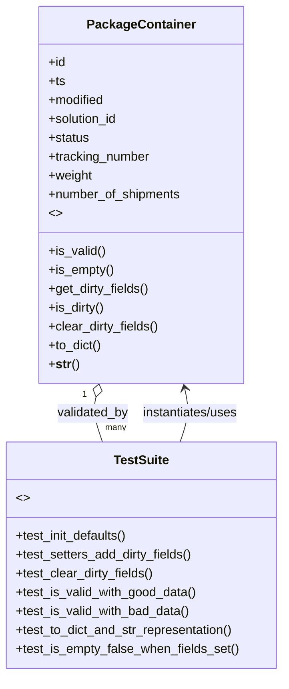

# Diagram: partview_core/partview_service/partview_service/tests/unit/core/datamodel/package_container.py

> Auto-generated by Obscura crawlers

## Mermaid

### SVG

<svg id="container" width="359.4140625" xmlns="http://www.w3.org/2000/svg" class="classDiagram" height="858" viewBox="0 0 359.4140625 858" role="graphics-document document" aria-roledescription="class"><g><defs><marker id="container_class-aggregationStart" class="marker aggregation class" refX="18" refY="7" markerWidth="190" markerHeight="240" orient="auto"><path d="M 18,7 L9,13 L1,7 L9,1 Z"></path></marker></defs><defs><marker id="container_class-aggregationEnd" class="marker aggregation class" refX="1" refY="7" markerWidth="20" markerHeight="28" orient="auto"><path d="M 18,7 L9,13 L1,7 L9,1 Z"></path></marker></defs><defs><marker id="container_class-extensionStart" class="marker extension class" refX="18" refY="7" markerWidth="190" markerHeight="240" orient="auto"><path d="M 1,7 L18,13 V 1 Z"></path></marker></defs><defs><marker id="container_class-extensionEnd" class="marker extension class" refX="1" refY="7" markerWidth="20" markerHeight="28" orient="auto"><path d="M 1,1 V 13 L18,7 Z"></path></marker></defs><defs><marker id="container_class-compositionStart" class="marker composition class" refX="18" refY="7" markerWidth="190" markerHeight="240" orient="auto"><path d="M 18,7 L9,13 L1,7 L9,1 Z"></path></marker></defs><defs><marker id="container_class-compositionEnd" class="marker composition class" refX="1" refY="7" markerWidth="20" markerHeight="28" orient="auto"><path d="M 18,7 L9,13 L1,7 L9,1 Z"></path></marker></defs><defs><marker id="container_class-dependencyStart" class="marker dependency class" refX="6" refY="7" markerWidth="190" markerHeight="240" orient="auto"><path d="M 5,7 L9,13 L1,7 L9,1 Z"></path></marker></defs><defs><marker id="container_class-dependencyEnd" class="marker dependency class" refX="13" refY="7" markerWidth="20" markerHeight="28" orient="auto"><path d="M 18,7 L9,13 L14,7 L9,1 Z"></path></marker></defs><defs><marker id="container_class-lollipopStart" class="marker lollipop class" refX="13" refY="7" markerWidth="190" markerHeight="240" orient="auto"><circle stroke="black" fill="transparent" cx="7" cy="7" r="6"></circle></marker></defs><defs><marker id="container_class-lollipopEnd" class="marker lollipop class" refX="1" refY="7" markerWidth="190" markerHeight="240" orient="auto"><circle stroke="black" fill="transparent" cx="7" cy="7" r="6"></circle></marker></defs><g class="root"><g class="clusters"></g><g class="edgePaths"><path d="M231.367,562L233.579,555.833C235.791,549.667,240.216,537.333,241.211,525.974C242.206,514.614,239.771,504.228,238.554,499.035L237.337,493.842" id="id_TestSuite_PackageContainer_1" class="edge-thickness-normal edge-pattern-solid relation" style=";;;" data-edge="true" data-et="edge" data-id="id_TestSuite_PackageContainer_1" data-points="W3sieCI6MjMxLjM2NjkwNjk0MDYwNzc1LCJ5Ijo1NjJ9LHsieCI6MjQ0LjY0MDYyNSwieSI6NTI1fSx7IngiOjIzNS45NjcxODQ2Nzk2MDI5LCJ5Ijo0ODh9XQ==" marker-end="url(#container_class-dependencyEnd)"></path><path d="M119.51,504.795L118.72,508.162C117.931,511.53,116.352,518.265,117.775,527.799C119.198,537.333,123.623,549.667,125.835,555.833L128.047,562" id="id_PackageContainer_TestSuite_2" class="edge-thickness-normal edge-pattern-solid relation" style=";;;" data-edge="true" data-et="edge" data-id="id_PackageContainer_TestSuite_2" data-points="W3sieCI6MTIzLjQ0Njg3NzgyMDM5NzEsInkiOjQ4OH0seyJ4IjoxMTQuNzczNDM3NSwieSI6NTI1fSx7IngiOjEyOC4wNDcxNTU1NTkzOTIyNSwieSI6NTYyfV0=" marker-start="url(#container_class-aggregationStart)"></path></g><g class="edgeLabels"><g class="edgeLabel" transform="translate(244.42014, 525.61461)"><g class="label" data-id="id_TestSuite_PackageContainer_1" transform="translate(-63.3203125, -12)"><foreignObject width="126.640625" height="24">

instantiates/uses

</foreignObject></g></g><g class="edgeLabel" transform="translate(114.99393, 525.61461)"><g class="label" data-id="id_PackageContainer_TestSuite_2" transform="translate(-46.546875, -12)"><foreignObject width="93.09375" height="24">

validated_by

</foreignObject></g></g><g class="edgeTerminals" transform="translate(104.84873701510911, 501.614667420768)"><g class="inner" transform="translate(0, 0)"><foreignObject style="width: 9px; height: 12px;">
1
</foreignObject></g></g><g class="edgeTerminals" transform="translate(131.25673834609864, 535.462759557064)"><g class="inner" transform="translate(0, 0)"></g><foreignObject style="width: 36px; height: 12px;">
many
</foreignObject></g></g><g class="nodes"><g class="node default" id="classId-PackageContainer-0" transform="translate(179.70703125, 248)"><g class="basic label-container"><path d="M-129.7109375 -240 L129.7109375 -240 L129.7109375 240 L-129.7109375 240" stroke="none" stroke-width="0" fill="#ECECFF" style=""></path><path d="M-129.7109375 -240 C-40.68442753314608 -240, 48.342082433707844 -240, 129.7109375 -240 M-129.7109375 -240 C-38.18273119752895 -240, 53.345475104942096 -240, 129.7109375 -240 M129.7109375 -240 C129.7109375 -127.34166280167346, 129.7109375 -14.68332560334693, 129.7109375 240 M129.7109375 -240 C129.7109375 -143.91650347267563, 129.7109375 -47.83300694535126, 129.7109375 240 M129.7109375 240 C54.349278095503905 240, -21.01238130899219 240, -129.7109375 240 M129.7109375 240 C42.433272715228156 240, -44.84439206954369 240, -129.7109375 240 M-129.7109375 240 C-129.7109375 69.28998033173019, -129.7109375 -101.42003933653962, -129.7109375 -240 M-129.7109375 240 C-129.7109375 139.88083556173993, -129.7109375 39.76167112347986, -129.7109375 -240" stroke="#9370DB" stroke-width="1.3" fill="none" stroke-dasharray="0 0" style=""></path></g><g class="annotation-group text" transform="translate(0, -216)"></g><g class="label-group text" transform="translate(-65.453125, -216)"><g class="label" style="font-weight: bolder" transform="translate(0,-12)"><foreignObject width="130.90625" height="24">

PackageContainer

</foreignObject></g></g><g class="members-group text" transform="translate(-117.7109375, -168)"><g class="label" style="" transform="translate(0,-12)"><foreignObject width="22.078125" height="24">

+id

</foreignObject></g><g class="label" style="" transform="translate(0,12)"><foreignObject width="21.15625" height="24">

+ts

</foreignObject></g><g class="label" style="" transform="translate(0,36)"><foreignObject width="72.609375" height="24">

+modified

</foreignObject></g><g class="label" style="" transform="translate(0,60)"><foreignObject width="90.21875" height="24">

+solution_id

</foreignObject></g><g class="label" style="" transform="translate(0,84)"><foreignObject width="52.390625" height="24">

+status

</foreignObject></g><g class="label" style="" transform="translate(0,108)"><foreignObject width="131.234375" height="24">

+tracking_number

</foreignObject></g><g class="label" style="" transform="translate(0,132)"><foreignObject width="56.171875" height="24">

+weight

</foreignObject></g><g class="label" style="" transform="translate(0,156)"><foreignObject width="169.96875" height="24">

+number_of_shipments

</foreignObject></g><g class="label" style="" transform="translate(0,180)"><foreignObject width="16.015625" height="24">

&lt;&gt;

</foreignObject></g></g><g class="methods-group text" transform="translate(-117.7109375, 72)"><g class="label" style="" transform="translate(0,-12)"><foreignObject width="72.796875" height="24">

+is_valid()

</foreignObject></g><g class="label" style="" transform="translate(0,12)"><foreignObject width="83.53125" height="24">

+is_empty()

</foreignObject></g><g class="label" style="" transform="translate(0,36)"><foreignObject width="129.828125" height="24">

+get_dirty_fields()

</foreignObject></g><g class="label" style="" transform="translate(0,60)"><foreignObject width="71.84375" height="24">

+is_dirty()

</foreignObject></g><g class="label" style="" transform="translate(0,84)"><foreignObject width="141.6875" height="24">

+clear_dirty_fields()

</foreignObject></g><g class="label" style="" transform="translate(0,108)"><foreignObject width="68.34375" height="24">

+to_dict()

</foreignObject></g><g class="label" style="" transform="translate(0,132)"><foreignObject width="38.6875" height="24">

+<strong>str</strong>()

</foreignObject></g></g><g class="divider" style=""><path d="M-129.7109375 -192 C-62.2964372315128 -192, 5.118063036974405 -192, 129.7109375 -192 M-129.7109375 -192 C-31.082226793450303 -192, 67.5464839130994 -192, 129.7109375 -192" stroke="#9370DB" stroke-width="1.3" fill="none" stroke-dasharray="0 0" style=""></path></g><g class="divider" style=""><path d="M-129.7109375 48 C-32.13554913864033 48, 65.43983922271934 48, 129.7109375 48 M-129.7109375 48 C-57.801629728899854 48, 14.107678042200291 48, 129.7109375 48" stroke="#9370DB" stroke-width="1.3" fill="none" stroke-dasharray="0 0" style=""></path></g></g><g class="node default" id="classId-TestSuite-1" transform="translate(179.70703125, 706)"><g class="basic label-container"><path d="M-171.70703125 -144 L171.70703125 -144 L171.70703125 144 L-171.70703125 144" stroke="none" stroke-width="0" fill="#ECECFF" style=""></path><path d="M-171.70703125 -144 C-62.521636429302674 -144, 46.66375839139465 -144, 171.70703125 -144 M-171.70703125 -144 C-76.32330527496498 -144, 19.06042070007004 -144, 171.70703125 -144 M171.70703125 -144 C171.70703125 -47.35817019666615, 171.70703125 49.2836596066677, 171.70703125 144 M171.70703125 -144 C171.70703125 -35.85091508554598, 171.70703125 72.29816982890804, 171.70703125 144 M171.70703125 144 C63.699642802397136 144, -44.30774564520573 144, -171.70703125 144 M171.70703125 144 C92.96715094473866 144, 14.227270639477325 144, -171.70703125 144 M-171.70703125 144 C-171.70703125 37.22563894148108, -171.70703125 -69.54872211703784, -171.70703125 -144 M-171.70703125 144 C-171.70703125 44.3159235575952, -171.70703125 -55.368152884809604, -171.70703125 -144" stroke="#9370DB" stroke-width="1.3" fill="none" stroke-dasharray="0 0" style=""></path></g><g class="annotation-group text" transform="translate(0, -120)"></g><g class="label-group text" transform="translate(-34.0234375, -120)"><g class="label" style="font-weight: bolder" transform="translate(0,-12)"><foreignObject width="68.046875" height="24">

TestSuite

</foreignObject></g></g><g class="members-group text" transform="translate(-159.70703125, -72)"><g class="label" style="" transform="translate(0,-12)"><foreignObject width="16.015625" height="24">

&lt;&gt;

</foreignObject></g></g><g class="methods-group text" transform="translate(-159.70703125, -24)"><g class="label" style="" transform="translate(0,-12)"><foreignObject width="145.53125" height="24">

+test_init_defaults()

</foreignObject></g><g class="label" style="" transform="translate(0,12)"><foreignObject width="228.171875" height="24">

+test_setters_add_dirty_fields()

</foreignObject></g><g class="label" style="" transform="translate(0,36)"><foreignObject width="177.109375" height="24">

+test_clear_dirty_fields()

</foreignObject></g><g class="label" style="" transform="translate(0,60)"><foreignObject width="233.09375" height="24">

+test_is_valid_with_good_data()

</foreignObject></g><g class="label" style="" transform="translate(0,84)"><foreignObject width="224.25" height="24">

+test_is_valid_with_bad_data()

</foreignObject></g><g class="label" style="" transform="translate(0,108)"><foreignObject width="281.5625" height="24">

+test_to_dict_and_str_representation()

</foreignObject></g><g class="label" style="" transform="translate(0,132)"><foreignObject width="285.390625" height="24">

+test_is_empty_false_when_fields_set()

</foreignObject></g></g><g class="divider" style=""><path d="M-171.70703125 -96 C-88.73395154864237 -96, -5.760871847284733 -96, 171.70703125 -96 M-171.70703125 -96 C-71.17414064454098 -96, 29.358749960918033 -96, 171.70703125 -96" stroke="#9370DB" stroke-width="1.3" fill="none" stroke-dasharray="0 0" style=""></path></g><g class="divider" style=""><path d="M-171.70703125 -48 C-82.95755088463673 -48, 5.791929480726537 -48, 171.70703125 -48 M-171.70703125 -48 C-85.13452242216975 -48, 1.4379864056604958 -48, 171.70703125 -48" stroke="#9370DB" stroke-width="1.3" fill="none" stroke-dasharray="0 0" style=""></path></g></g></g></g></g></svg>
