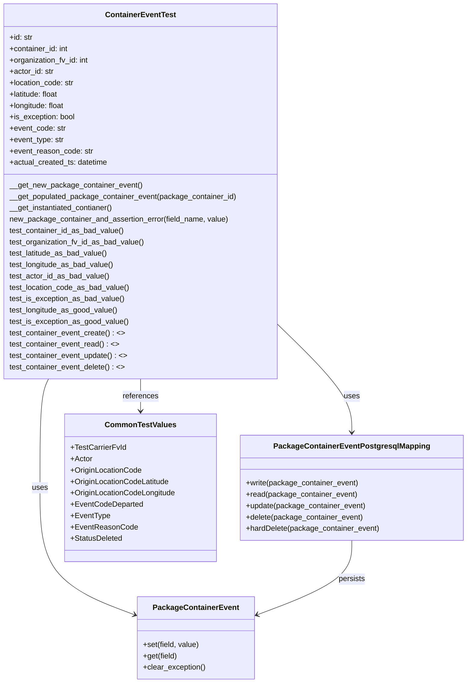
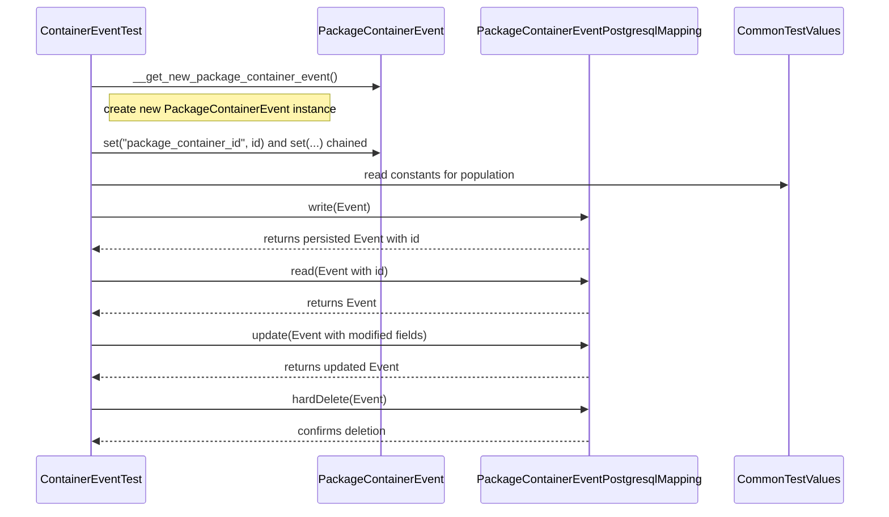

# Diagram: partview_core/partview_service/partview_service/tests/unit/core/datamodel/package_container_event_test.py

> Auto-generated by Obscura crawlers

## Diagram 1

### SVG

<svg id="container" width="974.15234375" xmlns="http://www.w3.org/2000/svg" class="classDiagram" height="1442" viewBox="0 0 974.15234375 1442" role="graphics-document document" aria-roledescription="class"><g><defs><marker id="container_class-aggregationStart" class="marker aggregation class" refX="18" refY="7" markerWidth="190" markerHeight="240" orient="auto"><path d="M 18,7 L9,13 L1,7 L9,1 Z"></path></marker></defs><defs><marker id="container_class-aggregationEnd" class="marker aggregation class" refX="1" refY="7" markerWidth="20" markerHeight="28" orient="auto"><path d="M 18,7 L9,13 L1,7 L9,1 Z"></path></marker></defs><defs><marker id="container_class-extensionStart" class="marker extension class" refX="18" refY="7" markerWidth="190" markerHeight="240" orient="auto"><path d="M 1,7 L18,13 V 1 Z"></path></marker></defs><defs><marker id="container_class-extensionEnd" class="marker extension class" refX="1" refY="7" markerWidth="20" markerHeight="28" orient="auto"><path d="M 1,1 V 13 L18,7 Z"></path></marker></defs><defs><marker id="container_class-compositionStart" class="marker composition class" refX="18" refY="7" markerWidth="190" markerHeight="240" orient="auto"><path d="M 18,7 L9,13 L1,7 L9,1 Z"></path></marker></defs><defs><marker id="container_class-compositionEnd" class="marker composition class" refX="1" refY="7" markerWidth="20" markerHeight="28" orient="auto"><path d="M 18,7 L9,13 L1,7 L9,1 Z"></path></marker></defs><defs><marker id="container_class-dependencyStart" class="marker dependency class" refX="6" refY="7" markerWidth="190" markerHeight="240" orient="auto"><path d="M 5,7 L9,13 L1,7 L9,1 Z"></path></marker></defs><defs><marker id="container_class-dependencyEnd" class="marker dependency class" refX="13" refY="7" markerWidth="20" markerHeight="28" orient="auto"><path d="M 18,7 L9,13 L14,7 L9,1 Z"></path></marker></defs><defs><marker id="container_class-lollipopStart" class="marker lollipop class" refX="13" refY="7" markerWidth="190" markerHeight="240" orient="auto"><circle stroke="black" fill="transparent" cx="7" cy="7" r="6"></circle></marker></defs><defs><marker id="container_class-lollipopEnd" class="marker lollipop class" refX="1" refY="7" markerWidth="190" markerHeight="240" orient="auto"><circle stroke="black" fill="transparent" cx="7" cy="7" r="6"></circle></marker></defs><g class="root"><g class="clusters"></g><g class="edgePaths"><path d="M103.567,800L100.571,806.167C97.575,812.333,91.582,824.667,88.586,863C85.59,901.333,85.59,965.667,85.59,1030C85.59,1094.333,85.59,1158.667,118.717,1203.474C151.844,1248.281,218.097,1273.563,251.224,1286.204L284.351,1298.844" id="id_ContainerEventTest_PackageContainerEvent_1" class="edge-thickness-normal edge-pattern-solid relation" style=";;;" data-edge="true" data-et="edge" data-id="id_ContainerEventTest_PackageContainerEvent_1" data-points="W3sieCI6MTAzLjU2NzQ2MTc0OTQyMjYyLCJ5Ijo4MDB9LHsieCI6ODUuNTg5ODQzNzUsInkiOjgzN30seyJ4Ijo4NS41ODk4NDM3NSwieSI6MTAzMH0seyJ4Ijo4NS41ODk4NDM3NSwieSI6MTIyM30seyJ4IjoyODkuOTU3MDMxMjUsInkiOjEzMDAuOTgzMzE1MzAyMzJ9XQ==" marker-end="url(#container_class-dependencyEnd)"></path><path d="M583.953,687.695L609.213,712.579C634.473,737.463,684.992,787.232,710.252,824.782C735.512,862.333,735.512,887.667,735.512,900.333L735.512,913" id="id_ContainerEventTest_PackageContainerEventPostgresqlMapping_2" class="edge-thickness-normal edge-pattern-solid relation" style=";;;" data-edge="true" data-et="edge" data-id="id_ContainerEventTest_PackageContainerEventPostgresqlMapping_2" data-points="W3sieCI6NTgzLjk1MzEyNSwieSI6Njg3LjY5NDgzMDI5ODM0NDN9LHsieCI6NzM1LjUxMTcxODc1LCJ5Ijo4Mzd9LHsieCI6NzM1LjUxMTcxODc1LCJ5Ijo5MTl9XQ==" marker-end="url(#container_class-dependencyEnd)"></path><path d="M295.977,800L295.977,806.167C295.977,812.333,295.977,824.667,295.977,836C295.977,847.333,295.977,857.667,295.977,862.833L295.977,868" id="id_ContainerEventTest_CommonTestValues_3" class="edge-thickness-normal edge-pattern-solid relation" style=";;;" data-edge="true" data-et="edge" data-id="id_ContainerEventTest_CommonTestValues_3" data-points="W3sieCI6Mjk1Ljk3NjU2MjUsInkiOjgwMH0seyJ4IjoyOTUuOTc2NTYyNSwieSI6ODM3fSx7IngiOjI5NS45NzY1NjI1LCJ5Ijo4NzR9XQ==" marker-end="url(#container_class-dependencyEnd)"></path><path d="M735.512,1141L735.512,1154.667C735.512,1168.333,735.512,1195.667,702.385,1221.974C669.258,1248.281,603.004,1273.563,569.877,1286.204L536.75,1298.844" id="id_PackageContainerEventPostgresqlMapping_PackageContainerEvent_4" class="edge-thickness-normal edge-pattern-solid relation" style=";;;" data-edge="true" data-et="edge" data-id="id_PackageContainerEventPostgresqlMapping_PackageContainerEvent_4" data-points="W3sieCI6NzM1LjUxMTcxODc1LCJ5IjoxMTQxfSx7IngiOjczNS41MTE3MTg3NSwieSI6MTIyM30seyJ4Ijo1MzEuMTQ0NTMxMjUsInkiOjEzMDAuOTgzMzE1MzAyMzJ9XQ==" marker-end="url(#container_class-dependencyEnd)"></path></g><g class="edgeLabels"><g class="edgeLabel" transform="translate(85.58984375, 1030)"><g class="label" data-id="id_ContainerEventTest_PackageContainerEvent_1" transform="translate(-16.4921875, -12)"><foreignObject width="32.984375" height="24">

uses

</foreignObject></g></g><g class="edgeLabel" transform="translate(735.51171875, 837)"><g class="label" data-id="id_ContainerEventTest_PackageContainerEventPostgresqlMapping_2" transform="translate(-16.4921875, -12)"><foreignObject width="32.984375" height="24">

uses

</foreignObject></g></g><g class="edgeLabel" transform="translate(295.9765625, 837)"><g class="label" data-id="id_ContainerEventTest_CommonTestValues_3" transform="translate(-37.828125, -12)"><foreignObject width="75.65625" height="24">

references

</foreignObject></g></g><g class="edgeLabel" transform="translate(735.51171875, 1223)"><g class="label" data-id="id_PackageContainerEventPostgresqlMapping_PackageContainerEvent_4" transform="translate(-28.4375, -12)"><foreignObject width="56.875" height="24">

persists

</foreignObject></g></g></g><g class="nodes"><g class="node default" id="classId-ContainerEventTest-0" transform="translate(295.9765625, 404)"><g class="basic label-container"><path d="M-287.9765625 -396 L287.9765625 -396 L287.9765625 396 L-287.9765625 396" stroke="none" stroke-width="0" fill="#ECECFF" style=""></path><path d="M-287.9765625 -396 C-89.43821338446236 -396, 109.10013573107528 -396, 287.9765625 -396 M-287.9765625 -396 C-95.26771756987156 -396, 97.44112736025687 -396, 287.9765625 -396 M287.9765625 -396 C287.9765625 -169.9531907488027, 287.9765625 56.09361850239458, 287.9765625 396 M287.9765625 -396 C287.9765625 -178.02759825890476, 287.9765625 39.94480348219048, 287.9765625 396 M287.9765625 396 C103.39640243769054 396, -81.18375762461892 396, -287.9765625 396 M287.9765625 396 C165.67707020346774 396, 43.3775779069355 396, -287.9765625 396 M-287.9765625 396 C-287.9765625 114.16589657386953, -287.9765625 -167.66820685226094, -287.9765625 -396 M-287.9765625 396 C-287.9765625 213.3241478811105, -287.9765625 30.648295762220982, -287.9765625 -396" stroke="#9370DB" stroke-width="1.3" fill="none" stroke-dasharray="0 0" style=""></path></g><g class="annotation-group text" transform="translate(0, -372)"></g><g class="label-group text" transform="translate(-71.0625, -372)"><g class="label" style="font-weight: bolder" transform="translate(0,-12)"><foreignObject width="142.125" height="24">

ContainerEventTest

</foreignObject></g></g><g class="members-group text" transform="translate(-275.9765625, -324)"><g class="label" style="" transform="translate(0,-12)"><foreignObject width="49.578125" height="24">

+id: str

</foreignObject></g><g class="label" style="" transform="translate(0,12)"><foreignObject width="126.0625" height="24">

+container_id: int

</foreignObject></g><g class="label" style="" transform="translate(0,36)"><foreignObject width="169.234375" height="24">

+organization_fv_id: int

</foreignObject></g><g class="label" style="" transform="translate(0,60)"><foreignObject width="93.78125" height="24">

+actor_id: str

</foreignObject></g><g class="label" style="" transform="translate(0,84)"><foreignObject width="137.609375" height="24">

+location_code: str

</foreignObject></g><g class="label" style="" transform="translate(0,108)"><foreignObject width="106.109375" height="24">

+latitude: float

</foreignObject></g><g class="label" style="" transform="translate(0,132)"><foreignObject width="118.65625" height="24">

+longitude: float

</foreignObject></g><g class="label" style="" transform="translate(0,156)"><foreignObject width="139.375" height="24">

+is_exception: bool

</foreignObject></g><g class="label" style="" transform="translate(0,180)"><foreignObject width="118.796875" height="24">

+event_code: str

</foreignObject></g><g class="label" style="" transform="translate(0,204)"><foreignObject width="115.625" height="24">

+event_type: str

</foreignObject></g><g class="label" style="" transform="translate(0,228)"><foreignObject width="176.109375" height="24">

+event_reason_code: str

</foreignObject></g><g class="label" style="" transform="translate(0,252)"><foreignObject width="209.4375" height="24">

+actual_created_ts: datetime

</foreignObject></g></g><g class="methods-group text" transform="translate(-275.9765625, -12)"><g class="label" style="" transform="translate(0,-12)"><foreignObject width="278.359375" height="24">

__get_new_package_container_event()

</foreignObject></g><g class="label" style="" transform="translate(0,12)"><foreignObject width="480.890625" height="24">

__get_populated_package_container_event(package_container_id)

</foreignObject></g><g class="label" style="" transform="translate(0,36)"><foreignObject width="223.109375" height="24">

__get_instantiated_contianer()

</foreignObject></g><g class="label" style="" transform="translate(0,60)"><foreignObject width="465.234375" height="24">

new_package_container_and_assertion_error(field_name, value)

</foreignObject></g><g class="label" style="" transform="translate(0,84)"><foreignObject width="242.546875" height="24">

test_container_id_as_bad_value()

</foreignObject></g><g class="label" style="" transform="translate(0,108)"><foreignObject width="285.734375" height="24">

test_organization_fv_id_as_bad_value()

</foreignObject></g><g class="label" style="" transform="translate(0,132)"><foreignObject width="209.046875" height="24">

test_latitude_as_bad_value()

</foreignObject></g><g class="label" style="" transform="translate(0,156)"><foreignObject width="221.609375" height="24">

test_longitude_as_bad_value()

</foreignObject></g><g class="label" style="" transform="translate(0,180)"><foreignObject width="210.765625" height="24">

test_actor_id_as_bad_value()

</foreignObject></g><g class="label" style="" transform="translate(0,204)"><foreignObject width="254.1875" height="24">

test_location_code_as_bad_value()

</foreignObject></g><g class="label" style="" transform="translate(0,228)"><foreignObject width="242.96875" height="24">

test_is_exception_as_bad_value()

</foreignObject></g><g class="label" style="" transform="translate(0,252)"><foreignObject width="230.453125" height="24">

test_longitude_as_good_value()

</foreignObject></g><g class="label" style="" transform="translate(0,276)"><foreignObject width="251.8125" height="24">

test_is_exception_as_good_value()

</foreignObject></g><g class="label" style="" transform="translate(0,300)"><foreignObject width="243.3125" height="24">

test_container_event_create() : &lt;&gt;

</foreignObject></g><g class="label" style="" transform="translate(0,324)"><foreignObject width="231.296875" height="24">

test_container_event_read() : &lt;&gt;

</foreignObject></g><g class="label" style="" transform="translate(0,348)"><foreignObject width="249.796875" height="24">

test_container_event_update() : &lt;&gt;

</foreignObject></g><g class="label" style="" transform="translate(0,372)"><foreignObject width="244.328125" height="24">

test_container_event_delete() : &lt;&gt;

</foreignObject></g></g><g class="divider" style=""><path d="M-287.9765625 -348 C-158.31588831601957 -348, -28.655214132039134 -348, 287.9765625 -348 M-287.9765625 -348 C-146.80677476261272 -348, -5.636987025225437 -348, 287.9765625 -348" stroke="#9370DB" stroke-width="1.3" fill="none" stroke-dasharray="0 0" style=""></path></g><g class="divider" style=""><path d="M-287.9765625 -36 C-135.121839049176 -36, 17.732884401647993 -36, 287.9765625 -36 M-287.9765625 -36 C-158.0261841903082 -36, -28.07580588061637 -36, 287.9765625 -36" stroke="#9370DB" stroke-width="1.3" fill="none" stroke-dasharray="0 0" style=""></path></g></g><g class="node default" id="classId-PackageContainerEvent-1" transform="translate(410.55078125, 1347)"><g class="basic label-container"><path d="M-120.59375 -87 L120.59375 -87 L120.59375 87 L-120.59375 87" stroke="none" stroke-width="0" fill="#ECECFF" style=""></path><path d="M-120.59375 -87 C-35.44070402505349 -87, 49.712341949893016 -87, 120.59375 -87 M-120.59375 -87 C-58.33838429187615 -87, 3.916981416247694 -87, 120.59375 -87 M120.59375 -87 C120.59375 -28.23785543000497, 120.59375 30.52428913999006, 120.59375 87 M120.59375 -87 C120.59375 -40.47162220299589, 120.59375 6.056755594008223, 120.59375 87 M120.59375 87 C45.80475402621376 87, -28.984241947572485 87, -120.59375 87 M120.59375 87 C53.16924495466968 87, -14.255260090660641 87, -120.59375 87 M-120.59375 87 C-120.59375 19.40608764118845, -120.59375 -48.1878247176231, -120.59375 -87 M-120.59375 87 C-120.59375 27.021504360139545, -120.59375 -32.95699127972091, -120.59375 -87" stroke="#9370DB" stroke-width="1.3" fill="none" stroke-dasharray="0 0" style=""></path></g><g class="annotation-group text" transform="translate(0, -63)"></g><g class="label-group text" transform="translate(-85.65625, -63)"><g class="label" style="font-weight: bolder" transform="translate(0,-12)"><foreignObject width="171.3125" height="24">

PackageContainerEvent

</foreignObject></g></g><g class="members-group text" transform="translate(-108.59375, -15)"></g><g class="methods-group text" transform="translate(-108.59375, 15)"><g class="label" style="" transform="translate(0,-12)"><foreignObject width="119.390625" height="24">

+set(field, value)

</foreignObject></g><g class="label" style="" transform="translate(0,12)"><foreignObject width="73.015625" height="24">

+get(field)

</foreignObject></g><g class="label" style="" transform="translate(0,36)"><foreignObject width="131.53125" height="24">

+clear_exception()

</foreignObject></g></g><g class="divider" style=""><path d="M-120.59375 -39 C-50.227447749968135 -39, 20.13885450006373 -39, 120.59375 -39 M-120.59375 -39 C-33.786149663047254 -39, 53.02145067390549 -39, 120.59375 -39" stroke="#9370DB" stroke-width="1.3" fill="none" stroke-dasharray="0 0" style=""></path></g><g class="divider" style=""><path d="M-120.59375 -15 C-24.376319349311842 -15, 71.84111130137632 -15, 120.59375 -15 M-120.59375 -15 C-53.44641967442581 -15, 13.700910651148376 -15, 120.59375 -15" stroke="#9370DB" stroke-width="1.3" fill="none" stroke-dasharray="0 0" style=""></path></g></g><g class="node default" id="classId-PackageContainerEventPostgresqlMapping-2" transform="translate(735.51171875, 1030)"><g class="basic label-container"><path d="M-230.640625 -111 L230.640625 -111 L230.640625 111 L-230.640625 111" stroke="none" stroke-width="0" fill="#ECECFF" style=""></path><path d="M-230.640625 -111 C-125.47118005465863 -111, -20.301735109317264 -111, 230.640625 -111 M-230.640625 -111 C-59.90454407451335 -111, 110.8315368509733 -111, 230.640625 -111 M230.640625 -111 C230.640625 -47.4048051548392, 230.640625 16.190389690321595, 230.640625 111 M230.640625 -111 C230.640625 -27.623300027603122, 230.640625 55.753399944793756, 230.640625 111 M230.640625 111 C120.07483697459013 111, 9.509048949180254 111, -230.640625 111 M230.640625 111 C49.67711463535079 111, -131.28639572929842 111, -230.640625 111 M-230.640625 111 C-230.640625 48.865644397219135, -230.640625 -13.26871120556173, -230.640625 -111 M-230.640625 111 C-230.640625 52.954647256162126, -230.640625 -5.0907054876757485, -230.640625 -111" stroke="#9370DB" stroke-width="1.3" fill="none" stroke-dasharray="0 0" style=""></path></g><g class="annotation-group text" transform="translate(0, -87)"></g><g class="label-group text" transform="translate(-156.0625, -87)"><g class="label" style="font-weight: bolder" transform="translate(0,-12)"><foreignObject width="312.125" height="24">

PackageContainerEventPostgresqlMapping

</foreignObject></g></g><g class="members-group text" transform="translate(-218.640625, -39)"></g><g class="methods-group text" transform="translate(-218.640625, -9)"><g class="label" style="" transform="translate(0,-12)"><foreignObject width="237.6875" height="24">

+write(package_container_event)

</foreignObject></g><g class="label" style="" transform="translate(0,12)"><foreignObject width="233.796875" height="24">

+read(package_container_event)

</foreignObject></g><g class="label" style="" transform="translate(0,36)"><foreignObject width="252.609375" height="24">

+update(package_container_event)

</foreignObject></g><g class="label" style="" transform="translate(0,60)"><foreignObject width="247.140625" height="24">

+delete(package_container_event)

</foreignObject></g><g class="label" style="" transform="translate(0,84)"><foreignObject width="281.21875" height="24">

+hardDelete(package_container_event)

</foreignObject></g></g><g class="divider" style=""><path d="M-230.640625 -63 C-132.12183528271544 -63, -33.603045565430875 -63, 230.640625 -63 M-230.640625 -63 C-97.78349008659512 -63, 35.073644826809755 -63, 230.640625 -63" stroke="#9370DB" stroke-width="1.3" fill="none" stroke-dasharray="0 0" style=""></path></g><g class="divider" style=""><path d="M-230.640625 -39 C-124.34862554944162 -39, -18.056626098883243 -39, 230.640625 -39 M-230.640625 -39 C-82.31619122630934 -39, 66.00824254738131 -39, 230.640625 -39" stroke="#9370DB" stroke-width="1.3" fill="none" stroke-dasharray="0 0" style=""></path></g></g><g class="node default" id="classId-CommonTestValues-3" transform="translate(295.9765625, 1030)"><g class="basic label-container"><path d="M-158.89453125 -156 L158.89453125 -156 L158.89453125 156 L-158.89453125 156" stroke="none" stroke-width="0" fill="#ECECFF" style=""></path><path d="M-158.89453125 -156 C-68.81817913526179 -156, 21.258172979476427 -156, 158.89453125 -156 M-158.89453125 -156 C-52.11816375043921 -156, 54.65820374912158 -156, 158.89453125 -156 M158.89453125 -156 C158.89453125 -32.04641638709704, 158.89453125 91.90716722580592, 158.89453125 156 M158.89453125 -156 C158.89453125 -72.67071712380026, 158.89453125 10.658565752399483, 158.89453125 156 M158.89453125 156 C38.4464799815883 156, -82.0015712868234 156, -158.89453125 156 M158.89453125 156 C62.042382947447564 156, -34.80976535510487 156, -158.89453125 156 M-158.89453125 156 C-158.89453125 61.251780319439646, -158.89453125 -33.49643936112071, -158.89453125 -156 M-158.89453125 156 C-158.89453125 78.08162109791755, -158.89453125 0.16324219583509603, -158.89453125 -156" stroke="#9370DB" stroke-width="1.3" fill="none" stroke-dasharray="0 0" style=""></path></g><g class="annotation-group text" transform="translate(0, -132)"></g><g class="label-group text" transform="translate(-70.9453125, -132)"><g class="label" style="font-weight: bolder" transform="translate(0,-12)"><foreignObject width="141.890625" height="24">

CommonTestValues

</foreignObject></g></g><g class="members-group text" transform="translate(-146.89453125, -84)"><g class="label" style="" transform="translate(0,-12)"><foreignObject width="115.265625" height="24">

+TestCarrierFvId

</foreignObject></g><g class="label" style="" transform="translate(0,12)"><foreignObject width="45.703125" height="24">

+Actor

</foreignObject></g><g class="label" style="" transform="translate(0,36)"><foreignObject width="150.34375" height="24">

+OriginLocationCode

</foreignObject></g><g class="label" style="" transform="translate(0,60)"><foreignObject width="210.515625" height="24">

+OriginLocationCodeLatitude

</foreignObject></g><g class="label" style="" transform="translate(0,84)"><foreignObject width="222.84375" height="24">

+OriginLocationCodeLongitude

</foreignObject></g><g class="label" style="" transform="translate(0,108)"><foreignObject width="151.25" height="24">

+EventCodeDeparted

</foreignObject></g><g class="label" style="" transform="translate(0,132)"><foreignObject width="81.640625" height="24">

+EventType

</foreignObject></g><g class="label" style="" transform="translate(0,156)"><foreignObject width="136.921875" height="24">

+EventReasonCode

</foreignObject></g><g class="label" style="" transform="translate(0,180)"><foreignObject width="109.171875" height="24">

+StatusDeleted

</foreignObject></g></g><g class="methods-group text" transform="translate(-146.89453125, 156)"></g><g class="divider" style=""><path d="M-158.89453125 -108 C-93.5336836845109 -108, -28.17283611902181 -108, 158.89453125 -108 M-158.89453125 -108 C-39.04003149171025 -108, 80.8144682665795 -108, 158.89453125 -108" stroke="#9370DB" stroke-width="1.3" fill="none" stroke-dasharray="0 0" style=""></path></g><g class="divider" style=""><path d="M-158.89453125 132 C-66.53281706726021 132, 25.828897115479577 132, 158.89453125 132 M-158.89453125 132 C-54.464511967842824 132, 49.96550731431435 132, 158.89453125 132" stroke="#9370DB" stroke-width="1.3" fill="none" stroke-dasharray="0 0" style=""></path></g></g></g></g></g></svg>

## Diagram 2

### SVG

<svg id="container" width="1296.5" xmlns="http://www.w3.org/2000/svg" height="748" viewBox="-50 -10 1296.5 748" role="graphics-document document" aria-roledescription="sequence"><g><rect x="1036.5" y="662" fill="#eaeaea" stroke="#666" width="160" height="65" name="Values" rx="3" ry="3" class="actor actor-bottom"></rect><text x="1116.5" y="694.5" dominant-baseline="central" alignment-baseline="central" class="actor actor-box" style="text-anchor: middle; font-size: 16px; font-weight: 400;"><tspan x="1116.5" dy="0">CommonTestValues</tspan></text></g><g><rect x="659.5" y="662" fill="#eaeaea" stroke="#666" width="327" height="65" name="Mapping" rx="3" ry="3" class="actor actor-bottom"></rect><text x="823" y="694.5" dominant-baseline="central" alignment-baseline="central" class="actor actor-box" style="text-anchor: middle; font-size: 16px; font-weight: 400;"><tspan x="823" dy="0">PackageContainerEventPostgresqlMapping</tspan></text></g><g><rect x="420.5" y="662" fill="#eaeaea" stroke="#666" width="189" height="65" name="Event" rx="3" ry="3" class="actor actor-bottom"></rect><text x="515" y="694.5" dominant-baseline="central" alignment-baseline="central" class="actor actor-box" style="text-anchor: middle; font-size: 16px; font-weight: 400;"><tspan x="515" dy="0">PackageContainerEvent</tspan></text></g><g><rect x="0" y="662" fill="#eaeaea" stroke="#666" width="160" height="65" name="Test" rx="3" ry="3" class="actor actor-bottom"></rect><text x="80" y="694.5" dominant-baseline="central" alignment-baseline="central" class="actor actor-box" style="text-anchor: middle; font-size: 16px; font-weight: 400;"><tspan x="80" dy="0">ContainerEventTest</tspan></text></g><g><line id="actor3" x1="1116.5" y1="65" x2="1116.5" y2="662" class="actor-line 200" stroke-width="0.5px" stroke="#999" name="Values"></line><g id="root-3"><rect x="1036.5" y="0" fill="#eaeaea" stroke="#666" width="160" height="65" name="Values" rx="3" ry="3" class="actor actor-top"></rect><text x="1116.5" y="32.5" dominant-baseline="central" alignment-baseline="central" class="actor actor-box" style="text-anchor: middle; font-size: 16px; font-weight: 400;"><tspan x="1116.5" dy="0">CommonTestValues</tspan></text></g></g><g><line id="actor2" x1="823" y1="65" x2="823" y2="662" class="actor-line 200" stroke-width="0.5px" stroke="#999" name="Mapping"></line><g id="root-2"><rect x="659.5" y="0" fill="#eaeaea" stroke="#666" width="327" height="65" name="Mapping" rx="3" ry="3" class="actor actor-top"></rect><text x="823" y="32.5" dominant-baseline="central" alignment-baseline="central" class="actor actor-box" style="text-anchor: middle; font-size: 16px; font-weight: 400;"><tspan x="823" dy="0">PackageContainerEventPostgresqlMapping</tspan></text></g></g><g><line id="actor1" x1="515" y1="65" x2="515" y2="662" class="actor-line 200" stroke-width="0.5px" stroke="#999" name="Event"></line><g id="root-1"><rect x="420.5" y="0" fill="#eaeaea" stroke="#666" width="189" height="65" name="Event" rx="3" ry="3" class="actor actor-top"></rect><text x="515" y="32.5" dominant-baseline="central" alignment-baseline="central" class="actor actor-box" style="text-anchor: middle; font-size: 16px; font-weight: 400;"><tspan x="515" dy="0">PackageContainerEvent</tspan></text></g></g><g><line id="actor0" x1="80" y1="65" x2="80" y2="662" class="actor-line 200" stroke-width="0.5px" stroke="#999" name="Test"></line><g id="root-0"><rect x="0" y="0" fill="#eaeaea" stroke="#666" width="160" height="65" name="Test" rx="3" ry="3" class="actor actor-top"></rect><text x="80" y="32.5" dominant-baseline="central" alignment-baseline="central" class="actor actor-box" style="text-anchor: middle; font-size: 16px; font-weight: 400;"><tspan x="80" dy="0">ContainerEventTest</tspan></text></g></g><g></g><defs><symbol id="computer" width="24" height="24"><path transform="scale(.5)" d="M2 2v13h20v-13h-20zm18 11h-16v-9h16v9zm-10.228 6l.466-1h3.524l.467 1h-4.457zm14.228 3h-24l2-6h2.104l-1.33 4h18.45l-1.297-4h2.073l2 6zm-5-10h-14v-7h14v7z"></path></symbol></defs><defs><symbol id="database" fill-rule="evenodd" clip-rule="evenodd"><path transform="scale(.5)" d="M12.258.001l.256.004.255.005.253.008.251.01.249.012.247.015.246.016.242.019.241.02.239.023.236.024.233.027.231.028.229.031.225.032.223.034.22.036.217.038.214.04.211.041.208.043.205.045.201.046.198.048.194.05.191.051.187.053.183.054.18.056.175.057.172.059.168.06.163.061.16.063.155.064.15.066.074.033.073.033.071.034.07.034.069.035.068.035.067.035.066.035.064.036.064.036.062.036.06.036.06.037.058.037.058.037.055.038.055.038.053.038.052.038.051.039.05.039.048.039.047.039.045.04.044.04.043.04.041.04.04.041.039.041.037.041.036.041.034.041.033.042.032.042.03.042.029.042.027.042.026.043.024.043.023.043.021.043.02.043.018.044.017.043.015.044.013.044.012.044.011.045.009.044.007.045.006.045.004.045.002.045.001.045v17l-.001.045-.002.045-.004.045-.006.045-.007.045-.009.044-.011.045-.012.044-.013.044-.015.044-.017.043-.018.044-.02.043-.021.043-.023.043-.024.043-.026.043-.027.042-.029.042-.03.042-.032.042-.033.042-.034.041-.036.041-.037.041-.039.041-.04.041-.041.04-.043.04-.044.04-.045.04-.047.039-.048.039-.05.039-.051.039-.052.038-.053.038-.055.038-.055.038-.058.037-.058.037-.06.037-.06.036-.062.036-.064.036-.064.036-.066.035-.067.035-.068.035-.069.035-.07.034-.071.034-.073.033-.074.033-.15.066-.155.064-.16.063-.163.061-.168.06-.172.059-.175.057-.18.056-.183.054-.187.053-.191.051-.194.05-.198.048-.201.046-.205.045-.208.043-.211.041-.214.04-.217.038-.22.036-.223.034-.225.032-.229.031-.231.028-.233.027-.236.024-.239.023-.241.02-.242.019-.246.016-.247.015-.249.012-.251.01-.253.008-.255.005-.256.004-.258.001-.258-.001-.256-.004-.255-.005-.253-.008-.251-.01-.249-.012-.247-.015-.245-.016-.243-.019-.241-.02-.238-.023-.236-.024-.234-.027-.231-.028-.228-.031-.226-.032-.223-.034-.22-.036-.217-.038-.214-.04-.211-.041-.208-.043-.204-.045-.201-.046-.198-.048-.195-.05-.19-.051-.187-.053-.184-.054-.179-.056-.176-.057-.172-.059-.167-.06-.164-.061-.159-.063-.155-.064-.151-.066-.074-.033-.072-.033-.072-.034-.07-.034-.069-.035-.068-.035-.067-.035-.066-.035-.064-.036-.063-.036-.062-.036-.061-.036-.06-.037-.058-.037-.057-.037-.056-.038-.055-.038-.053-.038-.052-.038-.051-.039-.049-.039-.049-.039-.046-.039-.046-.04-.044-.04-.043-.04-.041-.04-.04-.041-.039-.041-.037-.041-.036-.041-.034-.041-.033-.042-.032-.042-.03-.042-.029-.042-.027-.042-.026-.043-.024-.043-.023-.043-.021-.043-.02-.043-.018-.044-.017-.043-.015-.044-.013-.044-.012-.044-.011-.045-.009-.044-.007-.045-.006-.045-.004-.045-.002-.045-.001-.045v-17l.001-.045.002-.045.004-.045.006-.045.007-.045.009-.044.011-.045.012-.044.013-.044.015-.044.017-.043.018-.044.02-.043.021-.043.023-.043.024-.043.026-.043.027-.042.029-.042.03-.042.032-.042.033-.042.034-.041.036-.041.037-.041.039-.041.04-.041.041-.04.043-.04.044-.04.046-.04.046-.039.049-.039.049-.039.051-.039.052-.038.053-.038.055-.038.056-.038.057-.037.058-.037.06-.037.061-.036.062-.036.063-.036.064-.036.066-.035.067-.035.068-.035.069-.035.07-.034.072-.034.072-.033.074-.033.151-.066.155-.064.159-.063.164-.061.167-.06.172-.059.176-.057.179-.056.184-.054.187-.053.19-.051.195-.05.198-.048.201-.046.204-.045.208-.043.211-.041.214-.04.217-.038.22-.036.223-.034.226-.032.228-.031.231-.028.234-.027.236-.024.238-.023.241-.02.243-.019.245-.016.247-.015.249-.012.251-.01.253-.008.255-.005.256-.004.258-.001.258.001zm-9.258 20.499v.01l.001.021.003.021.004.022.005.021.006.022.007.022.009.023.01.022.011.023.012.023.013.023.015.023.016.024.017.023.018.024.019.024.021.024.022.025.023.024.024.025.052.049.056.05.061.051.066.051.07.051.075.051.079.052.084.052.088.052.092.052.097.052.102.051.105.052.11.052.114.051.119.051.123.051.127.05.131.05.135.05.139.048.144.049.147.047.152.047.155.047.16.045.163.045.167.043.171.043.176.041.178.041.183.039.187.039.19.037.194.035.197.035.202.033.204.031.209.03.212.029.216.027.219.025.222.024.226.021.23.02.233.018.236.016.24.015.243.012.246.01.249.008.253.005.256.004.259.001.26-.001.257-.004.254-.005.25-.008.247-.011.244-.012.241-.014.237-.016.233-.018.231-.021.226-.021.224-.024.22-.026.216-.027.212-.028.21-.031.205-.031.202-.034.198-.034.194-.036.191-.037.187-.039.183-.04.179-.04.175-.042.172-.043.168-.044.163-.045.16-.046.155-.046.152-.047.148-.048.143-.049.139-.049.136-.05.131-.05.126-.05.123-.051.118-.052.114-.051.11-.052.106-.052.101-.052.096-.052.092-.052.088-.053.083-.051.079-.052.074-.052.07-.051.065-.051.06-.051.056-.05.051-.05.023-.024.023-.025.021-.024.02-.024.019-.024.018-.024.017-.024.015-.023.014-.024.013-.023.012-.023.01-.023.01-.022.008-.022.006-.022.006-.022.004-.022.004-.021.001-.021.001-.021v-4.127l-.077.055-.08.053-.083.054-.085.053-.087.052-.09.052-.093.051-.095.05-.097.05-.1.049-.102.049-.105.048-.106.047-.109.047-.111.046-.114.045-.115.045-.118.044-.12.043-.122.042-.124.042-.126.041-.128.04-.13.04-.132.038-.134.038-.135.037-.138.037-.139.035-.142.035-.143.034-.144.033-.147.032-.148.031-.15.03-.151.03-.153.029-.154.027-.156.027-.158.026-.159.025-.161.024-.162.023-.163.022-.165.021-.166.02-.167.019-.169.018-.169.017-.171.016-.173.015-.173.014-.175.013-.175.012-.177.011-.178.01-.179.008-.179.008-.181.006-.182.005-.182.004-.184.003-.184.002h-.37l-.184-.002-.184-.003-.182-.004-.182-.005-.181-.006-.179-.008-.179-.008-.178-.01-.176-.011-.176-.012-.175-.013-.173-.014-.172-.015-.171-.016-.17-.017-.169-.018-.167-.019-.166-.02-.165-.021-.163-.022-.162-.023-.161-.024-.159-.025-.157-.026-.156-.027-.155-.027-.153-.029-.151-.03-.15-.03-.148-.031-.146-.032-.145-.033-.143-.034-.141-.035-.14-.035-.137-.037-.136-.037-.134-.038-.132-.038-.13-.04-.128-.04-.126-.041-.124-.042-.122-.042-.12-.044-.117-.043-.116-.045-.113-.045-.112-.046-.109-.047-.106-.047-.105-.048-.102-.049-.1-.049-.097-.05-.095-.05-.093-.052-.09-.051-.087-.052-.085-.053-.083-.054-.08-.054-.077-.054v4.127zm0-5.654v.011l.001.021.003.021.004.021.005.022.006.022.007.022.009.022.01.022.011.023.012.023.013.023.015.024.016.023.017.024.018.024.019.024.021.024.022.024.023.025.024.024.052.05.056.05.061.05.066.051.07.051.075.052.079.051.084.052.088.052.092.052.097.052.102.052.105.052.11.051.114.051.119.052.123.05.127.051.131.05.135.049.139.049.144.048.147.048.152.047.155.046.16.045.163.045.167.044.171.042.176.042.178.04.183.04.187.038.19.037.194.036.197.034.202.033.204.032.209.03.212.028.216.027.219.025.222.024.226.022.23.02.233.018.236.016.24.014.243.012.246.01.249.008.253.006.256.003.259.001.26-.001.257-.003.254-.006.25-.008.247-.01.244-.012.241-.015.237-.016.233-.018.231-.02.226-.022.224-.024.22-.025.216-.027.212-.029.21-.03.205-.032.202-.033.198-.035.194-.036.191-.037.187-.039.183-.039.179-.041.175-.042.172-.043.168-.044.163-.045.16-.045.155-.047.152-.047.148-.048.143-.048.139-.05.136-.049.131-.05.126-.051.123-.051.118-.051.114-.052.11-.052.106-.052.101-.052.096-.052.092-.052.088-.052.083-.052.079-.052.074-.051.07-.052.065-.051.06-.05.056-.051.051-.049.023-.025.023-.024.021-.025.02-.024.019-.024.018-.024.017-.024.015-.023.014-.023.013-.024.012-.022.01-.023.01-.023.008-.022.006-.022.006-.022.004-.021.004-.022.001-.021.001-.021v-4.139l-.077.054-.08.054-.083.054-.085.052-.087.053-.09.051-.093.051-.095.051-.097.05-.1.049-.102.049-.105.048-.106.047-.109.047-.111.046-.114.045-.115.044-.118.044-.12.044-.122.042-.124.042-.126.041-.128.04-.13.039-.132.039-.134.038-.135.037-.138.036-.139.036-.142.035-.143.033-.144.033-.147.033-.148.031-.15.03-.151.03-.153.028-.154.028-.156.027-.158.026-.159.025-.161.024-.162.023-.163.022-.165.021-.166.02-.167.019-.169.018-.169.017-.171.016-.173.015-.173.014-.175.013-.175.012-.177.011-.178.009-.179.009-.179.007-.181.007-.182.005-.182.004-.184.003-.184.002h-.37l-.184-.002-.184-.003-.182-.004-.182-.005-.181-.007-.179-.007-.179-.009-.178-.009-.176-.011-.176-.012-.175-.013-.173-.014-.172-.015-.171-.016-.17-.017-.169-.018-.167-.019-.166-.02-.165-.021-.163-.022-.162-.023-.161-.024-.159-.025-.157-.026-.156-.027-.155-.028-.153-.028-.151-.03-.15-.03-.148-.031-.146-.033-.145-.033-.143-.033-.141-.035-.14-.036-.137-.036-.136-.037-.134-.038-.132-.039-.13-.039-.128-.04-.126-.041-.124-.042-.122-.043-.12-.043-.117-.044-.116-.044-.113-.046-.112-.046-.109-.046-.106-.047-.105-.048-.102-.049-.1-.049-.097-.05-.095-.051-.093-.051-.09-.051-.087-.053-.085-.052-.083-.054-.08-.054-.077-.054v4.139zm0-5.666v.011l.001.02.003.022.004.021.005.022.006.021.007.022.009.023.01.022.011.023.012.023.013.023.015.023.016.024.017.024.018.023.019.024.021.025.022.024.023.024.024.025.052.05.056.05.061.05.066.051.07.051.075.052.079.051.084.052.088.052.092.052.097.052.102.052.105.051.11.052.114.051.119.051.123.051.127.05.131.05.135.05.139.049.144.048.147.048.152.047.155.046.16.045.163.045.167.043.171.043.176.042.178.04.183.04.187.038.19.037.194.036.197.034.202.033.204.032.209.03.212.028.216.027.219.025.222.024.226.021.23.02.233.018.236.017.24.014.243.012.246.01.249.008.253.006.256.003.259.001.26-.001.257-.003.254-.006.25-.008.247-.01.244-.013.241-.014.237-.016.233-.018.231-.02.226-.022.224-.024.22-.025.216-.027.212-.029.21-.03.205-.032.202-.033.198-.035.194-.036.191-.037.187-.039.183-.039.179-.041.175-.042.172-.043.168-.044.163-.045.16-.045.155-.047.152-.047.148-.048.143-.049.139-.049.136-.049.131-.051.126-.05.123-.051.118-.052.114-.051.11-.052.106-.052.101-.052.096-.052.092-.052.088-.052.083-.052.079-.052.074-.052.07-.051.065-.051.06-.051.056-.05.051-.049.023-.025.023-.025.021-.024.02-.024.019-.024.018-.024.017-.024.015-.023.014-.024.013-.023.012-.023.01-.022.01-.023.008-.022.006-.022.006-.022.004-.022.004-.021.001-.021.001-.021v-4.153l-.077.054-.08.054-.083.053-.085.053-.087.053-.09.051-.093.051-.095.051-.097.05-.1.049-.102.048-.105.048-.106.048-.109.046-.111.046-.114.046-.115.044-.118.044-.12.043-.122.043-.124.042-.126.041-.128.04-.13.039-.132.039-.134.038-.135.037-.138.036-.139.036-.142.034-.143.034-.144.033-.147.032-.148.032-.15.03-.151.03-.153.028-.154.028-.156.027-.158.026-.159.024-.161.024-.162.023-.163.023-.165.021-.166.02-.167.019-.169.018-.169.017-.171.016-.173.015-.173.014-.175.013-.175.012-.177.01-.178.01-.179.009-.179.007-.181.006-.182.006-.182.004-.184.003-.184.001-.185.001-.185-.001-.184-.001-.184-.003-.182-.004-.182-.006-.181-.006-.179-.007-.179-.009-.178-.01-.176-.01-.176-.012-.175-.013-.173-.014-.172-.015-.171-.016-.17-.017-.169-.018-.167-.019-.166-.02-.165-.021-.163-.023-.162-.023-.161-.024-.159-.024-.157-.026-.156-.027-.155-.028-.153-.028-.151-.03-.15-.03-.148-.032-.146-.032-.145-.033-.143-.034-.141-.034-.14-.036-.137-.036-.136-.037-.134-.038-.132-.039-.13-.039-.128-.041-.126-.041-.124-.041-.122-.043-.12-.043-.117-.044-.116-.044-.113-.046-.112-.046-.109-.046-.106-.048-.105-.048-.102-.048-.1-.05-.097-.049-.095-.051-.093-.051-.09-.052-.087-.052-.085-.053-.083-.053-.08-.054-.077-.054v4.153zm8.74-8.179l-.257.004-.254.005-.25.008-.247.011-.244.012-.241.014-.237.016-.233.018-.231.021-.226.022-.224.023-.22.026-.216.027-.212.028-.21.031-.205.032-.202.033-.198.034-.194.036-.191.038-.187.038-.183.04-.179.041-.175.042-.172.043-.168.043-.163.045-.16.046-.155.046-.152.048-.148.048-.143.048-.139.049-.136.05-.131.05-.126.051-.123.051-.118.051-.114.052-.11.052-.106.052-.101.052-.096.052-.092.052-.088.052-.083.052-.079.052-.074.051-.07.052-.065.051-.06.05-.056.05-.051.05-.023.025-.023.024-.021.024-.02.025-.019.024-.018.024-.017.023-.015.024-.014.023-.013.023-.012.023-.01.023-.01.022-.008.022-.006.023-.006.021-.004.022-.004.021-.001.021-.001.021.001.021.001.021.004.021.004.022.006.021.006.023.008.022.01.022.01.023.012.023.013.023.014.023.015.024.017.023.018.024.019.024.02.025.021.024.023.024.023.025.051.05.056.05.06.05.065.051.07.052.074.051.079.052.083.052.088.052.092.052.096.052.101.052.106.052.11.052.114.052.118.051.123.051.126.051.131.05.136.05.139.049.143.048.148.048.152.048.155.046.16.046.163.045.168.043.172.043.175.042.179.041.183.04.187.038.191.038.194.036.198.034.202.033.205.032.21.031.212.028.216.027.22.026.224.023.226.022.231.021.233.018.237.016.241.014.244.012.247.011.25.008.254.005.257.004.26.001.26-.001.257-.004.254-.005.25-.008.247-.011.244-.012.241-.014.237-.016.233-.018.231-.021.226-.022.224-.023.22-.026.216-.027.212-.028.21-.031.205-.032.202-.033.198-.034.194-.036.191-.038.187-.038.183-.04.179-.041.175-.042.172-.043.168-.043.163-.045.16-.046.155-.046.152-.048.148-.048.143-.048.139-.049.136-.05.131-.05.126-.051.123-.051.118-.051.114-.052.11-.052.106-.052.101-.052.096-.052.092-.052.088-.052.083-.052.079-.052.074-.051.07-.052.065-.051.06-.05.056-.05.051-.05.023-.025.023-.024.021-.024.02-.025.019-.024.018-.024.017-.023.015-.024.014-.023.013-.023.012-.023.01-.023.01-.022.008-.022.006-.023.006-.021.004-.022.004-.021.001-.021.001-.021-.001-.021-.001-.021-.004-.021-.004-.022-.006-.021-.006-.023-.008-.022-.01-.022-.01-.023-.012-.023-.013-.023-.014-.023-.015-.024-.017-.023-.018-.024-.019-.024-.02-.025-.021-.024-.023-.024-.023-.025-.051-.05-.056-.05-.06-.05-.065-.051-.07-.052-.074-.051-.079-.052-.083-.052-.088-.052-.092-.052-.096-.052-.101-.052-.106-.052-.11-.052-.114-.052-.118-.051-.123-.051-.126-.051-.131-.05-.136-.05-.139-.049-.143-.048-.148-.048-.152-.048-.155-.046-.16-.046-.163-.045-.168-.043-.172-.043-.175-.042-.179-.041-.183-.04-.187-.038-.191-.038-.194-.036-.198-.034-.202-.033-.205-.032-.21-.031-.212-.028-.216-.027-.22-.026-.224-.023-.226-.022-.231-.021-.233-.018-.237-.016-.241-.014-.244-.012-.247-.011-.25-.008-.254-.005-.257-.004-.26-.001-.26.001z"></path></symbol></defs><defs><symbol id="clock" width="24" height="24"><path transform="scale(.5)" d="M12 2c5.514 0 10 4.486 10 10s-4.486 10-10 10-10-4.486-10-10 4.486-10 10-10zm0-2c-6.627 0-12 5.373-12 12s5.373 12 12 12 12-5.373 12-12-5.373-12-12-12zm5.848 12.459c.202.038.202.333.001.372-1.907.361-6.045 1.111-6.547 1.111-.719 0-1.301-.582-1.301-1.301 0-.512.77-5.447 1.125-7.445.034-.192.312-.181.343.014l.985 6.238 5.394 1.011z"></path></symbol></defs><defs><marker id="arrowhead" refX="7.9" refY="5" markerUnits="userSpaceOnUse" markerWidth="12" markerHeight="12" orient="auto-start-reverse"><path d="M -1 0 L 10 5 L 0 10 z"></path></marker></defs><defs><marker id="crosshead" markerWidth="15" markerHeight="8" orient="auto" refX="4" refY="4.5"><path fill="none" stroke="#000000" stroke-width="1pt" d="M 1,2 L 6,7 M 6,2 L 1,7" style="stroke-dasharray: 0, 0;"></path></marker></defs><defs><marker id="filled-head" refX="15.5" refY="7" markerWidth="20" markerHeight="28" orient="auto"><path d="M 18,7 L9,13 L14,7 L9,1 Z"></path></marker></defs><defs><marker id="sequencenumber" refX="15" refY="15" markerWidth="60" markerHeight="40" orient="auto"><circle cx="15" cy="15" r="6"></circle></marker></defs><g><rect x="105" y="123" fill="#EDF2AE" stroke="#666" width="337" height="39" class="note"></rect><text x="274" y="128" text-anchor="middle" dominant-baseline="middle" alignment-baseline="middle" class="noteText" dy="1em" style="font-size: 16px; font-weight: 400;"><tspan x="274">create new PackageContainerEvent instance</tspan></text></g><text x="296" y="80" text-anchor="middle" dominant-baseline="middle" alignment-baseline="middle" class="messageText" dy="1em" style="font-size: 16px; font-weight: 400;">__get_new_package_container_event()</text><line x1="81" y1="113" x2="511" y2="113" class="messageLine0" stroke-width="2" stroke="none" marker-end="url(#arrowhead)" style="fill: none;"></line><text x="296" y="177" text-anchor="middle" dominant-baseline="middle" alignment-baseline="middle" class="messageText" dy="1em" style="font-size: 16px; font-weight: 400;">set("package_container_id", id) and set(...) chained</text><line x1="81" y1="210" x2="511" y2="210" class="messageLine0" stroke-width="2" stroke="none" marker-end="url(#arrowhead)" style="fill: none;"></line><text x="597" y="225" text-anchor="middle" dominant-baseline="middle" alignment-baseline="middle" class="messageText" dy="1em" style="font-size: 16px; font-weight: 400;">read constants for population</text><line x1="81" y1="258" x2="1112.5" y2="258" class="messageLine0" stroke-width="2" stroke="none" marker-end="url(#arrowhead)" style="fill: none;"></line><text x="450" y="273" text-anchor="middle" dominant-baseline="middle" alignment-baseline="middle" class="messageText" dy="1em" style="font-size: 16px; font-weight: 400;">write(Event)</text><line x1="81" y1="306" x2="819" y2="306" class="messageLine0" stroke-width="2" stroke="none" marker-end="url(#arrowhead)" style="fill: none;"></line><text x="453" y="321" text-anchor="middle" dominant-baseline="middle" alignment-baseline="middle" class="messageText" dy="1em" style="font-size: 16px; font-weight: 400;">returns persisted Event with id</text><line x1="822" y1="354" x2="84" y2="354" class="messageLine1" stroke-width="2" stroke="none" marker-end="url(#arrowhead)" style="stroke-dasharray: 3, 3; fill: none;"></line><text x="450" y="369" text-anchor="middle" dominant-baseline="middle" alignment-baseline="middle" class="messageText" dy="1em" style="font-size: 16px; font-weight: 400;">read(Event with id)</text><line x1="81" y1="402" x2="819" y2="402" class="messageLine0" stroke-width="2" stroke="none" marker-end="url(#arrowhead)" style="fill: none;"></line><text x="453" y="417" text-anchor="middle" dominant-baseline="middle" alignment-baseline="middle" class="messageText" dy="1em" style="font-size: 16px; font-weight: 400;">returns Event</text><line x1="822" y1="450" x2="84" y2="450" class="messageLine1" stroke-width="2" stroke="none" marker-end="url(#arrowhead)" style="stroke-dasharray: 3, 3; fill: none;"></line><text x="450" y="465" text-anchor="middle" dominant-baseline="middle" alignment-baseline="middle" class="messageText" dy="1em" style="font-size: 16px; font-weight: 400;">update(Event with modified fields)</text><line x1="81" y1="498" x2="819" y2="498" class="messageLine0" stroke-width="2" stroke="none" marker-end="url(#arrowhead)" style="fill: none;"></line><text x="453" y="513" text-anchor="middle" dominant-baseline="middle" alignment-baseline="middle" class="messageText" dy="1em" style="font-size: 16px; font-weight: 400;">returns updated Event</text><line x1="822" y1="546" x2="84" y2="546" class="messageLine1" stroke-width="2" stroke="none" marker-end="url(#arrowhead)" style="stroke-dasharray: 3, 3; fill: none;"></line><text x="450" y="561" text-anchor="middle" dominant-baseline="middle" alignment-baseline="middle" class="messageText" dy="1em" style="font-size: 16px; font-weight: 400;">hardDelete(Event)</text><line x1="81" y1="594" x2="819" y2="594" class="messageLine0" stroke-width="2" stroke="none" marker-end="url(#arrowhead)" style="fill: none;"></line><text x="453" y="609" text-anchor="middle" dominant-baseline="middle" alignment-baseline="middle" class="messageText" dy="1em" style="font-size: 16px; font-weight: 400;">confirms deletion</text><line x1="822" y1="642" x2="84" y2="642" class="messageLine1" stroke-width="2" stroke="none" marker-end="url(#arrowhead)" style="stroke-dasharray: 3, 3; fill: none;"></line></svg>
