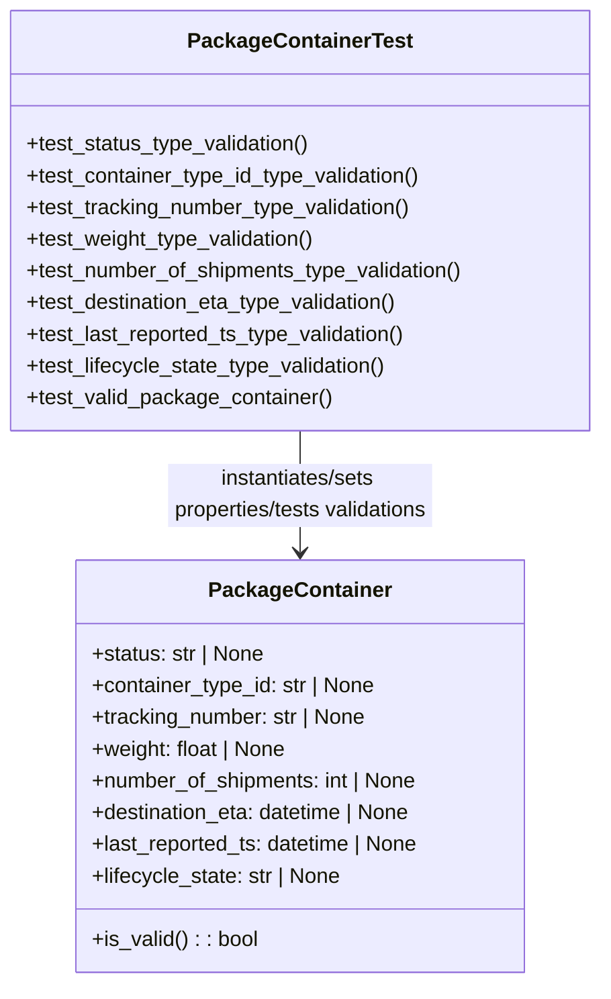

# Diagram: partview_core/partview_service/partview_service/tests/unit/core/datamodel/package_container_test.py

> Auto-generated by Obscura crawlers

## Mermaid

### SVG

<svg id="container" width="456.421875" xmlns="http://www.w3.org/2000/svg" class="classDiagram" height="768" viewBox="0 0 456.421875 768" role="graphics-document document" aria-roledescription="class"><g><defs><marker id="container_class-aggregationStart" class="marker aggregation class" refX="18" refY="7" markerWidth="190" markerHeight="240" orient="auto"><path d="M 18,7 L9,13 L1,7 L9,1 Z"></path></marker></defs><defs><marker id="container_class-aggregationEnd" class="marker aggregation class" refX="1" refY="7" markerWidth="20" markerHeight="28" orient="auto"><path d="M 18,7 L9,13 L1,7 L9,1 Z"></path></marker></defs><defs><marker id="container_class-extensionStart" class="marker extension class" refX="18" refY="7" markerWidth="190" markerHeight="240" orient="auto"><path d="M 1,7 L18,13 V 1 Z"></path></marker></defs><defs><marker id="container_class-extensionEnd" class="marker extension class" refX="1" refY="7" markerWidth="20" markerHeight="28" orient="auto"><path d="M 1,1 V 13 L18,7 Z"></path></marker></defs><defs><marker id="container_class-compositionStart" class="marker composition class" refX="18" refY="7" markerWidth="190" markerHeight="240" orient="auto"><path d="M 18,7 L9,13 L1,7 L9,1 Z"></path></marker></defs><defs><marker id="container_class-compositionEnd" class="marker composition class" refX="1" refY="7" markerWidth="20" markerHeight="28" orient="auto"><path d="M 18,7 L9,13 L1,7 L9,1 Z"></path></marker></defs><defs><marker id="container_class-dependencyStart" class="marker dependency class" refX="6" refY="7" markerWidth="190" markerHeight="240" orient="auto"><path d="M 5,7 L9,13 L1,7 L9,1 Z"></path></marker></defs><defs><marker id="container_class-dependencyEnd" class="marker dependency class" refX="13" refY="7" markerWidth="20" markerHeight="28" orient="auto"><path d="M 18,7 L9,13 L14,7 L9,1 Z"></path></marker></defs><defs><marker id="container_class-lollipopStart" class="marker lollipop class" refX="13" refY="7" markerWidth="190" markerHeight="240" orient="auto"><circle stroke="black" fill="transparent" cx="7" cy="7" r="6"></circle></marker></defs><defs><marker id="container_class-lollipopEnd" class="marker lollipop class" refX="1" refY="7" markerWidth="190" markerHeight="240" orient="auto"><circle stroke="black" fill="transparent" cx="7" cy="7" r="6"></circle></marker></defs><g class="root"><g class="clusters"></g><g class="edgePaths"><path d="M228.211,326L228.211,336.167C228.211,346.333,228.211,366.667,228.211,386C228.211,405.333,228.211,423.667,228.211,432.833L228.211,442" id="id_PackageContainerTest_PackageContainer_1" class="edge-thickness-normal edge-pattern-solid relation" style=";;;" data-edge="true" data-et="edge" data-id="id_PackageContainerTest_PackageContainer_1" data-points="W3sieCI6MjI4LjIxMDkzNzUsInkiOjMyNn0seyJ4IjoyMjguMjEwOTM3NSwieSI6Mzg3fSx7IngiOjIyOC4yMTA5Mzc1LCJ5Ijo0NDh9XQ==" marker-end="url(#container_class-dependencyEnd)"></path></g><g class="edgeLabels"><g class="edgeLabel" transform="translate(228.2109375, 387)"><g class="label" data-id="id_PackageContainerTest_PackageContainer_1" transform="translate(-100, -36)"><foreignObject width="200" height="72">

instantiates/sets properties/tests validations

</foreignObject></g></g></g><g class="nodes"><g class="node default" id="classId-PackageContainer-0" transform="translate(228.2109375, 604)"><g class="basic label-container"><path d="M-171.6484375 -156 L171.6484375 -156 L171.6484375 156 L-171.6484375 156" stroke="none" stroke-width="0" fill="#ECECFF" style=""></path><path d="M-171.6484375 -156 C-69.97484368745988 -156, 31.698750125080238 -156, 171.6484375 -156 M-171.6484375 -156 C-35.6480596671461 -156, 100.3523181657078 -156, 171.6484375 -156 M171.6484375 -156 C171.6484375 -73.88672860589239, 171.6484375 8.226542788215227, 171.6484375 156 M171.6484375 -156 C171.6484375 -53.889617751561275, 171.6484375 48.22076449687745, 171.6484375 156 M171.6484375 156 C36.307228891883454 156, -99.03397971623309 156, -171.6484375 156 M171.6484375 156 C85.26220214365235 156, -1.1240332126953092 156, -171.6484375 156 M-171.6484375 156 C-171.6484375 57.22643827908455, -171.6484375 -41.547123441830905, -171.6484375 -156 M-171.6484375 156 C-171.6484375 55.48798394458352, -171.6484375 -45.02403211083296, -171.6484375 -156" stroke="#9370DB" stroke-width="1.3" fill="none" stroke-dasharray="0 0" style=""></path></g><g class="annotation-group text" transform="translate(0, -132)"></g><g class="label-group text" transform="translate(-65.453125, -132)"><g class="label" style="font-weight: bolder" transform="translate(0,-12)"><foreignObject width="130.90625" height="24">

PackageContainer

</foreignObject></g></g><g class="members-group text" transform="translate(-159.6484375, -84)"><g class="label" style="" transform="translate(0,-12)"><foreignObject width="133.1875" height="24">

+status: str | None

</foreignObject></g><g class="label" style="" transform="translate(0,12)"><foreignObject width="218.578125" height="24">

+container_type_id: str | None

</foreignObject></g><g class="label" style="" transform="translate(0,36)"><foreignObject width="212.203125" height="24">

+tracking_number: str | None

</foreignObject></g><g class="label" style="" transform="translate(0,60)"><foreignObject width="150.671875" height="24">

+weight: float | None

</foreignObject></g><g class="label" style="" transform="translate(0,84)"><foreignObject width="251.015625" height="24">

+number_of_shipments: int | None

</foreignObject></g><g class="label" style="" transform="translate(0,108)"><foreignObject width="248.84375" height="24">

+destination_eta: datetime | None

</foreignObject></g><g class="label" style="" transform="translate(0,132)"><foreignObject width="253.84375" height="24">

+last_reported_ts: datetime | None

</foreignObject></g><g class="label" style="" transform="translate(0,156)"><foreignObject width="192.4375" height="24">

+lifecycle_state: str | None

</foreignObject></g></g><g class="methods-group text" transform="translate(-159.6484375, 132)"><g class="label" style="" transform="translate(0,-12)"><foreignObject width="126.078125" height="24">

+is_valid() : : bool

</foreignObject></g></g><g class="divider" style=""><path d="M-171.6484375 -108 C-44.39139262079452 -108, 82.86565225841096 -108, 171.6484375 -108 M-171.6484375 -108 C-96.77523150649459 -108, -21.902025512989184 -108, 171.6484375 -108" stroke="#9370DB" stroke-width="1.3" fill="none" stroke-dasharray="0 0" style=""></path></g><g class="divider" style=""><path d="M-171.6484375 108 C-88.34171919734325 108, -5.035000894686505 108, 171.6484375 108 M-171.6484375 108 C-57.32375351537402 108, 57.000930469251955 108, 171.6484375 108" stroke="#9370DB" stroke-width="1.3" fill="none" stroke-dasharray="0 0" style=""></path></g></g><g class="node default" id="classId-PackageContainerTest-1" transform="translate(228.2109375, 167)"><g class="basic label-container"><path d="M-220.2109375 -159 L220.2109375 -159 L220.2109375 159 L-220.2109375 159" stroke="none" stroke-width="0" fill="#ECECFF" style=""></path><path d="M-220.2109375 -159 C-83.10579428502652 -159, 53.99934892994696 -159, 220.2109375 -159 M-220.2109375 -159 C-84.89532376340941 -159, 50.420289973181184 -159, 220.2109375 -159 M220.2109375 -159 C220.2109375 -91.13640172521957, 220.2109375 -23.27280345043914, 220.2109375 159 M220.2109375 -159 C220.2109375 -53.09563345705966, 220.2109375 52.808733085880675, 220.2109375 159 M220.2109375 159 C126.47242956682085 159, 32.7339216336417 159, -220.2109375 159 M220.2109375 159 C68.90105479059918 159, -82.40882791880165 159, -220.2109375 159 M-220.2109375 159 C-220.2109375 36.69008551385484, -220.2109375 -85.61982897229032, -220.2109375 -159 M-220.2109375 159 C-220.2109375 93.03970924288163, -220.2109375 27.079418485763256, -220.2109375 -159" stroke="#9370DB" stroke-width="1.3" fill="none" stroke-dasharray="0 0" style=""></path></g><g class="annotation-group text" transform="translate(0, -135)"></g><g class="label-group text" transform="translate(-80.703125, -135)"><g class="label" style="font-weight: bolder" transform="translate(0,-12)"><foreignObject width="161.40625" height="24">

PackageContainerTest

</foreignObject></g></g><g class="members-group text" transform="translate(-208.2109375, -87)"></g><g class="methods-group text" transform="translate(-208.2109375, -57)"><g class="label" style="" transform="translate(0,-12)"><foreignObject width="218.140625" height="24">

+test_status_type_validation()

</foreignObject></g><g class="label" style="" transform="translate(0,12)"><foreignObject width="303.53125" height="24">

+test_container_type_id_type_validation()

</foreignObject></g><g class="label" style="" transform="translate(0,36)"><foreignObject width="295.78125" height="24">

+test_tracking_number_type_validation()

</foreignObject></g><g class="label" style="" transform="translate(0,60)"><foreignObject width="221.90625" height="24">

+test_weight_type_validation()

</foreignObject></g><g class="label" style="" transform="translate(0,84)"><foreignObject width="335.71875" height="24">

+test_number_of_shipments_type_validation()

</foreignObject></g><g class="label" style="" transform="translate(0,108)"><foreignObject width="287.953125" height="24">

+test_destination_eta_type_validation()

</foreignObject></g><g class="label" style="" transform="translate(0,132)"><foreignObject width="292.8125" height="24">

+test_last_reported_ts_type_validation()

</foreignObject></g><g class="label" style="" transform="translate(0,156)"><foreignObject width="277.21875" height="24">

+test_lifecycle_state_type_validation()

</foreignObject></g><g class="label" style="" transform="translate(0,180)"><foreignObject width="232.734375" height="24">

+test_valid_package_container()

</foreignObject></g></g><g class="divider" style=""><path d="M-220.2109375 -111 C-89.2487276944874 -111, 41.7134821110252 -111, 220.2109375 -111 M-220.2109375 -111 C-75.35981416870689 -111, 69.49130916258622 -111, 220.2109375 -111" stroke="#9370DB" stroke-width="1.3" fill="none" stroke-dasharray="0 0" style=""></path></g><g class="divider" style=""><path d="M-220.2109375 -87 C-46.174179198495835 -87, 127.86257910300833 -87, 220.2109375 -87 M-220.2109375 -87 C-97.08608140584586 -87, 26.03877468830828 -87, 220.2109375 -87" stroke="#9370DB" stroke-width="1.3" fill="none" stroke-dasharray="0 0" style=""></path></g></g></g></g></g></svg>
