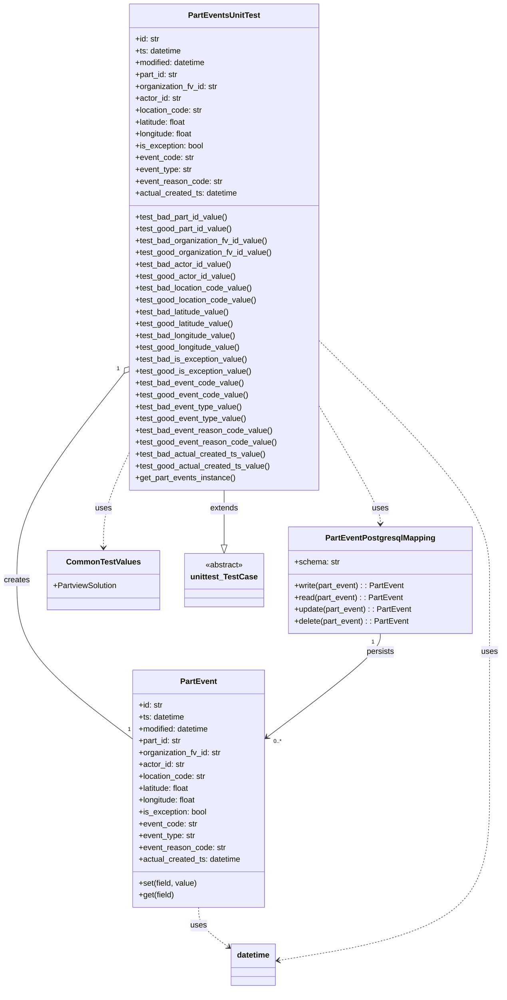

# Diagram: partview_core/partview_service/partview_service/tests/unit/core/datamodel/part_event_test.py

> Auto-generated by Obscura crawlers

## Mermaid

### SVG

<svg id="container" width="1001.4453125" xmlns="http://www.w3.org/2000/svg" class="classDiagram" height="2002" viewBox="0 0 1001.4453125 2002" role="graphics-document document" aria-roledescription="class"><g><defs><marker id="container_class-aggregationStart" class="marker aggregation class" refX="18" refY="7" markerWidth="190" markerHeight="240" orient="auto"><path d="M 18,7 L9,13 L1,7 L9,1 Z"></path></marker></defs><defs><marker id="container_class-aggregationEnd" class="marker aggregation class" refX="1" refY="7" markerWidth="20" markerHeight="28" orient="auto"><path d="M 18,7 L9,13 L1,7 L9,1 Z"></path></marker></defs><defs><marker id="container_class-extensionStart" class="marker extension class" refX="18" refY="7" markerWidth="190" markerHeight="240" orient="auto"><path d="M 1,7 L18,13 V 1 Z"></path></marker></defs><defs><marker id="container_class-extensionEnd" class="marker extension class" refX="1" refY="7" markerWidth="20" markerHeight="28" orient="auto"><path d="M 1,1 V 13 L18,7 Z"></path></marker></defs><defs><marker id="container_class-compositionStart" class="marker composition class" refX="18" refY="7" markerWidth="190" markerHeight="240" orient="auto"><path d="M 18,7 L9,13 L1,7 L9,1 Z"></path></marker></defs><defs><marker id="container_class-compositionEnd" class="marker composition class" refX="1" refY="7" markerWidth="20" markerHeight="28" orient="auto"><path d="M 18,7 L9,13 L1,7 L9,1 Z"></path></marker></defs><defs><marker id="container_class-dependencyStart" class="marker dependency class" refX="6" refY="7" markerWidth="190" markerHeight="240" orient="auto"><path d="M 5,7 L9,13 L1,7 L9,1 Z"></path></marker></defs><defs><marker id="container_class-dependencyEnd" class="marker dependency class" refX="13" refY="7" markerWidth="20" markerHeight="28" orient="auto"><path d="M 18,7 L9,13 L14,7 L9,1 Z"></path></marker></defs><defs><marker id="container_class-lollipopStart" class="marker lollipop class" refX="13" refY="7" markerWidth="190" markerHeight="240" orient="auto"><circle stroke="black" fill="transparent" cx="7" cy="7" r="6"></circle></marker></defs><defs><marker id="container_class-lollipopEnd" class="marker lollipop class" refX="1" refY="7" markerWidth="190" markerHeight="240" orient="auto"><circle stroke="black" fill="transparent" cx="7" cy="7" r="6"></circle></marker></defs><g class="root"><g class="clusters"></g><g class="edgePaths"><path d="M447.875,992L447.875,998.167C447.875,1004.333,447.875,1016.667,447.875,1035.125C447.875,1053.583,447.875,1078.167,447.875,1090.458L447.875,1102.75" id="id_PartEventsUnitTest_unittest_TestCase_1" class="edge-thickness-normal edge-pattern-solid relation" style=";;;" data-edge="true" data-et="edge" data-id="id_PartEventsUnitTest_unittest_TestCase_1" data-points="W3sieCI6NDQ3Ljg3NSwieSI6OTkyfSx7IngiOjQ0Ny44NzUsInkiOjEwMjl9LHsieCI6NDQ3Ljg3NSwieSI6MTEyMH1d" marker-end="url(#container_class-extensionEnd)"></path><path d="M247.682,755.986L212.097,801.488C176.512,846.99,105.342,937.995,69.757,1007.664C34.172,1077.333,34.172,1125.667,34.172,1174C34.172,1222.333,34.172,1270.667,72.131,1323.871C110.09,1377.075,186.009,1435.149,223.968,1464.186L261.928,1493.224" id="id_PartEventsUnitTest_PartEvent_2" class="edge-thickness-normal edge-pattern-solid relation" style=";;;" data-edge="true" data-et="edge" data-id="id_PartEventsUnitTest_PartEvent_2" data-points="W3sieCI6MjU4LjMwODU5Mzc1LCJ5Ijo3NDIuMzk3NTYyMDM0OTczOH0seyJ4IjozNC4xNzE4NzUsInkiOjEwMjl9LHsieCI6MzQuMTcxODc1LCJ5IjoxMTc0fSx7IngiOjM0LjE3MTg3NSwieSI6MTMxOX0seyJ4IjoyNjEuOTI3NzM0Mzc1LCJ5IjoxNDkzLjIyMzY5MzUwNzU4NjJ9XQ==" marker-start="url(#container_class-aggregationStart)"></path><path d="M258.309,918.278L249.945,936.732C241.582,955.186,224.855,992.093,216.492,1023.713C208.129,1055.333,208.129,1081.667,208.129,1094.833L208.129,1108" id="id_PartEventsUnitTest_CommonTestValues_3" class="edge-thickness-normal edge-pattern-dashed relation" style=";;;" data-edge="true" data-et="edge" data-id="id_PartEventsUnitTest_CommonTestValues_3" data-points="W3sieCI6MjU4LjMwODU5Mzc1LCJ5Ijo5MTguMjc4NDY4NDMxNzcxOX0seyJ4IjoyMDguMTI4OTA2MjUsInkiOjEwMjl9LHsieCI6MjA4LjEyODkwNjI1LCJ5IjoxMTE0fV0=" marker-end="url(#container_class-dependencyEnd)"></path><path d="M637.441,822.945L657.6,857.287C677.759,891.63,718.077,960.315,738.236,999.824C758.395,1039.333,758.395,1049.667,758.395,1054.833L758.395,1060" id="id_PartEventsUnitTest_PartEventPostgresqlMapping_4" class="edge-thickness-normal edge-pattern-dashed relation" style=";;;" data-edge="true" data-et="edge" data-id="id_PartEventsUnitTest_PartEventPostgresqlMapping_4" data-points="W3sieCI6NjM3LjQ0MTQwNjI1LCJ5Ijo4MjIuOTQ0Njc0MzczODQ0Mn0seyJ4Ijo3NTguMzk0NTMxMjUsInkiOjEwMjl9LHsieCI6NzU4LjM5NDUzMTI1LCJ5IjoxMDY2fV0=" marker-end="url(#container_class-dependencyEnd)"></path><path d="M758.395,1282L758.395,1288.167C758.395,1294.333,758.395,1306.667,721.229,1341.263C684.064,1375.859,609.734,1432.719,572.569,1461.149L535.404,1489.578" id="id_PartEventPostgresqlMapping_PartEvent_5" class="edge-thickness-normal edge-pattern-solid relation" style=";;;" data-edge="true" data-et="edge" data-id="id_PartEventPostgresqlMapping_PartEvent_5" data-points="W3sieCI6NzU4LjM5NDUzMTI1LCJ5IjoxMjgyfSx7IngiOjc1OC4zOTQ1MzEyNSwieSI6MTMxOX0seyJ4Ijo1MzAuNjM4NjcxODc1LCJ5IjoxNDkzLjIyMzY5MzUwNzU4NjJ9XQ==" marker-end="url(#container_class-dependencyEnd)"></path><path d="M396.283,1836L396.283,1842.167C396.283,1848.333,396.283,1860.667,406.174,1873.984C416.065,1887.301,435.848,1901.602,445.739,1908.752L455.63,1915.903" id="id_PartEvent_datetime_6" class="edge-thickness-normal edge-pattern-dashed relation" style=";;;" data-edge="true" data-et="edge" data-id="id_PartEvent_datetime_6" data-points="W3sieCI6Mzk2LjI4MzIwMzEyNSwieSI6MTgzNn0seyJ4IjozOTYuMjgzMjAzMTI1LCJ5IjoxODczfSx7IngiOjQ2MC40OTIxODc1LCJ5IjoxOTE5LjQxNzg0Nzc1OTY0Njd9XQ==" marker-end="url(#container_class-dependencyEnd)"></path><path d="M637.441,689.538L694.027,746.115C750.612,802.692,863.783,915.846,920.368,996.59C976.953,1077.333,976.953,1125.667,976.953,1174C976.953,1222.333,976.953,1270.667,976.953,1341C976.953,1411.333,976.953,1503.667,976.953,1596C976.953,1688.333,976.953,1780.667,906.886,1838.576C836.819,1896.485,696.685,1919.97,626.617,1931.712L556.55,1943.455" id="id_PartEventsUnitTest_datetime_7" class="edge-thickness-normal edge-pattern-dashed relation" style=";;;" data-edge="true" data-et="edge" data-id="id_PartEventsUnitTest_datetime_7" data-points="W3sieCI6NjM3LjQ0MTQwNjI1LCJ5Ijo2ODkuNTM4NDE0NDAwMDQ3M30seyJ4Ijo5NzYuOTUzMTI1LCJ5IjoxMDI5fSx7IngiOjk3Ni45NTMxMjUsInkiOjExNzR9LHsieCI6OTc2Ljk1MzEyNSwieSI6MTMxOX0seyJ4Ijo5NzYuOTUzMTI1LCJ5IjoxNTk2fSx7IngiOjk3Ni45NTMxMjUsInkiOjE4NzN9LHsieCI6NTUwLjYzMjgxMjUsInkiOjE5NDQuNDQ2NzAwMjU1MjI5fV0=" marker-end="url(#container_class-dependencyEnd)"></path></g><g class="edgeLabels"><g class="edgeLabel" transform="translate(447.875, 1029)"><g class="label" data-id="id_PartEventsUnitTest_unittest_TestCase_1" transform="translate(-28.5078125, -12)"><foreignObject width="57.015625" height="24">

extends

</foreignObject></g></g><g class="edgeLabel" transform="translate(34.171875, 1174)"><g class="label" data-id="id_PartEventsUnitTest_PartEvent_2" transform="translate(-26.171875, -12)"><foreignObject width="52.34375" height="24">

creates

</foreignObject></g></g><g class="edgeLabel" transform="translate(208.12890625, 1029)"><g class="label" data-id="id_PartEventsUnitTest_CommonTestValues_3" transform="translate(-16.4921875, -12)"><foreignObject width="32.984375" height="24">

uses

</foreignObject></g></g><g class="edgeLabel" transform="translate(758.39453125, 1029)"><g class="label" data-id="id_PartEventsUnitTest_PartEventPostgresqlMapping_4" transform="translate(-16.4921875, -12)"><foreignObject width="32.984375" height="24">

uses

</foreignObject></g></g><g class="edgeLabel" transform="translate(758.39453125, 1319)"><g class="label" data-id="id_PartEventPostgresqlMapping_PartEvent_5" transform="translate(-28.4375, -12)"><foreignObject width="56.875" height="24">

persists

</foreignObject></g></g><g class="edgeLabel" transform="translate(396.283203125, 1873)"><g class="label" data-id="id_PartEvent_datetime_6" transform="translate(-16.4921875, -12)"><foreignObject width="32.984375" height="24">

uses

</foreignObject></g></g><g class="edgeLabel" transform="translate(976.953125, 1319)"><g class="label" data-id="id_PartEventsUnitTest_datetime_7" transform="translate(-16.4921875, -12)"><foreignObject width="32.984375" height="24">

uses

</foreignObject></g></g><g class="edgeTerminals" transform="translate(235.71220530070568, 746.9421386143333)"><g class="inner" transform="translate(0, 0)"><foreignObject style="width: 9px; height: 12px;">
1
</foreignObject></g></g><g class="edgeTerminals" transform="translate(743.394530625, 1299.4999994642858)"><g class="inner" transform="translate(0, 0)"><foreignObject style="width: 9px; height: 12px;">
1
</foreignObject></g></g><g class="edgeTerminals" transform="translate(252.141807856352, 1465.6771878929558)"><g class="inner" transform="translate(0, 0)"></g><foreignObject style="width: 9px; height: 12px;">
1
</foreignObject></g><g class="edgeTerminals" transform="translate(548.6518878989621, 1489.5050246258381)"><g class="inner" transform="translate(0, 0)"></g><foreignObject style="width: 36px; height: 12px;">
0..*
</foreignObject></g></g><g class="nodes"><g class="node default" id="classId-PartEventsUnitTest-0" transform="translate(447.875, 500)"><g class="basic label-container"><path d="M-189.56640625 -492 L189.56640625 -492 L189.56640625 492 L-189.56640625 492" stroke="none" stroke-width="0" fill="#ECECFF" style=""></path><path d="M-189.56640625 -492 C-46.09681917807427 -492, 97.37276789385146 -492, 189.56640625 -492 M-189.56640625 -492 C-74.58191335732694 -492, 40.40257953534612 -492, 189.56640625 -492 M189.56640625 -492 C189.56640625 -289.924960290887, 189.56640625 -87.84992058177397, 189.56640625 492 M189.56640625 -492 C189.56640625 -189.07331411477747, 189.56640625 113.85337177044505, 189.56640625 492 M189.56640625 492 C88.89448243639706 492, -11.77744137720589 492, -189.56640625 492 M189.56640625 492 C84.03043883315809 492, -21.505528583683827 492, -189.56640625 492 M-189.56640625 492 C-189.56640625 198.88322856101655, -189.56640625 -94.2335428779669, -189.56640625 -492 M-189.56640625 492 C-189.56640625 125.44517256750436, -189.56640625 -241.10965486499128, -189.56640625 -492" stroke="#9370DB" stroke-width="1.3" fill="none" stroke-dasharray="0 0" style=""></path></g><g class="annotation-group text" transform="translate(0, -468)"></g><g class="label-group text" transform="translate(-69.5546875, -468)"><g class="label" style="font-weight: bolder" transform="translate(0,-12)"><foreignObject width="139.109375" height="24">

PartEventsUnitTest

</foreignObject></g></g><g class="members-group text" transform="translate(-177.56640625, -420)"><g class="label" style="" transform="translate(0,-12)"><foreignObject width="49.578125" height="24">

+id: str

</foreignObject></g><g class="label" style="" transform="translate(0,12)"><foreignObject width="94.484375" height="24">

+ts: datetime

</foreignObject></g><g class="label" style="" transform="translate(0,36)"><foreignObject width="145.9375" height="24">

+modified: datetime

</foreignObject></g><g class="label" style="" transform="translate(0,60)"><foreignObject width="87.890625" height="24">

+part_id: str

</foreignObject></g><g class="label" style="" transform="translate(0,84)"><foreignObject width="169" height="24">

+organization_fv_id: str

</foreignObject></g><g class="label" style="" transform="translate(0,108)"><foreignObject width="93.78125" height="24">

+actor_id: str

</foreignObject></g><g class="label" style="" transform="translate(0,132)"><foreignObject width="137.609375" height="24">

+location_code: str

</foreignObject></g><g class="label" style="" transform="translate(0,156)"><foreignObject width="106.109375" height="24">

+latitude: float

</foreignObject></g><g class="label" style="" transform="translate(0,180)"><foreignObject width="118.65625" height="24">

+longitude: float

</foreignObject></g><g class="label" style="" transform="translate(0,204)"><foreignObject width="139.375" height="24">

+is_exception: bool

</foreignObject></g><g class="label" style="" transform="translate(0,228)"><foreignObject width="118.796875" height="24">

+event_code: str

</foreignObject></g><g class="label" style="" transform="translate(0,252)"><foreignObject width="115.625" height="24">

+event_type: str

</foreignObject></g><g class="label" style="" transform="translate(0,276)"><foreignObject width="176.109375" height="24">

+event_reason_code: str

</foreignObject></g><g class="label" style="" transform="translate(0,300)"><foreignObject width="209.4375" height="24">

+actual_created_ts: datetime

</foreignObject></g></g><g class="methods-group text" transform="translate(-177.56640625, -60)"><g class="label" style="" transform="translate(0,-12)"><foreignObject width="189.15625" height="24">

+test_bad_part_id_value()

</foreignObject></g><g class="label" style="" transform="translate(0,12)"><foreignObject width="198.015625" height="24">

+test_good_part_id_value()

</foreignObject></g><g class="label" style="" transform="translate(0,36)"><foreignObject width="269.9375" height="24">

+test_bad_organization_fv_id_value()

</foreignObject></g><g class="label" style="" transform="translate(0,60)"><foreignObject width="278.796875" height="24">

+test_good_organization_fv_id_value()

</foreignObject></g><g class="label" style="" transform="translate(0,84)"><foreignObject width="194.96875" height="24">

+test_bad_actor_id_value()

</foreignObject></g><g class="label" style="" transform="translate(0,108)"><foreignObject width="203.8125" height="24">

+test_good_actor_id_value()

</foreignObject></g><g class="label" style="" transform="translate(0,132)"><foreignObject width="238.390625" height="24">

+test_bad_location_code_value()

</foreignObject></g><g class="label" style="" transform="translate(0,156)"><foreignObject width="247.234375" height="24">

+test_good_location_code_value()

</foreignObject></g><g class="label" style="" transform="translate(0,180)"><foreignObject width="193.25" height="24">

+test_bad_latitude_value()

</foreignObject></g><g class="label" style="" transform="translate(0,204)"><foreignObject width="202.109375" height="24">

+test_good_latitude_value()

</foreignObject></g><g class="label" style="" transform="translate(0,228)"><foreignObject width="205.8125" height="24">

+test_bad_longitude_value()

</foreignObject></g><g class="label" style="" transform="translate(0,252)"><foreignObject width="214.671875" height="24">

+test_good_longitude_value()

</foreignObject></g><g class="label" style="" transform="translate(0,276)"><foreignObject width="227.171875" height="24">

+test_bad_is_exception_value()

</foreignObject></g><g class="label" style="" transform="translate(0,300)"><foreignObject width="236.03125" height="24">

+test_good_is_exception_value()

</foreignObject></g><g class="label" style="" transform="translate(0,324)"><foreignObject width="219.421875" height="24">

+test_bad_event_code_value()

</foreignObject></g><g class="label" style="" transform="translate(0,348)"><foreignObject width="228.265625" height="24">

+test_good_event_code_value()

</foreignObject></g><g class="label" style="" transform="translate(0,372)"><foreignObject width="216.25" height="24">

+test_bad_event_type_value()

</foreignObject></g><g class="label" style="" transform="translate(0,396)"><foreignObject width="225.09375" height="24">

+test_good_event_type_value()

</foreignObject></g><g class="label" style="" transform="translate(0,420)"><foreignObject width="276.734375" height="24">

+test_bad_event_reason_code_value()

</foreignObject></g><g class="label" style="" transform="translate(0,444)"><foreignObject width="285.578125" height="24">

+test_good_event_reason_code_value()

</foreignObject></g><g class="label" style="" transform="translate(0,468)"><foreignObject width="264.46875" height="24">

+test_bad_actual_created_ts_value()

</foreignObject></g><g class="label" style="" transform="translate(0,492)"><foreignObject width="273.328125" height="24">

+test_good_actual_created_ts_value()

</foreignObject></g><g class="label" style="" transform="translate(0,516)"><foreignObject width="204.203125" height="24">

+get_part_events_instance()

</foreignObject></g></g><g class="divider" style=""><path d="M-189.56640625 -444 C-86.14156227253078 -444, 17.283281704938446 -444, 189.56640625 -444 M-189.56640625 -444 C-97.5101606592616 -444, -5.453915068523202 -444, 189.56640625 -444" stroke="#9370DB" stroke-width="1.3" fill="none" stroke-dasharray="0 0" style=""></path></g><g class="divider" style=""><path d="M-189.56640625 -84 C-56.24577004805113 -84, 77.07486615389774 -84, 189.56640625 -84 M-189.56640625 -84 C-47.34850455133409 -84, 94.86939714733182 -84, 189.56640625 -84" stroke="#9370DB" stroke-width="1.3" fill="none" stroke-dasharray="0 0" style=""></path></g></g><g class="node default" id="classId-PartEvent-1" transform="translate(396.283203125, 1596)"><g class="basic label-container"><path d="M-134.35546875 -240 L134.35546875 -240 L134.35546875 240 L-134.35546875 240" stroke="none" stroke-width="0" fill="#ECECFF" style=""></path><path d="M-134.35546875 -240 C-29.77346782435822 -240, 74.80853310128356 -240, 134.35546875 -240 M-134.35546875 -240 C-34.32152980095141 -240, 65.71240914809718 -240, 134.35546875 -240 M134.35546875 -240 C134.35546875 -57.783329520407904, 134.35546875 124.43334095918419, 134.35546875 240 M134.35546875 -240 C134.35546875 -75.79354994601033, 134.35546875 88.41290010797934, 134.35546875 240 M134.35546875 240 C67.59265731582246 240, 0.8298458816449283 240, -134.35546875 240 M134.35546875 240 C71.08847241167717 240, 7.821476073354361 240, -134.35546875 240 M-134.35546875 240 C-134.35546875 84.75291318008823, -134.35546875 -70.49417363982354, -134.35546875 -240 M-134.35546875 240 C-134.35546875 60.219988436229926, -134.35546875 -119.56002312754015, -134.35546875 -240" stroke="#9370DB" stroke-width="1.3" fill="none" stroke-dasharray="0 0" style=""></path></g><g class="annotation-group text" transform="translate(0, -216)"></g><g class="label-group text" transform="translate(-35.2734375, -216)"><g class="label" style="font-weight: bolder" transform="translate(0,-12)"><foreignObject width="70.546875" height="24">

PartEvent

</foreignObject></g></g><g class="members-group text" transform="translate(-122.35546875, -168)"><g class="label" style="" transform="translate(0,-12)"><foreignObject width="49.578125" height="24">

+id: str

</foreignObject></g><g class="label" style="" transform="translate(0,12)"><foreignObject width="94.484375" height="24">

+ts: datetime

</foreignObject></g><g class="label" style="" transform="translate(0,36)"><foreignObject width="145.9375" height="24">

+modified: datetime

</foreignObject></g><g class="label" style="" transform="translate(0,60)"><foreignObject width="87.890625" height="24">

+part_id: str

</foreignObject></g><g class="label" style="" transform="translate(0,84)"><foreignObject width="169" height="24">

+organization_fv_id: str

</foreignObject></g><g class="label" style="" transform="translate(0,108)"><foreignObject width="93.78125" height="24">

+actor_id: str

</foreignObject></g><g class="label" style="" transform="translate(0,132)"><foreignObject width="137.609375" height="24">

+location_code: str

</foreignObject></g><g class="label" style="" transform="translate(0,156)"><foreignObject width="106.109375" height="24">

+latitude: float

</foreignObject></g><g class="label" style="" transform="translate(0,180)"><foreignObject width="118.65625" height="24">

+longitude: float

</foreignObject></g><g class="label" style="" transform="translate(0,204)"><foreignObject width="139.375" height="24">

+is_exception: bool

</foreignObject></g><g class="label" style="" transform="translate(0,228)"><foreignObject width="118.796875" height="24">

+event_code: str

</foreignObject></g><g class="label" style="" transform="translate(0,252)"><foreignObject width="115.625" height="24">

+event_type: str

</foreignObject></g><g class="label" style="" transform="translate(0,276)"><foreignObject width="176.109375" height="24">

+event_reason_code: str

</foreignObject></g><g class="label" style="" transform="translate(0,300)"><foreignObject width="209.4375" height="24">

+actual_created_ts: datetime

</foreignObject></g></g><g class="methods-group text" transform="translate(-122.35546875, 192)"><g class="label" style="" transform="translate(0,-12)"><foreignObject width="119.390625" height="24">

+set(field, value)

</foreignObject></g><g class="label" style="" transform="translate(0,12)"><foreignObject width="73.015625" height="24">

+get(field)

</foreignObject></g></g><g class="divider" style=""><path d="M-134.35546875 -192 C-38.13147581034336 -192, 58.09251712931328 -192, 134.35546875 -192 M-134.35546875 -192 C-26.900352642915564 -192, 80.55476346416887 -192, 134.35546875 -192" stroke="#9370DB" stroke-width="1.3" fill="none" stroke-dasharray="0 0" style=""></path></g><g class="divider" style=""><path d="M-134.35546875 168 C-68.31481305571135 168, -2.2741573614227093 168, 134.35546875 168 M-134.35546875 168 C-62.19769899849767 168, 9.960070753004658 168, 134.35546875 168" stroke="#9370DB" stroke-width="1.3" fill="none" stroke-dasharray="0 0" style=""></path></g></g><g class="node default" id="classId-PartEventPostgresqlMapping-2" transform="translate(758.39453125, 1174)"><g class="basic label-container"><path d="M-183.55859375 -108 L183.55859375 -108 L183.55859375 108 L-183.55859375 108" stroke="none" stroke-width="0" fill="#ECECFF" style=""></path><path d="M-183.55859375 -108 C-88.0573216831377 -108, 7.443950383724598 -108, 183.55859375 -108 M-183.55859375 -108 C-81.48170462201323 -108, 20.59518450597355 -108, 183.55859375 -108 M183.55859375 -108 C183.55859375 -29.614207490674502, 183.55859375 48.771585018650995, 183.55859375 108 M183.55859375 -108 C183.55859375 -23.171353679238436, 183.55859375 61.65729264152313, 183.55859375 108 M183.55859375 108 C98.89196296469495 108, 14.225332179389909 108, -183.55859375 108 M183.55859375 108 C75.19551529090127 108, -33.16756316819746 108, -183.55859375 108 M-183.55859375 108 C-183.55859375 30.00812465627547, -183.55859375 -47.98375068744906, -183.55859375 -108 M-183.55859375 108 C-183.55859375 28.254994297969887, -183.55859375 -51.490011404060226, -183.55859375 -108" stroke="#9370DB" stroke-width="1.3" fill="none" stroke-dasharray="0 0" style=""></path></g><g class="annotation-group text" transform="translate(0, -84)"></g><g class="label-group text" transform="translate(-105.6796875, -84)"><g class="label" style="font-weight: bolder" transform="translate(0,-12)"><foreignObject width="211.359375" height="24">

PartEventPostgresqlMapping

</foreignObject></g></g><g class="members-group text" transform="translate(-171.55859375, -36)"><g class="label" style="" transform="translate(0,-12)"><foreignObject width="91.125" height="24">

+schema: str

</foreignObject></g></g><g class="methods-group text" transform="translate(-171.55859375, 12)"><g class="label" style="" transform="translate(0,-12)"><foreignObject width="222.5" height="24">

+write(part_event) : : PartEvent

</foreignObject></g><g class="label" style="" transform="translate(0,12)"><foreignObject width="218.609375" height="24">

+read(part_event) : : PartEvent

</foreignObject></g><g class="label" style="" transform="translate(0,36)"><foreignObject width="237.4375" height="24">

+update(part_event) : : PartEvent

</foreignObject></g><g class="label" style="" transform="translate(0,60)"><foreignObject width="231.953125" height="24">

+delete(part_event) : : PartEvent

</foreignObject></g></g><g class="divider" style=""><path d="M-183.55859375 -60 C-37.33639962525106 -60, 108.88579449949788 -60, 183.55859375 -60 M-183.55859375 -60 C-71.4655006063443 -60, 40.627592537311386 -60, 183.55859375 -60" stroke="#9370DB" stroke-width="1.3" fill="none" stroke-dasharray="0 0" style=""></path></g><g class="divider" style=""><path d="M-183.55859375 -12 C-59.856113919174945 -12, 63.84636591165011 -12, 183.55859375 -12 M-183.55859375 -12 C-106.1180077154272 -12, -28.677421680854394 -12, 183.55859375 -12" stroke="#9370DB" stroke-width="1.3" fill="none" stroke-dasharray="0 0" style=""></path></g></g><g class="node default" id="classId-CommonTestValues-3" transform="translate(208.12890625, 1174)"><g class="basic label-container"><path d="M-112.78515625 -60 L112.78515625 -60 L112.78515625 60 L-112.78515625 60" stroke="none" stroke-width="0" fill="#ECECFF" style=""></path><path d="M-112.78515625 -60 C-60.647599079509945 -60, -8.51004190901989 -60, 112.78515625 -60 M-112.78515625 -60 C-28.200082452988568 -60, 56.384991344022865 -60, 112.78515625 -60 M112.78515625 -60 C112.78515625 -31.871126359243746, 112.78515625 -3.7422527184874923, 112.78515625 60 M112.78515625 -60 C112.78515625 -19.250648951221997, 112.78515625 21.498702097556006, 112.78515625 60 M112.78515625 60 C43.43889107548297 60, -25.907374099034058 60, -112.78515625 60 M112.78515625 60 C66.39720785023812 60, 20.00925945047625 60, -112.78515625 60 M-112.78515625 60 C-112.78515625 25.50565248755442, -112.78515625 -8.988695024891157, -112.78515625 -60 M-112.78515625 60 C-112.78515625 27.681119082036844, -112.78515625 -4.637761835926312, -112.78515625 -60" stroke="#9370DB" stroke-width="1.3" fill="none" stroke-dasharray="0 0" style=""></path></g><g class="annotation-group text" transform="translate(0, -36)"></g><g class="label-group text" transform="translate(-70.9453125, -36)"><g class="label" style="font-weight: bolder" transform="translate(0,-12)"><foreignObject width="141.890625" height="24">

CommonTestValues

</foreignObject></g></g><g class="members-group text" transform="translate(-100.78515625, 12)"><g class="label" style="" transform="translate(0,-12)"><foreignObject width="130.625" height="24">

+PartviewSolution

</foreignObject></g></g><g class="methods-group text" transform="translate(-100.78515625, 60)"></g><g class="divider" style=""><path d="M-112.78515625 -12 C-59.918694874514934 -12, -7.052233499029867 -12, 112.78515625 -12 M-112.78515625 -12 C-30.47004115207514 -12, 51.84507394584972 -12, 112.78515625 -12" stroke="#9370DB" stroke-width="1.3" fill="none" stroke-dasharray="0 0" style=""></path></g><g class="divider" style=""><path d="M-112.78515625 36 C-24.512272607204594 36, 63.76061103559081 36, 112.78515625 36 M-112.78515625 36 C-52.60717022157228 36, 7.570815806855435 36, 112.78515625 36" stroke="#9370DB" stroke-width="1.3" fill="none" stroke-dasharray="0 0" style=""></path></g></g><g class="node default" id="classId-unittest_TestCase-4" transform="translate(447.875, 1174)"><g class="basic label-container"><path d="M-76.9609375 -54 L76.9609375 -54 L76.9609375 54 L-76.9609375 54" stroke="none" stroke-width="0" fill="#ECECFF" style=""></path><path d="M-76.9609375 -54 C-18.69300902454023 -54, 39.57491945091954 -54, 76.9609375 -54 M-76.9609375 -54 C-43.46941597294019 -54, -9.97789444588038 -54, 76.9609375 -54 M76.9609375 -54 C76.9609375 -10.907834936509431, 76.9609375 32.18433012698114, 76.9609375 54 M76.9609375 -54 C76.9609375 -15.168508013460865, 76.9609375 23.66298397307827, 76.9609375 54 M76.9609375 54 C33.56405658771154 54, -9.832824324576919 54, -76.9609375 54 M76.9609375 54 C29.38210769092712 54, -18.196722118145757 54, -76.9609375 54 M-76.9609375 54 C-76.9609375 27.722189119740023, -76.9609375 1.444378239480045, -76.9609375 -54 M-76.9609375 54 C-76.9609375 17.361133973954942, -76.9609375 -19.277732052090116, -76.9609375 -54" stroke="#9370DB" stroke-width="1.3" fill="none" stroke-dasharray="0 0" style=""></path></g><g class="annotation-group text" transform="translate(-38.609375, -30)"><g class="label" style="" transform="translate(0,-12)"><foreignObject width="77.21875" height="24">

«abstract»

</foreignObject></g></g><g class="label-group text" transform="translate(-64.9609375, -6)"><g class="label" style="font-weight: bolder" transform="translate(0,-12)"><foreignObject width="129.921875" height="24">

unittest_TestCase

</foreignObject></g></g><g class="members-group text" transform="translate(-64.9609375, 42)"></g><g class="methods-group text" transform="translate(-64.9609375, 72)"></g><g class="divider" style=""><path d="M-76.9609375 18 C-32.247856476600155 18, 12.46522454679969 18, 76.9609375 18 M-76.9609375 18 C-32.22076662161188 18, 12.519404256776241 18, 76.9609375 18" stroke="#9370DB" stroke-width="1.3" fill="none" stroke-dasharray="0 0" style=""></path></g><g class="divider" style=""><path d="M-76.9609375 36 C-31.633535227903828 36, 13.693867044192345 36, 76.9609375 36 M-76.9609375 36 C-30.733657563566574 36, 15.493622372866852 36, 76.9609375 36" stroke="#9370DB" stroke-width="1.3" fill="none" stroke-dasharray="0 0" style=""></path></g></g><g class="node default" id="classId-datetime-5" transform="translate(505.5625, 1952)"><g class="basic label-container"><path d="M-45.0703125 -42 L45.0703125 -42 L45.0703125 42 L-45.0703125 42" stroke="none" stroke-width="0" fill="#ECECFF" style=""></path><path d="M-45.0703125 -42 C-16.936685802273377 -42, 11.196940895453245 -42, 45.0703125 -42 M-45.0703125 -42 C-16.245874092780276 -42, 12.578564314439447 -42, 45.0703125 -42 M45.0703125 -42 C45.0703125 -10.760179826517355, 45.0703125 20.47964034696529, 45.0703125 42 M45.0703125 -42 C45.0703125 -10.12554959624573, 45.0703125 21.74890080750854, 45.0703125 42 M45.0703125 42 C13.353342689062789 42, -18.363627121874423 42, -45.0703125 42 M45.0703125 42 C26.224511005961855 42, 7.378709511923709 42, -45.0703125 42 M-45.0703125 42 C-45.0703125 23.894737040389266, -45.0703125 5.7894740807785325, -45.0703125 -42 M-45.0703125 42 C-45.0703125 11.814565083939243, -45.0703125 -18.370869832121514, -45.0703125 -42" stroke="#9370DB" stroke-width="1.3" fill="none" stroke-dasharray="0 0" style=""></path></g><g class="annotation-group text" transform="translate(0, -18)"></g><g class="label-group text" transform="translate(-33.0703125, -18)"><g class="label" style="font-weight: bolder" transform="translate(0,-12)"><foreignObject width="66.140625" height="24">

datetime

</foreignObject></g></g><g class="members-group text" transform="translate(-33.0703125, 30)"></g><g class="methods-group text" transform="translate(-33.0703125, 60)"></g><g class="divider" style=""><path d="M-45.0703125 6 C-15.248251035994258 6, 14.573810428011484 6, 45.0703125 6 M-45.0703125 6 C-9.942395222870658 6, 25.185522054258684 6, 45.0703125 6" stroke="#9370DB" stroke-width="1.3" fill="none" stroke-dasharray="0 0" style=""></path></g><g class="divider" style=""><path d="M-45.0703125 24 C-23.33909795862478 24, -1.6078834172495604 24, 45.0703125 24 M-45.0703125 24 C-18.009580850151508 24, 9.051150799696984 24, 45.0703125 24" stroke="#9370DB" stroke-width="1.3" fill="none" stroke-dasharray="0 0" style=""></path></g></g></g></g></g></svg>
