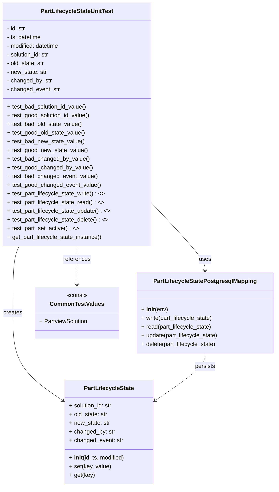

# Diagram: partview_core/partview_service/partview_service/tests/unit/core/datamodel/part_lifecycle_state_test.py


> Auto-generated by Obscura crawlers

## Diagram 1



### SVG

<svg id="container" width="761.6875" xmlns="http://www.w3.org/2000/svg" class="classDiagram" height="1346" viewBox="0 0 761.6875 1346" role="graphics-document document" aria-roledescription="class"><style>#container{font-family:"trebuchet ms",verdana,arial,sans-serif;font-size:16px;fill:#333;}@keyframes edge-animation-frame{from{stroke-dashoffset:0;}}@keyframes dash{to{stroke-dashoffset:0;}}#container .edge-animation-slow{stroke-dasharray:9,5!important;stroke-dashoffset:900;animation:dash 50s linear infinite;stroke-linecap:round;}#container .edge-animation-fast{stroke-dasharray:9,5!important;stroke-dashoffset:900;animation:dash 20s linear infinite;stroke-linecap:round;}#container .error-icon{fill:#552222;}#container .error-text{fill:#552222;stroke:#552222;}#container .edge-thickness-normal{stroke-width:1px;}#container .edge-thickness-thick{stroke-width:3.5px;}#container .edge-pattern-solid{stroke-dasharray:0;}#container .edge-thickness-invisible{stroke-width:0;fill:none;}#container .edge-pattern-dashed{stroke-dasharray:3;}#container .edge-pattern-dotted{stroke-dasharray:2;}#container .marker{fill:#333333;stroke:#333333;}#container .marker.cross{stroke:#333333;}#container svg{font-family:"trebuchet ms",verdana,arial,sans-serif;font-size:16px;}#container p{margin:0;}#container g.classGroup text{fill:#9370DB;stroke:none;font-family:"trebuchet ms",verdana,arial,sans-serif;font-size:10px;}#container g.classGroup text .title{font-weight:bolder;}#container .nodeLabel,#container .edgeLabel{color:#131300;}#container .edgeLabel .label rect{fill:#ECECFF;}#container .label text{fill:#131300;}#container .labelBkg{background:#ECECFF;}#container .edgeLabel .label span{background:#ECECFF;}#container .classTitle{font-weight:bolder;}#container .node rect,#container .node circle,#container .node ellipse,#container .node polygon,#container .node path{fill:#ECECFF;stroke:#9370DB;stroke-width:1px;}#container .divider{stroke:#9370DB;stroke-width:1;}#container g.clickable{cursor:pointer;}#container g.classGroup rect{fill:#ECECFF;stroke:#9370DB;}#container g.classGroup line{stroke:#9370DB;stroke-width:1;}#container .classLabel .box{stroke:none;stroke-width:0;fill:#ECECFF;opacity:0.5;}#container .classLabel .label{fill:#9370DB;font-size:10px;}#container .relation{stroke:#333333;stroke-width:1;fill:none;}#container .dashed-line{stroke-dasharray:3;}#container .dotted-line{stroke-dasharray:1 2;}#container #compositionStart,#container .composition{fill:#333333!important;stroke:#333333!important;stroke-width:1;}#container #compositionEnd,#container .composition{fill:#333333!important;stroke:#333333!important;stroke-width:1;}#container #dependencyStart,#container .dependency{fill:#333333!important;stroke:#333333!important;stroke-width:1;}#container #dependencyStart,#container .dependency{fill:#333333!important;stroke:#333333!important;stroke-width:1;}#container #extensionStart,#container .extension{fill:transparent!important;stroke:#333333!important;stroke-width:1;}#container #extensionEnd,#container .extension{fill:transparent!important;stroke:#333333!important;stroke-width:1;}#container #aggregationStart,#container .aggregation{fill:transparent!important;stroke:#333333!important;stroke-width:1;}#container #aggregationEnd,#container .aggregation{fill:transparent!important;stroke:#333333!important;stroke-width:1;}#container #lollipopStart,#container .lollipop{fill:#ECECFF!important;stroke:#333333!important;stroke-width:1;}#container #lollipopEnd,#container .lollipop{fill:#ECECFF!important;stroke:#333333!important;stroke-width:1;}#container .edgeTerminals{font-size:11px;line-height:initial;}#container .classTitleText{text-anchor:middle;font-size:18px;fill:#333;}#container .label-icon{display:inline-block;height:1em;overflow:visible;vertical-align:-0.125em;}#container .node .label-icon path{fill:currentColor;stroke:revert;stroke-width:revert;}#container :root{--mermaid-font-family:"trebuchet ms",verdana,arial,sans-serif;}</style><g><defs><marker id="container_class-aggregationStart" class="marker aggregation class" refX="18" refY="7" markerWidth="190" markerHeight="240" orient="auto"><path d="M 18,7 L9,13 L1,7 L9,1 Z"></path></marker></defs><defs><marker id="container_class-aggregationEnd" class="marker aggregation class" refX="1" refY="7" markerWidth="20" markerHeight="28" orient="auto"><path d="M 18,7 L9,13 L1,7 L9,1 Z"></path></marker></defs><defs><marker id="container_class-extensionStart" class="marker extension class" refX="18" refY="7" markerWidth="190" markerHeight="240" orient="auto"><path d="M 1,7 L18,13 V 1 Z"></path></marker></defs><defs><marker id="container_class-extensionEnd" class="marker extension class" refX="1" refY="7" markerWidth="20" markerHeight="28" orient="auto"><path d="M 1,1 V 13 L18,7 Z"></path></marker></defs><defs><marker id="container_class-compositionStart" class="marker composition class" refX="18" refY="7" markerWidth="190" markerHeight="240" orient="auto"><path d="M 18,7 L9,13 L1,7 L9,1 Z"></path></marker></defs><defs><marker id="container_class-compositionEnd" class="marker composition class" refX="1" refY="7" markerWidth="20" markerHeight="28" orient="auto"><path d="M 18,7 L9,13 L1,7 L9,1 Z"></path></marker></defs><defs><marker id="container_class-dependencyStart" class="marker dependency class" refX="6" refY="7" markerWidth="190" markerHeight="240" orient="auto"><path d="M 5,7 L9,13 L1,7 L9,1 Z"></path></marker></defs><defs><marker id="container_class-dependencyEnd" class="marker dependency class" refX="13" refY="7" markerWidth="20" markerHeight="28" orient="auto"><path d="M 18,7 L9,13 L14,7 L9,1 Z"></path></marker></defs><defs><marker id="container_class-lollipopStart" class="marker lollipop class" refX="13" refY="7" markerWidth="190" markerHeight="240" orient="auto"><circle stroke="black" fill="transparent" cx="7" cy="7" r="6"></circle></marker></defs><defs><marker id="container_class-lollipopEnd" class="marker lollipop class" refX="1" refY="7" markerWidth="190" markerHeight="240" orient="auto"><circle stroke="black" fill="transparent" cx="7" cy="7" r="6"></circle></marker></defs><g class="root"><g class="clusters"></g><g class="edgePaths"><path d="M53.592,680L50.68,686.167C47.769,692.333,41.947,704.667,39.036,735.5C36.125,766.333,36.125,815.667,36.125,865C36.125,914.333,36.125,963.667,58.941,1003.939C81.757,1044.21,127.39,1075.421,150.206,1091.026L173.022,1106.631" id="id_PartLifecycleStateUnitTest_PartLifecycleState_1" class="edge-thickness-normal edge-pattern-solid relation" style=";;;" data-edge="true" data-et="edge" data-id="id_PartLifecycleStateUnitTest_PartLifecycleState_1" data-points="W3sieCI6NTMuNTkxNTgyMTg4MzM3ODEsInkiOjY4MH0seyJ4IjozNi4xMjUsInkiOjcxN30seyJ4IjozNi4xMjUsInkiOjg2NX0seyJ4IjozNi4xMjUsInkiOjEwMTN9LHsieCI6MTc3Ljk3NDYwOTM3NSwieSI6MTExMC4wMTgyNDQyMTU2NTM4fV0=" marker-end="url(#container_class-dependencyEnd)"></path><path d="M416.414,559.658L441.245,585.881C466.077,612.105,515.74,664.553,540.571,695.943C565.402,727.333,565.402,737.667,565.402,742.833L565.402,748" id="id_PartLifecycleStateUnitTest_PartLifecycleStatePostgresqlMapping_2" class="edge-thickness-normal edge-pattern-solid relation" style=";;;" data-edge="true" data-et="edge" data-id="id_PartLifecycleStateUnitTest_PartLifecycleStatePostgresqlMapping_2" data-points="W3sieCI6NDE2LjQxNDA2MjUsInkiOjU1OS42NTc1MTI4ODQ2MDI2fSx7IngiOjU2NS40MDIzNDM3NSwieSI6NzE3fSx7IngiOjU2NS40MDIzNDM3NSwieSI6NzU0fV0=" marker-end="url(#container_class-dependencyEnd)"></path><path d="M565.402,976L565.402,982.167C565.402,988.333,565.402,1000.667,542.586,1022.439C519.77,1044.21,474.138,1075.421,451.321,1091.026L428.505,1106.631" id="id_PartLifecycleStatePostgresqlMapping_PartLifecycleState_3" class="edge-thickness-normal edge-pattern-dashed relation" style=";;;" data-edge="true" data-et="edge" data-id="id_PartLifecycleStatePostgresqlMapping_PartLifecycleState_3" data-points="W3sieCI6NTY1LjQwMjM0Mzc1LCJ5Ijo5NzZ9LHsieCI6NTY1LjQwMjM0Mzc1LCJ5IjoxMDEzfSx7IngiOjQyMy41NTI3MzQzNzUsInkiOjExMTAuMDE4MjQ0MjE1NjUzOH1d" marker-end="url(#container_class-dependencyEnd)"></path><path d="M212.207,680L212.207,686.167C212.207,692.333,212.207,704.667,212.207,722.5C212.207,740.333,212.207,763.667,212.207,775.333L212.207,787" id="id_PartLifecycleStateUnitTest_CommonTestValues_4" class="edge-thickness-normal edge-pattern-dashed relation" style=";;;" data-edge="true" data-et="edge" data-id="id_PartLifecycleStateUnitTest_CommonTestValues_4" data-points="W3sieCI6MjEyLjIwNzAzMTI1LCJ5Ijo2ODB9LHsieCI6MjEyLjIwNzAzMTI1LCJ5Ijo3MTd9LHsieCI6MjEyLjIwNzAzMTI1LCJ5Ijo3OTN9XQ==" marker-end="url(#container_class-dependencyEnd)"></path></g><g class="edgeLabels"><g class="edgeLabel" transform="translate(36.125, 865)"><g class="label" data-id="id_PartLifecycleStateUnitTest_PartLifecycleState_1" transform="translate(-26.171875, -12)"><foreignObject width="52.34375" height="24"><div xmlns="http://www.w3.org/1999/xhtml" class="labelBkg" style="display: table-cell; white-space: nowrap; line-height: 1.5; max-width: 200px; text-align: center;"><span class="edgeLabel"><p>creates</p></span></div></foreignObject></g></g><g class="edgeLabel" transform="translate(565.40234375, 717)"><g class="label" data-id="id_PartLifecycleStateUnitTest_PartLifecycleStatePostgresqlMapping_2" transform="translate(-16.4921875, -12)"><foreignObject width="32.984375" height="24"><div xmlns="http://www.w3.org/1999/xhtml" class="labelBkg" style="display: table-cell; white-space: nowrap; line-height: 1.5; max-width: 200px; text-align: center;"><span class="edgeLabel"><p>uses</p></span></div></foreignObject></g></g><g class="edgeLabel" transform="translate(565.40234375, 1013)"><g class="label" data-id="id_PartLifecycleStatePostgresqlMapping_PartLifecycleState_3" transform="translate(-28.4375, -12)"><foreignObject width="56.875" height="24"><div xmlns="http://www.w3.org/1999/xhtml" class="labelBkg" style="display: table-cell; white-space: nowrap; line-height: 1.5; max-width: 200px; text-align: center;"><span class="edgeLabel"><p>persists</p></span></div></foreignObject></g></g><g class="edgeLabel" transform="translate(212.20703125, 717)"><g class="label" data-id="id_PartLifecycleStateUnitTest_CommonTestValues_4" transform="translate(-37.828125, -12)"><foreignObject width="75.65625" height="24"><div xmlns="http://www.w3.org/1999/xhtml" class="labelBkg" style="display: table-cell; white-space: nowrap; line-height: 1.5; max-width: 200px; text-align: center;"><span class="edgeLabel"><p>references</p></span></div></foreignObject></g></g></g><g class="nodes"><g class="node default" id="classId-PartLifecycleStateUnitTest-0" transform="translate(212.20703125, 344)"><g class="basic label-container"><path d="M-204.20703125 -336 L204.20703125 -336 L204.20703125 336 L-204.20703125 336" stroke="none" stroke-width="0" fill="#ECECFF" style=""></path><path d="M-204.20703125 -336 C-64.87111882648526 -336, 74.46479359702948 -336, 204.20703125 -336 M-204.20703125 -336 C-121.75266955122054 -336, -39.29830785244107 -336, 204.20703125 -336 M204.20703125 -336 C204.20703125 -78.55747541540308, 204.20703125 178.88504916919385, 204.20703125 336 M204.20703125 -336 C204.20703125 -112.41465507856427, 204.20703125 111.17068984287147, 204.20703125 336 M204.20703125 336 C46.851433040119446 336, -110.50416516976111 336, -204.20703125 336 M204.20703125 336 C45.89263676137401 336, -112.42175772725199 336, -204.20703125 336 M-204.20703125 336 C-204.20703125 136.73436751371005, -204.20703125 -62.53126497257989, -204.20703125 -336 M-204.20703125 336 C-204.20703125 127.1272339576995, -204.20703125 -81.745532084601, -204.20703125 -336" stroke="#9370DB" stroke-width="1.3" fill="none" stroke-dasharray="0 0" style=""></path></g><g class="annotation-group text" transform="translate(0, -312)"></g><g class="label-group text" transform="translate(-96.8359375, -312)"><g class="label" style="font-weight: bolder" transform="translate(0,-12)"><foreignObject width="193.671875" height="24"><div xmlns="http://www.w3.org/1999/xhtml" style="display: table-cell; white-space: nowrap; line-height: 1.5; max-width: 239px; text-align: center;"><span class="nodeLabel markdown-node-label" style=""><p>PartLifecycleStateUnitTest</p></span></div></foreignObject></g></g><g class="members-group text" transform="translate(-192.20703125, -264)"><g class="label" style="" transform="translate(0,-12)"><foreignObject width="52.28125" height="24"><div xmlns="http://www.w3.org/1999/xhtml" style="display: table-cell; white-space: nowrap; line-height: 1.5; max-width: 110px; text-align: center;"><span class="nodeLabel markdown-node-label" style=""><p>- id: str</p></span></div></foreignObject></g><g class="label" style="" transform="translate(0,12)"><foreignObject width="97.265625" height="24"><div xmlns="http://www.w3.org/1999/xhtml" style="display: table-cell; white-space: nowrap; line-height: 1.5; max-width: 155px; text-align: center;"><span class="nodeLabel markdown-node-label" style=""><p>- ts: datetime</p></span></div></foreignObject></g><g class="label" style="" transform="translate(0,36)"><foreignObject width="148.640625" height="24"><div xmlns="http://www.w3.org/1999/xhtml" style="display: table-cell; white-space: nowrap; line-height: 1.5; max-width: 206px; text-align: center;"><span class="nodeLabel markdown-node-label" style=""><p>- modified: datetime</p></span></div></foreignObject></g><g class="label" style="" transform="translate(0,60)"><foreignObject width="120.421875" height="24"><div xmlns="http://www.w3.org/1999/xhtml" style="display: table-cell; white-space: nowrap; line-height: 1.5; max-width: 179px; text-align: center;"><span class="nodeLabel markdown-node-label" style=""><p>- solution_id: str</p></span></div></foreignObject></g><g class="label" style="" transform="translate(0,84)"><foreignObject width="106.140625" height="24"><div xmlns="http://www.w3.org/1999/xhtml" style="display: table-cell; white-space: nowrap; line-height: 1.5; max-width: 164px; text-align: center;"><span class="nodeLabel markdown-node-label" style=""><p>- old_state: str</p></span></div></foreignObject></g><g class="label" style="" transform="translate(0,108)"><foreignObject width="111.859375" height="24"><div xmlns="http://www.w3.org/1999/xhtml" style="display: table-cell; white-space: nowrap; line-height: 1.5; max-width: 170px; text-align: center;"><span class="nodeLabel markdown-node-label" style=""><p>- new_state: str</p></span></div></foreignObject></g><g class="label" style="" transform="translate(0,132)"><foreignObject width="125.359375" height="24"><div xmlns="http://www.w3.org/1999/xhtml" style="display: table-cell; white-space: nowrap; line-height: 1.5; max-width: 184px; text-align: center;"><span class="nodeLabel markdown-node-label" style=""><p>- changed_by: str</p></span></div></foreignObject></g><g class="label" style="" transform="translate(0,156)"><foreignObject width="148.0625" height="24"><div xmlns="http://www.w3.org/1999/xhtml" style="display: table-cell; white-space: nowrap; line-height: 1.5; max-width: 206px; text-align: center;"><span class="nodeLabel markdown-node-label" style=""><p>- changed_event: str</p></span></div></foreignObject></g></g><g class="methods-group text" transform="translate(-192.20703125, -48)"><g class="label" style="" transform="translate(0,-12)"><foreignObject width="223.296875" height="24"><div xmlns="http://www.w3.org/1999/xhtml" style="display: table-cell; white-space: nowrap; line-height: 1.5; max-width: 281px; text-align: center;"><span class="nodeLabel markdown-node-label" style=""><p>+ test_bad_solution_id_value()</p></span></div></foreignObject></g><g class="label" style="" transform="translate(0,12)"><foreignObject width="232.15625" height="24"><div xmlns="http://www.w3.org/1999/xhtml" style="display: table-cell; white-space: nowrap; line-height: 1.5; max-width: 290px; text-align: center;"><span class="nodeLabel markdown-node-label" style=""><p>+ test_good_solution_id_value()</p></span></div></foreignObject></g><g class="label" style="" transform="translate(0,36)"><foreignObject width="208.375" height="24"><div xmlns="http://www.w3.org/1999/xhtml" style="display: table-cell; white-space: nowrap; line-height: 1.5; max-width: 266px; text-align: center;"><span class="nodeLabel markdown-node-label" style=""><p>+ test_bad_old_state_value()</p></span></div></foreignObject></g><g class="label" style="" transform="translate(0,60)"><foreignObject width="217.21875" height="24"><div xmlns="http://www.w3.org/1999/xhtml" style="display: table-cell; white-space: nowrap; line-height: 1.5; max-width: 275px; text-align: center;"><span class="nodeLabel markdown-node-label" style=""><p>+ test_good_old_state_value()</p></span></div></foreignObject></g><g class="label" style="" transform="translate(0,84)"><foreignObject width="214.421875" height="24"><div xmlns="http://www.w3.org/1999/xhtml" style="display: table-cell; white-space: nowrap; line-height: 1.5; max-width: 272px; text-align: center;"><span class="nodeLabel markdown-node-label" style=""><p>+ test_bad_new_state_value()</p></span></div></foreignObject></g><g class="label" style="" transform="translate(0,108)"><foreignObject width="223.265625" height="24"><div xmlns="http://www.w3.org/1999/xhtml" style="display: table-cell; white-space: nowrap; line-height: 1.5; max-width: 281px; text-align: center;"><span class="nodeLabel markdown-node-label" style=""><p>+ test_good_new_state_value()</p></span></div></foreignObject></g><g class="label" style="" transform="translate(0,132)"><foreignObject width="227.375" height="24"><div xmlns="http://www.w3.org/1999/xhtml" style="display: table-cell; white-space: nowrap; line-height: 1.5; max-width: 285px; text-align: center;"><span class="nodeLabel markdown-node-label" style=""><p>+ test_bad_changed_by_value()</p></span></div></foreignObject></g><g class="label" style="" transform="translate(0,156)"><foreignObject width="236.21875" height="24"><div xmlns="http://www.w3.org/1999/xhtml" style="display: table-cell; white-space: nowrap; line-height: 1.5; max-width: 294px; text-align: center;"><span class="nodeLabel markdown-node-label" style=""><p>+ test_good_changed_by_value()</p></span></div></foreignObject></g><g class="label" style="" transform="translate(0,180)"><foreignObject width="250.546875" height="24"><div xmlns="http://www.w3.org/1999/xhtml" style="display: table-cell; white-space: nowrap; line-height: 1.5; max-width: 308px; text-align: center;"><span class="nodeLabel markdown-node-label" style=""><p>+ test_bad_changed_event_value()</p></span></div></foreignObject></g><g class="label" style="" transform="translate(0,204)"><foreignObject width="259.40625" height="24"><div xmlns="http://www.w3.org/1999/xhtml" style="display: table-cell; white-space: nowrap; line-height: 1.5; max-width: 317px; text-align: center;"><span class="nodeLabel markdown-node-label" style=""><p>+ test_good_changed_event_value()</p></span></div></foreignObject></g><g class="label" style="" transform="translate(0,228)"><foreignObject width="272.640625" height="24"><div xmlns="http://www.w3.org/1999/xhtml" style="display: table-cell; white-space: nowrap; line-height: 1.5; max-width: 370px; text-align: center;"><span class="nodeLabel markdown-node-label" style=""><p>+ test_part_lifecycle_state_write() : &lt;&gt;</p></span></div></foreignObject></g><g class="label" style="" transform="translate(0,252)"><foreignObject width="269.078125" height="24"><div xmlns="http://www.w3.org/1999/xhtml" style="display: table-cell; white-space: nowrap; line-height: 1.5; max-width: 366px; text-align: center;"><span class="nodeLabel markdown-node-label" style=""><p>+ test_part_lifecycle_state_read() : &lt;&gt;</p></span></div></foreignObject></g><g class="label" style="" transform="translate(0,276)"><foreignObject width="287.578125" height="24"><div xmlns="http://www.w3.org/1999/xhtml" style="display: table-cell; white-space: nowrap; line-height: 1.5; max-width: 385px; text-align: center;"><span class="nodeLabel markdown-node-label" style=""><p>+ test_part_lifecycle_state_update() : &lt;&gt;</p></span></div></foreignObject></g><g class="label" style="" transform="translate(0,300)"><foreignObject width="282.109375" height="24"><div xmlns="http://www.w3.org/1999/xhtml" style="display: table-cell; white-space: nowrap; line-height: 1.5; max-width: 379px; text-align: center;"><span class="nodeLabel markdown-node-label" style=""><p>+ test_part_lifecycle_state_delete() : &lt;&gt;</p></span></div></foreignObject></g><g class="label" style="" transform="translate(0,324)"><foreignObject width="198.203125" height="24"><div xmlns="http://www.w3.org/1999/xhtml" style="display: table-cell; white-space: nowrap; line-height: 1.5; max-width: 295px; text-align: center;"><span class="nodeLabel markdown-node-label" style=""><p>+ test_part_set_active() : &lt;&gt;</p></span></div></foreignObject></g><g class="label" style="" transform="translate(0,348)"><foreignObject width="264.4375" height="24"><div xmlns="http://www.w3.org/1999/xhtml" style="display: table-cell; white-space: nowrap; line-height: 1.5; max-width: 322px; text-align: center;"><span class="nodeLabel markdown-node-label" style=""><p>+ get_part_lifecycle_state_instance()</p></span></div></foreignObject></g></g><g class="divider" style=""><path d="M-204.20703125 -288 C-102.92849846576237 -288, -1.6499656815247477 -288, 204.20703125 -288 M-204.20703125 -288 C-104.90878067126594 -288, -5.610530092531889 -288, 204.20703125 -288" stroke="#9370DB" stroke-width="1.3" fill="none" stroke-dasharray="0 0" style=""></path></g><g class="divider" style=""><path d="M-204.20703125 -72 C-121.82301979876709 -72, -39.439008347534184 -72, 204.20703125 -72 M-204.20703125 -72 C-103.80792061930283 -72, -3.408809988605668 -72, 204.20703125 -72" stroke="#9370DB" stroke-width="1.3" fill="none" stroke-dasharray="0 0" style=""></path></g></g><g class="node default" id="classId-PartLifecycleState-1" transform="translate(300.763671875, 1194)"><g class="basic label-container"><path d="M-122.7890625 -144 L122.7890625 -144 L122.7890625 144 L-122.7890625 144" stroke="none" stroke-width="0" fill="#ECECFF" style=""></path><path d="M-122.7890625 -144 C-51.54835643079804 -144, 19.692349638403925 -144, 122.7890625 -144 M-122.7890625 -144 C-32.02153605275463 -144, 58.74599039449075 -144, 122.7890625 -144 M122.7890625 -144 C122.7890625 -40.934681482769406, 122.7890625 62.13063703446119, 122.7890625 144 M122.7890625 -144 C122.7890625 -71.33034056519429, 122.7890625 1.339318869611418, 122.7890625 144 M122.7890625 144 C35.3608837565134 144, -52.067294986973195 144, -122.7890625 144 M122.7890625 144 C61.8917650314662 144, 0.9944675629323996 144, -122.7890625 144 M-122.7890625 144 C-122.7890625 36.384256705398855, -122.7890625 -71.23148658920229, -122.7890625 -144 M-122.7890625 144 C-122.7890625 47.34780506411202, -122.7890625 -49.30438987177595, -122.7890625 -144" stroke="#9370DB" stroke-width="1.3" fill="none" stroke-dasharray="0 0" style=""></path></g><g class="annotation-group text" transform="translate(0, -120)"></g><g class="label-group text" transform="translate(-66.421875, -120)"><g class="label" style="font-weight: bolder" transform="translate(0,-12)"><foreignObject width="132.84375" height="24"><div xmlns="http://www.w3.org/1999/xhtml" style="display: table-cell; white-space: nowrap; line-height: 1.5; max-width: 179px; text-align: center;"><span class="nodeLabel markdown-node-label" style=""><p>PartLifecycleState</p></span></div></foreignObject></g></g><g class="members-group text" transform="translate(-110.7890625, -72)"><g class="label" style="" transform="translate(0,-12)"><foreignObject width="121.953125" height="24"><div xmlns="http://www.w3.org/1999/xhtml" style="display: table-cell; white-space: nowrap; line-height: 1.5; max-width: 180px; text-align: center;"><span class="nodeLabel markdown-node-label" style=""><p>+ solution_id: str</p></span></div></foreignObject></g><g class="label" style="" transform="translate(0,12)"><foreignObject width="107.671875" height="24"><div xmlns="http://www.w3.org/1999/xhtml" style="display: table-cell; white-space: nowrap; line-height: 1.5; max-width: 166px; text-align: center;"><span class="nodeLabel markdown-node-label" style=""><p>+ old_state: str</p></span></div></foreignObject></g><g class="label" style="" transform="translate(0,36)"><foreignObject width="113.40625" height="24"><div xmlns="http://www.w3.org/1999/xhtml" style="display: table-cell; white-space: nowrap; line-height: 1.5; max-width: 172px; text-align: center;"><span class="nodeLabel markdown-node-label" style=""><p>+ new_state: str</p></span></div></foreignObject></g><g class="label" style="" transform="translate(0,60)"><foreignObject width="126.890625" height="24"><div xmlns="http://www.w3.org/1999/xhtml" style="display: table-cell; white-space: nowrap; line-height: 1.5; max-width: 185px; text-align: center;"><span class="nodeLabel markdown-node-label" style=""><p>+ changed_by: str</p></span></div></foreignObject></g><g class="label" style="" transform="translate(0,84)"><foreignObject width="149.59375" height="24"><div xmlns="http://www.w3.org/1999/xhtml" style="display: table-cell; white-space: nowrap; line-height: 1.5; max-width: 208px; text-align: center;"><span class="nodeLabel markdown-node-label" style=""><p>+ changed_event: str</p></span></div></foreignObject></g></g><g class="methods-group text" transform="translate(-110.7890625, 72)"><g class="label" style="" transform="translate(0,-12)"><foreignObject width="155.15625" height="24"><div xmlns="http://www.w3.org/1999/xhtml" style="display: table-cell; white-space: nowrap; line-height: 1.5; max-width: 245px; text-align: center;"><span class="nodeLabel markdown-node-label" style=""><p>+ <strong>init</strong>(id, ts, modified)</p></span></div></foreignObject></g><g class="label" style="" transform="translate(0,12)"><foreignObject width="115.46875" height="24"><div xmlns="http://www.w3.org/1999/xhtml" style="display: table-cell; white-space: nowrap; line-height: 1.5; max-width: 173px; text-align: center;"><span class="nodeLabel markdown-node-label" style=""><p>+ set(key, value)</p></span></div></foreignObject></g><g class="label" style="" transform="translate(0,36)"><foreignObject width="69.734375" height="24"><div xmlns="http://www.w3.org/1999/xhtml" style="display: table-cell; white-space: nowrap; line-height: 1.5; max-width: 127px; text-align: center;"><span class="nodeLabel markdown-node-label" style=""><p>+ get(key)</p></span></div></foreignObject></g></g><g class="divider" style=""><path d="M-122.7890625 -96 C-61.15142083243509 -96, 0.4862208351298136 -96, 122.7890625 -96 M-122.7890625 -96 C-38.58951979578386 -96, 45.610022908432285 -96, 122.7890625 -96" stroke="#9370DB" stroke-width="1.3" fill="none" stroke-dasharray="0 0" style=""></path></g><g class="divider" style=""><path d="M-122.7890625 48 C-53.58842969136761 48, 15.612203117264784 48, 122.7890625 48 M-122.7890625 48 C-49.140237023063335 48, 24.50858845387333 48, 122.7890625 48" stroke="#9370DB" stroke-width="1.3" fill="none" stroke-dasharray="0 0" style=""></path></g></g><g class="node default" id="classId-PartLifecycleStatePostgresqlMapping-2" transform="translate(565.40234375, 865)"><g class="basic label-container"><path d="M-188.28515625 -111 L188.28515625 -111 L188.28515625 111 L-188.28515625 111" stroke="none" stroke-width="0" fill="#ECECFF" style=""></path><path d="M-188.28515625 -111 C-93.34061797070864 -111, 1.6039203085827296 -111, 188.28515625 -111 M-188.28515625 -111 C-111.89831681059144 -111, -35.51147737118288 -111, 188.28515625 -111 M188.28515625 -111 C188.28515625 -28.72301362121742, 188.28515625 53.55397275756516, 188.28515625 111 M188.28515625 -111 C188.28515625 -56.725585060270184, 188.28515625 -2.451170120540368, 188.28515625 111 M188.28515625 111 C109.98137832124736 111, 31.677600392494725 111, -188.28515625 111 M188.28515625 111 C69.31038335075557 111, -49.664389548488856 111, -188.28515625 111 M-188.28515625 111 C-188.28515625 30.17731818742513, -188.28515625 -50.64536362514974, -188.28515625 -111 M-188.28515625 111 C-188.28515625 42.37067426466689, -188.28515625 -26.258651470666223, -188.28515625 -111" stroke="#9370DB" stroke-width="1.3" fill="none" stroke-dasharray="0 0" style=""></path></g><g class="annotation-group text" transform="translate(0, -87)"></g><g class="label-group text" transform="translate(-136.8203125, -87)"><g class="label" style="font-weight: bolder" transform="translate(0,-12)"><foreignObject width="273.640625" height="24"><div xmlns="http://www.w3.org/1999/xhtml" style="display: table-cell; white-space: nowrap; line-height: 1.5; max-width: 318px; text-align: center;"><span class="nodeLabel markdown-node-label" style=""><p>PartLifecycleStatePostgresqlMapping</p></span></div></foreignObject></g></g><g class="members-group text" transform="translate(-176.28515625, -39)"></g><g class="methods-group text" transform="translate(-176.28515625, -9)"><g class="label" style="" transform="translate(0,-12)"><foreignObject width="72.90625" height="24"><div xmlns="http://www.w3.org/1999/xhtml" style="display: table-cell; white-space: nowrap; line-height: 1.5; max-width: 163px; text-align: center;"><span class="nodeLabel markdown-node-label" style=""><p>+ <strong>init</strong>(env)</p></span></div></foreignObject></g><g class="label" style="" transform="translate(0,12)"><foreignObject width="200.828125" height="24"><div xmlns="http://www.w3.org/1999/xhtml" style="display: table-cell; white-space: nowrap; line-height: 1.5; max-width: 258px; text-align: center;"><span class="nodeLabel markdown-node-label" style=""><p>+ write(part_lifecycle_state)</p></span></div></foreignObject></g><g class="label" style="" transform="translate(0,36)"><foreignObject width="196.9375" height="24"><div xmlns="http://www.w3.org/1999/xhtml" style="display: table-cell; white-space: nowrap; line-height: 1.5; max-width: 254px; text-align: center;"><span class="nodeLabel markdown-node-label" style=""><p>+ read(part_lifecycle_state)</p></span></div></foreignObject></g><g class="label" style="" transform="translate(0,60)"><foreignObject width="215.75" height="24"><div xmlns="http://www.w3.org/1999/xhtml" style="display: table-cell; white-space: nowrap; line-height: 1.5; max-width: 273px; text-align: center;"><span class="nodeLabel markdown-node-label" style=""><p>+ update(part_lifecycle_state)</p></span></div></foreignObject></g><g class="label" style="" transform="translate(0,84)"><foreignObject width="210.28125" height="24"><div xmlns="http://www.w3.org/1999/xhtml" style="display: table-cell; white-space: nowrap; line-height: 1.5; max-width: 268px; text-align: center;"><span class="nodeLabel markdown-node-label" style=""><p>+ delete(part_lifecycle_state)</p></span></div></foreignObject></g></g><g class="divider" style=""><path d="M-188.28515625 -63 C-67.33879223018627 -63, 53.60757178962746 -63, 188.28515625 -63 M-188.28515625 -63 C-48.36608188189635 -63, 91.5529924862073 -63, 188.28515625 -63" stroke="#9370DB" stroke-width="1.3" fill="none" stroke-dasharray="0 0" style=""></path></g><g class="divider" style=""><path d="M-188.28515625 -39 C-63.538855342646045 -39, 61.20744556470791 -39, 188.28515625 -39 M-188.28515625 -39 C-49.87932340198793 -39, 88.52650944602414 -39, 188.28515625 -39" stroke="#9370DB" stroke-width="1.3" fill="none" stroke-dasharray="0 0" style=""></path></g></g><g class="node default" id="classId-CommonTestValues-3" transform="translate(212.20703125, 865)"><g class="basic label-container"><path d="M-114.91015625 -72 L114.91015625 -72 L114.91015625 72 L-114.91015625 72" stroke="none" stroke-width="0" fill="#ECECFF" style=""></path><path d="M-114.91015625 -72 C-38.636665366478624 -72, 37.63682551704275 -72, 114.91015625 -72 M-114.91015625 -72 C-29.827981684421275 -72, 55.25419288115745 -72, 114.91015625 -72 M114.91015625 -72 C114.91015625 -25.97697935053499, 114.91015625 20.04604129893002, 114.91015625 72 M114.91015625 -72 C114.91015625 -42.160837350713095, 114.91015625 -12.321674701426183, 114.91015625 72 M114.91015625 72 C68.86594714152366 72, 22.821738033047325 72, -114.91015625 72 M114.91015625 72 C68.44165768839673 72, 21.973159126793476 72, -114.91015625 72 M-114.91015625 72 C-114.91015625 16.057303080741846, -114.91015625 -39.88539383851631, -114.91015625 -72 M-114.91015625 72 C-114.91015625 42.61540169512575, -114.91015625 13.230803390251495, -114.91015625 -72" stroke="#9370DB" stroke-width="1.3" fill="none" stroke-dasharray="0 0" style=""></path></g><g class="annotation-group text" transform="translate(-28.6171875, -48)"><g class="label" style="" transform="translate(0,-12)"><foreignObject width="57.234375" height="24"><div xmlns="http://www.w3.org/1999/xhtml" style="display: table-cell; white-space: nowrap; line-height: 1.5; max-width: 107px; text-align: center;"><span class="nodeLabel markdown-node-label" style=""><p>«const»</p></span></div></foreignObject></g></g><g class="label-group text" transform="translate(-70.9453125, -24)"><g class="label" style="font-weight: bolder" transform="translate(0,-12)"><foreignObject width="141.890625" height="24"><div xmlns="http://www.w3.org/1999/xhtml" style="display: table-cell; white-space: nowrap; line-height: 1.5; max-width: 190px; text-align: center;"><span class="nodeLabel markdown-node-label" style=""><p>CommonTestValues</p></span></div></foreignObject></g></g><g class="members-group text" transform="translate(-102.91015625, 24)"><g class="label" style="" transform="translate(0,-12)"><foreignObject width="134.875" height="24"><div xmlns="http://www.w3.org/1999/xhtml" style="display: table-cell; white-space: nowrap; line-height: 1.5; max-width: 192px; text-align: center;"><span class="nodeLabel markdown-node-label" style=""><p>+ PartviewSolution</p></span></div></foreignObject></g></g><g class="methods-group text" transform="translate(-102.91015625, 72)"></g><g class="divider" style=""><path d="M-114.91015625 0 C-66.53817308411354 0, -18.16618991822709 0, 114.91015625 0 M-114.91015625 0 C-32.607984915856846 0, 49.69418641828631 0, 114.91015625 0" stroke="#9370DB" stroke-width="1.3" fill="none" stroke-dasharray="0 0" style=""></path></g><g class="divider" style=""><path d="M-114.91015625 48 C-62.53600299558864 48, -10.161849741177278 48, 114.91015625 48 M-114.91015625 48 C-65.51617937525677 48, -16.122202500513524 48, 114.91015625 48" stroke="#9370DB" stroke-width="1.3" fill="none" stroke-dasharray="0 0" style=""></path></g></g></g></g></g></svg>

## Diagram 2

```mermaid
flowchart TD
    A[Start tests] --> B[get_part_lifecycle_state_instance()]
    B --> C{Property tests}
    C --> C1[Test bad solution_id -> assertRaises]
    C --> C2[Test good solution_id -> set & type check]
    C --> C3[Test bad old_state -> assertRaises]
    C --> C4[Test good old_state -> set & type check]
    C --> C5[Test bad new_state -> assertRaises]
    C --> C6[Test good new_state -> set & type check]
    C --> C7[Test bad changed_by -> assertRaises]
    C --> C8[Test good changed_by -> set & type check]
    C --> C9[Test bad changed_event -> assertRaises]
    C --> C10[Test good changed_event -> set & type check]
    C10 --> D{DB tests skipped}
    D --> E[Test write <<skipped>>]
    D --> F[Test read <<skipped>>]
    D --> G[Test update <<skipped>>]
    D --> H[Test delete <<skipped>>]
    D --> I[Test set_active <<skipped>>]
    I --> Z[End]
```

> SVG rendering failed for this diagram.
