# Diagram: partview_core/partview_service/partview_service/tests/unit/core/datamodel/part_test.py

> Auto-generated by Obscura crawlers

## Mermaid

```mermaid
classDiagram
    class Part {
        +String id
        +datetime ts
        +datetime modified
        +String solution_id
        +String external_id
        +String name
        +String item_id
        +String type
        +String status
        +int actual_quantity
        +int planned_quantity
        +int committed_quantity
        +String packing_slip
        +float net_weight
        +float total_weight
        +float version
        +float revision
        +String manufactered_by
        +String recall_status
        +float sustainability_index
        +String lifetime
        +date introduced_year
        +String reusability
        +String supplier_id
        +String supplier_name
        +String alternative_supplier_id
        +String alternative_supplier_name
        +String erd_id
        +set(field, value)
        +get(field)
    }

    class PartPostgresqlMapping {
        +String application_name
        +write(part) Part
        +read(part) Part
        +update(part) Part
        +delete(part) Part
    }

    class CommonTestValues {
        <<utility>>
        +PartviewSolution
    }

    class PartUnitTest {
        +id
        +ts
        +modified
        +solution_id
        +external_id
        +name
        +item_id
        +type
        +status
        +actual_quantity
        +planned_quantity
        +committed_quantity
        +packing_slip
        +net_weight
        +total_weight
        +version
        +revision
        +manufactered_by
        +recall_status
        +sustainability_index
        +lifetime
        +introduced_year
        +reusability
        +supplier_id
        +supplier_name
        +alternative_supplier_id
        +alt_supplier_name
        +erd_id
        +test_bad_solution_id_value()
        +test_good_solution_id_value()
        +test_bad_name_value()
        +test_good_name_value()
        +test_bad_item_id_value()
        +test_good_item_id_value()
        +test_bad_type_value()
        +test_good_type_value()
        +test_bad_status_value()
        +test_good_status_value()
        +test_good_actual_quantity_value()
        +test_bad_actual_quantity_value()
        +test_good_planned_quantity_value()
        +test_bad_planned_quantity_value()
        +test_good_commited_quantity_value()
        +test_bad_commited_quantity_value()
        +test_bad_packing_slip_value()
        +test_good_packing_slip_value()
        +test_bad_net_weight_value()
        +test_good_net_weight_value()
        +test_bad_total_weight_value()
        +test_good_total_weight_value()
        +test_bad_version_value()
        +test_good_version_value()
        +test_bad_revision_value()
        +test_good_revision_value()
        +test_bad_manufactuered_by_value()
        +test_good_manufactuered_by_value()
        +test_bad_recall_status_value()
        +test_good_recall_status_value()
        +test_bad_sustainability_index_value()
        +test_good_sustainability_index_value()
        +test_bad_lifetime_value()
        +test_good_lifetime_value()
        +test_bad_introduced_year_value()
        +test_good_introduced_year_value()
        +test_bad_reusability_value()
        +test_good_reusability_value()
        +test_bad_supplier_id_value()
        +test_good_supplier_id_value()
        +test_bad_supplier_name_value()
        +test_good_supplier_name_value()
        +test_bad_alt_supplier_id_value()
        +test_good_alt_supplier_id_value()
        +test_bad_alt_supplier_name_value()
        +test_good_alt_supplier_name_value()
        +test_bad_erd_id_value()
        +test_good_erd_id_value()
        +get_part_instance() Part
    }

    PartUnitTest --> Part : creates/validates
    PartUnitTest --> PartPostgresqlMapping : uses (read/write/update/delete)
    PartUnitTest --> CommonTestValues : references
    PartPostgresqlMapping *-- Part : persistence
    CommonTestValues <|-- PartUnitTest : uses constant
```

### SVG

<svg id="container" width="471.59375" xmlns="http://www.w3.org/2000/svg" class="classDiagram" height="3382" viewBox="0 0 471.59375 3382" role="graphics-document document" aria-roledescription="class"><g><defs><marker id="container_class-aggregationStart" class="marker aggregation class" refX="18" refY="7" markerWidth="190" markerHeight="240" orient="auto"><path d="M 18,7 L9,13 L1,7 L9,1 Z"></path></marker></defs><defs><marker id="container_class-aggregationEnd" class="marker aggregation class" refX="1" refY="7" markerWidth="20" markerHeight="28" orient="auto"><path d="M 18,7 L9,13 L1,7 L9,1 Z"></path></marker></defs><defs><marker id="container_class-extensionStart" class="marker extension class" refX="18" refY="7" markerWidth="190" markerHeight="240" orient="auto"><path d="M 1,7 L18,13 V 1 Z"></path></marker></defs><defs><marker id="container_class-extensionEnd" class="marker extension class" refX="1" refY="7" markerWidth="20" markerHeight="28" orient="auto"><path d="M 1,1 V 13 L18,7 Z"></path></marker></defs><defs><marker id="container_class-compositionStart" class="marker composition class" refX="18" refY="7" markerWidth="190" markerHeight="240" orient="auto"><path d="M 18,7 L9,13 L1,7 L9,1 Z"></path></marker></defs><defs><marker id="container_class-compositionEnd" class="marker composition class" refX="1" refY="7" markerWidth="20" markerHeight="28" orient="auto"><path d="M 18,7 L9,13 L1,7 L9,1 Z"></path></marker></defs><defs><marker id="container_class-dependencyStart" class="marker dependency class" refX="6" refY="7" markerWidth="190" markerHeight="240" orient="auto"><path d="M 5,7 L9,13 L1,7 L9,1 Z"></path></marker></defs><defs><marker id="container_class-dependencyEnd" class="marker dependency class" refX="13" refY="7" markerWidth="20" markerHeight="28" orient="auto"><path d="M 18,7 L9,13 L14,7 L9,1 Z"></path></marker></defs><defs><marker id="container_class-lollipopStart" class="marker lollipop class" refX="13" refY="7" markerWidth="190" markerHeight="240" orient="auto"><circle stroke="black" fill="transparent" cx="7" cy="7" r="6"></circle></marker></defs><defs><marker id="container_class-lollipopEnd" class="marker lollipop class" refX="1" refY="7" markerWidth="190" markerHeight="240" orient="auto"><circle stroke="black" fill="transparent" cx="7" cy="7" r="6"></circle></marker></defs><g class="root"><g class="clusters"></g><g class="edgePaths"><path d="M76.738,2170L75.757,2178.167C74.776,2186.333,72.814,2202.667,71.833,2237C70.852,2271.333,70.852,2323.667,70.852,2374C70.852,2424.333,70.852,2472.667,72.285,2502.036C73.719,2531.405,76.587,2541.81,78.021,2547.013L79.455,2552.216" id="id_PartUnitTest_Part_1" class="edge-thickness-normal edge-pattern-solid relation" style=";;;" data-edge="true" data-et="edge" data-id="id_PartUnitTest_Part_1" data-points="W3sieCI6NzYuNzM3NzI2NDkzNjMzNjksInkiOjIxNzB9LHsieCI6NzAuODUxNTYyNSwieSI6MjIxOX0seyJ4Ijo3MC44NTE1NjI1LCJ5IjoyMzc2fSx7IngiOjcwLjg1MTU2MjUsInkiOjI1MjF9LHsieCI6ODEuMDQ5Mjk3NzUyODA4OTgsInkiOjI1NTh9XQ==" marker-end="url(#container_class-dependencyEnd)"></path><path d="M310.262,2170L311.243,2178.167C312.224,2186.333,314.186,2202.667,315.167,2218C316.148,2233.333,316.148,2247.667,316.148,2254.833L316.148,2262" id="id_PartUnitTest_PartPostgresqlMapping_2" class="edge-thickness-normal edge-pattern-solid relation" style=";;;" data-edge="true" data-et="edge" data-id="id_PartUnitTest_PartPostgresqlMapping_2" data-points="W3sieCI6MzEwLjI2MjI3MzUwNjM2NjM0LCJ5IjoyMTcwfSx7IngiOjMxNi4xNDg0Mzc1LCJ5IjoyMjE5fSx7IngiOjMxNi4xNDg0Mzc1LCJ5IjoyMjY4fV0=" marker-end="url(#container_class-dependencyEnd)"></path><path d="M245.501,226L245.831,219.833C246.161,213.667,246.821,201.333,244.54,189.896C242.26,178.459,237.04,167.918,234.43,162.647L231.82,157.377" id="id_PartUnitTest_CommonTestValues_3" class="edge-thickness-normal edge-pattern-solid relation" style=";;;" data-edge="true" data-et="edge" data-id="id_PartUnitTest_CommonTestValues_3" data-points="W3sieCI6MjQ1LjUwMTAwNjU2NTkwNjgzLCJ5IjoyMjZ9LHsieCI6MjQ3LjQ4MDQ2ODc1LCJ5IjoxODl9LHsieCI6MjI5LjE1NjgyMzM5NDQ5NTQsInkiOjE1Mn1d" marker-end="url(#container_class-dependencyEnd)"></path><path d="M316.148,2501.25L316.148,2504.542C316.148,2507.833,316.148,2514.417,314.449,2523.875C312.749,2533.333,309.35,2545.667,307.65,2551.833L305.951,2558" id="id_PartPostgresqlMapping_Part_4" class="edge-thickness-normal edge-pattern-solid relation" style=";;;" data-edge="true" data-et="edge" data-id="id_PartPostgresqlMapping_Part_4" data-points="W3sieCI6MzE2LjE0ODQzNzUsInkiOjI0ODR9LHsieCI6MzE2LjE0ODQzNzUsInkiOjI1MjF9LHsieCI6MzA1Ljk1MDcwMjI0NzE5MTAzLCJ5IjoyNTU4fV0=" marker-start="url(#container_class-compositionStart)"></path><path d="M150.188,167.458L148.41,171.049C146.632,174.639,143.076,181.819,141.627,191.576C140.179,201.333,140.839,213.667,141.169,219.833L141.499,226" id="id_CommonTestValues_PartUnitTest_5" class="edge-thickness-normal edge-pattern-solid relation" style=";;;" data-edge="true" data-et="edge" data-id="id_CommonTestValues_PartUnitTest_5" data-points="W3sieCI6MTU3Ljg0MzE3NjYwNTUwNDYsInkiOjE1Mn0seyJ4IjoxMzkuNTE5NTMxMjUsInkiOjE4OX0seyJ4IjoxNDEuNDk4OTkzNDM0MDkzMTcsInkiOjIyNn1d" marker-start="url(#container_class-extensionStart)"></path></g><g class="edgeLabels"><g class="edgeLabel" transform="translate(70.8515625, 2376)"><g class="label" data-id="id_PartUnitTest_Part_1" transform="translate(-62.8515625, -12)"><foreignObject width="125.703125" height="24">

creates/validates

</foreignObject></g></g><g class="edgeLabel" transform="translate(316.1484375, 2219)"><g class="label" data-id="id_PartUnitTest_PartPostgresqlMapping_2" transform="translate(-100, -24)"><foreignObject width="200" height="48">

uses (read/write/update/delete)

</foreignObject></g></g><g class="edgeLabel" transform="translate(247.48046875, 189)"><g class="label" data-id="id_PartUnitTest_CommonTestValues_3" transform="translate(-37.828125, -12)"><foreignObject width="75.65625" height="24">

references

</foreignObject></g></g><g class="edgeLabel" transform="translate(316.1484375, 2521)"><g class="label" data-id="id_PartPostgresqlMapping_Part_4" transform="translate(-41.6484375, -12)"><foreignObject width="83.296875" height="24">

persistence

</foreignObject></g></g><g class="edgeLabel" transform="translate(139.51953125, 189)"><g class="label" data-id="id_CommonTestValues_PartUnitTest_5" transform="translate(-50.1328125, -12)"><foreignObject width="100.265625" height="24">

uses constant

</foreignObject></g></g></g><g class="nodes"><g class="node default" id="classId-Part-0" transform="translate(193.5, 2966)"><g class="basic label-container"><path d="M-143.76953125 -408 L143.76953125 -408 L143.76953125 408 L-143.76953125 408" stroke="none" stroke-width="0" fill="#ECECFF" style=""></path><path d="M-143.76953125 -408 C-68.05374495873464 -408, 7.66204133253072 -408, 143.76953125 -408 M-143.76953125 -408 C-78.64608266471595 -408, -13.522634079431896 -408, 143.76953125 -408 M143.76953125 -408 C143.76953125 -187.52593756046443, 143.76953125 32.948124879071145, 143.76953125 408 M143.76953125 -408 C143.76953125 -126.95432713514793, 143.76953125 154.09134572970413, 143.76953125 408 M143.76953125 408 C41.05399581660727 408, -61.66153961678546 408, -143.76953125 408 M143.76953125 408 C83.74769828863248 408, 23.725865327264955 408, -143.76953125 408 M-143.76953125 408 C-143.76953125 148.19098481885146, -143.76953125 -111.61803036229708, -143.76953125 -408 M-143.76953125 408 C-143.76953125 135.93857975762978, -143.76953125 -136.12284048474044, -143.76953125 -408" stroke="#9370DB" stroke-width="1.3" fill="none" stroke-dasharray="0 0" style=""></path></g><g class="annotation-group text" transform="translate(0, -384)"></g><g class="label-group text" transform="translate(-15.0703125, -384)"><g class="label" style="font-weight: bolder" transform="translate(0,-12)"><foreignObject width="30.140625" height="24">

Part

</foreignObject></g></g><g class="members-group text" transform="translate(-131.76953125, -336)"><g class="label" style="" transform="translate(0,-12)"><foreignObject width="68.546875" height="24">

+String id

</foreignObject></g><g class="label" style="" transform="translate(0,12)"><foreignObject width="90.734375" height="24">

+datetime ts

</foreignObject></g><g class="label" style="" transform="translate(0,36)"><foreignObject width="142.109375" height="24">

+datetime modified

</foreignObject></g><g class="label" style="" transform="translate(0,60)"><foreignObject width="136.703125" height="24">

+String solution_id

</foreignObject></g><g class="label" style="" transform="translate(0,84)"><foreignObject width="136.25" height="24">

+String external_id

</foreignObject></g><g class="label" style="" transform="translate(0,108)"><foreignObject width="94.984375" height="24">

+String name

</foreignObject></g><g class="label" style="" transform="translate(0,132)"><foreignObject width="109.359375" height="24">

+String item_id

</foreignObject></g><g class="label" style="" transform="translate(0,156)"><foreignObject width="86.265625" height="24">

+String type

</foreignObject></g><g class="label" style="" transform="translate(0,180)"><foreignObject width="98.875" height="24">

+String status

</foreignObject></g><g class="label" style="" transform="translate(0,204)"><foreignObject width="145.390625" height="24">

+int actual_quantity

</foreignObject></g><g class="label" style="" transform="translate(0,228)"><foreignObject width="160.5625" height="24">

+int planned_quantity

</foreignObject></g><g class="label" style="" transform="translate(0,252)"><foreignObject width="178.921875" height="24">

+int committed_quantity

</foreignObject></g><g class="label" style="" transform="translate(0,276)"><foreignObject width="145.125" height="24">

+String packing_slip

</foreignObject></g><g class="label" style="" transform="translate(0,300)"><foreignObject width="125.09375" height="24">

+float net_weight

</foreignObject></g><g class="label" style="" transform="translate(0,324)"><foreignObject width="135" height="24">

+float total_weight

</foreignObject></g><g class="label" style="" transform="translate(0,348)"><foreignObject width="98.21875" height="24">

+float version

</foreignObject></g><g class="label" style="" transform="translate(0,372)"><foreignObject width="102.484375" height="24">

+float revision

</foreignObject></g><g class="label" style="" transform="translate(0,396)"><foreignObject width="180.8125" height="24">

+String manufactered_by

</foreignObject></g><g class="label" style="" transform="translate(0,420)"><foreignObject width="147.015625" height="24">

+String recall_status

</foreignObject></g><g class="label" style="" transform="translate(0,444)"><foreignObject width="190.6875" height="24">

+float sustainability_index

</foreignObject></g><g class="label" style="" transform="translate(0,468)"><foreignObject width="110.3125" height="24">

+String lifetime

</foreignObject></g><g class="label" style="" transform="translate(0,492)"><foreignObject width="163.375" height="24">

+date introduced_year

</foreignObject></g><g class="label" style="" transform="translate(0,516)"><foreignObject width="131" height="24">

+String reusability

</foreignObject></g><g class="label" style="" transform="translate(0,540)"><foreignObject width="135.484375" height="24">

+String supplier_id

</foreignObject></g><g class="label" style="" transform="translate(0,564)"><foreignObject width="161.90625" height="24">

+String supplier_name

</foreignObject></g><g class="label" style="" transform="translate(0,588)"><foreignObject width="222.046875" height="24">

+String alternative_supplier_id

</foreignObject></g><g class="label" style="" transform="translate(0,612)"><foreignObject width="248.46875" height="24">

+String alternative_supplier_name

</foreignObject></g><g class="label" style="" transform="translate(0,636)"><foreignObject width="100.859375" height="24">

+String erd_id

</foreignObject></g></g><g class="methods-group text" transform="translate(-131.76953125, 360)"><g class="label" style="" transform="translate(0,-12)"><foreignObject width="119.390625" height="24">

+set(field, value)

</foreignObject></g><g class="label" style="" transform="translate(0,12)"><foreignObject width="73.015625" height="24">

+get(field)

</foreignObject></g></g><g class="divider" style=""><path d="M-143.76953125 -360 C-55.30152076591757 -360, 33.166489718164854 -360, 143.76953125 -360 M-143.76953125 -360 C-43.017891064878825 -360, 57.73374912024235 -360, 143.76953125 -360" stroke="#9370DB" stroke-width="1.3" fill="none" stroke-dasharray="0 0" style=""></path></g><g class="divider" style=""><path d="M-143.76953125 336 C-53.841749915534834 336, 36.08603141893033 336, 143.76953125 336 M-143.76953125 336 C-51.54060944876856 336, 40.68831235246287 336, 143.76953125 336" stroke="#9370DB" stroke-width="1.3" fill="none" stroke-dasharray="0 0" style=""></path></g></g><g class="node default" id="classId-PartPostgresqlMapping-1" transform="translate(316.1484375, 2376)"><g class="basic label-container"><path d="M-147.4453125 -108 L147.4453125 -108 L147.4453125 108 L-147.4453125 108" stroke="none" stroke-width="0" fill="#ECECFF" style=""></path><path d="M-147.4453125 -108 C-56.804358550521144 -108, 33.83659539895771 -108, 147.4453125 -108 M-147.4453125 -108 C-75.4361471325564 -108, -3.4269817651127994 -108, 147.4453125 -108 M147.4453125 -108 C147.4453125 -23.078089218341205, 147.4453125 61.84382156331759, 147.4453125 108 M147.4453125 -108 C147.4453125 -41.08351551140697, 147.4453125 25.832968977186056, 147.4453125 108 M147.4453125 108 C72.9702628796646 108, -1.504786740670795 108, -147.4453125 108 M147.4453125 108 C81.1820872355371 108, 14.918861971074193 108, -147.4453125 108 M-147.4453125 108 C-147.4453125 54.23921818260867, -147.4453125 0.478436365217334, -147.4453125 -108 M-147.4453125 108 C-147.4453125 52.15566536207616, -147.4453125 -3.688669275847687, -147.4453125 -108" stroke="#9370DB" stroke-width="1.3" fill="none" stroke-dasharray="0 0" style=""></path></g><g class="annotation-group text" transform="translate(0, -84)"></g><g class="label-group text" transform="translate(-85.46875, -84)"><g class="label" style="font-weight: bolder" transform="translate(0,-12)"><foreignObject width="170.9375" height="24">

PartPostgresqlMapping

</foreignObject></g></g><g class="members-group text" transform="translate(-135.4453125, -36)"><g class="label" style="" transform="translate(0,-12)"><foreignObject width="185.421875" height="24">

+String application_name

</foreignObject></g></g><g class="methods-group text" transform="translate(-135.4453125, 12)"><g class="label" style="" transform="translate(0,-12)"><foreignObject width="126.171875" height="24">

+write(part) : Part

</foreignObject></g><g class="label" style="" transform="translate(0,12)"><foreignObject width="122.28125" height="24">

+read(part) : Part

</foreignObject></g><g class="label" style="" transform="translate(0,36)"><foreignObject width="141.09375" height="24">

+update(part) : Part

</foreignObject></g><g class="label" style="" transform="translate(0,60)"><foreignObject width="135.625" height="24">

+delete(part) : Part

</foreignObject></g></g><g class="divider" style=""><path d="M-147.4453125 -60 C-41.77049400081327 -60, 63.904324498373455 -60, 147.4453125 -60 M-147.4453125 -60 C-61.13631615458385 -60, 25.172680190832295 -60, 147.4453125 -60" stroke="#9370DB" stroke-width="1.3" fill="none" stroke-dasharray="0 0" style=""></path></g><g class="divider" style=""><path d="M-147.4453125 -12 C-55.7724990363391 -12, 35.9003144273218 -12, 147.4453125 -12 M-147.4453125 -12 C-80.93095551372437 -12, -14.416598527448741 -12, 147.4453125 -12" stroke="#9370DB" stroke-width="1.3" fill="none" stroke-dasharray="0 0" style=""></path></g></g><g class="node default" id="classId-CommonTestValues-2" transform="translate(193.5, 80)"><g class="basic label-container"><path d="M-112.78515625 -72 L112.78515625 -72 L112.78515625 72 L-112.78515625 72" stroke="none" stroke-width="0" fill="#ECECFF" style=""></path><path d="M-112.78515625 -72 C-55.33421946559433 -72, 2.1167173188113395 -72, 112.78515625 -72 M-112.78515625 -72 C-60.5279904787234 -72, -8.270824707446806 -72, 112.78515625 -72 M112.78515625 -72 C112.78515625 -39.966317924714765, 112.78515625 -7.932635849429531, 112.78515625 72 M112.78515625 -72 C112.78515625 -33.7310929570437, 112.78515625 4.537814085912601, 112.78515625 72 M112.78515625 72 C39.337371836134494 72, -34.11041257773101 72, -112.78515625 72 M112.78515625 72 C67.5169158970532 72, 22.248675544106405 72, -112.78515625 72 M-112.78515625 72 C-112.78515625 25.404881857509224, -112.78515625 -21.19023628498155, -112.78515625 -72 M-112.78515625 72 C-112.78515625 29.266345108511366, -112.78515625 -13.467309782977267, -112.78515625 -72" stroke="#9370DB" stroke-width="1.3" fill="none" stroke-dasharray="0 0" style=""></path></g><g class="annotation-group text" transform="translate(-30.3125, -48)"><g class="label" style="" transform="translate(0,-12)"><foreignObject width="60.625" height="24">

«utility»

</foreignObject></g></g><g class="label-group text" transform="translate(-70.9453125, -24)"><g class="label" style="font-weight: bolder" transform="translate(0,-12)"><foreignObject width="141.890625" height="24">

CommonTestValues

</foreignObject></g></g><g class="members-group text" transform="translate(-100.78515625, 24)"><g class="label" style="" transform="translate(0,-12)"><foreignObject width="130.625" height="24">

+PartviewSolution

</foreignObject></g></g><g class="methods-group text" transform="translate(-100.78515625, 72)"></g><g class="divider" style=""><path d="M-112.78515625 0 C-65.54755169993766 0, -18.3099471498753 0, 112.78515625 0 M-112.78515625 0 C-67.36108532989161 0, -21.937014409783202 0, 112.78515625 0" stroke="#9370DB" stroke-width="1.3" fill="none" stroke-dasharray="0 0" style=""></path></g><g class="divider" style=""><path d="M-112.78515625 48 C-58.297532730931124 48, -3.809909211862248 48, 112.78515625 48 M-112.78515625 48 C-36.893799545534264 48, 38.99755715893147 48, 112.78515625 48" stroke="#9370DB" stroke-width="1.3" fill="none" stroke-dasharray="0 0" style=""></path></g></g><g class="node default" id="classId-PartUnitTest-3" transform="translate(193.5, 1198)"><g class="basic label-container"><path d="M-180.359375 -972 L180.359375 -972 L180.359375 972 L-180.359375 972" stroke="none" stroke-width="0" fill="#ECECFF" style=""></path><path d="M-180.359375 -972 C-79.13305276065759 -972, 22.093269478684817 -972, 180.359375 -972 M-180.359375 -972 C-86.44791393295402 -972, 7.463547134091954 -972, 180.359375 -972 M180.359375 -972 C180.359375 -436.86692003478584, 180.359375 98.26615993042833, 180.359375 972 M180.359375 -972 C180.359375 -515.1133639364274, 180.359375 -58.22672787285478, 180.359375 972 M180.359375 972 C76.92468148364432 972, -26.51001203271136 972, -180.359375 972 M180.359375 972 C89.03533376050501 972, -2.288707478989977 972, -180.359375 972 M-180.359375 972 C-180.359375 445.35924887253043, -180.359375 -81.28150225493914, -180.359375 -972 M-180.359375 972 C-180.359375 300.6086005563553, -180.359375 -370.78279888728935, -180.359375 -972" stroke="#9370DB" stroke-width="1.3" fill="none" stroke-dasharray="0 0" style=""></path></g><g class="annotation-group text" transform="translate(0, -948)"></g><g class="label-group text" transform="translate(-45.484375, -948)"><g class="label" style="font-weight: bolder" transform="translate(0,-12)"><foreignObject width="90.96875" height="24">

PartUnitTest

</foreignObject></g></g><g class="members-group text" transform="translate(-168.359375, -900)"><g class="label" style="" transform="translate(0,-12)"><foreignObject width="22.078125" height="24">

+id

</foreignObject></g><g class="label" style="" transform="translate(0,12)"><foreignObject width="21.15625" height="24">

+ts

</foreignObject></g><g class="label" style="" transform="translate(0,36)"><foreignObject width="72.609375" height="24">

+modified

</foreignObject></g><g class="label" style="" transform="translate(0,60)"><foreignObject width="90.21875" height="24">

+solution_id

</foreignObject></g><g class="label" style="" transform="translate(0,84)"><foreignObject width="89.765625" height="24">

+external_id

</foreignObject></g><g class="label" style="" transform="translate(0,108)"><foreignObject width="48.5" height="24">

+name

</foreignObject></g><g class="label" style="" transform="translate(0,132)"><foreignObject width="62.875" height="24">

+item_id

</foreignObject></g><g class="label" style="" transform="translate(0,156)"><foreignObject width="39.703125" height="24">

+type

</foreignObject></g><g class="label" style="" transform="translate(0,180)"><foreignObject width="52.390625" height="24">

+status

</foreignObject></g><g class="label" style="" transform="translate(0,204)"><foreignObject width="121.234375" height="24">

+actual_quantity

</foreignObject></g><g class="label" style="" transform="translate(0,228)"><foreignObject width="136.671875" height="24">

+planned_quantity

</foreignObject></g><g class="label" style="" transform="translate(0,252)"><foreignObject width="155.015625" height="24">

+committed_quantity

</foreignObject></g><g class="label" style="" transform="translate(0,276)"><foreignObject width="98.640625" height="24">

+packing_slip

</foreignObject></g><g class="label" style="" transform="translate(0,300)"><foreignObject width="88.046875" height="24">

+net_weight

</foreignObject></g><g class="label" style="" transform="translate(0,324)"><foreignObject width="97.859375" height="24">

+total_weight

</foreignObject></g><g class="label" style="" transform="translate(0,348)"><foreignObject width="61" height="24">

+version

</foreignObject></g><g class="label" style="" transform="translate(0,372)"><foreignObject width="65.4375" height="24">

+revision

</foreignObject></g><g class="label" style="" transform="translate(0,396)"><foreignObject width="134.328125" height="24">

+manufactered_by

</foreignObject></g><g class="label" style="" transform="translate(0,420)"><foreignObject width="100.53125" height="24">

+recall_status

</foreignObject></g><g class="label" style="" transform="translate(0,444)"><foreignObject width="153.625" height="24">

+sustainability_index

</foreignObject></g><g class="label" style="" transform="translate(0,468)"><foreignObject width="63.828125" height="24">

+lifetime

</foreignObject></g><g class="label" style="" transform="translate(0,492)"><foreignObject width="126.59375" height="24">

+introduced_year

</foreignObject></g><g class="label" style="" transform="translate(0,516)"><foreignObject width="84.515625" height="24">

+reusability

</foreignObject></g><g class="label" style="" transform="translate(0,540)"><foreignObject width="89" height="24">

+supplier_id

</foreignObject></g><g class="label" style="" transform="translate(0,564)"><foreignObject width="115.4375" height="24">

+supplier_name

</foreignObject></g><g class="label" style="" transform="translate(0,588)"><foreignObject width="175.3125" height="24">

+alternative_supplier_id

</foreignObject></g><g class="label" style="" transform="translate(0,612)"><foreignObject width="142.515625" height="24">

+alt_supplier_name

</foreignObject></g><g class="label" style="" transform="translate(0,636)"><foreignObject width="54.375" height="24">

+erd_id

</foreignObject></g></g><g class="methods-group text" transform="translate(-168.359375, -204)"><g class="label" style="" transform="translate(0,-12)"><foreignObject width="218.984375" height="24">

+test_bad_solution_id_value()

</foreignObject></g><g class="label" style="" transform="translate(0,12)"><foreignObject width="227.828125" height="24">

+test_good_solution_id_value()

</foreignObject></g><g class="label" style="" transform="translate(0,36)"><foreignObject width="176.953125" height="24">

+test_bad_name_value()

</foreignObject></g><g class="label" style="" transform="translate(0,60)"><foreignObject width="185.796875" height="24">

+test_good_name_value()

</foreignObject></g><g class="label" style="" transform="translate(0,84)"><foreignObject width="191.640625" height="24">

+test_bad_item_id_value()

</foreignObject></g><g class="label" style="" transform="translate(0,108)"><foreignObject width="200.484375" height="24">

+test_good_item_id_value()

</foreignObject></g><g class="label" style="" transform="translate(0,132)"><foreignObject width="167.90625" height="24">

+test_bad_type_value()

</foreignObject></g><g class="label" style="" transform="translate(0,156)"><foreignObject width="176.765625" height="24">

+test_good_type_value()

</foreignObject></g><g class="label" style="" transform="translate(0,180)"><foreignObject width="180.84375" height="24">

+test_bad_status_value()

</foreignObject></g><g class="label" style="" transform="translate(0,204)"><foreignObject width="189.6875" height="24">

+test_good_status_value()

</foreignObject></g><g class="label" style="" transform="translate(0,228)"><foreignObject width="258.296875" height="24">

+test_good_actual_quantity_value()

</foreignObject></g><g class="label" style="" transform="translate(0,252)"><foreignObject width="249.453125" height="24">

+test_bad_actual_quantity_value()

</foreignObject></g><g class="label" style="" transform="translate(0,276)"><foreignObject width="273.796875" height="24">

+test_good_planned_quantity_value()

</foreignObject></g><g class="label" style="" transform="translate(0,300)"><foreignObject width="264.953125" height="24">

+test_bad_planned_quantity_value()

</foreignObject></g><g class="label" style="" transform="translate(0,324)"><foreignObject width="286.0625" height="24">

+test_good_commited_quantity_value()

</foreignObject></g><g class="label" style="" transform="translate(0,348)"><foreignObject width="277.203125" height="24">

+test_bad_commited_quantity_value()

</foreignObject></g><g class="label" style="" transform="translate(0,372)"><foreignObject width="227.09375" height="24">

+test_bad_packing_slip_value()

</foreignObject></g><g class="label" style="" transform="translate(0,396)"><foreignObject width="235.9375" height="24">

+test_good_packing_slip_value()

</foreignObject></g><g class="label" style="" transform="translate(0,420)"><foreignObject width="216.8125" height="24">

+test_bad_net_weight_value()

</foreignObject></g><g class="label" style="" transform="translate(0,444)"><foreignObject width="225.65625" height="24">

+test_good_net_weight_value()

</foreignObject></g><g class="label" style="" transform="translate(0,468)"><foreignObject width="226.390625" height="24">

+test_bad_total_weight_value()

</foreignObject></g><g class="label" style="" transform="translate(0,492)"><foreignObject width="235.234375" height="24">

+test_good_total_weight_value()

</foreignObject></g><g class="label" style="" transform="translate(0,516)"><foreignObject width="189.453125" height="24">

+test_bad_version_value()

</foreignObject></g><g class="label" style="" transform="translate(0,540)"><foreignObject width="198.296875" height="24">

+test_good_version_value()

</foreignObject></g><g class="label" style="" transform="translate(0,564)"><foreignObject width="194.203125" height="24">

+test_bad_revision_value()

</foreignObject></g><g class="label" style="" transform="translate(0,588)"><foreignObject width="203.046875" height="24">

+test_good_revision_value()

</foreignObject></g><g class="label" style="" transform="translate(0,612)"><foreignObject width="272.171875" height="24">

+test_bad_manufactuered_by_value()

</foreignObject></g><g class="label" style="" transform="translate(0,636)"><foreignObject width="281.015625" height="24">

+test_good_manufactuered_by_value()

</foreignObject></g><g class="label" style="" transform="translate(0,660)"><foreignObject width="228.984375" height="24">

+test_bad_recall_status_value()

</foreignObject></g><g class="label" style="" transform="translate(0,684)"><foreignObject width="237.828125" height="24">

+test_good_recall_status_value()

</foreignObject></g><g class="label" style="" transform="translate(0,708)"><foreignObject width="282.390625" height="24">

+test_bad_sustainability_index_value()

</foreignObject></g><g class="label" style="" transform="translate(0,732)"><foreignObject width="291.234375" height="24">

+test_good_sustainability_index_value()

</foreignObject></g><g class="label" style="" transform="translate(0,756)"><foreignObject width="192.125" height="24">

+test_bad_lifetime_value()

</foreignObject></g><g class="label" style="" transform="translate(0,780)"><foreignObject width="200.96875" height="24">

+test_good_lifetime_value()

</foreignObject></g><g class="label" style="" transform="translate(0,804)"><foreignObject width="254.09375" height="24">

+test_bad_introduced_year_value()

</foreignObject></g><g class="label" style="" transform="translate(0,828)"><foreignObject width="262.9375" height="24">

+test_good_introduced_year_value()

</foreignObject></g><g class="label" style="" transform="translate(0,852)"><foreignObject width="212.8125" height="24">

+test_bad_reusability_value()

</foreignObject></g><g class="label" style="" transform="translate(0,876)"><foreignObject width="221.65625" height="24">

+test_good_reusability_value()

</foreignObject></g><g class="label" style="" transform="translate(0,900)"><foreignObject width="217.765625" height="24">

+test_bad_supplier_id_value()

</foreignObject></g><g class="label" style="" transform="translate(0,924)"><foreignObject width="226.609375" height="24">

+test_good_supplier_id_value()

</foreignObject></g><g class="label" style="" transform="translate(0,948)"><foreignObject width="243.875" height="24">

+test_bad_supplier_name_value()

</foreignObject></g><g class="label" style="" transform="translate(0,972)"><foreignObject width="252.734375" height="24">

+test_good_supplier_name_value()

</foreignObject></g><g class="label" style="" transform="translate(0,996)"><foreignObject width="244.78125" height="24">

+test_bad_alt_supplier_id_value()

</foreignObject></g><g class="label" style="" transform="translate(0,1020)"><foreignObject width="253.625" height="24">

+test_good_alt_supplier_id_value()

</foreignObject></g><g class="label" style="" transform="translate(0,1044)"><foreignObject width="270.890625" height="24">

+test_bad_alt_supplier_name_value()

</foreignObject></g><g class="label" style="" transform="translate(0,1068)"><foreignObject width="279.734375" height="24">

+test_good_alt_supplier_name_value()

</foreignObject></g><g class="label" style="" transform="translate(0,1092)"><foreignObject width="182.828125" height="24">

+test_bad_erd_id_value()

</foreignObject></g><g class="label" style="" transform="translate(0,1116)"><foreignObject width="191.671875" height="24">

+test_good_erd_id_value()

</foreignObject></g><g class="label" style="" transform="translate(0,1140)"><foreignObject width="190.109375" height="24">

+get_part_instance() : Part

</foreignObject></g></g><g class="divider" style=""><path d="M-180.359375 -924 C-45.11603009077186 -924, 90.12731481845628 -924, 180.359375 -924 M-180.359375 -924 C-82.29154175105747 -924, 15.776291497885069 -924, 180.359375 -924" stroke="#9370DB" stroke-width="1.3" fill="none" stroke-dasharray="0 0" style=""></path></g><g class="divider" style=""><path d="M-180.359375 -228 C-75.57415780004331 -228, 29.21105939991338 -228, 180.359375 -228 M-180.359375 -228 C-102.64844670708511 -228, -24.937518414170228 -228, 180.359375 -228" stroke="#9370DB" stroke-width="1.3" fill="none" stroke-dasharray="0 0" style=""></path></g></g></g></g></g></svg>
